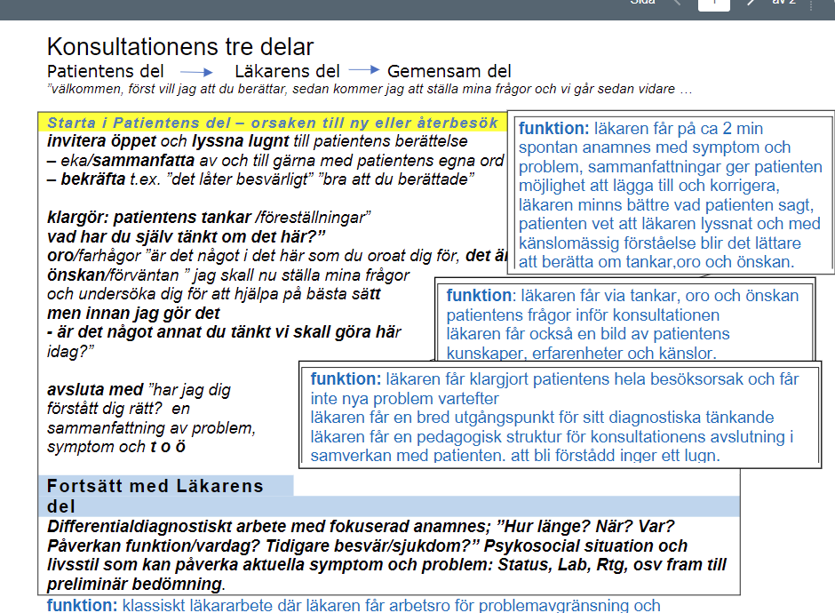
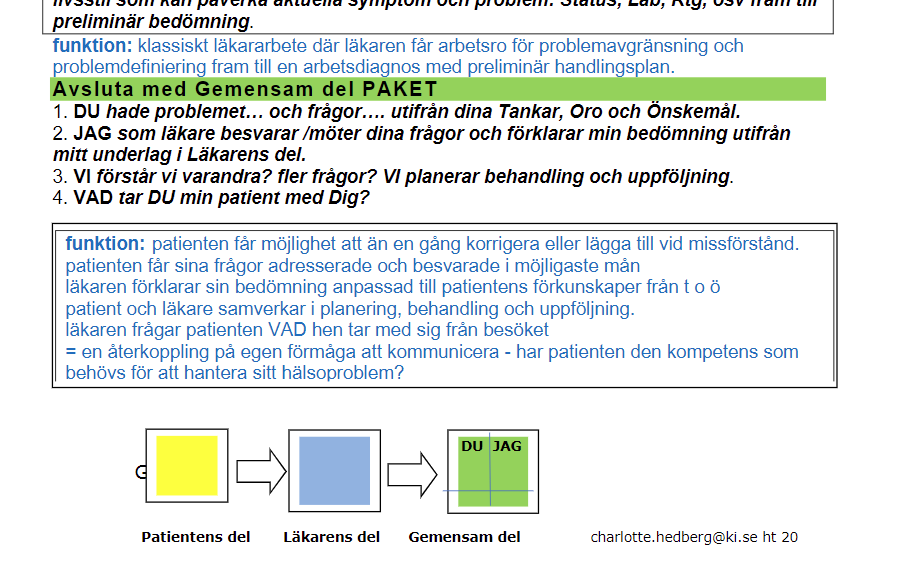

#### Allmänt

|  |  |
| ------------------------------------------------------------ | ------------------------------------------------------------ |
|                                                              |                                                              |

#### Patientens del

!! DE ENDA FRÅGORNA MAN STÄLLER PÅ PATIENS DEL ÄR: tanke oro önskan

Öppen fråga

* Vad kan jag hjälpa dig med idag

Berkräftande

* Vad besvärligt, ont i magen ett par veckor
* aha så du tänkte att det var den vanliga magkattaren, stressigt ja

Tankar

* Var det ngt mer du tänkte det kunde vara?
  * du kunde tänkte åp din gastrit och på skaldjuren
* Har du sj några tankar om vad det kan vara?

Oro

* Det är också bra att veta om d ngt spec du oroar dig för
  * pappa dog i magcancer i denna ålder, det spöket finns där också
  * Då förstår jag att du vill ha svar på det, du hade en far som fick cancer i den åldern
  * vad bra att jag vet det

Önskan

* Ngn speciell undersökning som du tänkte på när du kom hit
  * gastroskopi
  * då förstår jag, att du önskade en gastroskopi
* Vad hade du önskat att få ut av ditt besök idag? 

Sammanfattning

* Om jag förstår dig rätt, 
  * har du haft besvärligt 2 veckor med magonda. Du känner igen att magkatarr du har haft av o till. Magkatarr kan det vara för att det varit stressigt åp jobbet. Men sen har du varit på restaurang, där det skulle kunna varit en maginfektion. Kanske är detta du oroat dig för, är också ngt du behöver gå till botten med, att din pappa fick cancer i samma ålder som du. Din hustru dkte att en gastroskopi var bästa sättet att gå vidare med detta. 
* Detta försäkrar sig om, innan mna går vidare till läkarens del

#### Läkarens del

***Preliminär planering***

* Hypoteser
* Akut allvarligt: Röda flaggor, viktgt att fråga efter
  * blod i avföringen
* fokuerade frågor
* status
* lab: kanske ngt aktu labb på mottagningen
* utredning
* för o emot

#### Avslutande del, gemensam del

**Struktur**

* **Du delen**: Tankar, oro, önskan
* **Jag delen**: undersökningsfynd, min hypotes, samt hur jag ska handlägga dig
* **Vi delen**: Vad tar du med från besöket

**Sammanfatta**

* Du kom hit idag, hade fråga om det kunde vara magkatarr, orolig för cancer, och gastroskopi för att utesluta cancer
* Jag när jag går igm dig och tittat på detta, är det inte cancer som är det mest sannolika här, men vi kommer att gå vidare med detta
* Men det mest sannolika är att du fått tillbaka din gastrit, din magkatarr,
* Därför ska du få en behandling för detta, du kommer få en liten utredning, både med avföring och blodprover

**Vi rutan**

* Hur tänker du om det Leif?
* Beroende pp vad dina prover visar och hur du reagerar pp behandlingen, kommer vi att kunna evaluera om det blir en slang underskning

**Vad tar du med dig från ditt besök idag**

* Vad kommer du berätta för din fru när du kommer hem idag. 
* Jag förstår att du fått mkt information nu, men för att säkerställa att jag fått med allting, kan du säga vad du tar med dig från det här besöket?

