## Biases

### Detection

### Selection

### Measurement

### Publication

### Confounders

## Studiedesgn

### Olika studiedesigns

***RCT***

* Fördelar 
  * Prsoepktiv design
  * exponering kan följas o dokumenteras successivt 
  * ingen recall bias
  * minskar risken för confounding
  * (1 p) randomisering medför att risk för confounding/bias minimeras (1 p) blinda vilket motverkar ’förväntans effekter’
* nackdelar
  * Strikta inklusionskriterier ger låg generaliserbarhet, 
  * Begränsad uppföljning och storlek ger ingen möjlighet att upptäcka sällsynta eller sena biverkningar, 
  * Hög kostnad

***Observationsstudier***

* Fördelar
  * Möjligt att studera ovanliga sjukdomar
  * /inte etiskt genomförbart att randomisera vissa exponeringar (tex snusbruk)/
  * kostnadseffektiva/
  * möjligt att studera långtidseffekter

***futility***

* interimsanalys visar att en fördel för någondera behandlingen inte kommer att gå att visa (futility)

!! ***PICO***

Patients = individuals with a systolic blood pressure of 130 mm Hg or higher and an increased cardiovascular risk, but without diabetes. (0.25 p)
Intervention = systolic blood-pressure target of less than 120 mm Hg/Intensive treatment. (0.25 p)
Comparison = systolic blood-pressure target of less than 140 mm Hg/Standard treatment. (0.25 p)
Outcome = any of myocardial infarction, other acute coronary syndromes, stroke, heart failure, or death from cardiovascular causes. (0.25 p)

***Analysera bortfall***

* Man kan undersöka om baseline data skiljer mellan bortfallpatienter och patienter som genomförde hela studien. 
* Ser man ingen skillnad ökar sannolikheten att bortfallet är slumpmässigt/Man kan genomföra känslighetsanalys genom att ersätta bortfallet med utfall vilka motsäger en effekt av behandlingen och se om en positiv effekt av behandlingen kvarstår.

### Föreläsning

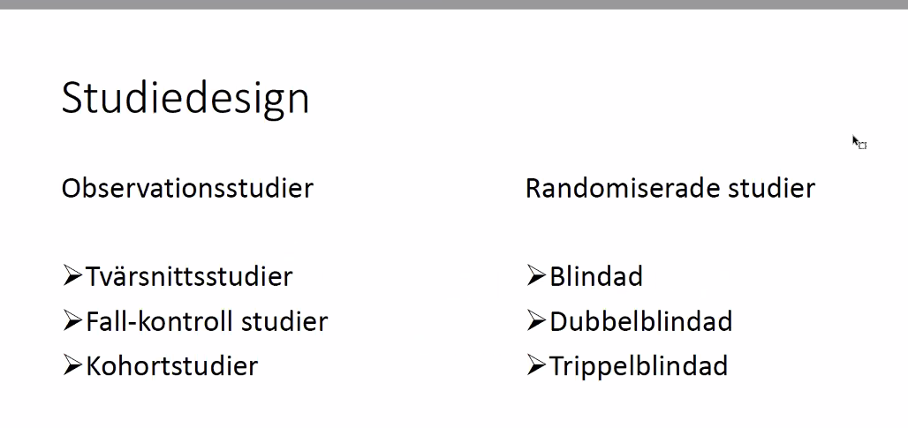

* Observationsstudier inklduerar kohortstudier prospektivt, fall-kontroll studier, tvärsnittsstudier
  * kan ha retrospektiva kohortstudier etc. Kan följa individer genom register. 
* Randomiserade studier: avgörande för farmaka
  * de randomiserade studierna är ofta blindade: pat vet itne om den fått lkm el gällande behandlingen
  * Dubbelbind: de som genomför vet inte vilken beh pat får
  * truppelblind: behåller blindning när studie klar o när man samlar in  o analyserar datat, först efter att analyseran är  färdiga som man bryter koden vilken grupp A eller B varit
  * Randomisering, får två grupper lika varandra, med avseende bakgrundsinformtion
  * Man gör alltid en tabell 1 där man visar BG info på patienterna v.g. armarna
  * om alla rökarep å en grupp att d inträffar, kan man justera för det, men det är osannolikt med skeva fördelningar.
  * Är studien tillräckligt stor kommer randomiseringen vara god

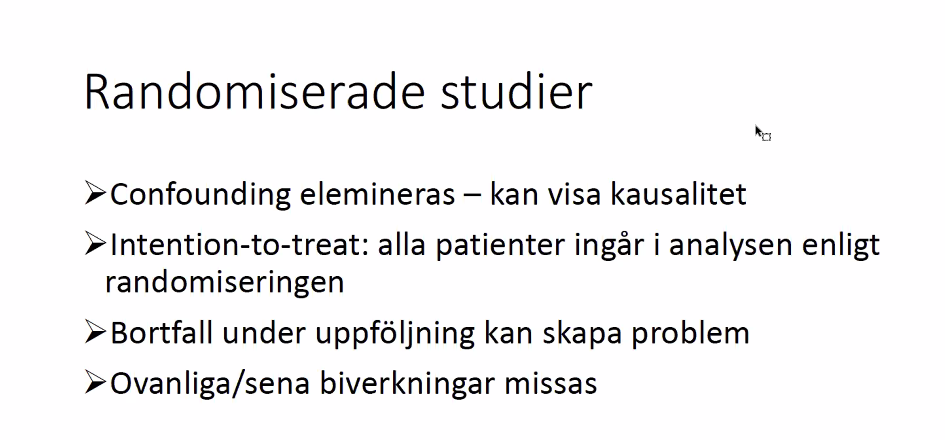

* Med confounders eliminerade att man får fram en kausalitet...??
* Om botrfall stort, blir evidensen sämre. 
* En pat kan slumpas t beh A, och efter en tid bill få den andra beh, kan hoppa mellan armarna, o när man aalyserar studien blir det intention-to-treat. 
  * Om personen slumapts t grupp A kmr remain analytiskt i grupp A, även om pat bytt t Grupp B
* Randomisering finns restriktioner
  * ovanliga eller sena biverkningar svåra att se v.g. behandling
  * man dimensionerar dessa studier för att ha tillräcklig power för en sann effekt, gör inte större än behöver
  * ovanliga biverkningar som man bara ser på hela populationen upptäcks inte med randomiserade studier. 
* mer v.g. inteintion to treat
  * om det är att pat hoppar av o inte fullföljer studien, inkluderas i ITT. om studietiden är 2år ebehandling 
    * om det är 30% av inkluderade pat som uitne fullföljt 2år kommer resultaten vara mkt mer osäkra
    * bortfallet kanske stort i en grupp o andra gruppen går bra -> blir problem
    * finns statistiska metoder att återskapa hur det skulle gått för patienten om de varit med, men kan inte garantera att resultaten är helt kausala eller sanna
    * har man strot botrfall i randomiserade studier är det ett problem. 
  * Botrfallet är lika illa för ITT och per-protokoll, ingen skillnd: på per protokoll att man analyserar datat utifrån vilken behandling patienten fått, om man bytt t grupp B är man grupp B. 
  * ITT är den huvudsakliga resultatet man tar ut av studien )vanlgitvis) och kan komplettera med per protokoll

***Observationsstudier***

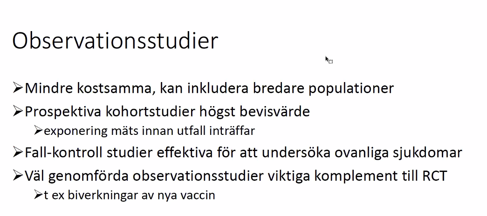

* Man kan göra detta på hela populationer
* Prospektiva kohortstudierna har det högsta bevisvärdet bland observationsstudierna
  * för att man kan mäta exponeringar och följa fram i tiden v.g. utfall
* ***Fall kontroll***: används för att titta på ovanliga sjukdomar
  * testiscancer 300 fall varje år, att man tar ain alla dessa 300 och matchar med lika stort eller större antal kontroller utan cancer
  * skulle studeras i en kohort, skulle man behöva en gigantisk kohort för att studera testikelcancer, för att få den frekvensen
  * en fall-kontroll kan ha under vissa förutsättnignar bättre bvisvärde än kohortstudier
* Dessa observationsstudier är viktiga komplement till randomiserade studier: vissa saker kan inte randomiseras
  * e.g. risker alkohol eller rökning
  * att det är oetiskt att randomisera till olika exponeringar
  * väl genomförda observationsstudier: en viktig sak man kan studera är biverknignar aav nya vacciner som unförs i popuiationen 

***Statistiska mått***

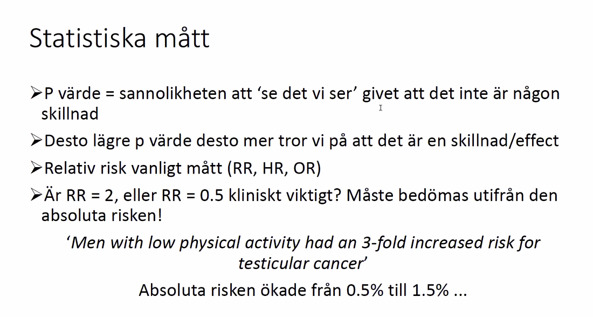

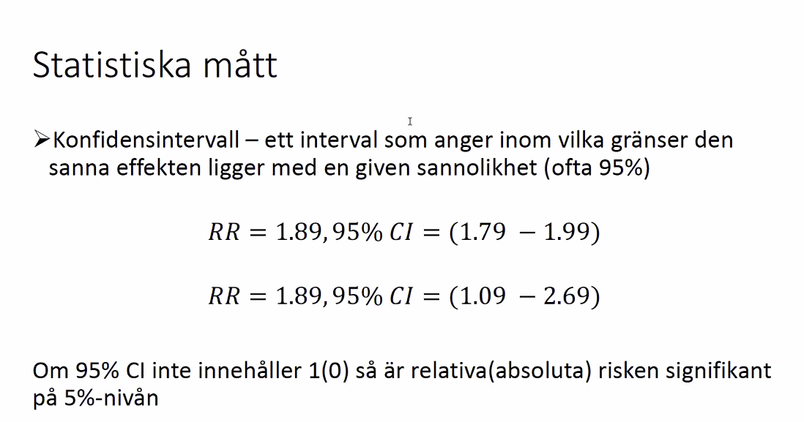

* att den sanna relativa risken ligger inom detta intervallet med 95% säkerhet 
* Notera att den måste vara >1 eller <1, den ska inte inkludera 1 överhuvudtaget, och inte bara överlappa o passera 1. 
* Bred konfidens har lägre statistisk power. 
* Är det kofidensintervallet för absoluta risk(skillnad?) är det 0% som är ingen skillnad, för RR är det 1 (i.e. kvoten 1)

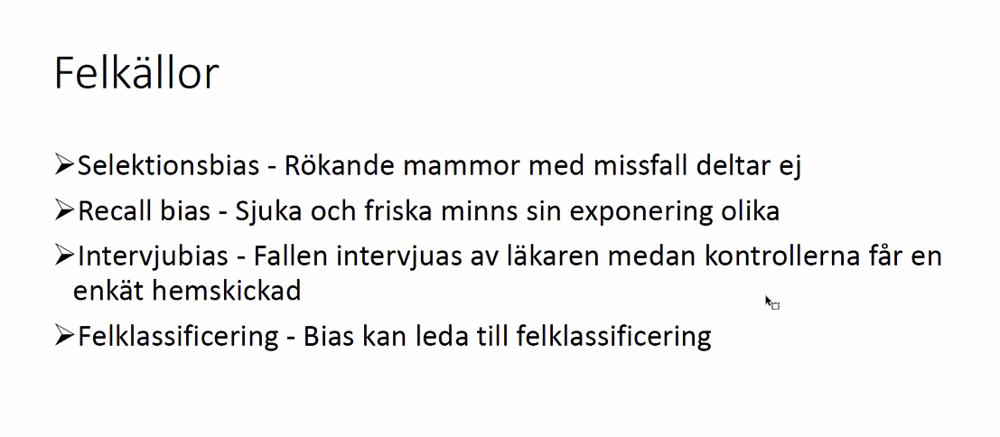

* Felklassificering: att sätta en diagnos är inte alltid självklart, problem med hur man satt d iagnosen om den varit consistent, etc. 

***Confounders***

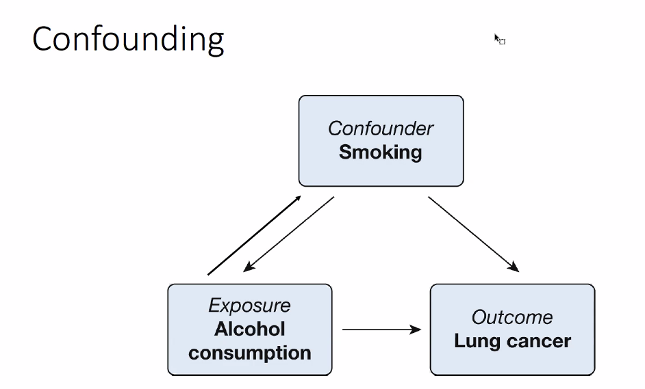

* Med stor epidem studie, register, enkäter, samlar in mkt data, då finns fortf möjlighejt för confoundings. 
* saker som inte samlades kan mkt väl vara confounders
* i observationsstudier kan man absolut inte säga att man korigerat för alla ocnfounders, utan det finns ett legitimt problem med detta.

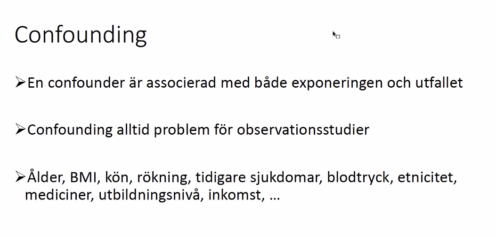

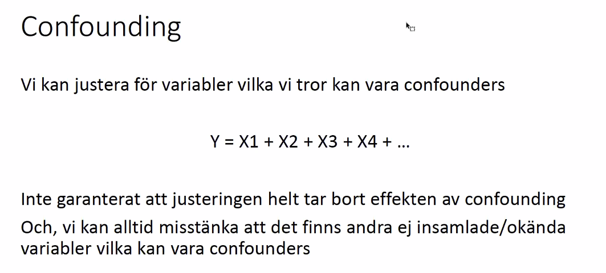

* Medvetna om att i observationsstudier mkt som gått in o påverkat resultatet, förståelse för hur det kan ha gått snett. 

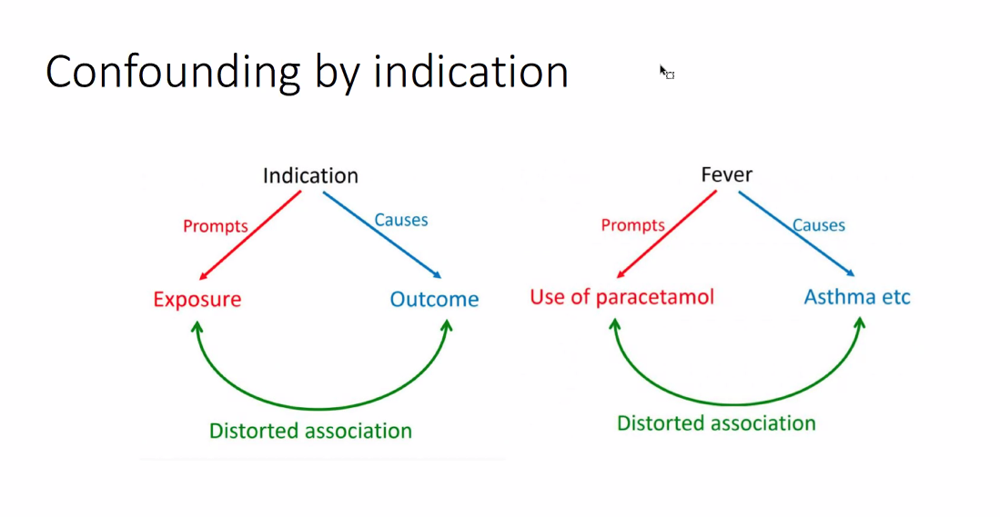

* Det är inte smärtstillande tablett som gör att vi drabbas av astma, utan en bakomliggande indikation att vi tar tabletten och astman. 

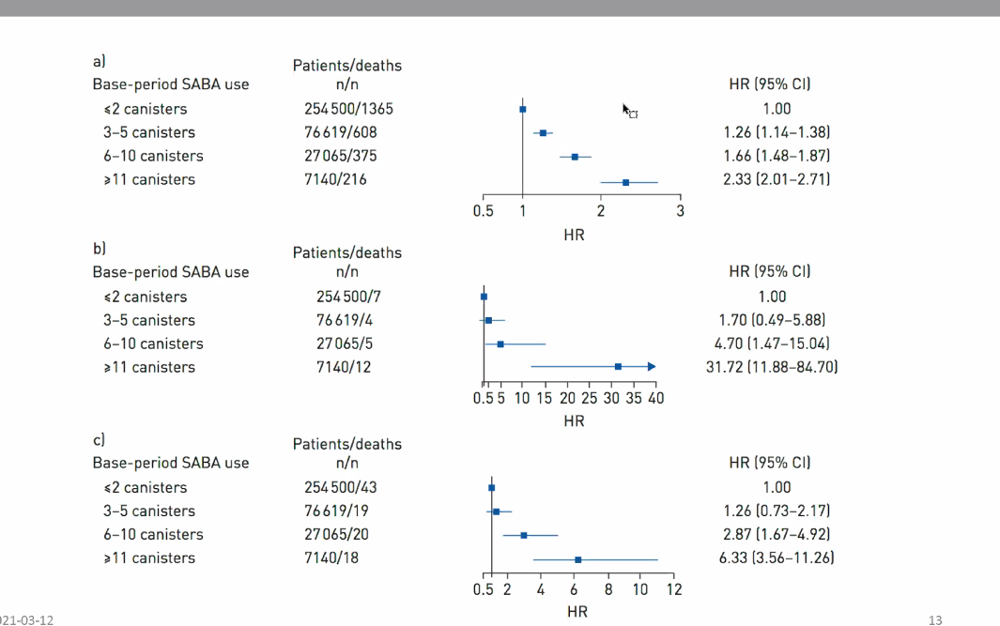

* kategoriserat astma diagnos o antalet SABAin halatorer som använts
* Sen titatt på risken att avlida, överlevnadsmässitg
* Ju mer SABA man använt under baslinjeåret, ju högre risk att avlida framöve.r 
* Hazard-ratios har man beräknat med cox-regression
* !! Detta är confounding-by indication: ju sämre kontroll man har över sin astma desto mer canisters man använder. Därför är det inte astma självt som orsakat döden utan det är ngt annat bakomliggande. 

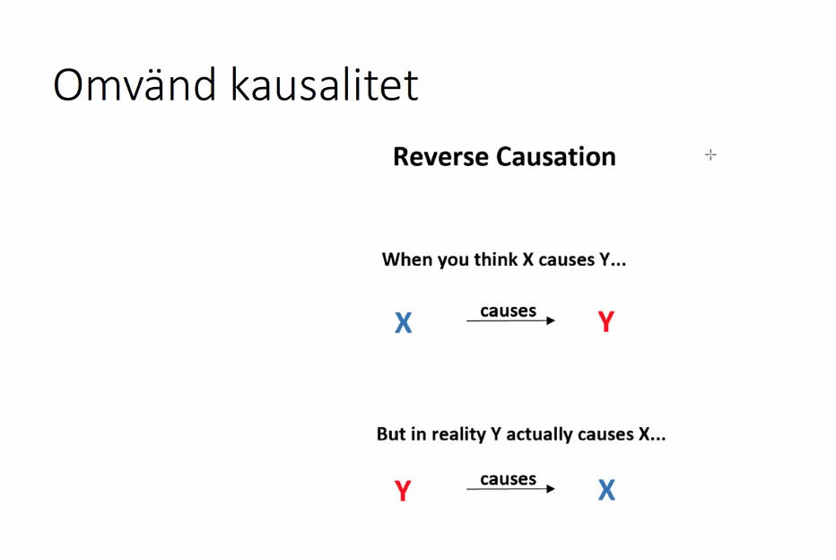

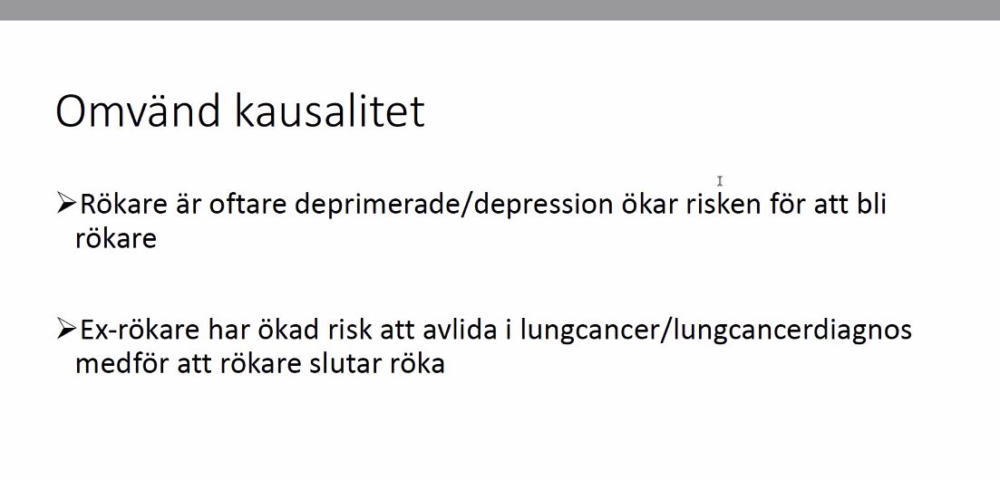

* I observationsstudier ska alltid tänka på omvänd kausalitet
  * Prospektivt har omvänd kausalitet mindre vikt i sig, att den är mindre osannolikt
  * En tidsserie alltså, att man följer något över tid, ngt längre fram i tiden inte påverkar något bakåt i tiden. 
  * Typ att cancer pga gener, eller gener pga cancer, att det är cancer pga gener mer sannolikt inte att cancern påverkat ens gener...

***Tvärssnittsstudie är en observationsstudie***: att man samlar in män med diabetes eller män utan diabetes o frågar de idag hur mkt de motionerade denna veckan och jämför nivån på motion, associerat med risken med diabetes. Att man på ett tillfälle mätt exponering och utfall. Man har ingen tidsskillnad när man tittar på exponering och utfall. 

Hazard ratio tittar på utfall ÖVER TID. en vanlig modell är cox-regression, utav den får man en HR, det är en kvot mellan två hazards (hazard är en gradient som man beräknar fr regressionen). Detta är tekniskt sett är en relativ risk.. men inte RR per se där man tar kvoten av två abs risker. 
