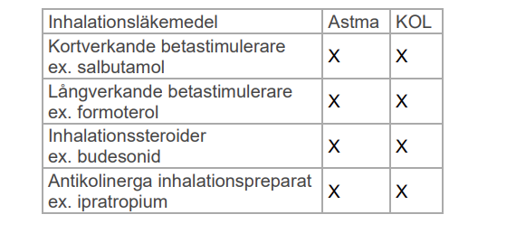

***Presentation***

***Etiologi och patofysiologi***

***Epidemiologi***

***Kliniska kännetecken***

***Utredning och handläggning***

***Behandling***

#### Diagnoser

Andfåddhet
Andningsbiljud
Blodhosta
Cyanos
Heshet
Hosta
Andningssvårigheter
Nästäppa/snuva
Ont i halsen

## Andfåddhet

### Astma

***Behandling***

* Kontrollera inhalationsteknik vid utebliven effekt
* Över 12år
  * **Steg 1 i behandlingen**
    * **Bufomix**: LABA + ICS (kloka lista 2021)
      * Man har alltså gått över till att ge ICS och LABA vb. Så även om besvären är sporadiska så ska man ge LABA + ICS
    * Andrahandsvalet är att man kan ge
      * ICS + SABA, om patienten inte pallar pulverinhalatorer typ.
  * **Steg 2 i behandlingen**: kontinuerligt eller återkommande astmabesvär <2gg per månad. 
    * ICS + LABA vb 
  * **Steg 3 i behandlingen**: Kontinuerlig beh kvarstående astmabesvär
    * LABA + ICS kontinuerligt
* **6mån-5år**
  * Lindrig infektionsutklöstabesvär, vid behov: SABA vb, salbutamol
  * Episodisk astma, 10d beh: 
    * ICS flutikason
    * andra hand: montelukast (leukotrienantagonist)
  * Konsultera barnläkare om besvär över 10d; om behov av beh över 4ggr per år, kontakt med barnläkare indicerad. 
* **6-11år**
  * **Steg 1**: astmabesvär enstaka ggr i månaden
    * SABA: salbutamol
    * om svårighet, kan ge en SABA med spacer
  * **Steg 2**: kontin el återkommande astmabesvär över 2ggr per månad
    * steg 1
    * tillägg ICS: budesonid
    * andra hand: leukotrienantag, montelukast
  * **Steg 3**: kvarstående besvär, kontakt barnläkare. 

### Allmänt

***Fysiologi***

* Andningsfrekvens: normalt 10-16
* 

### KOL

***Presentation***

* På akutmottagningen bedömer du en 67-årig kvinna med känd KOL. Hon har sökt akuten pga dyspné sedan en vecka tillbaka. Hosta har hon sedan tidigare pga sin kroniska bronkit, men den har blivit värre och nu hostar hon upp rikligt med gult slem. Rökstopp sedan 5 år och medicinerar med tiotropium (Spiriva®) och vid behov salbutamol (Ventoline®). Hon har aldrig tidigare haft behandlingskrävande KOL-exacerbation. AT: Orienteradx3, inga pittingödem, ingen cyanos. 95% saturation. AF 22. Hjärta auskulteras utan bieller blåsljud. Puls regelbunden 92 slag/min. BT: 135/85 mm Hg. Lungor: Rikligt med sibilanta rhonki. Patienten är tydligt förbättrad efter inhalation med salbutamol och ipratropium (Combivent®). Du ska nu skriva hem patienten från akuten. Vilken läkemedelsbehandling är bäst i detta fall? Endast ett svar ska markeras (1p) 

  * Kortisonkur + antibiotika.. gamla tentor. 

    * missfärgat slem relateras med infektion i luftvägarna. 

      

***Patofysiologi***

* Akuta exacerbationer
  * Oftast infektionsrelaterade: haemofilus, moraxella, pneumokocker

***Kliniska kännetecken***

* Barrel-chest
* Rökare lång tid
* Dyspne, svårigheter att få luft. 

***Utredning och handläggning***

* Spirometri: reversibilitetstest är obligat. 
  * FEV1/FVC <0.7: bekräftar persisterande luftflödesbegränsning
* CAT: Copd assessment test
  * Inkluderar frågor om hosta, tryuck över bröst, aktiviteter, sömn, energi, ansträngningsrelaterad dyspne. 
* mMRC, modified british medical research council
* GOLD-klasser: 
  * GOLD1: FEV1 >80% predicted, mild KOL
  * GOLD2: FEV1 50%<x<80%
  * GOLD3: FEV1 30<x<50%
  * GOLD4: FEV1 <30%, väldigt vår

***Behandling***

* Målet med behandlingen är att minska symtomen, förhindra exacerbationer och förbättra livskvaliteten
* Antikolinergika: funktionen med antikolinergika är att acetylkoline (ACh) i luftvägarna stimmar glattmuskulatur till kontraktion, aktiverar inflammatoriska celler, mucinproduktion. Med antikolinergika får man alltså en net dilaterande effekt, antiinflam effekt, samt antimucin effekt. 
* **Underhållsbehandling**
  * GOLDA: lindriga sporadiska symptom, 0-1 exacerbation i *öppenvård* senaste året
    * SABA vb
    * SAMA vb: kortverkande antikolinergikum, kombineras inte med långverkande
  * GOLDB: betyande symptom, 0-1 exacerbationer i öppenvård senaste året
    * LAMA underhållsbehandling, 1a hand: 
    * 2a hand, LABA
    * 2a hand, LABA + LAMA
  * GOLDC: Lindriga symptom, >=2exaerbationer i öppenvård, eller >=1 slutenvård, senaste året
    * LAMA underhåll, 1a hand
    * LAMA + LABA, 2a hand
  * GOLDD: betyade symptom, >=2exacerbationer öppenvård eller >=1 slutenvård, senaste året
    * LAMA + LABA, 1a hand
    * LAMA + LABA + ICS, 2a hand
* ***Akutbehandling***
  * Syrgas på grimma eller mask: notera att man är rädd för koldioxidretention, så om man ska sätta in syrgas, måste den stiga syrgas inte så högt. 
  * Bronkdilaterare
    * via nebulisator inhalation
    * Ventoline (salbutamol, i.e. SABA) + ipratropiumbromid (atrovent) + NaCl
    * Vid problem inhalation: inj terbutalin (bricanyl)
  * Steroider
    * T betametason 6x0.5mg, eller predn
  * Vätska
    * RA 1L om klin dehydrering, och eller cirk instabilitet
  * Diuretika
    * inj furix, 2-4mL vid tecken högersvikt
  * Antibiotika
    * vid missfärgade upphostningar + ökad dyspne: oavsett infektionstecken (i.e. även om pat inte ter sig infekterad) är antibiotika indicerat
    * amoxicillin eller doxycykllin
    * 5-7d
    * 2a handsval amoxiklav (spectramox) eller cefotaxim
    * svårt sjuk: bred täckning, inj piptaz
  * Svårt eller livshotande anfall
    * IVA-läkare
    * assistera vent med mask o blåsa
    * vb inj terbutalin
    * sista hand adrenalin var 3e-5e minut
    * övervak: EKG, puls, andning, BT
  * Allvarlig försämring KOL
    * svår KOL, PaCo2 >6.5, pH under 7.35 o AF 25, överväg NIV
    * livshotande insuff trots behandling, sat under 90%, paco2 >9, starta NIV (inte CPAP) eller respiratorbehandling
    * 

### Fall

#### Fall 1

***Presentation***

* 62-årig man
  * , änkeman sedan 10 mån (hustrun död i ca mammae) 
  * fd rökare, 
  * m tabl beh hypertoni, enalapril 10 mg x1 och amlodipine 5 mg 1x1 (ACE-inhib samt Ca-antag) i övr väs frisk. 
  * För 5 mån sedan debut av andfåddhet i samband med ansträngning. 
  * Upplever att luften ”tar slut”, får anstränga sig för att få luft, det hela går i regress efter några min vila. 
  * Negerar 
    * bröstsmärta, 
    * ortopné, 
    * paroxysmal nattlig dyspné, 
    * hosta, 
    * feber eller ngn påtaglig viktnedgång. 
  * Pat själv orolig för lungmalignitet

***Etiologi och patofysiologi***

***Epidemiologi***

***Kliniska kännetecken***

***Differentialdiagnoser***

* Kardio/pulmonell etiologi,
* KOL,
* Interstitiell/annan lungsjd inkl malignitet,
* Hjärtsvikt/angina,
* Anemi 

***Utredning och handläggning***

* **Anamnes**
  * **Tobak + alkohol**
  * **Avseende andningssvårigheterna**
    * debut: 5 mån sedan
    * karaktär: tungandad, får ej luft
    * progression över tid: förvärrats
  * **Utvidgad andningsanamnes**
    * gå trappor: 1 bån
    * plan mark: 3 kvarter
    * annat ansträngande: lyfta
  * **Övriga lungsymptom**
    * Hosta
    * Hemoptys
    * Biljud astma el heshet
  * **Övriga kardiovask symptom**
    * bröstsmärta
    * ödem underben, fötter
    * tryck över bröst
    * nattliga symptom
  * **Övriga allmänna symptom**
    * viktnedgång
    * nattliga svettningar
    * feber
    * trötthet
  * **Symptom avseende anemi, blodförlust**
    * melena
    * tidig. anemi
    * gjort koloskopi
  * **Hjärtkärlsjd riskfaktorer**
    * HT
    * diabetes
    * högt kolesterol
    * inaktivitet
    * tidg hjärtsjd: klaffar infektion
  * **Efterhör arbetsexponering**
    * tidg exposition ev
  * **Aktuell medicinering**
  * **Annan exponering**
    * resa
    * smitta
* **Status**
  * **Kardiovaskulär us**
    * Inspekterar nagelbäddar
    * karotider, 
    * !! **halsvensfyllnad**, 
    * stas
    * dekliva ödem
    * palp ictus
    * **Hjärtauskultation**: systematiskt, 4 lokalisationer
    * auskulterar karotider
    * pulspalpation
  * **Lungor**
    * Palpation vid inandning
    * Auskulterar: jmfr sidor o nivåer, fullt andetag
    * Perkussion: 
      * jämför sidor, 
      * 3 nivåer
    * !! **Saturation**
  * **Lymfkörtlar**
    * halsen
    * supraklavikulärt, infraklavikulärt
    * axiller

***Behandling***

***Syfte***

* Genomföra en patientcentrerad konsultation med fokuserad anamnes hos patient med långvarig andfåddhet.
* Genomföra riktat och adekvat status cardiovaskulärt/pulmonellt
* Föra ett differentialdiagnostiskt resonemang, och mot bakgrund av detta ange grund för, och bibringa patienten underlag för, beslut om fortsatt handläggning
* Farmakologiskt samt ev basvetenskapligt resonemang
* Differentialdiagnoser
    * Kardio/pulmonell etiologi,
    * KOL,
    * interstitiell/annan lungsjd inkl malignitet,
    * hjärtsvikt/angina, anemi 

#### Fall 2 - Lungemboli

***Utredning och anamnes***

* Spontananamnes: 
  	* Vad söker du för? Kanske lite hårt?
  		* "Det låter väldigt besvärligt, bekräftande"
  	* Hur började det?
  		* Tre veckor sedan, stannar i trappan
  	* Liknande besvär tidigare: Inne i patientens del
  	* Sedan Tankar: Tänker att d förkylning
  	* Frågar inte efter Oro, utan förväntningar: 
  	* Oro: patienten spontant ger oro
  	* Sammanfatta: Om jag ska försöka förmedla o återkoppla din besöksorsak, sammanfattar väl. 
  		* Återkopplar Tankar, oro, önskan, 

  * Läkarens del, riktade med frågor
    	* Andfåddheten ter sig: sökorsaken
    		* Intervaller etc
    		* pat: bara vid ansträngning. Andas snabbare för att få luft
    		* Får ont i sidan när hon djupandar, kan inte djupanda då det gör ont
    		* När hon vilar sedan blir det bra. 
    		* Hon har tränat tidigare. 
    		* Sammanfattar: så fort du anstränger dig, känner du ansträngningen. '
    		* Förvärrande förlättande. 
    		* Hur långt behöver du gå för att sluta andfåddheten
    		* Peka var det gör ont, när du får ont
    	* Associerade symptom
    		* Bröstsmärta
    		* Smärta: bara smärtan sida revben
    		* Ingen trycksmärta
    		* Heshet
    		* Bara rethosta
    		* hJÄRTA inte oregelbunden
    		* Ingen B symptom
    		* ibnga dekliva ödem
    		* inga tidigare astma
    		* P-piller sedan två år
    	* Allmänna symptom
    		* Illamående kräkning: inga
    		* Avföring normal
    	* Andra sjukdomar, tidigare sjd: tidg frisk
    	* Socialt: jurist, har barn,
    		* Känneru besvär i samband med arbetet? försöker fånga psykiatriska
    	* Tobak, alkohol: röker ej eller knappt alkohol. 
    	* Sammanfattar innan status
    		* Ansträngningsrelaterad dyspne. 
    		* Ingen smärtor, förutom smärtan vid sidan. 
    		* Förbättrar och försämrar. 
    	* Nämner inte du delen med tankar oro önskan. 
  * **Status**
     * Saturtion: Sjunker saturation när hon går. 
      * Sammanfattar efter status
      	* Baserat åp informationen han fått,  skulle vilja utreda lite mer för att vara på den säkra sidan
      	* Ber henne besöka akutmottagning. För att få svar på. 
      	* Skickar en remiss till akutmottagniingen, där de gör en bättre utredning på besvären och andfåddhet
      * Hur låter detta. 
  * **Gemensam del**
     * Troru det är ngt farligt: för lite information. Säger att du kommer få det farliga uteslutet på akuten. 
      * Ringer och bokar en transport
      * Kunskapsöverföringen:
   * **Vidare utredning**
      * Skicka för DT-lungartärer

  
  
  
  
  

## Bronk

### Bronkiektasi

***Definition***

* Irreversibel dilatation av bronker
* Pga destruktion muskulära o elastiska elementen i bronkväggen

***Patogenes***

* Mekanisk: obstruktiv
* Non-obstruktiv

## ! Lungemboli

### Allmänt

***Kliniska kännetecken***

* !! **Andningsfrekvens**: Den kan förändras
* 

***Utredning - IST-relaterat***

* **Anamnes:** Lyssna på spontananamnesen, för att man får då diagnosen direkt
  * Du söker pga andfåddhet i samband med ansträngnign och rethosta, 
  * Ju mer man sammanfattar, desto mer man läser en beskrivning för hur en lungemboli ter sig. 
* **D-dimer**: endast vid låg klinisk sannolikeht
  * När man har lång anamnes, är den särskilt dålig
  * Då är den falskt negativ. 
* ?? **Wells-score**: Värdet med denna
* !! **POX-promenad**: viktigt att göra detta
  * !! Patienten kan kompensera för syrgasnedsättning gm att andas lite fortare. 
  * Var kreativa, man kan sätta de på cykel. 
* // Tänk på allmäntillståndet, andningsfrekvensen kan vara det enda som är påverkat. 

***Åtgärder***

* Lägga in fragmin vid misstanke lungemboli, innan man uteslutit lungemboli..

### Fall

#### Fall 1

***Presentation***

* 51-årig kvinna, 
  * gift 2 friska barn, går på Friskis pass 1-2 ggr per vecka. anamnesen gallop för 20 år sedan, varit besvärsfri sedan dess avseende detta. Pollenallergi. Loratadin vb. I övrigt väsentligen frisk. Aldrig rökt. Sparsamt alkohol, vin til fest i övrigt Ramlösa. För 7 dagar sedan kört ned till Skåne för att fira släktings födelsedag. Åter till Stockholm för 3 dagar sedan. Körde hem på natten, vaknade sedan med smärta i höger axel/bakom nyckelbenet till höger ut mot axeln. Smärtan lättar något när patienten sitter framåtlutad, patienten har ej kunnat sova i natt på grund av smärtan i vissa lägen, vilken även exaecerberas vid djupandning. Senaste 2 dagarna erfarit tilltagande andfåddhet och hjärtklappning i samband med gång i trappor. Ingen bröstsmärta. Under vistelsen i Skåne erfarit rethosta vilken tilltagit. Fullgod ROM och ingen som helst palpömhet skuldra. 

***Utredning och handläggning***

* **Pat kommunikation**
  * Starta öppen fråga, bereder pat talutrymme för berättelse
  * Tankar, oro, önskan
    * klargör vad pat sj tänker kring symptom o problem
    * klargör pats oro kring symptom o problem
    * utforskar avad pat fill få ut av besöket
  * Bekräftar pat känslomässigt, verbalt, icke verbalt
  * gör rel sammanfatt
  * förklarr o motvierar för pat de riktade med frågor som ställs
  * förklarr o motiv utan med jargong, under klin undersök skeendet för pat
  * !!för vissar sig om att pat fått disk sina frågor o ger ytryumme för pat att ställa ev kompletterande frågor
* **Anamnes**
  * **!! Inhämtar info ang smärta**
    * debut (1 vecka sedan)
    * karaktär (molvärk, skärande rörelsekorrelerad smärta med inslag av skärande värk vid djupandning)
    * Progression över tid: tilltagit
    * Förvärrar o förbättrar: stillhet, lätt framåtlutad
  * **Inhämtar info avseende andfåddhet**
    * tilltagit under veckan
    * kaaraktär: jättedålig kondition
    * förbvärrar förbättrar: tagit bilen t jobbet, orkar ej trapport
  * **!! Inhämtar info om rethosta**
    * torrhosta
    * inga upphostningar
  * **Övriga hjärtkärl symptom**
    * bröstsmärta? nej
    * ödem underben, fötter? ej förvärrats
    * Tryck över bröstet?
    * Nattliga symptom?
  * **Tidg nuv sjd:**
    * väs frisk, op lapgalla 20 år sedan, mindre hiatus hernia
  * **Övriga allmänna symptom**
    * viktnedgång
    * feber
    * nattlgia svetningar
    * övriga infektionssymptom
  * **Tobak, alkohol**
  * **Socialt**
    * yrke, ef tidg yreksexposition, radon
  * Hereditet
  * Aktuell medicinering 
    * !! inkl receptfritt + naturläkemedle
* Status
  * Skulderregionen
    * inspektion
    * palpation
    * pat instruear vid palp stud att eg palpsmärta ej föreligger o att fullständigt ROM finns
  * Hjärta
    * Korrekt auskultationsteknik 4 punkter, ausk carotider, axill
  * Lungor
    * Inkl perkussion lungor
  * PP
    * dekliva ödem
    * halsvenstas
  * Lymfkörtlar
  * !! palpation underben
* **kliniskt resonemang**
  * Stud ska pres DD respnemang hos pat med möjlig 
    * pulmonell etiologi
      * LE, 
      * pneumothorax
      * malignitet
      * infektion
    * Muskuloskeletal etiologi
    * kardiell etiologi
  * samt i anamens ostatus ha identifierat risfaktorer o symptom för detta
* **bedömning o åtgärd**
  * Stud gör rimlig prel bedömning
  * MÅste ha lungemboli som arbetshypotes
  * Studentet föreslår adekvata åtgärder
    * remiss till akutmottagningen
* **Patientkommunikation**
  * Mot bakgrund av vad som framkommit i anamenso s status
  * motiverar  involverar patienten i fortsatt planering o beslutsfattande

#### Fall 2

***Presentation***

* 57åå man
  * "Till akutmottagningen söker en 57 årig man efter att han svimmade imorse vid frukostbordet. För 2 veckor sedan opererade han ett ljumskbråck. EKG enligt nedan. (OBS ej i skala)"

## !! Farmakologi

### ?? Astma (litet KOL)

#### Fall 1 astma+kol

* **Du ska ha astma/KOL-mottagning och förbereder dagens arbete. Behandlingen för de fyra patienter som du kommer att träffa innebär olika kombinationer av läkemedel. För varje individ nedan, välj det bästa behandlingsalternativet från listan. 3 p**
  * Kortverkande antikolinergikum eller SABA
  * LAMA + LABA+ SABA
  * SABA vid behov
  * Inhalationssteroid + LABA+SABA
  * Kortverkande antikolinergikum + LAMA
  * LAMA + LABA + peroral steroid
* **SABA vb**: Christoffer 30 år, icke rökare, astma, kattallergiker, känner symptom från luftvägarna någon gång per månad
* **inhalationssteroid + LABA + SABA**: Shirin 50 år, astma sedan barndomen. Utan behandling upplever hon astmasymptom i stort sett dagligen, särskilt vid ansträngning.
* **kortverkande antikolinergikum + LAMA**: Bengt 60 år, tidigare rökare. Har nyligen fått diagnosen KOL. Är oftast besvärsfri, men har besvärlig morgonhosta vissa dagar. Upplever inte andningsbesvär. I övrigt frisk, arbetar som mäklare
* **LAMA + LABA + SABA**: Märit 80 år, tidigare rökare. KOL med dagliga symptom av hosta och dyspné redan vid lätt ansträngning, en exacerbation för 9 månader sedan, en exacerbation för 4 månader sedan.

### !! Fall 2

***Presentation***

* Din nästa patient är en 19-årig kvinna som söker p.g.a. att hon upplever andfåddhet vid  ansträngning. Det framkommer att hon ända från mellanstadiet uppfattat att hon inte är lika löpstark som sina kompisar. Hon har också vid förfrågan märkt att det kan pipa lite när hon andas och kännas lite tungt i bröstet då hon blir förkyld. Hon har inte tyckt att andfåddheten besvärat henne så mycket, och det har inte förändrats över tiden, och hon har nog anpassat sin fysiska aktivitet utifrån detta, (får alltid flåsa när hon springer efter buss och i trappor t ex) men har nu börjat träna inför tjejmilen med några kompisar och märker att de övriga deltagarna orkar mer än hon gör och funderar kring detta. En i gruppen har ett syskon med astma och har rått henne att kolla om det kan vara det
* Hon har inga allergier. Du misstänker astma. Patienten får därför göra spirometri. Ur resultatet från undersökningen:
  * Parameter, Enheter, Referens, Patientens värde, % av referens
  * FVC L 4.58 3.34 72.9 %
  * FEV1 L 3.79 2.25 59.4 %
  * FEV1% % 83.5 67.4 80.7 %
* Hur bör du komplettera denna spirometri för att ytterligare klargöra diagnosen
  * Reversibilitetstest
* Beskriv FEV1
  * FEV1 är den volym som andas ut under 1 sekund i vid forcerad (maximal) utandning. Undersökningen kallas dynamisk spirometri (behöver ej ingå i svaret) 
* Patienten ska till att börja med ha två läkemedel mot astma. Välj de två bästa läkemedlen bland alternativen nedan. / Välj de två läkemedel hon bör ha bland alternativen nedan
  * SABA + Inhalationssteroid

### !! Fall 3

Till din vårdcentral kommer även Agata Ståhl som är 70 år. Hon har sedan många år besvär med hosta. Det är inte klarlagt huruvida hon har bedömts ha astma eller kronisk obstruktiv lungsjukdom. Hon har tagit med sig alla inhalatorer hon har fått via olika läkare under de senaste åren och undrar vilka hon ska använda

Vilka lkm indicerat vid astma o eller KOL

* SABA, e.g. salbutamol
  * KOL + astma
* LABA, e.g. formoterol
  * KOL + astma
* inhalationssteroider, e.g. budesonid
  * KOL + astma
* antikolinergika e.g. ipratropium
  * KOL + astma

