***Presentation***

***Etiologi och patofysiologi***

***Epidemiologi***

***Kliniska kännetecken***

***Utredning och handläggning***

***Behandling***

## Diarre

***Case report***

* osmotisk diarre, sorbitol relaterad t tuggummin: https://www.cfp.ca/content/65/8/557.short
  * Allt hade undersökts

***Presentation***

***Etiologi och patofysiologi***

* . Studies have established that the daily amount of fluid flowing through the small bowel is about 7–8 L. This fluid includes oral intake and saliva (1.5 L), gastric acid secretion and pepsin (1.5 L), bile and pancreatic secretions (1 L each) and enteric secretion (3 L). In the small bowel, much (approximately 90 %) of the water and electrolytes are reabsorbed with a net amount of 800–1,000 mL of fluid entering the colon. Finally, colonic reabsorption leads to 80–100 mL of water excreted with feces daily. It is enough that the daily fecal water output increases by a minimal amount (50–60 mL) to get loose stools, while a water excretion of 100 mL results in an increased stool weight above 200 g/day, which is considered the upper normal limit (see below) [3]
  * https://link-springer-com.proxy.kib.ki.se/content/pdf/10.1007/s11739-012-0827-4.pdf
* Resorberande kapacitet av tunntarm + kolon
  * On the other hand, a decreased water absorption by only 1–2 % of the total amount is sufficient to cause diarrhea in many disorders characterized by an impaired fluid and electrolyte absorption. 
  * Nonetheless, it should be emphasized that the small bowel and colon possess a huge fluid and electrolyte reabsorption capacity, thus providing a powerful salvage mechanism limiting the occurrence of diarrhea
* Generellt ang orsaker
  * Various causes (some of them listed in Table 1) may evoke 
    * inflammatory, osmotic, secretory, iatrogenic, and motility/functional pathophysiological mechanisms underlying acute or chronic diarrhea

***Indelningar***

* **Blodiga**
  * **Inflammatoriska eller exudativa**: eleverad WBC, occult eller frank blod eller pus i avföring
    * IBD (crohns, ulcerativ kolit)
    * divertikulit
    * ulcerative jejunoileit
    * invasiva infektiösa sjd
      * clostridium difficile (pseudomembranös kolit)
      * invasiva bakteriella infektioner (tuberkulos, yersinios)
      * invasiva parasitiska infektioner (entamoeba, giardia, cryptosporidium, cyclospora)
      * ulcererande viral infektion (CMV, HSV)
    * Neoplastisk sjd: kolorektal cancer, lymfom, villös adenocarcinom
    * Strålningsrelaterad kolit
* **Vattniga**
  * **Sekretorisk**: ofta nattliga (nocturnal), orelaterat t matintag, fekal osmotisk gap <=50mOsm/kg
    * Alkoholism
    * bakteriella endotoxiner: kolera
    * gallsaltmalabsorption
    * brainerd diarr: epidemisk sekretorisk diarre
    * kongenitala syndrom
    * Crohns sjd.: tidig ileokolit
    * endokrina tillstånd: hyperthyroidism
    * medicin: antibiotika, antineoplastika
    * mikroskopisk kolit: lymfocytär och kollagena subtyper
    * neuroendokrina tumörer: gastrinom, VIPom, carcinoid tumör, 
    * icke-osmotisk
    * irriterande laxativa: senna, cascara
    * postkirurgisk: kolecystektomi, gastrektomi, vagotomi, intestinal resektion
    * vaskulit
  * **Osmotisk**: fekal osmotisk gap >=125mOsm/kg
    * Kolhydrater malabsorptionssyndrom:  laktos, fruktor, sorbitol, xylotol
    * celiaki
    * osmotiosiak laxantia
    * osmotiska antacida: magnesium fosfat, sulfater
    * socker alkohol: mannitol, sorbitol, xylitol
  * **Funktionell**: 
    * diffas fr sekretorisk by virtue of hypermotilitet, !**rapid gut transit**!, mindre volymer, förbättring vid natt med fasta
    * IBS
* **Fettiga (steatorre i många men inte alla fall)**
  * **Malabsorption syndrom** (skada till eller förlust av absorptiv kapabilitet)
    * Amyloidos
    * kolhydrat malabsorption (late phase, tidigt är det vattnigt): laktosintolerans 
    * celiaki: late phase
    * gastric bypass
    * lymfatisk skada: hjärtsvikt, lymfom
    * läkemedel: orlistat, acarbose
    * mesenterisk ischemi
    * icke-invasiv tunntarmsparasit
    * post-resektion diarre
    * short-bowel syndrom
    * small bower bacterial overgrowth (>10^5 bakterier/mL)
    * tropical sprue
    * whipple's sjd (trophoeryma whippelii)
  * **Maldigestion**: förlust digestiv funktion
    * Hepatobiliära syndrom
    * inadekvat luminal gallsyror
    * exokrin pankreasinsufficiens. 

***Epidemiologi***

***Kliniska kännetecken***

* Malabsorption, maldigestion
  * For example, the presence of edema, overt malnutrition and signs ascribable to fat soluble vitamin D, K, A and E deficiency can altogether suggest either malabsorption or maldigestion diseases.
* Metastatisk carcinoid
  * Cramping diarrhea associated with 
    * skin flushing and 
    * hepatomegaly 
  * can be part of the clinical spectrum secondary to a metastatic carcinoid
* Exophtalmi: hyperthyroidism
* Episklerit: IBD
* Dermatitis herpetiformis: celiaki
* Avföring
  * Klassisk stetorrhe: 
    * stora volymer
    * bleka
    * oljig
  * Flytande avfröring
    * ökad metan eller gasinnehåll

***Utredning och handläggning***

*Akut diarre*

*Kronisk diarre*

***Behandling***

## Akutbuk

### Föreläsning

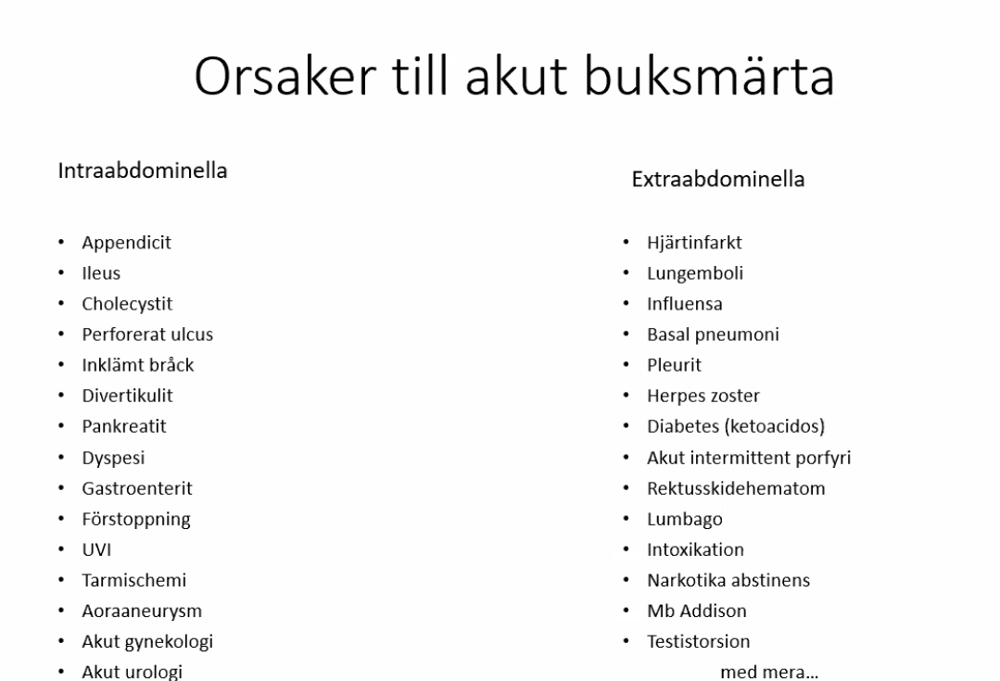

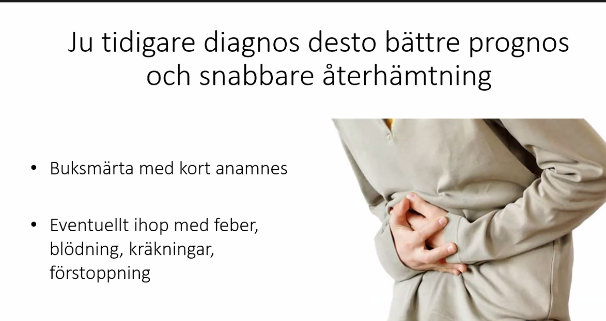

* Vad var det som gjorde att du kom idag, att det är en akutisering av smärtan, denna behlver ringas in för att förstå vad som hänt
* Associerade symptom: feber, blöningar, illamåpende, kräkning. förstoppning etc.

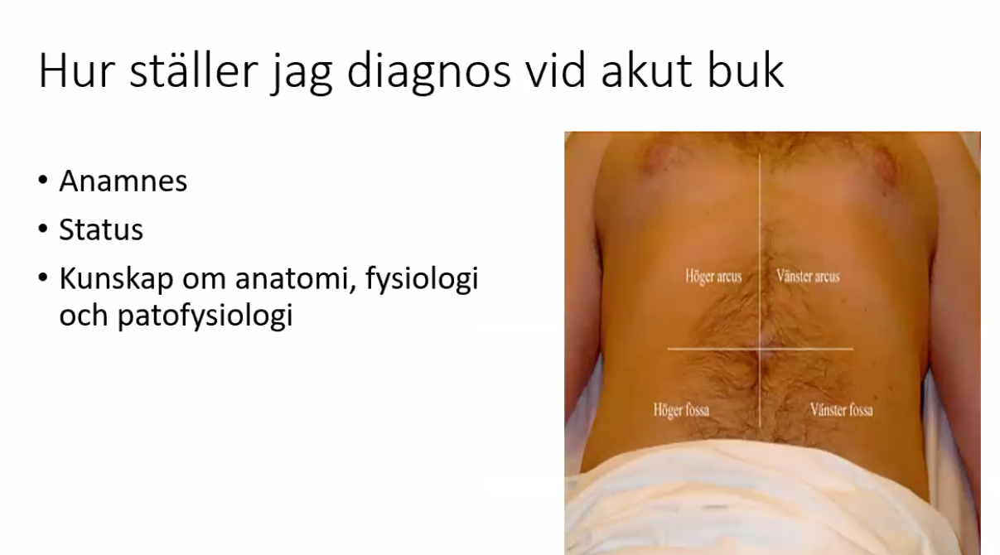

* Man pratar också ventralt, eller dorsalt (pankreas är djupt, aorta osså). Man är en tunna när man lokaliserar problemet inte ba 2D

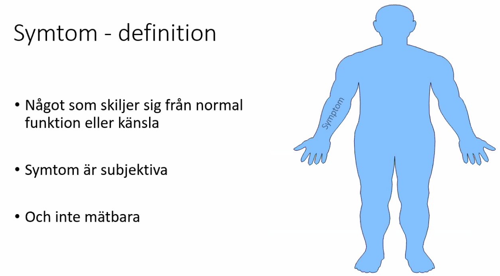

* Smärta svårt att mäta egentligen. Det är inte ngt som är absolut men referensram för patienten om den ökat eller minsskat. 

***Vad är det som gör ont***

* ***Tarmar***: uppspända ischemi; man kan ta biopsier av dessa som itne gör ont; däremot det som gör ont är om tarmen blåses upp för att smärta i tarm förmedlas av sträckreceptorer. 
  * tarm blåses upp vid ileus, uppspänds, oralt att spännas upp, göra ont
  * aborralt efter hindret kommer tarmen vara sammanfallen, ingen smärta därifrån
  * Om ileus: om inte löses, kan denna strypta delen av tarmen bli ischemisk, ischemisk smärta som är annan typ av smärta, stark smärta
* ***Bukhinna***: peritoneum, 
  * ***den är väldigt smärtkänslig***
  * ***ngt som retar bukhinnan*** peritoneum en inflam kan göra nont
  * ***kemisk retning***: galla blod etc kan reta o göra väldigt ont
  * ***Olika organ***: gallträdar, yurinvägar, panrkeas, 
    * ***patofys process***:_ inflammation, infektion, obstruktion, distention
    * Obstktion kan vara sten i uretärerna, kan vara obstruerad tarm i ileus
      * koliksmärtan fr organ med peristaltik
    * ***Gallvägar har ingen peristaltik***, osmotisk mekanism..: men själva ***GallBlåsan har muskulatur*** denna kramar ur gallan, där om utlopp gallblåsa obstrueras kan göra ont, koliksmärta.
      * Däremot sten i distala choledocus får man inte peristaltik smärtan koliksmärtan
      * alltså ductus cysticus kan göra ont, men inte hepaticus eller communis eller choledocus...
    * ***Annat***: 
      * blöda bukväggen muskulaturer, gör ont för att blodet tar volym spänner ut o gör ont, trycker på nerver gör ont, tryck som gör att musklerna i sig inte får det syer den behöver, kan få en ischemismärta i detta fallet. 
      * 

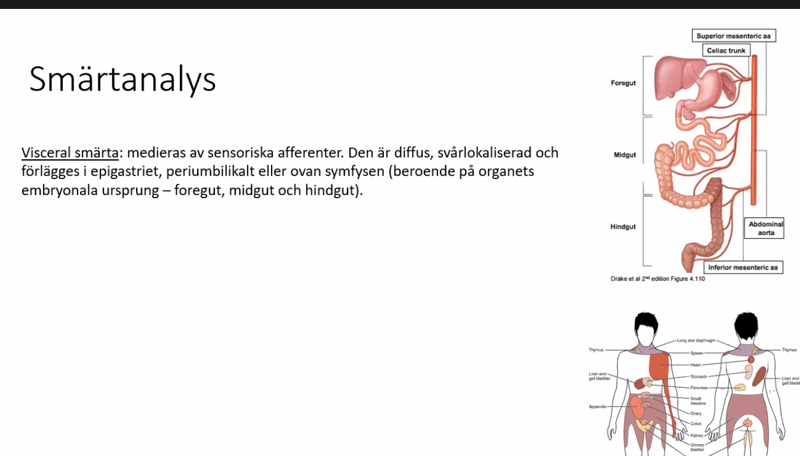

* ***Visceral smärta***
  * svårt att särksilja varifrån
  * upples som diffus smärta: typiskt fr detta
  * ***Fr embryologin är magtarmkanalen en lång tub: finns foregut, midgut, hindgut***
    * pat kan beskriva var smärtan lokaliserad för att sensoriska effetrenterna anlagts efter detta
    * ***Foregut***: munhåla till mitten pars descendens av duodenum, där kan pat få med svepande handen upp till i buken göra ont
    * ***mkidgut***: Om resten av duodenum till transversum, där är appendix, kan visa att viscerala smärtan sätter in mitten vispa runt att smärtan finns, runt naveln
    * ***hindgut***: resten av kolon, att bandformad smärta nedom umbilikus, typ som divertikulit, flesta sitter runt, bandformad smärta nedre buk, ovan symfysen typ. 
* ***Parietal smärta***
  * *Bättre lokaliserad smärta*
  * somatiska nerver
  * Exempelvis appendix: inflam inuti tarmen ofta obstruk. initialt ter sig diffus smärta inflam, mitten naveln för att den är visceral
    * sen när inflam sprider sig mot peritoneum serosan, då kommer man uppleva smärtan att somatiska nerver och den kan man lokalisera, och visa höger fossa
    * det är inte smärtvandring för att ngt flyttat på sig utan det är vilka nerver
* ***Referred pain***
  * *uppfattas vid ställe på avstånd fr källan för stimuklus*
  * typ gallblåsa retar diafragma, kan smärta strla mot axeln exempelvis, trots att den är lokalisread helt i buken tilsltåndet. 

***Patofysiologi***

* Handfull processer
* Gör ont
  * ***inflammation, infektion***: 
    * smärta som smyger sig på,
    *  eskalerar lpngsamt, 
    * 1d-2d. 
    * Molande ihållande, om når peritoneum kan den göra särskilt ont vid rörelse pat vill ligga still
    * Kan behöa ställa ledande frågor för att jfr med träningsvärk eller mensvärk hos kvinnor ex.
  * ***Obstruktion***
    * Ileus
    * Initialt får obstktionssmärta i organ tarm med peristaltik det går vågor med smärta till stoppet, att smrätan ter sig som pendlande smärta med toppar, och peristaltikvågen stannar av liten stund innan den fortsätter
    * Ihållande skarp smärta, en patiente med uppspänd buk o legat hemma hoppats lösa sig, beskriver smärta i vågor och nu är den plågsam ihållande smärta är det sent iförloppet, risk för att det blivit ischemi
  * ***Ischemi***: Svår smärta
  * ***Perforation***: 
    * ulcus ventrikuklärt som perforerat
    * det är inte ulcus som gör ont, utan när ulcus eroderat gm ventrikelvägg el tarmvägg, o kommer ut innehåll fr tarmen, att peritoneum är lättretat, magsaft eller galla, att det gör fruktansvärt ont
    * hastigt påkommande smärta
  * ***blödningar*** stora blödningar i buk 
    * väldigt retande för peritoneum
    * ihållande
    * påverkan på cirkulationen med stora blödningar i buken
  * // vi har omentum gardinen majus det är som ett plåster, att den försöker täcka o kapsla in inflammationen och bli en abscess, det är naturalförloppet om ngt går sönder, sen i bästa fall att kroppen lyckas häva detta självt om kroppen inte får behandling. Det kan ta månader
  * 24h fr appendicit säker på att det inte perforera, men inom 2-3d att den kan perforera. En hel del appendiciter ger sig t känna sen klingar spontant av. den appendicit som inte klingar av o den mde koliter med faecesklumpar som blivit stenoserade o kvar de inte självupplösande. 

***Smärtanalys***

* SOCRATES
* Debut
* Lokalisation
* Karaktär
  * intensitet
  * utstrål, förflutt
  * konstant el intermittent
  * rörelsekorrelerat
  * något som lindrar

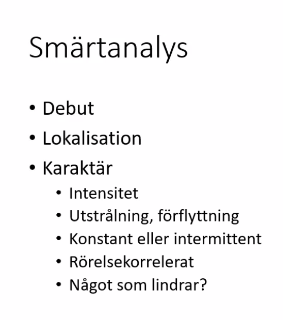

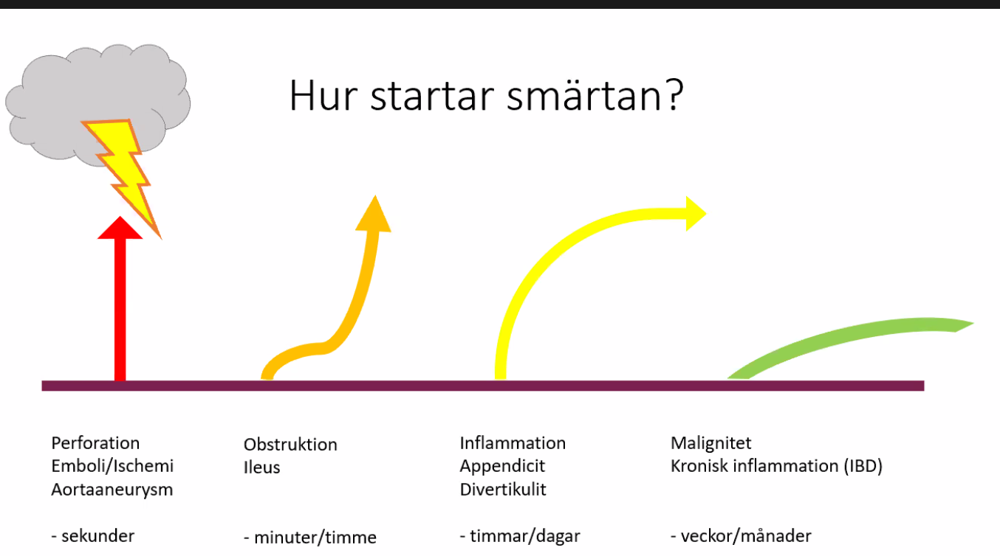

* Kroniska smärtorna är att patienterna känner igen smärtorna, men att det ändå är ngt som för de till akuten ofta att det är ngt som har hänt oroliga över, försök ta alla dessa tecken på allvar. 

***Smärtkaraktärer***

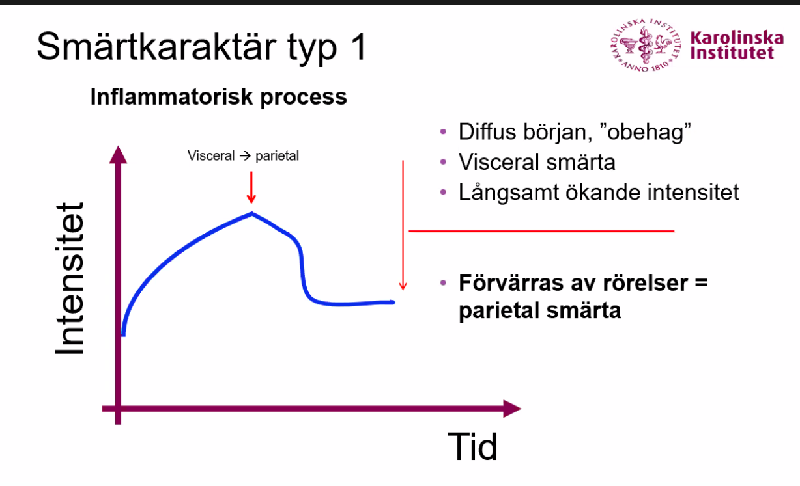

* När man säger rörelsesmärta: att hela organpaketet rör sig
* Peritoneum: perkuterar att man får tympanistisk eller dov ton, har patientn peritonit, gör det ont för att det knackar på peritoneum
  * har vi konstaterat att det är peritonit överallt, behöver inte palpera vidare, 
  * !!! peritonmitsmärtan är enkel att diagnosticera med lätt rörelse, perkussion

***Smärtkaraktär 2***

* 

***Smärtkaraktär 3***

* Koliksmärta, kontinsmräta men att den har toppar...

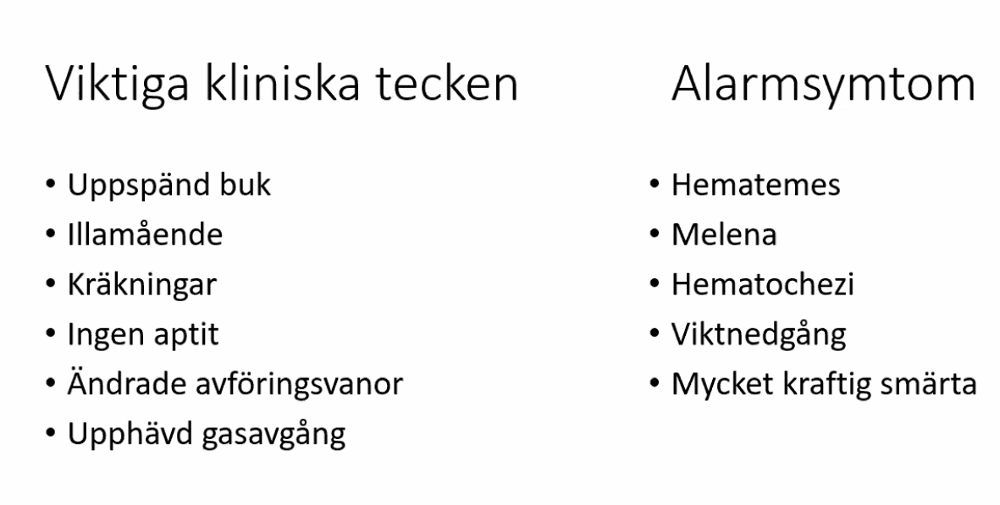

* Man frågar om pat sj tkr att den är uppspänd.
* Uppspänd buk: vätska gas samlas i tarmen
  * ascites
  * blödning
  * ...
* Om ileus att man tar när kom kräkningarna i relation till smärtorna att det kan vara ileus mkt oralt, högt upp, eller kolonileus är sent med kräkningar
* Hematochezi: är färsk blod, då ska man göra gastroskopier.

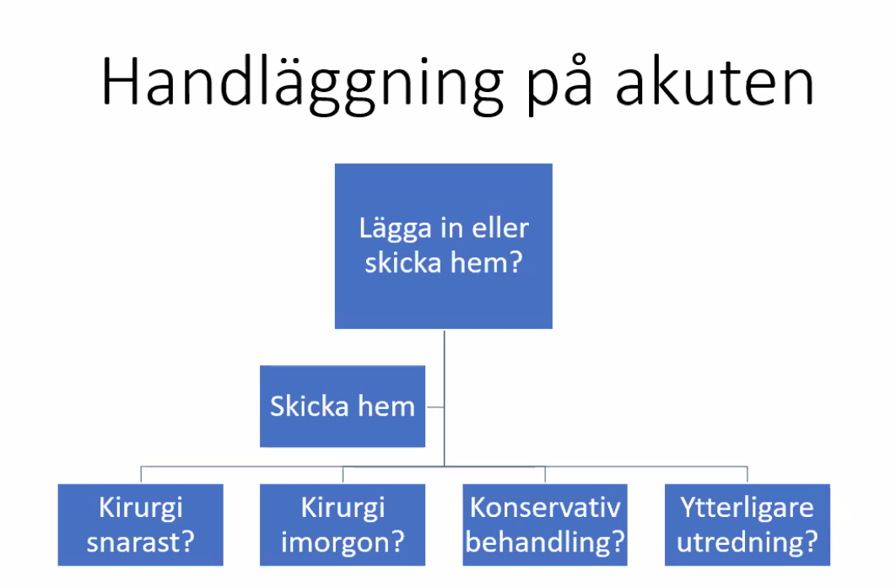

* Kräks blod att man skickar direkt till gastroskopi med beredskap operation. 

### Fall

#### Fall 1 - ileus

| 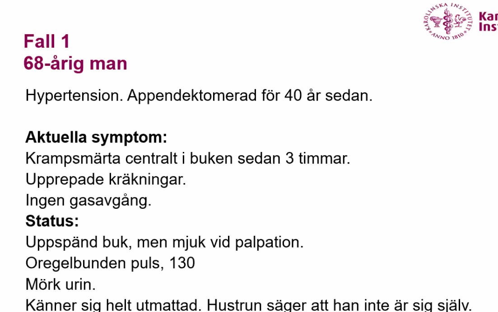 | 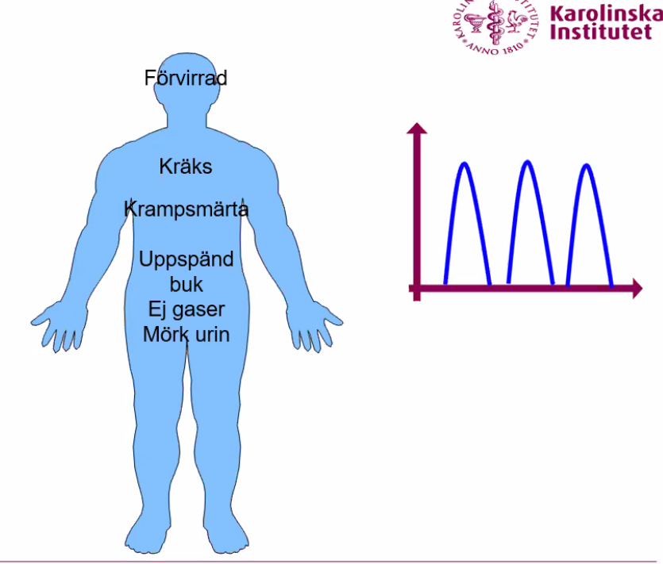 |      |
| ------------------------------------------------------------ | ------------------------------------------------------------ | ---- |
|                                                              |                                                              |      |

* Penetrera anamnes vidare
* Mjuk vid palpation innebär att det inte är peritonit. peritonit är motsats t mjuk buk
* Patienten ska läggas in
* Massa vätska har samlats i tarmen, därför behöver de mkt iv vätska för att kompensera. 
  * 4-5L första d säkert, så man ska ha d i åtanek
  * en klinisk bedömning är urinproduktionen för att bedöma vätskestatus. 
  * daglig vikt och noggrann registrering av vätska in o ut (kräk, kiss, etc). 
* Totalt hinder efter passagertg är op-fall
  * men om partiellt hinder -> inte op fall.. 
* Hur frekvent man följer pat v.g. ileus då ska det vara parametrarna som driver
  * Hur mår pat
  * har pat peritonit
  * hur utvecklas patienten
  * etc. för att bedöma om op el ej etc.

#### Fall 2 - appendicit

| 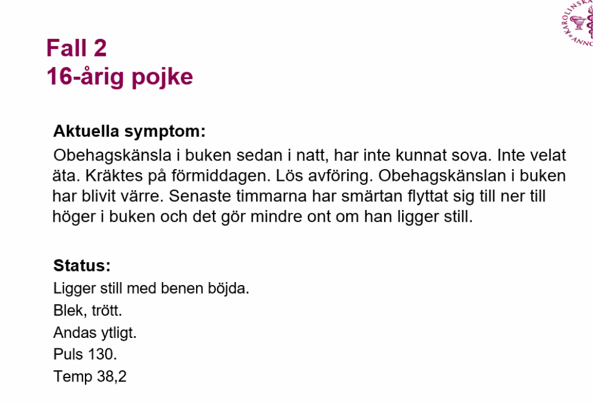 | 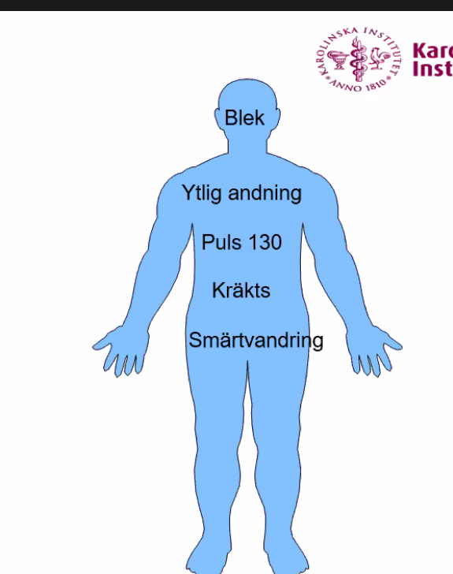 |
| ------------------------------------------------------------ | ------------------------------------------------------------ |
| 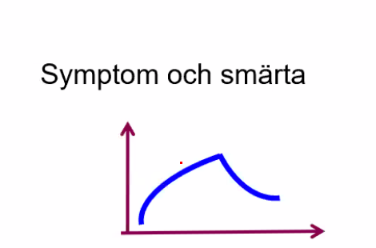Diffus viscerala smärtan, smärttyp 1 |                                                              |

* Appendiciter ska opereras så fort d går, ska inte ruptureras.
* på akuten inlägngingsbeslut
* undervätskad etc.
  * parenteral nutrition
  * 2 5% glukos med elektrolyter
  * smärtlindring med morfin iv, 2.5mg åt gången, och fyller på så mkt som behövs.
* behövs det Radiologi, DT, UL: på HS är det få pat som inte får radiologi mwed denna anamnes. Men det är en klinisk diagnos. 
* Differentialdiagnoser
  * Körtelbuk: fråga om förkylning sista tiden. 
  * En del appendiciter som klingar av spontant, o att d inte antibiotika som hjälper: 
* Patienttransport: att det går bra med att mamma o pappa kör in till sjukhuset, med denna bild. 

#### Fall 3

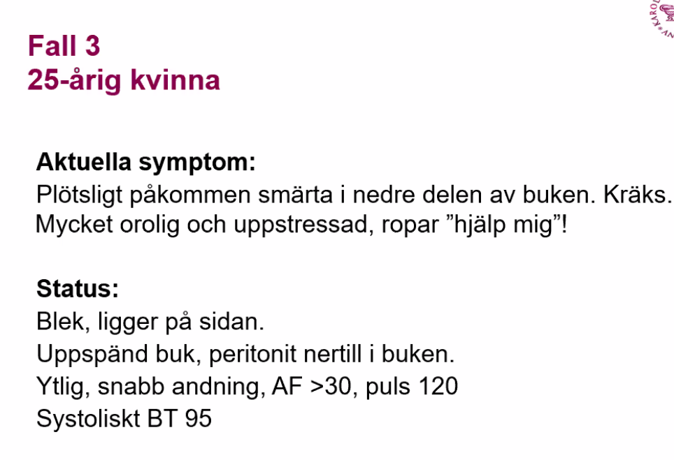

* hög AF som är första som drar iväg när man har en blödning
* när BT faller kan det vara 1 tredjedel som blött.
* 

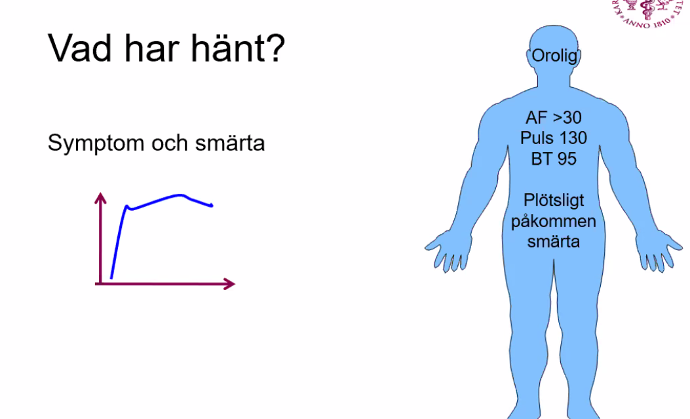

* !! Perforationssmärta
* Tänkbar diagnos
  * ektopisk grav
  * direkt gyn
  * ers blod
  * använd 4 4 1: plasma o trombocyter
* // lokal peritonit höger fossa, resten av buk mjuk
  * det är musklerna som försvarar sig, spänner emot

#### Fall 4

| 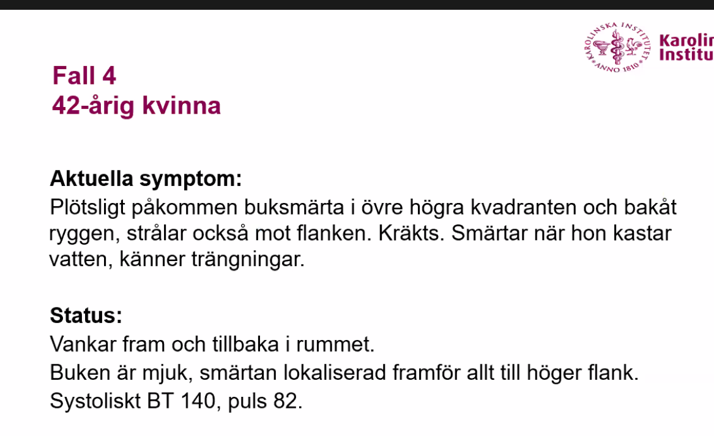 | 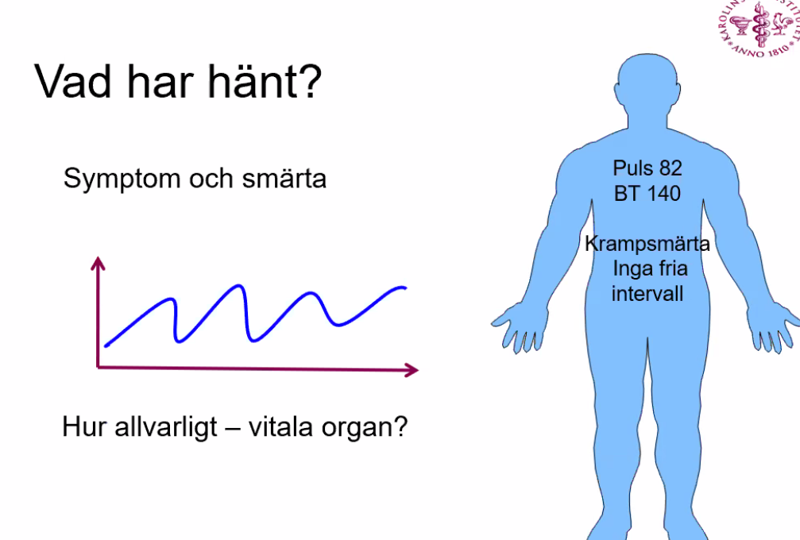 |
| ------------------------------------------------------------ | ------------------------------------------------------------ |
|                                                              |                                                              |

* Toradol, diclonefenac, naproxen: bra t dessa koliksmärtor (e.g. njursten eller gallsten)
* notera att en uretärsten som smärtlindras och fö opåverkad o normal krea, ere poliklinisk utredning
* endast lägga in opåverkade patienten

#### Fall 5

| 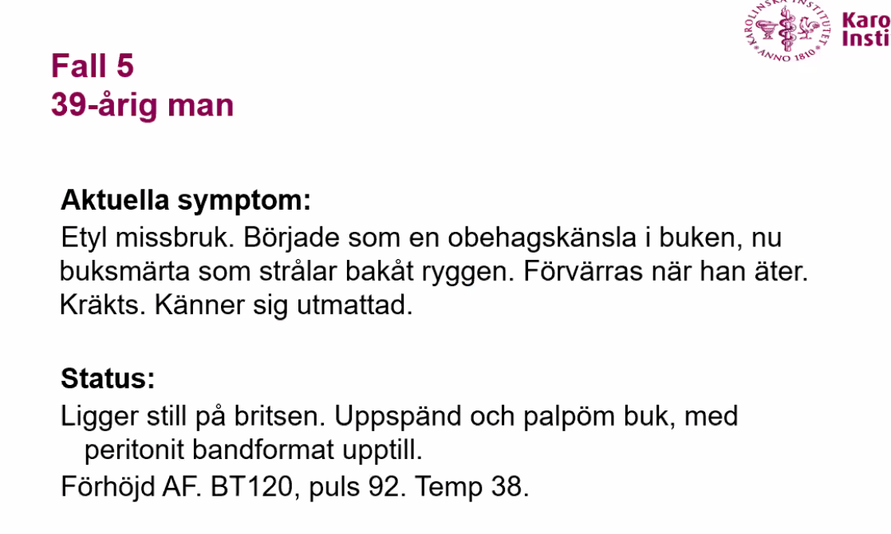 | 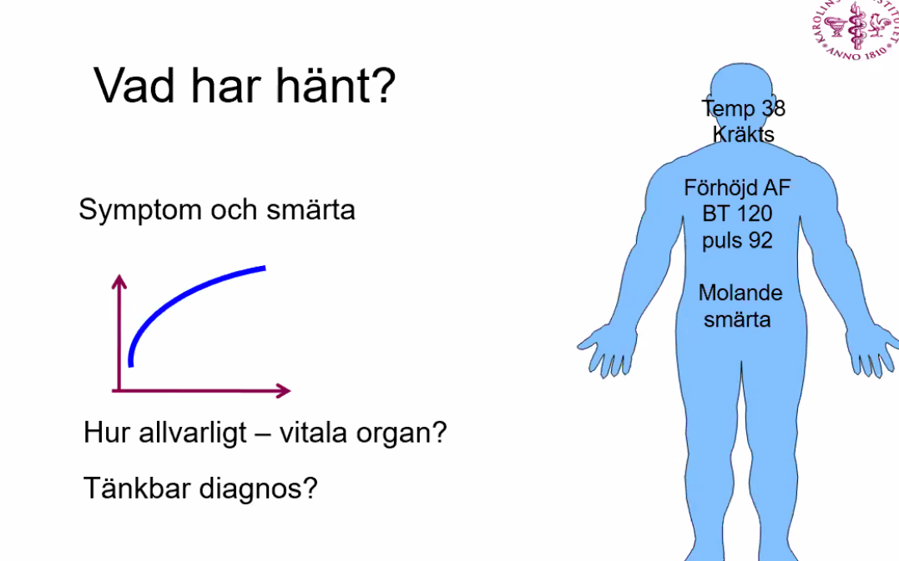 |
| ------------------------------------------------------------ | ------------------------------------------------------------ |
|                                                              |                                                              |

* Peritonit: pankreatit, diffar i den delen av buken som involverade, som kan drabbas av inflammation
  * med detta är det inte helt fel att tänka pankreatti
  * Mkt vätka d pankreatitetr, 5-6L ibland 10-12L vätska
  * d med svår pankreatit, är 10-15% hög morbid o mortalitet, d kan man inte veta på akuten
  * ska lägga in alla dessa.
  * i allra flesta klingar av efter 1-2d, för att d bara symptomatisk behandling
* 2/3 tecken: bandformat smärta mot flanker, amylas 3x förhöjt (över 3.3 alltså), DT-buk (täcka in diffar)
  * först med anamnes o amylas sen vidare med DT om amylas inte visat ngt, för att säga att d pankreatit
* Daglig vikt, vätskeurinmätning noggrant. 
* Smärtlindring: morfin (inget max på morfin, kan få EDA för att de har så himla ont, man kan sätta )
  * maxdos morfin 30mg på dessa patienter. 
* Istället för spasmofen är det opiat. 

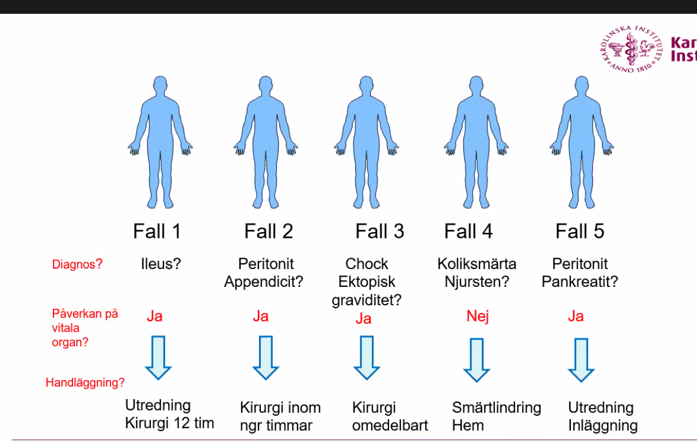

## Blod i avföring

### Allmänt

***Utredning***

* Låg tröskel för att gå vidare med utredning för kolorektal cancer
  * "Ändrade avföringsvanor **i** **kombination med** anemi eller blod i avföringen ger stark misstanke om tjock- och ändtarmscancer och ska utredas enligt standardiserat vårdförlopp."
  * https://viss.nu/kunskapsstod/vardprogram/tjock--och-andtarmscancer
* Ser man tydlig blödningskälla på proktoskopi, ska man behandla den innan man går vidare
  * Alltså att behandla hemorrojdern exempelvis, innan man går vidare. 
* Koloskopi enl SVF: 1-2v att man får remissen färdig
* // Tala om för patienten att man ska starta SVF, att man ringer samma vecka för att göra en koloskopi. 
  * Lämnar patientens telefonnummer i journalen. 
  * // säger till patienten att man ska utesluta cancern. 

### Fall

#### Fall 1

***Presentation***

* 63åå man
  * söker pga blod per rectum
  * har inte besökt vc tidg.
  * Översikt 63-årig tidigare väs frisk gift man. 
  * Sedan tonåren migrän vilken han på senare år endast medicinerat m Voltaren. 
  * Pat har intermittent tidigare haft besvär av hemorroider, har beh m gummiligatur f 5 år sedan. 
  * ? Nu sedan 4 mån anamnes på blod i avföringen. 
  * Anamnestiskt inga magsymptom tidigare. 
  * Har känt sig ngt tröttare de senaste månaderna men har också haft mycket på sitt arbete. 
  * Han har även stöttat sin far 88 år, som är svårt sjuk i en blodsjukdom.
  * Sammantaget
    * student förstå förekomst av allvarlig åkomma, måste beaktas, 
    * att utredning av detta måste vidtas snarast

***Etiologi och patofysiologi***

***Epidemiologi***

***Kliniska kännetecken***

***Differentialdiagnostik***

* Blödningens utseende, frekvens, duration
* avföringsvanor

***Utredning och handläggning***

* **Anamnes**
  * ***Blod per rectum***
    * tidsförlopp, frekvens
    * konstant, intermittent
    * karaktär: 
      * färskt, 
      * levrat: koagulerat blod
      * blodtillblandad avföring, 
      * utanpå
      * tex blod på papper
  * ***Avföringsvanor***, 
    * förändrade
    * diarre
    * obstipationstendens, förstoppning
    * slem
  * ***Associerade symptom***
    * buksmärta
    * illamående
    * kräkningar
    * gastritsymptom
    * viktnedgång,
    * trötthet
    * yrsel
  * ***Tidg. nuv sjd***
    * blod per rectum
    * gastrit
    * annan blödningskälla
  * ***Hereditet***
    * Mal
    * inflammatorisk tarmsjd
    * annat
  * Alkohol, tobka
  * medicinering
  * annan smärta
  * miktion, prostata
* ***Status***
  * Anemitecken
    * ***! MoS***
  * Hjärta, lungor
  * Bukstatus
    * PR, ej utföra men nämna
    * proktoskopi: i samband med besöket
    * alt. snarast rektoskopi
  * lymfkörtel palp
  * Koloskopi: planerar för detta, ombesörjer tid snarast
  * Tar Hb på VC samband med besök
  * planerar ytterligare labb: 
    * F-Hb x3
    * blodstatus
    * leverstatus
    * ev ytterligare anemiutredning 

***Behandling***

#### Fall 2

* Stig

  * 63åå
  * gift
  * Socialsekreterare
  * Frisk i livet
  * Inga spec sjd, bara hemorrojder, fick gummiligatur 5åå sedan, bra effekt
  * Besvär med blod i avföring 2-3mån
  * Första tanke: hemorrojder igen, kanske ny behandling med gummiligatur
  * Oro: an vara allvarligt, har blivit äldre, bestämmer söka VC
  * Öppningsreplik: kommer för att jag tror jag fått hemorrojder igen, hade flera år, fick gummisnoddar, blöda igen. inte ont, men en hel del blod. 
  * Om mer talutrymme spontant: berätta om tankar o önskan. Vänta med oron om de inte frågar uttryckligen. 
  	* Oron: jage ju 60åå, oro att det är ngt annat. Frågar vidare vad är annat: cancer är det jag tänker på, måste vara riktad fråga
  * Önskan: ny behandling med gummisnoddar
  * Andra frågor
  	* inte ont ngnstans
  	* Oregelbunden avföring nu, hård av o till, tidigare bra
  	* Inga diarrer
  	* Blodet ligger utanpå avföringen, kan vara lite levrat
  	* Ingen slem i avföringen
  	* Ingen viktförändring
  	* Ingen feber eller nattlig svettning
  	* Inte känner sig sjuk, men trött
  	* Inga besvär fr magen i övrigt
  	* Lämnade screning F-Hb tidigare som var normalt
  	* Ingen ärftlighet cancer eller magtarm
  	* Gift, inga barn, 
  	* Inga mediciner
  	* Aldrig rökt
  	* Alk ngn gg t fest annars inte, inte så ofta fest

## Buksmärta

### Övre GI

#### Dyspepsi

***Kliniska kännetecken***

* ***Inga varningsflaggor***
* ***Obehag smärta buken***
* ***Uppkördhet***: uppblåsthet
* ***Illamående***
* **Mättnadskänsla**

***Skillnad organisk dyspepsi och funktionell dyspepsi***

* Organisk orsak kan inte diffas

***Utredning och handläggning***

* ***Anamnestiskt***
* ***Varningsflaggor***: ska gastroskoperas 
  * detta inkluderar tidig mättnadskänsla eller mättnadskänsla
* ***Gastroskopi***: över 50åå, varningsflaggor, NSAID/ASA användning

***Behandling***

* ***Protonpumpbehandling: H2-blockerare = ranitidn i 2v***
  * notera att man inte använder omeprazol

#### GERD

***Presentation***

***Kliniska kännetecken***

* Inga varningstecken
* refluxsymptom

***Utredning och handläggning***

***Behandling***

* ***Protonpumpsblockad***
* ***livstilsåtgärder***: 
  * Sluta röka
  * Ligg på rätt sida: höjd huvudända, 
  * sluta alkohol
  * viktnedgång
  * mindre måltider
  * äta inte vid läggdags

#### Ulcus

***Presentation***

* ***40åå man***
  * magbesvär, det gör ont
  * inga varningsflaggor
  * ingen GERD
  * COX1 hämmar användning
  * kliniska tecken t ikterus: 
  * epigastrisk smärta o ömhet

***Etiologi***

* Helicobacter
* NSAID
* Malignitet

***Varningsflaggor***

* B-symptom
* GI-blödning
* järnbristanemi
* palpabel resitens i fuk
* förstorade lymfkörtlar
* !! tidig mättnadskänsla
* lång anamnes tilltagande besvär el sväljningssvårigheter

***Utredning o handläggning***

* ***Anamnes***
  * ***Varningsflaggor***
    * ***Uppdelning enl mig***
      * ***Malignitetsgrejer***: B-symptom
      * ***Anemigrejer***: Blött i avföring, spytt blod, ansträngningsrelaterade besvär
      * ***Gastrogrejer***: svårigheter svälja, känt resistens i buken, ***tidig mättnadskänsla***
    * ***Fråga efter varningssymtom (se nedan),*** 
      * NSAID/ASA. 
      * Kliniska tecken till ikterus. 
      * Blodstatus, 
      * F-Hb. 
      * Leverstatus vid misstanke om sjukdom i lever, gallvägar eller pankreas (och i oklara fall). 
      * Överväg polikliniskt ultraljud lever/galla och vid misstanke om malignitet även DT. 
      * Var frikostig med att ta EKG
* ***Under 50 + låg risk organisk sjd***
  * Inga varningsflaggor
  * F-Helicobacter: avföringstest
  * eller utandning-urea
  * vid positiv helicobacter test: eradikeringsterapi; 
* ***under 50år + Om organisk sjd*** 
  * Varningsflaggor för malignitet
* ***Över 50 års***

***Behandling***

* ***Test-and-treat***
  * ***Indikation***: under 50 år gammal + inga tecken till organisk sjukdom + inga varningsflaggo
  * ***Helicobacter-testen***: urea-utandningstest eller F-helicbacter-antigen test
  * ***Vid positiv helicobacter test***: metronidazole + erytromycin 7d
  * PPI-behandling 4-8v
  * uppföljning om 4v
* ***Gastroskopi***
  * ***Indikation***: över 50år eller varningsflaggor, tecken organisk sjd
  * ***Ventrikelulcus***: Biopsier, eradikeringsterapi som ovan (PPI-behandling låbngt) ***+ uppföljande gastroskopi***
  * ***Duodenalulcus***: Biopsier, eradikeringsterapi som ovan (PPI 7d) // ingen uppföljande gastroskopi

#### Gallsten

***Kliniska kännetecken***

* ***Smärta kort duration som går bort snart***
  * Smärta nedom höger arcus och/eller i epigastriet, 
  * ofta med utstrålning bakåt ryggen och upp mot höger skuldra. 
  * Ofta attackvis med debut 15–60 minuter efter måltid,
  * ihållande i några timmar och oftast övergående spontant. Illamående och kräkningar förekommer. 
  * Om smärtan består mer än 6–8 timmar, särskilt om feber tillstöter talar det för begynnande kolecystit.
* ***Notera differentialdiagnostiskt***
  * Om smärtan blir mer långdragen
  * håller på en längre tid
  * patienten utvecklar feber
  * leder till ***kolecystit misstanke etc***

***Utredning och handläggning***

* ***Utredningsmässigt***
  * ***Blodprover***
    * Leverstatus
    * Blodprover
    * Amylas
  * ***UL-bedside***: letar sten
  * ***Frikostig***
    * ! EKG
    * ! hjärtmarkörer
    * u-sticka
* ***Test-behandling smärtstillande***
  * ***Diclofenac im el iv***: smärtstillar detta patienten, ska patienten gå hem med smärtstillande
  * Polikliniskt UL-buk för att leta stenar
  * Remiss till VC för vidare handläggning

***Behandling***

* Naproxen 500mg supp vb

#### Kolecystit

***Kliniska kännetecken***

* Stegrande molvärk samma som den andra
* 

#### Kolangit

***Kolangit triaden***

* Feber + frossa + ikterus

### Nedre GI

#### Divertikulit

***Presentation***

1. 50åå     gammal: 

   1. dull      smärta under naveln, 
   2. konstant smärta

   3. bättre när ligger stilla

   4. när urinerar känns sämre

   5. ingen strålning mot ryggen

   6. adipös

   7. direkt och indirekt      palpömhet

   8. 1. mellan       umbilicus och symfysen

   9. smärta intense

   10. ingen generell peritonit

   11. temp 38.2

2. 50åå kvinna: okomplicerad     divertikulit (tror jag)

   1. reumatism
   2. annars frisk
   3. svår smärta lower buk, undre      buk
   4. förstoppad några dagar
   5. palpöm i vänster lägre      kvadrant
   6. under naveln
   7. aldrig erfarit sådan smärta      tidigare
   8. CRP 75
   9. temperatur 37.7 grader C

3. 38åå man. 

   1. Han är i      övrigt frisk, 
   2. tar inga läkemedel      regelbundet och 
   3. har inte genomgått några      bukoperationer. 
   4. BMI 34
   5. röker ej,
   6. alkohol som de flesta      andra”. 
   7. Sedan i förrgår tilltagande      buksmärta nedom naveln. 
   8. Han har aldrig upplevt det      här tidigare. 
   9. Temp: 38,3 oC, blodtryck      125/80 mmHg, puls 87, **urinsticka**
   10. **+1 Leukocyter**, b-glukos 5,3 mmol/L. 
   11. status noteras palpationsömhet med muskelförsvar nedom naveln utan sidolateralisering.

***Etiologi***

* där tarm e tunnst, 
  * ***där kärl går gm väggen***
* ingen muscularis propria i     området
* kallas för en falska mukosaprolapser
* det är mga som har     divertiklar
* kvinnor > män
* patofysiologiskt: faeces     täpper till divertikeln och den inflammeras

***Epidem***

* vänsterkolon     i västvärlden: oftast att man har sigmoideum
* högerkolon och caekum i     östvärlden
* **kom ihåg dock     att dessa kan uppstå lite varsomhelst**. 
* **fyrfaldigt     ökad risk för kolorektal cancer,**

***Kliniska kännetecken***

***Indelning***

* **Okomplicerad divertikulit**

* 1. enbart      lokal buksmärta
  2. ingen fri gas
  3. ingen intraabdominell abscess: detta är      intressant för att enligt hinchey klassifikationen har grad 1-2      abscesser, som blir större. 
  4. **molande kontinuerlig** buksmärta nedre del buk
  5. vanligast t vänster
  6. el under navel
  7. sjukdomskänsla med feber      (ofta >38 grader)

* **Komplicerad**

* 1. lokaliserad      svår peritonit
  2. eller generell peritonit
  3. ofta med allmänpåverkan
  4. fri gas-vätska eller abscess
  5. feber, hög feber över 39 grader
  6. frossa

* ***De lindriga divertikuliterna,     i.e. inflammation i divertikel, verkar vara ganska tvetydiga***

* ***Oftast*** 

* 1. att man har divertikulit i sigmoideum
  2. smärta vänster fossa iliaca
  3. stigande feber
  4. CRP stegring
  5. ömhet
  6. oftast: *divertiklar* smärtfria, om smärta kan      det vara colon irritable som kan förekomma med samtidiga divertiklar. 

* **Maskering av feber:** notera     steroidbehandling eller sepsis

***Utredning och handläggning***

* ***DT inte bästa sens***: kom ihåg     att i 50% av dessa fall, som man med bilddiagnostik får reda på att det     ser OK ut, i.e. ingen divertikulit.
* ***Status och klinisk diagnos***
  * ***97% sens***: lokal öm vä fossa + **CRP över 50** + ingen kräk (+ DT?)
* **Notera hur CRP är viktigt vid diagnostiken av divertikulit**
* ***Labbprover***
  * Därför är labb viktigt, för att få ett CRP

***Handläggning***

* ***Inläggning***

* ***Blodprover***

* 1. ***infektionsparametrar***:      CRP
  2. ***elektrolytstatus***
  3. **Urinstatus**: antagligen för att man      vill diffa med cystit? uvi? pyelit?
  4. ***blodstatus***

* **Okomplicerad**

* 1. **Smärtstillning enl allan e morfin**

  2. ***tarmvila initialt,*** 

  3. ***får vätska och fibrer**:* 

  4. 70% förbättras på detta inom 1 dygn

  5. många kan gå hem dagen efter, får kost      rekommendationer att öka fiberintag

  6. påbörjar skonkost dagen      efter för att se hur det fungerar

  7. blir patienten mer stabil,      kan man skriva hem dem

  8. **Tidg känd      diagnos:** 

  9. 1. **Om allmäntillståndet tillåter,** 
     2. **observera i hemmet,** 
     3. **skonkost 3-5 dagar, flytande kost**. 
     4. åter söka akuten om de       försämras

* **Första gg för divertikulit, ingen tidigare anamnes**

  * **DT-buk      rekommenderas,**      för att det är så mga diffar

  2. eller om symptom kvarstår      efter 24-48 timmar att man gör DT-buk
  3. inläggning var frikostig här
  4. flytande kost
  5. tilltagande smärtor: fasta + iv dropp, symptomlindrande
  6. // det verkade att under seminariet skulle man kunna vänta ett ganska långt tag innan      divertikuliten hejdade sig. 

* **Tidigare känd divertikulit diagnos, eller divertikel diagnos**

  * observeras i hemmet

  2. flytande kost 2-5 dagar
  3. söka på nytt om försämring

* **Komplicerad**

  * inläggning

  2. iv vätska

  2. **KAD**: 
     1. detta är intressant, att man sätter en KAD på en divertikulit patient. känns       jätte onödigt. 

  3. **Antibiotika**
     1. Trimsulfa + metronidazole

  4. **DT-buk**:      

  5. **indik för laparotomi laparoskopi om**
    1. **fri gas**
    2. **extraluminal  kontrast**: gör man rektografi då? rektal       kontrast?
    3. akut obstruktion

  1. **abscess**:      (ultraljudsledd frågeställning)
    1. **dränage om över 5 cm;** 
    2. om under 5 cm man ger antibiotika

* ***antibiotika***: ges inte till  okomplicerade fall. 

* ***Efteråt***

  * !! koloskopi efter 6-8 veckor, oavsett ålder. 

  2. dock om det finns      alarmsymptom, såsom blod i avföring, förstoppning, buksvullnad ska remiss      t kirurgiklinik el endoskopienhet ske tidigare
  3. ***Rekommendationer***: fiberrik      kost, motion, rökstopp

***Uppföljning***

* !! ***Efterloppet koloskopi***: utesluta malignitet

***Talehome***

* Kost: fiberrik kost, skonkost, motion, rökstopp

***Behandling***

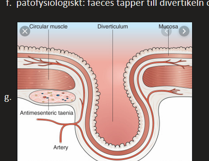

#### Njursten

***Presentation***

***Etiologi***

* ***Vanligaste platserna för uretärsten***
  * uretropelviska junction
  * miduretralt: övergång ovanpå iliaca communis
  * innan ostiet för urinblåsan (uretrovesical junction)

***Kliniska kännetecken***

* Illamående
* Kräkning
* Strålande smärta mot ryggen eller ljumske
* Rastlös, kan inte sitta still, hittar ingen bekväm position
* Hematuri
* Tidigare njursten
* Högt belägna stenar (njurbäcken, pelvouretära övergången, proximala uretärstenar) har framförallt flankvärk. Vid distala stenar projiceras smärtan längre ner t.ex. mot  jumsken, testikel/blygdläpp eller på insidan av låret. Distala stenar kan även ge upphov till trängningar och ökad miktionsfrekvens. Illamående och kräkningar kan förekomma. Fråga efter tidigare stenanfall och yrken där ett akut stenanfall kan få allvarliga  konsekvenser (t.ex. luftfartspersonal eller takläggare). Dessa patienter skall inte arbeta innan de är stenfria.

***Utredning och handläggning***

* ***Förstagångsinträffande***
  * ***Anamnes + status***
  * ***Prover***
    * ***U-sticka***: letar hematuri
    * ***Blodprover***: Hb, CRP, SR, elektrolyter, krea
  * ***Test-behandling smärtlindrande***: 
    * Diclofenac im, eller iv
  * ***Vid smärtstillning kan patienten***: 
    * Skicka hem med naproxen supp
    * DT-urinvägar 2-4v
  * ***Vid icke-smärtstillning med NSAID***
    * ***Remiss radiologi på plats***
      * DT-urinvägar: 
    * ***Differentialdiagnoser***
      * ***Avstängd pyelit***: avlasta njuren efter behov, vid
      * AAA
* ***Vid sten <=5mm***:
  * Hem med naproxen supp 500mg vb, max 1g per dag
  * Poliklinisk remiss till VC för njurstenshandläggning, med snar DT och uppföljning. 
* ***Vid sten över >=6mm:***
  * Remiss till urolog för behandling
  * notera att detta kan skötas polikliniskt så länge patienten kunnat smärtstillas
  * om man inte lyckas smärtstilla patienten ska den läggas in för effektivare smärtstillning. 

### Fall

#### Fall 1 - GERD

***Presentation***

* 64-årig man/kvinna som söker VC pga smärta i epigastriet sedan ett par veckor. Anamnestiskt sura uppstötningar, brännande smärta retrosternalt, viss matlindring men också viss matleda pga lätt illamående intermittent, något oklart om viktnedgång, trötthet. Ingen övrig symptomatologi, miktion/avföring ua. Frisk i övrigt.

***Utredning och handläggning***

* ***Patientkommunikation***
  * Öppen fråga
  * Tankar, oro, önskan
  * sammanfattar tillämpligt
* ***Anamnes***
  * ***smärtanamnes***
    * debut
    * akut, subakut debut
    * lokalisation vid debut
    * eventuell smärtvandring
    * karaktär
      * konstant, intermittent
      * utveckling över tid
      * intensitet, ev VAS
      * ngt som förvärarr förbättrar: evt matlidnring
  * ***Associerade symptom***
    * illamående
    * kräkningar
    * sura uppstötningar
    * bröstsmärtor
    * förändrade avföringsvanor
    * diarre, förstoppning
    * blod i avföring
  * ***Allmänna symptom***
    * feber, subfrebril
    * viktnedgång
    * trötthet
  * ***Tidg nuv sjd***
    * ev tidigare op
    * ikterus
    * tidg undersökning magsäck tarm
    * screening f-Hb
  * ***Lkm, allergi***
    * inkl naturläkemedel
    * överkänslighet
  * ***Tobak, alkohol***
* ***Status***
  * ***Bukstatus***
    * ***Första del***
      * auskulterar
      * perkuterar
      * dunkömhet njurloger och arkii
      * nämner PR: bedömmare anger UA
      * förklarr undersökning för pat o är varsam vid undersökningen
    * ***andra del***
      * Punktum maximum
      * palperar systematiskt 2 varv
      * ljumskar
      * !! indirekt, direkt ömhet och släppömhet
      * förklarr undersökning för pat o är varsam vid undersökning
  * ***Hjärta***
    * 4 statuiner
    * axiller
    * carotider
  * ***Lunga***
    * auskulterar o perkutterar
* ***Kliniskt resonemang***
  * ***Stud ska mot bg av ålder, oklara symptom, presentera DD resonamng hos apat med möjlig***
    * dyspepsi
    * reflux
    * !! ulcus
    * gallbesvär
    * malignitet
  * samt i anamnes i status ha identifierat riskfaktorer o symptom för detta
* ***Bedömning o åtgärd***
  * ***stud gör en rimlig prel bedömning***
    * misstänka att besvären kmr fr magsäcken o att utredningen behöver göras snarast, samt att tap rover för att utesluta anemi samt leverpåverkan
  * ***adekvat åtgärder***
    * blodstatus
    * leverstatus: ASAT, ALAT, bilruv, ALP, pankreasamylas
    * LPK
    * CRP
    * F-Hb
    * gastroskopi
* ***Pat kom***
  * involverar o motiverar för pat planering o beslut

#### Fall 2 - pankreatit

***Presentation***

* 61åå man
  * med buksmärta
  * inkomstprover
    * BT 110/75.
    * puls 88
    * T 37.8
    * AF 19
    * U-stick: ua
* genomför pat konsultation innefattande
  * anamnes, statsu, besked, förklara i din dialog med pat hur du resonerar kliniskt, vad du vill utreda o hur

***Översikt***

* Stud ska göra en konsultation
  * hälsa
  * inhämta anamnes
  * genomföra status
  * o i dialog med pat berätta vad som ska hända nu 
    * dropp
    * mediciner
    * fasta
    * inlähhnin
    * bilddiagnostik
* Prel diagnos akut pankreatit
* DD
  * gallstensanfall
  * ulkus
  * kolecystit och (divertikulit)
* Bilddiagnostik: 
  * UL: 
    * gallsten i gallvägar 
    * gallblåsa
    * ev akut papillotomi
  * IDT, godkänns som bilddiagnostik
  * DT bör dock optimalt utföras efter 2 dygn för att se om nekroser, cystor, mfl komplikationer
* Frågor t studenten då det är 3 minuter kvar (om inte svar redan berörts av stud i dialog med pat)
* Prover
  * serumamylas: 3ggr vöver bnormalgräns vid totalamylas
  * tsmns anamnes o status ger diagnos
  * komplettering med 
    * elstatus
    * infektionsprover
    * leverprover
    * Hb
    * kreatinin
* Behandling
  * Vätska, behöver mkt vätska (ofta ödem i viscera o förluster)
  * e.g. 4L för en 70kg man. 
  * fasta pga paralys o illamående
  * smärtlindring cv e.g. 5-10mg morfin.  även före transport t bilddiagnostik avd
* prognos
  * enkel pankreatit, ödematös: god
  * svår, hemorrhagisk, nekrotisk: 50% mortalitet, 
    * efter va 2d stigande feber, CRP o multipel organsvikt. 

***Utredning och handläggning***

* Anamnes, status, och handläggning
* låter pat berätta om symptomen o tar reda på pats tankar, önskan, oro
* Fokuserad smärtanamnes
  * Debut o nuvarande PM
  * smärtutv
  * intensitet
  * molande, intensiv
  * utrstrålning
* övriga symptom
  * gastrointest problem
  * ex illampende, kräkningar
  * avföring
  * födointolerans
  * miktion
* tidg nuv sjd, operationer
* aktuella lkm
* allergier
* AT, cor, pulm
* Bukstatus 1
  * frågar om smärtmax
  * tittar på pats mimik vid us
* Bukstatus 2
  * inspek
  * ausk
  * perkussion
  * dunköm
* Bukstatus 3
  * palp ytligt varv
  * palp djupt varv
  * påpekar PR
* Trolig diagnos
* fotrsatt utred
* smärtlindr
* inlägg
* dropp
* frågar om pat har några frågor el funderingar, säger adjö
* prover
  * S-amylas
  * elstatus
  * krea
  * CRP
  * leversatus
  * Hb
  * ?? U-sticka [a suggestion fr min sida]
* bilddiagnostik UL DT
* smärtlindr
* vätska o fsata
* prognos

***Återkoppling***

* Denna återkoppling verkar gälla ett annat fall, som hade att göra med stensmärtor..
* Det rörde sig alltså om en 62åå tid väs frisk man, som söker med 2h anamnes med plöts debuterande högersd buksmärta högt upp höger i buk, stlande ut i hö flank
* smärtorna steg under 15min tid o ligger sedan dess oförändrat hög nivå
* VAS 7
* !! Fokuserad smärtanamnes
  * väsentligaste i utred av akut buk
  * många duktiga inämta detta
* Urinsticka för Hb
* palpationsöm dunköm höger flank ner mot höger ljunsken
* Diagnos
  * typisk anamnes os tatus för uretärsstensanfall, vilket stärks av blod i sticka, men beakta 25% av njurstensanfall har inte hematuri
* diffar
  * gallstensanfall
  * appendicit
  * aortaruptur
  * a iliaca dissektion
  * !! Hos män i denna ålder är iliacadissektion en viktig differentialdiagnos vid buksmärta, patientens AT viktigt- denna patient hade ont men var inte på något vis allmänpåverkad vilket talar emot dissektion. 
* Behandling
  * Smärtlindring med NSAID i 1a hand, 2a hand morfin
* bilddiagnostik
  * DT-urinvägar, ev urografiktrl görs sällan
    * om ca 12d
    * !! en totalavstängd njure tål 2-3v avflödesstopp med svar t o  uppföljning av husläkare
* Akut urografi, ultrajud, DT endast om ebsvären inte släpper på upprepad smärtlindr o diagnostiska svårigheter
* den aktua utredningsågngen varierar ngt mellan sjukhus återspeglas isätt att hantera pat

#### Fall 3 - sten

***Presentation***

* Du är vikarierande underläkare på akutmottagningen: Din nästa patient, en 63-årig man, söker på grund av buksmärta. Genomför en konsultation! Efter 20 minuter (2 min kvar) bryter examinatorn för att ställa en fråga. Inkomstvärden: BT 130/85 Puls 76 Temp 37,6o AF 19

***Översikt***

* Patient vilken erfarit akut debut av buksmärta höger flank vilken radierar ut i ryggen. Patienten är smärtpåverad, har svårt att vara stilla. Studenten skall inhämta anamnes, undersöka patienten, föra ett differentialdiagnostiskt resonemang och i samråd med patienten överenskomma om fortsatt behandling/åtgärd.

***Utrending och handläggning***

* Anamnes:
  * Låter pat berätta om sina symptom. Efterhör pat´s oro, tankar o önskan
  * Fokuserad smärtanamnes: Debut o nuvarande PM. Smärtutveckling o intensitet. Smärtkaraktär.
  * Utstrålning.
  * Tidigare sjukdomar, aktuella läkemedel och allergier?
  * Miktion och avföring?
  * Tobak och alkohol?
* Status:
    * Frågar/us: Cor, pulm samt se inkomstvärden
    * Frågar PM före palp. Tittar på patientens mimik under undersökningen
    * Palperar ett ytligt och ett djupt varv. Dunkömhet
    * Markerar PR ( Ej ont, normalfärgad avföring på handsken)
    * Urinsticka – Säg: Hb 2+
* Bedömning
    * Förklarar diagnosen (misstänkt njursten). Överenskommer med pat om fortsatt handläggning
    * Erbjuder/efterfrågar smärtlindring: NSAID eller morfin/derivat
    * Förvissar sig om pat förstått och efterhör om pat har ngr ytterligare frågor
    * Ordnar med kontrollurografi samt åb hos dl för rtg-svar
    * Informera om att smärtorna kan återkomma: Rec smärtstillande, supp

#### Fall 4 - kolecys

***Presentation***

* Du är vikarierande underläkare på akutmottagningen: Patienten är en 64-årig man som söker på grund av buksmärta. Genomför en konsultation! Efter 20 minuter får du redogöra för hur du har resonerat kring diagnos och handläggning. Inkomstvärden: BT 140/85 Puls 84 Temp 38,3o AF 22 Pat med buksmärtor vilka debuterade igår kväll. Subfebril. Smärtan accentuerats över natten pm under hö arcus, strålar ut i ryggen intermittent. Ej kräkts men vill ej äta, rör sig försiktigt. Ej tagit några läkemedel. Studenten ska inhämta anamnes, undersöka patienten, föra ett differentialdiagnostiskt resonemang och i samråd med patienten överenskomma om fortsatt behandling/åtgärd enligt nedan

***Översikt***

* Studenten ska inhämta en adekvat anamnes och utföra ett adekvat status avseende handläggning. 
* Samt med ledning av patientens symtompresentation resonera kliniskt med fokus på smärtutvecklingen etc. 
* Provtagning: CRP, LPK, elstatus samt leverprover. 
* Smärtlindring (NSAID, paracetamol el morfin/derivat) samt bilddiagnostik primärt UL. 

***Utrending och handläggning***

* Anamnes:
  * Låter pat berätta om sina symptom. Efterhör pat´s oro, tankar o önskan
  * Smärtanamnes: Smärtutveckling o intensitet.
  * Efterhör tidigare susp gallstenssjd
  * Tidigare sjukdomar, aktuella läkemedel och allergier?
  * Ikterus, feber och frossa
  * Tobak och alkohol?
* Status:
    * AT, cor, pulm, BT. Påpekar åtminstone att detta ska utföras
    * Bukstatus1: Inspektion, perkussion, auskultation
    * Bukstatus2: Palpation – ytligt och djupt varv
    * PR
* Bedömning:
    * Förklarar diagnosen för SP
    * Erbjuder/efterfrågar smärtlindring: NSAID, paracetamol el morfin/derivat
    * Överenskommer med pat om fortsatt handläggning. Förvissar sig om pat förstått och efterhör om
    * pat har ngr ytterligare frågor Förordar inläggning.
    * Frågar om lab: Lever-, inf.- och el.statusprover
    * Ordnar med bilddiagnostik

***Återkoppling***

* I fallet m patienten med buksmärta var det viktigt att efterhöra hur symptomen utvecklats, patientens egna tankar avseende symptomen samt att ställa specifika frågor för att komma vidare i det differentialdiagnostiska resonemanget. Hos en man i denna ålder alltid ha i bakhuvudet ev annan allvarlig sjukdom såsom begynnande diss aorta, denna patient uppvisade dock inte allmänpåverkan vilket gör att detta inte var den primärt troligaste etiologin till pat's besvär. 
* Diffdiagnoser att beakta i övrigt ffa gallsten, pankreatit, cholecystit/cholangit ev infektion, malignitet. 
* Provtagning bör innehålla CRP, LPK, el-status samt leverprover, 
* Adekvat smärtlindring 
* samt bilddiagnostik i form av ultraljud primärt. 
  * Datortomografi bör inte vara det primära i detta fall då man för att minimera strålning i sb m undersökningen ofta gör snitten ngt större varvid ev gallvägskonkrement kan missas. 
* Inläggning med fasta och dropp varvid förloppet följs. 
  * De flesta kolecystiter klingar av inom ett par dagar. 
  * Ställningstagande till kolecystektomi inom fem dagar från debut (förordas av flesta kirurger). 
  * Ej a.b. de första två dagarna (aseptisk infl). 
* Prognos: Ett gallstensanfall: 50 % -ig risk nytt anfall/kolecystit inom tre år. 
* Övergripande återkoppling 
  * Studenterna var duktiga på att tillämpa patientcentrering, även medicinsk specifik anamnes klarade de flesta bra. 
  * !!!! En hel del glömde efterhöra om feber/frossa/ikterus, som ev tecken på ev uppseglande cholangit (i fall av choledochus sten). 
  * Många hade en god teknik att palpera buken systematiskt med ytlig och djup palpation samt gav patienten ett gott underlag att vara med och fatta beslut. 
  * De flesta ordnade med adekvat provtagning och bilddiagnostik och erbjöd patienten smärtlindring.

#### Fall 5 - diveritikulit

***Presentation***

* Studentinstruktion Du är vikarierande underläkare på akutmottagningen: Patienten söker på grund av buksmärta. Genomför en konsultation! Efter 20 minuter får du redogöra för hur du har resonerat kring diagnos och handläggning. Inkomstvärden:BT 135/80 Puls 74 Temp 38,3, AF 20

***Översikt***

* Patient med subakut insjuknande, 
* initialt något diffus värk kring solar plexus, pm vä fossa. 
* Feber. 
* Förstagångsinsjuknande. 
* Studenten skall inhämta anamnes, undersöka patienten, föra ett differentialdiagnostiskt resonemang och i samråd med patienten överenskomma om fortsatt behandling/åtgärd

***Utredning o handläggning***

* Patientkommunikation:
  * Låter pat berätta om sina symptom. Efterhör pat´s oro, tankar o önskan
  * Förklarar diagnosen för pat och ger underlag för att vara delaktig i beslut om fortsatt handläggning
  * Förvissar sig om att pat förstått/ efterhör ev. ytterligare frågor?
* Anamnes:
    * När och var började smärtan (igår kväll)
    * Var är smärtan nu? Utstrålning? Ändrat karaktär? (vänster fossa)
    * Hur har smärtan utvecklas? Molande? Intensiv? Intervall? (molande, ökad intensitet)
    * !! Efterhör tidigare susp divertikelsjd och övriga sjd
    * Aktuella läkemedel och allergier?0
    * Avförings- och miktionsanamnes (normal avföring igår)
    * Tobak och alkohol? (Måttligt alkohol, icke rökare)
* Status:
    * AT, cor, pulm, BT. Påpekar åtminstone att detta ska utföras
    * Bukstatus1: Inspektion, perkussion, auskultation
    * Bukstatus2: Palpation – ytligt och djupt varv
    * PR: skall nämnas!
* Bedömning/åtgärd
    * Överenskommer om inläggning då detta är ett förstagångsinsjuknande av misstänkt divertikulit.
    * Smärtlindring. Fasta. Vätska iv.
    * Lab: Inf- (Lpk+CRP) Lever- och el.statusprover
    * Ordnar med bilddiagnostik
* Sammanfattning
  * Sammanfattning: Stud gör en rimlig preliminär bedömn Studenten föreslår adekvata åtgärder Stud ger en rimlig plan för uppföljning

#### ! Fall 6 - nedre buksm, div?

***Presentation***

* 61-årig kvinna/man 
  * Söker dig på akuten. Väl reglerad tablettbehandlad hypertoni söker på grund av smärta i nedre delen av buken sedan två dagar. Initialt VAS 4 nu 7. Smygande debut, konstant molande värk nedom naveln. Strålar ej ut. Patienten har ej velat äta mat på 2 dagar, tagit yoghurt, juice i förrgår, ej ätit något sedan igår, druckit vatten. Miktion ua, haft en liten normalfärgad avföring igår, något lösare än vanligt. Känt sig frusen tagit febern i imorse 37,9. (Kvinnlig patient, inga blödningar eller flytningar). Viktnedgång 2 kilo senaste månaderna, lagt om kosten äter mera grönsaker. Inga övriga symptom. 

***Utredning o handläggning***

* Patkom
  * tankar, oro önskan
  * sammanfattar
  * öppna frågor
* Anamens
  * Smärtanamens
    * Socrates
    * locale
    * debute
    * tid likn besvär
    * tid op
  * smärtanamnes 2
    * utstrål
    * utveckl
    * kvalitet
  * smärtanamnes 3
    * förbättrar el försvämrar
  * illamående, kräk
  * feber, subfeb, viktnedgång
  * dysuri, inkontinens, retention
  * avföringssymptom
  * tid sjd, lkm, allergier
  * tobak, alk
* Status
  * Bukstatus 1
    * auskutlerar
    * perkuterar
    * dunköm njurloger arkii
    * PR
  * Bukstatus 2
    * PM
    * palp systematiskt 2 varv, samt ljunmskar
    * indirekt, direkt ömhet släppömhet
* Patkom
  * involverar pat
  * ger utrymme för fler frågor
* Bedömning o åtgärd
  * Studenten gör rimlig prel bedöm
  * resonemang kring sannolik diagnos med bakgrund av 
    * åler
    * kön
    * oklara symptom
    * mm
    * behov av att om möjligt komma t diagnos före ev akutoperation
  * DD
    * Dibertikulit
    * appendicit
    * koloncancer
    * UVI
    * idenfitifera riskfaktorer o symptom för detta o kan prioritera
  * !! föreslår adekvata åtgfärder
    * DT
    * smärtlindring
      * morfin-prep
    * trolig inläggning
    * fasta
    * vätsak iv
    * ordinerar prover
      * urisntatus
      * CRP
      * LPK

#### Fall 7 - divert

***Presentation***

* 64-årig kvinna/man söker på akutmottagningen med ett knappt dygns anamnes på tilltagande molande smärta väsentligen centralt nedom naveln. Ingen utstrålning. VAS 6-7. Känner inte igen denna värk. Druckit vatten, mår illa ej kräkts. Avföring igår väs ua. Miktion ua. Ej noterat blod i avföringen. Inga ändrade avföringsvanor. Inga allergier, alkohol sparsamt, tobak aldrig rökt. Ingen övrig symptomatologi. Rejält ömmande vid palpation samt släppömhet. Ingen dunkömheet över njurloger, ljumskar/bråckportar palperas ua. Temp 38,0. 

***Utredning och handläggning***

* patkom
  * tankar oro önskan
  * sammanfattar
  * öppna rfrågor
* Anamnes
  * Smärtanamens
    * locale
    * debut
    * likn besvär tidg
    * utstrål
    * utv
    * kvaltiet
    * förbättrar 
    * försämrar
  * Associerade symptom
    * illamående kräk
    * feber
    * viktnedgång
    * dysuri, inkontinens, retension
    * avföringssymptom
  * tidg sjd, nuv
  * lkm: naturlkm, receptfria
  * allergier
  * tobak alk
* Status
  * bukstatus
    * inspek
    * auskult
    * perkuterar
    * dunköm njurar o arkii
    * nämner PR
    * PM 
    * palp system 2 varv 
    * ljumskar
    * undersöker indir o dir ömhet samt släppömhet
* Kliniskt resonemang
  * Stud ska pres ett DD
    * divertikulit
    * appendicit
    * koloncancer
    * UVI
  * i anamens ID riskfaktorer för detta o prio o värderat pats symptom
* Bedöm åtgärd
  * ytterligare utredning krävs innan ngn akutop
  * DT
  * Smärtlindring (opioider
  * efter DT
    * trolig inläggning
    * fasta
    * vätska iv
  * ordinerar prover
    * LPK
    * Elstatus
    * CRP
    * blodstatus
  * ev bladdersca på män

## Förstoppning

### Behandling

tenta

***Inolaxol***

* !! **Bulkmedel**: fibrer
* Passar till geriatrisk patient med förstoppning

***Movicol***

* !! **Osmotiskt aktivt**: är inte bulkmedel, utan binder osmotiskt vatten, för att göra avföringen lösare, därför stimulera peristaltik och är laxerande
* Passar till geriatrisk patient med förstoppning

***Natriumpicosulfat (e.g. cilaxoral)***

* Peristaltikstimulerande
  * Magnip
  * svårdoserad
  * kan ge diarre
  * sämre evidens vid långtidsanvändning
* Passar inte till geriatrisk patient med förstoppning

***Dokusat + sorbitol (klyx rektal lösning)***

* Uppmjukande + smörjande

***Effekter, tenta***

| Påstående                                       | Läkeemedelsgrupp som passar på resp rad              |
| ----------------------------------------------- | ---------------------------------------------------- |
| Behandlingen kräver adekvat vätskeintag         | Osmos (movicol), bulkmedel (inolaxol)                |
| Risk gasbildning högre än övriga laxeringsmedel | Osmos (movicol)                                      |
| Långtidsbehandling, god evidens                 | Osmos (movicol), bulkmedel (inolaxol)                |
| Tarmrensning inför rektoskopi                   | Dokusat + sorbitol (Klyx)                            |
| Full effekt 1v efter regelbunden användning     | Bulkmedel (inolaxol)                                 |
| Påverkan elektrolytbalansen                     | Osmos (movicol), peristaltikstimulerande (cilaxoral) |

## Galla

### Gallstas

***Patofysiologi***

* Decreased bile flow and subsequent decreased intraluminal bile salt concentrations below critical micellar concentration result in malabsorption of fat-soluble molecules, with the degree of malabsorption generally correlating with severity of cholestasis
  * Vitamin K is rapidly metabolized so malabsorption may lead to rapid depletion of limited stores, leading to clinically significant deficiency. Vitamin K serves as a cofactor for the enzyme γ-glutamylcarboxylase, which supports posttranslational carboxylation of glutamic acid residues in many proteins, including coagulation factors such as factors II (prothrombin), VII, IX, X, protein C, protein S, and proteins involved in bone homeostasis, specifically osteocalcin and matrix gla protein. Most of these proteins have multiple carboxylations, and these carboxylated glutamic acid residues have the ability to bind calcium, making the proteins functionally active (1,5). In vitamin K deficiency, there is an increase in abnormal undercarboxylated or partially carboxylated forms of these proteins, which are functionally defective. After these undercarboxylated proteins, particularly undercarboxylated prothrombin, reach a poorly defined level, vitamin K deficiency results in coagulopathy, as measured by prolongation of prothrombin time (PT)
  * doi: 10.1097/MPG.0b013e31819a61ff
