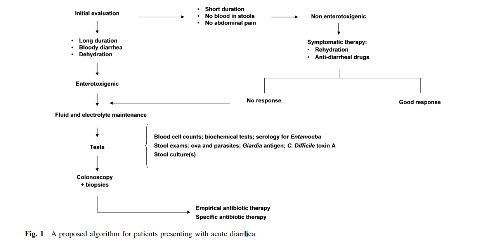
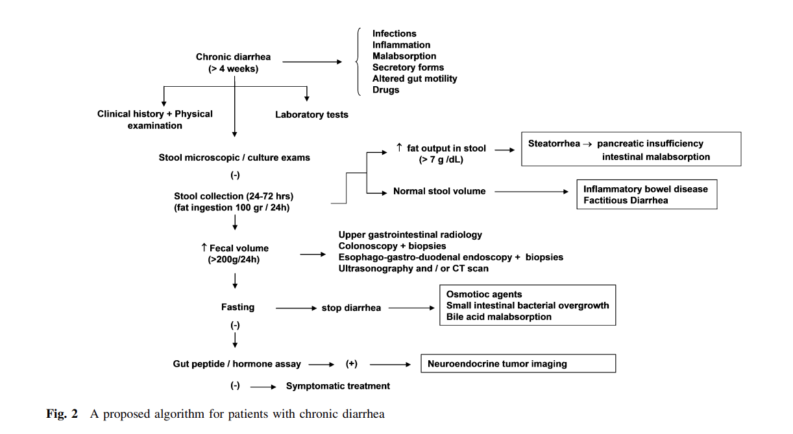

***Presentation***

***Etiologi och patofysiologi***

***Epidemiologi***

***Kliniska kännetecken***

***Utredning och handläggning***

***Behandling***

## Diarre

***Case report***

* osmotisk diarre, sorbitol relaterad t tuggummin: https://www.cfp.ca/content/65/8/557.short
  * Allt hade undersökts

***Presentation***

***Etiologi och patofysiologi***

* . Studies have established that the daily amount of fluid flowing through the small bowel is about 7–8 L. This fluid includes oral intake and saliva (1.5 L), gastric acid secretion and pepsin (1.5 L), bile and pancreatic secretions (1 L each) and enteric secretion (3 L). In the small bowel, much (approximately 90 %) of the water and electrolytes are reabsorbed with a net amount of 800–1,000 mL of fluid entering the colon. Finally, colonic reabsorption leads to 80–100 mL of water excreted with feces daily. It is enough that the daily fecal water output increases by a minimal amount (50–60 mL) to get loose stools, while a water excretion of 100 mL results in an increased stool weight above 200 g/day, which is considered the upper normal limit (see below) [3]
  * https://link-springer-com.proxy.kib.ki.se/content/pdf/10.1007/s11739-012-0827-4.pdf
* Resorberande kapacitet av tunntarm + kolon
  * On the other hand, a decreased water absorption by only 1–2 % of the total amount is sufficient to cause diarrhea in many disorders characterized by an impaired fluid and electrolyte absorption. 
  * Nonetheless, it should be emphasized that the small bowel and colon possess a huge fluid and electrolyte reabsorption capacity, thus providing a powerful salvage mechanism limiting the occurrence of diarrhea
* Generellt ang orsaker
  * Various causes (some of them listed in Table 1) may evoke 
    * inflammatory, osmotic, secretory, iatrogenic, and motility/functional pathophysiological mechanisms underlying acute or chronic diarrhea

***Indelningar***

* **Blodiga**
  * **Inflammatoriska eller exudativa**: eleverad WBC, occult eller frank blod eller pus i avföring
    * IBD (crohns, ulcerativ kolit)
    * divertikulit
    * ulcerative jejunoileit
    * invasiva infektiösa sjd
      * clostridium difficile (pseudomembranös kolit)
      * invasiva bakteriella infektioner (tuberkulos, yersinios)
      * invasiva parasitiska infektioner (entamoeba, giardia, cryptosporidium, cyclospora)
      * ulcererande viral infektion (CMV, HSV)
    * Neoplastisk sjd: kolorektal cancer, lymfom, villös adenocarcinom
    * Strålningsrelaterad kolit
* **Vattniga**
  * **Sekretorisk**: ofta nattliga (nocturnal), orelaterat t matintag, fekal osmotisk gap <=50mOsm/kg
    * Alkoholism
    * bakteriella endotoxiner: kolera
    * gallsaltmalabsorption
    * brainerd diarr: epidemisk sekretorisk diarre
    * kongenitala syndrom
    * Crohns sjd.: tidig ileokolit
    * endokrina tillstånd: hyperthyroidism
    * medicin: antibiotika, antineoplastika
    * mikroskopisk kolit: lymfocytär och kollagena subtyper
    * neuroendokrina tumörer: gastrinom, VIPom, carcinoid tumör, 
    * icke-osmotisk
    * irriterande laxativa: senna, cascara
    * postkirurgisk: kolecystektomi, gastrektomi, vagotomi, intestinal resektion
    * vaskulit
  * **Osmotisk**: fekal osmotisk gap >=125mOsm/kg
    * Kolhydrater malabsorptionssyndrom:  laktos, fruktor, sorbitol, xylotol
    * celiaki
    * osmotiosiak laxantia
    * osmotiska antacida: magnesium fosfat, sulfater
    * socker alkohol: mannitol, sorbitol, xylitol
  * **Funktionell**: 
    * diffas fr sekretorisk by virtue of hypermotilitet, !**rapid gut transit**!, mindre volymer, förbättring vid natt med fasta
    * IBS
* **Fettiga (steatorre i många men inte alla fall)**
  * **Malabsorption syndrom** (skada till eller förlust av absorptiv kapabilitet)
    * Amyloidos
    * kolhydrat malabsorption (late phase, tidigt är det vattnigt): laktosintolerans 
    * celiaki: late phase
    * gastric bypass
    * lymfatisk skada: hjärtsvikt, lymfom
    * läkemedel: orlistat, acarbose
    * mesenterisk ischemi
    * icke-invasiv tunntarmsparasit
    * post-resektion diarre
    * short-bowel syndrom
    * small bower bacterial overgrowth (>10^5 bakterier/mL)
    * tropical sprue
    * whipple's sjd (trophoeryma whippelii)
  * **Maldigestion**: förlust digestiv funktion
    * Hepatobiliära syndrom
    * inadekvat luminal gallsyror
    * exokrin pankreasinsufficiens. 

***Epidemiologi***

***Kliniska kännetecken***

* Malabsorption, maldigestion
  * For example, the presence of edema, overt malnutrition and signs ascribable to fat soluble vitamin D, K, A and E deficiency can altogether suggest either malabsorption or maldigestion diseases.
* Metastatisk carcinoid
  * Cramping diarrhea associated with 
    * skin flushing and 
    * hepatomegaly 
  * can be part of the clinical spectrum secondary to a metastatic carcinoid
* Exophtalmi: hyperthyroidism
* Episklerit: IBD
* Dermatitis herpetiformis: celiaki
* Avföring
  * Klassisk stetorrhe: 
    * stora volymer
    * bleka
    * oljig
  * Flytande avfröring
    * ökad metan eller gasinnehåll

***Utredning och handläggning***

*Akut diarre*

*Kronisk diarre*

***Behandling***

## Blod i avföring

***Presentation***

* 63åå man
  * söker pga blod per rectum
  * har inte besökt vc tidg.
  * Översikt 63-årig tidigare väs frisk gift man. 
  * Sedan tonåren migrän vilken han på senare år endast medicinerat m Voltaren. 
  * Pat har intermittent tidigare haft besvär av hemorroider, har beh m gummiligatur f 5 år sedan. 
  * ? Nu sedan 4 mån anamnes på blod i avföringen. 
  * Anamnestiskt inga magsymptom tidigare. 
  * Har känt sig ngt tröttare de senaste månaderna men har också haft mycket på sitt arbete. 
  * Han har även stöttat sin far 88 år, som är svårt sjuk i en blodsjukdom.
  * Sammantaget
    * student förstå förekomst av allvarlig åkomma, måste beaktas, 
    * att utredning av detta måste vidtas snarast

***Etiologi och patofysiologi***

***Epidemiologi***

***Kliniska kännetecken***

***Differentialdiagnostik***

* Blödningens utseende, frekvens, duration
* avföringsv

***Utredning och handläggning***

* **Anamnes**
  * Blod per rectum
    * tidsförlopp, frekvens
    * konstant, intermittent
    * karaktär: 
      * färskt, 
      * levrat, 
      * blodtillblandad avföring, 
      * utanpå
      * tex blod på papper
  * Avföringsvanor, 
    * förändrade
    * diarre
    * obstipationstendens, förstoppning
    * slem
  * Associerade symptom
    * buksmärta
    * illamående
    * kräkningar
    * gastritsymptom
    * viktnedgång,
    * trötthet
    * yrsel
  * Tidg. nuv sjd
    * blod per rectum
    * gastrit
    * annan blödningskälla
  * Hereditet
    * Mal
    * inflammatorisk tarmsjd
    * annat
  * Alkohol, tobka
  * medicinering
  * annan smärta
  * miktion, prostata
* Status
  * Anemitecken
    * ! MoS
  * Hjärta, lungor
  * Bukstatus
    * PR, ej utföra men nämna
    * proktoskopi: i samband med besöket
    * alt. snarast rektoskopi
  * lymfkörtel palp
  * Koloskopi: planerar för detta, ombesörjer tid snarast
  * Tar Hb på VC samband med besök
  * planerar ytterligare labb: 
    * F-Hb x3
    * blodstatus
    * leverstatus
    * ev ytterligare anemiutredning 

***Behandling***

