***Presentation***

***Etiologi och patofysiologi***

***Epidemiologi***

***Kliniska kännetecken***

***Utredning och handläggning***

***Behandling***

## Diagnoser

Bröstsmärta
Hjärtblåsljud
Hjärtstopp
Högt blodtryck
Lågt blodtryck
Onormal hjärtverksamhet
Svimning/kollaps
Svullnad i extremitet
Ödem

## Allmänt

### Slagvolym

#### Fall 1

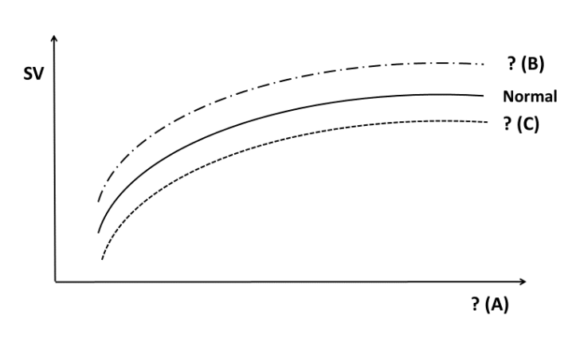

Patienten Magnus har hjärtsvikt i form av nedsatt hjärtminutvolym. Hjärtminutvolymen är produkten av hjärtfrekvens (HR) och slagvolym (SV) HRxSV. Slagvolymen regleras i huvudsak av två faktorer som åskådliggörs i Frank Starling-kurvan nedan..

* **variabel på x-axel**: 
  * preload
  * alt vänsterkammarfyllnad
  * LV EDV: slutdiastoliskt vänsterkammarvolym
  * LV EDP: slutdiastoliskt vänsterkammatryck
  * dvs ju mer fylld, desto mer pumpas ut
* **Kurvans förskjutning på y-axeln illustrerar ytterligare en variabel av betydelse för slagvolymen** 
  * Inotropi
* Farma orsak till B på figuren
  * inotrpa lkm
* orsak t C enl figur
  * minskad inotropi, nedsatt myokardfunktion

## Aorta

### Fall

#### Fall 1 Bukaorta aneurysm

***Presentation***

* 64åå man
  * akut debut
  * ihållande smärta ländrygg
  * debut 6-9h sedan. 
  * lätt episod yrslelkänsla
  * ingen trauma i anamnes
  * VAS 8
  * ingen utstrålning
  * ingen feber
  * inga bröstsmärtor
  * ingen andfåddhet, inga miktionssvårigheter, ingen svag extrem, 
  * anamnes: tablettbeh HT, bälreg, övr frisk

***Etiologi och patofysiologi***

***Epidemiologi***

***Kliniska kännetecken***

***Utredning och handläggning***

* Enl facit

  * Fokuserad anamnes 

    * Allmänna symptom

      * Feber (nej)

      2. Viktnedgång (nej)
      3. Trötthet (nej)
      4. Yrsel (ja)

    * Medicinsk kirurgisk anamnes

      4. tidg. sjd
      4. bröstsmärtor, andnöd
      4. hypertoni, 10 års anamnes, aktuella mediciner
      4. ej genomgått ngt kirurgiskt ingrepp

    * Smärtbeskrivning

      * Lokalisation(medellinje, ländrygg)

      2. Duration (6-9h)
      3. Kvalitet (konstant, djupt liggande)
      4. Tidigare erfarit denna smärta?

    * Smärtmedicinering

      4. Typ, dosering, frekvens: ipren 200mg 2x2

    * Kompletterande anamnes

      * Något som förbättrar? (inget)

      2. Något som förvärrar? (inget)
      3. Intensitet ( 8 på skala 1-10)

    * Radierande symptom

      * Smärtutstrålning till ben? (nej)

      2. Stickningar/nedsatt känsel? (nej)

    * Övriga symptom

      2. Vattenkastningssymptom/inkontinens?(nej)
      3. Avföringssymptom/inkontinens?(nej)
      4. Bensvaghet (nej)

    3. Ev trauma

  * Status

    * Blodtryck: sittande hjärtnivå
    * Bukpalpation: 
      * liggande pat
      * palp sysetmatiskt 4 kvadranter samt centralt runt navel
      * pat hade central smärta
    * SLR: Liggande el sittande, en sida i taget
    * Nedre extremiteter
      * Ödem
      * PP
    * Rygg: inspektion, palpation, rörelseomfång
    * Nerv
      * sensibilitetsprövning
      * grovt
      * senreflexer
      * babinski
      * gångprov
      * tå, hälgång
    * Neurostatus
      * grovkraft nedre

***Behandling***

* Diskussion handläggning
  * diskuterar indik för rtg: UL, DT/MR

***Återkoppling***

* Patienten som sökte på närakuten med ryggsmärta hade ett aortaaneurysm. 
* Detta var var ett autentiskt fall med just denna smärtpresentation. 
* Smärta presenterar sig inte alltid explicit utan även genom 
  * t.ex. frustration, 
  * irritation, 
  * ge akt på att efterhöra t ex VAS. 
* Stationen testade konsultationsfärdigheter men även förmåga att misstänka allvarlig sjukdom. 
* En viktig del av läkaruppgiften är att vara vaksam för "röda flaggor", 
  * dvs identifiera och utesluta akut allvarlig åkomma. 
* Ryggundersökning i fallet var helt u a inkl. gångprov tå/hälgång etc. 
* För de allra flesta studenter uppstod genom lyhördhet i kommunikationen en allians med patienten 
  * varvid den somatiska undersökningen blev riktad och utförlig visavi patientens symptompresentation. 
  * I dessa fall kom också undersökaren att validera undersökningsfyndet vid ryggstatus, där inget smärtsvar överhuvudtaget uppstod utan kom först då bukpalpation utfördes, varvid ev. allvarlig åkomma vilken krävde ytterligare utredning snabbt befarades. 
  * Avseende bukstatus saknades i flera fall systematik vid undersökningen. 
* ! 400 fall av rupturerat aortaaneurysm förekommer årligen i Sverige med 90% mortalitet varför det är viktigt att känna till att varierande och tidig symptomatologi förekommer

#### Fall 1

***Presentation***

* 64-årig manlig patient vilken söker på grund av tilltagande ryggsmärta senaste dygnet. I vitalparametrar noteras något lågt BT, hög puls och patienten äv erfarit yrsel i hemmet innan mannen åkt till akutmottagningen

***Utredning o handläggniign***

* ***Låter pat berätta om symptom, Tankar, oro, önskan***
* ***Anamnes***
  * Smärtanamnes
    *  utstrålning
    * utveckling
    * kvalitet
    * förbättrar försämrar (inget)
  * tidg sjd, operationer
  * lkm allergier
  * feber (nej)
  * viktnedgång (nej)
  * trötthet (nej)
  * yrsel (ja)
  * miktionsproblem, avföringsproblem: nej
  * bensvagjet: nej
* ***Status***
  * Bukstatus: ytligt djupt, 
  * perifera pulsar, 
    * spec ljumskar, 
  * distalstatus
  * rygg 
    * pat anger att han ytterst ogärna reser sig , 
    * gör en ansats att resa sig, 
    * !!! stud som snabbt går över t framsida ist ges full päng. 
* ***Bedömning o åtgärd***
  * rimlig prel bedömning
    * förstår hotande blödning
    * behov akut operation
  * Föreslår adekvata åtgärder
    * smrätlindirng
    * rtg
    * narkos
    * operation
  * förklarar diagnos
    * blir rtg
    * troligen akut op efter rtg
* ***Kliniskt resonemang***
  * kan resonera akut allvar vanl
  * bed korrekt bårdnivå;
    * urakut omhändertagande
* ***Patkomm***
  * motivrear involverar pat

## Arrytmier

### Allmän fysiologi

#### EKG

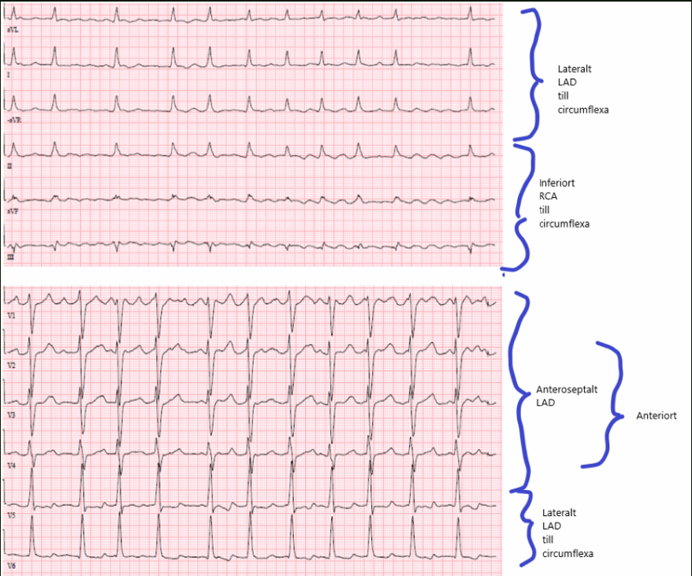

### Förmaksflimmer

***Etiologi och patofysiologi***

* Mycket bidrar t utvecklingen
  * **Alkoholutlöst**
  * Hjärtsjd: infarkter, kardiomyopatier, 
  * Vaskulär sjd: ateroskleros
  * kirurgi
  * fysisk inaktivitet
  * lipidprofil
  * rökning
  * obesitas
  * KOL
  * OSAS
  * inflammatorisk sjd
  * Kronisk njursjd
  * diabetes, prediabetes
  * hypertension
  * klaffsjd
  * hjärtsvikt
* ***Hemodynamiskt***
  * ***Dålig förmakskontraktion***: diskoordinerad förmakskontraktion leder t att CO sjunker med 15%. 
  * ***Speciellt ett problem med redan sänkt vänsterkammarfunktionspatienter***
* ***Ärrbildning och skador i förmaken***: långt gången obehandlad FF leder t elektrofysiologiska o strukturella förändringar i förmaken som promotes fler AF. 
* ***Stroke-risk***: 3x högre hos FF än normal. 

***Epidemiologi***

***Kliniska kännetecken***

***Utredning och handläggning***

* Identifiera orsak
  * Hyperthyroidism
  * elektrolytrubbningar
  * okontrollerad hypertension
  * mitralissjd
* Precipiterande orsaker
  * KOL,
  * Nyligen kirurgi
  * Thorakal infektion
  * astma
  * akut infarkt
  * stark alkohol konsumption
* Bedöm ventrikulär frekvens och kontroll
* evaluera hjärtsvikt och förmaksflimmer

***Scoringsystem, för förmaksflimmer***

* ***CHA2DSVAS2C***: >1p för kvinnor >0p för män, indikation att få antikoagulantia
  * Congestive heart failure
  * Hypertension
  * Age >75åå 2p
  * Diabetes
  * Stroke, TIA, annan trombembolism
  * Vaskulit eller liknande inflammatorsiak stillstånd
  * Age >65åå
  * Sex: kvinnor får 1p
* ***HAS-BLED scoring***: utv för att skatta blödningsrisk av FF pats som får antikoag. s
  * Hypertoni: 
  * Abnormal njurfunk eller leverfunk
  * Stroke
  * Blödningsbenägenhet
  * Labil INR
  * Elderly: över65åå
  * Droger eller alkohol

***Behandling***

* ***På akuten***
  *  Det viktigaste på akuten är att få kontroll på frekvens/och rytmen. 
    * med eller utan antikoagulation
  * ***Sänka frekvensen***: många hemodynamiska fördelar
    * förbättrar slagvolymen (stroke volume)
    * förvättrar CO
  * ***Kontraindikationer för frekvenskontroll***
    * Instabila patienter: ska få elkonvertering ist
    * Preexcitation/WPW: elkonvertering eller farmakonvertering, ska inte få lkm som påverkar överledning över AV-nod för att annars promote accessory pathway att gå haywire. 
* ***Frekvensreglering*** (!= rhythm control, som snackar mer om *sinusrytm* in place of att man har fucked förmaksaktivitet)
  * ***Målsättning***
    * Rate control is an integral part of AF management, and is often sufficient to improve AF-related symptoms. Very little robust evidence exists to inform the best type and intensity of rate control treatment. The optimal heart-rate target in AF patients is unclear. In the RACE (Race Control Efficacy in Permanent Atrial Fibrillation) II RCT of permanent AF patients, there was no difference in a composite of clinical events, New York Heart Association (NYHA) class, or hospitalizations between the strict [target heart rate <80 beats per minute (bpm) at rest and <110 bpm during moderate exercise] and lenient (heart-rate target <110 bpm) arm,487,488 similar to an analysis from the AFFIRM (Atrial Fibrillation Follow-up Investigation of Rhythm Management) and RACE trials.489 ***Therefore, lenient rate control is an acceptable initial approach, regardless of HF status (with the exception of tachycardia-induced cardiomyopathy), unless symptoms call for stricter rate control (Figure 13***).
  * ***Första alternativen***
    * ***Ablation***: Preexciterat förmaksflimmer eller förmaksfladder
    * ***NDCC***: KOL, asmatiker
    * ***Beta-block***: HFrEF
    * ***Beta-block eller NDCC***: HFpEF, eller inga komorbiditeter, eller högt BT
  * ***Tillägg vid utebliven effekt*** 
    * Tillägg Digoxin, betablock, eller NDCC
  * ***Utebliven effekt***
    * Tillägg amiodaron om HFrEF
  * ***Utebliven effekt till slut***
    * CRT-P, CRT-D
    * eller pacemaker och atrioventrikulär nodal nod ablation
  * ! ***Sammanfattning***: verkar som att man behöver gå igm en del farmaka innan man sätter pacemaker. 

NDCC: non-dihydropyridine calciumchannel blocker (e.g. verapamil är detta, till sk fr amlodipin..)

|       | 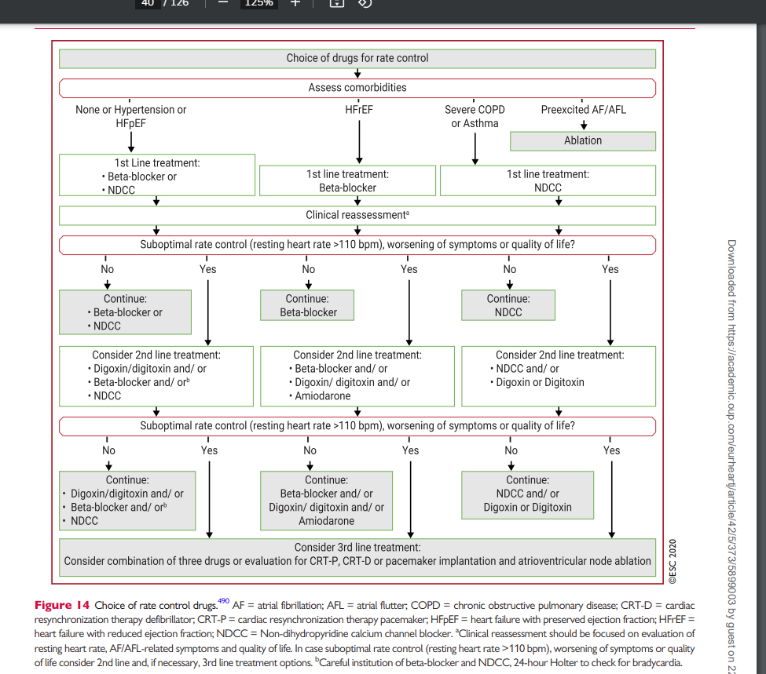 |
| ------------------------------------------------------------ | ------------------------------------------------------------ |
| 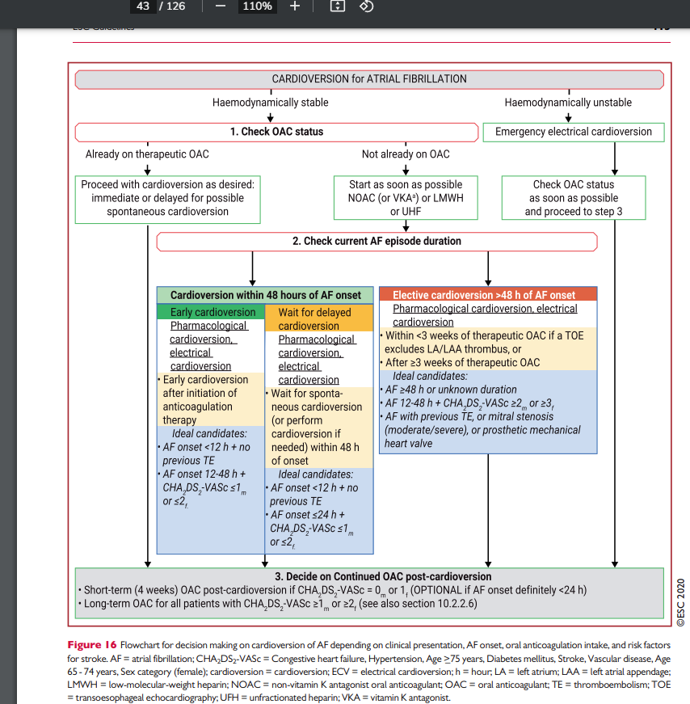 |                                                              |

#### Fall 1 - KF

***Presentation***

* **66åå pat**
  * **trötthet VC**
  * **tagit EKG, som visar FF med 100-115 frekvens**
  * **Återbesök 4 månader senare.** 
    * eko visar lätt förstorade förmak 
    * elkonvertering har gjorts
    * inför elkonvertering lades ni waran
    * trombyl sattes ut
    * metoprolol sattes in för frekvensreglering
    * patienten har dock nu återfått förmaksflimmer
  * **Aktuella lkm**
    * Waran 2.5mg, enl behschema för att förebygga proppar
    * Metoprolol orion 200mg 1+0+0 mot hög hjärtfrekvens
    * Simvastatin 20mg 0+0+1 för blodfetterna
    * Enalapril actavis 10mg 1+0+0 mot högt BT
  * **Ta ställning till fortsatt antikoag motivera, chadsvasc lathund**
    * Ålder
    * Hypertoni

***Patofysiologi***

* **Ökade besvär vid fysisk ansträngning vid FF**
  * frånvaro sinus vid ökande frekvens
  * ger varierad fyllnad av kamrarna
  * inget effektivt hjärtminutvolym
  * förmakskontraktionens relativa betydelse för kamrarnas fyllnad ökar vid ökar hjärtfrekvens, varpå detta inte finns vid FF
  * Förkortad kammarfyllnad, varpå diastole förkortad

***Utredning***

* **Snarast utredning**
  * EKO: utesluta strukturell orsak till flimret
  * remiss för elkonvertering eftersom pat har sympotm av sitt FF och 
  * insättning anitkoag som skydd mot embolier
  * betablockad för frekvensreglering
  * därmed trolig symptomlindring
* **CHA2DS2-VASc**
  * 1 Congestive heart failure
  * Age
    * 2: över >=75åå
    * 1: 65-74
  * 1 Diabetes
  * 2 Stroke, TIA, Trombembolism
  * 1 Vascular disease: Kärlsjukdom
  * 1 Sex: kvinna

#### Fall 2

Du arbetar som AT-läkare på vårdcentral. Du förbereder nu morgondagens mottagning då Magnus Lindgren ska komma för uppföljning. Magnus Lindgren född 410428-1234 (76 år) sökte dig för 4 veckor sedan på grund av hjärtklappning som kommer och går, samt trötthet och lätt andfåddhet vid ansträngning. I anamnesen -välreglerad diabetes typ 2 sedan 72 års ålder, -läkemedelsbehandlad hypertoni sedan 70 års ålder, -knäledsartros med värk vid fysisk aktivitet, ej nattlig smärta. I status fann du normalvikt, normal andning 15/min, ingen ortopné, diskreta pittingödem, RR ca 80/min, normala toner inga biljud, carotider ausk ua. BT 155/100, buk mjuk, oöm. EKG visade sinusrytm och lätt vänsterkammarbelastning. 

LKM lista

* Trombyl (acetylsalicylsyra, trombocytaggregationshämmande) 75 mg 1 tablett på morgonen
* Amlodipin (Ca-flödeshämmare) 10 mg 1 tablett på morgonen
* Metformin (antidiabetikum) 850 mg 1 tablett till frukost, 1 tablett till middagen
* Simvastatin (blodfettssänkare) 40 mg 1 tablett till kvällen.
* Ibuprofen (COX-hämmare/NSAID) 400 mg 1 tablett på morgonen, samt 1 tablett vid behov

i status fann du

* normalvikt, normal andning 15/min, ingen ortopné, diskreta pittingödem,
* RR ca 80/min, normala toner inga biljud, carotider ausk ua.
* BT 155/100, buk mjuk, oöm.

Du beställde prover och remitterade patienten för 24 h-EKG, hjärt-EKO, arbetsprov och blodtryck x 3 hos distriktssköterska. Du har nu svar på prover och undersökningar: Lab: Pro-BNP: 519 (ref <194 ng/L) Hb: 141 (ref 134-170) eGFR: 65 ml/min (ref >90ml/min) HbA1c: 46 mmol/mol (målvärde <52 mmol/mol) P-HDL/P-LDL/P-TG: tecken till dyslipidemi TSH och frittT3/T4: normala värden Na, K, Ca: normala värden

24-h-EKG: Intermittent förmaksflimmer Hjärt-EKO: Ejektionsfraktion 40–45%, inga klaffskador, ingen dyskinesi Arbetsprov: lätt sänkt arbetsförmåga, inga hållpunkter för ischemi.

Din samlade bedömning blir att Magnus Lindgren har ett intermittent förmaksflimmer och vänsterkammarsvikt, NYHA I, inga hållpunkter för kliniskt signifikant kranskärlssjukdom. Du har också fått resultat från blodtryckskontroller hos distriktssköterska: 157/99, 153/95, 155/ 103

Enligt Chads-Vasc finns indikation för antikoagulantia och du planerar att sätta in apixaban (Eliquis) i dosen 5 mg x 2 och Enalapril 20mg 1 x 1 

Förändringar t lkm lista:

* Trombyl: utsättning; för att inte dubbelbehandling mtp blödniing
* amlodipin kvar: ace-h in men tryck ej optimalt nu
* metformin: kvar, har okej gfr, bra DM kontroll
* simvastatni: kvar, ev doshöja
* ibuprofen: ut, ej dubbelbeh. 
  * generellt risk-lm för äldre, för han har njurfunktionsnedsättning

### Infarkt

***Etiologi och patofys***

* **RCA-infarkt**
  * försörjer SA-nod, AV-nod
  * bradykardi
  * AV-block
* **LAD-infarkt**
  * Vänstergrenblock

### Kammartaky

### Supraventrikulär takykardi

***Presentation***

* 25åå man
  * inkommer pga palpitationer och hjärtrusning i vila titta på TV
  * enl ABCDE
  * Ett tydligt C problem: 190HF, RR, EKG visar SVT, BT 80/50.

***Differentialdiagnoser***

* Sinus taky
* Förmakstaky
* AVNRT: AV-nod reentry takykardi
* AVRT: AV-reentrant taky
* Junctional taky
* Förmaksflimmer/fladder

### Utredningar

#### Alarmsymptom

* Svimnign
* Bröstsmärta
* Dyspne
* Kraftig Yrsel

// Då gör man utredningen även på en yngre person

#### Långtids-EKG, Holter

***Indikationer***

* Förmaksflimmer: vanligaste orsaken till att man letar efter detta. 
* VES
* SVES

***Notera***

* Ålder
  * Yngre patienter: Sannolikheten att det är ett förmaksflimmer är mindre, därför kanske inte den direkta indikationen för att göra ett Holter
    * den andra läkaren säger sig vara friskostig att skicka på långtids-EKG ändå, för att man ska ge svar på patienten även mo det är SVES som är godartade, då kan man förklara för patienten,
    * evt ge Betablockad
    * Alltså the jury is split, men andra läkaren säger att det inte är den största indikationen om patienten är yngre att skicka iväg en patient på EKG. 
    * **Fall där det är farligt**: 
      * **Alarmsymptom**: svimning, bröstsmärta, dyspne, biljud, klaffljud..

***Typ av långtidsregistrering***

* Kan välja upp t 72h, beställa på klinfys

#### !! Thyroidea

* OBLIGAT att göra på IST för dessa patienter
* !! Notera att man ska titta på film för att se hur denna status utförs. 

### Fall

#### Fall 1

***Presentation***

* 61-årig kvinna, 
  * idrottslärare, fysiskt aktiv. Patienten söker nu med 2 månaders anamnes på intermittent hjärtklappning cirka 10 min ej direkt korrelation till fys akt. Igår känt efter spinning pass varför pat kommer idag. Svettningar i samband med menopaus, ej längre. Ingen övrig symptomatologi. Ingen viktnedgång. Mår bra i övrigt trivs på arbetsplatsen. Sparsamt alkohol, aldrig rökt. En bror tablettbeh hypertoni. Mor och far i livet, mor 87 år spinalstenos, far 86 år, höftop x 2 förhållandevis pigg för sin ålder. 

***Utredning och handläggning***

* **Patientkommunikation**
  * Startar öppen fråga, bereder patienten talutrymme för sin berättelse
  * klargör vad pat sj tänker kring symptom o problem
  * klargör pats oro kring symptom o problem
  * utforskar vad pat vill få ut av besök
  * bekräftar pat känslomässigt, verbalt, icke verbalt
  * gör relevanta sammanfattningar
  * förvissar sig om att patienten fått diskutera sina frågor o ger utrymme för patienen att ställa ev kompletterande frågor
* ***Delaktighet enligt patientlagen §5***
  * !! mot vad bagkrund av vad som framkommit i anamnes o status, förkalrar motiverar o involverar patienten i fortsatt planering o beslutsfattande
* **Anamnes**
  * **SOCRATES, hjärtklappningen**
    * karaktär
    * duration
    * förlopp över tiden
    * utlösande faktorer, förbättrar, försämrar
  * **Associerade symptom**
    * bröstsmärta
    * andfåddhet
    * bensvullnad
    * tecken katekolamin påslag, 
    * tecken thyroidea
    * flush
    * tremor
    * muskelsvaghet
    * utforskar stressnivå: Vad jobbar du med, trivs du? Är det stressigt på jobbet?
  * **Allmänna symptom**
    * trötthet
    * feber
    * viktnedgång
    * aptit
    * avföringsvanor
    * blod i avföring
    * hereditet
      * kardiovaskulär
      * endokrint
      * annat
  * **socialt**: yrke, fysisk aktivitet
  * **tobak, alkohol**
  * **medicinering**
    * typ, dosering, effekt, inkl naturpreparat
    * Receptfria läkemedel
* **Status**
  * **Hjärta**
    * 4 locales
    * carotider
    * axill
    * papill ictus
  * **halsvensstas**
  * **perifer öderm**
  * **Lunga**
    * perkussion
    * auskultation
  * **Lymfkörtlar**
  * **Thyroidea**
  * **bukstatus**
* **Kliniskt resonemang**
  * kan resonera, akut, allvarligt, vanligt
  * att värdera o priotera utifrån patientens symptompresentation
    * hjärtklappning
    * svettningar
  * utesluta kardiell etiologi
  * bekta endokrin/thyroidea
  * övriga ev malignitetstecken
  * psykisk etiologi
  * alkoholsm
  * bed korrekt vårdnivå
* **Gör rimlig prel bedömning**
* **Åtgärder: föreslår adekvata åtgärder**
  * planerar adekvat o riktat
  * provtagning
    * Hb
    * K
    * krea
    * p-glukos
    * TSH
    * T3,T4
    * NT-proBNP
    * 24h EKG, holter
    * Ger inga extra poäng
      * PK/INR
      * EKO

#### Fall 2 - Paroxysmal SVT

* Läkare: Din nästa patient är en 62-årig kvinna/man som söker pga hjärtklappning. Patienten har inte varit på mottagningen tidigare.  EKG visar sinusrytm ua, frekv 60 BT 120/65

## Blodtryck

### Standardiserad utredning

***Diagnoskriterier***

* På läkarmottagning
  * BT >=140/90
* Mätt i hemmet: >=135/80
  * Dag: >=135/85	
  * Natt: >= 120/70
  * 

***Utredningskedja för hypertoni (enl VGregion)***

* **Basal utredning**
  * 2-3 standardiserade BT mätningar  vila, sittande/liggande, 
  * arm i hjärthöjd
* **Vid äldre / misstänkt ortostatiskt BT**
  * mäta BT stående också
* **Bör använda automatiserad BT mätning, i hemmet**
* **Ambulatorisk BT mätning** (i.e. under 24h) värdefullt komplement t BT uppmätt vid vårdinrättning
  * Att man mäter över 24h
  * 

***Utredningskedjan för hypertoni (enl IM)***

* Längd, vikt, midja-stussmått
* Tobak, alkohol, droger
* Blodprover: 
  * S-kalium, 
  * S-kreatinin
  * f-glukos
  * kolesterol
  * triglycerider
* Urinprover: 
  * Sticka: proteinuri, glukosuri, hematuri
* EKG: 
  * arrytmi
  * vänsterkammarhypertrofi,
  * LVH, cornell-produkt
* Hemblodtryck eller ambulatorisk BTmätning: 
  * nyttigt vid vitrockshypertoni

### Behandling

***Indikationer***

* Sammanlagd historik, status
  * risk hjärtkärlsjd
  * BT nivå
  * riskfaktorer

***Behandling***

* **Livsstilsåtgärder**: basen vid behandling
  * Rökstopp: mest angeläget
  * Motion
  * Mat: dietist grejor, att man ska modifiera matvanor
  * osv +
* **Rektangel**: Den försöker illustrera att den minst bästa kombinationen är ACE/ARB + betablockad. 
* Enligt kloka listan
  * **Börja med två preparat direkt**: bättre effekt och BT kontroll
    * **ACE-h/ARB**: enalapril, losartan
    * **med kalciumantagonist**: amlodipin
    * **eller diuretika**: tiazid
      * Föreligger risker med användning
        * 
    * **Kombinationer**: ACE/ARB + kalciumantag eller ACR/ARB + diuretika
  * **Notera**:
  * 

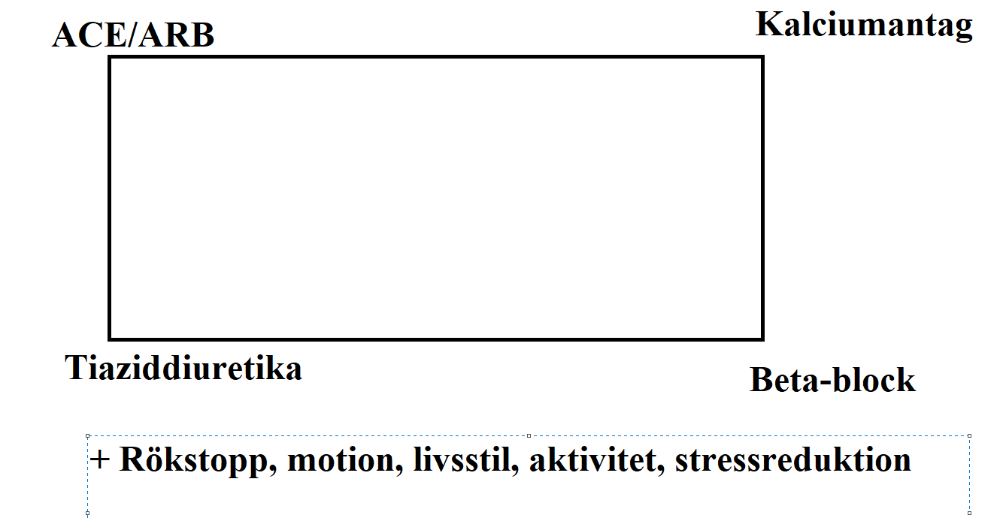

#### Fall 1

* Följande patienter behöver inleda eller ökar behandling BT
  * Pat med DM2 + albuminuri, insättning ACE-h? Ja, lämåligt
  * Pat astma, insättning betablockerare? olämpligt mindre lämpligt
  * Pat kompenserad hjärtsvikt, behandlas med ACE-H, tillägg betablock? Ja lämpligt
  * Kombination ACE-h + tiazid i maxdos, tillägg kalciumantagonist? 
  * Pat har claudicatio intermittens, insättning betablockerare? olämpligt
  * Pat har gikt, insättning tiazid? Olämpligt

## Blödning

### Hemoptys

***Etiologi***

* Enl (s184, SDT)
  * Akuta, brådskande fall
    * Lungemboli
    * Pneumoni
    * Mitralisstenos
    * Hjärtsjukdom
  * Vanliga orsaker
    * Bronkial-cancer
    * Bronkit
    * !! Bronkiektasi: irreversibel dilatation av bronker, pga destruktion muskulära + elastiska element bronkväggen

### Riskfaktorer

***Riskfaktorer för att blöda, tenta***

* Anamnestiskt
  * Alkohol
  * Fallbenägenhet
  * Hypertoni
* HASBLED: risk blödning FF som ska få antikoag
  * Hypertoni: 
  * Abnormal njurfunk eller leverfunk
  * Stroke
  * Blödningsbenägenhet: blödning i anamnesen eller predisposition (misstänkt blödningsanemi)
  * Labil INR
  * Elderly: över65åå
  * Droger eller alkohol

## Bröstsmärta

### AKS

#### Hjärtinfarkt

***Presentation***

* En 41-årig man med känt diskbråck i halsryggen samt övre luftvägsinfektion söker med central bröstsmärta sedan 2 timmar. Han beskriver att värken strålar ut i skuldrorna. Smärtan kom successivt då mannen var ute och gick med sin hund. Mannen beskriver smärtan som tryckande över bröstkorgen. Smärtan är inte lägeskorrelerad och förvärras inte då mannen hostar. Mannen erfar illamående, svettas lätt och erfar kraftig ångest. Han är blek och andfådd i vila. Puls 88, BT 110/60. Hjärta och lungor auskulteras ua. Vilken av nedanstående är den enskilt mest sannolika diagnosen? (1p)
  * Sannolikt hjärtinfarkt
* 

***Etiologi***

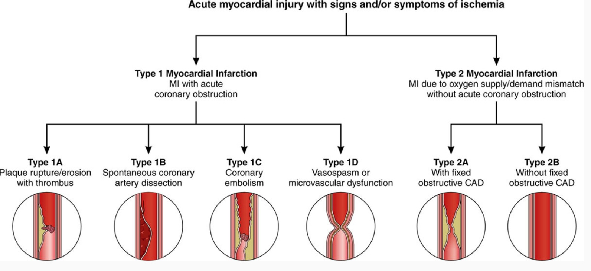

***Utredning och handläggning***

* Indikation **akut cor-angio, primär PCI, eller trombolys** (både 1 och 2 ska uppfyllas): Alltså de mest akuta behandlingarna, för det finns ett alternativ där man lägger in patienten på övervak på HIA
  * **Infarktmisstanke + smärtdeb ut <12h**
    * tecken på pågående ischemi kan tidsgrnsen förlängas
  * **ST-höjningar i EKG**
    * **EKG kriterier för ST-höjning:**
      * **ST-höjning i 2 angränsande avledningar,** 
        * i >=1mm
        * i V2, V3:
          * i >=2mm män (>=2.5mm män under 40år), 
          * i >=1.5mm kvinnor
      * i frånvaro tecken av vänsterkammarhypertrofi, eller stor Q-vågsinfarkt i samma område
      * jämför med tidigare EKG
  * Då går man vidare oavsett troponin. 

***Behandling***

* ***Laddningsdoser***
  * ASA 500mg
  * Brilique 180mg
  * nitro vb
  * morfin vb
  * betblockad inj (omvärderas: kontraindik inkl AV2-AV3-block, bradyarrytmier, svår hjärtsvikt)
* ***PCI inom 2h möjligt***
  * ladda heparin + GP2b/3a hämmare
  * transportera direkt t PCI-labb.
* ***PCI ej möjligt inom 2h***:
  * Omedelbar trombolytisk behandling (inom 30 min) övervägs till patienter inom 12 tim symptomdebut och där tid från reperfusionsgrundande EKG till sjukhus med beredskap för primär PCI förväntas överstiga 2 tim
  * ***trombolytika*** iv: alteplase, tenecteplase, reteplase
  * ***tilläggsbeh***: ASA + klopidogrel
  * ***Efter trombolys fram till cor-angio el PCI***: låg-molek heparin
  * alla pat cor-angio 3-24h fr trombolys
* ***enl SVKF***: https://www.sls.se/globalassets/svkf/aks-rekommendationer-svkf.pdf
  * UNDER cor-angio o PCI
    * Bivalirudin (Angiox): bolusdos efterföljt av infusion under hela ingreppet. Infusionen kan fortsättas i upp till 4 tim efter PCI (exempelvis vid stor trombbörda). eller
    * Heparin monoterapi (70–100 E/kg kroppsvikt)
    * Glycoprotein IIb/IIIa-hämmare (Integrilin, Reopro, Aggrastat) kan övervägas i kombination med heparin till patienter med stor hjärtinfarkt och kort symtomduration (<2 tim) vid låg blödningsrisk eller som bail-out vid otillräcklig effekt av bivalirudin/heparin.

| 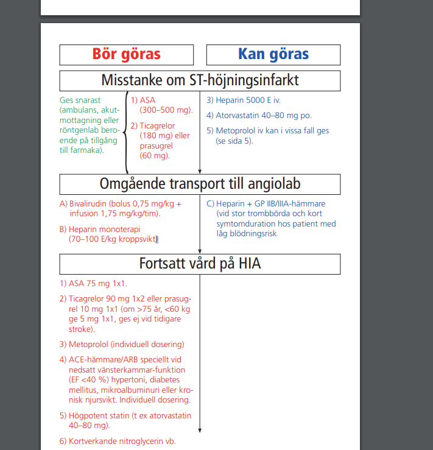 | 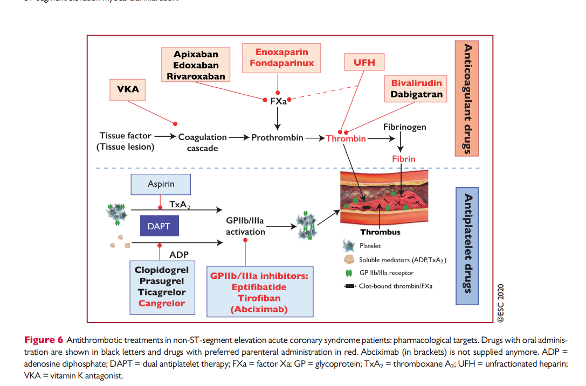 |
| ------------------------------------------------------- | ------------------------------------------------------------ |
|                                                         |                                                              |

#### Non-ST elevation AKS

! ***Handläggning***

* ***Akut handläggning***
  * EKG: visar T-negativiseringar, pressade ST-sträckor etc
  * ***Laddar***
    * ***ASA 500mg***: tuggar på tabletterna för snabbt upptag
    * ***Ticagrelor 180mg*** (brilique, ADP-rec hämmare): för extra trombocythämning, svälja dessa (eller krossas blanda vatten)
    * ***Arixtra inj***: vid diagnos, när man inte planerar PCI eller cor-angio närmsta tiden. 
    * morfin vb
    * nitro vb
    * betablockad inj (utefter kontraindik: AV2-AV3 block, bradyarrytm)
* ***Långtidsbehandling***
  * ***Take-home messages***
    * ***Dubbel trombocythämning 12 månader*** (om ingen blödningsrisk)
    * ***Förmaksflimmer***: tillåtet trippelbehandling närmsta 12 mån (utefter blödningsrisk)
    * ***Statiner***: livslångt
    * ***Nitroglycerin***: puffar, vb, symptomatiskt
    * ***Betablockad***: gradvis upptitering, för alla
    * ***RAAS-blockad***: ace-h, ARB
    * ***MR-hämmare***: spironolakton beroende på HFrEF
    * ***Furix***: om hjärtsvikt o ödem
    * ***EKO***
  * ***Allmänt fr Sveriges Kardiolog Förbund SVKF 2015***: https://www.sls.se/globalassets/svkf/aks-rekommendationer-svkf.pdf
    * Tabl ASA (acetylsalicylsyra) 75 mg x 1 långtidsbehandling
    * Tabl ticagrelor 90 mg 1x2 eller prasugrel 10 mg 1x1 (för riskpopulationer ges 5 mg 1x1). Behandlingsduration vanligtvis 12 månader vid AKS men kan kortas ned vid hög blödningsrisk. Överväg protonpumpshämmare (omeprazol) till pat med ökad risk för gastrointestinal blödning.
    * Peroral antikoagulation bör ges till patienter med samtidigt förmaksflimmer.
    * Trippelbehandling. Vid indikation för oral antikoagulantiabehandling och samtidig indikation för dubbel trombocythämning efter genomgången AKS kan så kallad trippelbehandling övervägas. Viss klinisk erfarenhet finns för kombinationsbehandling med warfarin, ASA och clopidogrel. Evidens saknas dock för kombinationsbehandling med antikoagulantia (gäller både warfarin och NOAC) och ticagrelor/ prasugrel med eller utan ASA. Individuell bedömning av risken för trombos mot risken för blödning måste göras. Vid högre blödningsrisk bör trippelbehandlingens duration förkortas till förslagsvis 1–3 mån.
    * Kortare tids behandling med peroral antikoagulation kan övervägas till patienter med stora framväggsinfarkter oavsett flimmerförekomst, där man bedömer att patienten löper hög risk för kardiell emboli. Det vetenskapliga underlaget för detta är dock svagt.
    * Betablockerare. För iv behandling, se sid 5. Eftersträva gradvis upptitrering. För hastig upptitrering kan förvärra/utlösa hjärtsvikt. Bör ej ges vid AV-block II/III, bradykardi, hypotoni (systoliskt BT<100 mmHg) eller obehandlad hjärtsvikt. Försiktighet bör iakttas vid uttalad obstruktiv lungsjukdom samt i akutskedet av en inferior hjärtinfarkt. Lämplig startdos är beroende av blodtryck, puls och sviktsymtom men hos ”stabil” patient kan kortverkande tablett metoprolol (Seloken) 50 mg 0,5x2–3 ges i anslutning till hospitaliseringen och vid uteblivna biverkningar därefter skiftas till långtidsverkande tablett metoprolol 50–100 mg (om osäkerhet om tolerabiliteten ges lägre) Fortsatt upptitrering kan ske polikliniskt.
    * Potent statin t ex atorvastatin 40–80 mg till samtliga pat med verifierad kranskärlssjukdom. Individuell bedömning hos pat > 80 år, underviktiga, njursvikt eller interagerande läkemedel.
    * RAS-blockad där ACE-hämmare är förstahandsval och ARB (angiotensinreceptorblockerare) vid ACE-hämmarintolerans: ges speciellt vid nedsatt vänsterkammarfunktion (EF <40 %), vänsterkammarhypertrofi, hypertoni, diabetes mellitus, mikroalbuminuri och njursvikt. Låg startdos (ex ramipril 1,25 mg 1x2 eller enalapril 2,5 mg 1x2 med gradvis upptitrering).
    * Aldosteronhämmare (spironolakton eller epleronon, startdos 25 mg för bägge preparaten med måldos 50 mg för eplerenon och 25–50 mg för spironolakton): ges vid nedsatt vänsterkammarfunktion (EF <40 %).
    * Kortverkande nitroglycerin: till alla patienter.
    * Vid tecken på hjärtsvikt med lungödem/lungstas bör furosemid iv ges (lämplig startdos 40–80 mg iv, dosering beroende på njurfunktion). Kan upprepas. Vid fortsatta sviktsymtom rekommenderas tillägg av CPAP. Vid samtidigt stegrat pCO2 rekommenderas istället BiPAP. Om patientens blodtryck tillåter kan vid utebliven/dålig effekt nitroglycerininfusion påbörjas. Om patientens hjärtsvikt trots ovan åtgärder inte kan hävas bör inotrop behandling övervägas och kontakt tas med tertiär kardiologklinik eller intensivvårdsavdelning i tidigt skede för diskussion om övertag.
    * Ekokardiografisk undersökning bör utföras på alla patienter under vårdtiden.

| 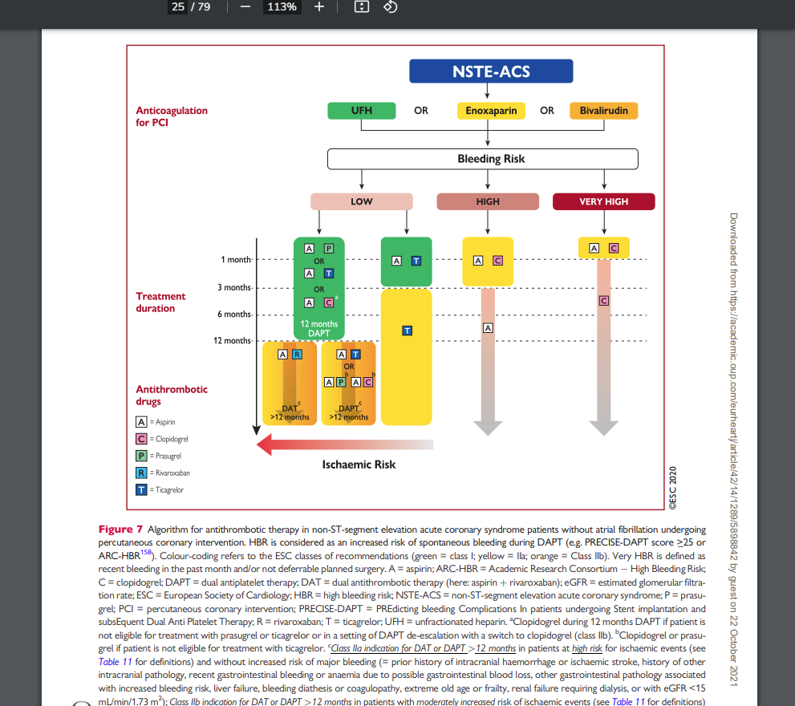 |      |
| ------------------------------------------------------------ | ---- |
|                                                              |      |

##### Instabil angina

###### Allmänt

***Definition***

* **Nydebuterad angina**
  * **All nydebuterad angina pectoris** med progredierande symptom senaste 4 veckorna
  * **Känd angina med förvärrat smärtmönster**: de senaste 4 veckorna
    * blivit dagliga
    * mer lättlutlösta
    * mer långdragna
    * svar sämre på nitro
    * uppträder i vila
  * **Lättutlöst angina pectoris** de första 4v efter akut hjärtinfarkt. 
* ***Enligt ESC guidelines 2021***
  * Defined as myocardial ischemia at rest or on minimal exertion
  * in the absence of myocardial injury or necrosis
  * Compared with NSTEMI patients, individuals with unstable angina do not experience acute cardiomyocyte injury/necrosis, have a substantially lower risk of death, and appear to derive less benefit from intensified antiplatelet therapy, as well as an invasive strategy within 72 h
* ***SAMMANFATTNING***
  * ***NOTERA***: all nydebuterad angina BEHÖVER INTE vara instabil angina
  * ***Instabil angina definieras som***
    * myokardischemi utan myokardskada (i.e. man ser inget på troponinerna)
    * exemplifieras av 
      * viloangina
      * angina som kommer efter väldigt lätt ansträngning
      * angina som har blivit mer lättutlöst
      * angina med matätning
      * angina som förvärrats de senaste 4 veckorna

***Kliniska kännetecken***

* Bröstet
  * Smärta
  * tryck
  * sveda
  * duration mer än 20min
* Nydebuterad angina, ökande symptom senaste 4 veckorna

***Utredning och handläggning***

* Akut remiss till sjukhus för dessa patienter

##### NSTEMI

***Definition***

### Stent komplikationer

***Typer***

* In-stent restenos
  * 6mån efter stentning
  * orask
    * neointima hyperplasierar
    * glatta muskelceller prolifererar alltså
  * risk: några procent. 
    * högre risk för de med enbart ballongvidgning
    * lägre risk för lkm stents
  * Riskfaktoer
    * mindre kärl, mindre diameter
    * diabetiker
* Stent trombos
  * 2-4v efter stent; kan ske senare
  * ger ny infarkt
  * under 1% risk om dubbel trombocythämning
  * Orsaker
    * compliance dubbel trombocythämning
    * resistens mot klopidogrel

#### Restenos

***Kliniska kännetecken***

* Angina efter stent

### Takutsubo

***Kliniska kännetecken***

* STEMI men inget på cor-angio under PCI
  * Kan leda till misstanke om takutsubo
* Hypokinesi, apikalt på UL

***Utrendning och handläggning***

* Anamnes
  * Stressfaktorer: viktigt att få med i anamnesen

### Fall

#### Fall 1

***Presentation***

* 60-årig kvinna/man 
  * med kontorsarbete, normalviktig, sparsamt fysisk aktivitet, gift. Delar en flaska vin med make/maka per vecka, rökare (5 cig/dag) fram tills för 4 år sedan då barnbarn fötts. Söker med 4-5 veckors anamnes med 5 episoder med initialt lättare kramande tryckande central bröstsmärta vid lättare ansträngning, initialt kommit vid promenad, symptomen exaecerberats över tid, igår tillkomst av vegetativa symptom med illamående, kallsvettighet i samband med att patienten skyndat fram till bussen, VAS 7 som värst, smärtan satt i över 20 minuter. Söker nu på VC. Inga besvär i vila. I anamnesen tablettbehandlad hypertoni, varit välreglerad. Patienten själv hade även fråga kring glutenintolerans. 

***Utredning och anamnes***

* pat kom
  * Status med öppen fråga o bereder patienten talutrymme
  * klargör vad pat sj tänker kring symptom o problem
  * Tankar, oro, önskan
  * bekräftar känslmässigt
  * etc etc
* Anamnes
  * huvudsymptom, smärtan
    * Socrates
    * lokalisation: retrosternalt
    * Karaktär: tryckande, kramande
    * Intensitet: VAS 6-7, vid max
    * Duration: va 15min
    * Förlopp över tid: förvärrats
  * Utlösande faktorer
    * Förbättrar, försämrar? vila aktiviett
    * klarlägger ansträngningskorrelation
  * associerade symptom, vegetativa symptom
    * kallsvettig: ja
    * illlamående: ja
    * smärtutstrålning: nej
  * Associerade symptom
    * Hjärtrytm, känsla av arrytmi: nej
    * bensvullnad: nej
    * andfåddhet: ej ökad
    * utforskar stressnivå
    * trötthet
    * viktnedgång
    * feber
  * förändrade avföringsvanor
    * Förstoppning, diarre
    * inget som ändrats, normala avföring, gaser då  o då
  * tobak, alkohol
  * hereditet: kardiovaskulärt
  * Socialt
    * yrke
    * fysisk aktivitet
  * Medicinering
    * dosering, frekvens, compliance
    * naturlkm
    * receptfria lkm
* Status
  * Hjärta
    * korrekt 4 stationer
    * carotider
    * axill
  * halsvensstas
  * perifera ödem: dekliva ödem
  * lungor
    * auskultation
    * perkussion
  * Bukstatus
    * adekvat teknik
* Kliniskt resonemang
  * 2 min efter avslutad konsultation
    * hos pat med retrosternal smärta förstå att i ett initialt skede inkludera röda flagga avseende kardiell vid diffdiagnostik
    * att kunna värdera anamens o statusfynd
    * identifiera ev riskafktor: gm efterhåra ang
      * rökning
      * fysisk aktivitet
      * hereditet
      * psykosocial stress
    * samt prioritera avseende akut, allvarligtm vankligt
    * korrekt vårdnivp
* Patkommunikation
  * inkluderar o involverar pat
* Bedömning o åtgärd
  * rimlig prel bedömning
    * Beaktar anamnes
    * misstänka instabil angnia tills motsatsen bevisad
  * föreslår rimlig handläggning
    * EKG
    * inremitterar patienten till AKM

#### Fall 2 - infarkt

***Presentation***

* 57-årig kvinna kontorsarbetande kvinna med tablettbehandlad diabetes mellitus typ II söker på akutmottagningen med ett par dagas anamnes på tilltagande obehagskänsla i nedre delen av bröstet centralt. Initialt i samband med ansträngning. Sedan ankomst till akutmottagningen anger patienten att hon känt tryck och viss smärta över bröstet, även illamående och kallsvettighet i vila. EKG visar inferior infarkt (STEMI) med ST-höjning inferiort (II, III, aVF).

***Utredning o handläggning***

* Patkom
  * tankar oro önskan
  * öppna frågor
  * sammanfattar
* Anamnes
  * Huvudsymptom obehag bröstet
    * SOCRATES
    * debut
    * locale
    * duration
    * utstrålning'
    * intensitet
    * kaaraktär
    * utlösande faktor
    * förbättra försämra
  * illamående kräkning
  * ! andfåddhet
    * duration
    * utlösande faktorer
    * förbättras vid
  * associerade symptom
    * övriga symptom
    * bensvullnad 
    * infektion
  * tidg sjd, nuv sjd
  * hereditet
  * tobak, alk
  * fys aktivitet
  * lkm
    * naturlkm
    * receptfritt
  * allergi
* Status
  * hjärta
    * 4 punkter
    * axill
    * apex
    * samtidig palp a radialis
    * carotider
  * lunga
    * auskutlation
    * perkussion
  * undersöker dekompensationstecekn
    * halsvenstas
    * ödem
  * Bukstatus
    * adekvat
    * !! palperar aorta
  * Tolkning EKG
    * !! STEMI
* Kliniskt resonemang
  * Stud ska pres hur hen har prio o reson
* Bedömning o åtgärd
  * Stud gör rimlig prel bedöm
    * identifierar STEMI
  * Adekvat ågärder
    * kontakt PCI jour
      * för akut cor angio
    * laddningsdos 
      * ASA + Brilique
      * alt ASA + Klopidogrel
      * morfin
      * nitro
      * furix
* Patkom

#### Fall 3 - chordaruptur

***Presentation***

* Tidigt på morgonen kl. 07.00 blir du kontaktad av sjuksköterskapå HIA. Patienten har mått bra hela natten men för halvtimme sedan började hon få andningssvårigheter och saturationen ligger på 80 % med syrgas 15 l/min på mask. Du springer till HIA och status är: AT: kallsvettig, takypnoisk dock fullt pratbar, BT: 120/80mmHg, puls: 110/ minut. Lungor: Tydliga basala rassel bilateralt.
* När du auskulterar hör du regelbunden rytm och ett tydligt nytillkommet systoliskt blåsljud som hörs över hela prekordiet. Du bedömer patientens tillstånd som akut vänstersvikt och du tillkallar hjärtjouren för att genomföra hjärteko

***Etiologi***

* RCI infarkt
  * Chordaruptur: mitralisinsufficiens
  * Apikal septumruptur

#### Fall 4 - Instabil angina

***Presentation***

* Katrin berättar att besvären uppstod för ca en vecka sen, att hon aldrig haft dessa symtom tidigare. Att värken känns som ett band runt bröstet och går över då hon vilar, ev är andningen är ngt tyngre nattetid och att besvären kommer oftare nu än i början. Hon har tidigare arbetat som svetsare vid Skanska men pensionerades för 7 år sedan. Har aldrig rökt. Upp till 5-6 glas vin per vecka men aldrig mer. Inte legat på sjukhus och enda läkarkontakten är vårdcentralen. Hon är gift och har en dotter som är sjuksköterska i Malmö och som rekommenderat henne söka snarast möjligt för sina besvär.
* I status noterar du: AT gott och opåverkad. Inga perifera inkompensationstecken. Cor: Regelbunden rytm, frekvens c.a. 80. Bltr: 130/70. Pulm: Du anar diskreta rassel basalt bilateralt. Buk: Mjuk och oöm. Ingen hepato-splenomegali.

#### Fall 5 - IPK

***Presentation***

* Du är nyexaminerad läkare och vikarierar på Medicinkliniken på ett medelstort sjukhus. Du har börjat gå egna jourer sedan 2 veckor tillbaka. På natten är du ensam ansvarig för medicin och hjärtavdelningarna samt för akut inkomna patienter på din klinik. Du har en bakjour i hemmet med inställningstid 30 min. Du har precis påbörjat ditt nattpass och får veta att en ambulans med medvetslös patient, är på väg in. Beräknad ankomsttid är ca 10-15 min. Akutmottagningen ligger nära IVA men det tar ca 5 min att komma till de flesta medicinavdelningar. När du får klartecken att gå in på denna station ska du genomföra ett telefonsamtal med en sjuksköterska på en avdelning. Denna informationstext samt papper och penna finns på rummet Säg till när du är beredd att ta emot samtalet
* Intagningsorsak TIA
  * Socialt Lärare på gymnasiet. Gift, vuxna barn
  * Tobak Icke rökare
  * Tidigare/nuvarande
  * sjukdomar
  * Lindrig astma Hypertoni Hyperlipidemi
  * Tablettbehandlad DM sedan 2005
* Överkänslighet Ingen känd mot läkemedel. Aktuellt Söker pga. övergående svaghet i vä arm samt hängande mungipa. Besvären höll i sig i 20 minuter för att därefter försvinna helt.
* Kommer till AKM en timme senare helt återställd. Aldrig liknande besvär tidigare.
* Aktuella läkemedel 
    * Metformin 500mg 2x2 Enalapril 10 mg 1x1 Simvastatin 40 mg 1tn Bricanyl vb
* Status
    * Allmän tillstånd Lätt överviktig. Cirkulatoriskt och respiratoriskt stabil. Perifert kompenserad. Orienterad x 3. Sat 98 % på luft. Temp 36,8C.
    * Andnings frekvens 16
    * Hjärta RR, inga hörbara biljud
    * Lungor Vesikulara andningsljud
    * Buk Mjuk, oöm
    * Blodtryck 170/90
    * Neurologiskt Isokori. Pupuller reagerar prompt på direkt och indirekt ljus. Ögonrörelser ua. Synfält enl. Donders ua. Ej nackstyv.
    * Ingen facialispåverkan. Grov kraft extremiteter god symmetrisk. Grasset ua bilat. Finger-näs och knä-häl ua bilat.
    * Biceps, brachio-radialis, patella ordinärutlösta sidlika.
    * NIHSS 0p
    * EKG Sinus rytm. Frekvens 76/min. Inga akuta tecken på ishemi
    * Lab Hb 146, LPK 7,8, TPK 376, Na 140, K 3,6,
    * Krea 76, CRP 8, p-glukos 7,3
* Preliminär bedömning 
    * Bedöms som TIA. Läggs in för snabb utredning. Beställer DT- hjärna. Om ingen blödning laddningsdos Magnecyl 500mg.
    * Lipidstatus imorgon bitti. HbA1C taget, svar föreligger ej.Remiss till carotis –duplex får ombesörjas från avdelningen.ställningstagande till EKO samt Holter via avd.

***Utredning och handläggning***

***Behandling***

## Chock

### Allmänt

***Definitionsmässigt***

* Chock definieras som otillräcklig vävnadsperfusion
* delas in i fyra typer
  * kardiogen
  * obstruktiv
  * distributiv
  * hypovolem

***Kliniska kännetecken***

* Blodtryck
  * Liggande: under 90mmHg systoliskt
  * Ortostatiskt: sjunker över 10mmHg
* Puls
  * pulsstegring över 15 slag
* Takykardi: över 100s/min
* Andning påverkad
* Dåliga pulsar perifert
* Perifer påverkan: blekhet, trötthet, letargiskt etc
* Medvetandepåverkan
* minskad diures: oliguri, anuri

***Åtgärder***

* Bedömning enligt ABCDE
  * Syrgas
  * Vätska: två grova infarter 

### Kardiogen

***Etiologi***

* Hjärtinfarkt
* Hjärtarrytmi

### Obstruktiv

***Etiologi***

* Lungemboli
* Hjärttamponad

#### Hjärttamponad

#### Fall

##### Fall 1

***Presentation***

* 55åå man
  * söker akut pga trötthet och dåsighet de senaste 2 dagarna. Alla i familjen har varit sjuka med en 3åå son som kräkts senaste dagen, 1åå son som har stridor och hög AF. 
  * Anamnestiskt
    * Tkr att det finns smärtor vid andningen, men inga specifika lcoales som gör ont, att det gör ont vid djupandning
  * Airways: Fri luftväg
  * Breathjing: 95% sat, 20 AF
  * Circulation: 80/60 BT
    * Dekompensationstecken, i form av **halsvenstas**.
    * FAST, point-of-care-ultrasound (POCUS): visar högersidig dekompensation och svikt, samt perikardvätska (effusion perikardiet)
  * 

### Distributiv

***Etiologi***

* Septisk chock
* Anafylaktisk chock

### Hypovolem

***Etiologi***

* Hemorrhagisk chock
* icke-hemorrhagisk chock

#### Fall 1

* Du misstänker att Lars drabbats av en angina pectoris på grund av en restenos i det stentade området, vilket också bekräftas av en förnyad coronarangiografi och åtgärdas med förnyad PCI.  
* Tre veckor sedan inkommer Lars under dramatiska former till akutmottagningen där du är jour. Medföljande anhörig berättar att Lars haft ont i magen av och till senaste veckan och nu vid lunchtid började han kräkas blod. AT: Vaken, men svag och slö Cor RR 120 slag/min Pulm ves ua. Förhöjd andningsfrekvens. Blodtryck: 85/60 mmHg
* Orsak
  * Vi har en blödningskomplikation till **vår medicinering**, i.e. antitrombotiska och antikoag. 

### Övriga chockar

***Etiologi***

* Addison kris
* Grab hypothyreos

## EKG

### Tolkning

* Rytm: titta på rytmremsan. 
* P vågor
* Komplex
* ST- sträcka
* 

### Fall 

#### Fall 1

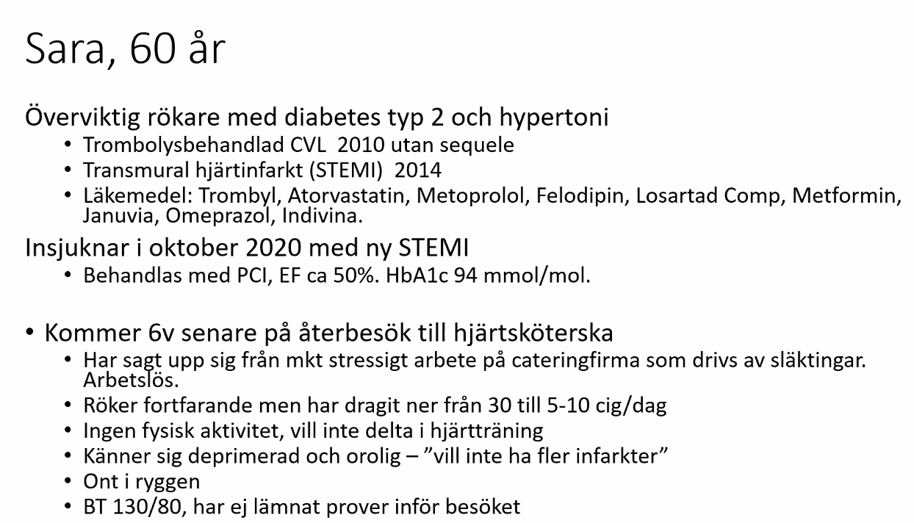

* !! Depressionsanamnes: viktigt att penetrera
  * kommer till rätta med det psykosociala att man hjälpt pat med mkt 

#### Fall 2

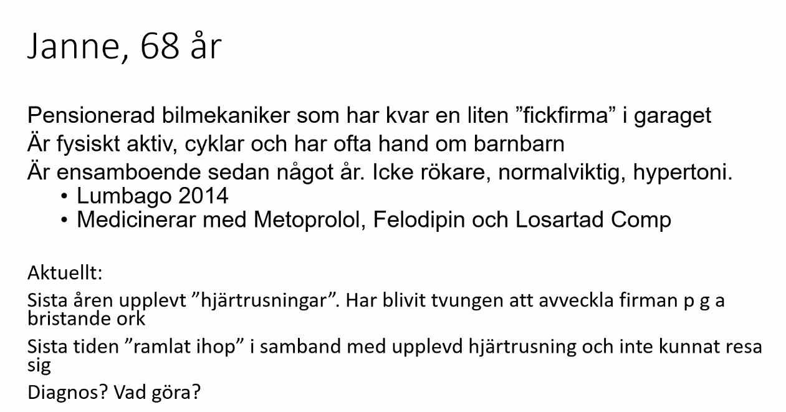

* Differentialdiagnoser
  * Förmaksflimmer
  * Aortastenos
  * Ventrikeltakykardier
* Åtgärder
  * Sätta in antikoagulantia + betablockad vb
    * essentiellt med antikoagulantia.
  * Om patienten svimmar handlöst är det en farlig situation: cardiacoutput försämras av flimret, varpå patientne kollapsar.
  * !! Behandlingsmässigt: ablation kan vara botande
  * Får man så pass kraftigt hemodynamisk påverkan av flimret, att man behöver göra en elektrofys utrending för att göra en evt ablatio. 
* I detta fallet att man behöver speeda upp utredningen pga symptomen. 
* Inget behov för elkonvertering pga paroxysmalt förmaksflimmer och inte ett kontinuerligt sådant. 
* Vad gäller Digoxin: gammal klassisk lkm som inte används speciellt mkt nu längre. Den blockerar överföring av kammarfrekvensen... Inte ett försathandspreparat (repetera lite). 

!! Patient med nytillkommet förmaksflimmer är att skicka till en akutmottagning för en elkonvertering.

#### Fall 3

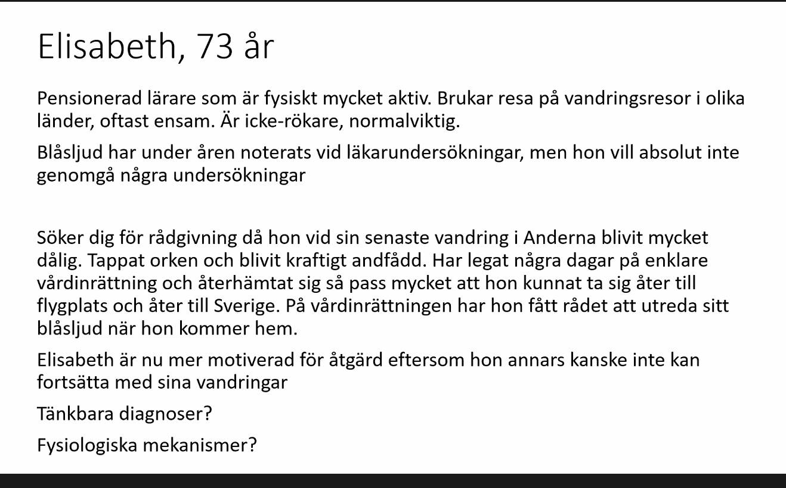

* Minskat syretryck när man stiger i höjd, Po2 i vävnaden sjunker, därför patienten blev så tung när hon kom upp. Har nrämat sig gränsen att klara sig på normal nivå syre vid havet, men högt upp blire knyllt.
* Det som ger symptomet är att det bärs fram för lite syre t vävnaderna: 
  * pumpkraft i hjärtat, dålig CO
  * Anemi
  * Etc. 
* Kan opereras med TAVI

#### Fall 4

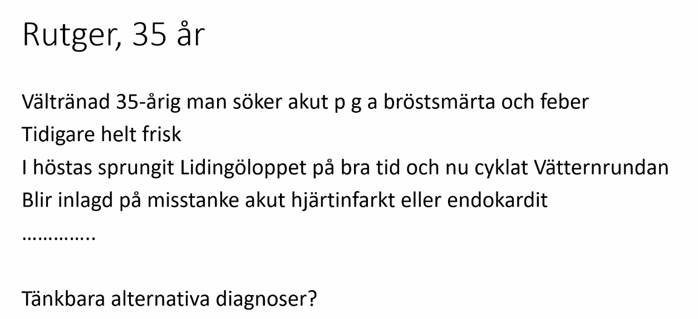

* Differentialdiagnoser
  * Perikardit
  * Myokardit
  * Kardiomyopati
  * Lungemboli
  * Malignitet
  * Aortadissektion
  * Kostokondrit
* Gå vidare
  * EKG
  * Blodprover
  * BT båda armar
  * EKO: indikationer dubbellumen. 
  * DT-tjorax med kontrast
* I detta fallet aorta-dissektion: lurigt med dessa kan ta lite tid att komma på den diagnosen. Kräver 
* Åtgärdsmässigt
  * UL, eller DT
  * Thoraxkirurgkontakt
  * Hålla BT nedre, som högst 120mmHg. 
  * // det som kan ha orsakat febern är att det kan ha stått blodi dubbellumen

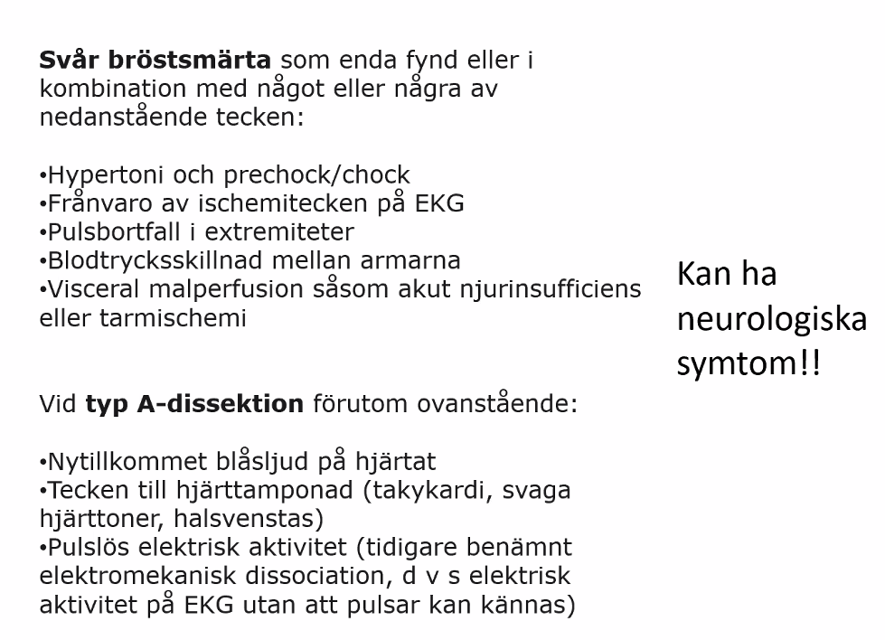

#### Fall 5

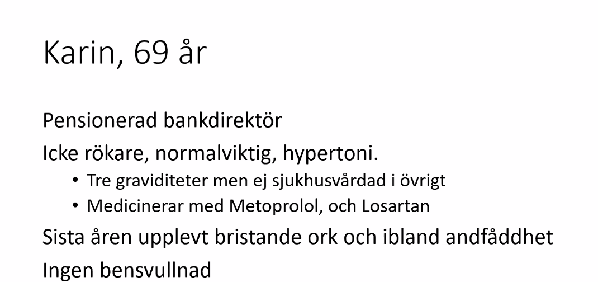

* Detta är en hjärtsviktspatient: den stora diagnosen i slutenvården, prevalens 3% i befolkningen. Vanligate inläggningsorsak efter förlossning
* Högst mortaltiet av folksjukdomarna
* Symptomen: andfåddhet i vila, trötthet, arbet, utmattning, ankelsvullnad. Ock status takykardi, takpne, lungrassel, halsvenstas, perifera ödem, hepatomegali, objecktiva statusfynd är EKO etc. 
* Titta på viss.nu 
* Utredningsmässigt
  * NT-probnp över 125 ska man skicka vidare för EKO och EF. 
* 

!!! Sätta in fragmin om man misstänker lungemobli tills det uteslutits. 

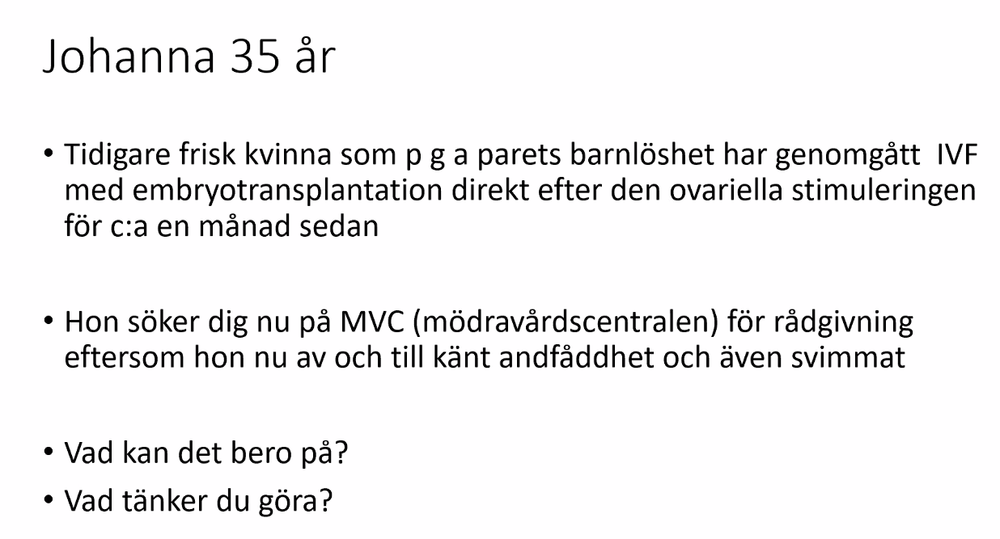

* Differentialdiagnoser
  * Lungembolier
  * Overiellt överstimuleringsstumuleringssyndrom
  * Pleuravätska

#### Fall 6 - p-mitrale

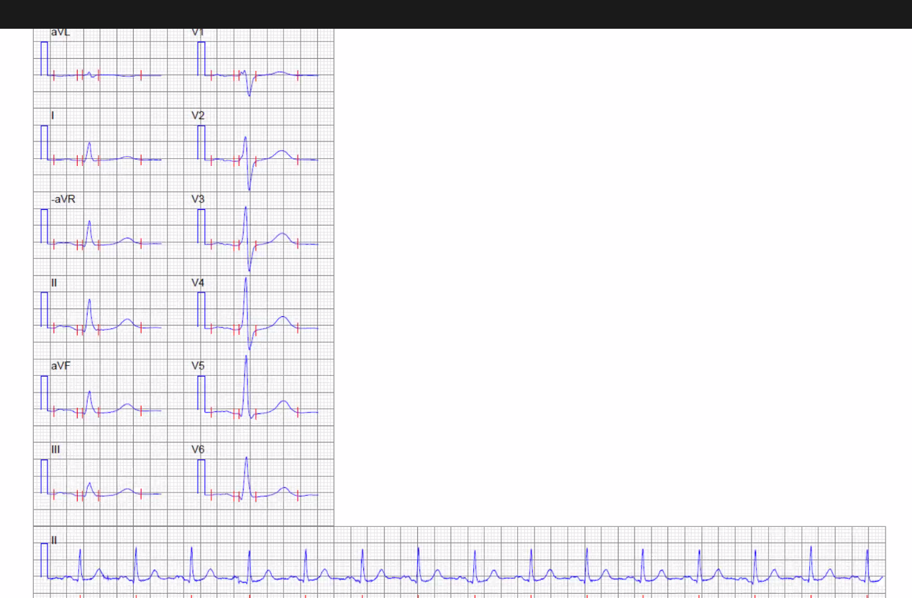

* P-vågorna är delade 2 delar -> p-mitrale
* Genomföra en EKO-undersökning

#### Fall 7 - förmaksflimmer

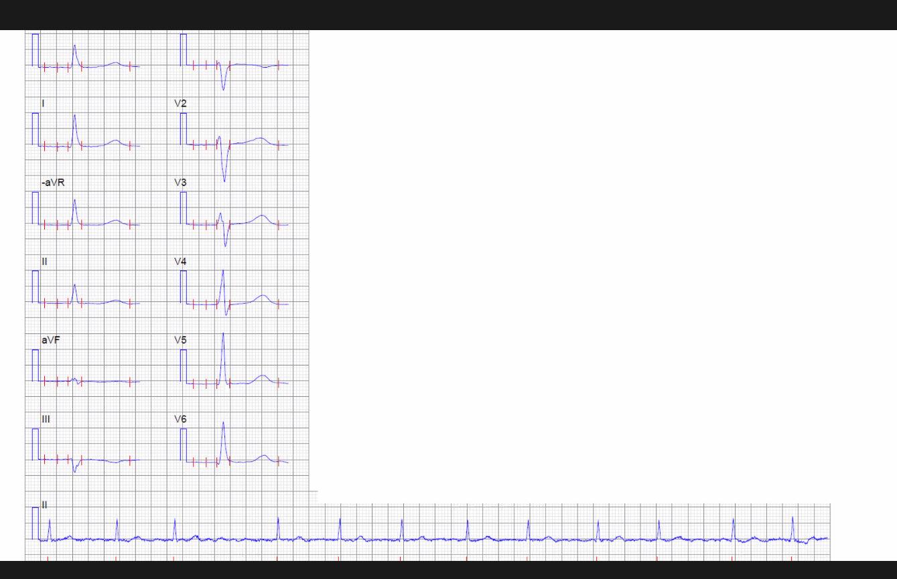

* Rytmen: oregelbunden
* P-vågor ej fångade

#### Fall 8 - motursroterat förmaksfladder 3:1 blockerat

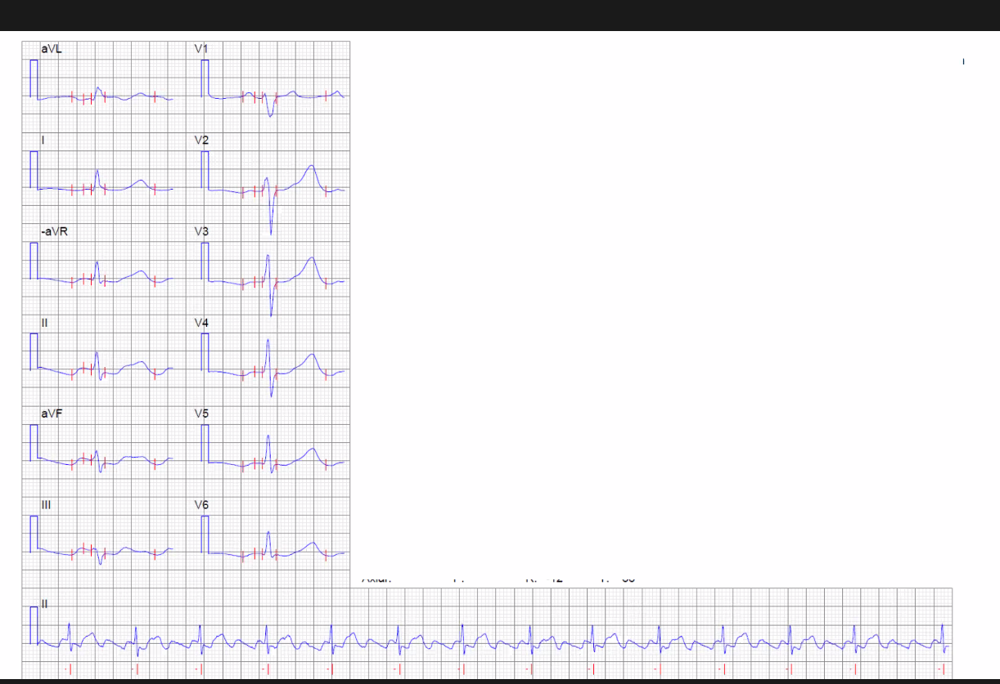

* 

#### Fall 9 - AV-block 3

* Regelbundet
* Frikopplade P vågor
* Breddökade QRS komplex
* Summering: av3 med kammarrytm

#### Fall 10 - Torsades de pointes

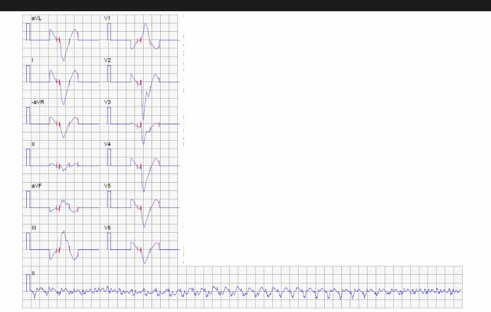

* Rytmen: Takykardi, regelbundet
* Man ser på rytmremsan att amplituden varierar, polymorft VT.

#### Fall 11 - sinusbrady

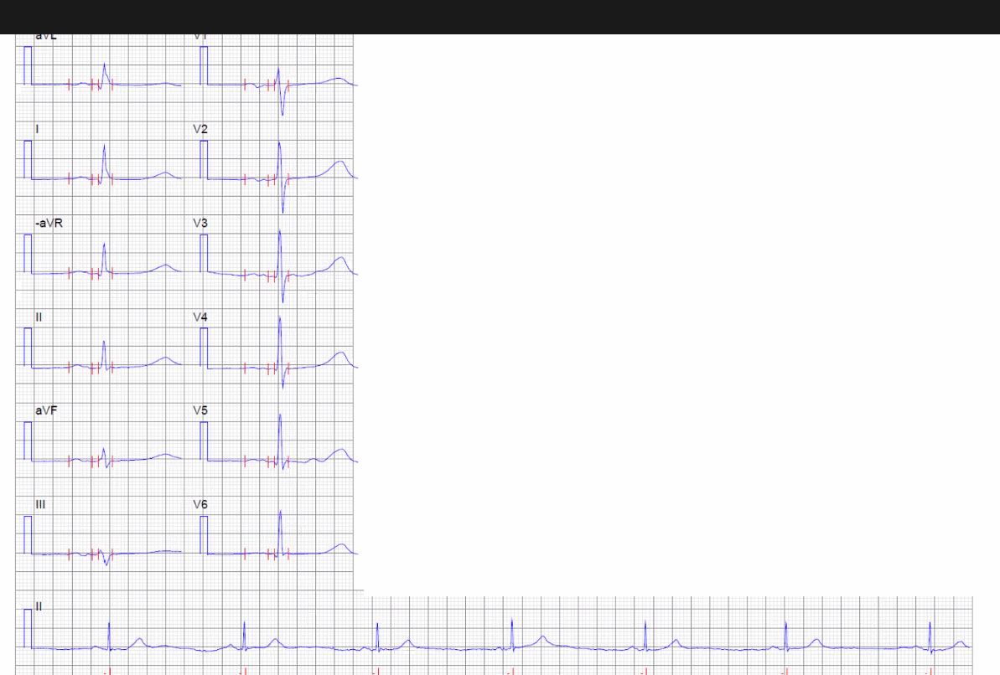

* Behövt ta en skala på ahatigheten

#### Fall 12

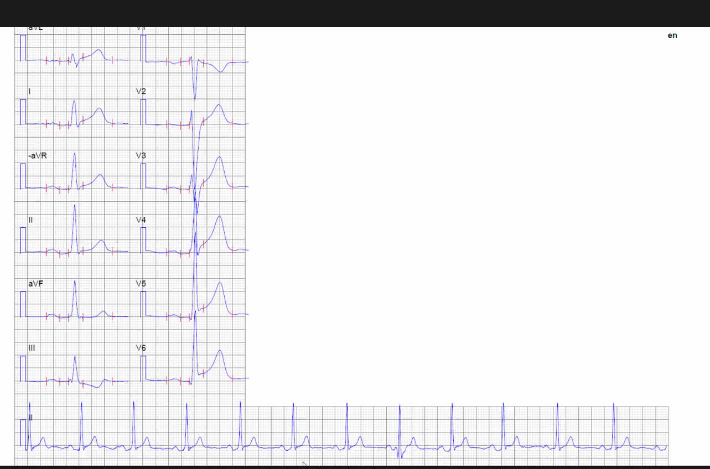

* Gällande ST-sträckor: antingen uppåt-konvex eller uppåt-konkav
  * !! Detta är uppåt-konkavt: Detta är en bulle nedåt. 
  * tittar konvex i förhållande t Y-axeln, 
  * I detta fallet är det förenligt med en perikardit. 
  * Prekordialt generella ST-höjningar: man kan inte säga att detta är en perikardit, men man får väga ihop allting. skulle vara intressant att få anamens o status innan EKG uppkopplingen.
  * Det FL menar
    * konkava + att det är många avledningar som han tänker perikardit, men inte definitivt
  * !! Får man detta EKG på IST ska man utesluta infarkt, handlägga enl infarkt. 

#### Fall 14 - STEMI

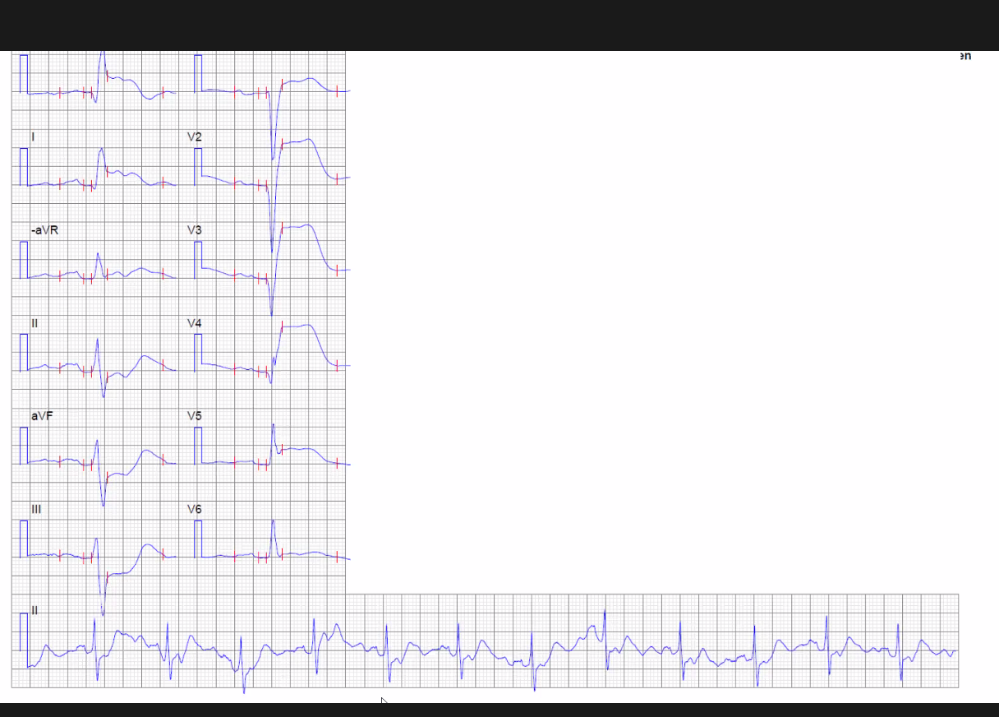

* Förlsut av R-tagg prekordialt
* Uppåt-konvex ST-höjningar
* Samt ST-sänkningar, reciprokt
* därför rejaält STEMI
* Snabbt till angiolabb och stetnas om möjligt. 

#### Fall 15

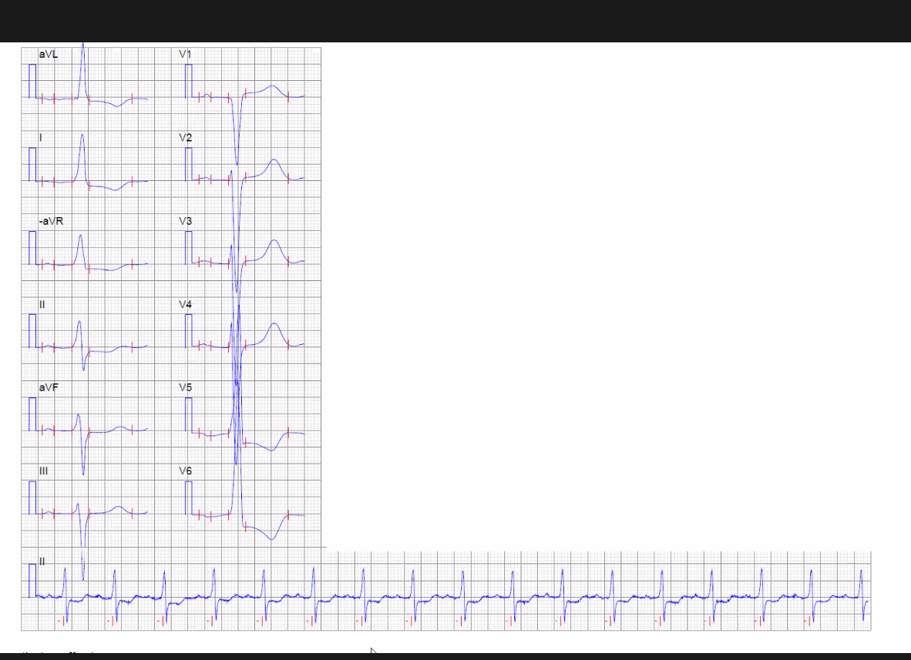

* Regelbundet
* ST-sänkning lateralt
* Svårt att se R-taggens höjd, men kan kraftfull: typisk vänsterkammarhypertrofi bild. 
  * V5-V6 belastningstecken

#### Fall 16 - Pacemaker

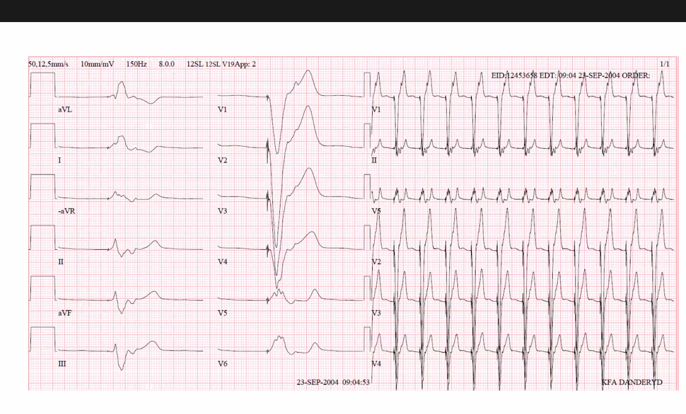

#### FALL 17 - hyperkalemi med kalium på 9

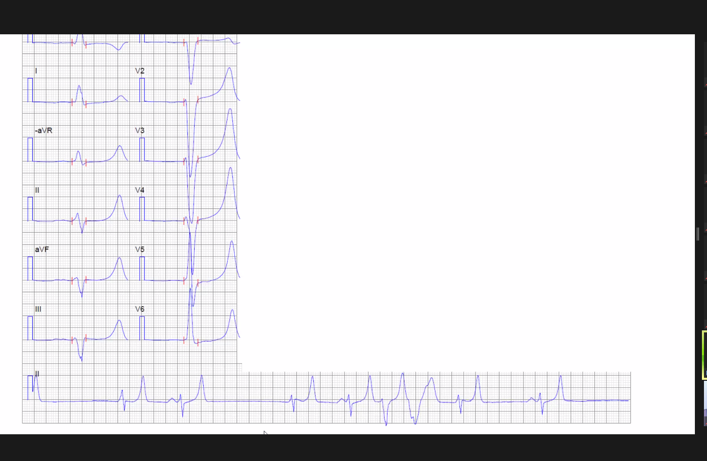

* Viktigt att titta på labbprover på denna
* Typiskt med arrytmier vad sjutton som helst, om den är så pass hög att man får så här höga T-vågorna
* villatt vi reagerar på t vågorna

#### Fall 18 - inferior infarkt

* 

#### Fall 19 - Fladder

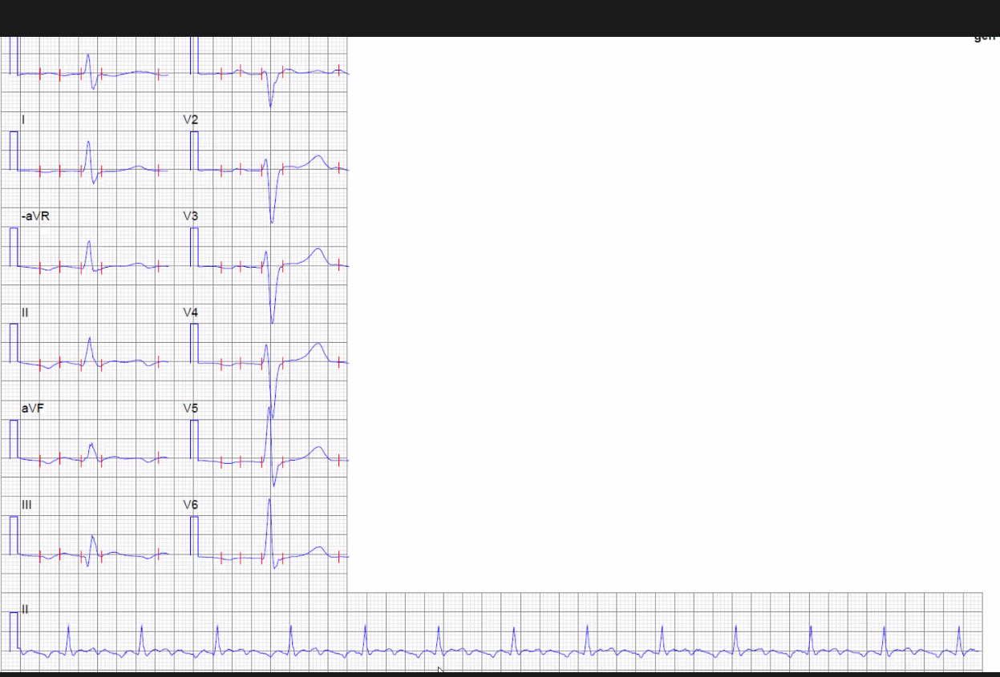

#### Fall 20

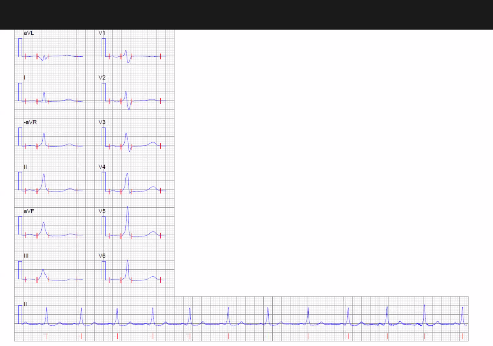

## Fall (ramla)

### Fall i hemmet

***Presentation***

* 64-årig änkeman
  * pensionär med väl reglerad hypertoni sedan 7 år tillbaka, 
  * måttlig knäartros samt migrän. 
  * På morgonen, för andra gången på en månad, fallit då han rest sig ur sängen för att gå till badrummet, 
  * föll på mjuk matta, 
  * inte skadat sig speciellt. 
  * Ingen medvetandeförlust, 
  * inga bröstsmärtor, 
  * ingen hjärtklappning, 
  * inga neurologiska bortfallssymptom, 
  * ingen svaghet. 
  * Akt med Seloken, Enalapril, Trombyl, Alvedon, 
  * (Inderal använder detta sporadiskt, utskrivet för något år sedan pga. migrän, tagit Inderal på kvällen innan fallet på morgonen) 

***Etiologi och patofysiologi***

***Epidemiologi***

***Kliniska kännetecken***

***Differentialdiagnostik***

* Betablockad inducerat fall?
* Ortostatisk hypotension/anemi, 
* dehydrering, 
* medicinering/
* Vasovagal reaktion
* TIA/Stroke/
* (Arytmi)
* Balansproblem/Gångsvårigheter/neurol, 
* otol/

***Utredning och handläggning***

* **Anamnes**
  * **Falltendens**
    * Tidsförlopp,
    * frekvens
    * karaktär: 
      * svimmad
      * medvetandeförlust
      * orienterad
  * **Utlösande faktorer**
    * När pp dygnet
    * lägesförändring, situationsbetingat
    * konstant
    * intermittent
  * **Associerade symptom** 
    * yrsel
    * svaghet
    * synpåverkan, talpåverkan, luktpåverkan
    * illamående
    * kräkningar
    * bröstsmärta
    * andningspåverkan
    * hjärtklappning
    * arrytmikänsla
  * **Tidg nuv sjd**
    * hypertoni
    * huvudvärk
    * nedsatt rörelseförmåga
  * **Hereditet**
    * hjärta kärl
    * yrselassocerade sjd
  * **Tobak, alkohol**
  * **Social anamnes**
    * motion
  * **Medicinering**
  * **Övriga symptom**
* **Status**
  * Hjärtsttatus
  * Blodtryck
    * sittande el liggande hjärtnivår
    * ortostatiskt
  * carotider
  * pulsar
  * neurostatus, ögon
    * inkl nystagmus
    * pupuller
    * ljus, konvergens
    * ögonmotorik
    * synfält,
    * ögonbotten
    * ansiktssens
    * käkmuskler
    * övrig ansiktsmusk
    * tungrörelser
    * trapezius motstånd
    * senreflexer
    * babinski
    * grovkraft extremiteter
    * handkoordniation
    * fingernäs, knähäl
    * armar uppåtsträck
    * stående romberg

***Behandling***

**Nästa omedelbart följande åtgärd**

* EKG
* Blodstatus/Elektrolyter/ Blodtryck/
* Ev. Medicinjustering planera återbesök 

***Återkoppling***

* Konsultationen: Generellt fanns en god konsultationsförmåga där ett aktivt lyssnande medförde att patienten fick komma till tals. 
  * Några studenter hade något svårt att skapa en enskildhet för patienten där spegling och bekräftelse kunde fört berättelsen framåt ytterligare om man berett patienten endast kort ytterligare tid för talutrymme. 
* Status: I status kan det vara av värde att reflektera kring vad det de facto är som undersöks och varför, 
  * ffa under vissa delar av neurologstatus. 
  * Det fördes i de allra flesta fall ett gott differentialdiagnostiskt resonemang, 
  * där de flesta nådde rätt vårdnivå, uteslöt det akuta och allvarliga samt bibringade patienten en god grund för att tillsammans med läkaren fatta beslut om fortsatt handläggning. 
  * En del studenter behöver tänka på att disponera tiden på ett sätt där tid för avslut måste finnas med i planeringen. 
  * De allra flesta studenter lyckades väl med denna station

### Synkope

#### Handläggning

## Hjärtklappning

## Hjärtsvikt

### Allmänt

***Presentation***

***Etiologi***

* **Etiologiskt**
  * **Ischemisk hjärtsjd**: minskad myokardfunktion
  * **Hypertoni**: leder till vänsterkammarhypertrofi som orsak till hjärtsvikten (vanligast)
  * **Strukturella orsaker**
    * Kardiomyopati
      * **DCM**: dilateradkardiomyopati
      * **Hypertrof**
    * **Klaffsjd**
      * **Aortastenos:** Dessa är ganska viktiga att ha i åtanke när man tänker svikt. 
  * **Sekundär hjärtsvikt**
    * **Anemi**
    * **Metaboliska rubbningar**
    * **Diabetes**
    * **Infektioner**
    * **Rytmrubbningar, arrytmier**: förmaksflimmer
    * **Amyloidos**
* **Förmaksflimmer FF:** 
  * hjärtsvikt pga FF har en bra prognos
* **Hjärtsviktare som sen får FF:**
  * sämre prognos, för att man försämrar hjärtfunktionen ännu mer. 

***Patofysiologiskt***

* **Ökad ventilatorisk drive**
  * While the production of lactate benefits the patient by allowing him to walk limited distances at work levels above which the cardiovascular system is capable of supplying the entire oxygen need, it has disturbing effects on breathing in two ways: 
    * **Ökad co2 fr buffrat laktat**
      * The added amount of C02 produced from the buffering of lactic acid by bicarbonate adds an additional C02 load to the respiratory system that must be eliminated to prevent arteri¬ al Pco2 from rising, and 
    * **the increased hydrogen ion concentration** 
      * caused by the reduction of blood bicarbonate stimulates the respiratory control mechanism (carotid bodies) to 
      * cause a further ventilatory increase, 
      * thereby lowering arterial Pco2 and 
      * providing respiratory compensation for the metabolic acidosis.
  * doi:10.1001/jama.1982.03330160083033

***Typer av svikt***

* **Torr** 
  * inte samlar på sig vätska, 
  * i.e. ingen bakåtsvikt
* **Våt**
  * om det är bakåtsvikt,     
  * att man ansamlar en massa vätska
* **Varm**
  * att man har perifer 
  * perfusion, utesluter framåtsikt, (nästan)
* **Kall**
  * att man inte har  perifer perfusion, 
  * indikativt för framåtsvikt

***Epidemiologi***

***Kliniska kännetecken***

* Fr huvud ner
* Halsvenstas
* Cyanos
* Takypne
* Torrhosta
* Rassel
* basal dämånning
* takyakrdi; flimmer, fladder, 
* kardiomegali
* 3e hjärtton, 4e hjärtton
* hepatomegali
* ascites
* Fuktig, kall hud
* dekliva ödem; ankelödem
* nattlig hosta: lungödem bildning

***Utredning och handläggning***

* **Stegvis**
  * **Anamnes**: samla anamnes
  * **Blodprover**: NTproBNP: väldigt bra specificitet
  * **Ekokardiografi**: påverkad EF
* **Utreda bakomliggande orsak till hjärtsvikten**: hypertoni, hjärtinfarkt, strukturell hjärtsjukdom, degenerativ hjärtsjd, etc. 
* **Det förekommer ett antal graderingar av hjärtsvikt där EKO bedömningen är central.** 
  * **HFREF**: Vi har  hjärtsvikt med reducerad EF, 
  * För den första      typen av hjärtsvikt **behövs inte NT-proBNP (eller      avbildning),**      utan **enbart kliniska tecken** och **en siffra på EF**
* **Resterande kräver** 
  * **också proBNP** samt 
  * **vänsterkammar hypertrofi** 
  * eller **förmaks dilatation på eko**, 
  * alternativt nedsatt diastolisk funktion. 
  * **Diagnoser**
    * **HFMREF**: hjärtsvikt med midrange reduktion EF och 
    * **HFpEF**: hjärtsvikt med preserverad EF. 

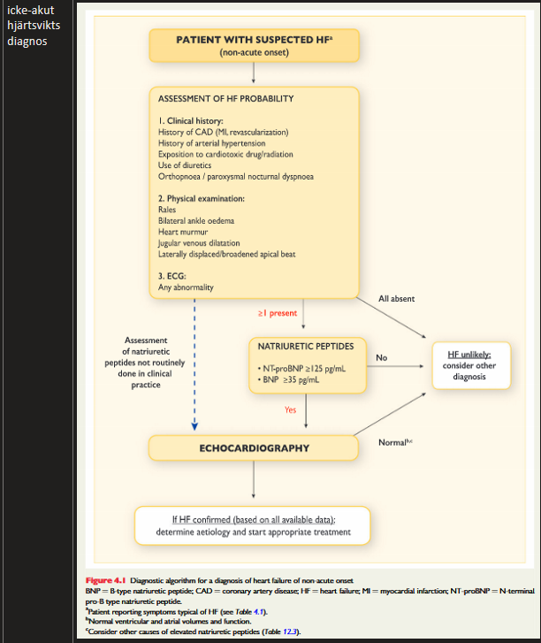

***Behandling***

* **Akut vänstersvikt**
  * **CPAP**
  * **Hjärtläge**
  * **Nitro**: över 110 systoliskt
  * **Morfin**: associeras med ökad mortalitet...
  * **Furix**: över 85 systoliskt
  * (**betablockad**)
* **Underhållsbehandling, trappa**
  * ACEh/ARB
  * Betablockerare
  * SGLT2 hämmare
  * 

| 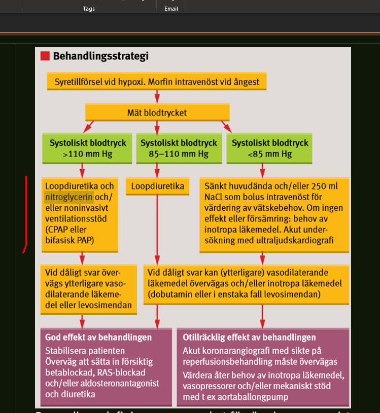 |                                                              |      |
| ------------------------------------------------------------ | ------------------------------------------------------------ | ---- |
| 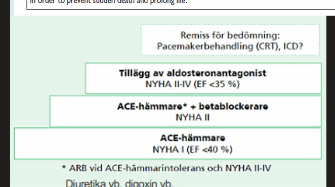 | 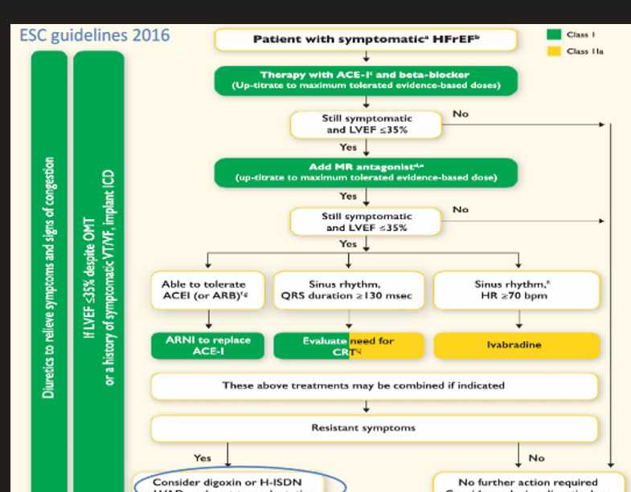 |      |
|                                                              |  |      |

### Fall

* 48-årig man
  * remitteras till dig på hjärtmottagningen från husläkare pga. nyupptäckt hjärtsvikt. Bakgrund: Ensamboende, icke rökare, arbetar på kontor. Behandlas för högt blodtryck med amlodipin sedan flera år som enda medicinering. Aktuellt: Tilltagande andfåddhet sedan minst ett halvår. Blir nu påtagligt andfådd bara av att promenera även om han inte går speciellt fort. Inte haft bröstsmärta. Ingen andfåddhet i vila eller liggande. Utredd via husläkare där hjärt-EKO visar lätt dilaterad vänsterkammare med generellt nedsatt rörlighet. EF: 35%. Inga signifikanta klaffvitier. Status: Opåv i vila. Inga ödem. Hjärta: Rgb rytm 80/min. Normala toner, inga blåsljud. BT: 140/80. Lungor: ingen dämpning, vesikulärt andningsljud, inga rassel.
  * För att utreda
    * ischemisk hjärtsjd
    * hypertoni
    * alkohol

## Perifer Cirkulation

### Claudicatio intermittens

#### Allmänt

***Utredning***

* Status
  * Minskad behåring
  * kallt
  * distalt status
* Ankeltryck, tåtryck
* PCU: perifer cirkulationsutredning. 

***Differentialdiagnoser***

* Ryggbesvär, centralt påverkat
* Kritisk ischemi
* Spinal stenos: Denna är viktigt att komma ihåg. 
  * Strålande smärta
  * Bättre när de böjer sig: bättre när du cyklar, skjuter kundvagnen, rullator. 
  * Lasegue kan vara positivt. 
  * Äldre patienter också . 
* Höftartros
* Knäartros
* Lumbago ischias: kan efterlikna claudicatio. 
* // Diskbråck: oftast är diskbråck ensidigt, det är ovanligt att det är symmetriskt

***Relaterade diagnoser***

* Att man tänker bredare rent diagnostiskt, att man ska tänka på en kärlsjuka.

***Behandling***

* Riskfaktorsanering
  * Rökstopp
  * Kostråd
* Farmakologiskt
  * !! Trombyl insättning (IST)
* Fysioterapi
* Fysisk aktivitet på recept

### Utredning

#### !! Ankeltryck, tåtryck

***Var***

* Kan göra detta på plats
* Använda en doppler 

***Svårtolkade fall***

* Diabetiker: att det blir högre tryck ankel brachi index, att man får lite mer tryck, 
  * därför tar tåtryck. 

***Tolkning***

* Ankel arm index på 0.5 = dåligt

#### Doppler undersökning

***Allmänt***

* Kan göra detta på alla vårdcentraler
* Ta 

#### Ultraljud

Remiss till Klinfys

### Fall

#### Fall 1 - claudicatio

***Utredning och handläggning***

* Anamnes
  * Patientens del
    * Varför söker du idag
    * 72åå, Per-Wester
    * Smärtor båda hans ben, senaste halvåret. 
    * Vet inte riktigt vad det beror på, har bara kommit
    * Har inte blivit värre, men kommer när han är aktiv
    * Särskilda tankar om vad det kan vara? Vet inte, tror att det kan ah att göra med ryggen
    * Orolig för, särskilt? Kan utvecklas till ngt handikappande, att ha ninte komme rkunna gå i framtiden
      * Förstår att du är orolig när du har såhär ont i benen
    * Önskemål: 
      * Ta en röntgen
    * Sammanfattar här. 
  * Läkarens del
    * Bensmärtorna
      * Båda benen du har ont i
      * Utveckligen av bensmärtorna: har inte blivit bättre
      * Tycker förvärras vid aktivitet: smärtorna kommer bara under aktivitet. 
      * Så fort han använder sin aben som det gör ont. Både under promenader eller springer etc.
      * Uppskatat hur långt behöver gå innan det gör ont: efter ett par hundra meter. 
      * Vad händer nrä det gör så ont: Måste stanna såklart, kan inte gå näre gör ont, blir bättre i vila
      * Karaktär på smärta: Generell smärta, heltäckande, inte en punkt. 
      * Lokalisation: Mest i vaderna. 
    * Associerade symptom
      * Inga smärtor ngn annanstans i kroppen
      * Svullnad eller bensår: tkr inte det, ser helt normalt ut tkr pat. 
      * 
    * Frisk annars:
      * Diabetes
      * Hypertoni
    * Mediciner
      * Enalapril
      * Statiner
      * Metformin
    * Ärftlighet hjärtkärlsjd
      * Släkting med diskbråck
    * Socialt
      * Pensionär
      * Jobbat på antikvariet. Böcker
      * Hur bor du: bor sj just nu. 
    * Rökning: röker cigariller, röker ngn gg per vecka. Feströker. 
      * Inte regelbunden rökare tidigare
    * Alkohol
      * Blir ett glas till helgen
    * Aktivitet
      * Promenader
      * Tränar med vikter etc
      * Hur ofta tränar du: blir ett par gånger per vecka

## Scores

### CHADSVASc

* **Congestive heartfailure**
* **Hypertoni**
* **Age**:
* **Diabetes**: 
* **Stroke, TIA, trombembolism**
* **Vaskulit**
* **Age2**: 65-74
* **Sex category**

### Heart score

***Står för***

* History: infarctions? tidg sjd
* EKG
* Age
* Risk factors
* Troponin

## Undersökningar

### Auskultation

#### Hjärtton

##### Tredje hjärtton

***Orsaker till tredje hjärtton***

1. **sänkt** **pumpfunktion** hos hjärtat, i.e. det ska vara något fel på hjärtat
2. (Anemi)
3. Hjärtsvikt
4. kardiomyopati
5. diabetes
6. akut infarkt

##### Fjärde hjärtton

1. **Minskad compliance** vänster kammare (preserved ejection fraction?)
2. Hypertoni
3. Hypertrofi
4. Ischemisk kardiomyopati

### Blodtrycksmätning

***Noteringar fr tidg. IST***

* Att man ska pumpa ut helt manschetten innan man mäter BT igen. 

### Ortostatiskt blodtryckstagning

***Utförande***

* Liggande, stående
* Liggande efter 10 mins vila
* Puls + blodtryck
* När stått upp tar man intervaller:
  * omedelvart
  * 3 min
  * 5 min
  * 10min

***Fynd***

* Definitionsmässigt sjunkande blodtryck + samtidig hjärtfrekvensökning

***Åtgärder***

* Läkemedelsöversyn. Blodtryckssänkning som läkemedelsbiverkan är ofta dosberoende.
* Ha huvudändan på sängen höjd med 15–20 grader.
* Använda långa (upp till ljumsken) kompressionsstrumpor.
* Små regelbundna måltider (stora måltider kan ge blodtrycksfall).
* Trampa på stället i sittande före uppresning och därefter en stund i stående.
* Lätt fysisk aktivitet efter förmåga.

## Ö Farmaka

### COX-hämmare

***Presentation***

* 76åå man
  * tidg STEMI, nu hjärtsvikt med försämring. Medicinerar med ASA, furix, metoprolol, 

### Hemostas

***Presentation, tenta***

* Diskuterar blodförtunnande läkemedel med Gunilla. Hon säger att hennes make har tagit Trombyl (ASA) under flera år och det finns massor med tabletter kvar. Utifrån verkningsmekanismerna, vilken är teorin bakom att man i första hand väljer acetylsalicylsyra, tex Trombyl, vid arteriosklerotisk sjukdom medan direktverkande orala antikoagulantia (DOAK), tex apixaban är förstahandsvalet vid förmaksflimmer 
  * **ASA**: 
    * primär hemostas
    * hämmar tromobcytaggregation gm irreversibel inaktivering COX. 
    * COX medverkar syntes tromboxan, som involveras i trombocytaktiveringen. 
    * Vid plackruptur, som vid hjärtinfarkter, sker initial trombocytaktivering, och är trombocytrika. 
    * Dessa tromboser är fattiga fibrin jfr andra trombembolier
  * **Apixaban**: faktor Xa hämmare.
    * Koagulation
    * Faktor Xa-hämmare, alltså trombin aktivering inhibering. Därmed hindrar fibrinogen omvandling till fibrin. 
    * Förmaksflimmer hemodynamiskt leder till att man för fibrinrika trombembolier. Detta i sin tur leder till att det just är sekundär hemostas inhibering som bidrar till att man får bättre kontroll över trombformationerna

### Waran

***Farmakodynamik***

* Molekyl, racemisk
* blockerar vit-K cykeln
* Vit-K nödvändigt för koagfaktorer i levern
  * faktor 2
  * faktor 7
  * faktor 9
  * faktor 10
  * koaghämmare protein C samt protein S
* Koagfaktorerna för att bli aktiva behöver karoboxyleras. Sker gm att vit-K1 fr födan reduceras t vit-k av vit-k reduktas, till KH2. 
* vit kh2 oxideras därefter t k2,3-epoxid i en reaktion där glutaminsyran i f2, f7, f9, f10 karboxyleras. 
* vit k2,3-epoxidreduktas reduceras därefter tillbaka t vit-k1 av k-epoxidreduktas
* waran blockar k-epoxidreduktas.
* Alltså får man ansamling av k2,3-epoxidreduktas, som inte reduceras tillbaka till vit-k1, som i sin tur inte kan delta i karobyxleringen och därmed aktiveringen av ovannämnda koagfaktorer

***Farmakokinetik***

* Äter vit k
  * då det inte är steget innan karboxyleringen som waran hämmar, utan steget efter, 
  * innebär att om man äter vit K så kommer man att karboxylera fler koagfaktorer
  * därför rekas man inte att äta vit K samtidigt som man äter waran. 

