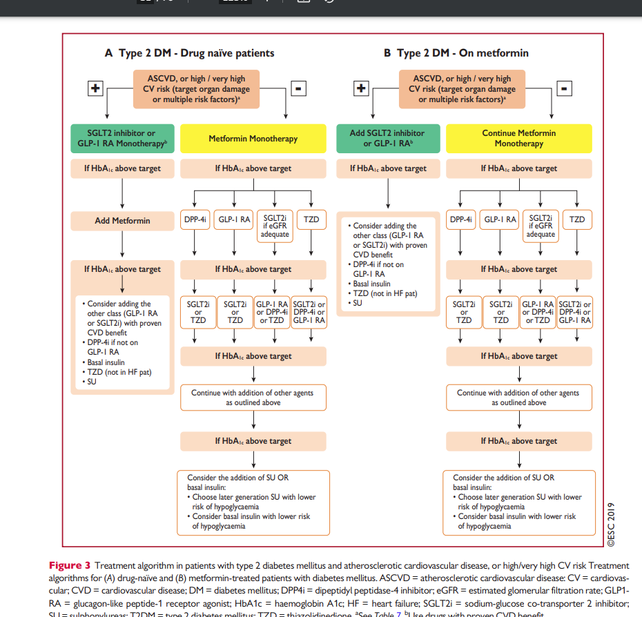
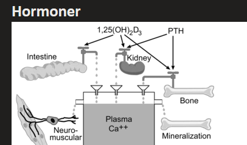
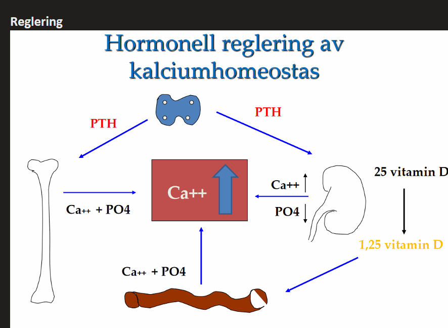
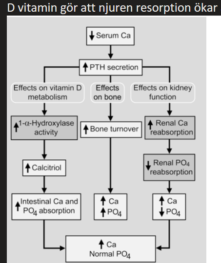

***Presentation***

***Etiologi och patofysiologi***

***Epidemiologi***

***Kliniska kännetecken***

***Utredning och handläggning***

***Behandling***

### Diagnoser

Knöl i bröstet
Viktminskning
Viktökning/övervikt
Ökad hårväxt
Ökad svettning
Ökad törst

## Diabetes

### DM2

#### Behandling

***Metformin, tenta***

* Ingen hypoglykemirisk
* Ingen viktnedgång: 3alesäs; finns studier som tyder på att man bättre bibehåller reducerad vikt (förutsätter att man har reducerat..)

***SGLT2, tenta***

* Ingen hypoglykemirisk
* Viktnedgång: kan viktreducera pat på gruppnivå

***GLP1-agonist***

* Ingen hypoglykemirisk
* Viktnedgång: viktreducerar på gruppnivå

***Insulin***

* Hypoglykemirisk
* Ingen viktnedgång gruppnivå

***Sulfonylurea***

* Hypoglykemirisk

***På vårdavdelning***

* Får en patient insulin
* Glukoskurva
  * Morgonglukos
  * Glukos före måltid
  * Glukos 2h efter måltid
  * (glukos innan sömn?)

### Fall

#### Fall 1

***Presentation***

* 62åå man

  * förhöjt fasteblodsocker
  * kontrollerat blodsocker x2
  * även tagit HbA1, varit förhöjt
  * har ftt veta att han fått diabetes, kommer nu för fortsatt vård hos dig
  * på VC finns DSK med diabeteskompetens
  * finns en labblista med i rummet
  * Mål med stationen
    * inhämta adekvat anamnes
    * fokuserat status
    * bed åtg: i samråd med pat
      * ev icke farmakologiska alternativ
      * ev insättning metforin
    * planera
      * EKG
      * ögonundersökning
      * DSK gruppintro diabetes: info sjd, kost
    * labb: vikt, längd, midjeomfång, 
      * MU-alb/krea index
    * uppföljning: ssk, läkare

  

***Etiologi och patofysiologi***

***Epidemiologi***

***Kliniska kännetecken***

***Utredning och handläggning***

* **Anamnes**
  * **Ärftlighet, gällande hjärtkärl sjd**
  * **Hjärta kärl**
    * bröstsmärta
    * ödem underben fötter
  * **Allmänna symptom**
    * ökad törst
    * ökade urinmängder
    * viktnedgång
    * viktsuppgång
    * trötthet
  * **Övriga symptom**
    * synförändringar
    * domningar fötter händr
  * **aktuell medicinering**
    * HT-medicin
    * compliance
    * icke receptbelagda LKM
  * **Tobak, alkohol**
  * **Motion**
  * **socialt**
* Status
  * Hjärtauskultation: systematiskt, 4 lok
  * Palp pulsar
  * BT sittande
  * Lungauskultation: palp, perkussion, auskultation
  * förekomst dekliva ödem
  * vibrationssinne
  * Tecken diabetes
    * känsel: beröring och monofilament
    * temperatur
    * behåring

***Behandling***

* Föreligger en behandlingstrappa
  * Livsstilsåtgärder
  * Metformin
  * SGLT2-hämmare

***Återkoppling***

* Många lyssnade
* MEN: måste ge återkoppling om det patienten berättade ang. utbildning om diagnosen diabetes
  * e.g. att i vin finns det ett antal sockerbitar som man ska beakta när man dricker
  * att alkohol kan försämra BT och diabetes
* hjärtauskultation: många gjorde inte enl standard locales. 
* mga glömde 
  * hereditet avseende hjärtkärl, strke, diabetes
  * tidg. sjd för att värdera svårighetssgrad
* V.g. uppföljning
  * många svårt att integrera andra yrkeskategorier i uppföljning. 
* DM1 farligare för njurar o ögonbottnar. 
* DM2 med lätt förhöjt B-socker kan jämföras med förhöjt LDL som riskfaktor för framtida aterosklerotisk hjärtkärl sjd e.g. 
  * infarkt, aortaneurysm, stroke
* Satsa med multifaktor 
* Flera av studenterna var duktiga på att prata om livsstilsfrågor. 
  * Att ge livsstilsråd om man inte har tid att först ta reda på hur patienten lever nu, är svårt. Viktigt att involvera patienten att ge egna förslag till livsstilsförändringar än att bara själv ge goda råd. Att medverka till en ändrad livsstil är nästan alltid ett långsiktigt projekt där man med fördel samarbetar med diabetessköterskan och ev. dietist som ofta kan avsätta mer tid för dessa frågor än vad du kan som läkare.

#### Fall - behandl

***Presentation***

* 73åå man
  * DM2, tablettbeh med metofrmin, funderar över om blodsockersänkande behandling behöver justeras
  * vid metforminbeh av DM2, viktigaste indikation för att:
    * sätta in insulin utöver metformin
      * otillräckligt blodsockerkontroll
      * för högt HbA1c
      * otillräcklig metabol kontroll
    * Avsluta metformin, övergå till insulin
      * uppfyller kontraindikationer mot metformin
      * e.g. njursvikt, dåligt GFR
      * samt biverkningar
  * Kardiovaskulära riskfaktorer
    * Hypertoni: RAAS påverkande, ACE-h/ARB 
    * !! dyslipidemi/hyperlipidemi, eller dålig kolesterolkontrll: statiner
      * notera att det just är dyslipidemi

#### !! Fall 1

***Presentation***

* Patient med DM II kommer på remiss till VC 
  * 63-årig kvinna, gift, kontorsarbete 3 barn, i anamnesen lumbalt diskbråck -09, pollenallergi, Hereditet: patientens mor insulinbehandlad, DM II +hypertoni, en bror har diabetes. Patienten har efter besked om diabetes gjort en rejäl kostomläggning samt börjat träna regelbundet. Röker ej, ½ flaska vin till middagen under helgen, dricker endast vatten annars
* Remiss från annan VC där patienten gått tidigare:
  * 63-årig kvinna vilken i samband med hälsokontroll på arbetet uppvisat förhöjt HbA1c. Fått diagnosen DM II för 3 månader sedan. Patienten har förskrivits livsstilsintervention, erhållit råd avseende kost och motion, träffat dietist, samt genomgått ögonbottenundersökning vilken varit ua. BT 160/90. Tacksam omhändertagande
  * Inför besöket har patienten tagit prover samt kontrollerat sitt blodtryck vid 2 ytterligare tillfällen hos dsk (155/90, 160/90) 

***Utredning och handläggning***

* **Kommunikation**
  * **Startar med öppen fråga o bereder patienten talutrymme för sin berättelse**
    * startar med öppen fråga, förstår använda dessa i tillämpliga situationer
  * **Klargör vad pat sj tänker kring symptom o problem**
    * efterforskar o ebreder adekvat utrymme för pats tankar kring problem o symptom
  * **Klargör pats oro kring symptom o problm**
    * efterhör o bereder adekvat yurymme för pats tankar kring oro
  * **Utforskar vad pat fill få ur besöket**
  * **Bekräftar patientne känslogmässigt verbalt o icke-verbalt**
  * **Gör relevanta sammanfattningar**: saammanfattar vid lämpliga tillfällen i nyanserad dialog med patienten
  * **förvissar sig om patienten fått diskutera sina frågor o ger utrymme för pat att ställa ev kompletterande frågor**
  * **Mot bakgrund av vad som framkommit i anamnes + status**: motiverar o involverar pat i fortsatt planering o beslutsfattande
* **Anamnes**
  * **Allmänna symptom**
    * ökad törst
    * ökade urinmängder
    * viktförändring
    * trötthet
  * **Öviga symptom**
    * Syndförändringar
    * domningar händer, fötter
  * **Symptom fr hjärta kärl**
    * bröstsmärta
    * ödem underben, fötter
  * **Tidg. nuv sjd**
  * **Tobak, alkohol**
  * **hereditet, diabetes, hjärtkärlsjd**
  * **Aktuell medicinering**
    * aktuella mediciner
    * receptfria mediciner
    * naturlkm
  * **Socialanamnes**
  * **Genomförda livsstilsförändringar**?
    * kost?
    * motion?
* !! **Status och åtgärd**
  * **Hjärtauskultation, 4 lokalisationer**
  * **Lungauskultation, auskultation**
  * **Dekliva ödem**: undersöker
  * **Frågar pat om vikt, längd**
  * !!! **mäter midjemått**
  * !! **Fotstatus**
    * **vibrationssinne**
    * **ytlig sensibilitet**
    * **temperatur**
    * **behåring**
    * **ev sår,**
    * **palpation pulsar**
* !!! **Åtgärd**
  * [diabetes] Sätter in metformin, info om möjliga biverkningar
    * lipidsänkande kan rekas, men inga extrapoäng
  * [blodtrycket] sätter in ACE/ARB, informerar om möjliga biverkningar
  * [diabetes] identifierar att livsstilsförändringar inte varit tillräckliga
  * motiverar föreslagna åtgärder o involverar pat i fortsatt handläggande
* **Preliminär diagnos o bedömning**
  * Studenten gör en rimlig prelim bedömning
* **Adekvata åtgärder**
  * studenten föreslår adekvata åtgärder

#### Fall 2

För behandling av hypertoni, vilka möjliga fördelar respektive nackdelar finns för var och en av de fyra läkemedelsgrupperna nedan för patienter med diabetes? Ange kortfattat en relevant fördel och en relevant nackdel per läkemedelsgrupp. Även svaret ”inga specifika fördelar” respektive ”inga specifika nackdelar” kan vara rätt. (4p)

* Ace-h, ARB
  * Fördelar: 
    * nefroprotektivt, 
    * bra vid albuminuri, 
    * metabolt gynnsamma
  * Nackdelar. 
    * inga specifika nackdelar
* Betablockerare
  * Fördelar
    * Bra vid samtidig ischemisk hjärtsjd, eller hjärtsvikt
    * bra vid migrän eller hjärtklappning
  * Nackdelar
    * maskera hypoglykemisymptom
    * viktuppgång
    * mteabolt ogynnsamma spec i komb tiazid
    * importens
    * svårare att träna
* Kalciumantagonister
  * Fördelar
    * metabolt neutrala
    * inga specifika fördelar
  * Nackdelar
    * inga spec nackdelar
* Tiaziddiuretika
  * inga spec fördelar
  * nackdelar
    * metabola effekter särskilt i komb med betablock

## Thyroidea

### Hyperthyreos

#### Fall 1

* Lågt TSH-värde, förhöjd S-T3 och S-T4 bärden, förenlig med hyperthyreos
* varför är det viktigt att mäta S-TSH och S-T3, S-T4 vid hyperthyreos	
  * nivådiagnostiskt med hypofys och thyroidea
  * urskilja vilken nivå det är. 

### Kalcitonin

***Fysiologiskt***

* Peptidhormon
* Osteoklast är målcellen
* Bromsar bennedbrytning
* Viktig under extrem hyperkalcemi: kan ge kalcitonin

## Parathyroidea

### Fysiologiskt

***Funktion***

* PTH -> Aktivering Vit-D renalt -> intestinal absorp + renal resorption kalcium
* PTH -> ökad benresorption skeletalt (ökad osteoklastaktivitet)

|  |  |  |
| ------------------------------------------------------------ | ------------------------------------------------------------ | ------------------------------------------------------------ |
|                                                              |                                                              |                                                              |

### Hyperparathyroidism

***Presentation***

* Pat med osteroporos + hyperkalcemi: 
  * om parathyroidea rubbning -> tenderar primär hyperparathyroidism 

***Etiologi***

* Primär hyperparathyroidism
  * Adenom, 85%: benign tumör i parathyroidea
* Sekundär hyperparathyroidism
  * 

***Kliniska kännetecken***

* Hyperkalcemi
* Fatigue
* Trötthet
* Förstoppning

### PTHrP

***Fysiologiskt***

* PTH relaterat protein. En peptid. Binder samma receptor. Första 34 aa identiska. PTHrP har man i ibland i kroppen men inte normalt. Finns i bröstmjölken. Inget som cirkulerar.
* Om man har vissa typer av cancrar får man grav hyperkalcemi. Om man mäter PTH kommer den vara lågt, men PTHrP är högt, som man då inte mäter direkt. 

## Hypofys Hypothalamus

### Prolaktin

### Gonadotropiner

### Vasopressin ADH

## Binjure

### Mineralkortikoider

### Glukokortikoider

