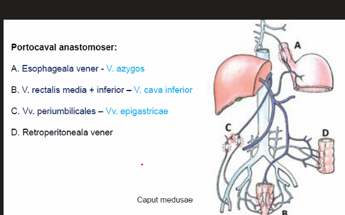
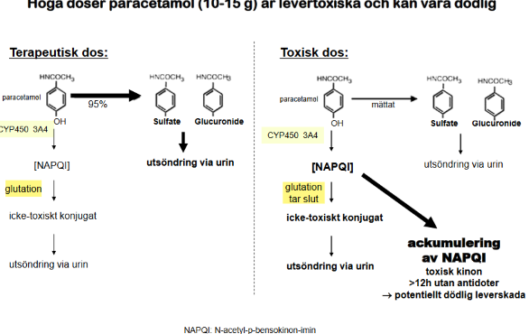

## Allmänt

### Utbytbara lkm generika

De flesta av dina patienter har ett eller flera läkemedel som blir föremål för generisk substitution på apoteket. Förläkemedel som är utbytbara mot varandra gäller:

* Kan innehålla olika aktiv substans: falskt
* kan innehålla olika tillsatsämnen: sant
* utbytbarhet bedöms av läkemedelsverket: sant
* FASS-texterna är likalydande: falskt
* kan ha olika inhalator, injektionspenna: falskt
* måste ingå i läkemedelsförmånen: sant
* om pat som nått högkostnadsskyddet motsätter sig utbyte kan kostnaden för pat bli högre: sant
* om läkare motsatt sig utbyte kan kostnaden för pat som nått högkostnadsskyddet bli högre: falskt

### Lärandemål

sdsd
* Värdera en patients läkemedelsbehandling genom att ta ställning till indikation, effekt och biverkningar. 
* Kunna väga in faktorer såsom njurfunktion, ålder, graviditet, amning och samsjuklighet  vid val av läkemedel och dos.
* !! Känna till grundläggande farmakokinetiska begrepp 
    * ADME,
    * absorption,
    * distribution,
    * metabolism och exkretion) och kunna tillämpa dem vid val av läkemedel,
    * dos och uppföljning. 
* Förstå grundläggande principer för läkemedelsinteraktioner 
* Vara förtrogen med vad som ingår i en läkemedelsgenomgång samt en läkemedelsberättelse 
* Översiktligt kunna vilka läkemedel som används för behandling av vanliga sjukdomar  (Ej doser) 
* Kunna indikation och doser för läkemedel i A-HLR situation 
* Kunna identifiera kliniskt betydelsefulla biverkningar och läkemedelsrelaterade symptom som kan förekomma vid behandling av  vanliga diagnoser  (t.ex. elektrolytrubbningar) 
* Kunna hitta relevant information i FASS-text och tillämpa den vid ordination och uppföljning av behandling 
* Utfärda korrekta recept 
* Vara förtrogen med biverkningsrapportering –vem ska rapportera, vad ska rapporteras? Hur gör man?
* Läkemedelskoncentrationsmätning (TDM) –känna till grundläggande principer för provtagning och tolkning.
* Kunna tillgodogöra sig en vetenskaplig läkemedelsstudie utifrån PICO 
* Kunna granska en vetenskaplig läkemedelsstudie och identifiera dess främsta styrkor/svagheter 
* Kunna skilja mellan evidensbaserad och kommersiellt obunden läkemedelsinformation och information som är osaklig eller kommersiellt driven, samt ha förståelse för varför detta är viktigt.
* Känna till de viktigaste källorna till evidensbaserad och producentobunden läkemedelsinformation (exempelvis Läkemedelsverket, Socialstyrelsen, SBU (Statens beredning för medicinsk och social utvärdering), Tandvårds-och läkemedelsförmånsverket (TLV), Strama och läkemedelskommittéer i olika landsting)

### Läkemedelsformer

***Depåttablett***

* Skiljer sig fr vanliga tabletter
* Långsammare frigöring av kemiska ämnena i tabletten. 

## Biverkan

### Typ A

* Förväntade utifrån farmakodynamiken
* dosberoende
* e.g.: blodtrycksfall med betablockerare

### Typ B

* Oväntade
* Sällan dosberoende
* Ofta ngn immunologisk verkan
  * Reaktion fortsätter även vid utsättning
* E.g.: Steven-johnsons

### Typ C

* Ökad risk insjuknande annan sjd
* Mekanismen oftast okänd
* inget tydligt tidssamband
* E.g.: ökad risk hjärtinfarkt långvarig NSAID-användning

### Utredningsmäss

* Positiv dechallenge – utsättning av ett läkemedel medför förbättring av symtomen.
* Positiv rechallenge – återinsättning av ett läkemedel gör att biverkningen återkommer.

### Graviditet

***Typ av påverkan av lkm förutom missfall o fosterdöd är man främst oroad för***

* Första trimestern
  * Missbildning
* ?? Andra trimestern
* !! Nära förlossning
  * Utsättningssymptom
  * abstinens
  * farmakologiska effekter

### ! Interaktioner

#### Fall 1, tenta

Hitta de interagerande läkemedlen och dess effekter. 

Tablett Atorvastatin Actavis 10 mg 1+0+0+0 (HMG-CoA-reduktashämmare)

Tablett Trombyl 75 mg 1+0+0+0 (acetylsalicylsyra)

Tablett Enalapril Comp STADA 20 mg/6 mg 1+0+0+0 (ACE-hämmare/hydroklortiazid) 

Depottablett Tegretol Retard 400 mg 1+0+0+1 (karbamazepin, antiepileptikum)

Depottablett Xatral OD 10 mg 0+0+0+1 (alfuzosin, alfa-1-receptorblockerande medel)

Tablett Donepezil Orion 10 mg 0+0+0+1 (kolinesterashämmare, demensläkemedel)

Tablett Sertralin Bluefish 50 mg 1+0+0+0 (SSRI)

Tablett Oxascand 5 mg 1+0+0+1 (oxazepam, bensodiazepin)

Tablett Zopiklon 5 mg 30 min före sänggående (GABA-agonist)

* **Enalapril + alfuzosin**: hypotension, ortostatism
  * även SSRI kombinerat med ngn av dessa
* **Karbamazepin + sertralin**: hyponatremi
* **Trombyl + sertralin**: ökad blödningsrisk
* **Donazepil + sertralin**: QT-förlängning
* **Donapezil + tiazid**: QT-förläng
* **Karbamazepin, zopiklon, oxazepam**: trötthet, sedering, yrsel

### Läkemedel

#### Flumazenil

* **Ska användas varsamt**
* **Sänker kramptröskel**: ökad risk för att få kramper, varpå farligt. 

#### Antipsykotika

* Korttidsbiverkningar
  * Sedering
  * Parkinsonism
  * ortostatism
  * extrapyramidala: akatisi, rigiditet, sväljningssvårigheter
  * malignt neuroleptikasyndrom
  * QT-förlängning
* Långtidsrisker
  * Vid demens
    * Stroke
    * Död

### Tenta

#### Fall 1 - typer biverk

***Kestin börjat med tegretol (detrusitol) 4mgx1 mot inkontinens, fått muntorrhet***

* kännetecken typ A BIVERKAN
  * farmakologiskt förväntade effekter
  * dosberoende
* hur hantera kerstins problem
  * dosjustering: sänker dosen tegretol och utvärderar
  * symptomatisk behandling
  * iskub i mun
  * saliversättning
  * munhygien

#### Fall 2 - elektrolyter

**Därefter har du administrativ tid och går igenom provsvar. Bland provsvaren finns ett par elektrolytrubbningar. Du drar dig till minnes att finns ett relativt begränsat antal vanliga läkemedelsgrupper som är välkända för att kunna orsaka elektrolytrubbningar. Ett urval av substanser är listade i tabellen nedan. 3. För varje läkemedel, ange en elektrolytrubbning som läkemedlet ofta förknippas med. Det kan finnas flera korrekta svar för varje läkemedel, men endast en elektrolytrubbning ska anges per läkemedel. Endast de elektrolytrubbningar som listas nedan, A-G, ska användas i svaren. (3 p.)**

* **Escitalopram**
  * hyponatremi
  * hypokalemi
* **Tiaziddiuretikum**
  * Hypokalemi
  * Hyponatremi
  * Hyperkalcmei
* **Spironolakton**
  * Hyperkalemi
  * Hyponatremi
* **Enalapril**
  * Hyponatremi
  * Hyperkalemi
* **Karbamazepin**
  * Hyponatremi
* **Kolekalciferol**
  * Hyperkalcemi

#### Fall 3

* **En patient har ringt med besvär som han tror kan vara en biverkning av ett läkemedel som han använt i ett års tid. När patienten inledde behandlingen var läkemedlet nytt på marknaden. Du läser i FASS-texten för läkemedlet, men hittar inte det aktuella symptomet**
* **4a) Hur har data genererats (vilken studiedesign) avseende biverkningar för nyintroducerade läkemedel? (0,5 p)**
  * RCT, kliniska prövningar, effekt-studier, fas 3, eller liknande
* **Det sätt som biverkningar studeras inför godkännandet av ett läkemedel gör att kunskapen om biverkningar är begränsad i början av ett läkemedels ”livscykel”. Vad utmärker de biverkningar som ofta inte är kända vid godkännandet av nya läkemedel?**
  * ovanliga biverkningar
  * biverkningar med lång latens
* **Funderade på om skicka biverkningsrapport t lkm verket, vilka biverknignar ska rapportera**
  * Alla biverkningar ska rapporteras

#### Fall 5 - elektrolyter

* På din administrationstid på vårdcentralen där du gör AT går du igenom ett flertal provsvar. Du hittar en del avvikande värden avseende elektrolyter hos flera patienter. Nedanstående läkemedel innebär risk för elektrolytrubbningar. 

***Loopdiuretika***

* Hyponatremi
* Hypokalemi

***Tiazider***

* Hyponatremi
* Hypokalemi

***ACE-H***

* Hyperkalemi

***Spironolakton***

* Hyponatremi
* Hyperkalemi

## Farmakokinetik

### Allmänt

### Biotillgänglighet

***Definition***

* Hur mkt av ett adminstrerat farmaka når blodomloppet i dess ursprungliga kemiska form

***Vad påverkar biotillgänglighet***

* ***Presystemisk metabolism***: intestinalt, där det kan ske enzymatisk nedbrytning av läkemedlet, eller varierande intestinalt upptag till porta-kretsloppet
* ***Förstapassage metabolism***: hepatisk metabolisering av läkemedlet, leder till förädringar av den kemiska form som LKM.

***Hur beräknas biotillgänglighet***

* Användningen av Area under the curve: $AUC$:
* Bioavailability relates only to the total proportion of the drug that reaches the systemic circulation and neglects the rate of absorption. If a drug is completely absorbed in 30 min, it will reach a much higher peak plasma concentration (and have a more dramatic effect) than if it were absorbed more slowly. Regulatory authorities—which have to make decisions about the licensing of products that are ‘generic equivalents’ of patented products—require evidence of ‘bioequivalence’ based on the maximum concentration achieved ($C_{max}$) and time between dosing and Cmax (tmax) as well as $AUC_{(0–∞)}$. For most drugs, each of these parameters ($AUC_{(0–∞)}$, $C_{max}$, $t_{max}$) must lie between 80% and 125% of the lead product for the new generic product to be accepted as bioequivalent.

$$
\frac{AUC_{oral}}{AUC_{intravenous}}
$$

#### ! Adminstrationsformer

***Sublingualt***

* Direkt till blodomloppet, via sublinguala kärlbäddar
* Direkt undviker förstapassagemetabolism.

***Rektal adminstration***

* LKM admin rektalt antingen för lokal effekt eller för systemisk effekt
* Absorptionen rektalt är unreliable
* ***Användbart för:*** ej kan ta saker peroralt (kräkningar, postoperativt),
  * Barn status epilepticus, som inte kan ta benz peroralt (iofs kan adminstrera nasalt också)

***Kutan adminstration***

* ***Effekter***
  * Lokal effekt hud
  * Kan få systemiska effekter
* Många lkm absorberas dåligt gm *unbroken* skin. 
* Organiska insketiciter som absorberas via cuticle på insekter, kan gå gm hud, o ha toxisk effekt på människa.
* ***Exempel på kutan admin***
  * Steroider
  * Östrogen: för systemisk effekt
  * Opioider: fentanyl
* ***Fördelar med kutan admin***
  * Undviker presystemisk metabolism (i.e. intestinalt)

***Nasala sprays, nässpray***

* ***Absorption***
  * nasal mukosa 'overlying nasal lymphoid tissue': likt mukosa ovan Peyers paches intestinalt, som är ovanligt permeabla
* ***Exempel***
  * Calcitonin
  * Gonadotropiner

***Ögondroppar***

* ***Absorption***
  * Konjunktivalt epitel, absorption via dessa
* ***Effekt***
  * ofta lokalt
  * systemiska effekter ovanliga men kan förekomma

#### Shuntning

***Portal-hypertension, tenta***

* Med portal-hypertension, som föreligger vid levercirros, kommer blod att shuntas fr porta-kretsloppet 
  * esofageala vener till vena cava
  * bl.a.
* Leder till att man shuntar blod förbi levern, varpå förstapassagemetabolism sjunker, därför ökad biotillgänglighet...
* Förklarar varöfr man dosreducerar för patienter med morfin exempelvis, pga detta. 

|  |      |
| ------------------------------------------------------------ | ---- |
|                                                              |      |

### Effektlängd

***Presentation, tenta***

* Du läser om sumatriptan i Fass.  Sumatriptan är en substans som används för behandling av migränanfall. Sumatriptan finns i olika beredningsformer: tablett, nässpray och subkutan injektion. I Fass-texterna hittar du information om de olika beredningsformernas farmakokinetik, se tabellen nedan. Utifrån informationen i tabellen nedan, vilken av beredningsformerna har teoretiskt mest långvarig effekt efter en administrerad dos? Motivera. (0,5 p)
  * Framgår att det finns tre beredningsformer
    * Tid till maximal konc: TTMK; biotillgänglighet: BG; maximal plasmakonc efter en dos: MPD
    * ***Tablett***: TTMK 2h, halveringstid 2h, BG 14%, MPD 54ng/mL
    * ***Nässpray***: TTMK 1.5h, halveringstid 2h, BG 15%, MPD 13ng/mL
    * ***Subkutant***: TTMK 2h, halveringstid 2h, BG 96%, MPD 72ng/mL
  * !! Vilka av dessa har den längsta effektlängden
    * Subkutana beredningformen: trots att halveringstiden är densamma, så kommer den ha den längsta effektlängden, för att den uppnår en högre MPD, detta i sin tur innebär att det kommer rent analytiskt längre för koncentrationen att sjunka under en given effektkoncentration (e.g. 0.1ng/mL), jämfört de andra beredningsformerna

#### Förlänga effekter

***Hur kan man förlänga effekter av givna farmaak***

* ***Adrenalin***: blanda lokalanestetika med adrenalin leder till längre effekter (mindre resorption av molekylerna via krälbäddarna, pga vasokontraktil effekt av adrenalin)
* ***Esterifiering av steroider***
* ***Kristallisering***: e.g. skapa salter av farmaka, leder förlängd effekt
* ***Solid pellets***: e.g. med östradiol. Absoroption är då proportionellt mot surface area av the pellet. 

### Elimination

#### Kinetik

**O:te ordningens kinetik**: 
* substrat mättnad, 
* !!! ***ingen konstant halveringstid***: EXAKT! detta förklarar hur man ska tänka rent rationellt v.g. alkohol exempelvis. 
* en viss mängd LM elimineras per tidsenhet, på     linjära skalor får man ett linjärt förhållande. 
* Alkohol har ote ordningens kinetik: den absorberas från gut, 
* ökar i koncentration, 
* sen när den sjunker i konc allteftersom metabolism, får man en linjär fas som kallas för o:te      ordningens kinetik, 
* varav den sista delen är exponentiell. 
* Den sista delen är 1:a ordningens kinetik. 
* Man har linjära skalor på      båda axlarna. 
* Det man noterar med 0:te      ordningens kinetik då är att man inte har en halveringstid för att för      varje koncentration finns det olika halveringstider, 
* samt att det är en konstant      amount som man förbränner per tidsenhet. 

**1:a ordningens kinetik**: har en initial hastighet, konstant halveringstid.     Linjär skala kommer den se exponentiell ut. Om man logaritmerar y axeln     får man en linjär. 

**Loading dose:** Då steady state uppnås efter 3-5 halveringstider är detta inte     användbart med vissa läkemedel, för att halveringstiden är så lång, varav     the acuity of the situation kräver omedelbar steady state eller verkan. Då     ger man en loading dose, som då är en stor dos, som tillåter oss nå the     steady sooner. 

**Underhållsdos:** detta är den dos som är lika med elimineringstakten vid steady     state, varav man bibehåller en konstant koncentration. 

#### Faktorer som påverkar elimination

***Ålder***

* Stigande ålder försämras renala funktionen: leder till att man kan eliminera mindre av ett lkm (e.g. glukoronerat morfin) som i sin tur leder till att man ackumulerar en massa morfin etc. 

### Halveringstid

* **Ange vilken farmakokinetisk variabel man använder för att estimera tiden det tar att eliminera lkm**
  * halveringstid
  * 4-5 halveringstider
* ***När under dostintervallet ska blodprovet tas för att bestämma lkm koncentration***
  * dalvärde, innan första dos. 
* ***Om du gör en dosändring avett lkm efter hur lång tid därefter ska nästa koncmätning tidg göras***
  * 4-5 halveringstider, för att nå en steady-state koncentration. 

### Interaktion

#### Fall 1

* **Hör när man tar Waran kan man inte grönsaker hur som helst och undrar hur han ska göra. Förklara kortfattat för pat vf grönsaksintag har betydelse hur han ska förhålla sig t grönsaker**
  * vissa grönsaker finns Vit K
  * om intaget vit K varierar blir effekt av  Waran också varierande
  * äta grönsaker är bra man ska eftersträva ett jämnt intag. 

#### COX-hämmare

***Waran***

* NSAID-preparat ochwaran metaboliseras av samma enzym, CYP2C9
* plasmakoncentrationen av waran ökar, varpå ökad blödningsrisk

***Methotrexate***

* NSAID minskar clearance av methotrexate
* tubulär sekretion methotrexate hämmas
* högdosbehandling med methotrexate undviker man NSAIDs

***Probenicid***

* ASA-specifik
* ASA minskar utsöndring urat motverkar därför effekten av probenicid

#### Paracetamol

## Farmakodynam

### Hur länge lkm kvar

* **Hur länge utöver farmakokinetik bestämmer hur länge effekten av ett lkm är kvar i kroppen efter utsättning**
  * farmakodynamik
  * dvs lkm kan ha kvarstående åpverkan trots att serumkonc är noll
  * beroende på tex irreversibel häömning av målstrktur. 

### Signalöverföring

***Synapser***

* Läkemedel kan påverka signalöverföringen i en synaps bl.a. genom påverkan på återupptag av frisatt transmittor i det presynaptiska neuronet (ex: SSRI). Ange två ytterligare sätt på vilka läkemedel kan påverka signalöverföringen i en synaps. (1 p) 
  * Öka, minska transmittorfrisättning
  * blockera, aktivera receptorer postsynaptiskt
  * öka minska nedbrytning av frisatt transmittor

### NSAID

* minskar syntes PGE2
* hämmar COX (cykloxygenas)

## Läkemedel att kunna

**Karbamazepin**

* Interaktioner
  * Trötthet, sedering, yrsel: zopiklon, oxazepam

**Antipsykotika**: 

* korttids och långtidsbiverkningar

***Sertalin***

* interaktioner: ökar blödningsbenägenhet, mtp trombocyter där cytosolär serotonin sjunker, varpå försämrar trombocytaggregationsförmåga. 

***Donapezil, kolinesterashämmare (demenslkm)***: 

* Interaktioner
  * QT-förlängD: Tiazider, sertralin

***Zopiklon***: GABA-agonist

***Oxazepam***

***Flumazenil***

* ***Kontraindikationer, många***: det föreligger ganska många kontraindikationer vad gäller flumazenil. 

***Alfuzosin***:

* Interaktioner
  * Hypotension, ortostatism: Enalapril-comp

***ASA***: Trombyl, Bamyl

* Skillnaden mellan ASA (aspirin) och traditionella NSAIDs är att ASA har en längre 
* ***Farmakodynamiskt***: irreversibelt acetylerar COX1 och COX2. Alltså behöver trombocyten bytas ut för att man ska återfå effekt trombocytaggregation. Dock om man därför tar en balanserad daglig dos, kommer man att ha en effektiv anti-trombocytaggregerande effekt, som är hjälpsamt v.g. patienter med risk för arteriella trombembolier. 

***NOAK***

* ***Apixaban***: eliquis, faktor Xa (10a) hämmare
* ***Rivaroxaban***: 
* ***Dabigatran***: faktor 2a hämmare, trombinhämmare (enbart aktiverade faktor2 molekyler)
* ***För analysmetoder***: se preklin>biokemi.md 

* ***Prednisolon***
  * ***Dehydrering***: inte direkt kontraindik för att discontinue läkemedlet. E.g en pat med PMR som slutar ta detta kan leda till att man svårt reaktiverar sin PMR etc. 

***ACE-H***

* ***Dehydrering***: Är en kontraindik att fortsätta ta dessa, för att man kan orsaka en njursvikt. 

***Kalcium + D-vit***

* ***Dehydreing***: Är kontraindik, inte viktigt att tillfälligt ta bort dessa trots att det finns pågående glukokort beh hos e.g. en PMRare

* 

### Område

#### Neuro

***Epilepsi***

1. Det finns fyra main anti-epileptiska preparat som vi ska kunna
2. **Valproat (ergenyl)**
   1. **Förstahandsbehandling:** för tonisk-kloniska anfall. 
   2. **Kontraindicerad:** fertila kvinnor, gravida kvinnor
3. **Lamotrigin**
   1. **Indikationer:** för generella och fokala epileptiska anfall
   2. **kontraindikationer**: 
   3. **Notera:** kan     förvärra myoklonier
4. **Levetiracetam (keppra)**
   1. **Indikationer:** fokala (med eller utan generalisering) och     generella
   2. ***Farmakodynamik***
      1. Ej helt klarlagd verkningsmekanism
      2. Hindrar presynaptiska vesikelprotein 2A, och därför hindrar vesikelfusion..
   3. ***Anfallsskydd***
5. **Karbamazepin (tegretol)**
   1. **Kontraindikationer**: 
      1. NOAK interaktioner, antikoag interaktioner
      2. Påverkar lipidr för mkt
   2. ***Farmakodynamik***
      1. besläktat tricykliska antidepressiva.
      2. ej helt klarlagd.
      3. excitabilitets-minskning
      4. synaptisk blockering gm hindra repet urladdning
      5. minskar posttetanisk potentiering. 
   3. Hindrar osså paroxysmala smärtatattacker hos trigeminusneuralgi

### Dosering

#### Morfin

***Långtidsanvändning av morfin för smärtstillande***

* ***Disponering av dosen på dygnet***
  * Depåberedning på morgon och kväll
  * !!! samt kortverkande 1/6 av dygnsdos vid behov

## Läkemedelsjusteringar

### Fall

#### Fall 1 - dehydrering

Bengt Andersson född 1943 har sjukdomarna polymyalgia reumatica (kortisonbehandlas, samt fick även zoledronsyrainfusion på vårdcentralen för 6 månader sedan), förmaksflimmer och tablettbehandlad hypertoni och hyperlipidemi. Bengt är välreglerad i sina sjukdomar med den aktuella medicineringen. Bengts hustru har nu kontaktat vårdcentralen. Bengt hade för 2 dagar sedan feber och kräkningar under ett dygn. Bengt är nu feberfri och kräks inte, men är illamående och har haft tre diarréer senaste dygnet. Sedan kräkningarna upphört har han kunnat dricka vatten och fått i sig lite soppa och te. Frun hade själv en gastroenterit för 3 dygn sedan, hon är nu återställd. 

Igår kräktes Bengt upp medicin och då han fortfarande mår illa vill Bengt veta vilka mediciner han måste få i sig under den akuta magåkomman.

* ***NOAK (apixaban/i.e. eliquis)***: ska inte sättas ut, risk för trombembolier, trots att pat är dehydrerad
* ***ACE-h***: ska tillfället sättas ut, risk för njursvikt, får farligt lågt tryck om dåligt vätskeintag och feber. 
* ***Statin***: Ska tillfället sättas ut, ingen allvarlig händelse om den kort sätts ut
* ***Kalcium + vit-D***: ingen allvarlig händelse att kort stäta ut
* ***Metoprolol***: Ja/nej för utsättning. Risk för frekvensstegring vid utsättning, reboundfenomen om plötsligt utsatt. Kan dock sättas ut tillfället pga BT sänkning

#### Fall 2 - Hjärtsvikt

Du läser på om din nästa patient, Tapio 76 år som är ensamboende i lägenhet, ingen hemtjänst.

Tidigare/nuvarande sjukdomar Hypertoni sedan 2009. STEMI med PCI och stentinläggning på grund av LAD-stenos 2015. I samband med detta gjordes hjärt-eko som visade en måttligt nedsatt vänsterkammarfunktion (LVEF 42%). Han bedömdes ha lindrig hjärtsvikt, NYHA II, och insattes på ACE-hämmare. 

Aktuella läkemedel

Tablett Enalapril (ACE-hämmare) 40 mg 1+0+0+0

Depottablett Metoprolol Teva (Betablockerare) 200 mg 1+0+0+0

Tablett Furix (loopdiurtikum) 20 mg vid behov

Tablett Atorvastatin (HMG-CoA-reduktashämmare) 20 mg 0+0+0+1

Tablett Trombyl (acetylsalicylsyra, trombocytaggregationshämmare) 75 mg 1+0+0+0

För 2 månader sedan kontaktade patienten vårdcentralen på grund av ökad andfåddhet och trötthet. Din kollega ordinerade prover och nytt hjärt-eko samt planerade för återbesök. Patienten har själv skjutit upp ekokardiografi och provtagning på grund av rädsla för covid-19 men har nu genomgått undersökningarna och kommer till dig i dag för uppföljning. 

Svar ekokardiografi utförd 20-10-20

Nedsatt systolisk vänsterkammarfunktion (LVEF<35%) utan signifikanta vitier. Nedsatt rörlighet över framväggen. 

Lab, prover tagna 20-10-28

Hb 137 g/L              (ref män 134–170 g/L)

P-Na 142 mmol/L       (ref 137–145 mmol/L)

P-K 3,5 mmol/L  (ref 3,5–4,4 mmol/l)

S-Ferritin 270 mikrog/L ref      (30-350 mikrog/L)

*NT-proBNP 2000 ng/L (ref <194 ng/L)

*eGFR 54 mL/min/1,73 m2      (ref ≥51 år >60 mL/min/1,73 m2)

EKG: LBBB i sinusrytm

Aktuellt Patienten har fortsatt känt sig trött och andfådd och har även fått hosta på nätterna. Inga bröstsmärtor. 

Status

AT: Lätt andfådd vid gång i korridor. Diskreta bilaterala underbensödem av pittingtyp.

Hjärta: Puls 70/ min, regelbunden rytm. Normala toner, inga biljud.

Lungor: Vesikulära andningsljud, enstaka krepitationer basalt bilateralt. 

BT: 135/78

***Tillägg av vilket LKM indikerat***

* Spironolakton

***Kan pat använda ibuprofen***

* Nej
* Risker med COX-hämmare
  * Försämrad njursvikt (notera sänkt eGFR)
  * Försämrad hjärtsvikt: ökad RAAS...?
  * Ökad blödningsrisk för att pat redan står på ASA
  * Ökad ulcusrisk i kombination med ASA
  * Risk utebliven effekt av ASA
  * Hög ålder innebär en risk också
* Från janusinfo
  * Aspirin inhibits thrombocyte function by irreversibly blocking cyclooxygenase 1, while ibuprofen's binding to the enzyme only lasts for a few hours. In the presence of ibuprofen, inefficient binding of aspirin to cyclooxygenase could result in loss of long-term platelet inhibition.
  * ***Rekommendation:*** Om ibuprofen används vid enstaka tillfällen bör acetylsalicylsyra tas 2 timmar före ibuprofen. Överväg behandling med paracetamol istället för ibuprofen om det finns behov av kontinuerlig smärtbehandling.

## Receptförskrift

### Fall 1

***Presentation***

* Anna Larsson 530507–2121 har ringt för att få ett nytt recept. Hon har gonartros och använder en tablett naproxen 500 mg på morgonen varje dag mot smärtan. Utfärda ett korrekt recept åt henne för ett års behandling. Se förpackningsinformation från Fass på nästa sida. Använd bifogad receptblankett. (1 p)

### Fall 2

***Presentation***

* En av dina patienter, som du känner väl, är Gudrun Johansson 75 år. Hon är inskriven i hemsjukvård p.g.a. bensår. Du blir uppringd av en distriktssköterska som är hemma hos patienten. Patienten har haft diarréer och kräkts ett par gånger under de senaste två dygnen och initialt haft feber. Nu har hon inte kräkts på några timmar och har druckit litet vatten och mår bättre. 
  * Ur journalen: Tidigare/ nuvarande sjukdomar: Hjärtsvikt sedan 70 års ålder, nu NYHA II. Depression i samband med makes bortgång för 3 år sedan. KOL-diagnos vid 68 åå, erfar god symptomlindrande effekt av inhalationsbehandling. Epilepsi sedan 60 års ålder till följd av ett  meningeom som opererats bort, välinställd behandling. 
  * Läkemedel: Tablett Enalapril (ACE-hämmare) 10 mg 1x2 Depotkapsel Lasix Retard (furosemid, loopdiuretikum) 30 mg 1x1 Inhalation Spiriva Handihaler (tiotropium, långverkande antikolinergikum) 18 µg/dos, 1 inhalation varje morgon. Tablett Escitalopram (SSRI) 10mg 1x1 Depottablett Tegretol Retard 400 mg x 2 (antiepileptikum)
  * Ur dagens omvårdnadsanteckning: AT: Matt, orienterad x 3. Inga perifera ödem. Puls 70/min BT vä arm liggande: 120/70 Temp: 36,5 grader
* Du bedömer att det rör sig om en gastroenterit på bättringsvägen. Distriktsköterskan undrar om patienten ska ta sina vanliga läkemedel till kvällen och följande morgon. Ange med ett kryss i tabellen nedan för varje preparat som patienten har om du lämnar ordinationen oförändrad eller sätter ut läkemedlet tillfälligt. Motivera din åtgärd. (5 p)

***Enalapril***

* Utsättning tillfälligt
* Hypotoni, njure, dehydrering, kaliumpåverkan

***Lasix furosemid***

* Utsättning tillfälligt
* hypotoni, dehydrering

***Spiriva***

* Påverkas ej
* utsättning kan öka andningsbesvären

***Escitalopram,***

* Påverkas ej
* förutsatt att patienten kan äta
* kan även vara rätt att sätta ut, ffa 2 skäl
  * QT-tid
  * kan inte äta

***Tegretol***

* Oförändrad
* viktigt behålla epilepsi lkm
* sätta ut kan innebära risk för kramper

### Fall 3

* Din patient Ture Åberg 451216-9618 önskar förnyade recept på sin diabetesmedicin. Blodsockerkontrollen är tillfredsställande och GFR är 70 ml/min så du bedömer att han kan fortsätta med sitt nuvarande läkemedel i oförändrad dosering: Tablett Metformin 850 mg 1 tablett 3 gånger dagligen Utfärda recept för sex månaders behandling. Se förpackningsinformation från Fass nedan. Använd bifogad receptblankett. (1 p) 

### Fall 4

* Din nästa patient är Kristina Andersson, 70 år. Hon har typ 2-diabetes och hypertoni sedan 8 år. Hon hade en subendokardiell hjärtinfarkt för 5 år sedan, har därefter inte haft anginösa besvär. Karin var hos dig på vårdcentralen i går p.g.a. muskelsmärta i höfter och skuldror samt rörelseinskränkning senaste månaden. Hon kommer på nu på återbesök efter provtagning. Lab visar SR 72, tyreoideaprover och övriga rutinprover normala.
  * Metformin Orifarm 500 mg 1 x 3
  * Insulatard (medellångverkande humaninsulin) 14 E på kvällen
  * Trombyl (acetylsalicylsyra) 75 mg 1x1
  * Enalapril Teva 20 mg 1x1
  * Metoprolol Sandoz (depåberedning) 200 mg 1 x 1
  * Simvastatin Krka 20 mg 1x1
* Utifrån anamnes, status och lab-prover ställer du diagnosen polymyalgia reumatica (PMR). Du sätter in kortisonbehandling, prednisolon 20 mg på morgonen till att börja med. Vid PMR kan man förvänta sig att kortisonbehandling kommer att behöva pågå minst ett år. För säkerhets skull sätter du ut simvastatin tillfälligt p.g.a. muskelvärken.
* Kortisonbehandling innebär vissa risker för biverkningar/oönskade effekter och det är viktigt att försöka motverka de riskerna om möjlig
* Ange tre oönskade effekter av kortisonbehandling som bör beaktas då kortisonbehandling initieras hos denna patient. Ange översiktligt för var och en av dessa oönskade effekter hur de lämpligen hanteras redan när kortisonbehandling påbörjas. Skriv svaren i tabellen nedan. (3 p)
  * Hyperglykemi: glukoskurva och insulinjustering
  * Ökad frakturrisk, minskad bentäthet: insättning kalcium, D-vitamin alt bisfonat
  * ulcusrisk: ulcusprofu med ppi

### Fall 5

Utfärda ett korrekt recept på Enalapril Orion 20 mg 1x1 för patienten ovan, för ett års behandling. Se förpackningsinformation nedan. Använd bifogad receptblankett. 1 p

### Fall 6

Emil Andersson 13 månader (181022-8634) söker med sin mamma på grund av värk i höger öra samt feber och allmänpåverkan sedan ett dygn. Vid undersökning finner du högersidig akut media otit (AOM). Emil är över 1 år, men allmänpåverkad med AOM och du förklarar för Emils mamma att det föreligger indikation för antibiotikabehandling. Emil väger 10 kg och kan inte svälja tabletter. Du väljer att förskriva Kåvepenin Orala droppar 250 mg/ml. Utfärda ett recept med hjälp av bifogad FASS-text. (1,5p)

## Notera

### Antiepileptikum

#### ! Karbamazepin

* Snabb utsättning karbamazepin ökar risken markant för att man drabbas av anfall 