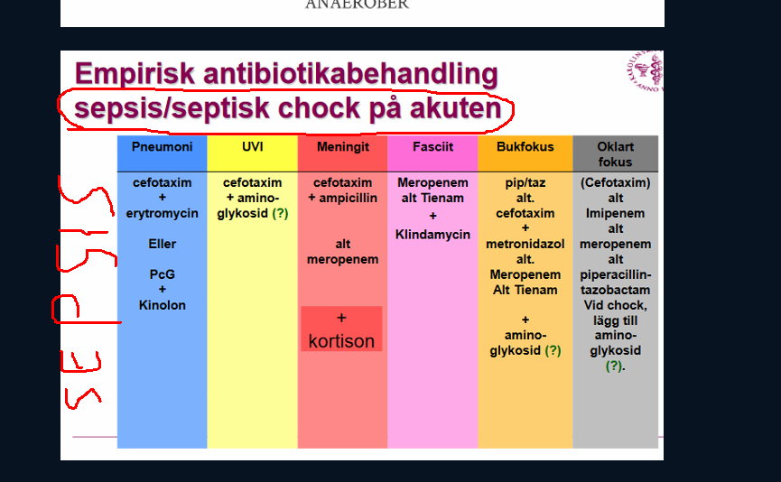

## CNS infektioner

### Meningit

***Presentation***

* ***19-årig frisk yngling.*** 
  * den 4e september halsont, känt sig hängig frusen på natten feber 41 grader
  * på morgonen 5e september fortf högfebril
  * mor ser röda utslag på benen
  * inkommer akut t infektionskliniken
  * högfebril
  * mkt slö o oklart utbredda petekier och echymoser särskilt på armar o ben
  * inte säkert nackstyv
  * cor o pulm ua
  * BT 90/55
  * Vilken diagnos och vilken mikrobiologisk etiologi år mest sannolik?  (IP)  
    * meningit / sepsis
    * meningokocker (neisseria meningitidis)
  * Vilken antibiotikabehandling väljer Du (preparat och adminstrationssätt
    * cefotaxim + ampicillin
    * eller meropenem
* 

***Kortison under meningit***

* **Enligt referenser**
  * "In experimental meningitis studies, outcome is correlated with severity of the inflammatory response in the subarachnoid space"
    * [https://doi.org/10.1016/S1473-3099(04)00937-5](https://doi-org.proxy.kib.ki.se/10.1016/S1473-3099(04)00937-5)
    * Durand ML, Calderwood SB, Weber DJ, et al. Acute bacterial meningitis in adults. A review of 493 episodes. N Engl J Med 1993; 328: 21–28.
    * Van de Beek D, Schmand B, De Gans J, et al. Cognitive impairment in adults with good recovery after bacterial meningitis. J Infect Dis 2002; 186: 1047–52.
  * "Because treatment with steroids reduces inflammation in the subaracnoid space"
* ***Betametason inte till patienter som presenterar med petekier***
  * antagligen för att detta har att göra med meningokocker
  * Noetrat att betametason haft störst effekt på pneumokock-orsakade meningiter

## Hals Mun

### Halsfluss, strep throat

***Presentation***

* 13åå pojke
  * ***Anamnes***
    * chief complain sore throat + feber 2d. samma sak yngre syster senaste veckan. 
    * sväljka ont, 
    * ingen grötigt tal, kräk, diarre, utslag, dregel, nackstelhet
    * ingen epidem
    * vaccinerad
    * inga tidg sjd, inga meds, inga allergier
    * Status bra, bara 38.5 graders feber
    * posterior orofarynx erytem med tonsillär exudat utan uvulär deiviation
    * Tonsillär svulland
    * anterior lymfkörtlar ömma
  * Huvuddiagnos: Halsfluss pga GAS
  * Differentialdiagnoser: Epiglottit, Ludwigs angina, peritonsillär absscess, retrofarygneal abscess
  * Diagnostisk plan: Centor kriterier + GAS-test (antigen test)
  * Terapeutisk plan: antibiotika kåvepenin
    * pc allergi = erytromycin eller klindamycin

***Talande för bakteriell pharyngit***

* Notera virala är mkt vanlgiare
* Yngre 15åå
* feber
* ingen hosta
* tonsillära exudat

***Behandling***

* Kåvepenin
* Pc-allergi: erytromycin eller klindamycin

## Lunginfektioner

### Pneumoni

***Behandling***

* Inläggningsfall: 
  * Bensyl-penicillin, bensyl-PC, iv. 

### Fall

#### Fall 1 - pneumoni

***Presentation***

* Hon har bestämt att det är ett inläggningsfall men hon har inte hunnit att vare sig ordinera några läkemedel eller rapportera patienten till avdelningen. Den information som du har fått i rapport av avgående jouren finns att tillgå i journalutskriften som finns på nästa sida. Du ska både komplettera provtagning om du finner det nödvändigt och ordinera läkemedel samt rapportera patienten till avdelningen på ett tydligt och medicinsk säkert sätt. Det finns risk att patienten inte kommer att rondas under dagen så alla ordinationer ska täcka första dygnet.
* Mona Larsson 400314-XXXX
  * Besöksorsak Hosta och feber
  * Socialt Pensionär. Ensamstående, vuxna barn.
  * Rökning Fd rökare, rökstopp 3 år sedan
  * Alkohol Ytterst sparsamt
  * Tid/nuv. sjukdomar Op carpaltunnelsyndrom -95
      * Hypertoni.
      * Hyperlipidemi
  * Akuellt 
      Insjuknat för knappt en vecka sedan med hosta och feber. Inte sökt vård men tagit T.Alvedon samt mixt. Mollipect hemma. Senaste dagarna har hon blivit betydligt sämre, feber upp mot 39,0 C trots regelbunden Alvedonmedicinering samt besvärlig hosta med mycket slem. Har tagit sina blodtrycksläkemedel som vanligt
  * Aktuella läkemedel T Metoprolol 50mg 1x1
      * T Enalapril 10 mg 1x1
      * Mixt Mollipect 10 ml x 3
      * T Alvedon 500 mg 2x4

***Handläggning och utredning***

* Blododlingar
* Blodprover
* Dropp

***Behandling och handläggning***

* Antibiotika: bensyl-PC

## Sepsis

### Allmänt

***Etiologi o patofysiologi***

* ***När två viktiga effekter i inflammationskaskaden*** sprider utanför infektionssiten
  * ***Vasodilatation***
  * ***Koagulation***
* ***Yttrar sig i form av***
  * hypotension
  * hypoperfusion
  * Koagulopati
  * resulterande organsvikt
* ***anaerob metabolism***: hypoperfusion + syrebrist

***Utredning och handläggning***

* ***Scoring***
  * ***Sepsis3***
    * (dock används qSOFA inte pga dålig sens o spec) qSOFA ist för SIRS; Konsensusgruppen har valt att tills vidare inte rekommendera användning av qSOFA för tidig identifiering av sepsis. Vår bedömning är att det i nuläget saknas tillräckligt stöd i form av prospektiva studier för att rekommendera ett generellt införande av ­qSOFA i svensk sjukvård.
      * takypne
      * hypotension/hypotoni/lågt BT
      * förändrat GCS
  * !! ***NEWS***: NEWS är ett mkt bättre sätt att kunna screena patienter för allvarliga tillstånd. 
* ***Markörer***
  * Laktat + metabol acidos

***Behandling***

* ***Mål med behandlingen***

  * **Första timmen**

  * 1. MAP över 70mmHg
    2. systoliska blodtrycket över 90mmHg
    3. saturatin över 93%

  * **Till sjätte timmen**

  * 1. patienten ska producera över 0.5mL/kg/h
    2. patienten ska producera över 30mL/h
    3. laktat: ska vara sjunkande

  * **24 timmar**

  * 1. andningsfrekvens: normal
    2. hjärtfrekvens: normal

* ***ABCDE***

  * ***Larma narkos?***
  * ***Syrgas***
  * ***2 iv infarter***
  * ***Vätska, börja med direkt ge 2L RA för att se hur patienten reagerar***
  * ***Vasopressor om detta inte går: efedrin till noradrenalin;*** 
    * vasokonstriktion i periferin
    * nyttigt i sepsis då det är generell vasodilatation och vätskeläckage, 
    * till skilland fr hjätrsviktspatienter med kardiogena chockar, där det skulle vara farligt med noradrenalin
  * ***Odlingar***: blododling, urinodling, NPH-odling, sputum-odling om möjligt
  * ***Antibiotika***: i enlighet med fokus
  * ***Övervak***: EKG, NEWS, diures

**Vrf extra dos betalaktam efter halva dosintervallet, mellan andra och första dosen (under en?) septisk chock**

1. svaret här     var distributionsvolymen

2. Det som sker under en septisk     chock är en väldigt dramatisk förskjutning av vätska mellan två vätskerum,     nämligen den centrala, i.e. blodkretsloppet, till interstitiet. 

3. 1. Konsekvensen      är att distributionsvolymen för vattenlösliga antibiotika har ökat
   2. Detta leder oss till att vå      uppnår lägre koncentrationer perifert, varav vi tillsätter en extra dos      mellan dosintervallen för att uppnå en bättre stabil nivå perifert. 

### Fall

#### Fall 1 - pneumoni

***Presentation***

* 73åå kvinna
  * akuten fr demensboende. Demens, hypertoni, DM2. 
  * haft frossa och produktiv hosta flera dagar. Senaste 24h har hon blivit försvagat och kan inte komma ut ur sängen. Status visar tunn äldre kvinna som är somnolent men väckbar
  * rektal temp 36 grader, HF 118, BT 84/50. Basalt höger rassel o dämpning. torra slemihinnor. scant wheeze
  * mjuk buk, ej öm. 
  * Extremiteterna känns kalla, pulsar är snabba och thready
  * inga neurologiska bortfall på grovt status. 

## Urinvägar

### Sammanfattning

***Take-home message***

* Får man en 25 årig kvinna med miktionssveda och feber, då ska man skicka in denna patienten till akuten för att vara patientsäker
  * Trots att okomplicerade pyeliter kan man handlägga polikliniskt är det i vårt fall inför IST bättre att skicka patienten till akuten.
  * Samma sak gäller vid inläggning, att det föreligger en risk att patienten utvecklar en sepsis varpå man hellre vill ha den inlagd tills man får odlingssvar och kan ge patienten bra antibiotika
* Med feber menar vi då 38 grader; nämn att detta kan vara ett tecken på allvar för examinatorn
* CRP kan användas i bedömningen också, där patienter med 
  * CRP under 30 verkar vara gränsen
  * men vi lägger patienten på en tät uppföljning bara för att följa läget och hur det har utvecklats. 
* Ska också diskutera med en erfaren kollega i rummet brevid. 

***Antibiotika***

* Okomplicerad nedre UVI
  * nitrofurantoin: mot enterokocker
  * pivmecillinam: mot proteus
* Pyelit eller avstängd pyelit
  * Gentamycin till odlingssvar
  * alternativen blir
    * trimsulfa
    * ciproflox
    * cefotax el ceftibuten

### UVI

***Notera***

* Distinktionen uvi och febril uvi, för att handläggningarna differ.

***Presentation***

* ***27åå***
  *  nyligen cystit, beh med pivmecillinam med     god effekt i 5 dagar.
  * nu två veckor senare samma     symptom
  * ***= recidiverande uvi***
  * Stod på pivmecillinam
  * ***Behandling o åtgärder***
    * Skickar urinodling
    * Sätter in nitrofurantoin denna gång
    * Täcker inte proteus, men täcker enterokocker

***Etiologiskt***

* ***Primärpatogener***
  * E coli
  * Staph Saprophyticus
* ***Proteus mirabillis***
  * recidiverande uvi orsakat av proteis: tänk på konkrement och obstruktion
  * Proteus är resistent mot nitrofurantoin
  * Därför ska man ge pivmecillinam till dessa patienter

***Behandling***

* ***Empirisk förstahandsbehandling (i.e. innan odlingssvar)***
  * Nitrofurantoin
  * Pivmecillinam

### Avstängd pyelit

***Definition***

* Övre urinvägsinfektion med avflödeshinder
* obstruktionen som vanlen är orsakad av njursten eller uretärsten (även strktur eller tumör)
* vid samtidig bakteriell infektion
* ett allvarligt tillstånd med risk för urosepsis o bestående njurparenkymsdkada
* avflödeshinder leder t snabb tillväxt av bakterier o kan jämföras med en abscess

***Etiologi***

* Vanliga etiologier är 
* E. coli, 
* enterobacter, 
* enterokocker, 
* Proteus och 
* Klebsiella

***Behandling***

* vätska + antibiotika parenteralt

* ***Antibiotika***

  * cefotaxim 1 g x 3 i.v. (till äldre och vid nedsatt njurfunktion) 
  * eller gentamicin 4,5–6 mg/kg x 1 i.v. (till yngre och njurfriska).
  * Efter odlingssvar
    * Ciprofloxacni
    * Trimsulfa

* Nefrostomiering

* 

  

### Cystit

### Pyelonefrit

***Kliniska kännetecken***

* Dunkömhet över den drabbade njuren. 
* Ryggvärk. 
* Feber, 
* illamående, kräkningar. 

***Definition***

* ***Okomplicerad pyelit***
  * Opåverkad patient
  * inget illamående kräkningar
* ***Komplicerad patient***
  * gravid
  * gammal
  * man
  * allmänpåverkan
  * tecken sepsis
  * illamående, kräkning

***Utrending och handläggning***

* ***Ett inläggningsfall, för att kan utveckla till urosepsis***
  * Dock okomplicerade okomplicerade kvinnor kan man sköta polikliniskt (förutsätter att patienten just är okomplicerad)
* ***Labb, rtg, etc***
  * urinsticka
  * urinodling
  * CRP, krea, elektrolyt, blodstatus
  * bladderscan: utesluta resurin
  * ***Radiologi av övre urinvägar (DT-urinvägsöversikt eller UL-njurar)***
    * Också för att utesluta andra diffar
    * sviktande behandling
    * kraftigt förhöjt krea
    * stensjukdom
    * komplicerad pyelonefrit
    * avstängd pyelit (avflödeshinder, konkrement, anomali)
* ***Inläggningsfall***
  * analgetika
  * antiflogistiak
  * ev iv vätska
  * iv antibiotika
    * initialt gentamycin
    * sedan enl resistensbesked enl nedan

***Behandling***

* ***Okomplicerad pyelit***
  * Gentamycin byts till po antibiotika så fort odlingssvar anlänt
  * enl resistensbesked
    * Trimsulfa
    * ciproflox
    * ceftibvuten: om resitens mot trimsulfa och ciproflox
    * amoxicillin: enterokockinfek
* ***Komplicerad pyelit***
  * Gentamycin byts till po antibiotika så fort odlingssvar anlänt
  * enl resistensbesked
    * Trimsulfa
    * ciproflox
    * ceftibvuten: om resitens mot trimsulfa och ciproflox
    * amoxicillin: enterokockinfek

### Urinvägsinfektion

