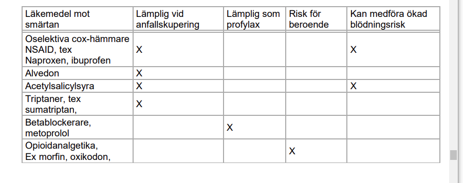

***daPresentation***

***Etiologi och patofysiologi***

***Epidemiologi***

***Kliniska kännetecken***

***Utredning och handläggning***

***Behandling***

#### Diagnoser

Aggressivitet/irritabilitet Avvikande
beteende Beroende/missbruk
Depressivitet
Desorientering/förvirring
Försämrat intellekt
Hallucinationer/vanföreställningar
Inlärnings-/minnessvårigheter
Medvetlöshet/koma
Skadat sig själv/självmordsrisk
Stress-/krisreaktion
Sömnstörning
Trötthet
Ångest/oro

## Depression

### Fall 1

***Presentation***

* **44-årig gift 3-barnsmor** 
  * Du är vikarierande underläkare på en vårdcentral. Distriktsköterskan har bett dig träffa Karin Johansson, 44, som idag varit på blodtrycksmätning. Man noterade för några månader sedan en lätt hypertoni, som behandlas med Enalapril comp 1x1. Karin har även typ I diabetes som är välkontrollerad. Hon har skötts av en kollega som nyligen slutat på mottagningen. BT idag är 130/85. Dsk tycker att patienten verkar trött och ledsen. Karin sover dåligt och känner ingen glädje över sitt arbete och dsk uppfattar att hon är deprimerad och behöver antidepressiv medicin och kanske kontakt med psykiater. Dsk är duktig, mycket erfaren och stabil och du kan lita på hennes kliniska omdöme
  * **Uppgiften är att**
    * Bedöma behov av behandling adekvat vårdnivå 
    * Informera patienten om din bedömning och dina förslag till behandling
  * I anamnesen insulinbehandlad DM II sedan ett par år, tablettbehandlad HT. Arbetar som lärare, trivs på arbetet. Sedan ett par månader tilltagande trötthet, håglöshet, fraktionerad sömn. Framkommer att patientens make haft en otrohetsaffär, ett engångstillfälle, men detta oroar pat. Ingen hereditet, alkohol 2-4 glas /vecka, ej droger, ingen livsleda, inga suicidtankar eller planer.

***Studenten ska specifikt:***

* Ställa korrekt diagnos, bedöma svårighetsgrad.
* Adekvat bedöma **suicidalitet** och ev **alkoholrelaterade besvär**
* Gå igenom **ett eller två adekvata behandlings-alternativ** och ge relevant information
* Föreslå fortsatt kontakt med primärvården och uppföljning med återbesök eller telefonkontakt

***Lärandemål***

* Skapa förtroende hos patienten och tillämpa ett patientcentrerat förhållningssätt.
* Anpassa förhållningssätt till patientens aktuella tillstånd, med beaktande av emotionell påverkan och kognitiv funktion (nivå och innehåll)
* Skilja normala från komplicerade reaktioner på trauma, relationsproblem eller långvarig stress
* Identifiera och värdera riskfaktorer och sjukdomsbildens betydelse för suicidrisk
* Värdera den suicidala intentionen’
* Särskilja depression från ledsnad, sorg och stress
* Urskilja depressiv symptomatologi vid somatisk sjukdom
* Värdera förekomst av bipolaritet, melankoliska och psykotiska drag
* Avgöra vårdnivå och huruvida specifik behandling är indicerad.
* Föreslå behandling utifrån ett patogenetiskt, psykologiskt och socialt perspektiv. 

***Etiologi och patofysiologi***

***Epidemiologi***

***Kliniska kännetecken***

***Utredning och handläggning***

***Behandling***

### Fall 3

***Presentation***

* Anders Svensson har beställt tid på VC för uppföljning av depressionsbehandling, uppgivit utebliven effekt. Ur journalen framgår ett besök för ett år sedan på VC i samband med lindriga skador efter ett fall i en trappa. Har de senaste fem månaderna behandlats för misstänkt depression med Sertralin, upptrappat till 150 mg vid månatliga återbesök hos husläkaren, men denne har slutat på mottagningen för två månader sedan. Mångåriga sömnsvårigheter, vidare framkommit viss arbetsleda, liksom initiativlöshet. Pat är i övrigt frisk, ensamstående, arbetar som journalist på en lokaltidning. Inga barn, ingen aktuell partner. Röker 20 cig/dag. Före besöket har patienten mätt BT hos distriktssköterskan; 140/95 mm Hg, enligt notering från denna. Din uppgift är att utvärdera medicinering och värdera orsaker till den uteblivna effekten av behandlingen

***Lärandemål***

* Värdera förekomst av bipolaritet, melankoliska och psykotiska drag
* Skilja normala från komplicerade reaktioner på trauma, relationsproblem eller långvarig stress
* ! Studenten skall noggrant kartlägga förekomst av alkohol/droger och sätta detta i relation till den uteblivna sertralineffekten
* Skapa förtroende hos patienten och tillämpa ett patientcentrerat förhållningssätt.
* Anpassa förhållningssätt till patientens aktuella tillstånd, med beaktande av emotionell påverkan och kognitiv funktion (nivå och innehåll)
* Identifiera och värdera riskfaktorer och sjukdomsbildens betydelse för suicidrisk
* Värdera den suicidala intentionen’
* Särskilja depression från ledsnad, sorg och stress
* Urskilja depressiv symptomatologi vid somatisk sjukdom
* Avgöra vårdnivå och huruvida specifik behandling är indicerad.
* Föreslå behandling utifrån ett patogenetiskt, psykologiskt och socialt perspektiv

***Utredning och handläggning***

* **Patientkommunikation**
    * Professionell känslomässig bekräftelse
    * Föreställningar, förväntningar och farhågor
    * Pedagogisk förmåga
    * Samverkar med patienten om beslut och handläggning
    * Förmedlar hopp
    * Struktur
* **Anamnes**
    * Symtombild
    * Psykosocial situation
    * Suicidalitet
    * Alkohol/droger
    * Tid. sjukdom, hereditet
    * Somatisk sjukdom
* **Diagnos och behandling**
    * Diagnos
    * Psykosocial situation
    * Föreslår adekvat
    * behandling/åtgärd
    * Vårdnivå 

***Återkoppling***

* Ni träffade en patient med sömnproblem och viss nedstämdhet som hade behandlats utan framgång med antidepressiva. 
  * !! Tanken med fallet var att ni skulle identifiera 
    * en riskfylld alkoholkonsumtion, 
    * eventuellt missbruk, 
    * vilket kunde tänkas ligga bakom depressiviteten och sömnproblemen, 
  * men även skulle kunna förklara den uteblivna effekten av behandling

### Fall 4 

***Presentation***

* Du är vikarierande underläkare på en vårdcentral. Distriktsköterskan har bett dig träffa Lena Karlsson, 45, som idag varit på blodtrycksmätning. Man noterade för några månader sedan en lätt hypertoni, som behandlas med Enalapril comp 1x1. Lena har även astma som är välkontrollerad med Pulmicort och Bricanyl. Hon har skötts av en kollega som nyligen slutat på mottagningen. BT idag är 130/80. Dsk tycker att patienten verkar trött och ledsen. Lena sover dåligt och känner ingen glädje över sitt arbete och dsk uppfattar att hon är deprimerad och behöver antidepressiv medicin och kanske kontakt med psykiater. Dsk är duktig, mycket erfaren och stabil och du kan lita på hennes kliniska omdöme. 
* Uppgiften
  * bedöm behov behandling, adekvat vårdnivå
  * informera lena om bedömnnig och dina förslag till behandling

***Lärandemål***

* Skapa förtroende hos patienten och tillämpa ett patientcentrerat förhållningssätt.
* Anpassa förhållningssätt till patientens aktuella tillstånd, med beaktande av emotionell påverkan och kognitiv funktion (nivå och innehåll)
* Skilja normala från komplicerade reaktioner på trauma, relationsproblem eller långvarig stress
* Identifiera och värdera riskfaktorer och sjukdomsbildens betydelse för suicidrisk
* Värdera den suicidala intentionen’
* Särskilja depression från ledsnad, sorg och stress
* Urskilja depressiv symptomatologi vid somatisk sjukdom
* Värdera förekomst av bipolaritet, melankoliska och psykotiska drag
* Avgöra vårdnivå och huruvida specifik behandling är indicerad.
* Föreslå behandling utifrån ett patogenetiskt, psykologiskt och socialt perspektiv.

***Utredning och handläggning***

* Patientkommunikation
* Professionell känslomässig bekräftelse
* Föreställningar, förväntningar och farhågor
* Pedagogisk förmåga
* Samverkar med patienten om beslut och handläggning
* Förmedlar hopp
* Struktur
* Anamnes
* Symtombild
* Psykosocial situation
* Suicidalitet
* Alkohol/droger
* Tid. sjukdom, hereditet
* Somatisk sjukdom
* Diagnos och behandling
* Diagnos
* Psykosocial situation
* Föreslår adekvat
* behandling/åtgärd
* Vårdnivå 

**Behandling**

### Fall 5

***Presentation***

* Studentinstruktion Du är vikarierande underläkare på en vårdcentral. Distriktsköterskan har bett dig träffa Jenny Karlsson, 42, som idag varit på blodtrycksmätning. Man noterade för några månader sedan en lätt hypertoni. Hon har skötts av en kollega som nyligen slutat på mottagningen. BT idag är 130/85. Dsk tycker att patienten verkar trött och ledsen. Jenny sover dåligt och känner ingen glädje över sitt arbete och dsk uppfattar att hon är deprimerad och behöver antidepressiv medicin. 
* Du har till uppgift att bedöma behov av behandling och åtgärder Kontaktförmåga, klinisk beslutsförmåga avseende diagnostik och behandling samt förmåga att informera patienten bedöms vid provet

***Lärandemål***

* Skapa förtroende hos patienten och tillämpa ett patientcentrerat förhållningssätt.
* Anpassa förhållningssätt till patientens aktuella tillstånd, med beaktande av emotionell påverkan och kognitiv funktion (nivå och innehåll)
* Skilja normala från komplicerade reaktioner på trauma, relationsproblem eller långvarig stress
* Identifiera och värdera riskfaktorer och sjukdomsbildens betydelse för suicidrisk
* Värdera den suicidala intentionen’
* Särskilja depression från ledsnad, sorg och stress
* Urskilja depressiv symptomatologi vid somatisk sjukdom
* Värdera förekomst av bipolaritet, melankoliska och psykotiska drag
* Avgöra vårdnivå och huruvida specifik behandling är indicerad.
* Föreslå behandling utifrån ett patogenetiskt, psykologiskt och socialt perspektiv. 

***Utredning och handläggning***

* Patientkommunikation
* Professionell känslomässig bekräftelse
* Föreställningar, förväntningar och farhågor
* Pedagogisk förmåga
* Samverkar med patienten om beslut och handläggning
* Förmedlar hopp
* Struktur
* Anamnes
* Symtombild
* Psykosocial situation
* Suicidalitet
* Alkohol/droger
* Tid. sjukdom, hereditet
* Somatisk sjukdom
* Diagnos och behandling
* Diagnos
* Psykosocial situation
* Föreslår adekvat
* behandling/åtgärd
* Vårdnivå

### ! Fall 6

***Presentation***

* Liselotte Hansson har beställt tid på VC för uppföljning av depressionsbehandling, och även uppgivit utebliven effekt. Ur journalen framgår ett besök för ett år sedan på VC i samband med lindriga skador efter att ha ramlat i en trappa. Har de senaste fem månaderna behandlats för misstänkt depression med Fluoxetin, upptrappat till 40 mg vid månatliga återbesök hos husläkaren, men denne har slutat på mottagningen. Sömnsvårigheter verkar ha funnits hela tiden, samt viss initiativlöshet. Pat är i övrigt frisk, är egenföretagare och sambo, en hemmavarande son. Röker 20 cig/dag. 
* ! Du är AT-läkare på vårdcentralen och träffar Linda på denna station. Din uppgift är att utvärdera medicinering och värdera orsaker till den uteblivna effekten av behandlingen.
* Översikt
  * !! Specifikt: 
    * identifiera utebliven fluoxetineffekt, 
    * identifiera överkonsumtion av alkohol, 
    * fastställa vårdnivå

***Lärandemål***

* Skapa förtroende hos patienten och tillämpa ett patientcentrerat förhållningssätt.
* Anpassa förhållningssätt till patientens aktuella tillstånd, med beaktande av emotionell påverkan och kognitiv funktion (nivå och innehåll)
* Skilja normala från komplicerade reaktioner på trauma, relationsproblem eller långvarig stress
* Identifiera och värdera riskfaktorer och sjukdomsbildens betydelse för suicidrisk
* Värdera den suicidala intentionen’
* Särskilja depression från ledsnad, sorg och stress
* Urskilja depressiv symptomatologi vid somatisk sjukdom
* Värdera förekomst av bipolaritet, melankoliska och psykotiska drag
* Avgöra vårdnivå och huruvida specifik behandling är indicerad.
* Föreslå behandling utifrån ett patogenetiskt, psykologiskt och socialt perspektiv. 

***Utredning och handläggning***

* ?? Viktiga frågor för att evaluera effekt

### Fall 6

***Presentation***

* Åsa Eriksson har beställt tid på VC för uppföljning av depressionsbehandling, uppgivit utebliven effekt. Ur journalen framgår ett besök för ett år sedan på VC i samband med lindriga skador efter ett fall i en trappa. Pat har sedan de senaste fem månaderna behandlats för misstänkt depression med Sertralin, upptrappat till 150 mg vid månatliga återbesök hos husläkaren, som dock har slutat på mottagningen för två månader sedan. Sömnsvårigheter verkar ha funnits hela tiden, samt viss leda avseende arbetet på lokaltidningen. Inga barn, ingen aktuell partner. Röker 20 cig/dag. Du är underläkare på vårdcentralen och träffar Åsa på denna station. Din uppgift är att utvärdera medicinering och värdera orsaker till den uteblivna effekten av behandlingen.
* Studenten ska identifiera att patienten fungerar väl socialt, tolererat Sertralin väl men ringa effekt. 
  * !! Identifiera 
    * uttalade sömnproblem
    * självmedicinering/överkonsumtion av alkohol, 
    * trafikförseelse 
    * samt avseende hereditet överkonsumtion alkohol hos fadern. 

### Fall 7

***Presentation***

* Du är AT-läkare på en vårdcentral och Ann, 47 år, söker för att få hjälp. Ann har tidigare inte haft kontakt med vårdcentralen. Din uppgift är att ta en adekvat anamnes och delge patienten din bedömning av vad det kan handla om. Du ska också föreslå en lämplig behandling och kommunicera med patienten om detta på ett tillfredställande sätt. Efter 20 minuter får du redogöra för hur du har resonerat kring diagnos och handläggning.

***Översikt***

* 47-årig ensamstående kvinna, god kontakt med syskonbarn, arbetar på bibliotek, en nära väninna vilken fn genomgår beh mot bröstcancer. Pats far har Parkinson, mor väs frisk, friska syskon, en faster suicid. Uppger trötthet, håglöshet, sämre koncentrationsförmåga samt sämre tålamod. Inga somatiska symptom. Inga suicidtankar eller planer. 
* Studenten ska
  * sammavägd bild relevanta depressiva markörer
  * hereditet
  * hypothyreos
  * OSAS, snarkningar
  * adekvata åtgärder
  * LKM att föredra
  * möjlighet t sjukskrivning, 
  * KBT
  * Basala prover
    * Hb,
    * Thyroidea prover
  * Korrekt information avseende behandling
    * fördröjd effekt
    * biverkningar
    * behandlingslängd
    * avsaknad av beroende
  * vårdnicå
    * första hand primärvård
    * verkningsmekanism avseende behandling
      * förbättrad transmittorfunktion
      * förklara enkelt hur för patienten

## Affektivt

### Mani

#### Fall 1

***Presentation***

* Du är vik underläkare och går jour på psykakutmottagningen i Västerås. Din nästa patient är Linda Berg, född 1973. Du har fått en konsultremiss från medicinkliniken
* Diagnos/fråga: Psykos? Önskad åtgärd: Psykiatrisk bedömning, behov av psykiatrisk vård? Anamnes: Tidigare frisk kvinna, 40 år, har sökt pga overklighetskänsla utan medvetandeförlust under bilkörning. CT-hjärna u a, Neurologstatus u a. Inga avvikelser i lab. Hjärt-kärlfrisk. Ensam vårdnad om två barn i tonåren. Pat beskriver förvirring, viss oförmåga att redogöra för tidsförlopp under bilkörning under dagen. Bror har schizofreni. Pat upplever sig ha blivit ”knäpp”. Patienten förefaller något uppjagad men adekvat. Tacksam bedömning, fortsatt handläggning. Patienten är färdigbedömd på medicinakutmott
* Din uppgift är att värdera frågeställningen enligt remissen, ställa en preliminär diagnos och föreslå handläggning; eventuell behandling och vårdnivå.

***Lärandemål***

* Skapa förtroende hos patienten och tillämpa ett patientcentrerat förhållningssätt.
* Anpassa förhållningssätt till patientens aktuella tillstånd, med beaktande av emotionell påverkan och kognitiv funktion (nivå och innehåll)
* Skilja normala från komplicerade reaktioner på trauma, relationsproblem eller långvarig stress
* Identifiera och värdera riskfaktorer och sjukdomsbildens betydelse för suicidrisk
* Värdera den suicidala intentionen’
* Särskilja depression från ledsnad, sorg och stress
* Urskilja depressiv symptomatologi vid somatisk sjukdom
* Värdera förekomst av bipolaritet, melankoliska och psykotiska drag
* Avgöra vårdnivå och huruvida specifik behandling är indicerad.
* Föreslå behandling utifrån ett patogenetiskt, psykologiskt och socialt perspektiv

***Utredning och handläggning***

* Patientkommunikation
* Professionell känslomässig bekräftelse
* Föreställningar, förväntningar och farhågor
* Pedagogisk förmåga
* Samverkar med patienten om beslut och handläggning
* Förmedlar hopp
* Struktur
* Anamnes
* Symtombild
* Psykosocial situation
* Suicidalitet
* Alkohol/droger
* Tid. sjukdom, hereditet
* Somatisk sjukdom
* Diagnos och behandling
* Diagnos
* Psykosocial situation
* Föreslår adekvat
* behandling/åtgärd
* Vårdnivå

### Fall 2

***Presentation***

* Du arbetar som AT-läkare på vårdcentral i Stockholm. Under öppen mottagning söker Daniel, 40 år, för nedstämdhet. Han har inte någon tidigare journal hos er. Genomför en konsultation och planera för handläggning med patienten
* Pat vilken uppmanats av sambo att söka VC. Tilltagande uppgivenhet, konflikt på arbetet. I anamnesen perioder med mera uppvarvat aktivt beteende samt perioder med viss deppighet. Ej inverkat på arbetsförmåga. Ej varit sjukskriven bortsett från period vid 20 års ålder då vårdad ett par veckor p.g.a. akut psykostillstånd. Därefter ingen kontakt med psykiatrin. Hereditet far: alkoholöverkonsumtion, ev bipolaritet, suiciderat då pat var 15 år. Anamnes. Identifiera och värdera nedstämdhet, hereditet, identifiera riskfaktorer, aktuell suicidalitet, Uppfatta den höga suicidrisken och väga in den i bedömning och handläggning. Klarlägga ev. tidigare bipolaritet och hereditet. Identifiera vårdnivå.

### Psykos

#### !! Fall 1

***Presentation***

* Du är AT-läkare på vårdcentral. Mats Olsson, 40 år, söker dig. Som sökorsak har angivits sömnbesvär. Pat har tidigare av kollega som slutat på mottagningen fått Zopiklon utskrivet vid några tillfällen de senaste åren. Inga sjukdomar enligt journalen, inga andra mediciner. Har sökt några gånger för ÖLI och hösnuva. Din uppgift är att ta ställning till vilken hjälp du kan erbjuda patienten. Genomför en konsultation. Examinerande lärare kommer att avbryta konsultationen efter ca 17 min, du får då svara på några frågor om diagnos och behandling
* Översikt
  * Patient med sviktande förmåga att klara arbete, uppmanats av arbetsgivare att söka mottagning. Framkommer oförmåga att ta till sig kritiken avseende arbetet, grandiosa vanföreställningar samt sömnstörning. 
  * Studenten bör identifiera 
    * behov av psykiatrisk slutenvård 
    * samt ev antipsykotisk behandling. 
    * Om studenten inte informerat patient om diagnos och behandling då 17 min förlöpt, avbryt och meddela att du kommer att ställa några kompletterande frågor till studenten (diagnos, behandling, vårdnivå). 

***Lärandemål***

* Skapa förtroende hos patienten och tillämpa ett patientcentrerat förhållningssätt. – Anpassa förhållningssätt till patientens aktuella tillstånd, med beaktande av emotionell påverkan och kognitiv funktion (nivå och innehåll) – Skilja normala från komplicerade reaktioner på trauma, relationsproblem eller långvarig stress – Identifiera och värdera riskfaktorer och sjukdomsbildens betydelse för suicidrisk – Värdera den suicidala intentionen’ – Särskilja depression från ledsnad, sorg och stress – Urskilja depressiv symptomatologi vid somatisk sjukdom – Värdera förekomst av bipolaritet, melankoliska och psykotiska drag – Avgöra vårdnivå och huruvida specifik behandling är indicerad. – Föreslå behandling utifrån ett patogenetiskt, psykologiskt och socialt perspektiv

***Utredning och handläggning***

* Samma kriterier som vanligt (se andra fall)

***Återkoppling***

* De för stationen centrala kompetensmålen från psykiatrimomentet:  Identifiera störd verklighetsuppfattning, e.g. tankestörnignar, vanföreställningar och hallucinationer, och andra psykossjukdom assocerade symptom
* Föreslå medicinsk behandling utifrån patogenetiskt, farma, psykosoc perspektiv
* vårdnivå
* hantera misstro, trädsla, fientlighet som patienten kan ha inför vård
* skapa förtriende hos pat, tillmämåa ett patientcentrerat förhållningssätt
* anpassa förhållningssät t patientens aktuella tillstånde, med beaktande av emotionell påverkan o kognitiv funkion
* självständigt ta en bred, detaljerad, riktad psykiatrisk anamnes, samt bedöma + dokumentera psykiatriskt status
* Vad gäller fallet
  * Ni träffade en patient som skickats av sin arbetsledare till läkare, med hot om uppsägning om detta inte skett, men patienten upplevde själv inga egentliga hälsoproblem. Det fanns en uppgift på den skriftliga information ni fått om att sökorsaken var ”sömnproblem”. Patienten hade för en tid sedan förlorat sitt arbete som handläggare på försäkringskassan, hade nu ett arbete som städare och hade inte längre något socialt nätverk utöver sin åldriga mor. Patienten misskötte sitt nuvarande arbete och ägnade så gott som all tid på att tänka på ”sin plan”, som rörde en idé om att hela samhället skulle göras om så att Försäkringskassan, Arbetsförmedlingen mm skulle sortera under samma myndighet- Riksbanken. För att detta skulle ske tänkte patienten bli vald till riksdagen och kanske bli statsminister – utan att på något sätt vara partipolitiskt engagerad. 
  * De flesta studenter inledde öppet och uppfattade att det var en underlig situation. 
  * Många gav patienten möjlighet att berätta om sina planer och fick även klart för sig att han/hon hade förlorat en hel del funktion. 
  * !! Flera uppfattade att patienten hade vanföreställningar, och ställde goda realitetsprövande frågor, liksom skaffade sig en bild av patientens situation i stort. 
  * Många kom ihåg att fråga efter hallucinos. 
  * Depressionsdiagnostiken verkar också många ha klar för sig. 
  * Att låta patienten tala fritt och att ställa öppna frågor i dialog med patienten gav en bättre bild av problemet än att direkt ”bocka av” symtom
* Fallgropar
  * Sammanfatta utan riktigt relfketera över vad som sagts
  * hindrande av pateintens berättelse. At endast användna slutnai frågor, avbryta patienten gjorde att bilden inte blev kar
  * begränsning t symptomdetektion, ser inte hela bilden. Behöver väga samman symptombild med livssituation, göra rimlighetsbedömingar
  * Bristande efterfrågan av symptom: känner du dig deprimerad. om pat svarar nej tror man sig ha uteslutit depression
  * Eget obehag inför det psykotiska: leder t att man avbryter patienten blir så chockad att man väljer att inte se det
  * Låst hypotes: om inte depression så är pat nog frisk, pat har framtidsplaner då kan jag vara lugn
  * behandla utifrån vad jag behärskar: skriva ut hypnotika fast pat hinte har sömnbesvär. Föreslå antidepressiva för jag kan en ort (mkt riskabelt t en psykotisk patient)
  * Bristande kunskap: "det är något psykiatriskt"
* Mer återkoppling
  * !! Att identifiera att det var en psykos
    * Det centrala var att identifiera psykos och att se det allvarliga i situationen med funktionsförlust och risk för att pat nu skulle förlora sitt arbete. Många misstänkte mani, trots att statusfynd och anamnestiska fynd, utöver det grandiosa inslaget i patientens vanföreställning, saknades
  * I förlängningen bör denna patient förstås bedömas av psykiater och helst få antipsykotika, men det kan vara svårt att motivera till detta för en person utan sjukdomsinsikt
  * Om man med finkänslighet lyckas motivera patienten till psykiatri är det förstås alldeles utmärkt. Centralt är att fånga upp patienten. Att ta tillbaka honom/henne till vårdcentralen, bygga allians och utreda vidare är i praktiken rimligt
  * Naturligtvis bör man som AT-läkare inför ett återbesök diskutera med erfaren kollega och helst konsultera psykiater via telefon för att få hjälp att gå vidare.
  *  Om möjligt bör man försöka få information och mer anamnes från patientens mor eller t o m arbetsledaren, vilket dock kan vara svårt.
  * Gällande LPT, det var inte fallet: Situationen bedömes inte vara akut i den grad att det andra kriteriet för psykiatrisk tvångsvård (oundgängligt behov av psykiatrisk heldygnsvård) är uppfyllt. 
  * Suicidfrågorna ska ställas direkt, om man tänkt ta sitt liv: Till sist – att fråga efter suicidtankar görs bäst genom att fråga efter just det, eller eventuell via frågor om pat har tänkt att han/hon inte vill leva längre och därifrån gå vidare. Att ställa diffusa, kringgående frågor om patienten tänkt på ”livet” eller ”döden” eller ”haft mörka tankar” skapar ofta mest förvirring.

## Huvudvärk

### Migrön

#### Fall 1

. Du tar emot Maria Karlsson, som är 45 år och som vill ha ett läkemedel mot migrän. Hon har ensidig huvudvärk med aura någon gång per månad sedan många år. Huvudvärken har inte ändrat karaktär. Vid val av läkemedel är det viktigt att väga nytta mot risk och fundera kring behov av profylax och/eller anfallskupering. Vissa preparat används endast som profylax och är ej indicerade vid ett migränanfall.

Ange med kryss i tabellen nedan när läkemedlet är indicerat, om risk för beroende föreligger, samt om risk för ökad blödningrisk föreligger. (1,5p)

* NSAID, e.g. naproxen, ibuprofen
  * anfallskupering: lämplig
  * blödningsrisk
* alvedon
  * anfallskupering
* ASA
  * anfallskupering, 
  * blödningsrisk
* triptaner
  * anfallskupering
* Betablock
  * profy
* opioider
  * beroende

## Sömnbesvär

### ! Fall 1

***Presentation***

* Du är AT-läkare på vårdcentral och träffar en patient som bokat tid för sömnbesvär. Patienten har inte tidigare någon journal hos er. Din uppgift är att genomföra en konsultation som leder fram till en handläggning av patientens besvär. Då det är 2 minuter kvar kommer examinerande lärare att bryta och du får berätta hur du har tänkt.
* 46-årig kvinna/man söker p.g.a. sömnsvårigheter sedan 3-4 månader. Sambo, passar syskonbarn regelbundet, arbetar som bibliotekarie, ingen sjukfrånvaro, hereditet - mor ätit SSRI en period p.g.a. nedstämdhet, far sannolikt överkonsumtion alkohol, ingen hereditet i övrigt. Patienten själv har vid ett tillfälle nyligen mätt BT på apoteket till 150/90, frisk i övrigt. Ev. viktuppgång ngt kilo. Inga övriga symptom. Identifiera överkonsumtion alkohol. Kunna identifiera riskfaktorer, utesluta depression, samt för patienten motivera ev. föreslagen åtgärd/behandling 

***Översikt***

* Hereditet rörande psykiatri inkl 
  * !! substanssyndrom, 
  * hjärtkärlsjukdom (diabetes)
* Efterhör snarkning
* Gör en sammanvägd bild av relevanta fynd.
* Riskbruk alkohol. Väger in blodtrycket, alkoholvanor och utesluter depression
* Föreslår adekvata behandlingsalternativ och ger relevant information samt planerar för uppföljning
* Prova minska alkohol, uppföljning om ett par veckor avseende sömn och BT, ev. provtagning
* Förklarar samband mellan livssituation och symtom på ett adekvat sätt

!! ***Återkoppling***

* Patienten söker på VC med några månaders anamnes på sömnstörning, med tidigt morgonuppvaknande, relaterad dagtrötthet och viss irritabilitet samt oro för ett nyligen uppmätt måttligt förhöjt blodtryck. 
* I status fanns inget avvikande frånsett BT 150/85. 
* Patienten hade en ordnad och tillfredställande tillvaro utan särskilda stressorer och var i övrigt frisk och ingen klar hereditet för somatisk eller psykiatrisk sjukdom. 
* Flertalet studenter kom, genom att antingen göra en förutsättningslöst bred eller en utifrån sömnproblemet mer fokuserad anamnesupptagning, ganska snart fram till att patienten hade ett sannolikt riskbruk av alkohol, vilket skulle kunna vara orsaken bakom såväl sömnproblem som blodtryck. 
* Den optimala handläggningen var att föreslå patienten att prova att minska konsumtionen av alkohol och att sedan följa upp sömnbesvär och blodtryck på vårdcentral, efter att ha ombesörjt basal provtagning. 
* Hypnotika bör inte ges. 
* De studenter som fick problem med denna station, 
  * hade oftast i ett alltför tidigt skede fastnat i en tankegång om t ex att sömnproblem måste vara relaterade till stress eller psykisk sjukdom. 
* Andra hade problem med att strukturera sin konsultation, 
  * så att insamlandet av anamnestiska uppgifter blev svårt att sammanställa. 
  * Att notera är att få efterhörde bruk av andra droger, trots att man konstaterat riskbruk av alkohol. 
* Den som inte alls tänkte på att fråga om alkohol, blev enligt bedömningskriterier underkänd på stationen. 
* I några fall inhämtades inte klar information om patientens konsumtion, men man kom likväl fram till riskbruk av alkohol kunde vara en möjlig förklaring till besvären. 
  * Detta ledde till lägre poäng enligt bedömningsmallen, men inte till underkännande, då en sådan strategi har gott stöd, förutsatt att läkare klart och pedagogiskt förklarar för patienten hur konsumtionen kan leda till de upplevda besvären. 
* Hos denna patient fanns dock inga obehag kring att beskriva den egna konsumtionen med i detalj, vilket förstås ibland kan vara fallet. 
* Det kan i detta sammanhang vara bra att reflektera över att riskbruk av alkohol kan definieras antingen kvantitativt eller kvalitativt. 
* Om man använder en kvantitativ definition (antal glas/vecka) och finner en konsumtion som underskrider denna gräns, 
  * !! kan man riskera att i enstaka individuella fall missa att bruket ändå ger besvär

### Fall 2

***Presentation***

* **44-årig väs frisk,**
  *  ensamstående lagerarbetare, arbetslös, vilken söker med önskan om förnyat recept på Nitrazepam pga sömnproblem. I anamnesen intermittent recidiverande värkproblematik i rygg, för vilket patienten medicinerat i perioder (Tradolan, Ipren). Tidigare överkonsumtion av alkohol. Patienten använt Nitrazepam och upplevt att detta fungerat bäst avseende sömnproblemen. 

***Utredning och handläggning***

* **Anamnes**
  * !! Depressiva symptom: inhämtar en fullständ bild av patientens depressionsanamnes
  * !! Sömnnbesvär: inhämtar fullständig bild
  * Suicidalitet: efterfrågar aktuell suicidalitet, ger tillräckligt god grund för bedömning med beaktande av riskfaktor
  * alkohol droger
  * rökning
  * **tidg. psykisk ohälsa, hereditet:** 
    * klarlägger deprssion
    * bipolaritet
    * annan psykiatri
    * hereditet
  * **Somatisk sjd**: klarlägger somatisk situation på ett relevant sätt
    * värkbesvär
    * biverkningar av medicinerng
    * annat
* **Diagnos o behandling**
  * **Diagnostisk förmåga**
    * Gör en sammanvägd bild av relevanta fynd
    * sömnproblem som kan bottna 
      * i depressiva besvär, 
      * tablettmissbruk
      * social situation
  * **Föreslår adekvat behandling, åtgärd**
    * **adekvata alternativ**
      * !! ffa uppföljning
      * **Snart återbesök**: för fortsatt klarläggning, utredning
      * mkt att göra, pprättande av god kontakt är primärt
      * föreslå ett icke beroendeframkalande sömngivande medel
      * diskussion om sömn-KBT
      * Helst avvakta antidepressiv medicinering
      * basala prover:
        * Hb,
        * Thyroidea
        * etc
  * **Information om behandling**
    * ger adekvat information
  * **Vårdnivå**
    * **Primärvård** = adekvat vårdnivå 
* **Kommunikation**
  * **Pedagogisk förmåga:** 
    * diskuterar med pat samband mellan livssituation och symptom
  * **Professionell känslomässig bekräftelse o samverkan**
    * förmedlar medkänsla o avvärdar inte patienten
    * undviker att komma i konflikt 
    * lyckas bygga upp ett förtroende hos pat o få till samverkan
  * **Struktur**
    * god struktur, ger tydlighet
    * åller tid
* **Patientkommunikation**
  * Startar med öppen fråga o bereder pat talutrymme för sin berättelse
  * klargör vad pat sj tänker kring symptom och problem
  * klargör pats oro kring symptom o problem
  * utforskar vad pat vill få ut av besöket
  * bekräftar pat känslomässigt verbalt, icke verbalt
  * gör relevanta sammanfattningar
  * förvissar sig om att patienten fått diskutera sina frågor o ger utrymme för patienten att ställa ev kompletterande frågor

### Fall 3

***Presentation***

* 57-årig man med stor stress i yrke, trivs på arbetet. Söker pga sömnsvårigheter sedan ett halvår. Snarkar ej. Bor med partner, mor och syskon i livet, syster hypothyreos, far död i arbetsplatsolycka så pat var 4 år. Har hund, i övrigt begränsat med fysisk aktivitet, riskbruk alkohol. Insomnia samt fragmenterad sömn. 

***Utredning och handläggning***

* Pat kommunikation

  * Startar med öppen fråga, bereder pat talyutrymme för sberättelse
  * Tankar, oro, önskan
    * önskan: vad pat vill få ut av besöket
  * Bekräftar, känslo, verb icke verb
  * gör rel sammanfattningar
  * förklararo motiverar för pat de riktade med frågor som ställs
  * förklarar o motiv utan med jargong under klin undersök skeender för pat
  * förvissar sig om att pat fått diskutera sina frågor o ger utrymme att ställa ev kompletterande frågor

* Anamnes

  * Huvudsymptom sömnsvårigheter
    * Debut: ett par mån sedan, initialt intermittent
    * karaktär: 
      * somnar, 
      * fraktionerad sömn
      *  vaknar x flera, 
      * ej utsövd, 
      * ej egentligt tidigt uppvaknande
    * progression över tid: nu varje natt
  * Associerade symptom
    * dagtrötthet
    * inga övriga symptom
    * stress
  * Övriga symptom
    * frusenhet
    * svettningar
    * hjärtklappning
    * förstoppnig
    * viktuppgång
  * kartlägger lev vanor
    * kost dryck: e.g. läsk, sportdryck, motion/träning
  * inhämt alk anamnes
  * tobak
  * !! depressivitet
    * kartlägger tidigt uppvaknande?
    * aptitlöshet?
    * nedstämdhet?
    * pat förnkear bestämt nedstämdhet, suciidtrappa krävs ej för full poäng
  * utforskar ev OSAS
    * snarkning
  * Tidg nuv sjd
  * hereditet
  * aktuell medicinering, inkl receptfritt o naturlkm
    * T enalapril
  * !! efterhör rökning, snus, nikotin
    * aktiv, passsiv mängd

* **Status**

  * **Hjärta**
    * korrekt auskultationsteknik
    * 4 punkter
    * auskulterar carotider, axiller
  * **Lunga**
    * perkussion
    * auskultation
  * **Mäter BT**
    * sittande, arm i hjärthöjd, palpatoriskt försts
  * **Thyroidea**
    * Undersöker
  * **!! Bukstatus**
    * undersöker korrekt teknik
    * 4 kvadranter
    * ytlig o djup palp
    * dunkömhet
    * !! perkuterar arcus/hepar

* **Pat kommuikation**

  * mot bakgrund framkommit anamnes status, motiv o involv pat i fplanering

* **bedömning o åtgärd**

  * studenten gör en rimlig prel bed

    * identifierar alkohol som potentiell orsak t sömnsvårt

  * För full poäng: studenten föreslår adekvata åtgärder

    * vårdnivå PV
    * rek halvera mängd alkohol
    * Hb, Tsh, T4
    * om studentetn föreslår CDT, leverprover o diskuterar kring detta med pat på adekvat sätt kan även det inkluderas

  * Studenten ger pat rimlig plan för uppföljning

    * återbesök 3-4v
    * 

    

## ! Utmattningssyndr

### Fall 1

***Presentation***

* Du är AT-läkare på en vårdcentral. Nästa patient är en 47 årig kvinna/man som söker för att få hjälp. Ej uppgivit sökorsak. Tina/Dennis har tidigare inte haft kontakt med vårdcentralen. Din uppgift är att ta en adekvat anamnes och att delge patienten din bedömning av vad det kan handla om, men också att föreslå hur man går vidare, vilket inkluderar vårdnivå på handläggningen. Efter 20 minuter får du redogöra för hur du har resonerat kring diagnos och handläggning.
* 

***Översikt***

* Identifiera
  * 47-årig kvinna/man, ensamstående förälder ett hemmavarande barn, särboförhållande, arbetar som lärare. 
  * Stor arbetsbelastning, sämre stresstolerans, viss konflikt på arbete, 
* Studenten ska
  * Inhämta god depressionsanamnes
  * inhämta god anamnes utmattningssyndrom
  * Efterfråga suicidalitet med beaktande av riskfaktorer: exvis faderns suicid
  * klarlägger bruk, riskbruk, beroende
  * tidg sjd psykiatriskt inkl bipolaritet, hereditet
  * Efterfrågar: allergi, hypothyreos, snarkningar (OSAS)
  * Depressib bild med utmattningssyndrom
  * möjlighet sjukskrivning
  * Behandling
    * problemlösning
    * KBT
    * ev SSRI
    * ev sömnmedel
  * Basala prover
    * Hb, 
    * Thyroidea prover
  * Primärvård

***Återkoppling***

* Det kan med glädje konstateras att de flesta studenter tillägnat sig en god intervju- och kommunikationsteknik – en konst som är viktig för att erhålla goda behandlingsresultat inom alla specialiteter, och för att undvika onödiga problem.
* Alla studenter uppfattade att patienten uppvisade en depressiv problematik. Däremot var det inte riktigt alla som uppfattade att de depressiva symtomen var en del av ett utmattningssyndrom, något som har betydelse för handläggandet och behandlingen
* Sjukskrivning med relevant vid utmattningssyndrom: Det kan i större grad vara nödvändigt med sjukskrivning 
* och antidepressiva läkemedel tycks inte vara  verksamma i samma utsträckning som vid okomplicerad depression
* KBT och arbetslivsinriktad rehabilitering kan vara att föredra. 
* !! Alltför få uteslöt förekomsten av bipolär sjukdom trots att patienten signalerande en hög aktivitetsgrad. 
  * Däremot efterfrågades suicidtankar och bruk av alkohol av de flesta studenter, 
    * två mycket viktiga faktorer hos personer med depressiva symtom. 
  * !! Stationen lade i sin uppgift stor vikt på noggrant anamnestagande.

## Ångest

### Fall 1

***Presentation***

* Stefan
  * Sjuksköterskan på vårdcentralen där du arbetar har precis träffat patienten Stefan och tycker att han behöver prata med en läkare. Patienten sökte för första gången under sommaren på grund av hjärtklappning. Redan då träffade han sjuksköterskan, och dessutom en vikarierande läkare som beställde blodprover och EKG. Allt såg bra ut, det har sjuksköterskan precis berättat för patienten. Sköterskan tycker att patientens besvär påminner om panikattacker men har inte nämnt det för honom. Besvären började i våras och har tilltagit. Nu är Stefan rädd att gå ut på egen hand, måste få skjuts till jobbet, har slutat träna. Beskriver även koncentrationssvårigheter på jobbet. Stefan är i övrigt frisk, arbetar som lärare på gymnasiet och lever tillsammans med sin make. Patienten minns ingen särskild händelse som kan ha utlöst besvären, dock hade hans fader avlidit i cancer cirka ett halvår innan allting började. Vidare berättar sjuksköterskan att Stefan är lätt att få kontakt med och är hjälpsökande. Sjuksköterskan har fått intryck att patienten mår väldigt dåligt och det verkar ha varit ett stort steg att söka hjälp. Sjuksköterskan har inte tagit upp diagnos eller behandling med patienten och tycker att han bör träffa en läkare för att diskutera dessa utifrån en medicinsk bedömning. Du ska nu prata med Stefan utifrån vad sjuksköterskan berättat. Du vet att du kan lita på den rapporten du har fått: sköterskan är mycket erfaren och känner patienten sedan tidigare. Du får naturligtvis ställa frågor till patienten. Huvudsyftet med samtalet är att delge Stefan din bedömning och ditt förslag på behandling.
  * I samtal framkommer tilltagande besvär med hjärtklappning, andnöd i t ex kö-situation, somatisk utredning varit ua. Ingen hereditet, inga övriga somatiska symptom. Ingen nedstämdhet, inget suicidalt, fraktionerad sömn, oro. Pat ambivalent till såväl tablettbehandling som samtalsterapi.

***Lärandemål***

* Skapa förtroende hos patienten och tillämpa ett patientcentrerat förhållningssätt. Analysera bemötandet och din egen reaktion i patientsamtalet.
* ? Reflektera över betydelsen av patientens ålder, kön, sexuella orientering, kulturella tillhörighet, socioekonomiska bakgrund och eventuella funktionshinder.
* Identifiera och värdera riskfaktorer och sjukdomsbildens betydelse för suicidrisk
* ! Särskilja depression från ledsnad, sorg och stress
* Bemöta en patient med akut ångest. 
  * Pedagogiskt förklara hur ångest uppkommer och uttrycks
* Identifiera och särskilja olika ångestsyndrom
* Identifiera komplicerande depression eller substansrelaterad störning samt ångest som fenomen vid somatisk sjukdom
* Avgöra vårdnivå och huruvida specifik behandling, är indicerad. Påbörja behandling vid okomplicerade tillstånd

***Etiologi och patofysiologi***

***Epidemiologi***

***Kliniska kännetecken***

***Utredning och handläggning***

* Patientkommunikation
    * Professionell känslomässig bekräftelse
    * Föreställningar, förväntningar och farhågor
    * Pedagogisk förmåga
    * Samverkar med patienten om beslut och handläggning
    * Förmedlar hopp
    * Struktur
* Anamnes
    * Symtombild
    * Psykosocial situation
    * Suicidalitet
    * Alkohol/droger
    * Tid. sjukdom, hereditet
    * Somatisk sjukdom
* Diagnos och behandling
    * Diagnos
    * Psykosocial situation
    * Föreslår adekvat
    * behandling/åtgärd
    * Vårdnivå 

***Behandling***

***Återkoppling***

* Syfte med denna station var att examinera kompetenser som är relevanta för studenternas kommande yrkesutövning: att förklara diagnos och behandlingsalternativ och planera vidare i samråd med patienten. De mer detaljerad information kring kompetensmålen, framgår av kursplan för IST och till de kliniska kompetensmålen för psykiatrikursen. 
* De allra flesta studenterna visade att de uppnått de examinerade kompetensmålen. Undantagen handlade om svårigheter med kommunikationsförmåga och pedagogiska färdigheter. Såväl form som innehåll bedömdes, och innehållsmässigt uppvisade studenterna goda kunskaper om paniksyndroms uppkomst och behandling. 
* Ett kriterium handlade om att utesluta förekomst av depression. För att uppfylla det krävdes att man frågade om nedstämdhet och minskade intressen. Detta kriterium handlade alltså inte om att ta en bred anamnes, utan att ta hänsyn till eventuell depression och dess påverkan på kommunikation och behandlingsplanering. Ingen underkändes på grund av detta, men vi tycker att vi behöver bli bättre på att förmedla de här aspekterna i samband med undervisningen

### ! Fall 2

***Presentation***

* Du är AT-läkare på vårdcentral. 42 årig kvinna, söker p g a ångest. Din uppgift är att bedöma hur du kan hjälpa henne. Beakta särskilt diagnostik, handläggning och vårdnivå. Du kommer också att få några frågor av bedömaren efter avslutad konsultation, eller efter 20 min. 

***Översikt***

* Ska identifiera
  * socialt välfungerande 2-barns mor
  * socialt sammanboende med partner
  * sen ett par månader erfarit accenteurade besvär atackvis påkommande hjärtklappning + dödsångest
  * socialt handikappande
  * suicidalitet: kartlägga noggrant, 
    * identifiera hereditet: moder suiciderat pat var 11åå
    * episod överdos tavletter samband patientens partner gjrort slut i 20åå
  * Utesluta depression: Antagligen frågor om nedstämdhet, livsglädje, anhedoni, ork..
  * Föreslå adekvat behandling
* Studenten ska
  * ställa korrekt diagnos: paniksyndrom
  * utesluta depression
  * kunna göra en suicidbedömning
  * föreslå adekvat behandling i samråd med patienten
  * !!?? förklarar hur ångest-undvikande beteende uppstår
  * Då suicidriskbedömningen kan vara svår, bör även erfaren kollega konsulteras.
    * ok att föreslå vårdnivå kvar på VC
    * äv möjligt att remittera t psyk öv för vidare suicidriskbedömning

## Farmakologi

### Fall 1

***Presentation***

* Sofia Nilsson född 1989 söker p.g.a. nedstämdhet och minskad energi. Hon har astma sedan barndomen, för närvarande välkontrollerad med den behandling hon har. Hon hade en depression i sena tonåren och en depression för fem år sedan, bägge gångerna med måttliga symptom som kunde behandlas i öppenvården, Farmakologisk behandling hade god effekt båda gångerna. Hon har aldrig haft maniska eller hypomana symptom. I övrigt frisk. Sambo. Arbetar som löneassistent. Röker inte. Dricker ca en flaska vin per vecka. 
* Aktuella läkemedel: Giona Easyhaler (budesonid, glukokortikoid) 200 mikrogram/dos, 2 inhalationer på kvällen Buventol Easyhaler (salbutamol, kortverkande beta-2-agonist, SABA) 200 mikrogram/dos 1 inhalation vid behov, högst 4 inhalationer per dygn 
* Hon använder inga andra läkemedel eller naturmedel. Efter utredning ställer du diagnosen depression och ni kommer tillsammans fram till att hon ska inleda samtalskontakt hos kurator samt påbörja farmakologisk behandling med SSRI (Tablett Citalopram Bluefish 20 mg 1x1). Patienten vill inte vara sjukskriven. 

***SSRI-beh assoc biverkningar som illamående, minskad aptit, minskad libido. Allvarliga symptom särksilt uppmärksam åp när beh inleds***

* Suicidrisk
* initial försämring
* stegrad pngest
* uppvarvning

***Om hur lång tid första återbesök***

* efter 7-10d, upp t 14d accepteras, inte kortare än 1v

***Fortsättning fallet***

* Du och Sofia har regelbundna kontakter där du följer upp den antidepressiva behandlingen. Effekten är god och biverkningarna acceptabla. Hon känner stor skillnad i humör och livsglädje jämfört med före samtalskontakten och läkemedelsbehandlingen.
* Efter fyra månaders antidepressiv behandling ringer Sofia på din telefontid. Hon är gravid i vecka 7 och undrar därför om hur hon ska göra med sina läkemedel. Hon berättar att hon tagit halv dos av citalopram sedan i går för att hon vill minska risken för att medicinen ska påverka fostret. Samtidigt är hon orolig att hon ska må sämre psykiskt om hon har för låg dos. Ni kommer överens om att ta en serum-koncentration av citalopram. Du läser FASS-texten nedan och kommer fram till att serumkoncentration ska tas om sex dagar
* ***Varför lämpligt ta provet om sex dagar***
  * 4-5 halveringstider, första halveringstiden ligger pp 1.5d
  * hon har uppnått steady state vid den punkten
* ***När under dosintervallet ska provet tas? ***
  * !! dalkoncentration, i.e. taget precis före man tar sin dos (morgondos?)
  * dalkonc är oftast studerat, eftesom variationen är minst i dalkonc

