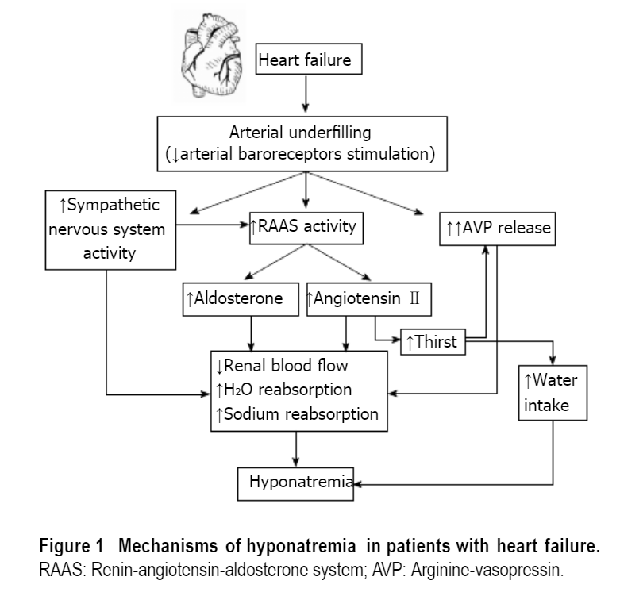
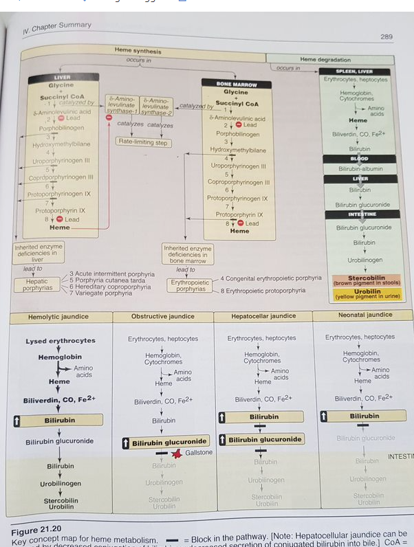

## Elektrolyter

### Kalcium

#### Hyperkalcemi

***Etiologi***

* **Efter frekvens**
  * **Malignitet**
  * **Hyperparathyroidism**: 
    * PTH leder till ökad benresorption
    * Ökad vit-D aktivering
    * Ökad resorption kalcium fr tarm. 
  * **Kronisk njursvikt**: kan ge sekundär hyperparathyroidism (minskad aktivering av vit-D i njure, varpå ökad PTH)
  * **Mjölkalkalisyndromet**
  * **Lkm**: litium, tiazider, Vit-D
  * **Granulomatösa sjd**: sarkoidos
  * **Immobilisering**
  * **FHH**: Familjär hypokalcurisk hyperkalcemi
  * **Tertiär HPT**: tertiör hyperparathyroidism, utv tertiär efter längre tids sekundär hyperparathyroiduism

***Behandlingar***

* **Uppvätskning**: akut rehydrering
* **Bisfosfonat**: alendronat
* **Calcitonin**: 
* **Prenisolon**: man ger detta för vissa maligna hyperkalcemier, maligna lymfomer och myelom
* **Kirurgi**: för primär hyperparathyroidism

### Kalium

#### Hyperkalemi

***Etiologi***

* Njurinsufficiens
* Acidos
* Hemolys
* Stor muskelskada

***Behandling***

* Kalcium iv: hjärtstabiliserande effekt
* Glukos-insulin iv
* natriumbikarbonat bikarbonat vid acidos
* resonium
* Dialys: förekommer indikation för dialys. 
* 

### Natrium
#### Hypernatremi
* Indelas baserat på ECV (är den hög, normal, sänkt)
* Ökad ECV
    * Iatrogen tillförsel hyperton NaCl
    * iatrogen bikarbonat vid HLR

***Behandling***

* ECV relaterat
    * Ökad ECV
        * Diuretika
    * Normal ECV
    * Sänkt ECV
        * Rehydrering
* ! Notera: ingen dialysbehandling verkar det som när man har natrium påverkan, utan man kan göra detta mha vätskor. 

#### Hyponatremi

##### Enl EM clerkship

***Allmänt***

* I akuta sammanhang måste man fråga om patienten ens har symptom av sin hyponatremi
* Möjligt att det är en kronisk hyponatremi (karak till äldre patienter), som inte behöver korrigeras akut
* Om patieten inte har symptom fr sin hyponatremi, kan den handläggas under en mindre stressad miljö och icke-akut

***Utredning och handläggning***

* Fyra frågor
  * Har patienten symptom
  * Om natrium väldigt sänkt, har de *svåra symptom*
    * Medvetandepåverkan
    * kramper
    * Behandling i detta fallet: hypertonisk salin (3% NaCl):
    * Dock fortfarande risk för pontin demyeliniseirngssyndorm, Locked-in syndrom, så man ska vara varsam och försiktig när man sänker Na. 
  * S-osmolalitet: detta kommer att belysa om det är en sanna hyponatremi eller en pseudo-hyponatremi
    * Möjligt att det är andra komponenter i blodet som leder till att patienten fått hyponatrmei
    * Hyperlipidemi
    * Hyperglykemi
    * Därför om S-osm är faktiskt lägre, då kan man säga att det är en sann hyponatremi
* Är patienten dehydrerad
  * Tecken åp detta: kännetekcen med spruckna läppar , tott MoS, dålig turgor, kräkningar, ökat intag diuretika
  * Behandling: normal Saline för att behandla hyponatremin
  * Om ser ut fluid-overloaded: då är det vätskerestriktion som e name of the game. 

### Hjärtsvikt

***Patofysiologi***

## Intoxikationer

### Benzodiazepiner

***Presentation***

* En 52-årig kvinna inkommer med ambulans tillsammans med maken som funnit patienten liggande i sin säng svårkontaktbar. På nattduksbordet står två tomma 25-förpackningar Sobril 15 mg (patienten hade varit på apoteket igår). Hon har länge haft ångestbesvär och konsumerar Sobril eller andra bensodiazepiner (beroende på vad hon lyckas få utskrivet) dagligen. För c.a. 5 år sedan vårdad på psykiatriska kliniken för avgiftning och hamnade då på IVA med kraftigt krampanfall. I status: Andning u.a. Svårväckt, svarar mycket dröjande på tilltal och somnar omgående. Cor: RR. Bltr: 140/80. Pulm: (bedside) u.a. Neurologiskt: Pupiller normalstora och u.a. för ljus. Nedsatt muskeltonus. Senreflexer liksidiga, svaga men positiva. Babinskis tecken saknas bilateralt.Vilket av nedanstående alternativ är mest korrekt avseende antidot i detta fall? (1p, 0p för fel eller fler än ett alternativ markerat).
  * Inte indicerat med antidot (som skulle varit flumazenil)
  * Endast antidot vid 
    * uttalad CNS påverkan
    * andningsdepression + typiskt status för benz-inducerat koma
      * nedsatt muskeltonus
      * normala pupiller
      * avsaknad fokal neurologi
      * 

***Behandling och handläggning***

* **Inläggning på IVA:**
  * ventilation och cirkulationsövervak
  * Medvetandepåverkan övervak
* **Antidot, flumazenil**:
  * ! Notera: endast indicerad vid svår tydlig benz intoxikation. Det finns en risk för sänkt kramptröskel vid användning av flumazenil, varåp det är farligt att använad den. 

### Opiater

***Presentation***

***Kliniska kännetecken***

* Miosis: små pupiller
* Andningsdepression
* Medvetandesänkning

### Järnmetabolism

***General takes***

* Att det börjar med glycin + succinyl-CoA
* Vid nedbrytning av hem till bilirubin kommer järnet att återanvändas, den kommer inte att göra av med. 
* Notera porphyrier: att det sker under hemsyntesen, upstream metaboliter. 
  * enzymbrister som leder till ackummulation av porphyr-metaboliterna
  * leder till hepatiska eller erytropoetiska porfyrier. 

