***Presentation***

***Etiologi och patofysiologi***

***Epidemiologi***

***Kliniska kännetecken***

***Utredning och handläggning***

***Behandling***

## Axel

### Fysiologi biomek

***Biomekanism modell***

| 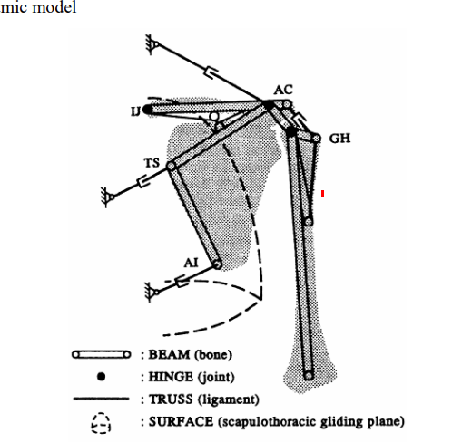 |      |
| ------------------------------------------------------------ | ---- |
|                                                              |      |

### Frozen shoulder

***Presentation***

* En 60-årig kvinna med tablettbehandlad typ 2 diabetes söker med successivt tilltagande smärta, dag– och nattetid, i vänster axel sedan 6 veckor. Hon uppger tilltagande nedsatt rörelseomfång generellt i alla rörelseriktningar med distinkt stopp innan maxuttag i rörelsen. Inget känt trauma i anamnesen. Patienten har inga andra symptom och slätröntgen av skuldran är ua liksom blodstatus.
  Givet de anamnestiska uppgifterna, vilken är den mest sannolika diagnosen?
  * frozen shoulder.

***Etiologi och patofys***

* Skrumpning av ledkapseln, men exakt orsak är okänd
* adhesiv kapsulit
* periartrit

***Kliniska kännetecken***

* Amens hålls intill kroppen
* ROM inskränkning som tydligast syns vid rotationsförsök

***Utredning och handläggning***

* Rtg av axeln, för att utesluta annan åkomma

***Differentialdiagnoser***

* Tillståndet kan ibland vara svårt att skilja fr rotatorkruffsyndrom

***Handläggning***

* Initialt, då tillstånet kan likna rotatorkuffsyndrom, pröva att ge en subakromial injektion med kortison/lokalbedövning
* informera om godartat förlopp
* Något sämre prognos fr patienter med diabetes
* Akutskede är det tveksamt om sjukgymnastik har någon effekt, men i ett senare skede då smärtan har klingat av bör pat få en remiss t fysioterapeut
* Sent skede remiss ortoped ställningsstagande mobilisering i narkos om inte stelhet släpper. 

### Fall

#### Fall 1 - Smärta axel

***Presentation***

* 82-årig 
  * patient som söker pga smärta vä axel. 
  * Gör en fullständig konsultation.
  * Fokuserad och riktad anamnes och status
  * Beakta ev akuta eller farliga sjd tillstånd med symptom från skuldran.
  * Presentera ett differentialdiagnostiskt resonemang hos äldre manlig patient med smärta i axeln.
  * Förklara och, mot bakgrund av anamnes och status, i samråd med patienten, föreslå fortsatt handläggning. 

***Etiologi och patofysiologi***

***Epidemiologi***

***Kliniska kännetecken***

***Differentialdiagnoser***

* Impingement
* Frozen shoulder
* Artros, obs äv ACleden
* Muskulär/sen etiologi (ruptur)
* Disko-/ligamentär etiologi
* Skelettaffektion (metastas/myelom)
* Neuropatisk smärta /diskdegen sjd/stenos/
* Referred pain malignitet
* * 

***Utredning och handläggning***

* **Anamnes**
  * Aktuella besvär: lokal, duration, kvalitet, tidg. episoder
  * Smärtan
    * vad förbättrar, förvärrar
    * intensitet,
    * strålning
    * karaktär, 
  * Andra symptom
    * nackbesvär
    * bröstryggsbesvär
    * andra leder
  * Utlösande moment: trauma, annat
  * Hereditet: reumatiska sjd, associerade sjd, annat
  * Socialt: familj, yrke, fritid, tobak, alk, drog
  * Medicinering
    * typ
    * dosering
    * effekt
    * compliance
* **Status**
  * Fysisk undersökning
    * inspektera axel, skuldra, arm
  * palperar axel
    * screenar rörlighet axel
  * testar isometrisk kontraktionstest, 
    * rotator kuffen
  * prövar axelstabilitet
  * nacke, nackrörlighet: aktivt + passivt
  * armbågsled, palp
  * Sensorik
    * beröring, bimanuellt C2-T5
    * foramina kompressionstest
  * Reflexer
  * grovkraft: händer, interosseer

***Behandling***

Omedelbart fortsatt åtg

* Rtg
* Lab B-glu, SR/CRP, Hb
* Sjukgymnastik (eccentrisk träning rotatorcuff/skulderkontroll/
* Återbesök

#### Fall 2 - Smärta axel, PMR

***Presentation***

* **60åå kvinna**
  * Söker pga värk i axlarna
  * Uppgift: anamnes, undersök, bakgrund ditt diff övervägande överenskomma med patienten om fortsatt handläggning
  * Tabl beh HT
  * Söker pga värk axlar sedan 2v
  * Tolkar detta som träningsvärk överansträng i samband fönsterputs av många höga fönster
  * denna vecka tillkomst värk kring höftregionen + allmän sjukdomsskänsla
  * Mål
    * ge tidigt akt på att det är en PMR + diffa temporalisartrit

***Etiologi och patofysiologi***

***Epidemiologi***

***Kliniska kännetecken***

***Differentialdiagnoser***

* Diffar malignitet
* myosit
* borrelia
* polyartrit
* spolndylos artros ev tandinfektion 
* ev virusetiologi

***Utredning och handläggning***

* ***Anamnes***
  * **Smärtans**
    * duration
    * karaktär
    * intensitet
    * ev rörelsekorrelation
    * dygnsvariation ex morgonstelhet
  * **Allmänna symptom**
    * trötthet
    * feber
    * nattsvettningar
    * hjärtklappning
    * andfåddhet
    * viktnedgång
    * viktuppgång
    * ökad törst
    * ökade urinmängder
  * **Lokala symptom leder**
    * svullnad
    * rodnad
  * **Övriga symptom**
    * Fästingbett
    * hudsymptom
    * tandinfektion
  * **Aktuell medicinering**
    * HT-medicin
    * compliance
    * icke receptbelagd LKM
  * **Ärftlighet**
    * allmänt
    * frakturer
    * benskörhet
  * ev tidg. frakturer
* Status
  * MoS + lymfkörtlar
  * Lungauskultation
    * Perkussion
    * auskultation
  * Hjärtauskultation
    * korrekt utförd
    * inkl carotider + axiller
  * temporalis region
    * palpation bilat över regionen för a temporalis
  * BT sittande, korrekt utfört
  * skulderstatus
    * insp fram o baksida
    * palp
    * ROM
    * styrka
  * Nerv
    * reflexer,
    * sensibilitet, beröring
  * Ryggstatus
    * insp
    * palp
    * ROM
    * SLR
  * Höfter
    * inspektion,
    * gång
    * ROM
    * styrka

***Behandling***

## Arm

### Armbåge

#### Status

***Lateral epikondyl***

* Dorsalextension mot motstpnd
* Supination mot motstånd

#### Fall 1

***Presentation***

* Studentinstruktion Du är AT-läkare på akutmottagningen och ska bedöma en patient, som söker för besvär med sin armbåge. Genomför en konsultation! Examinator kommer då 3 minuter återstår att ställa ett par frågor. 

***Översikt***

* Studenten ska för godkänt inhämta en adekvat anamnes och genomföra ett adekvat status samt förklara för patienten och överenskomma om fortsatt åtgärd.
* Studenten ska komma fram till diagnosen tendinos i laterala epikondylen (tendinit kan godkännas med viss tvekan).
* !! ?? Studenten ska kunna förklara skillnad mellan tendinit och tendinos –

***Utredning o handläggning***

* ***Anamnes och status***
  * När/var/hur uppkommer besvären?
  * Domningar/parestesier i hand eller fingrar?
  * Socialt: Dominant hand, yrke
  * Rökning och alkohol
  * Tidigare och nuvarande sjukdomar
  * Läkemedel och allergi
  * Inleder med öppna frågor
* ***Handstatus***
  * ***Inspektion***: svullnad, rodnad
  * *Rörlighet*: Flexion+extension, pro-och supination armbåge
  * !! **Palpation**: Laterala epikondylen, extensormuskulatur
  * ***Specifika test***: Dorsalextension handled mot motstånd, supination mot motstånd
  * ***Distalstatus***: Motorik och Sensorik - Nn radialis, medianus och ulnaris,
  * ***Kärlstatus***: A radialis (a ulnaris),
* ***Bedömning***
  * !! Informerar patienten om rimlig diagnos (tendinos/lateral epikondylit)
  * Föreslår remiss till sjukgymnast för eccentrisk träning
  * Föreslår analgetica (0.25), nekar kortisoninjektion (0.25)
  * Diskuterar arbetssituation/sjukskrivning
  * I samråd med pat överenskommer om fortsatt handläggning
* ***Patofysiologi***
  * Orsakas av strukturella förändringar i senan. 
  * !! Kärl och nervinväxt i extensormuskulaturens
  * sena, ffa extensor carpi radialis brevis, där retraktion av dessa strukturer uteblir jämfört med normal inflammatorisk process

## Hand 

### CMC1 artros

***Presentation***

* En äldre dam beklagar sig över att hon inte längre kan spela TV-spel med barnbarnen för att hon får sådan värk i     tumgreppet. När du komprimerar CMC 1 leden gör det rejält ont. 

***Kliniska kännetecken***

1. Den vanligare åkomman. 
2. särskilt äldre kvinnor
3. sällan hos män av oklar orsak

4. **Symptom**
   1. **rörelsesmärtor** 
      1. basalt i tumgrepp
      2. radialt i carpus	
   2. smärtorna ger försvagat  handgrepp

***Differentialdiagnoser***

* **DeQuervains tenosynovit**

  * ***Finkelsteins test***: opposition av tummen och clench i fist och ulnar deviate. pain in      the base om the thumb
  * **Notera**: att vid dequervain så löper senskidan för extensor pollucis precis över CMC1 leden. 

**Undersökning**

1. ***OK sign***: nedsatt kraft i tum-pekfingar grepp (ok sign) pga smärta
2. **palpation**: direkt ömhet över CMC1
3. **indirekt smärta**: gm tar tag i tumme, försiktigt komprimerar och roterar mot karpus.
4. Slät-rtg: bekräftar diagnos

**Behandling**

 1. **Konservativ**
       1. Adduktionsskena, att tummen ut fr handflatan
       1. Utbildning i tekniken att sätta detta
 1. **NSAID + Paracetamol**
      2. **op i senare skede**
      3. **fysioterapi: att man får splint. förhoppningsvis       fångas dessa patienter tidigare och får detta tidigt.** 

         4. kan börja med att ge intraartikulär steroider kortisoninjektion
      
    3. **ortos**  vid ansträngning kan mga pat bli glada över
          1. **abduktionsskena el ortos**

4. **Kirurgiskt**
     7. invalidiserande  smärtor: extirpation av trapezium och stabilisera led
       8. **resektion av trapezium**
       9. ibland att man rekonstruerar tendon och mjukdelar, men ingen stark evidens för detta. 
       10. sällan implanteras endoprotes
       11. Ersättnng med palmaris longus, spacer
       12. Artodes: ett alternativ

| 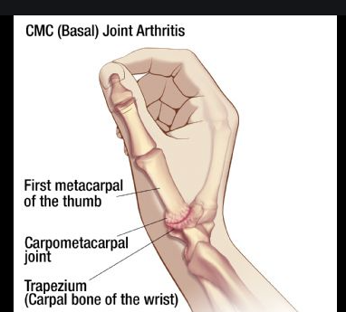 |  Fulminant adduktionskontraktur, långt gången; kan känna av osteofyter när det ser ut så här |
| ------------------------------------------------------------ | ------------------------------------------------------------ |
| 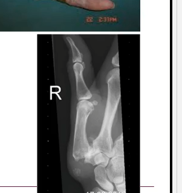 |                                                              |

### De Quervain

***Etiologi***

* 1:a dorsala senfacket
  * abduktor pollucis longus
  * Extensor pollicis brevis
* Tenosynovit
* Överansträngning: monotont repetitivt arbete
* överanvändning   syndrom
* inflammation av extensor     senorna av pollusis

 

**Kliniska kännetecken**

1. smärta  radialt handled: lokal palpömhet
2. exacerberas med användning av tummen

**Utredning**

1. **Finkelstein test:** 

2. 1. ulnar  devition of fisted hand, producerar smärta (radiellt)

 

**Behandling**

1. NSAID,

2. **Konservativt**

   1. i 7-10d
      1. vila
      2. ortos
      3. eller gips
3. steroidinjektion om      långdraget förlopp: utbildad i detta, annars nål i sena som sen kan atrofiera
4. **operation**

   1. delning 1a      dorsala senfacket 
   2. senare skede

| 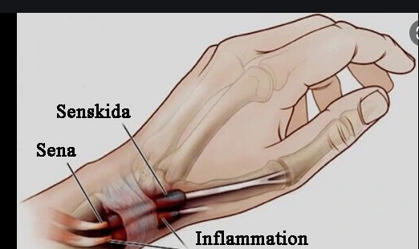 | 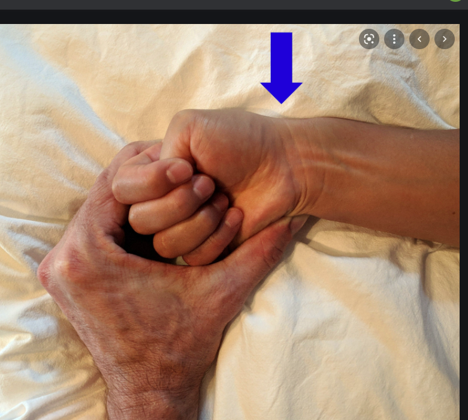 |
| ------------------------------------------------------------ | ------------------------------------------------------------ |
|                                                              |                                                              |

### Domningar hand

#### Karpaltunnelsyndrom

***Etiologi***

* Ökad vävnadsvolym
* Vätskeretention
* radiusfraktur, SMITH
* Bldöning, ganglion, DM
* anormal muskelbuk
* synovit
* kvinnor > män, 40-60år

***Utredning o handläggning***

* Status
  * Inspektion
  * Rörlighet
  * Spec test: 2PD, tinel, Phalens
  * Palpation över karpalligament: upplevd smärta o parestesier
* Vissa fall kan det finnas anledning vidare utredning EMB ENG
  * Bakomliggande sjd: diabetes, där osäkerhet om grundsjd eller riktigt karpaltunnelsyndrom

***Behandling***

* Börjar alltid icke kirurgiskt
  * Ortos: extension i handled
  * !! ***arbetsterapeut*** remiss
* Prövbehandling NSAID (kloka listan)
* Överväga steroidinjektion: koll på tekniken
* Kirurgi: sista hand, klyver karpaltunneln

#### Ulnaris

##### De Guyon

***Etiologi***

* Lokalt tryck över inom hypothenarområdet (hypotenar)
  * radiellt om os pisiforme
* Andra oraker
  * Synovit - RA, 
  * anatomiskt, 
  * ganglion, 

***Kliniska kännetecken***

* Parestesier och domningskänsla volart dig 4 + dig 5 (ulnaris utbredningsområde)
* Det är normalt dorsalt (alltså handryggen)
* Svagt tum/pekfinger grepp
  * pga ulnarförsörjnig av första interosseerna

***Utredning***

* ***Status***
  * ***Tinels*** test
  * ***Perkussionsömhet*** Guyons kanal
  * ***Svaga interosseusmuskler*** (abduktion-adduktion i fingrar)
  * ***Bibehållen kraft i lillfingrets ytterled***: till skillnad från de mer proximala ("höga") ulnariskompressionerna!
  * ***nedsatt sensorik ulnart volart*** (alltså över the palm of the hand)
  * ***Froments tecken***
    * Just för att testa nervus ulnaris påverkan på första interossen: 
    * oförmögna att hålla ett blad eller gradskiva utan att böja på tömmens IP led som kompensation, f
    * för att interosseen är så svag

***Behandling***

* NSAID: receptfritt ibuprofen
* Ortos
* Operation: klyvning av fascian över guyons kanal

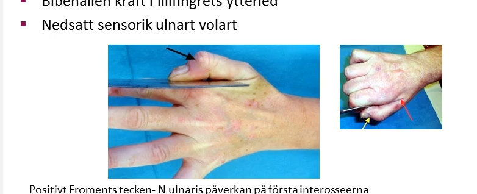

#### Hög/proximal ulnaris kompression

***Etiologi***

* ***Kompression*** av n ulnaris bakom mediala humerusepikondylen
* ***Etiologiskt***: kan komma fr nervrotsnivå !! 
  * ***Yttre trauma***: direkt eller tension
  * ***Okänd***

***Kliniska kännetecken***

* ***Parestesier och domningar*** 
  * volart dig 4 + dig 5 (ring o lillfinger)
  * ***!! OCH ulnart handryggen***
* ***Smätra***
* ***Svaga interosseer***
* ***Svag flexor dig profundus dig 5***

***Utredning***

* Status
  * nedsatt sensorik o kraft enl nervus ulnaris
  * positiv tinel i armbåge

***Behandling***

* ***Nattskena runt armbåge***
  * strävar efter lätt flektion
* ***Kirurgiskt***: konservativt fungerar inte
  * Nervolys, där man befriar nerven, öppnar upp den, så att den får fritt spelrum

#### Fall 1

***Presentation***

* 60åå kvinna
  * Du arbetar som AT-läkare på VC Hälsan. Din nästa patient söker pga. domningar i höger hand. Din uppgift är att inhämta anamnes från patienten och undersöka henne samt överenskomma om fortsatt handläggning. Efter anamnes och status får du tillgång till ett MRT svar som hjälp i din diagnostik. Efter 20 minuter får du redogöra för hur du har resonerat kring diagnos och handläggning
  * Tid väs frisk 60 årig kvinna, icke rökare, måttligt alkohol, arbetar som lärare söker pga. domning höger hand sedan drygt tre månader. Exaecerbation av symptom senaste 10 dagarna. Har sökt på vårdcentralens jourmottagning och träffat annan kollega som skrivit remiss MR halsrygg
  * I anamnesen störd nattsömn pga domningar i höger hands lillfinger och ringfinger, inget känt trauma. Dagtid domning framför allt vid statiskt arbete. Nu nytillkommen värk i överarmen med utstrålning i ring- och lillfinge
  * Utlåtande MR halsrygg
    * Lätt avplanad lordos, ingen intraspinal expansivitet. Ingen signalförändring i ryggmärgen. Lätt bakåtbuktande disker C4-C7 vilket medför en lätt avsmalning av durasäcken men ingen påverkan på ryggmärgen.
    * Diskerna C4-C5 och C5-C6 buktar mera utåt foraminalt på hö sida och ger måttlig foraminal trängsel. 
    * Diskerna C7-Th1 buktar mera på hö sida och ger tillsammans med pålagringar en måttlig foraminal trängsel på hö sida. 
    * Övriga nivåer är, inkl foramina, ua.
  * Status
    * Hö hand: uppger något nedsatt känsel ulnart och negerar nedsatt kraft lillfinger vid adduktion.
    * ! Kompressionstest (spurlings test?): Positiv foraminakompressionstest samt minskade symptom vid traktionstest. 
    * ! Traktionstest: "cervical distraction test?"

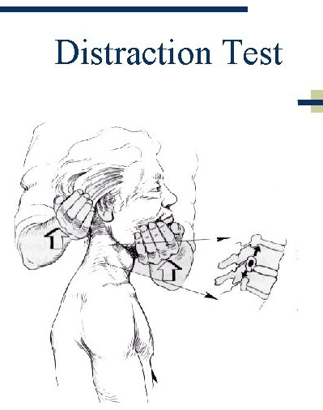

***Etiologi och patofysiologi***

***Epidemiologi***

***Kliniska kännetecken***

***Differentialdiagnoser***

* Muskulär etiologi
* Spndylos
* Hernierad disk
* spinal stenos
* cervikal ritzopthi
* perifer kompression n ulnaris skuldra
* armbåge
* hand
* !! referred pain
* Thoracid outlet syndrome

***Utredning och handläggning***

* ***Anamnes***
  * Domning o smärta
    * SOCRATES
    * Faktorer som förvärrar o lättar
    * Utbredning
  * Associerade symptom 
    * Subjektiv svaghet
    * förändrad känsel
    * smärta 
    * stelhet
    * övriga symptom: domningar ngn annanstans
  * tidg nuv sjd
  * tidg trauma
  * Tobak, alkohol,
  * Hereditet:
    * diskbråck
    * neurologisk sjd
  * LKM: receptbelagda + naturläkemedel
  * Effekt provade smärtstillande lkm
  * Social anamnes:
    * yrke, arbetsförmåga
* ***Status***
  * ***Halsrygg***
    * Inspektion
    * ROM
    * palpation kotor, muskler
  * ***skuldra, arm, hand***
    * inspektion, palpation
    * ev atrofier
    * palpationsömhet musk / leder: inkl ac-led o handled
    * rörelseomfång skuldra
    * grovkraft
  * ***Arm hand, neuro undersökning***
    * Sensibilitet, beröring
    * Reflexer
  * ***Radialis, medianus, ulnaris***
  * ***Nivådiagnostik***
    * Tinells test, phalens test
    * Foraminakompressionstest / traktion
  * ***Distalstatus***
    * Pulsar, temp

***Behandling***

***Åtgärd***

* fysioterapeut: Föreslå bedömning + behandling
* åter vid accentuerad symptomatologi
* ev NSAID / paracetamol

***Återkoppling***

* De allra flesta studenter var duktiga på patientcentrering. Svagare i verbal känslomässig bekräftelse. 
  * De flesta hamnade rätt i den medicinskt fokuserade anamnesen avseende smärtans etiologi och inhämtade information avseende ev symptom fr hand till skuldra och halsrygg. 
  * Många glömde efterhöra huruvida domning och ev värk ev förelåg någon annanstans. 
  * Många studenter var duktiga avseende nivådiagnostik under status. 
  * Ett antal studenter fastnade i sin undersökning av armen och låste sig något för att undersöka ev karpaltunnelsyndrom, trots att sensibilitetsnedsättningen ej motsvarade medianus. 
  * En del gick dock vidare och undersökte halsryggen och fick då diagnostisk vägledning och landade så småningom i ulnaris.

### Scaphoideum

***Presentation***

***Etiologi***

* Efter distal radiusfraktur är fraktur i skafoideum den näst vanligaste frakturen i handleden
* Obehandlad scaph-fraktur 
  * pseudartros som obehandlad kan leda till en progredierande karpal kollaps, så kallad SNAC (scaphoid nonunion advanced collapse), och avancerad artros i handleden

***Utredning och handläggning***

* ***Status***
  * **Fossa tabatiere**
  * **Palpation av tuberculum scaphoidei**
  * **Axiell kompressio utmed tummens längsriktning**: smärta vid kompression i tummens längsriktning indikerar en skafoideumfraktur med en sensitivitet på 100 procent och en specificitet på 74 procent 
* Patienter med distala frakturer kan vara ömma endast över tuberkulum och därför bör även isolerad palpationssmärta här föranleda vidare radiologisk utredning

***Källor***

* https://lakartidningen.se/klinik-och-vetenskap-1/artiklar-1/klinisk-oversikt/2019/06/diagnostik-och-behandling-av-akuta-skafoideumfrakturer/

| 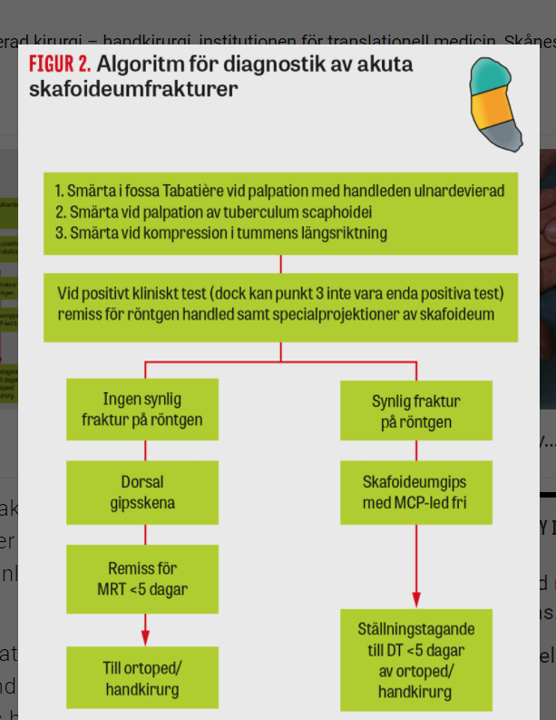 | 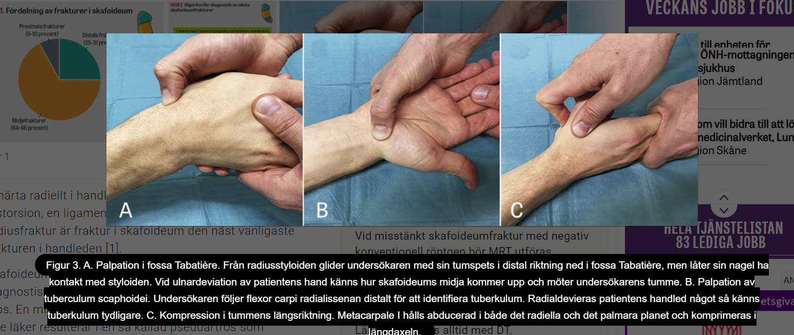 |
| ------------------------------------------------------------ | ------------------------------------------------------- |
|                                                              |                                                         |

#### Fall 1

***Presentation***

* du är AT-läkare åp akuten, 
* ska bedöma en pat som idag ramlat ute o tagit emot med höger hand

***Utredning och handläggning***

* Inhämtar anamens o fkouserat status
* Anamnes
  * Hur var skedde skadan
  * Smärtanamnes
    * SOCRATES
    * locale
  * domningar, parestesier i hand eller fingrar
  * Socialt
    * dominant hand
    * yrke
  * Tobak, alkohol
  * Tidg, nuv sjd, frakturer
  * Lkm, allergi
* !! Status
  * Inspektion
    * kontroll för hematom
    * sår
    * felställning, rotationsfelställning
  * Rörlighet
    * flexion + dorsalextension handled
    * flexion + extension fingrar
  * Palpation
    * fossa tabatiere
    * volart scaphoideum
    * axiell kompression
    * distala radius
    * !! UCL
    * !! CMC1
  * Distalstatus
    * Motorik + sensorik 
      * radialis
      * medianus
      * ulnaris
    * 2PD
    * pulsationer i a radialis (a ulnaris)
* Prel bedömning o åtgärd
  * Kompletterar status med skriven rtg remiss
    * Önskad undersökning
    * frågeställnign
    * anamens o status
  * Bedömer rtgbild o ger pat info o bg av anamnes, status, och rtgfynd
  * Diskuterar o informerar pat om rimlig diagnos
    * scaphoideumfraktur trots normal rtg
    * efterhör om pat har frågor
  * gipsbehandling trots neg rtg
  * beskriver uppföljning med MR eller återbesök om ca 10d  med rtg utan gips o nytt status över scapoideum
  * överenskommer i samråd med patienten om planering för fortsatt handläggning
  * Rörelseinstruktioner, sjukgymnastik
  * Diskuterar smärta, ev medicinering
  * diskuterar arbetsförmgåga, sjukskrivning
  * beskriver anatomin o dess relevans för möjlig komplikation för tänkbara diagnos samt namnger strukturerna A-D
  * !!! **anger rätt namens på angivna carpalben**
    * beskriver att kärlförsörjninen t scaphoideum kmr fr distala polen o löper intraosseöst mot proximala polen
    * en fraktur i scaph kan riskera kärlförsörning t proximala fragment med risk för pseudoartros

***Återkoppling***

* De flesta inhämtade en god anamnes. 
  * Viktigt att beakta frågor avseende distalstatus vilket många studenter glömde. 
  * Vid handskador ska även fråga om dominant hand vara med vilket någon enstaka student kom ihåg. 
  * De allra flesta frågade om tidigare sjukdomar, mediciner och allergi som förstås alltid ska finnas med i anamnesen. 
  * Det var endast enstaka studenter som frågade om rökning och alkohol, detta bör ingå i all anamnes.
* Statusdelen
  * De flesta studenterna genomförde ett adekvat generellt status med Inspektion, Rörlighet, Palpation och Distalstatus. 
  * För scaphoideum skulle helst 3 test utföras dvs 
    * palpation i Fossa Tabetiere, 
    * palpation volart över scaphoideum och 
    * axiell kompression 
    * dvs att med hjälp av metacarpale 1 trycka mot trapezium och mot scaphoideum. 
  * !! Flera studenter stannade av i palpation när de väl hade ett positivt fynd- obs-hela handen och underarm måste palperas igenom
* **Rtgremiss**
  * undersökning av handled hand o scaphoideum bör ha begärts
    * för caph tas särskilda bilder
  * anamnes ska kort beskriva vad som hänt o sedan VAR pat är palpöm så att rtgsktöerskan radiologen kan fokusera just på d området
  * det är viktigt att veta vilke anatomisk stuktur som är om under huden
* **Behandling**
  * aktuell pat var öm över scaph vid alla tre test o hade en rtg som var normal
  * i konsult ska det då ingå att förklara för pat vilket ben som kan var askadata o att det trots negativa rtg är indicerat att beh med gips
  * mga stud har angivit alldeles för kort gipstid allt fr 2-6v. i dessa fall msåte man informera att gipstid kan bli 12v o ibland mer
  * här ska också beskrivas för pat hur den ska öljas upp ca 10d t ortopedmottagning med ny rtg el MR samt klinisk ctrl, då ställningstagande t fortsatt gipstid eller avgips
  * flesta kom ihåg smärtlindring inför pats hemgång, 
    * paracetamol föredras
  * några studenter kom ihåg sjukskriv o enstaka gav rörelseinstruk hur pat ska röra fingrar, armbåge, axel, efter gips
  * båda är viktiga inför pats hemgång. 
* **Anatomi**
  * för att kina så precist så rär anatomi kunskaper A o O
  * som doktor bör förklara för pat vf just den här fraktur räver minst dubbelt så lång läkningstid jfr andra frakturer som pat kanske haft ökar compliance för den långa gipstiden
  * en beskrivning om hur kärlförsörj komr distalt fr o löper intraosseöst t proximal pol. 
  * midjefraktur klipper av färl t proximal pol
  * o därmed ökar risk för pseudoartros o nekros
  * vilket kan orsaka smärttillstånd för pat
  * aktuella carpalben: trapezium, scaph, lunatum, pisiforme. 

### Triggerfinger

**Pres**

1. **Din faster** 

2. 1. **problem med att höger långfinger      hakar upp sig.** 
   2. **När hon knyter handen fastnar fingret i böjt läge och** 
   3. **hon måste räta ut det med andra handen och** 
   4. **det gör så ont.** 

 

**Allmänt**

1. Enl CLINITEC boken: Tendinitis Nodosa/     Tenovaginitis stenosans aka. Trigger finger 
2. Det föreligger en lokal     förtjockning i den fibrösa senskidans mynning i med MCP-leden, och 
3. när senan passerar genom den     för trånga mynningen upplever pt ett smärtsamt knäpp. 
4. Fingret kan då låsas i     flekterad position. 
5. Upphakningen beror på ett     missförhållande mellan flexorsenorna och senskidan. 

 

**Behandling**

1. Konservativt

2. 1. Icke      kirurgiskt först, 
   2. NSAID och sätt på en skida      så den kan relaxera. 
   3. Kortison injektion annars: 3      ggr, om det inte fungerar skickar kirurgi. max 4 injektioner per år.

3. **Kirurgi**

4. 1. senskideklyvning. 

 

**Pulley system**

1. **försöka få flexor     senor vara tight mot benet,** 
2. **om inget pulley     system kommer man få bow string effekt, att senan kommer att ta kortaste     vägen** 
3. **finns 5 pulleys**
4. **första pulley ofta     blir sjuk, att mna får en noduli fibrös i senskidan, som leder till att     man får problem med flektionen**

| 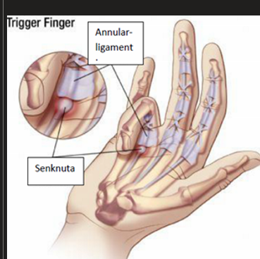 | 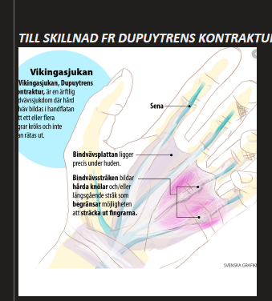 |
| ------------------------------------------------------------ | ------------------------------------------------------------ |
|                                                              |                                                              |

### UCL

#### Allmänt

**Pres**

1. 38åå man

2. 1. ramlat skidbacke
   2. stab i hand när tog emot i snö
   3. värk över ena tumme
   4. smärtar när rör
   5. **misstänka ruptur kollateralligament första MCP led**

 

**Etiologi**

1. orsaka fett mkt stress på kollateral ligamentet. 

2. när proximala phalangen, (phalanx proximalis) extendera för mkt av the stick, när den fastnar

3. basic principle, 

4. 1. if extraartikulär ligament and gets rupture -> bleeding and hematome -> then they have tendons to heal, same for ligament and tendon.

5. why UCL gets sututes, 

6. 1. cuz if it is ruptured, 
   2. then the end of the UCL  ligament will leave on upper fascia neurosis, 
   3. the two ends cannot overlap  on each other. 
   4. the tendon of **musculuaris adductor pollusis**  gets in between. 
   5. if there is a bump one must      operate

**Handläggning**

1. **distalstatus av hand**

2. **Status av UCL**: jämför med andra sidan

3. 1. **fixera första metacarpalen med ena handen**

   2. **andra handen hålla i proximala phalangen och radiellt deviera      den,** 

   3. **om över 45 grader, indikerar skadad UCL**

   4. **Total ruptur**

   5. 1. att       distala ligament fästet lossnar
      2. ledbandet viks proximalt
      3. gör att ändarna ligger isär
      4. andra mjukdelar       interponerar och skadan kan inte läka utan operation

4. **röntgen, utesluta fraktur**

5. smärtlindring, högläge, 

6. fixation 

7. 1. el-linda eller
   2. ortos eller
   3. gips

8. försiktighet

9. remiss ortoped hemort, för     uppfölj o evt operation

10. **skada ej akut att behöva avbryta resa**

 

**Behandling**

1. **Konservativt**

2. 1. Fixation 

   2. 1. **Thumb-spica splint**
      2. el-linda eller
      3. ortos eller
      4. gips

3. Operativt

4. 1. syr ledbandet på plats

   2. gips 5 veckor

   3. **Artodens indikation**

   4. 1. om ingen förbättring av ovan operation, gör man steloperation

**Utredning**

1. testa UCL,     ulnara kollateral ligamentet

2. 1. fixera      MCP1 med fingrarna, fixera den hårt
   2. sen ska man raidellt deviera      proximala phalangen, också hårt. 

 

**Komplikationer**

1. instabilitet     i tummens MCP1 vid UCL
2. subluxationstendens i MCP1

| 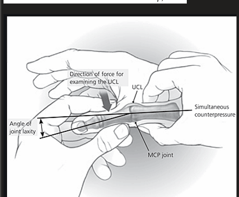 | 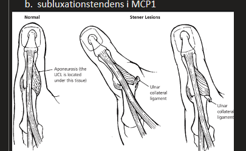 |
| ------------------------------------------------------------ | ------------------------------------------------------------ |
|                                                              |                                                              |

#### Fall 1 

***Presentation***

* Man/kvinna vilken en vecka tidigare fallit på blöt berghäll i samband med att hen bar en stor gren. Tog emot sig med öppet tumgrepp. Initiala smärtan klingat av något, söker nu med kvarstående värk vilken ökar vid användning av handen. Distinkt palpömhet över UCL. Uttalad smärta samt stabilt vid ulnarvackling. Smärta vid abduktion, vissa svårigheter att hålla tumme/pekfingergrepp samt opposition, ffa pga smärta

***Utredning och handläggning***

* Pat kom
  * sedvanligt
  * tankar oro önskan
  * sammanfattar
* ***Anamnes***
  * !! Huvudsymptom
    * smärta, 
    * lokalisation, 
    * debut, 
    * duration
    * kvalitet, 
    * utstrålning
    * förbättrar, 
    * försämrar
  * !! ev domningar, lokalisation, duratio, dygnsvariation
    * pat har ej domningar
  * Kraft: 
    * !! upplevd försvagning påverkan på muskelkraft
  * domniant hand yrke
  * socialt: 
    * nuvarande arbetsförmåga
    * behov av ss
  * Tobak, alkohol
  * tidg nuv sjd
  * LKM, allergi
* *Status*
  * handled
    * inspektion
    * rörlighet
    * flexion
    * extension
    * pronation, supination
    * test av tummens rörlighet: flexion, extension, samt abduktion addukton
  * palpaton
    * generell palpation handled o hand 
    * över ulnara kollaterala ligamentet
  * !! specifika test
    * !! radialvackling semiflekterad och extenderad tumme
    * jfr med frisk sida
  * !! distalstatus
    * cirkulationm
    * sensorik + motorik
      * medianius
      * radialis
      * ulnaris
* ***Kliniskt resonemang***
  * mot bg av anamens o status, förmåpr identiifera antosimka strukturer o givet dessa samt traumats karaktär an formulera en relevant arbetshypoptes
* ***patkom***
  * mot bg av vad som framkommit i anamnes o status, motiverar o involverar i plan
* ***bedömning o åtgärd***
  * ***adkevata åtgärder***
    * immobiliserande örband
    * ordinerar immobilisering
    * !! remiss t AKM: bedömning, gipsskena, handskgips
      * föregånget av rtg
      * adekvat frågeställning
      * gipstid behöver ej anges
    * Remiss t ortmottagning samt handkirurg
      * adekvat med rele frågeställning 
    * även remiss för immob skena hos arbetsterapeut godkäns vid klar diagnos o ordinatioin immobilisering
    * stud disk behov smärtlindring: paracetamol
  * ***Utför adekvat***
    * identifierar misstänkt ledbandsskada
    * immobiliserande förband
    * remiss t ortoped alt handkirurg för bedömning (akm / mottanging)
    * gipstid: 1v+3v skena, 4v gips, 6v gips... (behöver ej anges)

### Undersökningar

#### Handen

***Nerver***

* ***Muskulärt***
  * ***Medianus***: 
    * Tum-opponens
* ***Sensoriskt***
  * ***2PD-testet***: Ska inte testas på underarmen eller på palmart på handen, 
    * Ska utföras på pulpan av fingrarna (alltså handen palmart, den fingrepulpan, inte nageln hah)
    * ***Normal 2PD***: 4-5mm; skrivbordsarbete 4mm, och jordbrukare är uppemåt 7mm pga tjock hud.
    * ***Tryckmässigt***: ska precis hålla emot, inte trycka för hårt. 
    * Sen testar man på pulpan huruvida patienten kan göra distinktionen
    * ***Avkapad nerv***: ska inte kunna få ett svar, då nerven är kapad...
    * ***Fysiologiskt***
      * "as an innervation density test of afferent fibres"
      * "Weber wrote ‘‘the  morerichly  innervated  and  therefore,  more  sharply  sensitive  apiece of skin is, the more clear and correct one can sensethe   difference   between   two   touched   spaces’’  (Dellon,1981). This tactile discrimination is  based on the slowlyadapting type I afferent fibre system, one of the fourafferent fibre systems in the glabrous skin. IndividualSA1 afferent fibres, terminating in Merkel receptors,have a high spatial resolving capacity and are selectively"
    * ***Nyttigt***
      * ***Karpaltunnelsyndrom:*** patienter kommer att ha en påverkad nervdensitet. 
      * ***De Guyonssyndrom***: patienter kommer att ha en påverkad nervdensitet. 
  * **Allmänt sensoriskt**

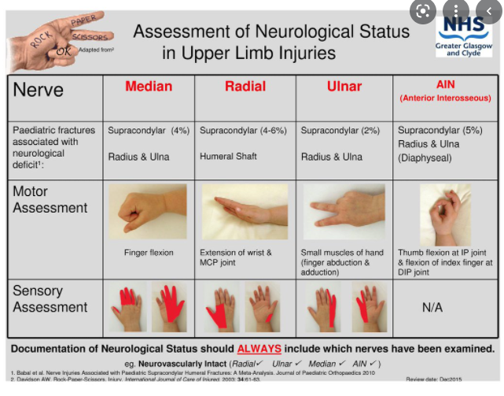

#### Nacken

***Traktionstest***

* För att avlasta foramina

### Fall

#### Fall 1 - skärskada handen

**Presentation**

1. 24åå man

2. 1. skurit i hand
   2. efter skada svårt böja      pekfinger DIP led

**Undersöka**

1. flexor digitorum profundus
2. flexor digitorum superficialis 
3. fingernerver med 2PD (2 point discrimination)     och 
4. kapillär återfyllnad

 

#### Fall 2 - metkrok i handen

**Pres**

1. 50åå pat

2. 1. metkrok i      fingret

 

**Handläggning**

1. **Anamnes**

2. 1. När hur      uppkom skadan
   2. andra lkm

3. **Status**

4. 1. Inspekterar      skadan
   2. rengör fingret

5. **Handläggning**

6. 1. väljer lämplig lokalanestesi o motiverar vrf: kanske ingen adrenalin, samt att      man har xylocain
   2. informerar om smärta innan      stick
   3. **Fingerbasanestesi** (digitalt block?)
   4. tar bort metkrok
   5. **Frågar om tetanusvaccin**

#### Fall 3 - handledssmärta domningar pekfinger, långfinger

***Presentation***

* 63åå kvinna

* 1. smärta radiell höger handled

  2. domningar pek och långfinger

  3. **Diffar**

  4. 1. karpaltunnelsyndrom
     2. Mb deQuervain
     3. CMC1 artros

## Höft

### Höftfraktur

#### Fall 1

***Presentation***

* Tidigare frisk 63-årig man vilken för en vecka sedan kommit gående på trottoar för att korsa gatan, initialt över cykelbana, kom då cyklist i mycket hög hastighet varvid patienten hoppade undan och tog ett felsteg mot trottoarkanten och föll på sidan. Fick ett stort hematom på utsidan av höften. Sökte på närakuten och man röntgade höften. Man fann ingen fraktur och patienten har därefter mest suttit i sängen och arbetat hemifrån. Söker nu då belastningssmärtan kvarstår oförändrad snarast något värre, även värk i vila efter att ha gått lite. Patienten är orolig över värk samt planerat att resa på en arbetsresa till Japan nästa vecka, undrar om detta är görligt. Patienten går mycket försiktigt och haltar avlastande. Distalstatus ua. Smärtar vid tryck över ljumske/höft, vid rörelse ffa vid inåtrot, något mindre vid utåtrot. Flexion/extension

***Utredning och handläggning***

* **Patkom**
  * öppna frågor
  * tankar, oro, önskan
  * sammanfattar
* **Anamens**
  * **Trauma anamnes**
    * lokalisation
    * debut
    * tid lkn besvär
    * typ av våld: fall i samma plan
    * ev vridvåld, fallriktning
  * **Smärtanamnes**
    * karaktär
    * utveckling över tid
    * utstrålning
    * förbättrar förvärrar
    * VAS
  * **Associerade symptom**
    * Andra symptom
    * smärta ngn annanstans
  * **Tidg nv sjd,**
  * **aktuell medicinerng**
  * **allergi**
  * **socialt**
    * ex ensamboende, trappor, hiss, yrke
  * **hereditet**
    * fraktur, osteoporos
  * **tobak alk**
  * **!! tidg gångfunktion o ADL**
* **Status**
  * **Höftstatus**
    * inspektion
    * tittar efter benlängsskillnad: förkortat, utåtroterat ben, dock sällan vid inkilad fraktur
    * hematom
    * palpation
    * motorik, ROM: 
      * flektion, 
      * rotation in ut, 
      * abduktion adduktion, 
    * palp 
      * ljumske 
      * trokanter maj
      * femur
  * **Status ljumske, höft, buk**
    * palperar crista
    * ala
    * symfys
    * utför kompressionstet
    * palperar buk, ljumske: tillämpligt
  * **Distalstatus**
    * pulsar samt känner på hudtermp jmfr vä hö
  * **Känsel o funktion**
    * känselpröv grovt
    * pat är gående
  * **patkom**
    * Involverar fortsatt plan o beslut
* **Bedömning o åtgärd**
  * Stud gör adekvat prel bedömning
    * förestår fraktur måste uteslutas
    * planerar rtg på VC idag
    * OK om remitterar direkt t AKM
    * !! besvara pat fråga om möjligt åka tjänstresa om slätrtg är ua
      * stug bör ge svar att MRT, annan rtg, i så fall behöver göras, pga status
  * Ta ställnig t behov av smärtlindring
    * paracetamol fulldos, eller morfin derivat
* **Klinsiskt resonamng**
  * falltrauma pat
  * tilltagande smärta
  * resonera kring akut allvar 
  * behöver ändå utesltua fraktur
  * ingen misstanke annan skada, sjd

### Fall 1

***Presentation***

* Tidigare väs frisk 62-årig kvinna vilken för 2 dagar sedan halkat på isfläck ute vid promenad. Halkade och föll bakåt åt vänster sida. Har fortsatt ont ffa vid belastning. Smärta känns mest i ljumsken. Patienten har lånat krycka och gått med. Ingen domning, ingen annan symptomatologi. Patienten varit på röntgen för några dagar sedan via vårdcentralen och fick då veta att det ej var något brutet. Söker då värken kvarstår och snarast ökat. VAS 4

***Utredning o handläggnign***

* Patkom
  * tankar, oro, önskan
  * sammanfattar
  * öppna frågor
* Anamnes
  * Traumaanamens
    * typ våld
    * fall samma plan
    * ev vridvåld, fallriktning
  * Smärtanamnes
    * karaktär
    * utv över tid
    * VAS
    * vad förbättrar försämrar
  * associerade symptom
    * !! smärta ngn annanstans
  * tidg sjd, aktuella lkm, allergier
  * ! tidg frakturer
  * socialt
    * ensamboende
    * trappor, hiss, yrke
  * Hereditet
    * fraktur
    * osteoporos
  * tobak alk
  * tidigare gångfunk ADL
* Status
  * Höftstatus
    * förkortat el utåtrot ben
    * dock sällan vid inkilad fraktur
    * inspektion
    * hematom?
    * palpationbenlängsskillnad
    * motoriskt test
      * flexion
      * rotation
      * in ut
      * abduktion adduktion
      * palpation 
        * ljumske
        * trokanter major
        * femur
  * Bäcken palpation
    * crista
    * ala
    * symfys
    * kompressionstest
  * Distalstatus
    * pulsar
    * hudtemp
    * jmf hö vä
  * Känsel o funktion
* Kliniskt resonemang
  * felställning?
  * behöver utesltua fraktur
  * ingen misstanke annan skada sjd
* patkom
  * inolverar beslut
  * förklarar diagnos, ger underlag att vara med beslut
  * efterhör fler frågor
* Bedömning o åtgärd
  * misstänker fraktur
  * planerar MR/DT
  * ok både emd inläggning alt hemgång med kryckor o avlastning av benet, åter nästa dag
  * erbjuder smärtlindring
    * paracetamol/citodon
    * eller morfinderivat är ok
    * utifrån vald handläggning motivation planering

## Knä

### Fall 1 - artros

***Presentation***

* 67åå man
  * söker pga knäbesvär
  * första besök pp VC
  * anamnes: 
    * intermittent ngn svullnad efter tyngre belastning
  * status
    * går med lätt hälta
    * bastus medialis atrofi
    * viss extensionsdefekt
    * viss flektionsdefekt
    * ömhet mediala ledspringa 
    * ömhet prepatellärt
    * kan ej sitta pp huk
  * Ge plan för fortsatt handläggning
    * ev rtg
    * LKM
    * Sjukgymnastik
    * egen träning mot bagrund av status fnynd
    * återbesök

***Etiologi och patofysiologi***

***Epidemiologi***

***Kliniska kännetecken***

***Utredning och handläggning***

* **Anamnes**
  * **Aktuella besvär**
    * Lokalisation
    * duration
    * kvalitet
    * tidg. episoder
    * Vad förbättrar, försämrar, intensitet (Skala 1-10)
  * **Neuropatiska symptom**
    * Utstrålning
    * karaktär
  * **Andra symptom**
    * Höft
    * fotled.. fot
  * **Utlösande moment**
    * trauma
    * annat
  * **Hereditet**
    * Reumatiskt assoc sjd
    * annat
  * **Socialt**
    * familj
    * yrke
    * hobbies
  * **Medicinering**
    * Typ, dosering, effekt, interaktion
* **Status**
  * **Ritning**
    * ber pat rita sj
    * frågar pat om ev komplettering
    * värderar ritning avseende ev neuropat
  * **Fysisk undersökning**
    * Knä, stående, gång
    * knäböj x flera
  * **Palpation av knä underben**
  * Testar isometriska kontraktionstest
  * prövar stabilitet
  * undersöker rörlighet, pat egen aktiva
  * höft undersökning
  * fot undersökning
  * calcaneus, pronation
  * nerv undersökning
    * grovkraft
    * sensibilitet
    * reflexer

***Behandling***

### Fall 2 - schlatter

***Presentation***

* 15åå flicka
  * smärta ffa hö knä
  * frisk i övrigt
  * aktiv ungdomselitserie, sen 14m pn
  * träningsmängden ökat det senaste året
  * sen 2v tagit d lugnare pga värken, vilken då förbättras ngt
  * pat önskar råd hur hon ska bete sig för att inte ska bli lika illa igen
  * orolig för att hon inte ska spela handboll
  * aldrig röntgat knän o ben
  * Målsättning
    * patientcentrerad konsult, fokus anamnes hos knäsmärta
    * riktat adekvat status
    * diff resonemang mot bakgrund av detta ge grund för o bibringa pat underlag för beslut om fortsatt handläggning

***Etiologi och patofysiologi***

***Epidemiologi***

***Kliniska kännetecken***

***Differentialdiagnostiskt resonemang***

* Utesluta allvarlig + akut åkomma
* förstå o värdera att bilaterala besvär föreligger, dock ffa hö sida

***Utredning och handläggning***

* **Anamnes**
  * smärta, lokal, duiration, kvalitet, tidg episoder
  * vad förbättrar, vad förvärrar intensitet (tex på skala 1-10)
  * **Övriga symptom**
    * Utstrålning
    * Karaktär
    * Lokala symptom (rodn svullnad osv)
    * Allmänna symptom
    * Andra symptom omkringliggande leder
      * Höft 
      * Fot
  * **Utlösande moment, trauma**
  * **Hereditet, reumatisk associerad sjd, annat**
  * **Socialt**
  * **Familj, skola, fritidsliv**
  * **Tobak, alkohol**
  * **Medicinering**
    * typ, dosering, effekt
* **Status**
  * **Föreslår besvärsritning och tolkar denne**
  * **Knässtatus**
    * Knä
    * stående konfiguration nedre extremiteten alignment
    * gång,
    * knäböj x flera
  * **Fys undersökning knä**
    * undersöker rörlighet, pat egen aktiva
    * testar isometriska kontraktionstest
    * prövar stabilitet
  * **Höfter us, fot us calcaneus eversion, stance**
  * **Neurologi**
  * **Grovkraft**
  * **Sensibilitet**

***Behandling***

Åtgärd

* Ge besked om åkommans etiologi o naturalförlopp
* Ej förskriva vila eller sjukskrivning fr skolgymnastik
* Modifera träning
* Remiss t sjg
* Ev rtg

### Fall 3

***Presentation***

* Tidigare väs frisk 60-årig kvinna vilken i samband med vandring för 3 år sedan erfor smärta och svullnad i vänster knä medialt. Besvären gick i regress. Söker nu då hon för ca en månad sedan fått ett felskär i samband med skridskoåkning, hamnat i pronationsläge med hö knä. I samband med detta smärta och lätt svullnad medialt, lånat krycka av dotter. Erfar kvarstående smärta medialt efter ca 500 m gång. Ingen svullnad nu. 

***Utredning och handläggning***

* **Patientkommunikation**
  * Startar med öppen fråga och bereder patienten talutrymme för sin berättelse
  * klargör vad pat sj tänker kring symptom o problem
  * klargör pats oro kring symptom o problem
  * utforskar vad pat vill få ut av besäket
  * bekräftar pat känslomässigt, verbalt icke verbalt
  * gör relevanta sammanfattningar
  * förvissar sig om att patientne fåt tdiskutera sina frågor o ger utrymme för pat att ställa ev kompletterande frågor
  * mot bakgrund av vad som framkommit i anamnesen o status, förklarar moiverar o involverar pat i fortsatt planering o beslutsfattande
  * delaktighet enl patientlagen
* **Status**
  * !! föreslår besvärsritning o tolkar denna
  * **fysisk undersökning**
    * **inspektion ben framifrån, bakifrån,**
      * ev atrofier
      * konfiguration: varus, valgus
      * stående, gående
      * knäböj x flera
      * postural kontroll
    * **inspektion underben, knä**
      * **palpation knä, underben**
        * kompressionsömhjet
        * instabilitet
        * patellae
        * palpationsömhet över mediala ledspringan
      * **undersöker rörlighet**
        * pat egen aktiva
        * fynd lätt extensionsdefekt
        * testar isometriska kontraktionstest
        * pröver stabilitet
          * sidovackling
          * draglåda, lachman
        * menisktest
    * **Distalstatus, nerv, nedre extremitet**
      * peridera pulsar
      * grovkraft
      * sensibilitet
    * **höfter**: 
      * översiktligt status, palpation, ROM axial kompressionsömhet
    * **fot**: 
      * inspektion led, ROM
  * **Preliminär diagnos o bedömning**
    * **gör rimlig prel bed**
      * !! aktuellt: status post lindrig skada mediala kollaterala ligament
      * DD: 
        * sannolikt även artros (fleråriga besvär)
        * ev skelettskada, skelettaffektion?
        * ev systemsjukdom
    * **Föreslår adekvata åtgärder**
      * vårdnivå: 
        * PV, 
        * konservativ behandling, 
        * sjukgymnastik
          * eccentrisk träning
      * Ev smärtlindring ex alvedon, NSAID
      * ha knäet lindat, ev ortos
        * för att motverka svullnad vid ansträngning
    * **Ger rimlig plan för uppföljning**
      * sjukgymnstik
      * uppfölj efter rtg tele
      * därefter ev ytterligare åtgärd om tex artros. 

## Ledvärk

### Borreliaartrit

#### Fall 1

***Presentation***

* 64-årig kvinna/man söker på VC pga 3-4 veckors anamnes med sjukdoms- /feberkänsla och senaste dagarna tillkomst av artralgi i knä- och armbågsregion. I  riktad anamnes framkommer tidigare fästingbett. Status underben; exantem ca 10 cm i diameter med central rodnad, utanför detta blekare rött med rodnad yttre randzon.

***Utredning och handläggning***

* **Patkom**
  * öppna frågor
  * tankar oro önskan
  * sammanfattningar
* **Anamnes**
  * **Huvudsymptom**	
    * ont i leder o trötthet feberkäönsla
      * ont i leder: duration. förlopp över tid
      * trötthet, feberkäönsla: duration, förlopp över tid
      * utlösande faktorer: förbättrar försämrar
  * **associerade symptom**
    * svullnad
    * rodnad,
    * värmeökning
    * morgonstelhet
    * magtarmsymptom
    * infektionssymptom
  * **Associerade symptom Hud**
    * fästingbett
    * hudutslag
  * **Associerade symptom: Huvudvärk**
  * **Allmänna symptom**
    * viktnedgång
    * feber
  * **Tidg nuv sjd**
  * **hereditet**
  * **social inklt**
    * yrke
    * fys akt
  * **tobak, alk**
  * **medicinering**: 
    * typ, dos, compliance, naturlkm
* **Status**
  * **Ledstatus**:
    * knä/armbåge 
    * screenar övriga leder
    * !! inspekterar, palperar, undersöker ROM
  * **Hudstatus**
    * inspekterar hudkostym
  * **Palperar lymfkörtlar**
  * **Hjärta, lungor**
  * **Thyroidea**
* **Patkom**
  * samtycke, delaktighet
* **Bedömning, åtgärd**
  * studenten msstänker borrelia men annan etiologi kan ej säkert uteslutas
  * **Adekvata åtgärder**
    * **Provtagning**
      * CRP, 
      * SR
      * TSH, fritt T4
      * blodstatus
    * **Behandling**
      * Doser krävs ej
      * vid tolkning som borrelia artrit o tar serologi
        * PcV 1gx3 i 10d
      * behandling med doxyferm är detta ok
    * **Rimlig plan o uppföljning**
      * efterhör arbetsförmåga
      * teleuppföljning prover
      * uppmar pat att höra av sig, söka vid försämring
  * **Kliniskt resonemang**
    * hos pat med sjd känsla, ledvärk, hudutslag resonerar borrelia
    * DD hypothyreos, annan infektion / ledinflammation

## Operation

### Trombosprofylax

***Behandlingar***

* Låg-molek heparin, fragmin: dessa används ofta för att minska trombosbenägenheten hos patienter, och effektivt mer in-aktivera (aktivt) trombin. 

***Patofysiologiskt***

* Speciellt ortopediska operationer (i synnerhet i nedre extremiteter) finns det en ökad risk för att få tromboser
* ***Rent fysiologiskt***
  * Formation of DVT is, to a large extent, a consequence of bone damage during surgery. 
  * ***Procoagulant*** cellular debris is drained with venous blood and triggers thrombin generation upon passage through the lung vessels [5–7]. 
  * Infusing small doses of heparin, before the bone traumatization during surgery, reduced thrombin activity markedly but with almost no effect on thrombin generation [8].
  * Källa: "Current controversies in deep vein thrombosis prophylaxis after orthopaedic surgery"
* 

