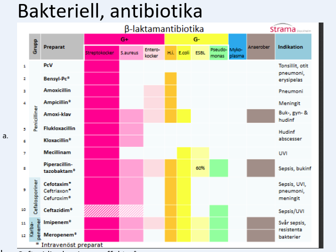
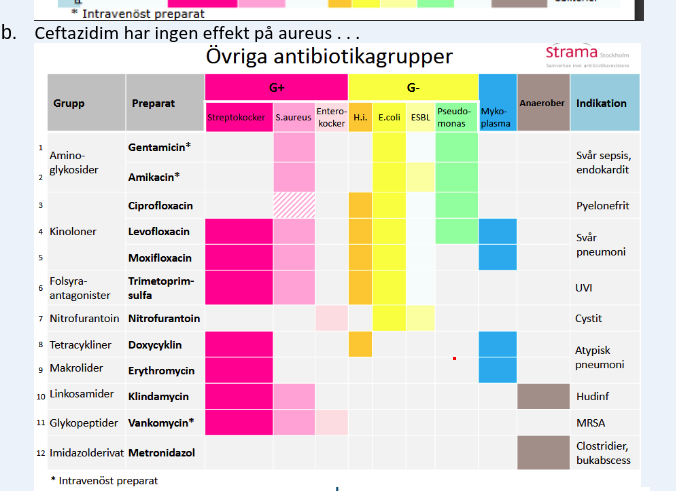
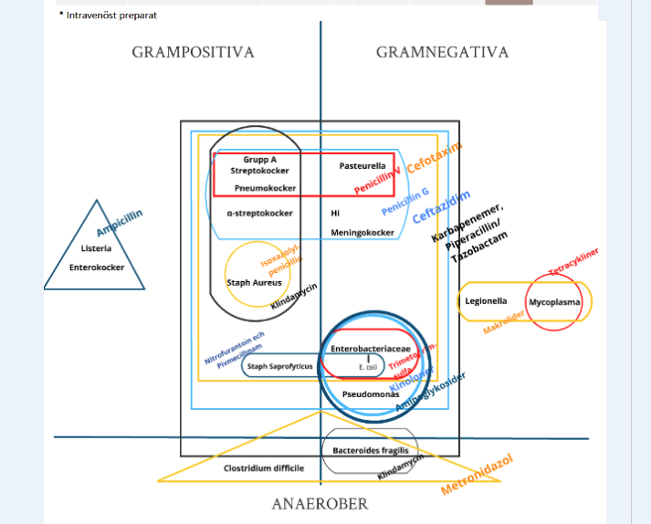
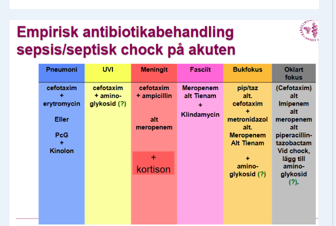

## Antibiotika

### Schematiskt

|  |  |
| ------------------------------------------------------------ | ------------------------------------------------------------ |
|  |  |

### Pneumoni

***Standard***
* PcG i.e. bensylpc 
* El kåvepenin PcV 
* **Pc allergi eller atypisk**
    * Tetracyklin (Doxycyklin) 
    * Makrolid (erytromycin) 

***Sjukhusvård, lätt***
* PcG i.e. bensylpc 
* **Atypisk**
    * PcG + Makrolid 
    * PcG + Tetracyklin 
* **Pc allergi**
    * Levoflox 
    * Moxiflox 

***Sjukhusvård svår***
* Cefotaxim + makrolid (erytromycin) 
* PcG            + kinolon (levo eller moxi) 
* (+ aminoglykosid vid septisk chock) 
* **Pc allergi**
    * Klindamycin + kinolon (levo el moxi) 
* **De patogener som måste täckas**
    * Pneumokocker 
    * Legionella 
* **Vid allvarlig bakomliggande lungsjukdom, med pneumoni**
    * Piptaz + makrolid  
    * Piptaz + kinolon 

### Afebril UVI

***Okomplicerad***

* Nitrofurantoin
* Pivmecillinam
* Trimsulfa: inte förstahandsbehandlingen

### Febril UVI

***Män***

* Ciprofloxacin 
* Trimsulfa 
* Cefotaxim 
* Piptaz 
* Gentamycin 
* Pc allergi 
* Ciproflox iv 
* Gentamycin iv 

***Kvinnor***
* Ciproflox 
* Trimsulfa 
* Ceftibuten 
* Cefexim 

***Determinderad agens***

* Enterokocker 
* Ampicillin 
* Piptaz 

***Gravida***

* Penicillinerna fungerar,  
* cefalosporiner fungerar 

***Pc-allergi***
* Man verkar kunna ge ciprofloxacin, men det är få studier i området 
* Rekommenderas inte direkt 
* Aminoglykosider, i form av gentamycin som är ototoxiskt 