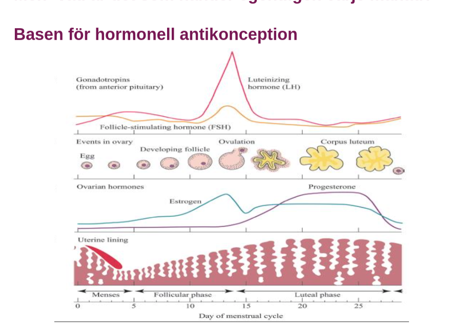

## Akut buk

### PID

***Etiologi och patofysiologi***

* Enl gyn boken, s296: 
  * äggledarinflammation med inslag cervicit och endometreit
* **Uppåtstigande disease**
* **Innefattar olika grad av** 
  * endometrit
  * P-piller om recidiverande cystor
  * salpingit
  * ooforit
  * TOA: tuboovarialabscess
  * peritonit
  * perihepatit: 
* **STD**: sexually transmittable diseases
  * **klamydia**
  * **gonorre**
  * **mykoplasma urogenitale**
  * **oftast salpingit**
* **vaginal anaerob blandflora**
* **tarmflora med bla E.coli**
* **abscesser**: ofta polymikrob flora, endast 30% STD
* **actinomyces och TBC kan**: ovanligt
  * kan bli utsått över hela peritoneum
  * diff diagnos: peritoneal-carcinos

***Kliniska kännetecekn***

* varierar: 
  * **fr subklinisk infek till**
  * **!!! AT påverkan + spesis**
* **nedre buksmärtor, ofta bilat**
* **vaginal flytning**
* **olaga vaginal blödning**
* **feber**
* **påverkan på mikton + avföring**

***Utredning och handläggning***

* **Odla**!
* **UL**: ofta oregelbunden resistens med varierande ekogenicitet. vid aspiration, dränage
* **DT**: bra för säkrare kartläggning samt att följa behandling. skilja fr divertikulit o appendicit
* **Laparoskopi vid oklar diagnos**: eventuellt

cerivicit 

***DIfferentialdiagnoser + riskfaktorer***

* **Riskfaktorer**
  * Sexualbeteende
  * låg ålder
  * IUD (intrauterindevice) spiral; första 3v om kopparspiral suttit för länge
  * iatrogent vid operationer uterus och adnexa: obs bakteriell vaginos
* **DIfferentialdiagnoser**
  * appendicit
  * divertikulit med/utan abscess

***Behandling***

* Antibiotika po/iv beroende på infektiosutbredning
* kirurgi vid abscess: akut eller lugnt skede; fertilitetsbevarande=?
* dränage av abscess

***Komplikationer / konsekvenser på sikt***

* Infertilitet; tubarskador
* risk för extrautering graviditet
* adherenser med smärta

### TOA - Tuboovarial abscess

***Etiologi och patofysiologi***

* **icke-utläkt PID**
  * vanligaste orsak
  * finns kvar som en kronisk PID
* **äggledare**: blir vätskefulld o avstängd (säcktuba), (i samband med icke-utläkt PID?)

## Anatomi

### Allmänt

### Livmodern uterus

***Uppdelningar***

* **cervix uteri:** detta är den distala delen av uterus
* **corpus uteri:** huvuddelen av uterus, kroppen på uterus
* **isthmus uteri:** del som separar corpus uteri fr cervix uteri

#### Corpus uteri

***Histologi***

* **glatt muskulatur, myometrium:** huvudsakligen glatt muskulatur i corpus uteri. 
* **ECM**: 40-50%

***Histologiska delar***

* **Endometrium**
* **Myometrium** 
* **Perimetrium**

#### Cervix uteri

***Histologi***

* **glatt muskulatur:** 4-10% 
* **ECM**: högt bindvävsinnehåll,

***Förlopp***

* **Första delen av graviditet**: fast + sluten; hålla foster, hinnsäck med fostervatten + placenta på plats
* **Senare del graviditet**: tilltagande uppmjukning av av cervix och när flossningen startat  -> vidgas o i slutet av förlossning kmr vagina cervix nedre uterinsegment o corpus bilda en gemensam förlossningskanal, som fostret passerar

#### Isthmus

***Histologi***

* **består ffa av ECM**
* **glatt musk**: sparsamt
* **ökar i längd** fr 0.5-10cm
* **passivt segment** mellan cervix och corpus uteri

## Cancer

### Cervixcancer

***Epidemiologi***

* Sjunker över år 
* 550f p år
* 100 i sthlm p år
* näst vanligaste cancerformen globalt
* 18e vanligaste cancerformen i Sverige
* upptäcks vid screening 50%

***Riskfaktorer***

* HPV
* Rökning
* STD
* p-piller

***Kliniska kännetecken***

* symptomlöst ofta
* värk
* bensvullnad

***Utredning och handläggning***

* screening
* Koloskopi
* biopsi, histologi
* UIN. undersökning i narkos
* MR, DT, PET
* stadieindelning: kliniskt

***Behandling***

* **Alla stadier över 1b1 = tumör större än 4 cm**
  * strålning + kemoterapi (cytostatika)
* **mikroinvasiva tumörer: dvs ej synlig PAD**
  * mindre kirurgi: konisering eller enkel hysterektomi
* **synliga tumörer samt stora mikroinvasiva**
  * inegen skillnad överlevnad mellan strplning och kirurgi
  * men skillnad morbiditet
* **Strålbehandling**
  * lalla tumörer, över 1b1
  * kombination: extern + lokal (brachybehandling)
  * om lymfkörtelmetastaser: adjuvant behandling efter kirurgi
* **Cytostatika**
  * tillsammans med strål
  * öka känsligheten för strålbeh
  * kan krympa tumörer, troligen ej bota: endast kemoterapi cytostatika
* **Kirurgi**
  * nervsparande
  * wertheim
  * fertilitetsbevarande: trackelektomi, förutsatt tumör under 2cm
  * recidivkirurgi

***Biverkningar***

* **Morbiditet vid strålning**
  * strålproktit
  * blåspåverkan: trängningar
  * vaginal striktur, atrofi
  * frozen pelvis
* **Morbiditet vid kirurgi**
  * nervpåverkan, jfr prostatektomi
  * förkortning vagina
  * lymfödem
* **Primärbehandling**: ung patientgrupp, botbar sjd, risk skador centrala bäckennerver, problem t lymfadenektomi, risk strålinducerade skadpr blåsa, tarm genitalia
* **Bergmark**: kort vagina, otillräcklig lubrikation, dyspareuni

***Prognos***

* ***5års-överlevnad***
* **enl stadier**
  * 1A: 100%
  * 1b: 90%
  * 2a: 80%
  * 2b: 60%
  * 3: 30%
  * 4: 10%

### Cowdens syndrom

***Allmänt***

***Etiologi och patofysiologi***

* autosomalt dominant
* PTEN mutation

***Epidemiologi***

* Känneteckans av 28% livstidsrisk för EC
* Ökad risk bröstcancer och thyroideacancer
* incidens 1:250k

***Utredning och handläggning***

* diagnosen baseras på NCCN: national comprehensive network clinical criteria
* UL och eller EB och eller hysteroskopi

### Endometriecancer

***Etiologi och patofysiologi***

* **Endometriet**: del av uteris (tänk ej ovarierna)
* **Östradiol** (estradiol; E2): predominanta **intracellulära** östrogenet i endometriet
  * ***Stimulerar mitos endometriala celler***
* **Progetiner reducerar mitos**:
  * **reducerar östrogenreceptorer**
  * **ökar metabolism E2 t mindre aktiv E1**
  * **stimmar differentiering endometrieceller till sekretorisk**
* **Malignt också yngre kvinnor**: notera att EC kan förekomma hos yngre kvinnor också, en risk som måste beaktas.

***Typer***

* **Typ1: endometrioid carcinom, vanligaste**
  * **östrogenberoende carcinogenes:** progression komplex atypisk hyperplasi t EC
  * **hos pre- eller perimenopaus**
  * **histologiska tecken:** 
    * **grad1:** under 5% solid non gladular tillväxt
    * **grad2:** 6-50% non non galdular growth
    * **grad3:** över 50% solid growth
* **Typ2: serös carcinom**
  * 10% av EC
  * äldre kvinnor jfr typ1
  * historia med bröstcancer
  * behandling med tamoxifen: att pat har tidg beh med tamoxifne?
  * aggressiv neoplasm
  * peritoneal dissemination likt ovarial serös carcinom
* **klassifikation malign mesenkymal tumör av uterus livmoder**
  * leiomyosarkom: spindled, epitelodid, myxoid
  * perivaskulär epitiloid tumör PEComa
  * låggradig endometriell stromal sarkom
  * odiffad endometriell sarkom
  * låggradig myullerian adenosarkom,
  * malign mixad myullerian tumör 
  * andra
* **Familjär EC**
  * Ackummulation fall funnet i familj
  * kallas för familjär EC
  * 5% av EC

***Epidemiologi***

* 4e vanligaste tumör kvinnor, 6% av alla cancrar internationellt hos kvinnor. 
* 1400 fall i Sverige varje år
* livstidsrisk: 2%
* mortalitet: 7-10:100k

***Kliniska kännetecken***

* **onormal vaginal blödning** presenterar hos 90% av alla EC
* **postmenopausal blödning**: notera postmenopausal, detta är ALLTID abnormalt
  * progressivt högre risk för EC om man är äldre och får en postmenopausal blödnnig

***Utredning och handläggning***

* **Gynekologisk Status**
  * blödningskälla
  * cervikal stenos
  * uterin storlek, pelvisk massa
* **pap smear**
  * cytologisk abnormalitet av cervix, vagina
  * occasional information av upper tract disease
* **endometriell biopsi**: endometriell lining
* **hysteroskopi**: endometriell lining
* **Diagnostiska tester**
  * **transvaginal ultraljud**: endometriell stripe, uterusstorlek, adnexstorlek, förekomst cystor, massa
  * **sonohysterogram**: endometriell stripe, förekomst submukös fibroider, polyper, endometriella kavitetsmassa
  * **pelvis-MR**: myometriell abnornalitet, endometriell kavitet, adnexala strukturer, invasion in i parametria, vagina, blåsa, pelvic nodal disease
  * **abdominopelvic-DT**: ascites, pelvis och para-aortal adenoatpier, intraparenkymala organabnormaliteter, peritoneala och omental sjukdom
* ***Endometrietjocklek***: dubbellager mätning
  * postmenopaus kvinnor gränsvärde <= 5mm
  * normal endometrie tjocklek ***utesluter inte EC***
* **Alla postmenopaus blödning måste histologisk undersökning**
* Doppler ultraljud, hysteroskopi endometrial polyp

***Staging***

* **Stad1**: confined t corpus
  * limited t endometriet
  * under en halva myometrie invasion
  * över en halva myometriell invasion
* **stad2**: cervix involvering
  * endocervikala kärtlar
  * strmal invasion
* **stad3**. extrauterin extension men limited t riktig pelvis
  * serosal eller adnexala extension eller positiv peritoneal cytologi
  * vaginal metastas
  * pelvis eller parao-aortala nod involvering
* **stad4**: extension beyond riktig pelvis in i närliggande rgan
  * blåsa eller tarm
  * fjärrmetastaser

***Prognostiska faktorer***

* pad staide, histo grad, histo typ, myometrie invasion, lymovaskulär invasion, lymfkörtel mets, ålder
* **conflicting-possible prognostic factor**: serosal involvering, cervikal involvering,. 
* **myometrieinvasion**: confied t endometriet är prognos god om yttre tredjedel myometrie är det dåligt
* **ålder**
* **DNA-polidy**: DNA analys + cytomertri mäter kopior DNA i tumören. 
  * **diploid mindre aggresiv**
  * **DNA plodiitet självständig prognostisk faktor**

***Riskfaktorer***

* **allt som ökar biotillgänglighet östrogen ökar risken endometriecancer**
  * **obesitas**: BMI starkt associerad ökad risk endometriecancer
    * dubblas fr 23 BMI till 30 BMI 
    * hos premenopaus, är BMI proportionel med ***längre anovulatoriska cykler*** (med anovulation att endometriet växer sig fetare?)
    * **postmenopaus**: BMI proportionell med ökad E2 och sänkt SHBG
  * **nullipara**
  * **sen menopaus**
  * **diabetes mellitus**
  * **hypertension**
  * **kronisk unopposed östrogen stimulering**
  * **kronisk tamoxifen användning**
* **östrogenbehandling**
  * ordinär dos östrognebehandling (ET, estrogen treatment) = resulterar i endometriell cellproliferation
  * östrogenbehandling längd proportionell EC risk
  * **risk fr östrogenbehandling rel med BMI osså**: högre BMI lägre riskeffekt av östrogenbehandling vg EC.
* **HRT - hormone replacement therapy**
  * också relaterat med riskökning om den ges intermittent
  * kontuinuerlig kombinerad EPT har inen ökad risk för EC.
* **Tamoxifen**: ökar risken för endometrie cancer 2-3ggr

***RIskgrupper***

* Högriskgrupp
  * icke-endometroid typ
  * figo-grad3
  * djup myometrieinvasion/cervikal stroaminvasion enl USG eller MR
  * klinisk misstanke om cervikal stromainvasion
* lågrisk
  * ingen ovanstående prognostisk faktor föreligger

***Skyddande faktorer***

* **graviditeter:** 35% reducert 1a para, 15% efter 2a para;
* grav äldre ålder mer protektivt: EC reduceras med 51% kvinnror med last birt runt 35åå
* **oral antikonception**: 7% reduktion för varje år som man använder

***Behandling***

* **Kirurgi**
  * **Stadie1**
    * laparotomi
    * peritoneal tvätt
    * TAH, BSO
    * Selekterad paraoartala o pelvis lyumf nod sampling
    * i typ2 och klarcells carcinom: omentum resektion
* **Lymfkörtelutrymning:** ingen evidens för overall eller recidiv fri överlevnad för pelvis lymfadenektomi med tidig EC
  * pelvis lymfadenektomi kan inte rekomemndera som rutin procedut för terapeutisk purpose utanför klinisk trial

**Riskreducerande operation**

* Hysterektomi och SOE
* Risken för cancer minskar: liten kvarstående risk att utveckla peritoneal carcinos

* SOE leder t besvärliga biverkningar
  * klimakteriebesvär
  * slemhinnetorrhet
  * dyspareuni
  * osteoporos
* HRT

### Endometriecancer och cancerhistorik

***Allmänt***

* In Swedish population:
  * 13 % women with EC had at least one relative with the same disease. 
  * Relative proportion of endometrial  cancer in famutatiiioner milies from patients with EC was increased compared to general cancer population: 5.5% vs3.05 %
  * 47% of  patients had relatives who were diagnosed with EC cancer before the age of 50 years
* A history of colorectal or ovarian cancer in first-degree relatives has also been associated with an increased risk of endometrial cancer

***Bröstcancer***

* personlig bröstcancer ökar risken för EC, oavsett familjehistoria
* bröstcancer associerat serös carcinom yngre kvinnor
* 5% kvinnor serös carcinom hade mutationer i börst ancer gener,
* men endast 2 av 7 hade brsötcance i familjen

***Multipla maligniteter***

* högrisk synkrom eller metakronös ovarial och endometriecancer, speciellt endometrie carcinoid
* swedish cohort: 16% index patienter diagnosticerades med minst en cancer
* 45% av dessa patienter hade uterincancer och bröstcancer

### Leiomyosarkom - EC

***Epidemiologi***

* 1% av alla uterina maligniter, 40% av alla uteruina sarkom
* invidens 0.67:100k
* incidens leiomyosarkom originate fr leuomyom

***Kliniska kännetecken***

* abnormal blödning
* pelvis smärta
* inga radiologiska procedurer som är diagnostiska för sarkom preoperativt
* UL, DT, MR är unreliable för att diffa sarkom fr leiomyom

***Behandling***

* total abdominell hysterektomi
* BSO
* pelvis strålning: reducerar lokal pelvis recidiv, men inte prolongerad överlevnad
* kemoterapi: response är låg
* 5års överlevnad 30% 

### Lynchsyndrom

***Allmänt***

***Etiologi och patofysiologi***

***Epidemiologi***

* Endometriecancer
  * Prevalens Lynch syndrom: beräknas 1:440
  * 13 nya diagnositeras årligen LS i Stockholm
  * prognos kvinnor med livmodercancer: över 80% överlevnad efter 10år, 20% dör fr sin EC
  * prognos EC + LS kan god med 81% 10års-överlev
  * livstidsrisk för EC: 50%
  * 2% av alla EC tillhör LS
  * medelålder diangos 48år: 
    * MLH1/MSH2 = 50år
    * MSH6 = 60år
  * 50% av EC diagnos före 50åå
* Ovarial cancer
  * livstidrisk för OC: 10%, normal p:1.4%
  * 2-4% av alla OCs tillhör LS
  * ofta symptomatisk
  * medelålder 50åå
  * samma histo som sporadisk OC
  * samma prognos som sporadisk OC för varje klinisk stadie

***Utredning och handläggning***

* **Amsterdam II kriterier för att detektera LS**
  * Three or more family members, one of whom is a first-degree relativeof the other two, with HNPCC-related cancers (colorectal, endometrial, stomach, ovarian, pancreas, ureter and renal pelvis, biliary tract, and brain (usually glioblastoma)
  * Two successive affected generations
  * One or more of the HNPCC-related cancers diagnosed before age 50 years
  * Exclusion of familial adenomatous polyposis(FAP) 
* **Gynekologisk screening hos LS-patienter**
  * **screening börjar mellan 30-35åå**; för att tidigaste cancrar hittas då
  * kontroller inkludera endometriell biopsi för EC screening, specillt i premenopausal patients
  * for OC screening: ultraljud + CA-125 kombinerad med patientinformation

### HNPCC, LS

***Allmänt***

* hereditary non-polyposis colon cancer
* Lynch syndrom

***Etiologi och patofysiologi***

* Autosomalt dominant
* Gener: MLH1, MSH2, MSH6, PMS2

***Epidemiologi***

* 1-2% av lla kolonmcacer o EC fall i Sverige o för ca 9% av alla EC som yppkommer före 50åå
* kvinnor med LS har 40-60% risk för EC, livstid
* 50% EC före koloncancer
* medianålder insjuk EC vid LS är 46-62åå
* ökad risk för: ventrikel, ovarial, tunntarn, uretercancer
* HögstariskenförovarialcancerharMLH1/MSH2-bärare 

## Kirurgi

#### Fertilitetsbevarande kirurgi

***Trachelectomi - cervix***

* Cervixcancer behandling
* bevarar fertiltiet
* endast cervix med parametrier avlägsnas
* förutsättning: tumör under 2cm
* permanent cerklage
* sectio
* graviditetsutfall: grav rate 70-80*%, missfall 10-20%

#### Lymfkörtelmetastaser

* Enskilt viktigate prognostiska faktorn efter kirurgi (cervix?)

#### Nervsparande kirurgi - cervix

***Viktiga nerver***

* plexus hypogastricus sup
* plexus hypogastricus inf
* N splanchicus
* N genitofemoralis
* N obturatorius

#### Recidivkirurgi

***Allmänt***

* recidiv som inte tidg strålats bär 1a föremål ***radiokemoterapi***
* kirurgi aktuellt vid: tidg strålade kvinnor 
  * bäckenutrymning = exentration

***Utredning och handläggning***

* radiologisk utredning krävs

***Prognos***

* beror på utbredning; utvalda fall ca 40-60%

***relativa kontraindikationer***

* engagemang av bäckenvägg
* körtelmetastaser

#### Wertheim meighs op

***Innefattar***

* radikal hysterektmomi
* resektion parametrierna
* resektion övre vagina
* lymfkörtelutrymning i bäckenet

## Fertilitet

### Abort

***Etiologi och patofysiologi***

* **Ovulation efter abort**: pat akan ovulera så snart som 8-10 d fr abort;
* **Vikten av preventivmedel**: detta belyser att man bör börja med preventivmedel utan dröjsmål
  * detta oavsett metod. 
* **Progesteronhämmare**: progesteron normalt sett relaxerar uterus 
  * Med progesteronhämmare kommer uterus att kontrahera
  * cervix kommer att relaxera också
  * fostret kommer att stötats bort
* **Prostaglandinerna**: kontraktionerna ökar i uterus. 

### Gestagena metoder

#### Gestagen

***Etiologi och patofysiologi***

* **Gestagen** = progesteron (s847 i blueprints boken)
* **Två faktorer bidrar till hälsoeffekter o biverkningar**
  * **förmåga öka SHBG** (sex hormone binding globulin) som **binder upp** androgener
  * **gestageeffekter på androgenreceptorer**
    * om stimmar androgenreceptorn
    * om blockar androgenreceptorn

***Balans och effekter***

* **ökad gestagen** 
  * **androgent**
    * akne
    * hirsutism
    * dålig lipidbalans
  * **mineral-kortikoid**
    * svullnad
    * natriumretention
    * högre blodtryck
* **minskad gestagen**
  * **anti-androgen**
    * minskad akne
    * minskad hirsutism
    * bättre lipidlbalans
    * sämre sexlust
  * **anti-mineralkortikoid**
    * natriumförlist
    * vätskeförlsut
    * kaliumretention
    * sänkt blodtryck

***Huvudsakliga effekter***

* De eftertraktade effekterna av gestagen
* **Förtjockning av cervikal mucus**
* **inhibiterande sperm motilitet**
* **Förtunnar endometrial lining**: så att den ej kan implanteras

#### Systemiska lågdoserad gestagen

***Etiologi och patofysiologi***

* **Gestagenets effekter**
  * **cervixsekret**
  * **endometriepåverkan**: endometrial atrofi, att man får mindre endometrie, noterar att denna effekt inte är för alla utan för subset
  * **ovulationspåverkan**: satt i parentes, TODO
    * också subset effekt. , 50% av cyklerna

***Epidemiologi***

* **p-piller**: mindre o mindre del av marknaden
* **Effektivitet**: *inte lika effektiva som kombinationspreparat*
* **Failure rate**: 8%, som ökar om man doserar fel.

***Biverkningar***

* oregelbundna ovulationscykler
* "breakthru bleedings"
* ökad formation follikulära cystor
* acne
* bröstömhet, bröstirritation

***Indikationer och fördelar***

* ***Innehåller ej östrogen***: 
  * passar drf för **ammande mammor**
  * kvinnor där östrogen e kontraindicerat
  * inkl kvinnor över 35åå som röker
  * kvninnor hypertension, CAPD, kollagen vaskulär disorder, lupus, migrän med aura, historik VTE, 
* **Andra användningsområdne**: abnormala uterina blödningar hos högrisk populationer där blödningarna har evaluerats adekvat (i.e. anovulerane blöndingar och bening endometrial hyperplasi hos dåliga kirurgi kandidater)

***Behandling***

* **P-piller**: "progestin only pills" (aka POPs);
  * **Effekten minskar efter viss tid**: effekten av försegad cervixmukus minskar efter 22h, därför är det viktigt att man tar pillen samma tid varje dag. 
  * **samma tid varje dag!**: exakt samma tid varje dag, endast 3-timmars glömskemarginal
  * **gestagennivåerna kan sjunka för lågt**

#### mellandoserade gestagena metoder

***Etiologi och patofysiologi***

* **ovulationshämmande**: 

***Epidemiologi***

* God säkerhet vid compliance
* hög nöjdhet

***Behaandling***

* **kortverkande: p-piller**
  * varje dag, 12h glömskemarginal
* **långverkande: implantat**
  * **sverige för 3 år: naxplanon**, armen lokalbedövning
  * **världen även 5år: jadelle**, 2 stavar i armen lokalbedövning

#### Högdoserade gestagena metoder

***Etiologi och patofysiologi***

* **ovulation kan ta ett tag komma tillbaka**

***Biverkningar***

* **bentäthet**: påverkar bentäthet
  * suppression östrogen + östrogenreceptorer

***Kontraindikation***

* **ej t kvinnor under 23år**: innan "peak bone mass"; obs relativ kontraindik

***Behandling***

* **P-spruta**: depo-provera
  * var 3e månad
  * intramusk, im
* **subkut inj finns**: mest USA, Afrika, mm

### Hormonspiral

***Hormonspiral*** (diffa mot kopparspiral)

* **Levonorgestrel**: utsöndras lkalt i endometriet; endometiret blir ***tunt***
* **Mirena**: 
  * 25-40% av kvinnor blir amenorroiska (dosberoende) med jaydess ca 10% i studier, 
  * kyleena 17%

***Etiologi och patofysiologi***

* **levonorgestrel effekter**
* **Cervixsekret**: segt, ogenomträngligt
* **hämmar spermiemotilitet**: levonorgestrel hämmar spermiemotiliteten
* **minskad blödningsmänd**: med upp t 90%
* **EJ ovulationshämmande som regel**

***Epidemiologi***

* **lika säker som sterilisering!**
* **högst andel nöjda användare av alla preventivmedel**
* Bra för kvinnor med hög risk för grav
* ÖKar INTE risk för ektopsik grav: av de som blir gravida är andelen ektopiska grav högre jmf med om inget preventivmedel
* ***Infek vid spiral***: ovanligt, liten ökad risk upp t 3v efter insättning
  * tskf Davon shield fr 60-talet

***Handläggning***

* ***Vid evt graviditet***: OMGÅENDE dra hormonspiralen
  * ***Utesluta ektopisk graviditet***

### Hormoner

#### Östradiol

***Etiologi och patofysiologi***

* **SHBG**: plasma E2 bundet med SHBG, 
* **SHBG-bunden E2 ej biotillgänglig**
* ! **Högre BMI -> mindre SHBG**
  * **E2 ökar biotillgänglighet med ökande BMI**

### Hormonernas roll i p-piller

***Allmänt***

* Två alternativ förekommer: progesteron (gestagen) only metod eller kombinerade med östrogen + progesteron (gestagen)

***Gestagen***

* **Mekanism**
  * Hämmar LH-frisättning: är ett **antiandrogen!**
  * förtjockar cervixsekret
  * // verkar som att det finns androgena gestagener osså...
* **Resultat**
  * ***hämmar ovulation***: det är gestagenet som gör att man inte ägglossar
  * hindrar spermier fr att *penetrera cervix*: i.e. de kommer ej förbi portio

***Östrogen***

* **Mekanism**
  * ökar konc av progesteronreceptorer
  * hämmar FSH-frisättning
  * ***SHBG resultat***: att den kan öka SHBG koncentrationen, sex hormone binding globulin
* **Resultat**
  * bidrar t bättre blödningskontroll
  * hämmar utv av dominant follikel

***Balansen antiandrogen + androgen***

* Kombinerade preparat har olika effekter
* **Diane**: som innehåller mest östrogen 35mikrogram/d och CPA (cypretone acetat, som har stark antiandrogen effekt)
  * detta preparat är i Sverige enbart ett acne preparat
  * den är också antikonception i andra länder i världen
* **Dienorette**: lite mindre östrogen och stark ***antiandrogent gestagen***; antikonception i Sverige utöver acne preparat
* **Levesia**: mindre östrogen, och ett ***androgent gestagen***
  * ger mindre acne än placebo
  * men det är fortfarande de antiandrogena man använder mer? .. .

***Biverkningar***

* Östrogena biverkningar
  * Vätskeretention: ökad vikt, svullnadskänsla 
    * studier har visat att man inte går upp i vikt av preventivmedel
  * illamående
  * pigmentering: chloasma, melasma
  * flytning
* Gestagen biverkan (ofta androgen (som ger dessa?))
  * ökad aptit o viktuppgång 
  * amenorre, oligomenorre
  * akne: cochrane review bekräftar att alla kom metoder *lindrar akne*
  * torrhet: ögon, mun, vagina, antiöstrogen effekt
  * trötthet, depression: se upp med PMS-pat
  * minskad sexlust: vanligt klagomål

***Sexlust***

* I studier sjunker jfr med placebo vid användning av dessa. 
* orgasm lika
* lika tillfredställande samlag
* Slutsats: This study shows no negative impact of a levonorgestrel-containing oral contraceptive on overall sexual function, although three of seven sexual function domains were adversely affected.

***Halveringstiden och uppehåll*** 

* **Äggblåsan blir större med tid**: ju mer tid man ger ägget att växa deto större äggblåsa blir det
* **antikonceptionen hindrar att blåsan växer**: äggblåsan hindras växa mha antikonceptiva hormonerna (gestagenet?)
* **uppehåll låter blåsan växa**: en studie som jämförde antalet dagar uppehåll med p-piller och storleken på äggblåsan
* **uppehåll max 4 dagar**: slutsats fr studien var att man ej ska gå över 4 dagars uppehåll fr pillren
  * **färre graviditeter om man har max 4 dagars uppehåll**
  * för att 7 dagars uppehåll e lite för länge och äggblåsan växer sig stor
* ***Mår sämre av uppehåll***: kvinnor mpr sämre av blödningarna, bäckensmärta, HB, ömma bröst, svullnadskänsla, äter en del alvedon

***Rekommendation vad gäller uppehåll o p-piller***

* Pat ska äta karta på karta på karta, utan uppehåll
* **TILLS att de får en blödning**
* **Efter blödning får man MAX ha 4 dagars uppehåll**

***Aldrig farligt att inte blöda***

* det är aldrig farligt att inte blöda
* **så länge man får hormoner enl FL** ()

***Förebygga ohälsa***

* **menorrhagia, dyusmenorrhea**: blöder mindre, mindre ont
  * enorm effekt bra påblödning o smärta
* **ovarian cysta**: mindre cystor
* **mindre benskörhet**: för att östrogen
* **nedgång cancer**
  *  ovarian cancer
  * endometrial cancer: för att endometriet blir så tunt tunt att det minskar risken för detta
  * kolon cancer: tror östrogen effekt
  * mindre myom
* **fibroider minde**
* **acne**: mindre acne
* **mindre PMS, PMDD**: minskar detta o behandlar detta
* **järnbristanemi**
* **Mindre mensvärk** hos alla kvinnor
  * **Endometrios**: gestagenet (progeteronet) leder till att endometrialslemmhinna blir tunn och atrofisk, därför en behandling av endometrios.
* **Mindre blödning**: olika effekt olika regimer
  * vissa regimer kombinationsprep leder t att man aldrig behöver blöda
  * även vid uppehåll att man blöder mindre jfr rest
* **mindre risk benigna cystr**
  * färre follikelcystor
  * färre corpusluteum cystor
* **PMDD**: pre menstrualt dysforisk syndrom
  * gestagen dyspridenom är mkt snällare mot hjärnan jfr kroppens; menar att det är bättre än naturens. 
* **acne**: ett preparat med en östrogennivå som höjer SHBG och mindre fritt testosteron, sen lägger till antiandrogena gestagener
  * dubbeleffekt och bra effekt på acne.  
  * ta upp det med patienter som kommer in med acne: att man kan använda preventivmedel för att combat acne.
* ***Ovarial cancer***
  * **komb metoder** reducerar ridsk dö ovarialcancer med hälften
  * **anovulationen är skyddande**: ju färre ggr man anovulerar desto mindre risk för ovarialcancer, detta kan man alltså få med p-preparaten
    * precis som amning o grav skyddar mot ovarialcancer
* ***Endometriecancer***
  * **progesteronet minskar risken**: gm att man får en atrofierad tunnare slemhinna som i sin tur leder till reducerad propensitet för att utveckla ovarialcacner
* ***Kolorektalcance***
  * relaterat med östrogen
* **bröstcancer**: kom ihåg vilke kvinna man har framför sig, det är enbart EGEN bröstcancer i anamnesen som är kontraindikation för hormonell antikonception

***Sammanfattning***

* **Säkrare med kombinationspreparat**
* **risk VTE** vid kombinerad med olika gestagener är oklar
* **biverkningsprofilen** beror på balans östrogen o gestagen, samt gestagenets profil
* komb har flera kortsiktiga häslofördelar såsom minskad blödning o mensvärk
* komb metod har flera långsiktiga fördelar, e.g. minskad cancer risk

***Läkemedelsinteraktioner***

* Antiepileptika: obs antiepileptika kan användas för smärta o migrän
* tuberkelostatika
* johannesört
* HIV-mediciner

***Effektivitet preventivmedel***

* nexplanon är världens mest effektiv preventivmedel: sitter den i armen är den fit and forget, kommer att fungera bra. 
* användarberoende metoderna: att man ska behöva göra ngt, då märker man att skillnad perfekt användning jfr typisk användning att det finns väldigt stor skillnad
  * kvinnor har inte koll på skillnadi effektivitt
* unga kvinnor: dåliga med preventivmedel; visar att långtidspreventuivmedel är mkt effektivare. att kortverkande kvinnor många under 21åå som blir gravida jfr över 21.
  * det är samma unga kvinnor som använder de minst effektiva metoderna
  * SARC är inneffektiva
  * LARC bör höjas upp: att 40% av kvinnor i Sverige bör använda dessa

### Preventivmedelsråd

I rådgivningssituationen är det förutom hälsoanamnesen viktigt att penetrera:
* Vad gör du om du blir gravid? (om kvinnan ändå tänker sig behålla graviditeten är behovet av ett mycket säkert preventivmedel kanske lägre)
* hur lång tidkvinnan har behov av preventivmedlet
* hur ofta hon har behov av preventivmedel
* vilka förväntningarhon har på sitt preventivmedel
* hur livssituationen ser ut avseende fasta rutiner (som kan påverka möjligheter att komma ihågett dagligt intag)
* om kvinnan har behov av några positiva hälsoeffekter av vissa preventivmedel

***Fall 1***

* 17åå, inget tidg prev medel, kondom sporadiskt; pojkvän sedan 3 mån, frisk, ingen heredite
  * P-ring
  * p-stav
  * hon ska få rätt info o välja sj

***Fall2***

* fött 3 barn vaginalt
* tidg p-piller fungerat bra
* ammar fortfarande
* ingen heredite av betydelse
* fler frågor
  * villu ha fler barn
  * vad rek vi: vi ska informera om de andra alternativen, bra info; kanske ska vara en långverkande metod i 5år, 
  * ***därför ett spiralfall***

***Fall 3***

* 28åå kvinna
* inga barn
* ingen fast partner
* haft cellförändringar o koniserats
* mamma haft blodpropp på  p piller
* ätit gestagen mellanpiller men blödde hela tiden
* prövat p-stav samma sak
* vad ska vi rekommendera
  * hormonspiral: kan rek ändå
  * spelar ingen roll att hon koniserats
  * bara för att hon blött på gestagena, betyder inte att hon blöder på spiral
    * för att gestagena tar bort ovulation ägglossning
    * och hormonspiralen agerar lokalt, och hon troligen har kvar sin ägglossning och ett bra blödningsmönster med hormonspiralen
  * annars kopparspiral

#### Sammanfattning Preventivmedel

### Järnbristanemi

***Etiologi och patofysiologi***

* **järnbristanemi**
  * 25% entrar grav har tomma järnförråd: järnbrist utan anemi; kmr bli trötta hängiga etc under graviditeten. 
  * mensblödningar är särklass största orsak till järnbristanemi hos kvinnor

***Utredning och handläggning***

* Anamnes
  * har man en trött hängig pat
  * ge inte bra direkt järnpiller
  * utan **fråga om menstruationerna**

### Kombinerade metoder

***Etiologi och patiofysiologi***

* Innehåller
  * östrogen
  * gestagen

***Handläggning***

* Förstahandsval: när kombinerad hormonell antikonception önskas
  * när man önskar kombad hormonell antikoncept rekommenderas vid förstagångsförskrivning monofasiskt preparat med levonorgestrel, norgestimat eller noretisteron efter som prep med dessa gestagener gr lägst risk för VTE, rek grad B
  * vid rådgiv o förskrivning ska ta hänsyn t önskemål om preparat o neg faktorer som bedöms påverka nöjdhet o följsamet

***Behandlingar***

* p-piller
* p-ring
* p-plåster
* p-sprutor (inte i Sverige)

#### P-ringen

***Etiologi och patofysiologi***

* **Den kombinerade ringen**
  * **Verkar INTE lokalt**
  * **Verkar via  blodet**: väldigt viktigt att förstå enl FL, att p-ringen verkar via blodet
* ***Mycket jämnr serum-koncetration hormon***
* **Mängd hormoni**: FL kommenterade ej mängden hormon

#### P-plåster

***Etiologi och patofysiologi***

* mycket högre koncentrationer hormon: detta jfr med p-ringen denna får lägre men också jämnare, se ovan
* Mycket jämNare koncentrationer hormon (östrogen som man presenterade i en studie på ppt)
* jämfört med p-piller: med piller får man mycket kraftigare uppgångar och nedgångar
* uppnår steady state

### Menstruation och Ovulation

***Fysiologiskt***

### Preventivmedel

***Epidemiologi***

* **Anslutning till abort:** att pat avstått preventivmedel för att oro eller tidig erfarenheter med biverkningar; 
  * majoritet börjar använda prev medel efter genomförd abort, att man är mer motiverad till att göra d.

***Behandlingsmetoder***

* **Barrärmetoder**: spermien kmr ej fram
* **Hormonella metoder**
  * **Lågdoserade gestagena metoder;** spermien kmr inte fram
  * **mellandos och högdoserade gestagena metoder**: ingen ägglossning
  * **kombinerade metoder**: ingen ägglossning
* **Intrauterina metoder:** spermien inte kommer fram
* **Sterilisering**: spermien kommer inte fram
* **Cykelmetoder**: ägg o spermie finns aldrig på plats samtidigt
* **Kortverkande**: P-piller, p-plåster, p-ring, p-spruta, barriärmetoder
* **Långverkande**: implantat, intrauterina metoder
* **Permanenta**: manlig och kvinnlig sterilisering

***Relation till abort***

* **Rådgivning**: rådgiver och förser information vad gäller preventivmedel i samband med abort. Att man kan undvika vad aborten föranleder gm prevention. 
  * samband med besöket på abortmottagningen 
* **Hormonella metoder**: kan påbörjas samma dag eller dagen  efter abortbehandlingen
  * **påverkar ej abortprocessen**
* **vid Medicinsk abort**: vaginal p-ringsanvändning påbörjas dagen efter eller ngn dag etfter misoprostolbehandlingen då blödning minskat
* **kopparspiral, hormonspiral**: kan sättas in i smamband med kirurgisk abort, utan risk för postop infektioner ökar
* **medicinsk abort:** spiral sättas in så fort grav avbruten
* **Spiralen, när sätts in**: färre återbesöker om spiralen sätts in 3 veckor efter abort jfr 1 vecka efter abort. 
* **kompletterande skydd**: om preventivmetod 5d efter abort, att man sätter in 

***Barriärmetoder***

* **Manlig kondom**
  * ska sättas på innan penetration
  * hålla runt penisroten när man drar ut
* **kvinnlig kondom (femidom)**
  * minimal marknad i Sverige
  * viss betydelse Afrika, särskilt sexarbetare
  * 
* **Pessar** (diafragma på engelska=)
  * sätta in rätt viktigt
  * har spermiedödande medel
  * **typer:** cervixpessar som nästan caps cervix, och vaginal pessar som täcker mer av vagina
    * **cervixpessar** måste sättas av en kliniker, patienten kan ej göra detta sj; mindre effektiv jfr andra pessar,
  * ***Effektivitet***: "actual" effectiveness med spermiedödande medelär runt 85%
  * ***Biverkningar***: 
    * Toxic schock syndrome (TSS) om den är kvar för länge, kan koloniseras av staf aureus
    * hypersensitivitet till gummi, latex, eller spermiciden
  * **Svåra att använda**: få som fortsätter med den
  * 
* **fem cap (cervixpessar i silikon)**
  * enl studier mindre säker än pessar, svårare att använda

***Sterilisering***

* ***Lag:*** över 25åå, skriva bekräftelse på erhållen info (permanent ingrrepp; andra prev metoder; kruator vb)
* **manlig**: vas deferens delas bilat, lokalbedövning
* **kvinnlig**: världens vanligaste antikonception; 
  * laparoskopiskt: 
  * via laporotomi (e.g. samband sectio); 
  * hysteroskopisk
* ***Laparoskopisk sterilisering***
  * Sterilisera rätt struktur
  * lägg dig nära uterushörnet
  * bränn, klipp, ligera, sätta clips
  * dagop
  * via tomi kan göras e.g. vid sectio
* ***Hysteroskopisk sterilisering***
  * Finns fn ej tillgängligt
  * tar 3 mån innan steril

***Kopparspiral***

* ***Sekreatpåverkan***: sekret i cervix påverkas, uterus och tuba
* ***koppararea*** : detta är viktigt
* ***Koppareffekt***
  * hämmar speriemotilitet
  * spermatotoxiskt
  * embryotoxiskt
* förhindrar implantation pga inflammation i endometriet
* ***Främsta verkningsmekanism = hindrar FERTILISERING***
* ***Biverkningar***
  * ***Rikligare blodningar vid mens***: ökad blodförlust vid menstruation, med 50-75%
  * ***NSAID, ciklokapron***: blödningarna kan minskas med NSAID och ciklorapron. 

***Utredning och handläggning***

* ***Anamnes***
  * **tidg erfarenheter p-piller**
  * **tidg grav**
  * **menstruationsanamnes**
  * **relation, livssituation**
  * **kontraindikationer**
* ***Undersökning***
  * **Gynekologisk undersökning**
  * **BT vid p-pillerförskrivning**
  * **evt cytologprov, klamydiaprov**

## Koagulation

### VTE

***Epidemiologi***

* **risk VTE fertil kvinna**: 0.5:100k
* **p-piller**: ökad risk 2-6x -> 1-20:100k
* **högst risk 1a året på piller**
* **riskökning uppehåll p-piller**
* **Mortalitetrisk:** 6-16:1M p år
* ***Gestagen påverkar EJ risk för VTE***
* **graviditet:** förekommer hos 12:10k graviditeter
* **trombosrisk**: vecka 6 = risken vid p-piller
  * över v6 är risken högre än vid p-piller

***Riskfaktorer***

* **Riskfaktorer för VTE**
* **Age >35** 
* **Obesity-discuss weight in absolute numbers-BMI**
* **smoking**
* **Previous VTE**
* **Absolut kontraindikation**
    * **VTE in parents, siblings**
    * **Coagulation disorder:**
        * antitrombindef
        * protein C-def
        * protein S-def
        * factor V Leiden mutation
        * APC-resistence without F V Leiden
        * Protrombinmutation
        * Dysfibrinogenemi
        * High levels of av faktor VIII
        * hyperhomocysteinemi
    * **Heart failure, heart disease**
    * **Cerebrovaskulär disease**
    * **SLE**
    * **Lupusantikoagulans**
    * **Antifosfolipidsyndrome**
    * **Inflammatory bowel disease**
    * **Myeloproliferative conditions**
    * **Malignancy**
    * **Polycytemia vera**
* **Komb metod skall ej påbörjas,** 
* **Trombosprofylax bör ges om kvinnan har komb metod**.
    * **Surgery**- consider LMWH
    * **Immobilisation**- consider LMWH

## Obstetrik

### CTG

#### Sovande barn

***Presentation***

* Samira 27
  * väntar sitt första barn och har kommit till vecka 37+0. Graviditeten har varit normal. Hon är orolig för förlossningen och undrar om den satt igång. Hon har haft tre sammandragningar under förmiddagen som gjort ont. Hon inkommer till förlossningen. kl13. BT 110/70. Urin neg för glukos och protein. Cevix är bibehållen, sacral sluten och fast. Ingen vattenavgång. CTG ser ut så här

### Missfall

***Etiologi och patofysiologi***

* **POCs**: products of conception; detta är de komponenter associerade med en graviditet, där vi har säcken, placenta, fostret etc
* **POCs och missfall**: tittar man därför på ett missfall, kan typen av missfall baseras på hur mkt av POCs har eliminerats, med komplett vs inkomplett missfall exempelvis. 

### Normal förlossning process

***Etiologi och patofysiologi***

*  Under fostrets tre trimestrar måste uterus kunna undehrhålla en volymökning fr 10mL t 6L och vitken fr 100g till 1kg, 
* **Glatt muskulatur**: dessa ska inte kontrahera under dessa trimestrar utan måste vara relaxerade och tillmötesgående, innan det blir dags för ett koordinerade sammandragningar. 
* ***Fysiologisk inflammatorisk process***: uppmjukning cervix, tilltagande kontraktilitet i myometriet

***Anatomiska förändringar***

* **Cervix:** fr kontraherad och hård till avslappnad
* **Uterus:** fr relaxerad till värkar med rytmiska kontraktioner
  * **Braxton-hicks kontraktioner**: okoordinerade kontraktioner under grav som först vid förlossning *ska* bli rytmiska o tillta i kraft
* **isthmus:** 

### Postpartumblödning

***Allmänt***

* **PPH**: postpartum hemorrhage

***Etiologi och patofysiologi***

* **TTTT**
  * **Tonus**: Atoni
  * **Trauma**: uterusrupturer, laceration [vagina, isthmus, cervix], hematom
  * **Tissue**: placenta praevia
  * **Trombin**: koagulationsrubbningar
* **Vanliga orsaker**: 
  * **uterisatoni**, 
  * **retenerad POCs** (products of conception)
  * **placenta accreta:** 
  * **cervikal laceration**
  * **aginal laceration**
* **vaginal förlossning**
  * **vaginal laceration**
  * **cervikal laceration**
  * **uterin atoni**
  * **placenta accreta**
  * **vaginal hematom**
  * **retenerad POCs**: 
  * **uterin inversion**: 
  * **uterin ruptur**
  * // koagulationsrubbning?
* **Kejsarsnitt**
  * **Atonisk uteri**
  * **Kirurgisk blodförlust**
  * **placenta accreta**
  * **uterin ruptur**

***Riskfaktor***

* **Prior postpartum hemorrhage**
* **Abnormal placentation**
  * placenta previa
  * placenta accreta
  * hydratiform mole
* **Trauma under värkarbete och förlossning**
  * episiotomi
  * komplicerad vaginal förlossning
  * low- or midforceps förlossning
  * sulcal eller sidoväggs laceration
  * uterin ruptur
  * kejsarsnitt eller hysterektomi
  * cervikal laceration
* **Uterin atoni**
  * uterin inversion
  * overdistended uterus
  * makrosom foster
  * multiple gestation
  * polyhydramnios
* **Utröttade myometrium**
  * snabb förlossning
  * prolongerad förlossningsarbete
  * oxytocin eller prostaglandin stimulering
  * korioamnionit
* **Koagulation defekt - intensifierade andra orsaker**
  * placental abruption
  * prolongerad retention of demised foster
  * amniot vätske embolism
  * svår intravaskulär hemolys
  * svår preeklampsi eller eklampsi
  * kongenital koagulopati
  * antikoaguilant behandling

#### Hematom

***Etiologi och patofysiologi***

* ***Vaginalt***
  * **förlossningstrauma och mukosa**: förlossning kan leda t trauma skada blodkärl utan att disrupt epitel ovanpå den (alltså att ovanliggande epitel inte skadas men underliggande blodkärl skadas). 
  * **Utveckling av hematom**: skadan på kärlet leder t utv av hematom vaginalt

***Utredning och handläggning***

* **Gynekologisk undersökning**
* **Tömning av hematom:** utefter storlek

### Preeklampsi

***Presentation***

* **Jie kommer på efterkontroll.** 
  * Hon födde barn normalt för 8 veckor sedan i vecka 34. Blev igångsatt då eftersom hon hade svår havandeskapsförgiftning. Hon blödde mycket närmare två liter under förlossningen. Symptomen på preeklampsi som hon hade under graviditeten har gått tillbaka och barnet mår bra
  * Fyra möjliga orsaker till den stora blödningen
    * 

