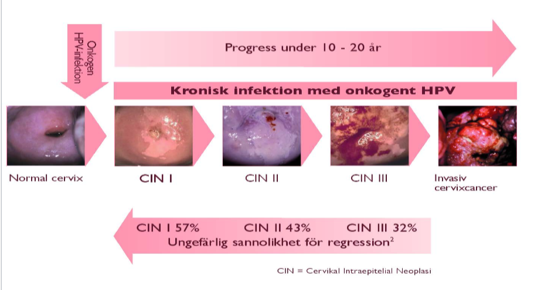
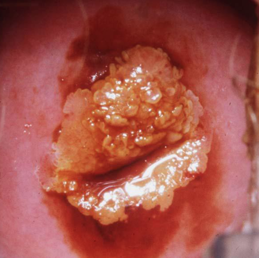
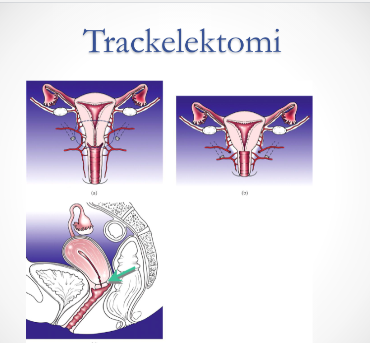
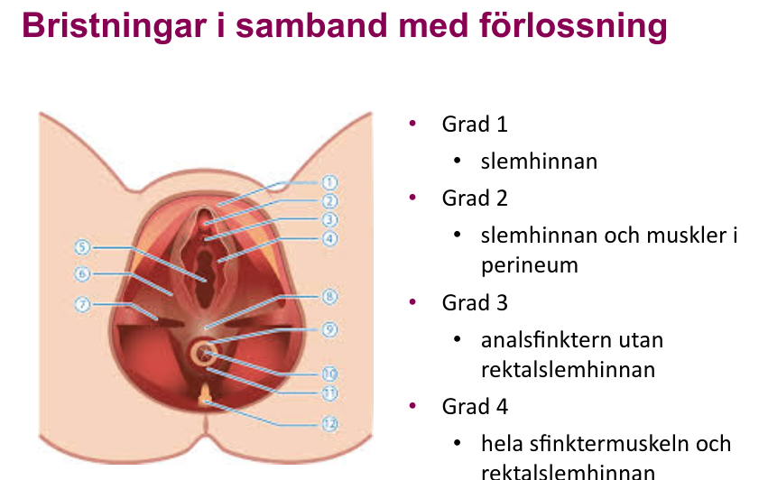
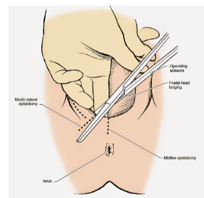

## Titlar

***Presentation***

***Etiologi och patofysiologi***

***Epidemiologi***

***Kliniska kännetecken***

***Utredning och handläggning***

***Behandling***

## Akut buk

### Diagnoser

* Salpingit
* Endometros
* x-grav, extrauterin graviditet
* appendicit
* corpus luteum cysta
* ovarial torsion
* diveritkult
* TOA
* endometrit
* cervicit
* PID
* cystor: follikelcysta

### Ektopisk graviditet

***Presentation***

* Linda, en 26-årig
  *  väsentligen frisk kvinna, söker dig på grund av lågt sittande buksmärta med viss utrstrålning mot ryggen och vaginal blödning. Hon lever i ett fast förhållande sedan 2 år och använder kondom som preventivmedel. Linda är 0-gravida. Hon säger att hon har mer ont åt vänster sida nedtill. Hb 90 g/l, Puls 115, Bltr 100/60. Vid bukpalpation finner du en rejält öm buk mer åt vänster. Buken känns också spänd.Gynekologisk undersökning: vid inspektion av vagina ses sparsam blödning ur cervix, uterus något förstorad, vä adnexa känns också förstorat och hon ömmar över detta. 
  * Med ULJ ser du ingen viabel intrauterin graviditet, men ökad mängd vätska i Fossa Douglasi. S-HCG är 5600. Du bestämmer dig att operera Linda laparoskopiskt pga en misstänkt extrauterin graviditet med blödning.
  * operativa laparoskopisjka metoder för tubargrav: tubotomi eller salpingektomi
  * risker ena metod jfr andra: trofoblast väv kvar i tuba vid tubotomi
  * postoperativ uppföljning: s-hCG vid tubotomi

***Allmänt***

* Extrauterin grav = x-grav = ektopisk graviditet

***Etiologi och patofysiologi***

* observationer fr ektopiska grav, transmigration äggceller t *andra sidans tuba* kan ske
  * möjligen pga peritonealvätska i fossa douglasi
* **Tubargraviditet**: 97-99% av alla X-gravs är tubargraviditeter

***Epidemiologi***

* 2% av alla grav?

***Kliniska kännetecken***

* Ensidig buksmärta: e.g. i ena fossan
* Defence?
* 

***Utredning och handläggning***

* **S-hCG**: fördubblas på 2dygn vid viabel intrauterin grav (<= 8v)
  * halveras på 2 dygn vid avsaknad nyproduktion

***Behandling***

#### Fall

***Presentation***

* Malin 27, TODO
  * år inkommer akut pga buksmärtor. Arbetar som förskollärare. Ensamstående. Väsentligen Frisk.  ob/gyn: menarke vid 13-års ålder. Regelbundna mensutrationer. 0-grav. Använt P-piller en period utan problem dock ej nu när hon inte har en fast pojkvän. laparoskopi pga buksmärtor för 3 år sedan. Inget patologiskt kunde påvisas och hon fick ingen förklaring till smärtorna.  Aktuellt : vaknade i morse pga smärtor i nedre delen av buken, mest på höger sida. Under dagen litet illamående , inte haft lust att äta. Inga kräkningar. Inga miktionsbesvär. SM började idag och kom på rätt tid. Smärtorna har minskat något men finns fortfarande kvar. Status AT: lätt smärtpåverkad Temp 37,0 Buk: Mjuk, ingen defense. ömmar både i höger och vänster fossa, mest dock höger. Gyn: Pågående måttlig mensblöding. Uterus normalstor rörlig, lätt ömmande till hö, något mindre till vä. Vag ulj: Uterus normalstor slemhinna 3mm. Båda ovarierna ses ua. ökad mängd vätska i buken.lab: CRP 20, Hb 98, urinsticka visar blod.
  * Vilka diagnoser överväger du
    * abe: x-grav, appendicit, blödande corpus luteum, ovarielltorsion

### PID

***Etiologi och patofysiologi***

* Enl gyn boken, s296: 
  * äggledarinflammation med inslag cervicit och endometreit
* **Uppåtstigande disease**
* **Innefattar olika grad av** 
  * endometrit
  * P-piller om recidiverande cystor
  * salpingit
  * ooforit
  * TOA: tuboovarialabscess
  * peritonit
  * perihepatit: 
* **STD**: sexually transmittable diseases
  * **klamydia**
  * **gonorre**
  * **mykoplasma urogenitale**
  * **oftast salpingit**
* **vaginal anaerob blandflora**
* **tarmflora med bla E.coli**
* **abscesser**: ofta polymikrob flora, endast 30% STD
* **actinomyces och TBC kan**: ovanligt
  * kan bli utsått över hela peritoneum
  * diff diagnos: peritoneal-carcinos

***Kliniska kännetecekn***

* varierar: 
  * **fr subklinisk infek till**
  * **!!! AT påverkan + spesis**
* **nedre buksmärtor, ofta bilat**
* **vaginal flytning**
* **olaga vaginal blödning**
* **feber**
* **påverkan på mikton + avföring**

***Utredning och handläggning***

* **Odla**!
* **UL**: ofta oregelbunden resistens med varierande ekogenicitet. vid aspiration, dränage
* **DT**: bra för säkrare kartläggning samt att följa behandling. skilja fr divertikulit o appendicit
* **Laparoskopi vid oklar diagnos**: eventuellt

cerivicit 

***DIfferentialdiagnoser + riskfaktorer***

* **Riskfaktorer**
  * Sexualbeteende
  * låg ålder
  * IUD (intrauterindevice) spiral; första 3v om kopparspiral suttit för länge
  * iatrogent vid operationer uterus och adnexa: obs bakteriell vaginos
* **DIfferentialdiagnoser**
  * appendicit
  * divertikulit med/utan abscess

***Behandling***

* Antibiotika po/iv beroende på infektiosutbredning
* kirurgi vid abscess: akut eller lugnt skede; fertilitetsbevarande=?
* dränage av abscess

***Komplikationer / konsekvenser på sikt***

* Infertilitet; tubarskador
* risk för extrautering graviditet
* adherenser med smärta

### TOA - Tuboovarial abscess

***Etiologi och patofysiologi***

* **icke-utläkt PID**
  * vanligaste orsak
  * finns kvar som en kronisk PID
* **äggledare**: blir vätskefulld o avstängd (säcktuba), (i samband med icke-utläkt PID?)

## Allmänt

### Inkontinens

#### Ansträngningsinkontinens

***Etiologi och patofysiologi***

- Förlossning: tänjer på en massa muskler och bindväv, bäckenbotten blir slappare
- Puborectalis: denna muskeln i bäckenbotten (perinealt?) är starkt relaterat till bibehållen kontinens i uretra, varpå påverkad puborectal muskelm (PRM) leder till att man kan få en ansträngningsinkontinens
- Peruretral ligamentet: denna kan också tänjas i samband med förlossnings, varpå ansträngningsinkontinens

***Behandling***

- Konservativ behandling: detta bör vara förstahandsvalet för patienter, att man hoppar på en konservativ behandling

- - kissa oftare, normalare volym i urinblåsan: möjligt att patienten kissar endast när urinblåsan blir för full varpå ökad propensitet för att läcka urin
  - bäckenbottenträning: detta kan hjälpa till med kontinensen

- Kirurgisk behandling: 

- - TVT-behandling: slynga sätts runt uretra (efterliknar funktionen hos peruretral ligamentet? TODO)

#### Blandinkontinens

#### Stressinkontinens

***Presentation***

***Etiologi och patofysiologi***

***Epidemiologi***

***Kliniska kännetecken***

***Utredning och handläggning***

***Behandling***

* Kan botas med kirurgi

#### urgeinkontinens

## Anatomi

### Allmänt

### Bäckenbotten

***Levator muskeln***

- bedöms med krystning och 2 fingrar x-planet trycker mot rektum via vagina

***PRM***

- Puborectal muskeln
- denna är bland de starkare musklerna i bäckenbotten
- den som man kniper med; den kontraheras
- TODO: bifoga bilder fr gyn boken, de va ganska illustrativa
- Ansträngningsinkontinens vid defekt, 70%

***Peruretral ligamentet***

- Den kan bibehålla kontinens i uretra

- uttänjt efter förlossning

- ger urininkontinens

- Behandling

- - Slyngbehandling TVT
  - att man sätter en slynga runt uretra för att återskapa funktionen fr bindväven

### Kejsarsnitt

***Lager kejsarsnitt, tenta, TODO***

* Hud,
* subcutis
* superifical fascia:campersfascia,scarpas fascia
* recuts skidan
* rektus muskeln: detta stämmer ej?
* fascia transversalis
* preperitoneal adipos o areolar vävnad
* abdominell peritoneum
* pelvis peritoneum
* uterina muskler

### Livmodern uterus

***Uppdelningar***

* **cervix uteri:** detta är den distala delen av uterus
* **corpus uteri:** huvuddelen av uterus, kroppen på uterus
* **isthmus uteri:** del som separar corpus uteri fr cervix uteri

#### Corpus uteri

***Histologi***

* **glatt muskulatur, myometrium:** huvudsakligen glatt muskulatur i corpus uteri. 
* **ECM**: 40-50%

***Histologiska delar***

* **Endometrium**
* **Myometrium** 
* **Perimetrium**

#### Cervix uteri

***Histologi***

* **glatt muskulatur:** 4-10% 
* **ECM**: högt bindvävsinnehåll,

***Förlopp***

* **Första delen av graviditet**: fast + sluten; hålla foster, hinnsäck med fostervatten + placenta på plats
* **Senare del graviditet**: tilltagande uppmjukning av av cervix och när flossningen startat  -> vidgas o i slutet av förlossning kmr vagina cervix nedre uterinsegment o corpus bilda en gemensam förlossningskanal, som fostret passerar

#### Isthmus

***Histologi***

* **består ffa av ECM**
* **glatt musk**: sparsamt
* **ökar i längd** fr 0.5-10cm
* **passivt segment** mellan cervix och corpus uteri

## Blödning

### Anovulatorisk blödning

***Presentation***

* Elin, 13 år, 
  * fick sin första menstruation för sex månader sedan. Nu söker hon på mottagningen tillsammans med sin mamma. Orsaken är att hon haft mer eller mindre riklig blödning i stort sett varje dag sedan en månad tillbaka.
  * Troligaste orsak: funktionell blödningsrubbning (anovulation), genombrott efter längre tids oavbruten östrogenpåverkan
  * vidare utredning: trötthet, Hb, tidg sjd. Gyn undersökning ej nödvändig enl HT12

***Etiologi och patofysiologi***

* "Funktionell blödningsrubbning (tent)"
* **Ovulation uteblir, östrogen påslag kontinuerligt, utan progesteron**
* **Endeometrieslemhinna fortsatt proliferationsfas**
* **Proliferar tills det blir nekros**
* **För ingt progesteron, spiralkärlen kontraherar ej och ingen spasm**
* **Fortsätter att blöda**

***Utredning och handläggning***

* **Anamnes**
  * Tidg sjd, nuvarande
  * hereditet, koagulationsrubbningar
  * läkemedel
  * sedvanlig anamnes
  * sexuell kontakt
* **Prover**: 
  * fkap-HB

***Behandling***

* **Cykliskt gestagen**: 3-6månader
* **Kombinerade p-piller**

## Cancer

### Allmänt

***Epidemiologi***

* **Vanligaste cancerformerna hos kvinnor, 2016**
  * Bröst: 29.2 %
  * Hud: 9.9%
  * Kolon: 7.9%
  * Lunga: 6.8%
  * Malignt melanom: 6.6%
  * Endometrium: 4.5%
  * Maligna lymfom: 3.2%
  * Urotelial cancer: 2.9%
  * Rektum and anus: 2.8%
  * Hjärna och övriga nervsystemet: 2.3%
* **Gynekologisk cancer 2016**
  * Endometriecancer: 1324
  * Ovarial/tubar/peritonealcancer: 688
  * Cervixcancer: 559
  * Vulva/vaginalcancer: 279

### Cervixcancer

***Presentation***

*  Lotta 42 år, 
  * I gravida, 1-para med PN för 5 år sedan. Hon söker för blödning efter samlag. Vilken åkomma bör du i första hand tänka på av nedanstående? (1p)
    * Cervixcancer: svaret 
    * (ett av alternativen var corpuscancer..)

***Etiologi och patofysiologi***

* **Orsak till död hos endstage**: njursvikt (nefrostomi tuber minskar risken)

***Kliniska kännetecken***

* Blödning vid samlag

***Epidemiologi***

* Sjunker över år 
* 550f p år
* 100 i sthlm p år
* näst vanligaste cancerformen globalt
* 18e vanligaste cancerformen i Sverige
* upptäcks vid screening 50%

***Riskfaktorer***

* HPV
* Rökning
* STD
* p-piller

***Kliniska kännetecken***

* symptomlöst ofta
* värk
* bensvullnad

***Utredning och handläggning***

* screening
* Koloskopi
* biopsi, histologi
* UIN. undersökning i narkos
* MR, DT, PET
* stadieindelning: kliniskt

***Behandling***

* **mikroinvasiva tumörer: dvs ej synlig PAD (stadie 1a1?)**
  * mindre kirurgi: konisering eller enkel hysterektomi
* **Alla stadier över 1b1 = tumör större än 4 cm**
  * strålning + kemoterapi (cytostatika)
* **synliga tumörer samt stora mikroinvasiva**
  * inegen skillnad överlevnad mellan strplning och kirurgi
  * men skillnad morbiditet
* **Strålbehandling**
  * lalla tumörer, över 1b1
  * kombination: extern + lokal (brachybehandling)
  * om lymfkörtelmetastaser: adjuvant behandling efter kirurgi
* **Cytostatika**
  * tillsammans med strål
  * öka känsligheten för strålbeh
  * kan krympa tumörer, troligen ej bota: endast kemoterapi cytostatika
* **Kirurgi**
  * nervsparande
  * wertheim
  * fertilitetsbevarande: trackelektomi, förutsatt tumör under 2cm
  * recidivkirurgi

***Biverkningar***

* **Morbiditet vid strålning**
  * strålproktit
  * blåspåverkan: trängningar
  * vaginal striktur, atrofi
  * frozen pelvis
* **Morbiditet vid kirurgi**
  * nervpåverkan, jfr prostatektomi
  * förkortning vagina
  * lymfödem
* **Primärbehandling**: ung patientgrupp, botbar sjd, risk skador centrala bäckennerver, problem t lymfadenektomi, risk strålinducerade skadpr blåsa, tarm genitalia
* **Bergmark**: kort vagina, otillräcklig lubrikation, dyspareuni

***Prognos***

* ***5års-överlevnad***
* **enl stadier**
  * 1A: 100%
  * 1b: 90%
  * 2a: 80%
  * 2b: 60%
  * 3: 30%
  * 4: 10%

### Cowdens syndrom

***Allmänt***

***Etiologi och patofysiologi***

* autosomalt dominant
* PTEN mutation

***Epidemiologi***

* Känneteckans av 28% livstidsrisk för EC
* Ökad risk bröstcancer och thyroideacancer
* incidens 1:250k

***Utredning och handläggning***

* diagnosen baseras på NCCN: national comprehensive network clinical criteria
* UL och eller EB och eller hysteroskopi

### Dysplasi

***Presentation***

* **Pia, 31år** 
  * 2 grav 2 para, senaste partus 2013. Hade cellförändringar för 10 år sedan, går på årliga kontroller hos sin gynekolog, sista kontroll för 1 år sedan. 
  * Cytologi ua.Söker i juli 2014 pga illaluktande blodtillblandade flytningar. Bilden och PAD visade invasiv cervix cancer lågdifferentierad, stad 1B1
  * 
* **Vanligaste symptomet vid cellförändringar**: oftast symptomlöst. 

***Etiologi och patofysiologi***

* **HPV, omogna celler, i metaplastisk område**: HPV når lättast de omogna celler i det metaplastiska området
* **Sexuellt aktiv**: alla sexuellt aktiva kvinnor löper risk att bli smittade med onkogent HPV
* **HPV smittar lätt vid sexuella kontakter**
* **80% sexuellt aktiva kvinnor** ngn gg infek m HPV
* **HPV kan överföras genitalt**: behövs inte genomfört samlag för att viruset ska överföras
* **HPV16, HPV18:** infektioner med dessa är rel ovanligt
  * 70% all cervixcancer
  * 70% av de prcancerösa o 
  * 50% av de potentiellt precancerösa cellförändringar i cervix

|  |  |  |
| ------------------------------------------------------------ | ------------------------------------------------------------ | ------------------------------------------------------------ |
|  |  |  |
|  |  |  |
|  |                                                              |                                                              |

***Kliniska kännetecken***

***Kom ihåg***

* **Dysplasier symptomfria**
* **Sens av cytologprov är 60%** 
* **25% av alla cx-fall har normal cytologi**
* **cervixcancer pres med symptom**
* **ett cytologprov vid utredning kan fördröja**
* **Nya riktlinjer**
  * Nya svenska riktlinjer för HPV-screening finns, men är inte implementerade i klinisk praxis.
  * I de nya riktlinjernahöjs den övre gränsen till 64 år. Cytologiscreening görs i åldrarna 23–29.
  * HPV-screening inleds vid 32, fortsätter vart tredje år till 50 års ålder och sedan vart sjunde år. 
  * Vid 41 föreslås screening med både HPV-test och cytologi. HPV-positiva kvinnor med normal cytologi ska hänvisas åter till screeningprogrammet med nytt prov efter tre år, och vid positivt test remitteras för utredning.
  * Screeningintervall på minst fem år rekommenderas för god balans mellan nytta och risk för överdiagnostik och överbehandlin

***Epidemiologi***

* Sedan slutet av 60-talet finns screening program i alla Sveriges landsting
* Sedan slutet av 1960-talet finns screning program i alla Sveriges landsting
* Resulterade att antalet fall av livmoderhalscancer minskat med 60%
* **incidens**: sjunker över tid
* **screeningprogram**: suboptimal täckning,
* **ett enda cytologiprov**: har begränsad mindre än 70% känslighet för höggadiga cellförändringar i livmoderhalsen
* **Regelbundna**: kontroller behövs för bra screening prestanda
* **Som avvikelser**: 8% av cellprov visar en avvikelse 2012 (54k prover); baserat på data fr NKCx årsrapport 2013
* **Cellförändringar**
  * LSIL 40%
  * ASCUS 40%
  * HSIL 16% 
  * Körtelatypi 4%
* **Cervixcancer drabbas idag**
  * **HPV infekterade**
  * **aldrig screenade**: 2:3 fall upptäcks varje år har aldrig varit på cellprovtagning
  * **tidigare konsierade**: trots att radikalt exiderat cellförändringen; recidiv drabbar 10-15%
  * **äldre kvinnor**
* **Primär screening med HPV o vaccinatioer**: både tjejer o pojkar kommer ge nya möjligheter förebygga cervixcancer

***Utredning och handläggning***

* **Screening program...**
  * 23-50åå kallas vart tredje år t mödravården för att ta ett prov
  * o kvinnor mellan 50-64åå vart 7e år
  * Syfte cellprovtagning: upptäcka tidg förändringar för att kunna behandla de i tid innan evt cancer 
* **Utredning på mottagning**
  * **Kolposkopi**: är visuell inspektion cervix med special low-magnification microscope, in search for abnormaliteter aiming to identify och ta sample fr atypiska site for biopsi
  * **Riktade biopsier**
  * **Bedömning**: vad som orsakar cellatypin; hur evt behandling ska ske; ger allmänt lugnande info

***Behandling***

* **Vid CIN**
* **Destruktion**
  * **Diatermi**: koagulering
  * **Kryo**
  * **Laser**: förångning
* **Excision**
  * **Diatermislynga / kniv**
  * **Laser**
  * **LEEP**: Loop Elektrosurgical Excision
  * **LLETZ**: Large loop excision of the transformation zone (i Storbritannien)

### Dysplasi, HPV

***Etiologi och patofysioogi***

* **Cirkulärt genom, 8kbp**
* **3 regioner**: 
  * LCR: long ctrl region
  * Region of early proteins E1 t E7
  * region of late proteins: L1 and L2
* **Typer**: över 189 typer
  * **40 infekterar slemhinnan** genitalt och eller oralt
    * 15 högrisk typer
    * resten lågrisk typer
  * **60 infekterar hud**: Hudvårtor (händer, fötter)
* **HPV-infektioner**: mycket vanliga, men för det mesta kortvariga; flesta HPV-infektioner går spontant tillbaka
* **HPV onkogena proteiner E6/E7**: 
  * **cervixcancer**: E6oE7 involverad i utv cervixcancer
  * **samspel** tumörsupressor proteiner p53, pRB
  * **E2** repressor funk för syntes E6 och E7
  * **E2** bryts upp vid integration i värdcellens genom
  * **E6 E7** mRNA translateras t E6 o E7 proteiner

***Behandling***

* **HPV-vaccin**: 
  * **tillgängligt sedan 2006, Bivalent (cervarix, glaxosmithkline):** HPV16,HPV18
  * **kvadrivalent (gardasil, merch and co):** HPV16,HPV18, HPV6, HPV11
  * Ger ett ~70% skydd mot cervix cancer
  * **innehåller virusliknande partiklar (VLP)** som består av ett tomt skal av protein
  * **kapsidproteinet L1**: tillverkas av detta.
  * **Ej levande vaccin**
  * **Innehåller inte virus-DNA**, kan inte ge infek eller cancer
  * **intramusk, deltoideus:** vaccinet ges IM vanligast Deltoideus
* **HPV-vaccin 2dos adminstrering**
  * **3dos tidg standard**
  * **Sammantaget resultat**: titerkonc 2dos lägre än 3dos men inte sämre

***Vaccinationsprogrammet***

* **Skolvaccinationsprogrammet i Sverige**
  * Organiserad vaccination mot HPV sedan 2011-2012
  * Gardasil
  * 11-12åå gratis vaccination i skolan
  * födda 93-98 gratis vaccin övergångstid: catch-up vaccinering
  * Jan 2015-2
* **Framtid**: 9-valent HPV vaccin: 9 HPV typer, GK FDA 2014, 90% skydd cervixcancer
  * infört Sverige 2017

### Endometriecancer

***Presentation***

* **55-årig kvinna, tenta viktig**
  * 0-gravida söker dig på grund av vaginal blödning. Hon har tidigare i livet varit frisk frånsett övervikt (mellan 85 och 90 kg, hon är 165 cm lång). Patientens föräldrar är döda: pappa i hjärtinfarkt, mamma i bröstcancer. Patienten berättar för dig att när hon var tonåring hade hon också oregelbundna blödningar. Dessa normaliserades dock under de 8 år som hon tog kombinerade p-piller. Hon slutade med dessa då hon var 27 år då hon önskade bli gravid. När detta inte lyckades sökte hon läkare, men utredningen fullföljdes aldrig på grund av skilsmässa. Det visade sig dock att maken hade ett normalt spermiogram. Efter att hon slutade med p-piller var blödningarna alltid oregelbundna, kom sällan och var ganska små. Vid 45 års ålder fick hon dock en tre veckor lång blödning och behövde skrapas på grund av detta. I journalen ser du att PAD på skrapningen visar en enkelt hyperplasi (metropathia haemorrhagica cystica MHC). Med hjälp av vaginalt ultraljud konstaterades då också ett myom i fundus. Menopausen inträffade vid 50 års ålder och patienten har inte blött förrän nu. Du ordnar med en ny skrapning på denna patient och diagnosen blir högt differentierat endometriecarcinom.
  * tre faktorer för EC: 
    * 0-para
    * obestias
    * PCOs enl anamnes... TODO
* **Karin, 58 år,** 
  * söker på kvinnoklinikens mottagning på grund av en vaginal blödning tre år efter menopaus. Hon är tidigare frisk, II-para, och har inte någon östrogenbehandling. Hon väger 95 kg och är 160 cm lång. Vid undersökningen noterar du en del gammalt blod i bakre fornix, uterus är normalstor, och vid ultraljudsundersökningen ser du ett endometrium som är förtjockat (18 mm), men väl avgränsat. 
  * **Vilka andra diagnoser måste uteslutas**? Endometriecancer och cervixcancer
  * **!!! vidare utredning**: endometriebiopsi, abrasio, hysteroskopi med px
  * **Om efter utredning  utesluta diagnosen i a) vad troligaste differentialdiagnosen  o  bakomliggande orsak**: Endometriehyperplasi pga förhöjda östrogennivåer (obesitas)
* **47åå kvinna**
  * söker för långdragna blödningar och buksmärtor. Av den gynekologiska journalen framgår att hon fött 4 barn. Alla förlossningar har varit normala. Dessutom hade hon ett missfall och en legal abort. Fick spiral insatt i samband med abortingreppet och efter detta en salpingit som antibiotikabehandlades. Efter senaste partus åter kopparspiral. Patienten har haft regelbundna menstruationer fram till mitten av april 2012. Från mitten av maj till augusti haft mellanblödningar. Sökte akut i slutet av juli pga blödningar då man avlägsnade spiralen på misstanke om att denna orsakade blödningstrasslet. Eftersom blödningarna inte upphörde sökte hon åter akut och blev insatt på per oral gestagenbehandling under 10 dagar. Trots detta fortsatta blödningar. Man förordade hormonspiral som patienten fick insatt i oktober 2012. Vid återbesök juni 2013 fortsatta blödningar. Hon upplever att hon är trött på blödningarna. Smear och endometriebiopsi ua.
  * Sannolik diagnos: myom...
  * behandlingsalternativ t denna patient: endometrieablation, endometrieresektion, hysterektomi, eller esmia
* Karin 60 år, TODO
  * slutade mensutrera vid 51 års ålder men besväras nu av stänkblödning av och till. Hon har också obehagskänsla när hon har sex. Söker på gynekologisk mottagning.Vid undersökningen finner du lite rodnade lättblödande slemhinnor i vagina. Portio ser oretad ut makroskopiskt. 
  * Vilka diagnoser överväger du? Vilken/Vilka undersökningar gör du?
    * abe: endometriecancer, cervixcancer, cervixdysplasi, sköra slemhinnor pga menopaus
  * undersökningar: 
    * kolposkopi + inföärgning, 
    * vaginalt UL mätning endometrieslemhinna 
    * (endometrie PX ska tas?)
    * cytologi 
    * HPV-test (papsmear)

***Etiologi och patofysiologi***

* **Endometriet**: del av uterus (tänk ej ovarierna)
* **Östradiol** (estradiol; E2): predominanta **intracellulära** östrogenet i endometriet
  * ***Stimulerar mitos endometriala celler***
* **Progetiner reducerar mitos**:
  * **reducerar östrogenreceptorer**
  * **ökar metabolism E2 t mindre aktiv E1**
  * **stimmar differentiering endometrieceller till sekretorisk**
* **Malignt också yngre kvinnor**: notera att EC kan förekomma hos yngre kvinnor också, en risk som måste beaktas.

***Typer***

* **Typ1: endometrioid carcinom, vanligaste**
  * **östrogenberoende carcinogenes:** progression komplex atypisk hyperplasi t EC
  * **hos pre- eller perimenopaus**
  * **histologiska tecken:** 
    * **grad1:** under 5% solid non gladular tillväxt
    * **grad2:** 6-50% non non galdular growth
    * **grad3:** över 50% solid growth
* **Typ2: serös carcinom**
  * 10% av EC
  * äldre kvinnor jfr typ1
  * historia med bröstcancer
  * behandling med tamoxifen: att pat har tidg beh med tamoxifne?
  * aggressiv neoplasm
  * peritoneal dissemination likt ovarial serös carcinom
* **klassifikation malign mesenkymal tumör av uterus livmoder**
  * leiomyosarkom: spindled, epitelodid, myxoid
  * perivaskulär epitiloid tumör PEComa
  * låggradig endometriell stromal sarkom
  * odiffad endometriell sarkom
  * låggradig myullerian adenosarkom,
  * malign mixad myullerian tumör 
  * andra
* **Familjär EC**
  * Ackummulation fall funnet i familj
  * kallas för familjär EC
  * 5% av EC

***Epidemiologi***

* 4e vanligaste tumör kvinnor, 6% av alla cancrar internationellt hos kvinnor. 
* 1400 fall i Sverige varje år
* **livstidsrisk**: 2%
* **mortalitet**: 7-10:100k

***Kliniska kännetecken***

* **onormal vaginal blödning** presenterar hos 90% av alla EC
* **postmenopausal blödning**: notera postmenopausal, detta är ALLTID abnormalt
  * progressivt högre risk för EC om man är äldre och får en postmenopausal blödnnig

***Utredning och handläggning***

* **Alla postmenopaus blödning måste histologisk undersökning**
* // Notera att UL inte RÄCKER FÖR DIAGNOS: att endometrieslemhinnan är tunn betyder ingenting. 
* **Gynekologisk Status**
  * blödningskälla
  * cervikal stenos
  * uterin storlek, pelvisk massa
* **Pap smear**
  * cytologisk abnormalitet av cervix, vagina
  * occasional information av upper tract disease
* **endometriell biopsi (endometriebiopsi)**: endometriell lining; behov för diagnos. 
* **hysteroskopi**: endometriell lining
* abrasio
* (enl USMLE) D&C: dilatation o skrapning
* **Diagnostiska tester**
  * **transvaginal ultraljud**: endometriell stripe, uterusstorlek, adnexstorlek, förekomst cystor, massa
  * **sonohysterogram**: endometriell stripe, förekomst submukös fibroider, polyper, endometriella kavitetsmassa
  * **pelvis-MR**: myometriell abnornalitet, endometriell kavitet, adnexala strukturer, invasion in i parametria, vagina, blåsa, pelvic nodal disease
  * **abdominopelvic-DT**: ascites, pelvis och para-aortal adenoatpier, intraparenkymala organabnormaliteter, peritoneala och omental sjukdom
* ***Endometrietjocklek***: dubbellager mätning
  * postmenopaus kvinnor gränsvärde <= 5mm
  * normal endometrie tjocklek ***utesluter inte EC***
* Doppler ultraljud, hysteroskopi endometrial polyp

***Staging***

* **Stad1**: confined t corpus
  * limited t endometriet
  * under en halva myometrie invasion
  * över en halva myometriell invasion
* **stad2**: cervix involvering
  * endocervikala kärtlar
  * stromal invasion
* **stad3**. extrauterin extension men limited t riktig pelvis
  * serosal eller adnexala extension eller positiv peritoneal cytologi
  * vaginal metastas
  * pelvis eller parao-aortala nod involvering
* **stad4**: extension beyond riktig pelvis in i närliggande rgan
  * blåsa eller tarm
  * fjärrmetastaser

***Prognostiska faktorer***

* pad staide, histo grad, histo typ, myometrie invasion, lymovaskulär invasion, lymfkörtel mets, ålder
* **conflicting-possible prognostic factor**: serosal involvering, cervikal involvering,. 
* **myometrieinvasion**: confied t endometriet är prognos god om yttre tredjedel myometrie är det dåligt
* **ålder**
* **DNA-polidy**: DNA analys + cytomertri mäter kopior DNA i tumören. 
  * **diploid mindre aggresiv**
  * **DNA plodiitet självständig prognostisk faktor**

***Riskfaktorer***

* **allt som ökar biotillgänglighet östrogen ökar risken endometriecancer**
  * **obesitas**: BMI starkt associerad ökad risk endometriecancer
    * dubblas fr 23 BMI till 30 BMI 
    * hos premenopaus, är BMI proportionel med ***längre anovulatoriska cykler*** (med anovulation att endometriet växer sig fetare?)
    * **postmenopaus**: BMI proportionell med ökad E2 och sänkt SHBG
  * **nullipara**
  * **sen menopaus**
  * **diabetes mellitus**
  * **hypertension**
  * **kronisk unopposed östrogen stimulering**
  * **kronisk tamoxifen användning**
* **östrogenbehandling**
  * ordinär dos östrognebehandling (ET, estrogen treatment) = resulterar i endometriell cellproliferation
  * östrogenbehandling längd proportionell EC risk
  * **risk fr östrogenbehandling rel med BMI osså**: högre BMI lägre riskeffekt av östrogenbehandling vg EC.
* **HRT - hormone replacement therapy**
  * också relaterat med riskökning om den ges intermittent
  * kontuinuerlig kombinerad EPT har inen ökad risk för EC.
* **Tamoxifen**: ökar risken för endometrie cancer 2-3ggr

***RIskgrupper***

* **Högriskgrupp**
  * icke-endometroid typ
  * figo-grad3
  * djup myometrieinvasion/cervikal stroaminvasion enl USG eller MR
  * klinisk misstanke om cervikal stromainvasion
* **lågrisk**
  * ingen ovanstående prognostisk faktor föreligger

***Skyddande faktorer***

* **graviditeter:** 35% reducert 1a para, 15% efter 2a para;
* grav äldre ålder mer protektivt: EC reduceras med 51% kvinnror med last birt runt 35åå
* **oral antikonception**: 7% reduktion för varje år som man använder

***Behandling***

* **Kirurgi**
  * **Stadie1**
    * laparotomi
    * peritoneal tvätt
    * TAH, BSO
    * Selekterad paraoartala o pelvis lyumf nod sampling
    * i typ2 och klarcells carcinom: omentum resektion
* **Lymfkörtelutrymning:** ingen evidens för overall eller recidiv fri överlevnad för pelvis lymfadenektomi med tidig EC
  * pelvis lymfadenektomi kan inte rekomemndera som rutin procedut för terapeutisk purpose utanför klinisk trial

**Riskreducerande operation**

* **Hysterektomi och SOE** (salpingo ooforektomi)
* **Risken för cancer minskar**: liten kvarstående risk att utveckla peritoneal carcinos

* **SOE leder t besvärliga biverkningar**
  * klimakteriebesvär
  * slemhinnetorrhet
  * dyspareuniRT
  * osteoporos
* **HRT**

### Endometriecancer och cancerhistorik

***Allmänt***

* In Swedish population:
  * 13 % women with EC had at least one relative with the same disease. 
  * Relative proportion of endometrial  cancer in famutatiiioner milies from patients with EC was increased compared to general cancer population: 5.5% vs3.05 %
  * 47% of  patients had relatives who were diagnosed with EC cancer before the age of 50 years
* A history of colorectal or ovarian cancer in first-degree relatives has also been associated with an increased risk of endometrial cancer

***Bröstcancer***

* personlig bröstcancer ökar risken för EC, oavsett familjehistoria
* bröstcancer associerat serös carcinom yngre kvinnor
* 5% kvinnor serös carcinom hade mutationer i börst ancer gener,
* men endast 2 av 7 hade brsötcance i familjen

***Multipla maligniteter***

* högrisk synkrom eller metakronös ovarial och endometriecancer, speciellt endometrie carcinoid
* **swedish cohort**: 16% index patienter diagnosticerades med minst en cancer
* 45% av dessa patienter hade uterincancer och bröstcancer

### Gener ökar cancerrisk

***Presentation***

* Louise 38 år 
  * 3 gravida, 1 para, kommer till Kvinnoklinikens mottagning med remiss från Klinisk Genetik på
    Karolinska Universitetssjukhuset på grund av att hon tillhör en familj med Lynch syndrom med flera cancerfall i släkten.
    * Vilka cancerformer förutom endometriecancer är de vanligaste hos kvinnor med Lynch syndrom?(1p):  Koloncancer?
    * Nämn ytterligare minst en annan genetisk mutation som ger en ökad risk för cancer i kvinnliga könsorgan samt vilka organ som påverkas? (2p): BRCA1 och BRCA2 mutationer, som kan leda t cancer i bröst och ovarie ? 

***Olika gener och mutationer***

* **Lynch-syndrom**: endometriecancer, kolo(rektal?)cancer
* **BRCA1**: bröstcancer, ovarialcancer
* **BRCA2**: bröstcancer, ovarialcancer

### HNPCC, LS

***Allmänt***

* hereditary non-polyposis colon cancer
* !! kallas nu Lynch syndrom: n

***Etiologi och patofysiologi***

* Autosomalt dominant
* Gener: MLH1, MSH2, MSH6, PMS2

***Epidemiologi***

* 1-2% av lla kolonmcacer o EndometrieCancer fall i Sverige o för ca 9% av alla EC som yppkommer före 50åå
* kvinnor med LS har 40-60% risk för EC, livstid
* 50% EC före koloncancer
* medianålder insjuk EC vid LS är 46-62åå
* ökad risk för: ventrikel, **endometrium**, **ovarial**, tunntarn, uretercancer
* HögstariskenförovarialcancerharMLH1/MSH2-bärare 

### Koriokarcinom

***Etiologi och patofysiologi***

* Elakartad tumör
* trofoblastisk epitek
* utsöndring koriongonadotropin (hCG?): mängder utsöndras
* fr befruktningsframkallande fosterhinneprodukter
  * hydatidmola blåsa
  * normal grav
  * efter abort
  * trestikelteratom
  * mediastinum
  * tallkottkörtel

***Behandling***

* Methotrexate + actinomycin D (cytostatika?) + etopside

### Leiomyosarkom - EC

***Epidemiologi***

* 1% av alla uterina maligniter, 40% av alla uteruina sarkom
* invidens 0.67:100k
* incidens leiomyosarkom originate fr leiomyom

***Kliniska kännetecken***

* abnormal blödning
* pelvis smärta
* inga radiologiska procedurer som är diagnostiska för sarkom preoperativt
* UL, DT, MR är unreliable för att diffa sarkom fr leiomyom

***Behandling***

* total abdominell hysterektomi
* BSO
* pelvis strålning: reducerar lokal pelvis recidiv, men inte prolongerad överlevnad
* kemoterapi: response är låg
* 5års överlevnad 30% 

### Lynchsyndrom

***Allmänt***

***Etiologi och patofysiologi***

***Epidemiologi***

* **Endometriecancer**
  * Prevalens Lynch syndrom: beräknas 1:440
  * 13 nya diagnositeras årligen LS i Stockholm
  * prognos kvinnor med livmodercancer: över 80% överlevnad efter 10år, 20% dör fr sin EC
  * prognos EC + LS kan god med 81% 10års-överlev
  * livstidsrisk för EC: 50%
  * 2% av alla EC tillhör LS
  * medelålder diangos 48år: 
    * MLH1/MSH2 = 50år
    * MSH6 = 60år
  * 50% av EC diagnos före 50åå
* **Ovarial cancer**
  * livstidrisk för OC: 10%, normal p:1.4%
  * 2-4% av alla OCs tillhör LS
  * ofta symptomatisk
  * medelålder 50åå
  * samma histo som sporadisk OC
  * samma prognos som sporadisk OC för varje klinisk stadie

***Utredning och handläggning***

* **Amsterdam II kriterier för att detektera LS**
  * Three or more family members, one of whom is a first-degree relativeof the other two, with HNPCC-related cancers (colorectal, endometrial, stomach, ovarian, pancreas, ureter and renal pelvis, biliary tract, and brain (usually glioblastoma)
  * Two successive affected generations
  * One or more of the HNPCC-related cancers diagnosed before age 50 years
  * Exclusion of familial adenomatous polyposis(FAP) 
* **Gynekologisk screening hos LS-patienter**
  * **screening börjar mellan 30-35åå**; för att tidigaste cancrar hittas då
  * kontroller inkludera endometriell biopsi för EC screening, specillt i premenopausal patients
  * for OC screening: ultraljud + CA-125 kombinerad med patientinformation

### Myom

***Presentera***

* Kvinna rikliga blödningar + myom = ge hormonspiral
* **Elsa, 48 år,** 
  * kommer på remiss från vårdcentralen till kvinnokliniken för att man känt en resistens nedtill i buken. Hon är tidigare väsentligen frisk, förutom en välbehandlad hypertoni, III-gravida, II-para, med två PN. Senaste gyn-undersökningen var för minst 10 år sedan men cytologproven hos barnmorskan har varit u.a.. Menstruationerna har blivit lite mera oregelbundna det senaste året och intervallen varierar mellan 3 och 6 veckor. Elsa är rädd att hon fått cancer och är ganska uppskärrad.
  * troligast gyn orsak: myom (uterusmyom)
  * Veta mer: sj känt en knöl, ökat bukomfång, pollakisuri täta träng, problem avföring, rikliga mens, paramaligna symptom, trötthet, avmagring, 
  * fynd förstärker malignitet misstanke: adherent resistens. inte utgår fr uterus. UL cystisk förändring flera rum solikda partier, asciters
    * prover: anemi, förhöjt Ca-125, ec CEA o F-Hb
* !! **En 55‐årig kvinna,** TODO
  * 0‐gravida söker dig på grund av vaginal blödning. Hon har tidigare i livet varit frisk frånsett övervikt (mellan 85 och 90 kg, hon är 165 cm lång). Patienten berättar för dig att när hon var tonåring hade hon oregelbundna blödningar. Dessa normaliserades dock under de 8 år som hon tog kombinerade p‐piller. Hon slutade med dessa då hon var 27 år då hon önskade bli gravid. När detta inte lyckades sökte hon läkare, men utredningen fullföljdes aldrig på grund av skilsmässa. Det visade sig dock att maken hade en normal spermiefunktion.Efter att hon slutade med p‐piller var blödningarna alltid oregelbundna, kom sällan och var ganska sparsamma. Vid 45 års ålder fick hon dock en tre veckor lång blödning och genomgick en skrapning på grund av detta. I journalen ser du att PAD av endometriebiopsi visade metropathia haemorrhagica cystica (MHC). Med hjälp av vaginalt ultraljud konstaterades då också ett myom i fundus. Menopausen inträffade vid 50 års ålder och patienten har inte blött förrän nu. Du gör en endometriebiopsi och diagnosen blir högt differentierat endometriecarcinom.
    Utifrån denna fallbeskrivning kan du se att patienten har några predisponerande faktorer för att utveckla endometriecancer, nämn tre av dessa faktorer och diskutera mekanismerna över vilka de verkar. (4p)
    * obesitas: östrogenproduktion (ökad aromtas?) MInskad mängd SHBG därmed högre koncentration bioligskt aktivt östrogen som får endometrieslemhinnan att miotisera och prolifiera. Aromatisering sker osså där, av androstendin till östrogen vilket ger höger nivåer östrogen. 
    * nulliparitet: förlängd östrogen ingen progest?
    * infertilitet?
    * oligomenorrhe: anovulation?

***Etiologi och patofysiologi***

* **benign glatt muskel tumör i uterus**
* "**muskelknutor**"
* **rikliga blödningar**: en mekanisk påverkan på uterus eller lokala faktorer som åpverakr kärlbild eller koag, 
* **enl Blueprints**
  * aka leiomyom, fibroid
  * benign proliferationon glatt muskel i myometriet
  * **tidsspann**: under fertil ålder uppkommer. Regress i menopaus.
  * **vanligaste indikation för kirurgi i US**: 1/3 av alla hysterektomier i Sverige
  * **reproduktiva svårigheter**
  * **benign, monoklonal tumör**: börjar fr enstaka glatt muskelcell
* ? **malignt transformeras**: enl abbe under 1% han ref t ppt (enl blue så kan de uppstå samtidigt, men då parallelt inte att de stammar fr samma celler) 

***Epidemiologi***

* **LIvstidsrisk**
  * **Afrikanska kvinnor**: 80% 
  * **Caucasian**: 70% 

***Kliniska kännetecken***

* **Trycksymptom**: trängningar, förstoppning, 
* **rikliga menstruationer**: medför järnbristanemi
* **oregelbundna menstrutationer**: verkar som att man kan få detta... enl blueprints (s)
* **dyspareuni**
* **några mm t mkt stora**
* **oftast asymptomatiska** 
* **tendens växa grav** -> kan ge smärta ffa tidig grav
* **UL rundad struktur**, vaerierad ekogenictet, kan förkalkat skal, ofta skugga bakom
* infertilitet kan pga mekanisk orsak, att implantation försvåras
* upptäcks som bifynd, kan ge kroniska o akuta symptom som kräver beh
* **akut buksmärta**: nekros i myom
* enl blueprints
  * FIBROIDS Mnemonic
  * F: Frekvens och ret urin, hydronefros
  * I: Iron deficiency anemia
  * B: Bleeding abnormalities (menorrhagi, metrorrhagi, menometrorrhagi, postcoital spotting), bloating
  * R: Reproductive difficulties: dysfunctional labor premature labor delivery, fetal malpresentation, increased need cesarean delivery
  * O: Obstipation and rectal pressure
  * I: Infertility failed implantaation, spontaneous abortio
  * D: Dysmenorrhe, dysparenu
  * S: Symptomless
* Pelvis smärta är va

***Riskfaktorer***

* **Etnicitet**: afrikansk
* **icke rökande**
* **tidig menarke**
* **nulluipara**
* **perimenopau**
* **ökad alkohol**
* **hypertension**
* **lågdos antikonception** OCP protektiv mot utv
* **HRT** postmenopausal kvinna att den kan växa i storlek men ingen påverkan kliniska symptom

***Utredning och handläggning***

* Anamnes
* Status: Gyn-status, bimanuell palpation (palpera resistens)
* FYnd ökar malignitetsmisstanke
  * Resistens: adherent, ej utgår fr uterus
  * UL: cystisk förändring m flera rum, solida partier
  * Prover: anemi. förhöjt Ca-125. Ev CEA och F-Hb

***Behandling***

* **radikalt eller uterussparande**
* **farmakologiskt:** 
  * **GNRH analog minskar myometriets volym**
  * **hormonspiral**: minskar ej myometriet men kan minska blödningsbesvären specifikt
  * **esyma**: selektiv prostaglandin; denna är avskriven, den har gett leversvikt hos vissa patienter, så ej denna längre
* **kirurgiskt**
  * hysterektomi
  * enukleation
  * ocklusion av arteria uterina för att minska myomets storlek

### Ovarialcancer

***Presentation***

* !! Eva 35 år, 
  * II-grav, II-para och söker gynakuten då hon successivt fått allt mer ont i magen sista 3 veckorna. 
  * hon har hypertoni som hon medicinerar för men är för övrigt frisk, aldrig opererad i buken. hennes menstruationer upphörde för 4 år sedan och hon har inte använt hormoner. Eva beskriver att hon har ihållande buksmärta som började för ca 3 veckor sedan, men nu har hon svårt att röra sig då hon har fått allt mer ont. Beskriver att smärtan sitter långt ner i magen och även strålar ut i ryggen. Hon har även ont när hon sitter ner. Miktion ua, och även tarmen tömmer sig regelbundet men det gör ont. INget synligt blod i urin eller avföring.
  * Buk: palperas överalt mjuk. Distinkt palpationsöm centralt i nedre delen av buken, ingen säker resistens palperas, ingen peritonit misstänks
  * Gyn: VVP ses ua. Uterus är normalstor för åldern och lätt devierad. Åt hö. Till vä och bakom uterus palperas en cystisk förändring som känns mjuk, ömmande, ca 7-8cm stor, rörlighet är svårt att avgöra.Ulj vaginalt: uterus är liten med normal konfiguration och tunt endometrium. Hö ovarium ses ej. Vid platsen för vä adnexa ses en 2-rummig cysta som mäter 7\*8 cm. Cystan är mstadels ekofri men i ena polen finns ett område som är mer ekogivande. ingen fri vätska ses i buken.
  * Diagnos/diagnoser? Svarade ovarialcancer, ovarialcysta
  * ytterligare prover bekräfta diagnos: här kan man diskutera en massa TODO

***Riskfaktorer***

* HRT
* tidig menarche + sen menopaus
* joniserad stlning
* hereditet
* ålder
* nullipartum, inga tidg barn.

***Etiologi och patofysiologi***

* **Tre distinkta komponenter**
  * !!! **Ytepitel**: 65% ovarie tumörer och 90% ovarie cancer
    * aka **seros överial cancer**
    * attribueras till STIC (serös intraepiteleial carcinom): att de originate fr tuborna; 
    * STIC, p53: STIC har osså p53 mutation som gör den farligare. 
    * BRCA association: de med BRCA mutationer är associerade med den serösa formen, drf farligare formen
  * **ovarial germinala celelr**
  * **ovarial stroma**
* **Metastaser TILL ovarierna**: 5-10% andra primärtumörer, alltså att de mets till ovarie
  * vanligtvis gastrointestinala tumörer aka Krakenberg tumörer
  * eller bröst eller endometrium
* **Okänd etiologi, teoretiseras**
* **malign transformation ovarievävnad:** prolongerad kronisk oavbruten ovulation som  förstör epitelialväv och drf regen, prolif o mitos. 
* **!! Spridning (metastasering)**
  * **direkt exfoliering maligna celler**: från ovarierna, mets följer bred cirkualtorisk väg av peritoneal vätska. 
    * **vanligaste formen av spridning**: att ovariecancern SEEDAR peritoneal kvaitet etc.
    * **peritoneal carcinomatosis**
  * **lymfatisk spridning finns**: retroperitoneal pelvis och paraaortalt lymfkörtlar
  * **hematogen spridning osså**: mer rare o distanta mets t lungor o hjärna. Avancerad sjd intraperit tumör spridnig leder t ackummulation acsites i buken och encasement av tarmar med tumör!
* !!! **Incessant ovulation hypotesen**: ovulations supprimering är bättre för att då förstör man mindre av epitelvävnaden, varpå mindre risk för malignifiering
  * noter att  detta inte verkar ha en DIREKT relation till östrogne, likt för endometriecancer!
  * fungerar parallelt med STIC teorin också enl föreläsaren. 
* **Histologi**
  * **Typ1**
    * genetiskt stabila
    * ofta stage1
    * låggradig serös, mucinls, endometroid
    *  **källa**: cystadenom eller borderline tumörer
    * inga mutationer i p53 (som är en tumörsuppressor gen).
  * **Typ2**
    * genetiskt instabil tumör
    * spridd sjd
    * höggradig serös, carcinosarkom eller icke-differentierad
    * **källa**: tuba-fimbriae
    * muterad p53

***Epidemiologi***

* **25% av alla gynekologiska maligniteter,**
* **men 50% av all gynekologisk cancerdöd**: brist bra metoder tt screena, tidig diagnostik och presentation när tumören spritt sig är late stage och man behandlingsmässigt kan göra lite. 
  * räknat med alla cancerstadier
* !! **10-15% familjär cancer syndrom, alltså 10-15% hereditär ovarial cancer**: 
  * BRCA1 mutation 85% bröstcancer, 30-50% ovarial cancer
  * BRCA2 25% ovarial cancer (mindre än BRCA1)
  * HNPCC-LYNC (aka LYNCH2)
* **70% stage3c eller stag4 vid diagnos**

***Riskfaktorer***

* **ålder**: samma orsak med oavbruten ovulation, är en  risk; 50% av de som diagnosticeras med ovarial cancer är över 65åå
* **Endometrios**
* **Familjär cancer syndrom**: 
  * **brca1**
  * **brca2**
  * **lynch**
  * **familjehistorik ovarialcancer**: mamma, syster, dotter
    * ju yngre de fått d desto högre risk
  * **tidg bröstcancer hos pat**
* **oavbruten ovulation**: tidig menarche, infertilitet, nulliparitet, försenad barnafödande, late-pnset meopaus
  * notera att det är själva ovulationen som förstör epitel som är risken..
* **HRT**

***Protektiva faktorer***

* !!! **Incessant ovulation hypotesen**: ovulations supprimering är bättre för att då förstör man mindre av epitelvävnaden, varpå mindre risk för malignifiering
  * noter att  detta inte verkar ha en DIREKT relation till östrogne, likt för endometriecancer!
* !! **antikonception**: äter man OCP (oral contraceptives) orala antikonceptionsmedel, 5år reduceras risken med 50%
* **amning**
* **multiparitet**
* **kronisk anovulation**
* **tubal ligation och hysterektomi**: reducerar risken med 67% och 30%, även hos de med familjär cancer syndrom
  * hypotesieras att försämrat ovariellt blodperfusion minskar spridningen av cancern.
  * eller minskad migration carcinogener fr lower genital tract. 
  * **NOTERA STIC**: föreläsaren nämner STIC som en orsak osså t serös cancer, att det är tuborna som är the origin för cancern

***Kliniska kännetecken***

* **medianålder** 63åå
* **sen symptomdebut**
* **icke karakteristiska**
* **uppsvällning av buken**
* **trängningsinkontinens**
* **icke-specifika abdominal discomfort**: 
  * illamående
  * uppsvällning
  * changes in bowel movement
* **smärta**
* **svårigheter andas**
* **pelvis trombos**

***Diagnos***

* Anamnes + hereditet
* Somatisk + gynundersökning
* Vaginalt ultraljud (RMI, IOTA simple rules)
* Tumör markörer: 
  * CA125 
  * CA19-9: övre GI tumörer
  * CA15-3: bröstcancer
  * CEA: kolorektala cancrar
  * Kvinnor under 40åå / icke-epitelial tumör: beta-hCG, AFP (alpha-fetoprotein), inhibin-B, AMH
    * ska tänka att det är **stromaceller som är involverade**. 
* laparocentes / pleurocentes
* DT-thorax/nbuk: tumör sprdning o relation t andra organ
* möjlig MR, kolonoskopi

***Utredning och handläggning***

* **Screening**?
  * man letar screening metod för ovariecancer
  * sjd med spec prevalens i populationens
  * signfiinakt hälsoproblem
  * perklinisk stadie där diagnos gm screening är möjlig
  * tidig diagnos ökar kureringsgraden (botningsgraden)
  * proper sens o ch spec
  * **Ultraljud + CA125**: har tillsammans inte lyckats öka överlevnaden i screeningform
* **Undersökningsmetoder och poängsättning**
  * 
  * RMI: UL + CA125
    * under 200 man behandlar på vanlig enhjet
    * över 200 man skickar till en cancerenhet för handläggning och behandling
  * IOTA: Ultraljud för att bedöma 
    * används solida partier, flerrummiga, stora, papillär projektion, ökat blodflöde, ascites
  * !!! Maligna kriterier: solida partier, flerrummiga, stora, papillär projektion, ökat blodflöde, ascites

* detta är en malign ovariecysta: kan ha ett septum vid 3d-avbildning

***Behandling***

* Hysterektomi
  * HNPCC-Lynch syndrome: De med familjär cancer syndrom bör genomgå hysterektomi?

### Vulvacancer

***Utredning och handläggnign***

* PAD + kolposkopi + acetoacetat test

## Cystor

### Allmänt

***Riskfaktorer***

* vanligast mellan pubertet - menopaus
* rökning: 2-faldig öknign risk funktionella cystor

### Benigna cystor

***Etiologi och patofsiologi***

* **Cystisk adnexala massor**: indelas funktionella och neoplastiska
* **Funktionella cystor:** 
  * follikelcysta, corpus luteum cysta, theca lutein cysta
  * "följer menscykeln": därför följer de menscykeln enl ovan för att de utgår fr follikeln...
  * **Uppkommer fysiologiskt**: resulterar fr normal fusiologisk funktion i ovarier. 
* **Äkta cystor:** 
  * endometriom 
  * benign neioplasi  (dermoid och cystadenom); dessa är benigna

***Kliniska kännetecken***

* **Smärta varierande grad o karaktär**
* **Trycksmärta över urinblåsa o tarm** -> svårt att sitta + gå eftersom den sitter i fossa douglasi (lägsta punkten i buken)
* **torsion**: kan ge kraftiga smärtor i olika intervall
* **Olaga blödning** som kan störa menscykeln
* **mga symptomfria**, kan hittas som bifynd

***Utredning och handläggning***

* ***Status***
  * Fast cysta kan palperas: beksriv, storlek, regelbunden eller ej, rörlighet, förhållande t uterus, palpöm mm
  * en cysta som inte har för mkt vätska svår att palperas.
* ***UL: Diagnositskt***
  * diagnostiskt hjälpmedel

***Behandling***

* **Cystenukleation**: 
  * mindre cystor skalas ut 
  * ovarievävnad kan sparas
  * cystor under 5cm brukar försvinna spontant
  * större cystor kan behöva peukteras, då det finns risk för torsion + intracystiska blödningar

#### Follikelcysta

***Etiologi och patofysiologi***

* Vanligaste funktionella cystan
* ***Failure follikel rupturera under follikulär mognad***: under menscyjkeln
* Resolve av sig själva: spontant, efter 60-90d
* enkla cystor mindre än 2.5cm är fusiologiska

***Kliniska kännetecken***

* **Varierar stolrlek: 3-8cm** 
* **klassiskt asymptomatiska**, och vanligtvis unilaterala 
* **stora follikulära cystor:** ömma, palpabla ovariella massa
  * **torsion**: kan ge torsion; när över 4cm i storlek
* **ovanligt mens påverkan**: prolongerad intermenstruella intervaller eller korta cykler
* **större follikelcystor**
  * pelvis smärta
  * dyspareuni
  * ovariell torsion
* **akut buksmärta, ruptur follikelcysta**

***Behandling***

* **Exspektans många fall**
* **följs upp efter 6-8v**
* **Cystenukleation?:** laparoskopi om smärta eller om större cysta som ej går tillvaka (ca 6cm)
  * skalar ut cysta o bevara ovariet
* **P-piller:** recidiverande besvär

#### Corpus luteum cysta

***Etiologi och patofysiologi***

* **BIldas efter ovulation, lutealfasen**
* **vanliga funktionella cystor**
* **Formas, failed lutelys**: flest formas när corpus luteum failar att regress efter 14d o blir förstorade (över 3cm) + hemorrhagiska (corpus hemarrhagicum)
* **Ruptur**: kan rupturera, orsaka intraabdominell blödning

***Kliniska kännetecken***

* **Kan få torsion**
* **lokal pevis smärta**
* **amenorre eller försenad mens**
* **akut buksmärta,** 
  * **hemorrhagisk corpus luteum cysta**:

***Handläggning***

* Inläggning övervakning: kan brista med blödning ut i buken

***Behandling***

* Om stor blödning: hela blödningsspåret antagligen
* Ciklokapron om stör blödning
* laparoskopi med diatermi: kan vara svårt att skala ut o blodstilla

#### Theca luteincysta, ovanlig

***Etiologi och patofysiologi***

* pga abnormalt hög hCG: e.g. fr molar graviditet, koriokarcinom eller ovulation induktionsterapi

***Kliniska kännetecekn***

* Stora bilaterala cystor
* fyllda med klar, straw-colored vätska

#### Endometriom

***Etiologi och patofysiologi***

* **ektopisk endometrial vävnad i ovarierna**

***Kliniska kännetecken***

* **Choklad cystor**: tjock brun gammalt blod i dem
* **presentera endometrios liknande symptom:** 
  * pelvis smräta
  * dysmenorre
  * dyspareuni
  * infertilitet

### Funktionell cysta

***Kliniska kännetecken***

* **Olaga blödning**
* **Intervallsmärta**

### Malign cysta

***Presentation***

* Eva 35 år, 
  * II-grav, II-para och söker gynakuten då hon successivt fått allt mer ont i magen sista 3 veckorna. hon har hypertoni som hon medicinerar för men är för övrigt frisk, aldrig opererad i buken. hennes menstruationer upphörde för 4 år sedan och hon har inte använt hormoner. Eva beskriver att hon har ihållande buksmärta som började för ca 3 veckor sedan, men nu har hon svårt att röra sig då hon har fått allt mer ont. Beskriver att smärtan sitter långt ner i magen och även strålar ut i ryggen. Hon har även ont när hon sitter ner. Miktion ua, och även tarmen tömmer sig regelbundet men det gör ont. INget synligt blod i urin eller avföring. Buk: palperas överalt mjuk. Distinkt palpationsöm centralt i nedre delen av buken, ingen säker resistens palperas, ingen peritonit misstänks. Gyn: VVP ses ua. Uterus är normalstor för åldern och lätt devierad. Åt hö. Till vä och bakom uterus palperas en cystisk förändring som känns mjuk, ömmande, ca 7-8cm stor, rörlighet är svårt att avgöra. Ulj vaginalt: uterus är liten med normal konfiguration och tunt endometrium. Hö ovarium ses ej. Vid platsen för vä adnexa ses en 2-rummig cysta som mäter 7\*8 cm. Cystan är mstadels ekofri men i ena polen finns ett område som är mer ekogivande. ingen fri vätska ses i buken.

## Endokrinologi

###  HRT-behandling TODO

***Presentation***

***Behandling***

* **HRT :** östrogen + gestagen	
  * indikation: för de som har kvar uterus och endometrium
  * för att hindre endometrieproliferation och cancer hos pat med uterus kvar
* **Adminstrationsformer**
  * **transdermalt östrogen**: mer likt kroppseget östrogen. innebär att man inte får förstapassage metabolism via levern. 
    * risken för trombosbildning misnkar när man undviker levern vid adminstration av östrogen transdermalt när man jämför med peroral östrogenbehandling.  

***Kontraindikationer***

* **Kontraindikationer för HRT**
  * **bröstcancer**: har man haft bröstcancer, måste ske samråd med bröstvården
  * **endometriecancer**: efter endometriecancer kan man ta, beror på hur symptomen ser ut; indiviudellt ställnigstagande, sker med gynekolog
  * **DVT eller lungemboli**: om pat haft d, kontraindicerat likt vid kombinerad hormonbehandling med individuellt ställningstagande. 
  * **hjärtinfarkt eller angina**: relativ kontraindikation e.g. om man har precis haft hjärtinfarkten. 
  * **grav leversjukdom**: kan ej ge tabletter då, utan man kan ge salvor isf

***Biverkningar***

* Blödningsproblem
* Bröstsvullnad
* Bröstömhet
* Humörpåverkan
* Hudreaktion av plåster
* Illamående
* Huvudvärk
* Rädsla för cancer
* obs viktökning ej biv av HRT (stark evidens)

### Hyperprolaktinemi

***Diagnos***

* **S-prolaktin**: över 567mIE/L, minst 2 tillfällen
  * **3 timmar efter uppvaknande** o under **avstressade förhållanden**, då man annars kan få falskt förhöjda värden
* pulsatila GnRH inösöndirng fr hypothalamus hämmas

***Etiologi och patofysiologi***

* **graviditet och amning**
* **prolaktinproducerande tumör**: prolaktinom
* **defekt dopaminhämning fr hypothalamus**
* **antipsykotika behandling**: haloperidol, klorpromazin, risperidon, ziprasidon
  * **obs påverkar EJ prolaktin**: klozapin, olanzapin, quetiapin

***Kliniska kännetecken***

* oligomenorre, amenorre, 
* galaktorre, 
* minskad libido, 
* huvudvärk, 
* synfältsbortfall

***Utredning och handläggning***

* ***Anamnes***: 
  * **Utesluta amning + graviditet**: att detta ökar prolaktinivåver; u-hCG och anamnes?
  * **Läkemedel**: neuroleptika (ej olanz, klozap, quetiapin), H2-antagonister, antiemetika, opioider
  * **lakritsmedel**
* **Status**
  * **Bröst**: galaktorre, pressa fram sekretion
  * **Gynekologiskt ultraljud:** OBS! samtidig ***PCO/PCOS utesluter ej prolaktinom***
* **Hormonutredning**
  * **Utesluta grav**: U-hCG
  * **hyperprolaktinemi**: S-prolaktin förhöjt (lågmolek prolaktin), vid 2 tillfällen
    * bör tas 3 timmar efter uppvaknande o under avstressade förhållanden, då man annars kan få falskt förhöjda värden
  * **gonadaxel**: S-LH, S-FSH, samt S-östradiol
  * **primär hypothyreos**: S-TSH, fritt T4, fritt T3
    * samtidig hypothyreos kan ge hyperprolaktinemi
* **Radiologiskt**
  * **MRT sella turcica**: låga nivåer ffa LH + hög prolaktin (>496 mIE/mL) +- galaktorre ska utredas med MRT sella för uteslutande av prolaktinom
  * DT vid kontraindikation MRT
* **Ögonsymptom +- makroadenom på MRT**
  * remiss ögonmottagning för **visus + synfältsundersökning**
* **Tolkning**
  * **Makroadenom + lätt förhöjd prolaktin** -> talar emot prolaktinom -> remiss endokrinolog
    * kliniskt inaktiv hypofystumör eller blandtumör (producerar tillväxthormon, kortisol, eller TSH)
  * **hyperprolaktinemi + ingen synlig adenom** -> uteslut annan förklaring t hyperprolaktinemi, överväg beh försök, uteslut makroprolaktin
* **Hyperprolaktinemi utan symptom**
  * **finner höjda serumprolaktinnivåer** men pat saknar symptom på hyperprolaktinemi
  * **makroprolaktin**: pat kan ha detta; konglomerat prolaktinmonomerer bundna t IgG eller ha heterofial ak riktade mot prolaktin
  * **lågmolekylärt prolaktin** utesluter makroprolaktin o analyseras automatiskt på Karolinska. 
  * **förhöjd prolaktin** vanlig metod men normalt lågmolekylärt prolaktin kan lämnas utan åtgärd

***Differentialdiagnoser***

* **hypothyreos**
* **kronisk njursvikt**
* **grav leverinsufficiens**
* **PCOS**: lätt förhöjt prolaktin utan annan samtidig orsak t hyperprolaktinemi

***Behandling***

* **Farmakologiskt**, dopaminagonister
  * **bromokriptin, pravidel**: 1a hands val; kontroll S-prolaktin efter 6-8v., därefter tel kontakt för ev dosjustering. 
  * **bromokriptin, gravoda**: kan prövas, inga effekter på fostret supposedly 
* **Kirurgi**: vid chiasmapåverkan
  * övervägas sällsynt  fall makroprolaktinom + synpåverk som inte snabbt förbättras
  * endokrin + neurokir bestämmer
* **Gammstrålning beh**
  * stereotaktisk strålbeh kan övervägas vid adenomrest
* **exspektans**; övervägas i enstaka fall

***Uppföljning***

* första åb 6-10mån, därefter varje eller vartannat år om pat god kontroll. ska informeras krälvs långtidsmed
* intolerans el prolaktin ej minskar med bromokriptin -> byta t annan dopaminagonist e.g. kabergolin el quinagolide sänkta prolaktin o ger färre biverkningar.

### Menstruationscyk

***Utredning och handläggning***

* **Ovulation**: S-Progesteron kan man följa

***Fysiologiskt***

* **Folliklarna**
  * Består av äggcell oocyt med omgivande celler
  * 5v germinalcell migration, gonader: könscellerna (germincalcellerna) fr gulesäckens vägg, 
  * mitotisk delning: loppet följande veckor, oogonier. v20 innehåller ovariet 6-7M oogonier
  * flesta försvinner apoptos
  * vissa ombildas primära oocyuter
  * ogmges enkelt lager epitel: = follikelceller
  * primordialfollikel = oocyut + omgivande follikeceller
  * denna tidpunkt, v20..? första meiotiska celldelnig, som stannar i sen profas
  * återuptpas strax före ovulation: kan ligga i sen profas i 45-50 år vissa av oocyterna.
  * födsel, kvarstår 1M oocyter
  * **atresi, minskar antalet folliklar, när börjar växa tid utv stadium**
  * **genetiskt styrd atresi hastighet:** Turners syndrom; ena X-kromosom saknas eller defekt, atresihastighet accelerad, fördröjd eller uteliven pubertet eller prematur ovrialsvikt
  * pubertet inträffar, ca 400 000 kvar follikar
  * avtar antal ålder, klin konsekvenser
    * spontanaborter ökad
    * aneuploidier ökt
    * anovulatoriska blödningsstörningar
    * minsknings follikelantl bedömas med UL: minskad ovarial volum, miskning antal antralfolliklar, 2-5mm
* **Follikelutveckling**: 
  * under den fertila perioden hos kvinnan, sker kontin tillväxt folliklar
  * **3 månader primordialfollikel -> ovulation**
  * **tillväxt follikel startar föregående menscyukel**: fr 0.15mm-> 1mm i D
  * **follikel 5mm:** senare del lutealfas före aktuell menscykel, växer follikel t 5mm
  * **tillväxt oberoende av hormonell miljö **
  * **MEN, FSH krävs bilda antrum, annars  atresi**
  * **sent lutealfas, FSH stiga, rekrytering 5mm** redan före menstruatio start o under cykelns första dagar, rekrytering folliklar diameter ca 5mm
  * **blir känsliga FSH, granuloas prolif, blir primärfollikel**
  * **FSH o LH stimmar granulosa ökar östradiolprod**: via androgenprekursorer, diffunderat via basalmembra fr teca-interna
  * **östradiol ökar FSH receptorer granulosa**
  * **zona pellucida runt oocyt bildas mukopolysackaridstruktur:**, åtskilder fr omgivande granulosaceller
  * hålrum mellan granulosa o antrum som är fyllt follikelvätska
  * **cumulus oophorus, oocyt i moln av granulosaceller**
  * **nu sekundär follikel**
  * **mellan 5e-7e dagen i cykel**, selekteras 1 follikel för bli dominant
    * **mest känslig för FSH skaffar försprång**
    * **bildar då högre östrogenmängder,** 
    * **granulosa prolif**
    * **o follikel antar östrogen miljö**
    * **östrogenerna i follikeln inducerar ännu fler FSH rec**
    * **östrogenbildning + evt stegring inhibin fr granulosaceller -> hämmar selktivt FSH**
    * **dominant follikel överlever pga mga FSH receptorer**, men **resterande går i atresi.** 
    * dominant follikel ledande, uppnår 15-20mm som utnyttjas monitorering fertilitetsbeh 
* ***Corpus luteum***
  * efter ovulation, follikel är kvar = granulosa celler + theca interna celler
  * kollaberar, ihopveckt utseende
  * basalmembran bryts ned
  * kärlförande bindväv växer in i follikel
  * ses på UL
  * bildas koagel i follikel
  * granulosaceller + theca interna förändras morfologiskt, större, innehålla gult pigment, 
  * luteinisering = den här omvandlignen som sker,
  * celler kallas granulosaluteinceller och tekaluteinceller
  * bildar östrogen + progesteron
  * varierar storlek, regel 1cm i diameter.
  * livslängd 11-13 d utan hCG
  * luteolys utan hCG och minskade LH nivåer
  * välvaskulariserad-> ibland brista, tsmptomgivande intraabdominella blödningar, cystbildningar, utgör viktig diff t ektopisk graviditet

***Faserna***

* **Två faser**
  * **Follikulär och luteal fasen**: förändringar i ovarierna över längden på cykeln
  * **proliferative och sekretoriska fasen:** underhåller endoemtrie slemhinnan inför förväntad fertiliserat ovum. Om ingen fertilisering, corpus luteum degenererar o progesteron faller. Utan progesteron endometrial lining = menstruation
* **Follikulär fasen**: elimination av östrogen + progesteron fr tidigare luteal fas -> graduell ökning FSH
  * **FSH stimmar tillväxt ovarial folliklar,** 5-15 st, startar follikel fasen igen. 
  * **primordial folliklar**: en blir den dominanta follikeln, utvecklas o mognar till ovulation
  * **dominant follikel, östrogen**: den dominanta follikeln producerar östrogen, ökar mognaden follikel, 
  * **dominant follikel, FSH LH receptorer:** östrogenet leder till att man ökar FSH o LH receptorer autokrint
  * ***<u>Östrogensyntesen</u>***: två-cells teorin (two-cell theory). postulerar rollen FSH o LH (gonadotropiner) på ovarial follikulär mognad
    * **theca celler, granulosa celler**: de två olika cellerna
    * **theca celler, androgenprod, LH:** LH stimmar androgenprod fr kolesterol + pregnenolon i theca cellerna
    * **androgen transport in i granulosa cellerna**: 
    * **granuloas, FSH stimmar konvesion androgen t östrogen** (östron; det svagaste östrogenet)
  * **ökande östrogen, negativ feedback FSH**: dominant follikel är skuddat fr sjunaknde FSH gm ökade FSH receptorer
* ***Ovulation***
  * **ovulationen är ingen momentan process, tar 2d**
  * **Tidsmässigt:** 14d om mens cykel 28d
  * **!!! Slutet av follikelfasen**, 
    * **!!! har östrogenproduktionen ökat exponentiellt** -> **Trigger anterior hypofys, LH spike**
  * **LH spike, progest, prostaglandin, follikel**: 
    * trigger resumed meios i oocyuter, inducerar prod progesteron + prostaglandin i follikeln
    * frisätts prostalglandeiner, + rad tillväxtfaktorer + cytokiner + proteolytiska enzymer + aktivera kontraktila element i stroma kring follikel
  * ***Progesteron + prostaglandin -> ruptur follikelväggen -> släpper iväg oocyten***: 
  * **Ovum passerar in i tuba**: swept in i uterus med cilier av tuba. Tar 3-4d
  * **Meios, sekundär oocyt, polkroppen**: meios avstannad edan fosterliv, återupptas under follikelmognad
  * i o med första meiotiska delningan bildas den så kallade första polkroppen (som verkar går i atresi): 
  * äggceller är därefter = sekundär oocyt
  * sekundär oocyt fortsätter in i andra meiotisk delning, stannar i metafas
  * delning avslutas efter ovuklation, troligen bara om oocyt blivit fertiliserad, normalt sker i tubans ampulldel
* **Fertilisering**: måste ske inom 24h eller den degenererar
* **Luteal fasen**: 
  * **Östrogen faller efter ovulation, stegrar under lutealfas 1a vecka**
  * **Corpus luteum, LH stim**: Granulosa + theca interna väggen
  * **corpus luteum, östrogen + mkt progesteron**: corpus luteum producerar östrogen och signifikanta mängder progesteron. 
    * progesteron når max prod cap efter 1 vecka fr ovulation
    * östrogen når sällan lika hög nivå som före ovulation
  * **östrogen + preogesteron -> preppar endometriet för implant**
  * **endometrie glandulärt, sekretorisk**: inför implant; körtlarna utvidgas, blir slingriga, morfologiska tecken som sekretion, ödem i stroma. 
    * cervixsekret mer sparsamt, segt, grumligt, ogenomtränligt för spermier
  * **progesteron medför ökad basaltemp 0.3-0.5grader**: beror på progesteron termoreglerande effekt på hypothalamus
  * **OM fertilisering, trofoblaster, hCG, LH**: trofoblasterna formas efter fertilisering; dessa producerar hCG, glykoprotein likt LH, underhåller corpus luteum, så att fortsätta producera östrogen + progesteron för att underhålla endometrium. 
  * **trofoblaster prolif efter implantation**
  * **kom ihåg corpus luteum 10 dagar nästan innan den går i atresi utan hCG, så vi har tid för att implantera och proliferera trofoblaster och prod hCG!**
  * **fortsätter tills placenta utvecklas egen syntes av hcg, vid v8-v10 gestationsvecka.**
  * om fertilisering med konkomitant hCG inte sker, corpus luteum degen, progesteron faller, endometriet kan inte underhållas, menstruation sker
* **Menstruation**
  * follikel fas = proliferationsfas i endometriet, pga östrogen, proliferar
  * luteal fasen  = sekretorisk fas i endometriet, mognar för att kunna support implantation
  * om ovum ej fertiliserad, corpus luteum går igm luteolys efter 11-13d, 
  * fall östrogen o progesteron,
  * endometrieslemhinnan kan inte underhållas, varpå stöts bort  = menstruatino

### Menstruation

***Data***

* **Intervall:** 21-35d
* **Duration:** 4-6d
* **Blodförlust:** 25-40mL
* **!!! Anemi om >80mL**

***Utredning och handläggning***

* **Faststäla kliniskt ovulation**
  * **Anamnes**: regelbundna mens -> premenstruella symptom
  * **Bedömning cervixsekret**
  * **Kroppstemp stiger**: progesteronmetaboliter höjer temp.
  * **UL ovarier**: dominant follikel 20-25mm
  * **Progesteronnivå:** 21-23d, corpus luteuminfektion
  * **LH-nivå**: ovulation ca 10h <u>**efter**</u> LH-peak

#### Amenorré

***Presentation***

* **!!! Mira, född 1995,** 
  * ursprungligen från Afganistan, söker dig på ungdomsmottagningen på grund av utebliven menstruation. Går i gymnasiet, bor hos släktingar, talar och förstår svenska. Hon är virgo och hade sin första menstruationsblödning när hon var 16 år. Hon blödde då i 10 dagar. Därefter har hon haft ytterligare en blödning för 1 år sedan och den varade i 3 dagar. Mira vill absolut inte bli gynundersökt och helst inte klä av sig. Hon ser allmänt frisk ut men verkar ha en måttlig övervikt.
  * **Ytterligare frågor att ställa**: dessa är till för att ställa vilken nivå av gonadotropi det kan handla om 
    * Andra symptom; 
    * svettningar, hirsutism/acne, 
    * viktförändring, 
    * kost, motion, stress
  * Du tar hormmonprover: FSH, prolaktin, TSH, samt gestagentest
  * om gestagentest neg, FSH 77mIU/mL: prematur ovariell svikt
  * om prover normala, gestagentest positivt, fler hormonprover: testosteron, SHBG för att bedöma PCOS
  * Kommentarer: iom ingen mens = hypogonadism. Frågan blir vilken typ av hypogonadism vad gäller gonadotropin (hög, normal, låg)

***Allmänt***

* **Primär amenorre**: spontan menstruation har <u>aldrig</u> förekommit, oavsett ålder
* **Försenade menarche:** Ingen menstruation vid fyllda 16åå; patientfallet ovan verkar vara en sådan. 
* **Försenad pubertet:** inga pubertetstecken vid 14åå
  * **Pubertet**: längd utveckling - thelarche - adenarche
* **Sekundär amenorre:** Menstruationsuppehåll >= 3 månader (eller också att afganska patienten har detta)

***Etiologi och patofysiologi***

* många olika orsaker till amenorre, som alla tillhör olika grupper
* Indelningar etiologi
  * **endokrinologiskt**
    * hyperprolaktinemi
    * PCOS
    * thyroideadysfunktion
  * **ovariellsvikt**
  * **kongenitalt**
    * kromosomrubbningar
    * missbildningar
  * **misc (men viktiga)**
    * viktnedgång, anorexia nervosa
    * intensiv träning: idrottsamenorre
    * emotionell stress
    * Nutritionella orsaker: vid dåligt nutritinsstatus att IGF1 sjunker. IGF1 agerar stimulerande på GnRH, vilket därför inte sker när man har dålig nutrition, varpå GnRH sjunker. 
* **sekundär amenorre**: 
  * grabviditet vanligaste orsaken

***Indelning***

* **Indelning amenorre enl gonadotropinnivåer**
  * **Hypogonadotrop hypogonadism:** (med hypogonadism att det är små ovarier)
    * Fysiologisk försening
    * anorexia nervosa
    * intensiv träning
    * hyperprolaktinemi
  * **Normogonadotrop hypogonadism**
    * fysiologisk försening
    * PCOS
    * intensiv träning
    * missbildningar
  * **Hypergonadotrop hypogonadism**: på **overiell nivå** bör man vara HYPERgonadotrop för 
    * Kromosomavvikelser
    * **prematur ovariellsvikt**: 
      * Förhöjda: FSH, LH 
      * Östrogen, prolaktin, testosteron

***Diagnostik***

* ***Nivådiagnostik***
  * **Nivå1, uterus:**, mullerian agenesi, hymen imperforatum
  * **Nivå2, ovarier:**  gonaddysgenesi
  * **Nibå3, hypofys**: adenom
  * **Nivå4, hypothalamus**: kallmans syndorm, anosmi, utebliven pubertet

***Epidemiologi***

***Kliniska kännetecken***

* Utebliven menstruation

***Utredning och handläggning***

* ***Anamnes***
  * **hereditet**
  * **tillväxt**
  * **emotionell stress**
  * **nutrition**: 
    * vegetarian, 
    * tecken t ätstörningar, 
    * viktnedgång, 
  * **viktuppgång + ökad behåring**: hirsutism, 
  * **Svettningar**: antyder testosteron produktionen?
  * **Galaktorre, huvudvärk**
  * **fysisk aktivitet**
  * **kroniska sjukdomar**
  * **medicinering**: vilken medicinering kan påverka?
* **Status**
  * **BMI, fettfördelning**
  * **pubertetsutv** enl Tanner
  * **galaktorré**
  * **östrogenpåverkan**: bröstutv, slemhinnor
  * **androgenpåverkan (hyperandrogenism):** acne, hirsutism, klitorisförstoring
  * **UL**: uterus, ovariestorlek
* **Labb o test**
  * **Basal amenorre utredning**
    * **uteslut graviditet**: u-hCG (detta om patienten säger sig vara virgo? eller skippar man den? )
    * **hormonanalyser**: FSH, LH, prolaktin, TSH, fT4 [
    * **progesterontest**: Provera 10mg 1x1, 7 DAGAR. 
      * **Först kontrollera den endogena östrogennivån och om pat har normal anatomi**: detta innan progest testet
      * **om blödning**: anovulation; att progesteronet inducerade blödningen, som i sin tur antyder att pat varit anovulatorisk
        * med 7 dagars gestagenstimulering och efterföljande bortfallet gestagen
        * sker bortfallsblödnnig om pat har tillräcklig östrogenproduktion för stimma endometriet och om uterus + vagina fungerar normalt
        * dessa fall har anovulation konstaterats
        * **Sammanfatttning** att man anovulatorisk, är i proliferationsfasen, får en gestagenboost, varpå hamnar i sekretionsfas, sen för att gestagen faller bort och tillräckligt hög östrogen så blöder man
      * **om ingen blödning trots normal östrogennivå:** 
        * Föklaring: antingen liten östrogenproduktion eller missbildning eller skada uterus, kräver YTTERLIGARE utredning.
        * höga androgennivåer (PCOS); 
        * adrenal enzym defekt; 
        * otillräcklig östrogensekretion, 
          * otillräcklig östrogen + normal anatomi, kommer pat att få en bortfallsblödning efter tillägg östrogen till cykliskt gestagen
        * anomalier
    * **uteslut missbildningar**: mullerska gångar (detta kan antydas statusmässigt)
    * **kromosomanalys**: bestäm karyotyp
  * **Neuroradiologi**: 
    * **MRT sella turcica**: misstanke hypofystumör
* **Progesterontest**: Provera 10mg 1x1 7d
  * kontroll endogen östrogennivå + om normal anatomi
  * om blödning -> anovulation

***Behandling***

#### Amenorre - hypothalamisk

***Etiologi och patofysiologi***

* **Hypothalamus, minskad GnRH pulsatil sekretion**: har såklart downstream effekter på hormonaxeln. 
* **Ökar kortisolnivån**: då ingen FSH eller LH sekretion, ökar kortisolnivån
  * ökad aktivitet adrenala axeln
  * medierat via CRH (corticotropin releasin hormone): som hämmar GnRH sekretion
* **brist Östrogen, Progesteron**
  * TSH sjunker osså, varpå T4 sjunker
* **Anovulation**
* **Amenorre**

***Kliniska kännetecken***

* Infertilitet
* Osteoporos
* Muskuloskeletala skador
* Hämmad skelettutveckling

***Behandling***

* Anorexia nervosa: påverkar axeln via hypothalamus (IGF involvering?)
  * psykiatrisk behandling
* adekvat nutrition: uppnå normalt BMI, kroppsfett
* viktuppgång om undervikt
* anpassad fysisk aktivitet
* hormonell substitution: HRT eller p-piller
* kalcium + D-vit tillskott: antagligen pga östrogenbristen som leder t osteoporos

#### Menstruationsrubb

***Presentation***

***Etiologi och patofysiologi***

* 

***Epidemiologi***

***Kliniska kännetecken***

***Utredning och handläggning***

***Behandling***

### PCOS

***Presentation***

* **!!! Mira, född 1995,** 
  * ursprungligen från Afganistan, söker dig på ungdomsmottagningen på grund av utebliven menstruation. Går i gymnasiet, bor hos släktingar, talar och förstår svenska. Hon är virgo och hade sin första menstruationsblödning när hon var 16 år. Hon blödde då i 10 dagar. Därefter har hon haft ytterligare en blödning för 1 år sedan och den varade i 3 dagar. Mira vill absolut inte bli gynundersökt och helst inte klä av sig. Hon ser allmänt frisk ut men verkar ha en måttlig övervikt.
  * Ytterligare frågor att ställa
    * Andra symptom; svettningar, hirsutism/acne, viktförändring, kost, motion, stress
  * Du tar hormmonprover: FSH, prolaktin, TSH, samt gestagentest
  * om gestagentest neg, FSH 77mIU/mL: prematur ovariell svikt
  * om prover normala, gestagentest positivt, fler hormonprover: testosteron, SHBG för att bedöma PCOS
* **Maja 23åå med PCOS**
  * Har graviditetsönskan
  * vad kan du rekommendera henna?
* **22-åriga Greta**
  * som inte haft mens på ett halvår. Vid din gynekologiska undersökning finner du normala förhållanden förutom att båda ovarierna innehåller rikligt med små antralfolliklar. Du minns att det talades om PCOS på kursen. nämn 2 andra kriterier ( förutom polycystiska ovarier) som ska vara uppfyllda för att sätta diagnosen PCO
*  **Anneli är 19 år **
  * **och lätt överviktig ( BMI 26). Mensen är oregelbunden emd långt mensintervall och hon har problem med acne.** 
    * diagnos misstänker: PCOS
  * gyn undersök + UL, vad lär man hitta: polycystiska ovarier >=12 antralfolliklar eller ovarialvolym över 10cm^3
  * labb bekräfta diagnos: FSH, LH, TSH, fT4, prolaktin, progesterontest (gestagentest, 17-OH-progesteron), SHBG, testosteron (för att klinisk hyperandrogenism + mensstörning)
  * förslag behandling: konservativ behandling (viktnedgång, metabola syndromet adderssera, livsstilsråd). p-piller för mensstruationsstörningen (cykliska gestagener eller hormonspiral)

***Allmänt***

* polycystisk ovarial syndrom (PCOS)

***Etiologi och patofysiologi***

* exakt etiologi är okänd. 
* **Polycystiska mångblåsiga ovariet**: är en normalvariant 
  * **prevalens** 20% unga kvinnor
* **Ovarium**: 
  * **ena änden**: stort antal antralfolliklar + stor volym 
  * **andra änden**, motsatsen: oligofollukulär ovarie + lågt antal antralfolliklar + liten ovarialvolym
  * mellan dessa extremer är det normala multifollikulär ovariet. 
* **Ärftligt tillstånd**: beroednde på livsstilsfaktor
* **Viktuppgång ofta utlösane**: pat presenterar med amenorre, oligomenorre, hirsutism o acne efter viktuppgång, misstänk PCOS?
* **Patogenes enl FL**
  * Flera vägar in i PCOS
  * **Anovulationen leder till PCOS**: att det är anovulationen i sig som leder till ansamlingen (antral?)folliklar, utan ovulation
  * **Genetisk predisposition**: ökad androgenicitet (testosteronnivåer höga, SHBG låga), som ger anovulation
  * **Höga insulinnivåer, insulinresistens**: relaterat med mkt, e.g. övervikt. Kan direkt påverka ovarierna, varpå ökad androgrenicitet, och anovulation
    * minskad SHBG rel med insulinresistens osså, varpå samma effekt. 

***Epidemiologi***

* vanligaste endokrina avvikelsen hos kvinnor fertil ålder, 
* prevalesns 5-10%

***Kliniska kännetecken***

* **heterogen klinisk bild**
* **menstruationsrubbningar**
  * **!!! ovulationsstörningar**: amenorre, oligomenorre
  * **anovulatorisk infertilitet**: ett patientfall där pt första mens 16åå, varpå andra mensen 1 år senare. Nu söker i 20åå. 
* !!! **hyperandrogenism, kutan manifest:** hirsutism akne
* **föreligger ofta metabol avvikelser**: central fetma, insulinresistens
* **"String of pearls":** pga multipla folliklar som blir cystiska
* **Tillståndet varierar baserat på antalet antralfolliklar**: i ovarierna
* ***Hyperandrogenism***
  * Hirsutism, acne
  * menstruationsstörningar
  * nedsatt fertilitet
  * polycystiska ovarier
* **insulinressitens**
  * obesitas, bukfetma
  * hypertoni
  * hyperlipidemi
  * glukosinrolerans
  * DM2

***Långtidsrisker***

* **DM2**
* **CVDs:** kardiovaskulär sjukdom
* **endometriecancer**

***Diagnos***

* **PCOS diagnosticeras med gyn UL**: uppvisar 12 antralfolliklar och eller en ovarievolym på 10cm3
* **enl Rotterdam, ska ha påvisats, minst 2 av 3**:
  * **polycystiska ovarier på UL**: verkar ej vara oblgat med att man har polycystiska ovarier på UL för att få diagnosen. 
  * **anovulation**
  * **kliniska eller biokemisk  tecken hyperandrogenism**
    * **Klinisk**: hirsutism, persisterande acne
    * **Biokemisk**: ökad TEstosteron, SHBG minskad, T/SHBG>0.5; LH/FSH>2
* **Differentialdiagnoser ska vara uteslutna.** 
* **Fler krafter på g**: att enbart använda antimullerskt hormon (AMH) för att diffa, eller att man höjer antalet ID antralfolliklar till 19 ist för 12, då man är duktig på att hitta dessa folliklar nu med current UL teknik, 

***Utredning och handläggning***

* **enbart PCO UTAN symptom på anovulation/ökad androgenism**: Ingen utredning
* **klinisk hyperandrogenism och eller menstruationsstörning**: FSH, LH, TSH, fT4, prolaktin, progesterontest (gestagentest, 17-OH-progesteron), SHBG, testosteron
* **klinisk hyperandrogenism och regelbunden menstruation**: Testosteron, SHBG
* **Smala kvinnor med PCOS**: ökad LH, normal/låg FSH, LH/FSH > 2
* insulinresistens o hyperinsulinemi inte universellt drag, men vanligt hos kivvnor med PCOS
* !! **Gällande sekundär amenorre**: utreds först efter 6 månader

***Behandling***

* **livsstilsintervention + antidiabetikum (metformin)**: för diabetes, obesitas
  * minskar insulinresistens, minskad insulinsekretioin varpå viktnedgång, ökad SHBG och minskad tesosteronhalt. 
* **menstruationsstörning**: p-piller (yasmin, diane (anti-androgena?)), cykliskt gestagen
* **hirustism**: p-piller; epilering; antiandrogener; spironolakton; androcur (cyproteron); casodex (bikalutamid)
* **graviditetsönskan**: ovulationsstimulering; ivf; gonadotropinstimulering

### Prematur ovariell svikt

***Presentation***

* **!!! Mira, född 1995** 
  * ursprungligen från Afganistan, söker dig på ungdomsmottagningen på grund av utebliven menstruation. Går i gymnasiet, bor hos släktingar, talar och förstår svenska. Hon är virgo och hade sin första menstruationsblödning när hon var 16 år. Hon blödde då i 10 dagar. Därefter har hon haft ytterligare en blödning för 1 år sedan och den varade i 3 dagar. Mira vill absolut inte bli gynundersökt och helst inte klä av sig. Hon ser allmänt frisk ut men verkar ha en måttlig övervikt.
  * Ytterligare frågor att ställa
    * Andra symptom; svettningar, hirsutism/acne, viktförändring, kost, motion, stress
  * Du tar hormmonprover: FSH, prolaktin, TSH, samt gestagentest
  * om gestagentest neg, FSH 77mIU/mL: prematur ovariell svikt
  * om prover normala, gestagentest positivt, fler hormonprover: testosteron, SHBG för att bedöma PCOS

***Etiologi och patofysiologi***

* Ovariell svikt + amenorre hos kvinna i fertil ålder
* skilj fr menopaus: tillståndet liknar menopaus, men pat är för ung?
* **känd etiologi 30%?**
  * Ofta familjärt, 
  * primär amenorre, 10-30%
  * sekundär amenorre 5-20%
  * autoimmun sjd, associerad, 20%
    * hashimotos thyreoidit
    * DM1
    * Addisons
  * iatrogen: cytostatika, strålbeh, SOE bilat 
  * FSH o LH receptor mutationer
  * kromsomavvikelser
* **okänd etiologi**: idiopatisk 90%

***Epidemiologi***

***Kliniska kännetecken***

* Primör amenorre, försenad pubertetsutveckling
* sekundär amenorre: nedsatt fertilitet
* vasomotoriska symptom: TODO
* humörsvängningar, ökad stresskänslighet
* sömnstörningar
* urogenitala symptom
* dyspareuni

***Utredning och handläggning***

* S-FSH >40E/L
* AMH lågt: antimullerskt hormon
* **primär amenorre**: könskromosomanalys, kromosomanalys
  * !!! primär amenorre UTAN hypergonadotrop hypogonadism = ingen kromosomanalys, då orsak ej gonadnivå

***Behandling***

* Hormonsubstitution
  * inducera pubertet
  * behandla vasomotoriska symptom
  * återställa torra sköra slemhinnor
  * motverka osteoporos; försämrad kognition; ökad risk CVD
* Graviditetsönskan
  * hormonstimulering
  * frysning ovarievävnad, befruktade ägg
  * äggdonation
  * hög FSH + låg AMH: ingen poäng ovulationsstimulering

***Prognos fertilitet***

* Generellt dålig
* spontan grav vid sekundär amenorre = 5-10%
* om FSH ökade o AMH lågt: ovulationsstimulering *sällan meningsfull*
* äggdonation erbjuds i dagsläget

### Steroidhormoner

***Fysiologiskt***

* Aromatos: essentiellt enzym, konverterar testosteron till östradiol!

### Thyroidea-dysfunktion

#### Hypothyreos

***Presentation***

* Ulla är 25 år. Under graviditetsvecka 22 tar man ett TSH som är rejält förhöjt

***Etiologi och patofysiologi***

* TRH fungerar som PRF (prolactin releasing factor)
* orsakar därför menstruationsrubbning
* vid hypothyreos: ökad TSH, lågt fT4
* ärftligt, ofta
* **Konsekvenser för fostret:** bedsatt kognitiv utveckling

***Epidemiologi***

***Kliniska kännetecken***

* oligo-amenorre: undrar om detta fungerar via TRH > PRF axeln att det är prolaktinet som påverkar mensen
* trötthet
* frusenhet
* förstoppning, obstipation
* ödem 
* viktuppgång
* blödningsrubbningar

***Utredning och handläggning***

***Behandling***

* Levaxin

#### Hyperthyreos

***Presentation***

***Etiologi och patofysiologi***

* TRH fungerar som PRF (prolactin releasing factor)
* sänkt TSH, förhöjt fT4/T3
* graves sjd, 70% fallen
* läkemedelsutlöst: Litium, interferon, amiodaron

***Epidemiologi***

***Kliniska kännetecken***

* menstruationsrubbning
* hjärtklappning
* viktminskning
* ökad aptit
* tremor
* muskelsvaghet

***Utredning och handläggning***

***Behandling***

* thyreostatika: propyltiouracil

### Turners

***Presentation***

***Etiologi och patofysiologi***

* Hypogonadotrofisk amenorre

* 45x0 monosomi, mosaik, 45X/46XY

  

***Epidemiologi***

* vanligaste könskromosomavvikelsen
* 1:2.5k nyfödda flickebarn

***Kliniska kännetecken***

* **utebliven pubertet**
* **sexuell infantilism**
* **gonaddysgenesi**
* **streak gonads**: ovarier ersätta med vävnad utan funktion
* **Stigmata**
  * kortvuxenhet, 
  * nace kort o bred
  * hög gomvalv
  * mikrognati
  * epicantus
  * lågsittande öron
  * sköldlik bröstkorg
  * coarctio aortae
  * bicuspid aortaklaffar + hypertoni - dissikerande aortaneurysm

***Utredning och handläggning***

***Behandling***

## Grav

### Allmänt

#### Graviditets längd

**Beräkna**

* Enl Naegelees regel
  * t den sista mens första dag SM adderas 7d, o fr månaden subtraheras 3 månader: e.g. SM 080408 -> 150109
* ultraljudsfetometri: erbjuda alla en ultraljudsdatering efter grav första hälft
  * diffa hotande för tid förlossning, intrauterin tillväxthämning, överburenhet, 

**Definitioner**

* anges (fullbordade veckor + dagar) fr första dagen av sista mens
* Fullgången = 37-41+6
* överburen = äver 42v; över 294d
* underburenhet, preterm pregnancy: under v37
* extrem underburen: under v28

#### Fostertillväxt

***Allmänt***

* 50cm 3500g
* ***Kroppsproportioner***: ändras med tid. slutet 1 trimester huvet 1:3 storlek, fullgånget 1:4, vuxen 1:8

***Könen***

* manliga foster större än kvinnliga, 130g efter fullgången

***Metabolt***

* Flyter nästan viktlöst i fostervatten
* energiförbrukning hos foster är lågt
* **överskottsenergi lagras:** glykogen i lever, muskel, hjärtmuskel, samt placenta, 
* reserver komma t anänding om fostret utv hypoxi o tvunget övergå t anaerob metab
* **fettsyror**: bildar o lagrar i underhudsvävv, värmeisol, fettlager. 
* **fettdepå**: v24-26 är 1& subkut fett av vikt, cid v35 är det 15% av vikt
* **brunt fett:** nacke, skulderblad, bakom bröstben, runt njurar
* **slaggprodukter, placenta, o lever**: avlägsnas placentalt, drf lever saknar vissa transferaser -> neonatal ikterus

***Organanläggning***

* HJärta: hjärtat utvecklas mellan v7-10

***Takt***

* **Tidig grav**: mkt hög
* **andra hälften grav:** linjärt, 15g/kg/d
* **längd**: mitten gav 25cm, ökar sedan 5cm per månad efter d

### Fysiologi

* En del av källorna är fr Bernebrandt

#### **Viktuppgång under graviditet:** 
  * **för normalviktig kvinna:** 10-12kg 

#### **Hjärta och cirkulation**

  * **Ökad cardiac output**: t bla bröst, hud, njurar o uterus
  * **Sänkt BT**: BT öndras under grav osså
  * **Blodvolym ökar**: plasmavolym ökar 30-40%.
    * **Singelgrav blodvolym 1L**
    * **Duplex blodvolym ökar 1.5-2.5L**
  * **Erytrocytvolum (blodkroppsvolym?)** ökar med 250-500mL
    * **järnbehovet:** 4mg/d -> 30-60mg/d eftersom upptaget är dåligt
  * **Labb under normal grav**
    * CRP normalt eller lätt förhöjt
    * SR stiger
    * LPK ökar
    * Koagulationsfaktorer ökar
    * TPK oförändrat
    * Hb sjunker
    * EVF sjunker

#### **Njurfunktion**

  * **GFR ökar med 50%**: 
    * S-krea och S-urea sjunker
    * Na-utsöndring ökar: pga ökad GFRm ökad progesteron, sjunkande albumin (tubulär påverkan ger minskad resorption albumin)
  * **albumin sjunker**: minskad tubulär resorption albumin
  * **nettoeffekt, ökad Na-retention**: pga högre motsatt effekt av aldosteron, östrogen, dexycortison, hPL

#### **Leverfunktion**

  * **ALP ökar x2**: ASAT, ALAT, och bilirubin oförändrad
  * **Albumin minskar**: med 20%, även pga ökad utsöndring via urin
  * **Kolesterol ökar x2**: 
  * **Fibrinogen ökar 50%**: ökad trombosrisk

#### **Respiratoriska systemet**

  * **Svullnad luftvägarnas slemhinnor:**
  * **förändring thoraxform, ökad tidalvolym 40%**
    * syrekonsumtion ökar med 20%
  * **Blodgas**: 
    * po2 oförändrat
    * pCo2 sänks pga minskad alveolär + arteriell kolsyrespänning

#### **Förändring skelett muskler**

  * **Uppluckring** (foglossning?)
    * symfysen, 
    * sacroiliacalederna och 
    * sacrococcygeusleden

#### **Förändringar GI-kanal**

  * **ökad aptit o törst**
  * **illamående**: hyperemesis
  * **PICA**: att man äter för mkt? 
  * **Halsbränna**
  * **Obstipation, **
  * **förlångsammad venrkeltömning, **
  * **ökad surhetsgrad ventrikeln**

#### **Förändringar i metabolismen**

  * **Basalmetabolismen ökar**: 15-20%
    * kcal ökar med 300kcal/d = 2 smörgåsar ca

#### **Huden**

  * **Chloasma**: ökad pigmentering ansikte, ofta symmetrisk. även vissa p-pill
  * **spider naevi**: telangiektasi. 2:3 ljushyade. främst första o andra ditrikitet
  * **striae**: hudbrustning
  * **palmar-erythem**: 2:3 ljushyade
  * **linea nigra**: mörk strimma mitt på magen

### Försämrande faktorer

***Infektion***

* **Faktorer som försämrar möjlighet t att bli gravid**
  * **Klamydia**
  * **Ej påverkar möjligheten:** HPV, bakteriell vaginos, candida

### Hormonellt

***Target effekter hormonellt***

* förlänga corpus luteumfunktion
* förändra maternell kardiovaskulära systeme
* tillgodose fostrets nutrition
* möjliggör immunologisk kompatilibetet
* möjliggöra somatiska frändringar

***Vilka hormoner och cytokiner som är med***

* **Östrogen**
* **Progesteron**
* **Prostaglandin**
* **hCG:** humant choriongonadotropin
* **hCG, LH**
* **hGH**: humant placentärt tillväxthormon
* **FSH**

***Östrogeneffekter***

* **Stimmar uterustillväxt**
* **blödtillflöde uterus**
* **mjölkgångar, bröstvårta utv**
* **ökar prod oxytocinniver blod**
* **initierar vätskeretention vävnad**
* **förhindrar fortsatta ägglossningar**
* **förhindrar bröstmjölk produceras**
* **ökar insulinresistens**

***Progesteroneffekter***

* Stimma utv tillväxt decidua: graviditetsomvandlat endometrium
* påverkar körtelväv bröst
* relaxerar glatt musk
* substrat mineralkortikoidprod hos foster

### Puerperiet

* fr förlossning till 6-8v efter graviditet

### Rutinundersök

***Kontroller under graviditet***

* **Skillnad mellan förstföderskor och omföderskor**
* **Försföderskor**
  * **v5-12, Inskrivningsanteckning,  (kan ske tidigare):** 
    * Föranleder starten journalföringsmässigt vad gäller patienten
    * **Anamnes**: sjukdomar, hereditet, tidigare födslar, läkemedel, boende situation, arbete, deltagande i biobank, substansbruk, alkohol, tobak, matvanor, fysisk aktivitet, samlivsfrågor, könsstympning
    * **Status**: BT, vikt/BMI
    * **Provtagning**: Notera att man vid det absolut första besöket, om det är så pass tidigt, att man inte tar alla prover utan väntar till efter v10. Det är mer rel med fkap-Hb, TSH, urinsticka så pass tidigt (klam prov kan man ta tidigt)
      * **venösa prover** 
        * !!! **Tid**: v10-12 för att man vill ha fetalt-Rh, som fångas detta tidspannet då RBC produktion hos fostret är igång. 
        * !!! **Hb + ferritin**
        * **P-glukos**
        * **thyroideaprover**: (TSH, T4?), detta verkar man kunna ta direkt, i.e. att man tar det vid första besöket (e.g. v5 o uppåt) för att det är så pass relevant för utvecklingen tidigt. 
        * **blodgruppering BAS-test**
        * **Fetalt Rh:** detta är orsaken till att man vill ta de venösa proverna efter v10, för att fetal erytrocytproduktion är igång, varpå man kan diffa detta, så man vill hellre ta alla prover tillsammans.
        * **Serologi**?
          * HIV
          * Syfilis
          * HBV
          * rubella immunitet
      * **urinprov**
        * njurfunktion
        * proteinuri
        * glukosuri
        * (tar en u-sticka på BMM/MVC)
      * **klamydiaprov**: swab fr cervix, som pat kan göra sj  (annars att BM tar detta?)
      * **cellprov, gynekologiskt**: barnmorsk kan ta detta
      * **planerar fosterdiagnostik**: med att boka in KUB-tiden ()
      * **Utökade kontroller**
  * **v16 (utförs vb; besök hos BM)**
    * **EPDS**: edinburoguh depression scale
    * förlossningsrädsla, extra emningstöd, uppfölj levnadsvanor, social problematik, våld nrära rel, våld, övergrepp
  * **v15-16, KUB diagnostik**
  * **v18-20 RUL**: Rutinultraljudet, för tillväxtbestämning, polyhydramnios, etc.
  * **v20 BMM**: grupp eller individuellt besök
  * **v25 BMM**: 
    * **prover**: blodvärde, blodsocker, 
    * fosterljud (hjärtfrekvens), mäta livmoder (SF), kontroll vikt/BMI, BT, val förlossningsklinik
    * **utökade kontroller åtgärder**: planera immuniseringsprov, inforermera Rh-profy (Rh-neg). OGTT (v25-28)
  * **v29 BMM**: fosterljud, SF, BT, blodsocker (därefter besök varannan vekcka)
    * **Utökade kontroller åtgärder:** Rh-profylax
  * **v31 BMM**: fosterljud, SF, BT, blodsocker
  * **v33 BMM**: fosterljud, SF, BT, blodsocker
  * **v35 BMM**: fosterljud, SF, BT, blodsocker, ev sammanfattning grav
  * **v37 BMM**: fosterljud, SF, BT, blodsocker, ev sammanfattning grav, vikt/BMI
  * **v39 BMM**: fosterljud, SF, BT, blodsocker
  * **v41 BMM**: fosterljud, SF, BT, blodsocker, ev UL annan mottagning
  * **1-16v efter förlossning**: 
    * 2 BM besök
    * förlossningsupplevelse, bristning, amning, bäckenbottenträning, preventivmedel mm
* **Omföderska**
  * **skillnaden besök var tredje vecka efter v25 fram t v40:** samma som förstföderska
  * **v38**: fosterljud, SF, BT, blodsocker, ev sammanfattning grav, vikt/BMI
  * **v41**: samma som förstföderska

***Enligt basprogrammet***

***Riskfaktorer som kräver tätare undersökningar***

* **Inkurrent sjd, redan innan graviditet**
  * diabetes
  * njursjukdom
  * hjärtsjukdom
  * essentiell hypertoni
* **sjd kopplade t grav**
  * graviditetshypertoni
  * preeklampsi
  * graviditetsdiabetes, GDM
* **andra grav komplikationer**
  * **föreliggande placenta**: fångas ofta upp vid rutinultraljudet

***Rutinultraljud***

* **Utförs kring v18**
* **Gestationslängd**: 
  * senade bedömning prematuritet resp överburenhet baseras på denna
  * utgångspt för bedöm tillväxthämning senare i grav

### Status

* **Livmodern, palpatoriskt under graviditet**
  * **Precis vid symfysen**: v12
  * **Lite mer ovan symfysen**: v16
  * **Kring navelområdet**: v19-24
  * **Ovan navelområdet**: v28
  * **Lite nedom epigastriskt**: v32
  * **Epigastriet**: v36
  * **upp till naveln, livmodern**: 19+3

## Grav sjd

### Anemi

***Presentation***

* **Eva  26 år** 
  * MVC
  * och väntar sitt första barn i vecka 26. Hon besväras av trötthet. Hennes Hb är 101 och hon använder ingen behandling. Vilken är den vanligaste orsaken till anemi under graviditet? (1p)
    * järnbrist
* 27åå kvinna, TODO
  *  som söker asyl och nyligen kommit från Syrien. Hon väntar sitt första första barn. Du möter henne på MVC. Hon är i vecka 26 och barnmorskan undrar hur hon skall hantera ett Hb på 112. Vid nästa kontroll ca 3 veckor det sjunkit till 104. (4p)
  * Resonera runt de två värdena och hur man skall tänka beträffande utredning:
    * Hb 112 v26 != anemi
    * Hb 104 v29 = anemi
    * Provbehandlar med järn 2-3v? sedan uppföljning av effekt. 
  * med vilka proveR?
  * hur ska provsvar bedömas?
  * ngt särkilt du bör tänka på?

***Etiologi och patofysiologi***

* **Utspädningsanemi**: 
  * blodvolymen ökar 30-40%
  * plasmavolymen ökar mer än prod RBC
  * ökad utspädning RBC
* **Brist näringsämnen**: järn, folsyra, B12
  * allvarlig brist -> anemi
* **Medfödda defekter bilda hemoglobin**
  * Thalasssemi
  * sickle cell anemi
* **Anemi efter obstetrisk blödning**
* Mindre vanliga orsaker til anemi graviditet + postpartum
  * folsyrebrist, B12-brist
  * thalassemi (hemoglobinopati)
  * sicklecellanemi
  * anemi kronisk sjd
  * hemolytisk anemi

***Diagnos***

* **Anemi under grav**
  * **-> v28:** under 110g/L
  * **efter v28:** under 106g/L
* **anemi postpartum**: under 100g/L
* **svår anemi postpartum**: Hb under 80g/L

***Utredning och handläggning***

* !!! **Prover och uppföljning av Hb**
  * **vid inskrivning**: Hb + ferritin tas (plus allt annat)
  * här kan man determinera huruvida patienten har en järnanemibrist eller inte
  * föreligger en anemi, provbehandlar man i 2-3v med efterföljande kontroll för att uppföljning
  * vid utebliven effekt, så utreder man vidare med fler prover
  * **om ingen effekt, labb**: Hb, EVF, MCV, S-ferritin, TPK, LPK
  * **Högt MCV**: s-B12, s-folat, s-metylmalonat
* **Övriga prover, annan orsak anemi**
  * **s-haptoglobin, LD**: misstanke hemolys
  * **B-diff**
  * **MCH, MCHC**
  * **Hb-elfores**
  * **S-homocystein, S-metylmalonat**: känsligt test, misstanke b12-brist trots nroamla B12 nivåer
  * **S-TIBC**: total järnbindningskjapacitet om b12-brist; utesluter järnbrist
  * **S-krea, U-protein**: utesluta njursjd som orsak t anemi

***Behandling***

* **Järnbrist**
  * mikrocytär, hypokrom med lågt s-ferritin
  * peroral järnterapi
  * ineffektiv peroral: järninfusion
* **b12-brist, folatbrist**
  * makrocytär anemi
  * peroral eller injektionsbeh b12 och folsyra

### APS

### Asymptomatisk bakteriuri

***Presentation***

* **Gravid v8**	
  * Vid en rutinmässig urinodling hos en förstgravida vecka 8 ser man signifikant växt bakterier men patienten har inga symptom
  * **vf behandlas ABU**: större risk uppåtstigande infektion med pyelonefrit hos mamman, prematurt barn samt låg födelsevikt
  * **faktorer ökar risken ABU**: sämre töm urinblåsa, sämer propulsion uretärer, tryck mot uretärer

***Etiologi och patofysiologi***

* **associerat med**
  * pyelonefrit hos moder
  * låg födelsevikt + prematuritet hos barn

***Riskfaktorer för ABU***

* Sämre tömning urinblåsa
* sämre propulsion i uretärer
* tryck mot uretärer

***Epidemiologi***

* 2-5% alla gravida

***Kliniska kännetecken***

***Utredning och handläggning***

* U-sticka början graviditet
* **Odling**: upprepade UVI sedan tidigare, eller utgör riskgrupp för hög UVI (e.g. pyelonefrti i anamnes eller urinvägsmissbildning)
* **kontrollodling**: efter behandling,. vid upprepade positiva odlingar överväga profylax för att fröebygga pyelonefrit

***Behandling***

* Stark indikation för att behandla ABU
* Antibiotikabehandling
  * Amplicillin
  * amoxicillin
  * mecillinam
  * furadantni
  * cefalosporiner
* antibiotika, kontraindicerade
  * kinoloner, däribland lexinor
  * trimetoprim

### Chorionamnionit

***Presentation***

***Etiologi och patofysiologi***

* 

***Diagnos***

***Epidemiologi***

***Kliniska kännetecken***

***Utredning och handläggning***

***Behandling***

### Eklampsi

***Etiologi patofysiologi***

* pat som har preeklampsi som utvecklar ***kramper***
* kan vara tt man får kramper, men vet ej att pat har preeklampsi: senare upptcäks i grav eller i samband med kramperna

***Behandling***

* **Magensiuminfusion**: ser man att pat är darrig börjar bli tydligt att hon kommer utveckla kramper, så sätter man in magnesiuminfusion
  * **neuroprotektivt syfte**
  * **tröskelhöjande**: att man minskar risken för kramper
  * an användas primär och sekundärprofylaktiskt syfte

### Fosterdiagnostik

* Gå till ped sammanställningen under klinisk genetik

### Graviditetsdiabetes

***Behandling***

* **Farmakologiskt**
  * **Gällande metformin**: denna supposedly ska man sluta med, då epidem studier visat att ungar vars mamma tagit metformin i deras grav blir större, högre BMI vid 10åå etc. istället att man går över till insulin. Men det verkar som att PM inte har ändrats 
* Hilda 
  * väntar sitt andra barn. Förra graviditeten gick bra. hon födde ett barn som vägde 3,9kg i graviditetesvecka 41. Hon har kommit till graviditetesvecka 25. ett slumpmässigt tagit blodsocker har visat ett förhöjt värde.
  * va gör du o hur bedömer du det: OGTT, bedöma föreligger GDM?

### Graviditetshyperton

***Presentation***

* **32 årig ensamstående kvinna med 6 barn i graviditetsvecka 36.** 
  * Alla 6 är födda vaginalt. Hennes stora bekymmer är att det är svårt med barnpassning. Hon vill veta hur cervixstatus är nu. Du undersöker henne. Föregående fosterdel huvud ovan spinae. Cervix är mellanriktad, bevarad, öppen 3cm trattande, medium konsistens.
  * BT 155/85, ska man beh eller expektera: man ska behandla

***Etiologi och patofysiologi***

* Ökad insulinresistens under graviditet
* Ökat insulinbehov
* hormoner placentala leder t resistensen (gestagener som driver detta?)

***Behandling***

* **Indikationer**: verkar som att indikationerna för behandling inte ändras generellt för hypertensiva tillstånd i grav, att 150/105-100 är gränsen för att man vill behandla, antingen systoliskt eller diastoliskt på den nivån ya3ni. 

### Graviditetsillamående

***Presentation***

* **Alicia** 
  * söker den 21/11 på vårdcentralen för illamående sedan några dagar. hon får inte behålla någon mat. hon hade sista mens 1/10 och visar sig vara gravid. hon har ibland oregelbunda menses och har därför inte reagerat. det är hennes första graviditet. när hon får reda på graviditeten blir hon orolig eftersom hon tycker att det inte kan vara bra för fostret att hon mår så illa och att något måste vara fel. 
  * **hantera situation**: förklara om illlameånde, viktigt att diffa graviditets hyperemesis gravidarum
    * går över senare i graviditet; 90% upphört vid v20, flesta vid v12 upphört. 
    * grav illamående + lättare kräkningar inte farligt för fostret
    * snarare att illamåendet är associerat med minskad risk för missfall prematurbörd IUFD postnatal mortalitet och låg födelsevikt
    * uttalade besvär e.g. pat inte kan hålla aboslut ingen föda och kräks (hela tiden?) kan det röra sig om hyperemesis gravidarum. 1% drababs, kan leda t snabb dehydrering elektrolytstörnign o viktförlust o kräver ofta sjukhusvård
  * **Tar du prover, isf vilka**: beror på svårighetsgrad
    * **lättare illamående**: räcker kostråd o livsstil; e.g. mat som ej doftar, mindre portioner, undvik fet mat, minska kaffekonsumtion,
      * om ingen effekt ger meklozin eller prometazin
    * **svårare gad:** blodstatus, elektrolytstatus, urinsticka för ketonuri, thyroideastatus, leverstatus (enl abbe)

***Etiologi och patofysiologi***

***Epidemiologi***

***Kliniska kännetecken***

***Utredning och handläggning***

***Behandling***

### HELLP

***Presentation***

* Sophia 33 år
  *  och väntar sitt första barn. Hon har kommit till vecka 29. Hon har tidigare varit frisk förutom att hon haft en `besvärlig mage´ innan hon blev gravid.Graviditeten har varit normal och magen har faktiskt varit bättre. Men, i morse insjuknade hon med smärtor under höger arcus som är rätt besvärliga. Mår också inte helt bra men kan inte riktigt förklara vad som är fel. Hon söker på vårdcentralen efter lunch. Barnet har sparkat normalt. Hon har inte kräkts. Normal avföring i morse. Ingen vaginal blödning eller vattenavgång. Inga sammandragningar.Status: Inte svårt att röra sig. Afebril. Buk: lätt ömmande under höger arcus och I epigastriet. Fö mjuk och oöm över uterus. BT: 120/80 Urin: + för protein, 0 för glukos
  * **diagnos måste utesltuas**: HELLP
  * **bör du göra**: remittera t kvinnoklinik
  * **prover kan bidra t diagnos**: leverprover och TPK
  * **yttersta konsekvens**: kramper (eklampsi), hjärnblödning, koagulationsrubbning
  * 

***Allmänt***

* ***HELLP*** - Hemolysis-elevated liver enzymes-low platelet count syndrome
* preeklampsi-liknande tillstånd

***Kliniska kännetecken***

* 20% ingen tidigare hypertension
* **tredje trimestern...**
* **RUQ smärta**: Detta verkar vara ngt man letar efter mkt hos patienter, med att man frågar efter smärtor epigastriskt.
* **epigastrisk smärta**
* **illamående**
* **huvudvärk**: också ngt som man ska vara uppmärksam för på kliniken, att patienter kan gå runt med detta. Att det börjar tyda på CNS påverkan hos patienterna.

***Utredning och handläggning***

* **grav presenterar tredje trimester med ovan symptom:** 
  * **SKA uteluta HELLP**
  * **Ej påverkad**: U-sticka + lilla tox ()
  * **Påverkad**: U-sticka + stora-tox
* **Prover**
  * **trombocyter**: sjunker; är det första som förändras och man bör vara uppmärksam för 
  * **hemolys**
  * **leverenzymer** stiger
  * **Enl USMLE**: MAHA (mikroangiopatisk hemolytisk anemi) + leverpåverkan (notera trombocytpåverkan, som är det första som påverkas hos detta)

***Komplikationer***

* DIC
* Moderdöd
* leverruptur
* koagulationsrubbning
* hjärnblödning
* eklampsi (kramper)

### Hypertension i grav

***Etiologi och patofysiologi***

* **GH, eller graviditetsorsakad hypertension**
* **preeklampsi utan svåra karakteristika**
* **preeklampsi med svåra karakteristika**
* **kronisk hypertension**
* **kronisk hypertension med superimposed preeklampsi**: med eller utan svåra karakteristika
* **HELLP syndrom**
* **AFLP**
* **AFLP:** akut fatty liver of pregnancy: GH, gestational hypertension; HELLP - hemolys av 

***TIdsindelning***

* **v14-v20 (andra trimester)** 
  * **Hydratiform mole**: tillväxt abnormal fertiliserat ägg eller övertillväxt vävnad fr placenta. 
  * **tidigare ej diagnosticerad kronisk hypertension** 
  * **gestationell hypertoni**: antagligen graviditetsrelaterad enl abe. 

***Behandling***

* **Indikationer för behandling av hypertoni i graviditet**
  * systoliskt över 150
  * diastoliskt över 100-105
* **Farmakologiskt**
  * **Trandate**: labetalol

### Immunisering

***Presentation***

***Etiologi och patofysiologi***

* Blodkroppar antigener indelade två större system: ABO och Rh-systemen
* Rh-systemet: av detta är RhD antigenet det viktigaste. 
* mamma RhD negativ, foster RhD positiv: att mamman bildar antikroppar mot fostrets antikroppar och därmed röda blodkroppar
  * = RhD sensitisering
* **Fostret nu kan okej, senare graviditet problem**: Immunisering som sker under pågående grav lär vara ok (kanske vid födsel när blod byts blir problem)
  * men vid efterföljande graviditet kan antikropparna vara ett stort problem
* **Hemolytic disease of newborn (HDN)**: detta kan drabba foster nu och efterföljande graviditet
  * **mild form**: spädbarn har sensitiserade RBC, detektabla i labb
  * **svårare**: ikterus, anemi, utvecklingsstörning, intrauterin fosterdöd

***Epidemiologi***

***Kliniska kännetecken***

***Utredning och handläggning***

***Behandling***

* **profylax, anti-D**: för Rh-negativa kvinnor. 

### IUD intrauterin död

***Allmänt***

* !! skillnad IUD och IUFD. 

***Etiologi och patofysiologi***

***Riskfaktorer***

* Rökning

### IUFD intrauterin fosterdöd 

***Presentation***

* Helene, en frisk 33-åring, 
  * är gravid i vecka 39 i sin första graviditet. hon kommer till förlossningsavdelningen en förmiddag pga att hon under det senaste dygnet inte observerat fosterrörelser. Graviditeten har hittils varit helt normal. Du tar emot henne påförlossningsintaget.
  * Ange två undersökningsmetoder som kan vara till god hjälp för att snabba klara ut om fostret lever eller inte! 
    * CTG + UL
  * Tyvärr konstaterar du med dessa undersökningar att intrauterin fosterdöd föreligger. Tillsammans med barnmorska har du ett mycket långt samtal med helen och hennes man. De undrar vad som nu kommer att hönda. Vilket förlossningssätt rekommenderar du?
    * vaginal förlossning; bättre för att hantera fostret, att man verkligen föder fram den, förbättrar acceptansen efteråt. Finns risker med att man kör kejsarsnitt som påverkar nästkommande graviditeten
    * Inducerad vaginal förlossning 
  
* Hur hög perinatal mortalitet (0.51%), vad är definition perinatal mortalitet

* Jessika 27 år, 

  * 1-grav, 0-para. Tidigare frisk. Kommer för inskrivning på MHV. Oklar graviditetslängd pga oregelbundna blödningar men tror att hon är gravid ca vecka 11-12.

  * **Eftersom graviditetslängden är oklar bokas hon in för ett ultraljud 2 dagar senare. Ultraljud visar en intrauterin viabel singelgraviditet i vecka10+3.** **Vad mäts för att bedöma graviditetslängd i tidig graviditet?** 

  * Jessika mår bra och graviditeten fortlöper normalt. I graviditetsvecka 30 kommer hon för rutinkontroll och barnmorskan noterar då ett lågt SF-mått. Jessika är orolig och berättar att personer i hennes omgivning tycker att ”magen är liten”. Bm planerar ultraljudskontroll inom ett par dagar. Dagen före det planerade ultraljudet söker Jessika MVC då hon är orolig för att det varit så lugnt i magen. Hon har inte känt någon riktig spark det senaste dygnet. När barnmorskan lyssnar med doptone får hon bara in mammans puls. Jessika hänvisas till förlossningsavdelningen. När man undersöker med ultraljud ses ingen hjärtaktivitet på barnet och en intrauterin fosterdöd (IUFD) konstateras.

  * orsaker IUFD? Riskfaktorer: Hög ålder, tobak, alkohol&koffein konsumption, övervikt och obesitas, sociala faktorer, tidigare utfall. ; Orsaker: intrauterin tillväxthämning pga placentainsuff. Associerat med preeklampsi, flerbördsgraviditet, missbildningar, kromosomavvikelser men i många fall okänt. ; Sjukdomar hos mamman: Diabetes typ 1 och 2. Hypertensiv sjukdom. Koagulationsrubbningar. ; Kromosomavvikelser och missbildningar. ; Placenta och navelsträngskomplikationer; Infektioner ; 

    * fr seminariet: infektion, placentaavlossning (ablatio; vanligare fullgångna, överburna..); fetomaternell transfusion; koagulationsrubbningar, trombos; kromosomavvikelser; IUGR (olika orsaker för detta); 

  * handläggning IUFD före o efter förlossning, motivera: vaginal förlossning (24-48h senare), Rh-profylax, inducerad (VÄLDIGT bra smärtlindring; ), snabb kuratorkontakt, så barnet, ta bilder, ha tid med den, erbjuda präst dop, fråga om obduktion skicka placenta och fostret; 

    

***Allmänt***

* !! **Definition**: framfödande dött foster festationsålder >v22

***Etiologi och patofysiologi***

* Svårigheter etiologi IUFD: 
  * vikt skattas sent: vikt vid förlossning ist för dödstidpunkt -> fostret förlorat vikt, -> överskatta IUGR som dödsorsak
  * kromosomanalys, infektionanalys: odlingar svåra att analysera efter fosterdöd, död vävnad etc påverkar analysen,. 
* **Vanligaste orsakerna till IUFD**: SVÅRT att bedöma enl SFOG. 
  * **nr1 INGEN SÄKER ORSAK**: flesta studier
  * **nr2 IUGR**: svårbedömt för att vikt ej skattas vid dödsförklaring utan efter födsel, risk för felbedömningar och feldiagnoser. 
    * epidemiologiskt har risken för detta sjunkit över tid i Sverige, men fortfarande en av de större orsakerna till IUFD.
  * **!! nr3 missbildningar**: denna är en svårbedömd orsak också. samband IUFD-missbildningar svagare än missbildning-tidig neonatal död!!!
  * **gällande infektioner**: svårbedömt också. 
  * !!**placenta och navelsträngskomplikationer**: inflammation hinnor, inflam navelsträng, förändring uteroplacentär vaskulär insuff, tecken på ablatio; 
  * **navelsträngskomplikationer**: inflam navelsträng; navelsträngsprolaps; navelsträngsomslingring; avvikande navelsträng "koiling" (minskat/ökat vaskulära varv i navelsträng)
  * **massiv fetomaternell blödning**; samband med fetal död. 
  * **fetomaternell transfusion**: trauma uterus + ablation leda t fetometernell transfusion. men flesta fall ingen bakomliggande orsak kan hittas. 
* **Perinatal mortalitet**: v22-7d efter förlossning
* **neonatal mortalitet**: första 27d efter födsel

***Epidemiologi***

* perinatal mortalitet incidens = 0.51%
* IUFD 50% av perinatal mortalitet incidens = 0.25%

***Kliniska kännetecken***

* Minskade fosterrörelser: riktlinjer fr socialstyrelsen. Låg evidens. alla gravida av BM info om fosterrörelser under rutinbesök v24.
  * utan avvakta alla minskade fosterrörelser + avvikande rörelsemönster fr v24 undersökas på sjukhus. 

***Utredning och handläggning***

* Akut utredning
  * Ultraljud + CTG: determinera fosterstatus snabbt. 

***Behandling***

### Koagulation

***Presentation***

* Vera 
  * kommer till dig i graviditetsvecka 13 på mödravårdscentralen. Hon har en lättare psoriasis och hade en djup ventrombos i 20-årsåldern i samband med p-piller. Normal graviditet
  * ngt spec du ska göra: initiera trombosprofy, alt remittera specialist-MVC för detta
  * prover: trombosutredning

***Etiologi och patofysiologi***

***Epidemiologi***

***Kliniska kännetecken***

***Utredning och handläggning***

***Behandling***

### Polyhydramnios

***Presentation***

* 32åå 
  * En tidigare frisk kvinna återkommer från ultraljudsundersökning i graviditetsvecka 32 med polyhydrramnios.
  * tillstånd går med polyhydramnios: diabetes, esofagusatresi, neuro sjd påverkar svälj, stort barn
  * **vanligaste orsak**: GDM eller diabetes
  * **komplettera undersöknig**: glukosbelastningstest (OGTT, HbA1C)

***Etiologi och patofysiologi***

* Enl tenta
  * **diabetes, graviditetsdiabetes**: vanligaste orsaken
  * **stort barn**
  * **esofagusatresi**: antagligen att fostret inte kan svälja fostervattnet
  * **neuro sjd påverkar sväljning**
* **Risker med polyhydramnios**
  * **Navelsträngsprolaps**: att navelsträngen tar sig in i cervixkanalen och kommer i kläm
  * **pPROM**
  * **stort barn**

***Epidemiologi***

***Kliniska kännetecken***

***Utredning och handläggning***

* Utredning för diabetes
  * OGTT: att man glukosbelastar dessa patienter..., tenta
  * HbA1C, tent

***Behandling***

### Preeklampsi

***Presentation***

* **Jie kommer på efterkontroll.** 
  * Hon födde barn normalt för 8 veckor sedan i vecka 34. Blev igångsatt då eftersom hon hade svår havandeskapsförgiftning. Hon blödde mycket närmare två liter under förlossningen. Symptomen på preeklampsi som hon hade under graviditeten har gått tillbaka och barnet mår bra
  * Fyra möjliga orsaker till den stora blödningen
  * RIsker framtiden med tanke grav komplikation: "preeklampsi, hjärtkärlsjukdomar senare i livet"
* **Pat 35åå**
  * preeklampsi
  * nu ihållande bradykardi på CTG 
  * ska misstänka placenta ablatio 
* **pat 35åå** 
  * tidigare snittad
  * nu ihållande bradykardi på CTG 
  * ska misstänka uterus ruptur
* **samma cushing pat tillägg** 
  * tidg anteckning pat har en essentiell hypertoni och har successivt behövt höja medicineringen under grav. Står nu på Trandate 400 mgx3, Amlodipin 10 mg x1
* **35åå, 5grav 0 para**

* - 2 missfall, 2 abort
  -  Noteras kontroll v24 att BT högt
  - RUL ser ej ngt avvikande, men åter UL bokas in
  - Nya UL v24 el nåt noteras IUGR, att den är hämmad, -27% el nåt
  - åb v24+3 högre BT 150/90
  - åb v24+4 samma högt BT 145/90
  - åb v25 samma höga BT
  - åb v 25+2 BT 180/100
  - trandate 200x3 insättes
  - misstänkt preeklampsi
  - inlägges v27: man behandlar blodtrycket, tittar på UL-flöden ser att det är bra kompensation för ungen
  - skrivs ut v28: informerar pat om tecken på preeklampsi att det krisar etc för att söka akut e.g. påverkade fosterrörelser avviker, flimrar ljus ögon, skakig, huvudvärk, 
  - Läkemedel trandate: 300mgx3 vid utskrivning
  - Enl handl: dessa med preeklampsi samt IUGR inte förväntat att de blir fullgångna, utan amna snittar tidigt ändå, att det behövs. Man har täta kontroller och följer  CTG e

* !! **Elin söker dig på MVC, TODO**; detta fallet att det står proteinuri på ett konstigt sätt. 
  * i graviditetesvecka 20. hon är frisk och födde barn för tre år sedna i vecka 39.barnet vägde 2,3kg.
  * Blodtryck idag 130/80 mmhg, urinsticka visar 0/ spår för proteinuri. hon har just varit på rutinultraljud och allt var bra där. hon mår bra och arbetar som vanligt och det går bra. 
  * Finns skäl med ledning av anamnesen att ställa ytterligare frågor eller att vidta någon mer åtgärd under graviditeten?
    * tidigare IUGR och +1 isch på stickan nu kan föranleda att patienten behöver tätare kontroller
    * penetrera anamnes: HELLP anamnes, diarre, HV, kiss, ögonflimmer
    * misstanke preeklampsi: proteinuri + tidg. IUGR. 
    * remiss spec-MVC: föreligger 2 riskfaktorer, att trombyl behöver läggas in
    * tätare BT + u-sticka kontroller resten av grav t v36: 
    * tillväxt-UL + flöde UL v24 

***Allmänt***

* aka havandeskapsförgiftning
* Detta verkar vara en extension av hypertensiva tillstånd under graviditeten

***Definitionsmässigt***

* **Multiorgansvikt** är en del av definitionen
* med hypertoni
* med nydebuterade symptom eller engagemang av 1 el flea organsystem 
* och eller fosterpåverkan efter v20

* **Preeklampsi**
  * **Njurpåverkan**
    * Proteinuri verifierad med slumpmässig alb/krea ≥8 mg/mmol (ej obligat) 
    * Njurinsufficiens: 
      * Krea ≥ 90 µmol/L, 
      * oliguri <500 mL/dygn
  * **Leverpåverkan**
    * Transamninasstegring >1,2 µkat/L, 
    * svår epigastriesmärta 
    * eller smärta under höger arcus
  * **Hematologisk påverkan**
    * TPK <100x109/L, 
    * hemolys (haptoglobin <0,25 g/L 
    * eller LD >10 µkat/L
  * **Neurologisk påverkan:**
    *  Svår huvudvärk, 
    * persisterande synstörning, 
    * hyperreflexi med klonus, 
    * kramper (eklampsi)
  * **Cirkulationspåverkan:** 
    * Lungödem, 
    * bröstsmärta, 
    * uteroplacentär dysfunktion, 
    * intrauterin tillväxthämning, IUGR
* **Pålagrad preeklampsi**
  * Kronisk hypertoni som efter v20 utv en el fler
    * trots misnt 2 olika antihypertensiva: persisterande hypertoni, 
    * ny eller försämrad proteinuri
    * organåpverkan en eller flera enl ovan
* **Svår preeklampsi**
  * preeklampsi + svår hypertoni 
  * och eller organpvårakan / klin symptom
  * och eller försämr organpåverkan / symptom enl voan
  * diagnos o eller födsel på preeklampsiindikation före v34
* HELLP
  * tecken hemolys: 
    * haptoglobin under 0.25
    * eller LD över 10
  * TPK under 100
  * ASAT, ALAT över 1.2
  * **!! EJ obligat proteinuri eller hypertoni**

***Diagnos***

* **Hypertoni** efter v20 + [proteinuri eller andra former av organskada]
* **Blodtrycket**: över 140, två mätningar 4-6 timmars mellanrum
  * förutsatt att mamman inte haft hypertoni innan graviditet

***Etiologi och patofysiologi***

* **trofoblaster, decidua, spiralartärer:** Trofoblasterna, när invadera decidua går gm myometriet och infiltrerar spiralartärerna som försörjer uterus
* **spiralartärer abnormala**: Abnormal utveckling v blodkärlen i placenta
* **placenta underperfusion**: om dålig access till spiralartärerna kommer den försörjas dåligt
  * Senare i graviditet ökar syreförsörjning till placentan fysiologiskt
  * placentan har ett större syrgasbehov
  * men pga defekten i blodförsörjningen kommer man att märka av defekten nu
* **placenta inflammatoriska mediatorer**: börjar frisätta inflam mediatorer, som
* **endotel dysfunktion, hypertoni**: pga inflam mediatorer (antiangiogena faktorer) fr placenta
  * tonus i blodkärlen påverkas
  * producerar **hypertoni**
  * kärlen blir mer genomsläppliga -> proteinuri, ödem, ökad leverenzymer pga dysfunktionen, tillväxthämning foster
  * mikroangiopatisk hemolys
  * vasokonstriktion, manifesteras kliniskt som hypertoni
* **endotel skada**, trombos: frisätter sina faktorer och ökar risken för trombos
* **sjunkande blodflöde till placenta:** pga systemisk vasokonstriktion inklusive till placenta, 
  * akut uteroplacental insufficiens
  * resulterar i placentar ablatio eller fetal hypoxi
* ***Systemisk vasokonstriktion, maternellt***: generealiserade arteriolär vasokonstriktion
  * **kramper**
  * **stroke**
  * **njurar**: oliguri, njursvikt
  * **lungor**: lungödem
  * **lever**: ödem, subkapsulär hematom
  * **små blodkärl:** trombocytopeni, DIC
* ***Tidmässigt***: definieras som efter v20, men sker 5%-6% av alla live births. 
  * vanligast efter tredje trimestern,. near term

***Komplikationer till preeklampsi***

* **fetala**
  * **Relaterat t prematuritet**
    * Akut uteroplacental insufficiens
    * placental infarkt och eller ablatio
    * intrapartum fetal distress
    * stillbirth - i svåra fall
  * **Kronisk uteroplacental insufficiens**
    * asymmetrisk and symmetrisk SGA fetuses
    * !!! ***IUGR***: då är det att preeklampsin ger detta, frågan är om IUGR ökar risken för preeklampsi i sin tur
  * **Oligohydramnios**
  * **IUGR**: intrauterine-growth restriction
  * **placentär ablatio**
  * **fetal hypoxi**
* **maternella**
  * **medicinska manifestationer**
    * **kramper**
    * **cerebral blödning**
    * **njurar**: oliguri, njursvikt
    * **lungor**: lungödem
    * **lever**: leverruptur, ödem, subkapsulär hematom
  * **obstetriska komplikationer**
    * uteroplacental insufficiens
    * placental ablatio
    * ökad prematur förlossning
    * ökad kejsarsnitt förlossning
  * **små blodkärl:** trmobcytopeni, DIC
* **! long-term komplikationer**
  * **! ökad risk för kardiovaskulär sjukdom senare i livet**

***Riskfaktorer***

* **Primär sjd relaterat**
  * **kronisk hypertensuion**
  * **kronisk njursjd**
  * **DM2**
  * **antifosfolipid syndrom APLS**
  * **kollagen vaskulär sjd:** SLE
  * **pregestationell diabetes**
  * **african-ameria**
  * **maternell ålder:** under 20åå, över 35
* **Primör immunrelterat**
  * nullipara
  * tidigare preekmlampsi
  * multiple gestation
* **immunoegena**
  * **multipara men ny man**: samma risk som nullipara.
  * **multipel gestation**: i.e. tvillingar o grejor, att fler foster implanterade
  * **abnormal placentation**: 
  * **ny paternitet:** att det är en ny pappa
* **Familjehistorik**
  * female relatives of parturient
  * mother-in-law
  * cohabitation under 1år

***Skyddande faktor (minskad relativ risk)***

* **Multipara utan tidigare preeklampsi**
* **Ett barn, inte tvillingar etc**
* **Rökning:** verkar sänka risken...

***Utredning och handläggning***

* ***GENERELLT***
  * **Blodtrycksmätningen**: blodtrycksmätning ska ske sittande, för att när liggande på sidan sjunker BT. 
  * **Om mamma inte jättesjuk o diffar preeklampsi**
    * **U-sticka**
    * **lilla-tox**: Hb, TPK, ALAT, Krea, urat
  * **svårt sjuk o diffar preeklampsi**
    * **stora-tox**: evf, albumin, na, ka, aptt, fibrinogen, PKINR, ASAT, ALP, LD, Haptoglobin, 
      * diffa preeklampsi mot HELLP (hemolysis-elevated liver enzymes-low platelet count syndrome)
* **SCREENING + MÄTMETODER**
  * ***Proteinuri***
    * **BT**: varje besök MVC; sittande, arm hjärthöjd, vila, adekvat bredd, automatisk är rekommenderad
    * **PROTEINURI**: först på MHV (MHV1-2), 
    * **RISKFAKTORER FÖR PREEKLAMPSI**: 
      * screening för proteinuri ske vid VARJE kontroll på MHV
      * **upprepade +1 eller en 2+**: måste ta alb/krea kvot för kvantifiering 
* **HÖGRISKGRUPPER**
  * tidg preeklampsi eller eklampsi
  * **autoimm sjd**: SLE, APLS (antifosfolipid)
  * tidg grav. hypertoni + födsel innan v34
  * IUGR
  * IUFD
  * Ablatio
  * DM2, DM1
  * flerbörd
  * Njursjd
  * kronisk hypertoni
  * IVF med äggdonation
* **MÅTTLIGA RISKFAKTORER**
  * nullipara
  * hereditet preeklampsi
  * BMI över 30
  * ålder över 40
  * graviditetsintervall över 10åå
  * BT över **130mmHg eller 80mmhg** vid **inskrivning**
  * afrikanskt ursprung
  * verifierad obstruktiv sömnapne
* **HANDLÄGG + ÖVERVAK UNDER GRAV, BT över 140/90**
  * Kontroll Hb, TPK, ALAT, krea, urat
  * UL med viktskattning foseter, vid diagnos
  * misstänkt IUGR uppfölj enl separat PM
  * liberal sjukskrivning
  * !!! om inga subjektiva synmptom el organpåverkan, kontroll inom 1 vecka, **därefter 1-3gg/vecka**.
* **BT150/100 eller subjektiva symptom**
  * huvudvärk
  * buksmärtor
  * organpåverkan
  * krävs snar handlägg på spec MVC ofta sjukhusvård
* **Vid slutenvård**
  * kontrolleras labbprover enl ovan, minst varannan dag
  * svår preeklampsi/HELLP/pato värden: utvudgad provtagning
    * leverfunktion: ASAT, bilirubin, LD, albumin, haptoglobin, AT, fibrinogen, APTT, PKINR
    * Na, K,
  * UL + viktuppskattning
  * IUGR separat PM: tillväxthämning
  * Vätskebalans vid svår preeklampsi
    * dygnsdiures
    * max intag vätska: 80mL/tim (2000mL/d)
  * BT mäts 4gg/d eller enl ordin
  * CTG 2gg/d

***Behandling***

* **Riskfaktor reduktion**
  * **ASA**
  * **Folsyra**
  * **viktkontroll, minska BMI**
  * **kontroller i ny grav:** UL, BT
  * **screening**: finns ingen bra metod, osäekert man gör med infon
  * **Sluta röka**
  * **hålla normal vikt**
  * **motionera**
  * **kontrollera blodtryck i framtiden**
* **PROFYLAX**
  * ASA 75mg t ikväll
  * senast fr v12 fram till v36
  * Senare insättning kan ha effekt
  * till HÖGRISKGRUPPER
  * övervägs vid måttliga riskfaktorer
* **ANTIHYPERTENSIV BEHANDLING**
  * Inleds vid: systoliskt >=150 eller diastoliskt >=100
  * Mål: systoliskt <150 och diastoliskt 80-100
    * diabetes, njursjd, annan samsjuk: systoliskt >140 och diastoliskt 80-90
  * Läkemedel
    * 1a hand labetalol (Trandate): startdos 100mgx3. kan höjas t 400mgx4. 
      * överväg kombinationsbeh vid dos >200mgx3
    * 2a hand nifepidine (Adalate): startdos 10mg; via licens för att den inte framställs längre
      * calciumblockare
    * 3e hand hydralazin (Apresolin): 25mgx3. kan höjas t 50mgx4
    * kan överväga: metoprolol, visken, amlodipin

### Reumatoid artrit

### Sjögrens

### Sklerodermi

### SLE

### 	Teratogen

***Teratogena ämnen***

* Litium
* Warfarin, waran
* Valproat

### Thyroidea

#### Hypothyreos

#### Hyperthyreos

### TTS

## Infektion o inflammation

### Dyspareuni

***Presentation***

* **Sanna, 24 år** 
  * söker på kvinnoklinikens mottagning p.g.a. smärtor i underlivet sedan drygt ett halvår. Hon har en relation med en några år äldre man sedan tre månader och är nu förtvivlad för att hon inte kan ha samlag. Hon läser på universitetet, är I-gravida/0-para, gjorde en medicinsk abort för två år sedan, använder kombinerade p-piller. Haft några svampinfektioner men i övrigt varit gynekologiskt frisk. Inga flytningar nu, ingen klåda.
  * **Anamnes om smärtorna**: smärta endast samlag? dysmenorre? djupt eller ytligt? smärtans karaktär? brännande eller molande? smärta värst vid penetration? kan hon använda tampong?
  * **bör ingå i sexologisk anamnes, allmänt**: lust? sexuella fatnasier? fungerar fysiskt? orgasmförmåga? dyspareuni? lubrikation? fungerar relationen? hur har det fungerat tidigare?

***Diagnoser assoc dyspareuni***

* **Endometrios**
  * **dysmenorre**
  * **djup dyspareuni**
  * **palpationsömhet:** över sakrouterinligament; uterus baksida; adnexa
* **Vestibulit**
  * minst 6mån anamnes 
  * ytlig, brännande smärta, endast vid beröring/försök t penetration
  * rodnad o palpationsömhet i bakre vestibulum

### Endometrios

***Presentation***

* **1 altern korr**
  * Misstanke om endometrios skall alltid verifieras med laparoskopi
  * Endometrios bör i första hand behandlas med enbart NSAID
  * Endometrios är vanligare hos kvinnor från västra Afrika.
  * Endometrios är vanligt hos kvinnor vars mödrar har endometrios
  * Endometrios bör i första hand behandlas kirurgiskt och radikalt med laparoskopisk resektion och diatermi.
  
* **20åå kvinna**
  * endometrios, steg1 behandlas med kombinerade p-piller
  * ringer nu, har en genombrottsblödning
  * Vad rekar du: antingen uppehåll 4d eller tar 2t dagligen i 5d.
  
* **Lovisa 25 **
  
  * **år söker dig på gynmottagningen pga smärtor i buken sedan nästan ett år. Hon har tidigare sökt hos husläkaren som mest trott på att hon har IBS. Själv undrar hon om det kan finnas en gynekologisk förklaring eftersom smärtan sitter mest i nedre delen av buken.**
  
* **Olga är 32 år**
  * och remitteras från en privat gynekolog till fertilitetsenheten. Hon kommer tillsammans med sin man. Från remissen framgår att hon är 0 gravida och lider av kronisk smärta i nedre delen avbuken. Den sista gynekologiska undersökningen inklusive ultraljudsundersökning var normal.Tyreoideaprover var normala. Infektionsproverna utan anmärkning. Smear var benignt. Hennes manhar nyligen lämnat spermaprov som var helt normalt
  * Du misstänker en <u>vanlig orsak</u> till kvinnlig infertilitet hos denna patient: endometrios
  
* **25åå kvinna**

* - endometrios, oklart hur länge
  - behandlats väl med Novashore: TODO (Novasure?)

***Etiologi och patofysiologi***

* **Exakt orsak okänd**
* **Sampsons teori**: fragment av endometrium passerar med retrograd mens via äggledaren och implanteras på den peritoneala ytan
* **Metplasimodellen**: endometrioslesioner bildas via differentiering mesoteliala celler t endometrieceller
* **Metastaseringsteorin**: spridning av celler eller fragment av endometrium av lymfbanor och vener 
* **Smärtmekanismer**: nociceptic smärta, neuropatisk smörta
* **Lokalisation**: Endometrios kan förekomma VARSOMHELST; detta gör den svår att diffa o hitta...
  * peritoneum, ovarier, blåsa, tarmar, djupa pelvina nerver, uretärerna, huden, diafragma, lungor, hjärna. 
  * dröjsmål fr symptomdebut t dess diagnosen endometrios sätts är i snitt 7 år
* **Samsjuklighet**: långdragna tillstånd finns ofta samsjuk andra somatiska + psyk tillstånd
  * IBS
  * migrän
  * interstitiell cystit
  * fibromyalgi
  * sömnstörningar
  * ångest
  * depression
  * ADHD
  * beroendesjd

***Kliniska kännetecken***

* **DDDD**
  * **Dysmenorre**
  * **Dyspareuni**: smärta vid samlag
  * **Dyschezi**: smärta vid avföring
  * **Dysuri**
* **"Mittelshmertz" ägglossningssmärta**
* **Buk-bäckensmärta**
* **Trötthet**
* **Infertilitet**
* **Depression**
* **IBS-liknande symptom**
* **Smärta**: 
  * akut o begränsad i tid, e.g. samband menstruation, dysmenorre
  * aktivitet endometrioshärdare utanför uterus
  * kan bli långvarigt smrtsyndrom: inflam proesser, fibros, adherenser, neuroena mekanismer kan bidra liskom myofasciella tillstånd i bukvägg o bäckenbotten.
  * när finns inflammatorisk o neurogen komponent kan smärt ändra fenotyp, ger sensitisering lokalt , vissa fall smärtöverkänlighet.
  * neuropatisk smärta efter skada ernv postop eller posttrauma, .g. förlossning

***Epidemiologi***

* **10% Var tionde kvinna drabbas**: sjukt många som drabbas av sjukdomen
* vanligt tonår till klimakteriet

***Differentialdiagnoser***

* Myom
* Adenomyos
* Polyper
* Varikösa vener
* PID
* adnextosrion
* extrauterin grav
* appendicit
* Divertikulit
* Ljunskbråck
* Pyelonefrit
* Uterusanomalier
* Diskbråck

***Utredning och handläggning***

* **Diagnos**: laparoskopi eller ultraljud
* **lokalisation**
* **Prover**
  * CRP: denna kan vara förhöjd
* **Status**
  * **Bukpalp**
  * **Gynundersökning:** 
    * ömhet över adnexae, 
    * uterus, 
    * FD, och SU-ligament, 
    * ovarialresistens? 
    * Noduli över sakrouterina? 
    * frozen pelvis
  * **Vaginalt UL**
    * **!!! Vätska i FD (fossa douglassi)**
    * Endometriom
    * Adherenser
    * Uretärer
  * **abd UL**: njurar
  * **MR**: DIE
  * **Laparoskopi**: see and treat 
    * detta är det enda definitiva sättet att få diagnosen
* **Utredning enl PM**
  * **Nogrann anamnes** 
  * **Gyn undersökning**
    * varsamt
    * kan vara mkt smärtsamt för patienten pga endometriosen
  * **Vaginalt UL:** 
    * kan påvisa flera saker
    * ovarialendometriom
    * adenomyos
    * lesioner spetum rektovaginale
    * **peritonealendometrios kan EJ ses med UL**
  * **MR**: 
    * misstanke infiltrativt växande endomeetrios
    * oklar sjd bild
    * uretärstas
    * preoperativt vid avancerad endometrios
  * // DT har ingen plats i diagnostiken
  * **Laparoskopi**: slutsatsen är att man ej hoppar på laparoskopi direkt, men detta är det enda sättet att defintivt få svar på om det handlar om en endometros. 
    * **(endast?) vid terapisvikt hormonell beh**: trots adekvat hormonbeh och smärtbeh
    * **vid infiltrativt växande endometrios**
    * **vid oklar diagnos**
    * **hittas endometrios, see and treat, avlägsna lesioner:** bör alla lesioner avlägsnas, px skickas för PAD
    * **endometriosteam konsulteras före evt ovarialendometriom avlägsnas**
    * op o fynd måste beskrivas ordentligt 
    * fotodokumentation
* Sedvanlig anamnes: att man hoppar på medicinsk behandling (enl Klaström gyn läl handledare)
* om medicinsk behandling inte funkar, fortsatt endometriosmisstanke: laparoskopi
* NOTERA: att diagnostik med ultraljud och MR har blivit så pass bra att man kan *diffa* endometrios, så man behöver ej hoppa på laparoskopin

***Klassifikation***

* **ASRM** (ASGRM enl läk seminarium): inget perfekt klass system för endometrios. det är en klass som görs under en operation!
  * utifrån hur det ser ut på OP, 
  * mer kopplat avancerad endoemtrios o cysta
  * har man bilaterala endometrioscystor är det = allvarlig endometrios, avancerad
  * mild form om ingen sammanväxningar etc. 
* **Laparoskopisk scoring stadie 1-4;** 
* **Speglar inte fertilitetsprgonos samt ej DIE**
* T idag ingen klassifikation som täcker allt vad gäller patofys, locale, progress, smärta, infertilitet, behandling, prognos o recidiv

***Behandling***

* **Enl FL**
  * ***Behandlingstrappa***
    * **Steg1**: COCs (kombinerade orala antikonception) eller PG (prostaglandin); 
      * NSAID + alvedon
    * **Steg2**: kombinationsbehandling; trappsteg 1 + hormonspiral; 
      * NSAID + alvedon
      * TCA
    * **Steg3**: GnRH analog; 
      * NSAID + alvedon
      * TCA
      * Svag opioid
  * ***Annan Smärtbehandling***: Målsätter smärtkontroll, över QOL, minska spridning av sjd, skydda fertilitet, minska antal operationer, amenorré
    * Gabapentin
    * TCA
    * TENS
    * Sjukgymnastik
    * Akupunktur
  * **Multidisciplinärt team**: gyn, repr, smärtkonsult, tarmkir, psykiater, kuratorer, sexolog, uroterapist, endometrios ssk, sjukgymnast, beroende läkare
  * ***Alternativ***
    * **COCs continous** 
    * **GnRH agonists**
    * **Antiprogestiner**
    * **Danazol**
    * orala progestiner
    * injecerbara progestiner
    * levonorgestrel-IUS
    * GnRH-antagonister
    * Aromatas inhibitorer
  
* **Enl PM**
  * **Smärtstillande**
    * **Farmakologiskt**
      * **Paracetamol**: alvedon full dos, 665mg, under perioder smärta, annars vb
      * **cox-hämmare**: brufen ipren 400mgx3, orudis retard 200gmx1, eller annat. 
        * undvik diclofenac
        * svåa besär: ta dagligen under längre period
        * annars vb
      * **Tramadol**: 50-100mg, alt citodon.
        * försiktiv förskrivning
        * 1-2t när det är som mest ont
      * **Fungerar ej ovanstående:** kontakta endometriosläkare, alt överts pat för behandling av endometriosteam
    * **Annan smärtlindring**
      * **Fysisk aktivitet**
      * **träning**
      * **TENS (endometrios SS/BM)**
      * **akupunktur (fysioterapeut)**
  * **Hormonell behandling**: smärtlindrande nedreglera ovarialaktivitet och uppnå **amenorre**. valet av prep styrs pats önskemål o evt biverkningar. 
    * **beh effekt likvärdig mellan tre preparatgrupper**
    * **P-piller**: monofasisk typ, e.g. neovletat/prionelle 21
      * **tas kontinuerligt eller så få uppehåll som möjligt**
      * **genombrottsblödning**: 
        * 1) antingen 4d uppehåll eller 
        * 2) tas 2t dagligen 5d
        * Blöder det ändå eller börjar blöda återgår t en tablett dagligen -> görs uppehåll i 4d
      * **amenorre, ingen bortre gräns**
      * **andra monofasiska p-piller**: zoley, el fasiska qlaira
      * **vid kontraindik p-piller**: kan sättas över på gestagen, visanne, ell GnRH analog; samråd med endometriosteam
    * **Gestagen**: MPA föreslagsivs (provera, depo-provera)
      * **startdos 10-20mg**
      * **target 5-50mg**
      * **pat kan sj justera dos** inom givna ramar: e.g. upp o ner 5mg var 14e dygn, för lämplig underhållsdos
      * **dosjust utfrånn behandlingseffekt**, evt bviverknignar
      * mår pat bra på provera kan -> depopreovera, såvida det inte finns aktuell barnönskan
      * **ingen bortre gräns** för behandlingslängd gestagen
      * **andra gestagener:** 
        * cerazette kan tetas; 
        * mirena funk ofta mkt bra för beh endometrios o kan kombas med andra gestagener eller p-piller
    * **Visanne:** gestagen, tas i dos 1x2mg dagligen. 
      * **prövas innan GnRH el kirurgi**
      * dienogest hög endometriespec
      * om p-piller eller andra gestgener ej tolereras el dålig smärteffekt: bör visanne testas före GnRH-analog el kirurgi
    * **GnRH-analog**: 
      * **nässpray (sunarela) el injektion** (e.g. enanton-depot subkut) under 3-6 månader
      * inj kan ges av BM el sköterska på gynmottagning el öppenvård eller pat sj
      * **add-back** ges med början 2v efter inledd GnRH beh, minska risk besvärande östrogenbrstsymptom o hindra osteoporosutv
      * livial alt activelle ges med 1t dagligen
      * **Bortre gräns:** GnRH beh kan fortsättas flera år såvida patienten använder add-back
      * **DEXA** (bentäthet) görs efter 6månader + 1år. vid beh GnRH analog enbart årligen kontroll. Eller vartannat år kontroll med add-back
    * **Kirurgi**: 
      * **Indikationer**
        * om hormonell o smärtlndr med inte tillräckligt bra symptomlindr 
        * djupt växande endometrios som ger andra symptom utöver smärta
        * om äggplockning inte kan göras pga ovarialendometriom
      * **Djupt växande lesioner svarar dåligt på hormonell beh, ofta.**
      * **vid kirurgi:** all synlig för ögat o UL el MR o palpabel endometrios avlägsnas som helhet, inte ba öppna o destruera
      * **ang ovarialendometriom**: kanske je bör avlägsnas om ej symptom + om graviditetsönskan
      * op ovarierna försämrar alltid ovarialfunk
      * ovarialendometriom handläggning: konsultera endometriosläkare.
      * **Hormonell behandling efter kirurgi, tills vidare**
    * **erbjudas kurator o sjukgymnast. diskutera endometriosläkare innan remiss**
  
* Sedvanlig anamnes: att man direkt börjar med farmakologisk behandling, för att sedan följa upp för effekt. 

* Graviditetsönskan:

* - att man upphör med sin endometriosbehandling för att försöka få barn
  - Smärtstillande under uppehållet: NSAID? Paracetamol? TODO
  - Alterantivet: nedreglerar endometriosen med GnRH analoge (detta är som att inducera en menopaus hos patienten, att den drar ned på allt) varpå man hormonstimulerar ovarierna 

***Uppföljning***

* beh effekt utvärderas 1-3mån efter insatt beh
* utvärdering över tel av endometriossköterska el BM, el läk
* dosjustering gestagen ska sträva mot *lägsta effektiv dos*: varierar över tid hos en o samma pat, mkt individuell
* uppföljande mottagningsbesök rek efter 6mån beh för ställningstagande t fortsatt handlägg

***Take home***: 

* hög misstanke för endometrios för det är vanligt; 
* **beh kan påbörjas utan laparoskopi;** 
* DDDD

### GBS infektion

***Presentation***

* **Anna, v24**
  * väntar sitt första barn. hon har kommit till vecka 24. 
  * En urinodling har visat växt av 100 000 beta-streptokocker grupp B. 
  * **Hur handlägger du detta**?
    * **kåvepenin**: konc över 100 000 i urin
      * dokumenteras 
      * skrivs i sammanvättning av grav på MVH
    * **oavsett koncentration + vaginal förlossning**: beh i samband med partus

***Riskfaktorer***

* **Neonatal GBS-infektion**
  * Tidigare barn med GBS-sepsis
  * Tidigare IUFD: intrauterin fosterdöd

***Komplikationer***

* 

***Utredning och handläggning***

* Urinodling: 
  * GBS tidig. grav: man odlar tas ENDAST vid symptom, behandling om pos. 
  * urinodling om kvinnor ökad risk UVI: tidigare UVIer, könsstympade
  * 100 000 GBS: kåvepenin behandling
* **Graviditetsplanering (spec-MVC, remiss)**:
  * tidigare barn tidigt insättande neonatal GBS sepsis
  * IUFD
  * sen abort, GBS trolig orsak
* GBS i urinodling, MHV3 dokumentation: sammanfattning av grav
* tidig hemgg efter förlossning rekas ej, om pos GBS

***Behandling***

* ABU med GBS behöver inte behandlas
* GBS >=100 000 i urinodling: kåvepenin 1gx3x5
* uttalade symptom: behandling lägre koncentrationer
* Samband förlossning, AB, endast om vaginal: behandling ska ges
* penicillinallergi: erytromycin eller klindamycin.
  * erytromycin ökad risk hjärtmissbildningar om tidig gav
  * öakd andel resistensutv makrolider ffa erytromycin senast 10år

***Uppföljning***

* Kontrollodling efter behandling behövs ej

### Graviditet - infektion

***Kompliaktioner infektion grav***

* **Sjukdom, död neonatalperiod**
* **Prematuritet**
* **PPROM**: prematur för tidig vattenavgång
* **Missbildning**: rubella kan ge kraniella 
* **Tillväxthämning**

### Herpes simplex - kongenital

***Etiologi och patofysiologi***

* 

### HIV

***Handläggning och utredning***

* Minska risk för överföring till foster eller spädbarn
  * inte amma
  * sectio om prematurbörd före v34
  * undvika vakuumextraktion
  * undvika skalpelektrod

### Mastit

***Presentation***

* Ett korrekt alternativ:
  * tenta, MJökstockning kan uppkomma efter flera månaders amning (rätt)
  * ej korrekt var: bröstböld ofta ihållande hög feber, 
* **Erika 28åå**
  * fick sitt första barn för tre veckor sedan. Idag har hon insjuknat med smärta i vänster bröst som är ömt. hon har ont i musklerna och lite huvudvärk. Tempen visar sig vara 39 grader. Bröstet är svullet, spänt, rodnat och litet småknöligt. inga besvär från något annat ställe.
  * **vad har hon**: mastit
  * **hur handlägger du det**: först tömma bröstet, amma bättre
* Svea 
  * har födde barn i förrgår och har nu feber. Du undersöker henne och det mesta är normalt utom höger bröst som är svullet och rött och det känns ett hårdare område 4\*5 cm som mitt i är lite flukturerande. Du tar en sårodling som skickas och CRP= 60 och vita= 14.

***Allmänt***

* Mjölkstockning: icke-infektiös inflammation bröstväv

***Etiologi och patofysiologi***

* **Ej lyckas tömma bröstet**: barnet suger dåligt eller smärtor pga sugning då sprickor våtgården
* **Stafylokocker**: ofta agens

***Kliniska kännetecken***

* **Snabbt förlopp**
* **lokal rodnad**
* **generell bröstsvullnad**
* **kraftig smärta**
* **spänt spända bröst**
* **feber:** hög ofta undulerande, upp t 39-40° grader är vanligt 
* **tidsförlopp**: vanligast första 3 månaderna, men kan uppkomma närsomhelst under amningsperioden.

***Behandling***

* **Konservativt**
  * **tömma bröstet** alltså
  * **suga bättre**, ungen
  * **akupunktur**
  * **oxytocinspray**: kontraherar mjölkgångarnas glatta muskler, underlätter mjölktömnig
* **Om ej funka**
  * fast bh + flukloxacillin (po): 
  * flukoxa iv om svårt 

### Mastit - Bröstböld

***Etiologi och patofysiologi***

* **infektion kan lätt sprida sig**
  * Luckert i bröstparenkymet
  * Fett i bröstparenkymet
  * näringsrik mjölk
* **Smältning av vävnadenn**
* **därmed bildas bröstabscess**

***Kliniska kännetecken***

* **trots antibiotika, feber undulerande (fluktuerande, svängande), fortsatt**: fortsatt undulerande feber, trots antibiotika 
  * det är EJ ihållande feber
* **Smärta**
* **Palpömhet**
* **fluktuerande ömmande resistens**

***Diagnos***

* **UL**: underlättar, tydligt visar abscess

***Utredning och handläggning***

* **Vid dränage, odling pus**

***Behandling***

* **Kirurgisk dränering**
  * **kniv** + **dränage i abscesshåla**: 3-7d ska den vara kvar
  * alt **UL ledd punktion bröstvöld**
  * **odling pus**
* **antibiotika**: flukloxa po, 1gx3 10d
* **smärtstillande:** vb
* **Patienten ska sj**
  * spola + tömma abcesshåla
  * 3-4ggr p d
* **Fortsatt amning**

***Uppföljning***

* Läkningstid: 

### Vaginism

***Etiologi och patofysiologi***

- Upprepad sex när det gör ont
- leder i längden till att pat utvecklar vaginism (slidkramp)
- så fort man ska beröra vagina, så krampar den + smärtsam
- Hör ihop med vestibulit

***Kliniska kännetecken***

- Dyspareuni
- slida som krampar, i samband med beröring eller approach

### Vestibulit

***Presentation***

***Etiologi och patofysiologi***

-  Vestibulin anatomiskt: den är slemhinnan ligger cirkumferent runt vaginalöppningen, också fram t uretraöppningen

- - Notera att den ligger runt hymenslemhinnan också (humenslemhinnan är den sleminnan närmst in på vaginalöppningen)

- Vestibulit utvecklas i efter för mkt samlag, trots att det är smärtsamt. 

- Hör ihop med Vaginism

***Diagnos***

- Beröringssmärta i över 6 månader. 

***Kliniska kännetecken***

- Beröringssmärta: att så fort man berör vestibulim så gör det ont för patienten

***Epidemiologi***

***Kliniska kännetecken***

* Dyspareuni

***Utredning och handläggning***

***Behandling***

## Infektion - genital

### Bakteriell vaginos

***Presentation***

* **Ett alternativ korrekt**
  * Vid vulvovaginal svampinfektion finns relativt hög risk för uppåtstigande infektion (salpingit).
  * Vid bakteriell vaginos noteras ofta rodnade slemhinnor.
  * Vid bakteriell vaginos bör man alltid överväga partnerbehandling.
  * Vid vulvovaginal svampinfektion noteras ofta gråaktig flytning.
  * Vid bakteriell vaginos kan man behandla både systemiskt och vaginalt
* **Margarita, 35 år,** 
  * söker för ökade flytningar. I journalen ser du att hon är III-gravida, I-para, med en normal, vaginal förlossning för 10 år sedan och därefter två missfall. Sedan tonåren har hon typ I-diabetes och behandlas med insulin via pump. Besvären som hon söker för har hon haft av och till under flera månader. Du får veta att hon är singel och haft flera kortare relationer med olika män under de senaste åren. Hon har p-piller och regelbunden mens. Inga tidigare gynekologiska problem förutom kondylom för några år sedan. Cytologprov var normalt för 1 år sedan men Margarita är orolig för cellförändringar. Flytningen beskriver hon som ganska tunn, gulaktig, ibland rosafärgad, luktar lite illa av och till. Klåda och irritationskänsla finns också av och till. Hennes insulinbehandling fungerar bra och blodsockret är mestadels stabilt. Du fortsätter med en gynekologisk undersökning.
  * **Differentialdiagnoser:** BV, candida, kondylom, klamydia
  * **Prover**: wet smear, sniff-test, pH, klamydia prov

***Etiologi och patofysiologi***

* Obalans i bakteriefloran

***Kliniska kännetecken***

* **Grå-vit vattning discharge** (grågul nämns osså)
* **illaluktande flytning**
* **3 av 4 amsels kriterier**
  * tunn 
  * honogen ofta bubblig flytning
* **Clue cells**: dessa är bakterier som adhererar till slemhinne celler, som man i sin tur kan se när man mikroskoperar skrap fr dessa patienter (eller flytningar?)

***Utredning och handläggning***

* **positivt snifftest**: snifftestar med KOH (kaliumhydroxid) för att prodcuera illaluktande doft
* **pH över 4.5**
* **clueceller i wet smeat, få laktobaciller**
  * NaCl för att man vill se bakterier, noterar att KOH är till för att döda bakterier och leta svamp. 

***Behandling***

* Dalacinkräm / vag, 
* donaxul
* zidovalgel
* flagyl

***!!! Komplikationer***

* Prematurbörd
* **!!! Endometrit**

### Bartolinit

***Etiologi och patofysiologi***

* Bakteriell infektion i bartolinis körtlar
* ofta anaerober

***Kliniska kännetecken***

* Snabbt uppseglande svullnad i vuvlas nedre del

***Behandling***

* Incision och dränering

### Candidal vaginit

***Presentation***

***Etiologi och patofysiologi***

* **Östrogenberoende**: candida behöver östrogen för att bibehållas, används för proliferation?
  * **ej möjligt postmenopausalt**: därför är det inte möjligt för postmenopausala eller premenarche pats att drabbas av candidal vaginit

***Kliniska kännetecken***

* klåda
* sveda, svull, irritation
* ytlig smärta, dyspareuni (detta är intressant)
* ökad flutning (kesoliknande)
* ibland helt normal, för där kmr wet smear in för då ser hyfer efter KOH. 

***Behandling***

* **Gravid**: nystatin vaginal tabletter
* **Självbehandling enbart 1gg**: pat ska enbart självbehandla 1gg, för att lkm är kraftiga, så behöver söka specialist om det inte går bort. 

### Cervix, cervicit

***Etiologi och patofysiologi***

* Bakteriella infektioner
  * klamydia
  * mykoplasma genitalis
  * gonorre
  * utöver vaginala agens

***Kliniska kännetecken***

* flytning
* spottings
* blödning v samlag
* djup samlagssmärta (dyspareuni?)
* rodnad
* lättblödande
* pus
* ömhet

### Flytning

***Handläggning och utredning***

* Konsistens
* färg
* doft
* pH
* wet semar med natriumklorid kaliumhydroxid

### GBS

***Riskafkotrer för neonatal GBS infektion***

* feber under förlossning
* chorionamnionit
* tidigare barn med GBS infektion
* tidigare IUFD

### Genital infektion

***Etiologi och patofysiologi***

* **Infektioner, andra mikrobiella manifest**
  * **Vulva, vulvit**: HPV, herpes, candida, syfilis
  * **Vagina, vaginit**: HPV, herpes, candida, syfilis, bakteriell vaginos, trichomonas
  * **Cervix, cervicit**: HPV, herpes, candida, syfilis, bakteriell vaginos, trichomonas, gonorre, mykoplasma genitalis
  * **Uterus, endometrit**: bakteriella som ovan (bakteriell vaginos? gonorre, mykoplasma genitalis, ), tarmbakterier
  * **Tubor, salpingit, TOA**: bakteriella infektioner
  * **Ovarier, TOA**: bakteriella agens
  * **Bäckenet, PID**: bakteriella
  * **Extragenitala manifest**: periappendicit, perihepatit, artrit, konjunktivit, proktit

***Kliniska kännetecken***

***Utrending och handläggning***

* **Anamnes**
  * partner,
  * har du haft sex
  * vem, vilkar har du sex
  * typ av sex

***Behandling***

* EJ behöver partnerbehandlas: herpes, bakteriell vaginos, HPV, svamp
* behöver partnerbehandling: gonorre, trichomonas

### Gonorre

***Presentation***

***Etiologi och patofysiologi***

* Neisseria gonorrhoeae: gramnegativ diplokock

***Epidemiologi***

* 2700 fall i Sverige, 2018.
* ökat senaste åren
* kvinnor 24%
* 50% var MSM (män sex med andra män)

***Kliniska kännetecken***

* **Som vid klamydiainfektion**
  * miktionssveda?
  * blödningar?
* **septisk artrit**: gonorre kan ge
* **svalginfektion**

***Utredning och handläggning***

* **NAATs vid screening**
* **vid misstanke:** 
  * odling fr lokaler beroende på lokaler
  * uretra, endocervix, svalg, rektum
* **Odling innan behandling**, antibiotikaresistens
* **tala med venerolog**

***Behandling***

* Förstagångsbehandling: inj ceftriaxon m lidocain 1g im engångsdos

### Herpes

***Etiologi och patofysiologi***

* **Genital herpes**: 
  * 60% HSV2
  * 40% HSV1
* **Recurrent infektion**: HSV2
* **shedding:** 

* **Kongenital herpes**
  * **transmissionväg för kongenital herpes simplex**: Intrapartalt
  * **primär infektion**: att mamman får d för första gången. 
    * **inga antikroppar som passerat över**: för att primär infektion passerar ingen transplacentärt, så spädbarnet har inget som kan skydda det när den exponeras för viruset. 
  * **primär infektion hos mamma, rIsk vertikal transmission t neonat, vid förlossning = 30-60%**
    * gm förlossning
    * cervikal viral shedding
    * kan vara transplacentärt
  * **recidiv herpes, risk vid vaginal förlossning**: 1-2%

***Utredning och handläggning***

* Diagnos: PCR

***Behandling***

* Valaciklovir 500mg 1x2 3-14d
  * profylax 1x1 aciklovir..
* Ingen lokal behandling har en plats (LKM boken)

### Klamydia

***Presentation***

* 23 åring 1g 0 p, 1 l.a. för några år sedan
  * Sveda vid miktion
  * Lite spottings
  * Manlig partner sedan några månader
  * Urinsticka visar 4+ lpk, neg nitrit
  * Ingen feber
  * Undersökning visar: 
    * cervicit, ingen ömhet uteurus adnexa, UL normalt, CRP normalt, 
    * prover? behandling?

***Etiologi och patofysiologi***

* **Vanligaste STI**: 90M per år
* **Kan relateras t flertalet infektioner**
  * cervicit
  * endometrit
  * salpingit
  * PID
  * tuboovarialabscess
  * perihepatit
  * periappendicit
  * proktit
  * konjunktivit
  * bartolinit
  * reaktiv artrit
* **Barn: barn kan smittas vid födsel:** konjunktivit, pneumoni

***Epidemiologi***

* 32k Sverige 2018, 57% kvinnor

***Kliniska kännetecken***

* 70-80% utan symptom
* miktionssveda
* blödningar
* barn kan smittas vid födsel: konjunktivit, pneumoni

***Utredning och handläggning***

* **Provtgning för**: NAAT
  * cervix eller vaginalvägg
  * ev förstaportion urin
  * EJ enbart urinprov på kvinnor
  * övriga lokaler bas på anamnes: rektalprov, ögon
* **barn kan smittas vid födsel**: konjunktivit, pneumoni
* **Åtgärder som kräver positivt klamydiaprov**
  * **anmälan smittskyddsläkare**
  * **behandling av pat**
  * **smittspårning, provtagning och behandling av partner**

***Behandling***

* Doxycyklin 100mg 1x2, morgon o kväll, 7d
* uppåtstigande infek: doxy 100mg 1x2, 10-14d
* anmälningspliktig enl SIML

***Komplikationer***

* kronisk buksmärta
* reaktiv artrit
* infertilitet pga skada på äggledare
* extrauterin grav

### Mykoplasma genitalis

***Presentation***

***Etiologi och patofysiologi***

* Liknar klamydiainfektion
  * uretrit
  * cervicit
  * endometrit
  * salpingit
  * PID
  * konjunktivit
  * reaktiv artrit

***Epidemiologi***

* Lika vanlig som klamydia
* ej anmälningspliktig enl smittskyddslagen

***Kliniska kännetecken***

***Utredning och handläggning***

* **omfattas ej av SML**
* **NAAT **
  * **pinne vagina cervix,** 
  * **i förstaportionsurin vid symptom**
  * partnerprov
* Resistensprov: kontrollprov 4v efter insatt behandling

***Behandling***

* Azitromycin 250mg, 2st dag 1, 1st 4d
* resistensutv: kontrollprov 4v

***Komplikationer***

* Infertilitet?

### PID - Pelvic inflammatory disorder

***Etiologi och patofysiologi***

* Involverade organ
  * Uterus
  * äggledare
  * ovarier
  * intilligande organ
* **STi orsakar 50%:** riskfaktor

***Kliniska kännetecken***

* Generell ömhet vid bimanuell palpation
* peritonitretning
* purulent flytning
* CRP stegring
* feber

### Postmenopausalt

***Presentation***

***Etiologi och patofysiologi***

* **Vulvovaginit**: tarmbakterier
* // aldrig svamp

***Epidemiologi***

***Kliniska kännetecken***

***Utredning och handläggning***

***Behandling***

### Smittskyddslagen

***Presentation***

* Fatima 
  * har fått ett brev att hon bör testa sig för klamydia. Hon har inga besvär men DNA-testen bekräftar att hon är smittad. Hon har nu en fast relation med Konrad.Vad är korrekt i denna situation? (1p)

***Infektioner som omfattas av lagen***

* HIV
* HBV
* Klamydia
* Gonorre
* Syfilis

***Syfte***

* skydda befolkningen mot smittsamma sjukdomar
* förhindra komplikationer gm tid behandling
* vara skydd stöd samhällets sida
* tydliggöra rättigheter o skyldigheter
* öka kunskap om STI o erbjuda stöd o råd

***Behandlande läkare***

* Kostnadsfri undersökning + provtagning
* kostnadsfri behandling, ange på recept: "kostnadsfritt enl SML"
* vid misstanke om infektion behandla innan provsvar
* informera om infektionen och smittsamhet och skyldighet att hindra smittspridning, rek avhållsamhet, kondom
* erbjud fast partner behandling efter provtagning
* smittskyddsanmäler
* smittspårning

***Patientens skyldigheter***

* Den som vet eller har anledning att misstänka att han eller hon bär på en smittsam sjukdom är skyldig att vidta de åtgärder som krävs för att skydda andra mot smittrisk.
* Den som vet att han eller hon bär på en allmänfarlig sjukdom är skyldig att lämna information om smittan till andra människor som han eller hon kommer i sådan kontakt med att beaktansvärd risk för smittoöverföring kan uppkomma.

### STI

***Utredning och handläggning***

* Genitala infektioner ej partnerbehandlas
  * Herpes
  * Bakteriell vaginos

### Syfilis

***Etiologi och patofysiologi***

* Treponema pallidum, spiroket

* primärchanker genitalt eller oralt

* tre stadier

  * stadium 1-2, smittsam första 2 åren

  

***Kliniska kännetecken***

* oömt

***Epidemiologi***

* 450 fall 2018; 12% kvinnor, ökat 22% jfr 2017

***Utredning och handläggning***

* Diagnos med serologi
* kontrakt med venerolog

### Svamp

***Etiologi och patofysiologi***

* candida albicans 90%
* candida glabrata 40%

***Kliniska kännetecken***

* Klåda
* sveda
* sprickor
* eksem
* rodnad
* kornig flytning

***Utredning och handläggning***

* **Diagnos**: klinik + mikroskopi + odling

***Behandling***

* enstaka lokalbehandling
  * canesten
  * pevaryl
  * po fluconazol 150mg
* hygienråd

### Toxoplasma

***Presentation***

***Etiologi och patofysiologi***

* transmissionsväg kongenital toxoplasma: transplacentärt intrauterint

***Epidemiologi***

***Kliniska kännetecken***

***Utredning och handläggning***

***Behandling***

### Tubor, Salpingit

***Etiologi och patofysiologi***

* Bakteriell infektion
* grad tubarskada rel symptomduration
* pyosalpinx -> hydrosalpinx

***Kliniska kännetecken***

* **palpömhet i nedre delen av buken**: 
* **purulent flytning**

***Utredning och handläggning***

* Laparoskopisk diagnos
  * rodnad
  * ödematös tuba
  * tunna adherenser

***Differentialdiagnoser***

* appendicit
* divertikulit

### Vagina

***Etiologi och patofysiologi***

* HPV
* candida
* herpes
* syfilis
* trichomonas
* bakteriell vaginos

***Kliniska kännetecken***

* Smärta
* Klåda
* Flytning
* Torrhet
* Blödning
* (feber)

### Vulvit

***Etiologi och patofysiologi***

* HPV
* Herpes
* Candida
* syfilis

***Kliniska kännetecken***

* Smärta,
* klåda
* feber
* rodnad
* svullnad
* resisteneser,
* sår sprickor

***Utrending och handläggning***

* Status
  * Inspektion
  * palpation
  * provtagning
  * biopsi

### Uterus - endometrit

***Etiologi och patofysiologi***

* Klamydia
* GC (gonorrhea?)
* MG (mykoplasma genitalis)
* vaginalflora
* tarmflora

***Kliniska kännetecekn***

* Molvärk
* allmänpåverkan
* flytning / blödning
* purulent flytning
* ömhet
* allmänpåverkan
* feber

***Utredning och handläggning***

* **NAAT (nucleic acid amplification tests)**: STI, GAS, GBS,
  * inte allmänodling mikroskopi
* **Labb**: CRP, LPK

### Trichomonas

***Etiologi och patofysiologi***

* Trichomonas vaginalis: anaerob flagellat

***Kliniska kännetecken***

* Illaluktande flytningar, 
* blödningar, 
* klåda, 
* sveda

***Utredning och handläggning***

* Diagnos: mikroskopi ! odling

***Behandling***

* 2g flagyl
* partnerbehandling

## Hematologi

### Anemi - järnbrist

***Etiologi och patofysiologi***

* **järnbristanemi**
  * **25% entrar grav har tomma järnförråd:** järnbrist utan anemi; kmr bli trötta hängiga etc under graviditeten. 
  * **mensblödningar är särklass största orsak till järnbristanemi** hos kvinnor

***Utredning och handläggning***

* **Anamnes**
  * har man en trött hängig pat
  * ge inte bra direkt järnpiller
  * utan **fråga om menstruationerna**

## Hud

### Cholasma

* Pigmentförändringar under graviditet
* blotchy pignemtering över näsa o ansikte under grav

### Kondylom

***Etiologi och patofysiologi***

* **Orsak kondylom:** HPV6, HPV11
* 30 olika HPV kan ge
* **Vanligast HPV som ger:** HPV6, HPV11

***Kliniska kännetecken***

* Inga symptom
* obehag
* klåda
* sveda
* sprickor
* samlagssmrärta
* psykosexuella symptom

***Behandling***

* Exspektans
* lokalbehandling: podofyllotoxin (wartec)
* immunmodulerande: aldara
* kirurgi: laser, kryo, diatermi

### Vulvär eksem

***Behandling***

* Betametason

### Vulvär psoriasis

***Behandling***

* Högdos kort period kortikosteroider

## Kirurgi

### Fertilitetsbev kirurgi

***Trachelectomi - cervix***

* Cervixcancer behandling
* bevarar fertiltiet
* endast cervix med parametrier avlägsnas
* förutsättning: tumör under 2cm
* permanent cerklage
* sectio
* graviditetsutfall: grav rate 70-80*%, missfall 10-20%

### Lymf mets

* lymfkörtelmetastaser
* **Prognostisk faktor:** Enskilt viktigate prognostiska faktorn efter kirurgi (cervix?)

### Nervsparande kirurgi - cervix

***Viktiga nerver***

* plexus hypogastricus sup
* plexus hypogastricus inf
* N splanchicus
* N genitofemoralis
* N obturatorius

#### Recidivkirurgi

***Allmänt***

* recidiv som inte tidg strålats bär 1a föremål ***radiokemoterapi***
* kirurgi aktuellt vid: tidg strålade kvinnor 
  * bäckenutrymning = exentration

***Utredning och handläggning***

* radiologisk utredning krävs

***Prognos***

* beror på utbredning; utvalda fall ca 40-60%

***relativa kontraindikationer***

* engagemang av bäckenvägg
* körtelmetastaser

#### Wertheim meighs op

***Innefattar***

* radikal hysterektmomi
* resektion parametrierna
* resektion övre vagina
* lymfkörtelutrymning i bäckenet

### Prolaps

***Presentation***

- 43åå kvinna

- - 5 månader sedan opererad med bakre kolporafi och perineorafi . 

  - postop komplikation beh med antibiotika

  - utv smärta i underliv både vid beröring + fysisk aktivitet. 

  - Känner nu att framfallet är tillbaka. Att det är som att ett huvud tränger ned likt under förlossning. 

  - tidg bedömts som att ha utv en bäckenotten spasm

  - liknande fall av brännskada tidigare varpå neuropatisk smärta som behandlades med (antiepileptika (e.g. gabapentin etc.)). 

  - Gyndundersökning: Väldigt smärtpåverkad vid beröring, e.g. vid beröring innerlår, attribueras till att ha utvecklat allodyni. 

  - - vaginalt tydligt framfall (likt att cervix pushats fram nästan)
    - Smärtpåverkad överallt. 
    - Först ffa klitoralt, sedan också när palperar insida vagina. 

***Etiologi och patofysiologi***

- Anatomiskt: 

- - bäckenutgång täcks huvudsak av levatormuskel

  - central öppning i muskel levatorslitsen släpper igm uirinrör, vagina och rektum

  - den i ståednde horisontella delen av levatorn (m ileococcygeus utgör en diafragmaliknande platta som understödjer bäckenorganen. 

  - levatorns mediala del utgörs av m puborectalis. löper slyngformat fr symfysen bakåt runt rektum. 

  - tryckökning i bukhåla e.g. hosta el tunga luft, kontraherar levatorn reflektoriskt, komprimerar lrektum, vagina o urinrör mot symfysen. 

  - ileococcygeus kontraherar därtill upplyftniing bäckenbotten. 

  - Gradienten (lutningen) levatorslitsen upprätthåller kontinens i anus o urinvägar; motverakr tillsammans med upplyfnitntg av bäckenbotten att organen i lilla bäckenete pressas ut gm levatorslitsen. 

  - extraperitoneala rummet utfylls utöver muskler o organ med endopelvina fascian: kollagen, elastin, glatt muskualtur, nerver, klärl. 

  - - varierande funk
    - vissadelar mesenterielikannde stöd för nervfer o kärl
    - andra partier förtätas den t ligamentliknande strukturer som stabiliserar organen centralt i lilla bäckenet. 

***Behandling***

- Kolporafi: vaginal wall repair, intended för cystocele och rektocele

## Koagulation

### Antifosfolipidsyndrom

### VTE

***Epidemiologi***

* **risk VTE fertil kvinna**: 0.5:100k
* **p-piller**: ökad risk 2-6x -> 1-20:100k
* **högst risk 1a året på piller**
* **riskökning uppehåll p-piller**
* **Mortalitetrisk:** 6-16:1M p år
* !!! ***Gestagen påverkar EJ risk för VTE***
* **graviditet:** förekommer hos 12:10k graviditeter
* **trombosrisk**: vecka 6 = risken vid p-piller
  * över v6 är risken högre än vid p-piller

***Riskfaktorer***

* **Riskfaktorer för VTE**
* **Age >35** 
* **Obesity-discuss weight in absolute numbers-BMI**
* **smoking**
* **Previous VTE**
* **Absolut kontraindikation**
  * **VTE in parents, siblings**
  * **Coagulation disorder:**
    * antitrombindef
    * protein C-def
    * protein S-def
    * factor V Leiden mutation
    * APC-resistence without F V Leiden
    * Protrombinmutation
    * Dysfibrinogenemi
    * High levels of av faktor VIII
    * hyperhomocysteinemi
  * **Heart failure, heart disease**
  * **Cerebrovaskulär disease**
  * **SLE**
  * **Lupusantikoagulans**
  * **Antifosfolipidsyndrome**
  * **Inflammatory bowel disease**
  * **Myeloproliferative conditions**
  * **Malignancy**
  * **Polycytemia vera**
* **Komb metod skall ej påbörjas,** 
* **Trombosprofylax bör ges om kvinnan har komb metod**.
  * **Surgery**- consider LMWH
  * **Immobilisation**- consider LMWH

## Fertilitet

### Abort

***Presentation***

* **Eva, 16 år,** 
  * söker på abortmottagningen tillsammans med pojkvännen Adam. Hon hade senaste mens för 6 veckor sedan. På ungdomsmottagningen har man tagit graviditetstest och klamydiatest, båda var positiva. Eva och Adam, som just fyllt 18 år, har praktiserat avbrutet samlag de senaste månaderna. I början använde de kondom. Eva önskar nu genomgå abort.
  * **ytterligare uppgifter vilka prover innan abort**: kroniska sjd, mediciner, allergier, tid grav, tid gyn sjd, gyn yndersök inkl UL infek, gravlängd, normal grav, se t att klamydiainfek behandlad disk preventivmedel
  * **beh alternativ**: medicinsk abort eller kirurgisk abort
  * **vill ej få berättat för päron**: har rätt t abort enl abortlagen. Dock inte ålder för integritetsskydd fr päron, bör överväga informera. Men kan finnas skyldighet att henmlighålla uppgifter om henne enl 14 kap 4 sekretesslagen. Om det kan antas hon lider betydande om uppgifter delges vårdnadshavare. Socialnämnd anmälan ska också övervägas.
* **Emilie 17 år,** 
  * inkommer till akutmottagningen 1,5 dygn efter en kirurgisk abort i v 12. Hon har buksmärtor, och måttlig vaginal blödning. Temp 38 grader. Vid den gynekologiska undersökningen palperas uterus drygt normalstor o ömmande
  * Diagnoser överväga i första hand, minst 2
    * Endometrit
    * perforation uterus
    * abortresetr
  * **Handläggning**
    * IL, CRP, LPK, Hb, möjligen Ab eller re-exeres eller cytotec (om rester), möjligen laparoskop

***Etiologi och patofysiologi***

* **Ovulation efter abort**: pat akan ovulera så snart som 8-10 d fr abort;
* **Vikten av preventivmedel**: detta belyser att man bör börja med preventivmedel utan dröjsmål
  * detta oavsett metod. 
* **Progesteronhämmare**: progesteron normalt sett relaxerar uterus 
  * Med progesteronhämmare kommer uterus att kontrahera
  * cervix kommer att relaxera också
  * fostret kommer att stötats bort
* **Prostaglandinerna**: kontraktionerna ökar i uterus. 

***Utredning och handläggning***

* **Innan abort,**
  * **Anamnes**	
    * Kroniska sjd
    * lkm
    * allergier
    * tid grav
    * tid gyn sjd
    * gyn undersök inkl UV infek
    * gravlängd
    * normal grav
  * **Måste ha utförts innan abort**
    * STD blivit behandlade: klamydiainfek. 
* **Abort med dilaterad OS (portio öppning?)**	
  * "inevitable"
  * inkomplett
* **Beviljar tillstånd för abort efter  v18**: socialstyrelsen

***Behandling***

* **På kvinna begäran**: före 18+0
* **Före 13v (innan andra trimester?)**
  * **medicinsk abort**
  * **kirurgisk abort**: vakuumexeres / skrapning
* Senast tillåtet abort enl lag (healthy foster): v22

***Komplikationer***

* Perforerad uterus
* Endometrit
* Abortrester

### Assisterad befrukt

***Presentation***

***Metoder***

* **Allmänt**
  * Make-insemination
  * Make-insemination + hormonell stimulering
  * IVF
* **Stimulering och punktion**
  * **Hormonstimuleringsmodell**: 
    * GnRH-agonist  eller GnRH-antagonist 
    * \+ kmbinerad med inj FSH eller hMG
    * \+ samt hCG
    * **orsak**: inducera slutlig äggmognad (dominanta folliklar)
    * **syfte**: erhålla 5-12 mogna äggceller; förefaller bäst resultat
  * **Uthämtning ägg**: gm transvaginal punktioin mha vaginalt UL, utan eller med måttlig anestesi. 
  * **odling utanför kroppen**: några timmar
  * **tillsätts tvättade spermier**
  * **injektion spermier, ICSI:** om spermiemängd eller rörlighet låg
  * **odling igen efter fertilisering**: inspekteras efter ett dygn, letar 2 förkärnor aka pronuclei
* **Odling**
  * Stor variation
  * **Enklaste medien:** balanserad koksaltlösning + buffert + glukos + pyruvat + protein + evt aminosyror
    * 5% CO2, 
    * 5-20% O2
  * **Tidsspann**: 1-3d, vissa odlar upp t 5-6d (för att blastocyststadiet)
  * **stadier befruktade äggceller**: fr pronukleisstadiet på dag 1, över 4-cellstadie dag 2, t 6-10 cellstadiet dag 
    * vissa till blastocyststadiet om man väntar tillräckligt länge. 
* **Frysning**
  * successful med spermier
  * inte kliniskt brett med äggceller
  * **möjliggort för fler chans gör grav**: ett ägg återförs stimmad cykel, resten sparas,
* **Återförande**
  * med kateter, mjuk
  * återför endast 1 embryo unless diskuterat med pat
  * **vid spermiedonation:** befruktas tilltänkt moderns ägg med donator spermier
  * **vid äggdonation**: donatorn stimmas o genomgår ägguttag, äggen sen befrutkas tilltänkta faderns spermier, o efter befrukt återförs t tilltänkt moder som förebeh med östrogen o progest
  * **flera befruktade ägg**: frysa ned dessa.

***Indikationer för assisterad befruktning***

* **Allmänt**
  * Impotens hos man
  * oförklarad infertilitet
  * mild manlig faktor
  * cervixfaktor
* **Indikation för IVF**
  * tubarskada
  * endometrios
  * oförklarad infrtilitet
  * **manlig faktor**: största orsaken, efter att ICSI uppfunnits
  * allra flesta former av infertilitet
  * alla typer av infertilitet kan behandlas
  * isolerade eller i kombination infertilitet
  * **kan ej behandlas**: förändringar livmodern (uterusfaktor), 

***Epidemiologi***

* **Blastocyståterförande**: kr 70% grav per överföring; 
  * innebär ibland bara positivt gravtest
* 30% födslar per återförande, trots återför 1 embryo 70% fallen, aldrig mer än 2. 
* återförande frysta är sämre. 

***Kliniska kännetecken***

***Utredning och handläggning***

* **Make-insemination**
  * **Make-insemination**
    * procedur strax innan ägglossning (inte efter): att man har timeat detta med pats menstruationscykel
    * LH-tester i urin, kommersiellt tillgängliga, för att hitta LH topp och fatta när ägglossning är 
    * **enkelbehandling**: 10-15% success, men kumulativt blir det effektivt. 
  * **Insemination + hormonstimulering**
    * Notera att med insemination innebär inte att man fertiliserar exogent utanför kroppen, utan försöker förbättra chanserna jfr vanlig insemination. 
    * **Bättre resultat när hormonstimulerar**: kontrollerad stim gonadotropiner med utan GnRH-analoger.
    * success 20-25% ggr kumulativ frekvens på över 50%
    * **Nackdel**: multipelgravidtet ökad risk (att man får tvillingar, trillingar, och flera)
* **in-vitro fertilisering**
  * Den mkt kändare och bredare använda formen av assisterad befruktning, i Sverige och internationellt
  * **PGD nödvändigt med IVF**: PGD (Preimplantatorisk genetisk diagnostik)
    * !!! Alltså om man ska gör en PGD, då kmr fertiliseringen via IVF teknik inklusive reimplantationen
  * **Stamcellsforskning, IVF nödvändigt**
  * visualisering enskilda äggblåsor ovarier, tillväxtmätning, punktion, ägguttagning gm UL, ffa vaginal UL undersökning
  * **ICSI**: intracytoplasmatisk spermieinjektion
  * **typer infertilitet som kan behandlas**
    * alla typer av infertilitet kan behandlas
    * isolerade eller i kombination infertilitet
    * **kan ej behandlas**: förändringar livmodern (uterusfaktor), 

***Behandling***

* **Make-insemination, IUI** (intrauterin insemination): man har skiljt spermier fr spermieplasma (ngt som normalt cker när de passerar cervix)
  * intravaginal deposition färskt ejakulat eller
  * intracervikal deposition färskt ejakulat
  * göra spermier befruktningsdugliga med ett preparatory-kit (swim-up technique) etc. 
  * katetrar för IUI finns också
  * Oklart om patienterna sj kan göra detta.
* **Insemination + hormonstimulering**
  * stimulering gonadotropiner
  * med eller utan GnRH-analoger
* **IVF**

***Kontraindikation***

* **för Make-insemination**
  * **äggledarskada**: förmodad eller känd

***Komplikationer***

* **Multipelgraviditet**
* **Hormonstimulering och äggextraktion**
  * **Multipelgraviditet**
  * **OHSS**: ovariell hyperstimuleringssyndrom
  * **Blödning eller infektion**
  * **allergier gonadotropin el progesteron**

#### IVF

***Metodmässigt***

* Ovariell stimulering: ett antal folliklar mognar
* Utplockning
  * !! lokalanestetika i bakre fornix!
  * Ultraljudsledd utplockning: där man fäst nålen på proben, varpå man kan rikta och se nålen på UL. Går in i antrum och suger ut allt
  * Man är ganska hänsynslös mot ovarievävnaden när man gör detta. 

### Menopaus

***Presentation***

* Betty 53år, TODO
  * har sedan 2 år östrogenplåster som hon byter 2 gånger per vecka. Var 3e månad tar hon en gestagentablett i 2veckor och får då en blödning. nu är hon så trött på blödningarna och kommer till dig för att hon inte längre vill ta sitt gestagen. Vad svarar du? M
  * åste hon ta gestagen och varför? finns andra alternativ?

***Diagnos***

* Tidpunkt för sista menstruation definieras efetr 1års amenorré

***Kliniska kännetecken***

* **Hormonellt**
  * FSH, LH ökar
  * östrogen, progesteron sjunker

***Utredning och handläggning***

***Behandling***

* Klimakteriebesvär
  * HRT: östrogen + gestagen
  * ERT: 
    * om man saknar livmoder kan man ge ERT;
    * man ger EJ HRT om man saknar en livmoder enl abbe. 
    * // hormonspiral kan agera komplement till ERT för att skydda endometrieslemhinnan...

### OHSS

***Presentation***

* Tahar, 32 år, 
  * med två misslyckade IVF-försök, har nu senast genomfört en äggtransfer för 6 veckor sedan och ett graviditetstest för 2 veckor sedan visade sig positivt. Tahar kommer in akut med måttliga buksmärtor. Vid undersökningen noterar Du att patienten är blek, takykard och buken är ordentligt svullen och öm vid palpation. Bimanuell undersökning är svår att genomföra p g a utpräglad bukömhet. Du gör ett vaginalt ultraljud som visar att det finns en intrauterin hinnsäck motsvararande graviditetsvecka 5 + 6. Samtidigt finner Du vätska i buken och att patienten har bilaterala multipla cystor på platsen för ovarierna som är cirka 10 cm i diameter.
  * Vad kallas det tillstånd som patienten har? (1p)
  * Hur uppkommer tillståndet och dessa cystor? (2p)

***Allmänt***

* Ovariellt hyperstimuleringssyndrom

***Etiologi och patofysiologi***

* **biverkan**: sällsynt idag. 
* **stimulerat för kraftigt**: 
  * mkt stort antal follillar utvekclats 
  * men det utlöses först då hCG getts.
* **förstorade ovarier, torsion**: detta är möjligt, nödvändigt med akut operation. 
* **syndrom värre om grav samma cykel som hormonstimuleringen**: syndromet blir längre o värre om man blir grav i samma cykel. 

***Epidemiologi***

***Kliniska kännetecken***

* förstorade, cystiska ovarier
* scites
* pleuravätska
* svullen buk
* saltbalansrubbning
* vätskebalansrubbning
* hyperkoagulabilitet med trombosrisk
* 

***Utredning och handläggning***

***Behandling***

* Symptomatisk
  * saltlösningar iv
  * kolloider iv
  * profylaktiskt heparin
  * buktappning laparocentes

### Sterilisering

***Presentation***

*  Anna 39-årig 
  * IV-para, söker för sterilisering. Vill absolut inte ha fler barn. Hon är 161 cm lång och väger 92 kg, har en måttlig astma för vilken hon medicineras med Pulmicort. Yngsta barnet är 6 år. Anna har gjort 3 aborter de senaste 3 år. Använder kondom som preventivmedel, sedan hon tog ut spiralen pga riklig mens
  * handläggning o steriliseringsmetoder föreslå: rådgivnde samtal kruator. Metoder laproskopi o hysteroskopi. Föreslå hysteroskopisk sterilisering (risk med narkos om laparoskopi)

***Lagen***

* enl HT13 tent: steriliseringslagen tillåten kvinnor o män fr 25åå

## Fysiologi

### Fostrets fysiologi

## Förlossning

### Bristningar

***Gradering***

* Grad1: slemhinna
* Grad2: slemhinna o muskler i perineum
* Grad3: analsfinktern utan rektalslemhinnan, beh läkare operation
* Grad4: hela sfinktermuskeln o rektalslemhinnan, beh läkare operation

***Utredning och handläggning***

* Inte missa sfinkterskador: Palpera rektalt, ska föreligga god smärtlindring
* **åtgärdas av läkare i operation**: <u>sfinkter</u>skador, svåråtkomliga grad2 skador
* **återuppbygg perineum**

### CTG

***Indikationer***

- **överväg kontinuerlig mätning**
- förlängd latens
  - tillväxthämning
  - prematuritet
  - blödning som ej är teckningsblödning
  - tjockt mekonium
  - fetal malposition: vidöppen hjässbjudning, pannbjudning, ansiktsbjudning, säte
  - patologisk fostervattenmängd
  - tidigare sectio
  - allvarlig grundsjd hos kvinna: diabtes, obesitas, SLE, mm
  - annan högriskgraviditet: preekmalpsi, immunisering, hepatos, infektion mm
  - abnormt värkarbete
  - flerbörd
  - feber
  
- **Fr intermittent till kontinuerlig mätning**
  - tillkomst mekoniumfärgat fostervatten (amniotisk vätska)
  - oxytocinstim (induktion, värksvaghet)
  - aktiv krystning över 30min 
  - avvikelser auskultation av fosterhjärtljudsfrekvens
  - tidigare sectio-förlösta kvinnor i aktiv förlossning

- **övergång fr yttre t inre CTG-registrering**

- - signalstörning

  - dålig kontakt

  - frekventa avbrott registrering

  - nedsatt, upphävd variabilitet eller misstanke därom

  - - takykardi, decelerationer kräver i sig inte inre registrering om signalkvalite är god

  - övervägs inför under aktiv krystning vid otillfredställande signal kontakt för att undvika onödigt forcerande av framfödandet pga osäkerhet kring fosterhjärtfrekvens

- **intermittent CTG 2-3h intervall**

- - förlängd latensfas
  - längre intervall nattetid om pat sover

***Bedömning***

- Beskriv enl SFOGs terminologi

- - basalfrekvens
  - variabilitet
  - förekomst accelerationer, decelerationer: variabla [okomplicerade, komplicerade], eller uniforma [tidiga, sena]
  - värkar: frekvens var 10e minut, och duration på värkarna

- CTG aldrig för sig sj, utan i relation till kliniska situationen 

- **Basalfrekvens**

- - **Normalt**: 110-160bpm
  - **Avvikande**: 100-109, över 160bpm
  - **Patologiskt**: under 100bpm

- **Variabilitet**

- - **Normalt**: 5-25npm
  - **avvikande**
  - **Patologiskt**: under 5bpm över 60min3; över 25bpm över 30min; sinusoidalt över 30min

- **Decelerationer**

- - **Normalt**: Inga repetitiva, repetitiva variabla okomplicerade / uniforma tidiga; 
  - **avvikande**: repetitiva variabla komplicerade med normal basalfrekvens och normal variabilitet
  - **Patologiskt**: repetitiva uniforma sena över 30min vid takykardi el nedsatt variab över 20min; rep variabla komplicerade vid takykardi nedsatt variabilittet över 20min; rep förlängda över 3min; en förlängd över 5min

- **Tolkning**

- - **Normalt**: ej pågående hypoxi
  - **avvikande**: låg risk hypoxi
  - **Patologiskt**:_ medel hög risk hypoxi

- **Åtgärd**

- - **Normalt**: ingen åtgärd
  - **avvikande**: korrigera reversibla orsaker, fortsatt CTG, överväg stimtest el skalpblodprov
  - **Patologiskt**: korrigera reversibla orsaker, utför stimtest, tag skalblodprov eller förlö

#### Sovande barn

***Presentation***

* **Samira 27**
  * väntar sitt första barn och har kommit till vecka 37+0. Graviditeten har varit normal. Hon är orolig för förlossningen och undrar om den satt igång. Hon har haft tre sammandragningar under förmiddagen som gjort ont. Hon inkommer till förlossningen. kl13. BT 110/70. Urin neg för glukos och protein. Cevix är bibehållen, sacral sluten och fast. Ingen vattenavgåstora-tox: evf, albumin, na, ka, aptt, fibrinogen, PKINR, ASAT, ALP, LD, Haptoglobin, ng. CTG ser ut så här

### Faserna

***Faserna i en förlossning***

* **I ordning**
  * **<u>Latensfasen</u>**: Före aktiv förlossning
  * **<u>Öppningsfasen</u>, öppningsskedet**: 
  * **<u>Utdrivningsskedet</u>**
  * **<u>Efterbördsskedet</u>**
  * **<u>Puerperium</u>**

***Latensfas***

* **!!! <u>Före aktiv förlossning</u>**
* **Värkarna har börjat, men**
  * Oregelbundna värkar
  * vissa värkar är smärtsamma, andra ej
* **Tidsspann**: 1h-några dygn
  * **Övre normalgräns**: förstföderska 20h
  * **Omföderska**: 13.5h
* **Förlängd latensfas**: det är B grafen på bilden nedan. 

***Aktiv förlossning***

* normal förlossning: dilat livmoderhals, fostret huve trägnger ned.
* normal hastighet öppning under aktiv fas = 1cm/h
* öppningsgrad och nedträngning sker ej synjkront. 
* partogram används för att följa detta: huvet nedtrännign, modermun öppning plot tidsaxel. 
  * **förlängt öppningsskede**: om förväntad dilat av modermun fördröjd 3h
    * då bör värkarbetet stimuleras, förutsatt ingen annan orsak diagnosticeras

***Öppningsskedet - Stage 1***

* **Cervixdilatation**, i cm
* **Regelbundna värkar** 2-5/10min, duration 30-90sek
* **Värkarna ökar** i intensitet o duration under öppningsskedet
* Varar från start förlossning t cervix helt öppen

***Vattenavgång***

* **Hinnbristning med vattenavgång**: aktiv process
* **Degeneration hinnor**: området inre modermunnen
* **Slutet av öppningsskedet**: vattenavgång brukar slutet av öppningsskedet.
* **Kan gå innan värkarbetet ens börjat**
* 10-15% vattenavgång första tecken på förlossning på g
* **Säkerställ barnets huve välinställt i bäcken**: minimera risk för framfallen smådel (e.g. hand, fot)
* **Värkarbete start spontant inom ngt dygn, 24h**: efter vattenavgång, vanligast värkarbete börjar 24h senare. 
  * **!!! Om ej sker, stimulera värkarbete**: man avvaktar 48-72h för att invänta start av värkarna, innan åtgärd! för att man vill verklgien att mamman startar värkarna spontant
* **innehåll avgående vatten**: flrekommer fettflagor fostrets hud (vernix mucosae). Lätt rosafärgat små kärl modermunnen brister i samband dilatation. 
  * **mekonium**: fostret tömmer tarminnehåll
* **Mekoniumvatten**: brun, grönfärgat.
  * risk ökar med graviditetslängd
  * ovanligt vid prematuritet
  * ofta grav passerat datum beräk förlossning
  * **tjockt mek**: fostret haft stor tarmtöm o att fostervatten blandats med det
    * **asfyxi risk ökad**, mekoniumaspiration, 
    * **övervaka förlossning** noggran

***Utdrivningsskedet - Stage 2***

* **Fullvidgad cervix (retraherad) t barnet är fött:** inga palpabla kanter av cervix
* **Två faser**
  * nedträngning t bäckenbotten o rotation
  * krystning när huvet står mot bäckenbotten o kvinnan känner krystimpuls

***Efterbördesskedet - Stage 3***

* Fr barnets födelse t placenta kommit ut
* ca 8-10min
* kan vara 30-60min

***Puerperium***

* **tidsintervall**: 2h t 6-8v efter födsel
* **kliniska kännetecken**: avslag, eftervärkar, urinbesvär, smärtor, amning, känslomässiga reaktiober
* **komplikationer, vanliga**: var uppmärksam. abnorm blödning, infektion, urinretention, trombos, depression
* **amningskomplikationer**: mastit, böld

#### Efterbördesskedet

***Presentation***

* Eva svensson, 
  * II-para, har genomgått en snabb och okomplicerad förlossning. Moderkakan har dock inte avgått trots att du har väntat en timme. Det blöder relativt rikligt.
  * åtgärder underlätta efterbördesskede: avvakta 10-15min, amma eller oxytocin.. TODO

* **Efterbördesskede = stage3**: fr att barnet ute och placenta kommit ut
* **Förlängt efterbördesskede**: 
  * dåliga uterala kontraktioner eller 
  * abnormal placentation (placenta acreta, placenta increta, placenta percreta)

***Underlätta detta skeende***

* avvakta 10-15min efter partus
* amma barnet: frisätta oxytocin (uterussammandragande)
* ge uteruskontraherande lk

***Risk postpartumblöd***

* Ökar signifikant, om efterbördesskede (placenta kvar) >18min
* 6x ökad risk blödning om kvar efter 30min
* 

### Förlossning: normal

***Presentation***

* tre faktorer störst betydelse för förlossningsprocessen ska gå vidare: 
  * värkarnas styrka
  * barnets storlek
  * mammans bäcken

***Fysiologi***

*  **Allmänt**
   *  Under fostrets tre trimestrar måste uterus kunna undehrhålla en volymökning fr 10mL t 6L och vitken fr 100g till 1kg, 
   *  **Glatt muskulatur**: dessa ska inte kontrahera under dessa trimestrar utan måste vara relaxerade och tillmötesgående, innan det blir dags för ett koordinerade sammandragningar. 
   *  **Fysiologisk inflammatorisk process**: uppmjukning cervix, tilltagande kontraktilitet i myometriet
   *  **Ökar kontraktilitet i uterus**
      *  **Oxytocin**
      *  **Östrogen**
      *  **Prostaglandiner**
      *  **Cytokiner**
*  **Vad startar förlossningen okänt**
   *  **Cervixmognad:** prostaglandiner, inflammatorisk process, ECM ändrar karaktär, cervix mjuknar
   *  **Ökad kontraktilitet uterus**: oxytocinreceptorer
*  **Generellt**
   *  oklar def vad startar förlossning, vad förlossningsstart är, vad normal progrress är
   *  **målsättning inte oklar**: frisk mamma, barn, bra upplevelse, ingripå lite som möjligt förlossning förlopp

***Faktorer påverkar förloppet***

*  ***Faktorer*** PPPP
   
   *  **Power:** styrka duration på värkar
   *  **Passenger (som i passagerare på svenska)**: storlek, bjudning
   *  **Passage**: bäcken o mjukdelar
*  **Pain / psyche**: fungerande smärtlindring och socialt stöd
   
*  **Power - Värkar**

   *  **En bra värk**: minst 30s (30-90s), 4-5/10min, påverkar födsel positivt

*  **Passenger**

   *  **Optimal form på bäckenet**: ligament mjuskler möjlighet att töja ut sig för att få ut barnet
      *  rundare pelvis hos kvinnor
   *  **Längd kvinnan**: kortare att mindre bäcken
   *  **BMI kvinnan**: höga BMI har mer fett kring muskler, kring o i underlivet, 
      *  men har bättre buktryck och kan krysta effektivare

*  **Pain/psyche**

   *  **god smärtlindring**
      *  **Sensorisk stimulering**
         *  massage
         *  värme
         *  bad
         *  TENS
         *  akupunktur
         *  sterila kvaddlar
      *  **systemisk analgesi**
         *  lustgas
         *  opioid
      *  **blockader**
         *  EDA
         *  Spinal
         *  paracervikal blockad: cervix
         *  Pudendusblockad: pudendus
   *  **socialt stöd:** trygghet, partners roll, teamets roll,  (får bättr eoxytocin)
   *  nutrition

*  **Passage**

   *  **BMI**: 
   *  Svårare passenge för att mer fett i o kring underliv,  kring muskler
   *  **Bättre buktryck:** krystar bättre, effektivare, smidigare förlossning, mindre bristningar
   

   

   
   |  |  |  |
   | ------------------------------------------------------------ | ------------------------------------------------------------ | ------------------------------------------------------------ |
   |  |                                                              |                                                              |

***Anatomiska förändringar***

* **Cervix:** fr kontraherad och hård till avslappnad
* **Uterus:** fr relaxerad till värkar med rytmiska kontraktioner
  * **Braxton-hicks kontraktioner**: okoordinerade kontraktioner under grav som först vid förlossning *ska* bli rytmiska o tillta i kraft
* **isthmus:** 

***Definition normal förlossning - PN partus normalis***

* **Inga med riskfaktorer föreligger**: vid förlossningens start, bedöms kunna påveka förlossningens förlopp eller utfall
* enkelbörd
* gravlängd mlan v37-41+6
* värkarbete start spontant
* förlopp inga komplikationer fr värkarbete start t efter placenta framfödande
* barnet föds spontant i huvudbjudning
* mor o barn mår bra efter förlossning
* **avslutad förlossning**: ingen gemensam internationell definition, men när placenta framfötts

***Definition aktiv förlossning***

* **2 av 3 kriterier uppfyllda**
  * **Spontan vattenavgång**
  * **Värkar**: spontan smärtsamma, regelbudna värkar; 2-3/10min
  * **Cervix**: cervix öppen 4cm eller utplånad och öppen  >1cm
* **Tillägg: progress** i förlossningsarbete fortskriva **närmsta 2 timmarna!**

***Utredning och handläggning***

* **Inskrivning på förlossningsavdelning**
  * Anamnes journalgenomgång
* **Undersökning**
  * **BT och urinsticka**
  * **Yttre palpation, fosterläge**: Leopolds handgrepp
  * **Auskultation fosterljud, CTG**
  * **Vaginal undersökning**: vid vattenavgg utan värkar-avvakta
  * **Regelbundna värkar**
* **Riskbedömning**
  * **Görs av mottagande BM**
  * **Låg risk o normalt förlopp**: handläggs av BM
  * **hög risk:** bedömning läkare, samarbete
* **Åtgärder förbättra värkar**:
  *  **amniotomi**
  *  **oxytocin infusion**: 
     *  bättre effekt efter amniotomi, så man ska amniotomera innan man kör oxytocinfusion
     *  ska nå 3-5värkar på 10/min, så man höjer tills denna frekvens är uppnådd, höjer inte mer efter det
     *  över 50% får infusion, första födsel 
     *  syntococin
  *  **bad**
  *  **nutrition**; ffa undvika <u>vätske</u>brist
  *  **ingen effekt**: upprätt ställning, akupunktur
* **Om ingen progress**: värkförstärkande dropp
  * därefter instrumentell förlossning om ej fungerar, och inga kontraindik för instrumentell förlossning föreligger
* ***Framfödandet***
  * **Försöka hindra bristningar**
    * bra översikt över mellangården
    * perinealskydd
    * inte forcera
  * **Axlarnas framfödande**
    * rotation efter huvudets framfödande
    * hur ligger barnet?

***Sammanfattande handläggning och process***

* **Inga värkar**
* **latensfas**
* **aktiv fas entras**
* **vattenavgång**: kan ske före öppningsskede, eller tom latensfasen alltså markerar starten på förlossningen, eller efter öppningsskedet
  * om vattenavgg bör kontakta förlossningsklinik, 
  * även om värkarna inte kmit igg
  * för kontroller
* **öppningsskedet**
  * **om startat förlossningsarbete,** 
    * **förstföderska**: stanna hemma tills värkar varar ca 60s, kommer intervall 3-4/10min
    * **omföderskor**: komma in om 2/10min värkar, uppmanas söka tidigare för att har snabbare förlossningar
  * **Alltså bör man vara på sjukhuset under öppningsskedets förlopp** 
  * **Undersökningar**
    * ankomst: BT, urinrprov (proteinuri)
    * yttre palpation därefter, läge: huvudläge, sätesläge, tvärläge, fixerad el ej, skatta fosterstolek (om onormalt små foster som ej noterats under grav)
    * CTG: asap, bedöma barnets vitalitet, intagningstestet.
    * anamnes kortfatad: tidg grav, förlossningar, evt problem. MHV Journal finns. 
    * om förlossning startat: gör vaginal undersökning för cervix
      * öppningsgrad
      * mognadsstatus: hård eller mjuk
      * tecken hinnbristning
      * hur långt nedträngning
    * **!!! ta ställning om latent fas eller aktiv fas:** värkarnas frekvens, smärta, styrka
      * om ej aktiv fas (e.g. latent) att lämna förlossningsavdelning och återvända när aktiv igång. 
      * man vill eh intervenra för tidigt i onödan, i.e. att man ger infusion eller hinnsveper etc.
  * **Partogrammet ska fyllas i**: i aktiv fas ska man följa partogrammet. 

***Bedöma huvudets position i kvinnans bäcken***

* Vertex - spina

***Barnets position***

|  |  |
| ------------------------------------------------------------ | ------------------------------------------------------------ |
|  |  |
|  |                                                              |

### Förlossning: onormal

***Presentation***

* **Annika är 28 år gammal, är helt frisk och har haft en normal graviditet.** 
  * Hon kom till förlossningsavdelningen under gårdagen med egna värkar. När hon var utplånad och öppen 5 cm kl 01.00 utfördes amniotomi i värkförstärkande syfte. Senare kl 04.00 då ingen progress noterats på tre timmar startades oxytocininfusion som fortsatt pågår. Klockan är nu 20.00 och hon har varit retraherad i 4 timmar. Hon har 5 värkar/10 minuter och CTG är ua. Trots epiduralbedövning är hon mycket trött och önskar att man ska avsluta förlossningen. Vid inre undersökning finner du cervix retraherad, en tjock fostersvulst och vertex precis ovan spinae. Vilket är det mest lämpliga sättet att i nuläget avsluta förlossningen? (1p) 
  * Välj ett alternativ: 
    * **Kejsarsnitt: detta baserat på uteslutningsmetoden**
    * Vakuumextraktion: vertex är inte nedom spinae
    * Yttre press 
    * Övertala Annika att fortsätta vaginal förlossning med ökat oxytocindropp eftersom barnet mår bra. 
    * Tång: vertex är inte nedom spinae
* Helene, en frisk 33-åring, är gravid i vecka 39 i sin första graviditet. hon kommer till förlossningsavdelningen en förmiddag pga att hon under det senaste dygnet inte observerat fosterrörelser. Graviditeten har hittils varit helt normal. Du tar emot henne påförlossningsintaget.
  * Ange två undersökningsmetoder som kan vara till god hjälp för att snabba klara ut om fostret lever eller inte!
  * CTG + UL

***Dilatationsarrest***

* under aktiv fas, definieras som över 2 timmar 

***Utredning och Handläggning***

* 

### Förlossning instrumentell

***Presentation***

- **35åå kvinna**
  - 3 para 2 förlossningar
  - v41+0
  - latensfas började samma dag, inkommer med värkar, amniotomeras
  - foster ger öppen hjässbjudning, näsa kl11 om man klockur fr läk persp
  - pat inducerad med oxytocin, ökar infusionshastighet fr 20->140, ti
  - blir cervix eliminerad öppen 10cm, varpå pat vill krysta
  - håller på i 2-3 timmar med krystning. olika positioner prövades utan resultat
  - tillkallar läk, ordinerar sugklocka, säkerställer att pat är urintappad
  - Med sugklocka tug hårt verkligen i samband med värk + krystning
  - barnet kommer ut, får K-vitamin intramusk direkt

***Allmänt***

- aka sugklocka användning

**Risker**

- **mamma**
  - vaginalbrist
  - perinealbrist (behov perineotomi)
  - sfinkterbrist
  - blödning
  - negativ upplevelse

- **barnet**
  - skulderdystoci
  - intracerebrala eller extracerebrala fetala blödningar

**Indikationer**

- värksvaghet
- uttröttad moder
- hotande fosterasfyxi
- lägeskorrektion
- kontraindikation för krystning
- fr grav 37+0
- möjligt 34+0

**Kontraindikationer för VE**

- **Absolut kontraindikation**
  - ansiktsbjudning
  - sätesbjudning
  - **!!! fosterhuvud ovan spinae; vertex ovan spinae: gäller inte för tvilling II** [tenta]
  - klinisk misstanke om disproportion: tex kraftig nivåskillnad mellan skallbenen
- **Relativ kontraindikation**
  - vissa maternella infektioner med hög smittsamhet
  - misstänkt fetal koagulopati

**Handläggning och utredning**

- Krystning: mamman ska krysta med sugklockan på enl BM. 

- förutsättningar för VE, instrumentell förlossning, sugklocka

- Cervix fullvidgade, eller kant fram som kan hållas undan

- **!!! vertex vid spinae eller lägre**

- **vid YP (yttre palp?) inga yttre palpabla segment eller endast ett litet segment på ena sidan**

- **Team**: 1-2 läkare varav 1 specialist, 2 BM, uska, barnläkare

- **time out**
  - tömd blåsa. ej KAD, PVK, BAS-test, VU, YP bedöma bjudning utesluta palpabla segment
  - värdera smärtlindringsbehov, överväg inre PDB (pudendusblockad)
  - överväg värkstimulering
  - barnläk kallas vid hotande fosterasfyxi, o om extraktuion förväntas bli eller visar sig vara svår

- **Perinealskydd**

- **skalpelektrod bör tas bort**

- **varefter ny skalp sätts...**

- **alternativt yttre registrering**

- **Perineotomi (episotomi?) efter bedömning**

- **Avbryt och överväg konvertering t sectio**
  - om 1-2 klocksläpp (att klockan släpper)
  - fosterhuve inte följer efter tre värkar eller har kommit ned o står kvar på bäckenbotten efter tre dragningar 
  - (3+3-regeln, bra grundregel, dvs 3 drag t bäckenbotten + 3 drag fr bäckenbotten t genomskärning/partus)
  - om förväntas ej förlöst inom 15-20minuter, inklusive anläggningstid

- **Efter framfött barn**
  - syra-basstatus i navelsträng, fr artär som ven
  - om man behöver ta barn t barnbord direkt ska man klampa med 3 peanger, så att prov kan tas senare

### Förlossningskanal

***Utredning och handläggning***

- Mätningar palpatoriskt

- **Utplånad cervix**: att förlossningskanalen som utgörs av corpus uteri, isthmus uteri och cervix uteri har bildat en kanal. Vid en utplådan cervix kan man inte palpera en cervix at all, så det finns ingen cervix längd att tala om

- **Vertex**: detta är den yttersta delen som pekar ut av skallen på barnet

- - **svulst räknas ej**: av traumat att ungens huvud slår måt bäckenet o man försöker pusha ut den, så kan den utveckla en svulst mellan huden och skallbenet. Denna ska ej räknas som vertex, utan man måste palpera fram skallen för att determinera vertex på ungen
  - **distans vertex och spina**: man mäter distansen mellan vertex och spina ischiadica. detta gör man med fingertip på huvet och fingerryggen på spina ischiadica. 

- **Cervixlängd**: längden på cervix är något man följer på partogrammet också. för att den måste utplånas, varpå det är relevant att följa den

- - normallängd: 3-4cm palperas
  - utplånad längd: 0cm cervix palperas

### Förlossningspos

|  |  |
| ------------------------------------------------------------ | ------------------------------------------------------------ |
|  |  |
|  |                                                              |

### Förlossning: åtgärder

* Hinnsvepning: att man med fingrarna sveper runt öppning, och hinnan, expanderar och irriterar hinnan för att inducera värkar o initiering förlossning. 

### Förlossning: konvertering

***Presentation***

* Annika är 28 år gammal, 
  * är helt frisk och har haft en normal graviditet. Hon kom till förlossningsavdelningen under gårdagen med egna värkar. När hon var utplånad och öppen 5 cm kl 01.00 utfördes amniotomi i värkförstärkande syfte. Senare kl 04.00 då ingen progress noterats på tre timmar startades oxytocininfusion som fortsatt pågår. Klockan är nu 20.00 och hon har varit retraherad i 4 timmar. Hon har 5 värkar/10 minuter och CTG är ua. Trots epiduralbedövning är hon mycket trött och önskar att man ska avsluta förlossningen.
    Vid inre undersökning finner du cervix retraherad, en tjock fostersvulst och vertex precis ovan spinae.Vilket är det mest lämpliga sättet att i nuläget avsluta förlossningen? (1p)
  * Välj ett alternativ: **Kejsarsnitt**

***Allmänt***

* under en förlossning flera alternativ att förlösa barnet
* kan ändras under loppet av förlossningen
* **alternativ**
  * **Vaginalt**
  * **Instrumentellt**: tång, vakuumextraktion (sugklocka)
  * **Kejsarsnitt**

***Flödesmässigt***

* **Vaginalt till instrumentellt**: Det föreligger flertalet indikationer för att konvertera till en instrumentell förlossning
  * **vertex nedom spinae:** Detta måste föreligga för att man ska kunna genomföra en instrumentell förlossning in the first place. 
    * Möjligt att detta motargumenterar ett kejsarsnitt, iom att skallen är så pass långt ned
  * **värksvaghet**
  * **Ingen progress**
  * **CTG förändringar, hotande fosterasfyxi**
* **Vaginalt till kejsarsnitt**
  * **Prövat instrumentellt, men ej funkat**: att man har dragit 2-4 gånger utan att få ned huvudet, indikation för att konvertera till ett kejsarsnitt

  * **Vertex ovan spinae**: innebär att man ej kan använda instrumentell förlossning

  * **CTG förändringar, med omogen cervix**

  * **Vertex ovan spinae + retraherad över 4 timmar**

  * **Bjudning**: 

  * - framstupa ansiktsbjudning (i.e. att ryggen är till luften om mamman ligger på rygg (att man slår pannan på ngt)
    - pannbjudning

  * **Utebliven progress i öppningsfas**

  * - Utebliven öppningsfas definieras i PM vi tog bild på, den i plastfickan

***Indikationer allmänt för konvertering***

* **Tidsintervall:** Det verkar ej finnas tidsintervall enl BM för att konvertera en förlossning till kejsarsnitt istället för instrumentell förlossning

### Induktionsåtgärder

***Olika åtgärder***

* **prostaglandin** E2 intracervikalt
* **prostaglandin** E2 vaginalt alternat ballongbeh
* **ballongbeh**
* **oxytocin** och **amniotomi**

***Indikationer***

* **Bishop 0-2p:** PE2 intracervikalt
* **Bishiop 3-5p:** PE2 vaginalt, alt ballongbeh
* **Bishop 6-10p**: oxytocin amniotomi

### Kejsarsnitt

***Presentation***

* **Emily 25år**
  * och väntar sitt första barn. hon är frisk men har hört att kejsarsnitt är bra och skulle gärna vilja föda på det viset. Hon tycker det verkar smärtsamt att föda vaginalt. hon vill gärna ha tre barn. Vad svarar du henne?
  * alltid risk med bukkirurgi
  * uterusruptur ökad risk vid vaginal förlossning: efter 2 kejsarsnitt.
  * **risker**: infektion, postpartumblödningar, ärr, kroniska smärtor, trombosrisk, hem långsammare jfr vaginal, andningssvårigheter högre risk, långsammare med amning, urinblåsa kan skadas
  * **benefits vaginal**: mår bättre av vaginal flora, mer stresshormon så bättre stresspåslag och övergång av fostercirkulation.

### Partogram

***Indikation***

* Följer: öppningsgrad och nedträngnings huvet
* identifiera förlängd öppning
* När man bör åka in t sjukhus för att förlossning tagit för långtid...

***Allmänt***

* **Alert line (svart):** när passerat denna, har förlossning tagit längre än genomsnittet för flesta kvinnor
  * göra ngt för att stimma förlossningen
* **Action line**: passerar man denna måste man agera

### pPROM

***Presentation***

- kvinna 32åå, v36+2, 3 grav, 2 para

- - misstänkt vattenavgång v 29+3-> PPROM

  - - inlägges för övervak, infektionsprover, 

    - Temp, blodstatus, CRP, odlingar enligt PM. Erymax 250mgx4. Betapred. CTG x2

    - Tar urinodling, klamydia odling, vaginal odling, blodstatus, crp samt BAS.Urinsticka: pro 1+, nitrit neg, leuk+2.

    - får betapred dos 1

    - dagen efter får betapred dos2

    - sammanfatt den vårdperioden: Inlägges i graviditetsvecka 29+2 enl UL för observation p.g.a. misstänkt prem vattenavgång som inte verifierades. Trots det fick 2 doser b-pred 31/01 och 01/02 och står på antibiotika Erythromax 250mg x4.

      Efterförlopp:Under vårdtid stabil, opåverkat AT och Cx status, ej vag. blödning, ej vattenavgång, infektionsparametrar ua, CTG reaktivt, ej smdr.

      Undersökning innan hemgång visade (TA-Ulj) normal mängd av fostervatten, ffd hvd och synliga FR. TV-Ulj: Cx sluten och mäter 37mm.

      Planering: Åb vb. Per os antibiotika i 5 dagar. Imorgon har planerad tid hos bm

      får diagnos förväarkar utan cervixpåverkan

  - söker igen misstänkt vattenavgg v36

  - tidg: preeklampsi första barnet, grav hypertoni andra

  - insatt trandate v35 för högt BT.

  - har sammandragningar, 1-2/10mi

  - status: omoget cervix, BT 150, normalt CTG

  - får PUP, klåda under natten

  - hemgg: ska igångsättas v36+6

***Allmänt***

- Blir ej heller fullgångna, utan man inducerar innan v37

### Prematuritet, IUGR, SGA

#### IUGR

***Presentation***

* Anna 31 år, 
  * 1-grav, 0-para. Inremitteras till dig på specialistmödravården pga lågt SF-mått i vecka 34+6. 
  * Normal graviditet i övrigt. Anna mår bra och förstår inte varför hon behöver sitta och vänta på ytterligare en kontroll idag. Hon har ett möte om 2 timmar och undrar om du inte kan skynda dig på.
  * vad vill du veta mer: tidg frisk? Rökning?? Gjort KUB, NIPT (kan bero på fel hos barnet). ? ätstörningar? illamående? Tid sj? Läkemedel? Rökning/alkohol osv? Känt fosterrörelser? Infektionstecken?? Övriga symtom ? Blödning/flytningar?? Har hon gått på kontroller?? Hereditet för preeklampsi, blödningssjukdomar osv? Kan/har hon ätit ordentligt?? 
  * undersökningar ordinerar du: Tillväxt UL med blodflöde, ? BT, ? U-sticka ? Ultraljud inkl flöden och storleksbedömning? SF mått? Hb? Glukos? BT? Urinsticka? Vikt? CTG? 
  * hur ofta  kontrollera tillväxt + flöde misstänkt tillväxtavvikelse: viktskattning varannan vecka, flöde varje vecka eller oftare (båda beror på också hur avvikande fostret är)

***Etiologi***

* **Diffa IUGR fr SGA:** titta på grafen nedan. Ser att SGA är om man är under 2.5SD (-22%) i fostervikt. 
  * SGA = gm att titta på delta mellan mättillfännen. Om fostret fortsätter att växa i normal *takt (gradient)* men fortsatt under -2.5SD,
  * iUGR = om det står still mellan mättillfällen, att gradienten = 0 eller liknande. 
* **Maternella orsaker**:
  * **kroniska sjd, systemsjukdomar**: duabetes, njursjd, hypertoni, autoimmuna sjd, IBD, anemi
  * missbruk, rökning, alkohol
  * preeklampsi
* **Placentära orsaker**:
  * defekt anläggning i tidig grav
  * ablatio
  * infarkter placenta
  * velamentös navelsträng: TODO
* **fetala**
  * kromosomfel
  * missbildningar
  * infektion

***Epidemiologi***

* 3-4% alla grav tillväxthämmade foster (IUGR + SGA?)
* perinatal mortalitet 7-10x ökad risk
* minimera perinatal risker gm övervaka, optimera förlossningstidpunkt:  (fosterdöd, asfyxi, perinatal hjärnskada, sjuklighet)

***Komplikationer SGA IUGR längre sikt***

* somatiska, koginitiva, psykomotorisk utv påverkas
* predisp kronisk sjukdomar vuxenlivet (diabetes, kardiovaskulära sjd)

***Utredning och handläggning***

* **Screening, upptäckt tillväxthämning**
  * **SF-mått följs (V24 och över)**: remiss för viktskattning när den avviker
  * **Riskpatienter, riskfaktorer, remitteras viktskattning**: tidg SGA barn; kronisk sjd mor; graviditetskomplikationer (preeklampsi) mfl; 
    * planerar in viktskatning på dessa
  * // Rutinmässig 

#### Prematuritet

***Presentation***

* **!! Alva** 
  * är gravid för första gången. Hon har kommit till vecka 26. Innan hon blev gravid var hon rätt frisk hade bara haft 6-7 urinvägsinfektioner.Graviditeten har varit normal men hon har inte riktigt lyckas sluta röka. Söker nu på KK för tryck nedåt sedan någon dag. Ingen blödning eller vattenavgång. CTG normal för tiden. BT 110/70. Temp 36,9.
  * mer prover: urinsticka + nitrit
  * diagnos måste uteslutas: för tidiga värkar. vaginalt UL av cervix bör göras

***Etiologi och patofysiologi***

* **Indelning**
  * Tre subkategorier: Extrem prematur (under v28), väldigt prematur (under v32) moderat och sen prematur (v32-37). 
  * Viktklasser (LBW=Low birthweight): LBW (under 2500g), very LBW (under 1500g), extrem LBW (under 1000g)
* !! **Gällande IUGR:** intrauterin growthrestriction innebär att barnet är litet för sin gestationella ålder. e.g. att man föds efter v37, men är mindre än vad man borde vara i storlek
  * likaså kan man vara prematurt född, men ändå viktad normalt för den givna gestationella åldern. 
* **Mortalitet**: högst relaterat när i förloppet man föds; mga olika orsaker som bidrar t mortalitet
  * RDS: respiratorisk distress syndrom
  * intraventrikulär blödning
  * nec: nekrotiserande enterocolit
  * sepsis
* **Riskfaktorer för prematur börd**; TODO
  * **Urinvägsinfektion**
  * **prom**: prematur rupture of membranes
  * **korionamnionit**
  * **multipla gestationer**
  * **uterina anomalier**: bicournate uterus
  * **tidigare prematur förlossning**
  * **maternell prepregnancy vikt mindre än 50kg**
  * **placental abruption**
  * **maternell sjd**: 
    * preeklampsi
    * infektioner
    * intraabdominell sjd
    * intraabdominell kirurgi
  * **substansmissbruk**
  * **låg socioekonomiskt status**

***Långtids komplikationer***

* Bronkopulmonell dysplasi
* astma
* neurologisk påverkan
  * CP-skada
  * beteenderelaterade besvär
  * inlärningssvårigheter
* retinopati of prematurity
* hörselskada, hörselförlust: hängmatteutseende?

***Epidemiologi***

* Mortalitet: risken relateras med vilken tid och grad av prematuritet
  * v23 gestation: 50% mortalitet
  * v34 gestation: lite mindre mortalitet jfr med fullgångna barn

***Kliniska kännetecken***

***Utredning och handläggning***

* 

***Behandling***

* Inför prematur förlsosning
  * Steroiddoser: 2 doser, 1x1 (1dos d1 och andra dosen d2): 24h emellan doserna;
    * ingen skillnad av att tidigarelägga doserna enl Neo vid kontakt med de. Detta framgår ej av interna PM?
* Magnesium
  * Förväntad/planerad förtidsbörd inom 1–24 timmar < 32+0 graviditetsveckor. Om behandlingen ges med kortare tid än 1 timme från förlossningen tros effekten vara mindre, men den är inte skadlig. Ges behandlingen >24 timmar innan förlossningen har den sannolikt mindre effekt och detta bör undvikas i största möjligaste mån. Vid vaginal förlossning skall patienten därför vara i aktivt värkarbete när MgSO4 ges, d.v.s livmodertappen skall vara öppen 3cm eller mer, buktande hinnblåsa och/eller vattnet har gått, sammandragningar och en sådan progress att förlossning med all sannolikhet sker inom 24 timmar. Överväg att ge MgSO4 i samband med att andra dosen Betapred ges.
  * patienter som genomgår akut eller elektivt kejsarsnitt skall också erhålla MgSO4 1-24 timmar innan kejsarsnittet om det sker <32+0 graviditetsveckor. Sikta på att ge MgSO4 cirka 5 timmar innan operationsstart.
  * **MgSO4** **6g ges som en engångsdos under 20 minuter** (30 minuter om vikt under 60 kg) och kan ges med hjälp av infusionspump för att underlätta administrationen av läkemedlet.
  * I samband med infusionen får de flesta patienter en brännande känsla över halsen. Detta är inte farligt och är snabbt övergående (några minuter) och patienter som är informerade om detta tolererar det väl. **Läkemedelsanvisning, se nedan**
  * // Kom ihåg att infusion magnesium är till för behandla eklampsi sekundär eller primär profylkaktiskt för eklampsi, kramper. 

### Signalsubstanser

#### Oxytocin

**Fysiologi**

* hormon
* hypofys baklob, posterior
* binds receptorer uterus
* Stimulerar uterus sammandragningar: viktigt hormon för detta
* Östrogen bidrar bildande oxytocinreceptorer

#### Aktiverar uterus

* Oxytocin
* Prostaglandin
* Cytokiner
* Östrogen

### Storlek foster

***Utredning och handläggning***

* Screenar storleken på fostret innan födsel
* SF-måttet: barn som växer på mättet som förväntat görs ingen UL-kontroll
* SF-måttet, kurva: man placeras på en normal kurva
* avviker fr SF-måttet -> UL, beräknar barnets storlek och beräknad vikt

***Åtgärder***

* avviker fostret fr kurvan att man ULar
* ändra beslut vad gäller val av förlossningssätt: För stort foster för bäckenet föranleder invasivt ingrepp. 

### Värkar

***Värkstimulerande åtgärder***

* **Amniotomi**
* **Oxytocininfusion**
  * **mål**: 3-5värkar/10mn

***Substanser som mnskar kontraktilitet i uterus***

* Progesteron
* Atosiban
* Terbutalin
* (= tocolytica?)

### Värsvaghet = dystoci

***Definition***

* Ingen enighet om denna för värksvaghet, när åtgärd, vilken åtgärd och dos oxytocin-dropp

***Riskfaktorer***

* ålder
* BMI: längre tid till aktiv fas om högt
* stressad
* förstföderska
* avvikande bjudning

### Värkstimulering - oxytocindropp

***Indikation***

* Om inget förändring på partogrammet 3h
  * då avvikit normalt skede
  * att inget 1cm/h
  * eller krystat >30min utan progress
* kan då erbjuda värkstim dropp

***Handläggning***

* **säkertställ**
  * ingen disproportion bäcken och läge
  * ingen asfyxi föreligger hos foster
  * barnet mår bra
  * och har inte mer än 5värkar/10min reda
* **Amniotomera innan**
* **CTG kontinuerlig när man sätter in droppet**

***Behandling***

- Infusion inleds med 20mL/h
- infusionshastighet ökas med 20mL var 20e-30e minut tills adekvat värkar
- eftersträva 
- - i öppningsskede 4-5 värkar/10min, med misnt 60s lpays mellan,
  - utdrivningsskede max 5värkar/10min med minst 45-50s paus mellan
- anpassa dos efter individuell respons o använd minsta möjliga effektiva dos

## Obstetrik

### Blödning

***Presentation***

* På akutmottagningen söker en 17-årig flicka för ont i magen. Hon har lätt illamående, hade lös avföring på morgonen och har behövt kissa oftare. Temp 37.6. Vid palpation av buken ömmar hon diffust utan tydligt sidoskillnad. Vid försiktigt gynekologisk undersökning med en smalt spekulum finner du måttlig blodblandad flytning ur cervix samt diffus palpationsömhet över uterus och bilateralt kanske mest åt höger.
  * **anamnes viktigt uppfattning om diagnos:** SM, haft samlag o när, P-medel
  * **prov undersökningar för sätta ni rätt beh:** U-hCG om ej viro, UL, CRP, LPK, klamydia odling, u-odling
  * **!!! tre troliga diagnoser: salp, app, X, gastroenterit, uvi, rupturerat corpus luteum cysta**

### Blödning - antepartum

***Presentation***

* **Sara v31**
  * **söker vårdcentralen** 
  * I Norrtälje för en liten blödning efter samlag. Den har varit brun och mindre än en mens. Hon väntar sitt första barn och har kommit till vecka 31. Graviditeten har varit normal. BT 110/70. Inga buksmärtor. Barnet sparkar bra.
  * **Differentialdiagnoser**: placenta ablatio och placenta previa
  * **Viktiga diagnoser utesluta**: placenta previa, placenta ablatio,
  * undersökningar kvinnor + blöd sen grav: UL + vaginal undersökning

***Etiologi och patofysiologi***

* **Första trimester blödningar, assoc**
  * **spontan abort**
  * **ektopisk graviditete**
  * **t.o.m. normal graviditet**
* **tredje trimester blödningar**
* **Obstetriska orsaker**
  * **Placental**: placenta previa, placenta ablation, vasa previa
  * **maternell**: uterin ruptur
  * **fetal**: fetal kärl ruptur
* **Icke-obstetriska orsaker**
  * **cervikal**: svår cervicit, polyp, cervikal dysplasi, cervikal cancer
  * **vaginal, vulvär**: laceration, varicer, cancer
  * **andra**: hemorrojer, kongenital blödningsrubbning (congenital bleeding disorder), abdominal eller pelvis trauma, hematuri

***Differentialdiagnoser***

* **Blödning eller smärta tidig graviditet**
  * ektopisk grav
  * normal grav
  * trofoblasttumör
  * icke-viabel graviditet

***Epidemiologi***

* **Tredje trimester blödningar:** 4-5% av graviditeter
  * kan vara obstetriska eller icke obstetriska

***Utredning och handläggning***

* **Blödning sen graviditet**
  * UL
  * vaginal undersökning
  * // koagulationsprover enl Abbe

### Blödning - Postpartum

***Allmänt***

* **PPH**: postpartum hemorrhage

***Etiologi och patofysiologi***

* **TTTT**
  * **Tonus**: Atoni
  * **Trauma**: uterusrupturer, laceration [vagina, isthmus, cervix], hematom
  * **Tissue**: placenta praevia
  * **Trombin**: koagulationsrubbningar
* **Vanliga orsaker**: 
  * **uterisatoni**, 
  * **retenerad POCs** (products of conception)
  * **placenta accreta:** 
  * **cervikal laceration**
  * **aginal laceration**
* **vaginal förlossning**
  * **vaginal laceration**
  * **cervikal laceration**
  * **uterin atoni**
  * **placenta accreta**
  * **vaginal hematom**
  * **retenerad POCs**: 
  * **uterin inversion**: 
  * **uterin ruptur**
  * // koagulationsrubbning?
* **Kejsarsnitt**
  * **Atonisk uteri**
  * **Kirurgisk blodförlust**
  * **placenta accreta**
  * **uterin ruptur**

***Riskfaktor***

* **Prior postpartum hemorrhage**
* **Abnormal placentation**
  * placenta previa
  * placenta accreta
  * hydratiform mole
* **Trauma under värkarbete och förlossning**
  * episiotomi
  * komplicerad vaginal förlossning
  * low- or midforceps förlossning
  * sulcal eller sidoväggs laceration
  * uterin ruptur
  * kejsarsnitt eller hysterektomi
  * cervikal laceration
* **Uterin atoni**
  * uterin inversion
  * overdistended uterus
  * makrosom foster
  * multiple gestation
  * polyhydramnios
* **Utröttade myometrium**
  * snabb förlossning
  * prolongerad förlossningsarbete
  * oxytocin eller prostaglandin stimulering
  * korioamnionit
* **Koagulation defekt - intensifierade andra orsaker**
  * placental abruption
  * prolongerad retention of demised foster
  * amniot vätske embolism
  * svår intravaskulär hemolys
  * svår preeklampsi eller eklampsi
  * kongenital koagulopati
  * antikoagulant behandling

***Diagnos***

* **Sverige**: över 1000mL
* **Utanför Sverige**: över 500mL

***Behandling***

* **ÖVERVÄG ALLTID AORTAKOMPRESSION**
* **Handläggningsmässigt**
  * **Steg 1: blödning över 500mL**	
    * **Tillkalla extra BM + USK samt läkare**
    * **blödningsvagn + protokoll**
    * **PVK + BASTEST**
    * **Oxytocin totalt 16.6mikrogram im/iv** (max 16.6 mikrogram)
    * **Tappa urinblåsan**
    * **Identifiera orsak och påbörja åtgärder**
      * atoni 
      * placenta
      * bristning
      * koagulation
  * **Steg 2: fortsatt blödning**
    * Säkerställ steg 1
    * Lös placenta
    * metylergometrin 0.2mg iv/im
    * tranexamsyra 1g iv
    * uteruskompression
    * förstärkt oxytocindropp
    * misoprostol 200mikrogram, 3 tabl subl
    * prostifenem 0.25mg im
  * **Steg 3: blödning >1000mL**
    * Säkerställ steg 2
    * kontroller enl ONEWS2
    * syrgas 10L
    * planläga, höjda ben
    * kroppsvarm Ringer 1L
    * tranexamsrya 1giv
    * KAD
  * **Steg 4: BLödning >1500mL**
    * **time out, utvärdera orsak åtgärd**
    * **överväg**
      * resursförstärk e.g. anestesiolog, bakjour
      * skicka t operation
      * transfusion
      * fibrinogen 2-4g iv
      * följ blodprover: Hb, TPK, PK, APTT, S-CA, fibrinogen
* **Läkemedel**
  * **Antitonilkm**
    * oxytocin
    * förstärkt oxytocindropp
    * metylergometrin
    * prostinfenem
    * misoprostol
  * **hemostasläkemedel**
    * Tranexamsyra
    * kalciumglukonat
    * fibrinogen
    * antitrombin
    * desmopressin
    * haemate
  * **transfusion av vätska**
    * ringer-acetat
  * **transfusion av blodprodukter**
    * blodförlust < halv blodvolym ersätts i 1a hand erytrocytkoncentrat
    * blodförlust > halv blodvolym ersätts med balanserade blodprodukter i förhånnade enl nedan
      * erykoncentrat 4-8E
      * färskfrusen plasma 4E
      * trombocytkoncentrat 1E

#### Cervikal laceration

***Etiologi och patofysiologi***

* Förlossningsskada
* Snabb dilatation av cervix udner stadie1 av värkarbete 
* eller maternell expulsiva efforts innan komplett dilatation av cervix.

#### Hematom

***Etiologi och patofysiologi***

* ***Vaginalt***
  * **förlossningstrauma och mukosa**: förlossning kan leda t trauma skada blodkärl utan att disrupt epitel ovanpå den (alltså att ovanliggande epitel inte skadas men underliggande blodkärl skadas). 
  * **Utveckling av hematom**: skadan på kärlet leder t utv av hematom vaginalt
* ***Retro-peritonealt***
  * kan leda till stor blodförlust

***Utredning och handläggning***

* **Gynekologisk undersökning**
* **Tömning av hematom:** utefter storlek

***Behandling***

* **Kirurgi**
  * öppning
  * kärligering

#### Uterus atoni

***Etiologi och patofysiologi***

***Epidemiologi***

* Största PPH

***Riskfaktor***

* korionamnionit
* exponering till magnesiumsulfat
* multiple gestation 
* makrosomisk foster 
* polyhydramnios 
* förlängd värkarbete 
* tidigare atoni hos tidigare para
* grand multipara

***Behandling***

* 

### Placentarel

#### Placenta Ablatio

***Etiologi och patofysiologi***

* 

***Riskfaktorer***

* Preeklampsi
* Graviditetshypertoni
* GDM
* Rökning
* antifosfolipidsyndrom

#### Placenta Previa

***Presentation***

* Ylva 
  * ringer hemifrån till vårdcentralen. Hon är gravid I vecka 39. Hon väntar sitt andra barn. Förra förlosningen och graviditeten var utan problem. Hon har haft en liten röd blödning efter samlag. Magen känns litet spänd. a..
  * Vilka råd ger du henne? (1p) akut in till KK
  * 2 diagnoser måste beaktas: placenta previa, ablatio av placenta

***Etiologi och patofysiologi***

***Epidemiologi***

***Komplikationer av placenta previa***

* antepartal blödning
* prematur förlossning
* pprom
* IUGR!
* ökad risk för puerpal hysterektomi

***Kliniska kännetecken***

***Utredning och handläggning***

***Behandling***

### Missfall

***Presentation***

* **Lotta 27 år **
  * inkommer till akuten i graviditetsvecka 12 pga en mindre vaginal blödning som debuterat under dagen. Hon är orolig för missfall. 
  * insulinbeh DM1, röker 10-12cigg, 0-para, återkommande candida infek (diabetes), oplanderad grav, mörkbrunt blod. tidigt UL gjort?
    * **Du gör en gynundersökning**: bukstatus, vulvaispek, spekulum gyn undersök, biman palp, rektovag undersök (blödningskälla), uterus storlek, ömhet. Adnexa resistens cystor, TOA, malignitet
    * vaginalt UL: fosterljud
    * visar sig vara CRL (crown rump length) v8+2, inga hjärtljud
    * handlägg nu: en till läkare ska bekräfta; (v6 kan vara inga hjärtljud normalt); fördröjt missfall (uteblivet?); inte skuldbelägga pat; då uteblivet missfall INGEN exspektans 1-2v; ger medicinsk eller kirurgisk abort; 200mg mifepriston (progest hämmare); 24-48h senare ges misoprostol (prostaglandin) om ingen blöd upprepa misoprostol 3-4h efter första dos; pat checkar med gravtest om lyckat sj, o söka annars; 
  * ÅB 1-2v senare, undrar om kan gravid igen: 
    * alldeles utmärkt bli gravid; för normal grav behöver ägglossning
* **kvinna 25åå**
  * söker för blödningar och misstänkt missfall. SM var 9v sedan, men har ej bekräftats av UL. nu på UL ser man tom kavitet
  * **handläggning:** blr PUL (preg unknown loc); S-hCG nu, åb 2d senare för ny s-hCG, som ska sjunka. Annars x-grav!
* **Lena**
  * kommer för kontroll p.g.a. blödning och smärta i graviditetsvecka 11. Detta är hennes förstagraviditet efter en IVF-behandling. Hon säger att hon blöder rikligt sedan 30 minuter och du ser relativt riklig blödning vaginalt vid inkomsten till sjukhuset. Lena har ont. Du konstaterar med ultraljud att graviditeten ligger kvar i uterus och har avstannat tidigare. Fostret motsvarar vecka 7. Detta bekräftas även av en specialist i obstetrik och gynekologi. Cervix ses öppen 1cm. Lena har Hb 128, blodtryck 110/70 och puls 78. Detta är ett pågående missfall.
* **28åå Frida**
  *  och kommer in i graviditetsvecka 9 med en liten blödning samt minskat illamående. UL ser man tom hinnsäck, ofostrig graviditet, blighted ovum
  * för ställa diagnos måste hinnsäck större än 25mm. vf viktigt inte diagnos tidigarE: inte döma ut viabel graviditet
  * om hinnsäck mindre 25mm: ta tillbaka patienten om 1 vecka
  * 

***Etiologi och patofysiologi***

* **Tidsmässigt**: innan v22 räknas som missfall, efter detta är det intrauterinfosterdöd
* **POCs**: products of conception; detta är de komponenter associerade med en graviditet, där vi har säcken, placenta, fostret etc
* **POCs och missfall**: tittar man därför på ett missfall, kan typen av missfall baseras på hur mkt av POCs har eliminerats, med komplett vs inkomplett missfall exempelvis. 
* **Läkemedel som ger missfall:** NSAID, methotrexate, retinoider, misoprestal
* Orsaker
  * **!! Kromosomfel**: 49% av alla missfall orsakas av detta
  * **Ålder**
  * **Rökning**: rökningsinfertilitet, relaterat till flimmerhår paralyseras i tuborna
  * **folsyrebrist**
  * **systemsjd**
    * reumatiska sjd, kroniska
    * diabetes
    * celiaki
  * **övervikt , undernäring**: >30 el <18 BMI
  * **missbildningar uterus cervix**: implantation försvåras; uterusanomalier
  * **hormonrubbningar**
  * **infe**
  * **infektion**: rubella, listeria, klamydia, CAV, toxoplasmos
  * **upprepade grav tidg** (?)
  * **nikotin**
* **Indelning**
  * **Uteblivet missfall**: missed abortion; hinnsäck + ickeviabelt foster / ofostrig grav kvar i uterus; pågående blödning svårt skilja fr pågående missfall (FÖRE v22)
  * **Inkomplett missfall**: 
    * grav-rester kvar efter inducerad eller spontan abort FÖRE v22; 
    * för säker diagnos med enbart UL måste tidg UL bekräftt intrauterin grav (hinnsäck med gulesäck eller foster)
    * **!! uteslut mens**: om pat genomgått beh för abort el missfall o återkommed med blöd, uteslut mens innan åtgärd!

***Epidemiologi***

* 50% av biokemiska graviditeter
* 10-20% av upptäckta graviditeter

***Kliniska kännetecken***

* **smärta**: regel ölver uterus
* **större blödning** (att smäran kombad med större blödning)
  * // **extrauterin-grav**: rel sparsam vaginal blödning + ensidig smärta!

***Diagnos***

* hinnesäck > 25mm utan synligt foster eller gulesäck  
* medelhinnsäck <25mm utan tillväxt på en vecka 
* Foster med CRL >=7mm utan hjärtaktivitet  
* Foster med CRL <7mm utan tillväxt på en vecka 
* Hinnsäck som tiidgare dokumenteras i inneverande graviditet som inte längre kan ses

***Utredning och handläggning***

* **Utredning**

  * **Anamnes**
    * **tidg sjd, tidg grav, tidg missfall, tidg. UL undersök, tidg extrauterina-grav, tidg bukoperation,**
    * **tobak, alk**
    * **bekräftat gravid** (med u-hCG) eller bara baserat på sista mens
    * **när pos sticka**
    * **smärta**
    * **feber?**
    * **läkemedel**: notera NSAID, methotrexate, retinoider, misoprestal (diclofenac)
  * **Status**
    * **Bukstatus**: inspektion, auskultation, palpation
    * **vulvainspek**: infektionstecken? blåsor, rodnad, svullnad? Flytning=
    * **Spekulum**: flyt, blöd. 
      * **misstanke infek**: provta klamydia, gonorre
      * **kvantifiera blödning**: rinnder okontrollerat färskt blod? mrkbrunt blod? koagelINtrauterin 
  * **Vaginalt UL**: fosterljud, hjärtaktivitet, placenta locale; komplett, inkomplett, uteblien missfall. 
  * **CRL + grav längd**: crown rump length för att bedöma vecka på foster. 
    * grav längd determ av fosterstorlek, INTE senaste mens el tidg UL 
  * **Second opinion fr specialst, vid konstaterar man missfall:** måste second opinion fr specialist läkare nr 2 + 
  * ingen skuldbeläggande på pat. 

* !!! **Ultraljud**: detta för att determinera pats missfall gällande missfall. 

  * **Tom kavitet**: Detta är viktigt, för att man måste skilja på där man bekräftat intrauterin graviditet vs de som man inte har det bekräftat. Om en patient söker men att man inte d eterminerat att fostret verkligen ligger intrauterint, och sen nu på UL ser man tom kavitet, är det viktigt att vi UTESLUTER X-GRAV! 
    * **tidg bekräft intrauterin grav**: bedöms som **komplett** missfall. **INGEN åtgärd krävs**
    * **!!! inte tidg bekräftad intrauterin grav**: betraktas som grav av oklar lokalisation/PUL (pregnancy unkno..); 
      * S-hCG tas bvid besöket + upprepas efter 48 för att utesluta extrauteringraviditet
  * **Intrauterin hinnsäck utan synligt foster**
    * **mät medelhinnsäckdiameter (3mått);** 
    * **ifall pseudohinnsäck**: S-hCG tas vid besök + samt 48h senare; determ som PUL
    * **hinnsäck diameter <= 25mm**: nytt UL efter 10-14d (2v verkare som); om ingen tillväxt el tom kavitet = sannolikt missfall
    * **hinnsäck diameter >=26mm**: sannolikt missfall
  * **intrauterin hinnsäck med foster, utan hjärtaktivitet, mätbärt CRL**:
    * **CRL <7mm**: undersök upprepas efter 10-14d. om ingen tillväxt = sannolikt missfall. 
    * **CRL >=7mm**: sannolikt missfall

* **Information till patient**: förväntad blödning, smärta, mifepreston ger kräk, återkomma om inom 1h för ny tablett. 

  * uppsök akuten: feber; riklig blödnig (2 bindor/h i mer än 2h)
  * ny bedöm om blödning >3v efter missfall
  * frikostil uppföljande kontroll vid beh uteblivet missfall. kan via ÖPV-gyn (öppenvårds gyn)

* !! **fråga om preventivmedel efter missfall**: medicinsk beh kan hormonell beh påvöerjas eller implantat när missfallet bedömts vara komplett. 

  * !! cykelbaserad natikonception kan inte påbörjas förrän menstruation återkommit

* Missfall >12+0v

  * pat ofta i kris; erbjuda kurator + psykologiskt störd: kurator via remiss,
  * sjukskriv erbjuds
  * BM fråga om pat vill se fostret, särskilda önskemål omhndertagande + kuratorskontakt; kurator förmedlar pats önskemål om hantering av foster
  * informera att fostret kommer fotograferas. bilden kan fås via kurator; pt kan ändra sig om hanteringen under förloppet

* Efter behandling

  * sjuksrivning + partner 10-14d pga krisreak
  * överväg remiss för PAD: särskilt om önskemål fr CFM
  * erbjud kurator
  * infobroschyr + muntlig info
  * evidens för hygienråd saknas

  

***Behandling***

* **Komplett abort**: exspektans 1-2v
* **Missfall <v12**: symptom styr beh ej UL. bokning abort mottagning för beh alternativ + second opinion UL. LKM admin ssk el BM.
  * **Exspektans 2-3v**
    * **inkomplett missfall**: >80% kompletta av sig sj inom 2v. Då (inom 2v) kan pat boka tid ÖPV gyn för kontroll, om önskar
    * **Uteblivet missfall**: då sluten cervix + ringa blödning, svårare lösa sig sj; tid ombesörjas ÖPB gyn el ST mottagning om ca 14d. Om oförändrat status efter exspektans genomförs medicinsk eller kirurgisk behandling
  * **Medicinsk behandling**
    * **Allmänt**
      * Påskyndar förlopp
      * rekas 1a hand uteblivet missfall
      * om hemma el avdelning: blödningen + förväntad blödning + evt sjd hos pat
      * uteblivet missfall v10+1-v11+6: behandling på dagvården
    * **Inkomplett missfall**: misoprostol engångsdos 3x0.6mg po eller 2x0.4 siblingualt
    * **Uteblivet missfall**: som vid inducerad abort
      * **dag1**: mifepriston 200mg po
      * **dag2/3**: Misoprostol (cytotec) 4x0.8mg vaginalt; eller 2+2 subliing vid riklig blödning
        * om ej börjat blöda inom 3h: upprepad misoprostol 2x0.4mg vaginalt, subling, el peroralt
    * **analgetika + antiemetika**: paracetamol; ibuprofen; oxynorm; metoklopramid
  * **Kirurgisk behandling**
    * 1a val vid misslyckad medicinsk beh / cirk påverkad pat / ymnig blödning
    * **infektion, ab**: helst minst 1d innan op: minska risk perforation; iv ab om inläggning
    * **förbehandling 1h innann op**: misoprostol 2x0.4mg subling
    * **!! Rh-profylax**: till Rh-neg vid alla kirurgiska interventioner
* **Missfall > 12+0v**
  * **kurator (+psykologisk) kontakt.**
  * **Pågående missfall**
    * **!!! inlägging avdelning**: TODO
    * kraftig blödning: direkt misoprostol 3x0.6mg po el 2x0.4mg subling. behandling kan upprepas
    * infektionstecken (feber, ökad infek prover): iv ab behandling
    * **endast ringa blöd el vattenavgg:** förlopp exspekteras. 
      * **beh som uteblivet missfall**: foster inte längre viabelt. 
  * **Uteblivet missfall**
    * flesta fall ej behöva beh samma dag, utan BM el ssk kan obesörja tid för beh på avdelning
    * **d1**: mifepriston 200mg po på abortmottgning
    * **d3** (36-48h senare): 
      * **misoprostol 4x0.68mg vaginalt på avd**
      * **om pat inte aborter (i.e. ingen blödning)**: misoprostol 2x0.4mg sibling vag el po
        * dosen upprepas HÖGST var 3e timme 4ggr (tot 8 tabletter)
      * **om fortf ingen abort**: mifegyen 200mg po kl 20
    * **d4**: 
      * upprepa förfarandet för d3. amniotomera om möjligt. 
      * överväg ab om vattevavgg över 18h
    * **d5**: upprepa förfarande d3. överväg nedan
      * amniotomi om möjligt
      * **mekanisk dilat**: dilaplan / laminaia el ballongkateter
      * **byte minprostin 2mg vag**: kan upprepas efter 6h
      * **dilat + evak åp op**: oftast behövs inte ytterligare dilat; försikti med hänsyn perforationsrisk; evak helst digitalt (med fingrar?); om inte kan största abort-tång användas erfaren gynekolog
    * **efter fostrets framfödande:** 
      * 1ml syntocinon 5E iv (oxytocin?)
      * Rh-prof till Rh-neg
    * **smärtlindr**: ibuprofen + paracetamol; paracervikalblockad avl äk el special BM med 10mL marcain. upprepas efter 1h; TENS; oxynrom; morfin inj; ketogan;
    * **illamende**: metoklopramid alt primperan
    * **laktation v15**: 
      * att patienten lakterar, som pat potentiellt vill behandla bort
      * undvik helst medicinsk beh pga biverkningar. om pat ändå vill ha beh = dostinex 2x0.5mg ()
  * **Placenta**
    * om ej avg spontant: avvakta 1h om pat ej blöder
    * kontakta läk vid blöd >500mL
    * bör undersök på gynstol: om placenta ses -> credes handgrepp alt ögletång ta bort den
    * om misslyckas o pat inte blöder: misoprostol 2x0.4mg. undersök igen 2h senare. 
      * om fortf ej avlossat: lossa på operation
    * exeres endast vb: e.g. blödning / placenta inte avgår trots åtgärder / stor placentarest i uterus. 
      * ökad risk perforation
      * överväg UL-ledd exeres

 

***RIskvärdering exeres***

* **Hög risk**: 
  * **Riskfaktorer**: tidig sectio; tidg uterus kir; BMI över 25; under puerperiet el ammande; kraftigtt anteflekterad el retroflek uterus; pågående infek
  * **åtgärd**: struk timeout + avslut; pat går hem tidigast 2h utan läkarbed. enbart ifall VAS under 3 o NEWS 0; bör specialist närvarande; rek exeres görs UL lett
* **Låg risk**:
  * **riskfaktorer**: BMI under 25; frisk kvinna; inga tidg uterusop; normalformad uterus; tagit cytotec (misoprostol; prostagland) preoperativt
  * **åtgärd**: struk timeout + avslut; pat gå hem tidigast 1h utan läkarbed; VAS under 0 + NEWS 0; kan utföras av ST läk självständigt efter uppkörning

***!!! Komplikationer***

* Till behandling (abort behandling? )

***Referenser***

* Inducerad abort- ARG rapport nr 78
* FARG råd för behandling av missfall, 2020
* NICE guidelines 2012 (updated 2017)

* * 

### Termer och definitioner

#### Fullgången

* Förlossning efter v37

#### Prematur

* Förlossning mellan v24-v37

#### Previabel

* Förlossning innan v23-24

#### Överburen

* Förlossning efter v42

#### Trimester

* Första trimester: fram till v12-14
* andra trimester: fr v12-12 t v24-28
* tredje trimeter: fr v24-28 t förlossning

## Preventivmedel

### Gestagena metoder

#### Gestagen

***Etiologi och patofysiologi***

* **Gestagen** = progesteron (s847 i blueprints boken)
* **Två faktorer bidrar till hälsoeffekter o biverkningar**
  * **förmåga öka SHBG** (sex hormone binding globulin) som **binder upp** androgener
  * **gestageeffekter på androgenreceptorer**
    * om stimmar androgenreceptorn
    * om blockar androgenreceptorn

***Balans och effekter***

* **ökad gestagen** 
  * **androgent**
    * akne
    * hirsutism
    * dålig lipidbalans
  * **mineral-kortikoid**
    * svullnad
    * natriumretention
    * högre blodtryck
* **minskad gestagen**
  * **anti-androgen**
    * minskad akne
    * minskad hirsutism
    * bättre lipidlbalans
    * sämre sexlust
  * **anti-mineralkortikoid**
    * natriumförlist
    * vätskeförlsut
    * kaliumretention
    * sänkt blodtryck

***Huvudsakliga effekter***

* De eftertraktade effekterna av gestagen
* **Förtjockning av cervikal mucus**
* **inhibiterande sperm motilitet**
* **Förtunnar endometrial lining**: så att den ej kan implanteras

#### Systemiska lågdoserad gestagen

***Etiologi och patofysiologi***

* **Gestagenets effekter**
  * **cervixsekret**
  * **endometriepåverkan**: endometrial atrofi, att man får mindre endometrie, noterar att denna effekt inte är för alla utan för subset
  * **ovulationspåverkan**: satt i parentes, TODO
    * också subset effekt. , 50% av cyklerna

***Epidemiologi***

* **p-piller**: mindre o mindre del av marknaden
* **Effektivitet**: *inte lika effektiva som kombinationspreparat*
* **Failure rate**: 8%, som ökar om man doserar fel.

***Biverkningar***

* oregelbundna ovulationscykler
* "breakthru bleedings"
* ökad formation follikulära cystor
* acne
* bröstömhet, bröstirritation

***Indikationer och fördelar***

* ***Innehåller ej östrogen***: 
  * passar drf för **ammande mammor**
  * kvinnor där östrogen e kontraindicerat
  * inkl kvinnor över 35åå som röker
  * kvninnor hypertension, CAPD, kollagen vaskulär disorder, lupus, migrän med aura, historik VTE, 
* **Andra användningsområdne**: abnormala uterina blödningar hos högrisk populationer där blödningarna har evaluerats adekvat (i.e. anovulerane blöndingar och bening endometrial hyperplasi hos dåliga kirurgi kandidater)

***Behandling***

* **P-piller**: "progestin only pills" (aka POPs);
  * **Effekten minskar efter viss tid**: effekten av försegad cervixmukus minskar efter 22h, därför är det viktigt att man tar pillen samma tid varje dag. 
  * **samma tid varje dag!**: exakt samma tid varje dag, endast 3-timmars glömskemarginal
  * **gestagennivåerna kan sjunka för lågt**

#### mellandoserade gestagena metoder

***Etiologi och patofysiologi***

* **ovulationshämmande**: 

***Epidemiologi***

* God säkerhet vid compliance
* hög nöjdhet

***Behaandling***

* **kortverkande: p-piller**
  * varje dag, 12h glömskemarginal
* **långverkande: implantat**
  * **sverige för 3 år: naxplanon**, armen lokalbedövning
  * **världen även 5år: jadelle**, 2 stavar i armen lokalbedövning

#### Högdoserade gestagena metoder

***Etiologi och patofysiologi***

* **ovulation kan ta ett tag komma tillbaka**

***Biverkningar***

* **bentäthet**: påverkar bentäthet
  * suppression östrogen + östrogenreceptorer

***Kontraindikation***

* **ej t kvinnor under 23år**: innan "peak bone mass"; obs relativ kontraindik

***Behandling***

* **P-spruta**: depo-provera
  * var 3e månad
  * intramusk, im
* **subkut inj finns**: mest USA, Afrika, mm

### Hormonspiral

***Presentation***

* **vf ett av de mest effektiva preventivmedlen**	
  * maximal hämning endometrietillväxt
  * inget användarfel

***Hormonspiral*** (diffa mot kopparspiral)

* **!!! Levonorgestrel**: utsöndras lokalt i endometriet; endometiret blir ***tunt***
* **Mirena**: 
  * 25-40% av kvinnor blir amenorroiska (dosberoende) med jaydess ca 10% i studier, 
  * kyleena 17%

***Etiologi och patofysiologi***

* **levonorgestrel effekter**
* **cervixsekret**: segt, ogenomträngligt
* **hämmar spermiemotilitet**: levonorgestrel hämmar spermiemotiliteten
* **minskad blödningsmängd**: med upp t 90%
* **EJ ovulationshämmande som regel**
* enl abbe: endometrie tunnare

***Epidemiologi***

* **!!! lika säker som sterilisering!**
* **högst andel nöjda användare av alla preventivmedel**
* Bra för kvinnor med hög risk för grav
* **ÖKar INTE risk för ektopsik grav**: av de som blir gravida är andelen ektopiska grav högre jmf med om inget preventivmedel
* ***Infek vid spiral***: ovanligt, liten ökad risk upp t 3v efter insättning
  * tskf Davon shield fr 60-talet

***Handläggning***

* ***Vid evt graviditet***: OMGÅENDE dra hormonspiralen
  * ***Utesluta ektopisk graviditet***

### Hormoner

#### Östrogen

***Etiologi och patofysiologi***

* östrogen är ett gruppnamn

#### Östradiol

***Etiologi och patofysiologi***

* Östradiol är det mest potenta östrogenet
* **SHBG**: plasma E2 bundet med SHBG, 
* **SHBG-bunden E2 ej biotillgänglig**
* ! **Högre BMI -> mindre SHBG**
  * **E2 ökar biotillgänglighet med ökande BMI**

#### Hormonernas roll i p-piller

***Presentation***

* **När på p-pillerkartan är det mest riskabelt glömma piller**: början, slutet

***Allmänt***

* **Två alternativ:** 
  * progesteron (gestagen) only metod eller 
  * kombinerade: östrogen + progesteron (gestagen)

***Gestagen***

* **Mekanism**
  * **Hämmar LH-frisättning**: är ett **antiandrogen!**
  * **förtjockar cervixsekret**
  * // verkar som att det finns androgena gestagener osså...
  * // **Lutealfasen kommer aldrig ur den**: efter ovulation in i lutealfasen där progest och östrogen är högt. Efter ett tag för att hCG (LH analgo) droppar, så stöts endometrieslemhinann ut. med kombinerade p-piller så fortsätter man att få östrogen och progesteron, men hCG försvinner, så man stöter ut endometrieslemhinnan MEN man kommer aldrig ur lutealfasen / sekretionsfasen vad gäller cykeln
    * **Atrofisk slemhinna**: därför att man aldrig kommer ur lutealfasen och in i follikelfasen där östrogen ensamt stiger, kommer endometrieslemhinnan aldrig att prolifera.  
* **Resultat**
  * **hämmar ovulation**: det är gestagenet som gör att man inte ägglossar
  * **hindrar spermier**: fr att *penetrera cervix*: i.e. de kommer ej förbi portio

***Östrogen***

* **Mekanism**
  * ökar konc av progesteronreceptorer
  * hämmar FSH-frisättning
  * ***SHBG resultat***: att den kan öka SHBG koncentrationen, sex hormone binding globulin
* **Resultat**
  * bidrar t bättre blödningskontroll
  * hämmar utv av dominant follikel

***Balansen antiandrogen + androgen***

* **Kombinerade preparat** har olika effekter
* **Diane**: som innehåller mest östrogen 35mikrogram/d och CPA (cypretone acetat, som har stark antiandrogen effekt)
  * detta preparat är i Sverige enbart ett acne preparat
  * den är också antikonception i andra länder i världen
* **Dienorette**: lite mindre östrogen och stark ***antiandrogent gestagen***; antikonception i Sverige utöver acne preparat
* **Levesia**: mindre östrogen, och ett ***androgent gestagen***
  * ger mindre acne än placebo
  * men det är fortfarande de antiandrogena man använder mer? .. .

***Biverkningar***

* **Östrogena biverkningar**
  * **Vätskeretention:** ökad vikt, svullnadskänsla 
    * studier har visat att man inte går upp i vikt av preventivmedel
  * **illamående**
  * **pigmentering**: chloasma, melasma
  * **flytning**
* **Gestagen biverkan** (ofta androgen (som ger dessa?))
  * **ökad aptit o viktuppgång** 
  * **amenorre, oligomenorre**
  * **akne**: cochrane review bekräftar att alla kom metoder *lindrar akne*
  * **torrhet**: ögon, mun, vagina, antiöstrogen effekt
  * **trötthet, depression:** se upp med PMS-pat
  * **minskad sexlust**: vanligt klagomål

***Sexlust***

* I studier sjunker jfr med placebo vid användning av dessa. 
* orgasm lika
* **lika tillfredställande samlag**
* **Slutsats**: 
  * This study shows no negative impact of a levonorgestrel-containing oral contraceptive on overall sexual function, 
  * although three of seven sexual function domains were adversely affected.

***Halveringstiden och uppehåll*** 

* **Äggblåsan blir större med tid**: ju mer tid man ger ägget att växa deto större äggblåsa blir det
* **antikonceptionen hindrar att blåsan växer**: äggblåsan hindras växa mha antikonceptiva hormonerna (gestagenet?)
* **uppehåll låter blåsan växa**: en studie som jämförde antalet dagar uppehåll med p-piller och storleken på äggblåsan
* **uppehåll max 4 dagar**: slutsats fr studien var att man ej ska gå över 4 dagars uppehåll fr pillren
  * **färre graviditeter om man har max 4 dagars uppehåll**
  * för att 7 dagars uppehåll e lite för länge och äggblåsan växer sig stor
* **Mår sämre av uppehåll**: kvinnor mår sämre av blödningarna, bäckensmärta, HB, ömma bröst, svullnadskänsla, äter en del alvedon

***Rekommendation vad gäller uppehåll o p-piller***

* **Pat ska äta karta på karta på karta, utan uppehåll**
* **TILLS att de får en blödning**
* **Efter blödning får man MAX ha 4 dagars uppehåll**

***Aldrig farligt att inte blöda***

* det är aldrig farligt att inte blöda
* **så länge man får hormoner enl FL** ()

***Förebygga ohälsa***

* **menorrhagia, dyusmenorrhea**: blöder mindre, mindre ont
  * enorm effekt bra påblödning o smärta
* **ovarian cysta**: mindre cystor
* **mindre benskörhet**: för att östrogen
* **nedgång cancer**
  *  **ovarian cancer**
  *  **endometrial cancer:** för att endometriet blir så tunt tunt att det minskar risken för detta
  *  **kolon cancer**: tror östrogen effekt
  *  **mindre myom**
* **fibroider minde**
* **acne**: mindre acne
* **mindre PMS, PMDD**: minskar detta o behandlar detta
* **järnbristanemi**
* **Mindre mensvärk** hos alla kvinnor
  * **Endometrios**: gestagenet (progeteronet) leder till att endometrialslemmhinna blir tunn och atrofisk, därför en behandling av endometrios.
* **Mindre blödning**: olika effekt olika regimer
  * vissa regimer kombinationsprep leder t att man aldrig behöver blöda
  * även vid uppehåll att man blöder mindre jfr rest
* **mindre risk benigna cystr**
  * färre follikelcystor
  * färre corpusluteum cystor
* **PMDD**: pre menstrualt dysforisk syndrom
  * gestagen dyspridenom är mkt snällare mot hjärnan jfr kroppens; menar att det är bättre än naturens. 
* **acne**: ett preparat med en östrogennivå som höjer SHBG och mindre fritt testosteron, sen lägger till antiandrogena gestagener
  * dubbeleffekt och bra effekt på acne.  
  * ta upp det med patienter som kommer in med acne: att man kan använda preventivmedel för att combat acne.
* ***Ovarial cancer***
  * **komb metoder** reducerar ridsk dö ovarialcancer med hälften
  * **anovulationen är skyddande**: ju färre ggr man anovulerar desto mindre risk för ovarialcancer, detta kan man alltså få med p-preparaten
    * precis som amning o grav skyddar mot ovarialcancer
* ***Endometriecancer***
  * **progesteronet minskar risken**: gm att man får en atrofierad tunnare slemhinna som i sin tur leder till reducerad propensitet för att utveckla ovarialcacner
* ***Kolorektalcance***
  * relaterat med östrogen
* **bröstcancer**: kom ihåg vilke kvinna man har framför sig, det är enbart EGEN bröstcancer i anamnesen som är kontraindikation för hormonell antikonception

***Sammanfattning***

* **Säkrare med kombinationspreparat**
* **risk VTE** vid kombinerad med olika gestagener är oklar
* **biverkningsprofilen** beror på balans östrogen o gestagen, samt gestagenets profil
* komb har flera kortsiktiga häslofördelar såsom minskad blödning o mensvärk
* komb metod har flera långsiktiga fördelar, e.g. minskad cancer risk

***Läkemedelsinteraktioner***

* **Antiepileptika**: obs antiepileptika kan användas för smärta o migrän
* tuberkelostatika
* johannesört
* HIV-mediciner

***Effektivitet preventivmedel***

* **nexplanon är världens mest effektiv preventivmedel**: sitter den i armen är den fit and forget, kommer att fungera bra. 
* användarberoende metoderna: att man ska behöva göra ngt, då märker man att skillnad perfekt användning jfr typisk användning att det finns väldigt stor skillnad
  * kvinnor har inte koll på skillnadi effektivitt
* unga kvinnor: dåliga med preventivmedel; visar att långtidspreventuivmedel är mkt effektivare. att kortverkande kvinnor många under 21åå som blir gravida jfr över 21.
  * det är samma unga kvinnor som använder de minst effektiva metoderna
  * SARC är inneffektiva
  * LARC bör höjas upp: att 40% av kvinnor i Sverige bör använda dessa

### Infertilitet

***Presentation***

* **Olga är 32 år
  * och remitteras från en privat gynekolog till fertilitetsenheten. Hon kommer tillsammans med sin man. Från remissen framgår att hon är 0 gravida och lider av kronisk smärta i nedre delen avbuken. Den sista gynekologiska undersökningen inklusive ultraljudsundersökning var normal.Tyreoideaprover var normala. Infektionsproverna utan anmärkning. Smear var benignt. Hennes manhar nyligen lämnat spermaprov som var helt normalt
  * Du misstänker en <u>vanlig orsak</u> till kvinnlig infertilitet hos denna patient: endometrios

***Definition***

* **Sverige**: oförmåga gravid 1år av oskyddat samlag. 
* **WHO definierar**: ofrivilligt barnalöshet 2år av oskyddat samlag
  * också infertilitet om man inte lyckas föda levande barn enl WHO. 
* **Skillnad sterilitet:** absolut oförmåga att levande barn. 

***Etiologi och patofysiologi***

* **Olika orsaker**
  * **Ovulatoriska störningr:** 
    * hypothalamisk anovulation.
    * PCO 
    * ovariellsvikt
  * **Tubarobstruktion:** 
    * **infektioner**: 
      * klamydia, gonorre, PID? har att göra med ärrvävnad som bildas och efterföljande adherenser, so mförsvårar för ovums resa ned för tuborna till uterus, samt av fertilisering av ovum med sperimier. Då det är svårt för implantation uteralt, kan orsaka infertilitet. 
    * **!!! ektopisk graviditet**: 
      * Notera relationen med **infektioner**. att det är infektionerna som kan påverka tuborna, varpå det ökar sannolikeheten för x-grav
    * **endometrios**
  * **Endometrios**
  * **Uterina orsaker:** 
    * submukösa leiomyom, 
    * malformation
  * **Sexuellstörning**: vaginism
  * **Postoperativa**: 
    * kejsarsnitt att det är färre barn efter kejsarsnitt och glesare mellan barnen (vet ej om frivilligt eller ej; kan confounding factor; eller orsaker t kejsarsnitt som hög ålder, eller annan sjjd exempelvis)
  * **Läkemedel + tidg behandlingar**: 
    * strålbehandling; cytostatika; NSAID påverkar fovulation; 
    * spermakvalitet negativt: cimetidin, sulfasalazin, androgener
  * **Tidigare infektioner**
    * // klamydia kan försvåra för graviditet; till skillnad fr candida, bakteriell vaginos, HPV som inte påverkar fertilitet
    * infektioner speciellt  genitalia
  * operationer i bukhhålan
  * Hos mannen: ljumskbråck, tidg operationer genitalia, ljumsbråcksoperationer. 
* **Fekunditet** 
  * Ålder: komplex o multifaktoriell. ökad medicinska faktorer, hormon, psykosociala faktorer, gyn sjd e.g. myom endometrios o resttillstånd efter infektion har betydelse
    * 25åå = 31%
    * 30åå minskad fekunditet
    * 45åå fåtal kvinnor som blir gravida
  * 40åå: kraftigt försämrad fekunditet
    * öakde anovulatoriska cykler
    * försämrad ovarailfuntkion med färre folliklar, högre 
    * högre andel defekta oocyter 
    * högre andek kromosmalt abnorma embryon
  * **indicens missfall**: 30åå 8-10%; 40åå 30%
  * livsstil: hög kaffekonsumption, alkohol, rökning, marijuana, övervikt, undervikt
  * **STI ökar med missbruk, ökad missfallsfrekvens.**
  * alkohol och lägre spermieantal
  * låg koitusfrekcens (färre än 1gg i veckan) minskar osså kumulativ graviditetsfrekvens inom ett år. 

***Indelning***

* **Primär infertilitet**: frånvaro av konception, trots 2års graviditetsförsök
* **Sekundär infertilitet**: kvinna varit gravid, men sedan inte blivit gravid igen efter 2års försök. 

***Epidemiologi***

* vanligt
* primär infertilitet: 3.5-6.6%
* sekundär infertilitet: 2-10%
* 15-20% av alla par b eräknas inte få barn när de önskar. 
* sterila par: 1% 
* fekunditet: sannolikhet för konception per menscykel eller per månad
  * antalet kvinnor som blir gravida per cykel el månad, delat med antalet som försöker bli grav. 

***Kliniska kännetecken***

***Utredning och handläggning***

* **i  regel 1år efter oskyddat samlag utan graviditet.** 

* **Förutsättning för infertilitetsutrednin**g

  * förutsätter båda parterna medverkar
  * samkönade par tillåtsbehandling med insemination eller in vitro fertilisering
  * enl lag: relation betraktas stabil, paret är gifta, registrerade partners eller samboende för att tillåtas asssterad befrukt. 
  * praxis: parest levt ihop minst 1 år 
  * ensamstående tillåts ej befruktas assisterat
  * heterosex par, haft sex minst 1 år, oskyuddat. 
  * hög ålder (över 35åå för kvinna)redan klar eller misstänkt fertilitetsnedsättande faktor

* **före utredning:**

  * inga kontraindikationer för behandling grav: allvarlig medicinsk eller psykisk sjd , missruk, annan psykososical problem (barn till omsorgssviktande päron ökad risk för somatisk + psykisk ohälsa)
  * utredning bör ej göras förrän båda parter åtminstone 19åå; varit myndiga i ett år. 
  * begränsad utredning kvinnor 40-42åå
  * INGEN utredning kvinnor efter 43åå, gravmöjligheter mkt små

* **klara sked så tiditg som möjligt**: för att så pass krisande thing, att de behöver få svar asap. 

* **utredningsmål + syfte**: målet infertila paret ska få ett gemensamt barn. förklaring till infertilitet. info om bästa möjliga behandling

* **Anamnes**

  * Ålder
  * Pubertetsutvecklin, tidg sjd
  * **menscykel mönster**: amenorre, oligomenorre, ovulationstester
    * helt regelbunden cykel, 28-32d intervall, UTESLUTER i regel ovulationsdefekt
    * oligomenorre med clängd över 40d + amenorre (>6mån mellan mens): störning ovulationsmekanism
    * korta cykler (mindre än 26d): störning
    * oregelbunden intervall, även om inom 26-35d: störning
  * dysmenorre eller dyspareuni: tda endometrios, ta ställning t indik för laparoskopi föreligger. 
  * tidg grav, även missfall
  * riskfaktorer för tubarskada, operationer

* **Livsstilsfaktorer**
  * rökning
  * alkohol
  * övervikt förenad med subfebrilitet
  * speciellt hos kvinnor med oligomenorre och PCOS
  * undervikt

* **Status**
  * **BMI**: övre gräns 30-32 BMI för behandling; 18-19 efterfråga ätstörning. 
  * **PCOS frågeställning** (acne, hyperandrogenism, hirsutism)
  * **Acne**
  * **tecken hyperandrogenism**
  * **thyroidea**
  * **gynundersökning**: utesluta anatomiska anomalier

  * **UL**: endometrietjocklek, ovariers storlek, evt follikel, corpus luteum rel t cykelfas. antal antral folliklar, förekomst randställd folklar, tecken PCOS. 
    * säckformade äggledare (sektosalpinx) eller cystor ovarier viktiga fiagnostisera

* **Infektionsprover** (enl bok): båda parter för HBV, HCV, HIV. 

  * **i fall assiterad befruktning aktuell**: enl lag ta HTLV1, HTLV2 och syfilis

* **Diagnostik**

  * **Ovulation:** 
    * UL folliklar, 
    * antal folliklar, 
    * normal mens
    * S-progesteron
    * TSH
    * FSH,
    * LH o PRL om amenorre el oligomenorre
  * **Tubar**: hystrosonossalpingografi
  * **Endometrios**: anamnes, dysmenorre, smärta, gynekologiskt status, smärtfulla resistenser, ovariecystor
  * **Uterus utseende:** UL

* // mannen: infek underliv, tidg ljumskbårckoperation, exponering toxisk ämnen, strålning. normalt spermaprov räcker utredningsmässigt för män. 

***Behandling***

* Rekommendationer
  * normal menscykel 26-35d, ovulation 12-14d före mens, på 28d cykel är ovulation d14. efter ovulation ovum lever 1 dygn, spermier 3d (minst). 
  * bästa konceptionsmöjlighet: samlag inom 2d fr ovulation. 
* **Ovulationinduktion**
  * antiöstrogen i PCO
  * gonadotropin vid hypothalamisk amenorre
* **Operativ behandling endometrios**
* **inseminering + ovulationsinduktion** om oförklarlig infertilitet
* **IVF:** 
  * tubarskada
  * endometrios
  * anovulation

### Koagulation

***Presentation***

* **Fatima, 29 år, TODO** 
  * önskar kombinerade p-piller. Hennes mamma har haft en lungemboli och utretts för detta och man har sett att mamman har en APC-resistens. I samband med detta undersöktes även fatima som inte befanns ha någon APC resistens**.**Vilken eller vilka preventivmetoder rekomenderar du Fatima och varför?
  * enl abe: rek avstå komb p-piller, kontraindik att mamman fått lungemboli (TODO fråga om provocerade lungembolin eller VTE i släkt eller person)
    * p-stav el hormonspiral, ökar ej risk för tromboser (ena e mellangestagen som ej påverkar trombos, o andra e lokalt verkande)
    * kopparspiral o mini-P funkar
    * kan efterfråga anamnestiskt det patienten vill ha: framtidsplaner, grav när, perma skydd, blöda, 

### Kombinerade metoder

***Etiologi och patiofysiologi***

* Innehåller
  * östrogen
  * gestagen

***Handläggning***

* Förstahandsval: när kombinerad hormonell antikonception önskas
  * när man önskar kombad hormonell antikoncept rekommenderas vid förstagångsförskrivning monofasiskt preparat med levonorgestrel, norgestimat eller noretisteron efter som prep med dessa gestagener gr lägst risk för VTE, rek grad B
  * vid rådgiv o förskrivning ska ta hänsyn t önskemål om preparat o neg faktorer som bedöms påverka nöjdhet o följsamet

***Behandlingar***

* p-piller
* p-ring
* p-plåster
* p-sprutor (inte i Sverige)

#### P-ringen

***Etiologi och patofysiologi***

* **Den kombinerade ringen**
  * **!!! Verkar INTE lokalt**
  * **Verkar via  blodet**: väldigt viktigt att förstå enl FL, att p-ringen verkar via blodet
* ***Mycket jämnr serum-koncetration hormon***
* **Mängd hormoni**: FL kommenterade ej mängden hormon
* TODO: är det denna som hon starkt rekommenderade? man kan faktiskt se p-rings koncentrationerna ovan

#### P-plåster

***Etiologi och patofysiologi***

* mycket högre koncentrationer hormon: detta jfr med p-ringen denna får lägre men också jämnare, se ovan
* Mycket jämNare koncentrationer hormon (östrogen som man presenterade i en studie på ppt)
* jämfört med p-piller: med piller får man mycket kraftigare uppgångar och nedgångar
* uppnår steady state

### Preventivmedel

***Epidemiologi***

* **Anslutning till abort:** att pat avstått preventivmedel för att oro eller tidig erfarenheter med biverkningar; 
  * majoritet börjar använda prev medel efter genomförd abort, att man är mer motiverad till att göra d.

***Behandlingsmetoder***

* **Barrärmetoder**: spermien kmr ej fram
* **Hormonella metoder**
  * **Lågdoserade gestagena metoder;** spermien kmr inte fram
  * **mellandos och högdoserade gestagena metoder**: ingen ägglossning
  * **kombinerade metoder**: ingen ägglossning
* **Intrauterina metoder:** spermien inte kommer fram
* **Sterilisering**: spermien kommer inte fram
* **Cykelmetoder**: ägg o spermie finns aldrig på plats samtidigt
* **Kortverkande**: P-piller, p-plåster, p-ring, p-spruta, barriärmetoder
* **Långverkande**: implantat, intrauterina metoder
* **Permanenta**: manlig och kvinnlig sterilisering

***Relation till abort***

* **Rådgivning**: rådgiver och förser information vad gäller preventivmedel i samband med abort. Att man kan undvika vad aborten föranleder gm prevention. 
  * samband med besöket på abortmottagningen 
* **Hormonella metoder**: kan påbörjas samma dag eller dagen  efter abortbehandlingen
  * **påverkar ej abortprocessen**
* **vid Medicinsk abort**: vaginal p-ringsanvändning påbörjas dagen efter eller ngn dag etfter misoprostolbehandlingen då blödning minskat
* **kopparspiral, hormonspiral**: kan sättas in i smamband med kirurgisk abort, utan risk för postop infektioner ökar
* **medicinsk abort:** spiral sättas in så fort grav avbruten
* **Spiralen, när sätts in**: färre återbesöker om spiralen sätts in 3 veckor efter abort jfr 1 vecka efter abort. 
* **kompletterande skydd**: om preventivmetod 5d efter abort, att man sätter in 

***Barriärmetoder***

* **Manlig kondom**
  * ska sättas på innan penetration
  * hålla runt penisroten när man drar ut
* **kvinnlig kondom (femidom)**
  * minimal marknad i Sverige
  * viss betydelse Afrika, särskilt sexarbetare
  * 
* **Pessar** (diafragma på engelska=)
  * sätta in rätt viktigt
  * har spermiedödande medel
  * **typer:** cervixpessar som nästan caps cervix, och vaginal pessar som täcker mer av vagina
    * **cervixpessar** måste sättas av en kliniker, patienten kan ej göra detta sj; mindre effektiv jfr andra pessar,
  * ***Effektivitet***: "actual" effectiveness med spermiedödande medelär runt 85%
  * ***Biverkningar***: 
    * Toxic schock syndrome (TSS) om den är kvar för länge, kan koloniseras av staf aureus
    * hypersensitivitet till gummi, latex, eller spermiciden
  * **Svåra att använda**: få som fortsätter med den
  * 
* **fem cap (cervixpessar i silikon)**
  * enl studier mindre säker än pessar, svårare att använda

***Sterilisering***

* ***Lag:*** över 25åå, skriva bekräftelse på erhållen info (permanent ingrrepp; andra prev metoder; kruator vb)
* **manlig**: vas deferens delas bilat, lokalbedövning
* **kvinnlig**: världens vanligaste antikonception; 
  * laparoskopiskt: 
  * via laporotomi (e.g. samband sectio); 
  * hysteroskopisk
* ***Laparoskopisk sterilisering***
  * Sterilisera rätt struktur
  * lägg dig nära uterushörnet
  * bränn, klipp, ligera, sätta clips
  * dagop
  * via tomi kan göras e.g. vid sectio
* ***Hysteroskopisk sterilisering***
  * Finns fn ej tillgängligt
  * tar 3 mån innan steril

***Kopparspiral***

* ***Sekreatpåverkan***: sekret i cervix påverkas, uterus och tuba
* ***koppararea*** : detta är viktigt
* ***Koppareffekt***
  * hämmar speriemotilitet
  * spermatotoxiskt
  * embryotoxiskt
* förhindrar implantation pga inflammation i endometriet
* ***Främsta verkningsmekanism = hindrar FERTILISERING***
* ***Biverkningar***
  * ***Rikligare blodningar vid mens***: ökad blodförlust vid menstruation, med 50-75%
  * ***NSAID, ciklokapron***: blödningarna kan minskas med NSAID och ciklorapron. 

***Utredning och handläggning***

* ***Anamnes***
  * **tidg erfarenheter p-piller**
  * **tidg grav**
  * **menstruationsanamnes**
  * **relation, livssituation**
  * **kontraindikationer**
* ***Undersökning***
  * **Gynekologisk undersökning**
  * **BT vid p-pillerförskrivning**
  * **evt cytologprov, klamydiaprov**

#### Kopparspiral

***Presentation***

***Etiologi och patofysiologi***

* **Kopparspiral**: kopparjonerna är toxiska för spermier och embryon. endometriet tunnare. 
* **koppararea är viktigt**: utsöndrar kopparjoner tar sig in i sekret i cervix o tuba. Kopparna ska va tillräcklig kroppsarea. 

#### P-stav

***Presentation***

* **28åå kvinna, Michelle**
  * har just genomgått en kirurgisk abort och har bestämt sig för en p-stav efteråt. Hennes kompis har istället fått en kopparspiral och nu undrar Michelle hur p-staven fungerar och vad det är för skillnad på den och spiralen. Beskriv verkningsmekanismen för P-stav och kopparspiral.
  * verkningsmekanism p-stav o kopparspiral
    * p-stav: ovulatiosnhämning, endometriet blir tunnare, cervixsekret tjockare ogenomträngligt. 
    * kopparspiral: hindrar implantation, hämmar spermiemotilitet (spermatoxiskt) och embryotoxiskt.

#### Kombinerade p-piller

#### Lågpotent gestagen

#### Mellanpotent gestagen

#### Högpotent gestagen

#### Hormonspiral

#### P-spruta

#### akut p-piller

#### Mini-piller

#### Barriärmetoder

### Preventivmedelsråd

***Presentation***

* ***Fall 1***
  * 17åå, inget tidg prev medel, kondom sporadiskt; pojkvän sedan 3 mån, frisk, ingen heredite
    * P-ring
    * p-stav
    * hon ska få rätt info o välja sj
* ***Fall2***
  * fött 3 barn vaginalt
  * tidg p-piller fungerat bra
  * ammar fortfarande
  * ingen heredite av betydelse
  * **fler frågor**
    * **villu ha fler barn**
    * **vad rek vi:** vi ska informera om de andra alternativen, bra info; **kanske ska vara en långverkande metod i 5år,** 
    * ***därför ett spiralfall***
* ***Fall 3***
  * **28åå kvinna**
  * inga barn
  * ingen fast partner
  * haft cellförändringar o koniserats
  * mamma haft blodpropp på  p piller
  * ätit gestagen mellanpiller men blödde hela tiden
  * prövat p-stav samma sak
  * v**ad ska vi rekommendera**
    * hormonspiral: kan rek ändå
    * spelar ingen roll att hon koniserats
    * bara för att hon blött på gestagena, betyder inte att hon blöder på spiral
      * för att gestagena tar bort ovulation ägglossning
      * och hormonspiralen agerar lokalt, och hon troligen har kvar sin ägglossning och ett bra blödningsmönster med hormonspiralen
    * annars kopparspiral

***Utredning och handläggning***

* Frågor
  * I rådgivningssituationen är det förutom hälsoanamnesen viktigt att penetrera:

    * Vad gör du om du blir gravid? (om kvinnan ändå tänker sig behålla graviditeten är behovet av ett mycket säkert preventivmedel kanske lägre)
    * hur lång tid kvinnan har behov av preventivmedlet
    * hur ofta hon har behov av preventivmedel
    * vilka förväntningarhon har på sitt preventivmedel
    * hur livssituationen ser ut avseende fasta rutiner (som kan påverka möjligheter att komma ihågett dagligt intag)
    * om kvinnan har behov av några positiva hälsoeffekter av vissa preventivmedel
  * fr bok
    * Anamnes
      * tidg erfarenhet p-medel
      * tidg grav
      * mens anamnes
      * relation o livssituation
      * kontraindikationer
    * Undersök
      * gyn undersök
      * BT vid p-pillerförskriv
      * vikt vid hormonell antikoncep
      * evt cytologprov klamydiaprov
* KÄnsla fattat eget beslut

#### Allmänt

* Efterfråga hög effektivitet / icke-koitusrelaterad metod: 
  * kombinerade p-piller
  * oralt mellandosgestagen
  * spiral
  * andrahandsmetod
    * gestagenpreparat för implantation el injektion övervägas
* låg koitusfrekvens / vill ba skjuta upp grav
  * barriärmetoder bättre
  * evt tillgång akut p-piller
* pat med regelbunden mens: gm tillämpa "säkra" perioder + barriär = god effektivitet

#### Puerperium och amningstid

* **Första 6 månader, risk grav liten**: risken för graviditet är liten de första 6 månaderna efter förlossning
  * spec om ammar fullt 
  * kvartående laktationsamenorre
* !!! **Undvika kombinerade hormonell antikonception första 6-8v**: 
  * ökad kvarstående risk för VTE
  * om hormonell antikonception önskas, rekas gestagenmetoder (antagligen för att östrogen är äkar risk för VTE om gm lever etc)
* **under amning, komb horm, okej**: 
  * det är okej att använda kombinerad hormonell antikonception även om amning. ingen risk för att påverka barnet eller amningen
* **Spiral, ofta lämplitgt nyligen fött barn**: 
  * kopparspiral eller hormonspiral är lämpliga för kvinnor som nyligen fött barn. 
  * speciellt under amningsperioden
  * görs av van insättare pga perforationsrisk

#### Yngre

* Yngre kan rekommenderas hormonell antikonception; ingen risk störa framtida repoduktiosnförmåga eller påverka längdtillväxt
* **Önskemål kombinerade hormonell antikonception:**
  * **vid nyförskrivning**: lågdoserade p-piller med levonorgestrel, noretisetron, eller norgestimat
  * **biverkningsmönster** varierar mkt mellan kvinnor, viktigt finns utval preparat 
* **Gestagenmetoder**: speciellt implantat, ger mkt effektiv skydd.
  * kan fungera väl
  * ibland bekymmer med oregelbundna blödningar, svåra att acceptera
  * god rådgivning + stöd viktigt här
* **Kopparspiral eller hormonspiral**: kan alternativ t unga kvinnor
  * erfarenhet av koppar eller hormnonspiral hos mkt unga är begränsad
* **kondomanvändning uppmuntrsa, spec STI risk, komplent tex t p-piller**

#### Perimenopaus (nära menopaus)

* **Rekommenderas till 6 månader efter menstruation**: efter 6 månader har man nått sekundär amenorre som kan vara utredningsbenögen (om man såklart inte är nära menopaus)
* **Förstahandsvall denna grupp ofta**
  * kopparspiral
  * hormonspiral
  * barriärmetod
* !! **kopparspiral insatt efter 40åå**: behöver inte bytas om den fungerar ra o kvinna önksar fortsatt antikonception
  * bör tas ut SENAST 1 ÅR EFTER SENASTE MENSTRUATION
* !! **Ingen påverkan CVD risk, så länge ej röker eller annan risk**: fortsatt användning kombinerade hormonell antikonception t friska kvinnor SOM INTE RÖKER och INGA ANDRA RISKFAKTORER
  * e.g. hyperlipidemi
  * man ska inte ge om kvinnor röker
* **Hormonspiral nära menopaus:** 
  * högre doserade hormonspiralen byts vart 5e år o kan använda smo endometrieskydd om önskemål om östrogenbeh mot klimakteriebesvär uookommer. 
  * den högre doserade hormonsopiralen kan osså bra metod för denna åldersgrupp gm reducera blödnignsmängd vid mens

#### Obesitats

* Uttalad fetma problem i samband preventivmedelsanvändning
* Risken för vissa komplikationer ökar hos obesa, jfr normalvikt
  * trombosrisken ökar exempelvis
* **Uttalad fetma (30 el mer)**: effektiviteten hos vissa hormonella metoder ffa minipiller och akut p-piller kan vara nedsatt
* **kombinerade hormonell antikonception ÄR EJ FÖRSTAHANDSVAL**: pga trombosrisken
* **Generellt rekommendation**: 
  * högdoserade gestagena, mellandoserade gestagena
  * spiral
  * eller barriärmetoder

#### Diabetes

* **Unga kvinnor under 35åå okomplicerad diabetes utan andra riskfaktorer**: 
  * samtliga preventivmetoder rekommenderas
* **Insulinbeh diabetes utan komplikationer**: 
  * ingen kontraindik mot kombinerad hormonella metoder
  * !!! **viktigt informeras om ökat insulinbehov kan uppträda** 
* diabetes + kärlkomplikation, 
  * rek EJ komb metod
  * dihögdoserade p-spruta kan ha neg metabl effekt hos dessa, bör undvikas
  * KAN användas
    * lågdoserade gestagen: minipiller, p-stavar
    * kopparspiral
    * hormonspiral
* Tidigare graviditetsdiabetes
  * hormonella metoder kan ges: påverkar ej uppkomst manifest diabetes hos kvinnor med tidg GDM

#### Migrän

* Vanlig migrän utan aura
  * <35åå ("upp t 35"): komb horm metod kan ges
* !! svår migrän + migrän fokal typ (neurosymptom)
  * rek EJ hormnoella metoder, 
  * !! eftersom öakd risk för stroke
* vissa kvinnor får migrän hormonfria veckan, 
  * ibland kan unvdikas m råd att inte g öra tablettppehåll, 
  * i.e. ta aktiva p-piller kontineuerligt under några menscykler

#### Intellektuell funktionsnedsättning

* behovet preventivmedel svårbedömt för pat pop
* sterilisering: måste förstå informationen och själv bett om d, ofta ej aktuellt hos dessa kvinnor
* kopparspiral hormonspiral: bra alternativ om man kan sätta säkert sätt: pat måste medverka vid undersök o insätt
* kombinerade p-piller: ofta användas om doserngen underlättas gm e.g. dosett
* om klar indik minska antal mens: monofsiksa p-piller ges utan uppehåll i e.g. tre cykler. 
* p-spruta:
  * vissa fall p-spruta rek, men då bör oförutsägbar blödningsmönster beaktas, liksom aptit o vikt
  * kan oft ges i vanlig dos med antiep beh, 
  * men även med denna metod kan viss interaktion förelgga, 
  * evt motivra p-spruta ges med ngt förkortat dosintervall (9-10v)
* beakta mga har antiepileptika: notera vid förskriv hormonella prep o metoder

#### HIV-infektion

* om bara ena parter hiv-infek, MÅSTE paret enl SML använda kondom
* för övrigt, kan reka alla preventivmetoder övervägas
* hormonell antikoncep: påverkar ej förloppet eller smittorisk
* ökade antalet blödningsdagar av p-spruta o p-stav: kan vara negtivt med tanke på smittspridning
* hormonspiral: 
  * kan rek t hiv-pos kvninor
  * blödningstendensen minskar
  * risk uppåtstigande infek liten
* kopparspiral
  * kan rek t hiv-pos pat
  * ingen ökad risk för vare sig komplik el trasnmission t osmittad partner påvisat

#### Akne acne

* alla kombinerade hormonella metoder förbättrar
  * östrogen inducerar bildning SHBG: binder testosteron och gestagen
  * **Däremot, EJ rek gestagena metoder**

## Tester och status

### Allmän ospec utredning

***Utredning och handläggning***

* **U-sticka**
* **U-hCG**: om ej virgo
* **CRP**
* **LPK**
* **UL**
* (klamydia odling, u-odling)

### Bishop score

***Presentation***

* **32 årig ensamstående kvinna**
  * med 6 barn i graviditetsvecka 36. Alla 6 är födda vaginalt. Hennes stora bekymmer är att det är svårt med barnpassning. 
  * hon vill veta hur cervixstatus är nu
  * du undersöker henne. 
  * föregående fosterdel huvud ovan spinae
  * cervix är mellanriktad, bevarad, öppen 3cm trattande, medium konsistens.

***Indikation***

* **Cervixstatus**: bishop relativt objektivt mått på cervixstatus

***Allmänt***

* Poäng 0-10p

***Utföringsmässigt***

* **Allt detta skes palpatoriskt vaginalt**
* **Positionering [av cervix]:** 

***Gradering***

* **under eller = 5p**: omoget cervixstatus

| cervixscore   | aka moddad Bishop enl Westin |               |                     |
| ------------- | ---------------------------- | ------------- | ------------------- |
| **Parameter** | **Poäng - 0**                | **Poäng - 1** | **Poäng - 2**       |
| Station       | ovan eller vid bäckeningång  | ovan spinae   | vid el nedom spinae |
| Diameter (cm) | <= 0.5                       | >0.5-<1.5     | >= 1.5              |
| Utplåning (%) | 0                            | under 50      | >= 50               |
| Konsistens    | Fast                         | Medium        | Mjuk                |
| Riktning      | Bakåt                        | Mellanläge    | Framåt              |

### CA125

***Etiologi och patofysiologi***

* **glykoprotein**
* **Tumörmarkör**
* **HIttas**
  * inre genitalia
  * peritoneum
  * pleura
* Mått på skadad vävnad av ovan nämnda områden (däribland ovarievävnad)
* Ej specifikt
  * inflammation i området
  * endometrios: kan öka v id endometros

### Cervixstatus

***Utplåningsgrad***

* Detta baseras på längden av cervixhalsen
* **inget med öppningsgrad att göra**: alltså möjligt att den är utplånad men öppen 0cm
* baseras på att man kan eller ej palpera en cervixhals

***Retraherad***

* **Öppningsgrad**: helt öppen

### IOTA

***Benign kriterier***

* Unilokulär
* inget blodflöde
* uniform
* liten storelk

***Maligna kriterier***

* Solida partier
* papillära projektioner
* ökat blodflöde
* stor
* multi-loculated (flerrummig?)
* ascites

### Leopolds handgrepp

### NAAT

* **Nucleic acid amplification test**
* tillgängligt hela landet
* **sens högre** än odling
* **spec lägre** 
* **män**: första urinportion
* **kvinnor**: vagina, cevix prov
* **rektalt prov**: proktopskop el blint 3-4cm upp i analkanal
* **pos svar** -> odling för resistensbestömning

### NST

* Non-stress test
* att man stressar fostret med CTG övervak

***Utredning och handläggning***

* NST stressar fostret: 
* konstitution: 2 FHR (fetal heart rate?) accelerationer under 20 minuter
* NST mäts över 40 minuter max,

### Pap-smear

***Utredning och handläggning***

* **Inkomplett papsmear**: ta om den...

### Progesterontest

***Presentation***

* **!!! Mira, född 1995,** 
  * ursprungligen från Afganistan, söker dig på ungdomsmottagningen på grund av utebliven menstruation. Går i gymnasiet, bor hos släktingar, talar och förstår svenska. Hon är virgo och hade sin första menstruationsblödning när hon var 16 år. Hon blödde då i 10 dagar. Därefter har hon haft ytterligare en blödning för 1 år sedan och den varade i 3 dagar. Mira vill absolut inte bli gynundersökt och helst inte klä av sig. Hon ser allmänt frisk ut men verkar ha en måttlig övervikt.
  * Ytterligare frågor att ställa: dessa är till för att ställa vilken nivå av gonadotropi det kan handla om 
    * Andra symptom; 
    * svettningar, hirsutism/acne, 
    * viktförändring, 
    * kost, motion, stress
  * Du tar hormmonprover: FSH, prolaktin, TSH, samt gestagentest (LH var ej med, samt fT4)
  * om gestagentest neg, FSH 77mIU/mL: prematur ovariell svikt
  * om prover normala, gestagentest positivt, fler hormonprover: testosteron, SHBG för att bedöma PCOS
  * Kommentarer: iom ingen mens = hypogonadism. Frågan blir vilken typ av hypogonadism vad gäller gonadotropin (hög, normal, låg)

***Utredning och handläggning***

**progesterontest**: Provera 10mg 1x1, 7d. 

* **först kontrollera endogen östrogennivå och normal anatomi**
* **om blödning**: anovulation; alltså att amenorren var en anovulatorisk amenorre, att patienten varit kvar i proliferationsfasen ett tag etc.
  * med 7 dagars gestagenstimulering och efterföljande bortfallet gestagen
  * sker bortfallsblödnnig om pat har tillräcklig östrogenproduktion för stimma endometriet och om uterus + vagina fungerar normalt
  * dessa fall har anovulation konstaterats
  * **Sammanfatttning** att man anovulatorisk, är i proliferationsfasen, får en gestagenboost, varpå hamnar i sekretionsfas, sen för att gestagen faller bort och tillräckligt hög östrogen så blöder man
* **om ingen blödning trots normal östrogennivå**:
  * Föklaring: antingen liten östrogenproduktion eller missbildning eller skada uterus, kräver YTTERLIGARE utredning.
  * höga androgennivåer (PCOS); 
  * adrenal enzym defekt; 
  * otillräcklig östrogensekretion, 
    * otillräcklig östrogen + normal anatomi, kommer pat att få en bortfallsblödning efter tillägg östrogen till cykliskt gestagen
  * anomalier

### SF-mätning

***Allmänt***

* symfys-fundus mått
* man drar ett måttband fr symfysen till **fundus av livmodern**
* Notera att man palperar fram fundus uteri (vilket är toppen, y3ni det som är mest proximalt mot huvudet)

### Wet smear

* man tar lite flytning fr vagina, sätter objektglas, tittar i mikroskop
* väldigt enkelt. använder inte lika mkt mikroskop, 
* antingen NaCl eller KOH för att plocka fram olika celler att titta på 
* vill ställad iagnos
* KOH dödar bakterier, lättare se jästsvamper
  * kan därför få direkt diagnos på mikroskop