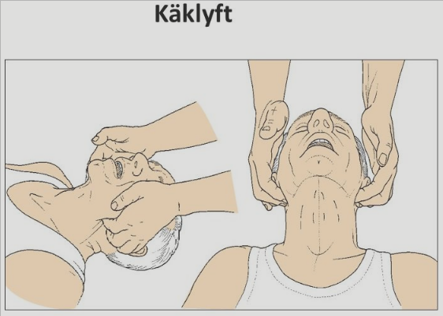
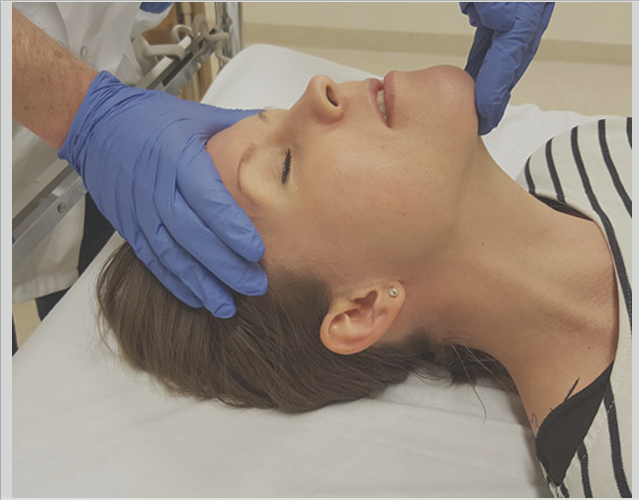

## Anestesi

### ABCDE chock

**Pres** 

1. 55åå man (osce) 
   1. högersidig hemikolektomi igår 
   2. mår idag sämre, trött, irritbel, dragit ut sin PVK 
   3. går ensam in i patientens rum 
   4. **Okontaktabar i säng** 
   5. **cyanotisk med snarkande andning** 

 

**Allmänt** 

1. Tänka på innan ABCDE 
   1. man vill inte missa **hjärtstopp!** 
   2. Tecken på skalltrauma: för att vara mer försiktig när man håller på 

 

**Handläggning** (osce) 

1. **Larma tidigt!** Har man ovan anamnes, med cyanos och snarkande andning, bör man absolut larma snabbt 

2. **ABCDE direkt** 

   1. **Airways** 

      1. **Tittar i munnen** 
         1. tång 
         2. **Sug** 
         3. luftvägsmanövrar 
         4. intubation . . . (vad skulle indikera detta dock, om man inte får fri luftväg med svalgtub kanske) 
      2. Utför haklyft *eller* käklyft 
         1. 
         2. 
      3. (Man frågar om snarkningar fortsätter) 
      4. **Svalgtub**: om medvetslös patient med airways problem (eller B problem iofs) 
      5. **Angiödem, slemhinnesvullnad** 
         1. Adrenalin: 0.5mg (1mg/mL) intramusk im 
         2. betametason 8mg 4mg/mL: effekt först efter ett antal timmar
         3. ! ***Högläge, höjd huvudända*** 
         4. **Intubationsberedskap** 
      6. **Indragningar av jugulum**: om man har en patient som försöker dra andetag men det inte går, men om man palperar över hals o känner hur indragningar sker, 

   2. **Breathing** 

      1. **Sätta på pulsoximeter** (orsak t att man behöver larma! för att man kommer inte kunna släppa patienten i andingsvägarna annars) 
      2. **Andningsfrekvens** 
      3. **Andningsrörelser** 
      4. **Andningsljud, auskultation**: rassel, ronki, förlängt expirium, perksussion 
      5. **Lyssna på lungor** 
      6. **Thoraxpalpation** 
      7. **Bröstkorg**: flail chest, subkutant emfysem 
      8. **Får reda på att saturation inte stiger**: **Påbörja maskventilation!** sätta på syrgas 
         1. 10-15L på mask med reservoar reservoir 
      9. Man ska **börja** ventilera patienten 
      10. Sat stiger till 95% 
      11. **Utesluta** 
          1. cyanos, 

   3. **Cirkulation** 

      1. **Palpera pulsar** 
      2. **Blodtrycksmanschett**: denna pat har 75/45 
         1. Tippad huvudända + ge vätska 
      3. **Perfusion**: perifert, centralt, kalla fötter, händer, konstringerad hud, blek, marmorerade, kapillär återfyllnad sternalt efter 5 sek tryck, återfyllnad p 2 sek 
      4. **Hjärta!** frekvens, regelbundet, oregelbundet, blåsljud avlägsna toner 
      5. **Två grova infarter, om ej möjligt intraosseös nål (90 sekunder på en att sätta PVKn innan intraosseös)** 
      6. **Sänk huvud, höjd ben** 
      7. **Iv: kristalloid vätska startbolus vid chock (som i detta fall)** 
         1. **Sätter 2 PVK** 
         2. **Ringer 500mL t vuxna, yani 1 påse.** 
         3. **Ringer 250mL t vuxna om kardiogen chock misstanke** 
      8. **Titta efter: halsvenstas, blåmärken, penetrerande skador** 
      9. **FAST** 
      10. **blodgas, blodprover** 
      11. **Överväg**: 
          1. Buk: uppenbart smärta, peritonit, distension, tecken på blödning, perforation, infektion 
          2. bäcken: instabil bäckenfraktur 
          3. ben: femurfraktur, ensidig uppenbart DVT vid misstanke om lungemboli 
      12. **Saker man kan se** 
          1. **Blödning:** tourniquet, vätskebolus, ring narkosjour direkt beställ blod, 
          2. **Arrytmi**: 
             1. brady: atrpin 0.5mg+0.5mg 
             2. Taky: defibrillering pulslös, medetslös misstanke VT VF 
          3. **Lungödem** 
             1. **hypertensivt**: Nitro, CPAP, furix, **hjärtläge** (sänkt huvudläge) 
             2. **hypotensivt**: inotropi, vasopressor, diuretika ev, ev mekanisk support (ECMO), ev ischemibeh revaskularisering arrytmikorrektion 
          4. **akut ischemi** 
             1. ASA bamyl 500mg + brilique ticagrelol 180mg 90mgx2 
             2. nitro + metoprolol 
             3. **EKG . . .** 
          5. **septisk chock** 
             1. blododla 
             2. iv vätskebolus, 
             3. syrgas 
             4. urinodling 
             5. lokalodling 
             6. blodgas 

   4. **Disability** 

      1. Nackstel 
      2. pupiller 
      3. ögonöppning 
      4. ögonrörelser 
      5. kroppställning 
      6. lateralisering 
      7. medvetandegrad: GCS 
      8. intrakraniell skada: NIHSS, hjärnstambedömning korneal reflex, dolls eye 
      9. ev trombolys, trombektomi, neurokirurgisk kontakt 
      10. kapillärt glukos (kmr med blodgas?) 

   5. **Exposure** 

      1. Tittar på kroppen. 
      2. Temperatur 
      3. Att man gör en PR 

       

### Luftväg

#### Svalgtub och näskantarell

"These airway adjuncts can be used in unintubated patients requiring ventilation. 

* The oropharyngeal airway should be inserted only in unconscious patients; otherwise, gagging and vomiting can be evoked. 
* The nasopharyngeal airway ***is better tolerated in somnolent patients***. The devices should be inserted carefully by trained personnel; lubricants ease insertion."

Alltså, svalgtub och näskanterell kan sättas på patienter med GCS under 8 exempelvis, om de upprätthåller en fri luftväg

***Fallbeskrivningar***

* Kvinna inkommer, åsknallshuvudvärk, kollapsar, krampar, GCS 3
  * Håller fri luftväg och snarkar inte
  * Då kan man sätta en ***näskantarell***. då den tolereras bättre jfr svalgtuben och enklare att sätta.

### Artärnål

Kan adderas med en sensor:

* Blodtryck och MAP
* Can provide insight into the adequacy of volume resuscitation through the ***measurement of systolic or pulse pressure variation***
*  The arterial line facilitates repeated measures of acid base status or lactate to assess the impact of treatment. 

## Trauma och ATLS 

### ATLS

**Allmänt** 

1. **A**dvanced **T**rauma **L**ife **S**upport 
2. är till för att så tidigt som möjligt identifiera saker som är direkt livshotande hos en trauma patient samt kunna handlägga och åtgärda denna 

 

**Handläggning** 

1. detaljerad patienthistorik behövs ej, följande ex behövs inte 
   1. allergier 
   2. hereditära sjukdomar 
   3. , etc 
2. because we need to be quick with initial management 
3. within less than a minute, should be able to estimate, if patient is sick or not. within 10 secs even.  

### ABCDE

**Call for help först, LARMA.** 

**Airways** 

1. säkerställa fria luftvägar standard sättet 
2. kontroll av halsrygg 
3. sätta en halskrage på patienten: detta har ifrågasatts 
4. Skydda halsrygg. 

 

**Breathing** 

1. andningsrörelser 
2. andingsfrekvens 
3. auskultation lungor 
4. mätning saturation 
5. cyanos 
6. perkussion 

 

**Cirkulation** 

1. yttre blödning, stoppa prehospitalt 
2. palpera pulsar 
3. perifer cirkulation 
   1. hudfärg 
   2. fuktig 
   3. kall hud 
4. palpera 
   1. buk 
   2. bäcken 
   3. lår 
   4. blödning, fraktur 
5. Koppla EKG 
6. mät blodtryck 
7. patientens medvetandegrad: detta borde hamna under D dock. . . 
8. eventuellt FAST på akutrummet 
9. skicka till röntgenavdelning 

 

**Disability** 

1. initial neurologisk evaluering 
2. kontroll medvetandegrad, upillstrokelk, reaktion satm extremitetsrörelser 

 

**Exposure** 

1. klä av patienten för fullständig exponering 
2. skydda adekvat, för att undvika nedkylinng, vilket **försämrar koagulationen** 

### Blödningar

#### hypovolem chock

**Pres** 

1. 17åå 
   1. knivhugg t höger buk, slag mot huvudet 
   2. BT 80/60 
   3. COR RR120 
   4. AF 20/min 
   5. v-sond, KAD, två grova infarter, fått 2L ringer, BT t 90 
2. 30åå kvinna 
   1. kört omkull motorcykl 
   2. hög fart 
   3. inkommer akuten 30 min efter olycka 
   4. oklar o omtöcknad under transport 
   5. smärta över bröst 
   6. stabila vitalparam 
   7. efter ABCDE 
   8. pat visar lufthunger, takykardi, hypotension 
   9. noterar halsvenstas, 
   10. inga andningsljud vänster sida 
   11. patient försärmas 
   12. BT nu 80/50 
   13. puls 140 
   14. FAST visar stor fri vätska i buk 

 

 

**Handläggning** 

1. **inleda transfusion åp pat** 
2. **gå direkt t op** 
3. det är viktigt att när man har en stark misstanke för interna blödningar, att man kommer skicka denna patient **direkt** till operationsrummet för **laparotomi** 
4. Det som är intressant angående detta, är att man kommer att göra en laparotomi för att utreda patienter. 
5. **det är fel med radiologi** 
6. fr ppt 
   1. bolus ringer-acetat 10-20mL/kg 
   2. beställ blod och plasma 
   3. ring kirurgen 
   4. FAST, ultraljud 
   5. DT? 
   6. operation? 
   7. drän x-hb 
   8. blodprover 
      1. lever enzymer, hjärtenzymer, koagulationsstatus, ROTEM BNP ammonium 
   9. Lung trg: hion har CVK, pneumothorax? 
   10. EKG 12 avledningar 
   11. angiografisk procedur 
   12. antibiotika? 

 

**Tecken** 

1. blekhet 
2. perifert kall 
3. medvetslöshet, GCS lägre 
4. hög puls takykard 
5. förhöjd andningsfrekvens 
6. anuri, oliguri 
7. konfusion 
8. lågt blodtryck 

#### Prioriterade blödningar

***Priade blödningar***

* Intraabdominella blödningar

***Oprioriterade blödningar***

* Subdural hematom, behöver ej åtgärdas direkt. 

### Brännskada

**Gradering** 

1. **Grad1**: Överhudsskada delhuddskada 
2. **Grad2**: Delhudsskada: ytlig och djup form 
3. **Grad3**: Fullhudsskada 

 

**Överhudsskada** 

1. Epidermal skada, enbart 
2. Stratum basale verkar vara intakt? 
3. innebär att man kommer att kunna regenerea sina keratinocyter. 
4. Fjällning kommer att noteras under läkningsprocessen 

 

**Delhudsskada** 

1. **ytlig superficiell del**: dermiepidermal gräns intakt, cirkulation och innervation intakt 
2. **djup del**: cirk och innervation inte intakt 
3. **Läkning**: stamceller fr intakta hårfolliklar kommer att migrera och repopulera cellytor för att kunna läka. 

 

**Fullhudsskada** 

1. subdermal brännskada 
2. nått subkutana fettetf 

 

**Skadeutbredning** 

1. i procent 
2. handflata = 1% 
3. man räknar delhudskador och djupare, inte överhudsskada 

 

**Akut Handläggning** 

1. **Anamnes** 
   1. fråga 
      1. hur har skada uppkommit 
      2. annan typ av trauma? 
      3. inomhus el utomhus 
      4. medvetslös haru varit? 
      5. aktuell kroppsvikt? 
2. ABCDE 
3. Airways 
   1. ***Sot runt munnen***: Detta är något som anmärks på ofta.
   2. hosta 
   3. ***stämbandsskada***: kan man få av den varma röken, giftig inhalerad rök? 
   4. **Misstänkt kolmonoxid förgiftning föranlägger akut intubation** 
4. Breathing 
5. Circulation 
   1. Väldigt viktigt att få reda på timdiuresen: patienten kan drabbas av hypovolemisk chock pga signifikant läckage av vätska och ödem. 
      1. diures borde ligga på 0.5mL/kg/h 
   2. stora infarter, canulas, och **varm** ringer direkt, räkna senare 
   3. **inga infarter i bränd hud** om möjligt!: antagligen för att kärlen är förstörda 
   4. checka hudcirkulationen (kapillär återfyllnad) 
   5. cirkulation av extremiteter: 
      1. speciellt cirkumferenta full thickness och elektriska skador 
6. Disability 
7. Exposure 

 

**Behandling** 

1. **Eskarotomi **(eskar betyder död vävnad): 
   1. brännskada berövar elasticitet, leder t kompromitterad cirkulation, andningspåverkan etc. 
   2. indikationer 
      1. cirkumferentiella brännskador över ex bål o extremitet 
   3. skär t frisk subkutis 
   4. täcker med koksaltdränkt duk 
2. **Skydd mot njurskada** 
   1. **myoglobulinuri**: Svår brännskada 
   2. eftersträvar en **1.5mL/kg/h diures** 
3. **Metabol acidos** 
   1. oftast övergående och behöver inte behandling. 
4. **Antibiotika** 
   1. misstanke kolonisering 
   2. vid multitrauma, endast eller påvisad klinisk infektion 
   3. Tetanus vaccination 
5. **Analgetika** 
   1. Inga NSAIDs 
   2. paracetamol, gabapentin, morfin, dressing' 

 

**Uppföljning** 

1. tills epitelisering. 

#### Kolmonoxid förgiftad brännskadepatient

**Behandling** 

1. Full syrgas 
2. beta2 agonister + antikolingerika (bricanyl/ventolin + atrovent) 
3. evt inhalationssteroider 
4. acetylcystein slemlösande 
5. ventilationsstöd: NIV, CPAP, biPAP, evt respirator 
6. tryckkammare: vid hög koncentration kolmonoxid 
7. antibiotika om misstänkta förändringar i lunga på röntgen 

### Buk

#### Icke penetrerande trauma

**Pres** 

1. 16åå man 
   1. kört omkull, trimmad moped 
   2. hade hjälp 
   3. styre i mage 
   4. ser blek ut 
   5. håller hänfer för mage 
   6. fullt vaken 
   7. svarar på tilltat 
   8. buk öm 
   9. ömmar i epigastriet 
   10. puls 105 
   11. BT 70/30 
   12. saturation 98% 

 

**Handläggning** 

1. mer anamnestiskt behövs 
2. Blodprover 
   1. Hb 
   2. amylas 
   3. blodgruppering 
   4. BAS-test 
3. Handlägg enligt ATLS 
   1. ABCDE ska göras, med primary och secondary survey . . . 
4. Grova infarter 
5. infusion: 
   1. kolloider och Ringer accepteras, 
   2. glukos accepteras ej 
6. DT-multitrauma sen t OP eller IVA 
   1. det som är skumt är just att patienten har ett så lågt BT, 
   2. jag förstår inte varför de inte tar detta seriöst. 

#### Penetrerande skada

**Pres** 

1. 18åå man 
   1. fallit mot armeringsjärn 
   2. skadat buken 
   3. vital stabila, AT gott 
   4. buk är adipös 
   5. helt mjuk, 
   6. palpöm över 2x2cm brett sår 
   7. såret lateralt om rektusskida, nivå med navel 
   8. ingen säker penetration av bukhåla, vid sondering 
   9. PR inget anmärkningsvärt 

 

**Handläggning** 

1. Om stabila parametrar och ingen peritonit 
   1. aktiv exspektans 
   2. frekvent undersökning av 
      1. vitalparametrar 
      2. buk 
      3. Hb 
   3. då tarmskada inte alltid inträffar vid penetration in i bukhåla. 
   4. operation som fördröjs några timmer, borde inte exponera pat för ngn öakd risk 
   5. negativ laparotomi medför för mga risker. 

 

 

**Radiologi** 

1. DT-buk med iv kontrast och rektal kontrast 
   1. påvisa kolonskada 
   2. aktiv blödning 
   3. fynd av stört relevans 
      1. kontrast-extravasation = aktiv blödning 
      2. hematom 
      3. fri gas 
      4. läckage av kontrast fr kolon 

#### Mjältruptur

**Allmänt** 

1. cirkulationsmässigt försörjs mjälten, splen, lien av 
   1. a lienalis 
   2. ventrikelns majorsida 
   3. grenar fr corpus cauda via pankreas 
   4. det finns alltså ingen större risk att mjälten nekrotiserar och dör, vid coiling eller embolisering av diverse kärl för att hindra akut blödning i samband med mjältruptur 

 

**Behandling** 

1. rupturerar mjälten kan man behandla via 
   1. endovaskulär **embolisering** 
   2. endovaskulär **coiling** 
2. **Ordinationer om splenektomerad** 
   1. analgetika 
   2. vaccin 
      1. pneumokocker 
      2. haemophilus 
      3. meningokocker 

### Dödsorsaker

**Allmänt** 

1. dödsorsaker hos trauma patienter innefattas av två törre grupper 
2. **Traumatisk hjärnskada**: 40-50% av pat i väst 
   1. ventilation slutar 
   2. ofta trafikskador 
3. **Blödning:** 20-30% av pats 
   1. gängvåld 
   2. vapen våld 

### Femurfraktur/höftfrakturer

**Pres** 

1. 62åå kvinna 
   1. fallit fr häst 
   2. blek 
   3. smärtpåverkad 
   4. sat 92% ppå 7L syrgas 
   5. AF 25 
   6. ont vä thoraxhalva, 
   7. höft o ben anar felställning 

 

**Handlägg** 

1. undersöka enl ATLS, 
2. syrgas 
3. vätska 
4. thoraxdrän 

 

**Behandling** 

1. **femur** 
   1. **i sträck alternativt** 
   2. **hare-splint** 

### Golden Hour

**Allmänt** 

1. **Trimodal** död, deaths 
   1. immediate death: 0 hours. flest dör här 
   2. early deaths: 2 hours, här är den gyllene timmen, the golden hour 
   3. late deaths, 2-3 veckor 

 

**Immediate** 

1. massiv hjärn laceration, 
2. hjärtskada 
3. hjärtruptur 
4. skada på större kärl 
5. blockerade luftvägar 

 

**Early deaths, golden hour** 

1. hemothorax 
2. blödning hjärna 
   1. subdural 
   2. epiduralt 
3. Rupturerad 
   1. splen, mjälte 
   2. lever 
4. bäcken fraktur 

 

**Sen död** 

1. Multi organsvikt. 

 

**Initial handläggning** 

1. ABCDE 
2. Airways 
   1. skydda luftvägarna 
   2. skydda cervikala ryggraden! 

### Thorax

#### Hemothorax, pneumothorax, trauma

**Pres** 

1. 25 åå kvinna 
   1. ramlat av häst 
   2. andas ganska bra med syrgas 
   3. puls o BT ok under transport 
   4. ont halsrygg, vänster thorax, vänster bäcken 
   5. fått 5mg morfin iv 
   6. ringer acetat 
   7. BT 110/70 
   8. puls 92 
   9. AFA 27, 
   10. sat 92%, trots 5 liter syrgas 
   11. god perifer återfyllnad 
   12. väldigt palpöm över vänster thorax 
   13. **generellt nedsatta andningsljud** 
       1. detta är mitt problem. 
       2. om vi misstänker att det förekommer hemothorax på vänster sida, bordedet finnas mer belägg än detta. . . 
2. 20åå man 
   1. bilolycka 
   2. sårskador huvud, 
   3. hematom på thorax 
   4. nackkgrage, spineboard 
   5. vital: håller fri luftväg sj, sat 75% med 15L syrgas på mask, puls 100, BT 100/70, dropp Ringer pågår, 
   6. sträcker vänster arm spontant, okontaktbar 
   7. dämpat andningsljus över hela vänster thorax 
   8. **Åtgärd**: sätta thoraxdrän, antagligen hemothorax. 

 

**Allmänt** 

1. verkar som att man kan i de akuta trauma fallen enl ATLS lägga in drän baserat enbart på hunch. 

 

**Risker** 

1. fortsatt blödning 
2. ventil pneumothorax 

 

**Handläggning** 

1. vänstersidigt thoraxdrän! . . . detta är den konstigaste delen tkr jag. 

#### Pneumothorax, ventilpneumothorax

**Pres** 

1. 25åå kvinna 
   1. inkommit efter brand 
   2. hoppat fr en balkong 1 våning upp 
   3. A: sot i munnen, intuberade 
   4. B: revbensfraktur vänster sida, övrigt ua 
   5. C: FAST, men plötsligt försämras, nu stiger puls plötsligt, BT sjunker 100 till 80. saturation 98% 90%, det har blivit svårare att ventilera patienten 
   6. **Handlägg:** reevaluera patienten, i.e. man börjar om på A. 
   7. **ventilpneumothorax** 
2. 30åå kvinna 
   1. kört omkull motorcykl 
   2. hög fart 
   3. inkommer akuten 30 min efter olycka 
   4. oklar o omtöcknad under transport 
   5. smärta över bröst 
   6. stabila vitalparam 
   7. efter ABCDE 
   8. pat visar lufthunger, takykardi, hypotension 
   9. noterar halsvenstas, 
   10. inga andningsljud vänster sida 
   11. **diff: ventilpneumothorax** 

 

 

**Handläggning** 

1. PVK intercostalrum 5 enligt nya ATLS (, eller 3-2 . . för att depressurize är gamla ATLS). man sätter ett **venflon / nål** 
2. sedan efterföljande thoraxdrän som långtidsbehandling 

## Fysiologiskt

### Hyperventilation

**Komplikationer** 

1. Sjunkande PCO2, som i sin tur leder till att man orsakar **vasokonstriktion** cerebralt. 
2. Fysiologiskt: Ökande PCO2 i kärl cerebrealt stimulerar vasodilatation (för att öka flödet till omrdåen som metaboliserar mer, antar jag). Generellt sjunkande partiella tryck koldioxid leder till att mna kommer att få vasokonstriktion. 

### Muskarin receptorerna

Muskarinreceptorerna som aktiveras av acetylkolin har många olika effekter i kroppen:

- Luftvägarna:
  - Glattmuskelcellskontraktion

### Chock

#### Distributiv

* Septisk chock
* Pankreatit
* Svåra brännskador
* Anafylaxi
* Neurogen chock
* Adrenal kris
* Endokrin chock

#### Obstruktiv

* Ventil pneumothorax
* Hjärttamponad
* Konstriktiv perikardit
* Lungemboli, LE
* Aortadissektion

#### Kardiogen

* Hjärtinfarkt
* Myokardit
* Arrytmi
* Valvulär
  * Svår aortainsufficiens
  * Svår mitralininsufficiens

#### Hypovolema

* Hemorrhagisk
  * traumatisk
  * GI blödning
  * Rupturerad ektopsik graviditet
* GI förluster
* Brännskador
* Polyuri
  * Diabetes ketoacidos
  * Diabetes insipidus

| Typ av chock | Centralt ventryck | Pulmonary capillary wedge pressure, PCWP | Cardiac output | Systemisk vaskulär resistens |
| ------------ | ----------------- | ---------------------------------------- | -------------- | ---------------------------- |
| Hypovolem    | NER               | NER                                      | NER            | UPP                          |
| Distributiv  | NER               | NER                                      | UPP            | NER                          |
| Kardiogen    | UPP               | UPP                                      | NER            | UPP                          |
| Obstruktiv   | UPP               | UPP/NER                                  | NER            | UPP                          |

### Hypovolemi

#### Traumatisk

Trauma is the number one cause of death in the United States for individuals between 1 and 44 years of age. Among them, hemorrhagic shock is the primary cause of death for 30% to 40% in the first 24 hours following injury. 

* Loss of blood triggers a compensatory hemodynamic response to restore volume. 
* The compensatory mechanisms click in when there is acute blood loss of more than 5% to 10%. 
* Blood losses of greater than 20% will ***require fluid resuscitation to support the continued delivery of oxygen to vital organs***.[[3\]](https://www.ncbi.nlm.nih.gov/books/NBK534791/#)
* Trauma and acute blood loss trigger compensatory mechanisms aimed at restoring volume deficits to maintain adequate perfusion of vital organs. 
  * ***Trans-capillary refill*** occurs first and involves the shift of fluid from the interstitial space into the intravascular space secondary to increased capillary permeability and decreased plasma colloid osmotic pressure. 
  * The resultant effect is the sequestration of about 1 liter of fluid into intravascular spaces.
  * ***Activation of the renin-angiotensin-aldosterone system occurs next***, activated by the reduction in renal perfusion and causing sodium and water retention by the kidneys.

***Resuscitation i detta fall***

The overall goal is to replace the ***fluid lost from the interstitial compartment to the intravascular spaces***. But one must exercise caution, because an aggressive large volume fluid resuscitation may lead to hypothermia, acidosis, and coagulopathy.[[3\]](https://www.ncbi.nlm.nih.gov/books/NBK534791/#)[[4\]](https://www.ncbi.nlm.nih.gov/books/NBK534791/#) Typical indications for resuscitation are a systolic blood pressure of less than 80 to 85 mm Hg or one that is rapidly decreasing and/or a decline in mental status without evidence of head trauma.[[4\]](https://www.ncbi.nlm.nih.gov/books/NBK534791/#)

Behandlingsstrategier

* Permissiv hypotension hos blödande patioenter: MAP 80 eller 90
  * Kan ge bolus 250mL RA
  * Tills att man uppnått hemorrhagisk kontroll på patienten
* Crystalloids should ideally serve as a bridge to maintain perfusion until ***blood products are available in hemorrhagic shock.*** 
  * Hence, one should consider limited 500-ml bolus doses in patients without or impending shock until blood products become available

### ! Syretillförsel, syrgastillförsel

Oxygen delivery (DO2). Determinanter av DO2

* **DO2 = CO x CaO2**
  * Cardiac output
  * Arterial oxygen content
* **CO = HR x SV**
  * Heart rate  or Heart frequency
  * Stroke volume
* Stroke volume $SV\alpha (Preload\times Contractility)/SVR$
  * **preload**: myocardial fiber length before contraction (endiastolisk volym i ventrikeln)
  * **afterload** (systemic vascular resistance, SVR): the force against which the ventricle contract
  * **cardiac contractility, kardiogen kontrakitlitet**: ability of ventricle to contract independent of preload and afterload
* CaO2 = (Hb x 1.39 x SaO2)+ (PaO2 x 0.03)
  * Oxygen carried by ***convection*** with hemoglovin and oxygen dissolved in blood

En sjukdom som påverkar dessa HR, preload, contractility, SVR, SaO2, or Hb) 

### Volym resuscitation

Initial volume resuscitation has the aim of restoring tissue perfusion and is crucial to optimal shock therapy. 

* Assessment of current intravascular volume status and determination of the optimal amount of volume resuscitation are challenging. 
* The physiologic goal of volume resuscitation 
  * ! is to move the patient ***to the nonpreload-dependent portion of the Starling curve***. 
  * Most patients with any of the four shock types will benefit from an increase in intravascular volume.

More recent studies have demonstrated that targeted resuscitation using invasive monitoring is not required, but in all of these studies patients in the “usual care” arms of the study received early initial volume resuscitation. 

***Sepsis***

For patients with suspected septic shock, a minimum of 30 mL/kg is recommended by the Surviving Sepsis Campaign. 

***Kardiogen***

While the need for volume resuscitation is ***most apparent for patients with distributive or hypovolemic shock***, even patients with cardiogenic shock may benefit from cautious volume replacement. In these patients, there should be a careful assessment of volume status prior to volume administration

#### Process

* In cases of massive transfusion, platelets and fresh frozen plasma should be provided 
  * to offset the dilution of these components during volume replacement. 
* Because hemoglobin is a key determinant of CaCO2 (Arterial oxygen content), red cell administration may be a part of volume replacement even without hemorrhage in order to optimize [oxygen](https://accessmedicine-mhmedical-com.sll.idm.oclc.org/drugs.aspx?GbosID=131723) delivery if hemoglobin content is <7 g/dL.

