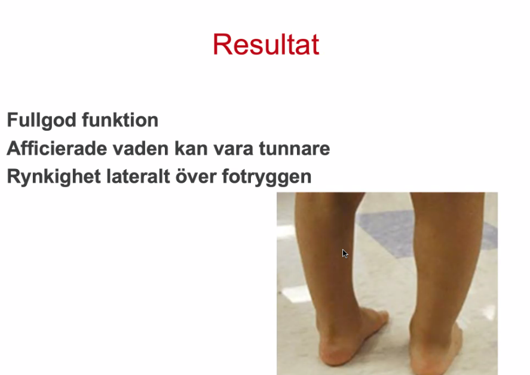

# Barnkirurgi
Instruktioner: Fundera på lämpliga frågor till föräldrarna, möjliga differentialdiagnoser, vad du bör undersöka och hur du kommer vidare i diagnostik och behandling. Tänk på hur barnets ålder påverkar både troliga diagnoser och symptom. 

Barnkirurgiska fall: Fall 8-10 är stöd för er inläsning, genomgång av dessa fall finns som filmer i Canvas och kommer ej tas upp på seminariet.

### Fall 1 - pylorusstenos

1. ***Per, 6 veckor gammal, har kräkts alltmer efter amning den senaste veckan. Sista dagarna verkar all mat komma upp igen. Han har gått ner i vikt sedan den senaste BVC-kontrollen.*** 

**Frågor:** 

- Hur mycket har Per kunnat behålla? Hur ofta kräkningar? Hur mycket? Varje dag? 
- ***Vilken färg*?**: Detta kan användas för att diffa kräkningens origin är, blodigt, huruvida det är galla. 
  - det är bara mat som kommer upp
- Haft diarré? Hur är avföringen? + mängd. 
- Miktion? (Haft avföring?? Blod i avföringen?)
  - reagerat att under dagen att blöjorna är väldigt torra
- Feber? Andra infektionstecken (utslag, illaluktande urin, nackstelhet och slöhet …). Epidemiologi?
- Hur mycket gått ner i vikt? 
- Verkat missnöjt/haft ont vid kräkning? (eller i övrigt - verkar ha ont? Kommer smärtorna i intervaller eller hela tiden?)
- Kaskadliknande kräkningar? (typiskt för pylorusstenos)
- Aptitförändring?
- Helammas? Ersättning?
- Trauma?
- Fått erytromycin nyligen 10 ggr ökad risk ca (behandling vid kikhosta)? Rotavirusvaccin? (riskfaktorer för pylorusstenos)
- Hereditet (hirschsprung ossanlikt, pylorusstenos)
- Gestationsålder? Hur gick födelsen till? Komplikationer?
  - född normalt
  - ingen gestationsålder?
- barnet helammas

***Diffar***: 

- ***pylorusstenos*** (orsakas av en hypertrofi av muskeln som reglerar nedre magmunnen. Kaskadkräkningar, kön, färgen på kräkningar, åldern, hereditet, glupsk)
  - rätt ålder
  - pojke vanligare hos
- ***överskottskräkningar*** (inte typiskt med kaskadkräkning, inte troligt då “all” mat verkar komma upp, ska inte gå ner i vikt)
  - barnet får dock upp allt i dessa kräkningar
  - barnet ska ej ha viktnedgång heller
- ***infektiös gastroenterit*** 
- ***GERD*** 
- ***allergi mot komjölksprotein***
- ***esofagusatresi*** (brukar debutera mycket tidigare, opereras första dagarna efter förlossningen)
- ***Tarmatresi*** (barnet skulle vara yngre vid debut). 
- ***Mb Hirschsprung***
- ***Appendicit*** 
- ***Invagination med tarmischemi***: mindre sannolikt denna patient för att den är hungrig o grinig, interiktigt indicerat
  - ***tecken på smärta***
  - ***kommer o går i intervaller***
- ***Inklämt ljumskbråck***
- ***UVI*** (kan debutera med kräkningar, viktnedgång och ofta feber men inte diarré. Viktigt att diagnosen säkerställs med urinodling av rent urinprov.
- (Förhöjt intrakraniellt tryck)

Spädbarn med misstanke om UVI bör remitteras akut till barnläkare).

**Undersökning:** 

- Till akuten. ABCDE. Kan vara ordentligt dehydrerad (chockbild?)!
- Status (AT + hydreringsgrad, hjärta + pulser + kap refill, lungor + andningsmönster, buk, reflexer, inspektion av yttre genitalia + blöjinnehåll). + KLÄM efter resistens i höger övre kvadrant (“oliv”) (2 av 25 känner man en palpabel oliv på akuten)
  - kolla i ljumskar 
  - utvärderar dehydreringstecken
  - i detta fallet ingen knöl eller ingen ömhet i buken som man kan se. 
- ***Blodprover:*** 
  - ***blodstatus,*** 
  - ***elstatus,*** 
  - ***venös gas*** 
    - (hypokloremi, hypokalemi, alkalos → kräks upp saltsyra), 
    - vid kräkning av HCL så förlorar man pH och kloridjoner, 
    - leder till hypoklerm alkalos
  - ***CRP***

**Vidare diagnostik:** 

- Om misstanke om pylorusstenos (eller flera andra diffar och/eller akut dehydrering?) 
  - ska remitteras akut till barnklinik. 
- Pylorysstenos diagnostik:  
  - ***UL för att bekräfta pylorusstenos:*** 
    - man mäter upp dimensionerna och
    -  ser en förtjockning 
    - ser en förlängning av pylorus
    - Diagnostiken görs med UL vid pylorusstenos.
    - Ganska bra visualisering.
  - ***(2:a hand ventrikelpassage)*** : görs i praktiken inte, man gör den om det krånglar efter att man opereras för pylorusstenos, då är det läge att göra den. 
    - kan sätta in en sond och spruta in kontrastmedel i ventrikeln (+ genomlysning)

**Behandling:** 

- ***Inläggning och rehydrering iv.*** 
- ***Om chock***: rehydrering med R-A 20 ml/kg bolus + 5% av kroppsvikten på 4h (NaCl).
  - rehydreringen för 4kg: 5% av 4kg över 4 timmar = 200mL 
  - Efter 4 h re-evaluera patienten. Kan behöva ge mer vätska. 
- ***Korrigering av syra-basstatus***. 
- ***Underhållsbehandling***: 100mL/kg/d, plasmalyte 5% 
- ***operation***: i form av *pyloromyotomi*.
  -  Barnet ska vara fastande och ventrikelsond sätts. 
  - Denna hålls öppen och kopplad till påse (som läggs på golvet) 
  - sond för dränering av magsäcken för att förebygga okontrollerade kräkningar.” 
  - Vid pylorusstenos använder man generellt NaCl vid rehydrering!
- Efter op får barnet börja trappa upp födan. 
- Bra prognos, man är “botad”.

https://www.internetmedicin.se/behandlingsoversikter/pediatrik/infantil-hypertrofisk-pylorusstenos/ 

***Etiologi o patofysiologi***

* Det är pylorusmuskeln som är kontraherad, varpå att man får en stenosering. 
* Den är inte en medfödd sjd, den kommer vid 3-6 veckor, iaf de flesta har fyllt minst 2 veckor
  * man har ultraljudat tusentals barn efter födsel o följt de, noterat att det är inte
* uduioatusj genes, man vet inte varför de får: inslag av ärftlighet. 
* relation med erytromycin: för att erytromycin har en påverkan på peristaltiken att det kan öka risken för pylorusstenos.

#### Take home - Pylorusstenos: 

* ***INTE gröna kräkningar***
* Pojkar: flickor 5:1
* ***Ärftlighet:*** Kan finnas ärftlighet
* ***Tid:*** Förekommer endast under första levnadsmånaderna (typiskt 2-8 v ålder) Metabol hypoklorem hypokalem alkalos
  * kan inte förekomma i atypiska fall utanför åldersspannet,
  * det förekommer under första levnadsmånederna
  * har man en bebis som kräks några månader in på sitt liv != pylorusstenos, kom ihåg d osså
* ***Diagnos***: UL
* ***Akut åtgärd***: rehydrering och korrigering av elektrolytrubbningar
* ***Dagtid:*** Op först när ovanstående är under kontroll (opereras dagtid). 

### Fall 2 - invagination

1. Eliza är 4 månader gammal 
   1. och fick rotavirus-vaccin förra veckan. 
   2. Hon har varit gnällig i en timme. 
   3. Föräldrarna uppfattar det som buksmärta.
   4.  Smärtorna kommer i intervaller, däremellan är hon helt stilla. 
   5. Kräkts flera gånger. 

**Frågor:** 

- Kräkts hur många gånger och hur mycket? Utseende? 
- **Färg på kräkningarna?**
- Haft avföring, vilken konsistens, hur mycket +slem, blod? Gas? Miktion - hur mycket?
- Infektionstecken?
- Debut och duration av symtom, allmänpåverkan. Kan barnet äta/dricka? 
- Viktnedgång? 
- Tidigare sjukdomar: Sjukhusvård? Opererats tidigare? Medicin? Allergier? Gestationsålder? Hur gick födelsen till? Komplikationer?
- Ärftlighet?
- Epidemiologi? 

**Diffar:** 

- ***Tarminvagination*** 
  - ***talar för:*** 
    - ***intervallsmärta***: typiskt 
    - åldern: 3mån-2år
    - rotavirusvaccin: det är inte många invaginationer som man kan skylla på vacciantion, så det är lite oklart. 
      - det är mga som kmr t akuten med buksmärta + rotavaccin står i liggaren, som man utreder för invagination i så fall
    - ***Kräkningar kan förekomma***: osepcifika kräkningar osså (behöver ta lite tid för att barnet får stopp tillräckligt mkt för att man får ileus kräkningarna ya3ni)
    - ***Avföringen:*** 
      - Blod eller blodtillblandat slem i avföringen förekommer, men är ofta ett mycket sent tecken - uppkommer när det blivit ischemi. '
      - slemmigt geleaktig avföring: det ska ha hunnit utvecklas en ischemi
      - I detta fallet så pass tidigt förlopp att avföringen är okej på morgonen
      - men 12-14 timmar senare att avföringen: blodig, slemmig
    - Det lömska med invagination är att symtombilden kan avvika från denna typiska beskrivning.”). 
    - Vanligare efter rotavirusvaccinering
    - intervaller blir slöa och tappar i intervaller
    - virusanamnes: viros som kan ge invagination
    - tidig. anamnes vad gäller invagination: invaginiationerna kan recidivera och komma tillbaka. 
- *Appendicit* 
  - (“kan finnas även hos spädbarn och mycket små barn. 
  - Sjukdomsbilden är, framför allt hos barn < 5 år, ofta atypisk och svårtolkad.”) 
  - intervallkaraktär och ålder talar emot. 
- Ileus 
  - (talar för: intervallsmärta, kräkningar,
  - talar emot: ej gröna kräkningar)
- “Tonsillit, otit, pneumoni och urinvägsinfektioner, liksom också diabetes och Henoch-Schönleins purpura kan företrädelsevis hos förskolebarn och yngre inte sällan ge buksmärtor utan så mycket andra fokala symtom.”
- Spädbarnskolik
- Inklämt bråck
- biverkan till rotavirusvaccinet 
  - (“kan orsaka lindriga symtom som påminner om rotavirusinfektion. Det är vanligt att barnet får diarré, buksmärtor och eventuellt även kräkningar. De flesta biverkningar är milda och övergående. En mycket sällsynt biverkan efter rotavirusvaccination är tarminvagination. En liten ökad risk för tarminvagination har observerats i några studier och detta framför allt under den första veckan efter första dosen”)
- Celiaki (lite ung för det), inflammatorisk tarmsjukdom och infektiösa enterokoliter. Gastroesofageal refluxsjukdom, esofagit, ulkus’
- Förstoppning.
- // volvolus ger gröna kräkningar: kräkas grönt ganska tidigt, för att det är ett högt hinder, inte fallet med invagination, så det tar lite tid

**Undersökning:** 

- Status (AT + hydreringsgrad, hjärta + pulser + kap refill, lungor + andningsmönster, bukstatus + inspektion av ljumskarna, reflexer, inspektion av genitalia + blöjinnehåll). 
- Blodprover: blodstatus, elstatus, venös gas, CRP, blodgruppering/BAS
  - inga bra blodprover för invagination 
- // per rektum gör man ej. 
- ***vad gäller invagination:*** i höger fossa kan man känna resistens, tecken ileocaekal stopp. 
  - ileokolisk invagination, att det är ileum som matats in i kolon,
  - varpå man ser denna bild. 
  - invaginationen kan vandra igenom hela kolon. 
  - de flesta invaginationerna är man diagnosticerar med RTG är i högerkolon eller transversum., men kan gå hela vägen

***etiologi och patofysiologi***

* att invaginerad tarm får ischemi och inklämd, varpå venös cirkulation manglat, och man får hyperemi, ischemi, svullnad etc. 

**Vidare diagnostik:** 

- ***UL (kan se invagination) buk primärt,***: det är detta som diagnosticerar det hela. 
  - donut-sign. 
-  ***sedan BÖS som tillägg*** (beställ båda, BÖS kan visa fri gas, obstruktionsgrad, mjukdelsförtätning). 
  - ***fri gas: viktig detalj för att diffa om perforation nekros tarmväggen.*** 
- ***Om man misstänker invagination*** 
  - ska man beställa både och! UL är diagnostisk metod, ser tarm som invaginerat. Kirurgerna vill ha BÖS också för att se fri gas, nedsatt cirkulation, förtätning där invaginationen finns. Fingervisning för att kunna se om det blivit en fulminant ileus. 

**Behandling:**  

- ***Initialt:*** röntgen kan skicka tillbaka patienten så att man gör följande innan vidare reponering:  
  - stabilisering,
  - rehydrering, 
  - smärtstillande ges med morfin i regel. 
- ***Reponering med kolonröntgen:*** 
  - Reponeras med kolonröntgen primärt (kontrast från ändtarmen), 
  - 80% blir bra på detta sätt. 
  - Om misslyckas, akut operation, ofta laparotomi alt laparoskopi i 2a hand. 
  - Går till enligt följande: 
    - Patienten är på genomlysning, 
    - droppåse med kontrast mellan skinkorna 
    - trycker på påsen och får högt tryck och får på så vis upp kontrasten uppför kolon
    - ***Mekaniskt:*** att man försöker trycka tillbaka invaginatet. 
    - man vill se kontrast i ileum
    - Kontrasten tuggar tills det hamnar toppen eller änden av invaginatet
    - ***Om det inte går med kontrast-metoden och barnet mår bra,***: e(j tecken på peritonit) 
      - då försöker man igen efter en paus på akuten med uppvätskning. 
    - I vissa fall kan man försöka 3 ggr.
- ***Om op***, bör ha postop ab + uppföljning. 
  - kmr behöva ytterligare lite vätska
  - rädd för att invaginatet går i nekros
  - inte springa t op, men det ska ske akut. 
  - Operationerna brukar göras akut, även på natten. 
  - Vill inte låta det stå med risk för nekros. 
  - Vanligast att man gör en öppen operation. 
  - Lap- risk att man orsakar skada och perforation med hårda verktyg. 
  - Med händerna kan man mjölka ut invaginationen. 
  - Om tarmen är mkt mörk/svart då krävs tarmresektion. 
  - Viss mörknad är ok. 
- Informeras om ökad risk för ileus/invagination i framtiden. 
- ***Lyckad reponering:*** observera barnet på akuten kan äta o dricka, efter det kan de hå hem
  - informera päron att det är risk att barnet får det igen
  - om det varit blodig avföring etc, då inläggnign + obs
  - men allra flesta fall som reponerats med kolonröntgen kan gå hem efter.

https://www.internetmedicin.se/behandlingsoversikter/kirurgi/invagination-hos-barn/ 

Rotavaccinet ger en mkt liten riskökning för invagination. Men många barn får vaccinet vilket gör att fler får invagination. Kan också få buksymtom som biverkan vid vaccinationen. Många söker därför med bukbesvär.

Ju längre det står → mer påverkad cirkulation → tilltagande stopp → fulminant ileus. Invagination hittas ofta i transversum, men kan teoretiskt gå till rektum. 

***När utreda för ledande punkt***: med ledande punkt är det 

* Om svårt att få loss eller de som kommer tillbaka gång på gång, eller atypisk ålder
* om ej lyckas reponera. 
* ***Gör en laparoskopi för att se om det finns en orsak.*** 
* Känner då genom hela tarmen. 
* Hos äldre barn (när åldern inte är typisk). 
* ***Ledande punkt kan vara*** 
  * ex Svullna lymfkörtlar, 
  * meckels divertikel 
  * mm.

* ... fatta

#### Take home message - Invagination: 

* Ileokolisk invagination vanligast (ileum har invaginerat in i colon)
* mest typiska symptom: Intervallsmärta
* Blod i avföring (röd vinbärsgelé) senare i förloppet
* Typisk ålder 3 mån-2 år men kan förekomma i alla åldrar
* Diagnostik: BÖS + UL
* Kolonröntgen för reposition (obs! Vätska och smärtlindring!)
* Recidiv förekommer (ca 5%) 
* Oftast ej ledande punkt: e.g. meckels divertikel eller svullna lymfkörtlar. 
* I vissa fall kan man känna en utfyllnad vid bukpalpation. 
  * Blod i avföringen pga ischemi i mucosan som är känslig och börjar blöda. 

Oftast idiopatiskt men kan finnas ledande punkter. Riskfaktor är också nyligen genomgången infektion. 

### Fall 3 - ljumskbråck

1. Leif, 3 månader, har de senaste veckorna haft en knöl i höger ljumske som kommer och går. När du ser honom på mottagningen känner du ingenting konstigt. 

**Frågor:** 

- När det kommer och går? 
- ***Värre när krystar eller gråter***? 
- Har föräldrarna sett något på andra sidan? (Kanske föräldrarna har t o m bild på detta)
- Gestationsålder? (Prematuritet riskfaktor för ljumskbråck)
- Ärftlighet?
- ***Smärta? (inklämning?) mkt viktig fråga!***: tecken inklämning. 
- Avföringar?
- Kräkningar?
- Förlossning? BVC?
- Föräldrar bekräftar
  - det buktar när han skriker gråter sen försvinner

**Diffar:** 

* *ljumskbråck*, 
* hydrocele (talar emot; kommer och går), 
  * väldigt vanligt hos spädbarn
  * ligger som en vattenballong brevid testikeln
  * 
* testikel som ej vandrat ner, 
* medellinjebråck, 
* navelbråck (osannolikt i höger ljumske), 
* rektusdiastas (osannolikt till höger i magen - oftast i medellinjen), 
* förstorad lymfkörtel: svullna lymfkörtlar

* ***Detta är ett ljumskbråck inte hydrocele i bilden:*** 
  * man kan se högre upp att det är svullet utputande också
  * genomlysning kan man använad för att diffa hydrocele mot bråck: ljumskbråck och tarm i bråcksäcken kommer ljuset mattas av och inte klar ballong
    * men kom ihåg att man kan lura sig, om det är tunnväggig spädbarnstarm att det lyser upp
  * man ser att svullnaden kommer uppifrån, så det är ett ljumskbråck och inte isolerat hydrocele. 

**Undersökning:** 

* Om ljumskbråck, 
  * klinisk diagnos: Silk glove sign (tom bråcksäck är glidig (glatta ytor mot varandra) - men låg känslighet på detta test, undersök i “stående” och “liggande”. 
  * Känn om kulorna är på rätt plats. 
  * Kan känna över funikeln och se om det är breddökat. 
  * ***Fråga om det kommer mer när barnet krystar/gråter/skratta**
  * Om barnet är äldre kan man be barnet att hoppa, krysta mm. 
  * fråga om de har en bild på det.
* Om hydrocele, genomlysning med ficklampa). 
  * Genomlysning med ficklampa är inte 100% på barn. 
  * Kan bli lurad.

**Vidare diagnostik:** 

* Om det är tydligt att det är ljumskbråck (blir värre när krystar/gråter)
*  går det bra att gå vidare till op utan bilddiagnostik (enl internetmedicin)

**Behandling:** 

* ***Ljumskbråck***
  * Opereras alltid på barn, 
  * öppetstående processus vaginalis som inte kommer sluta sig själv och det finns inklämningsrisk tills sluten. 
  * Dom som oftast får inklämning är spädbarnen, de opereras inom 2-3 veckor om besvärsfria. 
  * Större barn opereras inom 3 mån. 
  * Om haft besvär, op inom några dagar. 
  * Mindre/enklare op än hos vuxna.
* ***Inklämt ljumskbråck:*** 
  * smärtlindra med morfin, 
  * högläge under rumpan och försök reponera. 
  * 90-95% av fallen lyckas man reponera. 
  * Om misslyckas, akut operation. 
  * Testikeln kan också ta skada på testikeln (inklämda bråcket trycker på funikeln). 
  * Hos flickor kan ovariet falla i bråcket. 
* 90-95% kan man reponera tillbaka på akuten: har man haft ett misstänkt inklämd och lyckats reponera kan man skicka hem pat på permission för att operera de semiakut. 

***Etiologi och patofysiologi***

* När kulan gör vandringen, drar den med sig en del av peritoneum, som är i förbindelse med bukhålan
* det är normalt att den nedbuktande säcken klistrar ihop sig och inte förbindelse bukhåla
* men om säcken står öppen, och det är en vid öppning, kan det trilla ned tarm eller ovarier för en flicka
* om det är en tunn tunn förbindelse kan det sippra ned vätska
  * antingen kommunicerande ,att det är upp o ner
  * eller en vattenballong och det klistrar uppe så är det ett icke kommunicerande hydrocele
* Därför ljumskbråck + hydrocele kusiner. 
* man kallas säcken som buktar ned *processus vaginalis*

Ljumskbråck är en klinisk diagnos.

Hydrocele: finns chans att det läker ut- avvaktar tills några års ålder. Kan inte hända något farligt vid hydrocele (till skillnad från ljumskbråck).

#### Take home message Ljumskbräck: 

Mekanism : öppetstående processus vaginalis

Pojkar: flickor 5-10:1 

Bilateralt 10-15%

Prematuritet är riskfaktor

Högst inklämningsrisk i spädbarnsåren

Inklämt bråck: smärtlindring, högläge, reponering

Både tarm, testikel/ovarium kan skadas vid inklämning 

Hydrocele och ljumskbråck har samma etiologi men olika diameter på gången (processus vaginalis). 

### Fall 4 - meckels divertikel

1. Tore, 18 månader, har sedan två dygn bajsat färskt rött blod. Föräldrarna beskriver att det kommit väldigt mycket blod. Tore verkar må ganska bra och har inte ont. 

**Frågor:**

- Kräkts?
- Äter/dricker?
- Feber?
- Gestationsålder?
- Komplikationer graviditet/födelse
- Hereditet för kongenitala defekter?
- Hur mycket blod? Blandat med avföring eller avsides? 
- Bröstmjölk eller ersättning?
- Allmäntillstånd?

**Diffar:** 

* ***Meckels divertikel:*** 
  * “En massiv, anemiserande, rektal blödning på ett i övrigt friskt barn beror oftast på en **Meckels divertikel**. 
  * “Denna blödning ter sig ofta som en melena, d.v.s. avgång av lös, mörkröd till tjärfärgad, illaluktande avföring. 
  * Den svarta färgen orsakas av att blodet kommit i kontakt med saltsyra. 
  * Andra, men betydligt ovanligare orsaker, kan exempelvis vara kärlmissbildningar i tarmväggen.” 
  * Riklig blödning, 
  * ***ej så mkt smärta*,** 
  * åldern talar för.
  * ***Lågt Hb***: kommer ofta in med ett lågt Hb
* “Den rektala blödningen vid **invagination** är ett delfenomen bland andra symptom. 
  * I de sällsynta fall av invagination, där såväl intervallsmärta som kräkning saknas, finner man ett barn med en påtaglig slöhet förutom blödningen.”
  * borde ha ont för detta
* Om föräldrarna överdriver: “Orsaker till små blödningar hos i övrigt friska barn är exempelvis **analfissur, analprolaps eller rektal-/kolonpolyp**, som berörs nedan. Hos spädbarn torde den vanligaste orsaken vara komjölksallergi.”
* “En analfissur är en spricka i slemhinna/hud vid analöppningen. Tillståndet är förhållandevis vanligt hos barn. Det kan ses vid såväl förstoppning med hård avföring som vid diarré. Patienten känner en smärta analt vid defekation och vid beröring. Defekationen kan vara förknippad med en mindre blödning. Blodet, som är »färskt« rött, ligger utanpå avföringen. Det kan komma någon droppe i toalettstolen och även komma på toalettpappret.”
* Hemorrojd (förstoppning vanligt vid hemorrojder, analfissur): Barn kan ha hemorrojder. 
* Rektalpolyp/isolerad juvenil polyp (lite för ung, evt för mycket blod)
* Gastroenterit, hemorrhagisk gastroenterit
  * infektionstecken
  * epidemiologi
  * diarré
* IBD, Henoch Schönlein
* proktit

**Undersökning:** 

- Blodstatus (Hb, LPK), 
- Venös blodgas. 
- koagulationsprover, 
- BAS-tet, blodgruppering:  (kan behöva transfusion. Hb-gräns ca 100). 

**Vidare diagnostik:** 

- Vätska + blod
- ***Laparoskopi:*** Endast laparoskopi är diagnostisk 
- (ej Meckel-scint): ej 100% känslighet, för att blödande barn, vill man ha ngt att titta efter för att vara säker. 

**Behandling:** 

- transfusion: lägger gränsen på Hb 100, för att patienten har en pågående stor förlust, behöver inte vara jätteanemisk för att vi ska välja att behandla honom. 
- Resektion: man tar bort meckeln hetl enkelt

***Etiologi och patofysiologi***

* ***Blödning*** är den vanligaste komplikationen hos barn, via ulcus
* ***Andra komplikationer***: 
  * ***inflammation,*** 
  * ***invagination***: kan vara en ledande punkt för invagination. 
  * ***ileus:*** att meckeln lött fast mot bukväggen, utgör en brid, och orskar ileus. inte vanligt

#### Take home messages - Meckels divertikel: 

Komplikationer: 

- Ulcus (blödning)

- - Riklig blödning (anemi). 
  - Diagnostik: laparoskopi

- Inflammation: 

  - diffdiagnos till appendicit 
  - liknar en appendicit, ter sig som en appendicit
  - opererar man en appendicit och ser en frisk appendix, då ska man bläddra 1meter tunntarm för att hitta en meckels divertikel

- Ileus

- - Brid
  - Ledande punkt för invagination

### Fall 5 - hirschprung 

1. Benny var fullgången när han föddes för snart snart tre dygn sedan. Han har ännu inte passerat mekonium. Senaste dygnet har han börjat kräkas. 

**Frågor:** 

- Hur gick födseln?
- Hereditet för Hirschsprungs sjukdom?
- Hur mycket kräk? Hur ofta? *Färgen??*
- Allmäntillstånd? Otröstlig?
- Uppspänd buk?
- Födointag? (bröstmjölk?)
- Viktuppgång?
- Svullen mage?
- ***Titta efter anus-öppning:*** ingår i rutinundersökning att man ska titta att det finns en analöppning och kan sondera i den
- inte kommit barnbäck: mekonium

**Diffar:** 

- *Hirschsprungs sjukdom*:
  - saknar ganglieceller i kolon
  - peristaltiken inte fungerar i kolon
  - varpå fastnar ngnstans
- *Tarmatresi*: avbrott i magtarm röret, 
  - atresier kan sitta i matstrupen: esofageal atresi
  - anal atresi: uteslutit denna för att man tittat i rumpan
- Gastroenterit - infektiös
- Ileus
- Esofagusatresi (presenterar på ett annat sätt), analatresi (titta på rumpan)
- INTE invagination: finns ingen smärta

* detta är ett ganska distalt stopp, för tt det är fyllt med en massa dilaterade tarmar, 
* att det är ändå ett distalt stopp. 

***mikrokolon*** - tarmatresi, en helt annan patient

* mikrokolon att det blivit underutvecklat, typiskt när det varit en tarmatresi. 

* Detta är tarmatresin, två blinda ändar, den vidgade går uppåt munnen
* kirurgen kopplar ihop
* men om storlekskillnad, är det svårt med funktion
* att man gör en 2 stegsraket. och tränar upp den distala
* sedan koppla ihop tarmen efter några månader

***Hirscprung*** - samma patient som i  fallet

* Inga haustreringar
* man ser inget hinder som lett t detta
* den riktigt sjuka delen av tarmen är den distala slyngan som inte är lika uppblåst
  * sigmoideum
  * det är den som är krampande och ihopdragen. 
  * distal del av tarm som står o krampar och en övergångszon, sen är tarmen ovanför utspänd
* gangliecellerna har tagit stopp sigmoidealt och fastnar de där, varpå sigmoidala delen hamnar i krampläge kan ej slappna av
  * blir trångt hinder och mekoniet inte tar sig förbi
  * tarmen blåser upp sig
  * megakolon som man ser på bilden osså. 
  * sigmoidalt är det hirshprung segmentet som drabbats av hirschprung. 

**Undersökning:** 

- Vikt
- Blodgas

**Vidare diagnostik:** 

- BÖS, man kan se vidgade tarmslyngor och stoppet. Sedan kolonröntgen med kontrast. 
- Hirschsprung: 
  - ***Biopsi,*** 
    - ta från rektum och uppåt så att man vet när det slutar 
    - (gangliecellerna vandrar proximalt → distalt, har inte vandrat hela vägen ner varför peristaltiken ej fungerar). 
    - Utan ganglieceller kan inte tarmen slappna av. Den kraftigt vidgade delen är den friska delen, men står och krampar mot ett hinder 
- Inspekterar analöppningen för att se att det ser normalt ut.

**Behandling:** 

- handla evt elektrolyt och syrabasrubbningar samt vätska upp. 
- Operation 
  - där man receserar affekterade tarmsegmentet. 
  - Friska tarmen sköljs. 
  - Operation (man halar ut tarmen, syr anastomos i tarmen).
  - kan göras transanalt.
  - tar med jämna mellanrum biopsier. 
  - sen får man av patologen

Man brukar passera mekonium efter ca 2-3 dagar.

### Fall 6 - volvulus

1. Otto är en vecka gammal. Han kommer med sina föräldrar i ambulans med blåljus till akutmottagningen. Han har sedan 3-4 timmar kräkts gallfärgat och blivit allt slöare. När du undersöker honom är han påtagligt slö och allmänpåverkad. 

**Frågor:** 

- Kräkts hur mycket? Hur ofta? Blodtillblandat? *Färg?* Hur mycket kunnat behålla av maginnehållet?
- Avföring - färg, mängd, konsistens, blod/slemtillblandat?
- Miktion? 
- Frisk i botten? Mediciner?
- Hur har funkat med amning/ersättning innan?

- Normal graviditet och förlossning?

**Diffar:** stopp i tarmen (mekaniskt hinder) pga 

- Tarmvred (ileus): han kräks gallfärgat, ngt ileus orsakat 
  - genesmässigt Volvulus (hela tunntarmspaketet har snurrat runt mesenterialaxeln): detta är man orolig för
- Medfött: duodenal/jejunoileal atresi
  - dock 1 veckas barn att det sorterar bort jejunal atresi
- Invagination
- Inklämt ljumskbråck
- Meconium ileus (vanligare hos barn med cystisk fibros)
- Nekrotiserande tarminflammation (NEC), oftast hos prematura barn

**Undersökning:** 

* ABCDE. 
* Status (AT + hydreringsgrad, hjärta + pulser + kap refill, lungor + andningsmönster, bukstatus, reflexer, inspektion av genitalia + blöjinnehåll). 
* Blodstatus, elstatus, blodgas, CRP, leverstatus, koagulationsstatus och blod- och basgruppering (inför ev op).
* Bukstatus: titta ljumskar, se om det finns ljunskbråck osså

**Vidare diagnostik:** 

* BÖS (utan kontrast räcker först): kan ej sätta diagnos på detta, men man har tydliga indicier åp att det är ett högt ileus baserat på bilderna nedan
* ***Golden standard vid grön kräk:***
  * Sedan Övre passage (sond→ kontrast i sonden → genomlysning).: 
  * Golden standard vid grön kräkning, vill veta är det en volvulus ex. 
  * Ser att det skruvar runt sig själv och sedan tar stopp = volvulus. 

* man ser luftrörande strukturer, 
* ser vätskenivå, tyder på ileus

**Behandling:** 

* inläggning, ev IVA? 
* V-sond, 
* rehydrering i form av vätskebehandling iv, 
* ev operation. 
* Ab om NEC/peritonitstatus. 
* op! delning av lads segment...
* risk fortf att barnet kan åter få volvulus. 

Gröna kräkningar, ileusbild (allra först utesluta volvulus hos små barn!)

Om man missar kan hela tarmpaketet gå i nekros! Viktigt att upptäcka. 

***Etiologi och patofysiologi***

* under fostertiden när tarmröet växer till, går ut navelstränget, sen snurra 170 grader för att cekum hamner på rött plats i höger fossa
* om rotationen inte skett normalt är det ***malrotation*** som gör att cekum sitter fast lad span utmed bukväggen, och det blir som att roten på mesenteriet ist blir en smal sträng eller en smal stjälk, vilket är förutsättningen för att volvulus uppstår
* de utan denna ***malrotation*** får inte en totalvidgat volvolus
  * isf om utan malrotation är det små tarmsegmentetn som kan leda t denna
* I detta fallet att det blir stopp i duodenum samt att blodtillförsel stryps ut t tarmpaketet
  * därför är det så viktigt att man vet att det finns

* har man misstanke om volvolus MÅSTE MAN DRIVA DIAGNOSTIKEN AKUT för att utesltua att det inte är en volvolus. 
* man gör en lads operation där man delar banden. 

### Fall 7

1. Signe föddes vid 24 veckors gestationsålder. Hon är nu två veckor och har sista dygnet blivit alltmer spänd i buken. Hon tolererar inte de små mängder mat man försöker ge henne. 

**Frågor:** 

- Avföring - färg, mängd, konsistens, blod/slemtillblandat?
- Kräkningar?
- Miktion? 
- Frisk i botten? Mediciner?
- Hur har funkat med amning/ersättning?
- Feber, andra tecken till infektion?
- AT?
- ...

**Diffar:** 

- Nekrotiserande tarminflammation (NEC), vanligare hos prematura bebisar. = utbredd sårbildning och nekros i ileum oh tjocktarm hos barn, orsakad av Pseudomonas aeruginosa. Sjukdomen kan uppträda i en lindrig form som snart går över med enkla behandlingsåtgärder. Den kan också ha ett mycket stormigt förlopp med omfattande vävnadsdöd, brusten tarm och blodförgiftning. Dödligheten är i dessa fall hög.Det verkar finnas tre huvudkomponenter som krävs för att sjukdomen skall utvecklas: en skada på tarmslemhinnan, oftast på grund av syrebrist, närvaro av bakterier i tarmen, samt tillgång till näring för bakterierna, alltså föda i tarmen.
- Sepsis: kan reagera med paralys, uppblåst buk och höga infektionsvärden. 
- Förstoppning
- Gastroenterit? 
- Stopp i tarmen pga: atresi, ileus, invagination, inklämt ljumskbråck?

**Undersökning:** 

ABCDE. Status (AT + hydreringsgrad, hjärta + pulser + kap refill, lungor + andningsmönster, bukstatus, reflexer, inspektion av yttre genitalia + blöjinnehåll). Blodstatus, elstatus, blodgas, CRP, blod- och basgruppering (inför ev op om tecken på perforation). 

Magen kan också trycka på lungorna → ventilationsproblem!

NEC kan ge blod från tarmen!

**Vidare diagnostik:** BÖS, ev upprepade (gas i tarmväggen? Uppspänd tarm? Gas i v. portae?). I vissa fall UL (gas i leverblodkärlen och i tarmväggarna?).

**Behandling:** Iv ab, inläggning på IVA. V-sond, tarmvila, uppvätskning iv. Operation (tarmresektion) vid behov om infektionen ej vänder (⅔ vänder med konservativa behandlingen). Ind för op: perforation, sämre pat. 

“På lång sikt löper de barn som överlever sjukdomen risk att drabbas av komplikationer som till exempel förträngningar på tarmen eller, om de har blivit opererade, kort kvarvarande tunntarm.”

[https://www.researchweb.org/is/sverige/project/40911#:~:text=Nekrotiserande%20enterokolit%2C%20f%C3%B6rkortat%20NEC%2C%20%C3%A4r,g%C3%A5r%20%C3%B6ver%20med%20enkla%20behandlings%C3%A5tg%C3%A4rder](https://www.researchweb.org/is/sverige/project/40911#:~:text=Nekrotiserande enterokolit%2C förkortat NEC%2C är,går över med enkla behandlingsåtgärder). 

 

NEC ser man till stor del hos prematura. Fullgångna kan också få det. Börjar med konservativ behandling. Om fri gas, eller trots behandling inte blir bättre är det tecken på nekrotisk tarm som spyr ut giftiga ämnen. ⅓ av NEC pat behöver opereras. Grynighet = gasbubbler i tarmväggen. Resektion av döda partier. Kan bli en korttarm-situation. Vill helst slippa ta bort tarm om möjligt. Kan försöka ta bort delar och sedan ge det några dagar försöka igen. Hög dödlighet i denna sjukdom. Behöver förbättra prevention och diagnostik. Viktigt att man ser gasbubblorna på BÖS.

### Fall 8

1. Gösta är en fullgången gosse som är ett par timmar gammal. På förlossningen tycker barnmorskan att det kommer ovanligt mycket saliv ur munnen. När han försöker sätta sond är det väldigt svårt att få ner den ordentligt.

Esofagusatresi.

Nedre esofagussegmentet har förbindelse med trachea (varför man har luft i ventrikeln). 

A-D brukar upptäckas tidigt i livet, E senare. Första tecken kommer när man matar barnet: får andningspåverkan av maten då den kommer i trachea. 

Sen sätter man transanastomotisk sond. Efter en vecka får svälja kontrast för att se hur anastomosen funkar, och sedan flyttar över till nedsvald egen mat. 

Kan bli trångt i anastomosen (ballongvidgning senare i livet hos vissa). Kan ha mycket reflux (övre esofageala sfinktern stängs ej som vanligt + störd peristaltik i esofagus). Vanligt att barnen har astmaliknande, svullnad i slemhinnan besvär pga reflux ffa under nattetid. Luftvägen slår lätt ihop pga mjukhet i brosket i luftvägen. 

Har man long gap atresi kan man behöva vänta innan man opererar (man sluter fisteln till luftvägen och sätter en gastrostomi i väntan på op). 

### Fall 9

1. Gustav och Hanna väntar barn. Vid ultraljudskontroll ligger delar av tarmen utanför bukhålan. På hemortssjukhuset har man sagt att det är ett bukväggsbråck.

Bukväggsbråck, 2 typer: 

- Omfalocele går igenom navelporten och är täckt av amnionhinna. Ofta del av syndrom/kromosomrubbningar (vanligast i kombination med hjärtmissbildningrar). 

- Gastrochisis. Bråck som ligger vid sidan om bråckporten alltid till höger om naveln, ffa tarmarna söker sig utanför bråcket. Sällan del av syndrom/andra associerade missbildningar förutom de som har att göra med tarmens upphängning. Ökad risk för tarmatresi (trångt i utgången!) och tarmen ligger i fostervattnet vilket inte är bra. Det segmentet är ofta lite dåligt på att ta i sig näring. 
- Man vill få tarmen i buken och sluta bukhålan. Om op misslyckas kan man operera en påse och efter ca 10 dagar kan man sluta bukhålan. 
- Obligat är att pat har malrotation av tarmen.
- Gastrochisis har ofta apple peel missbildning, ytterligare risk för volvulus. 

### Fall 10

1. Erik och Anna väntar sitt andra barn. De kommer till fostermedicinska mottagningen eftersom barnmorskan och obstetrikern på hemortssjukhuset noterat att det finns tarm i vänster thoraxhalva. Du träffar dem nu på fostermedicinska enheten.

Diafragmabråck. Buken är sammanfallen = skafoidbuk. Tarmar, magsäck, ofta mjälte och ibland lever finns uppe i thorax. 90% av pat har vänstersidiga diafragmabråck, resten har högersidiga/bilaterala. 

I lungauskultation finns andningsljud på höger sida och tarmljud på vä sida, ej andningsljud. Mediastinal överskjutning mot friska sidan. 

OBS man får ej maskventilera dessa barn/sätta larynxmask utan ska intuberas → minimera risk för att blåsa tarmarna och ventrikeln ytterligare och således förskjuta mediastinum mer → risk för att hjärtat komprimeras!

Fixas med patch av goretex. Ska vara lite för stor (man vill inte få recidiv när barnet växer). 

Stor variation på måendet, vissa upptäcks senare tfa pneumoni, andra klarar inte att syresätta sig vid födseln, kan då få ECMO (VV eller VA, dessa pat brukar få VA). Trombosprofylax (heparin) viktigt! 

Vissa får pulmonell hypertension och hjärtsvikt. Är mer känsliga för infektioner också, och har ökad risk att få gastroesofageal reflux. Kan få nutritionsproblem. De flesta får ett bra liv. 

## Barnortopediska fall 

* mindre mineraliserat
* mer elastiskt
* tillväxtzoner och seninfätningnar
  * svaga punkter
    * inte senor ligament som hos vuxna

barnfrakturer

* Fyseoly
* infraktion: torusfraktrurer, buckele
  * sätter gips på som man kan ta av ehmma efter 2 veckor
  * blir alltid bra
* metafysär
* green-stick
* komplett fiafysär
* avulsion

* Fyseolysfrakturer har att göra med tillväxtzoner:
  * om den skadar tillväxtzonen, kanske den gör att barnet inte kan växa normalt
* Typ1: att det kan slutas helt och benet blir kort
* den tredje: intraartikulär fraktur, om man int egör ngt åt d blir en benbrygga, o slutet mitt i, och det kan tilta, varpå den kan bli som en näbb artikulärt när den går ned
  * om stort avstånd mellan intraartkulära fraktur planet att högre risk för artros
  * att metagfysen osså kan dras upp
* Typ 4: att man har en steg i leden, blir en benbrygga, blir defintivt en slutning och att det mblir en annan form,
  * om knä kan bli extrem valgus i knäet
* får man typ 3 eller typ 4 att man msåte reponera perkutant eller öppet för att hindra fysslytnngen

* Genesen: barnet har haft fraktur ena armen, varpå läkt och det har fuserats, varpå ulna växer förbi. 
  * Kan presentera med ulnar impingement syndrome
    * svårt att göra armhävningar
  * samt at de säker för att det blir en enorm ulnar knöl, uppenbart för barnet. 
  * barnet har ulna plus.
  * Lösningen: vill att ulna slutar växa, gör en borr-fysodes, och den armen blir lite kortare
    * det blir ingen handikapp av att armen är kortare
  * om fysodesen inte fungerade gör man en step-cut
* kan också frakturera benet, och förlänga benet med extern fixering. 

Riktlinjer

* eminentiafraktur, avulsion, via främrekorsbandet av valgus vridvåld. 
* reponering: man sträcker ut knäleden helt rak, varpå flisen sätter sig på plats, och den kan läka sig och vara bra, 
* Fixering: man kan fixera den med skruvar. 
  * artroskopiskt i första hand
  * trycker ned den med socker-spik
  * eller kan göra den öppet med skruv, 
  * vill absolut inte gå förbi tillväxtzonen, utan fixerar i epifysen. 

* att man ramlar åp utsträckt arm. 

* distalstatus: medialis, ulnaris, radialis, kollar pulsen
  * trots att fingrarna är rosa, pga kollateraler, så är kärlent riktigt skadat

* Man tar tag i kondylen mellan pekfinger och drar distalt, så att man böjer i armbågen, och puttar fram distala fragmentet. 
* sen stiftar man perkutant, seer till att ulnara stiftet läggs framför och epikodylen. 

* ***Spiralfraktur***: 
  * epifysen är inte förbenad. 
  * Det är en förlossningsskada
  * denna fraktur kan man få vid kejsarsnitt och förlossning
  * i bilden är det några veckor emellan
  * ingenting har gjorts, med reponering, och stödjande bandage.
  * Förlossningsskada på humerus, 2 veckor mellan bilderna, stödjande bandage men ej gips/annan åtgärd (!). 
  * Alla barn över 9 år med knäskada genomgår MR, ej barn under 9 år.
  * Vridvåld i knät hos barn → tänk på patellaluxation! Meniskskador ovanliga hos barn. 
  * Coxitis simplex: vanligt upp till 5 åå, efter det avtar incidensen. 
  * Mb Perthes: hos 3-8 åring vanlig orsak till höftsmärta. 
  * BArlow är BAkåtluxation, Ortolanis test reponerar luxationen. 2-4/1000 barn har kongenital höftinstabilitet. 5 ggr vanligare hos flickor, även vid tvillinggraviditeter (trångt i uterus).
  * A är i led, E är ur led. Behandlas med speciella byxor/von Rosen-skena i 6 veckor. Alla med instabila höfter görs UL på! 

#### Fall 1

***1 Pojke 2 år: Vägrar att använda höger arm efter mindre trauma. Röntgenbilder visar en färsk fraktur i diafysära humerus och en läkt fraktur i proximala humerus. Fortsatt utredning? Diagnos?*** 

**Frågor:** 

- Frisk/sjukdomar i botten? Mediciner? 
- Hereditet? Andra i familjen/släkten som haft liknande problematik?
- Beskriv traumat. 
- Uppstod smärtan direkt efter traumat? Har det utvecklats?
- Normal tillväxt eller kortväxt? Felställningar? Skolios? Huvudomfång (ofta för stort jämfört med längden)
- Symtom från ledband/leder (överrörliga), ögonvitor (blå sclerae), tänder (mjuka) - hur är hörseln (kan vara nedsatt + tinnitus vid osteogenesis imperfecta). 
- Smärta från skelettet?
- Normal graviditet och partus? (Vid grav-UL kan benbrott, missbildningar ses, frakturer vid födseln?)

**Diffar:** 

* Oteogenesis imperfecta 
  * (medfödd benskörhet, 
  * bristande/avvikande kollagen typ 1 
  * fel i kalkinlagringen av skelettet). 
* Ev värre trauma än vad föräldrarna berättar? 
* *Frakturer av olika datum då ska man tänka på misshandel.* 

**Undersökning:** 

* ***INLÄGGNING när man ska se ett barn som detta:***
  * rutin om man är mindre än 3år, lägger man ***alltid in om fler benbrott som har olika ålder***
  * måste alltid anmäla till socialtjänsten, gör det oavsett om det är osteogenesis imperfecta eller ngt annat
  * man ska berätta detta för familjen att man ska göra detta. 
  * man ska berätta att anmälningen är en rutin
  * Vår uppgift är att ta hand om barnet, det är polisens uppgift att utreda brottet. 
* Sedvanligt status + längd, vikt, huvudomfång. Skelettet, ryggen och tänderna undersöks. 
* Blodprover för att analysera kalkomsättning (PTH, alb, Ca-jon...)**.**
* OBS extra viktigt att lyssna på hjärtat då Osteogenesis Imperfecta kan ge hjärtklaffsinsufficiens. 
* OBS koagulationsstatus viktigt att ta, vissa kan blöda lättare (påverkan på kärlväggar → påverkan på trombocyter). 

**Vidare diagnostik:** 

* Röntgenundersökning av skelettet. 
* Ev DEXA-bentäthetsmätning. 
* Remiss till klinisk genetik. 

**Behandling:** 

* smärtlindring, 
* bisfosfonater po/iv, 
* fysisk aktivitet. 
* Genetisk vägledning till familjen. 
* Fysioterapi vb. 
* Kontakt med OI-team. 
* VB ortopedkirurgisk behandling, 
* ortopedtekniska hjälpmedel. 
* Vb hörselnedsättningsundersökning via ÖNH-läkare. 

https://www.socialstyrelsen.se/stod-i-arbetet/sallsynta-halsotillstand/osteogenesis-imperfecta/ 

*  Vad tror vi om en möjlig barnmisshandel då?? 
* Vi får ställa några frågor om olyckshändelsen nu och den tidigare frakturen barnet fått. 
* Kolla ögonbotten. Paketprov för misshandel. 
* Efter en vecka kan man kolla om det kommit nya kallus. 

#### Fall 2

***2 Flicka 11 år: Smärta och svullet höger knä efter vridvåld i samband med fotboll. Röntgen av knät är normal. Fortsatt utredning? Diagnos?*** 

**Frågor:** 

- Beskriv traumat. Tidigare trauma mot knät? Tidigare smärta från knät?
- Patellalux/felställning efter traumat?
- Kan belasta på benet? 

**Diffar:** 

- Korsbandsskada
- Schlatters sjukdom
- Kondromalaci
- Bakercysta 
- Sinding-Larsens sjukdom (höjdhopparknä)
- Osteokondrit
- Patellaluxation
- kollateralligamentsskada
- patellaluxation kan ske osså, hoppa ur led etc, sen blir ömma medialkanterna patella, den poppar tillbaka. 

**Undersökning:** 

* ***sedvanligt knästatus.*** 
  * inspektion
  * palpation
  * rörelse
  * stabilitetstest
    * i friska testet
  * sidovackling. 
  * testa patella luxad: apprehensionstest, palpera medialt

***Riktlinjer***: 

* barn fr 9åå med akut knäskada följt hemartros 

**Vidare diagnostik:** 

* **MR Inom 2 veckor.**

**Behandling:** 

* beror på vad UNdersökningsfynd och MR visar. 
* Om korsbandsskada konservativ behandling och sjukgymnastik. 
* Om fortsatt dålig, korsbandsrekonstruktion. 
* Om meniskruptur: Partiell resektion artoskopsikt 

 

#### Fall 3

***Flicka 5 år: Hälta sedan en dag utan föregående trauma. Klagar över smärta i höger knä. Smärta i höger höft vid höftundersökning. Röntgen av höfter normal. Ultraljud av höger höft visar ökad mängd ledvätska. Temp 37.5 och CRP 8. Fortsatt utredning? Diagnos?*** 

**Frågor:** 

- Symtomatologi och duration. Liknande besvär tidigare?
- Andra sjukdomar, mediciner
- Feber? Allmänpåverkan t ex trötthet, aptitlöshet? Lokala infektionstecken (rodnad, värmeökning, smärta), feber och allmänpåverkan? (talar för septisk artit)
- Haft ÖLI? (Simplex coxit har okänd orsak, ev autoimmunt efter genomgången ÖLI)
- generellt förstorade lymfkörtlar och feber över 2 veckor och/eller minst ett av följande - hudutslag på bålen, fler engagerade leder, lever eller mjältförstoring, serosit eller perikardit? (talar för JIA)

**Diffar:** 

* *Simplex-coxit.* 
* JIA.
*  Septisk artrit. 
* 

**Undersökning:** 

- Gångmönster; hälta, ovilja att belasta benet?

- Inspektion: svullnad, rodnad, värmeökning? Blåmärken eller purpura i huden?
   
- Undersök fotled, knäled, höftled i nämnd ordning. Uteslut även symtom från ryggen.

- Simplexcoxit: Vid undersökning av den drabbade höften noteras ofta ömhet över leden i ljumsken. Vanligen finns också rörelseinskränkning, fr a vid inåtrotation, extension och abduktion. Barnet håller gärna benet lätt flekterat och utåtroterat då den ställningen framkallar minst smärta.
- Man kan även fråga om tidigare ÖLI då detta kan uppkomma postinfektiöst. 
- Det man ska säga: 
  - att det lär vara simplexcoxit att det är benignt

**Vidare diagnostik:** Blodstatus (ffa LPK), elstatus, CRP, SR. Radiologi behövs inte nödvändigtvis. Vid tveksamhet, t ex om septisk artrit inte kan uteslutas, görs ultraljud och/eller ledpunktion via (barn-)ortoped.

**Behandling**: Vila och avlastning så länge barnet inte själv vill gå. Sängläge kan vara aktuellt. Uppföljning efter 1-2 veckor för att kontrollera att höftrörligheten är normal. Bra prognos, alla tillfrisknar men upprepning är vanligt.

*Remiss till barnläkare/barnortoped:*

- Vid osäkerhet på diagnos eller vid utebliven förbättring efter 1 v.
- Vid misstanke om osteomyelit, septisk artrit, Perthes, fysiolys av caput femoris, juvenil idiopatisk artrit, bentumörer, leukemi eller annan allvarlig differentialdiagnos.
- Konsultera gärna barnläkare på telefon, för att avgöra hur skyndsamt barnet skall remitteras.

https://www.internetmedicin.se/behandlingsoversikter/allmanmedicin/coxitis-simplex/ 

Ont i höften → smärtan strålar till knät. (både vuxna och barn). 

#### Fall 4

Pojke 8 år: Hälta och smärta i höger knä sedan sex månader utan föregående trauma. Röntgen av knät och höft var normal för fyra månader sedan. Smärta vid rotation i höger höft. Fortsatt utredning? Diagnos?

**Fortsatt utredning:** *Rtg kan vara normalt, röntga höften åter om 3-4 mån. Rtg kan vara normalt trots Perthes! Ej höftfyseolys pga åldern.* 

**Diagnos:** *Mb Perthes.* *
*Avaskulär aseptisk nekros i caput femoris pga försämrad blodcirkulation till caput. Ingen cirkulation → urkalkninging → kollaps när brosket trycks ned → läkningsprocess med blodförsörjning → byggs kalk, remodellering. Kan vara bilateralt (10-15%). 1/1000 barn. 80% pojkar. Samsjuklighet med ADHD. 
Smärta i ljumsken, ökar under dagen (aktiva gör ont), inskränkt rörlighet pga smärta. 
**Behandling:** Yngre barn: har bättre prognos. Anpassa aktivitet, smärtlindring, habilitering .Kan få en speciell ortos för att avlasta benet men har visats få dålig effekt av detta- stelhet i höften. → Bättre att anpassa aktivitet, ta det lugnt, habilitering för att behålla rörelsen i höften. 
Över 8 år: variserande proximal femurosteotomi. 

* Väldigt vanligt att det gör ont i knäet, att man röntgar den sen inte hittar ngt, 

#### Fall 5

Pojke 11 år: Hälta och smärta i höger knä sedan fyra månader utan föregående trauma. Röntgen av knät var normal för två månader sedan. Idag akut smärta i låret efter mindre trauma. Smärta vid rotation i höger höft. Fortsatt utredning? Diagnos?

**Fortsatt utredning:** 

* *Rtg höft. Kan ha haft en liten glidning → gjort något som gjort en större glidning. Trauma kan förvärra en liten glidning! Akut trauma på en kronisk skada.* 

**Diagnos:** 

* *Höftfyseolys.*: detta är den diagnos man ska fråga efter, det är typisk anamnes. 
  * klassisk anamnes
  * acute on chronic, en kronisk som man har ont hela tiden, sen fastnar man med foten coh man får dislokation varpå vaput går i nekros.

***Differentialdiagnoser***

* Perthes

Över 10 år drabbas. Ofta kraftiga långa barn. Ont i knä och lårben, hälta. Minskad inåtrotation. Finns akut, kronisk och akut över kronisk variant. Påverkar hur operationen blir skruv, reponering, sträckbord osv. Om missar caputnekros.

Om misstänker fyseolys och ser ej på rtg kan göra MR, man kan se ödem ovan och nedom fysen - inte stabilt- åtgärdar med skruv. 

När man opererar en sida informera kan bli problem med andra sidan. Sök hjälp då. 

Man brukar inte skruva den friska sidan, men vissa orter gör så. Kan bli avaskulonekros av skruvandet. Istället kör man: Om får symtom på friska sidan sök hjälp! 

* Att man ska byta protes vart tionde år
* DET SKA EJ SKE DOCTORS DELAY med fyseolyser: för att det har så pass allvarliga konsekvenser. 

* Denna har sllutat med katastrof
* ***BUDSKAPET: om ett barn klagar knäet, TÄNK HÖFT och TÄNK HÖFTFYSEOLYS***

* Man är rädd att caput tappar cirkulation, ett kärlen blir tillklämda, varpå skiten går i nekros. 
* MAN ska inte repopnera om det gått för långt tid

#### Fall 6

Flicka 3 år: Vill ej belasta. Stark smärta vid försök till rotation i höger höft. Röntgen av höft normal. Ultraljud visar utgjutning i höftleden. Temp 38,5 och CRP 90. Fortsatt utredning? Diagnos? 

**Diagnos:** 

* *Septisk artrit* med genombrott i leden, frö att det rinner ut var...
* */osteomyelit.* 

**Fortsatt utredning:** 

* *Rundodla, ab, MR ...
* Blododling, UL, CRP, temp, 
* Ledpunktion!! man gör detta i narkos, ultraljudslett kan man göra
  * odlar
  * glukos: jömför med blodet, antagligen att det ska vara sänkt, pga bakteriellt infiltrat, där det 
* ab. Se om det finns infektion. Spola.
* Sätta dränage.
* Om det kommer ut var, ska man öppna upp och spola ur. 
* Septisk höftledsartrit: vill inte att någon rör i höften. Undersök försiktigt. Undersök friska sidan först. Se hur barnet reagerar- vill se uttryck av hur det är.
* UL, MR, punktion.
* MR för att se om det finns osteomyelit som kan behöva dräneras. 

***Behandling***

Behandling är antibiotika brukar vara 3-4 dagar. Tills temp är nästan normal och CRP mindre än 30-40 byte po ab 3-4 veckor. Åb efter en vecka till sjukhuset för att se om det fungerar bra med po ab. 

* tror bilden visar osteomyelit...

* Barnet ligger med utåtroterat ben för att det ökar utrymmet i höften
* om man roterar in benet kommer det bli ökat tryck och ökad smärta. 
* man kan ta PCR om det inte växerp på dränet. 

#### Fall 7

Pojke 4 år: Hälta och lokal smärta distala tibia sedan två dagar utan föregående trauma. Röntgen av underben normal. Ingen rodnad, svullnad eller värmeökning i underbenet. Temp 39,0° och CRP 70. Fortsatt utredning? Diagnos? 

**Fortsatt utredning:** 

* *rtg,*
* *UL (för att upptäcka abscesser, är periostet upplyft);*: detta kan man använda om rtg inte funakr, se om det är upplyft periost. 
* *MR vb.*
* *Rundodling:* blododling, ...
* antibiotika: bredspektrum, samma som för septisk artrit. 
* *Brukar ha svulland, värmeökning.* 
* // nämns scint

**Diagnos:** 

* *osteomyelit.*: som inte syns på röntgen ännu.

 

Osteomyelit: 

Spädbarn: sepsis symtom och pseudoparalys.Ofta multifokal osteomyelit. 

Äldre barn: Feber, lokal smärta, hälta. 

#### Fall 8

Nyfödd pojke: Vid födseln konstateras att vänster fot är inåtvriden, att hälen är uppdragen och att hälsenan är kort. Diagnos? Fortsatt behandling? 

**Diagnos:** 

* Klumpfot/PEVA-fot. PEVA innebär en medfödd spontan felställning (spetsfot, varusställning av bakfoten, framfotsadduktion) med varierande rigiditet.
* 

**Fortsatt behandling:** 

* Initialt sker behandling genom veckovisa redressioner och gipsningar enligt Ponseti. 
* Sedan akillotomi, ***helbensgips***. 
* När foten är färdigredresserad underhålls läget i Dennis-Brownskor (DB-skor) på skena enligt schema, upp till cirka 4 års ålder. 
* Behandlingen kan avslutas när patienten har uppnått tillräckligt motoriska mognad, t ex kan stå och hoppa på ett ben. 
* Fortsatt ”egenbehandling” med stretchning och rörlighetsträning rekommenderas. 
* Vid behov även kontakt med sjukgymnast. 
* Fortsatta kontroller upp till vuxenålder enligt schema. 
* Om tecken till recidiv, bör i första hand ny gipsserie övervägas. 
* Finns behov, utförs operativ åtgärd t ex hälseneförlängning etc. 

#### Fall 9

Flicka 3 månader: Normal förlossning. Normal höftundersökning av barnläkare på BB. Vid kontroll på BVC konstateras en minskad abduktion i ena höften. Fortsatt utredning? Diagnos? 

**Fortsatt utredning:** 

* Inspektion, status, funktionstest (Barlows test, Ortolanis test, abduktionstest) samt anamnes. **UL höft,** remiss till barnortoped. 
* 

**Diagnos:** 

* Höftledsinstabilitet, DDH Developmental Hip Dysplasia; antingen att man misat denna eller att den har utveckalts.

https://www.netdoktorpro.se/pediatrik/medicinska-oversikter/hoftledsdysplasihoftinstabilitet-hos-nyfodda/ 

Höftledsinstabilitet/ höftledsluxation hos nyfödda.

Hereditet - mamma pappa syskon.

Klick i höften eller luxation. Kan få remiss för att böjveck inte är symmetriskt eller att benen är olika långa.

Kan vara ärftligt. 

Barlows och ortolanis: Barlow ska göras först. Provokation. Sen ortolani som är reposition. Funkar upp till 3 mån ålder. 

 

* Ortolami betyder att den glider över och ***hoppar in**** (ett klick är ngt annat.)

* det är abduktionsbehandlingar

* man ser den minskade abduktionsförmågan (40grader...)
* och kortare lår

* heel-buttock test, att de ska line up med the crak. 
* man skickar på ultraljd så fort man misstänker ngt. 

* sent upptäckt höftledsluxation

* På den luxerade sidan att höftextenseorn har liten hvarm, så drf lutar sig mot luxerade högten
* Trendelenburgs tecken: har man bägge höft kmr man att vagga båda hållen, 

#### Fall 10

I övrigt friskt barn som är remitterad av skolläkaren till barnortopeden pga benlängdsskillnad på 2 cm. Fortsatt utredning? Orsak till benlängdsskillnaden?  

**Utredning:** 

* 2cm för vuxen är normalt, men för barn är det för mkt för att det kan bli mer
* sedvanligt höft, knä, fotstatus bilat. Benlängdmätning. 
* Mätning: liggande och stående
  * 

**Orsak:** 

* funktionell orsak (ofta fel i höften) 
* vs strukturell orsak (pga frakturer, infektion, idiopatiskt, skador på tillväxtplattan, tid osteomyelit, skelettumörer, JIA). 

**Behandling:** 

* inläggning/påbyggnad av skon. 
* Stoppa tillväxten i längre benet (destruktion av tillväxtplattan i femur/tibia alt förkortning av femur) 
* alt förlängning av korta benet (om skillnad på >5 cm). 
* ALLTID RÖNTGA HÖFTEN! 
* Märgspik kan opereras för förlängning av benet i alla åldrar, 
* tillväxtzonerna manipuleras i barndomen. 

Viktigt att veta vad som är orsaken till detta. Se om det finns asymmetri. Se om det finns något på bilddiagnostik. Skolios. Oupptäckt höftluxation. Varus i fotled. Fraktur som läkt fel. Osteomyelit som påverkat tillväxtzon. Acetabulumdysplasi. Kan vara många olika saker. 

## Barnurologiska fall: 

1. Erik 5 år kommer till akuten eftersom föräldrarna noterat att han går lite bredbent och att han är svullen i pungen. Man ser även en viss rodnad. 
2. Två mån gamle Axel har en svullnad i höger scrotalhalva, upptäckt av mamma i samband med blöjbyte. Svullnaden är ganska spänd och någon testikel på den sidan går inte att känna. På vä sida finns en normalstor testikel. 
3. Kalle 5 år kommer med remiss från BVC att förhuden inte går att dra tillbaka. Föräldrarna oroliga. 
4. Rasmus 8 år kommer till akuten för att förhuden är röd och svullen. 
5. Philip kommer med remiss från BVC vid 1 månads ålder pga att höger testikel aldrig känts nere i pungen. 
6. Sex månader gamla Elin kommer med sina föräldrar till akuten en sen kväll pga hög feber och allmänpåverkan. Hon ömmar i buken till vänster. 
7. Sandra 5 år kommer med remiss till barnkirurgiska mottagningen pga vaginala flytningar. 
8. Per, 13 månader, kommer till akuten med sina föräldrar för att de noterat att hans mage blivit så framträdande och svullen. 