# Diabetes seminarium

### Fall 1

* Fia 2åå
  * Fia söker hos dig på vårdcentral med misstanke om UVI eftersom hon har kissat ofta senaste veckan, ***med tunga blöjor.*** 
  * Fia är opåverkad, men det framkommer att hon varit ovanligt törstig,varför du börjar fundera kring diabetes

#### ***Initial handläggning på vårdcentralen? Motivera dina åtgärder.***

* ***Vårdcentral***
  * ***Anamnes*** 
    * Tidg. sjd
    * SOCRATES om detta sjd förlopp
    * Hereditet
    * trötthet
    * törst
    * viktnedgång
    * ökade urinmängder
    * nattures
    * genital klåda + svamp
    * kramper
    * cyanotisk
    * ventilation
    * feber
  * ***Status***
    * Hydreringsstatus
  * ***Prover***
    * ***Urinsticka:***  läk säger att det kan räcka med ett sådant, om man ser glukos i stickan, då ska det alltid utredas, i.e. att man ska skicka vidare. 
      * ***U-ketoner*** (separat sticka för denna, eller på samma sticka?)
      * ***Nitrit***
      * ***glukos***
      * ***LPK, granulocyt esteras***
      * ***hemturi***
      * ***För att glukosuri, tröskeln, njurtröskel***: 10-12mM i blodet, i ett par timmar för att detta ska läcka ut. 
    * ***Kap-glukos***: iom på vårdcentral
    * ***Kap-CRP***: också på vårdcentral
* ***Ang skicka in t akuten***
  * ***För vuxen:*** Diabetiskt ketoacidos (DKA) föreligger definitionsmässigt vid:
    * ***P-Glukos*** 11mmol/L eller högre OCH 
    * ***B-keton*** 3 mmol/L OCH 
    * ***pH*** < 7,3
  * ***I detta fallet, skicna in t akuten:*** 
    * om barnet har högt kap-glukos, 
    * skicka in till akuten eller om det är en passande anamnes + status
* ***För diabetesdiagnosen***
  * Förhöjt fasteglukos, >7mM
  * om de ätit, är det glukos >11mM
  * om HbA1c: över 42.
  * 7-11 regeln, faste över 7 eller icke fast över 11. Det är sällan att man får ett rent fastesocker
  * ELLER: att man gör glukosbelastning, då är det efter 2 timmar över 11mM. 
* ***Anamnestiskt som är bra att ha med***
  * ***Läkemedelsanamnes***
    * ***kortison***: svår astma, eller allergier där man tagit betapred. 

***Det man ska göra sen:*** man ska skicka in till akuten, direkt. Det är ingen mening att hålla på i VC, utan ska in till akuten samma dag enl läk. 

***Symptom där man ska tänka DM***

* svampinfektin i underlivet: ibland det enda teckent som föräldrarna upptäcker. 
* trötthet
* viktnedgång
* gnällighet

#### ***Du kan bekräftadiagnosen diabetes. Vilken behandling kommer Fia att få? Initialt och i ett senare skede? Vilka olika sätt finns att administrera insulin?***

* ***Storlek insulin***
  * Kolhydraträkning: fr diabetesdebut, kommer att determinera insulindos
* ***Initialt***
  * ***Insulinbehov***
    * ***över 2-4åå, ingen insulinprod kvar:*** behov 0.6E/kg/d
    * ***puberteten:*** 1.5E/kg/d eller högre
  * ***Om DKA debut***
    * iv-insulin
  * ***om inte DKA-debut***
    * Antingen iv-insulin ELLER subkut insulin
    * då görs övergång iv till subkut 
  * ***På sjukhus***: 
    * antagligen subkutant snabbverkande insulin på sjukhus
  * ***Indikation för pump***
    * litet barn och små doser
    * svår stickrädsla
    * upprepade svåra hypoglykemier
    * svårkontrollerat gryningsfenomen
    * önskan om pump för förbättrad 
* ***Senare skede***
  * Flerdosschema: 
  * Insulinpump: Om tillräckligt gammalt: försköleålder, finns indikation för insulinpump, där man börjar med pump. 
  * 
* ***Schema***
  * Flerdosschema
* ***Behandlingskontroller***
  * Frekvent längd och viktmätning
* ***Fr Morgan***
  * Omhändertagande av barn med nyupptäckt diabetes: 
    * Misstänkt diabetes, 
      * SSK tar OMG puls, 
      * BT, 
      * kapillärprov (P-glukos, blodgas). 
      * EMLA för 2 iv-infarter. 
      * Läkbed. 
    * ***Hyperglykemi***: pH >7,30, BE >–10, pat oftast opåverkad. 
    * ***Hyperglykemi + DKA***: pH <7,30, BE <–10, pat oftast påverkad. 
    * ***Hyperosmolär hyperglykemisk icke-ketotisk koma (HNKS):*** 
      * pH >7,30, BE >–10, P-glukos >33 mmol/l, S-osmolalitet >320, pat oftast påverkad. 
      * Insulin, vätska (snabb + långsam rehydrering i 48h). Inlagd akut, vårdavd 3-7d, dagvård 1v, skola/dagis 1-2v. Totalt 3v för att återgå till vanligt liv. 
    * ***Akut nyupptäckt diabetes utan ketoacidos:*** 
      * Iv insulinbeh 0,05 E/kg/h om <5 år. 
      * Till äldre 0,1 E/kg/h. 
      * Pga risk för snabbt blodsockerfall räcker det oftast med hälften av dessa doser de första 4-6h. 
      * Ingen iv väteskebeh behövs. 
    * ***Långsiktigt***: 
      * Måltidsinsulin + basinsulin (flerdosbeh). 
      * De flesta barn med typ 1 får en initial period med partiell remission (”smekmånadsfasen”) med ett insulinbehov på <0,5 E/kg och nästintill normalt HbA1c. 
      * Förskolebarn och ffa barn <4-5åå beh i oftare m insulinpump som startas tidigt efter debuten. 
        * om det föreligger annan indikation kan man sätta pump på yngre också. 
      * Förutom lm-beh får pat (föräldrarna) även undervisning, kuratorkontakt, ny inskolning på förskola/dagis

***Enl läk***

* Om på sjukhuset:
* dehydrering behandla: inga tårar, förlängd kapillär refill, torrhet i munhåla etc
  * det rä vanligt att de inte behöver extra vätskor, ändå, att  det inte hunnit gå för lång tid med detta. 
  * svårt att fråga kissat senast, för att dessa kissar mkt
  * man ska drf titta på: vikten, kapillär återfyllnad, slemhinnor 
* ***Behandlas med insulin***
  * ***under 3 år:*** börjar intravenös insulinbehandling (infusion). 
    * intravenösa behandlingen var lite mer lättstyrd. 
    * med intravenös behandling är det blodsocker 1gg per timme och man vill att pat ska börja med vanlig behandling ASAP

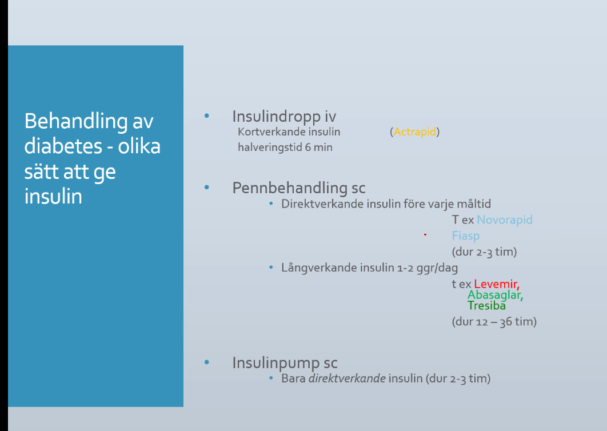

* om subkut: ger man bara snabbverkande + långverkande.
  * långverkande: levemir, abasaglar, tresiba
* insulinpump: bara direktverkande i den, inget långverkande. Man får en liten dos direktverkande hela tiden istället. 

#### ***Insjuknandetvid typ 1-diabetes skiljer sig i vissa avseenden åt mellansmå barnochstörre barn/vuxna. Diskutera på vilka sätt.*** 

***Early***

* ***Most common – the ‘classical triad’:***
    * excessive drinking (polydipsia)
    * polyuria
    * weight loss
* ***Less common:***
    * enuresis (secondary)
    * skin sepsis
    * candida and other infections

***Late – diabetic ketoacidosis***

* Smell of acetone on breath
* Vomiting
* Dehydration
* Abdominal pain
* Hyperventilation due to acidosis (Kussmaul breathing)
* Hypovolaemic shock
* Drowsiness
* Coma and death

***1-4 åå***

* Ju yngre barnet, desto snabbare förlopp för sjukdomen
* barn som insjuk 1-2åå har oftast endast några dagar anamnes på
  *  ökad törst, 
  * ökad urinmängd
  * de kan i värsta fall få en snabbt tilltagande ketos + utv ketoacidos
* genital svampinfek kan vara ett symptom föröjt blodsocker
* små barn kan ha svårt att uttrycka törst. 
* kräkningar utan diarre kan vara symptom på ketoacidos

***Förskolebarn och skolbarn***

* Insjuknandet är vanligen typiskt med ökad törst och ökade urinmängder 2-3v tid
* Nattenures, viktnedgång (som kaske inte uppfattas förrän barnet gått upp i vikt igen efter insulinbeh)
* och en ökad trötthhet är också typiska symptom
* om barnet inte får behandling f inns det risk för att det utvecklar ketaoacidos
* ett barn med förhöjt blodglukos eller glukos i urinen måste därför remitteras akut t barnklinik för bedöm o beh samma dag. 

***Enl läk***

* ***Snabbare hos barn vs vuxna***
  * ***Vanligare att man har ketoacidos vid debut***
* **större risk för ketoacidos**
  * **större risk för hjärnödem pga ketoacidos**

#### Vilka typer av diabetes kan diagnosticeras hos Hos barn? Hur kan vi utreda när diagnosen är oklar?

* ***Type 1. Most childhood diabetes***: 98%
    * Destruction of pancreatic β-cells by an autoimmune process
* ***Type 2. Insulin resistance followed later by β-cell failure***: 1-2%
    * Usually older children, obesity-related, positive family history, not as prone to ketosis, more common in some ethnic groups (e.g. Black and Asian children)
* ***Other types***
    * ***MODY***: 1-2%
      * Maturity onset diabetes of the young various types caused by genetic defects in β-cell function. Strong family history.
      * dominant ärftliga defekter i bet cellens funktion
      * hereditet tydlig
      * MODY2 och MODY3 är vanligast
      * beahandlas olika sätt och prognos
      * // Sekundär diabee
    * Drugs, e.g. corticosteroids
    * Pancreatic insufficiency, e.g. cystic fibrosis, iron overload in thalassaemia
    * Endocrine disorders, e.g. Cushing syndrome
    * Genetic/chromosomal syndromes, e.g. Down and Turner
    * Neonatal diabetes: transient and permanent secondary to defective B cell function.
    * Gestational diabetes
    * Gastroenterit med hyperton dehydrering

***Enl läk***

* DM1, DM2, MODY. 

// notera ang sekundär diabetes, att det inte är sekundärt om det är gastroenterit + hyperton dehydrering, då det inte är en riktig diabetes, utan ger förhöjda glukosvärden bara...

#### ***Utredning när diagnos oklar***

* ***fB-glukos***
* ***Hba1c***
* ***OGTT:*** oral grlukostolerans
* ***c-peptid***
* ***HLA-typning***
* ***antikroppantikroppar***: 
  * GADA
  * IA-2A
  * IAA
  * ICA
  * Zink-antikroppar
  * Dessa antikroppar kan upptäckas långt före klinisk diabetsdebut

***enl läk***

* har man ett barn med 11.5mM i glukos, och det har fått kortison innan, för att bedöma om diabetes föreligger:
  * HbA1c: kan man titta på, väldigt bra att kolla på, om den är förhöjd är detta klart att glukoset legat högt en längre tid
  * urinprov: om glukos i urinen. notera att 11-2mM i några timmar innan man utvecklar glukosuri. 
* ***Om MODY då är det remiss till klinisk genetik som gäller***

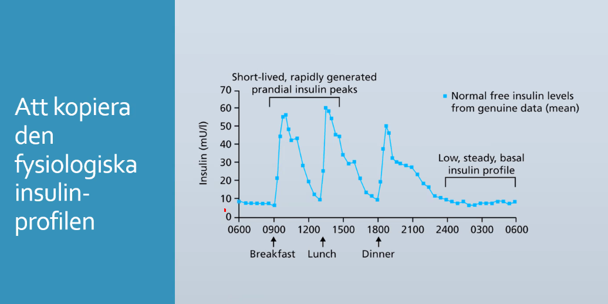

* Man vill efterlikna den fysiologiska insulinprofilen. Detta gör man med basal långtidsinsulin samt att man har snabbverkande för att få topparna.
* Barnen ska också lära sig att kolhydraträkna, för att lära sig att veta vilken dos de ska ta till vilken måltid. Detta för att de ska anpassa behandligen efter hur måltiden ser ut. Det är inget förbud mot att äta godi s etc. 
* ***insulinpump***: det finns ingen helautomatisk pump ännu, så man ska trycka i skiten när man äter i punpen för att informera den om detta.
  * den på armen byter man ställe var tredje dag. 
  * man måste byta ställen
  * Ålder för att få pump: kan sätta pump på väldigt små barn

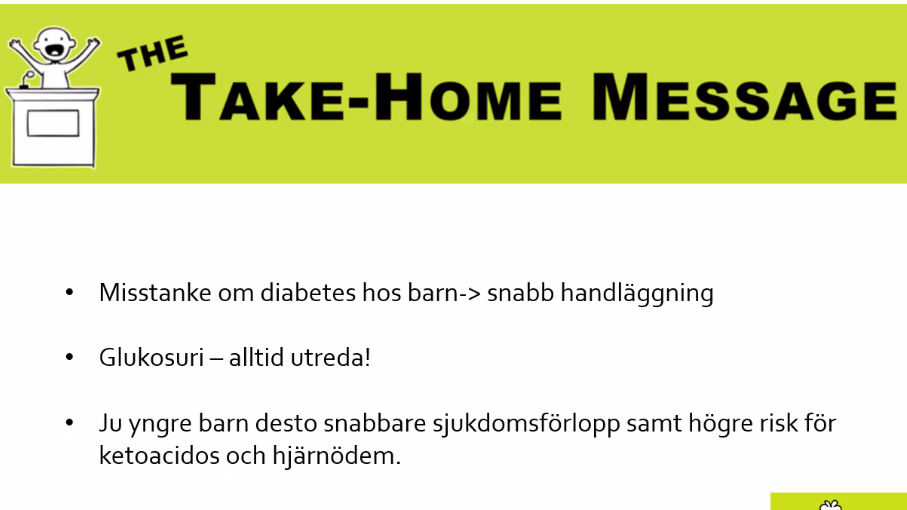

### Fall 2

* 11åå Malek kommer medambulans och du är vik läkpå barnakuten. 
* Han har diabetes typ 1 sedan 8 års ålder och har pump. 
* Nu hittad i sängen efter att ha varit ”magsjuk” med kräkningar under natten. 
* Malek är medvetandesänkt och andas tungt

#### Vilket tillstånd bör du misstänka? Hur förklarar du hans symtom?Vad kan den bakomliggande orsaken vara?

* DKA: 
  * kräknignarna kan ha orsakats av ketoacidosen
  * andas tungt av acidos
  * ont i magen: också tecken acidos
* Respiratorisk kompensation av metabol acidos

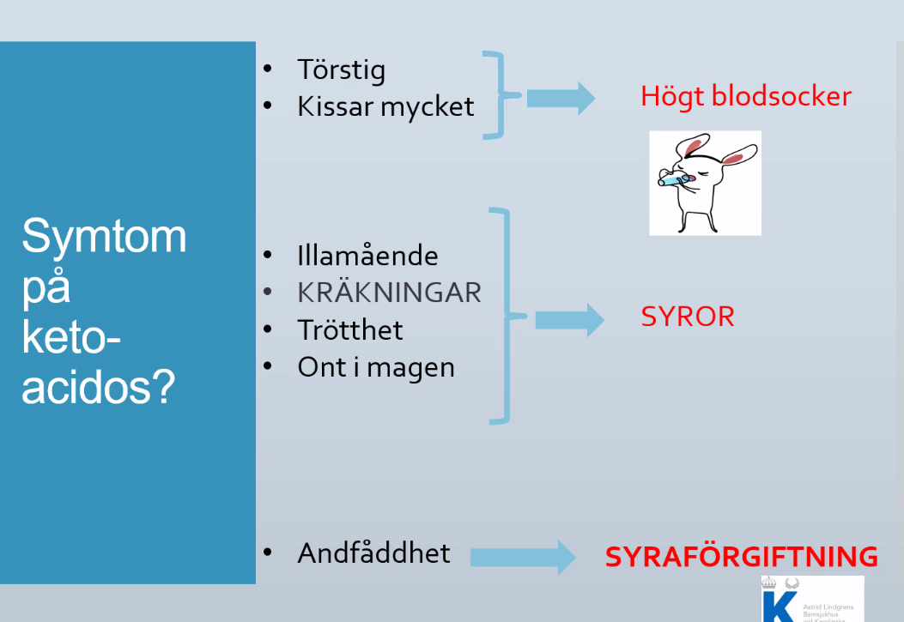

***Enl läk***

* Ketoacidos är lite lurigt
  * magont: kan likna andra åkommor, e.g. förstoppning etc.
  * kräkningar
* medvetandesänkning kan ha orsakats av
  * svår dehydrering
  * kan ha cirkulatorisk chock
  * ketonerna i sig
* Det som skett i detta fallet
  * att insulinpumpen slutat fungera: för att ketoacidosen genes är insulinbrist. 
* att patienten ska göra hemma
  * ta blodsocker och ta ketoner hemma
  * görs på precis samma sätt, är med blodketoenr.

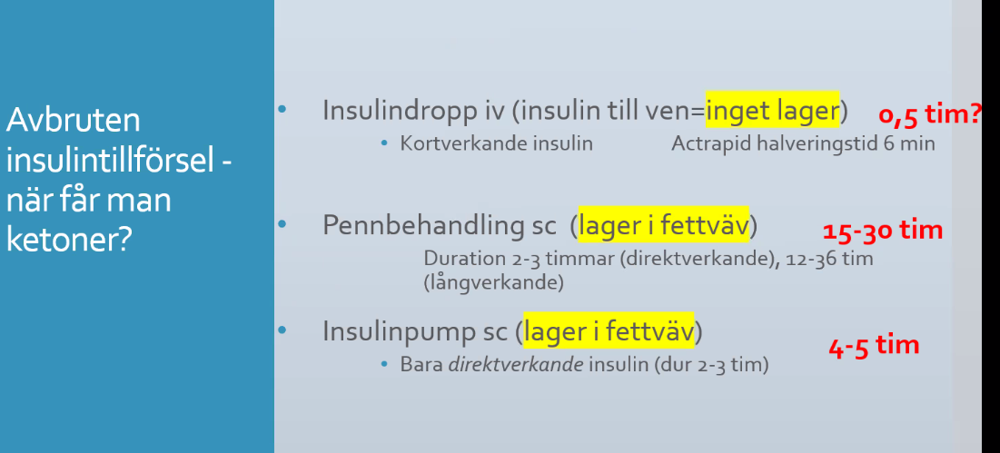

#### Vad blir din initiala åtgärder

* ABCDE
* ***Utredning***
  * ***Om svårt att avgöra symptom, enbart beror på ketoacid eller dessutiom akut kirugisk bukåkomma för man först***
    *  korrigera ketoacidostilltånd ochj 
    * därefter på nytt ta ställning t evt kvarstående buksymptom
  * ***Blodprover***
    * glukos
    * B-ketoner över 3 som man ska ha
    * B-HB
    * B-EVF
    * B-CRP
    * Na, ka, cl, calcium
    * alb urea krea
    * osmol i serum
    * blodgas
    * HbA1c
    * odling vid feber
  * ***urin***
    * glukos
    * ketoner
  * ***EKG på alla*** 
  * ***vikten***, dagligen och ankomst sjk*
* ***Handlägg***
  * v-sond: om stora mäönder sockerhaltig vätska behövs, görs med v-sond
* ***Behandling***
  * omedelbar kontakt under adekvat övervak närmsta barnklinik
  * IVA-fall
  * bakjour tillkallas
  * undvik hjärnödem och hypokalemi med vätsketerapin
  * ***rehydrering***: snabb rehydrering med NaCl, långsam rehydrering med ringer. 
    * addex kalim
    * kräver blodgas innan
  * ketoacidos karakterisas av fölkand ebiokem förändringar
  * ***nedsatt perifert glukosutnyttjande***. Detta leder t hypergl
  * ***Häva acidos***: med insulin
    * om B-glukos mer än 5mM per timme efter första 2 timmarna, ska man bromsa fallet
    * insulin infusion
  * ***när acidos hävd:*** eftersträva normoglykemi
  * ***Osmolalitet***: långsamt normalisera osmolalitet som hyperglykemin orsakat
  * ***Långsam rehydrering över 48 timmar***

enl läk:

* Ngn av dessa
  * BE under -10
  * ketoner över 3
  * pH under 7.29
* man ger inte addex kalium i bolus
  * Noteras att man antingen ger RA eller NaCl i bolus
  * notera att denna har ingen addex kalium
* efter snabba rehydreringen i 1-2 timmar, går man in långsam rehydrering, där TILLSÄTTER MAN ALLTID KALIUM
* Oftast att de kommer in med normalt kalium. 
* För insulinet
  * man vätskar upp först första timmen
  * sen går över till insulinet. 

Denna slide verkade vara ganska bra, bör titta på den. 

#### Fruktade komplikationer

* ***Vid korrigering***
  * ***hjärnödem***: snabb korrigering
    * förklaringen har att göra med osmolaliteten, iom att hjärncellerna uttorkade ökar interna osmolaliter etc.
    * dock läk noterar att det inte är så enkelt, det kom en stor studie att det inte spelar stor roll, det man bygger behandling med lågnsam rehydreirng 
    * visat sig att man kan ge vätska snabbare än långsam rehydrering utan hjärnödem
    * har att göra med neuroinflammation kontraherade kärl i hjärnan etc...
    * det förblir likadan rekommendation med långsam rehydrering. 
  * ***hypokalemi***: insulin
    * kräkningar producerar volym depletion och metabol alkalos och ökad renal kalium exkretion, denna mekanism f
    * man ska hålla koll på kaliumet, 
    * kommer alltid att sjunka, totala kaliummängden är låg, man ska tillsätta denna
* ***Ketoacidos***
  * acidosen: dödlig
* ***Hyperosmolär icke-ketotiskt koma***
  * Hyperosmolärt hyperglykemiskt tillstånd förekommer oftast hos en äldre patient med typ 2 diabetes och vätskebrist. Patienten har sänkt medvetandegrad och uttalad dehydrering. Koma är ovanligt och oftast associerat med en S-Osmolalitet >340 mosm/kg.
  * Utlöses av t ex infektioner, stroke, ileus, kirurgi med flera tillstånd och dessa kan dominera den kliniska bilden. Slarv med mediciner förekommer som utlösande faktor liksom läkemedel, t ex tiazider/kaliumbrist, steroider, betablockad, neuroleptika och HIV-mediciner. Diabetes mellitus typ 2 kan debutera med hyperosmolärt syndrom.
    - pH >7,30 och standard bikarbonat >15 mmol/l.
    - Blodketoner <3 mmol/l.
    - P-Glukos >30 mmol/l.
    - P-Osmolalitet >320 mosm/kg.
  * ***Förhöjt natriumvärde och urea är vanligt liksom hypokalemi***

***enl läk***

* om blodsocker sjunker för snabbt ska man INTE STÄNGA AV Insulinet direkt, för då får man acidosen igen
  * det man ska göra är att sänka dosen etc. 
  * patienten ska ej stå utan insulin. 
* hjärnödem: ovanlig komplikation, internationellt 0.5-1% av ketoacidoserna. Hon gissar på att det är lägre i Sverige.
* minsta barnen har de svåraste ketoacidoserna. 

#### Hur ser Maleks behandling ut de närmaste dygnen?

* ***Rehydrering långsamt***
* ***följa B-glukos***: glukos kan sänkas till 6-10mM, närmaste dygnen
* ***vätskebalans följa***, timdiures
* ***glukos + ketoner***: blod o plasma varje timme
* ***syrabasstatus varannan timme*** 
* ***Na, K, Urea***: detta för att få fram plasma osmol. 
  * 2*(Na + K) + vP-glukos (venös plasma glukos) (+ urea enl internetmedicin)
* ***EKG***
* ***pulsoximeter***
* ***övergår sedan till subkut insulinbehandling när pH är över 7.3 och ketoner under 1.0***

***enl läk***

* nu gett snabb rehydrering
* långsam rehydreirng: i 48 timmar
  * noga koll på vätskan
  * efter 1 dygn att barnet kan dricka ensamt, men man ska ha koll på intag
  * FÅR EJ DRICKA VATTEN pga osmolaliteten
* Insulinet: insulindropp lika läbnge, 48 timmar, 2 dygn innan subkutan behandling igen. 
* När man tagit bort droppet behöver de fortsätta några dagar. ..

1.1. Vilket tillstånd bör du misstänka?
Diabetesketoacidos (DKA). Buksmärtor, kräkningar, illamående hos en känd diabetespat är ketoacidos
tills motsatsen är bevisad. Pumpen är snabbverkande. Efter borttagning av pump är man helt utan
insulin efter 2h. Ketoner tar 3-4h att producera.

Symtomflora:
* Polydipsi/polyuri  UVI?
* Illamående/kräkningar/trötthet  Gastroenterit?
* Magont  Kirurgisk buk?
* Ökad AF  Astma?
* Viktnedgång  Anorexia nervosa? 1.2. Hur ställs diagnosen?
* P-glukos >11 mmol/l
  * venöst pH <7,3 (eller standardbikarbonat <15 mmol/l eller BE <–10)
  * ketonemi/ketonuri (B-ketoner >= 3,9 mmol/l)
  * glukosuri

Saknas en allmänt accepterad definition av DKA.
2. Hur har tillståndet uppkommit? 
Oftast pga sent diagnostiserat nyinsjuknande. Hos pat med känd DM är vanliga orsaker akuta inf eller
otillräcklig insulinbeh. Bortglömda doser? Havererad insulinpump? Dessa pumpar innehåller bara
direktverkande insulin, därför kan barn snabbt utv DKA. Ju yngre barn desto snabbare DKA.
3.1. Vilka är riskerna med tillståndet?
0,3% med DKA dör. 2/3 av hjärnödem (pga hyponatremi), 1/3 av andra orsaker såsom hypokalemi
(arytmier), dehydrering, cirkulationssvikt, tromoembolier (heparin kan övervägas), hypoglykemi.
0,5-1% med DKA utv hjärnödem. Hjärnödemsprognos: 1/5 dör, 1/5 skadade/hemiplegi, 3/5 friska.

3.2. Hur blir det så?
Elektrolytrubbningar: Hypokalemi, hyponatremi, hypofosfatemi.
* Nedsatt perifert glukosupptag  hyperglykemi + glukosuri  osmotiskt diures  dehydrering, hemokoncentration och chock.
* Nedsatt lipogenes + ökad lipoys  ökad fettsyraförbränning  överprod av ketonkroppar  ketonemi, ketonuri och metabol acidos.
* Ökad glukossyntes från levern pga glukoneogenesen (där glukos återbildas från aminosyror) och glykogenolys.
* Katabolism, ureastegring, renala förluster av Na, K, Cl och fosfat.

3.3. Vad behöver du för hjälp?
Ev narkoshjälp.

4.1. Hur ser Maleks behandling ut de närmaste dygnen?
4 hörnstenar:
* Vätska: Snabb i 2h + långsam i 48h (rehydrering)
* Insulin
* Elektrolyter (kalium)
* Provtagning och övervakning
Syftet med beh är inte att snabbt uppnå normoglykemi, utan långsamt korrigera acidosen, elrubbningen och dehydreringen utan att sänka S-osmolaliteten för snabbt. Pat bör hållas fastande. Rehydrering: Snabb + långsam rehydrering. Om nedsatt perifer cirkulation  snabb rehydrering i 0- 2h. Övergång till långsam rehydrering när perifera cirkulation återställd (kapillär återfyllnad, BT, diures). Pat med opåverkad perifer cirkulation börjar med långsam rehydrering direkt. Under den snabba fasen anv man 0,9% NaCl (12,5 ml/kg/h, max 500 ml/h). I den långsamma fasen vill man sänka p-glukos med 4-5 mmol/l. Ringer-Acetat med K-tillsats ges.

Insulin: Stäng av ev insulinpump. Efter att man säkrat vätsketillförsel startas insulinbeh. Vid K <3,3 får inte insulinbeh initieras utan att K först korrigerats, då det finns risk för allvarlig hypokalemi. Fram tills nyligen rek en bolusdos insulin på 0,1 E/kg följd av infusion av 0,1 E/kg/h. Nyare studier förespråkar primärt ej bolusdos, såvida det inte dröjer innan insulininfusion kopplas. Infusionen ska fortgå så länge acidosen kvarstår och hastigheten justeras utifrån P-glukos och acidoskorrektion.
Kalium: Då K sjunker vid beh av DKA och den totala bristen kan vara mkt stor, krävs noggrann Kmonitorering. Vid K <5,2 bör substitution inledas, vilket ofta blir redan vid 2:a litern dropp. Vid hypokalemi (<3,5) kan K ges redan i den snabba rehydreringsfasen, annars tillsätts den i den långsamma. Målet är att bibehålla P-kalium mellan 4-5. K bör kontrolleras minst varannan timme.

4.2. Var?
IVA – Intensivvård!

5. Hur ska tillståndet förebyggas?
* Symtom upptäcks genom utbildning.
* Högt blodsocker och ketoner i blod upptäcks genom blodsockermätare och ketonmätare. 
* Ketoner och socker i urin upptäcks genom vanlig urinsticka (ger utslag om p-glukos >12 = njurtröskel).
* Ta diabetesbeh enl läkarens anvisningar, ät hälsosamt och motionera regelbundet. Insulinpumpsanv måste kontrollera ofta att insulin fortfarande flyter i slangen och att det inte finns några blockeringar.

Malek väger 50 kg. Redhydrering:
* Första 2h – RingerAcetat 500ml + 500ml = 1L. Ej insulin direkt då blodsockret rusar ner. Långsam
* rehydrering tills pH:t är normalt: 5% glukos 4200 ml/dygn, 176 ml/h. 5E/h insulin. Kolla Na, K varje h. 

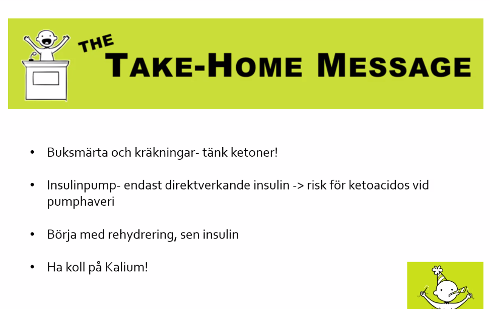

### Fall 3

* Lina har varit på fotbollsturnering ochspelatflera matcher under dagen. 
* På kvällen festar hon med några kompisar och dricker alkohol. 
* På natten vaknar föräldrarna av att Linassensor larmar för lågt blodsocker och de hittar henne krampandes i sängen.

#### Vad bör föräldrarna göra?

* Glukagon spruta: detta verkar inte behöva ett kap glukos utan räcker med misstanke hypoglykemi...
* Ringa ambulans
* Om inte aspirationsrisk: lägga socker i munnen. det föreligger dock aspirationsrisk i detta fallet
  * en tablett 3g för varje 10kg som patienten väger. 
  * dextrosol, 4kcal/g
* Se till att krampande barn inte blir manglat.
* Bör kanske mäta B-glukoset när barnet krampat färdigt 

***Hur behandlas en hypoglykemi med medvetslöshet på sjukhus?***

* Injektion Glukos 100 mg/ml, 3-5 ml/kh iv, upprepas tills blodsocker >4-6 mmol/l. Vaken patient ges ”mjölk och smörgås”.
* Om infart saknas ges inj Glukagon 1 mg im mitt på lårets utsida.
* Om patienten inte vaknar inom 5-10 minuter efter blodsocker >6 mmol/l leta andra orsaker, t ex intoxikation eller cerebrovaskulär sjukdom. Vid behov av upprepade bolusdoser glukos ge inf Glukos 50-100 mg/ml 1000 ml på 4-6 timmar och kontrollera P-Glukos frekvent. Enstaka patienter med långvarig och svår hypoglykemi vaknar inte vid normoglykemi vilket är indikation för IVA-vård.
* Vid insulinutlöst hypoglykemi hemgång efter ”mat och dryck” om patienten är fullt orienterad och blodsocker är stabilt under några timmar. Tag ställning till lämplighet att köra motorfordon.
* Försök att klarlägga bakomliggande orsaker och/eller korrigera vid behov insulindoseringen eller tidpunkten för injektionerna.
* Vid hypoglykemi orsakad av perorala diabetesmediciner av typen sulfonylurea (glibenklamid, glimepirid, glipizid) samt repaglinid alltid inläggning under 1-2 dygn. I övriga fall individuell bedömning utifrån möjliga orsaker till hypoglykemin. Eventuellt inläggning för medicinjustering efter svar på HbA1c. Glukosinfusion endast vid symtomatisk hypoglykemi. (Se även intoxikationskapitlet). Följ P-Kalium.

#### Faktorer i anamnesensomsannolikt bidragit till allvarlig hypoglykemi?

* ***Alkohol***: inhib glukosfrisättning fr lever, varpå hypoglykemi
  * alkohol hindrar glukoneogenes gm att hålla enzymerna sysselsatta med...
  * Att levern släpper ut glukos är människans naturliga sätt att hålla  rätt blodsockernivå mellan måltiderna. Kroppen suger även upp socker via tarmen. Det innebär att om du äter samtidigt som du dricker alkohol har kroppen möjlighet att ta upp socker i blodet trots att leverns  sockerflöde är blockerat. För alla människor medför blockeringen av  sockerintaget via levern i kombination med att man inte äter risk för  hypoglykemi.
  * Hos en människa som inte har diabetes skickas automatiskt signaler  till bukspottskörteln (där insulinproduktionen sker) om att dra ned  insulinet till ett minimum när leverns sockerintag är blockerat, dvs när man druckit alkohol. Men en människan med diabetes tillför insulin via  penna/spruta/pump till kroppen. Om en person tar sin vanliga dos insulin och dricker alkohol utan att samtidigt äta innebär detta därför risk  för hypoglykemi. Hypoglykemi kan leda till långvarig och djup  medvetslöshet vilken i sin tur kan leda till hjärnskador.
* "We have now found that alcohol exerts substantial influences on pancreatic microcirculation by evoking a massive redistribution of pancreatic blood flow from the exocrine into the endocrine (insulin-producing) part via mechanisms mediated by the messenger molecule nitric oxide and the vagus nerve, augmenting late phase insulin secretion, and thereby evoking hypoglycemia" says lead investigator Åke Sjöholm.

***enl läk***

* t dem som ska dricka alkohol
  * se till att de ska äta kolhydrater och fett frekvent under druicjkepisoden
  * ska äta chips eller pizza innan de går o lägger sig etc.
* Glukos: 10% 2mL/kg  

# Hematologi

***Bakgrund***

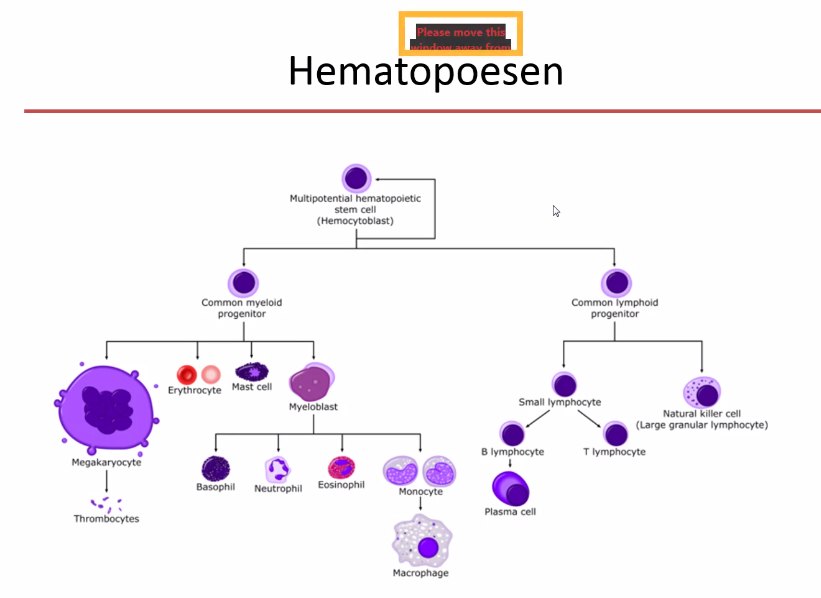

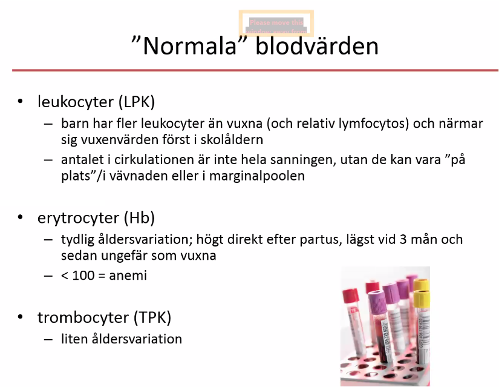

* Marginalpool: att man kan öka sitt Hb värde i ansträngning, detta har hästarna enormt av, att de har en massa röda blodkroppar i mjälten så att de bloddopar sig sj
  * denna kapabilitet har vi inte hos männiksor. 
  * Marginalpoolen utgörs av mjälten...

### Fall 1: 

* Alfred har hunnit bli 6 mån. Han föddes i fullgången tid med FV 3700g och FL 50cm. Föräldrarna är så stolta över sin första lilla guldklimp... 

***a) ...som du träffar som AT-läkare på närakuten i januari. Pappa kommer med Alfred eftersom han nu haft så hög feber i 4d. Alvedon fungerar sisådär. Alfred vill inte äta så mkt, men dricker iaf på nappflaska. Du tycker att Alfred har en ÖLI men beställde prover för säkerhets skull: CRP 11 och LPK 3,5.***

***Hur tolkar du detta?***  

* LPK lågt
* vid virus-inf hos barn går LPK liksom TPK ned
* ***Det är lågt med LPK***: LPK ska vara högre för dessa barn i denna åldern.

// Det man evt kan diffa är ...

***Behövs ytterligare prover***

* Blodstatus med diff för utesluta neutropeni (<1,5). 
* Diff visar neutrofila på 0,5 
  * infektiös neutropeni. 
  * Lågt värde, men ingen neutropen feber. 
* Upprepade inf? Andra symtom än ÖLI? 

***Behov av uppföljning?***

Kan följas upp via VC efter utläkt inf. Ta om diff om ca 1 vecka. 

***enl läk***

* Det man gör nu, iom att man är på närakuten
* Detta är en vanlig kategori. de har lagt 0.5 för att var lurigt
  * om UNDER 0.5 är det neutropen feber
  * det är olika om man tänker neutropen feber hos cancer patiente då man vet immunnedsatt eller för övrigt frisk pat som är pressad av virus
* Man ska prata med en senior läkare
  * AT är styrande
* Man kan avvakta om patienten äter dricker o mår bra, inga tecken historik hereditet
  * följa upp öppenvården. 
  * kan skicka hem de om mår bra på närakuten. 

***b) ...som du träffar som AT-läkare på ”valfri vecka” vid barnklinikens akutmottagning. Din handledare från VC har träffat Alfred på BVC. Han utreddes för ev komjölksproteinallergi. I rutinproverna sågs bra Hb och TPK, men lågt LPK med neutrofila 0,4***. Detta barnet är detsamma med sjukt o lite feber, men det som skrivits i b är bakgrunden. 

***Hur tolkar du detta***

Neutropeni. Om man har låga neutrofiler, men alla andra celler är ua kan man vara ganska lugn. Det är en frisk gosse. Han har däremot flera påverkade cellinjer ska man bli mer orolig

***Differentialdiagnoser?***

* ***Autiommun neutropeni (***växter bort vid 6-7åå), benmärgshämning pga ärftlig sjd, inf, malignitet, näringsbrist.

***Behövs ytterligare prover***

BUMM. Om man påvisar Ak mot neutrofiler  dessa barn blir inte sjukare/oftare sjuk än andra barn.

***Enl läk***

* autoimmun neutropeni kan upptäckas inom första året, och passar in på denna kille.
  * så pass vanligt 
  * har bra rutinprover i 
* ***MAN SKA TÄNKA ATT ANTALET CELLINEJR PÅVERKADE***: 
  * i båda av fallen ovan var det endast neutrofiler påverkade, så det är endast en enda cellinje som är påverkad
  * därför kan man vara mer lugn. 
* ovan av fallen ovan ska man undersöka om infektionsfokus etc
  * sannolikt är det dock en virus ÖLI
* ligger man under 0.5 i neutrofiler, ska man till barnakuten för bedömningen
* är man opvåerkad och ligger över eller lika med 0.5 kan man skicka hem, förutsatt att barnet mår bra vid besöket etc.
* Gällande handläggningstid
  * man kan ta tillbaka efter 2-4 vekor förutsatt att fortsatt mår bra, för åb
  * om feber o sämre aptit igen, ska man söka tidigare
  * landar man att det bara är neutofiler rel virus räcker det med 2-4 veckor i uppföljning. 
* Diffa om det är på väg ned om det är 0.5 vid mättillfället: att 
* ***Diffa autoimmun neutropeni***
  * **titta autoantikroppar mot neutrofiler**
* alla barn som är snviga, oftast virus, kommer sannoliket påverkade vita. 
* autoimmuna neutrofiler kommer det fortfarande vara lågt med neutrolfer efter 2-4 veckor, ska man ha i åtanke
* Är det farligt med autoimmun neutropeni, om 0.2 på neutrofiler
  * även om låg neutrofiler, är det inget fel på bildningen av neutrofiler, benmärgen jobbar på o producerar neutrofiler, men det är att de bryts ned snabbare
  * det är när det är genetiskt fel eller att det är cytostatika som sänker neutrofiler som det är farligt med neutropenin
* ***Infektionsutlöst neutropeni:*** ngn slags mräghämning, att man följer upp 2-4 veckor
* ***om det är neutrofiler under 0.5 som man ska skicka in o behandla, för att diagnosticera o säkerställa att det är ofarligt*** 
* ***om man ser åpverakn Hb oc trombocyter också är ett varningens tecken***
* finns det anamnes allavarliga infektioenr tidigare ska man utreda också vidare. 
* Antikropparna kan man ta på vårdcentralen: stick i fingret eller blodprov. 

***c) ...som du träffar som AT-läkare på VC. Alfred är sjuk! Mamma och pappa är oroliga. Alfred har inte växt så bra enligt BVC-kurvan. Han hostar och flåsar. Dessutom har han alltid varit lös i magen, trots att det provats Sempers Magdroppar. Du tycker Alfred ser sjuk ut, hör takykardi och lätta ronki. I ljumskarna ser du ett ilsket rött utslag. Proverna visar CRP 11 och LPK 3,0. Hur tolkar du detta?***

Sjukt barn. Växter dåligt. Pågående svampinf. GI-besvär.

***Differentialdiagnoser?***

SCID! Jätteovanligt, men viktigt att upptäcka annars dör de.

***Behövs ytterligare prover?***  

* Blodstatus med diff
  * ua utom lymfocyter på 0,2 (jättelågt).

***Lägger du in?***  

Akuten! 

***Behov av uppföljning?***

 Beh: Benmärgstx. Med så låga lymfocyter är det SCID tills motsatsen är bevisad.  

Pancytopeni med/utan splenomegali  misstänk malignitet eller hypersplenism.

***enl läk***

* utslaget i ljumskarna kan vara en svampinfektion
* lungorna låter fel
* så det är multipla infektionerna olika platserna
* Diffen: SCID (svår kombinerad immunbrist), bortsaknad av olika faktorer
  * underutvecklad thymus
* Behandling SCID
  * Samcells transplantation så fort som möjligt, om inte man har en virusinfektion då det är svårt att SCT
  * man screenar för denna ocksp  åp PKU tester säger han osså
  * man måste göra det så tidigt, annars dör man, det är 100% dödlighet annars

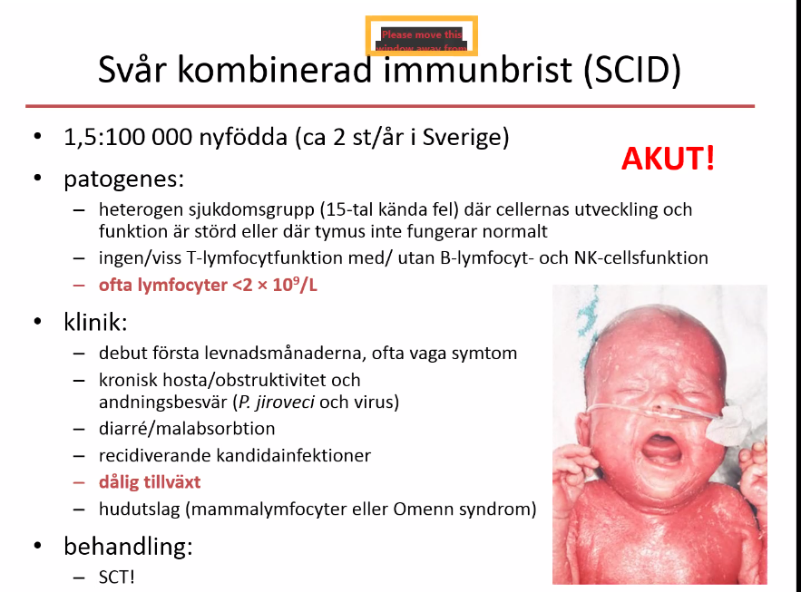

#### Sammanfattning

* Svårt att veta om blodvärdena är allvarliga
* Anamnesen

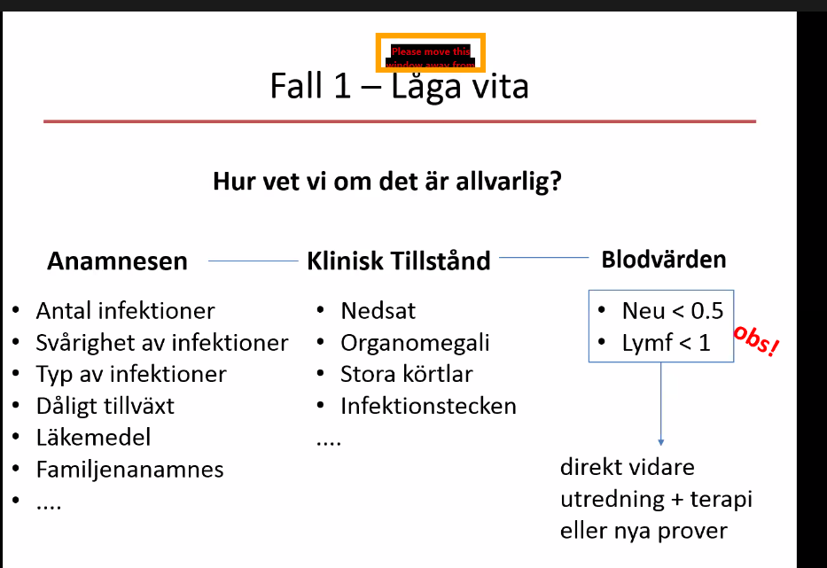

### Fall 2

***Beata har hunnit bli 4 år och storasyster. Lillebror har börjat på dagis, så nu är Beata därför tillbaka på heltid på sitt dagis. Men det är inte som förr. Beata grinar och gnäller. Hon är petig i maten och lite blek om nosen. Helst vill hon sitta i dagisfrökens knä och läsa böcker. Igår petade hon in en fiamedknuffpjäs i näsan, så det forsade blod. Trots att det bara är i början på september har Beata redan ätit 2 kurer med Kåvepenin pga ”oklar inf”. Mamma har läst på vårdguiden om coxitis simplex, eftersom Beata klagar på ont i benen. Nu sitter de i ditt väntrum.***

***Vad har du för differentialdiagnoser?***  

B-ALL är den vanligaste barnleukemin och har god prognos. Hemolytisk anemi, ITP. 

***Hur vill du undersöka Beata?***

* Körtlar? Blåsljud?  

* Blodstatus med 

  

***Behövs prover?*** 

* Blodstatus med diff, 
  * Hb 80, 
  * TPK 50, 
  * LPK 50 med blaster
  *  leukemi. 
  * Alla poeser är påverkade. 
  * LPK kan vara lågt vid leukemi.

***Remiss någonstans?*** 

Kontakt med barnonkologjour på direkten

***Avvakta och följa upp?*** 

Onkologen: Benmärgspunktion, molekylärdiagnostisk us, LP, ev radiologi.

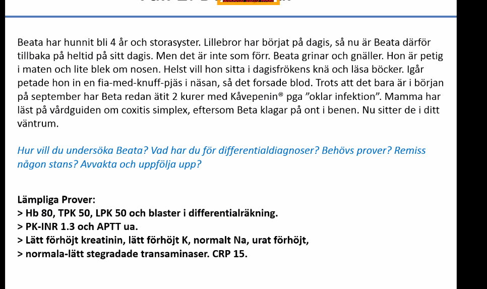

***enl läk***

* blaster: det är dåligt för att det benmrägen skickar ut dem tidigt. 
* LPK för högt, Hb anemiskt, TPK för lågt
* detta är en stamcellssjuka: trilinjär påverkan + blaster i blodet (det är malignitet tills motsatsen bevisad)
* Om man har malignitetsmisstanke: 
  * man kan ringa barnonkologjouren och fråga: om det kan vänta till morgondagen
* ***om det är s"att man tagit blodproverna o vill se proverna innan gör ngt, om man misstänker ngt om malignitet***
  * då antingen skicka in barnet
  * eller ha ngn som bevakar proverna med en jour
* ***har man stark misstanke malignitet***
  * ringa närmsta barnonk centra, och lägger upp en plan för det hela. 
  * då kommer dessa att säga att man skickar in till akuten, barnakuten Solna där de omhändertar patienten
* ***man kan komplettera med prover om man har infart och -- barnet***
  * njurpvoer: kan vara påverkade o förstorade
    * Cancerceller faller sönder o får lätt slå ut njurarna av slaggprodukter. 
  * leverprover: man kan ha en leukemi härd här
* ***Det finns käl att misstänka blodsjukdom för ytterligare utredning och en plan***
  * Mamman frågar om det är leukemi: man säger att prognosen är bra för de flesta leukemier (ALL)
  * man kan inte skicka in ngn t en barnonkolog utan att säga att man misstänker barnleukemi
  * Hur ställer man diagnosen, golden standard:
    * benmärgsaspiration: för att diffa vilken leukemi
    * man har redan sett blaster
  * D-ALL v
* Sjuka barn att de är utkramade o trasa
  * LPK höga o låga men faktiskt osså normala
  * man kan se blaster i periferin cirkulation
  * de är påverkade och påverkade cellinjer. 
  * O man kontaktar omedelbart barn-cancer cell team för behandling
* Patofys etiologi
  * att det är hematopoeser som pushas ut av den dåliga poesen. 
* beroende på vilken arm man hamnar i varierar vilken behandling man får
* 

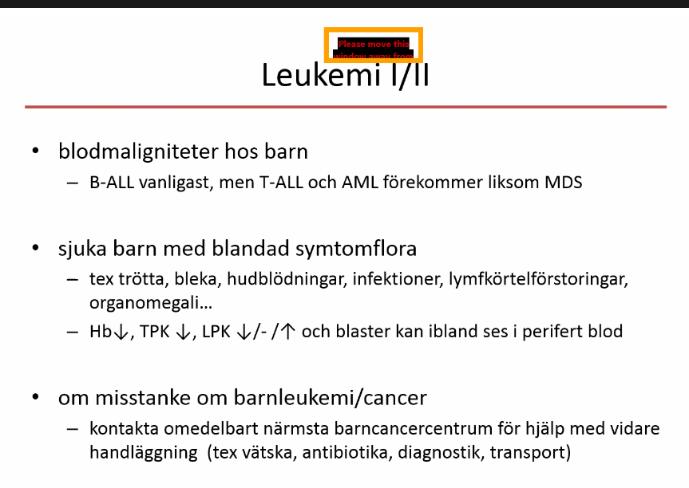

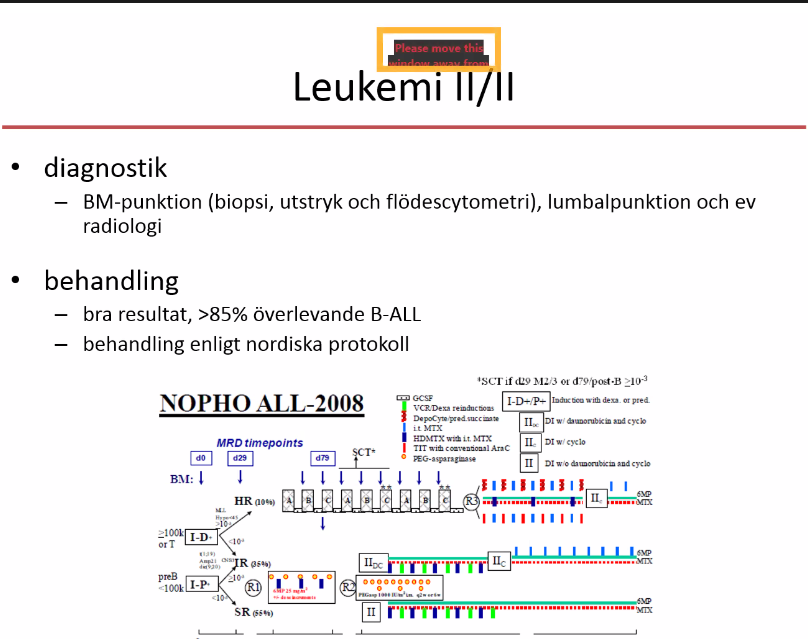

#### Sammanfattning

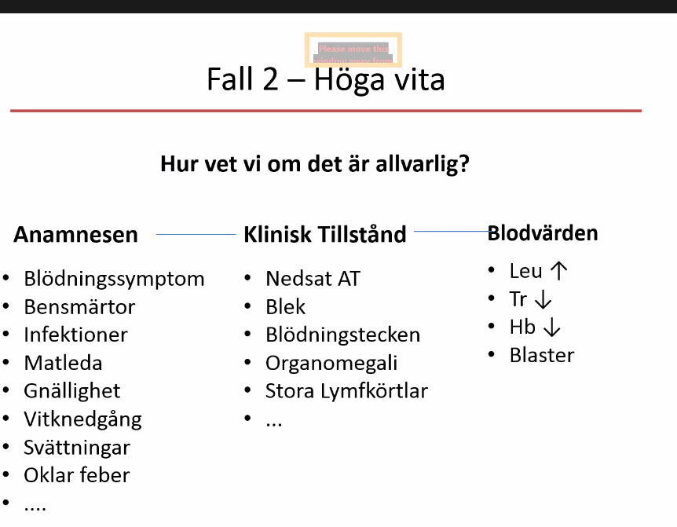

* ibland skriver man erytroblaster, då är det blodkropparna som är åpverkade, inte så farligt, det är när det handlar mo de vita blodkropparna som det blir farligt. 

### Fall 3

***Calle är 3 år och ganska snacksalig. Han har ritat en huvudfoting till dig medan han satt i väntrummet på barnläkarmottagningen. Calles mamma har fått nog! I höstas hade Calle 2 lunginfl och nu har han haft öroninfl ett par gånger. På dagis har de andra mammorna talat om att man kan få rör i öronen. Calles tillväxtkurva är hyfsad. Hans storasyster är glad och frisk.*** 

***Hur tolkar du detta?***  

* Inte normalt i denna ålder  utred. 
* Öronbarn? 
* Man får ha 10-15 ÖLI/år. 
* Om det blir fler än så ska man reagera. 
* Andra varningstecken: 
  * Allvarliga inf (meningit/sepsis, osteomyelit), hereditet

***Differentialdiagnoser?*** 

Primär immunbrist, cystisk fibros (ökad slembenägenhet  flera inf, dålig tillväxt pga malabsorption och GI-besvär pga pankreasdysfunktion), ciliedysfunktion

***Behövs prover och isf vilka?***  

* Blodstatus med diff, 
* immunelfores (IgG, IgM, IgA), 
* B12, folat, vitaminer
* kan även testa subklasser i samråd med barnhematolog.

***Remiss någonstans?*** 

***BUMM***: Barn med ökad inf-benägenhet, bakteriella eller atypiska inf, där primär utredning är genomförd men misstanke kvarstår om PID (primär immunbristsjd). 

***Specialist***: Barn med svår inf-problematik där utredning inger misstanke om PID. Barn i behov av specifik immunoterapi. Splenektomerade barn. 

***Beh***: IVIG, men bättre att ge det subkutant pga jämnare fördelning. 

***Enl läk***

* upprepade lunginflamamtioner, ÖLI (otit, sinusiter, etc) frekventa, ska man tänka på immunbrist. 
* vanliga snuvor, förkylningar: detta kan 
* man ska vara varsam med upprepade lunginflammationer och otiter. 
* ***prover som måste tas, innan man skickar för remiss för detta***
  * blodstatus + diff
  * IgA, IgM, IgG 
* ***Det i anamnesen man tillfrågar om immunbrist mistanke***
  * Hereditet: 
    * varifrån i världen man kommer.
    * norrland, annanstans i världen
    * konsanguinitet
    * om det finns släkt som har fr lädner där mindre bra sjukvård tidg generationer, med dödfödda barn, som också tecekn immunbrist
  * infektionskänslighet i familjen.
  * diffa cystisk fibros. 
  * läkemede
* patologisk eller fysiologisk infektionskäönslighet, detta efter att remiss barnhemat eller barndoktor och utreder tillsmmans:
  * COLIN, patologisk infektionskänsligket
    * course: återkommenda atypisk
    * organism; opportunistisk
    * localisation: polytop, atypisk
    * intensity: svår major inf eller flera minor inf
    * numbers
  * Iummundysregulation GARFIELD
* Vilka celler som är påverkade
  * T-celler: 
    * virala infek
    * återkommande svamp
    * opporttunistisk
  * B-lymf o antikroppsdefekt
    * upprepade luftvägsinfektioner
  * fagocytdefekter
    * hudinfektioenr och djupa abscesser
  * komplementdefekter
    * invasiva bakteriella infek
* ***utredning bör ske i samråd med barnimmunbristläkare***

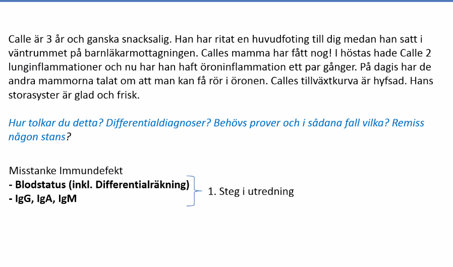

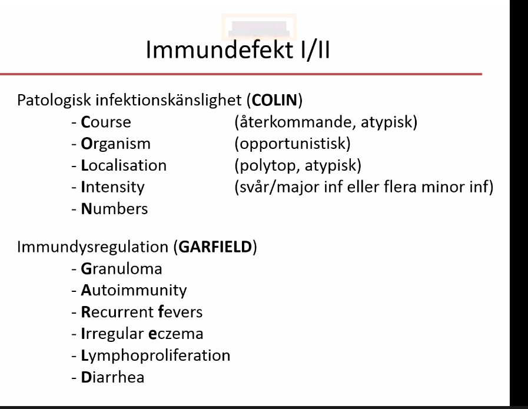

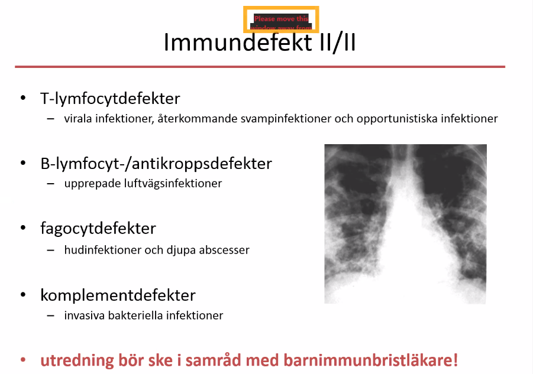

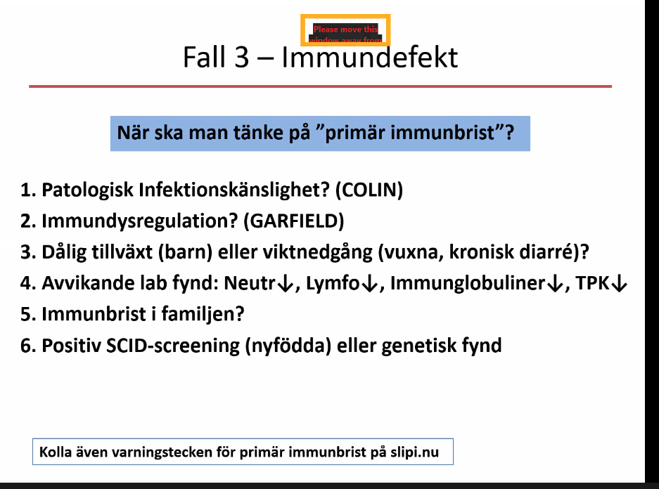

### Fall 4

***Stefania är 14 år och en ganska trulig tonåring. Hennes mamma har nu tvingat iväg henne till VC där du vikar före AT. Stefania har fått ”konstiga prickar” på underbenen och magen sen några dagar tillbaka. Hon är annars fullt frisk, förutom en rejäl förkylning för några veckor sedan.*** 

***Hur tolkar du detta?*** 

* ITP i samband med ÖLI. 
* Förr idiopatisk trombocytopen purpura, numera immunmedierad trombocytopen purpura. 
* Uteslutningsdiagnos. 
* Anamnes viktig! 
* Hos små barn ska man titta efter dysmorfa drag (Fanconi, TAR, WAS, Alport). 
* Få som får kronisk ITP, men akuta skov är vanliga. 
* Man får petekier vid 30-40 TPK, slemhinneblödningar först vid 10-15(-20). 

***Differentialdiagnoser***

* ITP: uteslutnignsdiagnos
* HUS, 
* leukemi, 
* lymfom/myelom, 
* B12/folsyrabrist, 
* aplastisk anemi, 
* splenomegali, 
* lm, 
* TTP. 
* henoch schönlein: vaskulit
* läkemedel
* om organomegali och mjälten stor: lymfom eller leukemi

***Behövs prover och i sådana fall vilka?***  

* Blodstatus med diff, 
* blodutstryk, 
* ASAT, ALAT, ALP, 
* bilirubin, 
* g-GT, SR, CRP.
* njurprover för att man diffar vaskulit

hos hnm: blodstatus ua men låga TPK (23)

***Remiss någonstans?*** 

***Specialist**:* Pat med TPK 20-80 utan pågående blödningssymtom. Akuten: Pat med nyupptäckt TPK <20. Pat med mindre uttalad trombocytopeni i komb med högt/lågt  LPK kan ha akut leukemi. Pat med nyupptäckt trombocytopeni och pågående blödning. >60 TPK inga som helst restriktioner, men under det ska man undvika kampsporter, osv.  

***Beh***: 

* Kortison.
* Ingen större idé att ge trombocyter då de bryts ned. 
* IVIG, 
* cyklokapron (ffa kvinnor).

***enl läk***

* blodstatus, diff
* kan perifer blodustryk för att titta trombocytstorlek
* ***för ITP: inget fel på prdiltionen, bara att de förstörs av autoantikroppar,*** 
  * det man tar är IPF-major platelet fraciton, 
  * det är omogna trombocyter, 
  * det är som retikulocyter för trombocyterna
  * har man många cirkulerande major platelet fraction är det att BM arbetar hårt
  * har man lågt IPF-majroplat frac är det för att benmärgen inte fungerar 
* ***Viktigaste för att bedöma behandlingsmodus***
  * Det är mkt blödningsanamnes som determienrar hur man kommer att behandla
  * det är först o främst kliniska status som determinerar behandlignen
  * det som skiljer är om slemhinneblödningar eller inte
  * petekier o blåmärken kan man ha så mkt man vill
  * har man slemhinneblödninga: tandorstning, näsblod (vilken som helst näsblod, att det blöder ett litet sen avslutas etc, det är primär hemostas som är fucked), i avföring
* ***// trombocyterna kan vara under 5 till o med. När man rädd för blödning hjärnan***
  * det är ovanligt med vanliga ITPer att man får hjärnblödnignar
  * men kan förekomma definitivt
  * det är just klinisk manifestationenr,a signalerar blödningsbenägenheter,
  * har man inte klniska manifestation är man inte lika svår
  * har man under 5 i TPK och inga blöödningar ska man inte behandla 
* ***Behandling***
  * ***IvIG: man får snabb effekt***
    * har man många blödningar etc så ska man välja IvIG för att det är snabb effekt
  * har man 1.5åå näsblödningar, dunkar huvet i allt: IVIG alla dagar i veckan
  * har man en 14åå patient som inte parkour o fullkontakt karate: då är det kortisonkur istället
  * man har uppgraderat kortisonkur så likvärdig IVIG.
  * Vid grad 3-4 behandlar man patientne
  * ***Behandlingstrappa***
    * **upptrappning mot grad 4-5**
* RIskfaktor för kronicitet;: 
  * förskolebarn går över efter ett par veckor
  * tonringar kan det bli kronisk i den mening att det är flera månader eller år med ITP. 
* ***bra att ta immunglobuiliner på dessa barnen för att man vill få fram kronicitet***
  * **kom ihåg blodstatus diff ivg och immunglobuliner,.**

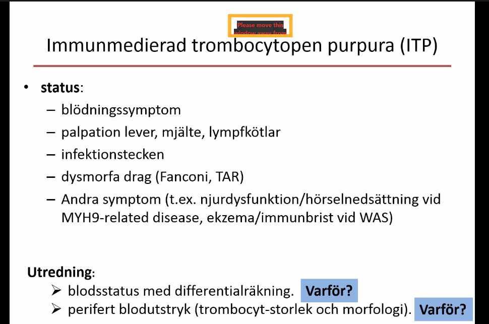

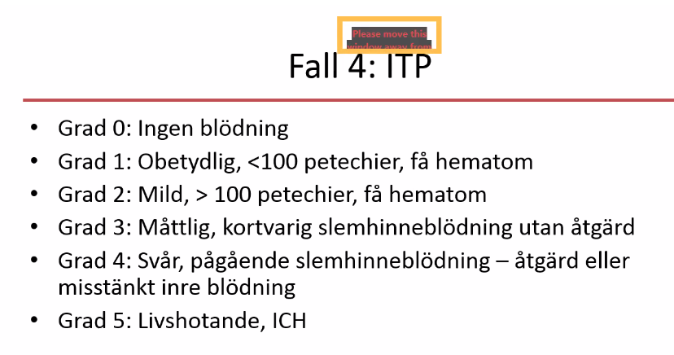

### Fall 5

***a) Kim är 9 år gammal, tidigare väs frisk, men har nu varit trött och håglös de senaste veckorna. Kim brukar i vanliga fall älska att spela fotboll, men är nu grymt osugen på detta. Har varit lite småsnuvig hela vintern, men ingen större skolfrånvaro. Äter och dricker hyfsat. Inget avvikande i status förutom att han ev är lite blek. I rutinprover finner du bla följande: Hb 95, MCV 65.*** 

***Hur tolkar du detta?***

* Mikrocytär anemi pga järnbrist (tillväxt under ungdom  ökat järnbehov).

***Diffdiagnoser?***  

Sekundär anemi pga infl/inf, talassemi.

***Ytterliggare prover?***  

* Komplett blodstatus med diff, 
* S-Fe, 
* TIBC, 
* S-ferritin, 
* retikulocyter, 
* glutenprover, 
* SR, 
* CRP, 
* B12, 
* folsyra, 
* LD, 
* bilirubin, 
* haptoglobin.

***Behandling?*** 

Kostråd, järnsubstitution

***enl läk***

* järnbristanemi är brist på substrat
  * kan bero på mkt annat, 
  * e.g. tarmar att dålig absorption, äter för lite järn, eller att man blöder
  * låga järnvärdet är det sista manifesta,
  * vitigat att man går på varför det låga värdet är som det är. 
* ***prover***
  * bra bas
    * ferritin: akutfas protein, så den kan gå upp vid inflam o infektioner.  e.g. på sepsis patienter eller förkylning kan var falskt för högt.
    * blodstatus + diff: viktigt att veta om det är annat som är involverat osså
  * // järn-värdet varierar med dygnet så det är finlir, den varierar på dygnet, man ska enbart foka på ferritin. har man lågt ferritin mikrocyutär anemi o inget annat är det järbbrit. 

***b) Hamid 2 år som är remitterad till dig på BLM från BVC då han växer dåligt (-2SD). Hamid är en liten blek/gul(?) gosse med stor buk och lite utskjutande panna. Föräldrarna pratar bara arabiska, då familjen nyligen kommit till Sverige från Syrien. Du initierar en ganska bred provtagning och finner bla Hb 65, MCV 60, targetcells på diff.***  

***Hur tolkar du detta?*** 

Talassemi major. Mutationer i beta-globulin  fastnar i mjälten. Man kan få bendeformation av talassemi pga extramedullär produktion. Splenohepatomegali. Mikrocytär anemi. 

***Diffdiagnoser?*** 

Järnbrist, sekundär anemi pga infl/inf

***Provtagning?*** 

Komplett blodstatus med diff, S-Fe, TIBC, S-ferritin, SR, CRP, B12, folsyra, retikulocyter, LD, bilirubin, haptoglobin, F-Hb. Perifert blodutstryk visar targetceller. Diagnos ställs genom analys av hemoglobinfraktioner. Hb-fores. Finns även genetisk analys. Vid talassemi minor är man frisk men bärare. Rådgivning vid framtida partnerval. Sicklecellanemi: Mutation i betaglobulingenen. Vanligast i mitten av Afrika. 3 saker viktiga: Beh smärta (Alvedon, Ipren), beh inf (inf-känsliga, har funktionell asplenism, mjälten är förstörd och de ska ha ab-profylax), benmärgstx är enda botande beh. 

***enl läk***

* Target cells som kan tyda på en thalassemi
* såhär kmr de aldrig presentera sig menar han. 
* Det är relativt
* patofys etiologi
  * att man har påverkad hb proteienr
  * det är mutation i beta-hlobin kedjan, att man producerar en defekt sådan kedja
  * antingen defekt hb molekyl eller 
* olika grader
* gener
  * minor: en mutation fr mamma eller pappa, då är man bara mikräcytär, i övrigt inga symptom o mår ganska bra. 
  * major: denna patient har en thalassemia major, då mutation båda päron, beroende transfusion var tredje vecka för att överleva
    * utskjutande panna = extramedullär blodbildning, så det använder pannan. 
* Major behandling
  * regelbundna transfusioner
  * siktar blodvärde på 95-100
  * kroppen gör sig inte av med hjärn: 
    * kroppen reglerar absoprptionen
  * faran med att få transfusioner är ansamling av hjärn
  * Det man kan göra för att få bort järnet
    * att man kelerar, molekyler som binder järn och få ned järnvärdena
* Diagnosen: Hb-fores. Hb-fraktioner

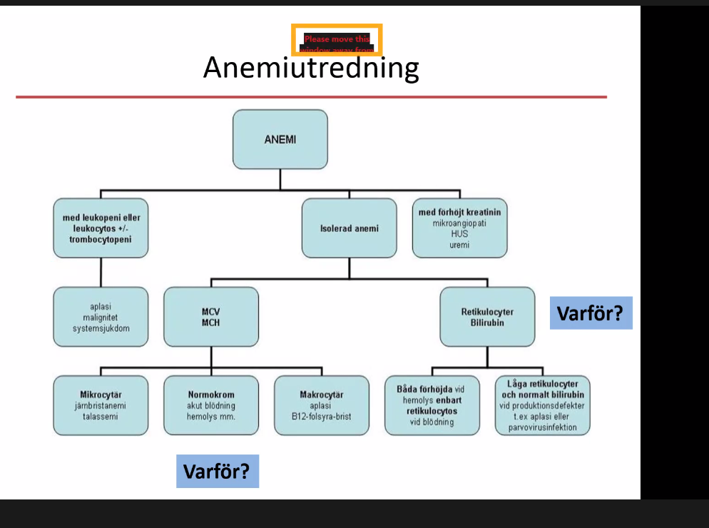

allt detta finns på VPH hemsida, man ska googla VPH PM