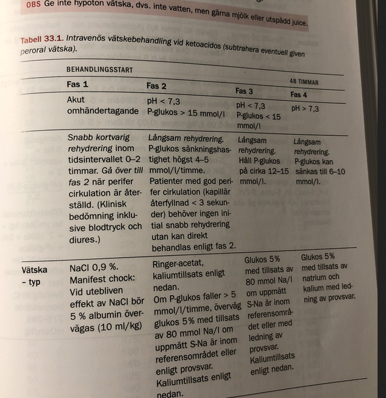

# Diabetes seminarium

### Fall 1

* Fia 2åå
  * Fia söker hos dig på vårdcentral med misstanke om UVI eftersom hon har kissat ofta senaste veckan, ***med tunga blöjor.*** 
  * Fia är opåverkad, men det framkommer att hon varit ovanligt törstig,varför du börjar fundera kring diabetes

#### ***Initial handläggning på vårdcentralen? Motivera dina åtgärder.***

* ***Vårdcentral***
  * ***Anamnes*** 
    * Tidg. sjd
    * SOCRATES om detta sjd förlopp
    * Hereditet
    * trötthet
    * törst
    * viktnedgång
    * ökade urinmängder
    * nattures
    * genital klåda + svamp
    * kramper
    * cyanotisk
    * ventilation
    * feber
  * ***Status***
    * Hydreringsstatus
  * ***Prover***
    * ***Urinsticka:*** 
      * U-ketoner (separat sticka för denna, eller på samma sticka?)
      * Nitrit
      * glukos
      * LPK, granulocyt esteras
      * hemturi
    * ***Kap-glukos***: iom på vårdcentral
    * ***Kap-CRP***: också på vårdcentral
* ***Ang skicka in t akuten***
  * ***För vuxen:*** Diabetiskt ketoacidos (DKA) föreligger definitionsmässigt vid:
    * P-Glukos 11mmol/L eller högre OCH 
    * B-keton 3 mmol/L OCH 
    * pH < 7,3
  * ***I detta fallet, skicna in t akuten:*** 
    * om barnet har högt kap-glukos, 
    * skicka in till akuten eller om det är en passande anamnes + status

#### ***Du kan bekräftadiagnosen diabetes. Vilken behandling kommer Fiaatt få? Initialt och i ett senare skede? Vilka olika sätt finns att administrera insulin?***

* ***Storlek insulin***
  * Kolhydraträkning: fr diabetesdebut, kommer att determinera insulindos
* ***Initialt***
  * ***Insulinbehov***
    * ***över 2-4åå, ingen insulinprod kvar:*** behov 0.6E/kg/d
    * ***puberteten:*** 1.5E/kg/d eller högre
  * ***Om DKA debut***
    * iv-insulin
  * ***om inte DKA-debut***
    * Antingen iv-insulin ELLER subkut insulin
    * då görs övergång iv till subkut 
  * ***På sjukhus***: 
    * antagligen subkutant snabbverkande insulin på sjukhus
  * ***Indikation för pump***
    * litet barn och små doser
    * svår stickrädsla
    * upprepade svåra hypoglykemier
    * svårkontrollerat gryningsfenomen
    * önskan om pump för förbättrad 
* ***Senare skede***
  * Flerdosschema: 
  * Insulinpump: Om tillräckligt gammalt: försköleålder, finns indikation för insulinpump, där man börjar med pump. 
  * 
* ***Schema***
  * Flerdosschema
* ***Behandlingskontroller***
  * Frekvent längd och viktmätning
* ***Fr Morgan***
  * Omhändertagande av barn med nyupptäckt diabetes: 
    * Misstänkt diabetes, 
      * SSK tar OMG puls, 
      * BT, 
      * kapillärprov (P-glukos, blodgas). 
      * EMLA för 2 iv-infarter. 
      * Läkbed. 
    * ***Hyperglykemi***: pH >7,30, BE >–10, pat oftast opåverkad. 
    * ***Hyperglykemi + DKA***: pH <7,30, BE <–10, pat oftast påverkad. 
    * ***Hyperosmolär hyperglykemisk icke-ketotisk koma (HNKS):*** 
      * pH >7,30, BE >–10, P-glukos >33 mmol/l, S-osmolalitet >320, pat oftast påverkad. 
      * Insulin, vätska (snabb + långsam rehydrering i 48h). Inlagd akut, vårdavd 3-7d, dagvård 1v, skola/dagis 1-2v. Totalt 3v för att återgå till vanligt liv. 
    * ***Akut nyupptäckt diabetes utan ketoacidos:*** 
      * Iv insulinbeh 0,05 E/kg/h om <5 år. 
      * Till äldre 0,1 E/kg/h. 
      * Pga risk för snabbt blodsockerfall räcker det oftast med hälften av dessa doser de första 4-6h. 
      * Ingen iv väteskebeh behövs. 
    * ***Långsiktigt***: 
      * Måltidsinsulin + basinsulin (flerdosbeh). 
      * De flesta barn med typ 1 får en initial period med partiell remission (”smekmånadsfasen”) med ett insulinbehov på <0,5 E/kg och nästintill normalt HbA1c. 
      * Förskolebarn och ffa barn <4-5åå beh i oftare m insulinpump som startas tidigt efter debuten. 
      * Förutom lm-beh får pat (föräldrarna) även undervisning, kuratorkontakt, ny inskolning på förskola/dagis

#### ***Insjuknandetvid typ 1-diabetes skiljer sig i vissa avseenden åt mellansmå barnochstörre barn/vuxna. Diskutera på vilka sätt.*** 

***Early***

* ***Most common – the ‘classical triad’:***
    * excessive drinking (polydipsia)
    * polyuria
    * weight loss
* ***Less common:***
    * enuresis (secondary)
    * skin sepsis
    * candida and other infections

***Late – diabetic ketoacidosis***

* Smell of acetone on breath
* Vomiting
* Dehydration
* Abdominal pain
* Hyperventilation due to acidosis (Kussmaul breathing)
* Hypovolaemic shock
* Drowsiness
* Coma and death

***1-4 åå***

* Ju yngre barnet, desto snabbare förlopp för sjukdomen
* barn som insjuk 1-2åå har oftast endast några dagar anamnes på
  *  ökad törst, 
  * ökad urinmängd
  * de kan i värsta fall få en snabbt tilltagande ketos + utv ketoacidos
* genital svampinfek kan vara ett symptom föröjt blodsocker
* små barn kan ha svårt att uttrycka törst. 
* kräkningar utan diarre kan vara symptom på ketoacidos

***Förskolebarn och skolbarn***

* Insjuknandet är vanligen typiskt med ökad törst och ökade urinmängder 2-3v tid
* Nattenures, viktnedgång (som kaske inte uppfattas förrän barnet gått upp i vikt igen efter insulinbeh)
* och en ökad trötthhet är också typiska symptom
* om barnet inte får behandling f inns det risk för att det utvecklar ketaoacidos
* ett barn med förhöjt blodglukos eller glukos i urinen måste därför remitteras akut t barnklinik för bedöm o beh samma dag. 

#### Vilka typer av diabetes kan diagnosticeras hos barn? Hur kan vi utreda när diagnosen är oklar?

* ***Type 1. Most childhood diabetes***
    * Destruction of pancreatic β-cells by an autoimmune process
* ***Type 2. Insulin resistance followed later by β-cell failure***
    * Usually older children, obesity-related, positive family history, not as prone to ketosis, more common in some ethnic groups (e.g. Black and Asian children)
* ***Other types***
    * MODY
      * Maturity onset diabetes of the young various types caused by genetic defects in β-cell function. Strong family history.
      * dominant ärftliga defekter i bet cellens funktion
      * hereditet tydlig
      * MODY2 och MODY3 är vanligast
      * beahandlas olika sätt och prognos
      * // Sekundär diabee
    * Drugs, e.g. corticosteroids
    * Pancreatic insufficiency, e.g. cystic fibrosis, iron overload in thalassaemia
    * Endocrine disorders, e.g. Cushing syndrome
    * Genetic/chromosomal syndromes, e.g. Down and Turner
    * Neonatal diabetes: transient and permanent secondary to defective B cell function.
    * Gestational diabetes
    * Gastroenterit med hyperton dehydrering

// notera ang sekundär diabetes, att det inte är sekundärt om det är gastroenterit + hyperton dehydrering, då det inte är en riktig diabetes, utan ger förhöjda glukosvärden bara...

***Utredning när diagnos oklar***

* ***fB-glukos***
* ***Hba1c***
* ***OGTT:*** oral grlukostolerans
* ***c-peptid***
* ***HLA-typning***
* ***antikroppantikroppar***: 
  * GADA
  * IA-2A
  * IAA
  * ICA
  * Zink-antikroppar
  * Dessa antikroppar kan upptäckas långt före klinisk diabetsdebut

### Fall 2

* 11åå Malek kommer medambulans och du är vik läkpå barnakuten. 
* Han har diabetes typ 1 sedan 8 års ålder och har pump. 
* Nu hittad i sängen efter att ha varit ”magsjuk” med kräkningar under natten. 
* Malek är medvetandesänkt och andas tungt

#### Vilket tillstånd bör du misstänka? Hur förklarar du hans symtom?Vad kan den bakomliggande orsaken vara?

* DKA
* respiratorisk kompensation av metabol acidos

#### Vad blir din initiala åtgärder

* ***Utredning***
  * Om svårt att avgöra symptom, enbart beror på ketoacid eller dessutiom akut kirugisk bukåkomma för man först
    *  korrigera ketoacidostilltånd ochj 
    * därefter på nytt ta ställning t evt kvarstående buksymptom
  * Blodprover
    * glukos
    * B-ketoner
    * B-HB
    * B-EVF
    * B-CRP
    * Na, ka, cl, calcium
    * alb urea krea
    * osmol i serum
    * blodgas
    * HbA1c
    * odling vid feber
  * urin
    * glukos
    * ketoner
  * EKG på alla 
  * vikten, dagligen och ankomst sjk
* ***Handlägg***
  * v-sond: om stora mäönder sockerhaltig vätska behövs, görs med v-sond
* ***Behandling***
  * omedelbar kontakt under adekvat övervak närmsta barnklinik
  * IVA-fall
  * bakjour tillkallas
  * undvik hjärnödem och hypokalemi med vätsketerapin
  * ***rehydrering***: långsam rehydrering
  * ketoacidos karakterisas av fölkand ebiokem förändringar
  * nedsatt perifert glukosutnyttjande. Detta leder t hypergl
  * ***Häva acidos***
    * med insulin
  * när acidos hävd: eftersträva normoglykemi
  * ***osmolalitet***: långsamt normalisera osmolalitet som hyperglykemin orsakat
  * 

