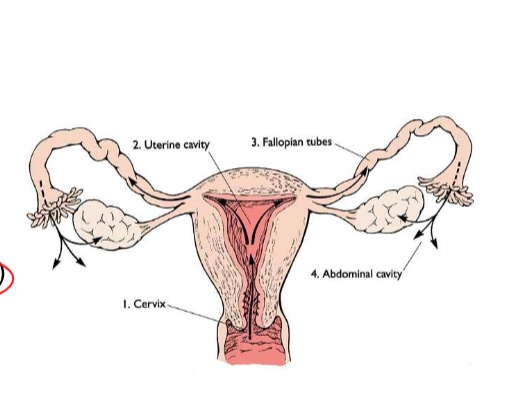

## Akut gynekologisk buk

* Infektioner
* benigna cystor
* Graviditeter i 1a trimester

#### Gynekologisk undersökning

* Ytrre inspektion av vuilva
* vaginalundersök med spekulom + depressor
* bimanuell palpation av uterus och adnexa
* ulj undersökning

### Fall 1 - PID?

* **41-årig väsentligen** 
  * frisk kvinna söker för nedre molandebuksmärtor sedan 3 dygn. Mest ont långt ner till hö ibuken och lite allmän sjukdomskänsla.Har fött 2 barn och är tidigare gynekologiskt frisk, aldrigopererad i buken.Status: temp 38,5°, ömmande utfyllnad till hö och bakom uterus

***Fördjupad anamnes***

* Sedvanlig anamnes för tidigare och nuvarande sjukdomar: frisk
* tidigare gyn besvär: väsentligen gynrfrisk
* smärtanamnes: SOCRATES; haft tilltagande molvärk i buken senaste veckan, mest ont i ner t hö, säler då besvär tilltar
* sexualanamnes, ny partner: ingen ny partner
* mensdata, preventivmedel: rb mens, SM 3v sedan, kopparspiral som suttit 8år
* GI symptom, mitkionsbesvär: inget avvikandevarför

***Provtagning på akuten***

* BT 120/75
* puls 80
* temp 38.5
* saturation 96
* andningsfrekvens 15
* Hb kap 120
* CRP kap 190
* u-sticka: LPK 1+, nitrit neg, HCG neg

#### Gynekologiska infektioner åp akuten

* **Övre uppåtstigande**
  * **Gränsen går vid cervix**
    * **uterus**: endometrit
    * **tubor**: salpingit
    * **ovarier**: ooforit
    * **tuboovarialabscess**
* **Nedre**
  * **Vulvo-vaginit**
    * herpes simplex
    * bartoliniter
  * **Cervicit**
    * klamydia
    * mykoplasma urogenitale
    * gonorre

#### PID - pelvic inflammatory disease

***Etiologi och patofysiologi***

* **Uppåtstigande disease**
* **Innefattar olika grad av** 
  * endometritP-piller om recidiverande cystor
  * salpingit
  * ooforit
  * TOA: tuboovarialabscess
  * peritonit
  * perihepatit: 
* **STD**: sexually transmittable diseases
  * **klamydia**
  * **gonorre**
  * **mykoplasma urogenitale**
  * **oftast salpingit**
* **vaginal anaerob blandflora**
* **tarmflora med bla E.coli**
* **abscesser**: ofta polymikrob flora, endast 30% STD
* **actinomyces och TBC kan**: ovanligt
  * kan bli utsått över hela peritoneum
  * diff diagnos: peritoneal-carcinos

***Kliniska kännetecekn***

* varierar: 
  * **fr subklinisk infek till**
  * **!!! AT påverkan + spesis**
* **nedre buksmärtor, ofta bilat**
* **vaginal flytning**
* **olaga vaginal blödning**
* **feber**
* **påverkan på mikton + avföring**

***Utredning och handläggning***

* **Odla**!
* **UL**: ofta oregelbunden resistens med varierande ekogenicitet. vid aspiration, dränage
* **DT**: bra för säkrare kartläggning samt att följa behandling. skilja fr divertikulit o appendicit
* **Laparoskopi vid oklar diagnos**: eventuellt

***DIfferentialdiagnoser + riskfaktorer***

* **Riskfaktorer**
  * Sexualbeteende
  * låg ålder
  * IUD (intrauterindevice) spiral; första 3v om kopparspiral suttit för länge
  * iatrogent vid operationer uterus och adnexa: obs bakteriell vaginos
* **DIfferentialdiagnoser**
  * appendicit
  * divertikulit med/utan abscess

***Behandling***

* Antibiotika po/iv beroende på infektiosutbredning
* kirurgi vid abscess: akut eller lugnt skede; fertilitetsbevarande=?
* dränage av abscess

***Komplikationer / konsekvenser på sikt***

* Infertilitet; tubarskador
* risk för extrautering graviditet
* adherenser med smärta

#### Fall 2 - cystal torsion

* 23-årig frisk kvinna inkommer till akuten efter plötsligt insättande av kraftiga nedre buksmärtor sedan 2.5 timmar. Patienten är kallsvettig, smärtpåverkad och kräks.

***Fördjupad anamnes***

* **Sedvanlig anamnes för tidigare och nuvarande sjukdomar:** väs frisk
* **Tidigare gynekologiska besvär:** haft en liknande episod tidigare som gick över spontant
* **Smärtanamnes: typ av smärta, lokalisation, kontinuerlig/intermittent, tidförlopp**: fick väldigt akut ont i nedre delen av buken, mest hö sida, ont hela tiden men får intermittent ännu ndare
* **Sexualanamnes, ny partner**: ingen ny partner
* **Mensdata, preventivmedel:** rb mens (regelbunden?), SM drygt 3 v (sista mens), kondom
* **GI symtom, miktionsbesvär?:** inget avvikand

***Provtagning på akuten***

* **BT**: 130/70
* **puls**: 90
* **Temp**: 36.5
* **kHb**; 120
* **kCRP**: under 5
* **saturation**: 98 
* **andningsfrekvens**: 17
* **u-sticka**: allt negativt

***Undersökning***

* **UL-gynd**: ekofri cysta hö ovarium på 6cm, diameter

***Etiologi och patofysiologi***

* **Orsak till smärta**: torsion av cysta; 

#### Benigna cystor - symptom och kliniska fynd

***Etiologi och patofysiologi***

* **Funktionella cystor**
  * Följer menscykeln
  * follikelcysta
  * corpus luteum cysta
  * theca lutein cysta
* **Äkta cystor**
  * **Endometriom**
  * **neoplasi**: dermoid; cystadenom
* 

***Kliniska kännetecken***

* **Smärta**: varierande grad och karaktär. 
* Trycksmärta över blåsa, tarm, kan vara svårt att sitta, gå etc.
* **Torsion**: kraftiga smärtor, ofta intervallkaraktär.
* **Olaga blödningar**: stör menscykeln
* **Symptomfria**: hittas som bifynd!
* **Fast cysta kan palperas:** 
  * beskriv storlek, 
  * regelbunden eller ej, 
  * rörlighet, 
  * förhållande till uterus, 
  * palpömhet mm
* **UL**: bra diagnostiskt hjälpmedel!
* En lite vätskefylld cysta går inte alltid att palpera

#### Follikelcysta

***Etiologi och patofysiologi***

* I princip en icke rupturerad follikel
* benign

***Kliniska kännetecken***

* Ekofri på ultraljud
* många fall endast exspektans följ upp efter 6-8v

***Utredning och handläggning***

***Behandling***

* **Laparoskopi** om smärta eller om större cysta som ej går tillbaka, 6cm; 
  * skala ut cystan
  * bevara ovariet
* **P-piller om recidiverande cystor**

#### Corpus luteum cysta

***Etiologi och patofysiologi***

* bildas efter ovulation
* innehålloer ofta blödning; ses som stråkigheter på UL
* kan brista med blödning i buk
* blir sällan stor: oftast 4-5cm

***Behandling***

* OFta exspektans, går tillbaka
* laparoskopi om smärta ellr riklig blödning
  * svår att skala ur
  * blodstilla

#### Theca luteincystor (ovanliga)

***Etiologi och patofysiologi***

* **tillväxer av höga halter hCG**
* **kan ses vid IVF, duplex graviditet, och vid mola**
* **ofta bilaterala**
* **Överstimulering**
  * risk elektrlytrubbning
  * ascites
  * pleuravätska

***Behandling***

* vid överstimulering: Inläggning enl PM
* cystorna i sig behöver oftast inte åtgärdas

#### Ovarian hyperstimulation syndrome (OHSS)

***Etiologi och patofysiologi***

***Kliniska kännetecken***

* **Gradering**
  * **mild OHSS:** 
    * bukspänning
    * lindrig buksmära
    * obetydlig ascites
    * ovarier fotat under 8cm
  * **måttlig OHSS**
    * måttlig buksmärta
    * illamående 
    * kräkning och eller diarre
    * måttlig ascites (30-50mm i fossa douglasi)
    * ovarier 8-12cm, B-EVF under 0.44
  * **Allvarlig OHSS**: 
    * svåra buksmärtor
    * oåverkat AT
    * påtaglig ascites: öve 50mm i fossa D
    * ovarier över 12cm
    * dyspne
    * ev pleuravätska
    * hypoproteinemi
    * oliguir
    * med normalt S-krea
    * B-EVF 0.45-0.55
  * **Kritisk OHSS**
    * svåra buksmärtor
    * uttalad ascites
    * pleuravätska
    * EVF under över 0.55
    * LPK över 25
    * oliguri, anuri
    * ARDS
    * tromboembolism
    * leersvikt
    * DIC
    * multipel organsvikt

***Riskfaktorer***

* Unga kvinnor
* mulktifollikulära ovarier med eller utan PCOS
* nedreglering med GnRH analog (inhiberande då?)
* att behandlingen givit upphov t graviditet, särskilt flerbörd

#### Endometriom

***Etiologi och patofysiologi***

* Endometrios: extrauterin endometrievävnad, vanligast i lilla bäckenet
* Kallas ”chokladcystor” pga innehållet, ger en relativt homogen ekogenicitet på ulj.
* Kan destruera ovariet på sikt, bör behandlas

#### Endometrios

***Kliniska kännetecken***

* **Ofta kronisk smärtproblematik**
    * dyspareuni (djup)
    * dysmenorré
    * buksmärtor
* **Behandling**
    * **medicinsk** 
        * kontinuerligt gestagen
        * GnRH analoger (tillfälligt ”klimakterium”)
    * **kirurgisk**: ta bort synliga förändringar
* **Subfertilitet**

#### Avancerad endometrios

***Kliniska kännetecken***

* Många patienter söker akut pga smärtgenombrott
* Svåra att handlägga då de ofta kräver stora mängder morfin
* Mycket ångest och psykiskt lidande
* Många patienter blir utslagna från studier, arbetsliv och även socialt
* Multidisciplinärt omhändertagande är ett måste, men fungerar inte alltd

#### Dermoid (benignt teratom)

***Kliniska kännetecken***

* Innehåller ofta talg, hår, tänder, thyreoideavävnad kan förekomma (alla groddblad representerade)
* Fast, hård konsistens, risk för torsion
* Ofta bilaterala anlag
* 10-20% av alla ovarialtumörer
* Ekogena partier på ulj, kan vara svåra att skilja från endometriom
* Kan destruera ovariet på sikt, bör opereras!

#### Cystenukleation

* Mindre cystor kan skalas ur och ovarievävnad kan sparas

#### Differentialdiagnoser Benigna cystor

* **Skaftade myo**
* **paraovarialcystor, peritonealcystor**
* **maligna cystor**
  * ålder, storlek
  * solida partier, flerrummig, speta, bilaterala, ascites

#### Fall 4

* 26-årig kvinna 
  * inkommer medvaginal blödning och successivttilltagande nedre buksmärta sist dygnet.Hon är tidigare väsentligen frisk, haraldrig varit gravid.Status: AT blek, smärtpåverkad,generellt palpöm i buken med peritonit inedre delen till höger.
  * SM 6 veckor sedan, har lite oregelbunden mens
  * Pos gravtest
  * BT 100/60
  * Puls 100
  * Hb 90
  * Ulj
  * Vilken diagnos måste vi utesluta?
    * Extrauterin graviditet

**Fördjupad anamnes blödning i tidig graviditet:**

* Regelbunden mens, cykellängd
* Tidigare graviditeter
* Blödningens mängd
* Smärta
* Riskfaktorer för X? (extrauterin graviditet)Tolkning ulj bild
* Ingen synlig intrauterin graviditet
* Blod och koagler i buken, syns bakom uterus i fossa Douglasi

**!!! Vad gör vi?** Pat behöver laparoskoperas akut!

#### Extrauterin graviditet (X)

***Etiologi och patofysiologi***

* **Incidens**: ca 2% av spontana graviditeter
* !!! 73% av graviditetsrelaterad mortalitet i tidig graviditet globalt
* **Riskfaktorer**
    * PID 
    * tidigare X
    * endometrios
    * tubaroperation
    * infertilitet
    * ökad risk vid grav med samtidig spiral eller minipille

***Kliniska kännetecken***

* Olaga blödning: 85% av fallen
* buksmärta av varierande grad: 85% av fallen
* Symptomfri till allmänpåverkadn
* cirkulatorisk påverkan: blod i buken?
* UL: tom kavitet, synligt X
* adnexal ring sign

***Behandling***

* **Avvaka**: spontan regress? 
  * följ klinisk bild + s-hCG enl PM
* **Kirurgi**: laparoskpi, tomi
  * om tuban är skadad är det oftast bäst att ta bort den
* **methotrexat im**: om s-hCG under 4000 + ingen intraabdominell blödning
  * passar bra för låga, men persisterande S-hCG värden

#### Differentialdiagnoser vid blödning i tidig grav

* **när diagnos oklar:** kliniska bilden + S-hCG kan följas 
  * S-hCG stiger kraftivgt vid en normal tidig grav
* **Tumregel** vid S-hCG över 1000U/L
  * man bör se hinnsäcken intrauterint, om grav normal
* **Missfall**
  * ofta riklig blödning med klumpar 
  * sälln "akut buk"
  * uterus är palpöm
  * kan behöva följas med S-hCG och UL
  * 15-25% av alla kliniska graviditeter slutar i missfall
* **Normal tidig graviditet**
  * kan blöda
  * kan ha ont, men sällan allmänpåverkad
  * kan behöva följas med S-hCG och UL

#### Pregnancu of unknown location - PUL

#### Tubarhörnsgraviditet

#### Cervixgraviditet

#### ektopisk grav i tidigare sectioärr

#### Mer ovanliga ektopiska grav 

* pot farliga med blödninsrisk

***Tubarhörns, interstitiell***

* Grav går längre innan vävnaden rupturerar
* tubarhörn + tuban måste tas bort

***Cervic***

* ska helst beh med methotrexat
* svart sfå stopp blödning med exeres
  * det inte finns myometrievävnad **som kan kontraheras**

***Tidigare sectioärr***

* en form av accreta i väldigt tunn vävnad
* stor risk för blödning
* **behandling**
  * Methotrexat
  * exeres med samtidig ballong + beredskap för emobilisering
  * hysterektomi