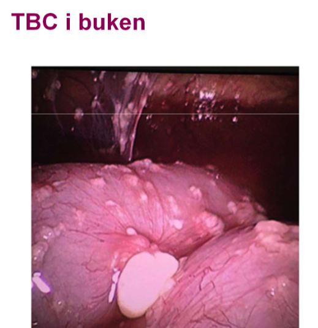

## Akut gynekologisk buk

* Infektioner
* benigna cystor
* Graviditeter i 1a trimester

#### Gynekologisk undersökning

* Ytrre inspektion av vuilva
* vaginalundersök med spekulom + depressor
* bimanuell palpation av uterus och adnexa
* ulj undersökning

### Fall 1 - PID?

* **41-årig väsentligen** 
  * frisk kvinna söker för nedre molandebuksmärtor sedan 3 dygn. Mest ont långt ner till hö ibuken och lite allmän sjukdomskänsla.Har fött 2 barn och är tidigare gynekologiskt frisk, aldrigopererad i buken.Status: temp 38,5°, ömmande utfyllnad till hö och bakom uterus

***Fördjupad anamnes***

* Sedvanlig anamnes för tidigare och nuvarande sjukdomar: frisk
* tidigare gyn besvär: väsentligen gynrfrisk
* smärtanamnes: SOCRATES; haft tilltagande molvärk i buken senaste veckan, mest ont i ner t hö, säler då besvär tilltar
* sexualanamnes, ny partner: ingen ny partner
* mensdata, preventivmedel: rb mens, SM 3v sedan, kopparspiral som suttit 8år
* GI symptom, mitkionsbesvär: inget avvikandevarför

***Provtagning på akuten***

* BT 120/75
* puls 80
* temp 38.5
* saturation 96
* andningsfrekvens 15
* Hb kap 120
* CRP kap 190
* u-sticka: LPK 1+, nitrit neg, HCG neg

#### Gynekologiska infektioner åp akuten

* **Övre uppåtstigande**
  * **Gränsen går vid cervix**
    * **uterus**: endometrit
    * **tubor**: salpingit
    * **ovarier**: ooforit
    * **tuboovarialabscess**
* **Nedre**
  * **Vulvo-vaginit**
    * herpes simplex
    * bartoliniter
  * **Cervicit**
    * klamydia
    * mykoplasma urogenitale
    * gonorre

#### PID - pelvic inflammatory disease

***Etiologi och patofysiologi***

* **Uppåtstigande disease**
* **Innefattar olika grad av** 
  * endometritP-piller om recidiverande cystor
  * salpingit
  * ooforit
  * TOA: tuboovarialabscess
  * peritonit
  * perihepatit: 
* **STD**: sexually transmittable diseases
  * **klamydia**
  * **gonorre**
  * **mykoplasma urogenitale**
  * **oftast salpingit**
* **vaginal anaerob blandflora**
* **tarmflora med bla E.coli**
* **abscesser**: ofta polymikrob flora, endast 30% STD
* **actinomyces och TBC kan**: ovanligt
  * kan bli utsått över hela peritoneum
  * diff diagnos: peritoneal-carcinos

***Kliniska kännetecekn***

* varierar: 
  * **fr subklinisk infek till**
  * **!!! AT påverkan + spesis**
* **nedre buksmärtor, ofta bilat**
* **vaginal flytning**
* **olaga vaginal blödning**
* **feber**
* **påverkan på mikton + avföring**

***Utredning och handläggning***

* **Odla**!
* **UL**: ofta oregelbunden resistens med varierande ekogenicitet. vid aspiration, dränage
* **DT**: bra för säkrare kartläggning samt att följa behandling. skilja fr divertikulit o appendicit
* **Laparoskopi vid oklar diagnos**: eventuellt

***DIfferentialdiagnoser + riskfaktorer***

* **Riskfaktorer**
  * Sexualbeteende
  * låg ålder
  * IUD (intrauterindevice) spiral; första 3v om kopparspiral suttit för länge
  * iatrogent vid operationer uterus och adnexa: obs bakteriell vaginos
* **DIfferentialdiagnoser**
  * appendicit
  * divertikulit med/utan abscess

***Behandling***

* Antibiotika po/iv beroende på infektiosutbredning
* kirurgi vid abscess: akut eller lugnt skede; fertilitetsbevarande=?
* dränage av abscess

***Komplikationer / konsekvenser på sikt***

* Infertilitet; tubarskador
* risk för extrautering graviditet
* adherenser med smärta

#### Fall 2 - cystal torsion

* 23-årig frisk kvinna inkommer till akuten efter plötsligt insättande av kraftiga nedre buksmärtor sedan 2.5 timmar. Patienten är kallsvettig, smärtpåverkad och kräks.

***Fördjupad anamnes***

* **Sedvanlig anamnes för tidigare och nuvarande sjukdomar:** väs frisk
* **Tidigare gynekologiska besvär:** haft en liknande episod tidigare som gick över spontant
* **Smärtanamnes: typ av smärta, lokalisation, kontinuerlig/intermittent, tidförlopp**: fick väldigt akut ont i nedre delen av buken, mest hö sida, ont hela tiden men får intermittent ännu ndare
* **Sexualanamnes, ny partner**: ingen ny partner
* **Mensdata, preventivmedel:** rb mens (regelbunden?), SM drygt 3 v (sista mens), kondom
* **GI symtom, miktionsbesvär?:** inget avvikand

***Provtagning på akuten***

* **BT**: 130/70
* **puls**: 90
* **Temp**: 36.5
* **kHb**; 120
* **kCRP**: under 5
* **saturation**: 98 
* **andningsfrekvens**: 17
* **u-sticka**: allt negativt

***Undersökning***

* **UL-gynd**: ekofri cysta hö ovarium på 6cm, diameter

***Etiologi och patofysiologi***

* **Orsak till smärta**: torsion av cysta; 

#### Benigna cystor - symptom och kliniska fynd

***Etiologi och patofysiologi***

* **Funktionella cystor**
  * Följer menscykeln
  * follikelcysta
  * corpus luteum cysta
  * theca lutein cysta
* **Äkta cystor**
  * **Endometriom**
  * **neoplasi**: dermoid; cystadenom
* 

***Kliniska kännetecken***

* **Smärta**: varierande grad och karaktär. 
* Trycksmärta över blåsa, tarm, kan vara svårt att sitta, gå etc.
* **Torsion**: kraftiga smärtor, ofta intervallkaraktär.
* **Olaga blödningar**: stör menscykeln
* **Symptomfria**: hittas som bifynd!
* **Fast cysta kan palperas:** 
  * beskriv storlek, 
  * regelbunden eller ej, 
  * rörlighet, 
  * förhållande till uterus, 
  * palpömhet mm
* **UL**: bra diagnostiskt hjälpmedel!
* En lite vätskefylld cysta går inte alltid att palpera

#### Follikelcysta

***Etiologi och patofysiologi***

* I princip en icke rupturerad follikel
* benign

***Kliniska kännetecken***

* Ekofri på ultraljud
* många fall endast exspektans följ upp efter 6-8v

***Utredning och handläggning***

***Behandling***

* **Laparoskopi** om smärta eller om större cysta som ej går tillbaka, 6cm; 
  * skala ut cystan
  * bevara ovariet
* **P-piller om recidiverande cystor**

#### Corpus luteum cysta

***Etiologi och patofysiologi***

* bildas efter ovulation
* innehålloer ofta blödning; ses som stråkigheter på UL
* kan brista med blödning i buk
* blir sällan stor: oftast 4-5cm

***Behandling***

* OFta exspektans, går tillbaka
* laparoskopi om smärta ellr riklig blödning
  * svår att skala ur
  * blodstilla

#### Theca luteincystor (ovanliga)

***Etiologi och patofysiologi***

* **tillväxer av höga halter hCG**
* **kan ses vid IVF, duplex graviditet, och vid mola**
* **ofta bilaterala**
* **Överstimulering**
  * risk elektrlytrubbning
  * ascites
  * pleuravätska

***Behandling***

* vid överstimulering: Inläggning enl PM
* cystorna i sig behöver oftast inte åtgärdas

#### Ovarian hyperstimulation syndrome (OHSS)

***Etiologi och patofysiologi***

***Kliniska kännetecken***

* **Gradering**
  * **mild OHSS:** 
    * bukspänning
    * lindrig buksmära
    * obetydlig ascites
    * ovarier fotat under 8cm
  * **måttlig OHSS**
    * måttlig buksmärta
    * illamående 
    * kräkning och eller diarre
    * måttlig ascites (30-50mm i fossa douglasi)
    * ovarier 8-12cm, B-EVF under 0.44
  * **Allvarlig OHSS**: 
    * svåra buksmärtor
    * oåverkat AT
    * påtaglig ascites: öve 50mm i fossa D
    * ovarier över 12cm
    * dyspne
    * ev pleuravätska
    * hypoproteinemi
    * oliguir
    * med normalt S-krea
    * B-EVF 0.45-0.55
  * **Kritisk OHSS**
    * svåra buksmärtor
    * uttalad ascites
    * pleuravätska
    * EVF under över 0.55
    * LPK över 25
    * oliguri, anuri
    * ARDS
    * tromboembolism
    * leersvikt
    * DIC
    * multipel organsvikt

***Riskfaktorer***

* Unga kvinnor
* mulktifollikulära ovarier med eller utan PCOS
* nedreglering med GnRH analog (inhiberande då?)
* att behandlingen givit upphov t graviditet, särskilt flerbörd

#### Endometriom

***Etiologi och patofysiologi***

* Endometrios: extrauterin endometrievävnad, vanligast i lilla bäckenet
* Kallas ”chokladcystor” pga innehållet, ger en relativt homogen ekogenicitet på ulj.
* Kan destruera ovariet på sikt, bör behandlas

#### Endometrios

***Kliniska kännetecken***

* **Ofta kronisk smärtproblematik**
    * dyspareuni (djup)
    * dysmenorré
    * buksmärtor
* **Behandling**
    * **medicinsk** 
        * kontinuerligt gestagen
        * GnRH analoger (tillfälligt ”klimakterium”)
    * **kirurgisk**: ta bort synliga förändringar
* **Subfertilitet**

#### Avancerad endometrios

***Kliniska kännetecken***

* Många patienter söker akut pga smärtgenombrott
* Svåra att handlägga då de ofta kräver stora mängder morfin
* Mycket ångest och psykiskt lidande
* Många patienter blir utslagna från studier, arbetsliv och även socialt
* Multidisciplinärt omhändertagande är ett måste, men fungerar inte alltd

#### Dermoid (benignt teratom)

***Kliniska kännetecken***

* Innehåller ofta talg, hår, tänder, thyreoideavävnad kan förekomma (alla groddblad representerade)
* Fast, hård konsistens, risk för torsion
* Ofta bilaterala anlag
* 10-20% av alla ovarialtumörer
* Ekogena partier på ulj, kan vara svåra att skilja från endometriom
* Kan destruera ovariet på sikt, bör opereras!

#### Cystenukleation

* Mindre cystor kan skalas ur och ovarievävnad kan sparas

#### Differentialdiagnoser Benigna cystor

* **Skaftade myo**
* **paraovarialcystor, peritonealcystor**
* **maligna cystor**
  * ålder, storlek
  * solida partier, flerrummig, speta, bilaterala, ascites

#### Fall 4

* 26-årig kvinna 
  * inkommer medvaginal blödning och successivttilltagande nedre buksmärta sist dygnet.Hon är tidigare väsentligen frisk, haraldrig varit gravid.Status: AT blek, smärtpåverkad,generellt palpöm i buken med peritonit inedre delen till höger.
  * SM 6 veckor sedan, har lite oregelbunden mens
  * Pos gravtest
  * BT 100/60
  * Puls 100
  * Hb 90
  * Ulj
  * Vilken diagnos måste vi utesluta?
    * Extrauterin graviditet

**Fördjupad anamnes blödning i tidig graviditet:**

* Regelbunden mens, cykellängd
* Tidigare graviditeter
* Blödningens mängd
* Smärta
* Riskfaktorer för X? (extrauterin graviditet)Tolkning ulj bild
* Ingen synlig intrauterin graviditet
* Blod och koagler i buken, syns bakom uterus i fossa Douglasi

**!!! Vad gör vi?** Pat behöver laparoskoperas akut!

#### Extrauterin graviditet (X)

***Etiologi och patofysiologi***

* **Incidens**: ca 2% av spontana graviditeter
* !!! 73% av graviditetsrelaterad mortalitet i tidig graviditet globalt
* **Riskfaktorer**
    * PID 
    * tidigare X
    * endometrios
    * tubaroperation
    * infertilitet
    * ökad risk vid grav med samtidig spiral eller minipille

***Kliniska kännetecken***

* Olaga blödning: 85% av fallen
* buksmärta av varierande grad: 85% av fallen
* Symptomfri till allmänpåverkadn
* cirkulatorisk påverkan: blod i buken?
* UL: tom kavitet, synligt X
* adnexal ring sign

***Behandling***

* **Avvaka**: spontan regress? 
  * följ klinisk bild + s-hCG enl PM
* **Kirurgi**: laparoskpi, tomi
  * om tuban är skadad är det oftast bäst att ta bort den
* **methotrexat im**: om s-hCG under 4000 + ingen intraabdominell blödning
  * passar bra för låga, men persisterande S-hCG värden

#### Differentialdiagnoser vid blödning i tidig grav

* **när diagnos oklar:** kliniska bilden + S-hCG kan följas 
  * S-hCG stiger kraftivgt vid en normal tidig grav
* **Tumregel** vid S-hCG över 1000U/L
  * man bör se hinnsäcken intrauterint, om grav normal
* **Missfall**
  * ofta riklig blödning med klumpar 
  * sälln "akut buk"
  * uterus är palpöm
  * kan behöva följas med S-hCG och UL
  * 15-25% av alla kliniska graviditeter slutar i missfall
* **Normal tidig graviditet**
  * kan blöda
  * kan ha ont, men sällan allmänpåverkad
  * kan behöva följas med S-hCG och UL

#### Pregnancu of unknown location - PUL

#### Tubarhörnsgraviditet

#### Cervixgraviditet

#### ektopisk grav i tidigare sectioärr

#### Mer ovanliga ektopiska grav 

* pot farliga med blödninsrisk

***Tubarhörns, interstitiell***

* Grav går längre innan vävnaden rupturerar
* tubarhörn + tuban måste tas bort

***Cervic***

* ska helst beh med methotrexat
* svart sfå stopp blödning med exeres
  * det inte finns myometrievävnad **som kan kontraheras**

***Tidigare sectioärr***

* en form av accreta i väldigt tunn vävnad
* stor risk för blödning
* **behandling**
  * Methotrexat
  * exeres med samtidig ballong + beredskap för emobilisering
  * hysterektomi

## CTG

* Varför fosterövervak: 
* under förlossning: intrapartalt
* identifiera hotande asfyxi
* förebygga asfyxirelaterad sjuk
* minimera sjuk vid utvecklad asfyxi
* innan förlossning = antepartalt fr gv 24
  * förebygga asfyxirelaterad sjuk o död hos riskgrupper
* antepartalt kan man använda ultralhjud för att se hur ett barn mår innan värkar

***Bakgrund***

* metoder för fosterövervak, funnits en del: 
  * tratt med att man lyssnar; 
  * CTG introducerades på -60 talet (det är en UL övervak) tittar kontinuerligt på HF på barnet
  * Skalpblodprov pH/laktat: tar ett kapillärt prov på skalpen för att evaluera
  * STAN: är inte bättre resultat med denna, Sverige använder ej Stan, men USA vissa delar av tyskland etc

***Metod med CTG***

* cardiotopogram
* yttre registrering md UL,
  * reggar HF, som med EKG
* man är intresserad av frekvens på värkarna. 
* intrauterint tryck på 30mmHg slutar perfusion fr placenta t barnet. 
* Inre registrering: behöver att hinnorna har gått; att man sätter på skalpen på ungen
* yttre registrering: inte lika bra som inre reg; 
* I den röda rutan: så är det mammans puls
* varje ruta är 1 minut. 

***Riskreduktion***

* CP skador är antepartala; CTG är intrapartala, vilket innebär att CTG inte kan 
* Senare randomiserade studier:
  * Minskad risk perinatala kramper/encefalopati
  * Ej påvisad minskad risk mortalitet i lågriskpopulation
  * Ej påvisadminskad risk intrapartalCP (90% utvecklad före förlossning)
* Sensitivitetetför CTG är hög dvs sjukt barn oftast positiv test (=patologisk CTG)
* Specificiteten är låg dvs vanligt att friskt barn har positiv test
* CTG tolkningen inter-och intraindividuellt korrelerar dåligt
* CTG användning ökar antalet snitt och sugklockeförlossningar(befogat?)

***Fysiologi***

* Autonoma nervsystemet
  * Sympatikus 
      –stresshormoner 
      –takykardi
  * Parasympatikus 
      -n vagus
      –bradykardi
  * Tryckreceptorer 
      –registrerar tryckförändringar i blodbanan
  * Kemoreceptorer
      –registrerar syremättnad i blodet
  * CTG visar: fostrets hjärtfrekvensanpassning av cirkulationen vid tex värkarbete

***syrebrist***

* Hypoxemisyrehalten är nedsatt i blodet
* Hypoxinedsatt i perifera vävnader
* Asfyxigenerell syrebrist med risk för svikt i funktion hos centrala organ 

***Bedömningskriterier***

1. **Basal hjärtfrekvens: 110-160**
2. **Variabilitet (amplitudvariation):5-25/minut**
3. **Accelerationer: ökning15 slag, > 15 sek.**
   1. **acceleration definieras som en ökning av HF på 15 slag som pågår över 15 sekunder.**
   2. **Ska utgå fr BASAL-LINJEN som man väljer**
4. **Decelerationer: minskning15 slag, > 15 sek.**
   1. **Ska utgå fr BASAL-LINJEN som man väljer**
5. **Värkregistrering: 5 per minut... det är den gråa rutan;** 
6. **// under pågående aktiv förlossning behöver barnet inte visa accelerationer; men om man ska titta antenatalt eller latent fas ska man ha accelerationer**
   1. **2st accelerationer per 20 minuter är det man ska ha gränsvärde.**

***På CTGn***

* Den blå linjen betyder yttre registrering, om den är grå är det en skalp

***Varningar***

* Allt under 5 är farligt för barnet. 
* nedsatt variabilitet 2-4/min
* upphävd variabilitet under 2/min
* man kan dra ett snöre och se hur mkt variabilitet som finns. 
* **att man ej kan hitta en basal HF, att det är för variabelt**: motiv att gå till en **skalpregistrering**

### Fall 1

* Basal hjärtfrekvens (ref 110-160): 130, man ska se var 
* Variabilitet: amplitudvariationen ser ganska bra
  * amplitudvariation innenär hur mkt i amplitud varierar, alltså på y-axeln, man tittar inte frekvensen amplitudförändringar
  * man ska försöka få ett hum på hur mkt amplituden förändras över tid också. att den ska ligga mellan 5-25BPM. 
* accelerationer finns
* decelerationer finns också

### Fall 2

* Enl ppt så har vi variabla + komplicerade decelerationer; dessa kommer samtidigt som värken. 
* **Variabilitet**: 
  * normal variabilitet, upp till 2.5 rutor, sen sker det ngt vid 21:50 som är oklart
  * av basal frekvensen på 30 minuter, vilken variabilitet är det som dominerar över tid, den vanligaste typen av variabilitet; majoriteten av tiden var har vi vår variabilitet
  * man skulle inte säga 25, utan den ligger närmare 10 totalt sett, så man ska inte titta på decelerationerna. 
  * att det här spannet runt 21:50 inte behöver definiera variabiliteten, utan man ska titta åp det sammantaget. 
  * i detta fallet enl läk är variabiliteten runt 10 BPM
* **Accelerationer**
  * att det går upp över 15BPM över 15sek
  * **enl läk INGEN godkänd acceleration!**
* **Decelerationer**
  * aatt det finns ganska långa decelerationer, som kommer i samband med värkarna
  * ganska patologiska decelerationer, i.e. komplicerade; för att man har 
  * tittar man på värkar var tionde minut är det 3 på första 10e minuten, andra kring 4. 
  * Enl läk: två typer av decelerationer: variabla och uniforma
    * dessa är variabla decelerationer, det sänks snabbt, det är derivatan som definierar variabeln för utsatt den går över 15BPM
    * har man många såna över lång tid kan man gå in i **hypoxisk fas**
    * **de som är under 1 minut är okej för barnet**
* värkarna: är mamman överstimulerad mer än 5 värkar var tionde muinut innebär att **perfusionen som sker MELLAN VÄRKARNA är för lite för barnet**! 
  * notera därför att barnet INTE "andas" under en värk. 

### Fall 3 - uterusruptur

* Basal HF: initialt 120-130
  * senare blir det svår att bedöma, känns som att det *inte* finns en basal frekvens efteråt
  * 
* variabilitet: 
  * man ser större amplitudvariation i samband med värkarna
  * enl läk: tolka variabilitet i de där sträckorna där det inte är jibby jabble
    * man ska titta på perioderna som inte är konstiga, som att
    * kring 10
* Accelerationer
  * att det finns några accelerationer i början
* Decelerationer
  * plötsligt händer ngt vid 14:11;
  * först tror man att det är en okomplicerad variabel deceleration
  * sen övergår till komplicerad varaibel dceleration
  * förlängd deceleration fortgår över 3minuter = **bestående bradykardi**; som man determinerar i backspegeln
  * **variabiliteten i slutet är dåligt! att the "noise" typ är för dåligt**; att ungen inte pallar variera
* värkar: 4-5 per 10e minut; alltså ingen värkstorm
  * orsak till att värkarna har små kullar = små kontraktioner, uterus är skadat
  * enl läk;: det som händer här är att inte nollställt tokometern, man måste nollställa tokometern. 

* sammantaget: detta är en uterusruptur som sker här, att livmodern går sönder, placenta lossar, och därför ingen perfusion till barnet; då behöver ta ut barnet ganska snabbt; det är asfyxi i minuter. uterusruptur ser man i slutet av förlossning; går ej att födas vaginalt utan det är kejsarsnitt; akut kejsarsnitt blir c---induction för att få ut barnet
  * man ska göra det snabbaste kejsarsnittet; enl riktlinjer ska barnet vara ut på 15 minuter; på KS är det inom 5 minuter att man hinner.

### Fall 4 - antenatal hjärnskada

* Basalfrekvens: runt 130
* variabiltiet: för låg, alltför låg, linjen ser inte jittery ut utan slät, vilket är dåligt
* enl läk: detta är en yttre registrering, och iom variabiliteten ser dålit ut gör man en inre registrering med att sätta en skalp
  * kan var aettt barn v36, svårt att sätta skalp.. etc.
  * nedsatt variabiltiet är en klar patologi, o i detta fallet pågår under hela registreringen
* accelerationer: att man inte ser några tydliga accelerationer
  * enl läk: inga accelerationer
* decelerationer: 
  * att man ser en uniform deceleration i slutet, litet senare än 14:16
  * detta är en sen uniform
* värkarna: för få värkar, 1 på 10 värkar

enl läk: detta barnet; två saker är dåliga här; 

* starkast indikator för dåligt perfundetrat barn = variabilitet
* detta är ett barn med antenatal hjärnskada: som inte kan reglera sin hjärtfrekvens; detta barnet är redan skadat
* här spelare ingen roll om man tar ut barnet åp 5 minuter med ett akut kejsarsnitt; istället tar man kejsarsnittet inom 30 minuter med spinal anestesi. 

## Normala förlossningen

***Förlossning***

* Förlossning startar spontant med 
  * värkar/kontraktioner eller 
  * vattenavgång, 
  * v37+0-41+6 
* och fortläper utan komplikationer för mor o barn. 
* enkelbörd med ettbarn somfödsi huvudbjudning. Vid förlossningsstart finns inga riskfaktorer som bedöms kunna påverka förlossningens förlopp eller utfall

***Fyra faser***

* Latensfas
* öppningsskede
* utdrivningsskede
* efterbördesskede

***Inskrivnign förlossning***

* anamnes
* värkarbetets start o karaktär
* vattenavgång
* förekomst evt blöd
* fosterrörlelser
* sömn o näringsintag
* obstetrisk status
* riskbedöm

***Leopolds handgrepp - yttre palp***

* Första undersök man gör på en kvinna när kmr in på förlossningen
* fosterdel o uterus höjd
* id barnets rygg o smådelar
* bedöma fosterdel (ffd) o bedöma om rörlig, ryckbar eller fixerad
* palpera segment för att bedöma station

***Vaginal undersökning***

* Görs för att bedöma
  * cervix längd
  * cervix mognadsgrad
  * cervix riktning
  * ffd o nivå i bäckenet
  * evt hinnblåsa
  * blödning
  * modermunnens öppningsgrad
  * evt fostersvulst

***Förlossningens förlopp***

* Livmodermunnens öppningstakt 
* Ffd:s nedträngande
* Dokumentering i Obstetrix och Take care 
* Partogrammet till hjälp för att följa förlossningsförloppet
* Vanligtvis långsammare förlopp hos förstföderskor än för omföderskor, speciellt utdrivningsskedet
* Stress påverkar förloppet negativt

***Barnets rotatioenr i förlossningskanalen***

***Förlossningens handläggande***

* Yttre palpation för att följa ffd:s nedträngande
* Vaginal undersökning för att följa livmodermunnens öppningsskede
* Fosterljudsövervakning enligt riktlinjer (CTG, dopton, tratt)
* Smärtlindring enligt behov och önskemål av föderskan
* Rörelse och vila
* Regelbunden tömning av urinblåsa
* Viktigt med energipåfyllning 
* Stöd och närvaro 

***Smärtlindring***

* Värme, lägesändringar och massage
* Bad/dusch
* TENS
* Akupunktur och akupressur
* Opiater
* Lustgas
* Sterila kvaddlar
* Lokalbedövningar PDB och PCB
* Epiduralbedövning
* Spinalbedövning

***Perinealskydd***

* Hålls för att minska risken för stora förlossningsbristningar
* Varma handdukar, massage och handgrepp
* Olika förlossningsställningar för att minska trycket mot perineum
* Barnmorskan håller perinealskydd vid ffd:s framfödande genom att bromsa huvudets hastighet med ena handen och stödjer perineum med den andra handen för att minska axelns tryck
* Långsamt framfödande och tvåstegsframfödande
* Kommunikation viktigt mellan barnmorskan och föderskan

***När barnet är fött***

* APGAR
* avnavling
* placentas framfödande o blödnignsförebggande åtgärder
* sututrering av evt bristning
* efterskötning
* amning
* dokumentering o födelseanmälan

## Gynundersökning

***Anamnes***

**Socialt**

* **Tid/nuv sjukdomar, läkemedel**
    *  inkl ev Bukoperationer
* **Hereditet**
* **Gynekologiskt**
    * När var din sista mens (SM)? Smärtor osv.
    * Har du regelbunden eller oregelbunden mens? (Menscykeln räknas från första dagen på mens till första dagen på nästa mens).
    * Har du varit gravid någon gång?
    * Graviditetsönskan?
    * Om gravid 
    *  är det en önskad graviditet?
    * Ev förlossningar 
    *  komplicerade?
    * Har du haft någon könssjukdom?
    * Senaste cellprov?
    * Ev preventivmedel
* **Aktuellt**
    * smärta, klåda, lukt, flytningar, blödningar, ass. symtom, trauma/övergrepp 
    * Såklart anpassa efter situationen. 

***Inför undersökningen***

* Informera patienten om hur undersökningen går till 
* Hör efter vem patienten vill ha med sig i rummet
* Be pat. att ta av sig på underkroppen, tömma urinblåsan, avlägsna ev. tampong 
* Förbered utrustningen tex lampa, provtagningssaker
* Säkerställ integritet i rummet 
* Placera pat. i gynekologisk undersökningsstol
* Var inte ensam på rummet vid undersökning

***Bukstatus***

* **Inspektion**
  * avvikande hudfärg
  * behåring
* **auskultation**
  * tarmljud
* **palpation**
  * bråck
  * organförstoring
  * utfyllnad/resistens
  * ascites
  * ömhet
  * uterusstorlek

***Yttre genitalia***

* inspektion
  * behåring
  * anatomisk anomali
  * hudförändringar
  * rodnad
  * svyullnad/resistens
  * tecken trauma
  * sår eller infektion
  * främmande krop

***inre genitalia***

* inspektion m spekulum
  * flutningar fr vagina, cervix
  * utseende cervix
  * främmande kropp
  * slemhinnor
  * tecken skador
* palpation bimanuell
  * uterusstorlek
  * form
  * symmetri
  * mobilitet ruckömhet
  * position (anteflekterad, rakställd, retroflekterad)
  * adnexstorlek
  * resistens
  * mobilitet av ovarierna

***Rektovaginal palpation vb***

* palpation	
  * fossa D
  * uterosakralligament
  * uterus
  * adnex
  * rektumtumör
  * hemorrojder
  * blod

***Avsluta undersökningen***

* be pat klä på sig
* prata sedan när pat klätt på sig

***Dikteringsmall***

* **Exempel**
* **Kontaktorsak**: oplanerad och oönskad graviditet . 
* **Socialt**: manlig partner, sambo, en dotter. Icke-rökare.
* **Tid/nuv sjd**: tidigare frisk, äter inga mediciner, aldrig buk-op
* **Gynekologiskt**: II-gravida, I-para. PN-2019. Hon borde ha haft menstruation för en dryg vecka sedan. Inte kommit någon riktig mens utan bara lite blodtillblandade flytningar och lite diffust obehag nedtill i buken. I förrgår pos graviditetstest. Använt kondom som preventivmedel.
* **AT**: Normal kroppskonstitution, Opåverkad. 
* **Buk**: Ömmar lätt vid bukpalpation, ffa ovan symfysen, 
* **Vaginal undersökning**: VVP ua. Uterus väs normalstor, anteflekterad, lätt ömmande. Fritt åt sidorna. Klamydiaprov tas. 
* **Vaginalt ultraljud**: Normalkonfigurerad uterus med 12 mm slemhinna. Ingen synlig intrauterin graviditet. Bilateralt normala ovarier. Ingen fri vätska i fossa douglas.
* **Provtagning**: Pos gravtest, Hb 125, CRP 8*VVP = vulva, vagina, portio

## Antikonception

### Lärandemål

Syfte:
* Ge en grundläggande introduktion till betydelsen av och verkningsmekanismen hos existerande preventivmetoderInlärningsmål:
* Diskutera olika metoders effektivitet i teorin och i praktiken
* Förklara hur barriär-och cykelmetoder fungerar
* Förklara verkningsmekanismen hos hormonella metoder; både kombinerade och gestagena metoder
* Förklara verkningsmekanism hos intrauterin antikonception
* Redogöra för risker med kombinerad metod
* Redogöra för kortsiktiga och långsiktiga hälsofördelar med preventivmedel och hur preventivmedel och rådgivning kan användas i förebyggande hälsoarbete
* Kunna ge rådgivning om lämplig preventivmetod till majoriteten av fertila kvinnor

### Sammanfattning metoder

***Behandlingsmetoder***

* **Barrärmetoder**: spermien kmr ej fram
* **Hormonella metoder**
  * Lågdoserade gestagena metoder; spermien kmr inte fram
  * mellandos och högdoserade gestagena metoder: ingen ägglossning
  * kombinerade metoder: ingen ägglossning
* **Intrauterina metoder:** spermien inte kommer fram
* **Sterilisering**: spermien kommer inte fram
* **Cykelmetoder**: ägg o spermie finns aldrig på plats samtidigt
* **Kortverkande**: P-piller, p-plåster, p-ring, p-spruta, barriärmetoder
* **Långverkande**: implantat, intrauterina metoder
* **Permanenta**: manlig och kvinnlig sterilisering

***Preventiv utan hormoner***

* Cykelmetoder
* Barriärmetoder
* intrauterin antikonception

#### Cykelmetoder

