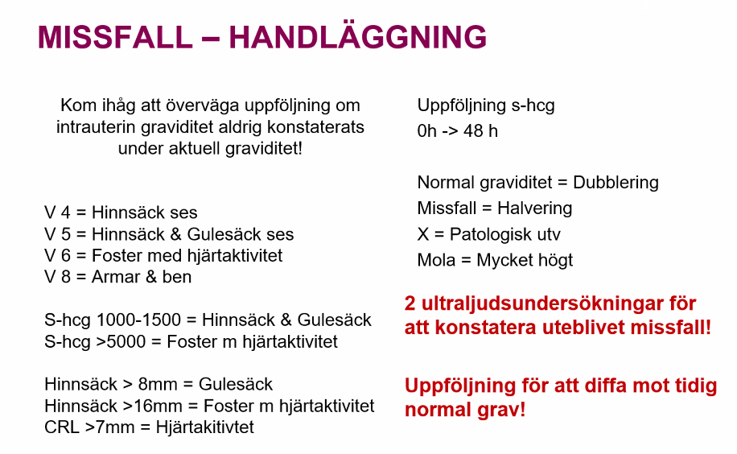
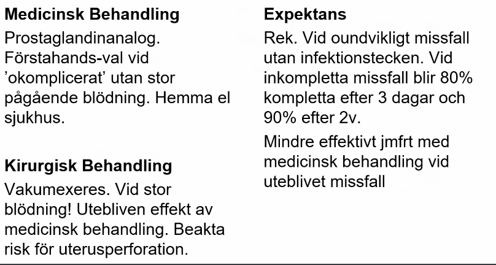
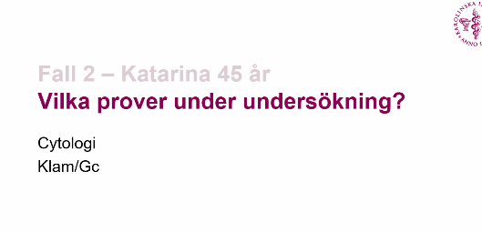
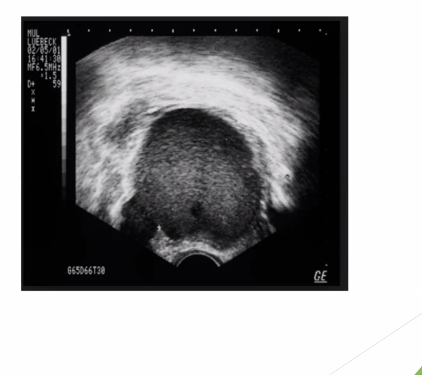
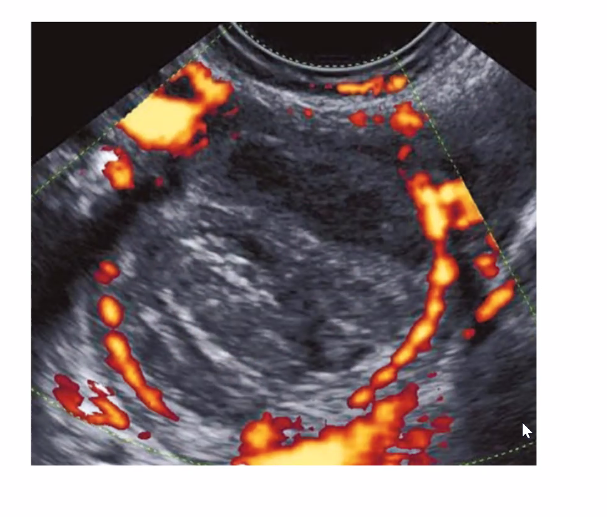

# Blödning under graviditet

**Lärandemål** 

**Kunna:**

* Normal graviditet, dess diagnostik och övervakning 
* Avvikelser i graviditetsförlopp och övervakningsrutiner 
* Handläggning vid blödning i tidig graviditet Känna till: 
* Handläggning av blödning i sen graviditet 

### Fall 1 

**Lotta 27 år inkommer till akuten i graviditetsvecka 12 pga en mindre vaginal blödning som debuterat under dagen. Hon är orolig för missfall. Vad vill du veta mer om Lotta?** 

* **Tidigare sjukdomar, tidigare graviditeter, missfall?** 
* **Tobak, alkohol**
* **Är det bekräftat att hon är gravid v12, ere baserat på t för senaste mens.**
* **När positiv sticka?** 
* **Tidigare UL undersökning?**
* **Tidigare X grav?** 
* **Tidigare bukoperation?**
* **Smärta?** 
* **Andra symtom?** Feber tex. 
* **Lm**: vilka LKM skulle föranleda missfall?
  * NSAID
  * Methotrexate
  * retinoider
  * misoprestal
* Bedöm allmäntillståndet, dock anamnes på liten blödning men ändå. Vitala. 

**Om patienten**

* Insulinbeh diabetiker, röker 10-12 cigg per dag. 
* Gynanamnes → aldrig gravid innan, 1 grav, 
* återkommande candida infek (kan vara pga diabetes). Senaste mens ca 12 v sedan. 
* Oplanerad graviditet, mått bra men lite illa senaste veckorna. 
* Mörkbrunt blod. Tidigt UL gjort? Om man har gjort det så vet man att det har varit en intrauterin graviditet. 

**Du gör en gynundersökning. Vad är det du ska iaktta/värdera vid spekulumundersökningen och den bimanuella palpationen?** 

- **Bukstatus**: inspektion, auskultation, palpation
- **Vulvainspektion**: infektionstecken? blåsor, rodnad, svullnad. Flytning. 
- **Spekulum**: 
  - Flytning eller blödning? 
  - Om misstanke infektion så provta för klamydia, gonorré. 
  - Kvantifiera blödnignen, rinner det okontrollerat färskt blod eller är det äldre blod, finns det koagler. 
  - Skaffa uppfattning om hur stor blödningen är. 
  - Hur ofta byta binda eller blött igenom byxor, runnit på golvet? 
- **Vid bimanuell palpation:** 
  - **Cervix**: ömhet, flytning (cervicit). Ruckömhet (kan tala för salpingit, appendicit eller X grav men ospecifikt. 
    - ser cervix öppen eller stängd.
  - Ömhet över uretra, urinblåsa. 
  - Tryck ovanpå livmodern samtidigt som man tar tag med grepp i cervix och ruckar. 
  - Man kan även känna hur livmodern ligger, anteroflekterad eller inte. Man kan känna om cervix är öppen som tecken på pågående missfall. 
  - formen på uterus?
  - symmetrisk? rucköm?
- **rektovaginal undersökning**: för att utreda blödningskälla.
- det är för tidigt att *höra* fosterljud med tratt
- **vaginalt Ul**: för att titta på fosterljudet...

**Uterus**: storlek (är den förstorad som tecken på graviditet?), konsistens, ömhet. 

* baserat på uterusstorlek kan man bedöma om det känns som v12, mkt större eller mkt mindre

**Adnexa**: Resistenser (cystor, tuboovarialabscess/maligna processer? 

 

**Fynd**

* Uterus motsvara v.8 (UL-baserat), sluten cervix, måttlig mörk blödning, inga synliga rester (det kan sitta i cervixöppningen tex så att man kan ta bort det med tång tex. Adnexa = tuborna och ovarierna. Man känner normalt inte ovarierna men om det finns stor cysta, malignitet eller ömt X i en tuba så känner man det. 
* **Ultraljud visar ett intrauterint foster med CRL (Crown Rump Length) UL baserat som motsvarar vecka 8 + 2, men ingen synlig hjärtaktivitet ses.** 
* **Du konstaterar ett <u>uteblivet</u> missfall.** 
* **Vad säger du till Lotta? Hur vanligt är det med missfall? Vad är de vanligaste orsakerna/riskerna för tidiga missfall?** 

* Säger att tyvärr så är fostret inte längre vid liv, det finns ingen hjärtaktivitet. 
* Blödning är sannolikt kopplad till detta men det har inte blivit någon avstötning. 
* Fördröjt missfall. 
* **Rutin:** 2 läkare ska kionstatera att det är ett uteblivet missfall.
  * kan bedöma att det är för ungt med foster, med hjärtljud
* 

**missfall epidem**: 

* 50% av alla biokemiska graviditeter. 
* Men 10-20% av upptäckta graviditeter 

**Orsak till missfall**

* **Kromosomfel, 49%:** Vanligaste orsaken till missfall är att det finns ett kromosomfel som gör att fostret inte är livsdugligt. 
* **Ålder är en riskfaktor. **
* **Alkohol, **
* **rökning**: rökningsinfertilitet att man relaterar med flimmerhåren i tuberna. 
* **brist på folsyra.** 
* **Kroniska reumatiska sjukdomar, **
* **Diabetes.** 
* **Övervikt, undernärd.** 
* **Missbildningar i livmoder/cervix**: Implantation försvåras. 
  * **uterusanomalier**
* **Hormonrubbningar** 
* **Infektion**: röda hund, toxoplasmos, listeria. CAV, Klamydia. Rubella
* **Inflammation**: celiaki 
* **Upprepade graviditeter tidigare.** 
* **Nikotin**
* **undervikt under 18BMI, och övervikt över 30BMI**
* **Läkemedel**

**I hennes fall**

* uteblivet missfall som kroppen inte riktigt har stött ut än. Fokusera på att lägga fram det bra för henne, inte medicinskt. Förklara att det inte är hennes fel eller skuldbelägga henne. 
* Man ska vara 2 läkare som konstaterar att det är ett uteblivet missfall. 
* Fostret är 8 veckor och man borde se fosteraktivitet i v. 8. Om v. 6 så ska man inte dra förhastade slutsatser trots att patienten kanske säger att den är längre. 

**Hur handlägger du fallet?** 

* **Missfall**: är smärtan som regel lokaliserad över uterus i kombination med en större vaginal blödning.
* **Extrauterin graviditet** är däremot ofta förenad med sparsam vaginal blödning och ensidigt lokaliserad smärta. 
  * **Detta är ett potentiellt livshotande tillstånd med risk för stor intraabdominell blödning.**
* **Emissfall före v. 12 ingen ytterligare åtgärd**
  * Dock i detta fall har Lotta fördröjt missfall vilket innebär att fostret är kvar. 
  * Fråga henne vilken typ av abort hon vill göra. 
  * Rekommendera medicinsk 
  * men man kan även göra kirurgisk. 
* **Medicinsk** → 
  * 200 mg mifepriston (progesteronhämmare)
  * 24-48 timmar senare ges misoprostol 800 mikrogram vaginalt (prostaglandin). 
  * Om blödning ej startat kan upprepad dos med misoprostol 400 mikrogram ges 3-4 timmar efter den första dosen. 
  * Rekommenderar man medicinsk abortbehandling om pat säg v8 kan man använda grav test; om det fortf positivt får man höra av sig
* **Expektans ca 1-2 veckor**. 
  * De flesta vill inte vänta. 
  * Uteblivna missfall kan man göra direkt medicinsk för de ordnar inte upp sig själva. 
  * Om inkompletta blir de ofta kompletta av sig självt. 
  * Om det blöder mycket och är inkomplett är det inte rätt med expektans, då kanske man måste göra exeres. 
* **Kirurgi**
  * vakumaspiration; vakumexeres: kommer vara säker att man har tömt uteruskaviteten
  * tittar man därför inte U-hCG efteråt
* u-hcg att man ttitar på om långvariga blödingsproblem eller konstig menstruationscykel att man tittar U-hCG för att bedöma om det finns en kvarvarande rest. 

Upp till varannan graviditet leder till missfall och 10-20% är konstaterade så det är MÅNGA. 

**Lotta kommer på återbesök 1-2 veckor senare och undrar om det går bra att bli gravid igen, vad svarar du?** 

* Det går alldeles utmärkt att försöka bli gravid igen så länge hon känner sig redo. 
* Rökstopp och ställa in diabetesen. 
* För att bli gravid behöver normal ägglossning: har man rester innebär att man har hcg kvar som hindrar ägglossning etc.
* noter att paitenten kan ha rester kvar i flera månader, som kan kräva att man behöver göra hysteroskopisk kirurgi. 
* // Det vanlig att när missfall börjat att man får ut allt, varpå efter får en normal menstruationscykel. Kvarvarande rester är en potentiell komplikation; läk säger att det blir svårt att bli gravid innan alla rester är ute. 

* **enl läk**
  * vanligt med blödningar första trimestern än bara missfall; förutsatt att det finns fosterljud o scener är det okej och kan fortsätta
  * komplett missfall: att man kan fortsätta med blite blödnignar o så, behöver ej behandla
  * inkomplett missfall: missfall börjat, men lite kvar; blir oftast kompletta av sig sj
  * uteblitet att grav stannat av som i första pat fallet
  * **Mkt varierande klinisk presentation**
  * Aldrig konstaterat intrauterin grav: 
    * kan va pat att hon kmr in med blödning, med missfall v6, men aldrig sett en graviditet ska föranleda serum-hCG och följa upp efter 48 timmar
      * vid en normal grav dubbals efter 48timmar normal grav 
      * men s-hcg halveras vid missfall
  * **Riktig grav**: när man ser ett gulesäck! räcker inte med bara hinnsäck
  * **hCG** kan man ta hjälp av för att diffa om intrauterin eller ektopisk grav: 
    * ser man inget intrauterint o ser s-hcg på 3000-4000 är avvikande och man ska tänka att det är en extrauterin graviditet. 
    * ektopiska grav kan bete sig hursom; men knappt 50% har patologisk utveckling; därför kan man följa hcg
    * har man ett hcg som är platå på 3-4dygn är patologiskt, ska man tänka ektopiskt
    * vad gäller rester => att det är låga S-hcg nivåer, men kan inte svara på d, man använder ej progesteron i kliniken. 
  * **Kirurgiskt**: narkos, tar cervix med tång, viktigt veta om uterus antero eller retroflekterad; hår in i kavitet med en sug o suger ut det som finns därinne. 
  * **inkompletta missfall blir kompletta om man väntar litegrann**

### Fall 2 

**Maria 26 år inkommer med ambulans pga riklig vaginal blödning och kraftig krampsmärta i buken. Hon är cirkulatoriskt påverkad med BT 70/50, puls 110. Ambulanspersonalen berättar att man ringt från Marias jobb där man hittat henne kraftigt blödande på golvet. Vad man vet så är hon tidigare frisk, har inga barn.** 

**Vad misstänker du och vad vill du göra?** 

* **Misstankar**
  * nr 1: <u>**Missfall**</u> blöder mer vaginalt och kan blöda såhär mycket. Vanligt med buksmärta vid pågående missfall. 
  * andra diffar
    * **Blödande extrauterin graviditet**: Intraabdominell blödning och oftast liten vaginalt. Mer smärta än blödning. 
    * **Uteblivet missfall** ger inte så mycket symtom. 
    * **Missfall,** 
    * **X-grav:** extrauterin graviditet
      * finns det blod i fossa Douglasi, talar det för att det är en tuba ruptur. 
    * **vasa previa:** Vasa praevia är ett tillstånd då det finns fetala blodkärl i hinnorna framför föregående fosterdel.
      * typiskt föreligger en kombination av en låg placentation och ett velamentöst navelsträngs­fäste, 
      * men det kan även röra sig om en låg placentation i kombination med en biplacenta
    * **placenta ablatio** (avlossning av placenta innan barnet är fött). 
    * **Uterusruptur**, 
* **Handläggning**
  * **ABCDE.** 
  * **Infarter, vätska, blodgruppering, bastest,** 
  * **Tillkallar: narkos osv.** 
  * **UL: FAST och Gynekologisk blödning**
    * enl läk att man kan slänga på en Ultraljudsprob på buken för att se om det är en X-grav, extrauterin grav med tuba uterina ruptur, med att det finns en massa blod o fossa douglasi. 
  * **enl läk:** 
    * urintappa patienten och ta u-hcg för att få reda mer om missfallet.
    * också ta henne asap till operation. 
    * det man ska tänka på att det blöder såhär mkt vaginalt = *pågående missfall*
* **Vid tubaruptur**: anestesilarm, kompensera cirkulatorisk, och ned till operation. 

**Vid vilka tillstånd som inte är förknippade med graviditet och förlossning kan man blöda så rikligt som Maria gör?** 

* **Anovulatorisk blödning** 
  * **Tidsmässigt: Kan uppstå vid menarche eller menopaus.** 
  * Är en hormonpåverkan med kontinuerligt gestagen påslag och slemhinnan bara växer och växer och stöts inte ut någon gång
* **koagulationsrubbning,** 
* **corpus luteum blödning,** 
* **trofoblastsjukdom,** 
* **myom,** 
* **cancer**: 
* **Spiralperforation:** om patienten har en spiral 
* **traumatisk orsak**
* **Missfall** 
  * **Hotande missfall** = blödning i första trimestern. 
  * **Ökar risken för missfall** men det behöver inte alls vara det för det är vanligt med blödning. 
  * **Ca 90% blir normal graviditet.** 
  * **Oundvikligt missfall** = blödning och cervix har dilaterat. 
  * **Går inte att behandla.** 
  * **Typer missfall**
    * **Komplett** = mensblödning, cervix stängd, småblödning och mensmolande värk. Ingen beh. 
    * **Uteblivet** = dött foster men inte stötts ut
    * **Inkomplett** = delar av vävnad finns kvar

**Varierande klinisk presentation** 

Om intrauterin grav aldrig har konstaterats, följ med Hcg för att utesluta extrauterin. Om gulesäck = intrauterin. Ser man bara hinnsäck kan det vara x ändå. 

Om det blir endometrit → inläggning med cefotaxim. Om det är saker kvar i uterus behöver man ta bort det för det blir som en abscesshåla. 

### Fall 3 

**Eva 22 år söker på akuten för en mellanblödning. Hon brukar alltid ha regelbunden ”mens” (står på p-piller) och undrar vad som hänt. Vad vill du veta mera?** 

* Senaste mensen? Cykel hur många dagar? Rikliga/måttliga blödningar?
* Sexual anamnes
* Tidigare gynproblematik?
* Tidigare graviditet, missfall?
* Antikonception sedan tidigare? Kunnat ta alla tabletter?
* Tidigare bukop?
* Hereditet
* Aktuella lm. 
* Smärta?
* Andra symtom?

Är frisk, komb p-piller, glömmer ibland, fast partner, SM 3 v och då sparsam. Inga buksmärtor. 

**På akuten har man bl.a. tagit ett graviditetstest som är positivt. Patienten är opåverkad. Du gör en undersökning och ser lite gammalt blod i vagina. Uterus är normalstor, oöm vid palpation. Inget avvikande palperas över adnexa. Ultraljud visar ingen intrauterin graviditet, ingen fri vätska i buken. Du kompletterar med ett S-hCG som är 600 U/L.** 

**Hur handlägger du fallet?** 

* Tar om hcg om 48 timmar. Kan vara en helt normal graviditet. 
* Ta reda på om önskad graviditet, opåverkad → gå hem. Informera om att söka akut om hon får ont i magen. 
* kan vara att man missat intrauterin graviditet; kan vara ett missfall.
* inte ett inläggningsfall, hon är fullgod och mår så pass bra; lite mensmol kan man ha i en vanlig graviditet;
* **Differentialdiagnoser**
  * Normal tidig graviditet
  * ektopisk graviditet
  * S-hCG 600 förväntas ej se ngt om det är normal graviditet. 
* **Vad man säger t pat**: om plötslig smräta etc att söka igen; att fråga om graviditet är önskad eller ej; ej säkrap å om normal graviditet; får återkomma om hon får tilltagande buksmärta, **synnerhet om ngn fossa**

**2d senare S-hCG U/L är 900. Eva är fortfarande opåverkad, måttlig vaginal blödning och ingen synlig graviditet i uterus. Hur informerar du och hur handlägger du fallet?** 

* På UL ser allt bra ut men vi har tagit olika tester som tyder på att du är eller har varit gravid men i och med att vi inte ser något i livmodern så måste vi fortsätta monitorera dig. 
* Det kan också vara så att det är så pass tidigt att vi inte ser något i livmodern. Troligtvis X grav. 
* Vid tidig (≤ 8 v) viabel intrauterin graviditet fördubblas S-hCG på 2 dygn i 85 % av fallen, vid ektopisk graviditet sker samma utveckling endast i 10 % av fallen.

- En ökning på < 50 % på 2 dygn talar emot en viabel intrauterin graviditet.
- Därför ber man eva komma tillbaka om 2 dagar i och med att hon är opåverkad. 
- enl läk: S-hCG har inte ökat lika mkt som den bör ha gjort, vad gäller S-hCG = möjlig ektopisk grav

  - lkm man kan använda för ektopisk grav = methotrexate
  - man ska utesluta allt med att inte är komplicerat, för mkt vätska etc
  - man måste veta var graviditeten sitter. 
  - // med ett vaginalt UL skulle man ha kunnat se en ektopisk graviditet som sitter i en tuba eller ngn annanstans;
- I detta fallet exspekterar man tho, trots att läkaren tkte att det var avvikande etc. 

**Efter ytterligare 2 dagar börjar Eva få ont till hö i buken. Nytt S-hCG visar 1200 U/L. Ultraljud visar fortfarande ingen intrauterin graviditet men nu ser man en del vätska i fossa Douglasi. Vad gör du?** 

* Hon har inte ökat med 85% så det är tecken på att det inte är en intrauterin graviditet utan tecken på en xtrauterin graviditet.
* Inläggning med tanke på risken för x grav. VId 1000 borde man se intrauterin hinnsäck
* Varför går man inte direkt till op i det här fallet? Väntar man på missfall naturligt? 
* Enl läk
  * lägger in henne; får mer buksmärta; gör en diagnostisk laparoskopi för at man antalgligen inte hade sett vätskan.
  * för att vätska, är medicinskt alternativ ej tillgängligt => kirurgisk behandling
  * Kirurgi: laparoskopisk behandling; att man gör det först att man informerar att man behöver ta bort tuba och att man kan behöva gå vidare med öppen kirurgi (i.e. en konvertering fr laparoskopi till öppen)
    * åtgärd: vanligt att man gör salpektomi att man tar bort tuba. 
    * // om ej laparoskopi tillgänligt att man kan göra en tubektomi att man delar tuba o skalar brot grav; men hög risk för att det blir ektopisk igen. 
  * // methotrexate är en folsyreantagonist som gör att man stoppar trofoblastcellerna, och regedierar bara graviditetn; möjligt tt det varit en extrauterin-graviditet tidigare som expanderat tuban. 

* enl läk
  * Tubotomi: att man skalar ut grav, finns en risk för grav rest kvar; då följer man pat med S-hCG tills det är noll
  * salpektomi: att man tar bort hella tuba, därför ingen risk för att grav rest kvar, varpå ej behöver följa med s-hCG
  * extrauterina gravs
    * varhelst i bukhålan
    * vanligast är tuban; kan vara ovariet, ligement
    * noterar att ampullära graviditeter är de vanligaste!
  * Ultraljud: kan definitivt diffa x-grav med ultraljud, ektopisk graviditet.
    * man mäter vätska i tuban: har man mindre än 50mm och s-hcg under 5000 => indik för methotrexaet
  * ibland att en pat kommer med väldigt lågt s-hcg och hcg shjunker bort av sig sj, att det var en tubarabort, gick bort av sig sj, då kan man exspektera. 

**Patienten läggs in då hon är tydligt palpations öm på höger sida i buken. Hon får tilltagande buksmärta under natten och man beslutar om diagnostisk laparoskopi på morgonen. Hur informerar du henne inför operationen?** 

Man hade kunnat tänka sig metotrexat men hon har tecken till abdominell blödning med vätska i fossa douglasi. 
Man gör salpingektomi laparoskopiskt. Om man gör tubotomi och skalar ut så kan det vara grav material kvar och följa med serum hcg till 0. 

- Kirurgi. Ofta är tuban väldigt skadad och då är det ofta bäst att ta bort den. Man måste prata om detta med kvinnan om det är möjligt. Risken finns att den kan behövas ta bort. Kolla på tuban på andra sidan. Kan också finnas risk för att man behöver ändra om till öppen operation. 
- Man kan ge metotrexat om S-hCG <4000 och ingen intraabdominell blödning. Passar bra för låga, men persisterande S-hCG värden. För de icke viabla X:en. Ges intramusk och dödar trofoblastvävnaden. Helst ska man också se exet. 

Råda om att byta prev metod med tanke på graviditet. 

**Extrauteringraviditet** 

Hörnet på livmodern är ökad risk för allvarligt tillstånd. Finns mer utrymme för expansion och de rupturerar därför senare och det finns stora kärl där som kan blöda. 

De har varierande symtombild. 

Tubotomi är omodernt. 

### Fall 4 

**Sara 30 år väntar sitt andra barn och är i vecka 28. Hon har mått bra under graviditeten och får plötsligt en riklig färsk blödning när hon är på arbetet. Hon ringer till förlossningen och frågar vad hon skall göra.** 

**Vilka frågor ställer du till henne och vad råder du henne att göra?** **

* Smärta? Värkarbete?
* Fosterrörelser?
* Hur mår du för övrigt? Mycket blod, blöder det fortfarande? Man kan fråga mer eller mindre än mens. 
* Man ska fråga om hon vet vart placenta sitter. 
* Råder henne till att åka till förlossningen. När säger man förlossning, när säger man gynakut?
* Gynanamnes. 

**Hur omhändertas Sara när hon 25 minuter senare kommer till förlossningen? Vilka orsaker till blödningen funderar du över? Hur går du vidare?**

* 
* beroende på omfattning av blödning (hb). 
* Infarter. blodgruppering och bastest. 
* Obstetriskt UL (hjälper till att det man känner själv, hur ligger bebisen?) och 
* vaginalt UL (mäta livmodertapp, teckningsblödning?). 
* Gör spekulumundersökning, 
* rinner det färskt blod eller är det gammalt? 
* Hålla henne fastande om någon läggs in för blödning. 
* Inläggning med ctg övervakning. 
* Man kan blöda av andra saker också. 
* Polyper, cancer osv. 
* ebnl läk
  * **CTG**: Det första viktigaste som barnmorskorna på avdelnignen sätter på
  * vital parametrar: BT, puls
  * få infarter
  * vill utesluta placenta ablatio (avlossnign): enl bok klinisk diagnos enl sanna; 
  * // ultraljudet kommer enl läk inte tillägga så mkt, kmr vara fostervatten, retroplacentärt hematom (men det är inte diagnostiskt). Läkare säger att man ej kan utesluta ablatio med ett ultraljud
  * placenta ablation: vaginal blödning, påvekrat ctg, sammandragningar ont över livmodern; kan vara sparsam placenta avlossning liten blödning o att fostret opåverkat. 
    * säker blir man när man gör kejsarsnitt och det kommer koagler i uterotomin innan bebisen at
    * kliniska diagnoser är lite svårgreppade
  * // har man en pat som har påverkat CTG och blöder i sängen, är det inte mer än att man ska förlösa barnet. 
  * // Optimera förhållanden för att förlösa en liten bebis = ge kortison (surfaktant), magnesium

Funderar över: Placenta previa (1-4% ökning), accreta ökar med antalet snitt och om samtidig previa, vasa previa, ablatio placentae (klinisk diagnos, väldigt riklig blödning, ofta får patienten ont i magen om det är en brakavlossning, palpöm, hård uterus.) (uterusruptur men jätteovanligt). 

Ta kontakt med neonatalen. Man kan ge kortison för barnets lungmognad, effekten håller i i 2 veckor av betapredet. Man kan ge en till dos nr 3 om det har gått över 2 veckor. Även magneisumsulfat (neuroprotektivt). 

Accreta är inge bra och kan bli problematiskt och stor risk för blödning. Placenta lågt sittande + tidigare sectio → bedöm med UL specialist. 

**CTG fr patient**

* Bas HR = 160 
* Variabilitet finns
* Accelerationer finns
* Inga decelerationer. 
* Normalt CTG. 
* vad gäller värkarna: beror på patienten om den rör sig eller spänner;

***Differentialdiagnoser***

* Polyp,  tumör
* placenta pravia
* vaginala varicer

**Det visar sig att Sara har en placenta previa men att blödningen avtar efter att hon har blivit inlagd för observation. Efter 4 dagar är det helt lugnt utan blödning. Hur handlägger du fallet nu? Vad finns det för olika former av placenta previa? Riskfaktorer? Hur vanligt är det?** **

**Fäster in i nedre uterinsegmentet och blir hinder för vaginal förlossning. I sällsynta fall sker inväxt av trofoblaster i myometriet (placenta accreta) och de kan i enstaka fall växa utanför uterusväggen och över på abdominella organ.

Viktigt att monitorerar graviditeten, finns risk för tillväxthämning pga placenta växer in i ett tunnare område av endometriet. Tillväxtkontroll. 

Om nära till sjukhus kan det skötas polikliniskt. Förlossning vid maternell eller fetal påverkan. Ofta förlöses de med sectio för det finns risk för svår blödning. Dock komplicerat så krävs van operatör. 

Riskfaktorer: tidigare sectio med antal, ökande ålder. 
Ökar 3,0 av 1000 födda. 

Delas in i lågt sittande placenta, marginell, partiell och total placenta previs beroende på relation till inre modermunnen. Vid lågt sittande kan ibland fetala kärl passera där → vasa previa. Ev. planerat kejsarsnitt om det sitter illa till. 

Många placenta är tidigt lågt sittande. Man följer de för att kolla om placenta flyttar på sig. Om man är tidigare snittad är det högre risk att placenta sitter kvar lågt. 

**enl läk**

* inläggning: 
* se till att blödningen inte fortsätter
* komma vidare i diagnostiken: göra ett vaginalt ultraljud, kan se placenta läget
  * kan se om placenta previa
  * kan se vasa previa.
  * spekulumundersökning: hur mkt blöder, eller om annan orsak: malingitet, polyp eller annat som kan blöda hos patienten. 
* konstaterar placenta previa
* avtar blödnign
* efter 4 dagar lungt ingen blödning
* vidare handlägg
  * först o främst återgå t hemmet,
  * bokar uppföljning
    * kontrollerar placentaläöget
    * beslut om föda vaginalt
    * eller plan kejsarsnitt
    * tillväxtmätning av barnet
    * eftersom liten blödning finns risk för cirkulationsstörning i placenta och ger tillväxthämning hos barnet
    * behöver få komma direkt t förlossning om hon blöder
    * snabb förlossning om hon blöder mkt. 
  * höra av sig om det händer ngt
  * gör upp en förlossningsplan; för att det är ett snitt man får göra..., beroende på läget kan man göra en vaginal
  * det är ganska vanligt att **den vandrar upp**: 

**placenta previa**

* att cervix öppnar sig, coh för att placenta ligger där precis på cervix däröfr läcker blod att den kan lossa och göra det hela lite mer komplicerat
* former riskfaktorer
  * lågt sittande
  * marginell
  * partiell täckt
  * total täckt
* riskfaktoreR: hög ålder, tidg kejsarsnitt, flera barn
* placenta flyttar uterus uppåt, att den migrerar
  * att en pat som kommer blöd vid månad 2a trimester att det är placenta preavia, men att den vidare kontroller att den har flyttats uppåt.
* Finns lite olika uppdelningar
* lågt sittande = inom 2 cm fr cervix. 
* Placenta acreta: 
  * ökar med antal tidigare snitt; invasiv placenta. 
  * därför att de sitter över ett snitt; eller andra snitt i uterus. 
  * pacreta att de växer in i andra organ: tarmar, blåsa, bukväggen. 
  * förhoppningsvis diagnosticerats antenatalt, innan förlossning
  * annars risk för att de blöder otroliga mängder
  * // kan få en i första trimestern = ärrgraviditeter, att  den satt sig i ett ärr. 

### Fall 5 

**Malin 30 år väntar sitt första barn. Hon ringer till förlossningen i v 38+3 då hon sedan någon timme fått sammandragningar som nu kommer väldigt tätt. Hon har börjat blöda vaginalt. Vilka frågor ställer du till henne?** 

Fosterrörelser?
Smärta? 

När börja hon blöda och hur ofta behöver hon byta binda?

Vattenavgång?

Går på extrakontroller PE. Stilla i magen, riklig menstruation, vattnet verkar inte ha gått. Sammandragningarna är korta men inte speciellt smärtsamma. 

**Vilken diagnos måste du utesluta och vilket råd ger du?** 

* Detta är en placenta ablatio; en klinisk diagnos
* Akut till förlossningen för kontroll. 
* placenta ablatio måste uteslutas direkt. 
* Uterusruptur ffa risk vid tidigare op livmodern, sectio. 
* Sker under värkarbete oftast. 
* Lågt sannolikhet pga ovanligt. 

**Malin kommer snabbt in till förlossningen. Man kopplar CTG som visar en basalfrekvens på 160 slag/min, nedsatt variabilitet och avsaknad av accelerationer. Täta korta kontraktioner ses. Vaginalundersökning visar att det blöder färskt ur cervix, som är bibehållen och öppen endast 1 cm.** 

**Hur bedömer du situationen? Vad gör du nu? Förklara hur blödningen uppstår! Ange allmänna riskfaktorer! Vilka andra orsaker till blödning i sen graviditet finns det?**

* HF på gränsen. 
* Inte normalt med nedsatt variabilitet och inga accelerationer. 
* Man behöver inte ha accelerationer under förlossning med variabilitet är viktigt. 
* Kan man lägga sytråd är det ett observandum. 
* Dessutom har hon täta värkar så fostret kanske inte hinner syresätta sig. 
* Nedsatt variabilitet kan vara tecken på etablerad hypoxi. 
* Misstänker ablatio. Snitt men göra halv akut. Väldigt allvarligt tillstånd. 
* kontinuerligt ctg + iv infarter + lab. 
* Blödningen uppstår genom att det blir en liten blödning (retroplacentärt?) och det gör att det släpper och då blöder det ännu mer. 
* Bildas ett hematom bakom placenta → dissekeras loss. 

***Handläggningsmässigt***

* ablatio = klinisk diagnos
* kontiuerligt CTG + infarter + lab (blodgrupp, BAS-test, etc)
* sectioberedskap

***Patofysiologiskt placenta ablatio***

* ett litet hematom bakom placentat, som leder till att placentan avstöts
* hematomet dissekerar loss placenta

***Riskfaktorer placenta ablatio***

* Preeklampsi: som denna patient hade
* trauma
* trombos hereditet
* hyperemisis gravidarum
* hög maternell ålder
* rökning
* graviditetsdiabetes
* saker som spänner livmodern: flerbörd, polyhydramnios

**orsaker blödning sen graviditet**

* **placenta ablatio**
* **placenta previa**
* **vasa previa**
* **uterusruptur**: 
  * **vanligare hons tidgare kejsarsnitt**
  * **vanligast att under värkarbete**
  * // låginkomstländer där kan vara förlossningsarbete som pågår lång tid att det kan förekomma osså
    * långdragen förlossning: nu har man 1öppningscentimeter varannan timme. 
  * **kan ske hos försföderskor, men väldigt ovanligt.** 
  * **oxytocinstimulering hos en tidigare snittad är en riskigare patient:** 
    * vill inte sätta igång kvinnor med oxy som är tidg snittade
    * induktionsmetoder...
* **sekundära orsaker**
  * infektion som ger slemhinneblödningar
  * cancer
* **täckningsblödning**: att cervix börjar dilatera: presenteras inte som i detta fallet, det är bara en diffdiagnos hos en vaginal blödning i den trimestern
  * när cervix dilaterar att vener går sönder, att det blir en vanlig celltillblandad blödning, kan ibland bli lite rikligare att man blir fundersam

**Vasa Previa** 

* Fetala blodkärl ligger oskyddade i fosterhinnor över el intill modermunnen och ligger helt oskyddade. 
* atde fetala kärlen inte är omgivna av gällen i navelsträngen, att  de blir omgivna av tryck o går sönder
* då är det barnet som blöder, att ungen förlirar sin blodbolym väldigt snabbt
* orsaker: 
  * biplacenta, att det löper kärl mellan placentadelarna
* förhoppnignsvis att man diagnosticerat antenatalt
* finns vasa previa test: bomyllspinne att man tar fetalt HBF när man undersöker för att utesltua sådan blödnign

Andra orsaker till blödning: placenta previa, vasa previa, ablatio placentae, (uterusruptur men jätteovanligt). Kan även vara blödning som tecken på värkarbete, dysplasi och cervixcancer, slemhinneblödning pga infektioner. 

### **Postpartum blödning OBS! OSCE station**

Epidem: att 10% får detta... 

* **Tone**: Uterus drar inte ihop sig. Kan vara av olika anledningar. 
  * Atoniblödning: vanligaste orsak till postpartumblödnig
  * Uttänjd livmoder (makrosomi, polyhydramnios, fostermissbildningar, flerbörd)
  * Utdragen eller snabb förlossning
  * Multipara (> III-para)
  * Infektion
  * Tidigare postpartumblödning
  * Myom
  * Uterusmissbildningar
  * Placentaavlossning
  * Uterusinversion
  * Hypotermi
  * Läkemedelspåverkan (betamimetika, isofluran, magnesiumsulfat, kalciumblockerare, NSAID) 
* **Trauma** 
  * kejsarsnitt 
  * **Förlossningsskador**: Laceration av vagina, cervix, *isthmus uteri* eller hematom.
  * **Instrumentell vaginal förlossning (sugklocka eller tång) Episiotomi** 
    * **Uterusruptur**
      Framför allt ökad risk efter tidigare kejsarsnitt eller annan uterusoperation.
  * **Uterusinversion**
* **Tissue** 
  * blöder fr placentabädden o att uterus inte drar ihop sig
  * **Placentaretention****
    **Kvarhållen placenta eller placentarest. DÅ kan inte placenta dra ihop sig. 
  * **Placenta previa****
    **Föreliggande placenta.
  * **Placenta accreta, increta och percreta****
    **Inväxt av placentavävnad i respektive igenom myometriet, med möjlig överväxt på närliggande organ.
* **Thrombin**
  * blött till sig en koagulationsdefekt
  * **Koagulationsrubbning. Man blöder till sig detta.** 
  * Preeklampsi/HELLP 
  * **Anemi**
    * **Placentaavlossning****
      **Kan ge koagulationsrubbning (DIC)
  * **Antikoagulantia**** 
  * **Sekundär fibrinolys****: Kan uppstå p g a blödning (d v s för alla T)

***Definition***

* Sverige, 1000mL: Enligt den svenska versionen av ICD-10 registreras endast blödning ≥ 1000 ml som onormal postpartumblödning. 

 

- **Primär postpartumblödning**: Onormal blödning inom 24 h postpartum.
- **Sekundär postpartumblödning**: Onormal blödning efter 24 h upp till 12 veckor postpartum.
- I detta PM behandlas endast primär postpartumblödning

**Förebyggande åtgärder före förlossning**

* Första förebyggande åtgärd är att man har koll på sin pat: 
  * riskfaktorer: med tidig haft d, utdraget förlossningsförlopp, stort barn, assisterad förlossning med sugklocka är osså sugklocka
* På förlossningsenheten bör finnas en blödningslåda/vagn med förberedda läkemedel och instrument. Personalen bör vara väl bekant med rutiner och behandling av patient med postpartumblödning.

**Förebyggande åtgärder <u>efter förlossning</u>**

*”Active management of the third stage of labour”*

- Uterotonika: [Oxytocin](https://www.fass.se/LIF/result?userType=0&query=Oxytocin) 8,3 µg/ml (1 ml=5 IE) i.m. eller i.v. långsamt omedelbart efter barnets framfödande
  - för att livmodern ska dra ihop sig
- Avgång av placenta och hinnor med hjälp av kontrollerad traktion i navelstängen samt uterusmassage (i normalfallet inom 15 min) 
- Töm urinblåsa
- Larma obstetriker/anestesiolog vid onormal blödning
- har koll på blödningsmängd o vitalparams. 
- olika läkemedel man kan använda osså
- Läkemedel
  - upprepa oxytocin
  - hänga förstärkt oxytocindropp som går på några timmar: om atonisk uterus
  - ciklokapron / tranexamsyra
  - metergin: kontraindik om preeklampsi el högt BT hos pat, för att det kan höja BT ganska mkt
    - man ger ej t redan högt BT
    - samt hjälper ej mot blödningen
    - jätteffektivt för att uterus ska kontrahera
    - uterussammandragande
  - prostinofen

***Akut åtgärd*** 

* **Akut, ABCDE:** Patient med postpartumblödning handläggs strukturerat med ett ABC-tillvägagångssätt. 
* Samarbeta med narkosläkare och koagulationsspecialist vid större blödning eller instabil patient. 
* **Diagnosticera blödningsorsaken**
* **Provtagning**
* optimera koagulationen
* Uterotonika
* *Koagulation och blodprodukter*
* **Kirurgisk behandling**
  * Ballongkateter i uterus. Håll koll på hur mycket det blöder.* 
  * Artärembolisering: I samarbete med kärlkirurg/angiojour/interventions radiolog 
  * Laparotomi
  * Gör vid behov aortakompression. (tryck strax ovanför naveln och lite till pats vänstra → inte bekvämt. GÅr bra på nyförlösta pga ingen rectusdiastas medan man går till op. Kompressionssuturer av uterus, B-Lynch- eller Haymann-suturer. Eventuellt ligatur av aa. uterinae, ev aa. ovaricae om ej möjligt med artärembolisering. 
  * Hysterektomi: Subtotal eller total. 
  * Bukpackning och chockbyxa: Alternativ inför transport till röntgen för embolisering eller till annat sjukhus.*
* Aortakompression: lite vänster mot pats navel att man trycker så långt man kan: nyförlösta pat har inga bukmuskler, har rektusdiastas, så det kan vara ganska lätt, så då gör man d tills operation, för att stoppa blödning. 
* bimanuellt trcker på cervix och tryucker utifrån för att uterus ska trycka ihopp sig
* atonisk uterus: uterysmassage, eller komprimerar uterus är också en behandling
  * kan känna när man trycker att den komprimerar o spänner o sen släpper att den e atonisk igen, så man gör om d, kan hålla på tills LKM har  fått effekt. 

**

*Oxytocin ges direkt efter bebisen är född.* 

*Tappa urinblåsa, då kan inte uterus dra ihop sig. Kolla alltid detta.* 

*Om man tror att det finns risk för stor blödning → infart, blod och bastest.* 

*Finns massa olika läkemedel.* *
**Lösa placenta om det inte är gjort. Om det blöder → direkt op. Kan blöda enorma mängder och det väldigt fort.* *

**Om placenta inte kommit inom 45 min → operation.* 

*Finns massa läkemedel som man kan ge. Dropp, ytterligare bolus, och andra mediciner.* 

# Blödningsrubbningar

Detta seminarium täcker lärandemål: Kunna: • Symptom och sjukdomar relaterade till störningar i menstruationscykeln • Pubertet, klimakteriet och seniet; behandlingsprinciper • Könshormoners effekt på målorgan • Sexuellt överförbara sjukdomar (STD) • Benigna ovarialtumörer, myom, endometrios och cervixpolyper • Symptom och diagnostik vid precancerösa och maligna tillstånd • Behandling av cervixdysplasier/cervixcancer 

GnRH frisättning från hypothalamus sker som en pulsatil frisättning och stimulera adenohypofysen som frisätter LH och FSH. De har effekt på ovarierna. 

Äggstocken producerar steroidhormoner. De t har effekt på endometriet. Finns positiv och negativ feedback. 

Genomsnitt 28 dagar. Ägglossning efter 14:e dagen. LH peak som är mitten på cykeln som initierar ovulationen. 
Follikelfas dag 0-14
Lutealfas 14-28. 

Follikelfasen där mognar follikeln och det sker som respons på FSH och LH. Producerar bla östrogen som har effekt på endometriet. 
Innan dag 14 som är främst östradiol når en topp som leder till LH peak och ovulation. 

Progesteron ökar och det leder till en omlagringseffekt så att endometriet går i nekros och stöts av. 

Om det blir graviditet och implantation så börjar det produceras hCg och på corpus finns hcg receptorer och då fortsätter progesteron att produceras. 

Vid höga nivåer östradiol så ökar det gonadotropoinnivåerna. 

### Fall 1 

**Amanda 14 år inkommer akut med sin mamma. Amanda började blöda rikligt vaginalt för 2 dagar sedan och blödningen har inte minskat…”det bara forsar” och nu känner sig Amanda lite yr.** 

**Vilka frågor ställer du till Amanda?**

* Har du fått din första mens?
* När hade du senast mens? 
* Hur ofta behöver du byta binda eller tampong?
* Färg på blodet?
* Smärtor?
* Preventivmedel?
* Sexual debut 
* Tidigare gyn anamnes? 
* Ärftlighet? blödningssjd
* Har det hänt förut?
* Viktnedgång → Om man går ner mycket i vikt så blir det en påverkan på hypothalamus och gnRH frisättningen. Hård fysisk träning eller stress som påverkar hormonssystemet.
* lm, sjukdomar. 
* urin, avföring
* tecken på anemi

Enl läk

* Oregelbunden mens sendan menarche, virgo, ingen viktnedgång, frisk, inga lm. 
* gynanamne
  * mensdebut: menarche 9mån sen
  * regelbundenhet: lite oregelbunden, senaste blödning 6v sedan, den var sparsam
  * sexualdebit: virgo
  * viktnedgång: inte ned i vikt
* övr sjd, lm,
* allergier

**Vilken är den troligaste orsaken till blödningen?** 

* **RKB = Riklig menstruationsblödning.** 
  * Kan i sin tur tex. bero på koagulationsdefekt. 
  * Blödning >80 ml = riklig
* **Anovulatorisk blödning.** 
  * Om man inte får LH peak så triggas inte ägglossningen och då får man inget ägg → ingen corpus luteum, ingen progesteron → kontinuerligt östrogenpåslag som gör att slemhinnan bara späds på och späds på. 
  * Ingen progesteron uppgång så endometriet växer till och växer till och det blir en riklig blödning som inte upphör. 

enl läk

* Arbetsdiagnos: **anovulatorisk blödning:** ovulationsstörning i puberteten, för att hon precis kommit igång
  * utan ägglössning, är östradiol fortsatt hög och endometrie fortsätter prolif
  * man får riklig långdragen blödning
  * Typiskt: kan ske unga och hos äldre, perimenopausalt. 
  * unga: obalans hypothalamus-hypofys axeln, som ej kommit igång ör att regleras på rätt sätt. 
  * äldre: ovariell dysfunktion. 

 

**Vilka prover kan vara relevanta? Motivera.** **

* Enl läk
  * U-sticka pga utesluta graviditet (blödning tfa missfall). 
  * Neg grav test, Hb 115, okej vitala. 
  * Fullständigt blodstatus 
  * järnstatus: ferritin, att man kan rek järnsubst
  * u-hCG utesluta grav
  * vitalparametrar
  * thyroidea prover: om oregelbunden mens
  * kap-Hb

**Behöver du gyn-undersöka Amanda? Motivera.**

* Enl läk
  * Beror på vad hon svarar på frågorna. 
  * Känna på magen och ta vitalparametrar känns rimligt. 
  * Om ingen anamnes på kraftiga smärtor just nu, om trolig menstruation behövs det inte men prata med henne och säga att om det blir värre får hon söka igen. 
  * Om inte anamnes på sexualdebut / sexualanamnes → avvakta. Hon är ung. 
  * vanligt bukstatus
  * abdominellt UL
  * perianalt UL

**Vilka behandlingar föreslår du?**

* Gestagen för att starta om cykeln ca 10 dagar. 10 mg i 10 dagar. 
* Ciklokaprin tranexamsyra akut. Minskar blödningsmängden 
* Info om blödningen. 
* Enl läk
  * gestagen, provera, progesteron i princip: som man kan ge direkt, som en cyklisk beh, 10d, man tillför progesteron o bryter östrogenpåslaget. Får informera att hon kan blöda mer först, men slutar när sltuar med tabletterna; bortfallsblödning efter avslutad kur.
  * rekommendera kombinerade p-piller om ingen kontraindikation för det
  * 

**Kan man tänka sig någon behandling på längre sikt?** 

P-piller som hämmar ovulation ex. kombinerade p-piller eller gestagena preparat eller hormonspiral 

Vanlig indikation för p-piller, kombinerade. Om hon har riskfaktorer kan man ge gestagena. Man kan sätta spiral men de flesta som är såhär unga vill inte ha det. 
Blödningen brukar normaliseras 2 år efter menarche. 

**Differentialdiagnoser vid oligomenorré?** 

* Oligomenorré är menstruationer ≥ 6 veckors mellanrum. Cykellängd över 40 dagar. 
* polycystiskt ovarialsyndrom (PCOS), 
* (hyperandrogenism 
* hypotalam amenorré 
* hyperprolaktinemi.
  * Uteslut ALLTID graviditet
* Hypothalamisk hämning (ätstörningar, överdriven träning, näringsbrist)
* Thyroidea (hypothyreos, hyperthyreos)
  * PCOS (här behövs behandling med livsstilinterventioner). P-piller för att kunna blöda och även gestagen cykliskt. 
  * POI. Kvinnorna ska behandlas till naturliga menopause ca 51 år. Högre östroge dock. 
  * Hyperprolaktinemi 
  * Ovarialcysta
* PCOS
  * klinisk eller biokemisk .. e.g. hirutism eller acne
* prolaktinom

***Enl läk***

* Oligomenorre
* PCOS
* ...

**Utredning?** 

Hormonprover: FSH, LH (högt LH och förhöjd LH/FSH kvot), SHBG (lågt), DHEAS (dehydroepiandrosteron-sulfat) är förhöjt, testosteron. → PCOS. 
Prolaktin
Tyroideaprover

Progesteron för att fastställa ovulation. 

### Fall 2 

**Katarina 45 år söker pga rikliga blödningar sedan 3 veckor. Sjuksköterskan har tagit prover som visar kap Hb 98, puls 85, BT 135/85.** 

**Vilka frågor vill du ställa till Katarina?** 

* Normal menstruation är ca 8 dagar. SÅ detta är onormalt. 
* Smärtor i buken? 
* Har hon fortfarande menstruation varje månad? Regelbunden?
* Färg, mängd?
* Tidigare gynanamnes?
* Viktnedgång, feber?
* Antikonception?
* Trycksymtom?
* Hereditet?
* Läkemedel?
* Senaste gynundersökningen 
* Cellprov?
* Fast partner?

Tidigare frisk, inga lm, 5 grav 3 para, 2pn 1 sectio. Kondylom som ung. Cytologi 5 år sedan, samkönad relation. Tidigare regelbunden mens, nu kortare intervall under flera dagar.

**Saknar du något prov?** 

* Grav test
* u-prov 
* blodstatus

prover i samband undersök

* cellprov
* klam gonorr

**Aktuellt: Blödningen startade för 3 veckor sedan som en normal mens, kom på rätt tid och var riklig under en vecka, minskade under 1,5 vecka men är nu åter riklig sedan 4 dagar. Inga buksmärtor, får kissa oftare senaste halvåret, ingen sveda. Avf ua. Viss tyngdkänsla i nedre delen av buken** 

**Tillfällig sexuell kontakt för 8v sedan** 

**Du undersöker Katarina, vilka prover förbereder du inför undersökningen?** 

Cellprov 
Klamydia, gonorré, mycoplasma. 

Om postmenopausal hade man kunnat ta en biopsi. 

**Du undersöker Katarina. Buken är mjuk och väs oöm. En fast rundad resistens palperas i nedre delen av buken, ej ömmande. Vid vaginalundersökning ses blodkoagel i vagina, lite sipprande blödning från ymm (yttre modermunnen). Portio inspekteras ua. Uterus palperas fast, rundad och förstorad.** 

**Vad tror ni UL visar?** 

* Myom (ger skuggbild på UL). 

**Vilka behandlingsalternativ finns?** 

* Akut vid blödning så cyklokapron: ciklokaprin 10 dagar
* Man kan ge p-piller (gestagener). 
* Järn
* Om man hittar ett myom som är orsaken till blödningen kan man diskutera hysterektomi om kvinnan inte önskar fler barn (görs om flertalet myom, problem med blödningar osv.)
* Nackdelen med hysterktomi är bukkirurgi. Rent hormonellt påverkar det inte. Om man sparar ovarierna. Man kan även kanske tänka sig en spiral. 
* Hysteroskopisk resektion av myomet. 
* Endometrieablation och spiral är de som används mest. 
* enl läk
  * nsätan alla fall börjar medicinsk behandling för myom
  * nästan alla minskade besvär efter kliamkteriet
  * kanske god effekt av tex spiral, tills klimakteriet, därefter förbättrade besvär för att menopaus
* // om vill bli gravida då högre indik för kirurgi; myomet kan påverka fertiliteten. 

**Differentialdiagnoser?** 

* Malignitet (sarkom)
* Adenomyos: endometriet växer in i uterus myometriet, likt endometros. 
* Polyp 
* Myom 
* HPV 
* Infektion
* tuboovarial abscess
* Anovulatorisk blödning vanligt hos de som precis fått mens och hos de som är påväg in i klimakteriet. 

***Myom***

* Kan växa till mycket under graviditet. Kan ge implantationssvårigheter, kan eventuellt leda till ökad risk för missfall och prematuritet. 
* horomonkänsliga, bra därför med hormonlkm
* submukösa kommer åt med hysteroskopisk resektion. 

***Riskfaktorer***: ökad ålder, etnicitet 
***Symtom***: Ofta asymtomatiska om mindre. Annars blödning,tryckkänsla, miktions symtom, obstipation, infertilitet.
***Akuta komplikationer:*** 
***Myomnekros*** (risk under graviditet så de växer till sig), torsion om de är stjälkade (behöver ofta opereras, prolaps (ner genom cervixkanalen). 

Progesteron R modulator. Är indragen för tillfället pga har gett leversvikt. 

### Fall 3 

**Maria 27 år söker pga mellanblödningar sedan några månader. Står på p-piller (kombinerade) sedan 3 år. Blöder ibland vid samlag. Ny manlig partner sedan 3 månader. Har varit på screeningen för 4 år sedan. Arbetar natt och har oregelbundna sovtider. Tid frisk. Gjort en abort för tre år sedan. Inga barn.** 

**Ytterligare frågor till Maria?** 

* När var senaste ordentliga mensen?
* Smärtor?
* Flytningar? 
* Vaccinerad HPV?
* Har du alltid blött vid samlag eller är det nytillkommet?
* Preventivmedel?
* Fråga var hon är i kartan. 
* Läkemedel? Använder p-piller. Fråga om de tar dom dagligen och om regelbundet. 
* Hereditet? blödningssjukdomar,
* Vidare sexanamnes
* Vad visade förra screeningen
* Miktion avföringsproblem, el om d normalt. 
* typ av abort senaste ggen 
* Testat för klamydia/gonorré sedan nya partnern? 

**Vilka prover kan vara lämpliga? Varför?** **

* Klamydia/gonorré prover: sotborsten för klam gonorre odling
  * ny partner, samt anamens med nya blödningar
* Frågan är om man ska ta ett Hb och sen järn för ev. 
* Brist men det verkar inte anamnestiskt vara ett problem 
  * Ny partner, inte testat sig på 4 år (var 3:e år enligt screening). 
  * Mellanblödningar kan vara tecken på HPV eller anan könssjukdom. 
* U-hCG: Grav test. utesluta om gravid
* CRP. 
* U-sticka
* Feber
* Blodstatus, iaf ett Hb är väl rimligt
* Cellprov

**Vilka prover förbereder du inför us?** 

* Cellprov och klamydia/gonorré test. 
* Smear prov
* Cytologi + HPV (acetoacetat för HPV provet). 
* Färgtest: bakteriell vaginos (kaliumnitrat), 
* Sniff-test

**Vid gyn-us ses en lättblödande portio med relativt stor ektopi. Uterus är normalstor, fast och lätt ömmande. Lätt ruckömhet över portio. Inga palpabla resistenser över adnexa men lätt ömmande på båda sidorna. Ultraljud visar tunn slemhinna på 3mm, inga synliga polyper intrakavitärt. Ovarier bilat ua** 

**Vilka diagnoser kan man tänka sig i detta fall?**

* STD
  * HPV: celldysplasi med tanke på ektopi i portio
  * klamydia med mellanblödningar
  * Infektion. 
* Ektopi = körtelepitel i cervixkanalen och skivepitel i vagina. 
  * Vid graviditet eller vissa preventivmedel så flyttas körtelepitelet ut på portio. 
  * Transformationszon är där körtelepitel möter skivepitel. 
* Atypi kan uppstå i den här zonen. 
* Kontaktblödning, jätteviktigt att utesluta cervixcancer. 
* Tänka STI om det lättblödande + ömhet
* om lätt ruckömhet på tappen = cervicit
* endometrit om det är uterus, 
* eller salpingit om det är adnexa: bilateral ömhet i buken. 
* Enl läök
  * ngt som måste utesltuas vid kontaktblödning = cervixcancer som måste utslutas. 

**Behövs någon ytterligare utredning, behandling?**

* Nej inte i nuläget.  	
  * Om ektopin avvikande, misstänker CIN av ngt slag att man tar ett PX. 
* Diagnostisk konisering om ej adekvat biopsi. 
* man kan ta px utan kolposkopi, tar px där det ser konstigt ut. 

**Vad säger du till Maria?** 

* Att vi misstänker att orsaken kan vara en bakomliggande sexuellt överförbar sjukdom men att vi tagit prov och väntar på resultat. 
* Kondom vid samlag: Tills dess får hon skydda sig med kondom vid samlag eller avstå...
* informera att anmälningspliktigt att man behöver smittspåra
* **Klamydia positiv**. 
  * Smittskyddsanmälan. 
  * Smittspårning.
  * Behandla partnern, behövs inget prov. 
  * Behandlingen: doxycyklin behandling
  * skickar remiss till kurator på venereloihälsan som smittspårar och anmäler. 

* Det är asymptomatiskt väldigt länge
* Vanligaste symtomet är vaginal blödning (kontakt eller mellanblödning), avvikande flytning, om anemi är det mer tecken på avancerad sjukdom. 
* Vanligaste är skivepitelcancer. 
* Adenocarcinom finns och de är mer aggressiva. Stadieindela. Behandla utifrån stadiet. 
* // anemi, smärta, viktnedgång mer avancer vid sjd
* behandling beror på vilket stadium. 

### Fall 4 

**Monika 65 söker pga sparsam blödning sedan 3 månader. Menopaus 17 år sedan. Gift med man. Op bröstcancer, står på Nolvadex 3-para, 3 PN** 

**Ytterligare frågor till Monika?** 

* Novaldex är antiöstrogen 
* Smärtor?
* Blödning varje dag? SOCRATES
* hereditet? hon har opats för en bröstcancer
* Andra symtom?
* Lm?
* Miktion och avföring ua
* Senaste cytologi 20 år sedan, gillar inte gyn undersökningar. 
* Inga buksmärtor. 
* Första gången postmenopausal blödning

**Utredning?** 

* Vaginal undersökning + UL

**Du undersöker Monika och finner atrofiska slemhinnor i vagina, inga synliga cx-polyper och portio ser normal ut, ingen pågående blödning ur ymm. Uterus normalstor, oöm. Sidor fria och oömma UL-vaginalt visar endometrieslemhinna på 10mm, hittar inte ovarier, ingen fri vätska** 

**Vilka ytterligare utredningar föreslår du?** **

* Det är inte normalt med förtjockad slemhinna när man är postmenopausal. 
  * Minst 5 mm ger 25% risk för endometriecancer. 
* **Biopsi från endometriet.** 
* **Cellprov**
* **Hydrosonografi.** 
* **Koksalt installation i uteruskaviteten.** 
* **Man använder en plastslang och sprutar in koksalt i uteruskaviteten.** 
* **Lyser upp svart i endometriet. Då kan man se om det är resistens som buktar in i kaviteten.** 
* **Hysteroskopi**
* **Cytologi**
* **Allmänna prover.** 

**Vilka orsaker finns till postmenopausal blödning?** **

* **Tumörer**: 
  * benignt, 
  * malignt benigna polyper i cervix och corpus, 
  * intrakavitära myom, 
  * cellförändringar i cervix och endometrium, 
  * cervixcancer, 
  * corpuscancer
* **Atrofiska slemhinnor**
* **Tillfälligt ökad mängd hormon.** 
* **Läkemedelsutlöst,** Nolvadex. Stimulering med HRT → Nolvadex. 
  * notera att nolvadex är en tamoxifen som är antiöstrogent, har en östrogen effekt på endometriet.
  * // HRT verkar vara lika med tamoxifen
* **Fetma** kan ge östrogenpåslag som orsakar endometrie påslag. 

**Kan Monika få lokalt östrogen mot atrofiska slemhinnor?** 

* Ja om man kan utesluta cancer. 

**Monika undrar om det kan vara cancer och om hon i sådana fall kommer att dö av det?** **

* Prognosen vid tidig upptäckt är god 90% 5 års överlevnad, man tar bort livmodern. 
* Upptäcks ofta tidigt pga ger symtom som blödning: dett till skillnad fr ovariell cancer
* Total hysterektomi + bilateral SOE (salpingooofreketomi, att tuba o ovarier tas bort). 
* Ev. efterbeh med strålning.

 

**Definitioner: RMB riklig mensblödning: riklig regelbunden blödning >80ml (normal ca 40)** 

**Hypomenorré: sparsam regelbunden blödning** 

**Oligomenorré: långa intervall AUB abnorm uterin blödning**

## Bäckenresistenser 2

* Smärtan: 
  * hur det utv, strålar, SOCRATES, korrelerar med ngt, besvär samlag, preventivmedel, ngn skillnad av d, smärtlindring om effekt
  * infektionssymptom
  * sår, konstiga flytningar
  * sexualanamnes
  * ttidigare könssjukdomar
  * 

# Bäckenresistenser 

Dessa fall täcker lärandemål Kunna: • Preventivmetoder och deras verkningsmekanismer • Benigna ovarialtumörer, endometrios • Symtom och diagnostik vid maligna tillstånd • Symptom och sjukdomar relaterade till störningar i menstruationscykeln Känna till: • Behandling av maligna gynekologiska tumörer 

### Fall 1 

**Lovisa 25 år söker dig på gynmottagningen pga smärtor i buken sedan nästan ett år. Hon har tidigare sökt hos husläkaren som mest trott på att hon har IBS. Själv undrar hon om det kan finnas en gynekologisk förklaring eftersom smärtan sitter mest i nedre delen av buken.** 

**Vilka ytterligare frågor vill du ställa till Lovisa?** 

* **Har hon mens och är den regelbunden?**
* **Mensvärk?**
* **Senaste mens?**
* **Hur mycket blöder hon?**
* **När kommer smärtorna i magen?** Är de konstanta eller i samband med mens? Smärtanamnes. VAS skala. HUr påverkar livskvalité? Kan hon gå till jobbet eller stannar hon hemma?
* **Smärta vid samlag.** 
* **Ärftlighet?**
* **Tidigare buk/gyn anamnes** 
* **Preventivmedel?**
* **Varit på cellprovstagning?**
* **Fast partner?**
* **Flytning, konsistens**
* **Tid/nuv sjd.** 
  * om hon opererats tidigare
  * andra sjukdomar som man behöver ta hänsyn till
* **Vilken undersökning har gjorts via husläkaren?**
* **Tid nuv sjd**
* **Gyn anamnes**
* **Sexualanamnes**
* **Aktuellt**
* **Smärtanamnes**
  * **hur mkt har smärtan påverkat hennes liv**: kanske att smärtan inte påverkat hennes liv väldigt mkt. 

***Undersökning och prover*** 

* **Prover**: CRP, Hb, gravtest, U-sticka, klamydiaprov (ett billigt att ta, klam provet, läk är frikost med klam för att lurig bakt, frikostigt på buksmärtor flr att den kan ge buksmärtor)
* Status
  * **Bukstatus**: Du undersöker henne och finner att buken är mjuk, ingen peritonit, diffust ömt på djupet
    * ömmade kraftigt vänster fossa i bukstatus
  * **Gynstatus**: yttre inspektion, spekulum, bimanuell palpation. undersökar vulva vagina och portio som alla ser bra ut
    * normal flora
    * snifftest neg
    * ingen rodnad
    * **Sakrouteringa ligamenten → sidofornix kan man palpera.** 
      * när man palperar mot sidofornix o känner äggstockarna känner man på sakrouterin ligamentetn
      * där var hon öm. 
      * Patienten är öm i sakrouterina ligamenten. 
      * Retningsfritt i vagina, 
      * portio är ua. 
      * Uterus är normalstor, retroflekterad och det ömmar vid palpation över sakrouterinligamenten. 
  * Ömmar kraftigt till vänster i buken. 
* **Näste steg = UL:** 
  * Du gör ett ultraljud och finner denna bild.
  * **Beskriv bilden!**
    * Enkelrummig, homoekogen misstänkt cysta med tydlig avgränsning. 
    * Inga papillära projektioner, 
    * inga septa eller solida delar. 
    * **Frostat glas utseende**: man kan inte se igm cystan
    * **Vid beskrivning UL**
      * **ekogenicitet**: 
        * hypo, hyper, eller iso; relaterat till uterys, om man vet hur uterus beskrivs som iso, om det är vitare är det hyperekogen, svartare är den hypo
        * I detta fallet är den hypoekogen
      * **Rummen**: enrummig eller flerrummig. Det man ser i periferin är folliklar. Detta fallet är det enkelrummig cysta. 
      * **Vad gäller cystor**: bra sens o spec för ovarialcystor (över 92% för ovarialcystor)
      * **Doppler:** se om flöde
      * **Solida förändringar**: letar man efter osså, ej fallet här. 

***Vilka möjliga diagnoser funderar du över?***

* **Main diffar**
  * **Endometriom**. Stämmer också med anamnesen för hon mådde bra vid p-piller. 
    * **endometrioscysta = endometriom**
    * // kan spricka o blod i buken, men ovanligt för att de sitter sammanvuxet, brukar drf ej spricka eller torkvera (torsion).
    * // relatera till HT15 pat fallet där det var en patient med en shurda med vätska i bukhålan men inget på ovarierna eller annan plats på UL.
  * **Corpus luteum cysta:** blod i sig o se ut på det sättet
  * **Dermoid:** att den osså kan se ut på detta sättet
* **Baserat på anamensen**
  * ngt efter p-piller km vären
  * ingen ägglossning just nu, hennes mens ofta regelbunden, men nu inget piller: Detta kan var aså att det är en ägglossning eller ej, men då behöver man en regelbunden mens
  * inga tecken infektion
  * **utifrån utseende + besvär**, samt med endometrios 70% har osså IBS liknande besvär; beror inte endometrios tarmen, utan sekundär effekt av inflammation en av endometrios (endometrios kommer fr endometrieslemhinna som kan sitta lite överallt, beroende åp var det sitter olika besvär)

***allmänt om cystorna och UL***

* **Benign cysta tex.** 
  * Follikelcysta → mer svart, ekofattiga. 
  * Corpus luteum → ej vid långvariga besvär: den kan ha blod i sig, och om färsk blödning, kan den se ut som på bilden ovan. 
  * Torsion → kommer mer akut. 
  * Teratom → man ser ofta hårstrån eller kalk som ger skuggor bakom och vita stråk. 
* **Troligtvis benignt pga uppfyller inga maligna kriterier.** 
  * **Benign kriterier**: Uniockulär, inget blodflöde, uniform, liten storlek
  * **Maligna kriterier**: Solida delar, papillära projektioner, ökat blodflöde, stor storlek, multilockulerade, ascites. 

**Vilken är den mest sannolika diagnosen utifrån den kompletterande anamnesen?** 

* **Troligtvis Endometriom cyst**:  Det isoekogent (alltså samma ekogenicitet som uterus), innehållet ger misstanke om att den är blodfylld, vilket kan vara fallet med endometriom (endometrios cysta). 

***Medicinsk behandling***

* **NSAID**: kan minska östrogen produktio indirekt
* **medicinsk behandling för att uppnå mensfrihet.** 
  * **1a hands val: kombinerade p-piller**, 
    * för ger bättre blödningsmönster och blödningsrubbningar
    * Kontinuerligt gestagen (gulkroppshormon)
    * !!! minska smärta o besvär, förebygga endometrios och sammanväxnngar, samt påverka fertiliteten.
    * !!! Att man behöver behandla slemhinna i livmoder och slemhinnan utanför livmodern, därför komma upp i högre doser, och behöver komma upp i doser. 
  * **Kan behöva kombinera p-piller med hormonspiral**
  * **GnRH analoger** (tillfälligt “klimakterium”)kirurgisk
    * \- ta bort synliga förändringar. Görs inte första hand på mindre endometriom. 
* // adenomyos att endometrioshärdar i livmoderväggen, med öar av blödningar: att man har riklig blödnign smo besvär
  * här kan ciklokapron ha en plats
  * orsaken till problemet är att endometriet hamnat utanför som man behöver behandla bort, ciklokapron okmmer inte att ta bort roten t problemet, för att det inte handlar m en riklig blödning på det sättet, 
  * preventivmedel minskar blödningsdagar och blödningsmängd. 
* **Sammanfattning**
  * **p-piller behandling kombinerade för patienten**
  * **Infertilitet är en risk för endometrios**
  * **malignitetsrisk för endometrioscystor är 1% eller lite under**
  * **därför ska man titta på endometrioscystan 1gg om året.** 
  * **ser man solida partier med flöde i sig = malign = operear bort den**
    * **clear cell carcinoma**
    * **endometrioid adenocarcinom**
  * // ska absolut inte punktera endometrioscystor, räcker ej med detta. man ska ta bort de helt. Man får recidiv 80-100% av fallen efter 6 månader. 
* !! **Efter kirurgi sjunker AMH 38%, därför ska man inte operera så mkt**

**Ange behandling, risker och prognos och eventuellt ytterligare behandling för de aktuella diagnoser du överväger.** **
**Finns malignitetsrisk och man vill titta på endometrios cystorna en gång om året.

Ökad infertilitet hos personer med endometrios. 
De kan spricka och då kan det gamla blodet implanteras på andra ställen och orsaka sammanväxningar. Dock ovanligt. 

Medicinsk behandling för att uppnå mensfrihet. 

\- Kombinerade p-piller för ger bättre blödningsmönster. 
\- Kontinuerligt gestagen (gulkroppshormon). 

\- GnRH analoger (tillfälligt “klimakterium”)

kirurgisk ej 1:a hand risker skada äggstock och risker med kirurgi. 
\- ta bort synliga förändringar. Görs inte första hand på mindre endometriom. 

- Risk för infertilitet, man kan skada ovariet. Det kan börja blöda och då bränner man på äggstocksvävnad → minskad äggreserv. Finns också risk att man behöver ta bort äggstocken. 

Man ska inte punktera cystan, de recidiverar inom 1 år. 

Man ska aldrig ta Ca-125 på dessa patienter, Det som bedömer malignitetsrisk är UL kriterierna 

### Fall 2 

**Malin 32 år söker akut för att hon sedan 2 dagar har ordentligt ont till vä i nedre delen av buken som nu förvärrats**

**Vilka prover/undersökningar önskar du före undersökningen? Vad vill du veta mera om Malin?** 

* **Grav test. Urinsticka. CRP. Hb. vitala inkl feber.** 
* **Senaste mens? Regelbunden?**
* **Hänt tidigare?**
* **Tidigare gynanamnes?**
* **Preventivmedel?**
* **Fast partner? Ny partner?**
* **Senaste cellprovet?**
* **Flytningar**
* **Regelbunden mens?**
* **Ingen feber, Bt bra, Hb 110. LPK och CRP normalt**: fråga om hon har haft feber. 
* **Smärtanamnes**: var ligger pat åp VAS skalan, 
* **tidigare operationer i buken**
* **Tidg, nuvarande sjukdomar**

***Status***

* **Septum defineras som ena väggen till den andra**
* **Detta är en spindelcysta**: detta är pattern recognition. 
  * det är ingen septa,
  * det är en enrummig cysta med spindelnätamönster
* Spindelnätsmönstret histologiskt: mer fintråpdigt, det är fibrintrådar, det har med blod att göra, det är fibrintrådsstråk.
  * ngn form av hemorrhagisk cysta,
* Högra bilden är att det är svart utanför, en massa vätska utanför cystan
* Sammanfatt: enrummig cysta + spindelnätsmönster -> corpus luteum cysta
* Fr sarah
  * **Det är en flerrummig/lakunär** (det är inga tydliga septa hela vägen), svåravgränsade septeringar, stråkig, välavgränsad, blandekogen cysta. Spindelnätsmönster (är fibrintrådar som man ser). Om UL visar ring of fire så ser det ut som corpus luteum cysta som kanske blöder med tanke på smärtan och innehållet i cystan. 

**Du undersöker henne, buken är väsentligen mjuk, men distinkt palpationsöm i vänster fossa där patienten spänner emot vid palpation. Vid gynundersökning ömmar patienten kraftigt vänster om uterus. Gravtest neg.** 

**Du kompletterar med ett ultraljud Beskriv bilden! Man såg lite vätska också i buken.** 

**Vilka möjliga diagnoser funderar du över och vilken är den mest sannolika diagnosen motivera?** 

* **RÄTT**: Corpus luteum cysta som har spruckit och därför har hon ont. Man kan se blod i buken vid UL. Sista mens för 3 veckor sedan och hon har nyligen haft ägglossning. Ring of fire. 
  * SM var 3v sedan, hemorrhagisk cysta av ngt slag, stråkigheterna, passar bra med vart i cykeln patienten är, corpus luteum har en ring of fire som är vaskulariserad som har tendens att blöda. 
  * // ibland se
* **Cystruptur**. Ger pang på smärta som sedan klingar av och man ser ofta vätska i buken. 
* **Endometriom** 
* Vid ovarialtorsion är man mer smärtpåverkad men bra diff. 
* **på bilden kan vara strecken vara hårstrå -> att det är en dermoid csyta**

***// På denna kurs: ser man vätska i buken men inget i ovarierna är det x-grav!!!!*** eller en brusten corpus luteum, eller inflammation, eller endometros

// Gällande X-grav, det är ovanligt med inget S-hCG, men det kan fortf vara ett X. en tubarabort som har spruckigt,. hon menar att vi ej kmr få den frågan på ngt prov, alltså så bör det vinnas S-hCG för X. 

**Hur handlägger du fallet?** 

Lärarens ord: 

* För blödande corpus luteums
  * oftast räcker med osbervation
  * men ibland händer det
  * indikationer för operation är sjunkande Hb, trots att man gett ciklokapron etc
  * kan vara ngn som står på waran eller trombyl. 
  * Följa Hb, tryck o puls
  * Man ska vara lite försiktig. Hb 110, retning i buken, vätska i buken. Lägga in henne för att kolla hur snabbt Hb sjunker. Fastande med dropp. 
  * Smärtlindra. Ge cyklokapron. 
  * Om Hb är stabilt under kvällen, natten och morgonen så vet vi att det inte är pågående blödning. 
    * Kan göra ont under tiden kroppen tar hand om blodet. 
  * Operation: om sjunker mkt i Hb, takykardi, etc. ibland räcker med att man opererar, ge lite blod. har man pågående blödning att det kan fylla på sig o sjunka igen, 
* Beroende på hur smärtpåverkad patienten är eller vad Hb visar så inläggning med möjlighet till laparoskopi för att få stopp på smärta och blödning. 
* Laparoskopi om smärta eller riklig blödning. Svår att skala ur, kan inte tas bort i sin helhet utan man måste blodstilla och suga ut allt blod ur buken. Man stillar bara på kapseln. 
* Om operation kan man ta Px från ovarialkapseln. 
* Det man skulle kunna tänka sig på lång sikt är ju att hämma ovulationen hos henne om hon inte har barnönskan just nu. Tex. p-piller. 
* Inför hemgång: om hon inte vil lbli gravid att hon går hem med kombinerade p-piller för att hämma ovulation. 
  * det är kombinerade som hämmar ägglossning.
  * Gulkroppshormon ökar risken för csytbildning, om hon nu inte ville bli gravid
  * annars ge tips om hon kan bli gravid snabbt
  * hon behöver ngt för Hb: antingen shot ferrinject eller järntabletter äter ngn månad, för att fylla på depåerna

### Fall 3 - torsion 

**Sandra 20 år inkommer akut pga plötsligt insättande buksmärtor. Hon anger VAS 9-10 och kan knappt prata. Hennes mamma som är med säger att hon har haft något liknande tidigare, men inte så ont som nu.** 

**Vilka ytterligare frågor vill du ställa till Sandra?** 

* **SM?** 
* **Regelbunden mens?**
* **Tidigare gyn anamnes**
* **Hereditet?**
* **Preventivmedel?**
* **Smärtanamnes, VAS.** 
* **Blödningar**
* **GI symtom, miktion.** 
* **Tidigare bukop.** 
* **Tid blindtarmop.** RM var 5:e vecka. Inga preventivmedel, aldrig gravid. Inga infektioner, ingen fast partner. Ont i samband med måltid. Hela magen men mest i nedre delen, illamående och ville kräkas. Smärtan är konstant, ingen blödning. 
* // noteras att kanske inte kan ställa alla smrät frågor om pat är VAS 9-10.
* // kan man smärtlindra innan anamnesen: det man får bort med smärtlindring är peritonitstatus, så man behöver känna buken direkt. 

**Vilka prover/undersökningar önskar du före din undersökning?** 

* Grav test, U-sticka, vitala inkl feber, CRP, Hb
* // Bukstatus, gynundersökning
* temp 37, puls 90, bra BT, neg gravtest, U-sticka blank, Hb 110, CRP normalt. 

**Det går nästan inte att undersöka Sandra, buken är spänd och generellt öm. Försiktig gynundersökning är också svårt att utföra, ingen blödning, kraftigt öm över både uterus och adnexa vid palp. Det finns en ekofri 2 rummig cysta på 7 cm till hö och bakom uterus.** 

|  |  |
| ------------------------------------------------------------ | ------------------------------------------------------------ |
|                                                              |                                                              |

* **Högra bilden:** enrummig, hypoekogen cysta
* **Vänstra bulden**: ser ett septa (ena vägg t annan vägg) blir drf tvåväggig cysta, hypoekogent innehåll
* Multilokulär, ekofattigt innehåll (vätska), 7 cm till höger och bakom uterus. 
* Finns inga säkra UL tecken för torsion. Hellre titta in en gång för mycket än en gång för lite med tanke på smärtan och storlek på cysta. 

**Vilken typ av cysta kan det rör sig om?**

* **Funktionell cysta**. 
  * Troligtvis Follikelcysta med torsion med tanke på smärtan. Vanligare vid torsion att de är över 5 cm. 
  * Follikelcysta för at varje månad bildas folliklar
  * ibland kan de bli större, fyllas med vätska
  * kursledningen vill att man ska svara follikelcysta
  * follikelcystor är oftast enrummiga menar läk, och la drf till bilden till höger
* **när man får dessa bilder ska tänka funktionell follikel cysta**
* Kan även vara en corpus luteum cysta. 
* Ovarial torsion

**Vilka är dina preliminära diagnoser?**

* **VAS 9-10 och en follikelcysta på UL**: Follikelcysta med torsion; måste tänka torsion för att smärta och cysta, blir syrebrist i äggstocken och måste snurra tillbaka den. 
* Hur handlägger vi fallet?
* Akut till op laparotomi. Time is ovary. Smärtsamt som sjutton samt så blir det syrebrist i ovariet → nekros av äggstocksvävnad. 
* // Torsion av en cysta kan påvrerka ovarial vävnadne, gm att den kan påverka omkringliggande vävnad

***Handläggning***

* **man vill nite riskera hennes liv: ska ha fastat 6 timmar**
  * har visat sig att ovarier akan överleva med ischemi
  * tanken är att hon ska till op, 
  * men om hon ätit en burgare att en risk för aspiration som är dödligt och det går att få ned smrätan emd morfin, då ska man försöka vänta tills någorlunda färdigfastad
* **Smärtlindring:** med morfin, infarter och förbereda operation. 
* **Berätta om risker och vad vi misstänker.** 
* **Operation**
  * Man planerar titthål och ska snurra tillbaka äggstocken. 
  * Göra hål på cystan och biopsi av kapseln. 
  * Finns dock risk för öppen op med tanke på tidigare bukop. 
  * Man kan behöva ta bort äggstock också om det är väldigt inflammerat eller att det blöder men det är ovanligt. 
  * Äggstocken kan dock återhämta sig trots att den ser i princip död ut. 
  * Den kan återfå sin färg och flöde när man har roterat tillbaka den. 

**Kan man förebygga nya cystor?** 

Ja man kan hämma ovulationen genom p-piller tex. Kombinerade p-piller. 

### Fall 4 

**Ulla 66 år söker sin gynekolog då hon undrar om hon har fått framfall för hon får kissa så ofta och tycker att det trycker mot blåsan. Ulla är gift med en man och har fött 3 barn (PN). Kom i klimakteriet när hon var 52 år. Använde östrogenplåster ett par år, nu enbart lokalt i vagina. Har tablettbehandlad hypertoni och är tidigare gallopererad, är för övrigt frisk. Är det något ytterligare du vill veta om Ulla?** 

Fråga om: B-symtom, blödning, flytning, ärftlighet, gyn anamnes, tid nuv sjd. 

Svar: inga UVi besvär, gyn undersökning 5 år, gått på cellprovet, inget ökat bukomfång, ingen viktnedgång, inga blödningar eller flytningar. 

**Vid undersökning är buken adipös och palperas mjuk och oöm. Vid gynundersökning är det fina slemhinnor i vagina. Man ser endast en sänkning av främre vaginalväggen men inget typiskt cystocele. Uterus förefaller liten. Till hö fram mot blåsan kan man känna en resistens, knappt knytnävsstor, endast lite öm. Svårt att avgöra om den är mobil eller inte. Ulj visar en hö sidig ovarialcysta på 9 cm diameter med följande utseende. Det finns också en del urin i blåsan.** 

Unilokulär, ej välavgränsad. Oregelbundna partier med papillära, solida projektioner. 

**På vilket sätt skiljer sig den här cystan från de ni sett förut?** **
**Den här är inte välavgränsad. Den har papillära projektioner. 

**Vilken diagnos misstänker du?** **

* **Malign ovarialcysta. HRT är riskfaktor. 
  Den uppfyller flera M kriterier papillära projektioner, stor storlek, solida delar. 

Benign kriterier 
Uniockulär, inget blodflöde, uniform, liten storlek

1. Maligna kriterier

Solida delar, papillära projektioner, ökat blodflöde, stor storlek, multilockulerade, ascites. 

**Finns det något ytterligare man kan se med ulj som stärker dina misstankar?** **

* Ascites. 80% risk för malignitet. 
* Doppler och det är rikligt med flöde. 

**Hur handlägger du fallet?** 

Kräver snabb handläggning då de ofta upptäcks sent. 
Skicka remiss till regionalt cancercentrum. DT thorax buk (metastaser, förstorade lymfkörtlar). 
Tumörmarkörer: CA 125 (specifikt gyn), CA19-9, CEA. 

Om man ser detta på akuten så kan man skicka remiss för UL om man känner sig osäker. 

**Diagnos** 

- Medicinsk anamnes inkl. hereditet
- Somatisk och gynekologisk undersökning 
- Vaginalt UL (RMI, IOTA simple rules).
  IOTA. 
  Om bara maligna → malign. 
  Om bara benign → benign 

Om blandat är det ej applicerbart. → unclassified → UL specialist och har man ej kanske det blir operation. 

- Tumörmarkörer CA 125 (även Ca19-9 (övre GI tumörer), CEA (kolorektal), Ca15-3 (bröstcancer) och kvinnor <40 och/eller misstanke om icke-epitelial tumör beta-hCG, AFP, inhibin-B, AMH). Tumörer för att utesluta cancer i andra organ. 
- Laparocentes/pleurocentes (diagnos och symtomlindring om tex ascites) 
- CT thorax/buk 
  Spridning av tumör och relation till omgivande organ. Planera behandling. 
- MR, kolonoskopi. 

enl läk

* prover: urinsticka, ingen gravtest, CRP, vite, BT, temp,

* Hypoekogen
* det är bara enrummig
* ojämn
* solida förändring som är oregelbunden: ska tänka malign
* sätter på doppler: då letar efter flöde, detta förstärker våa misstankar. 
* om svårt att se men misstanke: second-opinion UL

vidare

* remitterar t cancercentrum, solna, ställningstagande operation
* innan DT-thorax buk, detta för att leta efter metastaser (kartlägger ej cystan); förstorade lymfkörtlar, spridning
* evt att man behöver operar hyst-bilat-SOE.
* man tar osså tumörmarkörer, CEA-125, som stiger vid gyntumör cancrar
  * tar osså CEA och CEA-199

### Fall 5 (myom) 

**Massoumeh 45 år kommer på remiss från husläkaren pga att hon tycker att hon kan känna en knöl på magen och man misstänker att det kan komma från gynorganen.** 

**Är det något ytterligare du vill veta om Massoumeh?** 

SM? 
Regelbundna blödningar?

Blödning?

Smärta?

Preventivmedel?

Östrogenpreparat?

**Vid undersökning finner du en knölig resistens som på höger sida når upp till navelplan. Den känns hård men är inte ömmande och när du trycker på den så flyttar den lite på sig.** 

**Vilka diagnoser misstänker du?** 

Myom, leiomyosarkom, adenomyom 

Myom skall dock aldrig tillväxa efter menopaus, i dessa lägen får man absolut i första hand misstänka malign diagnos och hysterektomi rekommenderas.

Jämfört med nomralt myometrium har myom en högre koncentration av östrogen och progesteron receotorer och aromataser. 

**Ultraljud visar flertalet myom mellan 4-7 cm där ffa ett myom är 7 cm och sitter uppåt höger. Ger klassiska skuggor.** 

**Ska Massoumeh ha behandling?** 

**Vilka behandlingsmetoder står till buds i sådana fall?** **
**Man kan använda p-piller. Kombinerade östrogen + gestagen eller bara de med gestagen. Spiral kan man testa. GnRH agonist som minskar uterus och myomens volym → sänkning av östrogenniåverna och i vävnaden kan man se ökad apoptos. 

Operation 

Diskutera hysterektomi om kvinnan inte önskar fler barn (görs om flertalet myom, problem med blödningar osv.)

Nackdelen med hysterktomi är bukkirurgi. Rent hormonellt påverkar det inte. Om man sparar ovarierna. 

Hysteroskopisk resektion av myomet. Man tar inte bort uterus utan endast gör resektion av myomet. 
Endometrieablation och spiral är de som används mest. 

**Vilka övriga tillstånd kan ge en ”knuta i buken”, tänk på olika organsystem?** 

Det kan vara malignitet i annat organ. 

Metastas från annat organ 

Cysta 
Förstoppning 

**Fundera över symtom och undersökningsfynd och hur man utreder de förslag som ni angivit ovan.**

Malignitet i andra organ får man fundera kring B-symtom. CT. Om man hittar något så finnål beroende på var det sitter. 
Lymfkörtel. Kan finnålspunkteras alt tas bort. 

Om misstanke malignitet så provtagning, vidare anamnes. 

Cysta ses på UL och kan följas alternativt opereras bort beroende på storlek och B och M kriterier 

Förstoppning blir på anamnes. 

PÖ = hormoner och menscykeln. Fall, gynundersökning osv. 

OSCE 2 gyn 2 obs. Max poäng är 12 p. Godkänt är 8 p. 
Bedömningskriterier för varje station. Mer medicinska saker. Tolkning partogram. Patientfall. Modeller och rena patientfall på vissa stationer. 

blödning grav

Prematurbörd, vad tänker gör man

postmenopausal blödning 
Utredning cervixdysplasi. Viktiga hörnstenar. 

endometriom 

dermoidcysta, fettklump, förkalkning, små streck

Follikel

Corpus luteum, ring of fire

enl läk

* myom = stjälkat myom, intrauterint, intramuralt, ibland kan vara lurigt a tt när man tittar på ovarierna att det kan vara stjälkat myom fr uterus, eller ett resistens i ovariet. 
* har ett typiskt utseende: fan-shaped shadowing
  * 
  * skuggorna är ett benignt tecken

bilder fr läkare

endometriom

endometom

enrummig, hypoekogena partier, har små streck, har skuggor talar för ofarlig: dermoid cysta, de deär streckigheten inne i cystan kan vara hårstrån, samt fett eller kalk att det är 

Follikelcysta: enrummig, hypoekogent

* detta är en corpus luteum = rung of fire

catherine marusik

IOTA  inconclusive att remitera second opinion eller 

remitera vidare enrummig cysta 5cm

* skilja kvinnor o kvinnor: premenopausal enrummig cysta om upp t 3cm släpper man den, om 5cm följer man upp den, om funktionell cysta kmr den försvinna efetr 8v.
* om postmenopausal kvinna varför har hon en enrummig cysta, hon ska ej ha follikel. om över 1cm ska man följa upp dem.
* cystan ska försvinna efter 6-12v, om man får benign kriterier etc. kan titta efter dessa veckor o säkerställa att den är borta. 
* man prio kval UL om osäker om sin opinion 
* har man 7cm csyta helt enrummig, hypoekogen etc, så blir den benign. 
* ju större cystan är desto svårare att bedöma om den är benign eller inte. 
* IOTA är bättre än RMI. 
* vi ska kunan vanligaste cystorna, kunna endometros, vad kännetecknar malign cysta (ascites, oregelbundenheten, varpå remittera vidare). 

# Det lilla barnet

**Detta seminarium täcker lärandemål: Kunna: Normal graviditet, dess diagnostik och övervakning Avvikelser i graviditetsförloppet och övervakningsrutiner Graviditetsrelaterade sjukdomar Känna till: Metoder för övervakning av fostret före och under förlossningen** 

### Fall 1 

**Mabobeh 20-årig I-grav, 0-para. Enligt ultraljud gravid vecka 32+1. Kommer ursprungligen från Uganda och arbetar nu på ett äldreboende i Stockholm. Pga ryggsmärtor till följd av tunga lyft på arbetet har hon varit sjukskriven en stor del av graviditeten. I övrigt en okomplicerad graviditet. Hennes barnmorska på MVC har nu remitterat in henne till förlossningen då hon haft buksmärtor och vattnig flytning sedan ungefär 4 dagar. Blodtryck 120/80, u-sticka 1+ protein.** 

**Vad vill du veta mer?** 

Är smärtan konstant eller kommer den i intervaller? 

Feber? 
Hur ofta byter hon binda? 
Blödning?

Sammandragningar?
Fosterrörelser?
Hereditet?
UVI symtom? Svider när du kissar, trängningar?
Avföring?
Hur är smärtan? SOCRATES

Tidigare sjd 
Medicinering 

**Vilken diagnos misstänker du?** 

pPROM (preterm premature rupture of membrane) innan 37+0. PROM >37+0 vattenavgång men utan värkar. Har också risk för infektion och dom inducerar man inom 48 timmar. 

**Hur ställer du diagnos?** **
**Spekulum undersökning. Om man ser vätskeflöde ur cervix eller ansamling av fostervatten i bakre fornix så är det säkert tecken. 
Ultraljud? Kan ej säga vattenavgång eller ej, kan vara oligoamnios. Man ska inte känna, om UL kan man göra det med steril vante på. 
Kolla eventuell placentaavlossning. 

**Hur handlägger du patienten?** **
**Utreder mha status (AT, bukpalp, U-sticka, BT, temp, CTG)

Inläggning med vitalparametrar. 
Blodprover (CRP, blodstatus, Blodgruppering och BAS-test). 
UL abdominellt för att kolla förande fosterdel
Vaginalodling, GBS, urinodling, klamydia-gonorré PCR i urin. 

Inom 24-48 timmar får alla kvinnor med PROM spontana värkar. Om tecken på infektion, svår PE, ablatio→ induktion direkt. Hon visar inga tecken på detta. 

Steroider för lungmognad. För att steroiderna ska ha effekt måste de få värka i minst 6 timmar. Under den tiden bör man se till att kvinnan inte har värkar så att förlossningen fortskrider. Tractosile kan ges som dropp. Bricanyl kan man testa och se om man får stopp på det. 
Steroider ges fr o m gv 23+0 (men kan övervägas fr o m graviditetsvecka 22+0) t o m graviditetsvecka 32+6 alt 33+6 (viss variation mellan svenska kliniker). Inj [betametason](https://www.fass.se/LIF/result?userType=0&query=betametason) 3 ml ([Betapred](https://www.fass.se/LIF/result?userType=0&query=Betapred) 4 mg/ml) i.m. [Betapred](https://www.fass.se/LIF/result?userType=0&query=Betapred) 12 mg i.m. upprepas efter 24 timmar eller redan efter 12 timmar vid hög risk för snar förlossning. 
Om graviditeten fortskrider men hotande prematurbörd återkommer övervägs s k ”rescue steroid” om två veckor passerat sedan steroidprofylax givits. ”Rescue steroider” ges som en ny inj betametason 3 ml ([Betapred](https://www.fass.se/LIF/result?userType=0&query=Betapred) 4 mg/ml) i.m., i vissa fall (t ex om steroidprofylax givits redan i gv 22-24) upprepas en inj [betametason](https://www.fass.se/LIF/result?userType=0&query=betametason) 3 ml ([Betapred](https://www.fass.se/LIF/result?userType=0&query=Betapred) 4 mg/ml) i.m., redan efter en vecka (huruvida den dosen ska upprepas efter 24 timmar är oklart, handläggningen varierar i Sverige). Ingen evidens finns för ytterligare upprepning av ”rescue steroider”.
Bricanyl för att stoppa värkar. 

*Antibiotika*

 

- Antibiotikaprofylax ges vid PPROM fr o m gv 22+0 t o m 32+6 (viss variation mellan svenska kliniker) med [erytromycin](https://www.fass.se/LIF/result?userType=0&query=erytromycin) (kapsel [EryMax](https://www.fass.se/LIF/result?userType=0&query=EryMax)) 250 mg x 4 i 10 dagar. 

- Vid aktiv prematur förlossning (t o m gv 36+6) ges infusion [bensylpenicillin](https://www.fass.se/LIF/result?userType=0&query=bensylpenicillin) i.v. 3 g x 4 tills barnet är fött (vid pc-allergi; [klindamycin](https://www.fass.se/LIF/result?userType=0&query=klindamycin) 150mg/ml, 900 mg x 3), för att skydda barnet mot Grupp B Streptokocker (GBS) som cirka 30 % av gravida kvinnor är bärare av.

- Vid symtom eller tecken på korioamnionit bör patienten förlösas. Infusion [piperacillin](https://www.fass.se/LIF/result?userType=0&query=piperacillin)/[tazobaktam](https://www.fass.se/LIF/result?userType=0&query=tazobaktam) 4g/0,5 g x 4 efter urin-, vaginal- och eventuell blododling.

- Antibiotikaprofylax är kontraindicerat vid hela hinnor (är associerat med en ökad CP-frekvens).

**Två dygn senare får Mabobeh temp 38,3. CRP har stigit till 80 och LPK 12. CTG visar basalfrekvens ca 170 s/min och nedsatt variabilitet.** 

**Hur tolkar du CTG?** 

110-160 är normalintervallet så 170 är för mycket och patologiskt. 
Nedsatt variabilitet kan vara ett tecken på hypoxi. Patologiskt CTG. 

**Vad måste du misstänka nu?**
Infektion hos mamma med påverkat foster.  **
**Chorionamnionit + sepsis. 

**Vad gör du nu?** **
**Sätter in mamman på antibiotika. Kejsarsnitt om inte vaginal förlossning förväntas inom någon timme.
Inte inducera pga förstföderska + påverkat foster. 

Orsaker: 
\- infektion, polyhydramnios (missbildning, diabetes hos mamman), flerbörd, cervixinsufficiens (öppnar sig för tidigt), invasiva ingrepp (fosterterapi) 

Konsekvenser: 
\- Om mycket tidigt tex före v.24 → artrogypos (behöver vatten för att kunna röra på sig) → felställningar). Utveckling av lungorna (risk för lunghypoplasi med kronisk lungsjukdom). Mgsulfat (om risk för förlossnign 32+0) minska risk cp skada och död. 
Infektion: intrapartal feber ökar risk för asfyxi och neurologiska sequele hos barnet. 

De får erytromycin (erymax i 10 dagar). Nackdel är att onödigt att behandla om de ej har symtom. 
Intrapartal feber ska behandlas med AB (pip-tass eller cinacef flagyl + paracetamol). 

Generellt prematurbörd bedömning. 

- obstretrisk anamnes (var de prematur födda?)
- Interkurrenta sjukdomar (inflammatoriska, crohns, flerbörd) 
- Missbildningar/sjudkom hos foster tex. polyhydramnios) pga foster ej kan svälja undan fostervatten. 
- Cervixmätning (kan man göra vid prematura sammandragningar). 

Vad kna man göra prenatalt?

- betametason (lungmognad). Före 34+0. 
- Magnesiumsulfat till 32+0
- Antibiotika bensyl Pc under förlossningen. Erymax inför förlossningen om prematur vattenavgång. Om feber under förlossningen så pip tass

### Fall 2

**Jenny 28-årig 2-grav, 0-para. Enligt ultraljudsdatering nu gravid i vecka 34+0. Hänvisad till förlossningen från MVC pga blodtryck 160/90 samt 1+ protein i urinen. Man har också noterat att SF-kurvan ligger i underkant. Vid ankomsten till sjukhusets förlossningsmottagning uppmättes blodtrycket 145/90, CTG är normalt och det är normal fostervattenmängd.** 

**Vad vill du veta om Jenny och hennes symptom?** 

Huvudvärk, ögonflimmer, ödem, smärta, epigastriella symtom. Sjukdomskänsla. Hypertoni i tidigare graviditet (graviditet). Preeklampsi symtom. 
Tid.nuv. sjd för risken för preeklampsi. 
Hereditet 
Rökning 

**Vilka diagnoser är tänkbara?** 

Preeklampsi, för preeklampsi är det +2 på urinsticka som är mängd nog att reagera på. 

Graviditetshypertoni 
Tillväxthämning (mer symtom) 

Njursjukdom 
Placentär dysfunktion

**Vilka prover ordinerar du?** 

Lilla toxpaketet till att börja med för preeklampsi diagnosen. Protein 0,3 gram per dygn. 

- “Lilla tox” Hb, TPK, ALAT, krea och urat. Tas som screening. Men om man har sjuk patient med preeklampsi så tar man stora tox. Stora tox är markörer för hemolys (haptoglobin, LD), koagulationsprover. 

Urinsticka. U-Alb/krea kvot. SKilja på proteinläckage + hypertoni. 

**Varför?**

Utesluta preeklampsi. Man får organpåverkan och därför kollar med koagulationssystem, lever, blodplättar osv.  

**Hur undersöker du Jenny?** 

CTG, Abd UL (tillväxt + flöde), vitalparametrar, AT (ödem, hjärtsviktstecken), neurostatus (fotklonus, ökade reflexer), bukstatus (ömhet under arcus, ökad risk för placentaavlossning, ljuskänslighet. 

**Vilken behandling föreslår du?** **
**Beror på. Ett värde med högt BT är lugnt. 150 mmHg är behandlingsgräns. Diastoliskt 100 mmHg. Sjukskrivning. Gräns BT så inte behandling om hon inte har andra symtom. 

**Hur följer du upp patienten?** 

Kontroller, tillväxt UL samt BT samt toxprover samt proteinuri. 

**Vid kontroll 1 vecka senare ligger bltr på 160/100, urinsticka visar +1 proteinuri, toxproverna är väs oförändrade. CTG är normalt. Ultraljud som gjordes efter förra besöket visar skattad fostervikt -20%. BFK 0 i a umbilicalis.** 

**Önskar du vidta någon åtgärd?** 

BT-sänkande medicin Labetalol tex 100-300 mg x 2-3. Förstahandsbehandling. Är så väl beprövad hos gravida och relativt ofarlig för mamma och barn. 

Fostervikt är inom referens +- 2 SD. BFK 0 är bra. -22% är fine. 

Fortsatt kontroll samt provtagning. 

**När Jenny kommer för kontroll 1 vecka senare, nu i gravid i vecka 36+0, mår hon sämre. Hon känner sig orkeslös, har mer ont i huvudet och undrar om hon håller på att få influensa. Lab visar: ALAT 2,6, TPK 110 Urinsticka: 2+ proteinuri Reflexer: ej stegrade, ingen fotklonus Ultraljud: tillväxtmätning - 24%, BFK 0 i a umbilicalis, normal fostervattenmängd CTG: normalt Bltr: 160/105** 

**Vad säger du till Jenny och hur handlägger du fallet nu?** 

Säger att hon har utvecklat preeklampsi eller havandeskapsförgiftning. Barnet är så pass långt gånget att man kommer vilja inducera förlossningen för att det inte ska bli värre. 
Barnet är lite mindre än normalt men det är ingen fara. Man kan tänka sig att det beror på hennes tillstånd. Hon har svår preeklampsi (BT 160/110) vilket är indikation för förlossning från v. 34. 

Mgsulfat infusion, maternell behandling, har även neuroprotektiv effekt på det lilla barnet men främst är det bevisat hos prematura. Undvika kramper för att det binder Calcium. 

Blodtryckssänkande. Man kan höja Trandate. Om BT fortsatt ligger högt så finns det risk för eklampsi 
Adalat (kalciumantagonist, tillägg) Nifedipin. Kortverkande (tuggtablett) om man snabbt behöver få ner trycket. 
Ta kontakt med IVA och ge Nepresol. 

**I överenskommelse med Jenny gjordes en induktion i grav v 36+3 och hon födde vaginalt ett dygn senare** 

**Hur kan man inducera en förlossning?** 

Om omogen cervix (0-5 p enligt Bishops index) = Prostaglandin E2 vaginalt för inducera remodellering av cervixbindväven → Uppmjukning och dilatation av cervix. AUGUSTA

Om mogen cervix 4-5 poäng kan en dilatation mha ballong (BARD)

Moget cervixstatus = amniotomi. Kan kombineras med iv. oxytocin. 

Man kan även ge oxytocin om kvinnan i senare skede blir värksvag. 

**Vad är det som avgör vilken metod man använder?** 

Hur mogen cervix är, Bishops score. Man tar även med i beräkningen om det är första eller omföderska. 

Lågt bishopsscore = tabletter misoprostol samma som används vid abort. 
Ballongkateter för dilatera cervix. 
Oxytocin. 

**LM och graviditet** 

Vissa lm ska ej användas

- ACE och angiotensin blockare. Ökad risk tidigt fostermissbildning. Dödlighet och neonatala sjukdomar. 
- Trandate används pga säker och beprövad. Inte fel att använda metoprolol. 
- Calcium antagonister amlodipin, adalate osv. 

**Framtida graviditet** 

Om svår preeklampsi. Vad ska man tänka på i graviditeten?
\- Uppfölja hypertoni och koll metabola sjukdomar. 

I nästa graviditet 

- Behandling med ASA, Trombyl 1 eller 2 tabletter helst före v.12 för att ha tillräckligt god effekt, som senast v.16. Minskar risk för preeklampsi. 
- Inte röka

### Fall 3 

**Anna 31 år, 1-grav, 0-para. Inremitteras till dig på specialistmödravården pga lågt SFmått i vecka 34+6. Normal graviditet i övrigt. Anna mår bra och förstår inte varför hon behöver sitta och vänta på ytterligare en kontroll idag. Hon har ett möte om 2 timmar och undrar om du inte kan skynda dig på.** 

**Vad vill du veta mer?****
**Är Anna tidigare frisk? (kardiovaskulära, hypertoni, diabetes, autoimmuna sjd) kan öka risken för tillväxthämning hos fostret. 

Aptit?

Rökning?

Gjort KUB, NIPT (kan bero på fel hos barnet). 

OBS! SF mått är ej diagnostik men bra screening. 
Huvudmåt: Man mäter biparietal diameter 
Bukmått Medelabdominaldiameter
Lårbensmått. 

-15% → blodflödeskontroll i a.umbilicalis och a.uterina för att kolla båda sidor av placenta. 
\- Nya mätningar var 14:e dag för att annars hinner inte fostret växa så mycket. 

- Fostervattenmängd, dålig cirkulation → dåligt kiss → lite vatten. 

IUGF = avplanad tillväxt, blod flödespåverkan inte bara att man är liten. Kan ju vara litet barn i sig. 

Högt → normal med delta 10% är ändå tillväxthämning. 

**Vilka undersökningar ordinerar du?** **
**Tillväxt UL med blodflöde, BT, U-sticka 

**Vilken är den troliga diagnosen?** 

Vanligaste orsaken ska vara placentär förändring med försämrad blodperfusion. 

**Hur kan ett avplanande SF-mått se ut i MHV journalen?** 

**Hur ofta skall man kontrollera fostertillväxt och flöde vid misstänkt tillväxtavvikelse?** 

Beror på hur pass stor avvikelsen är. Mätning av foster varannan vecka för att minska risken av fel. Doppler kan göras varje vecka. 

**Vilka orsaker finns för IUGR?** 

Maternella faktorer 
\- Rökning, alkohol, narkotika. 
\- Undernäring 
\- Essentiell hypertoni eller graviditetshypertoni. 
\- Kronisk njursjukdom 
\- Kronisk hjärt- eller lungsjukdom
\- Diabetes 
\- Autoimmuna sjukdomar (SLE, sklerodermi)
\- Preeklampsi 

Fetala faktorer 
\- Kromosomala avvikelser (tex. trisomi 13, 18)
\- Kongenitala malformationer

\- Infektioner (cytomegalovirus, toxoplasmos, malaria). 

Placentära faktorer 
\- Insufficient trofoblastinvasion i spiralartärer 
\- Ablatio placentae 
\- Placentainfarkter 

### Fall 4 

**Jessika 27 år, 1-grav, 0-para. Tidigare frisk. Kommer för inskrivning på MHV. Oklar graviditetslängd pga oregelbundna blödningar men tror att hon är gravid ca vecka 11-12.** 

**Vad görs på inskrivningsbesöket på MVC?** 

* BMM v.8-12

- Anamnes, fånga riskfaktorer
- Obsterisk anamnes (paritet, IVF, tid förlossningar etc)
- Provtagning (infektionsprover, blodgruppering, Hb, s-ferritin, U-sticka samt TSH, b-glukos.)
- Status (inkl. BT, BMI)
- Mödrahälsovårds journal → Riskbedömning
  - Lågrisk = Basprogram 
  - Hög risk = Individuell bedömning 

**Fosterdiagnostik** 

Erbjuds alla kvinnor i sthlm. Är ett komplext ämne. Finns informationsfilm 1177. 

**Eftersom graviditetslängden är oklar bokas hon in för ett ultraljud 2 dagar senare. Ultraljud visar en intrauterin viabel singelgraviditet i vecka10+3.** 

**Vad mäts för att bedöma graviditetslängd i tidig graviditet?** 

CRL (crown rump length)
v. 12+3 → huvud

Minskade fosterrörelser. Vissa av kvinnorna har ökad risk för fosterdöd. ALla gravida ska få information om att söka från v.24+0. Så om det blir skillnad i rörelser. 
Vanligare än plötslig spädbarnsdöd. Händer 1 på 4000 graviditeter. 

**Jessika mår bra och graviditeten fortlöper normalt. I graviditetsvecka 30 kommer hon för rutinkontroll och barnmorskan noterar då ett lågt SF-mått. Jessika är orolig och berättar att personer i hennes omgivning tycker att ”magen är liten”. Bm planerar ultraljudskontroll inom ett par dagar. Dagen före det planerade ultraljudet söker Jessika MVC då hon är orolig för att det varit så lugnt i magen. Hon har inte känt någon riktig spark det senaste dygnet. När barnmorskan lyssnar med doptone får hon bara in mammans puls. Jessika hänvisas till förlossningsavdelningen. När man undersöker med ultraljud ses ingen hjärtaktivitet på barnet och en intrauterin fosterdöd (IUFD) konstateras.** 

**Vad finns det för möjliga orsaker till IUFD?** 

Riskfaktorer: Hög ålder, tobak, alkohol&koffein konsumption, övervikt och obesitas, sociala faktorer, tidigare utfall. 
Orsaker: intrauterin tillväxthämning pga placentainsuff. Associerat med preeklampsi, flerbördsgraviditet, missbildningar, kromosomavvikelser men i många fall okänt. 
Sjukdomar hos mamman: Diabetes typ 1 och 2. Hypertensiv sjukdom. Koagulationsrubbningar. 
Kromosomavvikelser och missbildningar. 

Placenta och navelsträngskomplikationer

Infektioner 

**Redogör för handläggning vid IUFD före, under och efter förlossning. Motivera** 

Måste göras med god omvårdnad där man måste känna in paret i fråga. 
Handläggningen. Blir induktion med införsel av prostaglandin för att mjuka upp cervix. Sedan oxytocindropp, ta hål på hinnor kanske. EXTREMT bra smärtlindring. 
Vid födseln, låt paret ha kvar barnet för att säga hejdå. Erbjud dop, erbjud prästkontakt, erbjud kurator. Erbjud begravning. Fråga kvinnan/paret vad de önskar och vad de vill.  

Bekräfta med 2 läkare. Omhändertagande. Socialt, psykologiskt (kontakt med kurator osv). Prover vid diagnossättandet. Efter barnet är fött för att kola varför det hänt. Barnet till obduktion, placenta på undersökning, blod från hjärtat för att kolla infektioner, kromosomavvikelser. 

Perineal skydd 
Obstretiska fall (inläsning, tenta) Diskutera fallen i gruppen 
Gynundersökningsteknik
Menstruationscykeln bra inför tenta
Fall och undersökning. 

OSCE är stationer från listan. 

# Blandade fall 

### Fall 1 

**Fatima, 19 år, kommer från Burundi, ej svensktalande, studerar på SFI. BMI 26. Har tidigare haft malaria och en del ryggproblem men är för övrigt frisk. Väntar nu sitt första barn. Aktuellt: söker akutmottagningen i vecka 8+0 pga 1 veckas anamnes på ”känsla av hjärtrusning,” andningskorrelerade centrala bröstsmärtor, dyspné** 

**Status: tachypné (25 andetag/min), tachykardi (125 sl/min), antydd halsvenstas.** 

**Vilka ytterligare frågor ställer du?** **
**Blödning vaginalt? 
Flygresor? 
Stillasittande?
Feber?
Hosta?
Haft tidigare?
Ang smärtan SOCRATES
Hereditet
Tid nuv sjd. 

Tobak/Alk
Hur var tidigare graviditet? 

**
****Hur vill du utreda patienten och varför? Motivera.** **
**AT, Saturation, EKG (bröstsmärta). Ömhet bakre kärlsträng, Blodprover CRP, blodstatus, koagulation, blodgas. BT, temp. Troponin. 

Att ta en d-dimer i det här fallet är ingen idé pga graviditet så kan den vara hög ändå. 
CT-thorax eller lungscint. Här måste man fundera på lungemboli då gravida har en ökad risk för tromboser.

- Under graviditeten så ökar koagulationsfaktorerna som är trombogena och minskning av fibrinolytiska faktorerna. 

- Långsammare flöde i dilaterade vener pga hormonella förändringar. 
- Anatomiska förändringar 

CT thorax är bättre, nackdel är att det kan orsaka hypertyreos hos mamma och hypo hos fostret. OBS! TÄnk på förändrad cirkulation hos gravida vilket innebär att man måste köra bilderna lite annorlunda. 

Wells kan inte användas då det inte är utvärderat på gravida. 
Om cirkulatoriskt påverkad patient kan man börja med att göra HjärtEKO för att titta efter högerkammarbelastning och indikation för trombolys. Indikationen är den samma som för icke-gravida. 

Man måste även fundera på aortadissektion hos en gravid som plötsligt får central bröstsmärta, dock har den här haft sina symtom i 1 vecka. **
**Pneumoni, Hjärtinfarkt, Panikångest, tyreotoxikos, rytmrubbningar, hjärtsvikt. 

**Utredning visar utbredd lungemboli bilateralt. Vilka prover tar du? Hur behandlar du patienten och hur länge? Vad finns det för risker för patienten i samband med förlossningen? Vad ger du för råd inför framtiden?** 

Koagulationslabb innan man sätter in blodförtunnande. TPK, Apt-tid, PK osv. Sedan måste man utreda bakomliggande orsak till att hon fick trombosen. 

**Utredning trombofili** 

- Mutation faktor V genen (APC resistens). Aktiverad Protein C resistens. FInns i heterozygot och homozygot form.Inaktivering av VIII och V sker inte optimalt. 
- Mutation av faktor 2
- Provtagning Protein S. Kan vara falskt lågt under graviditet. Om lågt kan man kolla upp det senare efter amning för att kolla om det är en riktig riskfaktor. 
- Protein C. Protein S fungerar som kofaktor till aktiverat protein C i hämning av aktiva koagulationsfaktorer V och VIII som är de två hastighetsbestämmande stegen i koagulationen. 
- Antitrombin. Man kan ha bristtillstånd. Viktigaste hämmaren av koagulation. Förutom hämning av trombin så inaktiveras flera koagulationsfaktorer. 
- Lupus antikoagulans. Kardiolipin antikroppar, beta 2 globulin antikroppar. Är del av antifosfolipidsyndromet. Tidigare trombos, upprepade missfall, fosterdöd, svår PE eller tillväxthämning. 
- homocystein (högt värde är riskfaktor). Är ingen trombofili. 

Behandling: Färsk djup trombos → Fragmin i mycket högre dos än icke gravid. 250 mg/kg delat upp på 2. GFR är så pass ökat så man har en snabbare filtration och behöver högre koncentration och 2-dos förfarande. 

- Efter 1 mån ger man högdosprofylax under hela graviditeten och post partum i 3 månader. 5000 enheter 2 gånger om dagen.

Alla fall som är gravida tar man hand om på obstetriken och man kollar så att det finns en normal koncentration av faktorXa. Stödstrumpor. 

I detta fall kanske man ger innan rtg pga så tydlig klinik. 

Beror också på om man hittar något hos den här kvinnan eller inte. Man kan få lungemboli under graviditet utan att det är någon anledning pga tillståndet just att vara gravid. Finns ett sätt att räkna ut risk baserat på vad kvinnan har (s. 325 och 323)

Risk vid förlossning: Trombolys kan ge större blödning. Postpartum är det som högst risk för nya proppar. EDA och spinal kan vara problem att sätta dom. 8 timmar innan man ska anlägga en EDA. Informera patienten om att det inte finns möjlighet för EDA om man står på Fragmin. 

Vid ny graviditet så ska hon ha trombosprofylax. Antikonception, inte något med östrogen (inga kombinerade metoder). 

### Fall 2 

**Katarina 30 år, tidigare frisk. 1-grav, hittills normal graviditet. Har tid för inskrivning hos mödravården i nästa vecka. Hon söker nu dig på gynakuten. Aktuellt: Idag gravid i vecka 8+3. Hon söker pga hjärtklappning, illamående och kräkningar. Hon har svårt att behålla maten och har gått ner ett kg under graviditeten. Status AT: opåverkat.** 

**Möjliga differentialdiagnoser?** **
**Hyperemesis gravidarum med dehydrering. Svårt gravillamåender som leder till ketonuri, elektrolytrubbning osv. 

Gastroenterit med dehydrering. 
Ketoacidos. 

UVI?
Hypertyreos
Mola hydatidosa (ej troligt dock). Genetiskt avvikande graviditet med ett överskott av kromosomer från fadern. Den finns i två olika former, komplett och partiell mola, och kännetecknas av en ökad tillväxt av moderkaks vävnad, medan fostret antingen saknas helt eller går under i tidig graviditet. Höga Hcg nivåer. 

Duplex

**
****Vilka undersökningar vill du göra och vilka prover vill du ta? Motivera.** **
**BT, puls och urinsticka. Gynekologisk undersökning och UL?

Urinprov (kan visa på tex, UVI/pyelonefrit som kan ge illamående kräkning samt hjärtklappning + ketoner om ketoacidos). 
Elstatus: dehydrering, kräkningar 
Blodstatus: tecken på dehydrering, LPK stegring vid infektion. 

Thyroideastatus: TSH, T4 och TRAK. Intensivt graviditetsillamående. 

Graviditetsinducerad hypertyreos. Normalt TRAK, låga TSH, höga T4. Varför händer det? Hcg kan stimulera TSH:t → negativ feedback och då blir det lågt TSH. Spontant övergående. 

Behandling: 

- Behövs det rehydreringsbehandling?
- B vitamininjektioner. 
- Kaliumsubstitution. EKG under ish 2,8. 
- postafen är receptfritt, lergigan är det vanligaste, primperan, omeprazol (gastrit, esofagit), b-vit på recept. 

### Fall 3 

**Karin 28 år kommer till Kvinnoklinikens mottagning för vidare utredning och behandling då hon berättar att hon haft blödning vid och efter samlag vid 2 tillfällen de senaste månaderna. Hon är mycket orolig och har många frågor.** 

**Vad vill du veta mer om Karin?** 

Preventivmedel 
Tid. nuv. sjud

Smärta
Tidigare gynanamnes 

Seuxal anamnes: Fast partner? Man eller kvinna? 
Senaste cellprovstagningen, vaccinerad? 
SM? RB? Riklig eller lite?

Läkemedel 

**Vilka diagnoser tänker du på i första hand?****
**Cervicit **(**Klamydia), mykoplasma, gonorré, Cervix förändring, utesluta graviditet (cervix blir mer lättblödande, kan vara missfall, X-grav)

**
****Vad gör du för utredning?****
**Cellprovtagning, vaginalprov (Klamydia och gonorré)  **
**Gyn undersökning, UL, bimanuell palpation. 

**
****Hur behandlar du respektive differentialdiagnos?** **
**Klamydia = doxycyklin + smittspårning, smittskyddsanmälan. 200mg dag 1, sedan 100mg i 8 dagar. Partnerbehandling. 
Cellprov = kolposkopi, riktade biopsier. Om hög risk → konisering. 

### Fall 4 

**Mia är 27 år och du får svar HR-HPV och LSIL både i cellprovet och i biopsi.** 

**Hur hanterar du det?** 

Hög risk (HR) HPV innebär att det finns förekomst av HPV som kan utvecklas till cancer 16, 18 är de vanligast förekommande. 
LSIL = Low grade cell squamous intraepitelial lesion. 

Följer patienten med cellprov, kolposkopi och ev biopsi om misstänkt område en gång per år. Vid kvasrstående förändring över 2 år → konisering. 

**Om utredningen istället visat HSIL.** 

**Vilken handläggning hade det då varit? Hur informerar du om ett sådant resultat? Kan en behandling påverka eventuell graviditet?** **
**Behandla med konisering. Man bränner bort yttersta delen av cervix. 
Informera genom att säga att kvinnan har cellförändringar som behöver behandlas pga det finns en liten risk att de utvecklas till cancer. En eventuell cancerutveckling tar över 10 år. Behandlingen är snabbt gjord och det kommer inte påverka hennes fertilitet. Det finns en liten risk för prematuritet men det är otroligt liten risk. 

Ju högre kon desto kortare blir cervix eller upprepade koner. Man kan dock behandla eller sätta cerklage. Om man gjort 2 koner eller hög kon så kan man mäta livmodertappen tidigt i graviditeten tidigt i graviditeten. Prematura sammandragningar senare i grav så kan det vara svårt att avgöra om det är påverkad livmodertapp eller ej. 
Om man sätter cerklage klipper man sedan upp det vid fullgånget. 

**Om Mia hade fått vaccinera sig i unga år hade hon kanske sluppit denna situation. Det finns för närvarande två vaccin på marknaden.** 

**Hur effektiva är vaccinerna?** 

- Tillgängligt sedan 2006
- Ger ett 70% skydd mot cervixcancer. 
- HPV-vaccin ger över 90 procents skydd mot de HPV-typer vaccinerna innehåller om man inte blivit smittad med dessa typer innan man blev vaccinerad. Vaccinerna läker inte en redan befintlig infektion eller redan etablerad cellförändring. 

**Vad är det för skillnad på vaccinerna?** 

- Cervarix = bivalent, HPV 16, 18
- Gardasil = quadrivalent, HPV 16, 18, 6 och 11. 
- Finns även gardasil 9 som innehåller ytterligare 5 typer av HPV. 

**Vilka skall vaccineras och kan man då sluta screena?** 

Nej det går inte att sluta screena pga det finns många olika typer av HPV som kan leda till cellförändringar. 

HPV-vaccin erbjuds alla barn i årskurs 5 inom det allmänna vaccinationsprogrammet för barn. Vaccination av pojkar ingår i vaccinationsprogrammet sedan augusti 2020 och det är pojkar födda 2009 och senare som omfattas av programmet.

Det 4-valenta HPV-vaccinet ingår i högkostnadsskyddet för kvinnor till och med 26 års ålder. Äldre kvinnor, pojkar födda före 2009 och män får själva bekosta vaccinationen. Det 9-valenta HPV-vaccinet ingår inte i högkostnadsskyddet.

### Fall 5 

**Eva 32 år söker tillsammans med Adam 33 år på mottagningen då de försökt få barn under 2 års tid utan att lyckas. Eva är frisk och äter inga mediciner. I en tidigare relation har hon gjort en abort. Adam är också frisk och äter inga mediciner.** 

**Vad behöver du veta mer i anamnesen?** 

Tidigare fertilitet, graviditetsutfall och födda barn i nuvarande och tidigare relationer samt tidigare och aktuella medicinska och psykiska sjukdomstillstånd. 
Tidigare lm: cytostaitka, strålbehnalding. NSAID påverkar ovulaitonen och cimetidin, sulfasalazin och androgener kan försämra spermakvalitet. 
Tidiagare infektioner, operationer i bukhåla, eller genitala delar/ljumsbråck. 
Bruk av alkohol, tobak och kaffe pga dessa påverkar fertiliteten. Annat missbruk, narkotika, anabola steroider. 
Sexualanamnes med samlagsfrekvens (vet de när de ska ha samlag) erektionssötninrgar eller samlagssmärta. 

Blödning: SM, RM, mensvärk, hur länge är mensen, hur mycket blöder hon?
Dysmenorré, smärta vid samlag. Senaste cellprov, provtagning. ¨

**Hur utreder du?** 

Kvinnan: längd, vikt, BMI, PCOS tecken (akne, ökad behåring, onormal fettfördelning), gynundersökning + UL (endometriets tjocklek, folliklar, ovariernas storlek, corpus luteum i relation till cykelfas). Äggledare, cystor i ovarierna? Antikroppar för klamydia om misstänkt tubarskada. Bör också tas inför eventuell hydrosalpingosonografi för att man inte vill skjuta upp i tuban. 
Tyreoideaprover. 
Hormonanalys om indikation föreligger. AMH. 
FSH, LH, prolaktin om man misstänker PCOS. Testosteron och SHBG. 

Infektionsprov på båda hep B, C och HIV. Om IVF ska göras så ska man ta HTLVI, II och syfilis. 

**
****Hur utreder du Adam?** **
**Spermaprov, om normalt ingen vidare utredning. 
Om inte normalt 

**Vad kallas det tillstånd som medför menstruationsstörningar, hirsutism, obesitas, acne och infertilitet?** 

PCOS

**Vilka andra risker kan detta tillstånd medföra för EVA?** **
**Insulinresistens och hyperinsulinemi är vanliga hos kvinnor med PCOS redan vid måttlig övervikt associerad till mängden bukfetma. Diabetes typ 2. Ökad obstetriska risker, PE, GDA, prematur förlossning. Postmenopausalt ökad förekomst av bukfetma, diabetes typ 2 och metabola syndromet. 3 gånger ökad risk för endometriecancer pga kronisk östrogen stimulering vid anovulation. men inte universellt drag. 

**Du förklarar för Eva att detta troligen är orsaken till varför hon har svårt att bli gravid. Hon undrar nu förstås hur hon kan få hjälp att bli gravid.** 

Om hon är obese → Livsstilsintervention + antidiabetikum för insulinresistens och obesitas. 

Antingen genom stimulering av ägglossning och sedan ha samlag då ägglossning sker. Andra alternativet är IVF. 

### Fall 6 

**Klara 40 år söker gynmottagningen pga klåda och rikliga flytningar sedan några dagar. Klara är frisk. 3 grav, 3 para, PN x3. Hon är gift med en man. Har en hormonspiral. Haft mycket besvär med klåda och flytningar i perioder.** 

**Vad mer vill du veta?** **
**tid/nuv sjud. 
SM, Rb? Hur mycket blöder hon? Samband med menstruation? Östrogen ökad pH

Har du fast partner?
Senaste cellprovet?
Senaste gynundersökning?
Smärtor? smärtor vid samlag?

Flytninge?

Tidigare gyn anamnes

TEstat något lm? antibiotika behandling? När satte hon in spiralen?
Hygienvanor

**Vid gynundersökning ser du rodnade slemhinnor och en vitaktig flytning. Du kan även skönja en ytlig spricka i bakre kommisuren.** 

**Trolig diagnos?****
**Candida  

**Differential diagnos?** **

****

**[**Bakteriell vaginos****
**](https://www.internetmedicin.se/page.aspx?id=3371)illaluktande flytningar. Flytningarna kan vara tunna och färgen kan vara mellan grå och gul. Flytningarna brukar inte bli rikligare än vanligt.

Det luktar ofta starkare precis efter att du har haft mens och efter vaginala samlag utan kondom. Det gör att du kan uppleva att symtomen kan försvinna för att sedan komma tillbaka.

Ibland kan det även svida och [klia runt slidmynningen](https://www.1177.se/Stockholm/sjukdomar--besvar/konsorgan/klada-och-smarta-i-underlivet/klada-i-underlivet/). Det kan bero på att du också har fått[ svamp i underlivet](https://www.1177.se/Stockholm/sjukdomar--besvar/konsorgan/klada-och-smarta-i-underlivet/svamp-i-underlivet/) samtidigt som du har bakteriell vaginos.

[**Lichen sclerosus**

](https://www.internetmedicin.se/page.aspx?id=6407)- Det är vanligt att huden i underlivet först blir tjockare för att sedan gradvis förtunnas. Huden blir stram, skör och vitaktig. Områdena med lichen sclerosus kan likna eksem och huden har ofta rivmärken, blåsor och sprickor.

Kvinnor kan få svår klåda i underlivet och blygdläpparna kan dra ihop sig och krympa. Män kan få sveda och irritation på ollonet och förhuden. Förhuden kan också dra ihop sig och krympa. Vid lichen sclerosus kan det vara svårt att ha sex, eftersom det kliar och stramar i underlivet. Det kan kännas bättre att använda glidmedel.
Behandling: Kortisonsalva i nedtrappning. 

**
****Lichen simplex**
\- Ofta efter en skada i huden, t.ex. rivsår, insektsbett eller skavsår. Klåda ger rivning som ger ännu mer klåda. Ond cirkel. Lichenifierat (förtjockat), välavgränsat, ibland fjällande lätt rodnat eksemplack på fotrygg, anklar, skenben, underarm, nacke, vulva, skrotum eller perineum.

Behandling: Kortisonsalva i nedtrappning. 

 

**K**[**ondylom****
**](https://www.internetmedicin.se/page.aspx?id=684)Ger vårtor 

**
****Hur ställer du diagnos?** **
**På anamnes, 
flytning, 
Undersökning där man kan se en kesoliknande flytning, sprickbildning. 
wet smear där man kan se svamphyfer med kaliumhydroxid. 

**Behandling och allmänna råd?****
**Man kan börja med lokalbehandling (kräm samt vagitorier 1-3 dagar). Om inte hjälper så kan man ta po. fluconazol. Resistensbestämning om det inte funkar med behandling. Hygienråd. Så att huden och slemhinnorna håller sig fuktig och inte torr. Inte tvål i någon form, oljebaserad rengöringsmedel, insmörjning med krämer eller salvor. Olja innan man tvättar sig med vatten. 

Tabletter om man har långvariga besvär. 

**Wet-smear** 

Kaliumhydroxid eller natriumklorid. 

Kaliumhydroxid dödar celler och bakterier och man gör det lättare att se eventuell jästsvamp. Även för BV. 

Natriumklorid: Bakteriell vaginos, trichomonas (STI)

TItta med mikroskop. 

**Candida** 

Jättevanligt hos kvinnor i fertil ålder. Minst 75% drabbas någon gång. Finns i normalflora, om den tar över så får den plats. 
Ovanligt innan mens och efter klimakterie. Svampen behöver östrogen. 

Kan vara rött irriterat, tjock vit kesoliknande flytning, kan vara normal. Man kan se hyfer. 

Beh: canesten eller pevaryl. Vagitorier ev. kräm. Kroniskt → upprepad flukonazol. Upprepad behandling för svamp gör risken för vaginism högre. Så man ska söka gynekolog vid upprepade besvär, ska ej självbehandlas om recidiverande. Canesten i första hand till gravida. 

Hos postmenopausala kvinnor är det i princip aldrig svamp. 
\- atrofiska slemhinnor 
\- cancer

\- lichen sclerosus
\- vulvovaginit (tarmbakterier) behandla med Dalacin. 
\- eksem

**Bakteriell vaginos (BV)****
**laktobacillerna blir undanträngda av anaerober som frisätter illaluktande doft (aminer). 
Diagnoskriterier
\1. clue cells i wet smear 
\2. positivt kaliumhydroxid (snifftest)
\3. skummig fluor, grå-gul 
\4. pH >4,5 

Behandling: 
metronidazol eller alt. klindamycin vagitorier 
donaxyl antibakteriell beh
PO klindamycin eller metronidazol

 # Flytningar

#### Wet smea

* man tar lite flytning fr vagina, sätter objektglas, tittar i mikroskop
* väldigt enkelt. använder inte lika mkt mikroskop, 
* antingen NaCl eller KOH för att plocka fram olika celler att titta på 
* vill ställad iagnos
* KOH dödar bakterier, lättare se jästsvamper
  * kan därför få direkt diagnos på mikroskop

#### Candida

* en del av normalflora
* ovanligt före menarche o efter menopaus: svamphyfer behöver östrogen
* symptom
  * klåda
  * sveda, svull, irritation
  * ytlig smärta, dyspareuni
  * ökad flutning (kesoliknande)
  * ibland helt normal, för där kmr wet smear in för då ser hyfer efter KOH. 
* odling med resistensbestämning
* kvinnor ska inte självbeh svamp >1 gg, för då behöver komma in t läkare
  * vet kan ge vaginism om starka mediciner mkt, att vaginalslemhinnan påverkas
  * kan ge gflukozoaol
  * ​	

#### nakteriell vaginos

* med NaCl på wet smear
  * ser då clue cells
* frisätter illaluktande aminer, luktar tonfisk, luktar inget gott
* för att ställa diagnosen behöver man mikroskopet, för behöver se cluecells
* samt sniff-test: pos KOH test, att man luktar, för då lutktare rutten fisk
* ***flytning: grågul skummig, ser ej fräscht ut!***
* högt pH i slidsekretet
* Clue-cells är att det är en massa bakterier som fastnar på vaginalslemhinne 

***Beh***

* om abotr eller dylikt, vill ej ha in i iuterus, ger man peroral behandling

#### underlivsbesvär hos postmenopaus

* vulvovaginit: tarmbakterier i.e. ecoli,
* **det är aldrig svamp om inte det finns östrogen!**