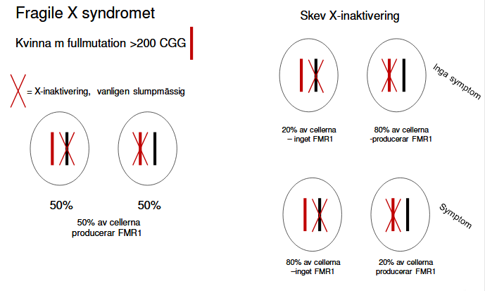

# Klinisk genetik

## Allmänt

#### olika typer mutationer

* ***normal***
* ***silent***
* ***nonsense***
* ***missense***
* ***frameshift*** (deletion -1)
* ***frameshift*** (insertion +1)
* ***insertion +1***, deletion -1

#### Genetiska analyser

* Kromosomanalys, cytogenetik
* moelkylär cytogenetik, FISH, array
* DNA-baserad analys
* RNA-baserad analys
* ***Helgenom***: 3miljarder bp
* ***helexom***: 21k gener
* ***genpanel***: 100 gener

#### Större patientgrupper

* Syndrom
* neurogenetik: e.g. huntingtons chorea
* kardiogenetik: e.g. long QT sndrom
* bindvävssjukdomar: e.g. marfans
* metabola sjd
* ärftlig cancer
* prenatal diagnostik

## Kromosomavvikelser

#### Kromosomanalys

* Blodprob: lymfocyter, 2-3 dagar
* Hudbiopsi: fibroblaster, 2-4 veckor
* Foster: 
  * amniocyter, 1-2 veckor
  * korionvilliceller 1d-2v
* benmrärgsceller: direktskörd, 24h o 48h

#### Avvikelser epidem

* Nyfödda: 0.7-0.9%
* intellektuell funktionsnedsättning: 12%
* medfödda missbildninga o intellektuell funktionsnedsätting 23%
* dödfödda 6%
* spontan abort 
  * 1a trim 50%
  * 2a trim 15-20%
* amnioocentes pga
  * ålder 1-3% 
  * missbildning vid ultraljud 15-20%

#### Typer

* Konstitutionella 
* förvärvade
* Numeriska: avvikelser antal
* strukturella: avvikelser struktur

#### Numeriska kromosomavvikelser

***Ploidigrad***

* Haploidi: n=23
* triploidi: =69
* Diploidi: 2n=46
* tetraploidi: 4n=92

***Aneuploidi***

* Monosomi: 2n-1 = 45
* Trisomi: 2n+1  = 47
* tetrasomi: 2n+2 = 48

***Trisomierna***

* 47,XY,+13/46,XY; Patau's
* 47,XY,+18/46,XY: Edward's
* 47,XY,+21/46,XY; Down's

#### Trisomi 21 - Downs syndrom

* 95% av Down syndrom
* incidens 1-2 p 1k
* ***intellektuell funktionsnedsättning***
* ***medfött hjärtfel***: ca 50%
  * AV-defekt, ASD, VSD
* ***Tarmhinder***: 8%
  * ***duodenalatresi*** 3%
  * ***megacolon , aganglionos*** 2-4¤
  * ***analatresi*** 1%
  * ***esofagusatresi*** 1%
* ***Kongenital katarakt*** 1-3%
* ***retraktionsfel*** 80%
* ***skelnig*** 35%
* ***nedsatt hörsel*** 70-80%
* ***autoimmunitet***: ökar med stigande ålder
* ***infektionskänslighet***
* ***barnleukemi*** 20ggr ökad risk
* ***thyroidea*** störningar

***Halls kriterier, tidig diagnostik Downs syndrom***

<5 kriterier = 0 misstanke; 5-11=misstanke; >12=säker diagnos

* Prematurfödda
* hypotonus
* dåligt utvecklad mororeflex
* utstickande tunga
* platt ansikte
* platt nacke, kort skalle
* snedställda ögonspringor
* epicantusveck
* brushfield spots iris
* dysplastiska öron, låt sittande
* snörvlande andnings
* fyrfingerfåra
* klinodaktyli finger V
* krota tassiga händer
* sandal gap
* överrörliga leder
* höftledsdysplasi
* rikligt nackskinnn
* högt gomtak
* tandanomalier

***Etiologi och patofysiologi***

* exponentiell korrelation med mammans ålder

##### Mosaicism

#### Trisomi 18 - Edwards syndrom

***Etiologi och patofysiologi***

* 47, XY, +18

***Kliniska kännetecken***

* Stort bakhuvud
* liten haka
* små ögon
* lågt sittande dysplastiska öron
* krakteristisk fingerställning
* extremitetesmissbildningar
* inre missbildningar
* medianöverlev: 10d
* 5-10% överlever vid 1åå
* såg sannolikher för upprepning

#### Trisomi 13 - Pataus syndrom

***Etiologi och patofysiologi***

* 47, XY +13

***Kliniska kännetecken***

* mikroftalmi
* läpp-käk-gomspalt
* polydaktli
* skalpdefekt
* omfalocele
* haloprosencefali
* inre missbildningar
* medianöverlevnad 10 dagar
* 5% lever vid 1åå
* låg sannolikhet för upprep, undantag ärftlig form

#### Könskromosomavvikelser

* 45,X
* 47,XXY
* 47,XXX
* 47,XYY

#### monosomi X - Turner's

***Kliniska kännetecken***

* incidens 1 p 2500
* Kortvuxenhet: ca 20cm under medellängd
* ovarieinsuff: streak gonads, primär amennorre, infertilitet
* coarctatio aortae: 10%
* njruanomalier: 20%
* hörselnedsättning: 60%
* intelligens inom normalområde
* karakeristiska drag: pterygium colli, bred nacke, lågt hårfäste, cubitos valgus
* hos nyfödda: svullna hand o fotryggar
* mosaikformer: 50%
* 5% 45,X / 46,XY: risk för gonadmalignitet 15-25%

***Etiologi och Patofysiologi***

* Monosmi X

#### 47, XXY - Klinefelter's

***Kliniska kännetecken***

* Hypogonadism, små testiklar, azoospermi
* infertilitet
* långvuxenhet
* kognitiva svårigheter, ADHD, ADD

#### 47, XXX

***Kliniska kännetecken***

* incidens: 1 på 1k
* långvuxenhet
* kognitiva svårigheter, ADD, ADHD
* normal fertilitet

#### 47, XYY

***Kliniska kännetecken***

* incidens 1 p 1k
* långvuxenhet
* kognitiva svårigheter, ADD, ADHD
* normal fertilitet

#### Deletion

* För att beskriva en deletion: skriver del efter involverad kromosomuppsättning, samt brytpunkten... del(5)(15.2)

#### Cru du chat 5p-

***Etiologi och Patofysiologi***

* 46, XY, del (5)(p15.2)

***Kliniska kännetecken***

* mikrocefali
* micrognati
* bred näsrot
* låtgt sittande öron
* hypotoni
* intellektuell funktiosnnedsättning
* jamande skrik

#### Wolf-Hirschhorns syndrom 4p-

***Etiologi och Patofysiologi***

* Deletion kromosom 4

***Kliniska kännetecken***

* tillväxthämning
* intellektuell funktionsnedsättning
* kluven läpp, gom
* hjärt, hjärnmissbildningar
* hypotoni
* avvikande utseende
* liknar varandra, särdrag: panna buktar, lågt sittande öron. Typiskt är utseendet mellan ögon och näsan, liknas med grekisk krigarhjälm. 

#### Mikrodeletionssyndrom

***Etiologi och Patofysiologi***

* Mikrodeletion är mindre deletioner som man lyckas detektera iom upplösning höjts över tid. 

***Exempel***

* Alagille: 20p12
* angelman: 15q11-12
* DiGeorge/CATCH22: 22q11
* Langer-Giedon: 8q24
* Miller-Dieker: 17p13.3
* Prader-willi: 15q11-12
* Rubinstein-Taybi: 16p13.3
* Smith-magenis: 17p11.2
* WAGR: 11p13
* Williams: 7q11.23

#### Prader-willis syndrom

***Etiologi och Patofysiologi***

* ***Mikrodeletion lång arm kromosom 15:*** 70% av pradi-willis syndrom fallen orskas av denna deletion
* Väldigt liten deletion

***Kliniska kännetecken***

* kraftigövervikt
* hypogonadism
* små händer och fötter
* ***Hypotoni***: initlat efter födsel
* initiala uppöfningssvårighetr
* fetma: för att inte hejda hunger
* variernnde grad förståndshandikapp
* kortväxt

***Utredning och diagnostik***

* ***med FISH***: mkt säkrare upptäcka mikrodeletioner. Man använder fluroscerande ligande som binder där DNA koden stämmer överens, varpå ser som en inmärkning på kromosomerna under ikroskop. 
  * Man använder två kontroller, samt en som targets deletionen för PWS (pradi-willis syndrom)

#### FISH

* ***Centromerspecifik DNA sond***
* ***Kromosomspecifikt biliotek***
* ***Enkelopiesond***
* 

#### Angelmans syndrom

***Etiologi och Patofysiologi***

* Precis samma deletion som PWS

***Kliniska kännetecken***

* ataxi
* epilepsi
* svår intellektuell funtkionsnedsättning
* avsaknad tal
* frekvent skratt

#### Deletion samma område different symptom

***Etiologi och Patofysiologi***

* ***prägling/imprinting***: Det finns gener som enbart uttrycks om de kommer fr mamman eller andra gener som nedärvs fr pappan 
* ***Uniparental disomi UPD***: 25% PWS, 2-5% Angelman
  * detta innebär att man nedärver kromsom 15 enbart fr mamman eller fr pappan (i.e. ***uniparental***). 
  * anses vara en ***typ av deletion***

* ***Kromosom 15, prägling***: I bilden antyds i blått de geenr som uttrycks om de nedärvts fr pappan, samt i röd de fr mamman. 
  * ***om deletion pappans kromosom:*** PWS
  * ***om deletion mammans kromosom***: Angelmans

#### 22q11 deletionssyndromet

***Etiologi och Patofysiologi***

* 22q11 har många olika namn: fenotypen kan variera mkt mellan individer. 
  * DiGeorge
  * Velo-cardio-facial
  * shprintzen
  * conotruncal anomaly face
  * CATCH 22 
* deletion proximala delen av långa armen på kromosom 22
* CATCH 22
  * C = cardiac anomalies
  * A = Abnormal facies
  * T = Thymic aplasia, hypoplasia
  * C = Cleft palate; får ett väldigt nasalt tal
  * H = Hypocalcemia
  * 22 = 22q11 deletion
* 80-90% nymutation = minimal upprepningsrisk
* 10-20% autosomalt dominant nedärvning = 50% risk! 
  * därför är det viktigt att man undersöker föräldrar t barn med detta

***Kliniska kännetecken***

* inicidens: 1 p 3k - 1 p 4k
* hjärtfel
* gomdefekter: komplett eller mildare; ofta behöver logoped
* immunologiska problem
* kalkbrist
* senare i livet: inlärnignsproblem, beteendeavvikelser, koncentratiosnsvårigheter
* karaktäristiskt utseende

***Utredning och diagnostik***

* FISH: 22q11, kontroll
* Array-CGH: comparative genome hubridization. 

#### Array-CGH

***Etiologi och Patofysiologi***

* Array Comparative Gene Hybridization
* ***Mäter gendos***: mäter alltså förlust eller för mkt, deletion el duplikation
* ! ***upptäcker inte balanserade rearrangemang***: om det skett ett utbyte mellan två kromosomer ser man inte
* ***Upptäckt beror på***: 
  * typ av array: en arrya kan inte jämföras med en annan array...
  * upplösning: hur tätt sitter DNA sonderna
  * hur informationen bearbetas

#### Strukturella kromosomavvikelser

***Translokation***

* Robertsonsk
* Reciprok

#### Robertsonsk translokation

* Sker i ***akrocentriska*** krosomerna

  * alltså de kromosomer som har sin centromer nästan ända ut i änden
  * inkluderar därför: 13, 14, 15, 21, 22

* ***Det som sker***: vi listade ovan ett antal akrocentriska kromosomer, e.g. 13 och 14. Cellerna i kroppen har ett par 13 kromsomer (en fr m, och en fr p), samt ett par 14 kromosomer

  * Vid ***Robertonsk*** translokation, slås ***två*** akrocentriska ***kromosomer*** ihop. Så om vi originally hade 4 kromosomer (2x13, 2x14), så kommer vi få tre kromosomer (1x13, 1x14, 1x[13+14]). 

* ***Inga symptom***: translokationen i sig ger inga symptom, för att man har allt material i kromosom redan

* ***Benämning***: e.g. 45 [då d är 45 totalt antal kromosomer], XX, der(14;21)\[det är ett derivat mellan 14 o 21\](q10;q10)[detta är brottspunkterna]

* ***Problem***: 

  * under mios. normalt att paren delas upp mellan gameterna. vi har tre kromosome som ska delas upp. Första exemplet är att 2 normala kromosomer går t könscell, men att vi har den tredje t den andra gameten
    * i ett fall att vi får ett barn med normal kromosomuppsättning
    * i annat fall att man får ett barn med samma Robertsonska translokerade kromosomen som förälder
  * ***Farligaste***:  annat fall är att man får robertsonska kromosomen + en normal kromosom i en gamet, och den tredje normala kromosomen i en annan gamet. 
    * efter befruktning kommer blivande barnet ***få tre kopior kromosom 21***: det kommer att ge symptom hos barnet som trisomi 21. 
  * ett till fall är att friska kromosom 21 t gamet, och derivatkromosomen + kr 14 t en annan gamet
    * båda fallen kommer avvikelsen hos embryot att d slutar med ett missfall
    * för att i första fallet avsaknad 14
    * ch andra fallet att exta 14
  * tredje fall är att alla tre kromosomerna hamnar i gamet

  

  

  

#### Bakomliggande mekanismer Downs

* 95% fristående trisomi 21: klassisk Downs
  * 47, XX, +21
* 4% har Robertsonska translokationer: translokations downs
  * 46, XX, der(14;21)(q10;q10), +21
  * ofta i kombination med kromosom 14,
  * i flera fall att det är nedärvt fr päron, så då är det viktigt att ta reda på detta. 
* 1% är mosaiker
  * 47, XX, +21/46, XX

##### upprepningsrisk för Downs

* Barn trisomi 21 karyotyp (föräldrar normal karyotyp): 
  * 0.5-1% upprepningsrisk (ej åldersrisk inkluderat, som man måste beakta utöver denna)
* Barn der(14;21)(q10;q10), +21
  * de novo: ingen förhöjd upprepningsrisk
  * mor bärare: 10-15% nästa graviditet
  * far bärare: <1%, många män med robertsonska translok har fertiltietsproblem o svårt med barn. 

#### Reciprok

* reciprok = betyder ömsesidig bytt material. 
* Detta kan ske mellan ***olika*** kromosomer.

***Etiologi och Patofysiologi***

* Under meiosen (miosen): kromosomparen vill lägga sig parallelt med varandra. 
  * ***Kvadrivalent***: men för att man har en reciprok translokatio nblir detproblematiskt: 
  * när de sen ska segregera på olika gameter, kan segregationen se olika ut. 
* Den vanligaste segregationen: är att man får 2:2 segregation
  * Att två friska korsar med varandra
  * att två ofriska korsar med varandra
  * Båda gameterna kommer ge normalt barn; ena fallet normal gamet; andra fallet har man en translokation som hos föräldern
* alla andra varianter vid segregation kommer ge obalans hos barnet: kan ge allvarliga symptom som ofta innebär missfall, eller i flesta fall barn föds med allvarliga symptom
* ***De med reciprok translokation***: 
  * ökad risk barn med intellektuell funktionsnedsättning, missbildnignar, avvikande utseende, (10-15%)
  * ökad risk för missfall

***Utredning och diagnostik***

* E.g. för Cri du chat: att man först börjar med karyotypering, sedan vidare med FISH varpå man kan hittat att kromosomen ifråga inte har de nödvändiga signalerna, som i sin tur antyder förekomsten av en deletion. 
* ***Chromosome painting***: sen kan man använda chromosome painting för att färga in en hel kromosom, varpå man kan notera att det finns en komplett kromosom (fr pappan?) samt en en till kromosom som är inkomplett, där dess del återfinns translokerad reciprokt på en annan kromosom. 
* Thus: 
  * balanserad reciprok translokation hos far: 46,XY, t(5;13)(p15;q33)
  * obalanserad reciprok translokation hos barn: 46, XX, der(5)t(5;13)(p15;q33)

#### Kromosomavvikelser hos barn

* utreds nästan uteslutande med ***Array CGH***

#### DNA sonder

* detta använder man i FISH. 

#### Helgenomsekvensering

* För att hitta balanserade o obalanserade avvikelser
* i framtiden

#### Inversion

* att man har brottspunkter som i sin tur inverteras, vänds 180 grader
* bäraren balanserad inversion: frisk, men ökadrisk för att barnet blir påverkat. 
  * risk för skadat barn 1-2%
  * ökad risk missfall, infertilitet

#### Indikationer för kromosomanalys o array CGH

***Indikationer kromosomanalys***

* Störd könsutveckling
* Kortvuxenhet hos flickor
* upprepade missfall
* infertiltiet
* sena missfall, dödfödda barn

***Indikationer för array CGH***

* misstänkt mikrodeletionssyndrom
* multipla missbildningar, dysmorfa drag
* intellektuell funktionsnedsättning, autism

## Monogena sjukdomar

#### Fennotyp i symptombild

* Autosomalt dominant
* autosomalt recessiv
* X-bunden recessi
* X-bunden dominant
* mtDNA

#### Släkträd

#### Pedigrees

### Autosomalt dominant nedärvning

* Förekommer i varje generation
* drabber båda könen, lika ofta
* 50% risk för nedärvnign t nästa generation

***Etiologi och Patofysiologi***

* ***Gain of function mutationer***: ny funktion, förändrad funktion, sjuk
* ***Loss of function mutationer:*** halva mängden protein är inte tillräckligt för bibehållen funktionm, sjuk

#### Skelettdysplasi

***Etiologi och Patofysiologi***

* Autosomalt dominant
* Akondroplasi
* Crouzon syndrom
* Hypokondroplasi

##### Akondroplasi

* vanlgiaste form kortvuxenhet, 1:26k
* korta armar, ben, stort huvud, framträdande panna, litet mellanansikte. 
* skelettavvikelser o trånga förhållande för yggmärgen o förlängda märgen kan orsaka ortopediska o neurologiska komplikationer
* händer o fingrar är påfallande korta
* Autosomalt dominant
* 80% nymutationer
* mutation:1138G>A (p.Gly389Arg)

#### Polycystiska njurar

***Etiologi och Patofysiologi***

* Autosomalt dominant
* PKD1 mutation: 85%
* PKD2 mutation: 15%
* incidens: 1pp 400-1k
* sen debut: vid 60åå har 50% uttalad njursvikt

#### Neurofibromato - NF1

***Etiologi och Patofysiologi***

* Autosomalt dominant
* men varierande expressivitet (penetrans?)

***Kliniska kännetecken***

* olika symptom hos patienter, 
* varierande svårighetsgrad,
* även inom samma familj

#### Huntingtons Chorea

***Etiologi och Patofysiologi***

* Autosomalt dominant
* ***sen debut***: Samvarierar med antalet trinukleotidrepitioner, CAG (polyglutamins)
* anticipation

***Kliniska kännetecken***

* Progressiv motor syndrom påverkar motor, kogition, psykiatriskt
* medelåldern för onset: 35åå-45åå
* medianöverlevnad: 15-18år
* chorea, korea
* rigiditet
* gångproblematik
* depression
* beteendeförändringar
* kognitiv nedgång

##### Trinukleotidsjukdomar

* Sjukdomar orsakade av proteinkodande expansioner
* Olika gener?: HD, SBMA, SCA1, SCA2, MJD/SCA3, SCA6, SCA7, DRPLA
* Progressiv neurodegeneration
* anticipation
* vanligen sen debut
* polyglutamin Q
* intranukleära inklusioner

#### Trinukleotidsjukdomar

* 18 neuromuskulära sjukdomar orsakas av expanderade repeats
  * Fragile-X
  * Huntingtons, and many SCAs
  * Fredreich ataxi
  * myoton dystrofi

#### Retinoblastom

* ***Reducerad penetrans***: vanligt vid nedärvda tumörsjukdomar
* ***Two-hit model***: 
  * säg att man har mutationen på en kromosom, sen får man en nymutation på den andra kromosomen i en somatisk cell, varpå den neoplasierar o blir tumör i slutändan
  * Alternativt att man får två somatiskt (förvärvade) mutationer i en cell som genererar tumören

#### Typisk autosomalt dominant sjukdomar

* Att man barnet får sjukdom: friska föräldrar, ej sen debutålder, nedsatt penetreans, eller varierenade expressivitet, 
* Se till att tänka på
  * nymutation
  * heterogenitet (del diagnos)
  * mosaicism (klon av muterade könsceller)
  * faderskap

#### Autosomalt dominant sammanfattning

* Heterozygoter, Aa, är sjuka
* ses i varje generation
* drabbar båda könen lika ofta
* 50% risk för överföring

***Etiologi och Patofysiologi***

* olika mutationer i samma gen, kan resultera olika fenotyper
* varierande expressivitet
* reducerad penetrans
* anticipation

### Autosomalt recessiv nedärvning

* Endast homozygoter, aa, är sjuka
* föräldrar är friska anlagsbärare, Aa
* upprepningsrisk: 25%
* drabbar både män o kvinnor
* uppträder plötsligt i en generation
* släktfigte, konsanguinitet, ökar risken

***Etiologi och Patofysiologi***

		

#### Cystisk fibros (CF)

* Vanligaste autosomalt recessiva sjukdomen i västvärlden
* 1 pp 3600 föds med CF per år i Sverige
* Bärarfrekvensen: 1:30

***Kliniska kännetecken***

* Luftvägssymptom
* gstrointestinala symptom
* svettkörtelsymptom: utsöndrar extremt salt svett
* manlig infertilitet: vas deferens agenesi
* förväntad överlevnad: >50åå, median 40-50åå

***Etiologi och Patofysiologi***

***Behandling***

#### Beta-thalassemi

* Två typer: minor och major

***Etiologi och Patofysiologi***

* HBB genen

#### Sickle-cell anemi

* Också HBB genen

***Etiologi och Patofysiologi***

* orsakas av specifik punktmutation i HBB genen
* individer med mutation i båda HBB kopior utvecklar sickle-cell anemi
* röda  blodkroppar: normalt flexibla o donut shaped, blir sickle-shaped
* ökar ihoopklumpning, fastar blodkärl, 
* resulterar i : svåra smrätor, anemi, strke, pulmonell hypertension, organsvikt, ofta tidig död

***Behandling***

* Fetalt HbF slutar produceras efter födsel
* switch t produktion adult form, HbB
* ovanligt tillstånd hereditary persistence of fetal haemoglobin HPFP: producerar HbF hela livet
* sickle-cell patienter med HFPF har mkt mildare symptom
* ***Behandlingsformen***: man verkar inducera HbF varianten

#### Metabola sjukdomar

* störning metabola pathways
* toxiska metaboliter
* avsaknad nödvändiga protein, enzym
* störning energiproduktion

### Populationsgenetik och genetisk epidemiologi

* Hur sstor risk har vem som helst i pop att vara anlagsbärare för specifik autosomalt recessiv sjukdom

#### Riskberäkning

#### Hardy-Weinberg distribution

* Vanlig, normal, dominant allel = $A$
* Ovanlig, sjuk, recessiv allel = $a$

|                  | Gameter               |
| ---------------- | --------------------- |
| Genfrekvens      | $p + q = 1$           |
| Genotyp frekvens | $p^2 + 2pq + q^2 = 1$ |

* Där vi har att $p$ är  $A$, att $q$ är $a$. att $AA=p^2$,  $2pq=Aa$, $aa=q^2$.
* ***Notera att***: $q^2$ är incidensen

##### Ett exempel

* 21-hydroxylas deficiency, VAH

  

$$
\text{(AR) incidens} = q^2 = \frac{1}{10,000} \\

q = \sqrt{\frac{1}{10,000}} = \frac{1}{100} \\

\text{Vi vet för genfrekvens att: } p + q = 1 \iff p = 1-q=\frac{99}{100} \\

\text{därför kan vi lösa andragradsekvationen för genotyp frekvens}
$$

#### Faktorer som påverkar genfrekvensen

* Liten population, isolat
* selektion
* migration
* icke-slumpmässigt partnerval
* ökad mutationsfrekvens

### X-bundet recessiv nedärvning

#### Färgblindhet

#### Hemofili B - blödarsjuka

* 

#### X-bundet letala sjukdomar

* 33% de novo
* 67% nedärvda fr modern

#### Fragile-X syndromet

* olika grader utvecklingsstörning, ofta kombination autism o eller hyperaktivitet
* vanligaste ärftliga orsaken t utvecklingsstörning
  * 15-25 av 100k pojkar
  * 8-12 av 100k flickor
* mutationer i FMR1 genen, X-bunden nedärvning

### X-bundet dominant nedärvning

* Inkontinentia pigmenti IKBKG genen
* rett syndrom, MECP2 genen
* Hypofosfatemisk rickets (phex genen)

* Vid X-bundna dominanta sjukdomar får pojkar med sjukdomsanslag ofta så svåra symptom att de ej överlever el föds

### mtDNA

### Monogen nedärvning sammanfattning

* Autosomalt dominant Heterozygoter (Aa) är sjukaSes i varje generationDrabbar båda könen lika ofta50% risk för överföringolika mutationer i samma gen kanresultera i olika fenotypervarierande expressivitetreducerad penetransanticipatio
* utosomalt recessivEndast homozygoter (aa) är sjukaFöräldrar är friska anlagsbärare (Aa)Upprepningsrisk 25%Båda könen drabbas lika oftaSes plötsligt i en generationSläktgifte (konsanguinitet) ökar riskenHardy Weinburgs lag –anlagsbärarfrekvens i normalpopulation
* X-bunden recessiv Drabbar pojkar/mänKvinnor är friska anlagsbärareUpprepningsrisk 25%X-bunden recessiv letal sjukdom – 1/3 är de novo
* X-bunden dominant Drabbar kvinnorVanligt är att de är letala hos pojkar
* mtDNANedärvs från moderHeteroplasmi – varierande expressivite

### Genetisk analys

* bekräfta, fastställa klinisk diagnos
* genotyp, fenotyp, prgonos
* anlagsbärardiagnostik
* reproduktionsalternativ, fosterdiagnostik PGD

#### Kliniskt fall

* Kvinna
  * autosomalt dominant sjd
  * är gravid
  * vill ha prenaaldiagnostik

#### Prenataldiagnostik

* ***Förutsättnign för att erbjuda prenataldiagnostik eller anlagstestning***: av släktingar, är att den genetiska orsaken t sjukdomen är fastställd hos en sjuk individ i familjen
* ***Anlagsbärartestning***: det är en ***riktad analys***, vi vet vad vi letar efter, och vi vill veta om den undersökte patienten är en anlagsbärare
* ***Screening***: vi har (möjligne?) ingen förkunskap om patienten  

***Metoder***

* Amniocentes: v15-16
* Chorionvillibiopsi, korionvillibiopsi: v10-12

#### Preimplantatorisk genetisk diagnostik, PGD

#### Frågor kan besvaras endast efter genetisk orsak ID

* Varför
* prognos
* behandling, klinisk uppfölj
* upprepningsrisk
* prenataldiagnostik

#### Sekvensering

* Massive parallel sequencing MPS
* Next generation sequencing NGS
* Forsaka om: identifiering sjukdomsorsakande gener
* klinisk diagnostik: konstitutionella avvikelser, förvärvade avvikelser, detekterar både sekvensvarianter o kromosomavvikelser

#### Strategi - kandidatgener

##### Sanger sekvensering

* DNA sekvensering av kodande delar, exon
* detektion splice site mutationer
* regulatoriska regioenr analyseras ej: kunskapen om dessa regioner begränsad
* ca 10 exon/gen
* 10 gener - 100 fragment - 200 sekvens rxn

#### Konsekvenser sekvensavvikelser

#### Olika mutationer

* Anta att kodonen är TGC (cys)
  * ***Silent mutation***: TGT (cys)
  * ***Missense mutation***: TCC (ser), GGC (gly)
  * ***Nonsense mutation***: TGA (STOP)

#### Mutationsspektrum

* Alla pats har samma mtutation
  * akondroplasi
  * dystrofia myotonika, DM1
  * Huntingtons
* olika patienter, olika mutationer, men samma gen
  * neurofibromatos
  * marfan syndorm
  * cystisk fibros

#### Genetisk heterogenitet

* Gen A, B eller C
* mtuationer i dessa gener ger samma el liknande symptom

##### Long-QT syndromet:

* 12 gener: AKAP9, ANK2, CACNA1C,CAV3, KCNE1, KCNE2,KCNH2, KCNJ2, KCNQ1,SCN4B, SCN5A, SNTA1
* jonkanaler

##### Hypertrofisk kardiomyopati

* 18 gener: ACTC1,CAV3,GLA,  LAMP2,MTTG,MTTI,MTTK,MTTQ, MYBPC3,MYH7,MYL2,MYL3, PRKAG2,TNNC1,TNNI3,TNNT2,TPM1,TTR

#### Massive parallel sequencing

* genpaneler: exon fr utvalda relevanta gener
* WES: exom-alla exon i genomet (whole exome sequencing?)
* WGS: genom, allt DNA (kodande o icke kodande, intron, exon) (whole genome sequencing)
* Stor mängd sekvensdata
* 50k-60k sekvenscarianter, vid exom sekvensering (WES)
* 3-5M sekvensvarianter i genomet, WGS
* mutation eller polymorfi? bifynd?

#### Whole exome sequencing

#### normalvariation mellan individer

*  2 individer är 99.9% överensstämmande
* 1 av 1250 bp skiljer mellan 2 individer
* dessa varianter kallas SNPs

#### Mutation eller polymorfi (normalvariatnt)

* ***Mutation***: genetisk flrändring ger upphov ändrad fenotyp
* ***Polymorfi***: normal variant
  * genetisk förändring som inte påverkar fenotypen
  * varianten finns i >1% av populationen
* ***Notera***: alla varianter är inte antingen eller, utan kan vara båda

#### Klassificering sekvensvarianter

* benign
* likely benign
* unclear significance 
* likely pathogenic
* pathogenic

#### Gendiagnostik av ovanlig sjd med WGS, WES

* det finns >8000 ovanliga syndorm
* Syndromutredningar, TRIO: 3% ongoing, 33% solved, 64% no finding

#### Bioinformatiska genpaneler klin gen

* ***WGS en individ***
  * sekvensering vid clinical genomics, scilife
  * neuromuskulära sjukdomar
  * bindvävssjukdomar
  * skelettdysplasier
  * ärftlig cancer
  * intellektuell funktionsnedsättning
  * kardiologi
  * alla kända gener med en fenotyp; "önskemå", HPO termer
  * diverse andra mindre paneler (DSD, njurca, ET, hjärnabnormaliteter)
  * genpaneler avseende BrCa, OvCa, CoCa, sekvenseras på klingen

## multifaktoriellt arv

### Allmänt

* Genetik + miljö, livsstil
* egenskaper, kvantitativa, folksjukdmaarna medfödda missbildingar
* synonymer: multifaktoriella sjd, komplexa sjd, polygena sjd
* flera ***gener o miljöfaktorer*** samverkar t fenotyper
* oklart nedärvmönster, men sjd ansamlas i familjer
* svag gentyp-fenotyp korrelation
* polynmorfier SNP associeras med sjd

### Kvantitativt arv

* kroppslängd
* BMI
* pigmentering. ögon, hud, hår
* skonummer
* huvudomfång
* blodtryck
* koncentrationer i blod: Hb, blodfetter, glukos, etc
* prestationer, talang: IQ, springa, hoppa, musikalitet
* personlighet

### Kvalitativ arv

* ***Benägenhet*** för mga åkommor, folksjukdomar
* övervikt
* hjärtkärl sjd: högt B, höga blodfetter
* DM2
* psykisk sjd
* alzheimer
* reumatiska sjd
* allergi
* cancer

### Vad letar man efter

* ***Monogena sjukdomar***: ovanlgia genvarianter, mutationer, kvalitativ
* ***Multifaktoriella sjukdomar***: vanliga genvarianter (polymorfier), ofta reglerande - kvantiativ effekt

