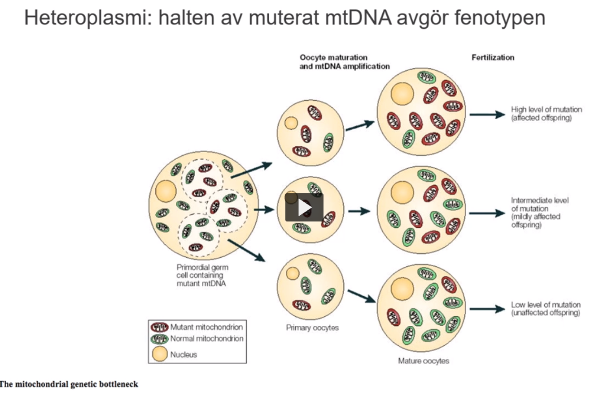
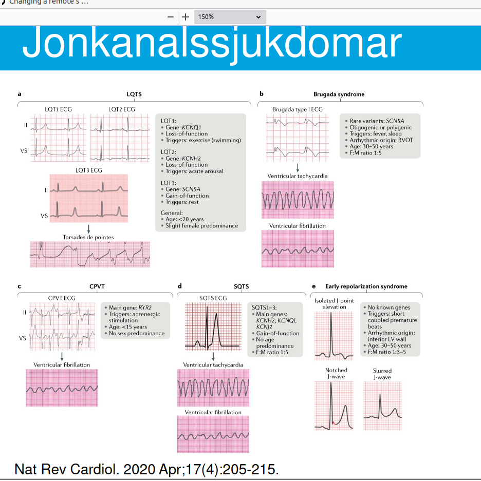
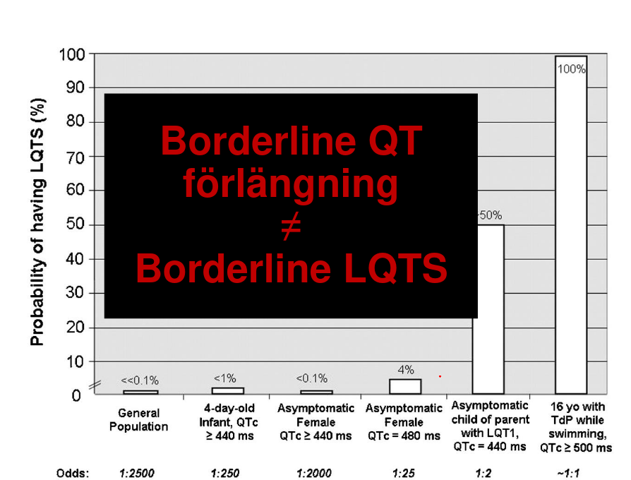

# Klinisk genetik

## Allmänt

#### olika typer mutationer

* ***normal***
* ***silent***
* ***nonsense***
* ***missense***
* ***frameshift*** (deletion -1)
* ***frameshift*** (insertion +1)
* ***insertion +1***, deletion -1

#### Genetiska analyser

* ***Kromosomanalys, cytogenetik***
* ***molekylär cytogenetik, FISH, array***
* ***DNA-baserad*** analys
* ***RNA-baserad*** analys
* ***Helgenom***: 3miljarder bp
* ***helexom***: 21k gener
* ***genpanel***: 100 gener

#### Större patientgrupper

* syndrom
* neurogenetik: e.g. huntingtons chorea
* kardiogenetik: e.g. long QT syndrom
* bindvävssjukdomar: e.g. marfans
* metabola sjd
* ärftlig cancer
* prenatal diagnostik

## Kromosomavvikelse

#### Kromosomanalys

* Blodprob: lymfocyter, 2-3 dagar
* Hudbiopsi: fibroblaster, 2-4 veckor
* Foster: 
  * amniocyter, 1-2 veckor
  * korionvilliceller 1d-2v
* benmrärgsceller: direktskörd, 24h o 48h

#### Avvikelser epidem

* Nyfödda: 0.7-0.9%
* intellektuell funktionsnedsättning: 12%
* medfödda missbildninga o intellektuell funktionsnedsätting 23%
* dödfödda 6%
* spontan abort 
  * 1a trim 50%
  * 2a trim 15-20%
* amnioocentes pga
  * ålder 1-3% 
  * missbildning vid ultraljud 15-20%

#### Typer

* Konstitutionella 
* förvärvade
* Numeriska: avvikelser antal
* strukturella: avvikelser struktur

#### Numeriska kromosomavvikelser

***Ploidigrad***

* Haploidi: n=23
* triploidi: =69
* Diploidi: 2n=46
* tetraploidi: 4n=92

***Aneuploidi***

* Monosomi: 2n-1 = 45
* Trisomi: 2n+1  = 47
* tetrasomi: 2n+2 = 48

***Trisomierna***

* 47,XY,+13/46,XY; Patau's
* 47,XY,+18/46,XY: Edward's
* 47,XY,+21/46,XY; Down's

#### Trisomi 21 - Downs syndrom

* 95% av Down syndrom
* incidens 1-2 p 1k
* ***intellektuell funktionsnedsättning***
* ***medfött hjärtfel***: ca 50%
  * AV-defekt, ASD, VSD
* ***Tarmhinder***: 8%
  * ***duodenalatresi*** 3%
  * ***megacolon , aganglionos*** 2-4¤
  * ***analatresi*** 1%
  * ***esofagusatresi*** 1%
* ***Kongenital katarakt*** 1-3%
* ***retraktionsfel*** 80%
* ***skelnig*** 35%
* ***nedsatt hörsel*** 70-80%
* ***autoimmunitet***: ökar med stigande ålder
* ***infektionskänslighet***
* ***barnleukemi*** 20ggr ökad risk
* ***thyroidea*** störningar

***Halls kriterier, tidig diagnostik Downs syndrom***

<5 kriterier = 0 misstanke; 5-11=misstanke; >12=säker diagnos

* Prematurfödda
* hypotonus
* dåligt utvecklad mororeflex
* utstickande tunga
* platt ansikte
* platt nacke, kort skalle
* snedställda ögonspringor
* epicantusveck
* brushfield spots iris
* dysplastiska öron, låt sittande
* snörvlande andnings
* fyrfingerfåra
* klinodaktyli finger V
* krota tassiga händer
* sandal gap
* överrörliga leder
* höftledsdysplasi
* rikligt nackskinnn
* högt gomtak
* tandanomalier

***Etiologi och patofysiologi***

* exponentiell korrelation med mammans ålder

##### Mosaicism

#### Trisomi 18 - Edwards syndrom

***Etiologi och patofysiologi***

* 47, XY, +18

***Kliniska kännetecken***

* Stort bakhuvud
* liten haka
* små ögon
* lågt sittande dysplastiska öron
* krakteristisk fingerställning
* extremitetesmissbildningar
* inre missbildningar
* medianöverlev: 10d
* 5-10% överlever vid 1åå
* såg sannolikher för upprepning

#### Trisomi 13 - Pataus syndrom

***Etiologi och patofysiologi***

* 47, XY +13

***Kliniska kännetecken***

* mikroftalmi
* läpp-käk-gomspalt
* polydaktli
* skalpdefekt
* omfalocele
* haloprosencefali
* inre missbildningar
* medianöverlevnad 10 dagar
* 5% lever vid 1åå
* låg sannolikhet för upprep, undantag ärftlig form

#### Könskromosomavvikelser

* 45,X
* 47,XXY
* 47,XXX
* 47,XYY

#### monosomi X - Turner's

***Kliniska kännetecken***

* incidens 1 p 2500
* Kortvuxenhet: ca 20cm under medellängd
* ovarieinsuff: streak gonads, primär amennorre, infertilitet
* coarctatio aortae: 10%
* njruanomalier: 20%
* hörselnedsättning: 60%
* intelligens inom normalområde
* karakeristiska drag: pterygium colli, bred nacke, lågt hårfäste, cubitos valgus
* hos nyfödda: svullna hand o fotryggar
* mosaikformer: 50%
* 5% 45,X / 46,XY: risk för gonadmalignitet 15-25%

***Etiologi och Patofysiologi***

* Monosmi X

#### 47, XXY - Klinefelter's

***Kliniska kännetecken***

* Hypogonadism, små testiklar, azoospermi
* infertilitet
* långvuxenhet
* kognitiva svårigheter, ADHD, ADD

#### 47, XXX

***Kliniska kännetecken***

* incidens: 1 på 1k
* långvuxenhet
* kognitiva svårigheter, ADD, ADHD
* normal fertilitet

#### 47, XYY

***Kliniska kännetecken***

* incidens 1 p 1k
* långvuxenhet
* kognitiva svårigheter, ADD, ADHD
* normal fertilitet

#### Deletion

* För att beskriva en deletion: skriver del efter involverad kromosomuppsättning, samt brytpunkten... del(5)(15.2)

#### Cru du chat 5p-

***Etiologi och Patofysiologi***

* 46, XY, del (5)(p15.2)

***Kliniska kännetecken***

* mikrocefali
* micrognati
* bred näsrot
* låtgt sittande öron
* hypotoni
* intellektuell funktiosnnedsättning
* jamande skrik

#### Wolf-Hirschhorns syndrom 4p-

***Etiologi och Patofysiologi***

* Deletion kromosom 4

***Kliniska kännetecken***

* tillväxthämning
* intellektuell funktionsnedsättning
* kluven läpp, gom
* hjärt, hjärnmissbildningar
* hypotoni
* avvikande utseende
* liknar varandra, särdrag: panna buktar, lågt sittande öron. Typiskt är utseendet mellan ögon och näsan, liknas med grekisk krigarhjälm. 

#### Mikrodeletionssyndrom

***Etiologi och Patofysiologi***

* Mikrodeletion är mindre deletioner som man lyckas detektera iom upplösning höjts över tid. 

***Exempel***

* Alagille: 20p12
* angelman: 15q11-12
* DiGeorge/CATCH22: 22q11
* Langer-Giedon: 8q24
* Miller-Dieker: 17p13.3
* Prader-willi: 15q11-12
* Rubinstein-Taybi: 16p13.3
* Smith-magenis: 17p11.2
* WAGR: 11p13
* Williams: 7q11.23

#### Prader-willis syndrom

***Etiologi och Patofysiologi***

* ***Mikrodeletion lång arm kromosom 15:*** 70% av pradi-willis syndrom fallen orskas av denna deletion
* Väldigt liten deletion

***Kliniska kännetecken***

* kraftigövervikt
* hypogonadism
* små händer och fötter
* ***Hypotoni***: initlat efter födsel
* initiala uppöfningssvårighetr
* fetma: för att inte hejda hunger
* variernnde grad förståndshandikapp
* kortväxt

***Utredning och diagnostik***

* ***med FISH***: mkt säkrare upptäcka mikrodeletioner. Man använder fluroscerande ligande som binder där DNA koden stämmer överens, varpå ser som en inmärkning på kromosomerna under ikroskop. 
  * Man använder två kontroller, samt en som targets deletionen för PWS (pradi-willis syndrom)

#### FISH

* ***Centromerspecifik DNA sond***
* ***Kromosomspecifikt biliotek***
* ***Enkelopiesond***
* 

#### Angelmans syndrom

***Etiologi och Patofysiologi***

* Precis samma deletion som PWS

***Kliniska kännetecken***

* ataxi
* epilepsi
* svår intellektuell funtkionsnedsättning
* avsaknad tal
* frekvent skratt

#### Deletion samma område different symptom

***Etiologi och Patofysiologi***

* ***prägling/imprinting***: Det finns gener som enbart uttrycks om de kommer fr mamman eller andra gener som nedärvs fr pappan 
* ***Uniparental disomi UPD***: 25% PWS, 2-5% Angelman
  * detta innebär att man nedärver kromsom 15 enbart fr mamman eller fr pappan (i.e. ***uniparental***). 
  * anses vara en ***typ av deletion***

* ***Kromosom 15, prägling***: I bilden antyds i blått de geenr som uttrycks om de nedärvts fr pappan, samt i röd de fr mamman. 
  * ***om deletion pappans kromosom:*** PWS
  * ***om deletion mammans kromosom***: Angelmans

#### 22q11 deletionssyndromet

***Etiologi och Patofysiologi***

* 22q11 har många olika namn: fenotypen kan variera mkt mellan individer. 
  * DiGeorge
  * Velo-cardio-facial
  * shprintzen
  * conotruncal anomaly face
  * CATCH 22 
* deletion proximala delen av långa armen på kromosom 22
* CATCH 22
  * C = cardiac anomalies
  * A = Abnormal facies
  * T = Thymic aplasia, hypoplasia
  * C = Cleft palate; får ett väldigt nasalt tal
  * H = Hypocalcemia
  * 22 = 22q11 deletion
* 80-90% nymutation = minimal upprepningsrisk
* 10-20% autosomalt dominant nedärvning = 50% risk! 
  * därför är det viktigt att man undersöker föräldrar t barn med detta

***Kliniska kännetecken***

* inicidens: 1 p 3k - 1 p 4k
* hjärtfel
* gomdefekter: komplett eller mildare; ofta behöver logoped
* immunologiska problem
* kalkbrist
* senare i livet: inlärnignsproblem, beteendeavvikelser, koncentratiosnsvårigheter
* karaktäristiskt utseende

***Utredning och diagnostik***

* FISH: 22q11, kontroll
* Array-CGH: comparative genome hubridization. 

#### Array-CGH

***Etiologi och Patofysiologi***

* Array Comparative Gene Hybridization
* ***Mäter gendos***: mäter alltså förlust eller för mkt, deletion el duplikation
* ! ***upptäcker inte balanserade rearrangemang***: om det skett ett utbyte mellan två kromosomer ser man inte
* ***Upptäckt beror på***: 
  * typ av array: en arrya kan inte jämföras med en annan array...
  * upplösning: hur tätt sitter DNA sonderna
  * hur informationen bearbetas

#### Strukturella kromosomavvikelser

***Translokation***

* Robertsonsk
* Reciprok

#### Robertsonsk translokation

* Sker i ***akrocentriska*** krosomerna

  * alltså de kromosomer som har sin centromer nästan ända ut i änden
  * inkluderar därför: 13, 14, 15, 21, 22

* ***Det som sker***: vi listade ovan ett antal akrocentriska kromosomer, e.g. 13 och 14. Cellerna i kroppen har ett par 13 kromsomer (en fr m, och en fr p), samt ett par 14 kromosomer

  * Vid ***Robertonsk*** translokation, slås ***två*** akrocentriska ***kromosomer*** ihop. Så om vi originally hade 4 kromosomer (2x13, 2x14), så kommer vi få tre kromosomer (1x13, 1x14, 1x[13+14]). 

* ***Inga symptom***: translokationen i sig ger inga symptom, för att man har allt material i kromosom redan

* ***Benämning***: e.g. 45 [då d är 45 totalt antal kromosomer], XX, der(14;21)\[det är ett derivat mellan 14 o 21\](q10;q10)[detta är brottspunkterna]

* ***Problem***: 

  * under mios. normalt att paren delas upp mellan gameterna. vi har tre kromosome som ska delas upp. Första exemplet är att 2 normala kromosomer går t könscell, men att vi har den tredje t den andra gameten
    * i ett fall att vi får ett barn med normal kromosomuppsättning
    * i annat fall att man får ett barn med samma Robertsonska translokerade kromosomen som förälder
  * ***Farligaste***:  annat fall är att man får robertsonska kromosomen + en normal kromosom i en gamet, och den tredje normala kromosomen i en annan gamet. 
    * efter befruktning kommer blivande barnet ***få tre kopior kromosom 21***: det kommer att ge symptom hos barnet som trisomi 21. 
  * ett till fall är att friska kromosom 21 t gamet, och derivatkromosomen + kr 14 t en annan gamet
    * båda fallen kommer avvikelsen hos embryot att d slutar med ett missfall
    * för att i första fallet avsaknad 14
    * ch andra fallet att exta 14
  * tredje fall är att alla tre kromosomerna hamnar i gamet

  

  

  

#### Bakomliggande mekanismer Downs

* 95% fristående trisomi 21: klassisk Downs
  * 47, XX, +21
* 4% har Robertsonska translokationer: translokations downs
  * 46, XX, der(14;21)(q10;q10), +21
  * ofta i kombination med kromosom 14,
  * i flera fall att det är nedärvt fr päron, så då är det viktigt att ta reda på detta. 
* 1% är mosaiker
  * 47, XX, +21/46, XX

##### upprepningsrisk för Downs

* Barn trisomi 21 karyotyp (föräldrar normal karyotyp): 
  * 0.5-1% upprepningsrisk (ej åldersrisk inkluderat, som man måste beakta utöver denna)
* Barn der(14;21)(q10;q10), +21
  * de novo: ingen förhöjd upprepningsrisk
  * mor bärare: 10-15% nästa graviditet
  * far bärare: <1%, många män med robertsonska translok har fertiltietsproblem o svårt med barn. 

#### Reciprok

* reciprok = betyder ömsesidig bytt material. 
* Detta kan ske mellan ***olika*** kromosomer.

***Etiologi och Patofysiologi***

* Under meiosen (miosen): kromosomparen vill lägga sig parallelt med varandra. 
  * ***Kvadrivalent***: men för att man har en reciprok translokatio nblir detproblematiskt: 
  * när de sen ska segregera på olika gameter, kan segregationen se olika ut. 
* Den vanligaste segregationen: är att man får 2:2 segregation
  * Att två friska korsar med varandra
  * att två ofriska korsar med varandra
  * Båda gameterna kommer ge normalt barn; ena fallet normal gamet; andra fallet har man en translokation som hos föräldern
* alla andra varianter vid segregation kommer ge obalans hos barnet: kan ge allvarliga symptom som ofta innebär missfall, eller i flesta fall barn föds med allvarliga symptom
* ***De med reciprok translokation***: 
  * ökad risk barn med intellektuell funktionsnedsättning, missbildnignar, avvikande utseende, (10-15%)
  * ökad risk för missfall

***Utredning och diagnostik***

* E.g. för Cri du chat: att man först börjar med karyotypering, sedan vidare med FISH varpå man kan hittat att kromosomen ifråga inte har de nödvändiga signalerna, som i sin tur antyder förekomsten av en deletion. 
* ***Chromosome painting***: sen kan man använda chromosome painting för att färga in en hel kromosom, varpå man kan notera att det finns en komplett kromosom (fr pappan?) samt en en till kromosom som är inkomplett, där dess del återfinns translokerad reciprokt på en annan kromosom. 
* Thus: 
  * balanserad reciprok translokation hos far: 46,XY, t(5;13)(p15;q33)
  * obalanserad reciprok translokation hos barn: 46, XX, der(5)t(5;13)(p15;q33)

#### Kromosomavvikelser hos barn

* utreds nästan uteslutande med ***Array CGH***

#### DNA sonder

* detta använder man i FISH. 

#### Helgenomsekvensering

* För att hitta balanserade o obalanserade avvikelser
* i framtiden

#### Inversion

* att man har brottspunkter som i sin tur inverteras, vänds 180 grader
* bäraren balanserad inversion: frisk, men ökadrisk för att barnet blir påverkat. 
  * risk för skadat barn 1-2%
  * ökad risk missfall, infertilitet

#### Indikationer för kromosomanalys o array CGH

***Indikationer kromosomanalys***

* Störd könsutveckling
* Kortvuxenhet hos flickor
* upprepade missfall
* infertiltiet
* sena missfall, dödfödda barn

***Indikationer för array CGH***

* misstänkt mikrodeletionssyndrom
* multipla missbildningar, dysmorfa drag
* intellektuell funktionsnedsättning, autism

## Monogena sjukdomar

#### Fennotyp i symptombild

* Autosomalt dominant
* autosomalt recessiv
* X-bunden recessi
* X-bunden dominant
* mtDNA

#### Släkträd

#### Pedigrees

### Autosomalt dominant nedärvning

* Förekommer i varje generation
* drabber båda könen, lika ofta
* 50% risk för nedärvnign t nästa generation

***Etiologi och Patofysiologi***

* ***Gain of function mutationer***: ny funktion, förändrad funktion, sjuk
* ***Loss of function mutationer:*** halva mängden protein är inte tillräckligt för bibehållen funktionm, sjuk

#### Skelettdysplasi

***Etiologi och Patofysiologi***

* Autosomalt dominant
* Akondroplasi
* Crouzon syndrom
* Hypokondroplasi

##### Akondroplasi

* vanlgiaste form kortvuxenhet, 1:26k
* korta armar, ben, stort huvud, framträdande panna, litet mellanansikte. 
* skelettavvikelser o trånga förhållande för yggmärgen o förlängda märgen kan orsaka ortopediska o neurologiska komplikationer
* händer o fingrar är påfallande korta
* Autosomalt dominant
* 80% nymutationer
* mutation:1138G>A (p.Gly389Arg)

#### Polycystiska njurar

***Etiologi och Patofysiologi***

* Autosomalt dominant
* PKD1 mutation: 85%
* PKD2 mutation: 15%
* incidens: 1pp 400-1k
* sen debut: vid 60åå har 50% uttalad njursvikt

#### Neurofibromato - NF1

***Etiologi och Patofysiologi***

* Autosomalt dominant
* men varierande expressivitet (penetrans?)

***Kliniska kännetecken***

* olika symptom hos patienter, 
* varierande svårighetsgrad,
* även inom samma familj

#### Huntingtons Chorea

***Etiologi och Patofysiologi***

* Autosomalt dominant
* ***sen debut***: Samvarierar med antalet trinukleotidrepitioner, CAG (polyglutamins)
* anticipation

***Kliniska kännetecken***

* Progressiv motor syndrom påverkar motor, kogition, psykiatriskt
* medelåldern för onset: 35åå-45åå
* medianöverlevnad: 15-18år
* chorea, korea
* rigiditet
* gångproblematik
* depression
* beteendeförändringar
* kognitiv nedgång

##### Trinukleotidsjukdomar

* Sjukdomar orsakade av proteinkodande expansioner
* Olika gener?: HD, SBMA, SCA1, SCA2, MJD/SCA3, SCA6, SCA7, DRPLA
* Progressiv neurodegeneration
* anticipation
* vanligen sen debut
* polyglutamin Q
* intranukleära inklusioner

#### Trinukleotidsjukdomar

* 18 neuromuskulära sjukdomar orsakas av expanderade repeats
  * Fragile-X
  * Huntingtons, and many SCAs
  * Fredreich ataxi
  * myoton dystrofi

#### Retinoblastom

* ***Reducerad penetrans***: vanligt vid nedärvda tumörsjukdomar
* ***Two-hit model***: 
  * säg att man har mutationen på en kromosom, sen får man en nymutation på den andra kromosomen i en somatisk cell, varpå den neoplasierar o blir tumör i slutändan
  * Alternativt att man får två somatiskt (förvärvade) mutationer i en cell som genererar tumören

#### Typisk autosomalt dominant sjukdomar

* Att man barnet får sjukdom: friska föräldrar, ej sen debutålder, nedsatt penetreans, eller varierenade expressivitet, 
* Se till att tänka på
  * nymutation
  * heterogenitet (del diagnos)
  * mosaicism (klon av muterade könsceller)
  * faderskap

#### Autosomalt dominant sammanfattning

* Heterozygoter, Aa, är sjuka
* ses i varje generation
* drabbar båda könen lika ofta
* 50% risk för överföring

***Etiologi och Patofysiologi***

* olika mutationer i samma gen, kan resultera olika fenotyper
* varierande expressivitet
* reducerad penetrans
* anticipation

### Autosomalt recessiv nedärvning

* Endast homozygoter, aa, är sjuka
* föräldrar är friska anlagsbärare, Aa
* upprepningsrisk: 25%
* drabbar både män o kvinnor
* uppträder plötsligt i en generation
* släktfigte, konsanguinitet, ökar risken

***Etiologi och Patofysiologi***

		

#### Cystisk fibros (CF)

* Vanligaste autosomalt recessiva sjukdomen i västvärlden
* 1 pp 3600 föds med CF per år i Sverige
* Bärarfrekvensen: 1:30

***Kliniska kännetecken***

* Luftvägssymptom
* gstrointestinala symptom
* svettkörtelsymptom: utsöndrar extremt salt svett
* manlig infertilitet: vas deferens agenesi
* förväntad överlevnad: >50åå, median 40-50åå

***Etiologi och Patofysiologi***

***Behandling***

#### Beta-thalassemi

* Två typer: minor och major

***Etiologi och Patofysiologi***

* HBB genen

#### Sickle-cell anemi

* Också HBB genen

***Etiologi och Patofysiologi***

* orsakas av specifik punktmutation i HBB genen
* individer med mutation i båda HBB kopior utvecklar sickle-cell anemi
* röda  blodkroppar: normalt flexibla o donut shaped, blir sickle-shaped
* ökar ihoopklumpning, fastar blodkärl, 
* resulterar i : svåra smrätor, anemi, strke, pulmonell hypertension, organsvikt, ofta tidig död

***Behandling***

* Fetalt HbF slutar produceras efter födsel
* switch t produktion adult form, HbB
* ovanligt tillstånd hereditary persistence of fetal haemoglobin HPFP: producerar HbF hela livet
* sickle-cell patienter med HFPF har mkt mildare symptom
* ***Behandlingsformen***: man verkar inducera HbF varianten

#### Metabola sjukdomar

* störning metabola pathways
* toxiska metaboliter
* avsaknad nödvändiga protein, enzym
* störning energiproduktion

### Populationsgenetik och genetisk epidemiologi

* Hur sstor risk har vem som helst i pop att vara anlagsbärare för specifik autosomalt recessiv sjukdom

#### Riskberäkning

#### Hardy-Weinberg distribution

* Vanlig, normal, dominant allel = $A$
* Ovanlig, sjuk, recessiv allel = $a$

|                  | Gameter               |
| ---------------- | --------------------- |
| Genfrekvens      | $p + q = 1$           |
| Genotyp frekvens | $p^2 + 2pq + q^2 = 1$ |

* Där vi har att $p$ är  $A$, att $q$ är $a$. att $AA=p^2$,  $2pq=Aa$, $aa=q^2$.
* ***Notera att***: $q^2$ är incidensen

##### Ett exempel

* 21-hydroxylas deficiency, VAH

  

$$
\text{(AR) incidens} = q^2 = \frac{1}{10,000} \\

q = \sqrt{\frac{1}{10,000}} = \frac{1}{100} \\

\text{Vi vet för genfrekvens att: } p + q = 1 \iff p = 1-q=\frac{99}{100} \\

\text{därför kan vi lösa andragradsekvationen för genotyp frekvens}
$$

#### Faktorer som påverkar genfrekvensen

* Liten population, isolat
* selektion
* migration
* icke-slumpmässigt partnerval
* ökad mutationsfrekvens

### X-bundet recessiv nedärvning

#### Färgblindhet

#### Hemofili B - blödarsjuka

* 

#### X-bundet letala sjukdomar

* 33% de novo
* 67% nedärvda fr modern

#### Fragile-X syndromet

* olika grader utvecklingsstörning, ofta kombination autism o eller hyperaktivitet
* vanligaste ärftliga orsaken t utvecklingsstörning
  * 15-25 av 100k pojkar
  * 8-12 av 100k flickor
* mutationer i FMR1 genen, X-bunden nedärvning

### X-bundet dominant nedärvning

* Inkontinentia pigmenti IKBKG genen
* rett syndrom, MECP2 genen
* Hypofosfatemisk rickets (phex genen)

* Vid X-bundna dominanta sjukdomar får pojkar med sjukdomsanslag ofta så svåra symptom att de ej överlever el föds

### mtDNA

### Monogen nedärvning sammanfattning

* Autosomalt dominant Heterozygoter (Aa) är sjukaSes i varje generationDrabbar båda könen lika ofta50% risk för överföringolika mutationer i samma gen kanresultera i olika fenotypervarierande expressivitetreducerad penetransanticipatio
* utosomalt recessivEndast homozygoter (aa) är sjukaFöräldrar är friska anlagsbärare (Aa)Upprepningsrisk 25%Båda könen drabbas lika oftaSes plötsligt i en generationSläktgifte (konsanguinitet) ökar riskenHardy Weinburgs lag –anlagsbärarfrekvens i normalpopulation
* X-bunden recessiv Drabbar pojkar/mänKvinnor är friska anlagsbärareUpprepningsrisk 25%X-bunden recessiv letal sjukdom – 1/3 är de novo
* X-bunden dominant Drabbar kvinnorVanligt är att de är letala hos pojkar
* mtDNANedärvs från moderHeteroplasmi – varierande expressivite

### Genetisk analys

* bekräfta, fastställa klinisk diagnos
* genotyp, fenotyp, prgonos
* anlagsbärardiagnostik
* reproduktionsalternativ, fosterdiagnostik PGD

#### Kliniskt fall

* Kvinna
  * autosomalt dominant sjd
  * är gravid
  * vill ha prenaaldiagnostik

#### Prenataldiagnostik

* ***Förutsättnign för att erbjuda prenataldiagnostik eller anlagstestning***: av släktingar, är att den genetiska orsaken t sjukdomen är fastställd hos en sjuk individ i familjen
* ***Anlagsbärartestning***: det är en ***riktad analys***, vi vet vad vi letar efter, och vi vill veta om den undersökte patienten är en anlagsbärare
* ***Screening***: vi har (möjligne?) ingen förkunskap om patienten  

***Metoder***

* Amniocentes: v15-16
* Chorionvillibiopsi, korionvillibiopsi: v10-12

#### Preimplantatorisk genetisk diagnostik, PGD

#### Frågor kan besvaras endast efter genetisk orsak ID

* Varför
* prognos
* behandling, klinisk uppfölj
* upprepningsrisk
* prenataldiagnostik

#### Sekvensering

* Massive parallel sequencing MPS
* Next generation sequencing NGS
* Forsaka om: identifiering sjukdomsorsakande gener
* klinisk diagnostik: konstitutionella avvikelser, förvärvade avvikelser, detekterar både sekvensvarianter o kromosomavvikelser

#### Strategi - kandidatgener

##### Sanger sekvensering

* DNA sekvensering av kodande delar, exon
* detektion splice site mutationer
* regulatoriska regioenr analyseras ej: kunskapen om dessa regioner begränsad
* ca 10 exon/gen
* 10 gener - 100 fragment - 200 sekvens rxn

#### Konsekvenser sekvensavvikelser

#### Olika mutationer

* Anta att kodonen är TGC (cys)
  * ***Silent mutation***: TGT (cys)
  * ***Missense mutation***: TCC (ser), GGC (gly)
  * ***Nonsense mutation***: TGA (STOP)

#### Mutationsspektrum

* Alla pats har samma mtutation
  * akondroplasi
  * dystrofia myotonika, DM1
  * Huntingtons
* olika patienter, olika mutationer, men samma gen
  * neurofibromatos
  * marfan syndorm
  * cystisk fibros

#### Genetisk heterogenitet

* Gen A, B eller C
* mtuationer i dessa gener ger samma el liknande symptom

##### Long-QT syndromet:

* 12 gener: AKAP9, ANK2, CACNA1C,CAV3, KCNE1, KCNE2,KCNH2, KCNJ2, KCNQ1,SCN4B, SCN5A, SNTA1
* jonkanaler

##### Hypertrofisk kardiomyopati

* 18 gener: ACTC1,CAV3,GLA,  LAMP2,MTTG,MTTI,MTTK,MTTQ, MYBPC3,MYH7,MYL2,MYL3, PRKAG2,TNNC1,TNNI3,TNNT2,TPM1,TTR

#### Massive parallel sequencing

* genpaneler: exon fr utvalda relevanta gener
* WES: exom-alla exon i genomet (whole exome sequencing?)
* WGS: genom, allt DNA (kodande o icke kodande, intron, exon) (whole genome sequencing)
* Stor mängd sekvensdata
* 50k-60k sekvenscarianter, vid exom sekvensering (WES)
* 3-5M sekvensvarianter i genomet, WGS
* mutation eller polymorfi? bifynd?

#### Whole exome sequencing

#### normalvariation mellan individer

*  2 individer är 99.9% överensstämmande
* 1 av 1250 bp skiljer mellan 2 individer
* dessa varianter kallas SNPs

#### Mutation eller polymorfi (normalvariatnt)

* ***Mutation***: genetisk flrändring ger upphov ändrad fenotyp
* ***Polymorfi***: normal variant
  * genetisk förändring som inte påverkar fenotypen
  * varianten finns i >1% av populationen
* ***Notera***: alla varianter är inte antingen eller, utan kan vara båda

#### Klassificering sekvensvarianter

* benign
* likely benign
* unclear significance 
* likely pathogenic
* pathogenic

#### Gendiagnostik av ovanlig sjd med WGS, WES

* det finns >8000 ovanliga syndorm
* Syndromutredningar, TRIO: 3% ongoing, 33% solved, 64% no finding

#### Bioinformatiska genpaneler klin gen

* ***WGS en individ***
  * sekvensering vid clinical genomics, scilife
  * neuromuskulära sjukdomar
  * bindvävssjukdomar
  * skelettdysplasier
  * ärftlig cancer
  * intellektuell funktionsnedsättning
  * kardiologi
  * alla kända gener med en fenotyp; "önskemå", HPO termer
  * diverse andra mindre paneler (DSD, njurca, ET, hjärnabnormaliteter)
  * genpaneler avseende BrCa, OvCa, CoCa, sekvenseras på klingen

## multifaktoriellt arv

### Allmänt

* Genetik + miljö, livsstil
* egenskaper, kvantitativa, folksjukdmaarna medfödda missbildingar
* synonymer: multifaktoriella sjd, komplexa sjd, polygena sjd
* flera ***gener o miljöfaktorer*** samverkar t fenotyper
* oklart nedärvmönster, men sjd ansamlas i familjer
* svag gentyp-fenotyp korrelation
* polynmorfier SNP associeras med sjd

### Kvantitativt arv

* kroppslängd
* BMI
* pigmentering. ögon, hud, hår
* skonummer
* huvudomfång
* blodtryck
* koncentrationer i blod: Hb, blodfetter, glukos, etc
* prestationer, talang: IQ, springa, hoppa, musikalitet
* personlighet

### Kvalitativ arv

* ***Benägenhet*** för mga åkommor, folksjukdomar
* övervikt
* hjärtkärl sjd: högt B, höga blodfetter
* DM2
* psykisk sjd
* alzheimer
* reumatiska sjd
* allergi
* cancer

### Vad letar man efter

* ***Monogena sjukdomar***: ovanlgia genvarianter, mutationer, kvalitativ
* ***Multifaktoriella sjukdomar***: vanliga genvarianter (polymorfier), ofta reglerande - kvantiativ effekt

### Medfödda missbildningar

#### Spina bifida

#### Läpp, käk, gomspalt

#### medfödda hjärtfel

* VSD

#### Infantil hypertrofisk pylorusstenos

* mkt högre risk hos pojkar

#### Medfödd höftledsluxation

* Flickor har mkt högre risk

#### Hypospadi

* med könet att göra

#### Vridfot

### Upprepningsrisk, multifaktoriella missbildningar

* Fler släktingar -> högre risk
* allvarlig msisbildning -> större risk
* ofta könsskillnader, e.g.:
  * medfödd höftledslux
  * pylorusstenos

### Genetisk testning?

* En spec ***genetisk riskfaktor*** inte tillräckligt för orsaka sjd
* en spec ***riskfaktor*** inte nödvändig för sjukdomsuppkomst
* kombination riskfaktorer: genetisk + omgivnign/livsstil, orsakar sjd
* kombo riskfaktorer olika hos olika patienter
* majoritet riskfaktorer är okända

## Genetisk vägledning

### Allmänt

* ad är det för tillstånd?•Vad innebär det för patienten? •Risken att det drabbar andra i patientens familj?•Är genetisk utredning möjlig?•Vilka val har patienten (uppföljning, behandling, prevention)•Vilka reproduktiva val finns? •Diskutera valen med patienten•Stödja patienten i deras va

### Anamnes o status

* vad har personen för bakgrund, förkunskaper?Vad har personen för socialt stöd?Hur ser familjehistorien ut?Medicinsk anamnes/statusPersonlighetRiskuppfattningLivssyn, etisk kompas

### Diagnostiskt

* Rätt diagnos.......•Anamnes •Status•biokemi, röngten, PAD, obduktion•olika former av databaser•men även olika former av genetisk diagnostik–men: det behövs en bra fenotypning= bra anamnes och status för att kunna bedöma genetiska förändringar.

#### personen

* Vad är det för person?Vet patienten varför de är här?-får en uppfattning om förkunskaper, hur de har uppfattat frågan och vad de (eller läkaren som remitterade) vill vetaSocial situation: Partner? Arbete? Utbildning

### gällande upprepningsrisk

* m frågan även gäller upprepningsrisk•Önskar de flera barn?•Hur tänker de kring risken att få ett sjukt barn?•Öppna frågor, ej dömande

### Riskuppfattning

* RiskuppfattningVarförkomfråganuppjust nu?(Andraerfarenhetersompåverkar?)Ex näravänhar gåttborticancer....Vadärdu (mest) oroligför?Om du fårhöraattdu har enökadrisk, hurtanker du kringdet?
* ad är sannolikheten att en sjukdom som förekommer hos 1/1 000 000 kommer att hända igen? 

### Pedigree, familjehistoria

* Pedigree/familjehistoria= familjehistoriaInkluderar: etnisk bakgrund, KonsanguinitetMissfallTidiga dödsfallàGer kunskap om vad patienten vet om ett ev ärftligt tillstånd

### Ursprung

#### Svenska ortnamnsjukor

* Anundsjösjukan: Huntington
* Arjeplogsjukan: Porfyri AIP
* Skellefteåsjukan: familjär amyloidos

#### thlassemi

#### Exempel ärftlgia sjd folkgrupper

### Konsanguitet - kusingifte

### Exempel

* Remiss: En ung flicka har opererats för gomspalt. Hon har oligodontioch tänderna och tungan har annorlunda form. Ansiktet är lite platt. Fingrarna är mycket korta.•Tacksam genetisk vägledning
  * Vilka frågor pats föräldrar har
  * vilken info tänkeru ge
* Frågor
  * •Vilket tillstånd har min dotter? •Varför har hon den? (Är det mitt fel?)•Vad är prognosen?•Finns någon särskild behandling?•Kan det hända igen? (om vi får flera barn/ om patienten får barn?)
* Multipla Oral-facial-digital syndrom med olika nedärvningsmönster ........
  * –X-bundet dominant (<1% to 50% upprepningsrisk)
  * –Autosomalt recessive (25% upprepningsrisk)
  * –Sporadisk (låg upprepningsrisk)
* àGenetisk utredning
  * Testa föräldrarna 
    * –Kan leda till en diagnos hos någon som anser sig vara frisk
    *  –Skuld över att ha fört över anlaget till sitt barn
    * –Men kan också leda till viktig information för uppföljning eller reproduktiva val

#### Upprepningsrisken

* GISSA ALDRIG: läs på, fråga en kollega, frågeremiss, konsulttelefon

#### Genetisk utredning

* genpanel: 16 kända gener: patogen variant in OFD1, X-kromosomen

#### Förstå fakta kring tillståndet

* Förstå fakta kring tillståndet
* Ärftlighet: X-bunden dominant, variabel expressivitet hos flickor 
* Risk i en framtida graviditet är 50% att barnet ärver mutationen
* Men manliga foster med mutation överlever inte. 
* Av födda barn kommer 
  * 33% att vara friska flickor, 
  * 33% flickor med symtom och 
  * 33% friska pojkar

#### Reproduktiva val

* Reproduktiva val 
* Avstå från barn 
* Ingen testning
* Prenataldiagnostik (moderkaksprov) under graviditet •
* Pre-implantatorisktgenetisk diagnostik (PGD)
* Äggdonation
* Adoption
* Föräldrarna kan tycka olika

#### Uppföljning

* Uppföljning•Multidisciplinärt team för pat.•Pat. fick en extra resurs i skolan.  •Mor remitterad till njurkontroll: ultraljud njurar visade multipla cystor. Hon hade även en viss påverkan på njurfunktionen

### Genetisk vägledning

* Kan hjälpa familjer att: 
  * •Ta informerade beslut om framtida graviditeter-
  * Kan jag få friska barn?•
  * Få korrekt information om diagnosen, prognosen, lämplig uppföljning för att undvika eller minska komplikationer hos patienten
  * •... och ibland hos släktingar
  * -t.ex. njursvikt vid OFD1
  * •Förstår VARFÖR det hände-inte deras fel

### Riskuppfattning

* Mkt subjektivt
* -Jämfört med populationsrisken?•Risk för vem som helst att få ett barn med en medfödd missbildning:1:30 (3.3%)
* ***Relativrisk***: Din risk attfåettbarn med enmedföddmissbildningär100% högreänandraföräldraparisammaålder
* ***Absolut risk***: Din risk attfåettbarn med enmedföddmissbildningär5%
* Medicinsk risk –Faktabaserad
* Känslomässig risk -Erfarenhetsbaserad -Sjukdomens svårighetsgrad-vem har insjuknat?

#### Faktorer som påverkar riskuppfattning

* idigare erfarenheter med diagnosen
* •Tajmingen för delgivande av information•
* Socialt stöd•
* Ålder
* Förväntningar•
* Vägledarens uppfattning 

### Kalle, 2åå 

#### Hörselnedsättning

* Har precis fåttdiagnosenmedföddhörselnedsättningAutosmaltrecessivmed bi-alleliskamutationeriGJB2. 
* Hans föräldrarärnormalhörandebärareav varsinmutation
* Upprepningsriskenär25% (1/4) 
  * •Är det högt eller lågt? 

#### hjärtfel

* Kalle, 2 årHar precis avlidit i hjärtsvikt efter flera månaders vård på IVA.Han var sjuk länge med failureto thrive, påverkad tillväxt, trötthet, matningssvårigheter, apnéer, synkope.Hans hjärtsjukdom orsakades av en nymutation i MYH7. Upprepningsriskenär0.5%, (1/200).•Är det högt eller lågt?

### Sammanfattning

* •Vem utför genetisk vägledning? –All personal inom hälso/sjukvård gör! •Varför är det viktigt? –Upprepningsrisk–Individ-anpassad uppföljning –Kunskap ger mak

## Genetiska neuromuskulär sjukdomar

### Allmänt

***Definition***

* en neuromuskulär sjd är ett syndrom som påverkrar ***perifera nervssytemet, PNS***, PNS inkluderar muskler, neuromuscular junctions, prifera nerver i extremiteter, och motorneuron i ryggmärgen, spinalt. 

***Etiologi och Patofysiologi***

* Genetiska sjukdomar
* annan etiologi: e.g. autoimmunitet

### Klinisk bild

#### Hypotoni - Floppy infant

#### Artrogrypos 

* Sekundärt t nedsatt rörlighet intrauterint

#### Muskelsvaghet

***Kliniska kännetecken***

* Trip alot
* feet slap the ground when walk
* clumsy
* walk funny 
* cant run
* feet high arches

#### Kännetecken

* Typiska statusfynd: 
  * avvikande reflexer
  * muskelatrofi
  * muskelhypertrofi
  * svaghet
  * avvikande muskeltonus

#### Lokalisation svaghet

### Diagnostik

* Anamnes, status
* neurofysiologi
* Labb: CK etc
* muskelbiopsi: histologi, proteininfärgningar
* genetiska analyser: Detta beror på vad för neuromuskulär sjd som patienten drabbats av (e.g. myasteni, charcot marie tooth, eller om det är en myopati exmpelvis)

#### Vilken Genetisk analys ska man välja

* ***Klinisk bild, fenotyp***
* Påverkan enskilda gener: dystrofia myotonika, 
* Multipla gener involverade: myasteni, CMT, hypotoni UNS (neuromuskulär sjd)

***Tillgängliga analyser***

* Riktad analys
* Genpanel: 5-1000 gener
* Exom elle Genomsekvensering

***Genpanel för neuromuskulära sjd, NMD-panel***

* 880 gener
* patientålder: 0-73 åå
* klinisk bild
  * myopati
  * hypotoni UNS
  * polyneuropati (CMT)
  * myasteni
  * SMA
* Inga fynd 53%, patogena fynd 27%, oklara fynd 20%

### Mutationstyper

* Trinukleotid repeats
* Single nukleotid variationer: punktmutationer
* Små deletioner, duplikationer i en gen

#### Antalet gener involverade:

* Spinal muskelatrofi: 30 gener
* Neuropati, charcot marie tooth: 105 gener
* myasteni: 14 gener
* myopatier: 125 gener (inkl för myopatier,muskeldystrofier, dystrofia myotonika, mitokondrie sjd, metabola sjd)

### Dystrofinopati

* inkluderar: Duchennes muskeldystrofi, Beckers muskeldystrofi

***Etiologi och Patofysiologi***

* ***Dystrophin***: är ett protein som binder actin, aktin, indirekt med extracellulära matrix. Mer specifikt binder dystrofin till aktinet direkt, varpå andra änden binder med membranbundet protein som i sin tur har en kontakt med ECM. 
  * Det är därför ***avvikelser*** i denna genen som ger problemet. 
  * ***deletion/duplikation***: majoriteten har detta i genenn
  * 10-30% har istället en punktmutation
* ***Beckers***: Proteinet har en ***in-frame*** mutation, varpå man får ett partiellt funktionerande protein. Brofunktionen är bibehållen
  * ***ger en mildare fenotyp***
* ***Duchennes***: ***Out-of frame mutation***, ger ett prematurt trunkerat protein. Brofunktionen är förlorad, ger en svår fenotyp.
* 30% är de novo mutationer

***Kliniska kännetecken***

* Kliniska bilden drivs av den genetiska avvikelsen.
  * ***Duchennes***: om proteinet blir helt förstört: e..g stop-mutation eller en deletion, förstår läsramarna (Frameshift
  * ***Becker***: om proteinet har kvarvarande funktion, e.g. missense mutation eller deletion som ej förstör läsramen. 

***Diagnostik***

* Genetisk diagnostik: MLPA och sekvensering. 

  * deletion exon 45-50

  

***Nedärvningsmönster***

* ***X-bunden recessiv***: Om mamman har det och får en son, XY, kommer det enbart uttryckas fr X kromosomen som är den påverkade, varpå en son med duchennes/Becker. 

***Behandling***

* Genterapi, vid Duchennes muskeldystrof: ***antisense-medierad exonskipping***

### Fall - svår hypotoni - Dystrofia myotonika

* Nyfödd Pojke
  * remiss för genetisk konsultation
  * hypotoniutredning
  * önskad udnersök: DNA analys av dystrofia myotonika + CGH array
  * pojke född i v32+0. ttvå friska äldre syskon. en avbruten grav i v 17 opga hjärmissbildning
  * ingen känd konsaninitet. 
  * polyhydramnios samt misstänkt spetsfot på UL
  * med tanke på polyhydramniosen, tappningen för att försöka förlänga tiden i magen.
  * vid tappning prov t er för qf-PCR, samt CGH array
  * framföds 20/3, dagen efter tappning
  * påtagligt hypoton direkt efter födsel, tas direkt t barnbordet o intuberas vid 1.5h ålder
  * ligger fortsatt i respirator
  * drar andetag i resp sj,
  * rör sig lite granm en fortsatt hypoton

### Dystrofia myotonika

***Etiologi och Patofysiologi***

* ***DMPK genen***
* trinukleotid repitioner: (CTH)n repeats i slutet av genen
* n 150-2000: moderat-svåra symptom
* n 50-150: milda symptom
* n 5-30: normal
* ***Autosomalt dominant***

***Kliniska kännetecken***

* ***Mild***: katarakt, mild myotoni, ålder onset 20-70år, mortalitet 60 till normal livsspann
* ***Klassisk***: svaghet, myotoni, katarakt, skallighet, hjärtarrytmier, andra, onset 10-30åå, mortalitet 48-55åå
* ***Kongenital***: infantil hypotoni, respiratorisk brist, intellektuella svårigheter, klassiska tecken förekommer hos vuxna, onset födsel-10åå, mortalitet 45åå

### Fall - kvinna tetrapares, 30åå

* 30åå kvinna, tetrapares
  * kugelberg Welanders sjukdom? annan nervsjd
  * önskad genetisk test, SMA
  * debut 10åå, fått diagnos enl ovan i rumänien. tetraparetisk med ffa svaghet proximalt fr 20åå rullstosburne
  * har skolios
  * ingen EKG påverkan eller synoperkan
  * hyugglig funk i hö hand, begränsad kraft i vä arm
  * ingen känselpåverkan
  * EMG i 1982, o 1994
  * har varit svårvärderade pga uttalade symptom
  * men motsäger inte diagnosen
  * skulderbäckendystrofi har sså övervägt
  * EMG har visat neurogena förändringar
  * ***Mutationsanalys***: visade deletion exon 7 och 8 i SMN genen, visar att dessa exoon är deleterade. således är deletion påvsidav, vilekt visar att pat har spinal muskelatrofi SMA

### Spinal muskelatrofi (SMA)

***Etiologi och Patofysiologi***

* Autosomal recessiv
* andra vanligaste autosomala recessiva sjd efter cystisk fibros
* ! bärarfrekvens 1:50
* incidens 1 på 15000
* ***Genen, SMN1 gen***: survival of motor neurons gene
* ***Deletion homozygot***: 95-98% av SMA patienter har homozygot deletion av exon 7 o 8, i SMN1 genen
* ***Compound heterozygot:*** 2-5% har deletion på ena genkopian o en punktmutation i andra, ***compound heterozygot***
* ***Svårighetsgrad av sjukdomen***: beror på hur många genkopior man har av en annan gen, nämligen SMN2
* ***Expression SMN1 o SMN2***:  Verkar som att SMN1 och SMN2 krävs för att bilda SMN proteinet, varpå påverkan av båda påverkar nivåerna av det givna proteinet, varpå fenotypen som i SMA (spinal muskelatrofi)

***Kliniska kännetecken***

* ***SMA typ 1: Werding Hoffman***
  * svåraste formen av SMA
  * debut fr födelse t 6 månader
  * dör innan 2åå
* ***SMA typ 2: intermediär***
  * symptom fr 6-18månaders ådler
  * överlevnad över 4åå
* ***SMA typ 3: Kugelberg-Welander***
  * Debut över 2åå t vuxen ålder

### LGMD-2l, limb-girdle muscle dystrophy 2l

* ***Epidem***: LGMD2l är den vanligaste LGMD formen i sverige
* ***autosomalt recessiv***
* ***genen***: Leu276lle i FKRP genen, founder mutation, ca 1/100 bärare
* ***Debut***: sjukdomen visar sig oftast i tonåren, 5-25åå, med svaghet som är mer uttalad i armarna än i benen, o medför alltid pseudohypertrofi av vadmusklerna
* ***CK***: CK stegring tidigt tecken
* ***hjärta, andning:*** med tiden får ungefär hälften hjärtpåverkan och påverkan på andningsmusklerna

### CMT1A

* Charcot-Marie-Tooth typ 1a, utgör 70-80% av alla fall av CMT1
* ***Kromosom och PMP22***: CMT1A orsakas av en duplikation av en region på korta armen av kromosom 17, inkluderar ***genen PMP22***
* ***epidem***: 
  * ca 70-80% av patienter med CMT1A har ärvt mutationen fr en förälder, 
  * o övriga 20-30% har de novo mutation

## Ärftliga metabola sjukdomar

### Allmänt

* Centrum för medfödda metabola sjukdomar, CMMS
* biokemiska + genetiska utredningar, behandlingskontroller
* nationellt register för uppföljning, RMMS
* PKKU-laboratoriet: 115 000 svenska nyfödda/år, 25 sjukdomar man letar efter, 90 barn upptäcks varje år

#### helgenomsekvensering

* Miljontals varianter, vissa som redan är kända, andra som forskas på

#### Laboratoriediagnostik

* ***Rutinlabb, kemlabb***
  * B-glukos
  * P-ammoniumjon
  * P-laktat
  * B-ketoner
* ***Biokemiska specialanlyser, screening***
  * U-organiska syror
  * P-acylkarnitiner
  * P-U-CSF-aminosyror
  * mfl
* ***Riktade biokemiska analyser***
  * ***Enzymaktivitetsmätningar***: lymfo-leukocyter, fibroblaster
  * ***mitokondrieutredning***: muskelbiopsier
* MR
* genetik, inkl helgenomsekvensering

### Medfödda metabola sjd

* defekt omsättning av små molekyler, metboltier: nyföddhetsscreening
* mitokondriella sjd
* defekt omsättning makromolekyler

#### Defekt omsättning små molekyler, metaboliter

* Intoxikation och eller hypoglykemi
* ofta intermittenta symptom
  * Huvudvärk
  * ataxi
  * fövirring
  * medvetslöshet
  * ofta kognitivt påverkad patient
* E.g.
  * ureacykeldefekter
  * betaoxidationsdefekter
  * PKU

### Metabola riskperioder

* Neonatalperioden
* infektioner
* fasteperioder
* fysisk ansträngning
* stress

### Fall - Pojke 7åå inkommer medvetslös

* Infektion? meningit? förgiftning? metabol sjd?
* anamnes: utvecklingsförsenad, balanssvårigheter, varit medvetslös tidigare, syskon dött
* ***Labb***: vääldigt hög ammoniak 950mikroM - skadar hjärnan, 
  * U-orotsyra högt, 
  * P-aminosyror: högt glutamin o alanin
  * U-aminosyror: argininosuccinat
* Därför: ***Ureacykeldefekt: ASL-brist*** (argininosuccinate lyase)
* Familj berättar: 
  * född vegetarian, vägrar äta kött
  * älskar lingonsylt: kilovis (innehåller natriumbensoat, ett konserveringsmedel, som denna metabola sjd behöver, i.e. har han självmedicinerat sig sj)

### Ureacykeldefekt - ASL brist

***Etiologi och Patofysiologi***

* Autosomalt recesiv sjd: 1:200k ?

***Behandling***

* ***akut dialys***
* ***proteinbegränsning***
* ***arginintillskott***
* ! ***natriumbensoat***: detta är ett konserveringsmedel som kan återfinnas i lingonsylt (lyssna på patienterna ! )

***Uppföljning***

* Genetisk vägledning, familjeutredning
* 

### Fall - 2åå

* Kräkts, tappat medvetande
* okontaktbar
* ätit klent pga infektion emed feber
* i ambulans ntoeras B glukos 1.6, får glukosdropp, vaknar till
* U-aorganiska syror, P-acylkarniner: bild som vid MCADD medium chain acyl CoA dehydrogenase deficiency, 

***MCADD***

* Medium chain acyl-CoA dehydrogenase deficiency

***Etiologi och Patofysiologi***

* Autosomalt recessiv sjd, 1:10k

* Vi är på beta-oxidationen, om pat inte har tillförsel glukos, 

  * kan hon inte ta till fettreserver och kompensera, 
  * kan därför inte bilda ketonkroppar

* Det är olika enzymer som angriper de olika långa fettsyrorna, där 2 kolatomer i taget som oxideras

  * det är medium chain som är den vanligaste bristen i Sverige

* Så länge man inte får hypoglykemi o har kontinuerligt glukosintag är det bra. 

  

***Behandling***

* Akut glukostillförsel
* undvika fasta, regelbundna måltider
* undvika katabolism
* genetisk vägledning, familjeutredning
* Man kan helt förebygga svåra skador med bra behandling som ovan

### Fenylketonuri PKU

***Etiologi och Patofysiologi***

* Kan inte omsätta fenylalanin (aminosyra)
* när vi äter stora proteiner, bryts ned t aminosyror som fenylalanin
* fenylalanin bryts normalt t tyrosin av fenylalanin hydroxalas, o viktigt för katekolaminer o melanin
* om man inte kan bryta ned den -> fenylketoner, varpå man får fenylketonuri

***Kliniska kännetecken***

* Normal vid födseln
* mental retardation
* muskelsvaghet
* kramper
* dålig pigmentering: melaninet kmr fr tyrosinet, inget allvarligt symptom, men man känner igen de
* beteendestörningar: aggressivitet (ngo för att de har plågsam huvudvärk etc)
* normal livslängd

***Upptäckten***

* Droppade pigment i blöjan för att se om ketoner i blöjan, diffa diabetes, men färgomslaget va ngt han aldrig sett, varpå ny sjukdom upptäckts, d va fenylketonuri

***Diagnostik***

* PKU-screening: 

***Behandling***

* Inte belasta med fenylalanin: proteinfattig kost samt 
* tillräckligt av andra aminosyror utan fenylalanin
* vitamin o mineralier
* BH4
* behandlingskontroller: 
  * fenylalanin 150-350 mikroM
  * p-aminosyror: man följer aminosyrorna hos patienten. 
* livslång beh
* Normal utv vid bra beh

***Uppföljning***

* Följer P-aminosyror, där man får fram koncentrationsvärden för alla aminosyror,

### Nyföddhetsscreening

* Syftet: hitta arn med behandlingsbara sjukdomar innan permanenta skador,
* Omfattande verksamhet, kriterier vilka sjd man ska screena för, Wilson o Jungner kriterierna, viktigaste:
  * ska finnas behandling
  * finans lämpligt test: screening är svårt, träffar aldrig 100% om screenar en befolkning, blir aldrig helt perfekt, bill inte missa barn, blir alltid ngn falsk-positivt, drf bra beredskap för att ta hand om familjerna som drabas i onödan. för att snabbt uppföljande brob
  * screening ska vara en kontinuerlig process: ansvariga för att följa prestandan av screeningen. 

#### Programmet

* Informaton t sjukvård, blivande föräldrar
* prov >48 timmar efter födsel
* analys på PKU labbet, CMMS
* Telefonsamtal t hemsjukus, specialistteam
* utredning, verifierande prover, 
* behandling
* återraport t PKu labbet, kvalitetsregister RMMS, behandlingskontroller

#### Sjukdomar i programmet

* PKU: 1:17k
* galaktosemi: 1:100k
* ! kongenital hypothyreos: 1:3k, den enda av sjukdomarna som inte är monogen, kan vara en monogen, men oftaast anläggningsdefekt, multifaktoriell
* CAH: 1:10k
* biotinidasbrist: 1:50k
* Efter intro tandemmasspektrometri, 2010:
* Betaoxidationsdefekter
  * CUD
  * CPT1
  * CACT, CPT2
  * VLCADD
  * MCADD
  * LCHADD
  * GA2
* Organiska acidurier
  * IVA
  * PA
  * MMA
  * GA1
  * BKT1
  * TYR1
* Ureacykeldefekter
  * CIT
  * ASL
  * ARG
* Aminosyreomsättningsrubbning
  * pku
  * msud
  * hcy
* SCID: severe combined immunodeficiency, 

#### Mekanistiskt

* Tandem mass-spektrometri, nov 2010
  * Tidigare behövde man maskin för varje prov, men med denna kan man screena för väldigt  många	
  * ökade fr 5 till 24 sjukdomar
  * tar en blodfläck för att kunna analysera

#### SCID

* severe combined immunodeficinecy, 
* inkluderas i nyföddhetscreeningen
* hög dödlighet
* benmärgstransplantation

### Mitokondriella sjukdomar

* Det man menar med mitokondriella sjukdomar = andningskedje defekter, elektrontransportkedjan
  * tar emot elektroner o transportera de läöngs med elektronkedje komplexet
  * därför heter oxidativ fosforylering.
  * Tar emot elektroner fr citronsyracykeln, som kmr fr glukosomsättnig eller fettsyreomsäöttning

***Kliniska kännetecken***

* Symptom av energibrist, ofta tsmns laktacidos
* alla organ, ofta
  * CNS
  * muskulatur
  * hjärta
  * lever, benmärg, tarm, njruar
* sjukdomsdebut vid vilken ålder som helst 

***Etiologi och Patofysiologi***

* Hjärta: conduction disorder ,WPW syndrom, kardiomyopati
* Muskler: svaghet, fatighue, myopati, neuropati
* Hjärna: seizures, myokloni, ataxi, stroke, demens, migrän
* Kolon: pseudo-obstrktion
* inneröra: sensoneurla hörselförlust
* blod: pearsons syndrome
* njure: fanconis syndrome, glomenopati
* pankreas: diabets
* lever: hopopati
* öga: opticus neuropati, oftalmoplegi, retinopati

#### Lebers hereditära optikus neuropati

* LHON
* Plötslig blindhet hos unga vuxna: ofta börjar ena ögat, sen kommer t andra ögat osså
* förstår ofullständigt

***Etiologi och Patofysiologi***

* alltid nedärvt via mamman: visar sig vara mitokondriellt. 
* muterad 11778 G>A: i ND4 vid LHON

#### Mitokondriellt

* mtDNA: innehåller 37 gener
  * 2rRNA
  * 22tRNA
  * 13 proteinkodande
* ***Heteroplasmi***: Cellerna har ju tusenntals kopior av mitokondrier. därför kan varje cell innehålla olika många av denna muterade mitokondrie, därför ***heteroplasmi***. 
  * Beror på hur mkt av deet muterade man har, 
  * em ***tröskeleffekt***
  * svårt att bedöma upprepningsrisken därför
* ***Andningskedja***: 
  * dels proteienr nukleärt, klassiskt autosomalt recessiva, 
  * samt komponenter fr mtDNA som är andra endärvningsmönster

***Utredning***

* Räcker inte med blodprov: heteroplasmin olika olika vävnader
* ***Klassiskt***: muskelbiopsi, golden standard
  * ATP syntes i levande mitokondrier
  * aktiviteter av enzymkomplexen
  * morfologi
  * sammansättnign andningskedjan
  * genetisk analys inkl mtDNA fr muskel
* Man tar alltså dit patienten för detta

#### Fall 15 åå pojke - MELAS

* 15åå pojke 

  * Autistiska drag, ADD
  * inlärnignssvårigheter
  * kortvuxne
  * sen pubertet
  * central hypothyreos
  * hypertrof kardiomyopati
  * muskulär hypoton
  * Labb: förhöjt plasma laktat
  * MRI och MRS: metabol stroke vä temporallob, förhöjt Laktat, 
    * ***metabol stroke följer inte kärlens utbredning***
  * Muskelbiopsi, find attached belof
  * Tester: testar mitokondrierna i lösningar, aktivitet i andningskedja, o genomik

  

 

#### MELAS

***Behandling***

* Ingen specifik behandling
* dichloracetic acid DCA mot laktacidos
* arginine, q10

***Uppföljning***

* Maternell nedärvning
* heteroplasmi, olika halt av mutationen i olika vävnader

#### Flicka 3åå - PDHC brist

* 3åå flicka
  * uppfödnignssvårigheter
  * mikrocefali
  * hypoplastisk corpus callosum vid MR
  * försenad utv
  * frekenta infektioner
  * förhöj laktat
  * ***Muskelbiopsi***: visar PDHC-brist, pyruvat dehydrogenas brist, vit mitkokondriell ATP produktion,
    * vanlig orsak
  * ***SKA ABSOLUT INTE GE GLUKOS T DESSA PATIENTER***

#### PDHC brist

* Pyruvat dehydrogenas brist

***Etiologi och Patofysiologi***

* ***Ska ej ge glukos***: iom ingen PDH, kommer man inte kunna metabolisera pyruvatet, som istället konverteras t laktat
* ***Genetiskt***: det är många gener som kan ge PDH-brist, men vanligaste är PDHA1

***Behandling***

* Ketogen kost! För att hon kan använda ketonkroppar och fett

***Uppföljning***

* Genetisk vägledning
  * flera olika gener
  * X-bbunden form, vanligast PDHA1
  * flickor har ofta symptom

#### Tiaminomsättningssjukdomar

* Tiaminpyrofosfat TPP är kofaktor för PDHC
* en ny grupp behandlingsbara sjukdomar

***Etiologi och Patofysiologi***

* Vi tar upp tiamin fr kosten
* måste konverteras till TPP via TPK1, 
* sedan transporteras in i mitokondrien
* varpå sedan agera kofaktor!

#### Pojke 5v, 

* pojke 5v
  * allmänpåverkad, aptitlös i sbd, med influensainfek
  * kramper 2 dagar senare
  * utvecklar hjärnskador, ***tecken energibrist***, MR
  * avlider vid 2 månader, bedömt som komplikation t influensa
  * Yngre bor föds senare, varpå samma bild 5 veckor
    * MR begynnande hjärnskador samma typ
    * akut helgenomsekvensering: mutationer SLC19A3 (sjd i tiamin transportören)
    * diagnos: biotinsvarande basal gangliesjd
    * behandling: hlgdos tiamin o biotin

Budskapet: att man måste kunna rikta helgenom, med preexisting knowledge, räcker inte med att enbart göra helgenom. 

## Defekt omsättning makromoleykler

Två stora grupper

* Lysosomal sjukdomarna
* peroxisomala sjukdomarna

### Lysosomen

* Väldigt lågt pH
* hydrolytiska enzym
* Inte många enzym som kan agera i dem
* Degraderar stora komplexa molekyl: Glykoproteiner, glukosaminoglykaner, sfingolipider

#### Lysosomala inlagringssjd

* 70 tal olika sjd, 1:5000 sammantaget
* Pompes sjd, glukogeeos typ 2
* mukopolysackardioser MPS
* Glykoproteinoser o mukolipidoser
  * e.g. fukosidos, mannosidos, aspartylglukosaminuri
* sfingolipidoser
  * e.g. gauchers sjd, fabry, krabbes sjd

#### Pojke 8 månader - U-GAG, MPS

* pojke 8 månader inremitteras
  * grova ansiktsutdrag ntoeras
  * litet sen utv
  * kutryggig
  * avvikande huvudform
  * U-GAG kraftigt förhöjda 136 ref 6-22
  * lkc-alfa-iduroindas: inegen enyzm aktitet
  * Hyrlers sjd = MPS 1,
  * benmärgstransplanterades vid 17 mån
  * U-GAG o enzymaktivtet normaliserade
  * mår bra o utvecklads väl

#### MPS

***Etiologi och Patofysiologi***

* Autosomalt recessiv: 1:100k
* 

***Kliniska kännetecken***

* Grova ansiktsdrag, bred näsrot, epikantus
* speciell huvudform, hydrocefalu
* grumlig hornhinna
* dövhet
* navelbråck, lever mjältförstöring
* skelettproblem, höftledslux, puckel
* hjärtklaffar läcker
* försenad utv

***Behandling***

* Shunt om d behövs
* korrektion skelettförändringar
* benmärgstransplantation: lymfocyterna tar med sig enzymet, vilket förbättrar situationen avevärt
* enzymeterpai: god effekt utom på skelettförändringar

***Uppföljning***

* Genetisk vägledning
* mildare variant: Hurler-scheie sjd

#### Gauchers sjd

***Etiologi och Patofysiologi***

* Sfingolipidos

***Kliniska kännetecken***

* Typ1, vanligast drabbar ungdomar, vuxna
  * lever o mjältförstoring: pga inlagringar, kan bli massiva förstoringar
  * anemi, trombocytopei, leukopeni
  * inlagring i skelett, benbrott, aseptsika bennekroser, smärtsamt
* ***Typ 2: akut infantil neuronopatisk***
  * svår, snabbt progredierande sjd
  * leverförstoring, mjätlltförsritng: under de första ***levnadsmånaderna***
  * fr 5-6 mån: neuro symptom, kranialnervskärnor, basala ganglierna
  * de flesta dör innan 1åå
* typ 3: norrbottenformen, juvenil neuronopatisk
  * som vid typ 1, men med neurologiska symptom e.g.
  * okulär motorisk apraxi, inåtskel, demens, ataxi, spasticitet, epilepsi
  * klassiskt med ögonen

***Utredning***

* ***Laboratoriediagnostik***
  * enzymaktivitetsmätning i lymfocyter, glukosylceramidas
  * genetik
  * GBA

***Behandling***

* rekominant enzymterapi: man ger enzymet rekombinant som infusion
* substratreduktion

***Uppföljning***

* Autosomalt recessiv sjd: 1:100k, 
* tidigare vanlig i norrbotten

#### Fabrys sjd

***Etiologi och Patofysiologi***

* Glykosgingolipidos
* angiopati: inlagringar kärlväggar mm, 
* 

***Kliniska kännetecken***

* oftast symptom fr tidig skolålder
* ibland diagnos i vuxen ålder
* episoder: smärta händer, fötter, först vid feber, men sedan oftare
* nedsatt förmåga svettas
* hudförändringar små röda prickar
* flrsämrad njur
* hjärtpåverkan
* besvär fr magtarm
* TIA-attacker o stroke

***Behandling***

* Rekombinant enzymterapi, alfa-galaktosidas: som infusion
* chaperoner vid vissa mutationer, stabiliserar enzymet
* symptomatisk beh

***Uppfölj***

* Genetisk vägled, familjeutred
* X-bunden sjd, kvinnor kan ha symptom
* 1:50k

### Peroxisomen

* Degraderar
  * långkedjiga fettsyror
  * fytansyra
* syntetiserar
  * gallsyror
  * plasmalogener
  * mm
* starkt oxiderande miljö

#### peroxisomala sjd

* \>20 olika sjd
* svårast:  komplett biogenesdefekt, klassisk zellweger sjd

#### Zellweger sjd

***Kliniska kännetecken***

* Karakteristisk skallform
* förstorad fontanell
* hypertelorism, med epikantusveck
* dövhet
* hypotoni
* kramper
* leverpåverkan
* cystor i njurar
* överlever oftast inte 1åå

#### ALD, adrenoleukodystrofi

***Kliniska kännetecken***

* ***Symptomdebut***, 6-8åå pojkar, börjar smygande
* psykiatriska symptom
* balans: cyklar men kan nu inte längre göra detta
* syn
* hörsel
* 85% binjurebarkssvikt: blir akut sjuka åker in buller i bong, vilket i sin tur låter oss upptäcka denna
* akut cerebral form: perviaskulär lymfocytinfiltration, i vit substans; hemsk fas av sjukdomen
  * kan inte förutse vilka som kommer få denna formen

***Utredniing***

* ***P-VLCFA***: very long-chain fatty acids; dessa metaboliseras i peroxisomen kom ihåg
* ***genetik***: ABCD1, det är en ganska stor gen, samt varianter som man inte vet kan påverka etc, om normalvariant, mild variant eller sjuk variant

***Behandling***

* Benmrärgstransplantation om cerebral form
* måste ske rätt tidpunkt
* följs med MR, Loes score
* genterapi försök pågår

***Genetisk vägledning, familjeutredning***

* X-bundet recessiv sjd, 1:100k 
* kvinnor kan ha symptom: adrenomyeloneuropati AMN
* ignet samband genotyp-fenotyp, stor variatino inom familjer

### Allmänt

* medfödda metabola sjd, MMS, kan uppkmma varhelst i sjukvården
* finns typsituationer som är vanliga, men finns atypiska sätt
* dra öron åt sig om extra sjuk vid infektio exempelvis
* erfarent o samarbete viktigt 
* noggran klinisk utredning, radiologi
* breda screeninganalyuser
* biokemiska specialanlyser som komplement
* genetik
* stort språng i diagnostiken: precisionsdiagnostiken. 
* Ring t dem

***Behandling***

* akut 
  * avbyt födointag, amning
  * bryt katabolismen (glukos)
  * krisblandning: biotin, tiamin
  * eliminera toxiska metabolitter: dialys, Na-bensoat, natriumbensoat
  * säkra prover
  * kontakta expert på metabola sjd
* underhållsbehm efter diagnos
  * kostbeh
  * rekomninerat enzymterapi
  * små molekyler, chaperoner
  * stamcellstransplant
  * antisens-tek, cellterapi o genterapi

## Syndromdiagnostik

### Allmänt

* Vad är ett syndrom: Ettmönsteravsymtomsomförekommertillsammansochhar gemensamorsak•Fleratusenolikadiagnosermed varierandeförekomst•Mångafall ärgenetiskamed olikaärftlighets-mönste
* När misstänka syndrom: Fleraolikasymtom, oftafrånolikaorgansystem:•Missbildningar•Tillväxtavvikelse•Utvecklingsavvikelse•Neurologiskasymtom•Yttresärdrag-dysmorfologi
* Missbildningar: Missbildningar•Multifaktoriella•Monogena•Ingår i många syndrom
* Utreda: familjehistoria, hörsel, missbildningar, dysmorfologi, tillväxt, sjukdomssymptom, psykiatrisk anamnes, syn, neurologi

### Tillväxt o kroppsproportioner

* Tillväxtkurva o klinisk undersökning
* längd
* vikt
* huvudomfång
* BMI
* förhållandet bål o extremiteter, samt övre o nedre extremiteter

### utvecklingsavvikelser

* intellektuell funktionsnedsättning, IF
  * mild IQ under 70
  * måttlig - iq 35-50
  * svår iq 20-35
* autism
  * med eller utan IF
* språkstörning: expressiv, impressiv, pragmatisk
* motorisk utvecklingsavvikelse

#### Hur bedöma utveckling

* ***Nyfödda***

  * tonus: floppy, spänd
  * uppfödningsproblem
  * utseende, missbildningar

* ***0-1åå***

  * motorisk utv
  * reflexmönster
  * social kontakt
  * tal o språk

* ***1-3åå***: utv språk o kommunikation

* ***fr 3åå:*** fortstt utv av kognitiva funktioner

  

### Neurologiska symptom

* Hypertoni
* hypotoni: floppy baby
* epilepsi
* pares: cerebral pares, spastisk parapares
* ataxi

### Dysmorfologi

* avvikelser fr typisk mrofologi
  * medfödda missbildningar
  * yttre drag
* använt inom genetisk diagnostik sedan 1950-talet, för att definiera syndrom

### Terminologi

* Human phenotype ontologi - HPO, finns hemsida
* elements of morphology

#### Kroppsform

* Extremiteter, proportioner
* fetma eller ej
* längd

#### Huvudform

* Plagiocefali: dåligt ihopväxta suturer
* brachycefali: osså associerat med syndrom, men vanligare idag för att barnet ligger mer på rygg än mage
* mikrocefali, makrocefali
* båtskalle: suturassocierat

#### Förhållandet ansikte

* örat, näsa, ögon, mun, näsa
* lågt sittande öron: vanligt beskrivet vid syndrom, men inte bra annända

#### Ögon

#### Näsa

#### Mun

#### Philtrum

#### Nacke

* pterygium
* ***Nackhud:*** nackhud karakteristiskt för Turner?
* ***Hårfäste***

#### Öron

* Många strukturer
* räcker med att notera hur stor den, om den fäst i huvudet, etc. 
* behöver öronatlas

#### Händer

* Vanligast med extrafingrar på lillfingersidan

#### Fötter

#### Hud

* Ta av kläderna på patienterna
* neurofibromatos

### orsaker

* Genetiska
  * kromosomala
  * monogena
  * multifaktoriella
* kongenitala infektioner
* lkm el droger under graviditet
* graviditetskomplikation: form på livmodern, kärlkatastrof (blodförsörjnign t ett område påverkat)

### Kromosomala

* Gendosförändring: många gener på kromosomal nivå, vi snackar många hundra arvsanklag i översktot eller underskott
* Finns kromosomala med mikrodeletioner också, mikroduplikationer
* Olika metoder för att identifiera: 
  * Downs: karyotypering, 5-10mbp
  * Mikrodeletioner: FISH, 20kbp, specifika området man efterfrågar

***Utredning***

* synliga vid konventionell kromosomanalys
* e.g. 
  * Downs: trisomi 21
  * Wolf Hirschorns syndrom: deletion 4p, kromosomens yttersta del som gått förlorat här

##### Mikrodeletioner och mikroduplikationr

* Som inte upptäcks med konventionell kromosomanalys
* Vanlig orsak för intellektuell funktionsnedsättning
* exempel
  * 22q11 deletionssyndrom
  * williams syndorm
  * smith-magenis syndorm

***Utredning***

* FISH: endast ett område åt gången...
* MLPA: multiplexl igation dependent probe amplification
  * fr FISH utvecklades denna
  * gendos bestämning flera områden, samtidigt
* Array-CGH: upplösning 20-50k baser; 
  * notera om det finns mikroduplikation eller mikrodeletion
  * varpå man får reda vilka gener som är förlorade etc

#### Downs

* Vanligaste kromosomavvikelsen: 1:700

***Kliniska kännetecken***

* Hypotoni: vid nyfött
* yttre särdrag
* IF: intellektuellt funktionsnedsättning
* hjärtfel
* tidig demens

#### Wolf Hirschhorns syndorm

***Kliniska kännetecken***

* 1:50k-100k
* tillväxthämning
* svår intellektuell funktionsnedsättning
* epilepsi
* yttre särdrag
* kluven läpp o gom
* hjärtmissbildningar o hjärnmissbildningar
* hypotoni

#### 22q11 deletionssyndromet

***Etiologi och Patofysiologi***

* ***Mikrodeletion***
* Vanligaste mikrodeletionssyndromet

***Kliniska kännetecken***

* 1:3k-1:4k
* hjärtfel
* gomdefekter
* immunologiska problem
* hypokalcemi
* inlärningsproblem, beteendeavivkelser, koncentrationssvårigheter
* utvecklingsförsening, IQ median 75
* karaktäristiskt utseende

#### Williams syndrom

* 1:7500-1:10k
* ***hjärta***: supravalvulär aortastenos, SVAS 50%
* ***hyperkalcemi***
* ***motorik***: försenad motorisk utv, hypotoni
* ***Bråck***: navel o ljumskbråck
* ***Växt***: kortväxthet, tidig pubertet
* ***Kognitivt***: IQ 40-100
* neuropsykiatriska symptom

#### Smith-magenis syndrom

***Etiologi och Patofysiologi***

* 1:15k-1:25k

***Kliniska kännetecken***

* kognitiv funktionsnedsättning: men i nedre normalen, kan ta ett litet tg, och kan komma via BUP
* typiska yttre drag
* beteendeavvikelse
  * självmutilering
  * svår sömnstörning
* kortvuxehet
* språkförsening
* hes röst

### Monogena

* Nymutationer
  * autosomalt dominanat
  * X-bundna
* Nedärvda
  * autosomalt dominanta
  * autosomalt recessiva
  * X-bundna

***Utredning***

* ***Sekvensering***: vill veta förändring av en enda bas
* Vid misstanke om monogen orsak
  * sekvensering enskilda gener, eller genpaneler
  * helexomsekvensering eller genomsekvensering
    * påvisar mutationer ned t en bas
  * MLPA: gendosanalys av enskilda exon

#### Autosomalt dominant

* Cornelia de langes syndrom
* noonans syndorm
* kabukis syndrom
* coffin siris syndrom

#### Cornelia de Langes syndrom

***Etiologi och Patofysiologi***

* Idag 5 kända gener (AD = autosomalt dominant, XD = X-bundet dominant)
  * NIPBL: AD, 60% av alla fall
  * SMC1A: XD
  * SMC3: AD
  * RAD21: AD
  * HDAC8: XD

***Kliniska kännetecken***

* 1:50k
* IF: intellektuell funktionsnedsättning, oftast svår, 100%
* svåra extremitetsmissbildningar, 25%
  * handmissbildningar: fungrar i händer konstiga
* epilepsi, 25%
* hörselendsättning
* ptos, 50%
* retentio testis
* hjärtfel, 25%

***Utredning***

* antingen genpanel eller helgenomsekvensering: för att det är multipla gener, eller att det är en ny typ etc. 

#### Noonans syndrom

***Etiologi och Patofysiologi***

* 9 olika gener kända
* PTPN11 50%
* SOS1 15%
* RAF1 5%
* RIF1 5%
* KRAS
* med 4 ytterligare gener

***Kliniska kännetecken***

* 1:1k-1:2k
* kortvuxenhet
* medfött hjärtfel, PS
* nedåtsluttande ögonspringor
* ljusa iris
* lågt sittande öron
* utvecklingsavvikelser förekommer i ökad frekvens,.

***Utredning***

* Helgenomsekvensering
* genpanel

#### Kabukis syndrom

***Etiologi och Patofysiologi***

* två kända gener
* KMT2D: AD
* KMT6A: XD
* klniskt överlapp med andra  syndorm

***Kliniska kännetecken***

* 1:30k
* mild t måttlig IF
* tillväxthämning
* höftledsluxation: som inte svarar på konventionell behandling, kan behöva operation o dylikt senare i livet
* hypotoni, överrörliga leder
* medfödda hjärtfel
* urinvägsmissbildningar
* spalt: långa ögonspringor
* typiskt utseende
* ***Fetal fingerpads***: tippen åp fingret har en kudde, inte alla som har denna

***Diagnostiska kriterier***

* Karaktäristiskt utseende
* IF
* skelettavvikelser
* dermatoglyfiska avvikelser
* postnatal tillväxthämning

***Utredning***

* helgenomsekvensering + genpanel

### Helexomsekvensering, helgenomsekvensering

* Sekvensering av alla exon: exomet; helexomsekvensering
  * indexpatient analyseras
    * genpaneler: 5-1000  gener
    * HPO termer
    * föräldraprover behövs vid fynd
  * Indexpatient analyseras tsmns mor o far = ***trio analys***
    * alla kända sjukdomsgener analyseras o bedöms utifrån olika ärftlighetsmönster
  * ***DDD - deciphering developmental disorders***
    * trioanalyser + array-cgh 13500 familjer
    * daignos ställd i 4500 fall
    * 180 artiklar o 50-tal "nya diagnoser" beskrivna
  * Tiotal återkommande geenr
    * var o en av dessa orsak i ca 1% av DDD
* sekvensering hela genomet: helgenomsekvensering
* patologisk mutation påvisas i ca 35% av analyserade fall med okänt syndrom

#### Coffin-siris syndrom

***Etiologi och Patofysiologi***

* AD nedärvd
* etta antal olika geenr som kan vara involverade

***Kliniska kännetecken***

* IF
* språkstörning
* sen motorisk utv
* underutv distala falanger lillfingrar o lilltår
* ökad behåring
* fem kända gener 
* 1:50k

### Autosomalt recessiv orsak

* ökad risk för släktfigte
* många metabola sjukdomar
* exempel: diastrofisk dysplasi skelettdyspklasi, bardet biedl (cilipati)

#### diastrofisk dysplasi

***Etiologi och Patofysiologi***

* 1:100k, betydligt vanligare i Finlnd
* gen: SLC26A2

***Utredning***

* analysmetod: helgenomsekvensering, med analys av skelettpanel

***Kliniska kännetecken***

* extrem Kortvuxenhet: 100-140cm
* blomkålsöron
* påverkade händer
* klumpfot
* höftledsluxation
* kyfoskolios
* liftartiumme
* hörselnedsättning

#### Bardet-Biedl syndrom, BBS

***Etiologi och Patofysiologi***

* Cilipati
* 26 kända geener

***Utredning***

* Helgenomsekvensering, o genpanel för dessa gener

***Kliniska kännetecken***

* vanligt övervikt osså runt ansikte
* små munnar
* breda händer: ana att extra lillfinger, trångt med fingrar
* gommen är hög
* papp dystrofi
* 1:10k-1:150k
  * i områden vanligt ere vanligt med släktfite
* retinitis pigmentosa: stav o tappdystrofi
* extra fingrar o eller tår postaxial
* cystisk njursd
* IF 60%
* hpogonadism

### X-bundet recessiv

* Män har mer uttalad sympttom än kvinnor
* exempel Fragilt X
* 

#### Fragilt X

* ***vanligast nedrvda formen av*** ***IF***
* ***1:4k*** pojkar, men även flickor kan ha symptom
* ***IF***: mild t svår IF
* ***autism***
* ***gen***: FMR1 mtutation: trikuleotidexpansion (pre o full mutation)

***Utredning***

* trinukleotidanalys: metyleringsanalys, 
* Helgenomsekvensering med en annan algoritm för analys går osså

***Kliniska kännetecken***

* efter tonåren: hög bred panna o utåtstående örpn
* alla pojkar har IF
* 30% flickor har osså IF
* 30% flickor helt symptomfria
* neuropsyk symptom
  * autism
  * adhd
  * sleektiv mutism
  * ängslighet
* fysuiska symoptom
  * hypotoni
  * plattfot
  * otiter

### X-bundet dominant

* Kvinnorna som har symptom
* letal för pojkar
* exmepel: Retts syndrom.

#### Retts syndrom

* 1:10k födda flickor
* initialt normal utv
* fr 12-18månader, tillbakagång
* svår IF, epilepsi, mikrocefali, typiska handrörelser (tvättande), autonoma störningar
* gen MeCP2
  * proteient  påverkar acetylering hitoner o därigenom expression andra gener

***Utredning***

* Sekvensering av genene alt helgenomsekvensering

### Multifaktoriell orsak

* samverkan gener o omginvningsfaktorer
  * missbildningar
  * IF
  * autism
* empirisk upprepningsrisk
  * 3-6% om en förstagradssläökting har missbildning
  * upprepningsrisken kan var beroende på kön hos indexfallet

### Epigenetiska orsaker

* epigenetiska mekanismer styr hur var o när gener ska uttryckas
* regleringen sker gm metylering av DNA o 
* acetylering av histoner

#### Prader willis syndrom

* 1:10k-1:30k
* neonatal hypotono
* uppfödningssvårigheter
* kortvuxenhet
* extrem aptit: övergår hit, trots låg kaloribehöv
* övervikt
* mild IF
* beteendeproblem
* utseendemässigt: mandelögon, smalhet temporalhet, 

***Etiologi och Patofysiologi***

* SNRPN sörst betydelse

#### Angelmans syndrom

* 1:12k-1:24k
* ataxi
* eipelpsi
* svår IF
* skrattutbrott
* gen: UBE3A

#### Prader och angelman

* PW: avsaknad paternell allel
* AS: avsaknad maternell allel
* ! ***Imprinting***: en av genkopiorna stängs av om fr pappa eller mamma epigenetiskt! 
* 

***Utredning***

* behöver se metyleringen av regionen för att se vad som är avstängt
* metyleringskänslig MLPA

### När syndromutreda

* Prenatal syndormbild
  * grav tillväxthämning
  * multipla missbildningar
  * intrauterin fosterdöd
* multipla missbildningar efter nyföddhetserioden
* uttalad kortvuxenhet, skelettdysplasier
* IF med eller utan andra symptom
  * mild t svår IF
* autism med IF eller andra symptom
* autism med stark hereditet:
  * e.g. fler än 2 syskon
  * ***OBS! Fragilt X hos flickor ofta utan IF***

### När

#### När avstå

* oklar fenotyp med svag misstanke genetisk orsak
* när föräldrar avböjer genetisk utredning
* när en diagnos inte får ngn praktisk betydelse
  * diagnos ofta värdefullt för föräldrar som sökt orsak även om uppföljnign ej påverkas

#### Akut syndromutredning

* Metabola sjukdomar i nyföddhetsperioden
  * tidigt insatt beh, mkt viktigt
* graviditet: för att möjliggöra riktad fosterdiagnostik, ett äldre barn med syndrombild varpå fosterdiagnostik
* inför al behandling: syundrom med ökad risk för cancer, kanske att strålningen ger skador
* nyfödda eller små abrn misstänkt syndrom:
  * multipla missbildningar
  * tillväxthämning
  * failure to thrive: att inte kunna hå upp i vikt
  * svår klinisk bild
    * hypotoni
    * hypertoni
    * bristande andningsfunktion

#### När ingen diagnos kunnat ställa

* exspektans: reanalys eller vidgad utredning något år etc senare
* forskning: 
  * bredare vedöm genetiska varianter
  * konsultationer inom sverige
  * internationella samarbeten

#### När diagnos ställts

* Behövs vidare familjutredning?
* riskfaktorer
  * risk för andra missbidnigar
  * ökad risk för tumörer?
* behandlingar?
  * enstaka diagnoser möjligt med riktad beh som modifiering av mutation eller al av epilepsimedicin
* patient eller föräldraföreniigar
  * möjlighet träffa familjer likadan situation

#### Återge syndromdiagnos

* en syndromdiagnos oftast livslånga syndrom
* vissa diagnoser progressiva
* fysiskt besök föredras
* överväg sambesök kurator 
* gärna sbannt återbesök

#### Vf viktigt syndromdiagnostik

* korrekt beh o uppfölj kan erbhjudas
* möjlighet uttala sing om prognos
* andra diagnostiska utredningar ej nödvändiga
* genetisk info angående upprepningsrisk
* möjlighet t rpevention, fosterdiagnostik
* lättare att få tillgg t berättigade sociala förmåner

#### Förslag på utredningsgån

* noggrann anamnes ink hereditet o perinatal data
* journalgenomgg: tillväxt, radiologi, kompletterande prover el undersök
* klinisk undersök: yttre särdrag, kroppsproportioner, hudförändringar
* basala labbprover
  * blodstatus
  * thyroidea
  * CDT
  * homocystein
  * 7-dehydrokolesterol
  * metabol screening i plasma o urin
* sökning databaser: OMIM, PubMed
* genetiska analyser
  * helgenomanalys: idag 1a handsval med samtdiig analys av gendos o expansioner
  * array-CGH
  * sekvenering enskilda gener
  * kromosomanalys
* Noggrann fenotyp
  * ett måste för att kunna tolka fynd vid helgenomsekvensering
  * symptom o yttre drag hos patient jämförs emed publicerade fall
  * bedömning mutationens svårighetsgrad
  * är mutationen nedärvd

#### Sammanfattning

* Misstänk syndrom när flera olika symptom förekomemr samtidigt
* många syndrom har genetisk orsak, men är ofta inte nedärda
* fastställd etiologi nödvändig om riktad fosterdiagnostik önskad
* med helgenomanalys kan idag både kromosomala o monogena orsaker påvisas

## Fosterdiagnostik

### Villkor

* Villkor för fosterdiagnostik1 §Alla gravida kvinnor skall erbjudas en allmän information om fosterdiagnostik.En gravid kvinna som har en medicinskt konstaterad förhöjd risk att föda ett skadat barn skall erbjudas ytterligare information om genetisk fosterdiagnostik. Efter informationen bestämmer kvinnan, i samråd med läkaren, om hon skall genomgå fosterdiagnostik eller genetisk fosterdiagnostik.Den gravida kvinnan skall få all information om fostrets hälsotillstånd som har kommit fram vid fosterdiagnostik. Uppgifter om fostret som inte rör dess hälsotillstånd skall lämnas ut endast om kvinnan begär det..(Lag om genetisk integritet m.m. -SFS 2006:351)

### I praktiken

* allmän screening
  * missbildningar, ultraljud, 99% 
  * metoder kromosomavvikelse: maternell ålder, KUB, NIPT
* riktad fosterdiagnostik
  * vid hög individuell risk

#### Metoder provtagning

* Fostervattensprov
* moderkaksprov
* embryobiopsi vid preimplantatorisk fenetisk diagnostik, PGD
* cellfritt foster-DNA i mammans blod, NIPT

### Invasiva fosterprov

#### Amniocentes

* tas i praktiken tidigast i vecka 15+0

#### Corionvillibiopsi

* Tas i praktiken tidigast i vecka 12+0

### Ultraljud

* Graviditetsvecka 18+
* datering
* screning missbildnignar i fetala organ, DR 40-50
* omphalocele: kan vara tecke kromosomavvikelse
* trisomi

Återkommande tabell för missbildningar respektive kromosomavvikelse: 

#### Genetisk diagnostik efter UL-fynd

* QF-PCR
  * specifika markörer för kromosom, oftast för trisomierna 13, 18. 21, X, y
  * snabbt svar 1-2 dagar
  * 20% fallen påvisas en trisomi
* Array-CGH
  * om negativ QF-PCR
  * detaljerad analys av alla kromosomer
  * 5-14 dagar, ca 90% klara inom 7d
  * hittar avvikelser i ytterligare 10% av fallen, av de som var neg i QF-PCR
  * kromosomavvikelsr: mikroduplikationer och mikrodeletioner
  * kan förklara utvecklingsavvikelser
* Misstanke om specifikt syndom -> riktad analys
* helgenomsekvensering: i utvalda fall, WGS, e.g. genpanel eller sk trioanalys (mamma, pappa, foster)
  * e.g. skelettdysplasipanel, hydropspanel
* problem: turn-around tid för analys samt tolkning av detekterade varianter (patologiskt elelr ovanlig normalvariant)
  * -> genpanel eller andra WGS metoder används i dagsläget ffa i postmortem analys o blir därmed av vikt gfffa bedöma upprepningsrisk vid framtida gravitet, samt få förklaring t det inträffade

#### Fall foster PAD

* Hydrops panel att man analyserar orsakerna
* man gjorde abort här, varpå man analyserade

### Bärare ärftlig sjd

* om ärftlig sjd i släkte som inte går att lösa på MVC
* kan ta tid utreda
* dr bm kan ringa klin genet konsuklt för få råd
* ev akut remiss t vår mottagning: om känd ärftlighet, o tydlig tecken då är det viktigt att man skickar, för att erbjuda fosterdiagnostik etc el ej, drf vill erbjuda asap, varpå direkt remiss. 
* Vanligen hög risk: upp t 50%
* beror på vilken sjd

***Utredning***:

* Amniocentes: 9mL med utspädda celler, inte mkt material
* korionvillibiopsi (moderkaksprov): regelmässigt detta, för att det tar flera veckor tidigare, och så snabbt svar som möjligt, samt vid detta får man mer DNA att jobba emd

***Hög risk - valmöjligheter?***

* potentiella föräldrarna kan
  * Spontan graviditet, ingen test
  * spontan graviditet, fosterdiagnostik med ev abort
  * preimplantatorisk genetisk diagnostik, PGD
  * ägg, spermie donation
  * adoption
  * avstå barn

#### Indikationer invasivt fosterprov

* När ökad risk vid CUB
* I other nedan bild: att man hittat avvikelse i moderkakan etc. 
* det är 11% invasiva fosterproven man ska prata om nu

#### Preimplantatorisk genetisk diagnostik

* IVF-labb
* embryobiopsier
* genetisk diagnostik på en enda cell

***Metod***

* plockar flera ägg från kvinnan
* spermier fr mannen
* odlar embryona,
* tar en cell
* återför de celelr som inte för vidare sjukdomen
* paret startar graviditet i vetskap att barnet inte bär anlaget, o undviker aborten.

***Villkor***

* Villkor för preimplantatorisk genetisk diagnostik2 §Preimplantatorisk genetisk diagnostik får användas endast om mannen eller kvinnan bär på anlag för en allvarlig monogen eller kromosomal ärftlig sjukdom, som innebär en hög risk för att få ett barn med en genetisk sjukdom eller skada.Behandlingen får inte användas för val av egenskap utan endast inriktas på att barnet inte skall ärva anlag för sjukdomen eller skadan i fråga.Preimplantatorisk genetisk diagnostik får inte utan tillstånd av Socialstyrelsen användas för att försöka få ett barn med en sådan genuppsättning att barnet skulle kunna bli donator av blodstamceller till ett svårt sjukt syskon.Tillstånd får lämnas endast om det finns synnerliga skäl för att tillåta användning.(Lag om genetisk integritet m.m. -SFS 2006:351)

##### Embryobiopsi

* nu tar man blastocystopsier, tar lite fler celler, säkrare analys när mer DNA fr början. 
* finns 8-cells biopsi osså. 
* gör hål zona pellucida med laser. 
* sedan suger man ut en liten cell
* sedan tar man nästa embryo o biopserar det etc. 

##### Allmänt

* PGD efter frågan ökar senaste åren
* 100 nya par varje år. 
* röda pilen är när nya lagen
* innan 2006 reglerades inte PGD, o lagförslag som man förhöll sig till, o PGD användes enbart om svår ärftlig sjd med tidig död utan behandling
* 50% av patienterna får barn med PGD, bara dessa som går hem med ett barn
  * en faktor är att vissa sjukdomar, emd ärftliga kromosomavvikelser, rä det stor andel embryon som är svåra at hitta friskt
* 30-40% embryoåpterföring lyckas

### Allmän fosterdiagnostik

* ! 2-3% att få barn med allvarlig skada eller psykisk utv försening i Sverige
* innan KUB infördes, tiden då man gjorde många invasiva prover
* stora bulken prover gjordes pga maternell ålder
* sen fanns det oroliga som man fjorde osså för etc.
* 50åå som får var sjätte barn med trisomi 21. 
* men 80% av graviditerna är mammorna under 35åå
* dock 70% trisomi 21 föds under 35åå mammorna. 
  * 30% är sensitivitetn för testet därför...

#### CUB test

* Combined ultrasound and biochemistryu, KUB
* CUB = NT-measure (swedish NUPP, nackspalts test) + biopkemi (beta-hcg + PAPP-A)
* kromosomskada: dessa parametrar + maternell ålder + graviditetslängd -> risksiffra för kromosomskada
* detektions rate för trisomi 90%
  * if offered to all prgnant women
  * all of those with high reisk result have an invasive test \> 1:200
  * FPR ungefär 5%, i.e. 5% test positiv
  * PPV 10% - betyder om förhöjd risk på KUBV i.e. 1:200, av de är 10% som har kromosomavvikelse. 
  * bra test för att vidare utreda o sticka i magen 

#### NIPT testet

* non-invasive prenatal diagnostics
* icke-invasiv fosterdiagnostik

***Indikationer***

* för att undvika missfallsrisk efter invasivt prov, det är ndå låga siffror om invasivt

***Metoder***

* Cellfritt DNA, ngt som alla har cirkulerande i blodbanan
* DNA som kommer fr omsatta celler, i detta fallet över placenta fr fostret. 
* 10% av cellfria DNA kommer fr fostret hos en gravid
* renar man fram fr blodet är 90% maternellt, 10% fostret
* cellfria DNA är små DNA snuttar, 150-200 bp långt, det är väldigt fragmenterat DNA
  * beroende på analys, är det svårt att analysera väl
  * men i andra anlysera vill man ha fragmenterat DNA
* Korionvilli i lakuner, badar i maternellt blod, det är cellerna härifrån som man testar. 
* centrifugerar blodet
  * tar supernatant som kommer ha cellfritt DNA
  * 90% maternellt, 10% fostrets

***Tester***

* Genotypning för RhD
  * för att minska antenatalt immunprofylax
  * används i sverige
  * enklare, för när mamman inte har RhD men barnet har d, kan man snabbt detektera detta i cellfria DNAt.
* könsdiagnostik
  * för X.-bundna sjd
  * används utomlands
* aneuploidier
  * e.g. trisomier 21
* övriga ärftliga sjd
  * endast paternella mutationer
  * finns redan indikatioenr på tek som kan koma runt detta

***Gällande trisomi 21***

* jämföra stokastiskt förekomst kromosom 21 relativt med de andra, o på så vis kunna säga om det är trisomi 21 hos fostret

#### Slutatser gällande NIPT

* om erbjuda test t ökad sannolkhjet för trisomi 21, det är en högrisk grupp: 
  * om 10k kvinnor är det falla ut 145 fall, varpå 5 falskt positiva
  * nästan alla är sant positiva om det är i högrisken
  * men det är 1 på 10k som är falskt negativa: detta är man orolig för 
  * falskt positiva är inte oroliga för, för de erbjuds invasivt test för att bekräfta resultat
* trisomi 18
  * bara 43 på 10k fall
  * 5 falskt positiva, PPV 88%
* trisomi 13
  * 13 på 10k positiva
  * av dessa är det 4 falskt pos,
  * PPV 69%

om erbjuda t alla gravida

* trisomi 21: 
  * ger utfall för 30 på 10k, 
  * av dessa är det 6 falskt positiva
  * näst ingat är falskt negativt
  * PPV är 80%
* inte tillräckligt med data för trisomi 18 o 13 för normal population, men ingen anedning att tro att de fugnerar nbättre

#### PPV värdet

* KUB ca 10% = ca 9 av 10 positiva prov är falskt positiva
* NIPT för T13,T18, T21, 50-81% = ca vartannat positivt prov är falskt prositivt i nromalriskpop
  * drf viktigt att man fortsätter med utredning o inte avslutar graviditet direkt
* viktigt med kunskap hos BM o läk på MVS eller den som ger vägledning

* Maternell ålder 30% sensitivtet; behöver sticka 20% för att veta om d el ej
* KUB test (NUPP + Biokemi): 90% sens för trisomi21, % positiv test bekräftat invasivt
* NIPT: över 99% sens för trisomi 21, varpå 0.1% pos test erbjuds invasivt, 
* 

#### NIPT för trisomdiagnostik

* Flowchart
* 

## Ärftlig aortasjukdom

#### Nyckelord vid genetisk diagnostik

* Ärftlighetsmönster
* Gener involverade
* diagnostisk möjlighet?
* penetrans
* expressivitet (geno-fenotyp korrelation)
* de novo-mutation

### Marfans syndrom

***Nyckelorden***

* **Ärftlighetsmönster**: autosomalt dominant
* **Gener**: FBN1
* **Diagnostisk möjlighet**: ja
* **Penetrans**: 100%; 80% aorta och 60% linsluxation
* **Expressivitet, geno-fenotyp korrelation**: varierar kan vara lurigt
* **De novo mutation**: 25%

***Etiologi och patofysiologi***

* Vid marfans syndrom förekommer risker för kärlsjuka

#### Aortadissektion

* Typ A: Ascending
* Typ B: Not ascending
* **Hos marfan:** 
  * 80% risk för att dessa utvecklar dissektion. 
  * Gäller alla åldrar
  * viktigt med ***betablockad i alla åldrar***

#### Ögonsjukdom

* Marfans kan leda till ögonåkommor också
* ***Linsluxation;*** 60%
* ***myopi***
* ***näthinneavlossning***

#### Symptom Marfans syndrom

* **Trötthet**
* **Hjärtsvikt**: stora läckage i aortaklaffen och mitralisklaffen kan leda till försämrad kondition med andfåddhet och trötthet
* **Emfysem** i vuxen ålder
* **stukningar, värk**
* **plattfothet**: svårt hitta skor
* **platt rygg utan svank**: ryggont
* **närsynthet, astigmatism**
* **hög gom**: snarkningar, tandgnissling, instabil käkled
* **bråck**
* **trånga kanaler fr bihålor**: bihåleinflammation

#### Kardiovaskulära

* Aortaaneurysm
* Aortadissektion
* Mitralisklaffprolaps
* Kardiomyopati

#### Genetisk etiologi

* ***FBN1***: mutationer i denna gen,
* **mer än 1000 olika mutationer är kända**
* **varje familj har sin unika situation**
* **man hittar en mutation**, >95%
* **stor gen**: 65 exon

#### Diagnostiska kriterier Marfans syndrom

* ***Tidigare gamla gentkriterier***
  * För diagnos Marfans syndrom krävdes att två huvudkriterier fr olika oråden är uppfyllda och att ett tredje område också är inblandat
* Hjärt-kärl
  * Huvudkriterier
    * Dilatation av aorta ascendens inkl nedre delen av sinus valsalva
    * dissektion av aorta ascendens
  * Sidokriterier
    * Mitralisklaffprolaps
    * utvidgning av lungartären före 40år
    * förkalkning av mitralklaffringen före 40år
    * aneurysm/dissektion av aorta descendens före 50år
* Skelett
  * Huvudkriterier
    * Fågelbröst
    * trattbröst av uttalad grad
    * kvoten 1.05
    * handleds eller tumtecken
    * skolios
    * sträckförmågan i armbågen
    * plattfot
    * inskjuten höftledsskål
  * Sidokriterier
    * Trattbröst av måttlig gra
    * överrörliga leder
    * hög gom/trångställda tänder
    * typiska ansiktsdrag
* Ögon
  * Huvudkriterier: linsdislokation
  * Sidokriterier
    * underutvecklad iris
    * avplanad hornhinna
    * ökad längd av ögat
* Dura mater
  * Huvudkriterier: Duraektasi
* Lungor
  * Sidokriterier
    * Spontan pneumothorax
    * emfysem i övre delen av lungorna
* Hud och hinnor
  * Sidokriterier
    * Strimmor i huden som inte beror på kända orsaker
    * återkommande bråck eller ärrbråck
* Genetik
  * Huvudkriterier: 
    * 1a gradssläkting
    * mutation i FBN1

#### Enklare diagnostiska kriterier Marfans

* Aortadilatation / aortadissektion + linsluxation + FBN1-mutation = Marfans syundrom
* 2/3 räcker!

***En annan form diagnostisk kriterier***

* aortadilatation / aortadissektion + linsluxation + FBN1-mutation 'familjehistoria = Marfans syndrom
* 2/4 räcker

#### Behandling

* Viktigt med diagnostik för att det finns profylaktisk behandling
* **betablockad**: Profylaktisk behandling
* Kontroll av aorta

### Oklara varianter

* VUS: variants of unknowns significance
* Tolkning
  * Hur påverkar förändringen proteinet
  * ur ser familjen ut
  * finns den beskrivningen
* Utredning
  * testa sjukdom och friska förstagradssläktingar
  * kan ffa utesluta med sällan bekräfta patogenicitet

***5-gradig skala***

1. Normalvariant, benign
2. Troligtvis benign
3. Ingen aning
4. Trolig patogen
5. Säker patogen

### Aortadissektion

***Riskfaktorer***

* Hypertoni
* Rökning
* Aterioskleros
* Aortaaneurysm
* Bikuspid aorta: 1% av befolkningen, ifrågasatt
* coarctio aortae, koarktio
* tidigare fallolycka
* inflammation: jättecellsartrit, syfilis
* Genetisk sjukdom: 
  * Marfans syndrom, 
  * Loyez-dietz syndrom

***Etiologi och patofysiologi***

* Typ A: ascending
* Typ B: non-ascending
* Gener som kan vara involverade, för aneurysm, dissektion även andra lokaler än aortaroten
  * MYH11
  * ACTA2
  * BGN
  * COL3A1
  * FBN1
  * FOXE3
  * LOX
  * MAT2A
  * MFAP5
  * MYLK
  * PRKG1
  * SMAD3
  * TGFBR1/2
  * TGFB2/3

### Uppåtstigande aorta

* Dissektion: 20% genetisk orsak 
* vanligare hos yngre
* viktigt med familjehisoria

***Etiologi och patofysiologi***

* Aorta har olika embryologiska urspring, upp och ned.

### Loeys-Dietz Syndrom

* Beskrevs 2005
* Autosomalt dominant
* Transforming growth factori beta receptor  genes 1 och 2
  * TGFBR1 25%
  * TGFBR2 75%
* 75% numytation
* kan vara omöjlig att skilja fr Marfan

***Risker och relateras med***

* Stor risk kärlkatastrof, uterusruptur
* cervikal spinal instabilitet
* bröstkorgsdefekt
* skolios
* arachnodatyli
* 75% LDS typ 1
  * hypertelorism
  * bifid uvula / gomspalt
  * craniosynostos
* 25% LDS typ 2
  * sammetslik hud
  * ökad blåmärkesbenägenhet
  * breda ärr
  * i vissa fall
    * hjärtfel
    * inlärningssvårigheter

CTD genpanelv 55101 gener:

* ABCC6, ACTA2, ACVR1, ADAMTS10, ADAMTS17, ADAMTS2, ADAMTSL4, ALDH18A1, ATP6V0A2, ATP6V1A, ATP6V1E1, ATP7A, B3GALT6, B4GALT7, BGN, C1R, C1S, CBS, CECR1, CHST14, COL11A1, COL11A2, COL12A1, COL18A1, COL1A1, COL1A2, COL2A1, COL3A1, COL4A1, COL4A2, COL5A1, COL5A2, COL5A3, COL6A1, COL6A2, COL6A3, COL9A1, COL9A2, COL9A3, COX7B, DSE, EFEMP2, ELN, FBLN5, FBN1, FBN2, FKBP14, FLCN, FLNA, FLNB, FOXE3, GATA5, GGCX, GLA, GORAB, GSTM1, GSTP1, GSTT1, GUCY1A3, JAG1, KCNH1, LOX, LTBP2, LTBP4, MAT2A, MED12, MFAP5, MGP, MMP2, MYH11, MYLK, NOTCH1, PKD1, PKD2, PLOD1, PLOD3, PRDM5, PRKG1, PYCR1, RIN2, RIN3, RNF213, SAMHD1, SKI, SLC2A10, SLC39A13, SMAD2, SMAD3, SMAD4, SMAD6, TAB2, TGFB1, TGFB2, TGFB3, TGFBR1, TGFBR2, TNXB, TPSAB1, TWIST2, VCAN, ZNF469

## Ärftliga hjärtsjukdomar

### Nationella riktlinjer för hjärtsjukvård

### Diagnostisk strategi vid ärftlig hjärtsjd

1. Misstänkt ärftlig hjärtsjd
   1. Symptom
   2. Familjescreening
   3. incidentalom
2. Prevalens och ärftlighet
   1. debutålder
   2. kön
   3. familjeanamnes
   4. rita ett släktträd
3. Fynd
   1. EKG
   2. ekokardiografi
   3. MR-hjärta
4. Genetisk analys
   1. obs! varningsflaggor

#### Varningsflaggor

* Hjärna: inlärningssvårigheter, ataxi
  * Danons sjukdom 
  * Noonans syndrom 
  * Friedrich ataxi
* Ögon och öron: Retinitis pigmentosa, dövhet
  * mitokondriell sjd
  * FAbrys sjd
* Hjärta: Kongenitalt hjärtfel, WPW
  * Noonans syndrom
  * PRKAG2
* Njurar: Njursvikt
  * Fabrys sjd
  * Noonans syndrom
* Nedärvningsmönster: X-bunden
  * Mitokondriell sjd
  * Fabrys sjd
  * Danons sjd

### Nedärvningsmönster hjärtsjukdom

* Autosomalt dominant

#### Varianter

#### Genetisk brus

### Kardiomyopati

* Kardiomyopatier är definierade som strukturella och funktionella abnormalitter av ventrikulär myokardiet som är oförklarade av "flow limiting coronary artery disease" eller abnormala loading conditions.

#### Klassifikation av kardiomyopatier

#### Hypertrof kardiomyopati

***Diagnos***

* LVH
  * $>=15mm$ (vuxna)
  * $>= 2SD$ över medel (barn)

***Histopatologiskt***

* Desorganiserade myocyter: s.k. myocyte disarray
* fibros
* abnormala blodkärl

***Symptom***

* Dyspne
* Bröstsmärtor
* Yrsel, svimningar
* Arrymier
* Hjärtsvikt
* plötslig död

***Prevalens hypertrof kardiomyopati***

***Klinisk utredning***

* Anamnes, ärftlighet, symptom
* Status, provtagningar
* Vilo-EKG, EKO, arbets-EKG, långtids-EKG
* Vid behov
  * arbets-EKG
  * koronarangiografi
  * hjärtbiopsi (ej rutinmässig)
  * 99mTc-DPD-scintigrafi (amyloidos?)
  * MR-hjärta

***Differentialdiagnoser***

* Gener involverade: SOS1, PTPN11, GLA, LAMP2
* Noonans syndrom
  * kortvuxen
  * inlärningssvåriheter
  * försenad motorisk utv
  * verrörlgihet
  * böädningsbenäg
  * utseendemässiga drag
  * hjärtmanifest:
    * ASD, pulmonalis stenos, HCM-liknade hypertrofi
* Fabrys sjd
  * Episoder av smärta i händer och fötter, nedsatt förmåga att svettas, angiokeratom, njursvikt. Hjärtmanifestationer:HCM-liknande hypertrofi, vanligast. Mitralisklaffprolapseoch insufficiens. Aortainsufficiens. Vissa patienter har enbart kardiellamanifestationer sk“cardiacFabrydisease
* Leopard syndrom eller NSML
  * NSML, Noonanssyndrom med multipla lentigines. Lentigines, hypertelorism, avvikande genitalier, kortvuxenhet pgaförsenad tillväxt, dövhet eller hörselnedsättning, avvikelser i skelettet och beteendestörningar. Hjärtmanifestationer:Mild pulmonalisstenos, HOCM-liknande hypertrofi, och PQ prolongering
* Danons sjd
  * Lysosomalglycogeninlagringssjukdom.  Orsakar myopatihos män, mental retardation. Hjärtmanifestationer:HCM-liknande kardiomyopati, DCM, arytmier

***Genetisk testning för HCM***

* Comprehensiveor targeted(MYBPC3, MYH7, TNNI3, TNNT2, TPM1) HCM genetictestingis recommended for anypatient in whoma cardiologisthas establisheda clinicaldiagnosisofHCM basedon examination ofthe patient’sclinicalhistory, familyhistory, and electrocardiographic/ echocardiographicphenotype. 
* Mutation-specificgenetictestingis recommended for familymembersand appropriaterelatives followingthe identificationofthe HCM-causativemutation in an index case. 

***Utfallsprediktorer vid genetisk analys***

* Markörer
  * Ålder vid DX under 45år
  * MLVWT >= 20mm
  * familj HX för HCM
  * Familj HX för SCD
  * revers-kurv HCM, reverse-curve HCM
  * hx för hypertension: ger minuspoäng

***Familjehistoria***

* Alla patienter : 32%
* Familjehistoria för HCM: 52%
* familjehostoria för SCD: 33%
* ingen eller okänd familjehistoria

***GEnetisk analys***

* 50% av fallen med familjär HCM förklaras idag av patogena varianter i gener som kodar för sarkomerproteiner
  * bekräfta HCM diagnos
  * risk stratifiering
  * terapeutiska implöikationer

***Behandling HCM***

* Genotyp positiv, fenotyp negativ: longitudinell uppfölj, ingen beh
* Inga symptom (med, utan obstruktion): ingen behandling
* plötslig dödsrisk: implanterbar defibrillator
* hjärtsvikt symptom
  * Läkemedel
  * läkemedelsrefraktoriskt, NYHA III eller NYHA IV, hjrätsviktssymptom
    * outflow obstrutction (gradient över 50mm Hg) i vila eller efter arbetsprovokation
      * myektomi (alternativt alkohol ablation)
    * Ingen outflow-obstruction (gradient under 30mmHg) i vila eller efter arbetsprovokation och EF över 50%
      * Läkemedel
* Förmaksflimmer och stroke: 
  * anti-antirrymi eller frekvenskontrollerande läkemedel
  * waran
  * kardioversion radiofrekvens ablation
* End-stage phase (EF under 50%)
  * läkemedel
  * hjärttransplantation
  * implanterbar defibrillator

#### Obstruktiv HCM, HOCM

#### Behandling HOCM och HCM

#### Riskvärdering pltöslig död vid HCM

***Implantation av ICD***

#### Budskap vid HCM

* Prevalens 1:200-500
* autosomalt dominant nedärvningsmönster
* orsakas av patogena varianter i sarkomergener
* Genetisk utredning bör erbjudas alla patienter med HCM
* Behandlingen är vanligen symptomstyrd
* Prognosen är god i majoriteten av fallen

### Lång-QT syndrom

#### Jonkanalssjukdomar

* LQTS
* Brugada syndrom
* LQT3 -> Torsades de pointes
* CPVT
* SQTS
* Tidig repolarisation syndrom

#### LQTS

***Risker och fördelning***

* Familjehistoria: 53%
* Synkope: 27%
* Plötslig död: 3%
* Abnormal EKG: 17%

***Etiologi och patofysiologi***

* Prevalens och ärftlighet: 1:2000 autosomalt dominant
* patient och familjeanamnes: debutålder, synkope, SCD
* Fynd: förlängt QT intervall, avvikande T-vågsmorfologi
* Gentestning: LQTS gener

***Klinisk LQTS-utredning och genetisk testning för LQTS*** 

* EKG
* Stresstest
* familjehistoria och familjeträdanalys
* 2015 ESC guidelines för diagnos av LQTS
* scwartz score
* gentesning: 80% av fallem ned robust klinisk LQTS diagnos, förklaras av patogena varianter
  * Komprehensiv antal olika gener som man tittar på
  * e.g. KCNQ1, KCNH2, SCN5A
  * lass I (is recommended) Comprehensive or LQT1-3 (KCNQ1, KCNH2, and SCN5A) targeted LQTS genetic testing is recommended for any patient in whom a cardiologist has established a strong clinical index of suspicion for LQTS based on examination of the patient’s clinical history, family history, and expressed electrocardiographic (resting 12-lead ECGs and/or provocative stress testing with exercise or catecholamine infusion) phenotype. Comprehensive or LQT1-3 (KCNQ1, KCNH2, and SCN5A) targeted LQTS genetic testing is recommended for any asymptomatic patient with QT prolongation in the absence of other clinical conditions that might prolong the QT interval (such as electrolyte abnormalities, hypertrophy, bundle branch block, etc., i.e., otherwise idiopathic) on serial 12-lead ECGs defined as QTc 480 ms(prepuberty) or 500 ms(adults). Mutation-specific genetic testing is recommended for family members and other appropriate relatives subsequently following the identification of the LQTS-causative mutation in an index case. Class IIb (may be considered)Comprehensive or LQT1-3 (KCNQ1, KCNH2, and SCN5A) targeted LQTS genetic testing may be considered for any asymptomatic patient with otherwise idiopathic QTc values 460 ms(prepuberty) or 480 ms(adults) on serial 12-lead ECGs. Ackerman et al HRS/EHRA Expert Consensus Statement on Genetic Testing 201
  * LQT1:
    * Simningsarbete
    * arbete märkbart
    * betablockerare hjälper?
  * LQT2
    * auditoriska trigger
    * postpartum period
    * betablockerare ++
  * LQT3
    * sömn och vila
    * beta block inte så jätte
    * maxiletine bättre

***Kontexten är viktig***

* Borderline QT förlängning är inte lika med (!=) borderline LQTS

***Varierande penetrans***

* LQT1-3 har varierande penetrans beroende på vilken mutation i respektive gen som är involverad

***Risk för livshotande hjärthändelser***

***LQTS-diagnos och behandling***

***Budskap vid LQTS***

* Prevalens 1:2000
* autosomalt dominant nedärvningsmönster vanligast, men även autosomalt recessiv LQTS förekommer
* orsakas av patogena varianter i gener som kodar för jonkanaler
* genetisk utrending bör erbjudas alla patienter med LQTS
* behandlingen består av betablockad och ICD hos en minoritet av fallen och inkluderar livsstilsråd
* prognosen är god i majoriteten av fallen

#### T-vågsmorfologi

## Ärftlig cancer

### Allmänt

* Medfödd = kongenital
* förvärvad = somatisk

### Olika nivåer

Olika konsekvenser berepnde på vilka celler en utation uppstår

* Spermie, äggcell (nästa generation som påverkas)
  * tystmutation
  * medfödd sjd
  * tex ärftlig cancer, celldöd
* Fetala celler: missfall, malformation
  * Tyst mutation
  * celldöd
  * cancer
* Somatiska celler
  * Tyst mutation
  * celldöd
  * sporadisk cancer

***Monogen o multifaktoriell***

* Monogen

  * Mutation i en gen ger hög risk för cancer
  * sällsynt
  * kan vara olika gener som ger ökad risk (genetisk heterogenitet)
  * Penetrans / modifierande faktorer (miljö / genetiska)

* Multifaktoriell

  * Vanliga varianter där varje variant ger en liten ökad el minskar risk
  * många olika gener påerkar
  * komplex samverkan mellan genetiska miljöfaktorer

  

  ### Ärftlighet

  

  * ***Hur ärftlig är cancer***
    * En gendefekt: cancer, familjär adenomatös polypos
    * multipla gendefekter: cancer, BRCA1, BRCA2, annan ärftlig börstcancer
    * multipla sporadiska gendefekter: cancer, sporadisk bröstcancer, virus-orsakad cancer
    * en miljöfaktor: sjukdom o död, blixt
    * Är from top to bottom sällsynta högriskanlag till vanliga lågriskanlag

***Ärftlig cancer***

* Medfödda genetiska förändringar som finns i alla celler: inkl vita blodkroppar
* undantag: mosaiker

### Cancer gener

* Onkogener
  * normal funktion att stimma cellprolif
  * gain-of-function mtutationer -> unchecked proliferation
* Tumor-suppressor genes
  * normal funktion kontrollera cellproliferation och eller öka enhance apoptos (bromsfunktion)
  * inaktiverande mutation -> okontrollerad proliferation
  * Two inactive alleles are requried för loss-of-function (Knudson)
* DNA-mismatch repair gener
  * Repair base pair substitutions in DNA
  * inaktiverande mutation -> ackummulation av fel i DNA sekvenser inkl mutationer i onkogener och tumor suppressor genes

### Ärftlig cancer

***Monogen***

* En högriskgen som ärvs och kan medföra en hög risk för cancer för den som bär på anlaget
* sällsynt i populationen

***Monogen nedärvning***

* Autosomalt dominant
  * nedsatt penetrans
  * varierande expressivitet
  * nymutation vs nedärvd
* Knudson 2-hit hypothesis
  * At birth, 
  * 30-50 years
  * 50-70yrs
* Släktgifte
* syskon drabbade

***Kännetecken ärftlig cancer***

* Ung ålder
* flera fall av samma eller associerade tumröer hos nära släktingar
* en individ med över 2 primärtumöre
* association med andra synmptom
  * makrocefali
  * pneumothorax
  * cafe au lait fläckar
  * ataxi
  * smärtsamma hudknölar mm
* Sällsynta tumörformer: som man vet kan vara ärfltiga
* Tumregel
  * 50-3
  * 40-2
  * 35-1
  * (+10år)

### Kolorektal cancer

* Drabbar 5% under en livstid
* = 8% av allacancer
* medianålder = 72år

***Familjär kolorektal cancer***

* Obehandlad IBD: 15-40% livstidsrisk för kolorektal cancer
* sproadiskt: 65-70%
  * 4-5% livstidsrisk för kolorektal cancer
* familjär, högrisk: 5%
  * 60-100% llivstidsrisk för kolorektal cancer
* familjör, lågrisk: 20-25%
  * 10-20% livstidsrisk för kolorektal cancer

***Hereditär kolorektalcancer***

* Polypossyndrom
  * FAP
  * MAP
  * NAP
  * Juvenil polypos
  * blandad polypos
  * Peutz jegher
  * Hyperplastisk polypos syndorm
  * PPAP: poylmeras proofreading associerad polypos (POLE, POLD1)
  * sågtandad polypos
* Icke-polypos syndrom
  * Lynch syndrom: HNPCC, hereditär icke-polypos kolorektal cancer
  * POLE
  * POLD1
  * Hereditär CRC: HCRC
  * Familjär CRC (colorectal cancer)

***Fall 1***

* 25åå man
  * massor polyper i tarm inkl kolorektalcancer
  * rita släkträd
  * verifiera relevanta diagnoser
  * koloncancer före 40år, hundratals polyper
  * mag, ileum, thyroidea, bindvävscancer
  * 

#### Familjär adenomatös polypos

* AD, inciens 1:8000
* under 1% av alla kolorektal cancer
* 100-1000 polyper (adenom)
  * Tidig debut (~20år)
  * 100% risk för kolorektal cancer vid 40åå

***Associerade tumörer***

* Duodenumcancer: 4-12%

* thyroideacancer: 1-12%

* demsoidtumörer: 10-30%

* osteom: 20%

  KOnenital hypertrofi av retinal pigment epitel (CHRPE), (75%)

***APC generna***

* Suppresses transcription of beta-cateni-regulated genes that can stimulate cell proliferation (cyclin D, c-myc, efriner)
* Stabilises microtubuli which is important for cell-division and cell-migration
* Tumor suppressor gene
  * regulates cell adhesion, cell migration, apoptosis
  * mutated in up to 80% of all ***sporadic*** kolorektal cancer

***Genetisk utredning***

* Blodprov fr individ med polyper, cancer
  * DNA sekvensering av APC+ del/dup test
  * alt genepanel för kolorektal cancer
* om patogen variant påvisas, erbjud anlagstest t släktingar
* anlangsbärare -> kontrollprogram
  * koloskopi tills profylaktisk kolektomi
  * gastroskopi: kontroll duodenum, 50-90% har polypos
  * thyroideakontroll
  * hud, käkkontroll
  * prenatal diagnos / PGD

#### Lynch syndrom

* AD: autosomalt dominant
* över 1% av alla kolorektal cancer
* 40-80% risk kolorektal cancer
* 40-80% risk livmodercancer
* medel debutålder 44åå
* ökad risk ovarial, magcancer, tunntarmcancer, urinvägscancer, njurcancer

***Etiologi och patofysiologi***

* MLH1, MSH2, MSH6, PMS2
  * MLH1: 54¤ 
  * msh2: 36%
* DNA mismatch repair genes (MMR
  * reparerar fel i DNA replikationen
* Mikrosatellit instabilitet MSI
  * leder t olika längd på repetititva sekvenser (mikrosatelliter) mellan olika celler
  * beror på MMR defekt

***Immunhistokemi***

* MLH1 immunhistokemi i normal vävnad, och tumör

***Genetisk utredning***

* Hög misstanke om Lynch syndrome
  * DNA sekvensering av MMR gener på DNA fr perifert blod
* låg misstanke om Lynch syndrom, men vill utesluta det
  * IHC på tumörvävnad

***Associerade risker med Lynch syndrome***

* EC: endometrial cancer?
* Minst 2% av konsekutiva fall av EC har LS
* 9% av alla kvinnor som får EC udner 50åå har LS
* 7% av alla kvinnor med OVCA+ EC hade LS
* hälften av alla anlagsbärande kvinnor med anlaf för lynch syndrom får EC innan kolorektalcancer

