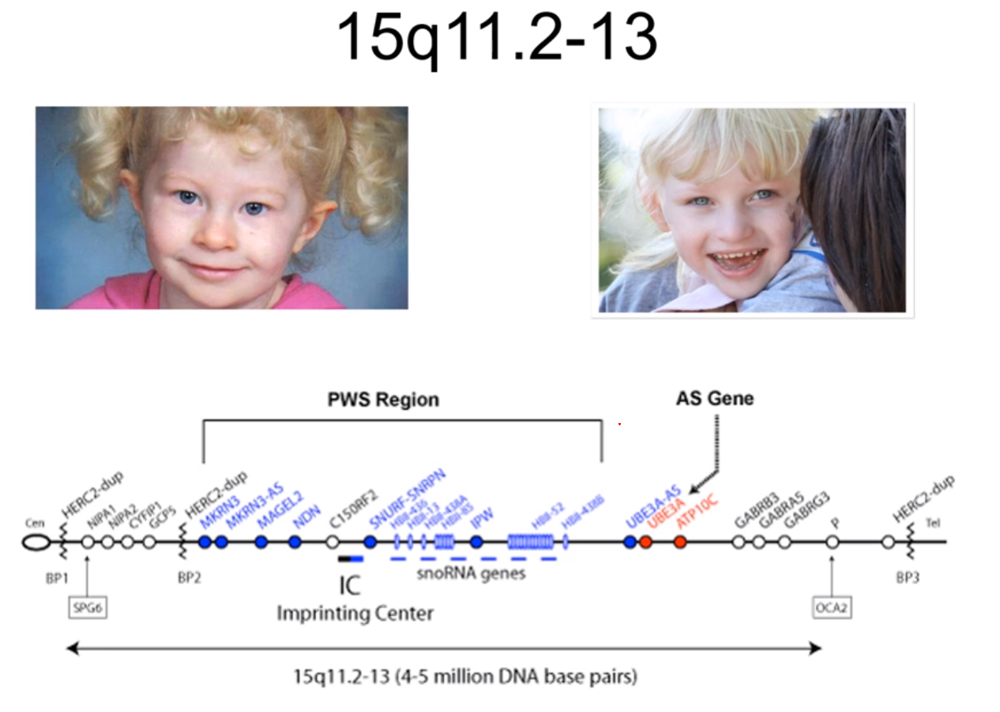

# Klinisk genetik

## Allmänt

#### olika typer mutationer

* ***normal***
* ***silent***
* ***nonsense***
* ***missense***
* ***frameshift*** (deletion -1)
* ***frameshift*** (insertion +1)
* ***insertion +1***, deletion -1

#### Genetiska analyser

* Kromosomanalys, cytogenetik
* moelkylär cytogenetik, FISH, array
* DNA-baserad analys
* RNA-baserad analys
* ***Helgenom***: 3miljarder bp
* ***helexom***: 21k gener
* ***genpanel***: 100 gener

#### Större patientgrupper

* Syndrom
* neurogenetik: e.g. huntingtons chorea
* kardiogenetik: e.g. long QT sndrom
* bindvävssjukdomar: e.g. marfans
* metabola sjd
* ärftlig cancer
* prenatal diagnostik

## Kromosomavvikelser

#### Kromosomanalys

* Blodprob: lymfocyter, 2-3 dagar
* Hudbiopsi: fibroblaster, 2-4 veckor
* Foster: 
  * amniocyter, 1-2 veckor
  * korionvilliceller 1d-2v
* benmrärgsceller: direktskörd, 24h o 48h

#### Avvikelser epidem

* Nyfödda: 0.7-0.9%
* intellektuell funktionsnedsättning: 12%
* medfödda missbildninga o intellektuell funktionsnedsätting 23%
* dödfödda 6%
* spontan abort 
  * 1a trim 50%
  * 2a trim 15-20%
* amnioocentes pga
  * ålder 1-3% 
  * missbildning vid ultraljud 15-20%

#### Typer

* Konstitutionella 
* förvärvade
* Numeriska: avvikelser antal
* strukturella: avvikelser struktur

#### Numeriska kromosomavvikelser

***Ploidigrad***

* Haploidi: n=23
* triploidi: =69
* Diploidi: 2n=46
* tetraploidi: 4n=92

***Aneuploidi***

* Monosomi: 2n-1 = 45
* Trisomi: 2n+1  = 47
* tetrasomi: 2n+2 = 48

***Trisomierna***

* 47,XY,+13/46,XY; Patau's
* 47,XY,+18/46,XY: Edward's
* 47,XY,+21/46,XY; Down's

#### Trisomi 21 - Downs syndrom

* 95% av Down syndrom
* incidens 1-2 p 1k
* ***intellektuell funktionsnedsättning***
* ***medfött hjärtfel***: ca 50%
  * AV-defekt, ASD, VSD
* ***Tarmhinder***: 8%
  * ***duodenalatresi*** 3%
  * ***megacolon , aganglionos*** 2-4¤
  * ***analatresi*** 1%
  * ***esofagusatresi*** 1%
* ***Kongenital katarakt*** 1-3%
* ***retraktionsfel*** 80%
* ***skelnig*** 35%
* ***nedsatt hörsel*** 70-80%
* ***autoimmunitet***: ökar med stigande ålder
* ***infektionskänslighet***
* ***barnleukemi*** 20ggr ökad risk
* ***thyroidea*** störningar

***Halls kriterier, tidig diagnostik Downs syndrom***

<5 kriterier = 0 misstanke; 5-11=misstanke; >12=säker diagnos

* Prematurfödda
* hypotonus
* dåligt utvecklad mororeflex
* utstickande tunga
* platt ansikte
* platt nacke, kort skalle
* snedställda ögonspringor
* epicantusveck
* brushfield spots iris
* dysplastiska öron, låt sittande
* snörvlande andnings
* fyrfingerfåra
* klinodaktyli finger V
* krota tassiga händer
* sandal gap
* överrörliga leder
* höftledsdysplasi
* rikligt nackskinnn
* högt gomtak
* tandanomalier

***Etiologi och patofysiologi***

* exponentiell korrelation med mammans ålder

##### Mosaicism

#### Trisomi 18 - Edwards syndrom

***Etiologi och patofysiologi***

* 47, XY, +18

***Kliniska kännetecken***

* Stort bakhuvud
* liten haka
* små ögon
* lågt sittande dysplastiska öron
* krakteristisk fingerställning
* extremitetesmissbildningar
* inre missbildningar
* medianöverlev: 10d
* 5-10% överlever vid 1åå
* såg sannolikher för upprepning

#### Trisomi 13 - Pataus syndrom

***Etiologi och patofysiologi***

* 47, XY +13

***Kliniska kännetecken***

* mikroftalmi
* läpp-käk-gomspalt
* polydaktli
* skalpdefekt
* omfalocele
* haloprosencefali
* inre missbildningar
* medianöverlevnad 10 dagar
* 5% lever vid 1åå
* låg sannolikhet för upprep, undantag ärftlig form

#### Könskromosomavvikelser

* 45,X
* 47,XXY
* 47,XXX
* 47,XYY

#### monosomi X - Turner's

***Kliniska kännetecken***

* incidens 1 p 2500
* Kortvuxenhet: ca 20cm under medellängd
* ovarieinsuff: streak gonads, primär amennorre, infertilitet
* coarctatio aortae: 10%
* njruanomalier: 20%
* hörselnedsättning: 60%
* intelligens inom normalområde
* karakeristiska drag: pterygium colli, bred nacke, lågt hårfäste, cubitos valgus
* hos nyfödda: svullna hand o fotryggar
* mosaikformer: 50%
* 5% 45,X / 46,XY: risk för gonadmalignitet 15-25%

***Etiologi och Patofysiologi***

* Monosmi X

#### 47, XXY - Klinefelter's

***Kliniska kännetecken***

* Hypogonadism, små testiklar, azoospermi
* infertilitet
* långvuxenhet
* kognitiva svårigheter, ADHD, ADD

#### 47, XXX

***Kliniska kännetecken***

* incidens: 1 på 1k
* långvuxenhet
* kognitiva svårigheter, ADD, ADHD
* normal fertilitet

#### 47, XYY

***Kliniska kännetecken***

* incidens 1 p 1k
* långvuxenhet
* kognitiva svårigheter, ADD, ADHD
* normal fertilitet

#### Deletion

* För att beskriva en deletion: skriver del efter involverad kromosomuppsättning, samt brytpunkten... del(5)(15.2)

#### Cru du chat 5p-

***Etiologi och Patofysiologi***

* 46, XY, del (5)(p15.2)

***Kliniska kännetecken***

* mikrocefali
* micrognati
* bred näsrot
* låtgt sittande öron
* hypotoni
* intellektuell funktiosnnedsättning
* jamande skrik

#### Wolf-Hirschhorns syndrom 4p-

***Etiologi och Patofysiologi***

* Deletion kromosom 4

***Kliniska kännetecken***

* tillväxthämning
* intellektuell funktionsnedsättning
* kluven läpp, gom
* hjärt, hjärnmissbildningar
* hypotoni
* avvikande utseende
* liknar varandra, särdrag: panna buktar, lågt sittande öron. Typiskt är utseendet mellan ögon och näsan, liknas med grekisk krigarhjälm. 

#### Mikrodeletionssyndrom

***Etiologi och Patofysiologi***

* Mikrodeletion är mindre deletioner som man lyckas detektera iom upplösning höjts över tid. 

***Exempel***

* Alagille: 20p12
* angelman: 15q11-12
* DiGeorge/CATCH22: 22q11
* Langer-Giedon: 8q24
* Miller-Dieker: 17p13.3
* Prader-willi: 15q11-12
* Rubinstein-Taybi: 16p13.3
* Smith-magenis: 17p11.2
* WAGR: 11p13
* Williams: 7q11.23

#### Prader-willis syndrom

***Etiologi och Patofysiologi***

* ***Mikrodeletion lång arm kromosom 15:*** 70% av pradi-willis syndrom fallen orskas av denna deletion
* Väldigt liten deletion

***Kliniska kännetecken***

* kraftigövervikt
* hypogonadism
* små händer och fötter
* ***Hypotoni***: initlat efter födsel
* initiala uppöfningssvårighetr
* fetma: för att inte hejda hunger
* variernnde grad förståndshandikapp
* kortväxt

***Utredning och diagnostik***

* ***med FISH***: mkt säkrare upptäcka mikrodeletioner. Man använder fluroscerande ligande som binder där DNA koden stämmer överens, varpå ser som en inmärkning på kromosomerna under ikroskop. 
  * Man använder två kontroller, samt en som targets deletionen för PWS (pradi-willis syndrom)

#### FISH

* ***Centromerspecifik DNA sond***
* ***Kromosomspecifikt biliotek***
* ***Enkelopiesond***
* 

#### Angelmans syndrom

***Etiologi och Patofysiologi***

* Precis samma deletion som PWS

***Kliniska kännetecken***

* ataxi
* epilepsi
* svår intellektuell funtkionsnedsättning
* avsaknad tal
* frekvent skratt

#### Deletion samma område different symptom

***Etiologi och Patofysiologi***

* ***prägling/imprinting***: Det finns gener som enbart uttrycks om de kommer fr mamman eller andra gener som nedärvs fr pappan 
* ***Uniparental disomi UPD***: 25% PWS, 2-5% Angelman
  * detta innebär att man nedärver kromsom 15 enbart fr mamman eller fr pappan (i.e. ***uniparental***). 
  * anses vara en ***typ av deletion***

* ***Kromosom 15, prägling***: I bilden antyds i blått de geenr som uttrycks om de nedärvts fr pappan, samt i röd de fr mamman. 
  * ***om deletion pappans kromosom:*** PWS
  * ***om deletion mammans kromosom***: Angelmans

#### 22q11 deletionssyndromet

***Etiologi och Patofysiologi***

* 22q11 har många olika namn: fenotypen kan variera mkt mellan individer. 
  * DiGeorge
  * Velo-cardio-facial
  * shprintzen
  * conotruncal anomaly face
  * CATCH 22 
* deletion proximala delen av långa armen på kromosom 22
* CATCH 22
  * C = cardiac anomalies
  * A = Abnormal facies
  * T = Thymic aplasia, hypoplasia
  * C = Cleft palate; får ett väldigt nasalt tal
  * H = Hypocalcemia
  * 22 = 22q11 deletion
* 80-90% nymutation = minimal upprepningsrisk
* 10-20% autosomalt dominant nedärvning = 50% risk! 
  * därför är det viktigt att man undersöker föräldrar t barn med detta

***Kliniska kännetecken***

* inicidens: 1 p 3k - 1 p 4k
* hjärtfel
* gomdefekter: komplett eller mildare; ofta behöver logoped
* immunologiska problem
* kalkbrist
* senare i livet: inlärnignsproblem, beteendeavvikelser, koncentratiosnsvårigheter
* karaktäristiskt utseende

***Utredning och diagnostik***

* FISH: 22q11, kontroll
* Array-CGH: comparative genome hubridization. 

#### Array-CGH

***Etiologi och Patofysiologi***

* Array Comparative Gene Hybridization
* ***Mäter gendos***: mäter alltså förlust eller för mkt, deletion el duplikation
* ! ***upptäcker inte balanserade rearrangemang***: om det skett ett utbyte mellan två kromosomer ser man inte
* ***Upptäckt beror på***: 
  * typ av array: en arrya kan inte jämföras med en annan array...
  * upplösning: hur tätt sitter DNA sonderna
  * hur informationen bearbetas

#### Strukturella kromosomavvikelser

***Translokation***

* Robertsonsk
* Reciprok

#### Robertsonsk translokation

* Sker i ***akrocentriska*** krosomerna
  * alltså de kromosomer som har sin centromer nästan ända ut i änden
  * inkluderar därför: 13, 14, 15, 21, 22