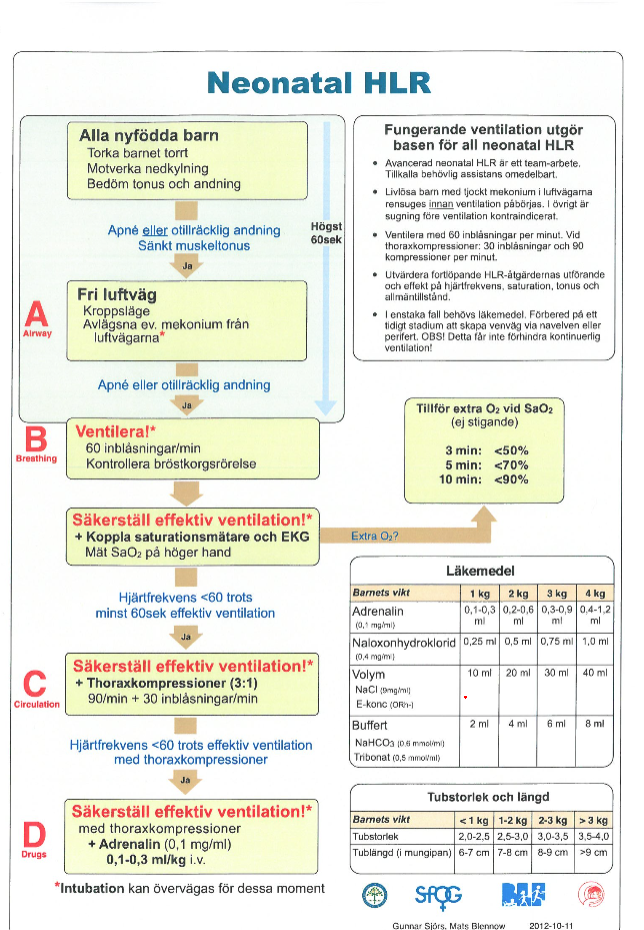
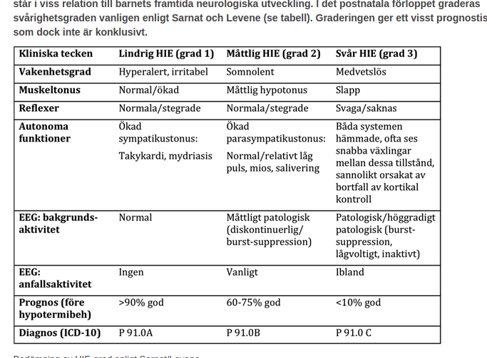
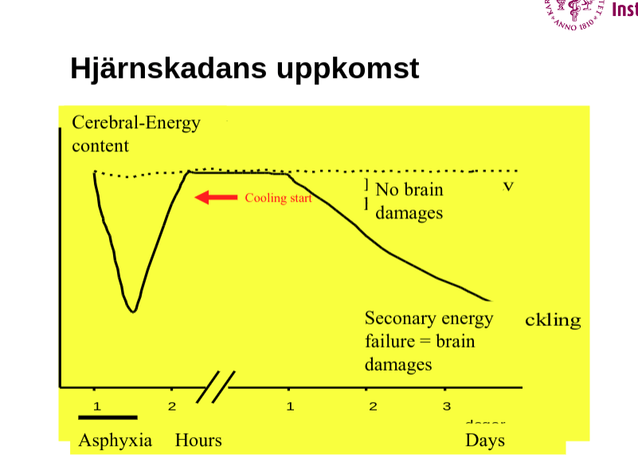
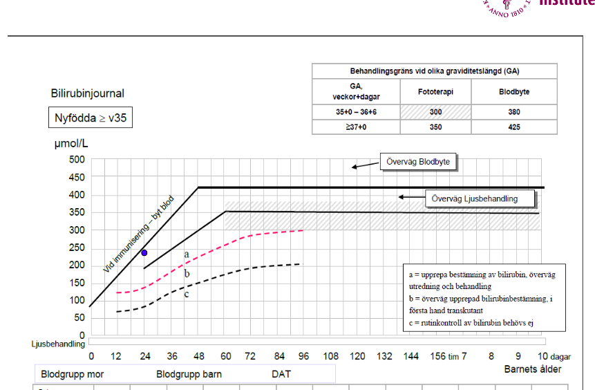
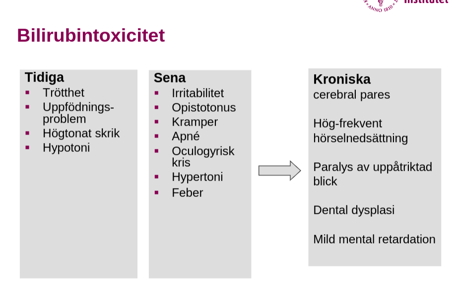
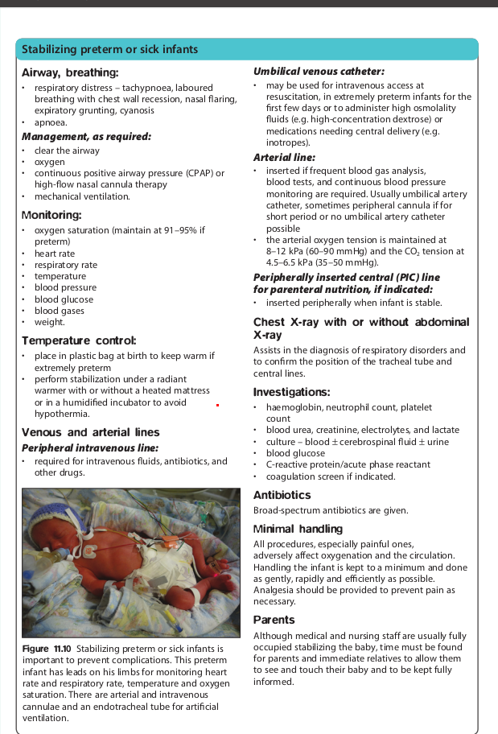

# Neonat seminarium

## Fall 1

* Frisk 35-årig kvinna, v41+6, induktion. 
* Försämrat CTG med sena deccelerationer
* Laktat 8. 
* VE 
* Vid födelsen är barnet slappt, blått och saknar egenandning

***Vad gör du?***

* Påbörjar neo-HLR?

#### ***Hur ser algoritmen för neo-HLR ut?***

#### ***Vad skiljer sig från HLR på större barn och på vuxna?***

* Ventilation är centralt
* Man börjar med inblåsningar. 
* Mkt mer ventilation, 3:1 vs 15:2 och 30:1
* A-HLR skiljer sig osså: adrenalindosen verkar vara densamma. 
* verkar som att man evaluerar baserat på hjärtfrekvensen, varpå säkerställa effektiv ventilation
* utefter detta väljer man att gå vidare med HLR eller ej
* sltusteget verkar vara att man ger adrenalin
* oklart om man loopar i algoritmen. 

#### ***Blodgas i navelartären: pH 6.96, pCO2 11.4 kPa, BE-17***

***Hur ska barnet handläggas***

* Fortsätt neo-HLR tills att man får adekvat hjärtfrekvens enl HLR algoritmen
* Med HLR algoritmen kunna intubera eller ej. Möjligt att man redan intuberat. 
* Blodgasen antyder att vi ventilerar för lite, varpå möjlig indikation för intubation eller att säkerställa effektiv ventilation, i enlighet med neo-HLR algoritmen. 

#### Vårdnivå

* NEO-IVA

#### Vilken diagnos misstänks

* intrauterin asfyxi

#### Vid 4 timmars ålder ses liksidiga ryckningar i armar och ben. Barnet blir samtidigt cyanotiskt.

#### Vad har hänt

* ***Asfyxiinducerat epileptiskt anfall.***
  * De flesta neonatala anfall är reaktiva, det vill säga de är utlösta av en störning såsom till exempel hypoxi, ischemi, »asfyxi«, hypoglykemi och infektioner. Av denna anledning är neonatala anfall vanligast förekommande under de första levnadsdygnen. Mekanismerna för neonatala anfall varierar beroende på de bakomliggande orsakerna. Bristande substrattillförsel vid hypoxi – ischemi, hypoglykemi och metabola sjukdomar leder till att energikrävande cellulära processer inte kan fortsätta och att cellmembranens integritet inte kan upprätthållas. Synaptiskt återupptag av till exempel excitatoriska aminosyror som glutamat och aspartat försämras, vilket kan bidra till fortsatt anfallsaktivitet och ge neurotoxiska effekter. Pyridoxinberoende anfall, som orsakas av störningar i GABA-metabolismen, är sannolikt mer vanligt förekommande än vad som diagnostiseras [13]. Biotinidasbrist medför ofta epileptiska anfall under det första levnadsåret och ibland även under neonatalperioden.
  * Neonatala stroke, företrädesvis i arteria cerebri media, är vanligare än vad man tidigare trott och förekommer hos cirka 1 av 3 000 – 4 000 födda. De resulterar ofta i fokala anfall hos ett i övrigt välmående barn. Genesen varierar och inkluderar bland annat defekter i koagulationssystemet, placentära embolier, infektioner och svår kärlspasm på basen av maternellt missbruk [14]. Ett fåtal neonatala anfall orsakas av missbildningar eller specifika epileptiska syndrom, till exempel benigna familjära neonatala anfall, som man nu vet är orsakade av en mutation på kromosom 20 [15]. De så kallade femtedagskramperna, som tidigare ansågs som relativt vanliga och som troligen var orsakade av hypokalcemi, är nuförtiden sällsynta. Omkring 65 – 75 procent av prematura barn som utvecklar periventrikulär blödning eller ischemi utvecklar epileptisk anfallsaktivitet, som ofta är subklinisk eller endast har subtila motoriska manifestationer [16, 17]
* ***Hypoxisk ischemisk encefalopati (HIE):*** 
  * Kramperna är ett tecken till måttligt-svår HIE
  * Förändrad vakenhetsgrad, förändrad tonus och påverkade reflexer

#### Vad blir nästa steg

* ***Kylbehandling för att B-kriterie uppfyllt.*** 
  * Ska påbörjas efter 60 min, före 6 timmar
  * ***Ska inte påbörjas innan uppfyllda B-kriterier***
  * kyldräkt, helkroppskylning
  * Temperatur monitoreras
  * Temp 33-34°C
  * Kylning 72 timmar
  * EEG övervakning
  * Ökning med 0,5°C/timme
  * MR dag 5-10
* ***enl medinsikt***
  * Grad I HIE
    * Pulsoximeter
      - Extra tillmatning
      - Blodglukos var 4:e-6:e timme pga risk för hypoglykemier
      - Vägning ett par ggr/ dygn pga risk för övervätskning.
      - Kramplista + Cerebral Function Monitor (CFM)
      - Ett EEG bör tas
  * Grad II HIE
    - Respiratorbehandling kan behövas pga andningssvikt.
    - BT-övervakning krävs.
    - Dopamininfusion vid behov.
    - I övrigt samma som vid HIE I
  * Grad III HIE
    - Respirator behövs i stort sett alltid.
    - Övervaka med EEG: Om isoelektriskt innan fenemal (antiepileptika) givits, överväg avbrytande av lisvuppehållande behanadling.
    - I övrigt som HIE I och II

**Ett friskt foster har stor kapacitet att klara en lätt till måttlig asfyxi under förlossningen genom att omfördela blodflödet från extremiteter och gastro-intestinala organ till hjärta, hjärna och binjurar samt att minska energiåtgången i cellens processer.**

Vid svårare asfyxi tilltar syrebristen, koldioxid ansamlas och fostret utvecklar en respiratorisk acidos. Samtidigt övergår perifera vävnader till anaerob metabolism vilket ger en metabol acidos när genomblödningen i vävnaderna sjunker. Kemoreceptorer aktiveras och utlöser bradykardi, samtidigt som katekolaminer frisätts och ger perifer vasokonstriktion.

Vid en total syrebrist tar det ungefär 10 minuter innan asfyxin är så uttalad att det finns risk för bestående neurologisk skada eller död hos fostret. I situationer där fostret är påverkat redan innan den akuta asfyxin är toleransen för syrebrist dock sämre och skada kan inträffa tidigare.

**Förutom komplikationer under förlossningen kan ett flertal tillstånd hos mor och/eller barn bidra till att asfyxi utvecklas. I de flesta fall av svår asfyxi kan dock ingen säker, enskild orsak identifieras.**

Intrauterin asfyxi kan delas in i kronisk och akut, även om gränsen sällan är helt tydlig.

Kronisk asfyxi kan uppkomma successivt under senare delen av graviditeten på grund av bristande placentafunktion. Etiologin är ofta oklar, men risken är ökad vid fetal tillväxthämning och maternell sjukdom. Fetal anemi, maternell hypoxi och sänkt hjärtfunktion hos fostret kan också ge en kronisk asfyxi. Fostret kompenserar initialt för den minskade syrgastillförseln genom minskad aktivitet, sänkt metabolism och ett ökat Hb. Vid mer uttalad syrebrist ses hypoglykemi, acidos och myokardiell svikt hos fostret, vilket kan leda till intrauterin fosterdöd.

Akut prenatal asfyxi kan inträffa vid ablatio och uterusruptur.

***Hypotermi***

* **Hypotermi är den första, och hittills enda, behandling som har visad effekt på den neurologiska skadans omfattning efter asfyxi. Efter måttlig till svår asfyxi ska ansvarig läkare snarast kontakta regionenhet för ställningstagande till eventuell behandling med hypotermi efter initial stabilisering.**

  Hypotermibehandling är aktuell för barn med gestationsålder ≥ 36 veckor som uppfyller nedanstående A- och B-kriterier.

  **Behandlingskriterier**
  Minst *ett* av följande A-kriterier:

  1. apgar ≤5 vid 10 minuters ålder
  2. pågående HLR (inklusive maskventilation) vid 10 minuters ålder
  3. pH <7,0 (arteriellt/kapillärt) under de första 60 minuterna efter födseln (inklusive navelsträngsprov)
  4. base excess -16 eller lägre under de första 60 minuterna efter födseln (inklusive navelsträngsprov)

  **samt B-kriteriet anfall (”kramper”) eller tecken på måttlig till svår encefalopati vilket här definieras som:**

  1. förändrad vakenhetsgrad (letargi, stupor eller koma) och
  2. förändrad tonus; hypoton, helt slapp eller opistotonus och
  3. påverkan på primitiva reflexer (svag eller avsaknad av sugreflex/mororeflex)

  **Utförande**

  1. Behandlingen påbörjas först efter stabilisering av vitala funktioner.
  2. Passiv nedkylning kan påbörjas på hemortsjukhus sedan överenskommelse om transport till regionenhet skett. Samråd med mottagande enhet om förfarande. Inled aldrig nedkylning innan det är klart att barnet motsvarar inklusionskriterierna (men undvik hypertermi).
  3. Aktiv nedkylning påbörjas snarast - dock alltid **efter** initial stabilisering - och senast inom 6 timmar efter födseln.
  4. Barnets kroppstemperatur sänks till 33,5°C (till intervallet 33-34°C).
  5. Hypotermibehandlingen fortgår i 72 timmar.

  **Bakgrund**
  Inom några timmar efter uttalad asfyxi startar olika skadeprocesser i hjärnan som kan ge permanenta skador. Dessa processer fortgår under flera dygn. Hypotermibehandling innebär att man sänker barnets kroppstemperatur för att på så sätt försöka bromsa dessa processer och begränsa uppkomsten av de sekundära hjärnskador som kan utvecklas i efterförloppet.

  I en meta-analys av de tre stora randomiserade hypotermistudier som genomförts var ”number needed to treat” 9 för det primära utfallet död eller allvarligt funktionshinder. Om dessa resultat kan överföras till den svenska situationen behöver nio barn behandlas för förhindra ett fall av död eller svårt handikapp. I de första studierna var behandlingen något mer effektiv, möjligen på grund av ett striktare patienturval. I Sv

***Kylbehandling***

* Ska påbörjas efter 60 min, före 6 timmar

* ***Ska inte påbörjas innan uppfyllda B-kriterier*****Ett friskt foster har stor kapacitet att klara en lätt till måttlig asfyxi under förlossningen genom att omfördela blodflödet från extremiteter och gastro-intestinala organ till hjärta, hjärna och binjurar samt att minska energiåtgången i cellens processer.**

  Vid svårare asfyxi tilltar syrebristen, koldioxid ansamlas och fostret utvecklar en respiratorisk acidos. Samtidigt övergår perifera vävnader till anaerob metabolism vilket ger en metabol acidos när genomblödningen i vävnaderna sjunker. Kemoreceptorer aktiveras och utlöser bradykardi, samtidigt som katekolaminer frisätts och ger perifer vasokonstriktion.

  Vid en total syrebrist tar det ungefär 10 minuter innan asfyxin är så uttalad att det finns risk för bestående neurologisk skada eller död hos fostret. I situationer där fostret är påverkat redan innan den akuta asfyxin är toleransen för syrebrist dock sämre och skada kan inträffa tidigare.

  

  **Förutom komplikationer under förlossningen kan ett flertal tillstånd hos mor och/eller barn bidra till att asfyxi utvecklas. I de flesta fall av svår asfyxi kan dock ingen säker, enskild orsak identifieras.**

  Intrauterin asfyxi kan delas in i kronisk och akut, även om gränsen sällan är helt tydlig.

  Kronisk asfyxi kan uppkomma successivt under senare delen av graviditeten på grund av bristande placentafunktion. Etiologin är ofta oklar, men risken är ökad vid fetal tillväxthämning och maternell sjukdom. Fetal anemi, maternell hypoxi och sänkt hjärtfunktion hos fostret kan också ge en kronisk asfyxi. Fostret kompenserar initialt för den minskade syrgastillförseln genom minskad aktivitet, sänkt metabolism och ett ökat Hb. Vid mer uttalad syrebrist ses hypoglykemi, acidos och myokardiell svikt hos fostret, vilket kan leda till intrauterin fosterdöd.

  Akut prenatal asfyxi kan inträffa vid ablatio och uterusruptur.

  

  ***Hypotermi***

  * **Hypotermi är den första, och hittills enda, behandling som har visad effekt på den neurologiska skadans omfattning efter asfyxi. Efter måttlig till svår asfyxi ska ansvarig läkare snarast kontakta regionenhet för ställningstagande till eventuell behandling med hypotermi efter initial stabilisering.**

    Hypotermibehandling är aktuell för barn med gestationsålder ≥ 36 veckor som uppfyller nedanstående A- och B-kriterier.

    **Behandlingskriterier**
    Minst *ett* av följande A-kriterier:

    1. apgar ≤5 vid 10 minuters ålder
    2. pågående HLR (inklusive maskventilation) vid 10 minuters ålder
    3. pH <7,0 (arteriellt/kapillärt) under de första 60 minuterna efter födseln (inklusive navelsträngsprov)
    4. base excess -16 eller lägre under de första 60 minuterna efter födseln (inklusive navelsträngsprov)

    **samt B-kriteriet anfall (”kramper”) eller tecken på måttlig till svår encefalopati vilket här definieras som:**

    1. förändrad vakenhetsgrad (letargi, stupor eller koma) och
    2. förändrad tonus; hypoton, helt slapp eller opistotonus och
    3. påverkan på primitiva reflexer (svag eller avsaknad av sugreflex/mororeflex)

    **Utförande**

    1. Behandlingen påbörjas först efter stabilisering av vitala funktioner.
    2. Passiv nedkylning kan påbörjas på hemortsjukhus sedan överenskommelse om transport till regionenhet skett. Samråd med mottagande enhet om förfarande. Inled aldrig nedkylning innan det är klart att barnet motsvarar inklusionskriterierna (men undvik hypertermi).
    3. Aktiv nedkylning påbörjas snarast - dock alltid **efter** initial stabilisering - och senast inom 6 timmar efter födseln.
    4. Barnets kroppstemperatur sänks till 33,5°C (till intervallet 33-34°C).
    5. Hypotermibehandlingen fortgår i 72 timmar.

    **Bakgrund**
    Inom några timmar efter uttalad asfyxi startar olika skadeprocesser i hjärnan som kan ge permanenta skador. Dessa processer fortgår under flera dygn. Hypotermibehandling innebär att man sänker barnets kroppstemperatur för att på så sätt försöka bromsa dessa processer och begränsa uppkomsten av de sekundära hjärnskador som kan utvecklas i efterförloppet.

    I en meta-analys av de tre stora randomiserade hypotermistudier som genomförts var ”number needed to treat” 9 för det primära utfallet död eller allvarligt funktionshinder. Om dessa resultat kan överföras till den svenska situationen behöver nio barn behandlas för förhindra ett fall av död eller svårt handikapp. I de första studierna var behandlingen något mer effektiv, möjligen på grund av ett striktare patienturval. I Sv

  

  

## Fall 2

* Första barnet till en frisk kvinna. 
* snabb vaginal förlossning i v 38+2 FV 3800 g, FL 51 cm, HO 30 cm. 
* Apgar 9-10-10. 
* Vid 1,5 timmars ålder ringer barnmorskan dig som är neonataljour och berättar att barnet andas ansträngt. 
* Han vill inte amma och är blek i hudkostymen. 

#### Ytterligare information

***Enl Morgan, frågor som ställs***

* PAS: Asfyxi? Kallt? 
* Risk: Kejsarsnitt (ffa elektiva), snabb förlossning, flerbörd, manligt kön, låg gestationsålder, tillväxthämning, asfyxi, hypotermi, maternell astma, antidepressiva lm hos mamma. 
* Inf: Lång vattenavgång (ökar inf-risken)? 

#### Vad misstänker du

* PAS - Pulmonell adaptationsstörning

***PAS - Pulmonell adaptationsstörning***

* ***Kliniska kännetecekn***
  * Gruntning, indragningar
  * omställningsrubbning
  * vätska
  * lätt prematura till fullgånga barn
  * effektiv sectio är en riskfaktor
* ***Handläggning***
  * CPAP
  * överväg infektion

***NAS - Neonatal andningsstörning***

* Trabsuebt takypne of the newborn, TTN
* snabbt övergående / mild PAS
* expektans

***MAS - Mekonium aspiration syndrom***

* Gruntar, indragningar
* mekonium i fosterattnet
* mekaniskt hinder i små luftvägar o orsakar atelektaser 
* kemisk pneumoni
* Handläggning
  * CPAP
  * respirator 
  * ECMO

***PPHN - Persisterande pulmonell hypertension***

***TTNB - Transient tachypnea of newborn***

* Respiratorisk distress...

#### 

#### Hur vill du gå vidare? Behandling? Utredning

* NAS: 
  * Mild form av PAS. 
  * Snabbt övergående andningsstörning där symtomdebuten (takypné, näsvingespel, gruntning, indragningar) kommer inom de första timmarna för att sedan successivt klinga av inom loppet av ½ dygn. 
  * Samtidig hypotermi eller mild acidos efter en asfyxi kan påverka surfaktantsyntesen/funktionen negativt vilket då kan bidra till andningssymtomen 
* PAS: 
  * Symtomdebut under de första levnadstimmarna, ofta ganska direkt efter födseln. 
  * Symtomen är väs samma som vid NAS, men mer uttalade och långdragna. 
  * Barnen behöver oftare någon form av andningsstöd (syrgas + CPAP). 
  * Det ökade andningsarbetet klingar oftast av efter 24-72h. 
  * PAS ger oftast en typisk rtg-bild med hyperinflation, prominenta kärl och vätska i fissurer. 
* Inf: 
  * Us/lab: Blodstatus med diff, blodgas, blododl, CRP, rtg. 
  * Ab direkt! 
  * Sepsisbeh tills motsatsen är bevisad! 
  * I denna ålder ffa GBS

#### Mamma och pappa är väldigt oroliga och undrar hur länge barnet behöver vara kvar på sjukhuset. De undrar också huruvida barnet kommer ta skada. Vad svarar du dem?

* PAS: 
  * 1% av alla nyfödda drabbas av ngn form av adaptationsstörning, 
  * en andningsstörning som beror på att barnen antingen inte klarar omställningen från intrauterin miljö till att själva börja andas luft alt att omställningen tar längre tid än normalt. 
  * PAS är lindrig och ger oftast inga men. 
  * Vanligen snabbt övergående <1-3d.
* Inf: 
  * Måste beh. God prognos. 
  * Precis som alla andra inf är det viktigt med tidig beh. 

## Fall 3

* Mor frisk, 33 år, 2-grav, 2-para, blodgrupp 0+ Flicka född i v 38+2, FV 3250g
* Amning fungerar bra i början fast flickan blir allt mer trött. 
* Efter 24 timmar noteras att barnet är påtaglig gul i huden. 
* Det tas serum-bilirubin på flickan som visar 230 mmol/l. 

#### Vad säger värdet på bilirubin vid den här åldern?

#### Vilka ytterligare prover vill du att barnmorskan ska ta på barnet? 

* Blodstatus med diff, CRP, bilirubin (tot/konj), 
* Blodgruppering och DAT (Ak mot RBK), 
* Retikulocyter, 
* ASAT/ALAT/GT/ALP, 
* LDH, 
* Haptoglobin. 
* Fysiologisk ikterus hos nyfödda beror på: Omogen lever, fetalt Hb har kortare livslängd  
* Större nedbrytning, högre Hb hos nyfödda. 

#### Vilken diagnos misstänker du? Differentialdiagnoser?

* **Fysiologisk ikterus**
  * alltid okonjugerad
  * topp dag 3 (dag 5-7 prematura)
  * klingar av dag 10-14
* **Patologisk ikterus**
  * Debut  före 25timmars ålder
  * bilirubin över normalvärde ("överdriven fysiologisk")
  * associerad med annan sjukdom
  * Prolongerad (under 10-14 dagar fullgången, 2-3v preterm)
* **AB0**
  * Uppträder överraskande efter partus 
  * 15-20% AB0-inkompatbilitet mellan mor o barn -> minnesregel m0r BArn
  * 1-3% immunisring
  * färre än hälften kräver ljusbehandling (3-5/1000)
  * utbytestransfusion sällan nödvändigt
  * sällan sen anemi
* **RH-immunisering (ej fallet här för att mamman är RH positiv)**
  * ***Modern Rhnegativ***
    * Rhantigen C, c, D, d, E, e
    * AK riktademot : D 90%, C ellerE 10%
  * ***Problem intrauterint*** (IgGvia placenta)
      * Anemi uppstår men ingen hyperbilirubinemi
  * ***Problem postnatalt***
      * Mild Tidig fototerapi. Anemi senareStegringstakt 4 -8,5 mmol/L/tim → fototerapi
      * Moderat Anemi. Tidigt blodbyte viktigStegringstakt > 8,5 mmol/L/tim → blodbyte
      * Svår Hydrops-IUD. Prenatal transfusion
  * ***Prevention***: Anti-D

#### Behöver barnet behandling?

* Ligger på immuniseringsgränsen: ljusbehandling, evt blodbyte
* **Behandlingsmål**: 
  * Undvika bilirubinrelaterade handikapp
  * Ljusbehandling
  * Blodbyte / utbytestransfusion
* ***Enl morgan***
  * Ja, fototerapi. Ev blodyte. Enligt bilirubinkurvan. Syftet med blodbytet är både att bli av med bilirubinet och Ak mot Hb från mamman. Rh-immunisering kan förebyggas genom att barnet får Ak(?) innan partus för att mamman inte ska utv Ak mot Rh+.

#### Vad berättar du i föräldrasamtalet?

* 85% av alla människor har det här proteinet, vilket innebär att de är Rh-pos. Övriga 15% är Rh-neg då de saknar proteinet. Om kvinnan är Rh-neg och fostret Rh-pos kan Ak mot fostrets blod bildas om fostrets blod kommer i kontakt med mammans, vilket kan ske i samband med förlossningen, men också om man tar fostervattenprov. Detta kallas Rh-immunisering. Ofta tar varken mamman eller barnet skada av en Rh-immunisering om det är första grav. Vid en andra grav finns det däremot en risk att mammans Ak angriper fostrets röda blodkroppar, vilket skulle kunna bli allvarligt

## Fall 4

* 12 timmar gammal pojke, gruntar, andningsfrekvens på 90/min, temperatur hos barnet 36.0 grader. 
* PN i v 37+1
* 26 timmars värkarbete. 
* Vattnet gick 24 timmar innan förlossning.
* APGAR 8/9/9
* Ingen feber hos mor

#### Vilken diagnos misstänker du? Differentialdiagnoser

* Sepsis
  * Inf med tanke på lång tid mellan vattenavgång och förlossning. 
  * (GBS, KNS, S aureus, E coli). 
* PAS mindre sannolikt i detta fall

***Neonatalabakteriellainfektioner***

* ***Tidig debut < 48 timmar:*** GBS, E coli
  * Kongenital
  * Högmortalitet
* ***Sen > 48 timmar*** 
  * Staf(KNS, aureus), 
  * klebsiella
* ***Nosokomiala***
  * Incidens
  * 1-4 /1000 nyfödda
  * Prematurer< 28 v: 30-45%

#### Vilka prover vill du ta på barnet? Vill du ordinera ytterligare undersökningar?

* **Blodstatus, **
* **CRP, **
* **blodgas, **
* **odl (blod, öra, navel, urin), **
* **u-sticka. **
* **LP? **
* **Lungrtg?** 
* ***Lab*** 
  * LPK ↓-< 5 -Ospecfikt
  * TPK ↓-< 100 -Ospecifikt
  * CRP -> 50 (fullgånga)
    * Dubbleras på 4-6 timmar
  * Procalcitonin, IL-6
* ***Lungröntgen***
* ***klinisk + riskfaktorer***
* ***Odlingar***
  * Blod - Alltid före antibiotika
  * CSV - Liberalt
  * Alltid om neurologiska symtom
  * Ytodlingar (öra, navel) 
  * Informationom kolonisering
* ***Urin***
  * Sällan
  * Blåspunktion

#### Vilken behandling ska barnet få?

* ***Oklar sepsis***: Bensylpc + Gentamycin/Netilyn alt Claforan + Doktacillin. 
* ***Sepsis med suspekt KNS***: Vankomycin. 

***Riskfaktorer***

* Prematuritet
* Hud och slemhinneskador
* Invasivaprocedurer
* Lång vattenavgång
* Chorioamnionit
* Infektion hos mor

***Kongenitala virusinfektioner***

***TORCH***

* **Toxoplasma**
* **IUFD, syn**
    * och hörselskador, mental retardation
* **Other(syfilis)**
    * Avvikande utseende, IUFD, neurologiskt
* **Rubellascreening**
    * IUGR, hjärt
    * kärlsskador, ögonskador
* **Cytomegalovirus**
    * IUFD, hörselnedsättning, balansstörning
* **Herpes**
    * hudutslag, encaphalit

***Others***

* Varicella
    * fosterskador, allvarlig infektion
* Parvovirus B19
    * anemi, hydrops, trombocytopeni
* HIV screening
    * HIV hos barnet
* Hepatit B/C screening 
* Hepatit hos barnet

#### Vad berättar du i föräldrasamtalet

* Allvarligt. Måste få adekvat slutenvård. Beror sannolikt på lång vattenavgång.

## Fall 5

* Tid frisk förstföderska. Vattenavgång med värkstart i v 27+0. Sectio i v 27+1 pga säte. 30 timmars vattenavgång. Full dos steroider är givet antenatalt. Flicka, FV 1050 gram, FL 42 cm, HO 28 cm. Tas emot i plastpåse.Hon gnyr direkt, men är lätt bradykard. Ventileras totalt 1 minut. Därefter stabil med CPAP 6cm och FiO2 0,21. Tas till neo i kuvös. 

#### Varför ges steroider

* En kur = 2 doser, 24h intervall
* minskad mortalitet, IVH, NEC sepsis
* minskad RDS
* minskad risk för respirator vård

#### Varför tas barnet emot i plastpåse

* Värme 
* Svep in barnet i plastpåse (gäller före vecka 30), ej föregående avtorkning. 
* Detta minskar värmeförluster orsakade av avdunstningen från hudytan. 
* Vid sectio ge steril plastpåse till operationssjuksköterskan. 
* Använd befuktad och uppvärmd luft i SiPAP och Neopuff.

#### Hur ska barnet handläggas initialt? Val av andningsunderstöd

* ***Enl morgan***
  * Apgar: Mått på postnatal adaption. Inte absolutsiffran som är viktig, utan förloppet. Man blir orolig om Apgar <7 vid 5 min eller ingen förbättring. 
  * Temp, ausk hjärta/lungor, AF (regelbunden?), puls, sat. 
  * Blodstatus med diff (neutrofiler), blodgas (metabol och respiratorisk acidos som nyfödd, bikarbonat bästa bufferten), b-glukos, saltbalans, bilirubin (tot/konj), CRP, blododl. 
  * Ökad inf-risk pga lång vattenavgång (gräns 18h). 
  * Måste börja andas först, bradykardi inget problem. 
* ***Andningsstöd***: CPAP
* ***Airway, breathing***
  * respiratoru distress: takyume, arbetsam andning med bröstväggs recession, näsvingespel, expiratorisk grunting, cyanos
  * apne
  * ***Handläggning***
    * clear the airway
    * syrgas
    * CPAP, högflödes nasal kanyl terapi
    * mekanisk ventilation
  * ***Monitorering***
    * saturation: maintain at 91-95% if preterm
    * hjärtfrekvens
    * andningsfrekvens
    * temperatur
    * blodtryck
    * blodglukos
    * blodgaser
    * vikt
* ***Temperatur kontroll***
  * plastpåse för att hålla barnet värmt preterm
  * stabilisera unde radiant warmer, med eller utan uppvärmd madrass eller humidiferad inkubator för att undvika hypotermi
* ***Venös och arteriella infarter***
  * **Perifer intravenös infart**: behövs för intravenös vätskor, antibiotika, och andra läkemedel
  * ***Umbilikal venös kateter***: 
    * för att intravenös access at resuscitation, i extremt preterm spädbarn i första dagarna eller för att adminstrera hög osmolalitet vätkor (högkoncentrations dextros), 
    * eller medicinering behövs central transport (e.g. inotroper)
  * ***Artieriell infart***
    * om kräver frekvent blodgasanalys, blodprover, kontinuerlig blodtrycksmätning 
    * arteriell syrgas maintains vid 8-12kPa (60-90mmHg) och CO2 tension at 4.5-6.5kPa (35-50mmHg)
* ***Peripherally inserted central (PIC) line for parenteral nutrition, if indicated:***
  * inserted peripherally when infant is stable
* ***Investigations***:
  * haemoglobin, neutrophil count, platelet count
  * blood urea, creatinine, electrolytes, and lactate
  * culture – blood ± cerebrospinal fluid ± urine
  * blood glucose
  * C-reactive protein/acute phase reactant
  * coagulation screen if indicated.
* ***Antibiotika***
  * Bredspektrum antbiotika enl lassauer illustrated paediatrics
* Minimal handling 
* All procedures, especially painful ones, adversely affect oxygenation and the circulation.
* Handling the infant is kept to a minimum and done as gently, rapidly and efficiently as possible. 
* Analgesia should be provided to prevent pain as necessary.

#### Vilka infarter ska barnet ha? Varför?

* ***Venös och arteriella infarter***
  * **Perifer intravenös infart**: behövs för intravenös vätskor, antibiotika, och andra läkemedel
  * ***Umbilikal venös kateter***: 
    * för att intravenös access at resuscitation, i extremt preterm spädbarn i första dagarna eller för att adminstrera hög osmolalitet vätkor (högkoncentrations dextros), 
    * eller medicinering behövs central transport (e.g. inotroper)
  * ***Artieriell infart***
    * om kräver frekvent blodgasanalys, blodprover, kontinuerlig blodtrycksmätning 
    * arteriell syrgas maintains vid 8-12kPa (60-90mmHg) och CO2 tension at 4.5-6.5kPa (35-50mmHg)
* ***Peripherally inserted central (PIC) line for parenteral nutrition, if indicated:***
  * inserted peripherally when infant is stable

#### Vad är prioriterat vid handläggningen?

* ***Temperatur?***
* ***Ventilation?*** 
* ***ev surfaktant (ev INSUER)?*** 
* ***respirator?***
* ***3 problemområden för prematura:***
  * ***Tempkontroll***: Omoget tempcentrum, tunn genomsläpplig hud (lägga vätska på huden är som att ge en iv-infusion; tappar vätska + värme  läggs i kuvös/”plastpåse” för att senare flyttas över till värmesäng), ju mindre barn desto mer volym i förhållande till ytan.
  * ***Energitillgång/nutrition***: Svårt kontrollera/koordinera alla moment vid ätande. TPN. Får provsmaka bröstmjölk så fort läget är stabilt, ofta redan under första dygnet för att få tarmarna att komma igång. Bröstmjölk analyseras och berikas individuellt. Donerad bröstmjölk eller prematurformula.
  * ***Andning***: Apné pga inf (ssk viros), överstimulering, för hög/låg temp, underburenhet (uteslutningsorsak). Central apné, kan ge koffein för att stimulera andningsdriven i andningscentrum. CPAP andningsstimulerande, expanderar lungorna. Surfaktant kan ges antingen profylaktiskt (ej i Sve) eller beroende på arteriell syrgaskvot/syrgasbehov. Ges genom intubering + respiratorvård eller genom MIST-tekn

#### Efter 15 timmar har syrgasbehovet successivt ökat upp till 50%. Flickan har djupa indragningar. Hon är trött, och får en apné.

#### Vad misstänker du?

* ***RDS: Surfaktantbrist.*** 
  * Mamma fick steroider för stimulera prod av surfaktant. 
  * Både mamma och barn blir stressade  -> påskyndar prod. 

#### Vad gör du för att utesluta/bekräfta din misstanke?

* ***Lung-rtg. Vitt bilat.*** Barnet får surfaktant. Ges under intubering, surfaktant sprutas in, extubering till CPAP, alternativt intubering och surfaktant ges och därefter respiratorvård. 
* ***BPD:*** Kronisk lungskada efter prematuritet. Oftast efter respiratorvård. BPD och NEC kan man bara få om man är prematur

#### Vilken behandling ska barnet ha?

* CPAP
* ev surfaktant ev INSURE
* respirator
* (antenatal steroider)