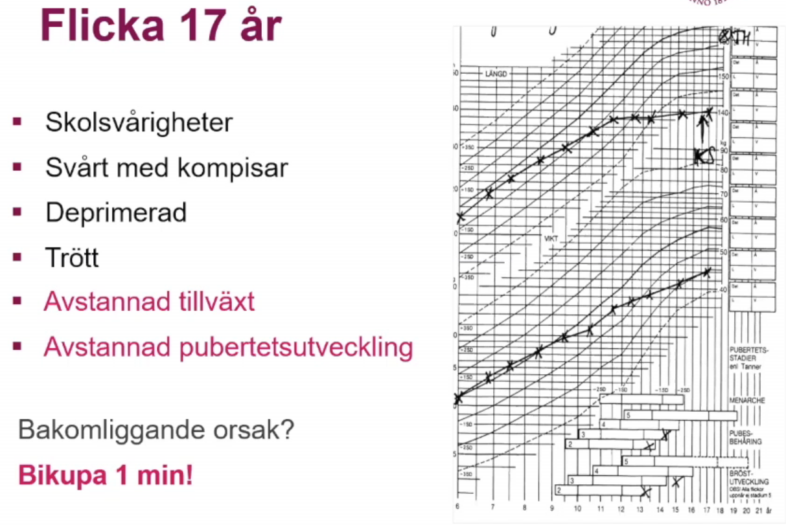

# PED Lectures

## Barnets normala utveckling

Det som kommentera angående denna bild är att det kan föreligga en del som förklarar varför ett barn kan dippa på det sättet i tillväxten:

1. ***Cancer***: cancertillväxten orsakar utmärgling av barnet, 

2. ***Tillväxthormonbrist, inte***: en tillväxthormonbrist skulle yttra sig tidigare, runt 2-3års ålder, och tillta lite långsammare än det som presenteras
3. ***IBD***: inflammatorisk tarmsjukdom kan leda till att det ser ut på det sättet också. 
4. ***Depression och ätstörning***: Det riktiga svaret i detta fallet var att flickans pappa avlidit i tumörsjukdom, varpå barnet blir depressivt och får en ätstörning. 

##### Återhämtningen

Man får en återhämtningstillväxt efter att barnet går igm depressionen och remission. Dock notera att arean under kurvan är mindre tillväxtmässigt när man jämför. 

Trots att man får en återhämtningsfas, kompenseras det inte tillräckligt när barnet får sin tillväxtspurt när puberteten i sin tur kommer igång. (barnet blir kortare?)

#### Faktorer som påverkar barnets tillväxt

1. graviditet: undernäring, övernäring (diabetes etc)
2. arvet
3. psykosocial miljö: bra leder t att man kan utnyttja arvet. men om dålig psykosocial miljö kommer att påverka längden på barnet över längre tidsperioder
4. nutrition
5. hälsa

Man gör några fel åp denna bilden:

1. benen ska vara ihop
2. knäna ska sträckas

Efter 2 års ålder mäter man barnet stående. 

1. sockar och skor ska vara av, ya3ni bilden är fel menar han. 
2. sträckt i knäna
3. in med magen

man upprepar detta tre gånger, och lägger in genomsnittliga längden

#### Tillväxtkurvan

Alla barn födda efter millenieskiftet använder detta. går fr 0-2 år, och har en prematurkurva

a

Markeringarna talar om vilka kurvor representerar vad. 

Notear att the column längst t vänster är för prematurfödda barn

#### Prematuritet

För det prematurt födda barnet, skickar direkt t iva, för att nutriera upp

för det andra är att man gör korrigering efter märker prematuritet att barnet inte faller inom ramarna. 

***Huvudomfång snabbt tillväxer:*** kan vara ***hydrocefalus*** vilket det inte var för detta barnet, förklarar varrför huvet växer mkt

### Pat fall, 3 bojk

Man ser att längdutvecklingen o vikt dålig.

Frågan vad det är för diffar som orsakar detta hos barnet: 

1. ***Gällande celiaki, inte***: celiaki yttrar sig näör man introducerar gluten i kosten, vilket man gör vid 1åå. För detta barn där sänkningen sker tidigare, är det inte aktueltl med celiaki
2. ***Gällande tillväxthormonbrist, intea***: i tillväxthormonbrist är det ***längden*** som sjunker före vikten. Men här är det vikten som devierar mer och börjar innan. 
3. ***Hypothyreos***: Detta är ett bra svar, man screenar barnen tidigt för detta. Det är höga TSH nivåer man letar efter. Det få procent med hypothyreos i Sverige, men det är viktit att man kollar upp det
4. ***Svält, rätt***: i detta fallet har det markerats de perioder som barnet ***inte*** varit i mammans vård, varpå man noterat att barnet går upp i vikt när det inte är med mamman. Man hade tagit tarmbiopsier, som gav en bild som tydde på svält, varpå den diffen som angavs. Initialt hade man tagit en biopsi där man konstaterat att barnet haft celiaki, men det återbedömdes senare, för att det fanns ett behov. Barnet åkte in och handläggdes akut
   1. Detta är ett exempel på psykosocial miljö som föranlett svältning av barnet
   2. man ser catch-up tillväxt efter i slutet när man börjar mata barnet bra. 
   3. ***Påverkan framöver***: nu har man fångat upp pojken i slutet, så psykiskt lär bli bättre. Längd o vikt påverkan åp sikt vra okej, då man ser att barnet återhämtat sig snabbt. 
   4. ***Tidig bikupa***: bättre förutsättningar för att återhämta sig

### Barns sätt att signalera ohälsa

1. kan som små yttrycka sig med språekt
2. kroppsliga signaler
3. psykiatriska signaler
4. psykologiska, pedagogiska aspekter
5. beteendemässiga signaler

### Hormonell reglering av tillväxt

Hormoner som är viktiga intrautering och alltifrån födelsen:;

1. IGF1
2. T3,T4
3. Insulin
4. kortison: om för ltie kortison växer man sämre, men osså om han har för mkt. 

#### Spädbarnsfasen

1. ***Tillväxthormon***: det är fr 1åå som tillväxthormon receptorerna blir mer aktiva och tillväxthormonet börjar komma igång innan dess.

#### Barndomsfasen

1. ***binjureandrogener*** som aktiveras o börjar produceras hos barnet. Manliga hormoner fr binjurar som gör detta, att man luktar svett etc, det är helt normalt
2. barnet börjar svettas etc, som föräldrarna söker för, men som är normalt för barnet, det är inget fel. 

#### Pubertetsfasen 

1. könshormonerna

### Olika pucklar

***Vikt driver längd***: högre vikt föranleder ökningar i längd

***Amningspuckel***: Detta är för att mjölk är sött och fettrikt, varpå barnet stiger i vikt, som i sin tur driver längden

***Viktökning i 2-7åå***: ökar risken för kvarstående fetma i barnets liv. Notera också att fetman i den åldern också ökar längden, varpå den hamnar på en annan standardavvikelse

### Bedömning kurvorna

1. är barnets storlek normalt
2. växer barnet med normal hastighet
3. är förhållandet mellan längd o vikt normalt
   1. e.g. att vikten ökar men att längden sjunkar: ***kortison*** för mkt kortsison leder till att man inte växer lika snabbt men att man kan samla på sig vikt
4. ***Ärftlighet***: man ska sätta längden i relation till förändrarnas längd. man tar en medelföräldralängd in terms av SD, standard deviations

### Avvikande utseende

När han tittar på ett barn, går igm ansiktet systematiskt:

1. ***huvudomfånget***: hur är huvudomfånget i relation med resterande ansikte. I detta fallet är barnet mikrocefaliskt. 
2. ***Ögonen***: 
3. ***piltrum***: barnet har idf inget piltrum, fåran undern äsa
4. ***Munnen***: tunn överläpp
5. ***Hakan***: mikrognati
6. ***öronen***: sitter lågt och bakåtroterade, tecken syndrom eller kromosomavvikelse

***Detta är FAS***

#### FAS och barnpsyk

1. ***Utvecklingsrelaterade funktionsnedsättningar:*** FAS har en högre sannolikhet för att utveckla autism och ADHD

### Pubertetetsstadier

Lika viktigt att man noterar avvikande pubertetsstadier

#### Flickor

B för bröst antar jag

1. B2: ringformad, kanske lite ömmande, första tecken pubertet
2. B3
3. B4: som bröst på bröst, att vårtgården har en egen kontur -> indikerar höga östrogennivåer, varpå vårtgården utvecklar mkt
4. B5: där man kan få en bröstvårta, notera att vissa kvinnor kanske aldrig får en fullt utvecklad bröstvårta

PH: pubis hår

1. PH1: inget hår alls
2. PH2: lite hår längs labia majora
3. PH3: lite mer på mons pubis
4. PH4: mer av triangeln utvecklas 
5. PH5: hela triangeln är fylld med hår

##### Pubertetsförlopp

 Åldern x-axeln, och en längdspurt. börjar 10-11åå. maximala derivatan är vid 12åå. 

***max-tillväxthastighet***: 95% är mellan 9.5åå-14.5åå som deras maximala tillväxthastighet är uppnådd

***Pubis-behåring***: notera att den kommer lite senare i utvecklingen. 

#### Pojkar

För könet, indelat i gonadutveckling. ***Orchidometer*** är pellets med en skala för att skatta volymen på testikeln. 

1. G1: är som pojke föds
2. G2: 4mL i storlek av testikel. ena testikeln (vänster?) större än den andra, vilket är helt typiskt
3. G3: noterar att penis blir bredare, skrotalhuden blir tjockare o veckad, vilket progress till final level
4. G4:
5. G5

***Pubisbehåring***: PH

1. PH1: inget behåring
2. PH2: börjar lite gårstårn
3. PH3: 
4. PH4

Tillväxten kommer senare för pojkar. Östrogen är mer potent för tillväxten än för testosteron. 

Man kan jämföra med linjerna näör den maximaa tillväxtspurten nås för flickor vs pojkar

flickor är 13 cm kortare än pojkar on avg. baserat på de angivna differenserna. 

### Fall, 17åå

***Grav hypothyreos***

1. skolsvårigheter
2. svårt emd kompisar
3. uttalat depreimerad
4. trött
5. avstannad tillväxt: på tillväxtkurva
6. avstannad pubertetsutveckling: 
7. bakomliggande orsak

Om flickan hade kommit t BUP med denna anamnes, så kan man tänka depressino, eller barnpsyk samsjuklighet, typ ADHD, intellektuell nedsättning, kanske social ångest om svårt med vänner. Samsjuklighet med andra tillstånd som man kan ntoera. viktigt här är att man följt längd o vikt, då kan man fundera över anorexi, vilket i detta fall mottalas av att vikten är opåverkad jämför längden

I detta fallet är det ***längden*** som påverkats mer än ***vikten***. Man ska tänka att vikten åpverkas normalt sett före längden. 

***grav hypothyreos, svart***: pat har ***myxödem***. typisk ålder för hypothyreos att debtuer, och vanligt att längden debuterar öre. 

Denna flickan kommer att vara sådär lång, ingen catchup tillväxt, förlorat mkt av sitt sociala liv, och kommer att påvkera henne resten av livet etc. 

### Försenad pubertetsutveckling

1. genetisk syndrom: Turner, klinefelters
2. Ätstörningar
3. överträning
4. glutenenteropati
5. Hypothyreos
6. svår kronisk sjukdom, e.g. njursjukdom, IBD, hjärtsjd, leversjd,
7. 

### Basutredning av avvikande tillväxt

### Spädbarnsreflexer och psykomotorisk utveckling

#### Tonus och motorik

##### Nyfödd

1. ***Primitiva reflexer***: 
2. ***rörelse okontrollerat***: okontrollerat rörs extremiteterna, så kallade ***'massrörelser'***

##### 1 åring

1. viljestyrt
2. isolerade rörelser
   1. kan plocka upp skit fr bord

##### utvecklingen sker

Utvecklingen sker i ***cephalo-caudal riktning***. Från proximala till distala delar av extremiteter

#### Nyföddhetsreflexer

Förekommer ett antal reflexer att beakta:

1. ***Moro***: borta vid 4-5mån postnatalt. ofullständig vid v28, 
2. ***Sugreflexen***: svag v28, brorta 4-6mån
3. ***Sökreflexen***: föreligger v34, borta 4-6 mån
4. ***handgrip***: svag v34, bort 4-5 mån
5. ***tågrip***: svag v34, bort 9-15mån
6. ***ATNR***: Asymmetrisk tonsik neck reflexmönster (fäktarställning). tydlgiast vid 2-3 mån ålder, borta 6mån

#### Tonus och spontanmotorik

* Ena bilden är barnet helt orörligt, nästan ingen tonus alls i kroppen, vill inte lyfta ngt. 
* Andra bilden ligger att den ena armen ligger platt när den andra har tonus och rör på sig. 
  * ***Plexusskada***: förlossningsskada att ena amren inte går att lyftas, viktigt att man hanterar det tidigt

### Milstolpar

#### 0-1 åå, spädbarnet

1. milstopalar sociala leenden, fr ca 4 veckor, främlingsrädsla fr ca 7månader
2. ***anknytning***: tillit, tryggehet, smaspel
3. föräldrafunktion avögrande för barnets välbeffinande
4. barnet har inte kognitiv kapacitet utan är helt beroende av föräldranras emotionella staus
5. ***sjukvården***: så länge förändrarna fungerar skapligt, så klarar barnet det bra

#### 2 månader

***Grovmotorik***

* ***Huvudbalansen***: kontrollera huvudbalansen
* ***följer med blicken***: när man för skit framför ögonen på barnet, följer med blicken
* ***böjmönster***: successivt minskat böjmönster
* ***mororeflex avtar***. tydlig nackreflex

***Finmotorik***

* ***Handrörelser***: medvetna handrörelser ***saknas***

***Språk samspel***

* leendet utveckals successivt
* svarsleende, svarsljud
* vid 2-3mån, jller när man kan samordna andning och stämband

#### 6 månader

***Grovmotorik***

* Vänder runt: fr rygg t mage etc. 
* has-kryper: att den kryper
* börjar utveckla skyddsreflexe
* nyföddhetsreflexer ***ska vara borta***

***Finmotorik***

* flyttar föremål mellan händerna

***Samspel och språk***

* tittar efter tappad leksak
* enstavigt joller, 'dadada, bababa'

#### Tidig eller sen utveckling

man testar fallskyddsreflexen: att man inte har ngn minsta tillsyn för fallskyddsreflex. Det är inte patologiskt att man inte har det

poängen är att man ska gå fram i sin utveckling. barnet ska gå sin egen kurva, man ska inte direkt jämföra barnen, utan det är mer relevant att man ska tänka på barnets egna unika kurva, så länge det går framåt för barnet.

#### Handens finmotorik

1. ***Grabbgrepp***: 4-5mån
2. ***Flyttar fr hand t hand***: 5-6mpn
3. ***oppositionsgrepp***:; 7-8mån
4. ***pincettgrepp**: 9-10mån

#### 10-12 månader

***Finmotorik***

1. pincettgrepp, plockar, småsulor
2. staplar burkar

***Grovmotorik***

1. reser sig, går utmed, eller med stöd
2. väl utvecklade skyddsreflexer

denna ålöder som man behöver säkra sitt hem

***Socialt***

* interagerar med utomstående
* leker, vnkar hej o adjö
* klappar händer, 
* interagerar utomstående

***Språk***

* 8-10 mån: symbol med betydelse, titta-peka-benämna-lekar
* 10-12mån: barnet börjar imitera ljud = grundläggande för språkutvecklöing
* ***Imitera-identifiera och minnas***
* förstår o säger enkla ord: "Mamma, titta där"
* Ibland tyst period efter joller = "ordsamlarstadiet"

#### 18 mån

***Grovmotorik***

* går säkert utan stöd
* tar sig upp och nedför trappa (kryp, eller stöd)
* Huksitter, reser sig upp/lätt stöd
* klättrar

***Finmotorik***

* Klotterier (tvärhandsgrepp)'
* Tornbygge, 2-3 klossar. väl utvecklat pincettgrepp

***Språkutveckling***

* ordförrådet exploderar fr 10-145 > 100 ord vid 2åå

***Språk o socialt samsepel***

* Hämta dina stövlar, ta bollen
* talar minst 8-10 ord, förstår mkt mer
* pekbok
* explosiv ökning ordförråd
* substantiv + adverb
* gömma lek
* differentierar fler än familj

***ADL***

* tar av sig mössa, strmpa
* vill äta själva
* dircker ur mugg

#### Språkutveckling-summering

***1år = 1ord***

* mamma, pappa

***2åå = 2-ords-meningar***

* ordförråd: ca 200-2000 ord = stor variatinon
* "nej", "inte"= vanliga ord, ofta felplacerade

***3åå = 3-4 ords meningar***

* talar ej rent, stor-liten

***4åå = flerordsmeningar, hela meningar***

* väsentligen rätt uttal, 
* resonerar o frågar

#### sen språkutveckling

***Hörsel***

* ***Hörseltest***: på BB, OAE-test resultat? screening otoakustisk emission
* ***otiter?***
* ***ÖNH status***
* ***lekaudiometri*** kan göras fr tidig ålder

***Socialt samspel***

* autistmisstanke

***Språkförståelse***

* om god - tålamod

***Flerspråkighet***

* kan vara svårare att bedöma men behöver inte påverka

#### 2-5åå, småbarnen

* ***Beteende vägledande***: sover? äter? leker
* ***autonomi***: gradvis ökad aautonomi, 4åå kan sj
* ***intense kognitiv utveckling***
* ***sjukvården***: ålder, och mognadsanpassad information
* ***Förstå***: börjar förstå annorlunda
* ***Toleranta mot avvikelser***: småbarn är ofta toleranta mot avvikelser... vet ej vad detta betyder tho?

#### 5-6åå

***Grovmotorik***

* svår att stå på ett ben 10-20sek
* goppar på ett ben

***Finmotorik***

* kopierar: geometriska figurer, cirkel,
* ritar männska m 5 detaljer

#### Förskoleåldern

***Språk***

* lyssnar, förstår berättelse utan bild
* tankar o funderingar får ord
* långa minngar, korrekt byggnad
* färdigutvecklat uttal, läspning vanligt, ivland svårt m konsonanter
* räknar 10 fingrar

***socialt samspel***

* leker m jämnåriga
* turtagning

#### 6-8åå

* 6-åringen = Lilla tonårignen: existentiell funderingar
* ofta en lugn period
* vid 7åå = möjliggör autonomi
  * mindre känslomässigt beroende av familjen, riktar sig mer itåt, kamrater viktiga
* sjukvården: vekta barnets gene inställning t sjukdom, kirurgi

#### Preadolescens 9-12åå

* pubertetsutv
* ökat kroppsmedvetande
* sexualitet
  * egna kroppen
* frigörelse
* kognitiv utveckling: abstrakt tänkande
* trafiksäker fr 12åå
* sjukvården: uitvecklingskris relaterat t funktionsnedsättning i 9åå
  * annorlundaskap, tucker d är orättvist minskad
  * minskad motviation t behandling
  * risk för movvning pga avvikelser'

#### Adolescens, 13-17åå

* Kognitiv utv
* identitetsutv
* grupptillhörighet viktigt
* kamrakris: vikarerande familj
* sexualitet, experimetnerande
* sjukvården: 
  * samtal utan föräldrar
  * minskad risk för mobbning pga sjd o avvikelser

#### Ung vuxen, sen adolescens, 18-25åå

* abstrakt tänkande på vuxennivå
* utv forntalloberna fortsätter fram t 25åå
* identiter mer befäst, kan ta råd utan känsloutbrott
* nära reationer t personer utanför familj
* realistisk yrkesplacernig
* sjukvården: ökad acceptans av annorlundaskap

##### om mognad, utveckling

* normal mognad är ett förlopp, styrs genetiska faktorer
* kan störas av faktorer: ***förlossning, fosterliv, småbarnsår, skolåren, ungdomsåren***
* den kroppsliga och den mentala mognade behöver inte gå hand i hand
* viktigt att få en uppfatning om funktionsålder, mognadsålder och hur den skiljer sig fr kronologisk ålder
* ex i psykiatriskt status
  * utseende, ygnre äldre, än kronologisk ålder
  * ter sig mognadsmässigt yngre, äldre än kronologisk ålder

### Takehome message

* kom ihåg bedöma barnets tillväxtkuva
* onormal tillxäxtm och pubertal utv kan indiekra underliggande somatsk o psykiatrisk störning
* milstoplar i barns utv defineiras som färdigheter som de flesta barn har uppnått vid en iss ålder
* barje barn följer egen bana, när ***gäller psykomotorisk utveckling***
* oförmåga att nåam ilstolpar i utv kan vara en indkator på pykiatrisk hälsoproblem

# Luftvägsinfektioner

## Lärandemålen 

* Lungfysiologi
* orskaer t varför andningspåverkade barn är dehydrerade
* syptom hos ett barn med luftvägsinfektion
* dev vanligaste luftvägsinfektienr hos barn
* definiera astma diagnosen
* att känna igen ett sjukt barn

## Trygghet o lugn

Viktigt att barnet sitter nära föräldern, typ på dess knä , etc

## Åldersberoende referensvärden

### Andningsfrekvens

* Nyfödd-1mån: <60 andetag p min
* 1mån-1åå: <50
* 1-5åå: <40
* 5-12åå: <25
* \> 12åå: <20

### Andningen

Barnen andas gm näsan, för att de måste äta o andas samtidigt, när de ammar. 

***Trång anatomi***: 

* trångt i svalget, 
* stor tunga tendens ramla bakåt
* stor epiglottis
* hel del lymfoid vävnad

när de ammar sänks mjuka gommen och täpper till luftstrupen för att mjölk ej ned i luftvägarna. 

#### Nästäppa

***Nästäppa***: Nästäppa hos ett litet barn = uppfödnignsproblem. Detta är alltså ett medicinskt problem som man behöver adressera

#### Luftvägar hos barn jfr vuxna

***Luftrören***

* ***Mindre diameter***
* ***Slemhinnesvullnad i litet luftrör:*** även om svullnaden är av liten kaliber, innebär det att ***resistensen ökar signifikant mkt hos barnet*** när man jämför med mer adult vävnad. 
* ***Rikligare med slemhinnevävnad***: mer mukosa hos yngre, barn jfr äldre vävnader
  * ***lätt svullnar***
  * ***producerar mkt sekret***
* ***Bronkväggarna mjukare***: tendens att ***kollabera*** vid ökat adningsarbete, vilket gör att barn benmägna att reagera med ***obstrutkiva andningsbesvär vid infektion***. 
  * ***slemhinneödemet betydelsefullt***: orsak t obstruktivitet t barn <18 månader, ***behandlas med bronkdilaterande = ventloin***, mot sekretet ger ***man atrovent***. 

#### Bröstväggen

* ***Mjukar bröstvägg*** Det är mjukare bröstvägg hos barn osså
* eftergivlig
* ser tydligt: indragningar ***mellan revbenen*** som är horisontellt ställda revben
  * inte förrän 10åå som vuxen vertikal position
  * horisontell ***gör svårarae att vidga bröstkorgen***
* andnignsmuskulaturen omogen
* diafragman ligger platt an mot throax och saknar konvex mot bröstkorgen
* tillsammans: mindre effektiv andnignsmekanism. 
  * lägre vilovolym
  * lättare atelektas
  * svårt vidga enskilda andetaget, varför behöv av mer syrgas, samt ökar andningsfrekvens för att upprätthålla normal saturation

***Accessoriska muskler***: notera att för att upprätthålla fri luftväg, har muskeler i ***larynx samt accessoriska muskler*** en viktig roll att hålla endexpiratoriska trycket

##### Gasutbytet

* mindre utvecklat
* färre alveoler: ca 25-50milj hos nyfödd, vs 300M hos vuxen
* det kapillära nätverket som omringar alveolerna är mindre utvecklat
* kemoreceptroer i larynx, pharynx svarar annorlunda t en främmande kropp som tex slempropp eller annat
  * Där barnet får apné skulle vuxen hostat
* ***hypoxi*** ***inducerar*** apne hos spädbarn, 
* det är därför viktigt med ventilation i första hand hos dessa barn

#### Luftvägsinfektion, symptom

* trött, slö
* ! ***matningssvårigheter***: detta räcker för att misstänka viros, man kan inte skicka hem barn som inte orkar äta
* takypne, bradypné
* takyukardi, bradkardi
* saturatio
* gruntning
* hosta
* bukandnings
* indragningar
  * sibxostala
  * intercostala
  * supracostala
* näsvingespel
* auxillär andnings
* blek cyanos
* feber
* ***viktnedgång***: barnet tappar i vikt väldigt snabbt, går 1-2 dagar innan barnet börjat tappa vikt, och det är viktigt att man pick it up .

#### ett andningspåverkat barn = Dehydrerat barn

* andnignspåverkan leder t matningssvåigheter
* matningsvårigheterna leder tdehydrering o energiförlust

***leder t dehydrering***

* ökad andningsfrekvens
* feber

***Näring som behandling***

* Barnet behöver därför ***rehydrering***. 
* ***Alla Viroser:*** Viktigt att tänka på detta för alla barn som kommer med ***viroser***. 
* ***Näring o vätska:*** viktig att man behandlar de med näring och vätska. 
* ***Sond***: om barnet inte pallar äta, kan man ge via sond

* ***IV behandling***: till ***medvetslösa*** och ***äldre barn som skulle dra ut sonden*** 

### Olika luftvägsinfektioner

***De vanligate och viktigaste luftvägsinfektionerna hos barn***

* ÖLI
* akut mediaotit
* ethmoidit
* obstruktiv bronkit/akut bronkit
  * infektionsutlöstastma
  * astma
* akut bronkiolit
  * ***respiratory syncytial virus RSV***
* pneumoni
* pseudokrupp
* pertussis

#### ÖLI

* Symptom fr näa ,bihålor, farynx, bronker
  * vasnliga symptom inkluderar: nästäppa, snuva, halsont, hosta, ev feber, ofta opåverkat allmäntillstånd, duration ca 7dgr
* vanligaste orsak t sjukdom hos barn i förskole
* vanligast vinterhalvård
* oftast klinisk diagnos utan provtagning

***Vanligaste agens virus***

* Picornavirus (Rhinovirus)
* Adenovirus
* RSV, respiratorisk syncytial virus
* influensa A

#### Fall 1

* pojke 18 månader,  
  * 2 dagars feber 38.5, 
  * lätt snuva sedan 1 vecka i övrigt inget fokus. 
  * vill inte äta som vanligt. 
  * idag 39.5, föräldrarna oroliga, söker akut
  * lätt förhöjd AF
  * Saturation 99%
  * CRP 46

#### akut mediaotit

* ca 30% av ÖLI kompliceras av en akut mediaotit
* öronvärk föreommer ca 50-60% av fallen, där det förekommer feber o snuva***feber o snuva vanligt vid aom:*** 
* ***Gnällighet, värk***: kombinationen symptom antyder förekomst av värk, som man inte kan få formulerat
* Agens
  * bakterier: 55% 
  * blandat 15% 
  * virus 5-40%

***Bakterier***

* S pneumoniae
* H infkluenzae o
* M catarhallis
* GAS: 5%, ger svåraste formen

***Virus***

* RSV
* Rhinovirus
* Influensa a och B,
* Parainfluensa

  

***Behandling***

**Aktiv exspektans** rekommenderas för

- barn 1–12 år med säker AOM utan komplicerande faktorer*
- patienter oavsett ålder med osäker AOM utan komplicerande faktorer*.

Vid säker AOM rekommenderas **antibiotikabehandling** för

- barn 1–12 år med AOM och komplicerande faktorer*
- barn < 1 år, ungdomar > 12 år och vuxna
- barn < 2 år med bilateral AOM
- alla med perforerad AOM oavsett ålder.

***Mer precist gällande antibiotikabehandlingen***

* OBS: vanligt att behandla förskolebarn med amimox pga compliance + täckning H influensae. Dock är det PCV som gäller
* Barn yngre än två med bilat otit, obehandlas med PCV 5d, + analgetika efter behov
* Alla perforerad aom behandlas med pcv 5 dagar + analgetika

***Komplicerande faktorer***

* infektionskänslighet
* missbildningar
* innerörarat
* känd mellanörasjukdom

#### Fall 2 - Ethmoidit, rhinosinuit

* pojke 4åå, 
  * har förkyld senaste veckan vaknat idag med 40c feber, 
  * rodnad kring höger ögat. han är trött och har sämre aptit. 
  * pappan kommer barnakuten med honom
  * status: lätt förhöjd AF, takykardi, saturation 99%, CRP 180

#### Ethmoidit, rhinosinuit

* ***ospecifika symptom***: Ospecifika symptom som gnällighet, feber, nedsatt aptit, kan förekomma, misstänk ethmoidit vid rodnad eller svullnad kring ett öga, oftast ensidig, eller näsrot med påverkad AT
* ***virus vanligaste agens***; vid vätska i sinus förekommer i 75% och virus <10% av fallen. 
  * ***Bakterier***: S pnumoniae, GAS, influensa, och möjligen M catarhallis
* ***Remiss barnakuten***
* ***Komplicerande***: kan kompliceras av subperiostal absces i orbita

#### Fall 3 - faryngotonsillit

* flicka 6åå, har 39.5, feber, halsont. hon har svårt att ät. ingen snuva eller hosta. inga indragningar
* Palpabla ömma körtlar i käkbvinkeln
* takykardi,
* saturation 99%
* CRP 40
* snabbt strep test pos
* paus

#### Faryingotonsillit

* Klassiska symptom: halsont, beläggningar tonsiller, svullnad lymfkörtalar, feber vanligast hos barn över 4åå. 
* scarlatina exantem smultrontunga, impetigo förekommer vid strep infektion
* de felsta tonsillter orsakas av virus: adeno och EBV
* bakterier orsakar 30-40% varav 15-20% är GAS, andra bakt är GCS, GDS

***Diagnostiskt***

* För barn >4åå kan centor användas

***Kliniska kännetecken***

* Akut glomerulonefrit är en komplikation med mkt sällsynt

***Behandling***

* behandling endas om centorkriterer har pos snabbt est el odling
* PCV i 10d
* ***Smittfritt barn***: barnet är smittfritt efter 2 dagars behandling

#### Scarlatina - scharlakansfeber

 

* ***Huden***: sprider sig fr fokus, känns som sandpapper
* ***Smultrontunga***: också tupiskt för scharlakansfeber

#### Fall 4 - obstruktiv bronkit, akut bronkit

* flicka 2åå, har några dagars anamnes på en ÖLI. Ingen feber. Under dagen idag har hon haft jobbigare att andas, kräks och vill inte äta
* förhöjd AF, saturation 96%, CRP <5,

#### Obstruktiv bronkit, akut bronkit

***Patofysiologi och etiologi***

* virus vanligaste orsaken, där rhinovirus toppar
* långdragen hosta ofta bakteriell inslag
* vanligaste bakterierna
  * M catarhallis, Influenzae, Pneumoniae

***Kliniska kännetecken***

* vanligast hos barn upp t 5åå
* hosta ffa nattetid
* ofta afebrila, rel opåverkad AT
* obstruktiva inslag, hos de mindre barnen i samband med ÖLI
* Snuva 
* nästäppa
* feber
* hosta
* takypne
* ronki
* indragningar
* cyanos

***Diagnos***

* Klinisk diagnos
* NPH-aspirat, PCR för virus

***Behandling***

* Syrgas

* uppvätskning

* inhalera NaCl

* Evt. inhalation med B2-agonister och steroider under infektionsperioder

* remittera t BUMM för uppföljning

  

### Astma diagnos

* efter 3 obstruktiva episoder <2åå
* 1:a obstruktiva episoder och andra tecken på allergi, som eksem, eller födoämnesallergi
* 1:a obstruktiva episoden i samband med förkylning >2åå

***Inhalationsbehandling***

#### Fall 5 - RSV

* Kalle 2 mån, söker pga en LI med nästäppa, hosta sedan 4d, han äter dålig, kräks, väldigt trött. Han har en stora syster som går på dagis
* takypne
* takykardi
* indragnigar
* saturation 02%
* subfebril
* normal el lätt förhöjd CRP
* svårt att amma

#### RSV

***Patofysiologi och etiologi***

* inkubation 3 dagar
* lungröntgen visar ofta hyperinflation och atelektas
* peak för smptom 5e dagen
* hypoxi och andningssvikt -> apné

***Kliniska kännetecken***

* Bleka
* trötta
* takypne
* indranignar
* näsvingespel
* saturation nedsatt
* takyuakardi
* subfebril
* lungausk: mkt slembiljud
* orkan inte äta
* dehydrerade

***Behandling***

* ***Rehydrering***
* ***Nästäppa***: skölj med NaCl
* ***Inhalation***: NaCl
* ***syrgas vb***: sat <90%
* ***optiflow***: högdosflöden bv
* cpap vb
* ***Förebyggande, profylax***: med synagis, monoklonal AB för RSV t riskgrupper under högsäsong

***Riskgrupper***

* prematura barn
* hjärt- eller lungsjudom
* neuromuskulär sjd
* immunsupprimerande

#### Fall 6 - pneumoni

* pojke 3åå, har en veckas anamnes på en förkylning. nu börjar han få feber o föräldrarna uppmätte tempen t 40c imorse. han har ingen aptit o är trött
* Takypne: snabb o ytlig andning
* takykardi
* inga eller diskrta indragningar 
* lätt snyva
*  sat 94%
* temp 40grader
* CRP 200
* lungauskultation normal

#### Pneumoni

***Patofysiologi och etiologi***

* ***Nyfödda***
  * GBS
  * E. coli
* ***Barn 1 månad t 5åå***
  * oftast virus: ex RSV
  * pneumonia 
  * influensa
  * chlamydia trachomatis
* ***Barn >5åå***
  * pneumokocker
  * mykoplasma pneumonae
  * chlamydia pneumoniae

***Kliniska kännetecken***

* Takypne
* feber
* ev snuva
* ev indragningar 
* bleka
* trötta
* hosta (sent tecken): inte alltid hosta förekommer
* ***Simulera aktu buk***: kan simulera akut buk
* ***Andningsfrekvens***: ett väldigt bra hjälpmedel

***Utrednign***

* man kan iunte auskultera fram pneumonin lika bra
* ***Lungröntgen***: mer benägen att man röntgar barnet
* ***NPH-odling***: speglar nedre luftvägar ***dåligt***
* ***Olika agens, olika åldrar***: notera detta

***Behandling***

* syras om sat <92%
* rehydrering
* antibiotika
  * iv: cefotax, PCG
  * oral: 
    * amoxicillin, förskolebarn
    * PCV: skolbarn
    * erytromycin_ äldre barn med lång sjd anamnes
    * 7 dagars behandlöing

#### Fall 7

* flicka, 3åå. vaknar plötsligt natten med andningspverkan. föräldriar oroliga ringer 112. verkar som hon inte får tillräckligt lyft, det låta när hon andas in o hon får panik

#### Krupp - akut obstruktiv laryingit

***Patofysiologi och etiologi***

* ***smalnar luftvägen***: svullnad, rodnad nedanfrö stämband, ev sekret som smalnar luftvägan
* ***Parainfluensa och influensa A***: vanligate agens, men 
* aäven andra virus kan orsaka pseudokrupp
* 

***Kliniska kännetecken***

* 3måna-3åå
* p:f 1.5:1
* inspiratoriska stridor
* heshet
* skällande hsota
* lätt feber
* lätt rodnad i svalg
* ev bleka
* ev indragningar
* oftast nattetid
* sen höst, tidig vinter

***Behandling***

* Milda - moderata fall

  * ta upp barnet i upprätt position
  * lugna barnet
  * sval luft

* ***moderata - svåra fall***

  * syrgas om sat <92%
  * orala steroider - dexametason
  * inhalation med adrenalin om svårt fall

  

  

#### Fall 8 - pertussis, kikhosta

* 1mån, ambulans, föräldrar hittade henne livlös. de lyfte upp henne hon vaknade till o hostade tills hon blev ***blå  ***
* har det hänt fler tillfällen
* hur hon mår mellan hostattacker
* blodstatus, dff
* saturation 96%
* CRP<5

#### Kikhosta, bordetella pertussis

***Patofysiologi och etiologi***

* Bordetella pertussis
  * GNB, aerob
  * fäster t cilia, som klär slemhinnan i övre luftvägarna
  * bakteren utlöser toxiner -> förstör ciliae, orsakar slemhinnesvullnad
  * väldigt smittsam, droppsmitta

***Kliniska kännetecken***

* ***Catarrhal fas***: ca en vecka
  * ÖLI-symptom
  * mild hosta, ibland mild feber
* ***Paroxysmal fas***: ca 2-4 veckor
  * Paroxysmal hosta
  * inspiratoriska kikningar där de ofta kräks efteråt
  * apne
* ***konvalescent fas***
  * symptomen successivt fasas ut

***Diagnos***

* NPH-aspirat odling
* PCR på NPH-aspirat, mer känslig
* Blodstatus: lymfocytos

***Behandling***

* Makrolider antibiotika, EryMax
  * När den ges inom 1:a veckan, kan symptomen minska
  * minskar spridningen

***Komplikationer***

* Pneumoni
* otitis media
* kramper
* bronkiektasiera
* mortalitet

#### Andra orsaker andningsbesvär

* främmande kropp
* neonatala andningsstörningar
* pneumothorax - trauma

#### Take-home message

* barn ospec symptom
* allmäntillstånd är viktigt för att bedöma hur sjukt ett barn är
* små barn reagerar med rejäl andnignspåvekran vid respiratoriska infektionssjukdomar
* så barn har mndre marginaler varför de sbabbt kan blå dåliga vid respiraotriska infektionssjukdomar
* små barn behöver vätska o energi
* lungröntgen kan vara till hjälp ibland

# Feber hos barn

#### Lärandemål

• Efter föreläsningen skall du kunna 

• Redogöra för symtomatologin som dessa barn uppvisar vid sepsis och meningit under olika faser av barnaåren

• Kunna redogöra för de smittämnen som orsakar sepsis och meningit under barnaåren

• Redogöra för behandling av det svårt sjuka barnet 

• Redogöra för fynden i likvor vid olika typer av meningit under barnaåren

•Förstå och förklara orsakerna till feber•Kunna redogöra för de vanligaste sjukdomarna som orsakar feber hos barn•Kunna redogöra för vissa av de ovanliga men betydelsefulla sjukdomarna som orsakar feber hos barn•Kunna redogöra för: om, hur och när feber per se skall behandlas hos barn•Kunna redogöra för några av orsakerna till  ̈oklar feber hos barn

#### Allmänt

De flesta episoder av feber hos barn orsakas av banala virusinfektioner med vanligtvis snabb, spontan feberregress

Emellertid kan feber vara det initiala tecknet på allvarlig sjukdom, tex meningit, sepsis, pneumoni, pyelonefrit osv

#### Feber

Feber är det vanligaste symtomet som för ett barn till akutenHur definieras feber?Vad är mekanismen bakom feber?Skall feber per se behandlas hos barn?  Är graden av feber prediktiv för allvarlighetsgraden av sjukdomen? Är feber bra eller dåligt för försvaret mot infektion?Kan man dö av feber?Feber –vän eller fiende?

##### Definition

* Ingen universell definition
* Vanligtvis definierat såsom en kroppstemperatur > 38C rektalt
* 1 grads variation i kroppstemp under 24 timmar
* Individuell variation 35.5–38
* Metabol aktivitet?

##### Mekanism

##### Hypertermi vs feber

* hypertermi != feber
* e.g. värmeslag, intoxikation, recreational drugs
* dvs termostaten är inte omställd, ex värmeslag
  * ***mkt farligare tilllstånd***

##### Feber och immunförsvaret

* In vitro, så har feber ett antal olika effekter
  * ***Hämmar tillväxt bakterier virus***
  * ***Stimulerar***: neutrofil produktion, T-cell proliferation, 
  * ***bidrar akut fas reaktion***
* emellertid, in vivo: begfränsade eller inga data som stödjer att feber reducerar duration av virussjukdomar

##### Feberreduktion med antipyretika informativt?

* Mao: är det en bana virussjukdom om febern svara på antipyreitka
* två äldre studier motsäger hypotesen

#### Kroppstemperatur

Kroppstemperatur

* Rektal temperatur är  ̈gold standard ̈. 
* Öron, oral eller axillär temperatur är mindre pålitlig
* Om det finns tvekan om feberns betydelse eller äkthet skall den kontrolleras av sjukvårdspersonal med vår egen termometer för att utesluta  ̈Munchausen ̈eller  ̈Munchausen by proxy

#### Endogena pyrogener

* Frisätts av makrofager, lymfocyter, endoteliala celler, oklart vilka han refererar till tho
* IL1
* UL6
* TNFalpha
* IFNbeta
* IFNgamma

#### Feber-fobi

* Förädrar uppfattar risker med feber:
* kramper: 32%
* död: 18%
* hjärnskada: 15%

#### Antipyretika 

* Paracetamol, aspirin, ibuprofen inhibiberar hypothalamiskt cyklooxygenas, vilket hämmar syntesen av PGE2
* Den antipyretiska effekten är förmodligen obereonde av den smärtstillande effekt
* ***Paracetamol***: 4-6 timmar duration
* ***Ibuprofen***: 6-8 timmars duration

***Positiva effekter***

* lindring av obehag o sjukdomskänsla, ffa huvudvärk och myalgi
* Mindre risk för dehydrering

***Negativa effekter***

* ***förebygger ej feberkramper***: inducerat epileptiskt anfall alltså
* ***toxicitet***
* ***ingen reduktion sjukdomsduration***
* ***Försenad identifiering*** av bakomliggande sjukdom, därmed försenad adekvat behandling

#### Toxicitet

* Paracetamol: Lerver, kronisk eller akut överdos
* Ibuprofen
  * Njurar, njurskada hos dehydrerade barn
  * GI: bara kronisk användnign
  * Association paracetamol med astma är ***kontroversiell***

***Reye syndrom***

* ***Reye syndrom***:  all aspirin, för flesta (ännu okända) febertillstånd
* speciellt vid varicella zoster, och influensa

#### Ska man behandla med antipyretika

***Ett icke evidensbaserat förslag***

* Vanligtvis inte <39grader hos i övrigt friska barn
* \> 39grader för att ge symptomatisk lättnad
  * emellertid, klena data, som stödjer hypotesen, mest smärtlindrings effekt
* ***Hyperpyrexi***: >41grader, bör behandlas
* förändrar inte förloppet för de vanliga infektionssjukdomarna
* användande av alternerande antipyretika
* ***Förbättra allmäntillståndet***: antiopyretika ska bara navändas för att förbättra allmäntilltåndet för barnet, ***normal temperatur är inte målsättningen***
* Ingen tydlig skillnad i reduktion av feber mellan paracetamol och ibuprofen
* alternerande paracetamol ibuproen sänker sannolikt tempen bättre
  * men äökar risk för toxicitet pga överdosering

#### Feber spädbarn <6månader

* ofta disktrea symptom på vår sjd
* noggran sjukhistoria och status
* ofta ett virus: maternell viral infektino?
* emellertid: 10% av spädbarn <3månader, >38grader har en allvarlig bakteriell infektion
* blir ofta föremål för oservation på avd
  * ofta iv antibiotika

#### Oförklarad feber, Feber of unknown origin

* Feber utan typiska fokala symptom, därför ofta svårdiagnosticerad
* Mao, febern är förhoppningsvis offörklarad eller odiagnosticerad enbart kort tid

***Orsaker***

* ***maligniteter:*** leukemi, lymfom, neuroblastmo
* ***Neutropeni***: kongenital, cyklisk neutropeni
* ***Inflammatoriska sjd, utan infektion***: sustemisk JIA (juvenil idiopatisk artrit), Crohns sjd, Kawasaki disease etc
* autoimmun sjd, funder av en autoantikropp, tex SLE

***Svårdiagnosticerad FOU***

* ***Autoinflammatorisk sjukdom***, –exempelvis Familjär medelhavsfeber
* ***Importerade ”tropiska” sjukdomar*** –malaria, leischmaniasis, tyfoid, dengue feber, tuberkulos, brucellos, leptospiros
* ***Inhemska ”ovanliga” infektioner***, tex tularemi, tuberkulos, Borrelia, (EB-virus hos prepubertala barn vanligtvis asymtomatiska) TBE –ibland tvåfas insjuknande
* ***Blodsjukdomar***–sicklecell anemi
* ***"Factitious fever ̈***–själv inducerad eller via ombud  ̈Munchausen by proxy ̈

***Utredning***

* Komplett blodstatus med B-celler (diff), CRP, SR, S-elfores. LD (ett ganska bra lymfom och leukemi prov), ALAT, ASAT
* ANA, lungrtg, PPD, kreatinin, F-calprotectin

#### HHV6, HHV7

* En 1 årig pojke kommer till akuten med feber i tre dagar 39–40.Inga andra associerade symtom. Respiratoriska och GI symtom förnekas. Ter sig ganska välmående med bakgrund av den relativt höga febern.  Status: 39,5. Alert. Ingen nackstyvhet. Kapillär återfyllnad 2 s. ÖNH ua. Hjärta och lungor takykardi, i övrigt ua. Buk ua. Hud ua. Lab: CRP < 1 mg/l, urin ua.Diagnos?
* bästa dag är barnet afebrilt och utvecklar ett makulärt utslag över bålen
*  ̈exanthema subitum ̈ ̈
* 3 dagars feber ̈
* Orsakas av HHV6 eller HHV7
* Drabbar små barn 7 –13 månader100% 
* seropositivitet i vuxenpopulationen
* Huvudsakligen sporadiska fall -maternell transmission?
* Livslång virus utsöndring från spottkörtlar

#### Kawasakis disease

***Presentation***

En 2 årig flicka med feber i fyra dagar. Ökande irritabilitet, missnöjd, medtagen, gnällig, otröstlig. Dålig eller utebliven effekt av antipyretika. Inga respiratoriska symtom. Status: Hög feber 40. Irritabel. Ingen nackstyvhet. Utslag över bålen, ansikte, armar och ben, accentuerat i blöjregionen. Röda fingrar, svullna ögon med konjunktivit. Röda och spruckna läppar. Smultron tunga. En svullen lymfkörtel på vä sida av halsen i käkvinkeln, 2 cm diameter.Lab: CRP 160 mg/ml, Hb 105 g/l, Leukocyter 17,6 mestadels neutrofiler, trombocyter 270 x 109/l. 

***Diagnostiska kriterier***

* Deber: >38.5, 5 dagar
* minst 4 av följande 5
  * konjunktivit, bilat
  * förändringar läppar, i munhåla
  * förändringar extremiteter,
  * utslag polymorft
  * halsadentiter, ofta ensidiga

progressiv irritabilitet är typiskt, men inget kriterium. 

inget specifikt säkerställande prov

***Komplikationer***

* Kawasakis sjukdom är en vaskulitsjukdom som ofta skadar kranskärlen

***Behandling***

* Består av iv immunglobulin före dag 10 av febern
* Atypisk kawasaki: dvs <4, kriterier drabbar ofta små barn. Ökad risk

#### Pyelonefrit

***Presentation***

* 6 månader gammal flicka med feber i två dygn. Enstaka kräkning men ingen diarre. Inga fokala eller respiratoriska symtom. Ganska grinig o gnällig. Ingen epidemiologi för infektionssjukdom i omgivningen. Status: Febril 39.0. Ingen nackstel. Kapillär återfyllnad normal. Hjärta lungor ua. Buk ua.  LgLL ua. Hud: inget utslag. Lab CRP 180 mg/ml, Blodstatus: leukocytos med neutrofiler 13,5x109/l, Urinsticka: Leukocyter 3+, erytrocyter 3+, protein 1+, glukos 0. Diagnos? Vidare provtagning?

***Diagnos***

* Blåspunktion med odling för att säkerställa infektion

***Behandling***

* Antibiotika
* uppföljning med radiologi för att utesltua missbildningar ffa vesikouteral reflux