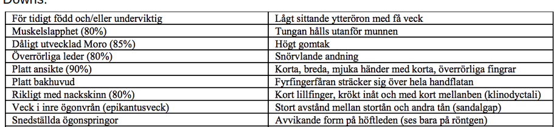
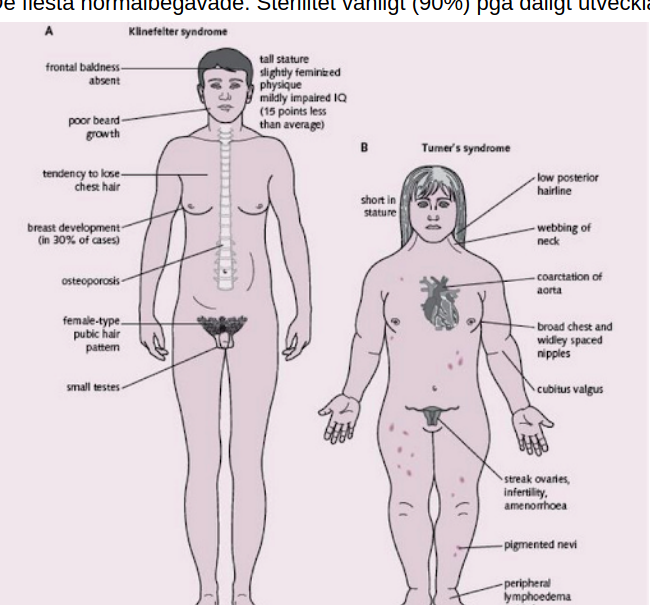

# Klinisk genetik seminarium

**1. Trisomi 21/Down:** Halls kriterier: <5 = Downs. 5-11 = kanske Downs. 12/fler = alltid Downs.

Vanligaste kromosomavvikelsen hos levande födda. 94% trisomi 21, 4% translokation[21:14], 2% mosaicism. Risken ökar med mammans ålder. Fosterdiagnostik erbjuds alla kvinnor >35. Förknippat med missbildningar, varav hjärtmissbildningar vanligast. EKO innan hemgång från BB. Även ökad inf-känslighet, vanligt med uppfödningsproblem, hypotyreos, ögonproblem, ortopediska avvikelser, depression, demens.

**2. Trisomi 18/Edward:** 90% dör första året, men överlever man detta är prognosen för resten av barndomen god. Tillväxthämmade, stor nacke, liten haka, gungstolsfötter, kort stortå, speciell handställning (tumme/lillfinger vikta över övriga fingrar), nageldysplasi. 60% har hjärtfel.

**3. Trisomi 13/Patau:** 80% dör första året, medelöverlevnad 3d. Associerat med CNS-missbildningar imedellinjen. Lutande panna, platt huvud. Skalpdefekter, ser ut som utstansade sår. Vanligt med extra fingrar/tår. 80% har hjärtfel.

**4. 47XXY/Klinefilters:** Pojkar, upptäcks ej i nyföddhetsperioden. Långvuxenhet, sen pubertet, bröstförstoring, feminin könsbehåring, små testiklar, sterilitet, normalt/lätt sänkt IQ. Kan komma på utredning för långvuxenhet, sen pubertet, infertilitet eller manboobs. Uppförandeproblematik.

**5. 45X/Turners:** Flickor. Fotryggsödem, mkt nackskinn, kort nacke, extra brett mellan bröstvårtorna. I förskoleåldern dålig tillväxt och yttre stigmata. Kortvuxenhet, utebliven pubertet. GH-beh har visat sig möjliggöra vuxenlängd >150 cm. Puberteten induceras med östrogener. De flesta normalbegåvade. Sterilitet vanligt (90%) pga dåligt utvecklade folliklar.

**6. Fragilt X:** X-bunden, ”recessiv” trinukleotid-repeat-expansion. Stora öron, långt ansikte, prominent haka och panna, stora testiklar och storskallighet. Dessutom strabism, överrörliga leder, plattfot, mjuk hud och tungrörelser utanför munnen. Män brukar ha IQ på 30-50, ofta hyperaktiva, autistiska, blyga och ger dålig blickkontakt. Kvinnor har IQ 50-70 och sällan autism, men väl aspergerdrag.

**7. Prader-Willi:** En del av pappas kromosom 15 saknas. Lindrig/måttlig utv-störning. Kortvuxna och överviktiga (låg metabolism), låg GH-utsöndring. Hypogonadism. Grav muskelslapphet, svårmatade. Uttalad obesitas om matintaget ej kan begränsas.

**8. Angelman:** Samma del av mammans kromosom 15 saknas. Svårare utvecklingsstörning än PraderWilli, försenad motorisk utv, ataxi. Ett speciellt beteende med glad, öppen attityd och hyperaktivitet är typiskt. Mkt begränsad språkutv och ep. Man kan observera ett litet huvud, bred och ofta glatt leende öppen mun, framskjutande överkäke, tunn överläpp och glest mellan tänderna.

## Fallbeskrivning 1
**33-åriga Alba och hennes partner planerar att bilda familj. Albas 27-årige bror Pascal är döv och har sedan tidiga tonåren mikrohematuri, proteinuri och nedsatt njurfunktion. Albas och Pascals föräldrar är friska, men deras morbror blev njurtransplanterad i 40-årsåldern. Morbroderns dotter har hörapparat men är i övrigt frisk. Alba själv har inga besvär från njurarna men är orolig för att hennes blivande barn ska få samma sjukdom som Pascal och kommer därför till klinisk genetik för genetisk vägledning.**

#### Föreslå tre differentialdiagnoser. Vilken är mest sannolik?
Alports syndrom (x-bunden dominant (För det mesta)) → troligast :Både män och kvinnor kan ha den X-kromosombundna formen av syndromet, men det är bara män som utvecklar svåra symtom.
Alports syndrom (autosomal recessiv (15% av fallen))
Polycystisk njursjukdom. (autosomal dominant) (mindre troligt) 
Autosomal recessiv polycystisk njursjukdom

* Iom att det går till män är det X-bundet. 
* Kan vara autosomalt recessivt att det hoppar över generationer
* Tänker på njurarna i första hand, men det är en autosomalt dominant sjukdom, så lär inte vara
* alports syndrom lite mer sannolikt för att passande X-bundet nedärvningsmönster. 
* X-inaktivering, att den maternella eller paternella inaktiveras hos barnet, varpå det är en av de som blir påverkat. 

#### Utifrån den information du har tillgänglig, vilket nedärvningsmönster är mest troligt?
Svårt att säga, kan ha två förklaringar: 
X-bunden recessiv eftersom att männen är drabbade i njursjukdom. Hittar dock ingen sjukdom som faller in på symtombilden. Där hörsel problematiken hos “morbroderns dotter” kan vara orsakat av något annat. 

-  Men till största sannolikhet är sjukdomen X-bunden dominant, eftersom att männen blivit allvarligt sjuka, och kvinnorna med mildare symtom (hörselproblem). Eftersom att att kvinnan är XX, kommer den friska allelen kompensera för den sjuka.  

#### Försök att utifrån tillgänglig information, göra en beräkning av sannolikheten att få sjukdomen för;
o  Alba
X-bunden dominant sjukdom → risken är ½ att alba bär på det sjuka anlaget.
o   Albas blivande barn
Risken att Alba är anlagsbärare är ½ , och att hon får ett sjukt barn är ½ → Den totala risken ¼   (om x-bunden dominant sjukdom) 

Insidensen av Alports → 1/50’000 → p = 1/224, anlagsbärare frekvensen: 4/1000. 

#### Vilken genetisk utredning, och på vem, är ett rimligt första steg?
Ett alternativ är att analysera Pascals (indexpatient) gener för att identifiera mutation. Passar bäst med sekvensering för att hitta mutation. Antingen genpanel eller helgenom. När vi identifierat gen kan vi analysera föräldrar/alba/fosterdiagnostik.
Med ultraljud, KUB, NIPT, fostervattensprov och moderkaksprov kan du få veta om fostret har vissa avvikelser eller sjukdomar. (senare skede) 
NIPT (Från moderkaka och fostervatten) → kan erbjudas vecka 10, men görs annars vecka 12 eller 13. 

***Möjligt att autosomalt dominant***

Det finns begrepp ***variabel expressivitet*** att det uttrycks olika beroende på person, förklarar att symptomen varierar i familjen.

***Vilka tester***

Man ska börja med en patient som är sjuk, vilket är Pascal. Då gör man en WGS (helgenom) varpå tittar på en genpanel. Om man inte hittar generna kan man bredda sökningen, då man har hela genomet i databasen. 

Om man testar Alba och inte hittar i henne, är det möjligt att vi hittat inte generna:

MAn använder NGS därigenom gör en WGS.

### Genetisk testning på Pascal påvisar en sjukdomsorsakande mutation i genen COL4A5.

#### Vad innebär svaret för Pascal?                          
COL4A5 mutation är associerad med Alports syndrom som är en X-bunden dominant. 
Alport syndrome is inherited in an X-linked pattern and caused by COL4A5 gene mutations, although other inheritance patterns do exist. It can be inherited as an autosomal recessive or dominant pattern by mutations in COL4A3 or COL4A4 gene.
https://www.ncbi.nlm.nih.gov/books/NBK470419/

* Den X-kromosombundna formen av Alports syndrom 
  * orsakas av en förändring (mutation) i genen *COL4A5* på den långa armen av X-kromosomen (Xq22).
  *  Genen är en mall för tillverkningen av (kodar för) ett protein kallat kollagen 4. 
  * Mutationen leder till förändringar i kollagenets uppbyggnad. 
* Kronisk njursvikt i framtiden troligen. 
* Kliniskt ger hörselnedsättning och kronisk njursvikt. 
  * kanske att det leder till en njurtransplantation i framtiden
* Alport ger: öron, ögon, njursymptom. 

#### Vad är sannolikheten att Pascals framtida barn får sjukdomen?

* Om Pascal får döttrar kommer alla bära på det sjuka anlaget, och troligen bli sjuka i framtiden,
* om han får söner är risken 0 (Övergripligt). 
* Kan förklaras så här: 
  * X-bunden dominant
  * Pascal ger X kromosom till döttrar och Y kromosom till söner
  * alla döttrar blir därför bärare. 

#### Hur kan vi förklara att kvinnor kan få symptom?
Eftersom att sjukdomen är X-bunden dominant.  

* Men eftersom att att kvinnan är XX, kommer den friska allelen kompensera för den sjuka, 
* och därmed inte ge så allvarliga symtom. 

#### Resonera kring olika handläggningsalternativ inför Albas planerade familjebildning
* ***Vi kan erbjuda Alba testning också.*** 
  * när vi gjrode analys på Pascal var det bred analys, och hittade mutation, och då vet vi att detta är familjens variant. 
  * Då är det 50% sannolikhet at Alba ärvt fr mamman
  * då kan man testa Alba
  * om hon ite ärvt är det fine. 
  * Metoden: beror på vilken mutation om det är Sanger eller gene-array...
* ***Flera tillvägagångssätt***
  * Avstå från barn i framtiden
  * Ingen testning 
  * Prenataldiagnostik (moderkaksprov) under graviditet 
  * Pre-implantatoriskt genetisk diagnostik (PGD) 
  * Äggdonation 
  * Adoption
  * ***Gällande metoden som man kan använda***: 
    * Notera att NIPT inte används för att den är för kromosomavvikelser
    * invasivt istället är om man letar efter ngt i släkten, 
* Om alba bär
  * kan chansa
  * erbjuda PGD: att man väljer ut embryot som itne bär på genen och implanterar det. 
    * vilka sjukdomar får man göra PGD: det måste vara allvarlig genetisk sjukdom. 
    * för att kunna göra en PGD måste man ha genetisk sjd i familjen, ha en genetisk mutation, och förälder är bärare av mutationen. 
* Man skulle kunna genomföra fosterdiagnostik. Prenatal genom moderkaksprov (helst då det går att utföra tidigare i graviditeten än amniocentes. Ger även mer DNA än amniocentes som främst ger celler). 
* Man kan göra preimplantatorisk diagnostik om de genomgår IVF. 
* Man kan avstå från barn, inte testa alls, donerade ägg, adoption osv. 

Referens:  M Nordenskjöld, Genetiska sjukdomar; Kapitel 3, Sjukdomar i släkten och kapitel 14, Ärftliga njursjukdomar

## Fallbeskrivning 2

Astrid är en 55-årig kvinna som vårdas på onkologavdelningen på grund av återfall från höggradig serös ovarialcancer. Som del av utredningen har man gjort en genetisk analys av BRCA1 och BRCA2 generna på tumörmaterialet. Analysen visar en mutation i BRCA1 genen. Vid diskussion på multidisciplinär konferens beslutas det att patienten skall remitteras till klinisk genetik.

#### Vilka frågor vill du ställa till patienten?
* Vad har personen för bakgrund, förkunskaper? Vad har personen för socialt stöd? 
* Hur ser familjehistorien ut? heridete?
* Medicinsk anamnes /status (ökad risk bröstcancer, har patient genomfört mammografi/annan undersökning av bröst nyligen?)
* Riskuppfattning Livssyn, etisk kompass. 

#### Vilken information är viktig att ta med på remissen till Klinisk Genetik?
Heriditet, resultat av tidigare genanalyser, comorbiditet, eventuella barn.
sjukdomstillstånd/allmäntillstånd/förväntad livslängd

Återfall höggradig serös ovarialcancer

Som del av utredningen har man gjort en genetisk analys av BRCA1 och BRCA2 generna på tumörmaterialet. Analysen visar en mutation i BRCA1 genen. 
Familjehistorik/släktträd cancer, särskilt bröst och ovarial.

När remissen kommer till Klinisk Genetik ringer en genetisk vägledare upp patienten och upprättar ett släktträd. Patienten drabbades av äggstockscancer vid 49 åå, återfall vid 55åå. Patientens mor är 82-årig och vä frisk, en moster diagnosticerades med bröstcancer vid 66 års ålder och dog vid 70 års ålder. Patientens far dog vid 67 års ålder i hjärtinfarkt, faster fick bröstcancer vid 49 års ålder och dog vid 52 års ålder. Patienten har två döttrar som är 25 och 27 år gamla. Uppgifterna om mor* och farföräldrarna är osäkra.

*

#### Rita släktträdet

#### Vad talar för och emot ärftlig cancer i denna familj?
För: 

* Återfall i äggstockscancer
* Paient är ung 49 år vid diagnos. Medianålder ovarialcancer är 65 år (internetmedicin). Även faster ung (49 år diagnos bröstcancer), medianålder är 65 år(internetmedicin).
* Äggstockscancer är associerad med bröstcancer.
    Emot: 
* De flesta tumörer är sporadiska
* Vi vet inte ifall farföräldrarna dog av någon cancersjukdom. (talar varken för eller emot).
* Cancer finns i två olika grenar i släktträdet dvs. både på pappas och mammas sida, dock fått cancer i ganska sent ålder. 

#### Reflektera över vilken vävnad använts till analysen och dess betydelse vid genetisk vägledning.
Blodprov.(https://www.sahlgrenska.se/for-dig-som-ar/vardgivare/laboratoriemedicin/analyslista/brca1/)
DNA-sekvensering

Dess betydelse??

#### Hur påverkas patienten och hennes släktingar om ärftlig cancer skulle bekräftas respektive avfärdas? Resonera kring risker och uppföljningsmöjligheter.

Risk att ärva BRCA gen: 50%. You have a 50 percent chance of having inherited the nonworking BRCA gene, which would cause you to have an increased risk for cancer. There is also a 50 percent chance that you have inherited a working BRCA gene, in which case you have the same risk for cancer as a person in the general population.

BRCA 1: On average, women with an altered BRCA1 gene have a 50 to 85 percent risk of developing breast cancer by age 70. Their risk of developing ovarian cancer is 40 to 60 percent by age 85.
BRCA 2: Both men and women with a change in the BRCA2 gene are at increased risk for breast cancer. In women, the risks associated with a BRCA2 mutation appear to be about the same as those for BRCA1 mutations — a 50 to 85 percent risk of developing the disease by the age of 70. The risk for cancer of the ovary is also increased — between 16 and 27 percent by late age.
A man with a BRCA2 change has an increased risk for male breast cancer. In addition, men with mutations in BRCA2 have a higher risk for prostate cancer.
In both men and women with BRCA2 changes, the risk for pancreatic cancer and melanoma is also are increased.
Kvinnor som har en känd BRCA gen kan profylaktiskt operera bort bröstkörtel eller äggstockar. Tätare uppföljning med mammografi mm.
Women with BRCA mutations may choose to have surgery to reduce their cancer risk. For example, the breasts may be removed to prevent breast cancer, and the ovaries and fallopian tubes may be removed to prevent ovarian cancer. Removing the fallopian tubes and ovaries before age 50 also reduces breast cancer risk.

https://www.mskcc.org/cancer-care/risk-assessment-screening/hereditary-genetics/genetic-counseling/brca1-brca2-genes-risk-breast-ovarian

Referenser:

* Vårdprogrammet äggstockscancer  (10 Ärftlig bröstcancer) https://kunskapsbanken.cancercentrum.se/diagnoser/brostcancer/vardprogram/* 
* Allmänna info om ärftlig cancer på cancercentrum.se https://cancercentrum.se/samverkan/vara-uppdrag/prevention-och-tidig-upptackt/arftlig*   cancer/* 
* Föreläsning om ärftlig cancer

* 41, 51, 63

## Fallbeskrivning 3
Samina är 25 år gammal och gravid i vecka 11. Hon har nyligen fått resultatet på sitt NIPT-prov och analysen visade en ökad sannolikhet för trisomi 21 (T21).
Detta är hennes andra graviditet och i den första påvisade ett KUB-test och den efterföljande NIPT-analysen också en ökad sannolikhet för T21 men graviditeten slutade i en spontan abort i vecka 13 innan några uppföljande analyser utförts.

#### Vad är en NIPT-analys?
* None-invasive prenatal testing, 
* upptäcker aneuploidi avseende kromosom 13, 18 och 21, X och Y (fler kromosom är på väg)
* Kan utföras från graviditetsvecka 9-10. 
* Blodprov från den gravida kvinnan, i kvinnans blod förekommer smådelar av fostrets DNA.

#### Vilken information bör Samina få efter sitt testresultat?
Alla med positivt NIPT -resultat bör verifieras med invasiv provtagning då det finns risk att det är ett falskt positivt resultat. Fostervattensprov eller moderkaksprov. 

1-2 per 1000 nyfödda barn har trisomi 21. Barn med Downs syndrom har ett förståndshandikapp som kan variera i svårighetsgrad kombinerat med ett typiskt utseende och ibland missbildningar. 

https://www.sahlgrenska.se/for-dig-som-ar/vardgivare/laboratoriemedicin/analyslista/nipt-non-invasive-prenatal-testing/ 

## Fallbeskrivning 4
På din mottagning som vårdcentralsläkare träffar du Arda. Arda är 33 år gammal och berättar att han och hans fru önskar att skaffa barn. Arda är dock orolig, då hans äldre syster har en sjukdom som heter PKU (fenylketonuri) och lider av en svår funktionsnedsättning. Arda vet att sjukdomen kan vara ärftlig och söker ditt råd.
Du ber Arda berätta mer om sin familj och ritar ett släktträd. Arda berättar att han och hans fru, Yasemin, ursprungligen är från Turkiet men att hans släkt bott i Sverige i många år. Han berättar vidare att han också har två yngre bröder som inte har några hälsoproblem. Hans föräldrar är båda i livet och friska, men Arda berättar att föräldrarna är kusiner. Angående Yasemins släkt är han inte medveten om att av hennes släktingar skulle ha någon sjukdom eller att det förekommit något släktgifte. Arda berättar också att han och Yasemin inte är släkt på något sätt.

Frågor: 
* **Varför har Arda kommit till din mottagning? Vad är det han hoppas få svar på?**
Vill veta ifall planerad avkomma löper risken att få PKU. 
* **Vad är Ardas risk att vara bärare av ett sjukdomsanlag?**
Ja Ardas risk att bära på sjukdomen är 2/3 eftersom att hans föräldrarna är släkt och har ett sjukt barn. 
* (PKU är en autosomal recessiv sjukdom) 
PKU = autosomalt recessiv ⅔ risk
* **Vad är Arda och Yasemins risk att få ett barn med sjukdomen PKU?**
(Incidensen i Turkiet för PKU är 1/4900 och är där med bland de högsta i världen, anlagsbärarfrekvens 1/3 * 1/35 * ¼ = ca. 1/200
* ***Hur skulle du påbörja en genetisk utredning i denna familj?***
* Ska sekvensera indexpatienten, som är sjuk, för att få reda på mutationen. 
* Sekvensering. Antingen för enskild gen eller genpanel. 
* The PAH gene is located on chromosome 12 in the bands 12q22-q24.2.[19] As of 2000, around 400 disease-causing mutations had been found in the PAH gene. This is an example of allelic genetic heterogeneity.[5]

**Det visar sig också att en fullständig utredning av Ardas äldre syster, Lisa, redan är utförd. Lisa visade sig vara homozygot för en patogen variant i genen PAH. Anlagsbärartest på Arda visar att Arda är heterozygot bärare av den patogena varianten i PAH som identifierades hos hans syster. När du kontaktar Arda för att berätta om resultatet så berättar han att de precis fått reda på att hans fru Yasemin blivit gravid. Han är nu mycket orolig och undrar hur man kan gå vidare?**

* **Hur stor är nu risken för Ardas och Yasemins barn att drabbas av PKU?**
1/35 * ¼ = 7/1000 eller ca. 1/143
* **Vilka möjligheter finns för att driva den genetiska utredningen vidare?**
  Man man analysera Yasmines arvsanlag.
  Fosterdiagnostik.
  * man behöver inte göra fosterdiagnostik om mamman inte är bärare föra tt det är en autosomalt recessiv sjuka.
* Om Arda och Yasemin önskar att fortsätta graviditeten utan några tester, vad kan sjukvården då erbjuda när deras barn föds? Eventuell behandling mot sjukdomen? 
* Screening vid födsel: 
* PKU is commonly included in the newborn screening panel of many countries, with varied detection techniques. Most babies in developed countries are screened for PKU soon after birth.[30] Screening for PKU is done with bacterial inhibition assay (Guthrie test), immunoassays using fluorometric or photometric detection, or amino acid measurement using tandem mass spectrometry (MS/MS). Measurements done using MS/MS determine the concentration of Phe and the ratio of Phe to tyrosine, the ratio will be elevated in PKU.[31]
* behand

#### Behandling:
Behandlingen vid fenylketonuri innebär en noggrann diet med en individuellt anpassad och proteinreducerad kost. Hur mycket eller lite protein kosten kan innehålla varierar och beror på om enzymet fenylalaninhydroxylas kan bryta ned fenylalanin i någon grad eller inte alls. Utformningen av dieten skiljer sig därför mellan personer med sjukdomen. Vissa kan äta en nästan normal mängd protein medan andra bara kan äta ytterst små mängder. Syftet med dieten är att minska intaget av fenylalanin, men små mängder av denna aminosyra behövs för att barnen ska växa och utvecklas normalt. En dietist kan räkna ut hur mycket protein och vilken sorts protein barnet bör äta för att få i sig en lämplig mängd fenylalanin. Det kan vara protein från rotsaker, grönsaker, frukt och särskilda lågproteinprodukter i exakt den mängd som behövs utan att det uppstår skadliga nivåer av fenylalanin i blodet.
Läkemedlet sapropterin kan öka nedbrytningen av fenylalanin till tyrosin hos en del personer med fenylketonuri. Därigenom minskar mängden fenylalanin i blodet. Sapropterin är en syntetisk form av koenzymet tetrahydrobiopterin (BH*  finns som lösliga tabletter. Det kan ges till barn från nyföddhetsperioden. För närvarande (202* år sapropterin i vissa fall i läkemedelsförmånen. Läkemedlet ska bara skrivas ut av läkare med stor erfarenhet av fenylketonuri och efter särskild prövning i varje enskilt fall.

Referenser:

https://www.socialstyrelsen.se/stod-i-arbetet/ovanliga-diagnoser/fenylketonuri/

https://www.ncbi.nlm.nih.gov/books/NBK1504/

## Fallbeskrivning 5
Treåriga Noah följs av barnläkare på grund av en medfödd hjärtmissbildning och utvecklingsförsening. Han har haft upprepade luftvägsinfektioner och visats sig ha en mild immunbrist. Tillväxten är långsam och han har ända sedan spädbarnstiden haft svårt att äta. Barnläkaren misstänker att Noahs symptom är del av ett syndrom.
Varken Noahs föräldrar, 7-åriga storebror eller någon annan i den närliggande släkten har haft en liknande symtombild. Föräldrarna skulle eventuellt vilja ha ett till barn.
Fundera på följande frågor innan seminariet:

#### Varför misstänks ett syndrom?
Noah har flera ovanliga symptom, därför bör man misstänka ett syndrom och utreda vidare.

#### Vilken/vilka ärftlighetsform/er kan misstänkas?
Nymutation/kromosomavvikelse (troliast)
Autosomalt recessivt: ingen i Noahs släkt har haft liknande symptombild, det talar emot autosomal dominant. En recessiv nedärvning är möjlig om båda föräldrarna har anlag.
X-bunden är ej troligt, det bör då ha gett utryck i släkten tidigare.

#### Reflektera över om det är viktigt att ställa en diagnos. Varför/varför inte?
Genetisk diagnostik för att undersöka om ett syndrom föreligger och vilket/vilka gener som orsakar detta är viktigt av flera skäl. 
Det kan ge information behandlingsalternativ och prognos. Nedärvningsmönstret kan även bedömas. Information om specifik orsak kan även möjliggöra framtida riktad fosterdiagnostik.
En kostsam genetisk utredning bör ha som mål att hitta specifik orsak för att förbättra behandlingsmöjligheter och göra bedömning om prognos. I dom fall där utredningen troligtvis inte kommer hittar någon orsak kan det vara onödigt.  Exempel på detta är vid polygena/multifaktoriella sjukdomar. I Noas fall bör man dock inte avstå av det skälet.
Andra tänkbara orsaker till att inte genomföra utredning kan vara föräldrarnas motsträvan till utredning. Dom kanske inte vill stämpla barnet som “sjukt” eller liknande.  

#### Om genetisk utredning önskas, vilken typ av analys är ett rimligt första steg?
Första analys på Noah (indexpatient), senare ev på föräldrar. Eftersom misstanke om kromosomavvikelse kan man börja med kromosomavvikelse/array-CGH. 

Referens:  M Nordenskjöld, Genetiska sjukdomar; Kapitel 6 Syndromdiagnosti

## Bonusfall
31-årig kvinna kommer till mottagningen och är gravid i vecka 8. Hon funderar över risken att barnet ska ha samma sjukdom som hennes farbror. Du gör en noggrann familjehistoria och dokumentera det i ett pedigree. Patienten är äldst av fyra syskon, inget av de andra ha något barn. Patientens mor har fyra syskon, två bröder och två systrar, som alla har barn.  På faderns sida finns det fanns det tre syskon, en syster som har fyra barn och bror som har två barn, och den aktuella farbrodern som dog i en lunginflammation vid 27 års ålder. Han lärde sig aldrig gå, kunde inte äta själv och kunde varken läsa eller skriva, han levde USA och obducerades aldrig.
Du efterfrågar specifikt om det finns något släktgifte och det gör det inte. Kvinnan är inte heller släkt med den blivande pappan.
Vad är sannolikheten att patienten ska få ett barn med samma sjukdom som farbrodern?

* Gör ett släktträd
* Bedöm sannolikheten för att kvinna ska få ett sjukt barn utifrån olika möjliga ärftlighetsmönster
Sannolikheten bedöms som ej trolig. Ej autosomal dominant, ej X-bunden, autosomal recessiv är möjlig men låg sannolikhet. Farbrodern hade troligtvis en nymutation/kromosomavvikelse som ej har nedärvs. 
* Vilka olika ärftlighetsmönster är möjliga då det endast finns en sjuk individ
Troligen: autosomal recessiv, nymutation kromosomavvikelse.
* Resonera kring behovet av exakt etiologisk diagnos för att kunna gör din bedömning. 
Utifrån pedigree har vi bedömt nedärvningen som ej sannolik. Ev autosomal recessiv. 

## SBA test Clinical Genetics April 2020

* In which of these cases is it motivated to perform a chromosome analysis?

    * A 25-year-old pregnant woman with a Down-syndrome brother (47,XY,+21). NEJ
    * A boy with suspected 22q11-deletion syndrome. (Här bör man göra array-CGH). NEJ
    * A couple with three consecutive miscarriages. JA. (turner/klinefelter)
    * A girl with clinical features of Marfan syndrome. NEJ. (Sekvensering pga. genmutation) 
    * A woman whose sister has a de novo deletion of chromosome 18 Nej, av samma anledning som a.

* 25-year old Tindra and 22-year old Paul are siblings with genetically confirmed neurofibromatosis type 1. Tindra has 15 café au lait macules (>5 mm diameter), optic glioma of the left eye, >10 neurofibromas, and a plexiform neurofibroma on the right arm. Her brother has instead only two café au lait macules and three neurofibromas on the back. The disease severity is therefore different despite the fact that both siblings have the same mutation in the NF1 gene. What is the name of this phenomena which often complicate genetic counselling?

    * Anticipation
    * Gonadal mosaicism
    * Mitotic recombination 
    * Reduced penetrance. JA.
    * Variable expressivity

* A child is born with growth retardation, malformations and dysmorphic features. Genetic testing with array-CGH shows a large deletion of the long arm of chromosome 5 and a large duplication of the short arm of chromosome 6, indicative of an unbalanced reciprocal translocation. The parents should be offered a genetic test to find out if one of them carries a balanced version of the translocation. Which of these tests will be able to detect a balanced translocation in the parents?

    * Array-CGH 
    * Chromosome analysis Ja?????
    * NIPT
    * QF-PCR
    * Whole exome sequencing
  A main disadvantage of conventional CGH is its inability to detect structural chromosomal aberrations without copy number changes, such as mosaicism, balanced chromosomal translocations, and inversions. ... Array CGH is characterized by a high resolution, its major advantage with respect to conventional CGH.

* The brother of Sofia died as a child because of an autosomal recessive disorder. No one in the family of her partner Kalle have suffered from this disorder. Kalle and Sofia are not related. The incidence in the population is 1/90 000 and the carrier frequency is 1/150. 
  What is the risk for the first child of Sofia and Kalle to develop the disorder? 

    * 1/100
    * 1/225
    * 1/600
    * 1/900
    * 1/1200

    Uträkning: ⅔ * 1/150 * ¼ 

* Which is the most probable inheritance pattern? 

    * Autosomal dominant 
    * Autosomal recessive
    * Mitochondrial
    * X-linked dominant 
    * X-linked recessive 

* A colleague wants to discuss five different cases with you to hear if any of them should be referred to Clinical Genetics for investigation of inherited cancer. 

    * 1.    A colleague diagnosed with GIST at 69 years of age, no close relative with cancer.
    * 2.    A patient that had colon cancer at 49 years of age. Her father had colon cancer at 57 years of age and her paternal aunt endometrial cancer at 55 years of age. 
    * 3.    A patient that has had a brain tumor as child and now has been diagnosed with sarcoma in the leg at 35 years of age.  
    * 4.    A patient was recently hospitalised due to pneumothorax. His father (who also has had pneumothorax) was diagnosed with renal cell carcinoma at 56 years of age.  
    * 5.    A patient with endometrial cancer at 45 years of age. Her mother had a gynecological cancer at 50 years of age.  

* In which of these patients should inherited cancer be suspected and thereby referred to Clinical Genetics?
    * All
    * 1, 2, 3, 4
    * 2, 3, 4, 5
    * 2, 3
    * 2, 4

* A syndrome is defined as a condition characterized by a set of associated symptoms involving more than one organ systems. Which statement about syndromes is true. 

    * All syndromes have an underlying genetic cause.
    * All known syndromes involve excess or loss of chromosomal material. 
    * Pathogenetic variants (mutations) in the same gene always give rise to the same syndrome.
    * The genetic cause of a syndrome can almost always be identified though a careful clinical investigation.  
    * Whole genome sequencing and array-CGH are both standard methods used to investigate suspected genetic syndromes.

* Emma is 20 years old, and her mother has recently received the diagnosis of myotonic dystrophy type 1 (at the age of 45). Emma would like to know the risk for her to develop the disorder. You inform her that this is an autosomal dominant disorder, and the risk is 50% that she has inherited the mutation, with the risk of developing symptoms even earlier than her mother. Why? You explain that this is because of myotonic dystrophy is expressing:

    * Anticipation
    * Imprinting
    * Mosaicism
    * Reduced penetrance
    * Variable expressivity

* Maria (see arrow) is planning for children. In her family there are two boys with Duchenne muscular dystrophy (X-linked recessive). What is the risk for her of having a child with the same disorder?

    * 1/3
    * 1/4
    * 1/6
    * 1/8
    * No risk

* A pregnant woman had a combined first trimester test (KUB) and got a risk of 1:190. She is thereby offered further investigation. Which is the method of choice for the follow up investigation within Region Stockholm?

    * A limited prenatal gene panel using whole genome sequencing
    * Karyotype only
    * NIPT
    * QF-PCR + array-CGH 
    * QF-PCR + karyotype

* Which is the most probable inheritance pattern?

    * Autosomal dominant
    * Autosomal recessive
    * Mitochondrial
    * X-linked dominant
    * X-linked recessive 

* 22q11-deletion syndrome and Williams syndrome are both micro-deletion syndromes. What is a micro-deletion?

    * A deletion that is too small to detect with conventional karyotyping
    * A deletion of one chromosome
    * A deletion of only one gene
    * A deletion of a part of a gene
    * A deletion of one or a few base pairs

* Carriers of balanced chromosome translocations have an increased risk for:

    * Children with metabolic disorders 
    * Children with fragile X syndrome
    * Intellectual disability
    * Malformations
    * Miscarriages and children with intellectual disability 

* A patient was diagnosed with ovarian cancer at 45 years of age and a genetic analysis on the tumor tissue has identified a BRCA2 mutation. The patient is currently under treatment with cytostatic drugs. She is wondering if her three daughters have an increased risk for ovarian cancer. No other close relative has been diagnosed with cancer. 

    * The patient’s daughters have 50% risk to inherit a BRCA2 mutation and can be offered carrier testing.
    * The patient’s daughters have an increased risk of breast and ovarian cancer and can be offered breast controls and prophylactic salpingo-oophorectomy.
    * The patient has no family history of cancer and her daughters have no increased risk of cancer and therefore need no controls. 
    * We do not know if the patient has inherited cancer and offer her a BRCA2 test of peripheral blood.
    * We do not know if the patient has inherited cancer and offer her an investigation with a gene panel for all known genes linked to ovarian cancer in peripheral blood. 

* Chromosomal aberrations were first found to be the cause of disease in the 1950s. Today we know that there are a variety of chromosomal aberrations that can give rise to a wide spectrum of disorders. Aneuploidy is the most common type of chromosomal aberration. Which syndrome below is caused by aneuploidy?

    * Achondroplasia
    * Fragile X syndrome
    * Klinefelter syndrome
    * Marfan syndrome
    * 22q11.2 deletion syndrome

 