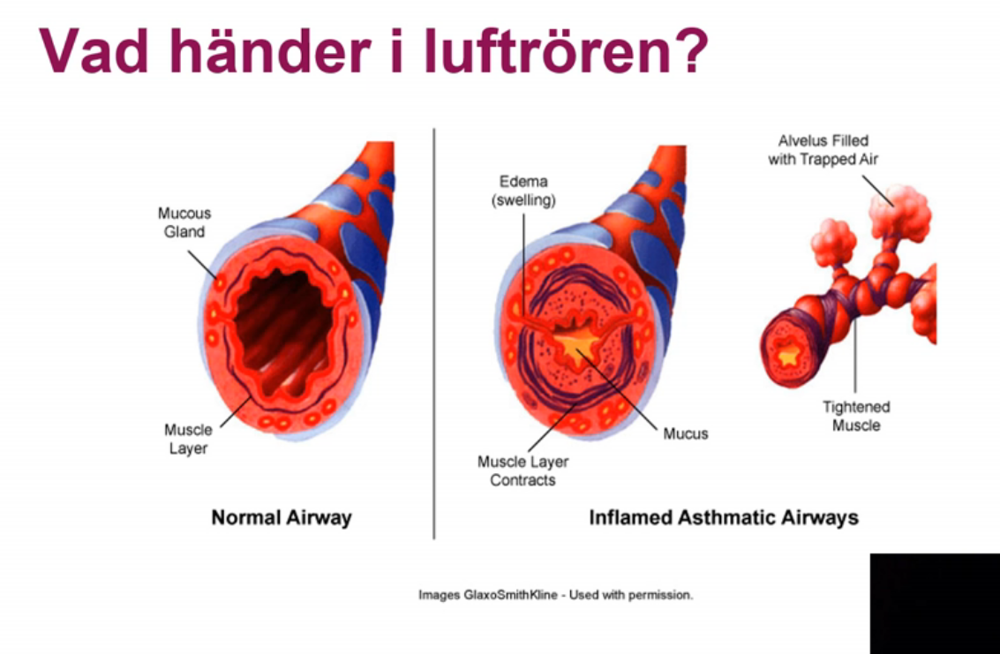
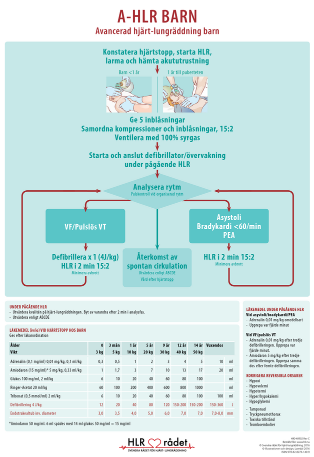
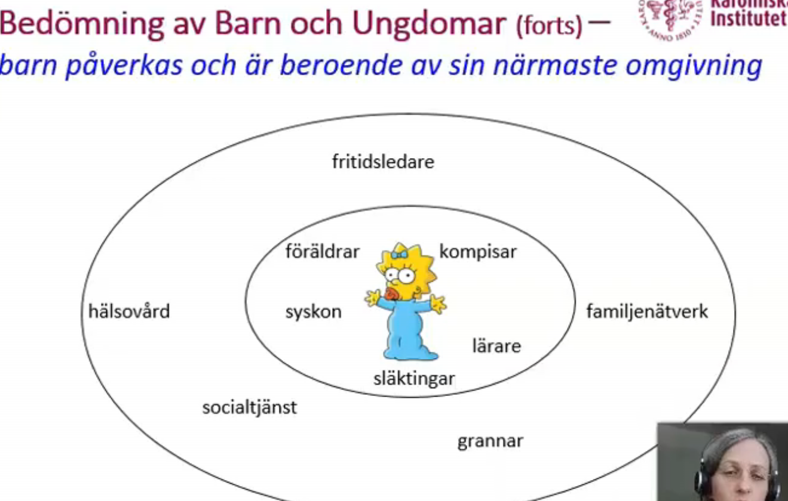
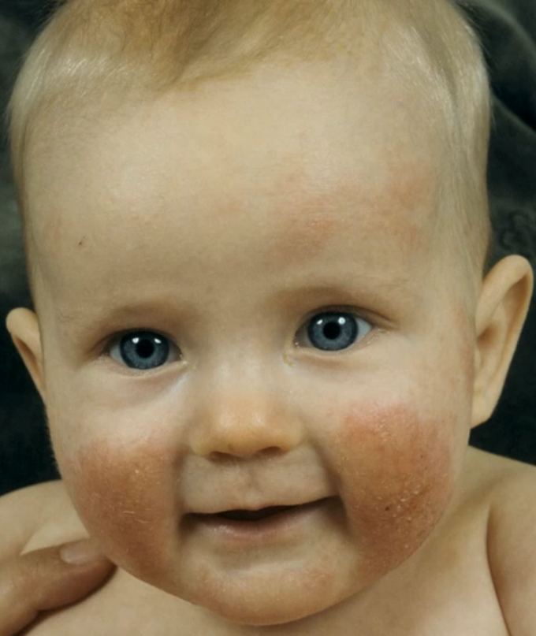
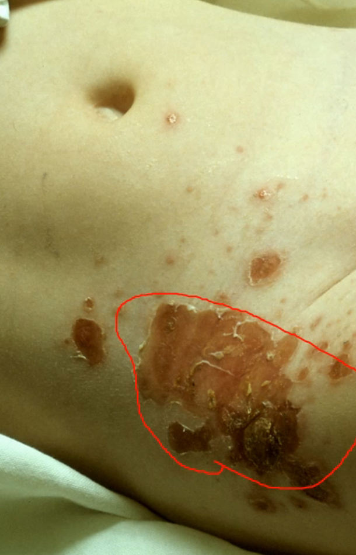
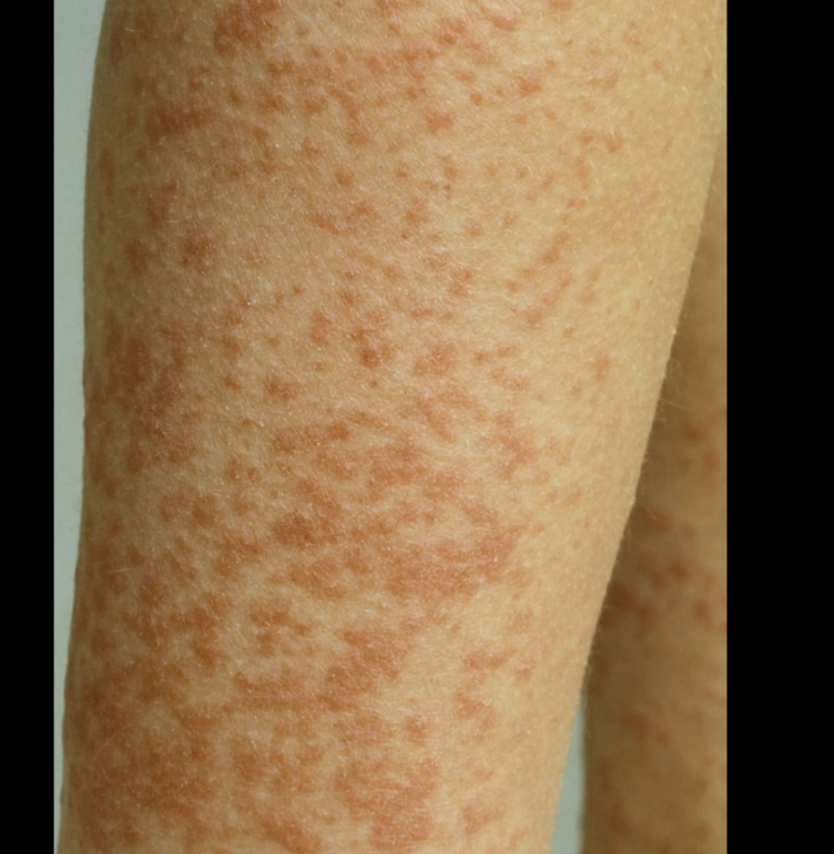
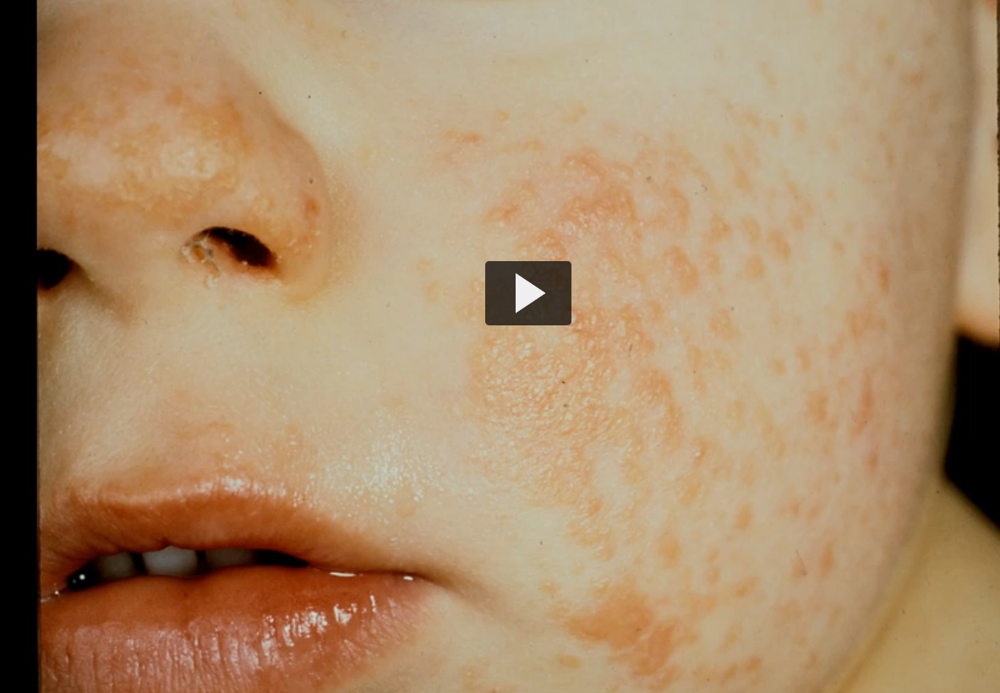
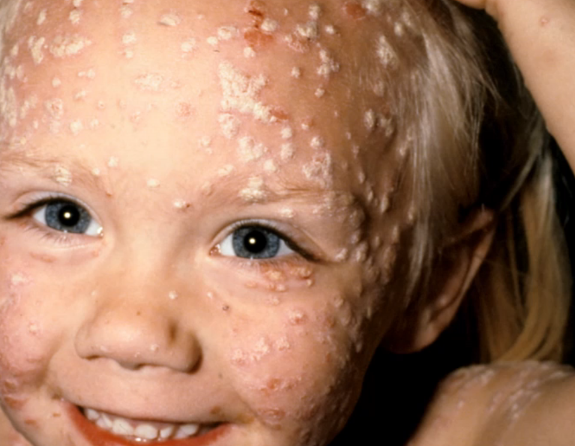
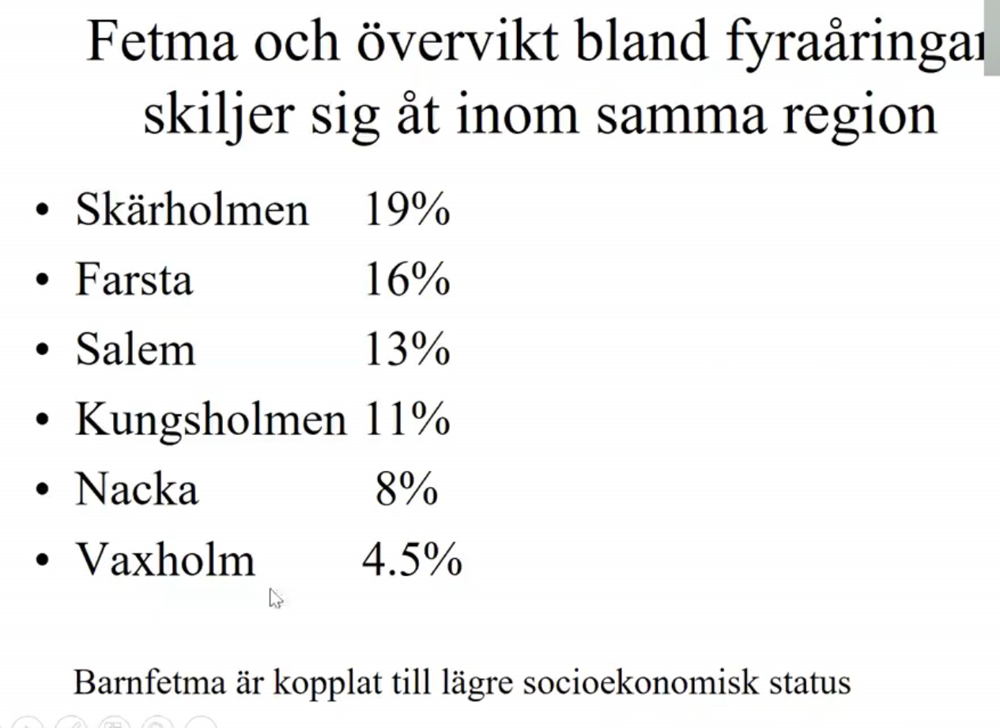
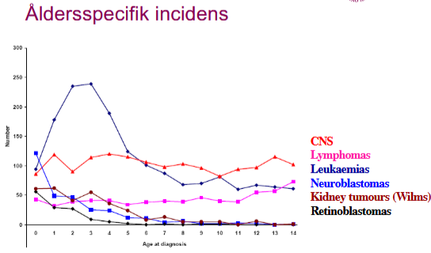

# PED Lectures

## Barnets normala utveckling

Det som kommentera angående denna bild är att det kan föreligga en del som förklarar varför ett barn kan dippa på det sättet i tillväxten:

1. ***Cancer***: cancertillväxten orsakar utmärgling av barnet, 

2. ***Tillväxthormonbrist, inte***: en tillväxthormonbrist skulle yttra sig tidigare, runt 2-3års ålder, och tillta lite långsammare än det som presenteras
3. ***IBD***: inflammatorisk tarmsjukdom kan leda till att det ser ut på det sättet också. 
4. ***Depression och ätstörning***: Det riktiga svaret i detta fallet var att flickans pappa avlidit i tumörsjukdom, varpå barnet blir depressivt och får en ätstörning. 

##### Återhämtningen

Man får en återhämtningstillväxt efter att barnet går igm depressionen och remission. Dock notera att arean under kurvan är mindre tillväxtmässigt när man jämför. 

Trots att man får en återhämtningsfas, kompenseras det inte tillräckligt när barnet får sin tillväxtspurt när puberteten i sin tur kommer igång. (barnet blir kortare?)

#### Faktorer som påverkar barnets tillväxt

1. ***graviditet***: undernäring, övernäring (diabetes etc)
2. ***arvet***
3. ***psykosocial miljö***: bra leder t att man kan utnyttja arvet. men om dålig psykosocial miljö kommer att påverka längden på barnet över längre tidsperioder
4. ***nutrition***
5. ***hälsa***

***Man gör några fel på denna bilden:***

1. benen ska vara ihop
2. knäna ska sträckas

***Efter 2 års ålder mäter man barnet stående.*** 

1. sockar och skor ska vara av, ya3ni bilden är fel menar han. 
2. sträckt i knäna
3. in med magen

man upprepar detta tre gånger, och lägger in genomsnittliga längden

#### Tillväxtkurvan

Alla barn födda efter millenieskiftet använder detta. går fr 0-2 år, och har en prematurkurva

a

Markeringarna talar om vilka kurvor representerar vad. 

Notear att the column längst t vänster är för prematurfödda barn

#### Prematuritet

För det prematurt födda barnet, skickar direkt t iva, för att nutriera upp

för det andra är att man gör korrigering efter märker prematuritet att barnet inte faller inom ramarna. 

***Huvudomfång snabbt tillväxer:*** kan vara ***hydrocefalus*** vilket det inte var för detta barnet, förklarar varrför huvet växer mkt

### Pat fall, 3 bojk

Man ser att längdutvecklingen o vikt dålig.

Frågan vad det är för diffar som orsakar detta hos barnet: 

1. ***Gällande celiaki, inte***: celiaki yttrar sig när man introducerar gluten i kosten, vilket man gör vid 1åå. För detta barn där sänkningen sker tidigare, är det inte aktueltl med celiaki
2. ***Gällande tillväxthormonbrist, intea***: i tillväxthormonbrist är det ***längden*** som sjunker före vikten. Men här är det vikten som devierar mer och börjar innan. 
3. ***Hypothyreos***: Detta är ett bra svar, man screenar barnen tidigt för detta. Det är höga TSH nivåer man letar efter. Det få procent med hypothyreos i Sverige, men det är viktit att man kollar upp det
4. ***Svält, rätt***: i detta fallet har det markerats de perioder som barnet ***inte*** varit i mammans vård, varpå man noterat att barnet går upp i vikt när det inte är med mamman. Man hade tagit tarmbiopsier, som gav en bild som tydde på svält, varpå den diffen som angavs. Initialt hade man tagit en biopsi där man konstaterat att barnet haft celiaki, men det återbedömdes senare, för att det fanns ett behov. Barnet åkte in och handläggdes akut
   1. Detta är ett exempel på psykosocial miljö som föranlett svältning av barnet
   2. man ser catch-up tillväxt efter i slutet när man börjar mata barnet bra. 
   3. ***Påverkan framöver***: nu har man fångat upp pojken i slutet, så psykiskt lär bli bättre. Längd o vikt påverkan åp sikt vra okej, då man ser att barnet återhämtat sig snabbt. 
   4. ***Tidig bikupa***: bättre förutsättningar för att återhämta sig

### Barns sätt att signalera ohälsa

1. kan som små yttrycka sig med språekt
2. kroppsliga signaler
3. psykiatriska signaler
4. psykologiska, pedagogiska aspekter
5. beteendemässiga signaler

### Hormonell reglering av tillväxt

Hormoner som är viktiga intrautering och alltifrån födelsen:;

1. IGF1
2. T3,T4
3. Insulin
4. kortison: om för ltie kortison växer man sämre, men osså om han har för mkt. 

#### Spädbarnsfasen

1. ***Tillväxthormon***: det är fr 1åå som tillväxthormon receptorerna blir mer aktiva och tillväxthormonet börjar komma igång innan dess.

#### Barndomsfasen

1. ***binjureandrogener*** som aktiveras o börjar produceras hos barnet. Manliga hormoner fr binjurar som gör detta, att man luktar svett etc, det är helt normalt
2. barnet börjar svettas etc, som föräldrarna söker för, men som är normalt för barnet, det är inget fel. 

#### Pubertetsfasen 

1. könshormonerna

### Olika pucklar

***Vikt driver längd***: högre vikt föranleder ökningar i längd

***Amningspuckel***: Detta är för att mjölk är sött och fettrikt, varpå barnet stiger i vikt, som i sin tur driver längden

***Viktökning i 2-7åå***: ökar risken för kvarstående fetma i barnets liv. Notera också att fetman i den åldern också ökar längden, varpå den hamnar på en annan standardavvikelse

### Bedömning kurvorna

1. är barnets storlek normalt
2. växer barnet med normal hastighet
3. är förhållandet mellan längd o vikt normalt
   1. e.g. att vikten ökar men att längden sjunkar: ***kortison*** för mkt kortsison leder till att man inte växer lika snabbt men att man kan samla på sig vikt
4. ***Ärftlighet***: man ska sätta längden i relation till förändrarnas längd. man tar en medelföräldralängd in terms av SD, standard deviations

### Avvikande utseende

När han tittar på ett barn, går igm ansiktet systematiskt:

1. ***huvudomfånget***: hur är huvudomfånget i relation med resterande ansikte. I detta fallet är barnet mikrocefaliskt. 
2. ***Ögonen***: 
3. ***piltrum***: barnet har idf inget piltrum, fåran undern äsa
4. ***Munnen***: tunn överläpp
5. ***Hakan***: mikrognati
6. ***öronen***: sitter lågt och bakåtroterade, tecken syndrom eller kromosomavvikelse

***Detta är FAS***

#### FAS och barnpsyk

1. ***Utvecklingsrelaterade funktionsnedsättningar:*** FAS har en högre sannolikhet för att utveckla autism och ADHD

### Pubertetetsstadier

Lika viktigt att man noterar avvikande pubertetsstadier

#### Flickor

B för bröst antar jag

1. B2: ringformad, kanske lite ömmande, första tecken pubertet
2. B3: 
3. B4: som bröst på bröst, att vårtgården har en egen kontur -> indikerar höga östrogennivåer, varpå vårtgården utvecklar mkt
4. B5: där man kan få en bröstvårta, notera att vissa kvinnor kanske aldrig får en fullt utvecklad bröstvårta

PH: pubis hår

1. PH1: inget hår alls
2. PH2: lite hår längs labia majora
3. PH3: lite mer på mons pubis
4. PH4: mer av triangeln utvecklas 
5. PH5: hela triangeln är fylld med hår

##### Pubertetsförlopp

 Åldern x-axeln, och en längdspurt. börjar 10-11åå. maximala derivatan är vid 12åå. 

***max-tillväxthastighet***: 95% är mellan 9.5åå-14.5åå som deras maximala tillväxthastighet är uppnådd

***Pubis-behåring***: notera att den kommer lite senare i utvecklingen. 

#### Pojkar

För könet, indelat i gonadutveckling. ***Orchidometer*** är pellets med en skala för att skatta volymen på testikeln. 

1. G1: är som pojke föds
2. G2: 4mL i storlek av testikel. ena testikeln (vänster?) större än den andra, vilket är helt typiskt
3. G3: noterar att penis blir bredare, skrotalhuden blir tjockare o veckad, vilket progress till final level
4. G4:
5. G5

***Pubisbehåring***: PH

1. PH1: inget behåring
2. PH2: börjar lite gårstårn
3. PH3: 
4. PH4

Tillväxten kommer senare för pojkar. Östrogen är mer potent för tillväxten än för testosteron. 

Man kan jämföra med linjerna näör den maximaa tillväxtspurten nås för flickor vs pojkar

flickor är 13 cm kortare än pojkar on avg. baserat på de angivna differenserna. 

### Fall, 17åå

***Grav hypothyreos***

1. skolsvårigheter
2. svårt emd kompisar
3. uttalat depreimerad
4. trött
5. avstannad tillväxt: på tillväxtkurva
6. avstannad pubertetsutveckling: 
7. bakomliggande orsak

Om flickan hade kommit t BUP med denna anamnes, så kan man tänka depressino, eller barnpsyk samsjuklighet, typ ADHD, intellektuell nedsättning, kanske social ångest om svårt med vänner. Samsjuklighet med andra tillstånd som man kan ntoera. viktigt här är att man följt längd o vikt, då kan man fundera över anorexi, vilket i detta fall mottalas av att vikten är opåverkad jämför längden

I detta fallet är det ***längden*** som påverkats mer än ***vikten***. Man ska tänka att vikten åpverkas normalt sett före längden. 

***grav hypothyreos, svart***: pat har ***myxödem***. typisk ålder för hypothyreos att debtuer, och vanligt att längden debuterar öre. 

Denna flickan kommer att vara sådär lång, ingen catchup tillväxt, förlorat mkt av sitt sociala liv, och kommer att påvkera henne resten av livet etc. 

### Försenad pubertetsutveckling

1. genetisk syndrom: Turner, klinefelters
2. Ätstörningar
3. överträning
4. glutenenteropati
5. Hypothyreos
6. svår kronisk sjukdom, e.g. njursjukdom, IBD, hjärtsjd, leversjd,

### Basutredning av avvikande tillväxt

### Spädbarnsreflexer och psykomotorisk utveckling

#### Tonus och motorik

##### Nyfödd

1. ***Primitiva reflexer***: 
2. ***rörelse okontrollerat***: okontrollerat rörs extremiteterna, så kallade ***'massrörelser'***

##### 1 åring

1. viljestyrt
2. isolerade rörelser
   1. kan plocka upp skit fr bord

##### utvecklingen sker

Utvecklingen sker i ***cephalo-caudal riktning***. Från proximala till distala delar av extremiteter

#### Nyföddhetsreflexer

Förekommer ett antal reflexer att beakta:

1. ***Moro***: borta vid 4-5mån postnatalt. ofullständig vid v28, 
2. ***Sugreflexen***: svag v28, borta 4-6mån
3. ***Sökreflexen***: föreligger v34, borta 4-6 mån
4. ***handgrip***: svag v34, bort 4-5 mån
5. ***tågrip***: svag v34, bort 9-15mån
6. ***ATNR***: Asymmetrisk tonsik neck reflexmönster (fäktarställning). tydlgiast vid 2-3 mån ålder, borta 6mån

#### Tonus och spontanmotorik

* Ena bilden är barnet helt orörligt, nästan ingen tonus alls i kroppen, vill inte lyfta ngt. 
* Andra bilden ligger att den ena armen ligger platt när den andra har tonus och rör på sig. 
  * ***Plexusskada***: förlossningsskada att ena armen inte går att lyftas, viktigt att man hanterar det tidigt

### Milstolpar

#### 0-1 åå, spädbarnet

1. milstopalar sociala leenden, fr ca 4 veckor, främlingsrädsla fr ca 7månader
2. ***anknytning***: tillit, trygghet, samspel
3. föräldrafunktion avgörande för barnets välbefinnande
4. barnet har inte kognitiv kapacitet utan är helt beroende av föräldranras emotionella staus
5. ***sjukvården***: så länge förändrarna fungerar skapligt, så klarar barnet det bra

#### 2 månader

***Grovmotorik***

* ***Huvudbalansen***: kontrollera huvudbalansen
* ***följer med blicken***: när man för skit framför ögonen på barnet, följer med blicken
* ***böjmönster***: successivt minskat böjmönster
* ***mororeflex avtar***. tydlig nackreflex

***Finmotorik***

* ***Handrörelser***: medvetna handrörelser ***saknas***

***Språk samspel***

* leendet utveckals successivt
* svarsleende, svarsljud
* vid 2-3mån, jller när man kan samordna andning och stämband

#### 6 månader

***Grovmotorik***

* Vänder runt: fr rygg t mage etc. 
* has-kryper: att den kryper
* börjar utveckla skyddsreflexe
* nyföddhetsreflexer ***ska vara borta***

***Finmotorik***

* flyttar föremål mellan händerna

***Samspel och språk***

* tittar efter tappad leksak
* enstavigt joller, 'dadada, bababa'

#### Tidig eller sen utveckling

man testar fallskyddsreflexen: att man inte har ngn minsta tillsyn för fallskyddsreflex. Det är inte patologiskt att man inte har det

poängen är att man ska gå fram i sin utveckling. barnet ska gå sin egen kurva, man ska inte direkt jämföra barnen, utan det är mer relevant att man ska tänka på barnets egna unika kurva, så länge det går framåt för barnet.

#### Handens finmotorik

1. ***Grabbgrepp***: 4-5mån
2. ***Flyttar fr hand t hand***: 5-6mpn
3. ***oppositionsgrepp***:; 7-8mån
4. ***pincettgrepp***: 9-10mån

#### 10-12 månader

***Finmotorik***

1. pincettgrepp, plockar, småsulor
2. staplar burkar

***Grovmotorik***

1. reser sig, går utmed, eller med stöd
2. väl utvecklade skyddsreflexer

denna ålöder som man behöver säkra sitt hem

***Socialt***

* interagerar med utomstående
* leker, vnkar hej o adjö
* klappar händer, 
* interagerar utomstående

***Språk***

* 8-10 mån: symbol med betydelse, titta-peka-benämna-lekar
* 10-12mån: barnet börjar imitera ljud = grundläggande för språkutvecklöing
* ***Imitera-identifiera och minnas***
* förstår o säger enkla ord: "Mamma, titta där"
* Ibland tyst period efter joller = "ordsamlarstadiet"

#### 18 mån

***Grovmotorik***

* går säkert utan stöd
* tar sig upp och nedför trappa (kryp, eller stöd)
* Huksitter, reser sig upp/lätt stöd
* klättrar

***Finmotorik***

* Klotterier (tvärhandsgrepp)'
* Tornbygge, 2-3 klossar. väl utvecklat pincettgrepp

***Språkutveckling***

* ordförrådet exploderar fr 10-145 > 100 ord vid 2åå

***Språk o socialt samsepel***

* Hämta dina stövlar, ta bollen
* talar minst 8-10 ord, förstår mkt mer
* pekbok
* explosiv ökning ordförråd
* substantiv + adverb
* gömma lek
* differentierar fler än familj

***ADL***

* tar av sig mössa, strmpa
* vill äta själva
* dircker ur mugg

#### Språkutveckling-summering

***1år = 1ord***

* mamma, pappa

***2åå = 2-ords-meningar***

* ordförråd: ca 200-2000 ord = stor variatinon
* "nej", "inte"= vanliga ord, ofta felplacerade

***3åå = 3-4 ords meningar***

* talar ej rent, stor-liten

***4åå = flerordsmeningar, hela meningar***

* väsentligen rätt uttal, 
* resonerar o frågar

#### sen språkutveckling

***Hörsel***

* ***Hörseltest***: på BB, OAE-test resultat? screening otoakustisk emission
* ***otiter?***
* ***ÖNH status***
* ***lekaudiometri*** kan göras fr tidig ålder

***Socialt samspel***

* autistmisstanke

***Språkförståelse***

* om god - tålamod

***Flerspråkighet***

* kan vara svårare att bedöma men behöver inte påverka

#### 2-5åå, småbarnen

* ***Beteende vägledande***: sover? äter? leker
* ***autonomi***: gradvis ökad aautonomi, 4åå kan sj
* ***intense kognitiv utveckling***
* ***sjukvården***: ålder, och mognadsanpassad information
* ***Förstå***: börjar förstå annorlunda
* ***Toleranta mot avvikelser***: småbarn är ofta toleranta mot avvikelser... vet ej vad detta betyder tho?

#### 5-6åå

***Grovmotorik***

* svår att stå på ett ben 10-20sek
* goppar på ett ben

***Finmotorik***

* kopierar: geometriska figurer, cirkel,
* ritar männska m 5 detaljer

#### Förskoleåldern

***Språk***

* lyssnar, förstår berättelse utan bild
* tankar o funderingar får ord
* långa minngar, korrekt byggnad
* färdigutvecklat uttal, läspning vanligt, ivland svårt m konsonanter
* räknar 10 fingrar

***socialt samspel***

* leker m jämnåriga
* turtagning

#### 6-8åå

* 6-åringen = Lilla tonårignen: existentiell funderingar
* ofta en lugn period
* vid 7åå = möjliggör autonomi
  * mindre känslomässigt beroende av familjen, riktar sig mer itåt, kamrater viktiga
* sjukvården: vekta barnets gene inställning t sjukdom, kirurgi

#### Preadolescens 9-12åå

* pubertetsutv
* ökat kroppsmedvetande
* sexualitet
  * egna kroppen
* frigörelse
* kognitiv utveckling: abstrakt tänkande
* trafiksäker fr 12åå
* sjukvården: uitvecklingskris relaterat t funktionsnedsättning i 9åå
  * annorlundaskap, tucker d är orättvist minskad
  * minskad motviation t behandling
  * risk för movvning pga avvikelser'

#### Adolescens, 13-17åå

* Kognitiv utv
* identitetsutv
* grupptillhörighet viktigt
* kamrakris: vikarerande familj
* sexualitet, experimetnerande
* sjukvården: 
  * samtal utan föräldrar
  * minskad risk för mobbning pga sjd o avvikelser

#### Ung vuxen, sen adolescens, 18-25åå

* abstrakt tänkande på vuxennivå
* utv forntalloberna fortsätter fram t 25åå
* identiter mer befäst, kan ta råd utan känsloutbrott
* nära reationer t personer utanför familj
* realistisk yrkesplacernig
* sjukvården: ökad acceptans av annorlundaskap

##### Om mognad, utveckling

* normal mognad är ett förlopp, styrs genetiska faktorer
* kan störas av faktorer: ***förlossning, fosterliv, småbarnsår, skolåren, ungdomsåren***
* den kroppsliga och den mentala mognade behöver inte gå hand i hand
* viktigt att få en uppfatning om funktionsålder, mognadsålder och hur den skiljer sig fr kronologisk ålder
* ex i psykiatriskt status
  * utseende, ygnre äldre, än kronologisk ålder
  * ter sig mognadsmässigt yngre, äldre än kronologisk ålder

### Takehome message

* kom ihåg bedöma barnets tillväxtkuva
* onormal tillväxt och pubertal utv kan indiekra underliggande somatsk o psykiatrisk störning
* milstoplar i barns utv defineiras som färdigheter som de flesta barn har uppnått vid en iss ålder
* barje barn följer egen bana, när ***gäller psykomotorisk utveckling***
* oförmåga att nåam ilstolpar i utv kan vara en indkator på pykiatrisk hälsoproblem

# Luftvägsinfektioner

## Lärandemålen 

* Lungfysiologi
* orskaer t varför andningspåverkade barn är dehydrerade
* syptom hos ett barn med luftvägsinfektion
* dev vanligaste luftvägsinfektienr hos barn
* definiera astma diagnosen
* att känna igen ett sjukt barn

## Trygghet o lugn

Viktigt att barnet sitter nära föräldern, typ på dess knä , etc

## Åldersberoende referensvärden

### Andningsfrekvens

* Nyfödd-1mån: <60 andetag p min
* 1mån-1åå: <50
* 1-5åå: <40
* 5-12åå: <25
* \> 12åå: <20

### Andningen

Barnen andas gm näsan, för att de måste äta o andas samtidigt, när de ammar. 

***Trång anatomi***: 

* trångt i svalget, 
* stor tunga tendens ramla bakåt
* stor epiglottis
* hel del lymfoid vävnad

när de ammar sänks mjuka gommen och täpper till luftstrupen för att mjölk ej ned i luftvägarna. 

#### Nästäppa

***Nästäppa***: Nästäppa hos ett litet barn = uppfödnignsproblem. Detta är alltså ett medicinskt problem som man behöver adressera

#### Luftvägar hos barn jfr vuxna

***Luftrören***

* ***Mindre diameter***
* ***Slemhinnesvullnad i litet luftrör:*** även om svullnaden är av liten kaliber, innebär det att ***resistensen ökar signifikant mkt hos barnet*** när man jämför med mer adult vävnad. 
* ***Rikligare med slemhinnevävnad***: mer mukosa hos yngre, barn jfr äldre vävnader
  * ***lätt svullnar***
  * ***producerar mkt sekret***
* ***Bronkväggarna mjukare***: tendens att ***kollabera*** vid ökat adningsarbete, vilket gör att barn benmägna att reagera med ***obstrutkiva andningsbesvär vid infektion***. 
  * ***slemhinneödemet betydelsefullt***: orsak t obstruktivitet t barn <18 månader, ***behandlas med bronkdilaterande = ventloin***, mot sekretet ger ***man atrovent***. 

#### Bröstväggen

* ***Mjukar bröstvägg*** Det är mjukare bröstvägg hos barn osså
* eftergivlig
* ser tydligt: indragningar ***mellan revbenen*** som är horisontellt ställda revben
  * inte förrän 10åå som vuxen vertikal position
  * horisontell ***gör svårarae att vidga bröstkorgen***
* andnignsmuskulaturen omogen
* diafragman ligger platt an mot throax och saknar konvex mot bröstkorgen
* tillsammans: mindre effektiv andnignsmekanism. 
  * lägre vilovolym
  * lättare atelektas
  * svårt vidga enskilda andetaget, varför behöv av mer syrgas, samt ökar andningsfrekvens för att upprätthålla normal saturation

***Accessoriska muskler***: notera att för att upprätthålla fri luftväg, har muskeler i ***larynx samt accessoriska muskler*** en viktig roll att hålla endexpiratoriska trycket

##### Gasutbytet

* mindre utvecklat
* färre alveoler: ca 25-50milj hos nyfödd, vs 300M hos vuxen
* det kapillära nätverket som omringar alveolerna är mindre utvecklat
* kemoreceptroer i larynx, pharynx svarar annorlunda t en främmande kropp som tex slempropp eller annat
  * Där barnet får apné skulle vuxen hostat
* ***hypoxi*** ***inducerar*** apne hos spädbarn, 
* det är därför viktigt med ventilation i första hand hos dessa barn

#### Luftvägsinfektion, symptom

* trött, slö
* ! ***matningssvårigheter***: detta räcker för att misstänka viros, man kan inte skicka hem barn som inte orkar äta
* takypne, bradypné
* takyukardi, bradkardi
* saturatio
* gruntning
* hosta
* bukandnings
* indragningar
  * sibxostala
  * intercostala
  * supracostala
* näsvingespel
* auxillär andnings
* blek cyanos
* feber
* ***viktnedgång***: barnet tappar i vikt väldigt snabbt, går 1-2 dagar innan barnet börjat tappa vikt, och det är viktigt att man pick it up .

#### ett andningspåverkat barn = Dehydrerat barn

* andnignspåverkan leder t matningssvåigheter
* matningsvårigheterna leder tdehydrering o energiförlust

***leder t dehydrering***

* ökad andningsfrekvens
* feber

***Näring som behandling***

* Barnet behöver därför ***rehydrering***. 
* ***Alla Viroser:*** Viktigt att tänka på detta för alla barn som kommer med ***viroser***. 
* ***Näring o vätska:*** viktig att man behandlar de med näring och vätska. 
* ***Sond***: om barnet inte pallar äta, kan man ge via sond

* ***IV behandling***: till ***medvetslösa*** och ***äldre barn som skulle dra ut sonden*** 

### Olika luftvägsinfektioner

***De vanligate och viktigaste luftvägsinfektionerna hos barn***

* ÖLI
* akut mediaotit
* ethmoidit
* obstruktiv bronkit/akut bronkit
  * infektionsutlöstastma
  * astma
* akut bronkiolit
  * ***respiratory syncytial virus RSV***
* pneumoni
* pseudokrupp
* pertussis

#### ÖLI

* Symptom fr näa ,bihålor, farynx, bronker
  * vasnliga symptom inkluderar: nästäppa, snuva, halsont, hosta, ev feber, ofta opåverkat allmäntillstånd, duration ca 7dgr
* vanligaste orsak t sjukdom hos barn i förskole
* vanligast vinterhalvård
* oftast klinisk diagnos utan provtagning

***Vanligaste agens virus***

* Picornavirus (Rhinovirus)
* Adenovirus
* RSV, respiratorisk syncytial virus
* influensa A

#### Fall 1

* pojke 18 månader,  
  * 2 dagars feber 38.5, 
  * lätt snuva sedan 1 vecka i övrigt inget fokus. 
  * vill inte äta som vanligt. 
  * idag 39.5, föräldrarna oroliga, söker akut
  * lätt förhöjd AF
  * Saturation 99%
  * CRP 46

#### akut mediaotit

* ca 30% av ÖLI kompliceras av en akut mediaotit
* öronvärk föreommer ca 50-60% av fallen, där det förekommer feber o snuva***feber o snuva vanligt vid aom:*** 
* ***Gnällighet, värk***: kombinationen symptom antyder förekomst av värk, som man inte kan få formulerat
* Agens
  * bakterier: 55% 
  * blandat 15% 
  * virus 5-40%

***Bakterier***

* S pneumoniae
* H infkluenzae o
* M catarhallis
* GAS: 5%, ger svåraste formen

***Virus***

* RSV
* Rhinovirus
* Influensa a och B,
* Parainfluensa

  

***Behandling***

**Aktiv exspektans** rekommenderas för

- barn 1–12 år med säker AOM utan komplicerande faktorer*
- patienter oavsett ålder med osäker AOM utan komplicerande faktorer*.

Vid säker AOM rekommenderas **antibiotikabehandling** för

- barn 1–12 år med AOM och komplicerande faktorer*
- barn < 1 år, ungdomar > 12 år och vuxna
- barn < 2 år med bilateral AOM
- alla med perforerad AOM oavsett ålder.

***Mer precist gällande antibiotikabehandlingen***

* OBS: vanligt att behandla förskolebarn med amimox pga compliance + täckning H influensae. Dock är det PCV som gäller
* Barn yngre än två med bilat otit, obehandlas med PCV 5d, + analgetika efter behov
* Alla perforerad aom behandlas med pcv 5 dagar + analgetika

***Komplicerande faktorer***

* infektionskänslighet
* missbildningar
* innerörarat
* känd mellanörasjukdom

#### Fall 2 - Ethmoidit, rhinosinuit

* pojke 4åå, 
  * har förkyld senaste veckan vaknat idag med 40c feber, 
  * rodnad kring höger ögat. han är trött och har sämre aptit. 
  * pappan kommer barnakuten med honom
  * status: lätt förhöjd AF, takykardi, saturation 99%, CRP 180

#### Ethmoidit, rhinosinuit

* ***ospecifika symptom***: Ospecifika symptom som gnällighet, feber, nedsatt aptit, kan förekomma, misstänk ethmoidit vid rodnad eller svullnad kring ett öga, oftast ensidig, eller näsrot med påverkad AT
* ***virus vanligaste agens***; vid vätska i sinus förekommer i 75% och virus <10% av fallen. 
  * ***Bakterier***: S pnumoniae, GAS, influensa, och möjligen M catarhallis
* ***Remiss barnakuten***
* ***Komplicerande***: kan kompliceras av subperiostal absces i orbita

#### Fall 3 - faryngotonsillit

* flicka 6åå, har 39.5, feber, halsont. hon har svårt att ät. ingen snuva eller hosta. inga indragningar
* Palpabla ömma körtlar i käkbvinkeln
* takykardi,
* saturation 99%
* CRP 40
* snabbt strep test pos
* paus

#### Faryingotonsillit

* Klassiska symptom: halsont, beläggningar tonsiller, svullnad lymfkörtalar, feber vanligast hos barn över 4åå. 
* scarlatina exantem smultrontunga, impetigo förekommer vid strep infektion
* de felsta tonsillter orsakas av virus: adeno och EBV
* bakterier orsakar 30-40% varav 15-20% är GAS, andra bakt är GCS, GDS

***Diagnostiskt***

* För barn >4åå kan centor användas

***Kliniska kännetecken***

* Akut glomerulonefrit är en komplikation med mkt sällsynt

***Behandling***

* behandling endas om centorkriterer har pos snabbt est el odling
* PCV i 10d
* ***Smittfritt barn***: barnet är smittfritt efter 2 dagars behandling

#### Scarlatina - scharlakansfeber

 

* ***Huden***: sprider sig fr fokus, känns som sandpapper
* ***Smultrontunga***: också tupiskt för scharlakansfeber

#### Fall 4 - obstruktiv bronkit, akut bronkit

* flicka 2åå, har några dagars anamnes på en ÖLI. Ingen feber. Under dagen idag har hon haft jobbigare att andas, kräks och vill inte äta
* förhöjd AF, saturation 96%, CRP <5,

#### Obstruktiv bronkit, akut bronkit

***Patofysiologi och etiologi***

* virus vanligaste orsaken, där rhinovirus toppar
* långdragen hosta ofta bakteriell inslag
* vanligaste bakterierna
  * M catarhallis, Influenzae, Pneumoniae

***Kliniska kännetecken***

* vanligast hos barn upp t 5åå
* hosta ffa nattetid
* ofta afebrila, rel opåverkad AT
* obstruktiva inslag, hos de mindre barnen i samband med ÖLI
* Snuva 
* nästäppa
* feber
* hosta
* takypne
* ronki
* indragningar
* cyanos

***Diagnos***

* Klinisk diagnos
* NPH-aspirat, PCR för virus

***Behandling***

* Syrgas

* uppvätskning

* inhalera NaCl

* Evt. inhalation med B2-agonister och steroider under infektionsperioder

* remittera t BUMM för uppföljning

  

### Astma diagnos

* efter 3 obstruktiva episoder <2åå
* 1:a obstruktiva episoder och andra tecken på allergi, som eksem, eller födoämnesallergi
* 1:a obstruktiva episoden i samband med förkylning >2åå

***Inhalationsbehandling***

#### Fall 5 - RSV

* Kalle 2 mån, söker pga en LI med nästäppa, hosta sedan 4d, han äter dålig, kräks, väldigt trött. Han har en stora syster som går på dagis
* takypne
* takykardi
* indragnigar
* saturation 92%
* subfebril
* normal el lätt förhöjd CRP
* svårt att amma

#### RSV

***Patofysiologi och etiologi***

* inkubation 3 dagar
* lungröntgen visar ofta hyperinflation och atelektas
* peak för symptom 5e dagen
* hypoxi och andningssvikt -> apné

***Kliniska kännetecken***

* **Bleka**
* **trötta**
* **takypne**
* **indranignar**
* **näsvingespel**
* **saturation nedsatt**
* **takykardi**
* **subfebril**: inte alltid feber.
* **lungausk: mkt slembiljud**
* **orkan inte äta**
* **dehydrerade**

***Behandling***

* ***Rehydrering***
* ***Nästäppa***: skölj med NaCl
* ***Inhalation***: NaCl
* ***syrgas vb***: sat <90%
* ***optiflow***: högdosflöden bv
* cpap vb
* ***Förebyggande, profylax***: med synagis, monoklonal AB för RSV t riskgrupper under högsäsong

***Riskgrupper***

* prematura barn
* hjärt- eller lungsjudom
* neuromuskulär sjd
* immunsupprimerande

#### Fall 6 - pneumoni

* pojke 3åå, har en veckas anamnes på en förkylning. nu börjar han få feber o föräldrarna uppmätte tempen t 40c imorse. han har ingen aptit o är trött
* Takypne: snabb o ytlig andning
* takykardi
* inga eller diskrta indragningar 
* lätt snyva
*  sat 94%
* temp 40grader
* CRP 200
* lungauskultation normal

#### Pneumoni

***Patofysiologi och etiologi***

* ***Nyfödda***
  * GBS
  * E. coli
* ***Barn 1 månad t 5åå***
  * oftast virus: ex RSV
  * pneumokocker 
  * haemofilus influensa
  * chlamydia trachomatis
* ***Barn >5åå***
  * pneumokocker
  * mykoplasma pneumonae
  * chlamydia pneumoniae

***Kliniska kännetecken***

* **Takypne**
* **feber**
* **ev snuva**
* **ev indragningar** 
* **bleka**
* **trötta**
* **hosta** (sent tecken): inte alltid hosta förekommer
* ***Simulera aktu buk***: kan simulera akut buk
* ***Andningsfrekvens***: ett väldigt bra hjälpmedel

***Utrednign***

* ***sällan auskultationsfynd:*** kan inte auskultera fram pneumonin lika bra
* ***Lungröntgen***: mer benägen att man röntgar barnet
* ***NPH-odling***: speglar nedre luftvägar ***dåligt***
* ***Olika agens, olika åldrar***: notera detta

***Behandling***

* **syrgas om sat <92%**
* **rehydrering**
* **antibiotika**
  * ***iv***: cefotax, PCG
  * ***oral***: 
    * amoxicillin, förskolebarn
    * PCV: skolbarn
    * erytromycin äldre barn med lång sjd anamnes
    * 7 dagars behandling

#### Fall 7

* flicka, 3åå. vaknar plötsligt natten med andningspverkan. föräldriar oroliga ringer 112. verkar som hon inte får tillräckligt lyft, det låta när hon andas in o hon får panik

#### Krupp - akut obstruktiv laryingit

***Patofysiologi och etiologi***

* ***smalnar luftvägen***: svullnad, rodnad nedanfrö stämband, ev sekret som smalnar luftvägan
* ***Parainfluensa och influensa A***: vanligate agens, men 
* även andra virus kan orsaka pseudokrupp

***Kliniska kännetecken***

* 3måna-3åå
* p:f 1.5:1
* inspiratoriska stridor
* heshet
* skällande hsota
* lätt feber
* lätt rodnad i svalg
* ev bleka
* ev indragningar
* oftast nattetid
* sen höst, tidig vinter

***Behandling***

* Milda - moderata fall

  * ta upp barnet i upprätt position
  * lugna barnet
  * sval luft

* ***moderata - svåra fall***

  * syrgas om sat <92%
  * orala steroider - dexametason
  * inhalation med adrenalin om svårt fall

  

  

#### Fall 8 - pertussis, kikhosta

* 1mån, ambulans, föräldrar hittade henne livlös. de lyfte upp henne hon vaknade till o hostade tills hon blev ***blå  ***
* har det hänt fler tillfällen
* hur hon mår mellan hostattacker
* blodstatus, dff
* saturation 96%
* CRP<5

#### Kikhosta, bordetella pertussis

***Patofysiologi och etiologi***

* Bordetella pertussis
  * GNB, aerob
  * fäster t cilia, som klär slemhinnan i övre luftvägarna
  * bakteren utlöser toxiner -> förstör ciliae, orsakar slemhinnesvullnad
  * väldigt smittsam, droppsmitta

***Kliniska kännetecken***

* ***Catarrhal fas***: ca en vecka
  * ÖLI-symptom
  * mild hosta, ibland mild feber
* ***Paroxysmal fas***: ca 2-4 veckor
  * Paroxysmal hosta
  * inspiratoriska kikningar där de ofta kräks efteråt
  * apne
* ***konvalescent fas***
  * symptomen successivt fasas ut

***Diagnos***

* NPH-aspirat odling
* PCR på NPH-aspirat, mer känslig
* Blodstatus: lymfocytos

***Behandling***

* Makrolider antibiotika, EryMax
  * När den ges inom 1:a veckan, kan symptomen minska
  * minskar spridningen

***Komplikationer***

* Pneumoni
* otitis media
* kramper
* bronkiektasiera
* mortalitet

#### Andra orsaker andningsbesvär

* främmande kropp
* neonatala andningsstörningar
* pneumothorax - trauma

#### Take-home message

* barn ospec symptom
* allmäntillstånd är viktigt för att bedöma hur sjukt ett barn är
* små barn reagerar med rejäl andnignspåvekran vid respiratoriska infektionssjukdomar
* så barn har mndre marginaler varför de sbabbt kan blå dåliga vid respiraotriska infektionssjukdomar
* små barn behöver vätska o energi
* lungröntgen kan vara till hjälp ibland

# Feber hos barn

#### Lärandemål

• Efter föreläsningen skall du kunna 

• Redogöra för symtomatologin som dessa barn uppvisar vid sepsis och meningit under olika faser av barnaåren

• Kunna redogöra för de smittämnen som orsakar sepsis och meningit under barnaåren

• Redogöra för behandling av det svårt sjuka barnet 

• Redogöra för fynden i likvor vid olika typer av meningit under barnaåren

•Förstå och förklara orsakerna till feber•Kunna redogöra för de vanligaste sjukdomarna som orsakar feber hos barn•Kunna redogöra för vissa av de ovanliga men betydelsefulla sjukdomarna som orsakar feber hos barn•Kunna redogöra för: om, hur och när feber per se skall behandlas hos barn•Kunna redogöra för några av orsakerna till  ̈oklar feber hos barn

#### Allmänt

De flesta episoder av feber hos barn orsakas av banala virusinfektioner med vanligtvis snabb, spontan feberregress

Emellertid kan feber vara det initiala tecknet på allvarlig sjukdom, tex meningit, sepsis, pneumoni, pyelonefrit osv

#### Feber

Feber är det vanligaste symtomet som för ett barn till akutenHur definieras feber?Vad är mekanismen bakom feber?Skall feber per se behandlas hos barn?  Är graden av feber prediktiv för allvarlighetsgraden av sjukdomen? Är feber bra eller dåligt för försvaret mot infektion?Kan man dö av feber?Feber –vän eller fiende?

##### Definition

* Ingen universell definition
* Vanligtvis definierat såsom en kroppstemperatur > 38C rektalt
* 1 grads variation i kroppstemp under 24 timmar
* Individuell variation 35.5–38
* Metabol aktivitet?

##### Mekanism

##### Hypertermi vs feber

* hypertermi != feber
* e.g. värmeslag, intoxikation, recreational drugs
* dvs termostaten är inte omställd, ex värmeslag
  * ***mkt farligare tilllstånd***

##### Feber och immunförsvaret

* In vitro, så har feber ett antal olika effekter
  * ***Hämmar tillväxt bakterier virus***
  * ***Stimulerar***: neutrofil produktion, T-cell proliferation, 
  * ***bidrar akut fas reaktion***
* emellertid, in vivo: begfränsade eller inga data som stödjer att feber reducerar duration av virussjukdomar

##### Feberreduktion med antipyretika informativt?

* Mao: är det en bana virussjukdom om febern svara på antipyreitka
* två äldre studier motsäger hypotesen

#### Kroppstemperatur

Kroppstemperatur

* Rektal temperatur är  ̈gold standard ̈. 
* Öron, oral eller axillär temperatur är mindre pålitlig
* Om det finns tvekan om feberns betydelse eller äkthet skall den kontrolleras av sjukvårdspersonal med vår egen termometer för att utesluta  ̈Munchausen ̈eller  ̈Munchausen by proxy

#### Endogena pyrogener

* Frisätts av makrofager, lymfocyter, endoteliala celler, oklart vilka han refererar till tho
* IL1
* UL6
* TNFalpha
* IFNbeta
* IFNgamma

#### Feber-fobi

* Förädrar uppfattar risker med feber:
* kramper: 32%
* död: 18%
* hjärnskada: 15%

#### Antipyretika 

* Paracetamol, aspirin, ibuprofen inhibiberar hypothalamiskt cyklooxygenas, vilket hämmar syntesen av PGE2
* Den antipyretiska effekten är förmodligen obereonde av den smärtstillande effekt
* ***Paracetamol***: 4-6 timmar duration
* ***Ibuprofen***: 6-8 timmars duration

***Positiva effekter***

* lindring av obehag o sjukdomskänsla, ffa huvudvärk och myalgi
* Mindre risk för dehydrering

***Negativa effekter***

* ***förebygger ej feberkramper***: inducerat epileptiskt anfall alltså
* ***toxicitet***
* ***ingen reduktion sjukdomsduration***
* ***Försenad identifiering*** av bakomliggande sjukdom, därmed försenad adekvat behandling

#### Toxicitet

* Paracetamol: Lerver, kronisk eller akut överdos
* Ibuprofen
  * Njurar, njurskada hos dehydrerade barn
  * GI: bara kronisk användnign
  * Association paracetamol med astma är ***kontroversiell***

***Reye syndrom***

* ***Reye syndrom***:  all aspirin, för flesta (ännu okända) febertillstånd
* speciellt vid varicella zoster, och influensa

#### Ska man behandla med antipyretika

***Ett icke evidensbaserat förslag***

* Vanligtvis inte <39grader hos i övrigt friska barn
* \> 39grader för att ge symptomatisk lättnad
  * emellertid, klena data, som stödjer hypotesen, mest smärtlindrings effekt
* ***Hyperpyrexi***: >41grader, bör behandlas
* förändrar inte förloppet för de vanliga infektionssjukdomarna
* användande av alternerande antipyretika
* ***Förbättra allmäntillståndet***: antiopyretika ska bara navändas för att förbättra allmäntilltåndet för barnet, ***normal temperatur är inte målsättningen***
* Ingen tydlig skillnad i reduktion av feber mellan paracetamol och ibuprofen
* alternerande paracetamol ibuproen sänker sannolikt tempen bättre
  * men äökar risk för toxicitet pga överdosering

#### Feber spädbarn <6månader

* ofta disktrea symptom på vår sjd
* noggran sjukhistoria och status
* ofta ett virus: maternell viral infektino?
* emellertid: 10% av spädbarn <3månader, >38grader har en allvarlig bakteriell infektion
* blir ofta föremål för oservation på avd
  * ofta iv antibiotika

#### Oförklarad feber, Feber of unknown origin

* Feber utan typiska fokala symptom, därför ofta svårdiagnosticerad
* Mao, febern är förhoppningsvis offörklarad eller odiagnosticerad enbart kort tid

***Orsaker***

* ***maligniteter:*** leukemi, lymfom, neuroblastmo
* ***Neutropeni***: kongenital, cyklisk neutropeni
* ***Inflammatoriska sjd, utan infektion***: sustemisk JIA (juvenil idiopatisk artrit), Crohns sjd, Kawasaki disease etc
* autoimmun sjd, funder av en autoantikropp, tex SLE

***Svårdiagnosticerad FOU***

* ***Autoinflammatorisk sjukdom***, –exempelvis Familjär medelhavsfeber
* ***Importerade ”tropiska” sjukdomar*** –malaria, leischmaniasis, tyfoid, dengue feber, tuberkulos, brucellos, leptospiros
* ***Inhemska ”ovanliga” infektioner***, tex tularemi, tuberkulos, Borrelia, (EB-virus hos prepubertala barn vanligtvis asymtomatiska) TBE –ibland tvåfas insjuknande
* ***Blodsjukdomar***–sicklecell anemi
* ***"Factitious fever ̈***–själv inducerad eller via ombud  ̈Munchausen by proxy ̈

***Utredning***

* Komplett blodstatus med B-celler (diff), CRP, SR, S-elfores. LD (ett ganska bra lymfom och leukemi prov), ALAT, ASAT
* ANA, lungrtg, PPD, kreatinin, F-calprotectin

#### HHV6, HHV7

* En 1 årig pojke kommer till akuten med feber i tre dagar 39–40.Inga andra associerade symtom. Respiratoriska och GI symtom förnekas. Ter sig ganska välmående med bakgrund av den relativt höga febern.  Status: 39,5. Alert. Ingen nackstyvhet. Kapillär återfyllnad 2 s. ÖNH ua. Hjärta och lungor takykardi, i övrigt ua. Buk ua. Hud ua. Lab: CRP < 1 mg/l, urin ua.Diagnos?
* bästa dag är barnet afebrilt och utvecklar ett makulärt utslag över bålen
*  ̈exanthema subitum ̈ ̈
* 3 dagars feber ̈
* Orsakas av HHV6 eller HHV7
* Drabbar små barn 7 –13 månader100% 
* seropositivitet i vuxenpopulationen
* Huvudsakligen sporadiska fall -maternell transmission?
* Livslång virus utsöndring från spottkörtlar

#### Kawasakis disease

***Presentation***

En 2 årig flicka med feber i fyra dagar. Ökande irritabilitet, missnöjd, medtagen, gnällig, otröstlig. Dålig eller utebliven effekt av antipyretika. Inga respiratoriska symtom. Status: Hög feber 40. Irritabel. Ingen nackstyvhet. Utslag över bålen, ansikte, armar och ben, accentuerat i blöjregionen. Röda fingrar, svullna ögon med konjunktivit. Röda och spruckna läppar. Smultron tunga. En svullen lymfkörtel på vä sida av halsen i käkvinkeln, 2 cm diameter.Lab: CRP 160 mg/ml, Hb 105 g/l, Leukocyter 17,6 mestadels neutrofiler, trombocyter 270 x 109/l. 

***Diagnostiska kriterier***

* Deber: >38.5, 5 dagar
* minst 4 av följande 5
  * konjunktivit, bilat
  * förändringar läppar, i munhåla
  * förändringar extremiteter,
  * utslag polymorft
  * halsadentiter, ofta ensidiga

progressiv irritabilitet är typiskt, men inget kriterium. 

inget specifikt säkerställande prov

***Komplikationer***

* Kawasakis sjukdom är en vaskulitsjukdom som ofta skadar kranskärlen

***Behandling***

* Består av iv immunglobulin före dag 10 av febern
* Atypisk kawasaki: dvs <4, kriterier drabbar ofta små barn. Ökad risk

#### Pyelonefrit

***Presentation***

* 6 månader gammal flicka med feber i två dygn. Enstaka kräkning men ingen diarre. Inga fokala eller respiratoriska symtom. Ganska grinig o gnällig. Ingen epidemiologi för infektionssjukdom i omgivningen. Status: Febril 39.0. Ingen nackstel. Kapillär återfyllnad normal. Hjärta lungor ua. Buk ua.  LgLL ua. Hud: inget utslag. Lab CRP 180 mg/ml, Blodstatus: leukocytos med neutrofiler 13,5x109/l, Urinsticka: Leukocyter 3+, erytrocyter 3+, protein 1+, glukos 0. Diagnos? Vidare provtagning?

***Diagnos***

* Blåspunktion med odling för att säkerställa infektion

***Behandling***

* Antibiotika
* uppföljning med radiologi för att utesltua missbildningar ffa vesikouteral reflux

# Det svårt sjuka barnet på akuten

#### Fall - meningit

* –Pojke 1 år 9 månader–Inkommer till akuten i ambulans efter 12 timmars feber 40. På morgonen irritabel, därefter kramp, legat som sprättbåge. Ambulans personal noterar vid ankomst att gossen är spänd, sträcker i väarm
* –Status på akuten: blek, slapp, medvetslös men reagerar med irritabilitet på viss smärta, nackstyv, temp 40, spontanandning, utslag, god kapillär återfyllnad  –BT 125/90 senare undertryck 70–Saturation 92%
* ABCDE 
* tillkalla narkos
* organisera personal
* blododling
* provtagning: övrigt blodstatus, CRP, elektroltuer, syra-basm, koagulationsstatus,
* ***LP***: opalasent, dvs antytt grumlig!
  * 100 celler, poly 900, mono 100
  * sp albumin 1213 mg, ref <250mg
  * sp-glukos 0.3, blodglukos 4.1
  * fund gramnegative kocker
  * CRP 75
* Claforan ev doktacillin iv
* färskfrusne plasma?
* underhållsdropp 5% glukos + elektrolyttillskott
* IVA
  * CRP max 294, syrabas väx ua, i diffen metamyelocyter 0.94
  * fibrinogen 7,.2, ref 2.0-5.2
  * övriga koagprover ua
* Växt av meningokocker serrotyp C i blod o likvor
* förbättras snabbt o läömnar IVA efter ett dygn o blir inom loppet 5 d återställd
* hem efter 6 dagars beh, fortsatt hemsjukdvård
* antibiotika profylax: endast t närmsta familjen, ciproxin engångsdos
* snart fullt frisk

#### Vanliga symptom hos svårt sjuka barnet, >6månader

* Hög feber 
* Svår allmänpåverkan med cirkulatoriskpåverkan
* Nedsatt medvetandegrad
* Nackstyvhet, meningism
*  ̈Irritabilitet ̈
* Generella smärtor 
* Takykardi och takypne
* Peteckieroch andra hudsymtom
* Kramper

#### Vilka symtom och tecken skiljer avseende det svårt sjuka nyfödda och späda barnet < 6 månader?

***Ibland diskreta symptom***

* temp: normal eller hypotemp
* andningsstörning, gruntning, slöhet - matningssvårighejter
* apneer
* cyanos

#### Sepsis, agens efter nyföddhetsperioden

* pneumokocker: luftvägsinfektioner, splenektomi
* meningokokcer
* H influenzae numera ovanligt
* staffar, hudskador e.g brännskador
* streptokocker
* tarmbakterier: urosepsis

#### Meningit, agens efter nyföddhetsperioden - luftvägsbakterier

* Pneumokocker
* meningokocker
* H influenzae, tidigare vanligast

#### Meningitsepsis - agens i nyföddhetsperioden

* Mkt tidigare inf: moderns genitalflora
  * beta strep grupp B, GBS
  * tarmbaktereier, e.g. E coli, klebsiella
  * listeria: hematogen spridning
* senar inf på nyföddhetsavdelnig: ofta nosokomial
  * staf aureus o epidermidis

#### LP fynd vid purulent meningit

* Högt antal poly, ofta >1000
* Högt laktat >3,5 ofta ~10
* Högt protein eller albumin > 250 mg/l
* Lågt sp-glukos, låg kvot glukos sp/plasma –< 0,4
* Gram färgning
* Stickblödning medför 1 vit /1000 röda

#### Behandling sepsis/meningit

* om chock med tecken på 
  * nedsatt kapillär återfyllnad, blekgr hudfärg, perifer kyla, snabb ytlig puls, lågt blodtryck
  * skall chockbehandling, föregå andra behandlingar

##### Chockbehandling

* 1 ml/kg/minut under 20-30 minuter Ringer Acetat®
* •Motsvarande 20 -30 ml/kg–Dvs 2 -3% av kroppsvikten
* •Kan behöva höjas till sammanlagt 4% av kroppsvikten!
* •Ev föregås av albumin infusion
* •Om misstanke DIC eller koagulationspåverkan ge  ̈färskfrusen AB-plasma ̈10 ml/kg

##### Antibiotika

* Antibiotika–Cefotaxim, (Claforan®) iblandmonoterapi(fungerarävenpåpneumokockermed nedsattkänslighet)
* Ampicillin, (Doktacillin®) 
* iblandI kombination(Enterokocker, Listeria)
* Iblanda minoglykosid

#### Behandling purulent meningit

* Antibiotika inom 30 minuter efter diagnos
* Odling påverkas ej om antibiotika givits inom 2 –3 timmar före LP
* Cefotaxim(+ Ampicillin) 200 mg/kg/dygn
* Evsteroider före antibiotika –kangynnaförloppetvid H influenzae samt pneumokocker

#### Komplikationer purulent meningit

* Livshotande
  * hjärnödem
  * inklämning
  * DIC
  * cirkulationskollaps
* Vanliga komplikationer
  * Hörselskador
  * kognitiva skador

#### Behandling sepsis, meningit IVA

* stabilisering andning
* ev hjärtaktiva medel
* DIC

#### Diffar sepsis

* •Viroser, speciellt späda barn
* •Reumatologiska vaskulitsjukdomar
  * –Systemisk JIA
  * –Kawasakis sjukdom
  * –Henoch Schönleins Purpura
  * –SLE
* •Maligna sjukdoma

#### Skyddande vacciner

* Ingår i vaccinationsprogrammet: 
  * act-HiB
  * prevenar 13
* ingår ej i vaccinationsprogrammet
  * menveo, nimenrix 4-valent konjugerat meningokock-vaccn A, C, Y, W-135
  * bexsero konjugerat meningokockvaccin typ B

* Diffdiagnos: vaskulitutslag utan feber...

#### Feberkramp

* barn 0.5åå-4åå
* vid feber
* symmetrisk, generell kramp, 
* durration <10min
* ofta snabbt pigga efter krampen

# Akut Pediatrik

#### Wetflag

#### Barnet anländer akutrummet

#### ABDE

##### Airway

* Titta, lyssna, känn
* hosta, stridor, inspektera munhåla, 
* finns bröstkorgsrörelser

Notera hur stort barnets huvud är, därför lägger ständ thorakalt

##### Luftvägsstopp

***Åtgärder***

* Avlägsna ev främmande kropp, ej i blindo!
* uppmana effektiv hosta
* ***Barn <1åå***
  * Ryggslag x5 + brösttryck x5
* ***Barn >1åå***
  * Ryggslag x5 + buktryck x5
* ***Inspektera munhåla, avlägsna främmande kropp***: mellan dunkningarna se till att titta in i munhålan osså. 
* ***Om barnet blir medvetslöst:*** gör 5 inblåsningar, följ HLR

#### Breathing

***Hur bedöma barnets andning***

* ***Ökat andningsarbete:*** takynpne, näsvingespel, gruntnig, indragningar, bukandnings, pressat expirium, accessoriska nadningsmuskler,
* ***Symmetriska bröstkorgsrörelser***
* ***Cyanos***
* ***Lungauskultation***: sidlika/nedsatta andningsljud? ronchi, ronki, rassel, stridor

***NOTERA***: barn kan sakna tecken till ökat andningsarbete vid utmattning, central andningsdepression eller neuromuskulär sjukdom

***Utför, överväg***

* Saturationskontroll
* AF
* syrgastillförsel: mask, grimma, flöde
* ventilation: med blåsa, cpap / neopupp
* intubation, alt larynxmask
* inhalationsbehandling

##### Skillnader barn vuxn, påverkar A o B

* Mindre munhåla, ***stor tunga***
* näsandas: tom 4-6mån -> därför problematiskt om barn nästäppt
* mindre luftvägsdiameter i luftvägar omgivna av svagare brosk
* mindre yta gasutbyte i lungan; färre o mindre alveoler

#### Circulation

***Hur kontrollera barnets cirkulation***

* ***Perifera pulsar***: 
  * <1åå, via brachailis
  * \> 1åå via carotis
* ! ***Kapillär återfyllnad***: CRT, <3sek
* Hydreringsgrad. Torra slemhinnor. Torr blöja. Tårar
* hjärtauskultation. RR, blåsljud
* Hudfärg. Cyanos, blekhet
* BT. ***kan avvaktas initialt***. Lågt BT ***sent tecken på cirk svikt***
* Bukpalpation. Organförstoring, utfyllnad, blödning, smärta

***Utför, överväg***

* Kopplar upp patienten
* PVK!
* ***Intraosseös infart***: om ej PVK inom 1mån på cirk instabilt barn
* ***Vätskebolus***: RA 20mL/20kg, 
  * om <44v gestationsålder = 10mL/kg
  * upprepa vid behov
* ***provtagning***: inkl blodprov
* ***antibiotika***
* ***blodtransfusion***
* ***inotropt stöd***: ordienras samråd narkosjour

#### Disability

***Hur kontrollera barnets medvetandegrad***

* AVPU: alert, voice responsive, pain responsive, unresponsive
* GCS: glasgow coma scale
* ***Kontrollera***: tonus, pupillreaktion , nackstuvhet, fontanelltension, reflexer
* ***glöm aldrig GLUKOS***

***Utför, överväg följande***

* ***Kramp***: ge bolus midazolam iv alt stesolid rektalt, dosering enl PM
* ***Hypoglykemi***: Ge glukos 10%, 2mL/kg iv, (def: p-glukos <3.0, neo <2.6)
* ***Intoxikation***: ventrikelskölj, aktivt kol, antidot
* ***tecken stegrat ICP***:höj huvudposition 30 grader, Mannitol?
* ***Lumbalpunktion***: om misstänkt CNS infektion

avvaktas om instabilt barn

#### Exposure

* avlägsna kläder, inspektera hud, 
* ***blockvändning om trauma***
* Kontrollera om blödningar, utslag, petekier, tecken trauma, tecken intox (sprutmärken)
* tempkontroll

***Utför, överväg***

* varma filtar, varma vätskor, febernedsättande beh

#### Hjärtstopp

***Orsaker***

* Barn: ***Sekundärt till hypoxi, hypovolemi***: prioritera drf ventilation, syrga, vätska
* Vuxna: ***Ofta primärt hjärtproblem***: prioritera hjärtkompressioner, defibrillering

***Orsaker t hjärtstopp hos barn***

* Respiratorisk insufficiens, hypoxi
  * ***andningsdepression***: intoxikation, kramp, ökat ICP
  * ***luftvägshinder***: astma, främmande kropp, epiglottit
* ***cirkulatorisk insufficiens, hypovolemi***
  * ***vätskeförlust***: gastroenterit, blödning, feber, brännskada
  * ***vätskeomfördelning***: sepsis, anafylaxi, hjärtsvikt
  * ***vätskebrist***: sparsamt vätkseintag
* ***Enl 5H47***
  * ***Hypoxi***
  * ***hypovolemi***
  * hypotermi
  * hyper, hypokalemi
  * hypoglykemi
  * tamponad
  * tryckpneumothorax
  * toxiska tillstånd
  * tromboembolier

##### Basal HLR, B

##### Avancerad HLR, barn

* på sjukhus, annan medicinsk enhet
* sjukvårdspersonal
* akututsutning, läkemedel
* följ algoritmen

***Se till att***

* ***Samordna kompressioner*** o inblåsningar, 15:2
* ***Ventilera m 100% syrgas***
* ***starta, anslut övervak, defib***

***Läkemedel***

* ***Asystoli, bradykardi, PEA***: 
  * adrenalin 0.01mg/kg, omedelbart, så fort man har infart
  * upprepa var fjärde minut
* ***VF, pulslös VT***
  * ***adrenalin*** 0.01mg/kg efter tredje defib
    * upprepa sen var fjärde minut
  * ***amiodaron*** 5mg/kg efter tredje defib, 
    * upprepa samma dos efter femte defib

***Generellt***

* Ge fortsätt med HLR  15:2
* rytmanalys varannan minu
* upprepa adrenalin var 4e minut

***Defibrillerbara rytmer***

* ***10% är defibrillerbart hos barn:*** VF, VT
* ***90% ej defibrillerbar rytm***: asystoli, bradykardi <60, PEA
* ***Defibrillera:*** 4J/kg
* ***Rytmanalys varannan minut***: upprepa defib vb
* ***adrenalin***: efter 3e dfib, upprepas var 3e min
* ***amidaron***: efter 4e defib, upprepa efter 5e defib

#### Neonatal A-HLR

***Indikation***

* barn 0-28 dagar
* alt mtosv 44 gestatonsveckor utanför förlossningsrummet

***Utformningen***

* enl ERC riktlinjer o svenska HLR rådets utbildningsmaterial
* riktlinjen är framtagen för att tydligt ***definiera*** brytpuntken mellan neonatal HLR o barn HLR
* för att optimera det akuta omhändertagandet av de späda barnen
* vid ROSC, initieras vård efter hjärtstopp

#### Sammanfattning

* Förberedelse, rollfördelning, tydlig kommunikation är avgörande för ett frmgångsrikt akut omhändertagande
* systematisk handläggnign enl ABCDE, utfirån barnets fysiologiska o anatomiska förutsättninga
  * syftar t tidig upptäckt livshot tillstånd, 
  * skapa struktur, trygghet
* hjärtstopp: orsakas oftast hypoxi o eller hypoveolemi
  * prio drf ventilation syrgas, vätska
* ! ***vid hjärtstopp hos barn: påbörja HLR 5 inblås***, följt kompressioner, inblås 15:2
  * barn <44v gestationsålder 3:1

# Barnhälsovård

#### Misc 

salutogenes

***Uppgifter BVC***

Hälsoscreening(full kroppsundersökning) avläkarevid 4v, 6 mån, 12mån och3 år(3 årejiStockholm)Motoriskautvecklingsmilstolpar-hypotoni?Samspelochspråkochkommunikation(ffa3 årsbesöket)Välbefinnandeivardagen(ffa4 årsbesöket)VaccinationFöräldrastöd-(10-14 besökförstaåret), individuelltochigrupp

MångavärdenavBVC svåraattmäta: ByggatillitBliseddsomförälderBekräftelse, trygghetiorokringbarnetStödattorienteraisamhälletUpptäckabarn somfar illaALLA barn välkomna–ävengömdabarn

#### kraniosynostos

* Medföddslutningav skallbenetssömmar
* 1/2000 barn, 80-90 fall/år i Sverige
* •15% kopplattill syndrom
* Suturasagittalissynostos ”Båtskalle” före efteroperation
* Skalldeformitet, kan leda till ökat intrakraniellt tryck Kraniosynostos-kirurgihelstintesenareän 4-6 månålder

#### SIDS Sudden infant death syndrome

******

***Etiologi och patofysiologi***

* Verkar fortfarande vara oklart
* Flera teorier: infektion, kvövning, sänkläder, uppkräkgt maginnehåll. flera som inte verifierats eller studerats är nedkylning, övehett, anaflylaxi komjölk, vaccinationer, ändrade dygnsrutiner, flygresor, ämnesomsättning, keimikalier i kläder, GERD, lkm
* Under de sista tre decennierna har den viktigaste hypotesen varit  störningar i andningen, men sedan flera undersökningar visat att  bradykardi föregått andningsstörningen, har denna ifrågasatts, och med  den även bruket av apnémonitorer.
* Det antas allmänt att SIDS är multifaktoriellt betingat.  Grundförutsättningen skulle kunna vara ett på något sätt fysiskt  komprometterat barn som genomgår en kritisk fas i utvecklingen, och där  utsätts för en utlösande faktor som till exempel överhettning eller  någon infektion.

***Åtgärder som dramatiskt minskat SIDS***

* att rekommendera ***ryggläge*** i sömn av spädbarnet
* Rekommendationer fr socialstyrelsen: "minska risken för plötslig spädbarnsdöd"
  * Låt spädbarnet sova på rygg.
  * Avstå från nikotin.
  * Se till att barnets ansikte är fritt, att barnet är lagom varmt och kan röra sig.
  * Spädbarn under tre månader sover säkrast i egen säng.
  * Amma om det är möjligt.
  * Napp kan användas när spädbarnet ska sova
* ***Magläge under sömn***: detta verkar vara en av de största bidragande orsakerna till SIDS, varpå man rekommenderra ryggläge under sömn. ***sidoläge är också farligt*** för att den anses instabil o barnet kan rylla över åp mage. 
* ***Rökning***: verkar också vara ett problem för detta. 
* ***Napp***: Alla studier av nappens effekt visar på en skyddande effekt, särskilt  när barnet skall sova. Mekanismen är oklar, men bättre förmåga till  uppvaknande, underlättad munandning och minskad benägenhet för barnet  att lägga sig på mage har föreslagits. 
  * De invändningar som tidigare  rests mot nappanvändande, d v s att den kan ge upphov till dentala  komplikationer samt störa amningen, anses numera ha svagare evidens,  särskilt om napp introduceras när amningen etablerats, och huvudsakligen används när barnet skall sova.

#### Lägesbetingad skallassymmetri

* uteslut tortikollis
* lägesbetingad asymmetri är ofalig
* växla läga på det nyfödda bernets huvud, höger o vänster
* magläge när barnet är vaket
* i sängläge: ljud o ljus på motsatt sida
* undvika babysitter (va menas?)

***Etiologi och patofysiologi***

* ***Skallen är mjuk***: skallen är mjuk, de första ***levnadsmånaderna***
* ***Ryggläge, mkt***: då barnet ligger på rygg längre perioder, deformeras skallen, varpå lägesbetingad skallassymmetri
* ***Ofarligt***: det är ett ofarligt tillstånd, till skillnad fr kraniosynostos där man har ett betydligt farligare tillstånd

#### Hydrocefalus

***Etiologi och patofysiologi***

* ***Ett hinder i likvorflödet***
* ***Stenos***
* ***Arnold geari***: en malformation där hjärnan trycks ned mot spinalkanalen

***Kliniska kännetecken***

* ***Ögon tittar nedåt***: barnet stirrar, tittar nedåt mkt, så att man ser ögonvitorna mkt
* ***Irritabilitet***
* ***Huvudomfånget***: man följer huvudomfånget på BVC och har möjlighet att snart upptäcka tillståndet hos barnet

***Behandling***

* Shunts: antingen peritonealt eller till förmaket

#### Kongenital katarakt

***Etiologi och patofysiologi***

* Ett antal olika orsaker förekommer
* ***intrauterin infektion*** TORCH
* syndrom
* neonatal hypoglykemi
* prematuritet

***Kliniska kännetecken***

* Prevalens: 35 på 100k
* o

***Behandling***

* ***bör opereras tidigt***: 1-2 levnadsveckorna, men absolut före 2-3 månader

***Differentialdiagnoser***

* retinoblastom, elakartad tumör

#### Retentio testis

***Etiologi och patofysiologi***

* Testis har ej vandrat ned
* ***Risker med detta***, pat kan utveckla
  * testikelcancer
  * påverkar spermatogenes: nedsatt fertilitet
  * påverkar testikeltillväxt
  * testistorsion: 10ggr vanligare vid retenerade tesiklar

***Kliniska kännetecken***

* 3% nyfödda pojkar
* 40% av dessa nedvandrande vid 6 mån

***Handläggning***

* remiss barnkirurg om kvarstår: hos ca 1%, vid 6 mån
* ***bilateral rentetio:*** till endokrinolog

#### Medfödd instabilitet och luxation i höften

***Etiologi och patofysiologi***

* Riskfaktorer
  * ärftlighet
  * sätesläge: 16% av alla höftledsluxationer
  * 4ggr vanligare flickor

***Kliniska kännetecken***

* 1 på 1k, drabbades av funktionsnedsättning t följd av höftledslux innan 1950

***Diagnostik***

* Barlow och Ortolani's test
* benlängdsskillnad, assymmetriska hudveck
* 10% upptäcks efter 1 mån

***Behandling***

* Von rosenskena i 10-12v

#### Tillväxt

***Längdavikelser***

* GH brist, fr 8må
* hypothyreos
* hypofystumör
* syndrom
* psykosocialt

***Viktavvikelser***

* hjärtsjukdom
* celiaki 4-10måm
* psykosocialt, gränssättning

#### Passiv exponering

* Fördubblar risken för SIDS
* pneumoni hos barn, särskilt fr mors rökning
* otit 
* astma skolbarn
* debut obstruktivitet

#### Amning, räddar liv globalt

* Barn <6mån, hos ej ammande (jfr helamning:
  * 15x pneumoni
  * 11x diarre
  * 14x dödlighet
* barn <6mån, ej ammade jfr någon amning:
  * 4x dödlighet
* I höginkomstländer: ser man fortfarande signifinakt riskreduktion för SIDS, diarre, pneumoni, otiter om man ammat

***Bröstmjölk***

* Näring, energi upp t 6mån lder
* tillväxtfaktorer
* omega 3 och 6FA
* immunkomponenter
  * IgA 10-100ggr
  * makrofager
  * leukcytr
  * cytokines (TNF-alpha)
  * lysoszym

#### Fetma isoBMI kurva

* IsoBMI ärviktkurva för barn - annan jmf med vuxna (dvs. annan gräns för vad som är fetma)
* –medan BMI uträkning är samma. 
* Börja bedöma från3 åå
* Tidig behandling av fetma - starkaste faktor för att lyckas
* Vid 6 årsålder 90% effekt av program jmf med 10% i 16 åå

***Fetma***

* fetma hos barn ökar risk för fetma hos vuxen
* 30% barn med fetma -> fetma som vuxen
* 50% feta tonåringar -> fetma som vuxen
* Riskerna
  * ökar risken för kardiovaskulära sjukdomar, cancer, DM2
  * kopplat sämre skolresultat, depression, suicid

#### Socioekonomiska förutsättningar

* det är dåligt i sverige
* passiv rökning och passiva faktorer mer hos fattiga familjer o dylikt
* karies korrelerat med fattigdom
  * Amning finns det relation

#### Vaccination

#### Allmänna barnvaccinationsprogrammet

* ***Kontrollerad*** mänd antigen bakterie, virus eller del av bakterie virus
* under kontrollerade förhållanden
* ! sjukdom är ***okontrollerade*** mängder av antigen som drabbar barnet när det är som svagast

***Effekter av vaccinationsprogrammet***

* Minskar antibiotikaresistens, antagligen att man inte behandlar med antibiotika i onödan

##### Vaccinationstäckning

* ***Difteri, stelkramp, kikhosta, polio, HiB***: 97.4%
* ***Pneumokock***: 96.9%
* ***Mässling, påssjuka, röda hund***: 1 dos når 97% av 2åringar

##### Vaccinationsschema

##### Mässling

* **300ggr ökning av mässling**

***Etiologi och patofysiologi***

* ***orsakas av virus***
* ***Försvagat immunförsvaret***: slår ut B-minnesceller, och 11-74% av antikroppar
  * ***Alltsp***: slår ut minnes B-celllinjer som byggs upp vid tidigare exponering för patogen
  * ***Förklarar***: tidigare observerad långvarig immun amnesi
  * ***Reducerar antikroppsrepertoiren***: iom minnes B-celler attackeras, får reduceras repertoiren antikroppar available
  * ***Mässlingvaccin användning***: kopplat t lägre dödlighet i andra sjukdomar, med 30-40% LIC
  * ***Ökad dödlighet andra sjukdomar***: 2-3 år efter infektion

***Kliniska kännetecken***

* ***Feber + röda utslag***: huvud t fot
* ***Barnet påverkat***
* ***konjunktivit***

***Faran i mässling***

* ***20% får extra besvär***
* ***20% hamnar sjukhus***
* ***1 på 1k encefalit***
* ***1 på 2k dör***
* **SSPE allvalig komplikation:** 7år efter akuta infektionen

##### Nå flockimmunitet

#### Röda hund under graviditet

* Virussjukdom
* mild febersjukdom + röda prickar
* skydd viktig för gravida
* vid infektion första trimestern: 50-70% risk för defekter, 5% hos vaccinerade
  * dövhet
  * blindhet
  * mikrocefali

#### påssjuka

* Virus som ger spottkörtelinflammation

***Komplikationer***

* encefalit ca 1på 10k, leder t
  * Dövhet 1 på 20k
  * dödsfall 2 på 10k
  * under 60-70 talet
* Testikel-inflammation, 12%-66& främst hos postpubertelaa män
  * sterilitet ovanligt
* pankreatit, 3.5%

#### Kikhosta

* Toxin fr bakterien bordetella pertussis
* barn under 6 månader blir svårast sjuka
* Toxinutlöst svåra hostattacker -> apné
* barn i Sverige dör fortfarande av kikhosta, senast 2015

***Handläggning***

* ***Ta prov om spädbarn i familjen***: långdragen hosta 14d, o hosta med attacker, ***misstänk kikhosta***

***Behandling***

* behandla spädbarn frikostigt erytromycin även vid misstanke mo kikhosta
* ***Boosterdos i högstadiet***: 14-16åå
* vaccinera gravida? kokongvaccination?

#### Tetanus

* Clostridium tetani
* bildar neurotoxin,
* toxin finns i jord, magtarm hos djur
* trismus: käken låser sig
* risus sardonicus,
* mortalitet, 10-70%
* vaccin skyddar mot toxinet

#### Polio

* Virusorsakad infektion
* fekal-oral smitta
* 72% asymptomatiska
* 24% feber, halsont huvudvärk illamående och kräkningar
* 1 på 1k akut paralys, kan bli permanent
* 1-2 på 20k kan dö: paralys andningsmuskulatur

#### Difteri

* Corynebacterium diphterium
* förökar lokalt, i vissa fall sprider toxin som orsakar allvarliga komplikationer
* Mortalitet, 5-10% gm
  * kvävning, mekaniskt
  * nerförlamning som kan drabba diafragma: respiratorisk svikt
  * myokardit: hjärtrytmi
  * njurskador
* vaccin skyddar inte mot smitta utan mot toxinutlöst reaktion

***Epidem***

* Bangladesh 804 fall, 15 dödsfall
* Jemen 318 fall, 28 dödsfall Indonesien 663 fall, 38 dödsfall Venezuela 835 fall 
* Sverige2016 2 fall avhuddifteri(Asien) På 10 årendast 5 fall I luftvägar
* -ALLA importfall+ inkomplettvaccination

#### Haemophilus influenzae typ B

* Invasiv sjukdom, sepsis, meningit -> hjärnskada, dövhet

***Epiglottit***

* 1992 före vaccin, i Sverige 179 fall invasiv HiB/år <4år
  * 100 fall av sekvele p år
  * 4-8 dödsfall p år

#### Pneumokocker

* Vanligast orsaker t otit, sinuit
* kan orsaka pneumoni, meningit, sepssi
* barn <2år större risk för svår sjukdom
* i sverige före vaccin 2006 sågs invsiv sjukdom hos 98 barn, <5år, 4 dödsfall

***Vaccination***

* infördes 2009
* -> ibland barn
* <2år har sjd förekomst minskat med 80%

#### Rotavirus

* Globalt ledande orska t diarre som orsakar svår vätskevris, ffa barn <5åå
* Enligt FoHM30 000 VAB dagar/år innan vaccin
* infördes i SLL 2014, Nationellt 2019
* Oralt levande försvagat vaccin
* Vaccination reducerar risken för allvarlig (sjukhuskrävande) rotavirusinfektion med ca 90% under första året och 80% under andra året -efter vaccination

#### Sammanfattning

* Barnhäsovård–
  * Hälsofrämjande och förebyggande + tidigupptäckt + hälsoövervakning
  * Utövasgenom 
  * BHV-programmet
  * BHV har mångavärden svåra att mäta: tillit, bekräftelse, empowerment, samhällsorienterande
  * Ojämlika förutsättningar för en god hälsa – riktade program: utökathembesöksprogram, familjecentral•Barnhälsovårdhar livslångpåverkan

# Vätskebalans

#### Fall - gsatroenterit

* Alex  8 mån.  Tidigare  frisk. Magsjuk storasyster  i hemmet•Inkommer  till akuten  med  ambulans p g a uttalad  slöhet  sedan  morgonen
* •Insjuknat  med  feber  och kräkningar  för två  dagar  sedan,  senaste  dygnet ff a voluminösa  diarréer
* •Påtagligt  tagen  vid  ankomst.  
* Vägde  9 kg på BVC förra  veckan,  på akuten  idag  8,5 kg. 
* Takykard.  Kapillär  refill  4 sek

#### Fall - andningsbesvär

* Miriam  7 v. Född  fullgången  på julafton efter  normal  grav  och partus
* Förkyld  med snuva  sedan  3 dagar
* tilltagande andningsbesvär  o trött
* helammas, men sämre aptit sedan gårdagen
* relativt pigg vid ankomst, men rejält slemmig snabbandad
* vägde 5kg på bvc förra vekcan, på akuten idag 4.8kj
* noral hjärtfrekvens
* kapillar refill 1.5sek
* kissar sparsamt

#### Beräkna vätskebehovet

#### Vatteninnehåll kroppen

#### Fördelning av kroppsvätskan

#### Vätskeomsättning

* Vuxen man, 70kg, förlorar 3L/d, urin, avföring, perspiration, 
  * motsvarande 20% ECV
* Spädbarn. 7kg, forlorar 0.7L/d
  * motsvarande 40% av ECV
* Klinisk relevans: allvarlig dehydrering hos barn med stora förluster kan utvecklas snabbt

***In och ut***

* ***Tillförsel***: amning, flaskmat, eget peroralt intag, sond, gastrostomi, iv tillförsel
* ***Förluster***: perspiratio insensibilis, svettningar, feberm urin, avöföring, diarre, kräkning

#### Förluster

***Perspiration insensibilis***

* saltfria vattenångot fr lungor, hud
  * premature: 2-3mL/kg/h
  * spädbarn: 1mL/kg/h
  * vuxna: 0.5mL/kg/h

***diures***

* prematura: 2-3ml/kg/h
* spädbarn: 2mL/kg/h
* vuxna 1mL/kg/h
* ***Viktigt med daglig mätning***:; timdiures p kg, på inneliggande för att styra vätskebeh

***Avföring kräkning***

* normal avföring: begränsade vätskeförluster
* diarrer o kräkiningar: ska mätas o ersättas
* en diarre ca 1% kroppsvcikten: 10kg = 100mL/diarre

***Feber***

* ökar vätskeförlusterna med 10-13% för varje grad över 38

#### Dehydrering

* uppkommer när barnets vätskeförluster överstiger tillförsel vätskor

***Risken dehydrering o hypovolemi större u yngre pat är***

* större relativt vätskebehov p kg
* hög andel av kroppsvätskan utgörs av ECV
* mindre utvcklade homronella reglerssytem
* mindre utvecklad njurfunktion

##### ***Initial bedömning***

* ***Cirkulatoriskt påverkat barn***: CRT (capillary refill time, kapillär återfyllnad), puls, ev BT
* grad dehydrering: mild, svår
* grad avförs utifrån: anamnes, status, 
* ***Tecken***
  * Insjunken fontanell
  * sänkt medvetande
  * insjunk ögon, inga tårar
  * torra slemhinnor
  * takupne
  * förlängd kapillär återfyllnad
  * takykardi, hypotension, perfier vasokonstrktion
  * nedsatt hudtorgor
  * oliguri
  * plötslig viktförlust
* ***Anamnestiskt***
  * Debut av symptom?
  * Diarréer?
  *  Kräkningar?
  * Voluminösa?
  *  Frekvens?
  * Trend sedan debut?
  * Diures? 
  * Torra blöjor?
  * Feber?
  *  Nivå?
  * Tillförsel av mat & vätska?
  *  Viktnedgång i %?

##### Gradering och klassifikation

* ***Isoton***. Na 135-145  mmol/L,  dvs normalt; ***stora majoriteten dehydreringar***
* Hypoton.  Na <135 mmol/L
* Hyperton.  Na >150 mmol/L
* Natriumär den viktigaste  jonen i ECVNatriumhalten  styr vätskefördelningen  mellan ICV & ECV -osmotisk  kraft

##### Dehydrering utifrån blodgas

* ***pH***:  Kompenserad eller inte?
* ***BE***: Metabol komponent? Oftast negativ
* ***pCO2***: Respiratorisk komponent?
* ***Na***: Typ av dehydrering?
* ***K***: Njurfunktion?
* ***Glukos***: Hyper-, normoeller hypoglykemi?
* ***Laktat***: Metabol/cirkulatoriskkomponent?

#### Vätskebehandling

* ”Syftet med vätskebehandling är att återställa och bibehålla normal vätskebalans  och elektrolytsammansättning  samt kompensera  för vätskeförluster” ”När oral behandling är möjlig är det att föredra framför intravenös behandling

##### Tre behandlingsnivåer

* ***Chockbehandling***: stabilisera cirkulationen
* ***Rehydrering***: uppvätskning
* ***Underhållsbehandling***: upprätthålla basalbehov o ersätta pågående förluster

##### Chockbehandling

* endast IV eller intraosseös admin
* ***vätska***: ringer
* ***volym***: 20mL/kg
  * ***reduceras t 10mL***/kg: om <44v gestationsålder; trauma; pat med hjärtsjd
* ***Infusionstid***: ges manuellt med spruta, pp 10-15mi
* upprepas om cirk ej bedöms tillfredställande
* överväg albumin 5% om en tredje bolus behövs

##### Rehydrering

* ***ges iv eller peroral/via sond***
* ***vätska***: 
  * ***iv***: ringer
  * ***peroralt, via sond***: vätskeersättning, ORS
* ***volym***: 5% av vikten
* ***infusionstid***: 4h
* ***rehydrering*** kan ibland behöva upprepas/förlängas ***före start av underhållsbehandling***

##### Underhållsbehandling

* Riktlinjer: vätskebeh t barn är aktiv åtgärd som fortlöpande behöver individualiseras, monitoreras, omvärderas
  * när oral eller enteral beh är mölig är det att föredra
  * iv vätskor är lkm o vätskebeh ska ske på samma sätt om annan medicinsk beh
  * det innebär att 
    * indik för iv beh ska finnas
    * beh anpassas  t individens behov
    * beh dokumteras så att given vätska mängd o innehåll kan fastställas o följas
    * effekt o evt biverkningar ska monitoreras adekvat
    * vätskebalans, vikt, plasmaelektrolyter bör följas regelbundet

##### Underhållsbehandling 

###### vid isoton dehydrering

* Ges iv eller peroralt, via sond
* ***Vätska***
  * iv
    * barn >1v ålder: plasmalute lukos, 1a hand sedan 2018
    * barn <1v ålder: glukos 10% - dag 0-3, utan Na tilslats, därefter försiktig upptrapp av Na tillsats
    * prematura barn: enligt neo PM
  * peroralt, via sond: utpumpad bröstmjölk, mjölkersättning, eller välling
* volym, enl formler
* infusionstid: 24h

###### iv admin

###### peroral, enteral admin

##### Vätskebehandling översikt

#### Hyperton dehydrering

***definition***

* Definition:Na ≥ 150 mmol/L.  Svår hypernatremi: ≥ 170 mmol/l

***Typfallet uppkommer***

* ej färdigutvecklad  njurfunktion –d v s patienter  <1 år
* långdragen gastroenterit(>3-4 d)
* stor viktnedgång  (>10%) 
* sedan  införande  av rotavirusvaccinet  i det nationella  programmet  2019   har antalet  fall  av hypertondehydreringminskat  påtagligt  i Sverige

***Mekanism***

* innebär förlust kroppsvatten: ***inte primärt elektrolyter***
* ***intialt*** sker extravasal vattenförlust, med resulterande hög natriumkonc i ECV: e.g. diarre
* ***sekundärt***: vandrar vatten fr ICV t ECV, med sekundär ICV dehydrering som följd
* ***osmotiska partiklar***: bildas i kroppen, varför vattenflöden mellan ICV o ECV upphör
* ***Resultat***: förlust kroppsvatten, o ett hyperosmolärt tillstånd både extracellulärt och intracellulärt

***Behandling***

#### Hyperton dehydering

* Na < 135 mmol/L  alt  låg serumosmolalitet(< 270 mOsm/kg)

***Mekanism***

* ***kan sekundärt till***: diarrer, kräkningar, SIAD, iv vätsketerapi med hypotona vätskor, njurinsuff, diuretikabeh

#### Akut hyponatremi

* med eller utan samtidig dehydrering
* ***Ökad risk***: barn med akut sjd har ökad risk för ***störd hormonbalans** med SIAD (inadekvat ökad frisättning ADH/vasopressin) med ökad vätskeretention o hyponatremi
* ***Exempel tillstånd***: 
  * bronkiolit, pneumoni
  * CNS infek
  * trauma

***Risk följande förlopp***

* snabbt inflöde vatten fr ECV t ICV
* cellsvullnad
* hjärnödem
* ***hyponatremisk encefalopati***: ofta först vid Na <125mmol/L
* inklämning/död

***Symptom svår hyponatremi***

* HV, illamående, kräkningar, trötthet, förvirring, kramper

***Behandling***

* ***Behandling av lätt t måttlig hyponatremi (Na 125-135mM)***
  * reducering undethållsvätska, plasmalyte glukos, t 50-80% av normalt iv behov
  * kontroll Na efter 4h. Risk för förvärrad hyponatremi
* ***Behandling symptomgivande hyponatremi*** ofta <125mM
  * iva vård
  * hyperton natriumkoridlösnig, NaCl 3%, 2mL/kg, under 10-20 min
  * upprepas vv

# BUP

#### ! Ångestsyndrom

Detta bör vi uppmärksamma

#### Röda flaggor

# Nefrologi

## Allmänt

* Fluid and electrolyte balance
* acid-base balance
* active excretion of waste prodcuts and toxins
* endocrine functions: EPO, renine, Vitamin D
* metabolic functions: glyconeogenesis, ...

## Pediatrisk nefrologi

* Barn är inte små vuxna
* renala systemet pågående utveckling
* olika spektrum sjukdomar
* olika svar terapi
* specifik psykosocial situation

### Ålder och urin koncentrering

* Skillnad hur barn kncentrerar urin, vad häller osmollalitet etc . Verkar som att koncentreringen är mindre för yuyngre undivider.
* Spädbarn kan inte koncentrera urin så bra, med jämförbart lägre osmolalitetsvärden i urin.  

## Symptom och tecken nefrologisk sjd

### Olika symptom

* Oligohydramnios
* polyhydramnios
* ödem
* polyuri, 
* polydipsi
* dehydrering
* röd urin
* mjölkig urin cloudy urine
* failure to thrive (tillväxthämning)
* huvudvärk
* klåda
* metallsmak
* factor ex ore (bad breath)
* osteodystrofi

### Tecken njursjukdom

* Ödem, hypertension, hypovolemi
* hjud och ben
* labb prov: 
  * kretinin
  * cystatin C
  * Na, K, Ca, P
  * blood count
  * PTH
* Urinanalys: 
  * urinsticka
  * mirkoskopi
  * odling
  * albumin/kreatinin kvot

## akut nefrologiska tillstånd

* Lungödem
* hyperkalemi: varpå arrytmier

## Nefrologiska syndrom

* UVI
* proteinuri
* hematuri
* nefrotiskt syndrom
* nefritiskt syndrom

## Fall 1 - UVI

* 8mån flicka
  * feber 40 grader, 2 dagar, kräks
  * inga symptom fr luftvägar
  * ingen diarre
  * blod: CRP 120mg/L, leu 20000/mikroL, neutrofiler 12000/mikroL
  * urinsticka: albumin ++, ery +++, leu +++, nitrat +

## Urinprovtagning

* ***Blåspunktion***: golden standard för alla barn under 1 år, jämförbartm ed ett vneöst prov vad gäller nivå av smärta. 
  * metodiskt att man ska bladdra barnet, sedan vätska upp det, varpå vänta 20-30 miunter, för då är det sannolikt att det finns urin i blåsan
  * Verkar som att man inte behöver lägga bedövning, det är en tunn nål
* ***Påsprov***: Detta GÖR MAN INTE, föroreningar fr huden väldigt lätt
* ***Clean catch***: större men även små barn, tvättat underlivet ordentligt sen fångar kiss i en mugg, de ska vara nakna underlivet innan dess. 

## UVI - urinvägsinfektion

***Etiologi och Patofysiologi***

* ***NOTERA***: alla barn under 2 år med tecken på urinvägsinfektion BEHANDLAS SOM PYELONEFRIT

### Bakteriell tillväxt i urinodling

* ***Bakteriuri***: 
  * CFU - Colony Forming Units
  * Signifikant: över 10^5 CFU/mL
  * Moderat tillväxt: 10^4-10^5 CFU/mL (minst detta för ett urinkastats prov)
  * Mild tillväxt: under 10^4 VFU/mL
* Suprapubis blåspuntktion: any growth är signifikant! för att detta är en mkt bättre reflektion av bakterieförekomsten i blåsan

### Diagnostiskt

hos större barn är det mer relevant att diffa pyelonefrit vs cystit

* ***Pyelonefrit***
  * ***Feber***: över 38.5
  * ***Flank smärta***: med utan
  * *Dysuri*: med utan
  * ***CRP***: över 20mg/L
  * ***ESR***: över 25 (erythrocyte sedimentation rate)
  * ***urin osmolalitet***: reducerad
  * ***minirin*** test: temporärt
* ***Cystit***
  * ***Feber***: under 38.5
  * ***Flank smärta***: utan
  * *Dysuri*: med
  * ***CRP***: under 20mg/l
  * ***ESR***: under 25
  * ***urin osmolalitet***: normal
* ***asymptomatisk bakteriuri***: frånvaro sympotom fr urinvägarna

***Notera***: Man ska inte heller ta några urinstickor på barn man inte misstänker urinvägsinfektion, då man kan hamna i en sits med ett diagnostiskt resultat (trots inga kliniska tecken åp infektion), vaprå det blir en svår sits. 

### Behandling

* ***Symptomatisk urinvägsinfektion***: antibiotika
  * egentligen påbörjar man antibiotika behandling innan odlingssvar föreligger hos barnet
  * men man tar odlig innan man börjar direkt behandla
  * ***Pyelonefrit***: 10 dagars antibiotika behandling
  * ***Cystit***: 5 dagar
  * ***Intravenöst***: kräkande barn, allmänpåverkade, ter sig uroseptiska, septiska ineldnignsvis
  * ***peroralt***: om barnet inte påtagligt påverkt kan man ge peroralt, väldigt bra
* ***Asymptomatisk urinvägsinfektion***: ingenting...

### Renal ärrning scarring

* ***Ökad sannolikhet för att utveckla ärr***: detta motiverar antibiotika tidigt hos barn, för att inte detta ska ske. 
  * Låg ålder
  * försenad behandling
  * återkommenda infektioner, recidiverande infektioner
  * Anomaly i urinvägarna: obstruktion, reflux

### Diagnostiska medel

***Utredningsmässigt***

* ***Fullständig anamnes och status***
  * Bär barnet blöja
  * förstoppningsproblematik: ökar sannolikheten för att det är tarmbakterier som orsakat infektionen
  * hur länga har detta pågått
  * vad för sorts kissvanor har barnet
  * ***hur ser strålen ser ut***: behöver krysta, eller kommer som kanon
  * ***tonåringar***: sexualdebut, tänk mer atypiska agens
  * ***bra bukstatus***: ömhet flankar, palperbar njurar, titta ryggslutet (ryggmärgsbråck), balanit kan det vara också så man behöver titta noga!
* Vid pyelonefrit hos litet barn: CRP, krea, odling, ultraljud
  * ***DMSA:*** risk faktor: CRP klättrat över 70, annan bakterie än e coli, eller krea påverkan 
* om ultraljud visar ***hydronefros*** som är påtaglig, ska man gå vidare med en MCUG undersökning

#### Ultraljud

#### MGUG

* fyllt blåsan med kontrastmedel, barnet blir kissnödigt, kissar, man tar bilder samtidigt
* man ser att vätska går tillbaka reflux, och man kan se att det finns en anläggningsdefekt av ngt slag i bilden nedan

### VUR

## Fall 2 - nefrotiskt syndrom

* 7åå flicka
  * lite förkyld, ingen feebr
  * påmorgonen plötlsligt svullen, trött, inte sig sj
  * minskad urinproduktion
  * urinsticka: protein ++++, ery 0, leu 0, nit 0
  * blod: p-alb under 10g/L, normalt mer än 35

## Nefrotiskt syndrom

***Kliniska kännetecken***

* Proteinuri, u-albkrea kvot över 500mg/mM
* hypoalbunimemi: palb under 25
* dem
* hyperlipidemi
* (inte mikroskopisk hematuri, hypertoni, dessa är inte nefrotiskt syndrom men kan finnas med ibland)

#### balans olika proteiner

* under 24 timmar, ungefär 35kg albumin passerar njurarna.
* glomerulus är ett filter, av detta 35kg albuminet, bara ungefär 5g hamnar i primärurin i proximala tubuli varje dag,
* när primära urin passerar tubulära systemet resorberas en hel del albumin
*  slutlig urin i toan är det mindre än 0.3g på 24 timmar

***Etiologi och Patofysiologi***

* ***Patogenes***
  * glomerulär skada
  * ökad permeabilitet för protein, proteinuri över 3.5g på 24h
  * hypoproteinemi:
    * minskad plasma onkotsik tryck -> ödem
    * kompensatorisk syntes levern: hyperlipidemi
  * Andra delar av patogenes
    * saltretention är en viktig del av patogenesen
    * nefrotiskt syndrom också åpverkar andra organ e.g. levern (pat hinner inte producera tillräckligtm kt protein, varpå bidrar till hypoproteinemin)
* ***Ålder***: se nedan

***Klassifikation***

* ***Primär***
  * ***Kongenital, infantil***: dessa som börjar 1a året efter födelse
    * nefrin mutation som leder till detta
  * Idiopatisk nefrotiskt syndrom: den största gryuppen, vet ej exakt orsaken
  * vidare klassifikation
    * ***MCNS: minimal change nefrotiskt syndrom***; 80%
    * **FSGS: fokal segmental glomeruloskleros 7%**
    * ***DMP***: diffuse mesangial proliferation 2%
* ***Sekundär***
  * **SLE**
  * ***Systemisk vaskulit***
  * ***Malignitet***: M hodgkins
  * ***Infektiös***: hepatit B, HIV
  * ***Metabol sjd***
  * ***Intoxikation***

#### Minimal change nefropati

* Njurbiopsi o ljusmikroskop ser allt normalt ut: man behöver elektromikroskop
* Normalt: ser podocyter 
* MCD: man ser att podocyterna smälter samman, man ser inga enhetliga sådana

#### FSGS

* Fokal segmentell glomeruloskleros
* Normal vävnad ersätts med fibroblaster, varpå ärrbildning och skleros leder till att delar av glomeruli blir dysfunktionella
* ***Det är inte en sjukdom: det är olika sjukdomar som kan presentera med FSGS bilden***

### behandling nefrotiskt syndrom

* ***Kongenital, infantil nefrotiskt syndrom***: strukturellt fel i glomerulus, botas ej med lkm, notera dock ej vanlig genes,
  * Njurtransplantation: 
* ***Idiopatiska***:
  * ***Immunsuppression***
    * **steroider**
    * calcineurin inhiubitorer
    * MMF
    * plasmaferes (plasma byte): för att faktorer i plasma är oxiska
    * rituximab: minska antikroppsproduktion med rituximab som är antikroppar mot B-celler
  * ***Podocyt produktion***
    * ACEi och ARB: minskar trycket i glomerulus och skyddar därför glomerulus

## Fall 3 - Nefritiskt syndrom (aka glomerulonefrit)

* 6åå pojke
  * ngra veckor sedan tonsillit, feber, beh antibiotika, återsätlld
  * efter en vecka: lite svullen, HV, trött, cola färgad urin kissade mindre än vanligt
  * ! ***BT 140/90,***  VIKTIGT ATT MAN TAR BLODTRYCKET
  * urinsticka: protein ++, ery ++,. nit neg
  * blod: krea 120mikroM, P-alb 30g/L, lågt C3 (det är ett komplement)

* Bilden visar mesangioproliferation: mesangiecellerna i glomerulus är många, det är en ***ospecifik bild tho***
* gör man immunofluoroscens: för IgG och komplement, ser man att en del C3 har aggregerats i glomerulus, 
  * man ser också deponering av komplement, subepiteliala humps, man ser en klump i mitten bilden, under podocyt utskotten, ser osså på EM bilden

## Nefritiskt syndrom aka glomerulonefrit

***Kliniska kännetecken***

* **Hematuri**
* **proteinuri**: mindre än nefrotiskt syndrom
* **hypertoni**
* **minskad GFR**
* **ödem**: ingen parad manifestation i glomerulonefrit nefrti

***Etiologi och Patofysiologi***

* **Primär**
  * idiopatisk: ingen bra facit på vf barnet drababts
    * DMP
    * MPGN 1,2,3
* **Sekundär**
  * **Postinfektiös**
  * IgA-Nefrit?, HSN
  * komplement dysfunk
  * SLE
  * systemisk vaskulit
  * malignitet, M hodgkin
* ***Patogenesen i fallet ovan***
  * **immunkomplex**
  * komplementdeposition
    * inflammation
    * cellprolif
    * skada och fibros

* Pilarna visar öarna med mesangial celler

##### Cellulär crescent

* Celler som bildar halvmåneform, det är celler som destruerar och ersätts, varpåfår fibroblaster och matrix,
* detta vill man inte se, för att det är kraftig inflammation och fara för severe skleros...

***Segmentell skleros***

* Crescent och segmentell skleros är svåra att skilja

***Ny klassifikation***

* Baserat på patogenes hos glomerulnefriter: 
  * immunkomplex medierad glomerulonefriter och komplementmedierad

***Behandling***

* ***Vätskebalans: diuretika***
* **Immunsuppression**
  * steroider
  * calcineurin inhibitorer
  * MMF
  * plasmaferes
  * rituximab
* ***Podocyt protektion***
  * ACEi, ARB

## Take-home

* Barn är inte små vuxna
* akut: tänk på vätska lungödem o kaliun
* urinvägsinfektioner är vanliga o kan leda t ärrbildning
* vanligaste syndromen hos barnen är nefros o nefrit
  * nefrotiskt syndrom != nefritiskt syndrom

# Dermatologi

## Fall 1 - atopiskt eksem aka böjveckseksem

* 9mån gammal gosse
  * sedan 3-4 veckor utslag kinder o sträcksida av armar o ben
  * sover dåligt, verkar irriterad
  * får vällig o även grönsakspureer
  * modern ekseom som barn
  * Kinderna, hakan, ffa vä uppe pannan: makulöst fjällande utslag
  * armarna: liknande utslag, men lite tunnare utsidan båda armarna

## Atopiskt eksem

***Etiologi och Patofysiologi***

* Ärftlig benägnehet ökad benägenhet för att utveckla torr hud
* kliande röda utslag i lokaler:
* små barn: kinder, bålen, utsida armar o ben
* större barn: böjbveckslokalisationen, men vanligt med ansitke, bål o amar...

***Kliniska kännetecken***

* kliar
* stör nattsömnen: utbrett o besvärligt

***Behandling***

* ***Kortisonkräm (grupp 1)***: 2ggr dag, ca 1-3 veckor, sedan 2ggr/v. upprepas vid uppblossning
  * ***När blir det bra: ska sluta vara rött och sluta klia:*** brukar ta 1-2 veckor ibland 3 veckor med behandling
  * ***när det blivit bra glesar man ut och minskar kortisonkrämen***
  * ***Men: eksemt har ett episodiskt förlopp, och är kroniskt, så man ska förvänta sig att barnet fortsätter att få detta***
  * **Mjukgörande: minskar sannolikheten för att barnet utvecklar detta; viktig del av behanlding**
* ***Mjukgörande***: miniderm dagligen
* om mer utbrett eksem, eller att eksemet inte svarar på behandlingen
  * kan gå upp t grupp II eller grupp III, även på små barn, ***under kortare period***
  * Kortisonkräm (grupp III): 1ggr/dagl på kroppen 1 vecka, därefter 2ggr/v
  * ***Misstänk födoämnesallergi vid svårt eksem under 1åå, eksemskola***
  * ***Om ingen effekt: så diffa andra diagnoser, eller fråga annan läkare, kan vara födoämnesallergi: sällan att man hittar dessa allergier mot mjölk o ägg om barnet är över 1 åå, så man behöver möjligen andra diffar***

***Googla eksemfilmer + Sachsska***: Förklarar vad eksem är, komplement till läkarbesöket, och man kan lära sig lite mer

## Fall 2 - neonatal skabb

* 4mån pojke
  * sedan 3-4 veckor ökande utslag som börjat på buken, spritt sig över hela kroppen
  * sover dåligt, skriker mkt
  * ingen känd hudsjd i släkten, men modern haft klåda under graviditeten och är helt slut
  * Ser små papulösa utlsag, ibland konfluerar i små plack: det är krustor och lite sår, små papler hela kroppen

## Skabb

***Etiologi och Patofysiologi***

* Inkubationstiden 6-8 veckor: föräldrar bär infestationen och barnet får 4-8 veckor efter förlossningen detta
* sällan att skabbdjuren sitter i ansiktet, utan det är snarare att det är en immunologisk reaktion. 

***Kliniska kännetecken***

* ***Tänk ALLTID skabb:*** vid kliande hudutslag, det ska vara en bra diff vid e..g atopiskt eksem som nu inte svarar på behandling etc. 

***Behandling***

* Tenutex insörjes på hela kroppen o huvud (nacke o skalp): ej ansikte

* Tvättas av efter 24 timmar

* Slla i familjen behandlas samtidigt

* klåda o utslag avtar inom 3 veckor, ej direkt!

* ***Differentialdiagnos:***  är en viktig diff t atopiskt eksem o andra ***kliande tillstånd***

* ***När man väl behandlat***: att det kan fortfarande vara kliande för att tenutex är lite irriterande

  

## Fall 3 - infantilt hemangiom

* 5mån gammal flicka
  * vid födsel viss rodnad medialt övanför höger öga,
  * vid 3 veckor begynnande tillväxt o nu ses en 2 cm stor upphöjt blåröd förändring

## Infantilt hemangiom

***Etiologi och Patofysiologi***

* ***Proliferativ Kärltumör***: består av kapillärer, 
* tillväxer o tjockar på sig första levnadsmåpnaderna,
* tillväxer upp t ett år, därefter ***långsam***  tillbakabildning
* 50% regress vid 5åå
* 7-9åå försvunnit alla kärl

***Handläggning***

* ***Kräver behandling om hot mot vitala organ, eller svår smärta eller blödning***
* ***Om står vid vitala organ***, ska man behandla: 
  * e.g. för nära ögat att synfältet täckt, att synkrotex inte utv
  * sitter läppen äta andas
  * inuti luftrör
  * eller mga i levern: behöver behandla

**Behandling**

* ***propranolol***: mkt god effekt som denna ger detta. visade sig att den växte tillvaka om när man hade hjärtsjuk spädbarn med detta
  * god bar beh, få risker o biverningar
  * enbart om vitala funktioner påverkade, inte kosmetiskt

***Fall där man gav beh***

* Skymmer synfältet, tumören inne och inbyggt

* initialt inte lika svullet och skymde ej, men det gör d nu, så man behandlar

* Läppen, svårt amma, gör ont: behöver beh

## Fall 4 - bullös impetigo

* 6åå flicka
  * sedan 3 d ömmande utslag över höft lår ryygg,i ngen feber
  * inkommer akut
  * sårbildning över höft, började prickar så papler, sedan ytlgia små sår, sedan blivit upprulllad kant

## Bullös impetigo

***Etiologi och Patofysiologi***

* blåsbildande staf infek i huden
  * För att det är så utligt i epidermis är ***blåstaket*** tunit, består av få cellager och går lätt sönder
  * ***Upprullad kant:*** detta förklaras av att det blåsorna snabbt brister och epidermis rullas upp
  * ***Inte säkert att familjen uppfattata tat det ens varit en blåsa innan det blivit ett sår***
* ***Staphylococcus aureus, staffar***
  * bildar ett ***enterotoxin*** som ger ***subcorneal blåsbildning***

* på bilden ser man flera låsor och rester av blåstaket efetr att skiten gått sönder, en bullös impetigo

***Behandling***

* po kloxacillin el klindamycin: ab som tar staffar
* viktigt med lokalbehandling samtidigt: mjukgörande kräm som rensar bort blåsrester, tvättar rent, använder ***separata handdukar i hemmet***: 
* stanna hemma: så länge man har såt, inte gå t skolan el förskolan

## Fall 5 - virusexantem 

* 3åå pojke
  * för 3v sedan hosta, snuva o feber
  * nu sedan 1 v, lätt kliande utslag, armar, ben o kinder
  * mår bra,
  * ingen feber
  * blir fler o fler, börjar se dramatiskt ut
  * också en massa papler som kan konfluera, är utspridda över hela kinder, näsa, armar o ben, bålen

## Virusexantem

***Etiologi och Patofysiologi***

* Ospecifikt hudmönster som uppstår efter virusreaktioner
* reaktionj på infektioner: ofta ÖLI
* ***Efter cvaccination***: hepatit B
* 

***Kliniska kännetecken***

* symmetriska
* ser dramatiska ut
* sitter gärna på kinder, sträcksidr
* men barnet mår bra: barn som springer runt i rummet, piggt, 
  * man kan ha is i magen, 
  * säga att det är ett virusexantem 

***Handläggning***

* har man ett piggt barn, och man litar på sin kliniska blick: ha is i magen o säg att det är ett virusexantem
  * det är virusutlöst, är inte farligt
  * kan börja se värre ut inom de kommande dagarna
* ***Rädd att det är ngt allvarligt***: ta ett CRP, blodstatus för att bekräfta att barnet mår bra, slå i en bok om d ngt man behöver vara orolig för, 
  * be återkomma om barnet mot förmodan börjar må dåligt på ngt sätt

***Behandling***

* Ingen behandling, spontan regress, ej smittsamt
* grupp II kortisonkräm steroider lokalt om klåda
* kan sitta i upp t 8 veckor
* inget man kan göra som läkare eller i familjen för att få den att läka ut, men man kan behandla klådan vid besvär, den kmr inte ta bort utslaget

## Fall 6 - Mastocytom

* 2åå flicka
  * frisk inga mediciner
  * sedan 6 månader drygt et tutslag påryggen
  * tidigare ibland blåsbildning, nu ibland klåda o irritation
  * välavgränsat märke
  * fjällningen inte typiskt: fast knöl med lite plack som är lite kullrigt

## Mastocytom

***Etiologi och Patofysiologi***

* ***Ett kutant infiltrat***: det blir infiltrerat av mastceller som lägger sig kutant. det är inget födelsemärke som inte är ett infiltrat 
  * med infiltrat innebär att det är celler som migrerat till området
* Frisättning av histamin vid skrav ger kvaddelbildning

***Diagnos***

* vanligt hudinfiltrat hos barn: 0.5%	
* ***Dariers tecken:*** skrapa leder till frisättning histamin, o ger kvaddelbildning och diagnosen

***Behandling***

* Spontan regress

## Fall - 7 Kongenitalt melanocytärt nevus

* 14åå pojke
  * sedan födsel brun gfläck vänster glute som växt med honom
  * söker nu pga oro, modern har nyligen diagnosticerats med hudcancer

## Kongenitalt melanocytärt nevus

***Kliniska kännetecken***

* Kongenitalt: medfött, melanocytärt involverar melanocyter, nevus att det är en leverfläck

***Etiologi och Patofysiologi***

* mindre 1.5cm: Inte stor risk för malignitet som man tidigare ansåg, ffa inte små förändringar
* stora märken större 20cm diamter: större risk för malignitet
* risken däremellan är inte fastställd.
* över 10cm i diameter ska man vara mer aktiv för att följa

***Handläggning***

* Dokumentera i journalen
* ta en bild
* be pat att säga till om han märker ngt avvikande med märket över tid, om den förändras etc.

## Fall 8 - psoriasis

* 7åå flick
  * strep tonsillit sedan en månad, halsont feber
  * pos strep a fr svalg
  * pc-behandöad
  * nu sedan 2 veckor utslag som sprider sig ansikte, armar, händer
  * klåda
  * små plack ordentlig fjällninf, armar o ben
  * diagnos gutat psoriasis

Händerna väldigt karakteristiska

## Psoriasis

***Etiologi och Patofysiologi***

* Har man psoriasis i släkten är det sannolikt att barnen har det också,  därför viktigt med diagnostiken. 

***Kliniska kännetecken***

* ***Gutat psoriasis***
  * ofta associerad med strep infektioner
  * inga andra sjukdomar som har en sådan här tudlöig silvriga plack på detta sättet 
  * silvrig fjällning

***Diagnos***

* Ställs på klinisk bedömning hos barnet

***Handläggning***

* Man ska leta efter streptokockerna och se till att de är behandlade
* om ingen streptokock vid besök, ska man odla och leta
  * odla för A,C,G
  * till skillnad fr snabbtest som enbart typ A
  * behandlas med penicillin även om utan besvär

***Behandling***

* Om man är säker med diagnosen, ska man starta behandling
* ***Grupp I kortikosteroider ansikte***
* **Grupp III kortikosteroider kroppen**
* **Ser till att strep infektionen är behandlad:**
* ***Hittar strep***: behandla med penicillin även om inga besvär
* alternativt
  * tacrolimus: protopic t hudveck o ansikte, 
  * tjärpreparat, cacipatriol
* ***Remiss hudläkare***: fastställa diagnosen

## Fall 9 - akut urtikaria

* 2åå pojke
  * för en vecka sedan ÖLI
  * plötslig uppkomst hudutslag för 2 dagar sedan
  * rodnade lätt upphöjda utslag över hel kroppen
  * kliar
  * hår helt tillbaka 
  * återkommer på andra kroppsdelar
  * upphöjda anulärt distribuerade rosa utslaget

## Akut urtikaria

***Etiologi och Patofysiologi***

* Mycket vanligt hos barn
* ***Ofta reaktioner***: på infektioner, läkemdeel, insektsvett, födoämnen. 
* ***ofta okänd orsak***

***Kliniska kännetecken***

* ***utslag som förflyttar sig***: detta är väldigt karakteristiskt för urtikarna, att den förflyttar sig, det är ingen annan diagnos som beter sig på detta sättet
  * ! ***Diagnosen hade man kunnat sätta redan på anamnesen, utan bild***
* ***Duration***: sitter några dagar till upp t 3-4 veckor

***Handläggning***

* ***Anamnestiskt***
  * Om ingen tydlig födoämnesintag, lär det inte vara födoämnesinducerat, så man kan leta efter detta i anamnesen. 
* utredning inte nödvändig
* ***Remiss hudläkare:*** kronisk urtikaria där varar över 6 veckor, kräver annan behandling

***Behandling***

* po antihistaminer

# Inflammatorisk reumatisk sjd

***Juvenile Arthritis***

* Juvenile Idiopathic arthritisArthritis ass. With infection
* –Septic arthritis/osteomyelitis
* –Reactive arthritis
* –Acute rheumatic fever
* –Post-enteric/GU-infection
* –Irritable hip /transient synovitis

***Connective Tissue Disorders***

* –Systemic Lupus Erythematosus
* –Juvenile Dermatomyositis
* –Localized scleroderma
* –Systemic sclerosis
* –Eosinophilic fascitis
* –MCTD / Overap Syndromes

***Immunodeficiences associated with Arthritis***

* ComplementComponent Deficiences
* –AntibodyDeciciencysyndromes
* –Cell mediateddecifiences

***Primary Vasculitis***

* Polyartritis nodosa
* Kawasaki disease
* Henoch-Schönlein purpura
* Hypersensitivity vasculitis
* Allergic granolomatosis
* Wegeners granulomatosis (GPA)
* Takayasu ́s arteritis
* Behcet ́s disease
* Primary CNS vasulitis
* Cogan syndrome
* Other

***Familial Autoinflammatory Diseases/Periodic Fever***

* FamilialMediterraneanFever
* TRAPS
* PFAPA
* CINCA / NOMID
* FamilialCold Urticaria
* MucleWells Syndrome
* BlauSyndrome
* Hyper-IgDSyndrome
* PAPA

## Icke-inflammatorisk sjd i rörelseapparat

***Idiopathic pain syndromes***

* Overuse syndromes
* Trauma associated syndromes
* Pain syndromes affecting back chest neck
* Skeletal dysplasias
* Heritable disorders of connective tissue
* Storage disease
* Metabolic disease
* Systemic diseases with muculoskeletal manifestations
* Hyperostosis
* Neoplasia

## Juvenil idiopatisk artrit JIA

***Definition***

* Svullnad av en led 
* ELLER inskränkt rörelseförmåga i en led med smärta eller palpationsömhet, dvs artrit
* av minst 6v duration
* observerat av läk
* inte primärt orsakad av mekaniska eller andra identifierbara orsaker

***Förekomst***

* Incidens: 12-18 p 100k
* Prevalens: 60-80 p 100k
  * 4x vanligare cystisk fibros
  * 10x vanligare än ALL, hemofili, muskeldystrofier
* 300-350 nya fall p år JIA i Sverige
* prevalens ca 2000 i Sverige

***Utredning***

* ***Ärftlighet***
* ***smärtan***: var, hur länge, vilken  sort
* ***undersök***: artirit, artralgi, entesopati, exantem etc
* ***provtagning***: viktigt intitialt för diff, liten hjälp senare
  * ***CRP, SR***: systemisk inflammation, inflammation, 
  * ***blodsattus diff***: leukemi: 
  * ***ANA***: risk för iridocyklit: 
  * ***borreliaserologi***: antibiotika
  * ***skelett-röntgen***: tumör, ortopedi, infektion
* ***Annat:*** RF, anti-CCP, odlingar serologi, CK, ALAT, ASAT,A Krea, skelettscint, Ultraljud, MR med gadoliniumkontrast

***Differentialdiagnostiskt***

* Barn o ungdomar har ofta ont i lederna
* Kan var mkt mer än reumatisk sjd
  * Skada
  * idrottsträning
  * överrörliga leder
  * ortopediska sjd tex schlatter
  * fästingbett borrelia
  * andra infektioner: glöm aldrig septisk artrit
  * leukemi / malignitet
  * ont i själen
  * hypersensitivitet
  * annat

***Kriterier***

* ***JIA / ILAR***
  * tid: 6 veckor
  * Systemisk 10%
  * oligo 40%: besteånde, utvidgad
  * polyartrit 
    * RF-negativ: 15%
    * RF-positiv
  * Enetesit 4%
  * psoriasis 3%
  * annan 20%
* ***JCA / EULAR***
  * tid: 3mån
  * systemisk 7%
  * pauci 67%
  * polyartrit 25%
  * JAS 2%, artrit m IBD
  * JPA 3%
* ***JRA / ACR***
  * 6v
  * systemisk 7%
  * pauci 67%
  * polyartrit 25%
  * utesluten entesit
  * utesluten psoriasis...

***Behandling***

* JIA ej systemisk form, har en behandlignstrappa
* Along the way ger man kortisontabletter + kortisonspruta i leden
* NSAID
* methotrexat, salazopurin
* anti-TNF
* orencia, anti IL6
* mabthera, JAK hämmare

## Oligoartrit

* Debutålder: tidigt under barndomen
* ***Fölopp*** : persisterande / utvidgad
* ***Drababde leder:*** under 5 leder, 
  * stora leder, med knä, fotled, handled, armbåge, käkled, nacke
* ***Inte systemisks sjd***
* ***komplikationer:*** kronisk uveit, lokala tillväxtstörningar

## Polyartrit RF negativ

* Debut: barn ngdom
* drabbade leder: över 4 leder, vilken som helst, ofta symmetristk
* systemisk sjd: sjukdomskänsla, trötthet, subfeb
* komplikationer: generell tillväxtstörning, inkl sen pubertet

## Polyartrit RF-pos

* ***Debutålder***: tonårsflickor
* ***Drabbade leder:*** över 4 leder, vilken som helst, ofta symmetriskt, o småleder
* ***systemisk sjd:*** sjd känsla, trötthet, subfeb
* ***komplikationer***: generell tillväxtstörning inkl sen pubertet

## Entesitrelaterad artrit

tidiagre ***juvenil ankyloserande spondylit***

* ***Debutålder***: ungdomar
* ***drabbade ledare***: kotpelare, SI-leder, bröstkorgm nedre extremiteter, daktylit
* ***Systemisk sjd***: IBD
* ***Komplikationer***: akut smärtsam uveit, IBD

## Psoriasisartrit

* Debutålder: ungdomar
* drabbade leder: kotpelare, nedre extr, DIP, daktylit
* komplikationer: psoriasis

## Systemisk JIA - Mb Still

* ***Debut***: hela barndomen
* ***drabbade leder***: vilken som helst
* ***systemisk sjd***: hög feber, utslag, polyserosit, markant akutfassvar (S-ferritin)
* ***komplikationer***: 
  * Akut: MAS
  * sent: generell tillväxtstörning, sen pubertet

***Kriterier***

* ***Artrit***
* ***Feber***: 2v som varit ***karaktäristiskt i minst 3 dagar***, samt en/flera av
  * flyuktigt erytematöst laxrosa utslag
  * generell lymfadenopati
  * hepatomegali, splenomegali
  * serosit
* ***ej exklusionskriterier***

***Prognos***

* 50% i remission utan restsymptom
* 30-40% lättare aktivitet / sequele
* 10-20% med betydande problem
* mindre sequele senare år

***Behandling***

* Också en behandlingstrappa
* along the way kortisontabletter + kotisonspruta i leder along the way
* NSAID, bas
* anti-IL1 anti-IL6
* methotrexate
* anti-TNF

### spruta i leder

## Autoimmunitet

* Mot mikroorganism: konstitutiva immunsystemet aktivear Thjälpar celler interagerar med B celler, mha cytokiner, B cellerna release antikroppar
* Mot self, autoimmunitet: att detta system korsluts, att man reagerar mot sig sj

## Juvenil SLE

### Diagnos

* Klassifikationskriterier: 4 av 11 ger 96% sensitivitet och specificitet
  * Fjärilserythem
  * Discoida utslag
  * Ljuskänslighe
  * Orala nasala sår
  * Artrit icke erosiv
  * Nefrit
  * Krampanfall psykos
  * Pleurit perikardit
  * Cytopeni
  * Pos auto-ak dsDNA, sm
  * Pos ANA

### Behandling

* NSAID: led o muskelsymptom
* hydroxyklorokin (plaquenil): särskilt sommartid
* perorala steroider
* azatioprin: imurel
* rituxumab: mabthera
* mykomofetylfenolat-MMF: cellcept
* belimumab benlysta
* iv metylprednisolon puls i 1-3 dgr
* cyclofosfamid sendoxan poulsbeh vid svår enfrit, eller cns lupus

## Juvenil dermatomyosit JDM

### Diagnos

* ***Hudutslag***
  * gottrons papler
  * heliotropiskt utslag
* ***Symmetriska proximal muskelsvaghet***
  * Muskelenzymer
  * histopatolog
  * MR
  * EMG
* ***myositspecifika antirkoppar***
  * tex MDA5, NXP2, TIF1-gamma

### Symptom vid diagnos

* ***Svaghet*** 100%
* ***utslag*** 100%
* ***muskelsmärta*** 72%
* ***sväljning*** 45%
* ***buksmärtor*** 37%
* ***artrit*** 26%
* ***calcinos*** 22%

***PAD***

* Vaskulopati i små kärl
* Mikrotromboser
* Perifascikulär atrofi vid typ I och typ II fibrer

### Behandling

* ***Högdos steroider*** 2mg/kg
* ***Vid behov iv solumedrol***
* ***Methotrexate ev ciclosporin ev ivig***
* ***Biologisk terapi***: rituximab orencia jak hämmare

## Klassifikation pediatriska vaskuliter

* ***Vaskulit stora kärl***: takayasu arterit
* ***Vaskulit medelstora kärl***: Polyarteritis nodosa, kutan polyarteritis, Kawasakis sjukdom
* ***Vaskulit små kärl***: 
  * ***Granulamatös inflammation***
    * Granulomatös polyarterit GPA
    * eosinofil granulomaös polyarterit EGPA
  * ***Icke-granulamatös inflammation***
    * Mikroskopisk polyangit MPA
    * henoch-schönlein purpura
    * isolerad kutan leukocytokalstisk vaskulit
    * hypokomplementär urtikariell vaskulit
* ***andra vaskuliter***
  * ***behcet***
  * ***vaskulit*** t infektion
  * ***vaskulit*** t bindvävs sjd
  * ***primär*** angit i CNS
  * ***cogans*** ssyndronm
  * ***oklassificierad*** vaskulit

## Henoch schönleins purpura

### Diagnostiskt

* ***Klassifikation***: EULAR PREeS 2006
* ***palpabel purpura*** (huvudkriterie) + minst en av följande
  * ***diffus buksmärta***
  * ***biopsi med IgA-deposition***
  * ***Akut artrit eller artralgi***
  * ***njurpåverkan***: hematuri och/eller proteinuri

***Kliniska kännetecken***

* ***Vanligaste vaskuliten hos barn***
* ***incidens 10-20 p 100k barn /år***
  * som JIA ca 1 veckai Sthlms län
* ***högst insjuknande vid 4-6åå***
* ***1.2:1 p:f något vanligare*** hos vita o asiatiska barn än hos afrikanska
* Symmetrisk artrit i knä och eller fot
* Ofta periartikulärt ödem
* Artriten kan komam före purpura med flera veckor
* Gör ordentligt ont
* Övergående
* ***Njure***
  * föregår sällan purpura
  * mikroskopisk hematuri vanligast
  * makroskopisk hematuri
  * nefrit
  * nefros
  * njursvikt
* ***Buk***
  * Buksmärtor
  * Kräkningar
  * Blödning
  * Perforation
  * Invagination
  * Pankreatit

***Handläggning och Utredning***

* ***Primär utredning***
  * ***Blodprover***: blodstatus, kreatinin
  * ***Urinstatus***: urinsticka
  * ***Blodtryck***
  * ***Strep A*** test
* ***Sekundär utredning***
  * ***Njure***
    * U-sediment + U-alb/krea
    * Cystatin-C, albumin, sänka, PK
    * ASO titer
    * IgA, C3, C4
    * ANA, anti-DNA, C-ANCA
  * ***Buk***
    * Ultraljud
    * BÖS
  * ***andra organ***

### Behandling

* Penicillin mot streptokocktonsillit
* paracetamol NSAID mot ledsmärta och buksmärta: 
  * försiktigthet vid GI blödning eller njursvikt
* ACE hämmare mot hypertension
* Prednisolon 1mg/kg
  * minskar ledsymptom
  * minskar GI symptom
  * minskar inte risken för uteckling av nefrit
* ***Hypertoni***
  * BT >90 percentilen korrelerat för kön och ålder
  * behandlas oberoende av grad av sjukdomsaktivitet
    * ACE-h
    * kontroller
    * konsult barnnefrolog enl behandlingsrekommendationer

***Prognos***

* ***Oftast självbegränsande 1/3 återkommande symptom 4-6mån***
* ***Risk för nedsatt njurfunktion***
  * ingen om normalt urin efter 6 mån
  * 1.5% om isolerad hematuri / proteinuri vid debut
  * 20% om nefrit / nefros vid diagnos

## Kawasaki

* Först beskriven av Dr Kawasaki 1967 i Japan
* akut febril systemisk vaskulit i små-medelstora kärl
* kan kompliceras av kranskärlsförändringar och eller pankardit
* vanligaste orsaken till förvärvad hjärtsjukdom

### Diagnos

* Klassifikation EULAR / PReS 2006
  * feber under minst 5d PLUS fyra av följande
    * förändringar perifert på extremiteter eller i perianalregionen
    * polymorft exanthem
    * bilateral konjunktival injektioin
    * förändrigar läppar munhåla oral o faryngeal mukosa
    * cervikal lymfadenopati
  * kan diagnosticeras med färre kriterier om kranskärlsaneurysm har påvisats

### Epidemiologi

* 80% av insjuknande barn yngre än 5åå
* vanligare hos barn med asiatiskt urspring
  * 110 p 100k japan
  * 5-10 p 100k västvärlden
* vanligare hos pojkar, något
* de flesta fall under vinter och vår

### Sjukdomsförlopp

* ***Akut fas 1-11d***
  * Feber, höga inflammationsparametrar
  * risk för myokardit och kranskärlsdilatation
* ***Subakut fas 12-21d***
  * Trombocytos, fjällning
  * risk för aneurysmbildning och trombos
* ***Läkningsfas >21d***
  * Inflammation i rgress
  * risk för ärrbildning med stenosering, utv av infarkt ischemisk hjärtsjd

### Handläggning och utredning

* ***Primära prover***
  * Blodstatus+B-celler
  * leukocytosmed neutrofili
  * anemi
  * trombocytosefter 2-3 v
  * Blododling
  * Urinstatus, krea, elektrolyter, albumin
  * CRP och SR
  * ASAT, ALAT
  * Streptokockserologi
  * proBNP
  * Utvidgad Infektionsdiagnostik
  * Akutserum
* ***Hjärtdiagnostik***
  * RTG hjärta och lungor
  * Hjärtförstoring
  * EKG 
  * Förlängt QT
  * Ledningshinder
  * Tecken till iskemi/infarkt
  * Hjärteko
  * Pericardvätska
  * Nedsatt kontraktilitet
  * Myocardit/pericardit/valvulit
  * Koronarkärlsdilatation/anerysm
  * Trombotisering

### Aneurysm

* utan behandling hos 20-25%
* med tidig ehandling
  * 5% övergående kranskärlsdilatation
  * 1% stora aneurysm, över 8mm
* kontroller med hjärteko 2v och 8v efter behandlingsstart
* ofullständig bild vanlig före 1åå med risk för ett allvarligare förlopp

### Misstänk inkomplett kawasaki hos:

* ***spädbarn (< 1 år) med feber ≥ 7 dagar utan annan förklaring*** 
* ***spädbarn/barn med hög feber > 5 dagar och 2–3 kriterier utan annan förklaring.*** 
* Avvikelser på ekokardiografi talar starkt för Kawasaki och ska medföra behandling. 
* Följande fynd stödjer diagnosen inkomplett Kawasaki: 
* förhöjt CRP och/eller SR 
* anemi för åldern 
* LPK > 15 
* TPK > 450 efter sju dagar med feber 
* albumin < 30, 
* förhöjt ALAT 
* vita blodkroppar i urinprov utan bakterier

#### Behandling, inkomplett Kawasaki

* IVIG 
* En dos på 2 g/kg ges intravenöst som infusion under 8-12h. I nuläget finns data som talar för bättre effekt om behandlingen ges på högst 12h, men om barnet har hjärtpåverkan och ej klarar volymsbelastning kan dosen delas upp på två dagar.  
* Behandlingen påbörjas så snart diagnosen är ställd, helst inom 7 dagar från symtomdebut, men bör ges även om diagnosen ställs senare. 
* Acetylsalicylsyra 
* Ges i antitrombotiskdos, 2–5 mg/kg/dygn i 6–8 veckor 
* Steroider
* Biologisk

# Obesitas

## BMI

* Gäller ej barn!
  * Normalvikt: 18-25 BMI
  * Övervikt: 25-30
  * Fetma: över 30
* För barn, verkar det finnas en kontinuerlig gräns kontinuerligt närmar sig gränsen som man har för vuxna

## Fetma med tanke på tillväxtkurvor

* Har man långa barn lär de ligga högre vad gäller vikt också. Kommer finnas trösklar där barnet inte lider av fetma men där BMI gränsen definierar d som sådant

### Gällande längd

* VIkten driver längre, varpå fetare barn kommer att vara längre än avg, varpå man kanske får psykosociala problem iom att man instinktivt ställer icnke åldersadekvata kravp på barnet för att det ter sig äldre men i verkligheten är yngre. 
* ***Längd***: kommer att drivas av vikten, så barnet kommer att ligga ngn eller ngra SD ovan, vad gäller längd också
* ***Fram till puberteten:*** Denna längdskillnad kommer att fortstätta drivas fram till puberteten. Man 
* ***standard deviationerna minskar med åldern:*** ser man i bilden nedan, att standard deviationen över tid kommer att minska förfetare barn med att de närmar sig 0 SD med åldern
* ***Under puberteten, växer mindre***: barn med fetma växer mindre än normalviktade barn under puberteten, därför samma medellängd till slut. 

## Gränsen variabel med åldern

* ***VId given ålder, olika gränser:***  exempelvis ser man i grafen nedan att vid 10åå behöver man ligga 45% över medelBMI för att få diagnosen fetma
* ***För 3åå:*** 18% över normal BMI
* Krävs mkt för att få diagnosen 10åå.

### Take-home

* Långa brn får högre BMI för att de är långa
* barn med fetma blir längre: för att de har fetm
* barn som är symmetriska i längd o vikt har inte samma kroppskonstitutio när de är korta o långa
* barn med BMI = fetma i 3åå behöver inte ha fetma
* barn som är korta i 10-12åå och har BMI=övervikt kan lida av fetma
* använd kurvor o gränser med förnuft

## Epidemiologiskt

* ***exponentiellt*** ökning med fetma bland 8åå över tid. 
* ***orsaken är levnadsbetingelser***: mer snacks, mindre regelbundna måltider, mer mikrovågsugnar, mer McDonalds etc. 
* ***Socioekonomiskt***: förekommer socioekonomiska faktorer också som bidrar mkt

## Är fetma en sjukdom

* ***Kortare liv***
  * Svår fetma i 20åå ger 13år förkortad livslängd = 23% av beräknad kvarvarande levnadstid
  * ***Mortalitet:*** främst hjärtkärl sjd och diabetesrelaterade sjukdomar (alltså tar lång tid att utvecklas, därför är barnfetma mer allvarligt än fetma i medelåldern)
* ***Mortalitet***
  * Barn med fetma har 3ggr högre dödlighet före 30åå än normalbefolkningen
  * högre än DM1
* ***Övre gräns normal vikt, i.e. högre normalvikt, också associerad med högre risk***
  * BMI 22-25 vid 18åå är associerat med ökad mortalitet
  * endast delvis beroende på högre BMI senare i livet
  * oberoende av rökning, alkohol, fysisk aktivitet!
  * Det visar sig att BMI gränserna inte ska användas lika för olika åldrar
* ***Därför även måttlig övervikt är skadligt***

## Effekterna av fetman

* ***Bland barn med fetma i 6åå***
  * insulin resistens
  * intima media förtjockning
  * förhöjt BT
  * hyperlipidemi
  * fettelver
  * inflammation

## Patologisk tillväxtkurva

* ***Vikt är högre standarddeviationsmässigt, MEN längden minskar standarddeviationsmässigt***
  * Föranleder direkt remiss till barnendokrinolog
  * Det är ingen hypothyreos, för att ***dessa tenderar att stanna helt upp i längdtillväxt, och inte så mkt upp i vikt***
  * ***Cushings kan se ut på detta sättet ***
  * ***Kraniofaryngeom: att man får tillväxthormon brist. kan se ut på detta viset osså, pga tumör och hyperfagi pga påverkad mättnadskänsla***

### Cushing

* Svårt att se på ett barn att det har cushing, för att de är så pass anabol i den åldern. 
* tillväxtkurvan är enormt hjälpsamt

## Könsutvecklingen

* ***Fetma hos pojkar ger***
  * förstorade bröst (gynekomasti?); det är inte enbart lipomasti (ökad fettvevänad) utan även gynekomasti i.e. körtelvävnad som ökar hos dessa
  * pga obalans testosteron och östrogen
  * fettväv omvandslas testo till östrogen, varåp man får obalans, kanske också andra problem 
    * såsom minskad penistillväxt
    * osv
  * ***Kan leda till psykiatriska problem***: ökade suicidtankar för att pojkarna vill dölja sina bröst, etc
  * ***Gynekomastin är kvar om stått tillräckligt länge***: om gynekomastin stått tillräöckligt länge, kommer väven vara permanent, även om man går ned i vikt, varpå det krävs operation för att få bort d och få ett accepterat kosmetiskt resultat.
  * ***Kirurgerna vill att man ska ha gått ned i vikt först:***  kosmetiskt snyggt resultat fås inte om fortfarande fetma, så man vill att det ska gå ned i vikt först.
* ***Fetma hos flickor ger***
  * utebliven mens
  * högt testosteron
  * ökad problem med finnar osv
  * ***Försvinner när man väl går ned i vikt***

## Skolresultat

* ***Kognitiva effekter av fetma:*** det är viktigt att komma ihåg att fetman också påverkar kognitivt, inte enbart det socioekonomiska, 
  * Därför väldigt viktigt att barnet går ned i vikt.

## Tecken insulinresistens

* ***Acantosis nigricans:*** att man får hudmissfärgning e.g. under armhålorna, kan vara alltifrån ljusbrunt till ett det är lite rött
  * ***Signal för ökad risk för DM2***

## Diabetes, DM2

* ***Kombination***: insulinresistens + sänkt insulinfrisättning
* Lite samma mekanism som graviditetsdiabetes, där nästan alla blir insulinresistenta under diabetes, sen när det kombineras med försämrad insulinfrisättning leder till att man får diabetes

### Prediabetes

* ***Utredningsmässigt, som man bör upptäcka***
  * ***Blodsocker över det normala men under gräns för diabetes: 6.1-7mM***
    * kopplat ökad risk för insjuk diabetes
    * ökad risk för kardiovaskulära sjukdomar
  * ***HbA1C 30-43 mM***
  * ***obs: kombinationen blodsocker påverkan och HbA1c = MYCKET STOR RISK***
    * inom 3 år utvecklar 50% diabetes!
  * ***Glukosbelastning***: gör peroral glukosbelastning vid prediabetes: OGTT

### Konsekvenser av diabetes

* ***Hög dödlighet***
* utv snabbare komorbiditeter än unga med DM1, trots lägre HbA1C
* ***slutsats***: identifiera ungdomar med DM2 tidigt
* ***Behandla:*** DM2 diabetes med farmaka fr början!

### När kontrollera blodsocker + HbA1c

* ***Alla barn över 9åå*** vid första besök, med fetma ska utredas för detta
  * ***Före 9åå med prediabetes:*** proverna kommer inte att påverka behandlingen, så man ska inte ta proverna bara för att visa allvaret för föräldrarna
* ***BMI >iso 30 + acantosis ningricans + DM2 hereditet***
  * ***Ska årligen kontrolleras***

## Knubbiga spädbarn

* Ska lämnas ifred, deras fetma är mer fysiologisk och ökar överlevnadsschanserna
* är inte kopplat med fetma senare i livet, så länge det inte föreligger ngt genetiskt etc

## Neuropsykiatriskt

* ***ADHD o Autism***
* ***många barn med fetma har ADHD***: diagnosen kmr sent, notera att behandlingen av fetma går lika bra för dessa barn med ADHD, så inte så att det är betingat?
* ***barn med autism utvecklar ibland fetma***: brukar fungera med beteendemodifikation

## Övrig sjuklighet

* Astma
* ledbesvär
* kognitiva problem
* social utslagning, mobbning
* kondition motorik etc
* ***ångest och depression***: 40% högre förekomst bland barn med fetma

## Socialt och genetiskt arv

* Sociala miljön i familjen påverkar mindre än vad man skulle kunna tro
* man vet dock att socioekonomi påverkar kraftigt

## Varför utv fetma

* ***Riskfaktorer***
  * genetik: samma slöa liv, samma dåliga matvanor, kan utveckla fetma i en grupp men inte i en annan
  * epigenetik
  * virus
  * tarmbakterier
  * stress sömnstörn
  * socioekonomi
  * lkm: kortison, antidepressiva
* ***Garant, tho, för att utveckla fetma:***
  * man äter för mkt, rör oss för lite 

## Hur farligt är socker

* ***Inte beroendeframkallande***
* ***Man får inga blodsockerfall på eftermiddag:*** givet att man är frisk. Det är en myt och en ursäkt för att äta
  * man kan hålla ett normalt blodsocker i 48 timmar
  * även de som blir förbannade, irriterade etc på en eftermiddag, mäter man blodsockret är det normalt, 
  * så det är andra faktorer som styr
* ***Barn blir inte oroliga, stressade, störda eller dumma av socker***
* ***MEN***: läsk är direkt kopplat t ökad risk för fetma bland barn

### Sötningsmedel vs sockrad

* Visar sig att mkt bättre att dricka med sötningsmedel i, BMI mässigt, vs att dricka med socker i läsken

## Man bör äta tråkig mat

* Man ska äta tråkig mat: söt o fet mat gör oss mer benägna att äta det, varpå det blir problematiskt. 

## Fysisk aktivitet

* Ökar insulinkänslkigheten: reducera diabetesrisken
* ökad HDL kolesterol: reducerar kardiovask risk
* ökad ben-mineral densitet: reducerar frakturrisker
* reducerar inflamation
* rducerar depression
* reducerar artros symptom
* positivt

### Men LÖSER EJ fetma problemet

* Väldigt svaga samband mellan fysisk aktivitet och fetma
* man kan inte lösa detta med fysisk aktivitet

### fysiologiskt

* Förklaras av att vi är otroligt energieffektiva, 300kcal tar 3 timmar promenad eller springa 10km för att bränna bort

## Behandling

* Fetmakirurgi ökar överlevnaden drastiskt hos vuxna
*  Riskreduktion samma sak för barn, där man behandlar fetman tidigt, så att det inte går runt med fetman länge

### Hur

* Mer fysisk aktivitet
* mindre energiintag
  * bestämd måltidsordning
  * inga sötade drycker
  * minskad energidensitet
* Delivery package
  * familjestöd: terapi
  * motiverande samtal
  * gruppstöd
  * ***Täta besök:*** leder till bättre resultat, kontinuerligt lång stöd. 
  * ***Dagliga vägningar är bra!***
* ***Objektiva utfalllsmått***
  * vägnig hemma kopplat mobilapp o vårdgivre
  * fysisk aktivitet med aktivitetsband
  * kontinuerlig uppfölj

### Ålder

* Bra behandlingseffekt tidigt, 3-5år
* ***man ser att i högre åldrar har det nästan ingen effekt med behandling***, resultat mkt sämre senare i åldrarna

## Allvarlig tonårsfetma

* beteendeförändringar misslyckade, 

***Kirurgi***

* Väldigt bra effekter av kirurgi
* gastric bypass allra bäst effekt
* gastric sleeve sämre effekt, men har effekt
* ***Effektmässigt***
  * 33% har bivekningar under de första åren
  * vitamin supplement hela livet
  * 40% vikt relaps efter 1år
  * 30% har dålig effekter efter 5år

***Läkemedel***

* Xenical (används ej inom vården?)
* på gång: liraglutic: GLP1 analog
* metformin vid metabolt syndrom
* ACE hämmare
* statiner
* vuxna: mysimb och saxenda (liraglutid)
  * fetmalkm är ej rabatterade

***Biverkningar***

* Snabb viktnedgång kan minska längtillväxt
* misslyckad behandling kan sänka självkänslan: långsiktighet nödvändig

# Kardiologi

***Kunna***

* Status fullständigt BB status inklfemoralpulsar, skillnad fysiologiskt och organiskt blåsljud
* Ventrikel septumdefekt (VSD)
* Cyanos, skillnad central och perifer, principiell orsak till cyanos vid olika hjärtfel
* Hjärtsvikt, skillnader status och symptommellan barn och vuxna
* Supraventrikulärtachykardi(SVT)

***Känna till***

* Tolkning av EKG på barn 
* Medfödda hjärtfel utöver VSD: persisterande ductusarteriosus, transposition av de stora kärlen (TGA), Fallotstetrad, coarctatioaortae
* ASD
* Viktiga symptom på hjärtfel: svimning, bröstsmärta, hjärtklappning, failureto thrive, plötslig död
* Perimyokardit
* Hjärtpåverkan vid Kawasak

## Fall 1 - hjärtsvikt

* 6veckor flicka
  * normal födel, 3.5kg
  * status: takypne, AF 70, normal sat, diskret subkostala ertraktioenr
  * hjärta: RR, pansystolisk blåsljud grad 3 av 6
  * lungor: normala lungljud
  * buk: ingen hepatomegali

## Postnatal cirkulation

## Hjärtproblem barndom

* Kongenitala hjärtdefekter: VOC (vitium organicum cordis)
* ***Rytmstörningar:*** kongenital el förvärvade
* ***Förvärvade hjärtsjukdomar***: myokardit, perikardit, kardiomyopati

## Tecken hjärtsjd

MEDICAL HISTORY
* Feeding difficulties
* Poorgrowth
* Shortnessofbreath
* Cyanosis
* Heartpalpitations
* Lightheadedness, syncope
* Chestpain
* Abdominal pain
* Arrhythmias
* ***Tillväxtkurva***: också viktigt

PHYSICAL EXAMINATION
* Tachycardia
* Heartmurmur
* Increased precordial activity
* Absence of femoral pulses
* Tachypnea
* Subcostalretractions
* Cyanosis
* Hepatomegaly
* Increased capillary refill time
* ***Inspektion:*** AT, cyanos, andningsarbete
* ***Auskultation***
* ***Palpation***
* ***Andning***: frekvens, subkostal retraktion etc

## Central cyanos

* Visible aroundthe core, lips, and tongue
* ***Detectable at saturation <85%***
* ***Anemia can mask cyanosis***
* Visible when>30 g extra deoxHb.
  * At Hb 150 g/L (30/150=20), 100-20=80%
  * At Hb 100 (30/100=30), 100-30=70%

## Benign perifer cyanos

* Perifer cyanos: perioral, akrocyanos
* Hög hematokrit: EVF över 65%
* Kall
* normalt i nyfödd spädbarn

## Auskultation

### Hjärttoner

* Alla blåsljud är inte hjärtfel: finns fysiologiska blåsljud 25-50%
* alla hjärtfel har inte blåsljud
* Timing: när i hjärtcykeln
  * systoliskt
  * diastoliskt
  * kontinuerligt
* Lokalisation: var hörs det mest
  * punctum maximum: PM
* Utbredning: vart sprids ljudet
* ljudkvalitet: hur låter det
  * frekvens, hög eller lågfrekvent, musikaliskt, strävt
* Intensitiet: grad 1-6

### Fysiologiska blåsljud

* ***Mkt vanligt hos ffa förskolebarn***
* ***hörs mer vid hög cardic output:***
  * e.g. när barnet är upprört, har feber, anemiskt
* ***allt annat normalt?***
  * saturation
  * övr status
  * ev lungröntgen

## Palpation

* ***! Perfiera pulsar:*** FEMORALIS PULSARNA
* ***Bål***: prekordiell aktivitet
* ***buk***: hepatomegali
* ***sternum***: kapillär återfyllnad, CRT

## Utredning akuten vid misstänkt hjärtsjd

* ***Saturation:*** preduktalt och postduktalt
* ***Prover:*** blodgsa, inkl laktat, CRP, blodstatus, anemi
* ***Hyperoxitet***
* ***EKG:*** arrytmi, myokardit, mm
* ***Hjärt-lung röntgen***
* ***Blodtryck***: 
  * rätt manchett, kuffens blåsa 80% av extremitetens diameter
  * kuffens bredd minst 2/3 av extremitetens längd

## Hyperoxitest

* Syfte att skilja kardiell vs pulmonell orsak t cyanos
* 100% syrgas
* mät arteriell blodgas före o efter
* ***vid pulmonell genes stiger*** PO2 mot normalt värde (13.3 kPa)
* ***vid kardiell genes***: endast mariginell skillnad (under 4kPa)

## Hjärtsvikt

* Hjärtat pumpar otillräckligt för att mätta kroppens metabola behov

### Tecken

* avbruten feeding, barnet äter inte	
* matning tar längre tid: över 30minuter
* pannan svettas när den äter

### NYHA klassifikation

* Klass 1: strukturell myokardiella förändringar, e.g. vänstersidig ventrikelhypertrofi
* Klass 2: små förändringar i aktivitets tolerans
* Klass 3: signifikanta sänkningar i aktivitetstolerans
* klass 4: symptom hjärtsvikt i vila och lite aktivitet

### Modifierad Ross hjärtsvikts klassifikation för barn

* Klass 1: asymptomatiskt
* Klass 2: 
  * mild takypne eller diarofores vid matning
  * dyspne vid aktivitet hos äldre barn
* Klass 3: 
  * markerad takypne eller diafores vid matning hos spädbarn
  * markerad dyspne vid aktivitet
  * prolongerad matnings tider med tillväxthämning (growth failure)
* Klass 4:
  * Symptom som takypne, retraktion, gruntning eller diafores i vila

### Patofysiologi

* Volym overload: 
  * kardiell shunt, 
  * AV fistel
* pressure overload
  * aortastenos
  * coarction of the aorta, koarktion av aora
* påverkad kontraktilitet
  * kardiomyopati
  * myokardit

### CHD klassifikatin

* ***ökad pulmonellt blodflöde:***
  * cardiac shunt defects (VSD, ASD, PDA)
* ***minskad pulmonellt blodflöde:***
  * cyanotiskt hjärtdefekter
* ***Obstruktion t blodflöde***
  * ingen shunt
  * orsakar tryck overload
* ***Påverkad kontraktilitet***
  * kardiomyopati
  * myokardit

## Hjärtdefekter

### VSD - Ventricular Septal Defect

### Atrial septal defect - ASD

### Aorta stenos

​	

### Pulmonary stenosis

### AV-septal defect

### Coarction of the aorta

### Tetralogy of Fallot

### Transposition of the great arteries

### Ductus arteriosus

* 

### Single ventricle defects

## EKG och arrytmier

### Fall 2 - supraventrikulär takykardi

* 2åå flicka
  * ingen tidg sjd
  * sedan morgonen trött, letargisk äter inte, leker inte
  * status: normal saturation, blek, takykard

### Supraventrikulär takykardi

***Akut handläggning av SVT***

* ***Vagal fysiska manöver:*** för hemodynamiskt stabil patient
* ***Adenosin***
* ***Elektrisk cardioversion***: hemodynamiskt instabil barn, ska använda kardioversion med synkroniserade chockar

### EKG skillnader barn vs vuxna

* ***Kammare:*** hos vuxna är vänster kammaren större än höger
* Vid födelsen är hö ka större och kraftigare 
  * -ger höga R i V 1 samt hö ställd el axel
* Barnets hjärta är litet, mindre myokardmassasom ska depolarisera/repolisera
  * Kortare överledningstider (PQ, QRS, QT)
* Förändrar sig under uppväxten.
* Efter ca 8 års ålder är EKG vuxenlikt
  * ***förutom att negativa T-vågor i högersidiga bröstavledningar kan kvarstå.***

### Fall 3 - perikardit

* 16åå pojke
  * tidg frisk, söker akut, pga bröstsmärta feber
  * status: blek, kallsvett, ter sig stressad, sitter upp, takykard
  * lab: crp 280, trop normalt

### Perikardit

***Kliniska kännetecken***

* Bröstsmärta: ofta skarp kraftig
* smärtan förbättras i sittande: framåtlutad
* subfebril
* hjärtklappning
* andningsbesvär
* svimning

***Behandling***

* NSAID: ipren
* kortison
* kolkicin
* i det här fallet: krävdes perikardiocentes och perikarddrän

### Myokardit

***Kliniska kännetecken***

* Smärta
* palpation
* shortness of breath
* fatigue

***Behandling***

* smärtstillande
* hjärtsvikt medicinering
* anti-arrytmi läkemedel

***EKG***

* sinustakykardi
* ST-höjningar: dynamisk
* low-voltage
* T-vågsförändringar
* arrytmi: e.g. nytillkommen AV blockering

### Endokardit

***Etiologi och Patofysiologi***

* Infektion påverkar hjärtat
* vanligtvis involverar klaffarna

***Behandling***

* Antibiotika iv
* kirurgi?

***Högriskgrupper***

* Historik endokardit
* mekansik klaff
* kongenital hjärtdefekt
* immunsupprimering
* iv läkemedelsanvändning

***Endokardit profylax***

* antibiotika profylax innan kirurgi eller tandingrepp

## Kawasakis

***Diagnostiska kriterier***

* Feber över 4 dagar, och 4 av dessa kriterier
  * konjunktivit
  * cervikal adenopati
  * erythem
  * orala förändringar
  * palmara erythem

## Take-home message

* Basic anatomyand howthe circulationworks
* Signsand symptoms ofheartdisease.Red flags: syncope, chestpain, arrhythmia, failureto thrive.
* Murmurs–benign vs pathologic
* Typesofheartdisease(cyanotic, obstructive, shunt) VSD, ASD, PDA, AS, PS, PDA, CoA, TGA, ToF, AVSD, HLHS
* Basic ECG and howit changesduringchildhood
* SVT –mechanisms, diagnosisand treatment
* Aquiredheartdisease(myocarditis, pericarditisand Kawasaki)

# Barnonkologi

## Kunskapskrav

* Handläggning misstänkttumör/leukemi
* Akutaonkologiskasitutioner(ovanliga men livshotande):
* Neutropenfeber
* Högt ICP, hotande inklämning
* Hotande tvärsnittslesion
* Mediastinaltumör/venacavasuperior
* syndrom
* (Akut tumörlyssyndrom)

## Handläggning misstänkt tumör

* Tecken
  * Förstorad lymfkörtel: vad är normalt?
  * knöl i buken
  * knöl ngn annanstans
* palpera ev ompalpera: körtel - kanske vänta ett par veckor
* ev ultraljud
* ev finnålspunktion
* remiss/tel-samtal t akutsjukhus / barnonkologi

## Neutropen feber

* Vanlig situation under cytostatikabehandling
  * effekt cytostatika på benmärgen
  * effekt leukemi tumör i benmärgen
* feber över 38.5 eller över 38 i mer än en timme
* neutrofiler under 0.5 x 10^9 / L = svår neutropeni
* risk allvarlig bakteriell eller annan infektion

***Handläggning***

* Odla: blod, ev urin ev npph
* IV bredspektrum ab
* Inläggning
* Tiden!
* Gr- savar, staffar, mfl
* Ev invasiv svamp jästsvamp, aspergillus: särskilt vid lång neutropeni

## CNS - hotande inklämning, tvärsnittslesion

* CNS-symptom: 
  * HV, (morgon-) 
  * illamående/kräkningar, 
  * medvetandepåverkan, 
  * kranialnervspares, 
  * pares i armar/ben, 
  * balans-/gångsvårigheter, 
  * enures
* Akut DT hjärna + ev. spinalkanal
* Vid fr.a. tumör i bakre skallgropen eller spinalt => ökad risk för högt lokalt tryck
* Kontakta neurokirurg –akut!
* Ev.ge avsvällande: Betapred? Mannitol?

## Tumörlys-syndrom

## Mediastinal tumör, vena cava sup-syndrom

* Mediastinaltumör
* +/-hyperleukocytos
* Kompression av VCS
* Kompression av trachea
* Förhöjt CVP
* ***Behandling***: steroider –helst efter diagnos (blod?, FNA?, BM i lokalbedövning??)
* ***UNDVIK***: steroider innan kontrollerad situation, anestesi/muskelrelaxation
* Associerat med tumörlys-syndrom

## Behandlingsresultat

## Behandling barncancer - 4 ben

* Strålning
* kemoterapi
* kirurgi
* 

## Fördelning barncancerdiagnoser

## Etiologi

* Ca 5% av fallen associerade med ärftliga genetiska tillstånd, oftast mutationer i tumörsuppressorgenereller onk-gener.
  * Ex. TP 53 (Li-Fraumeni), WT-1, NF-1, RB1, Fanconi
  * Sannolikt en viss underskattning, allt fler blir kända.10%? Mer?
* De allra, allra flesta fallen är isolerade, dvs inga fler i närmaste släkten. Oklar gene

## Fall 1 - barnleukemi

* 3-årig flicka
  * Söker pganäsblod, stora blåmärken
  * Feber/infektioner 3 st senaste månaden
  * Ont i benen av och till en månad
  * Orkar inte på dagis
  * På akuten
  * Mycket blek: Hb 53
  * Petechierpå bålen, blåmärken underben, armar, TPK 16
  * Lever 1 cm, mjälte 4 cm
  * Små körtlar axiller och hals
  * LPK 2,3

## Barnleukemi

### ALL 

***Epidem***

***Kliniska kännetecken***

* Symptom från benmärgssvikt (Hb, TPK, LPK)
    * Blek, trött –Hb ger oss DYNAMISK information!
    * Blöldning(konstiga blåmärken, slemhinneblödning)
    * Infektioner (bakterier 
    * neutropeni)
* Symptom av lokal leukemiinfiltration
    * Lymfkörtlar, lever, mjälte
    * CNS (mindre vanligt), högt ICP, kranialnerver
    * Mediastinum! –VCS
    * syndrom, obstruktiva luftvägssymptom
    * Hyperleukocytosèhög viskositet–lungsymptom, CNS
    * symptom
* Smärta –skelett, ben, buk
* Feber
    * Cytokinfrisättning (IL
    * 6, IL
    * 2, TNFa) från leukemiceller
* Metabola effekter
    * Koagulopati, njursvikt (infiltration, urat, Ca
    * fosfat)

***Behandling***

## Fall 2

* 10-årig pojke
    * Söker akut för astma(3 ggr senaste veckan)
    * Röd i ansiktet senaste dagarna
    * Huvudvärk
    * I övrigt pigg
    * På akutmottagningen:
        * Hb 124
        * Vill/kan inte ligga ned
        * Lever 4 cm, mjälte 10 cm
        * Stora körtlar i axiller, på hals, i ljumskar
        * Grovt andningsljud, inga rhonki
        * Fyllda halsvener i sittande

## Fall 3

* 3-årig flicka
    * Ostadig, haltar
    * Huvudvärk 2 mån, började som migrän
    * Mår illa, kräkts på morgonen –bättre på dagen 
    * Skelning dryg vecka
    * På akutmottagningen:
        * Ataktisk gång
        * Klarar inte finger-näs, störd koordination
        * Rombergs prov –falltendens åt vänster
        * BT 130/90 mm Hg
        * Partielllpares N III sin. (oculomotorius)

## CNS-tumörer hos barn

* Oftast bakre skallgropenè
  * Tidig hydrocefalus-huvudomfång (spädbarn)!
* Lillhjärnssymptom
* Kranialnervssymptom
* Personlighetsförändring
* Epilepsi
* Graderas enl. WHO (I-IV)
  * -Reflekterar tillväxthastighet och aggressivitete
* Ibland kopplat till NF1-opticusgliom
  * -låggradiga tumörer

### Akutsituation

* Tumör i  mellersta/bakre skallgropen
* Avflödeshinder CSF
* Hydrocefalus(icke-kommunicerande)
* Förhöjt ICP
* Risk inklämning -död
* AKUT CT
* Steroider? Mannitoldropp?
* Akut neurokir. konsult

## Fall 4

* 4åå flicka
  * pigg, opåverkad
  * modern upptäckte knöl magen då hon badade hnm
  * på akuten
    * ick ömmande knöl i buk t vänster, bt 130/90
    * i övrigt ua

## Övriga tumörer

***Kliniska kännetecken***

* Knöl
* smärta: särskilt nattetid
  * skelettumörer
* B-symptom: ffa lymfom
* tumor med blödning: neuroblastom
* invagination, ileus: lymfom, sarkom
* hematuri: wilms
* urinretention
* kompression ryggmärgen: lymfom, neuroblastom

## Behandlingar barncancer

### Biverkningar

***Akuta***

* Illamående, kräkning
* Tappar håret
* Pancytopeni
    * Infektioner
    * Blöding
    * Trött/blek
* Neuropati
* Förstoppning
* Smärta
    * Mukosit

***Sena/permanenta***

* Strålning
    * Neurokognition(CNS)
    * Endokrina (hypofys/gonader)
    * Asymmetri/ärr/funktionsbortfall
* Kirurgi
    * CNS-effekter, amputation,  etc
* Cytostatika
    * Antracyclin–kardiomyopati
    * Alkylerare–fertilitet
    * Platina –njurfunktion, hörsel
* Alla: sekundär cancer

## Hur tala med familj om cancer

* Gott om tid, helst ostört samtal
* Rakkommunikation om misstanken
* Varsam/försiktig info om prognos
* Visa upp en plan -konkret
* Informera om remittering/överflyttning till rätt vårdinstans
* Gissa inte:
  * Olämpligt att lämna alltför positiva besked som du eller någon annan måste stå förI stället, var stöttande, 
  * förklara att vi behöver undersökningar för att kunna bedöma situationen

## Vid misstänkta cancer - vart vänder jag mig

* 6 barncancercenter i Sverige:Stockholm, Göteborg, Lund, Uppsala, Linköping, Umeå
* Barnläkarföreningen (BLF), SektionenförPediatriskHematologi& Onkologi(PHO):
    * SBLG–Svenska Barnleukemigruppen
    * VSTB–Vårdplaneringsgruppen för solida tumörer hos barn
    * VCTB–Vårdplaneringsgruppen för CNS
    * tumörer hos barn
    * VPH–Vårdplaneringsgruppen för (benign) barnhematologi
* NOPHO –NOrdicsocietyfor Pediatric Hematology and Oncology
* SIOP–Société International d’OncologiePédiatrique

## Sammanfattning

* Barncancer –ovanliga diagnoser (ca 300/år i Sverige)
* Annat diagnosspektrum än hos vuxna
* (Oftast) botbara sjukdomar –80% överlever
* Kontakta barncancercenter vid misstanke 
* If suspicion: straight information and referral, cautionregardingprognosis–don’tguess!
* Man behöver tänka på behandlingskomplikationer, på kort och lång sikt –allt fler överlevare