# Pediatrik seminarium

## Gastro

### Fall 1 - Celiaki

* ***7åå gammal pojke söker på barnläkarmottagning***
  * ***Besöksorsak***: buksmärtor + förstoppning + tillväxtavplaning
  * ***Ärftlighet***: En halvbror till mammanhar pollenutlöst astma. Äldre bror hade infektionsutlöst astma under första levnadsåren. Pappa har insulinbehandlad diabetes mellitus.
  * ***Socialt***: 2/2 barn i sammanhållen familj. Går i skolan.
  * ***Grav o nyföddhetsperiod***: Vägde vid födelsen 4,6 kg. Helamning under första fem levnadsmånaderna. God tillväxt.
  * ***Tidigare sjukdomar***: frisk
  * ***Aktuella besvär***: Besväras sedan 6månader tillbaka avhård avföring. Man uppsökte för en månad sen Vårdcentralenoch läkare där gjorde bedömningen att det förmodligen rörde sig om en funktionell förstoppning. Behandling med polyetylenglukol insattes (Movicol Jr 1x1) och hanförbättrades med daglig avföring som följd. Förra veckan var det hälsokontroll i skolan och man såg att pojkens vikt planat något, och även längdtillväxten visade tendens att vika neråt. Föräldrarna kontaktade därför barnmottagningen för en samlad bedömning
  * ***Status***: AT: välmående
  * MoS: Oretade slemhinnor och normalstora halsmandlar.Ytliga lymfkörtlar: enstaka mindre i hals-och nackregionen.
  * ***Hjärta***: Regelbunden normofrekvent rytm och inga biljud.
  * ***Lungor***: Normala andningsljud.Buk: buken palperas helt mjuk och utan några avvikelser.
  * ***PR***: vid inspektion ses liten analflik

***Bedömning o åtgärd***: 

Enl status och anamnes ter det som att patienten inte är förstoppad just nu, utan att movicol behandlingen fungerat väl. 

Således har vi en patiente med tillväxtavplaning och viktavstagnation. (oklart)

***Differentialdiagnoser***

* Celiaki
* Komjölksallergi
* Hypothyroidism

***Åtgärd***

* Längd + vikt + tillväxtkurva (se till att man får mätvärdena fr skolan också)
* ***Blodprover***: TSH, T4/T3 (TRAK, TPO?), blodstatsus (Hb, erytrocytindex), Ak-transglutaminas, elstatus, (CRP), B-glukos, (Vitamin panel inkl B12), (albumin för näringsstatus)
  * ***Menar att man ska ta IgA-transglut och Immunglob total...***
  * ***Det var normalt TSH, levrprover normala***

***gällande celiaki***

* ! ***Transgluitaminaser är det pvåerkat***, 89: ***om det är över 10ggr behöver inte ta biopsi för diagnos, varpå man i detta fallet är därför gränse >70 för att ställa diagnos direkt. ***
  * ***Man söver alla barn som ska gastroskoperas***
  * ***Tidigare kunde man göra kapselbiopsier, att man sväljer kapsel, men idag är det alltid gastroskopi för att ta tunntarmsbiopsi. ***
  * ***Man letar efter villusatrofi: att man har trubbiga villi istället för långa fina. ***
  * ! ***Hade man ett värde under 7 transglutaminaser = att man inte har celiaki! enl föreläsaren. Men sen påpekas att det förekommer fall där det inte necessarily förekommer antikroppar. om ätit gltuenfri kost, tar man HLA-antigener. ***
  * ***IgA brist ska man checka också när man skickar för analys åp transglutaminas antikroppar.***
  * ***Orsaeker falskt ebngativt IgA-transglutaminaser***
    * barn under 2 med tydliga symptom, ffa relat t malabsorption
    * selektiv IgA brist
    * glutenfri eller delvis glutenfri kost vid provtagning
    * immunsuppressiv beh
  * ***SER MAN ETT BARN MED GLTUENFRIKOST, SKA MAN SÄGA T FÖRÄLDRARNA ATT LÄGGA TILLBAKA GLUTEN I KOSTEN. DE SKA FORTSÄTTA MED GLUTEN TILLS DE ÄR PÅ BARNGASTROENHET.***
* ***Vanligaste symptomet för celiaki hos barn***
  * ***är förstoppning***: notera att på 80 talket att man såg bilder med utptuande mage o diarrer, men dessa ser man inte längre
  * men bilderna som man såg på 80-talet ser man inte längre för att man kommer tidigare med föräldrarna till klinikerna. 
  * HLA-DQ2 och DQ8
  * Prevalens i Sverige 1% är hur många som har celiaki som vet om d. men vid screening av symptomatiska är det 3% 
* det är en livslång sjd
* ***behandlignsmässigt: att man blir frisk så fort man äter bra***
* ***Tillväxtavplaning: man behöver inte tillväxtavplaning för celiaki, så ta antikropparna ändå***

* ***Fråga mer om kost***: hur äter han hemma och i skolan.
* ***Psykiatrisk anamnes***: hur går det i skolan är det tufft etc, diffa möjliga psykiatriska orsaker till tillväxtavplaningen. 
* ***Tarmbiopsi***: Detta kan vi göra i ett senare skede först efter att vi fått blodprovsvaren. 
  * Transglutaminas negativitet utesluter inte celiaki. 
  * Dock pga invasivitet, kanske vi bör beakta de andra differentialdiagnostiska möjligheterna först. 
* ***Mjölkallergi***: 
  * ***Utredningsmässigt***: 
    * ***Eliminera komjölk*** fr kosten och evaluera effekten därefter
    * **Elimination-provokation**. Komjölksallergi är en klinisk diagnos  som baseras på elimination av alla komjölksinnehållande produkter under  2-4 veckor, följt av utvärdering av symtomfrihet. Vid oklar effekt  provoceras därefter med komjölk, och om symtomen återkommer återgår man  till komjölksfri kost. För att vara meningsfull måste eliminationen vara strikt och helst ske med hjälp av en engagerad dietist. Vid  KMA-inducerad proktokolit ska blödningen försvinna inom 72 timmar med  extensivt hydrolyserad formula – om inte – behöver man gå över till  aminosyrebaserad formula och åter överväga differentialdiagnoser. 
      * det är oklart för mig vad gäller hur snabbt man kan evaluera effekten av detta 
      * Verkar som att efter 2-4v evaluerar man bara ***smärtsymptomen*** + evt förstoppningen (det kanske kommer bli ännu lösare efter att man sätter ut kömjölk)
    * **Hud-pricktest** kan vara av värde vid IgE-medierad allergi. 
    * **Allergenspecifika IgE-antikroppar** (RAST, ImmunoCAP) kan påvisas  vid snabba (IgE-medierade) reaktioner, men både falskt positiva och  falskt negativa reaktioner är vanliga. Positiv reaktion innebär att  barnet är sensibiliserat, men kan likväl i frånvaro av symtom, vara  kliniskt tolerant. Negativ reaktion kan inte utesluta KMA då andra  mekanismer kan mediera allergi, särskilt vid gastrointestinala symtom.  Komponentdiagnostik kan i vissa fall vara aktuellt.
    * **Hb, LPK, differentialräkning** (eosinofili), **S-albumin**.
    * **Endoskopi** med biopsier vid mer uttalade symtom, för att  differentiera mot exempelvis celiaki och IBD samt vid misstanke om  eosinofil esofagit och allergisk enteropati/colit/proktit.
    * **Patchtest** eller lapp-test kan övervägas framför allt vid icke-IgE-medierad KMA, men testets värde i diagnostiken är fortfarande oklar.
* ***Celiaki***: Glutenfri kost, vilket kmmer att kräva dietistkontakt. 
* ***Komjölks allergi***: föranleder också remiss till dietist, för att addressera matbehandlingen. 
* ***Remiss dietist***: Först efter att man fått svaren fr utredningen. 
* ***Hypothyroidism***: om detta visar sig vara 
  * **Kongenital:** Upptäcks via neonatal screening där förhöjt TSH upptäcks. De sällsynta fallen av central hypotyreos beroende på hypofysär svikt (lågt TSH med lågt fT4) fångas därför inte i screeningen.
  * **Förvärvad:** Dålig längdtillväxt tillsammans med lätt viktökning, försenad pubertet. ”Vuxensymtom” på hypotyreos som trötthet, frusenhet, förstoppning, torr hud, bradykardi och håravfall är ofta mindre uttalade hos barn och kan bli tydliga först retrospektivt efter substitution med sköldkörtelhormon
* ***Endokrinologiskt***: verkar som att tillväxthormon bidrar mkt t tillväxten fr 2åå-puberteten. Initialt är det mkt födan som bidrar (tillsammans självklart )
* ***Gällande kurvorna***: om pat är under 3SD BMI ska han läggas in. 

// ***Gällande diabetes hos barn: enl sem ledare att den debuterar akut.***

 **Vilka diagnoser har en ökad risk för att utveckal celiaki: **

* ***de med andra autoimmuna sjukdomar, diabates etc.*** 
* ***Barn med diabetes screenas med transglutaminas antikroppar redan fr början***

***Finns ingen regelrätt screening för syskon vid celiaki. Men så fort syskon får symptm säg förstoppning så utreder relativt direkt***

***Riskökning: cancer i tunntarm, mensrubbning, depression, malabsorption***

***Transglutaminas antikroppar sjunker så fort man börjar äta bra glutenfritt***

### Fall 2

* ***2mån pojke, planerad ktrl BVC***
* ***Socialt***: Första barnet till friska föräldrar som båda är födda i Turkiet men uppväxta i Sverige
* ***Graviditet/nyföddhetsperiod:*** Komplikationsfri grav., vaginalförlossning i v 39. Födelsevikt 3,9 kg, födelselängd 50 cm. Barnet fick någon typ av vaccination på förlossningen enligt föräldrarna.
* ***Aktuellt:*** Barnet ammas helt, aktuell vikt 5,3. Kommer för 2 månaders-kontroll. Enligt den erfarna BVC-sköterskan har barnet sett väldigt fint ut hela tiden. Det har funnits ”lite gulsot” och hon har föreslagit att man ska låta barnet vara exponerat för dagsljus viafönstret. Barnet kräks ibland men har normal avföring enligt föräldrarna
* ***Status:*** AT: Pigg kille som ger blickkontakt och ler. Fint hull. Rör sig symmetriskt. Gula ögonvitor.Hjärta: u.a.Lungor: u.a. Buk: svårpalpabel, men man anar en resistens med nedre kanten 3-4 cm nedom höger arcus.

***Bedömning och åtgärd***

* ***Tecken hepatisk dysfunktion***
  * encefalopati
  * ikterus
  * epistaxis
  * ascites
  * hypotonia (musk)
  * perifer neuropati
  * rickets secondary to vitamin D deficinecy
  * varicer med portal hypertension
  * spider naevi
  * muscle wasting fr malnutrition
  * bruising and petechia
  * splenomegaly with portal hypertension
  * hypersplenism
  * hepatorenal failure
  * palmar erythema
  * clubbing (fingrar?)
  * förlust fett depåer sekundärt till malnutrition

***Orsaker t ikterus***

* ***Okonjugerat bilirubinemi***
  * ***bröstmjöks ikterus, breastmilk jaundice***
  * ***infektion, espec urinvägsinfektion***
  * ***hemolytisk anemi, e.g. G6PD deficiency***
  * ***hypothyroidism***
  * ***high gastrointestinal obstruction***
  * ***Crigler-Najjar syndrome***
* ***Konjugerad bilirubinemi***
  * ***Gallvägs obstruktion***
    * ***Biliär atresi***: kopplat också med hepatomegali, att levern är förstorad (oklart när detta är ett debutsymptom tho)
      * behandlas med palliativ kirurgi, kasai hepatoportoenterostomi. tidig kir ökad success
      * nuturtion och fettlöslig vitamin supplement essentiell
      * om kasai inte fungerar, elver transplant tänkas
      * biliär atresi är den vanligaste orsaken för levertransplantation
    * ***choleductal cust, koleduktcysta***: cystor extrahepatiskt biliära systemet. 
      * kan upptäckas mha ultraljyud
      * buksmärta, ikterus, 
  * ***Neonatal hepatitis syndrome***
    * ***kongenital infektion***
    * ***inborn errors of metabolism***
    * ***alfa1-antitrypsin brist***
    * ***galaktosaemi***
    * ***tyrosinaemi***
    * ***errors of bile acid synthesis***
    * ***progressiv familal intrahepatic choelstasis***
    * ***cystic fibrosis***
    * **intestinal failure** associated liver diseae associated with long term parentereal nutrition
  * ***intrahepatic biliary hypoplasia***
    * ***alagille syndome***

***Biliär atresi***: kopplat också med hepatomegali, att levern är förstorad (oklart när detta är ett debutsymptom tho)

* ***behandlas med palliativ kirurgi, kasai hepatoportoenterostomi. tidig kir ökad success***
* nuturtion och fettlöslig vitamin supplement essentiell
* om kasai inte fungerar, elver transplant tänkas
* ***biliär atresi är den vanligaste orsaken för levertransplantation***
* ***ökad success ju tidigare man gör, tidigare än 2 månader ska man göra***

***Differentialdiagnoser***

* De största orsakerna enl frekvens
  * gallvägsatresi
  * Infektion: virushepatit
  * alfa1-antitrypsin brist
  * Alagille
  * hypothyreos

***Bedömning åtgärd***

* ***Kort sammanfattning inkl bedöm av kända fakta runt pat***
  * 2 mån gammal pojke, söker för ikterus i snart 2 månader. Till bakgrund komplikationsfri förlossning, pojke viktade då 3.9kg, 50cm lång, är nu 5.4kg. Föräldrar födda i Turkiet. Välmående , gott AT vid besöket. Avvikande status var palperbar resistens nedanför hö arcus, 3-4cm
* ***Diagnostiska överväganden***
  * Många differentialdiagnostiska överväganden, inkl biliär atresi, viruhepatit, hypothyroidism, möjlig inlagringssjd, för en långt gånde ikterus som inte upphört efter sedvanligt förlopp i.e. 5v
* ***Vårdplanering***
  * Ringer hepatolog Huddinge, diskuterar poliklinisk evt inläggnings handläggning
  * Skickar in patienten till barnakuten Huddinge idag, då akuta blodprover kommer att krävas, med evt inläggning.
  * ***Blodprover***: blodstatatus, leverprover (bilirubin, konj icke konj, albumin, PKINR, ASAT, ALAT, P-GT, P-ALP, APTtid), krea, CRP, elektrolytstatus, virusserologi, elektrolyter, hemolysprover (LDH, hapto, retikulocyter)

***Risk för bilirubin***

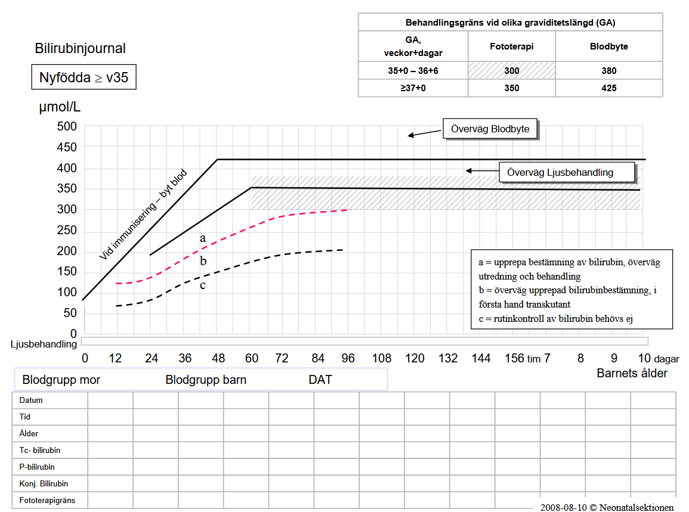

***Icke-konjugerat bilirubing***

* kan vara bröstmjölksikterus: det är lite oklart, man frågar om man ammar barnet. det är ngt som hämmar utsöndringen av bilirubinet, riktigt exakt vet man inte vad det är. Förr i tiden att man fick sluta amma o gav ersättning varåp man ser att ikterus försvann, men detta gör man itne längre, man utesluter allvarlig sjukdom först. 

***Barnet i detta fall***

* ***Konjugerat bili var 200, och totalt var 250***
* ***andel bilirubin: om över 20% konjugerat av total är det konjugerat som dominerande***
* ***Transaminaserna ALAT, ASAT, 2,3***
* **GT var förhöjt**
* ***PKINR 1.3***
* ***Albumin***
* ! **Vi har konjugerat bilirubinemi: varpå det är gallvägsatresi som man misstänka**
  * ***För att man behöver vitaminer KADE, så är det att vitamin K kan vara lågt varpå PKINR påverkat***
* ***HUR AKUT PROVERNA TAS***
  * **Iom att det är palperbar lever och ikterus, kan gallvägsatresi vara en differentialdiagnos, vapå man ska skicka in barnet AKUT.**
  * // notera att det är vanligt att känna levern under höger arcus, men det kan vara normalt. . . det är först efter att den är palperbar nedanför arcus. 
* ***Gällande bajset: föräldrarna har inte tänkt mkt på bajsets utseende, för deras barn är det normalt, vet ej att det ska bli lite mörkare. **

***Prover man vill ta***

* ***Hepatit prover: noterat att i anamnesen står att barnet vaccinerats, men det ska inte vaccineras sådär tidigt, varåp man bör testa den. ***

***Handläggningen***

* Gul bebis på BVC, man kan inte ta prover
* kan ej utesluta ngt utan proverna
* men man ska skicka in bebis till akuten med proverna. 
* ***Om man har ngn gg under vårdförloppet determienrat att det är under 20% konjugerat, så är det ingen gallvägsatresi***
  * om man tar prover efter en vecka och det konjugerade är lägre än totala 20% så är det ingen gallvägsatresi
* ***Efter att man skickat in, ser proverna***
* **gör en gallvägsscinitigrafi**
* ibland är det sårt att vara helt säker på att det är gallvägsatresi
* sedan intraoperativ scinitgrafi för att se
* först under operationen fattar man beslutet om kasai operation. 
* ! ***HUR LÄNGE FÅR MAN VARA GUL EFTER PARTUS: det är 2-3 veckor!  (men också att man kan addera 2 veckor till...)***

***Slutsatsen: barnet kan se bra ut, men man måste vara uppmärksam***

***Notera att man ger K vitamin spruta vid födsel***

**trots gallvägsatersi att de fortfarande kan växa lite, notera detta. **

***Om barnet är gult i mer än 2 veckor måste man utesluta gallvägsatresi mde prover, sen vid uteslutet kan barnet vara gult lite till***

### Fall 3 - Funktionellt dyspepsi

* ***9åå gammal flicka kommer till barnmottagningen med remiss fr allmänläkare***
* ***besöksorsak***: bybesök, remiss fr VC, frågeställning funktionella buksmärtor
* ***Socialt***: åtföljs av pappa, familj fr irak, flickan är 2/3 barn i sammanhåööen familj. spelar i ett fotbollslag 2ggr/v
* ***ärftlighet***: båda föräldrar har ahft magsår påvisat med gastroskopi för flera år sedan. efter beh besvärsfri, inga autoimmuna sjd
* ***tidigare sjd***: tidig väs fridk
* ***aktuellt***: 
  * återkommande buksmrätor halvår, Har under den senaste tiden klagat på ont i magen ett par gånger i veckan. Mår vid dessa tillfällen oftast illa och hon har kräktsnågon gång. Upplever att besvären förvärras efter matintag och aptiten är sparsam. 
  * Inga nattliga uppvaknanden pga smärta. Skolfrånvaro p.g.a.buksmärtorna ungefär två dagar per månad. Har under det senaste halvåret haft omväxlande hård och lös avföring(Bristol 2–6), frekvens 0–3gånger/dag.Inget blod i avföringen. Föräldrarna oroar sig för att flickan kan ha magsår
* ***Status***: 
  * AT: Ledsen, men opåverkat.
  * MoS: u.a.
  * Ytliga lymfkörtlar: Flera mm-stora körtlar i hals-och nackregionen.  
  * Hjärta: u.a.Lungor: u.a.Buk: Normalt utseende. Mjuk och oöm. Ingen uppenbar lever-eller mjältförstoring. Inga resistenser.Längd: 133cmVikt: 26kg 

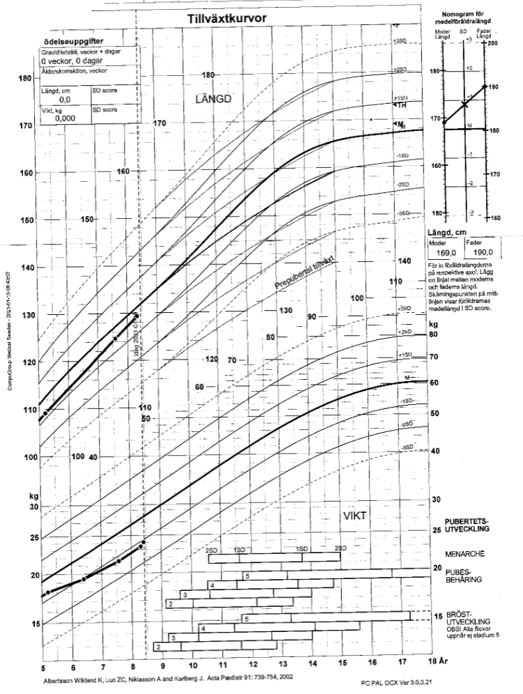

***Gällande tillväxtkurvan***

* ligger consistently på -1SD, enl föräldrar ska vara på +1SD
* ändå ingen cause for alarm?

***Differentialdiagnostiska överväganden***

* Längd + vikt + tillväxtkurva (se till att man får mätvärdena fr skolan också)
* ***Blodprover***: TSH, T4/T3 (TRAK, TPO?), blodstatsus (Hb, erytrocytindex), Ak-transglutaminas, elstatus, (CRP), B-glukos, (Vitamin panel inkl B12), (albumin för näringsstatus)
  * F-Hb prover, F-calprotectin, B-celler, gallsalter i faeces, elastas, **S-7OH-kolestenon C4**
* ***Fråga mer om kost***: hur äter han hemma och i skolan.
* ***Psykiatrisk anamnes***: hur går det i skolan är det tufft etc, diffa möjliga psykiatriska orsaker till tillväxtavplaningen. 
* ***Tarmbiopsi***: Detta kan vi göra i ett senare skede först efter att vi fått blodprovsvaren. 
  * Transglutaminas negativitet utesluter inte celiaki. 
  * Dock pga invasivitet, kanske vi bör beakta de andra differentialdiagnostiska möjligheterna först. 
* ***Mjölkallergi***: 
  * ***Utredningsmässigt***: 
    * ***Eliminera komjölk*** fr kosten och evaluera effekten därefter
    * **Elimination-provokation**. Komjölksallergi är en klinisk diagnos  som baseras på elimination av alla komjölksinnehållande produkter under  2-4 veckor, följt av utvärdering av symtomfrihet. Vid oklar effekt  provoceras därefter med komjölk, och om symtomen återkommer återgår man  till komjölksfri kost. För att vara meningsfull måste eliminationen vara strikt och helst ske med hjälp av en engagerad dietist. Vid  KMA-inducerad proktokolit ska blödningen försvinna inom 72 timmar med  extensivt hydrolyserad formula – om inte – behöver man gå över till  aminosyrebaserad formula och åter överväga differentialdiagnoser. 
      * det är oklart för mig vad gäller hur snabbt man kan evaluera effekten av detta 
      * Verkar som att efter 2-4v evaluerar man bara ***smärtsymptomen*** + evt förstoppningen (det kanske kommer bli ännu lösare efter att man sätter ut kömjölk)
    * **Hud-pricktest** kan vara av värde vid IgE-medierad allergi. 
    * **Allergenspecifika IgE-antikroppar** (RAST, ImmunoCAP) kan påvisas  vid snabba (IgE-medierade) reaktioner, men både falskt positiva och  falskt negativa reaktioner är vanliga. Positiv reaktion innebär att  barnet är sensibiliserat, men kan likväl i frånvaro av symtom, vara  kliniskt tolerant. Negativ reaktion kan inte utesluta KMA då andra  mekanismer kan mediera allergi, särskilt vid gastrointestinala symtom.  Komponentdiagnostik kan i vissa fall vara aktuellt.
    * **Hb, LPK, differentialräkning** (eosinofili), **S-albumin**.
    * **Endoskopi** med biopsier vid mer uttalade symtom, för att  differentiera mot exempelvis celiaki och IBD samt vid misstanke om  eosinofil esofagit och allergisk enteropati/colit/proktit.
    * **Patchtest** eller lapp-test kan övervägas framför allt vid icke-IgE-medierad KMA, men testets värde i diagnostiken är fortfarande oklar.
* ***Celiaki***: Glutenfri kost, vilket kmmer att kräva dietistkontakt. 
* ***Komjölks allergi***: föranleder också remiss till dietist, för att addressera matbehandlingen. 
  * Supposedly kommer detta ganska tidigt, enl Ricky, efter att man går över fr amning till komjölk. 
* ***Remiss dietist***: Först efter att man fått svaren fr utredningen. 
* ***Hypothyroidism***: om detta visar sig vara 
  * **Kongenital:** Upptäcks via neonatal screening där förhöjt TSH upptäcks. De sällsynta fallen av central hypotyreos beroende på hypofysär svikt (lågt TSH med lågt fT4) fångas därför inte i screeningen.
  * **Förvärvad:** Dålig längdtillväxt tillsammans med lätt viktökning, försenad pubertet. ”Vuxensymtom” på hypotyreos som trötthet, frusenhet, förstoppning, torr hud, bradykardi och håravfall är ofta mindre uttalade hos barn och kan bli tydliga först retrospektivt efter substitution med sköldkörtelhormon
* ***Endokrinologiskt***: verkar som att tillväxthormon bidrar mkt t tillväxten fr 2åå-puberteten. Initialt är det mkt födan som bidrar (tillsammans självklart )
* ***Gällande kurvorna***: om pat är under 3SD BMI ska han läggas in. 
* ***BÖS***: evt? för att diffa obstipation. 

***Gällande förstoppning***

* ***Symptom***

  * Förändrad avföring
  * Vid långvariga besvär kan barnet besväras av diffus eller  intermittent buksmärta, avföringsläckage, diarré (vid fekalom, s k  förstoppningsdiarre) samt enures, vilket gör symtomatologin bred och  anamnesen svårtolkad. 
  * Ofta gles och hård avföring, vilket  kan leda till smärtsam eller besvärande tarmtömning. En ond cirkel  uppstår ofta då barnet försöker hålla sig.  
  * Förstoppning  kan även föreligga hos barn som ofta går på toaletten och där det endast kommer lite avföring. En avföringsklump (fekalom) kan stoppa upp  passagen och rektum felaktigt fungera som reservoar och tänjas ut,  vilket kan leda till nedsatt eller upphörd tömningsreflex.  
  * Buksmärta, som kommer och går, eller är mest påtaglig efter matintag.  
  * Ovilja eller rädsla för att bajsa 
  * Klart ljusrött blod kan finnas i eller utanpå avföringen på grund av ytliga  fissurer. Blod i avföringen kan även ses vid komjölksproteinallergi och  celiaki.  
  * Enkopres (avföringsläckage). OBS! Detta sker  ofrivilligt. Vanligen i 3-6 års ålder. Palpera buken som ofta avslöjar  en överfylld tarm. 
  * Inkontinens och plötsliga trängningar eller [urinvägsinfektioner](https://www.internetmedicin.se/page.aspx?id=141).

* ***Diagnos***

  * **Diagnoskriterier (enligt de pediatriska Rom III-kriterierna, 2006) i frånvaro av organisk orsak:** 
  * ***< 4 år: 2 eller fler kriterier i en månad*** 
  * ***> 4 år: 2 eller fler kriterier i 2 månader***  
    -  ≤ 2 avföringar per vecka  
    -  Aktivt uppskjutande av tarmtömningen, ”håller tillbaka” 
    -  Avföringsinkontinens en gång/vecka  
    -  Smärta och/eller hård avföring vid tarmtömningen  
    -  Palpabel avföring i ändtarmen  
    -  Voluminösa tarmtömningar (risk för stopp i toaletten)
  * ***Funktionell förstoppning***
  * ***Funktionella orsaker är nästan alltid bakomliggande, oftast genom en kombination av  flera faktorer.*** 
  * ***Symtomdebuten sker ofta efter (1)-2 årsåldern:***
    * Som spädbarn kan övergången från bröstmjölk till purékost eller fast föda vara problematisk. 
    *  Otillräckligt med intag av fibrer och vätska eller en alltför stoppande diet. 
    *  Brist på fysisk aktivitet
    *  Ärftlig benägenhet
    *  Oregelbundna toalettvanor eller vid stress och lek där barnet inte tar sig tid att gå på toaletten
    *  Obekväm miljö på toaletter i förskola/skola eller stress och press vid potträning 
    *  Smärtsam eller obehaglig avföring vid exempelvis blöjdermatit, [stjärtfluss](https://www.internetmedicin.se/page.aspx?id=6786) och [analfissur](https://www.internetmedicin.se/page.aspx?id=1250)
    *  Akut uttorkning p g a feber eller vistelse i varmt klimat med otillräckligt vätskeinta

  * ***Utredning***
    * **Anamnes** 
      - **Symtomdebut**. Förändringar i  diet? Introduktion av nya födoämnen? Allmänna matvanor? Symtomens  relation till måltid. Vid tidig symtomdebut (< 6 mån ålder) bör man  fråga om tid för mekoniumavgång. Mekoniumavgång inom 24 timmars  utesluter i princip underliggande Mb Hirschsprung.  
      - **Allmänsymtom**. Karaktär av eventuella buksmärtor. Illamående och minskad aptit  vanligt. Feber och trötthet kan tyda på infektion eller systemisk  sjukdom. Kräkningar kan förekomma vid överskott/passagehinder. Fråga  därför efter blod eller galla i kräkningarna. 
      - **Avföringsvanor**. Frekvens? Konsistens; [bristolskalan](https://distriktslakare.com/bristolskalan/)? Utseende? Diarréer? Smärtor vid avföring? Måste barnet krysta?  Enkopres? Blodig avföring? Rutiner? Hur är toalettmiljön hemma/utanför  hemmet?   
      - **Miktionsvanor**. Urgency (plötslig kissnödighet)? Urininkontinens dagtid? Enures? Urinvägsinfektioner? 
      - **Tidigare sjukdomar**. Normal psykomotorisk utveckling? Allergi? Atopiska symtom som kan tala för födoämnesallergi? Normal längd/viktutveckling?   
      - **Ärftlighet**. Finns förstoppning i den närmaste familjen? Specifika mag-/tarmsjukdomar i familjen? 
      - **Psykosocialt**: Hur mår barnet? Trivsel förskolan/skolan? Aktiv eller stillasittande fritid? Misstanke om sexuella övergrepp?

***Gällande diarre***

1. IBS-D
2. mikroskopisk kolit
3. funktionell diarre
4. Kolerotisk diarre: Ökad gallsaltsyntes
5. celiaki
6. **alkohol:** En alkoholorsakad diarre. Störd tarmotilitet, 
7. läkemedelsassocierat
8. laxantia
9. bakteriell överväxt
10. hyperthyreos
11. Gastrinom (ökad gastrin     produktion)
12. vipom (ökad VIP produktion)
13. Strålskada
14. amyloidos
15. Giardia intestinalis
16. Tryponosoma trophyrema whipplei

***Diarre utredning (tenta)***

1. Anamnes

2. 1. Förg avföring: 

   2. 1. Svart, melena: Högre GI-blödning
      2. Klarrött: IBD, distal skada

   3. Slem: IBD,

   4. En fettig hinna på      toalettporslin: steatorre

   5. Tenesmer (smärtsamma kramper      med trängning, till defek): IBD

   6. Hereditet: IBS, malignitet,      celiaki

   7. B-symtom:      malignitet, IBD . . . Celiaki . . .

   8. Buksmärta: IBD, celiaki, 

   9. GI-besvär anslut thailand

   10. Aktuella lkm

   11. Aktuella sjukdomar

   12. Tidigare      bukopererad: malabsorptionssyndrom

3. ***Labbprover, om det är tre som     man ska välja***

4. 1. SR,
   2. Hb
   3. F-kalprotektin
   4. F-hb
   5. F-odling

***fr seminariet***

**Anamnestiskt**

* Förloppet av smärtorna, sociala förhållanden, slem i avföringen, svart eller mörk avföring
* Man kan försöka ta anamnes med barnet först, så att barnet pratar självt, för att man ska få en bild av barnet.,

***Vad som talar för IBS***

* Ingen betydande tillväxthämnnig
* växlande hård o lös avföring
* verkar ha blivit värre nu
* besvär vid matintag
* 6 månaders anamnes hos vuxna, men för barn är det 2 MÅNADER för rom kriterierna.
* // fråga efter om förbättras efter defekation
* // Rom kriterierna finns för barn också vad gäller IBS. 

***Differentialdiagnoser***

* IBD, IBS, 
* dyspepsi

***Dyspepsi***

* Man kan utöka anamnesen: framkommer att för'ldranra haft magsår tidigare som behandlats. Att komma fr Irak r riskfaktor för helicbactor pylori orsakad dyspepsi
* Funktionell dyspepsi är ingen uteslutningsdiagnos. Man ställer det på sympotmen. 
  * man ska ha gjort en lämplig utredning för att vara säker på att det inte är annan orsak
* Provsmässigt: CRP, SR tar man alltid. kan ta calprotectin (behövs ej om inte om man är säker åp sin sak att det är IBS och patienten inte har diarrer och viktnedgång) men om man har avförignsrubbning tar man calprotectin. 

***Vad är orsaken t gastroskopi på alla vuxna med magsår:*** ventrikelbaserat, för att man vill utesluta cancer. Detta är inte nödvändigt hos ett barn

* Test and treat finns inte hos barn. Misstänker man en helicobacter gastrit 

***Prover***

* Blodstatus, Hb, MCV, transgltaminas, CRP, SR, leverprover, f-calprotectin pga avföringsbesvären,  
* tar inte F-Hb åp barn, att barn har blod i avföring beror inte på cancer. ingår därför inte i utrednignen här i detta fallet. 
* ***Två anledningar att kontrollera helicovacter på barn***: järnbrist anemi behandlingsrefraktär men återkommer hela tiden, eller att ngn förälder har en helicbacter associerad cancer i ventrikeln (i detta fallet har föräldrarna bara haft magsår inte cancer. )

***Sammanfattat***: vi kan ställa diagnos på symptomkritereir efter intervju, om det är funktionella besvär om funktionell dyspepsi eller IBS. 

om man tror att det är funktionell dyspepsi ska man säga det till familjen, men att man tar proverna för säkerhetsskull. 

***Röda flaggor***

* Tillväxthämning
* Viktnedgång
* blod i avföring
* nattliga besvär: bajsa på natten
* långdragna kräkningar
* ärftlighet för inflammatorisk tarmsjd, IBD eller magsår, eller celiaki = red flag 

***Vid dessa redflags går man vidare med gastroskopi:*** då försöker man diffa en massa diagnoser. 

Om alla prover är negativa och röda flaggor är negativa, så stälelr man diagnos funktionell dyspepsi

***Sammanfattat igen:*** i detta fall börjar man med att behandla för förstoppning med movicol, för förstoppning. hon får bättre avföring. men efter 3 måander tillbaka besvären, varåp detta är IBS-förstoppning

### Fall 4 - IBD

* ***15 år gammal pojke, söker akut till din vårdcentral där du arbetar som allmänläkare***
* ***Besöksorsak***: trötthet, yrsel
* ***Socialt***: Skilda föräldrar, bor en vecka i taget hos fadern respektivemodern. Hartre yngre halvsyskonoch ett äldre. Mycket fysiskt aktiv, spelar ishockeydagligen. Har sökt till ishockeygymnasium.
* ***Tidigare sjukdomar:*** väsentligen frisk
* ***Aktuellt***: Har de senaste veckorna efter att ha varit förkyld varit tröttare än vanligt enligt fadern. Har dock kunnatfortsätta med sin barmarksträning under den senaste veckan och var idag med fadern för att spela golf. Fadern märkte då att han inte orkade resa sig efter att han suttit ner varför man nu söker akut.Vid förfrågan framkommer att han ibland känner sig bubblig i magen och att han den senaste tiden haft lösare avföring. Har enligt fadern gått betydligt oftare på toaletten än tidigare. Sonen har enligt pappan gått ner 3-4 kg i vikt under sommaren.
* ***Status***: AT: Relativt gott, ger god kontakt. Blek. Bleka konjunktivor. Vikt: 57 kg Längd: 170 cmMoS: blekt och oretat.Öron: bilat u.a. Hjärta: systoliskt blåsljud över hela precordiet. RR. Frekvens 100 slag/min.Lungor: Normala andningsljud. Buk: mjuk, ingen lever-eller mjältförstoring, ingen påtaglig ömhet. Rektalundersökning: ej undersökt.

***PBD***

* 15åå pojke, söker akut pga trötthet, diarrer, viktnedgång senaste (veckorna)? Idrottat mycket ute under sommaren. Nu fått diarrer, bubblighet i mage, AT blek, hjärta systoliskt blåsljud över hela procordium med 100 slag/min. Gått ned 2-4kg över sommaren. 
* Anamnes och status talar for dehydrering orsakat av diarresjukdom med oklar genes. Ett antal möjligheter differentialdiagnostiskt vad gäller diarren och bukbesvären kan man beakta (inkl. celiaki, laktosintolerans, atrofisk gastrit, gastroenterit, ). Hjärtfynden kan tala för dehydreringstillståndet, men utesluter inte annan genes, varpå dessa bör iaktas. 
* I nuläget behöver hans dehydreringsstatus åter bedömas. möjligen 5% dehydrering med tanke på viktnedgången.
* Alarmsymptom bör beaktas. 
* På VC tar vi: temp, kapillärt Hb + kapillär CRP. 
* Utefter värden på VC, välja att skicka patienten med vätskebehandling. Pat för rehydrera sig själv starkt, iom flera tecken på (kraftig) dehydrering. Framgår det tecken på anemi skickar vi in patienten, för rehydrering och vidare utredning. 

***Differentialdiagnostiskt***

* Detta är ett IBD

***Blodprover***

* Trombocyter 500, normal lever, CRP 14, 45Hb -> ska skickas in akut för att få blod. 

***Vad som händer när han kommer in t akuten***

* Så lågt Hb vill man blodgruppera honom BAS bestämma hnm, för att han ska få ransfusion och rehydrering
* diskuterade när man ska sätta in behandling, för att misstänkte att det var en IBD
  * verifierar diagnosen med biopsier. 
  * man vill sätta in glukokortikoider för att behandla ett skov för IBD
  * i detta fallet: där han är så pass sjuk, är hans tarmslemhinna väldigt sjuk, 
  * Ett till prov: är odling i faeces
  * Calprotectin: gör ingen skillnad varifrån inflammationen kommer ifrån. Det är ett prov som är sensitivt men inte specifikt (kan förhöjas av förkyuld o feber). har man ett lågt calprotectin har man just då ingen inflammation i tarmen. 
  * Blåsljudet: efter att man ger blod borde blåsljudet försvinner, det kan vara av anemin blåsljudet kommer. 
* i detta fallet göra gastroskopi + kolosopi ASAP, så att man kan lägga in behandling så snabbt som möjligt
* alla barn under 18 sövs uinder gastroskopi o koloskopi. Det kräver en narkosläkare för att söva patientne
* denna pojken hade en totalkolit! man tog biopsier, gastroskopin såg bra ut, då var det dags att behandla
  * Glukokortikoider som behandling. 
  * beroende åp ulcerös kolit eller crohns
  * UC: kan ge 5-ASA som underhållsbehandling
  * Salazin dosen... basbehandling

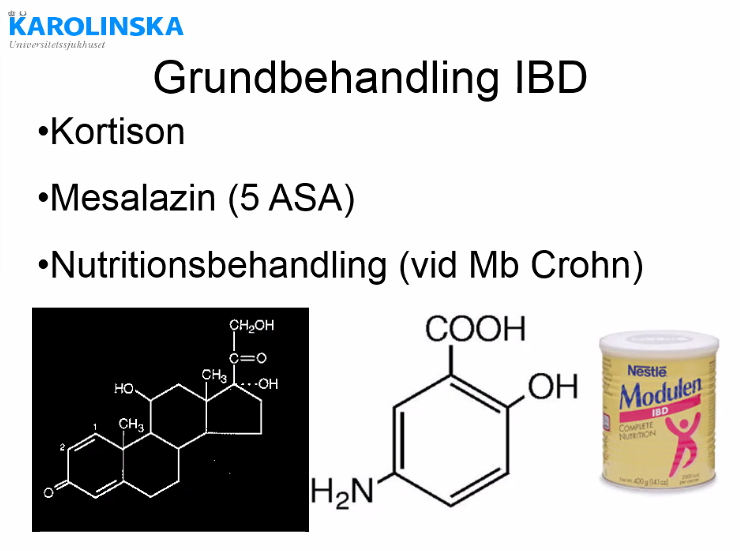

* Kortison = skovbehandling
* 5-asa = underåhllsbehandling
* nutritionsbehandling vid crohns (annars är UC o crohn densamma): detta för att man ska ta flytande kost i 6 veckor, näringsdrycker under dagen, inte vanlig mat. kan tugga tuggummi o klara drycker, inte vanlig mat. Detta täcker dygnsbehovet för energi, det räknar dietisten ut. Detta för att lika effektiv som kortison. det är lika många som svarar på nutritionsbehandling som kortison, har en immunmodulerande effekt som man inte vet i detalj. barnen gillar kanske inte att enbart dricka mat i 6 veckor. 

Vid svår IBD: täta kortisonklurer eller att man inte kan trappa ut

* azatioprin: dämåar immunförsvaret ännu mer än vad 5-asa gör..., kräver regelbundna blodprover för att inte få neutropeni
* TNF-blockare: det är steget upp i trappan. ger ibland osså vid akut insjuk skov som inte svarar på kortiosn. Detta är en av de saker som man kanske kör igg med först. 
  * infliximab-remicade: antikropp som neutraliserar inflammatoriska substanseran i blodet
  * ges som IV infusion. kommer till dagvård o får infusionerna. 
  * Biverkningar: allergiska reaktioner, samt det dämpade immunförsvaret som de ska vara medvetna om. Blir de sjuka i annan infek kan man pausa TNF-blockaden
  * ger subkutant osså varannan vecka, det kan patienten göra hemma osså
* finns andra varianter biiologiska läkemedel osså
* sen är det klart att några är svårbehandlade: kirurgi vid barn o ungdoms IBD är sällsynt, det tror man beror på läkemedeln. 

***Gällande tillväxten***: har man svår sjukdom med många behandlingar så kanske man förlroar ngn centimeter i längd

***Typisk debutålder:*** i tonåren. Enstaka förskolebarn

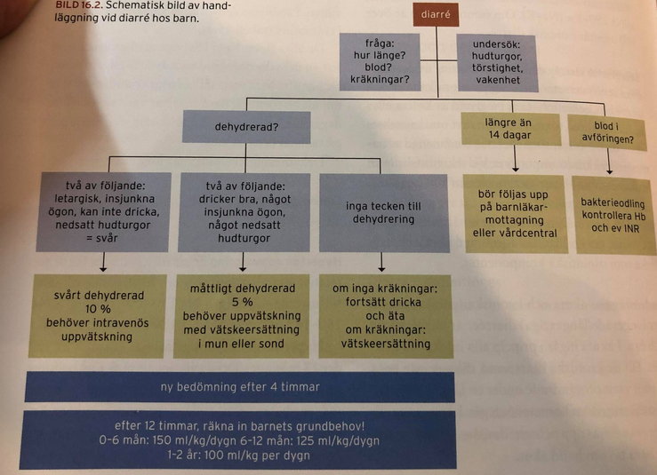

# BUP seminarium

## Fall 1

Patientfall 1 En 3-årig pojke A remitteras från BVC till BUMM, där du arbetar. A bor tillsammans med sina föräldrar och lillebror 6 månader. BVC-sköterskan har reagerat på att A inte verkar reagera på sitt eget namn. Hen har misstänkt en hörselnedsättning, och A har remitterats för hörselundersökning. A verkar allmänt sett utvecklas väl. Han följer sina tillväxtkurvor, och den grovmotoriska utvecklingen är normal. Fadern berättar att A är en mycket aktiv liten kille, han ”klättrar på allt och springer omkring hela dagarna”. Det har blivit svårare att ha uppsikt över honom sedan lillebror föddes. Det har hänt att han sprungit iväg från föräldrarna. Personalen på förskolan har kommenterat att A har svårt att sitta stilla i samlingar, ofta försöker han krypa iväg när avdelningen har samling på morgonen. Det är svårt att undersöka A, han verkar orolig, avvärjer dina försök att komma nära. Han har med sig ett gosedjur som han stryker över kinden, fram och tillbaka. A är i rörelse hela tiden, och har en del ovanliga rörelser, bl a viftar han med händerna. 1.    Är det något i fallet du tycker är avvikande? Varför, varför inte?2.    Hur handlägger du detta ärende? 3.    Vilka råd/besked ger du föräldrarna?

#### Ngt som är avvikande

* Viftning med händerna, sedvanligt, 
* stryker fram o tillbaka
* ingen ögonkontakt, främlingsfara etc: dock detta kan vara normalt i en undersökningssituation. 

#### Vidare undersökning och utredning

* Familjeanamnes
* Hörselundersökning: kolla om det finns ngt som tyder åp att han har en hörselskada. Uppmärksamhetstest för att se om man kan fånga den
* **Anknytning och socialt samspel:** Hur han leker, om han leker sj eller med andra barn. 
  * kan ha debuterat när lillebror föddes, inte var aensambarn längre. 
* ***Röda flaggor***
  * ngt i beteendet som ändrats
  * funnits saker som barnet kunnat som plötsligt inte kan längre
  * **remittera till barn neurolog:** baravvikande i neurostatus, assymmetriska rörelser, 
  * ngt som inte fungerar i vardagen, där ngt låser sig, social kontakt
  * intresserade av andra barn, intrsserad av samling andra sosciala sammanhang. 
  * språkligt kan man fråga om. 
    * 3-ordiga meningar. 
  * ev remiss logoped, språkförsening?
  * ev remiss t BUP: e.g. utvecklignsavvikelse (autism?), eller barnpsykiatriskt
  * man kan skicka remiss fr BVC t BUMM.
  * BUMM har också uppdraget att utreda ADHD
  * men BUP utreder både ADHD och autism

***Hur tidigt ställa diagnos autism***

* Såhär tidigt kan man misstänka X diagnos, misstänkt neuropsykiatrisk diagnos
  * sker i samband med att man börjar förskola, iom att man jfr med andra barn. 
  * man ser toppar BUP: att det är lågstadiet, mellanstadiet. att man kan ställa diagnos tidigt. 
  * kunskapen om neuropsyk hos familjer o samhället ökat, så barn kmr tidigare t diagnos än förr. 
  * KUnskaps
* 

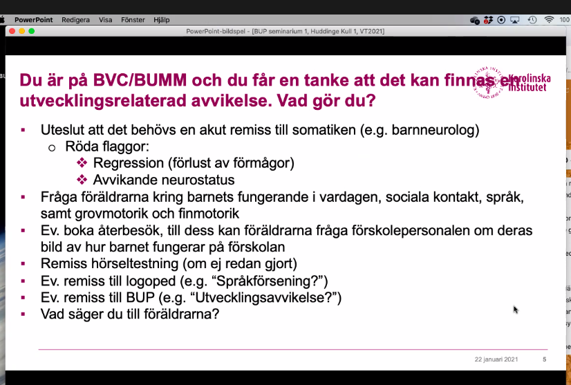

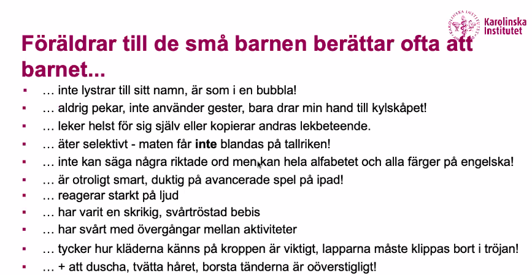

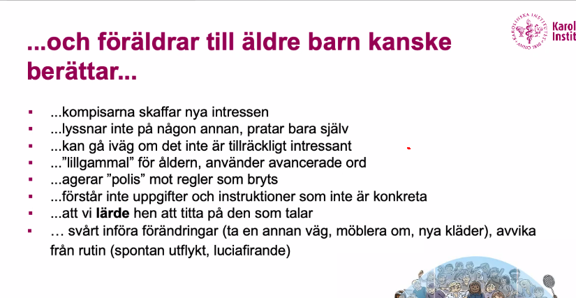

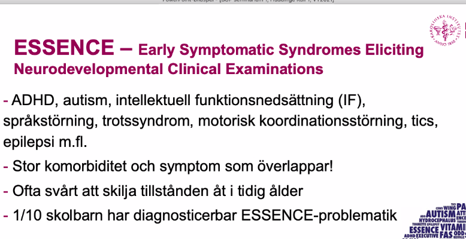

***Stor komorbiditete***

* Hos små barn svårt att diagnosticera. I detta fallet exmepelvis kan man inte tänka på spec diagnos, utan man ska tänka att ngt verkar avvika i fallet.
  * därför börjar hröseltest, logoped, fördjupad anamnes, skicka till BUP för att utreda vidare. 

## Fall 2

vå föräldrar söker vårdcentralen med sin 14-åriga dotter B. B har alltid haft lätt för sig i skolan, och haft bra betyg, men har ”halkat efter” de senaste två månaderna. B är intresserad av matlagning, hon letar recept och har lärt sig laga mat på egen hand genom att titta på filmklipp. B lagar gärna mat och bakar till familjen, föräldrarna och en äldre bror. B själv har blivit vegetarian för ett halvår sedan, och funderar nu på att gå över till att vara vegan. Nyligen har föräldrarna börjat misstänka att B inte äter så mycket som hon borde. B har ett stort dansintresse, och dansar flera gånger i veckan på en dansskola. Hennes dansgrupp har nyligen kvalificerat sig för EM i discodans. Vid undersökning finner du att B är avmagrad, längd 165 cm, vikt 40 kg. Hon är perifert kall, trots att hon är varmt klädd med två stora tröjor.Lite motvilligt berättar B att hon fick sin första mens i 11-årsåldern, men att hon nu inte haft mens ”på ganska länge”. 1.    Hur handlägger du detta ärende?2.    Vilka råd ger du till B och hennes föräldrar? 3.    Vilken behandling skulle du rekommendera B?

#### Frågor

* Psykiatrisk anamnes
  * dysmorfofobi
  * rädd för att väga mkt
  * sj upplever om hon får ångest om hon inte räknar varje kalori
  * förekommer insikt
  * **får du ångest om du går upp i vikt:**
  * **"Får du ångest om...:"** du inte kan planera middagen, gå upp i vikt, problem med maten. 
* kompensatoriskt beteende: kräks hon, diuretika bruk
* Utlösande trauma, ngt som hänt senaste två månaderna
* prata enskilt med henne
* vad har du ätit idag och igår. 

#### Handläggning

* Labb: 
  * elektrolytstatus, 
  * 
* medicinsk utredning på vårdcentralen: om somatiskt frisk skickar till BUP eller ätstörnignsklinik direkt. 
* Tidsperspektiv: 
  * om självskadebeteende, suicidtänk är det mer bråttom
  * man vill att patienten ska få hjälp snabbt, då det påverkar prognosen
* hur snabbt viktnedgången gått: kan påverka hur akut man handlägger skiten

Vad ska familjen göra under tiden

* berättar att det är en ätstörning
* berätta det tidigt
* finns det en person med ätstörnign orskaar mkt lidande, man ska bekräfta dem med det att det är en svår situation
* externalisera ätstörningen, 
* man prtar om att ätstörnignen gör det svåtr för dig eller barnet att äta adekvat sätt.
  * kom ifrån "varför vill du inte", man ska komma ifrån skuldbeläggande
* förmedla hopp, finns bra vård att få
* eftersom ätstörningen finns, är det svårt för barnet att äta tillräckligt mkt
* man behöver äta 3 huvudmål om dagen eller mellanmål
* se till att det blir så. 
* föräldrarna är en riktig resurs
* VAB intyg gör en skillnad
* remiss dietist gör också hjälp
* 

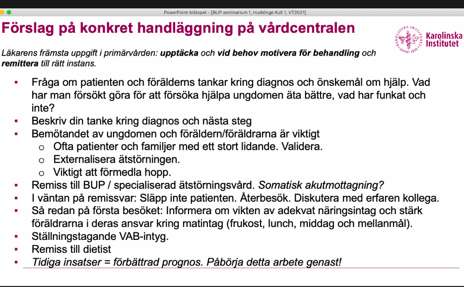

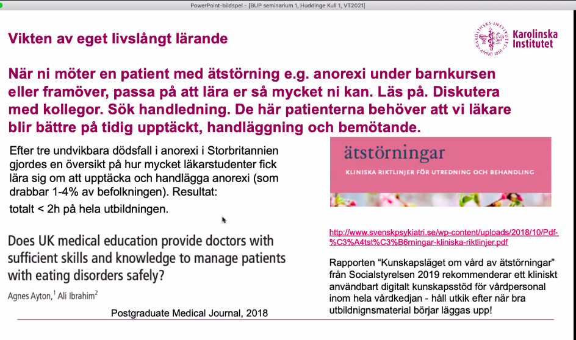

"Josefin Ivarson" kontaktperson för slides. 

## Fall 4

D är en 11 år gammal flicka som går i årskurs 5. D brukar gå till skolsköterska flera gånger i veckan p g a huvudvärk eller magsmärtor. Efter en tid frågar skolsköterskan lite mera om hennes allmänna situation. D bor tillsammans med sina föräldrar. Hon har två äldre halvsyskon som är utflugna.D berättar att hennes mamma har varit inlagd på en psykiatrisk klinik ”ganska länge” pga sömnproblem och ”konstiga tankar”. Mamman har berättat för D att hon själv (mamman) och D är ”speciella personer med en särskild uppgift” i världen. De här konstiga tankarna försvann medan mamman var inlagd på sjukhuset, men när hon kom hem slutade hon att ta sina mediciner. Efter ett tag började hon ”prata konstigt” igen, och har sagt att hon ska göra illa sig själv.Pappan är säljare och reser mycket i sitt jobb. D är nu orolig för att vara ensam hemma med mamman, när pappan reser bort. 1.   Som skolskötersna, hur ska du handlägga detta ärende?2.   Vilka myndigheter/samhällsinstanser bör du samverka med?

* man ska göra akut orosanmälan
* ringa socialtjänsten på jouritid för att se till att barnet blir omhändertaget. 
* saker kommer att ske ganska omgående. 
* ser man inom ngn vecka tt det är ett barn som mår dåligt, då sickar man remiss direkt t
* Det är socialjouren som har ansvaret för dessa barnen, så man ringer det direkt
* man ska ringa och rådgöra direkt, inte skriftligt, 
* man kan konsulterad em anonyumt om man inte uppger barents identitet. 

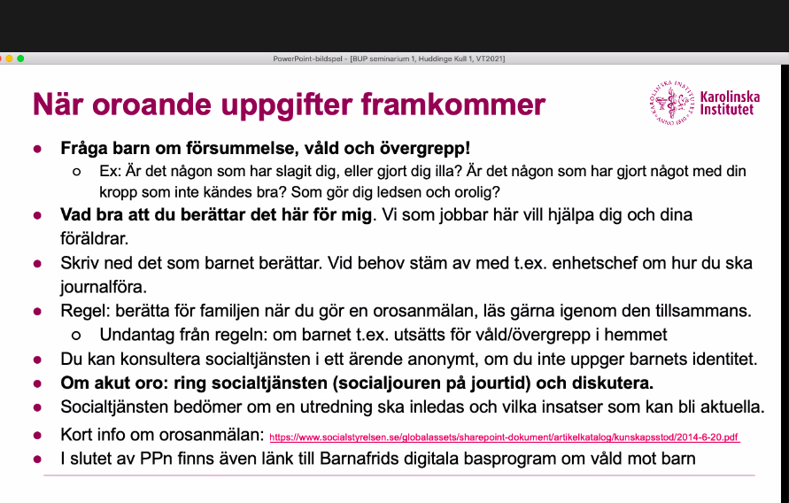

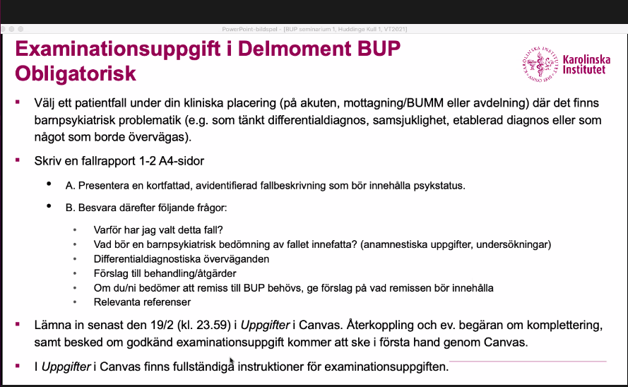

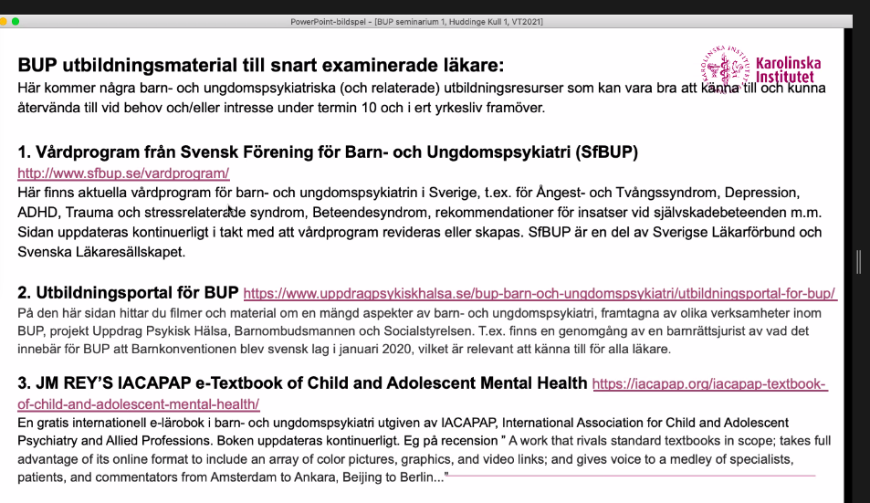

# Astma och allergi

### Fall 1

Du är jour på barnakuten och en 8 månaders flicka kommer in pgafeber och andningsbesvär sedan 2 dagar. Hon är rosslig och hostig, har jobbigt att andas och föräldrarna har noterat att det stundom piper ur luftvägarna när hon andas. Hennes temp är 39,4.1.Vilka andra anamnestiska uppgifter kan vara viktiga?2.Vad fokuserar du på i den kliniska undersökningen? 3.Vilken behandling ordinerar du på akuten?4.Vilka är dina differentialdiagnoser?

***Kompletterande anamnes***

* **Tidigare andningsbesvär?**
* **Hereditet?**
* **Atopiskt eksem?** 
* **Födoämnesallergi?**
* **Prematuritet? Neonatalperiod?:** större benägenhet av denna nadningsbesvär vid infektioner med obstuktivitet, med indragningar och pip i bröstet. 
  * barn med PBD bronchopulmonell dysplasi, att man har fått syragas upp t 36v har högre benägenhet för obstruktivitet och problem med luftvägsinfektioner med obstruktivitet under denna period. 
* **Allmäntillstånd?** 
* **Orkar äta/dricka? Kissat?**

**Hur bedömer du barnet akut?**

* **Andningsfrekvens**
* **Indragningar –intercostala, jugulära?**: 
  * interkostala indragningar
  * subkostala: att det är under kosta ui magen indragning etc
  * jugulört: högt andningshinder och drar motstånd övre luftvägarna är det jugulärt hinder, att det blir en grop suprasternalt när de andas in. 
* **Bukandning och/el näsvingespel?**
* **Sibilanta ronki?**: pipande visslande, kommer klassiskt på utandningen,
  * man pressar på utandninen: fysiologisk reflex att man behåller mer luft, att man infleras, att de andas ytligt, vågar inte och kan inte vara helt avslappnat perssa u allt luft de har frör att det blir svårt att pressa upp igen, varåp håller kvar luft i perifera luftävgarna så att det inte kollaberar, 
  * därför andas med lite stängd mun så att bygger upp intrathorakala trycker
  * vill behålla ett PEEP tryck, ett endexpiratoriskt tryck som bibehåller alveolerna med en viss öppningsgrad. Detta kan man se rent på barnets hållning hur det andas, att det är hyperinflerat.
* ***Röntgen***: kunan se om det föreligger ***hyperinflation***. Så man kan fråga efter hyperinflation. 
  * tittar på diafrgmavalven på sidoprojektionen. 
* **Stridor? –expiratorisk el inspiratorisk?**: andningsljud på inandningen, att det tyder på övreluftvägsobstruktion, konstrktion. 
  * titta övre luftvägarna alltså. 
* **Hosta? –torr, rosslig/blöt, skällande?**: 
  * ***Torr hosta***: som regel är det en icke-produktiv torr hosta hos obstruktivt barn
  * hos en del barn är det bara hosta man ser hos barnet, vid obstruktivitet. 
  * ***Hosta på nätterna*** är också ett bra tecken. att de hostar inpå småtimmarna med hostan. 
  * persisterande en.eten natthosta är ett tecken på **obstrutkvitet, där astmabehandling kan hjälpa, även om ingen akut dyspne**
* **Kroppshållning –hyperinflaterad?**
* **O2-saturation?**
* **Allmänpåverkan?**
* **Feber?**
* **Tecken obstruktivitet**: pipig utandning, ronki vid auskultation. 
  * pipighet förklaras av att det är trångt i luftvägarna. 
  * högfrevkenta biljuden att det är trångt att komma fram. 
  * Trötta, kan vara dehydrerade
  * högre andningsfrekvens
  * saturation kan gå ned. 
  * **Två viktigaste parametrarna på akuten:** är barnet syrgaskrävande, vad är det för andningsfrekvens

***Differentialdiagnoser***

* pneumoni: denna typ andningsbesvär, men att det är infektiöshärd i lungorna, men at kan te sig på detta sättet
* bronkioliten: RS-fall och RS-bronkioliter. Ter sig osså sågär, låter annorludna auskulterar, inte så hög feber, yungre än den här flickan. 
  * svårt diffa förkylningsastma och en bronkiolit
* krupp: men det är karakteristiskt mer

**Förkylningsastma, barnastma**: börjar i denna åldern, i.e. 8månaders ålder. infektionsastma alltså. 

**Ev provtagning och röntgen**

**Blodprov:**

* **CRP** 
* **Ev blodgas** 
* **Virusdiagnostik** –nph (RS? Rhinovirus?)
* **Lung-röntgen** –Infiltrat? Bronkväggsförtjockn? Hyperinflation?

***Behandling av akut astma / obstruktiv bronkit?***

* ***syrgas är nummer 1:*** 
  * om hon desat, glöm ej bort d, att man gör d direkt när barnet kmr gm dörren, ser desat. 
  * gränsen för syrgas = under 92% ger man syrgas. 
  * ***Sätt att ge:***  
    * **kan ge på grimma**: via näsborrarna
    * **kan ge på mask**, men mkt går förlorat
  * **Hur mkt man ska ge:**
    * näsgrimma: aldrig mer än 2L per minut, kanske bara 1L per minut; om det blir mer blire för torrt och obehagligt, ch skapar i sig en nose-block. 
    * Högflödesgrimma med uppväörmd i befuktad luft: kan man ge högre flödn
    * på mask: upp t minst 5L-10L per minut på mask. 
  * ***Möjligheter att ge läkemedle***
    * ***högflödesgrimma***: då kan man sätta nebulisator för att ge lkm, men inte alltid det är så fallet
    * ***om vanligt grimma***: kan man ge den vid sidan om grimman...
  * ***Partialpressures***
    * prematurfödda o nyfödda finns inget poäng med tt ge överflöde surgas, för att då inducerar oxidativ stress, med fria syreradikaler, inflamamtion etc, 
      * då är det 21% o2 som gäller.
      * prematurer inte högt syrgas i onödan: kan skada retina, andra organ osså, med tanke på långtidsbehandling
    * om det är akuta fall, behöver man inte fundera på långa konsekvenser, det är först efter tt man ger för länge som skadan kommer. 
* **Luftrörsvidgande / Inhalationsbeh**:-
  * **beta-2 agonist**: kortverkande beta2 agonis. 
    * kan ge var 20e minut
  * **adrenalin**: detta är verkligen luftrörsvidgande, har en slemhinneavsvällande effekt. den verkar på alpha o betareceptorer. betareceptorer är som beta2 agonisten verkar på. men den kmr osså verka på alfa2 receptorer i kärlen, varpå konstriktion, o minskar ödemen. 
    * riktigt små barn är adrenalin mkt bättre
    * adrenalinet piskar på hjärtat o höjer BT, så man ska vara varsam
    * man ska inte ge om det inte föreligger additiv effekt
  * **antikolinergika**: ipratropiumbromid
    * sällan man börjar med
    * har bra additiv synergistisk effekt.  effekt till beta2 agonist
    * kan ge bara 4 ggr per dygn
  * **natriumklorid**: mest slemlösande
  * ***Barn under 6 månader:*** första hand adrenalin
    * ett mindre barn 11mån, som har nästäppa o trånga övre luftvägar,. att adrenalin bättre effektivare val än Beta2 agonist, se fall til lfall
    * på allra misnta barnen, sällan att de drabbas av astmaliknande bilden, det de får i större utsträck är virusbronkiolit av RS, ***där hjäölper inte allas med beta2 agonist, så man behöver avsvällande effekten, med adrenalin***
  * ***Barn över 6 månader***: förta hand beta2 agonist, andrahand adrenalin. 
  * ***För kruppen:*** det är bara adrenalin som hjälper, för att beta2 enbart fungerar på btronkträdet som inte finns i övre luftvägarna, varpå adrenalin långt mkt bättre för att man vill ha den avsvällande effekten. 
* **Steroider (kortison)**
* **Uppvätskning**
* **Magnesiumsulfat i v(?)**

***Kriterier för inläggning?***

* **Otillräcklig behandlingseffekt**
* **Fortsatt behov av täta inhalationer (**> var 3:e tim)
* **Otillräcklig syresättning** (SaO2 < 92%)
* **Påverkat allmäntillstånd**
* **Orkar inte försörja sig per os**

***När går hem***

* utrustar små barn med sprayer, som man kan ge hemma, få på akuten
  * spacer med ansiktsmask
  * och så har man lfuitfrörsvidgande med ermyl
  * och en flutid, som är kortison
  * den oranga och den blå
  * förkylnignsastma drabbar 20-25% av svenska barn, så många hem har den. 
  * spacer som man använder mkt under förkylnign
  * de smo får det ofta, använder mer 
  * montelucast sindulär kan man addera om det inte räcker. 

***Vid hemgång? Behandling:***

* Beta2-agonist (regelbundet alt v b)
* Inhalations-steroid –kontinuerligt el intermittent?
* Leukotrien-receptor antagonist (montelukast)
* LABA (långverkande beta2-agonist); > 4 ååUppföljning:Remiss till Barnläkarmott 

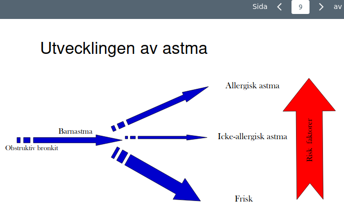

Faktorer som ökar risken för bestående astma:
* Hereditet för astma eller atopiAnnan samtidig atopi (allergi el eksem)
* Astma orsakad av annat än luftvägsinfektion (ex ansträngning)
* Sensibilisering mot luftvägsallergen
* Rhinovirus-infektion?
* Rökning –passiv och aktiv

### Fall 2

Fall 2: 11 mån flicka Helammas till 5 mån ålder. Lindrigt atopiskt eksem sedan 2 mån ålder. Behandlad med mjukgörande och kortisonsalva (grupp I/II) lokalt. Inga tillväxtrubbningar.Har haft upprepade (x 5) episoder med urtikaria av oklar genes.  Hon kan äta mjölkprodukter utan besvär, men vägrat pannkaka. Ännu inte fått pröva nötter. 

* ***atopiskt eksem:*** verkar ha ett atopiskt eksem

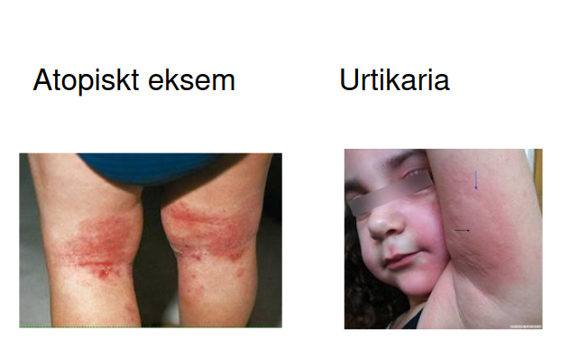

***Utvidgad anamnes?***

* Hereditet?
* Koppling till födointag?
* Mag-tarmbesvär?

***Utredning***?

* ***Prick test: för specifika födoämnen***
  * förr gjorde man mkt pricktest
  * kräver en del kunskap för att göra det effektivt
* ***IgE-analys (RAST) i blod***
  * nu börjar luta sig mer mot IgE analyser
  * blodproverna kan få svarp å mkt mer 
* ***Komponentanalyser***
  * om spec allergi, eller att det är korsallergi mot ngt annat
  * om det är björkpollen allergi, är det nästan alltid att man får klåda munnen, obehag när man äter nötter: då vet man ej om det är nötallergi eller om det är krosallergi fr björkpollen
  * // tidigare vg jordnöt att björkpollen allergiker felaktigt var jordnötallergikenr o fick epipenna ,etc när det bara var krosallergi
  * men idag kan man med blodprov se att det är IgE antikroppar mot jordnöt att dt är farlig allergi, men andra komponenter som kan vara pos etc. så att det är korsallergi att det inte är lika allvarligt, 
* ***vissa barn***
  * får kanske bara kräkning, kanske
* ***elimination-provokation***
  * han menar att man gör elimination mest på mjölkallergi misstanke på små barn för att testerna ofta falskt negativa etc. 
  * provokation är enbart när en allergi är på utgång, etc. 

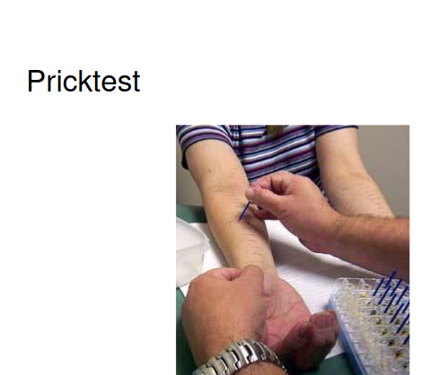

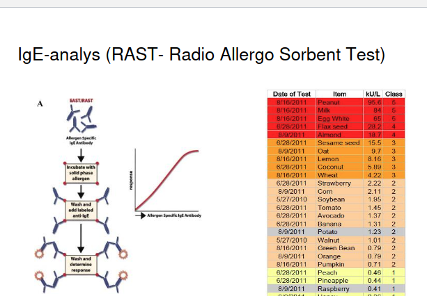

***Atopiskt eksem***

* Klinisk diagnos 
* Finns inget specblodprov el test
* ***Krävs att barnet har en <u>kliande hudsjukdom</u> samt 3 av följande:***
  * Tidig debut <2år 
  * Hereditet för atopiom barnet < 4 år eller samtidig astma/allergisk rinit
  * Tendens till torr hud senaste året 
  * Karakteristisk åldersbetingad morfologi 
    * mindre barn: eksem i ansikte, kinder och extensorsidor av extremiteter. 
    * större barn och vuxna: eksem i böjveck och ansikte/nacke

***Vilken behandling?***

* **elimination av ägg**, undvika ägg
* **Mjukgörande**
* **Steroidsalvor** (”kort men starkt”)
* **Anti-histamin**: utrusta föräldrarna med anti-histaminer för den allergiska reaktionen
* ***betapred o kortisontabletter***: att man ger med .. starkare reaktioenr
* ***om anafylaktiskt***: epipenna, autoinject,
* **Dietrestriktioner** -dietisthjälp

***Prognos***

* ***God, avseende äggallergi.*** 
* ***Atopiskt eksem ofta bestående,*** men brukar minska
* ***komponentanalysen hjälper:*** 
  * om pos 5o-albumin är det mer permanent svårare allergi, 
  * om ej pos, kan växa bort vid 3-4åå. 

***Uppföljning***

* ***Barnläkarmottagning***  
  * –förändrad klinik över tid
* ***Återbesök var 6-12:e månad***
  * årligt prick-test
  * alt IgE nivåerna
  * att man ser om skiten försvunnit bort eller ej
  * ta ställning när man ska återintroducera. 
* ***Ev äggprovokation vid 2-3 åå***
* dietistremiss vore nice osså

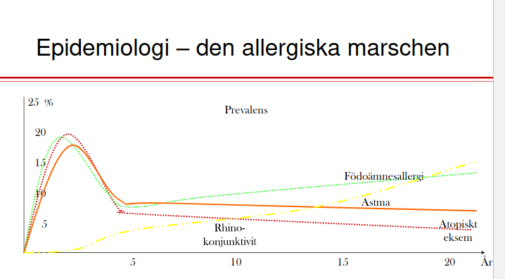

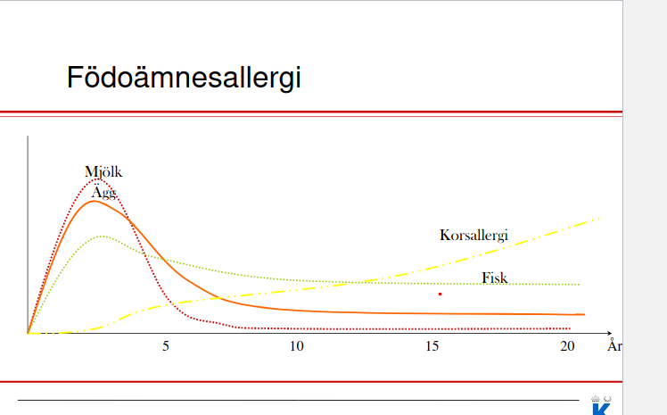

### Fall 3

Fall 3: 14-årig pojkeKommer på remmis för optimerad behandling. Sedan 4-5 åå besvär av rinokonjunktivit  och trötthet mellan april-augusti. Tagit anti-histamin intermittent.  Senaste året besvär av kronisk rinit. Tränar innebandy 4-5 ggr/v och besväras ofta av andfåddhet.

***Vilka allergier kan misstänkas?***

* ***Både pollen*** (björk, gräs och gråbo) 
* ***samt perenn*** (pälsdjur, kvalster, mögel): 
  * att det är allergi som dragit över året, längre än säsongbudnet i.e. perenn för åretrunt
* ***Man kanske är kvalsterallergisk vår breddgader, men gillar inte kallt o torrt, i skåne blir ett problem***
  * har man problem med kvalsterallergi o bor i sthlm, har man förmedlingen dålig ventilation i bostaden, att det är för fuktigt. 
  * Cockroach allergi, jättevanligt, men inget som vanligt.. . 

***Vilka prover?***

* Prick-test och/eller IgE-analys (RAST)

***Misstanke om astma –tester?***

* ***Spirometri med reversibilitetstest***
  * FEV1: ska vara över 80% av det förväntade
    * om under 80% talar för obstruk, vilket är att man inte får ut volymen i tid
  * Sätta FEV1/VC, sätta i relation med vital kapaciteten: är man restritkvi och små lungor, då kan man få falskt skit. harm an VC på 50% då kan man inte få ett FEV1 som är särskilt bra, då ska man sätta den i realtion med vital kapacitet. 
  * FEV1/FVC = 0.85 är normala
  * om FEV1 är60% verkar obstuk, men FVC är 60% då är pat ju restriktiv. 
  * ***Även om spiron normal utesluter ej astma***: kan vara bra vid tillfället. 
* ***PEF*** (PEF-kurva)
* ***Utandat NO*** (kväveoxid)
* ***Ansträngningstest***
  * testcykel eller löoband, 80% arbetsbelastning, och blåsa spiro fortlöpande, innan och vid maximal trötthet, för att se om spiron förändras
  * alla blir andåfdda o dyspnoiska av ansträng, men frågan e om lungfunk försämras efter detta
  * är man dyspnoisk bara, utan påverkan lunga, efter ansträng är det inte astma.

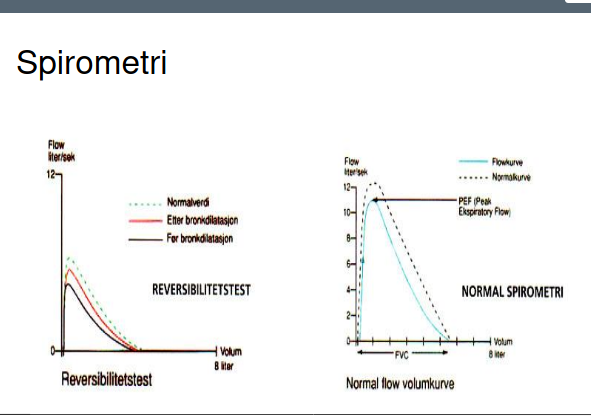

Vilken behandling?Rinokonjunktiviten-allergin:
* Anti-histamin (tablett och ögondroppar)
* Nasal steroid
* Allergen specifik immunoterapi (ASIT)

Astman:

* ***Beta-2 agonist***: få som bara får en kortverkande luftrörsvidgare, får då är det bara misstänkt astma,
  * globalt sett att många får kotrverkande luftrörsvidgare, gör ej friskare på sikt
  * förstår ej vidden av besvären
  * skulle må mkt bättre om fick kortison
* ***Inhalationssteroid***: lägger till denna om beta2 ej fungerar, 
* ***Leukotrien-rec antagonist*** (montelukast = Singulair)
  * i USA är de rädda för kortison, så man förespråkar denna först hos yngre barn, inte hos europa
  * hos yngre barn kommer leukotrienantag tidigare i trappan, innan långverkande sterodier. 
  * har biverkningar: med mardrömmar, etc... 
* ***LABA***
* ***Kommentar***
  * de röda e kombinationspreparat
  * inom pediatriken i sverige där bättre koll o ijformera, är det inte ett måste att man hoppar på komintation direkt,
  * istället är det kortverkande, sedan steroider
  * i slutet att man lägger till leukotrienreceptroantag. 

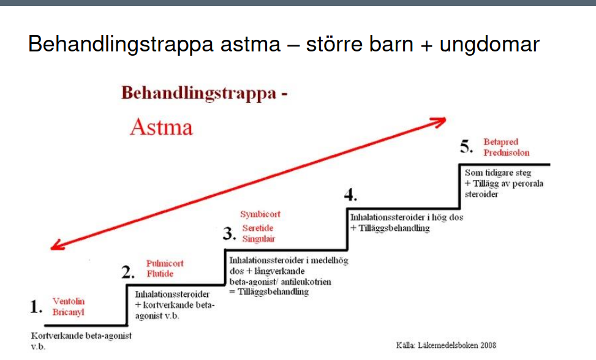

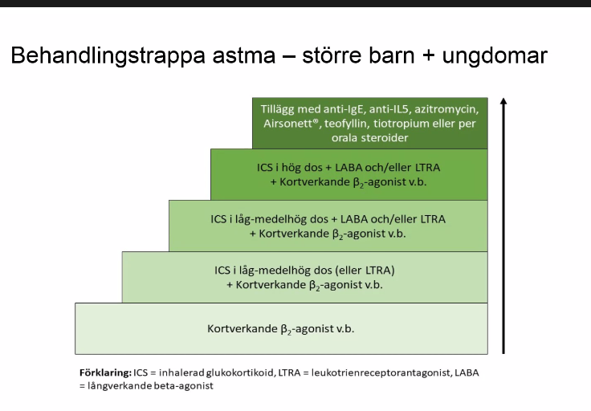

* Notera att denna trappa är för större barn och ungdomar. 

### Fall 4

Fall 4: 6-årig pojkeInkommer till barnakuten med ambulans pgamisstänkt allergisk reaktion.  Varit hos kompis och ätit en bit Snickers. Direkt efteråt fått utslag, klåda, andningsbesvär och klumpkänsla i halsen.

Stadieindelning av anafylaxi

Allergisk reaktion/ej anafylaxi: 

* Klåda, rodnad, urtikaria != en anafylaxi
* Ev rhinokonjunktivit. 
* Klåda i munnen, läppsvullnad. 
* Illamående och evenstaka kräkning, lindrig buksmärta. 
* anafylaxi är enbart när det drabbar flera organ. 

Anafylaxigrader

* ***Anafylaxigrad 1:*** 
  * Angioödem.
  * Svullnadskänsla i halsen. 
  * Heshet.
  * Hosta och lindrigare obstruktivitet.
  * Ökande buksmärta, diarre, upprepade kräkningar.
  * Trötthet, rastlöshet och oro. Takykardi. 
* ***Anafylaxigrad 2:***
  *  Skällhosta, 
  * stridor,
  * sväljningsbesvär. 
  * Tilltagande bronkobstruktion. 
  * Sjunkande blodtryck och takykardi. 
  * Svimningskänsla, 
  * katastrofkänsla. 
* ***Anafylaxigrad 3:*** 
  * Svår bronkobstruktion, 
  * hypoxi,
  * cyanos,
  * evandningsstopp. 
  * blodtrycksfall / hypovolemi,
  * bradykardi, 
  * evarytmi och 
  * hjärtstopp. 
  * Förvirring, medvetslöshet

***Vilken behandling?***

* ***Adrenalin*** 
  * intramuskulärt!! 
  * (ca 0,1 mg/10 kg, max 0,5 mg)
* ***Evsyrgas och inhalation av beta-2 agonist***: detta är väldigt bra, att man ska INHALERA också 
* **Intravenös infart**
* **Ge anti-histamin (**p.o/i.m/i.v)
* **Ge kortison** (p.o/i.v)
* **Ev i.v vätska** (Ringer-Acetat ca 20 ml/kg)Tester i akutskedet?
* **O2-saturation, blodtryck + hjärtfrekvens**
* **S-Tryptas** (inom 4 tim / 24 tim postmortem)

***Behandlingsrekommendationer för ev nya reaktioner?***

* ***Utrusta patienten med ett akut-kit:*** följer med barnen i skolväskan
    * Adrenalin-penna (auto-injektor)
    * Anti-histamin (gärna smält-tablett)
    * Kortisontabletter (Betapred –löses i vatten)
    * Ev kortverkande beta-2 agonist(om astma)
* ***Skriftliga instruktioner***
* ***Vidare utredning?***
* ***IgE-analys av sannolika allergen, evprick-test-komponentanalys för jordnöt?***

***Komponentanalys -IgE*** 

* **Kan särskilja ”äkta” allergi från korsallergi  (alt ofarlig allergi)**
* **Jordnöt  -specifik allergi:** Ara h2 (h1, h3)korsallergi: Ara h8
* **Hasselnöt -specifik allergi:** Cora8 (a9, a14)korsallergi: Cora1
* Ägg –IgE ak mot Gal d1 (ovomucoid) indikerar svårare allergi

# Akut och allmän ped

### Fall 1

* Elsa 10 mån 
  * På avdelningen har just 10 mån gamla Elsa lagts in p g a viral gastroenterit. Hon har gått ner drygt 5% i vikt sedan debuten för tvådagar sedan, väger nu 11 kg. Initialt kräktes hon frekvent, men nu är det voluminösa diarréer som dominerar. 
  * Blodgasen visar pH 7,29, pCO2 4,2 (undre ref är 4.6), BE -14. Na 145, K 4,3. Glukos 6,9. Hon har fått en pvk på akuten.Jouren som just skulle ordinera vätska var tvungen att springa på ett larm, så du ombeds göra det i hens ställe. Du möter en tagen flicka med torra läppar och en kapillär refill på 4sek. 

***Hur tolkar du blodgasen***

* Metabol acidos, respiratorisk kompensation
* isoton dehydrering

***Du vill börja med att ge en vätskebolus. Vilken vätska väljer du? Hur beräknar du volymen?***

* ***Chockbehandling*** 
  * 20mL/kg 10-15min Ringer-acetat
  * 220mL 10-14min Ringer-acetat iv
  * ***i akutskedet ger man bara baserat på current vikt***
* ***Bolus ringer sker med spruta som man duttar på, 50mL spruta och trycka bara, gör i den hastighet som pvk tillåter***

**Efter given bolus hämtar sig Elsa snabbt. Cirkulationen förbättrats, kap refill 2 sek.**

**Vilken volym och vätska ordinerar du för att nu uppvätska henne intravenöst, och på vilken tid?** 

* Kapillär blodgas först, för att kontrollera natrium
  * om hyperton behandla som hyperton, annars gå vidare.
* intravenöst: Över 4 timmar, Ringer-acetat 5% av kroppsvikt -> 550mL ringer-acetat över 4 timmar
* peroralt: över 4 timmar, ORS, 5% av kroppsvikt -> 550mL ORS över 4 timmar.
* i hennes fall blir det intravenöst, enl seminarieledare, iom redan infart (nämns)

***Du passar på att ordinera majsvälling för underhållsbehovi sonden innan du går tillbaka till akuten. Hur räknar du?***

* **6-12mån är 125mL/kg/d** unerhållsvätska (näring, i detta fall välling)
* 1375mL majsvälling
* // om man har en aktuell vikt, med akuten tidigare är det mkt bättre att räkna på den vikten. Men iom att vi enbart har en current vikt 11kg, så använder vi den (läk menar att man kan räkna baklänges, men läk använde bara 11kg ändå verkare som)

### Fall 2

* ***Tre barn*** 
  * med virala infektioner som sökt akut under morgonen planeras för inläggning på vårdavdelning för vätskebehandling inklusive rehydrering.   
  * Du ombeds ordinera lämplig vätsketillförsel till barnen under det första vårddygnet. 
  * Alla barnen har gått ner ca 5% i vikt. 
  * De har kissat sparsamt det senaste dygnet. 
  * De två äldre barnen har en kap.refill på 2 sekunder, men lilla Vera har en kap.refill på 3,5 sekunder

***Vera 6 veckor 4kg***

* ***Bolus: ja, iv***, förhöjd CRT

  * **under 44v gestationsålder:** iv Ringer-acetat 40mL bolusvätska (4kg * 10mL/kg ), 10-15min
  * **Om över 44v gestationsålder:** iv Ringer-acetat 80mL bolusvätska (4kg * 20mL/kg), 10-15 min

* ***Rehydrering***: ja, 

  * Oralt (då inga kräkningar, möjligt adekvat att acceptera peroralt, ) samma mängd men ORS
  * iv: 5% av kroppsvikt, 200mL Ringer-acetat över 4 timmar

* ***Underhållsvätska, ja***

  * **utpumpad bröstmjölk, annars ersättning**
  * **peroral:** 150mL/kg, 600mL över 24 timmar
  * **intravenöst**:
    *  **plasmalyte glukos 5% glukos, 140mM Na, 20mM K,** 
    * **100mL/kg/d ger 400mL över hela dygnet.**

  

  ***Salim 8 månader, 8kg***

  * ***Ingen bolus***
  * ***Rehydrering***: ja, 
    * Oralt (då inga kräkningar, möjligt adekvat att acceptera peroralt, )
    * 5% av kroppsvikt, 400mL Ringer-acetat över 4 timmar
  * ***Underhållsvätska, ja***
    * ***ersättning, alt utpumpad bröstmjölk, annars*** 
    * ***peroral:*** ***125mL/kg, 1000mL över 24 timmar***
    * ***intravenöst:***
      *  ***plasmalyte glukos 5% glukos, 140mM Na, 20mM K,*** 
      * ***100mL/kg/d ger 800mL över hela dygnet.***

  

  ***Anna 3 år, 17kg***

  * Ingen bolus
  * ***Rehydrering***: ja, 
    * intravenöst: 5% av kroppsvikt, 850mL Ringer-acetat över 4 timmar
  * ***Underhållsvätska, ja***
    * **välliing**
    * **peroral**: 100mL/kg, 1700mL över 24 timmar
    * **intravenöst**:
      *  plasmalyte glukos 5% glukos, 140mM Na, 20mM K, 
      * 100mL/kg/d + 50mL x kg = ger 1350mL över hela dygnet.
    * ***Notera att kalorimässigt är det lågt i glukos vätska***

***Fördelar resp nackdelar***

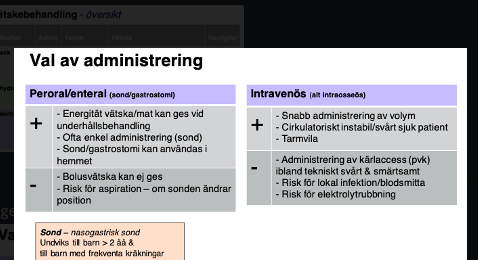

* ***PEroralt, sond, enteralt***
  * ***Fördelar***
    * **energitätare vätska som ges under underhållsbehandling**
    * ofta enkel admin, med sond
    * att man kan skriva hem de med sond/gastrostomi
  * ***nackdelar***
    * boluvätska kan ej ges
    * risk för aspiration
    * att de har diarrer kan läcka, samm om de kräks
* ***Intravenöst***
  * 
* Varför man ej ger högre procent än 5% glukos hos barnet: för att det svider. 
* Om barnet behöver dropp över lång tid går man över till TPN
* En nackdel med IV är att man inte får lika mkt energi med 

### Fall 3

* Små barn kan ibland drabbas av en hyperton dehydrering samband med virala gastroenteriter

***Hur definieras hyperton dehydrering?***

*  över Na 150mM i plasma, definieras 
  *  **Hyperton dehydrering**. En fruktad komplikation till viral gastroenterit är **hyperton dehydrering**, vilket nästan endast förekommer hos barn under 12(-24) månaders ålder.  Barnet har då p.g.a. diarréer drabbats av en primär vattenförlust med  resulterande intra- och extracellulär hyperosmolalitet
*  ***svår dehydrering är mellan 170-175mM Na***

***Varför är det oftast barn <1 år som drabbas?***

* **Risken för att dehydreras i drabbas av hypovolemi är större ju yngre barnet är**
  * större relativt vätskebehov per kg 
  * hög andel kroppsvätska utgörs av ECV
  * mindre utvecklade hormonella reglersystem
  * mindre utvecklad njurfunktion
* ju mindre man är desto mer vätska man består av. 
* icke färdigutvecklade njurar, som koncentrerar urinen sämre: högt vatteninnehåll men lågt osmolyt innehåll som gör de mer benägna att bli hypertont dehydrerade
* har större surface area som gör att de svettas mer. 
* småttingarna har svårt att förmedla tt de behöver kompensera för sina förluster, vad gäller törst. 

***Förklara kort mekanismenbakom hur den hypertona dehydreringen har uppstått!*** 

* **Tillståndet innebär förlust av kroppsvatten** 
  * inte primärt av elektrolyter:
  * denna förlust kan vara diarre, via urinen iom ej kunna koncentrera mer, etc
  * Initialt sker ( tex pga diarre) en extravasal vattenförlust med resulterande hög natriumkoncentration i extracellulärvätskan -
  *  ECV  Sekundärt vandrar vatten från intracellulärrumet- 
  * ICV till ECV med en sekundär ICV dehydrering som följd  
  * Kroppen bilda nu aktiva osmotiska partiklar intracellulärt varför vattenflödena mellan ICV & ECV upphör  
  * REsultat: Förlust av kroppsvatten & ett hyperosmolärt tillstånd såväl extra- som intracellulärt
* **/ det man är rädd för är den intracellulära intorkningen** 
* att cellerna bildar osmolyter blir ett problem när man vill behandla hyperton dehydreringen

***Hur vill du behandla barnet?***

* **De man primärt gör :** 
  * ***ge bolusvätska med NatriumKlord ist för ringeracetat:***
    * NaCl för att inte sänka natrium för fort
    * för att sjunkande natrium för fort blir intracellulärt ödem, hjärnödem, pontin myelinolys. 
  * *O så ger man glukoslösning med natrium 120 mmol.*  
  * ***De vi ska kunna är att man ska va försiktig när man sänker natriumvärdet,*** 
  * !!! **<u>Hastighet sänka Na</u>: målet är 0.4mmol/timme till dess att P-natrium är under 145**, detta ska man kunna
    * man väljer vätska utefter det. 
* ***TIll för att förhindra hjärnödem***
* ***kom ihåg vid hyperton dehydrering att justera natrium långsamt***
* ***Slutsats:*** Kalle ger RInger-acetat, det är okej med 130mM
* ***Långsam uppvätskning är 10% av kroppsvikten över 36 timmar***
* Risken med NaCl är att man ger för mkt klorid, att de blir hyperkloremiska acidos.

### Fall 4

* ***Hilda 12 månader***
  * Söker på barnläkarmottagningen vid 1 års ålder pgasen motorisk utveckling.
  * Socialt: 1:a barnet.
  * Tid sjukdomar: Frisk. Normal graviditet och förlossning. 
  * Aktuellt:
    * Rullar över rygg/mage 7 månaders ålder. 
    * Sitter utan stöd vid 9 månader. 
    * Has-kryper, men går inte upp i fyrfota. 
    * Står inte, varkenmed eller utan stöd. 
    * Talar enstaka ord. 
    * Välutvecklat pincettgrepp bilat

**Sammanfatta normal utveckling för en ettåring.** 

* **Grovmotoriskt**.
  * reser sig 
  * går utan eller med stöd
  * väl utvecklade skyddsreflexer
* **Finmotoriskt**.
  * Pincettgrepp, plockar finsmulor
  * staplar burkar
* **Kognitivt**.
  * Interagerar med utomstående
  * leker, vinkar hej o adjö
  * klappar hjänjder
  * språkutv
    * 8-10mån: symbol med betydelsen. titta-peka-benämnasaker
    * 10-12 mån: abrnet börjar imitera ljud: grundläggande för språkutv
    * imitiera-identifiera o minnsas
    * förstår o säger enkla ord: mamma, titta där
    * ibland tyst period efter joller
    * ordsamlarstadiet
* **Jämför med Hilda.**
  * Gränsåldern (när alla bör ha uppnått stadiet) för att stå med stöd ligger på 12 månader. Hilda som fortfarande inte uppnått detta än är sen i utvecklingen
    * man ska gå med stöd i denna ålder
  * // hon har fin finmotorisk utveckling och kognitivt är hon med
  * gränspldern för pincettgreppet ska vara utvecklat vid 12 månader som Hilda verkar ha.  
* ***Möjliga orsaker***
  * ***Neuromuskulär sjukdom:*** 
  * ***asfyxiskada, CP skada***
  * ***Höftledsluxation***
* ***Handläggning***: skickar till **barnneurolog**, iom screeningen nu

**Vilka motoriska och kognitiva färdigheter kontrolleras på BVC vid 4-6veckors, 6 och 10 månader ålder?**

* ***Kontroll 4 veckor med läkare***
  * Samspel
  * liksidig symmetrisk rörelse
  * kan fixera blicken litegranna: färgglad boll, att följa med blicken
  * Vanligt bebisstatus
* ***4-6 veckors:*** man kan se den på rikshandboken
  * **nyföddhetsreflexer**
  * **följa röd boll med ögonen**
  * **rör sig symmetriskt**
  * **öppnar händerna**
  * **ryggläge**
  * **magläge**
  * **sittande**, rund rygg (6-8 veckor)
  * **stående**: tar krovarigt stöd på tårna eller hela fötternam när du ställer det, sjunker sedan ihop
  * **handfunktion**: griper inte, ska inte vara tonus, inga clenched hands
  * **svarsleende**
  * **svarsljud**
  * **avvikande motoriskt utförande vid 6-8v**
    * Oro vid lägesändringar
    * Rörelsefattigdom
    * Asymmetriska rörelser
    * Hårt knutna händer
    * Inslagna tummar
    * Plantarflektion av fotleden
* ***6 månader***
  * ***Kan barnet vända runt***
  * ***Ryggläge: att man drar upp de med armarna, att de ska kunna sätta sig upp, att de spänner i kroppen, att de vill följa med och sätta sig upp***
  * **leta efter tappad leksak**
  * ***nyföddhetsreflexerna***: tågripsreflexen borde vara den enda kvar i detta fallet. Moro oftast borta, man säger försvinner 5-6 månader. 
  * ***Ryggläge***
    * Rör huvudet obehindrat. Föremål kan följas utan att barnet tappar  balansen. När barnet vill följa föremål som försvinner åt sidan och  uppåt inträffar ofta de första försöken att vända runt.
    * Händerna samarbetar bättre och bättre. Barnet undersöker föremål  genom att vända och vrida på dem. Nu är snören, knappar och dylikt  intressanta och barnet undersöker dessa uppmärksamt. Barnet slår också  gärna (lek)saker mot kroppen eller mot underlaget för att undersöka  ljudet.
    * Bålen är stabil och barnet vänder till sidan eller hela vägen till mage.
    * Fötterna hålls högt upp i luften och är intressanta att leka med
  * ***Magläge***
    * Huvudet är stadigt och barnet kan vrida huvudet obehindrat för att undersöka omgivningen.
    * Stödjer på raka armar med öppna händer. Barnet försöker också att  stödja på den ena eller andra armen och skjuta ifrån för att med den  andra nå spännande saker.
    * Bålen är stabil även när barnet rör sig.
    * När barnet stödjer på raka armar sträcks ryggen så att tyngdpunkten flyttas till nedanför naveln och barnet ligger på bäckenet.
    * Barnet kan nu sträcka ett ben samtidigt som det andra kan böjas och  utåtroteras. Benen hjälper på detta sätt till när barnet vill röra sig i cirkel åt höger eller vänster.
  * ***Sittande***
    * Tar själv stöd på armarna framåt. En del barn kan sitta kortvarigt utan stöd.
  * ***Stående***
    * Barnet tar stöd på hela fötter när det står med stöd.
  * **Handfunktion**
    - Greppar efter föremål, lika med båda höger och vänster.
    - Händerna används lika mycket och kan samma saker.
    - Öppnar handen och fingrarna för att greppa.
    - Håller föremålet mot handflatan.
  * **Avvikande motoriskt utförande vid 6 månader**
    - Oro vid lägesändringar
    - Rörelsefattigdom
    - Asymmetriska rörelser
    - Hårt knutna händer
    - Inslagna tummar
    - Plantarflektion i fotleden
    - Oförmåga att hålla huvudet stadigt i olika kroppslägen
    - Få rörelser mot tyngdkraften
    - Okoordinerade rörelser
    - Ökade och tydligare avvikelser när barnet vill röra sig målinriktat
    - Skakighet
    - Instabilitet
* 10 månader-12 månader Anamnes/observation
  * Föräldrars egna frågor eller funderingar.
  * Samspel/kommunikation förälder och barn.
  * Samspel/kommunikation barn och BVC-personal.
  * Jollrar med olika ljud i långa ramsor som låter som "riktigt prat".
  * Leker tittut, vinkar.
  * Förstår enstaka ord.
  * Använder båda händerna - flyttar från hand till hand. Plockar smulor. Pincettgrepp - tumme mot pekfinger.
  * Slår två klossar mot varandra.
  * Sitter utan stöd, sätter sig upp.
  * Kryper fyrfota eller hasar på bak eller mage.
  * Reser sig och går efter vägg, soffa m.m.
  * ***skyddsreflexerna ska finnas, att de tar emot sig***
  * **resa sig, kan de stå**
  * **pincettgreppet, kan de stapla grejjer**
  * **det är d man gjorde åp Hilda**
  * **leka tittut**

### Fall 5

* **9 mån pojke**

  * Ahmed kommer med sin mamma till barnakuten. 
  * Han har blivit väldigt blek och trött de senaste dagarnaenligt mor.
  *  Han ammas fullt och äterlite fruktpuréer som mamma själv tillverkat. 
  * Vikt och längdökning normal. 
  * I status finner du en mycket blek och passiv gosse.
  *  CRP< 10. 
  * Hb 63g/L

  

  ***Anemi definition***

  * The definition of anaemia varies with age: Hb <100 g/L in infants (postneonatal), Hb <110 g/L from 1 year
    old to 12 years old

  

  **Vilken diagnos misstänker du i första hand?** 

  * Järnbristanemi: 

  

  **Vad grundar du din misstanke på**

  * Sen avnavling vid födelsen och introduktion av järnrikkost vid 6 månaders ålder är faktorer som minskar risken för järnbrist.
  * Låg födelsevikt, utebliven introduktion av järnrikkost vid 6 månader och intag av komjölk är riskfaktorer för järnbrist.
  * Barn med låg födelsevikt (<2 500 g) är en särskild riskgrupp och erbjuds rutinmässig profylax mot järnbrist:
    * profylax i form av järn i kontrollerad form
  * Järnstatus bör ingå i utredningen av bl a beteendeproblem och kognitiva svårigheter hos barn och ungdomar
  * **Andra orsaker järnbrist**
    * Minskat intag eller upptag – helamning från 1 års-åldern, ensidig eller vegetarisk kost, högt mjölkintag, celiaki
    * Ökad förlust – blödning från näsa, tarm, Meckels divertikel, riklig menstruation
    * Provsvar – lågt MCV, ferritin och järn
* // det är vanligt vid den åldern, samt att nutritionen är inadekvat med bröstmjölk och fruktpurre inte har mkt järn i
  * barn med lågt Hb värden är den vanligaste orsaken dietär järnbristanemi
* ***hur länge järnet klarar sig på med bröstmjölken***
    * **6 månader**
    * bröstmjölken innehåller mindre järn
    * samt att barnet växer
  
  
  
  **Vad ska en 9 mån gammal gosse äta**
  
  * **Introduktion av mat:**
    * Vid (4)-6 månaders ålder: 
    * rotfrukter, grönsaker 
    * Frukt 
    * kött, fisk ägg och gluten 
    * smaksensationer, små mängder av mycket. Man är tolerant för att lära sig tycka om många olika smaker. 
    * Man ger pyttemängder, man har mkt olika saker o ge så blire lätt att tycka om många olika saker sen. Glutenintroduktion under amning mellan 4-6 månaders ålder annars ökar riske för celiaki, så man ska få in gluten tidigt i kosten och sakta o säkert med bröstmjölksskydd.
  * **Meny 6-8 mån ålder:
- bröstmjölk/ersättning** 
    * On demand. 
    * 1 huvudvmål: Kött/fisk, potatis, grönsak+frukt pure 
    * Gröt med fruktpure eller välling. 
    * // amma och ngt mellanmål till det
    * // den är fortfarande lite åldersanpassad, mindre salt och mindre...
    * // delammar, ersättning eller sådär, kan vara olika.
    * // ersättningen är berikad på järn osså som man ska notera
* **10 mån ålder**: 
    * 
Frukost: bröstmjölk eller välling/gröt med fruktpure 
  * 2 huvudmål: Kött/fisk , potatis, grönsaker + frukt. 
    * mosad mat, mindre bitar.
  * 1-2 mellanmål med frukt, smörgås, yoghurt. 
    * Gröt med fruktpure eller välling eller bröstmjölk
  * Vanlig komjölk kan introduceras vid 1 års ålder, mängden protein o salt. 
  * **Från 1 års ålder:** 
    * Äter mer som vuxna o större barn. 
    * Mellanmål 2 ggr per dag 1-2års ålder.
    * Mellanmål 1g per dag > 3 års ålder. 
    * 5mål/dag mår tarmarna bra av.
  
  
  
  **Behandling**
  
  * **I pojkens fall:** järntillskott + transfusion
    * läk hade väntat lite mer på transfusion: för att vid transfusioin kmr benmärgen softa, 
    * istället vill man ge lite järn
    * man börjar med järn med tät uppföljnign
  * ***järntillskottet:*** niferex droppar. 
    * ***tar en liten tid*** med ändrat Hb värdet,
    * **Retikulocyt antalet eval**: men man kan evaluera retikulocyt antalet för en förbättring
  * Tonåringar kan behandlas i primärvård, yngre barn bör remitteras
  * Behandling rekommenderas vid konstaterad järnbrist, även utan anemi
  * Järntillskott – tabletter eller orala droppar i 3 månader (remiss vid behov av intravenös behandling)
  * Kostråd för järn – kött, fisk, tofu, baljväxter, nötter och fröer
  * Dietistkontakt vid behov
  * **ser till järnberikad kost, **
  * ***järntillskott till alla***
    * **prematuritet, eller att man är liten, liten gestationsålder, att man ger de järn**
    * iom att de kmr att växa så pass mkt. 

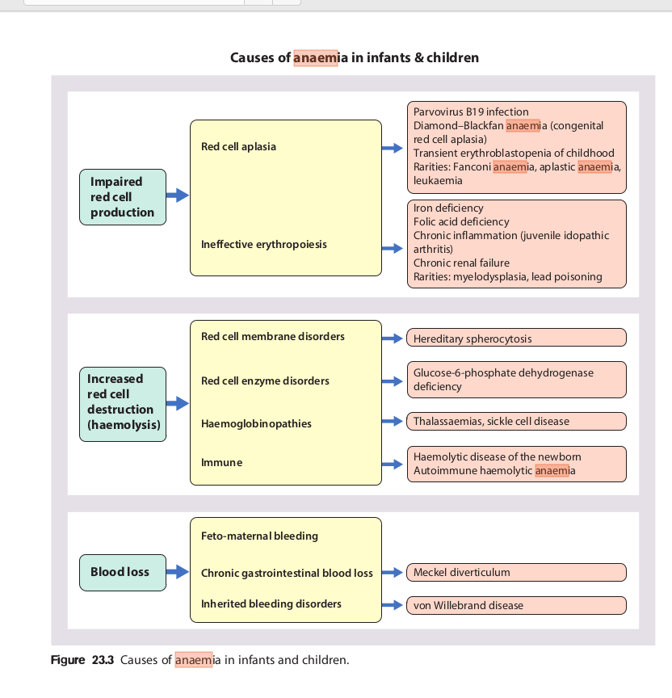

### Fall 6

* ***Hamid 9 månader***

  * 9-månaders pojke som av dig har följts på BVC med sedvanliga rutin-kontroller. Han har mått bra. Fått alla vaccinationer. 
  * Vid 6-månaderskontrollenhar du noterat ”allt väl, sitter med endast lite stöd, rullar från mage tillrygg, fint grepp”. 
* Föräldrarna undrar nu varför det inte går framåt. Hamid vill inte sitta och när man lägger ner pojken i sängen ligger han snällt kvar på rygga) 
  

  
***Lugnande besked? Gränserna för utvecklingsfaserna är ju vida (!?).***
  
  * ***Pat har gått tillbaka i utvecklingen, varpå indikation för neurologutredning.*** 
  * ***Uteslut att det förekommer indikation för akut remiss t neuro:*** akut förlusten av förmågor
    * regression färdighetsmässigt
    * uteslut somatik
* ***Regression***
    * neurodegenerativa disorders
  * Tumörer
    * muskelatrofi
  * metabol sjd
  
  
  
  ***Föreslå en kort plan för hur denna frågeställning skall hanteras. (Av vem och hur snabbt?)***
  
  * Evt föreligger akut remiss neurolog
    * Har pat ont?
    * Är det för att han inte kan? Är det regressio?
  * Uteslut somatik: 
    * utvidgad anamnes och status
    * varför vill han bara ligga på rygg
  * framgår att pat regredierat: skicka remiss neuro
  * ***Remiss akut barnneurolog: inom 2 veckor***

### Fall 7 

* **Lukas 4 veckor**
  * Mammorna till Lukas
  * 4 veckor (första barnet) söker på BVC för att de oroar sig föratt han kräks så mycket. 
  * Graviditet och förlossning varua.
  * De gick hem från BB drygt två dygn efter förlossningen. 
  * Helammas, har god aptit. 
  * Vikten har ökat med 250 g sedan föregående besök för två veckor sedan. 

**Du minns att kräkningar är mycket vanligt under spädbarnsperioden, men varför är det så?**

* ***Överskottskräkningar:***
  * matstrupe magsäck är inte tight, varpå reflux och spyr 
  * vid ett år bör detta sluta
* vätskediet, kort esofagus, ligger mkt horisontellt
* äter för mkt osså, iom 150mL/kg/d, det är ganska mkt

***Vad ger vi för råd till föräldrarna?***

* Mindre mängd mat
* Mer frekventa matningar
* // så länge ungen mår bra o går upp i vikt, så går de kräkas hur mkt de vill
* // högläge huvet innan måltid och efter måtid, så att magmunnen får space.

***Tänkbara diff.diagnos som bör övervägas?***

* ***Pylorusstenos***: 3-8 veckor, det klassiska är 6 veckors pojke,, ska vara några veckor gamla, vanligare hos pojkar än flickor
  * dessa barnen går ned i vikten
  * sen är pylorusstenos kräkningar är kaskadkräkningar, men varannan förälder
  * metabol alkalos
  * hypokloremisk, iom att mna kräks upp HCl. 
  * kanske att föräldern söker så pass tidigt att det inte är påverkad blodgas eller tappat lite eller inget i vikt...
  * ibland att man kan palpera resistens i epigastriet. 
  * ***bekräfta diagnos***: med ultraljud
* **Ileus**
* **Gastroenterit**
* **Övriga infektioner**
* **lever-/gallvägssjukdom,** 
* **komjölkproteinallergi**: möjligt att det kan vara komjölksallergi om mamman konsumerar det, varpå supposed överförsel till barnet, enl abdollah.  
  * vanligaste matallargin är komjölksallergi
* **GER** (gastroesofagalreflux)):
  * skillnaden reflux och omugen magmun, att barnet besväras av det	
  * att de är skrikiga missnöjda, ser plågade ut
  * apneer
  * att de reagerar paradoxalt på refluxer, med apneer
* **Förstoppning**

### Fall 8

​	

* Celine7 veckor
  * BVC-sköterskan bekymrarsig för att sju veckor gamla Celine går dåligt upp i vikt. 
  * Sköterskan har gett mamman mycket råd beträffande amningen, men det har varit problem ändå. 
  * Mamman vill gärna amma, men nu har hon börjat komplettera med tillägg som dock flickan inte gärna vill ha. 
  * FV 3.240 g, hon gick ned till 2.980 g och var tillbaka till FV vid 10 dagars ålder. Celineväger nu 3.780 g. Du träffar dem på BVC.

***Vilka vanliga och viktiga orsaker finns det till dålig viktuppgång?*** 

* ***Första dagarna***: upp till 10% viktnedgång är acceptabelt. , man blir inte inblandad som läkare tills de tappat 10% av kroppsvikten. 
* ***Nästäppa***: 
* ***För lite bröstmjölk***
* **infektion**
* **hjärtsvikt**
* **dålig nutrition, opassande nutrition**
* **dåligt suggrepp:** inoptimal mängd mat som därför konsumeras
* **ikterus:** blir för slö och inte orkar äta mat. 
* **inte orkar äta, eller inte gillar ersättningen**
* **Inadekvat intag**
  * Inadequate availability of food
  * Feeding problems – insufficient breast milk or poor technique, incorrect
  * preparation of formula
  * Insufficient or unsuitable food offered
  * Lack of regular feeding times
  * Infant difficult to feed – resists feeding or disinterested
  * Conflict over feeding, intolerance of normal feeding behaviour, e.g.
  * messiness, throwing food around, leading to an early cessation of meals
  * Problems with budgeting, shopping, cooking food, famine
  * Low socioeconomic status
  * Psychosocial deprivation
  * ***Poor maternal–***
    * infant interaction
    * Maternal depression
    * Poor maternal educationI
  * ***Neglect or child abuse***
    * Includes factitious illness: deliberate underfeeding to generate weight falterin
  * ***Underliggande patologi***
    * Underlying pathology
    * Impaired suck/swallow
    * Oro-motor dysfunction, neurological disorder, e.g. cerebral palsy Cleft palate Chronic illness leading to anorexia
    * Crohn disease, chronic kidney disease, cystic fibrosis, liver disease, etc.
* ***Inadequate retention***
  * Malabsorption
  * Vomiting, severe gastro-oesophageal reflux
  * Coeliac disease, cystic fibrosis, cow’s milk protein allergy, cholestatic liver disease,
  * short gut syndrome, post-necrotizing enterocolitis (NEC)
  * Failure to utilize
  * nutrients Syndromes
  * Chromosomal disorders, e.g. Down syndrome, intrauterine growth restriction (IUGR)
  * or extreme prematurity, congenital infection, metabolic disorders, e.g. congenital
  * hypothyroidism, storage disorders, amino and organic acid disorders
  * Increased requirements 
  * Thyrotoxicosis, cystic fibrosis, malignancy, chronic infection (HIV, immune deficiency) congenital heart disease, chronic kidney disease

***Viktiga anamnestiska uppgifter? Vad leta efter i status?***

* ***Fråga allt efter A***
  * Psykiatrisk anamnes: 
  * Hur ofta ammar du
  * hur ofta äter hon
  * hur mkt äter hon: suger hon bra, läcker det. Bra suggrepp
  * när på dygnet, 
  * vad ger du exakt
  * kräkningar
  * Feber
  * diarrer
  * infektion
  * otröstlig
  * gråter mkt
  * irritabel
  * smärtor
  * vill hon äta ens
* ***psykosocial anamnes***
  * hur mga barn, vf vem hur när
  * hur mår du
* ***Status***: man gör ett fullkomligt status, iom 7 veckors unge. 
  * **Pylorusstenos:** 
    * ***Symtomen börjar oftast vid 3-5 veckors ålder. Det är ovanligt med insjuknande efter 12 veckors ålder (10).***
    * palperbar olivmassa ovanligt, palpera, 
    * **Kräkningar**: Anamnes avseende kräkningarnas karaktär, färg och relation till måltid väger tungt i diagnostiken. Reflux leder till kräkningar som ofta sker senare efter måltiden, kräkningarna är inte av kaskadkaraktär och brukar inte ha ett progredierande mönster. Reflux ger inte heller alltid påverkan av vikten. Gallfärgade kräkningar ska leda till misstanke om mer distalt hinder.
    * **Aptit**: Aptiten hos spädbarn med IHPS är oftast god, jämfört med aptit vid t ex gastroenterit eller urinvägsinfektion.
    * **Vikt**: Senast kända vikt är en viktig uppgift och ofta tillgänglig då kontakter med BVC brukar vara täta i denna ålder.
    * **Urinproduktion**: Urinproduktion bör efterfrågas som en del av dehydreringsbedömningen, enklast genom att fråga när blöjan var våt sist.
    * **Avföringsfrekvens**: Avföringsfrekvens och förekomst av blod i denna, där förekomst av det sistnämnda talar emot IHPS och istället talar för komjölksproteinallergi eller invagination i sent skede
  * **AT**
  * **hjärta: blåsljud, RR**
  * **lungor: andning**
  * **hydreingsstatus**
  * **MOS: för gomspalt**
  * **cirkulation: CRT,**
  * **neuro: samspel med barnet**
  * **hur ammar barnet**

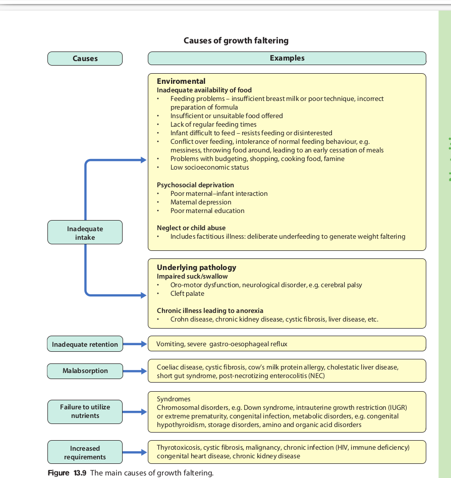

### Fall 9

* ***Alessandra 4dagar***
  * 4 dagar gammal flicka som blivit tilltagande ikteriskoch är nu rejält gul.
  *  Hon är också lite slö och tröttnar vid slutet av amningen. 
  * Ingen feber, kräkningar, skrikighet eller andra allmänsymptom. 
  * En första provtagningsomgång visar Hb 190 g/L och bilirubin 360 μmol/ml.CRP <5. 
  * Mor blodgrupp A+.

***Hur förklarar du mekanismen bakom flickans gulhet?***

* ***Fysiologiskt ikterus***
  * HbF ska bytas mot adult Hb
  * hög omsättningen erytrocyter
  * hög blodvolym fr mamman som också medföljer
  * levern inte är riktigt mogen ännu för att konjugera all volum bilirubin fr nedbrytningen
  * HbF till adult tar några månader
  * Att det blir för mkt volym på levern. 
* ***Acceptabel gulhet***: 
  * **2v-3v**: för fysiologisk ikterus
  * om ikterisk över 2v fortfarande: tar man ett nytt prov för att se konj vs okonj
    * notera att barn som ammas blir lite gula osså.  
  * **2mån:** amningsinducerad
* ***oacceptabel ikterus***
  * **2mån**: misstänk gallvägsatresi, och uteslut andra orsaker till ikterus, e.g. hepatit
* ***Mekanism***
  * **Ökad nedbrytning Hb + okonjugerat bilirubin kan inte konjugeras tillräckligt hastight av levern***

***Vad innebär immunisering? Vad talar emot detta i Alessandras fall?***

* Rhesus haemolytic disease Affected infants are usually identified antenatally and monitored and treated if necessary (see Ch. 10). The birth of a severely affected infant, with anaemia, hydrops and hepatosplenomegaly with rapidly devel- oping severe jaundice has become rare. Antibodies may develop to rhesus antigens other than D and to the Kell and Duffy blood groups, but haemolysis is usually less severe. ABO incompatibility This is now more common than rhesus haemolytic disease. Most ABO antibodies are IgM and do not cross the placenta, but some group O women have an IgG anti-A-haemolysin in their blood, which can cross the placenta and haemolyse the red cells of a group A infant. Occasionally, group B infants are affected by anti-B haemolysins. Haemolysis can cause severe jaun- dice but it is usually less severe than in rhesus disease. The infant’s haemoglobin level is usually normal or only slightly reduced and, in contrast to rhesus disease, hepatosplenomegaly is absent. The direct antibody test (Coombs’ test), which demonstrates antibody on the surface of red cells, is positive. The jaundice usually peaks in the first 12 hours to 72 hours.
* ***Rh-immunisering*** 
  * innebär att en Rh-negativ person, efter kontakt med Rh- positiva blodkroppar, bildar antikroppar mot Rh-faktorn. Inom kvinnosjukvården handlar det om en Rh-negativ moder, som bildar antikroppar mot sitt Rh-positiva foster genom att det passerar fosterblodkroppar till den maternella cirkulationen. Detta är vanligast i samband med förlossning, spontana eller legala aborter, extrauteringraviditet, amniocenteser och yttre vändningar. Det kan också inträffa i samband med felaktiga blodtransfusioner. Om man till den Rh-negativa, icke immuniserande kvinnan tillför ett immunoglobulin (anti-D) kan immuniseringen förhindras. Detta immunoglobulin är riktat mot de eventuella Rh-positiva fosterblodkroppar, som kan ha passerat över i mammans blod och eventuellt initierat en immunologisk reaktion.
* ***AB0 inkompatibiltet***
  * Mamman är blodgrupp 0 (O): 
  * föranleder antikroppar mot både A och B. Antikropparna förs över placenta till fostret och följer med spädbarnet vid fösel, 
  * detta leder till hemolys hos barnet. 
  * vanligaste är att 0 mammor reagerar på A barn. 
  * visar sig dag 1-2
* ***Vad som talar emot i detta fallet:*** 
  * Mamman är rhesus positivt, inga antikroppar mot detta
  * samt att mamman är blodgrupp A, så inga antikroppar mot A. 
* ***Åldern talar emot också***
  * att det är lite sent
  * Rh immunisering kan man se in utero, att fostrets huvet föds med stora huvuden, iom IgG att det är så pass litet att passera placenta
  * AB0 immunisering sker i BB, när barnet nyfött för att utbyte blod i samband med födsel: AB0 tas inte igm placenta, utan sker i smaband med födsel. 

***Vilka faktorer avgör om behandling skall inledas?***

* Följ bilirubinkurvan för
* ***Ljusbehandliing***: över ett dygn gammalt är behandlingsgräns 350. 
  * mekanistiskt att bilirubinet blir vattenlösligt och man kan pissa ut det. 
  * i detta fallet lägger man in ungen, iom 360 bili
* ***Blodbyte***
* Angivna gränser enl kurvan. 
* ***Faktorer som avgör***
  * stegringstakten
  * nivån 
  * finns det en immunisering. 
  * sänker behandlingsgränsen om barnet varit sjukt
  * östasiatiskt land är en riskfaktor. 
* ***DAT-test***: kollar om det finns antikroppar i barnets blod mot erytrocyterna. 

***Är bilirubinstegring farlig? Alla (de flesta) nyfödda är väl något gula!?***

* ***Toxicitetsrisk***: vid för höga värden av bilirubin förekligger bilirubintoxicitet, kan leda till skador som CP
* ***Toxisk nivå:*** över 450 mikroM
* ***bilirubinencefalopati*** (ABE)
* Symtom på akut bilirubin-encefalopati (ABE) är hypertonus med bakåtböjt huvud (retrocollis) och bål (opistotonus) samt irritabilitet. Övriga akuta symtom som kan förekomma innefattar matningssvårigheter, tonusväxlingar, gällt skrik och uttalad slöhet. Dessa symtom är i de flesta fall reversibla.  Vid extrema bilirubinnivåer tillstöter apnéer, kramper/cyklande rörelser, feber, koma och död. Vid obduktion ses stark gulfärgning av de centralt belägna hjärnkärnorna (kärnikterus). Överlevande uppvisar i 70 % av fallen bestående skador i form av ofrivilliga, danssjuke-liknande motorikstörningar (atetotisk CP-skada, dystoni), svårigheter med ögonmotoriken, sensorineural hörselnedsättning/dövhet (tillsammans BIND = Bilirubin Inducerad Neurologisk Dysfunktion) och emaljhypoplasi. Något entydigt samband mellan bilirubinnivå i neonatalperioden och senare IQ har inte kunnat fastställas [2, 18-20]. Det finns heller inte stöd för att känsligheten för bilirubin minskar under neonatalperioden (eller senare under barnaåldern) – behandling ges därför på samma indikationer som i slutet av första levnadsveckan.
* ***Orsak till at mga e gula förklarades ovan***: dock få som har toxiska nivåer
* ***risk för kenikterus***: kärnikterus fall. Förekommer i sverige, trots alla kontroller. detta för att enskilda individer avvikit PM, att barn faller mellan stolarna.
  * men om man följer PM fångas dessa upp. 

## Feber, infektioner, andningsbesvär och buksmärtor

### Fall 10

* Alice
  * Alice och hennes pappa söker på barnakuten pga hosta och andningspåverkan. Lungröntgen visar infiltrat

***VIlket vilka agens är mest sannolikt om Alice är***

* ! **5 dagar**: ***GBS (vanligast),*** E coli (sen kan man alltid säga listeria)
* **2 månader**: virus (e.g. kan vara vilket virus som helst, kan vara RSV som vanligsat, 1 månad - 5år, vanligast), pneumokocker, haemofilus influenza, chlamydia trachomatis 
* **9 månader**: virus (fortfarande ett virus e.g. RSV), pneumokocker, haemofilus influenza, chlamydia trachomatis
  * rsvirus
  * metapneumovirus
* **4 år**: oftast virus: ex RSV, pneumokocker , haemofilus influensa, chlamydia trachomatis
  * ***man kan slänga in en bakterie till nämligen mykoplasma***, bra att börja tänka på den.

* ***Nyfödda***
  * GBS
  * E. coli
* ***Barn 1 månad t 5åå***
  * oftast virus: ex RSV
  * pneumokocker 
  * haemofilus influensa
  * chlamydia trachomatis
* ***Barn >5åå***
  * pneumokocker
  * mykoplasma pneumonae
  * chlamydia pneumoniae

***Vilket är det kliniskt mest användbara kriteriet på pneumoni hos barn 6 månader till 5 år gamla?***

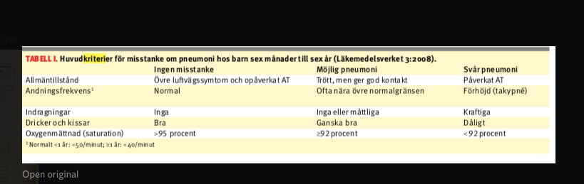

* Hög andningsfrekvens är den kliniskt mest användbära kriteriet
* // notera att andningsfrekvensen kan sjunka lite med antipyretika,
  * om andningsfrekvensen sjunker med antipyretika talar det lite emot pneumoni eller att det är en mindre allvarlig pneumoni. 
  * De flesta med pneumoni eller påverkade lungor att det fortfarande e lite hög AF efter antipyretika

### Fall 11 - kan vara RS.virus med astmatisk komponent

* ***Kevin snart 2åå***
  * Kevin har varit förkyld med hosta och snuva i några dagar. Sedan imorse har han blivit alltmer andningspåverkad varför man nu söker akut. Modern beskriver hur det ”piper” när han andas. Man har sökt vårdcentral några gånger tidigare med liknande, men lindrigare, symptom. 
  * Han har fått flytande Bricanyl utskrivet, men det har inte hjälpt nämnvärt. 
  * Vidundersökning noterar du en glad snabbandad kille (AF 55) med rosiga varma kinder. 
  * Något forcerad och förlängd utandning. Intercostala indragningar. Lungorna auskulteras med ronkibåde på inspiriet och expiriet.Saturation 93%. Temp 38,9

***På vad grundar man bedömningen av de aktuella besvärens svårighetsgrad?***

* Saturation
* Andningsfrekvens
* AT
* vitala parametrar
* ROnki inspiriet och expiriet, som tecken på ronki: alla får sammanfallna luftvägar vid utandning vilket, men att man får det vid inandning när luftrörern ska vara som störst, så bör det inte finnas ronki om inte det är allvarligt. 

***Hur vill du behandla Kevins obstruktiviteti det akuta skedet***

* **Inhalation beta2-agonister**: Detta för barn över 6 månader, för att dilatera bronkerna. 
  * Ventoline, aka eller salbutamol
  * Ventoline är bronkvidgande och astmamedicine
  * adrenalin är slemhinneavsvällande, och man generellt ska tänka att barn 0-6 månader har framförallt har problem med slemhinnesvullnad.
  * barn över 6 månadero ch garanterat över 1år har den astmatiska komponenten.
* ***Börja med atrovent***
  * det är ipratropium
  * antikolinergika
* ***Steroider:*** nästa steg för att jobba mot inflammationen
  * ***kan ta det peroralt, betapred tabletter lösa upp i vatten och mata med en spruta***
* ***NaCl inhalation***: ofta inhalera koksalt för att lätta upp slemmet
* ***Uppvätskning***

***Vilka är diagnoskriterierna för förkylningsastma? Uppfyller Kevin dessa?***

* ***Astma diagnos 3 punkter***:  
  * ***Efter 3 obstruktiva episoder***: 
    * < 2åå så kallas de för astma 
    * annars är de akut bronkit  
  * ***1a obstruktiva episoden och andra tecken på allergi***: 
    * som eksem eller födoämnesallergi 
    * så säger vi att barnet har astma 
    * oberoende på ålder  
  * ***1a obstruktiva episoden i samband med förkylning > 3 åå (förra riktlinjen är 2 år)*** 
    * så säger vi att barnet har astma !
    * I detta fallet är barnet snart 2åå, varpå han ej får diagnosen av denna
* **barn under 3år har så pass reaktiva luftvägar att de får obstruktiva besvär** 
* om det inte finns hereditär komponent, aellergi o atopi, så är det sannolikt att barnet växer ifrån astman
* ''Enstaka episoder av infektionsutlöst obstruktivitet hos barn under två års ålder är mycket vanligt och definieras som obstruktiv bronkit. För att tillståndet ska definieras som infektionsastma hos barn under 2 år ska de ha haft minst tre återkommande episoder. Undantag gäller för barn med samtidigt konstaterad IgE-allergi, atopiskt eksem eller astma hos föräldrar/syskon – då definieras det som infektionsastma redan vid deras första obstruktiva attack. Hos alla barn äldre än två år räcker det med en infektionsutlöst episod för att ställa diagnos infektionsastma.''
  [11:39 AM] direkt ur vårdprogram fårn 2020
* Läkare menar att barnet i detta fallet har en förkylningsastma. om han bara har problem är förkyuld är det bara beh när förkyld
  * steroidero ch salbutamol enbart i förkylningsastma. 

***Han svarar bra på given behandling och bedöms kunna återgå hem. Hur bör behandlingen fortgå i hemmet? Vilka mediciner skriver du ut? Hur ges dessa?***

* ***Beta2 agonist (ventolin) fr akuten***: hem med råd om vätska och råd om beta agonist för hemmet
* ***Inhalationssteroider fr akuten också***: enl beh trappan haft flera infektionsutlösta proble. 
  * "periodisk behandling med inhalationssteroider i ca 10 dagar"
  * eller med leukotrienreceptorantagonist i ca 10 dagar
* **Läkare menar att barnet i detta fallet har en förkylningsastma. om han bara har problem är förkyuld är det bara beh när förkyld**
  * steroidero ch salbutamol enbart i förkylningsastma. 
* ***Bra med vätska***: ska vätska upp sig väl
* ***Remiss BUMM***: för evt kompletterande lkm
* ***Optichamber med munstycke***: för att inhalera ventolinet
* ***Fråga om tidigare episoderna när infektion och inte infektion***; om besvär mellan dessa episoderna, lägger man till inhalationsteroider. 
* // Noter att personlighetsförändring kan ske i samband med medicineringen, så man ska vara uppmärjsam på det, försvinner om slutar mediciner

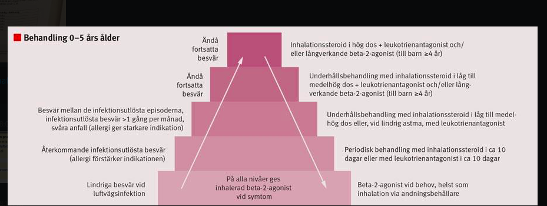

***Uppföljning***

* BUMM uppföljning

### Fall 12  - bebis bronkiolit RS virus

* Amadeus 4v
  * Amadeus kommer akut en sen januarikväll pga andningsbesväroch feber. 
  * Hade ett kort andningsuppehåll kort före ankomst. 
  * Han har ammat sämre senaste dygnet, enligt modern pga nästäppa. 
  * Kräkts några gånger i samband med hosta. 
  * Storebror 3 år går på dagis och är förkyld med snuva och hosta. 
  * Moderns graviditet var ua, likaså gossens neonatalperiod. 
  * I status hittar du en trött, snorig, febriloch snabbandad gosse(AF 80). 
  * Kapillär refill 2 sek. Saturation 91%. Rejäl bukandning. 
  * Indragningar intercostalt och jugulärt. 
  * Utbredda slembiljud över båda lungfälten

**Föräldrarna är mycket oroliga att det kanvara början av en RSV-infektion hos Amadeus.Vilka kliniska fynd talar för att de har rätt? Hur ställerdu diagnosen?**

* ***Kliniska kännetecekn***
  * epidemiologi (bror som är förkyld och snorig hemma) + säsong
  * indragningar
  * takypne
  * saturation
  * mkt slembiljud vid auskultation
  * (hosta enl Ped. för RSV, sent tecken i förloppet för pneumoni)
  * (Ronki)
* ***Diagnos***
  * Klinisk diagnos
  * PCR för att säkerställa absolut att det föreligger RS. 

***Behandling***

* ***Airways:*** ***Suga en massa slem och nästoalett (koksalt koksalt suger suger)***

* ***Breathing***: 

  * **syrgas vb**: sat <90%
  * en neopuff som de kan få 
  * ***Inhalation NaCl***: för att så pass ***slemmig***
  * ***inhalation adrenalin***

* ***Rehydrering***: inte en bolus på en gång

* ***Nästäppa***: skölj med NaCl

* ***Högflödesgrimma:*** 

  * ***optiflow***: högdosflöden bv
  * att det är syrgas
  * uppvärmt

* ***cpap vb***: om andas dåligt, retenerar koldioxid, men då är barnet IVA fall ligger ej på bava. 

* ***Förebyggande, profylax***: med synagis, monoklonal AB för RSV t riskgrupper under högsäsong

* ***Investigations and decision to admit***  (s301 i bok illus paed)

  * ***Saturationsmätning*** should be performed on all children with suspected bronchiolitis. 
  * ***No other investigations are routinely recommended.*** 
    * In particular, chest X-ray or blood gases are only indicated if respiratory failure is suspected.
  * ***Hospital admission is indicated if any of the following are present:*** 
    * **apnoea** (observed or reported) 
    * ***persistent oxygen saturation of < 90%*** 
    * ***when breathing air inadequate oral fluid intake*** (50–75% of usual volume) 
    * **severe respiratory distress**
      * **grunting**,
      * **indragningar** marked chest recession,
      * **andningsfrekvens**, AF, 70 breaths/minute.

  

***? Kan man diffa bakteriell pneumoni här?***

***Amadeus andas något lugnare efter tre inhalationer, men du bedömmer att han behöver läggas in för fortsatt vård och övervakning. Vad får han för behandling på avdelningen? Kontroller?***

* ***Fortsatt samma behandling***: att man gör det regelbundet, att man suger, ger inhalationer regelbundet, syrgas vb 
* **Underhållsvätska** 
* **CPAP vb**: då är det IVA fall, så kmr ligga på den 
* **Isolerat rum iom fkn virus** 
* **Vätskeersättning** ***Rehydrering***: inte en bolus på en gång
  * generellt behöver lite uppvätskning
  * kan få en sån uppvätskning
  * sen får man utvärdera underhållsbehovet. 

***Tänk igenom de riskfaktorer som gör att de minsta barnen (<3mån) drabbas hårdaste av RSV***

* Fysiologin annorlunda, 
* Smalare luftvägar,
* Mindre aveoler, och färre
* Mindre gasutbyte,
* Kolaberar luftvägarna då de e mjukare: brosket har inte satt sig ännu
* bröstkorgen är ganska mjuk att den kan kollabera enklare etc. 
* Många orsakar till varför barn blir så mkt mer sjuka i vanliga förkylningar, 
* De har mindre marginaler, 
* De behöver vätska och energi
* Skillnader mellan barn & vuxna som påverkar A & B  
* mindre munhåla & stor tunga , 
* Inte fördel för att få ner luft  
* Näsandas ( t o om 4-6 mån ålder)-> problem vid nästäppa ( Ex.vis RS virus typisk situation)  
* Mindre luftvägsdiameter i luftvägar omgivna av svagare brosk, en mindre obstruktion minskar luftflödet mkt mer hos en stor patient. 
* Mindre yta gasutbyte i lungan: Färre och mindre alveoler
* Ingen humoral immunitet
* ***Riskgrupper***
  * prematura barn
  * hjärt- eller lungsjudom
  * neuromuskulär sjd
  * immunsupprimerande

### Fall 13

* **Nova 18 mån**
  * Tidigare frisk 18 månader gammal flicka som remitterats från närakuten p g a oklar infektion med hög feber i tre dagar och CRP-stegring. 
  * Inte velat äta eller dricka sedan morgonen
  * Trött och gnällig på barnakuten, ingen hosta eller snuva. 
  * Kap refill 3 sek. Cor/pulm auskulteras ua. Buken mjuk. 
  * Ingen dunkömhet över njurlogerna. 
  * CRP 132. U-sticka med 3+ vita, 2+ ketoner.

**Vilken diagnos är mest sannolik?**

* Pyelonefrit
* // notera att gällande diabetes och sticka på barn, att barnen läcker glukos ganska så tidigt, över 10mM glukos att de läcker
* kan vara en kontamination på stickan. 
* // man ska inte nöja sig med 

**Akuta prover**

* en **Urinsticka taget**
  * eller en blåspunktion
* **CRP taget**
* **blodprover**
  * **blodstatus och grabbarna**
  * **elstatus**
  * **glukos**
  * **blodgas**
  * **Krea**
* ***Urinodling***: tvättat mittstråle (blåspunktion under 1år, kalle påpekat att ännu yngre)
  * minst 10^4 CFU för kastat prov
  * för blåspunktion är vadsomhelst växt signifikant
  * att man skickar första provet på odlig och den nya mittstråle provet. 
* ***SENARE FÖRLOPP OCH UTREDNING***
  * **Ultraljud**: detta sker under inläggningsperioden. 
  * **MCUG**: om hydronefros gör man detta under inläggningen

***Etiologiskt***

* **Oftast tarmbakterier** perineum via urinblåsa

***Hur handlägger du fallet vidare? Utredning? Behandling?***

* ***Anamnes***
  * Feber, nivå (≥38,5 °C) och duration
  * Miktionsanamnes (blöjfria barn)
  * Förstoppningsanamnes (blöjfria barn)
  * Hereditet (UVI, njur- eller urinvägsavvikelser, blåsdysfunktion)
  * Dålig stråle (t ex uretravalvel hos pojkar)
  * Tonåringar – tänk på sexualanamnes och STD
* ***Riktat status***
  * Yttre genitalia
  * Rygg (uteslut avvikelse i medellinjen)
  * Bukpalpation (resistens, förstoppning)
  * Vikt är minimum, blodtryck och längd önskvärt
* **Provtagning**
  * **Urinprov för odling**
      * Blåspunktion eftersträvas på barn under 1 år
      * Mittstråleprov (korrekt provtagning efter tvätt och trycktorkning). Två urinodlingar från olika miktioner ger
      * ökad säkerhet). Ett mittstråleprov räcker för odling vid positiv nitrit hos flickor.
      * Kateterprov kan övervägas om urinprov är svårt att få på annat sätt
  * **Urinstatus** 
      * Nitrit
          * positiv hos flickor = bakteriuri
          * kan vara falskt positiv vid makroskopisk hematuri och hos pojkar (från förhudsflora)
          * negativ nitrit hos 50 % av barn med bakteriuri
      * U-LPK 
          * positiv stöder diagnosen UVI men kan vara falskt positiv
          * negativ talar emot, men utesluter inte, UV

  * **Urinmikroskopi är inte tradition i Sverige men är ett alternativ till urinsticka**
  * **Blodprov** 
      * CRP
          * för nivådiagnostik och riskbedömning
          * styr beslut om vidare utredning
          * skall upprepas efter 1 dygn om feberduration ≤1 dygn och första prov <70 mg/l
      * S-kreatinin ± Cystatin C 
          * för bedömning av njurfunktionen
          * (lågt GFR för åldern kan approximeras med S-Kreatinin >30 μmol/l för barn <1 år och >40
          * μmol/l för barn 1-2 år) alt. används Schwartz formel el. S-Cystatin C, för skattning av
          * njurfunktionen.
      * Blododling och P-Na på svårt sjukt barn.

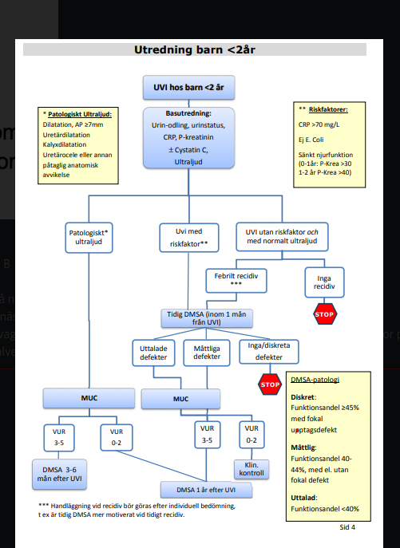

***Behandling***

* om peroral: ceftibuten peroralt, den har en förlängd halveringstid, så räcker med att ta en gång per dygn. 
* om intravenöst: cefotaxim
* man byter utefter urinodlingen också till ngt smalar. 

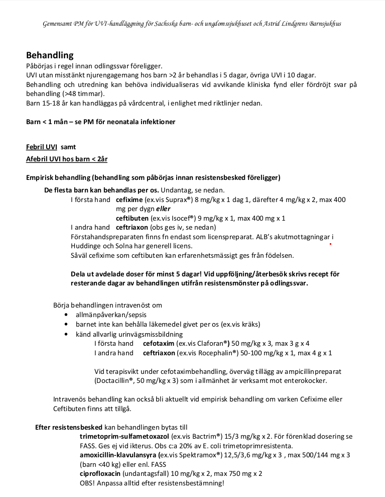

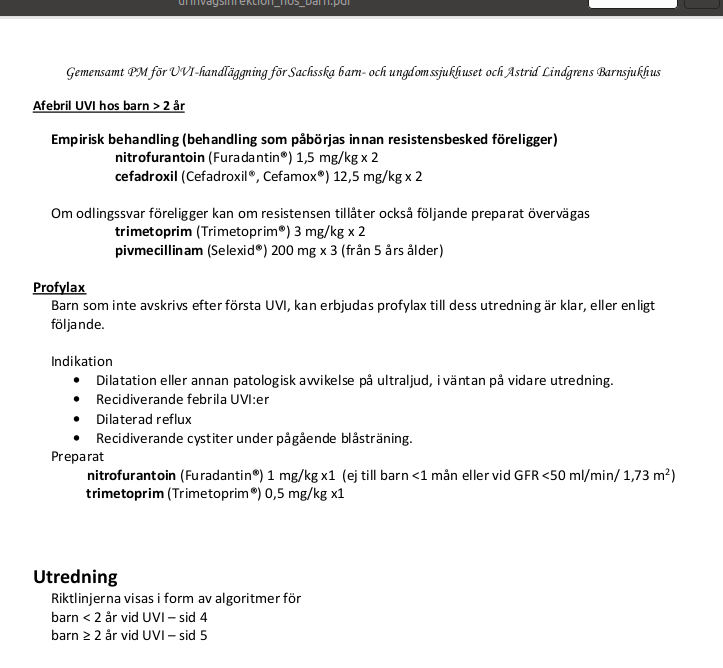

### Fall 14

* Remiss från vårdcentralen till barnläkarmottagningen p g a buksmärtor. 
  * På remissen står det: ”Celiaki? Tacksam utredning!”
  * Flickan är fullt välmående på mottagningen. 
  * ”Idag har jag inte ont i magen!”. Status ink noggrann bukundersökning ua –bortsett från en viss blekhet. Det framkommer att buksmärtorna kommit och gått sedan minst ett halvår tillbaka. Varierande lokalisation. Man har undvikit glutenprodukter, men tycker inte att det blivit bättre. Något bättre under en period med Laktulos 10 ml dagligen. Medföljande pappa berättar att Verica äter en väldigt ensidig kost, mest makaroner med ketchup och att hon tillbringar flera timmar per dag framför sin iPad.

***Vilka ytterligare frågor vill du komplettera med?*** 

* Avföringsvanor
* Urinvanor
* Penetrera matanamnes
* Hereditet
* lkm
* Allergi, överkäns
* neonatal
* kräkning
* blod o slem i avföring
* röda flaggor
  * viktnedgång
  * blod någonstans, bajs kräk
  * feber
  * B symptom
* tillväxtkurva
* IBS kriterier ROM III, för diagnos krävs både 1 o 2
  * obehag el smräta i magen minst två av följande kännetecken under minst 25% av tiden:
    * blir bättre efter avföring
    * startade i samband med att avföringsfrekvensen ändrade sig
    * startade i samband med att avföringen ändrade onsistens samt
  * ingen inflammatorisk, anatomisk, meatbol, malign, orsak t symptomen, vilka ska ha funnits i minst 2 månader
* Komjölksallergi diff, eller laktosintolerans

***VIlken diagnos mest sannolik***

* ***Funktionell förstoppning***
  * ***ska ställas under minst en månad haft problem med minst 2 av följande***
    * två eller färre avföringar per vecka
    * minst en episod med inkontinens per vecka (efter blöjfri)
    * anamnes på mkt kvarvarande avföring i tarmen
    * anamnes på hård avföring eller smärta vid avföring
    * förekomst avföring i ampullen
    * stor avföring som täpper till toaletten
  * ***De ska stå på medicinen dubbelt så länge som man haft problem med förstoppning:*** 1år blir 2 år med medicinen. 
  * ***Förstoppningsbehandling ska man stå*** 
  * **Man ska återintroducera gluten i kosten, barnet ska inte stå utan innan man har kontakt med vården för att man ska organisera det väl**

**Hur vill du utreda Verica**

* ***Längd, vikt, tillväxtkurva***
* ***Blodprover***
  * enl läk
    * blodstatus: inkl Hb
    * järn
    * thyroideaprover
  * elstatus
  * leversstatus inkl albumin
  * CRP, 
  * SR
  * Krea
  * ak-transglutaminaser: bör vara låga med tanke på glutenfri kost. 
  * calprotectin i faeces. 
  * glukos?'
* ***Man tar prover här för att det är ensidigt, och för att barnet är lite blekt***
* så man sätter in klyx sen movicol. 
* det är först när barnet svarar adekvat som man går vidare med prover och utredning djupare. 

***Behandling***

* Fysisk aktivitet, kost, regelbunden allsidig kost
* ***Laxerande***: 
  * laktulos oral lösning, brukar säga att denna är steg ett, och movicol steg 2
    * barn under 6 månader, att man börjar med denn
    * för ett 4åå barn så är det ganska mkt laktulos som det skulle gå åt. 
  * börjar med movicol direkt för läk direkt om över 6 månader, iom så bra effekt
  * movicol: generellt att man ska lägga en låg dos adekvat, sen förklara hur bajset ska se ut och hur ofta de ska bajsa, varpå föräldrarna kan sköta det. 

***Kostråd och livsstillsråd***

* se ovan

## Det akut sjuka barnet

### Fall 15

* Albert 3år
  * Albert har efter en lättare ÖLI plötsligt ådragit sig en kraftig utsådd av hud-blödningar över hela kroppen. 
  * Ser ut som blåmärken av olika storlek. 
  * Blöder lite också ur näsa-mun. 
  * Mår annars prima, har ingen feber och är tidigare helt frisk

***Trolig orsak till hudblödningarna?***

* ***ITP***: idiopatisk trombocytopen purpuira
  * 50% fallen idiopatisk
  * 50% är immunmedierat: hemolys pga antikroppsförekomst. 
  * // man kan testa för antikropparna, men det finns så pass mga antikroppar som man kan missa
* Vf inte henoch
  * ingen hematuri
  * ingen artralgi
  * ingen histopatologi,ingen IgA deposition
  * ingen buksmärta
  * ingen njurpåverkan hematuri eller proteinuri

***Viktigaste akuta prover för att säkra diagnos och utesluta andra allvarliga sjukdomar?***

* ***Komplett blodstatus*** 
  * ***TPK (endast TPK som blir lågt vid ITP):*** TPK i citratrör för att inte falskt förhöjt
  * **blodstatus + B-diff**
    * för att utesluta malignitet
    * att det enbart är en hematopoes som är påverkad
  * ***Hb, LPK med diff.*** 
  * ***PK, APTT,***
  *  ***retikulocyter,*** 
  * ***CRP** (sepsis/meningit* 
  * **SR,** 
  * **ASAT, ALAT.** 
  * **VitK?** 
  * **Urinstatus: sticka?**
  * **Immature platelet fraction: det är som retikulocyter, fast för trombocyter. hur stor andel trombytantalet är ugna trombocyter**
    * Förhöjd IPF att det är mkt som går bort tt benmärgen kompenserar
  * **MTV: stora blodplättar är omogna trombocyter.** 
    * denna hög innebär att det är benmärgen som kompenserar förbrukningen.  
  * **immunoglobuliner**
    * normalt med IgG, IgA, IgM, att man inte har en immunbristsjuka. 

***Allvaret med ITP fall***

* Det är baserat åp kliniken
* såklart också hur lågt trombocyterna är 

***Vad finns det för risk med detta tillstånd***

* ***TPK under 50 10^9 p L***
  * påtaglig risk för blödning: 
    * man är rädd för hjärnblödningar
  * indikation för transfusion. 

***Differentialdiagnoser***: Nämn fyra orsakertill hudblödningar i barndomsåren

* ***IgA-vaskulit:***  (henoch schönlein)
  * småkärlsvaskulit som är palpabla, att de har tydligt ställe åp benen och skinkorna
  * kan få artralgi, att de haltar in litegran
  * samt alldeles prickiga. 
* **sepsis**
* **meningit**
* **trauma**
* **misshandel**
* HUS
* DIC
* TTP
* LKM utlöst, läkemedelsutlöst
* hemofili
* vwf
* // **Den andra vaskuliten man alltid ska ha i bakhuvet är Kawasakis sjuka**, 
  * som man måste utesltua på alla barn
  * ha kriterierna i huvet. 

***Behandling***

* 80% läker spontant 6-8veckor
* är det väldigt lindriga symptom: bara några få petekier, etc, ingen beh
* ***kortison behandling***
* ***IV-IG***
* ***om det är storslagna blödningar***: risk för livet ,etc, ger man trombocyter, men dessa förbrukas upp av kroppen ganska så snabbt.  
* 

### Fall 16

* Ayla 5år
  * Aylahar senaste 2-3 veckorna blivit allt tröttare, har stundtals haft feber 38,5°C. Successivt uppdykande, glest spridda, hudblödningar över hela kroppen. I status noterar du att Aylaser klart hängig ut, är blek ochdu ser också blödningarna. Du konstaterar Hb 69. Lab-status visar, förutom anemi, också låga trombocyter (TPK 55) och LPK 27. Oväntat palpationsfynd i buken är förstorad lever och mjälte.

***Trolig diagnos***

* Leukemi, ALL (akut lymfatisk leukemi, 85% har ALL hos barn)

***Hur fortsätta diagnostiken***

* ***Bloddiff***
* ***benmärgsprov med kromosomanalys*** (inte på akuten)
  * kromosmavvikelser vanligt
  * philadelphia
  * With recurrent genetic abnormalities:
    * t(9;22)(q34;q11.2); BCR/ABL1
    * t(v;11q23); MLL rearranged
    * t(12;21)(p13;q22); TEL/AML1
    * hyperdiploidy
    * hypodiploidy
    * t(5;14)(q31;q32); IL3/IGH
    * t(1;19)(q23;p13.3); E2A/PBX1 (TCF3/PBX1)
* ***Blodstatus inkl diff*** 
* ***Alb, Na, K, Ca Pi, Mg, krea, urat, ASAT, ALAT, bilirubin, LD***
* ***Blodgas***
* ***Bastest***
* ***Lungrtg***
* ***CRP och ev. procalcitonin vid feber***
* **hjärteko**
* **LP för att diffa CNS engagemang**
* Cellysen

***Prognos***

* ALL 90% överlever 5år
* // om det varit AML verkar var a80%
* åldern har en prognostisk faktor

***Akut handläggning:***

* Kontrollera vitalparametrar samt längd och vikt; 
* SpO2, andningsfrekvens, puls, blodtryck och kapillär återfyllnad.
* Om patienten inte är stabil- ta barnet till akutrummet och tillkalla narkos  

***Sätt infart för provtagning:*** 

* Blodstatus inkl diff 
* Alb, Na, K, Ca Pi, Mg, krea, urat, ASAT, ALAT, bilirubin, LD
* Blodgas
* Bastest
* Lungrtg 
* CRP och ev. procalcitonin vid feber

***Ordinera läkemedel:***

* Intravenös rehydrering med buffrad glukos 25 mg/ml (2,5%) utan extra kalium: 2000 ml/m2
* Intravenös antibiotika om patienten har feber.
    * Tazocin           80 mg/kg x 4 max 4 g x 4
    * Meronem      20 mg/kg x 3; över 50 kg 1 g x 3 (om verifierad ESBL/allergi eller magtarmsymptom).

4. Kontakta barnonkolog tel. 72559 för diskussion kring vidare handläggning och vårdnivå

***Huvudpoängen med denna frågan***

* Har man mer än en avvikande hematopoes, ska man tänka till

### Fall 17

* isak 6åå
  * Isak söker för huvudvärk sedan 3-4 dagar. Han är också trött, blek och äter dåligt. Tidigare frisk. Ingettrauma. Far uppger efter en stund att urinen sett mörk ut vid flera tillfällen senaste veckan. Ingen miktionssveda eller feber. Du tar ett blodtryck som är 155/100.

***Vilken svår sjukdom måste uteslutas?***

* **Glomerulonefrit, nefritiskt syndrom**
  * // huvudvärken attribueras till blodtrycket
  * **postinfektiös glomerulonefrit är den vanligaste**
  * nefriterna har högt blodtyck, hematuri, kan ha svullnad men inte typiskt 

***Föreslå viktiga enkla akutprover för att stärka diagnosmisstanken***

* Centrala
  * **Urinsticka: kan se proteinuri hematuri, kan ta alb/krea kvot, nefriterna läcker inte lika mkt som nefros**
  * **Krea, cystatin-C**
  * **blodgas**
  * **ultraljud**
* Blodstatus
* Övriga
* SR, CRP, blod-, elektrolytstatus, urea, albumin, elfores (komplementanalys, för postinfektiös glomerulonefrit)
* Sediment
* Urinstatus/testremsa, sediment, elfores eventuellt odling. U-Albumin/U-Kreatinin.
* Laboratoriefynd. Hög SR, CRP-stegring, måttlig anemi, normalt eller  förhöjt P-Kreatinin. 
* ***Urinprov***: Mikro- eller makroskopisk hematuri,  obetydlig till måttlig proteinuri, röda blodkroppscylindrar, hylina och  korniga cylindrar, ibland vita blodkroppar.

***Vad kan hända om du missar diagnosen***

* ***Akut njursvikt***
  * hyperkalemi, arrytmi
  * lungödem

### Fall 18

* Yusuf 7 år
  * Yusuf har varit trött och hängig i 3-4 veckor. Han har också druckit mer än vanligt och behövt gå upp på natten för att kissa. Vikten minskat 3kg. Föräldrarna berättar att han andats tungt de senaste timmarna. De misstänker astma som förekommer i familjen. Yusuf har också kräkts sedan igår

***Vilken är den mest troliga diagnosen?Motivera ditt svar.***

* hyperglykemi (ketoacidos)

***Hur förklarar du andningsproblemen?*** 

* ***Metabol acidos med respiratorisk kompensation***
  * kan vara kussmaul andning
  * att han försöker eliminera koldioxid så mkt som möjlig
  * // Notera att kräkningarna kan vara kompenserande också, iom så sur...

***Vårdnivå? Vilken behandling ordinerar du?***

* **IVA fall**: uppnår man kriterierna för diabetesketoacidos, hamnar man på IVA. 
* **Hyperglykemi med ketoacidos**
  * NaCl 0.9% natriumklorid för att återställa perifert neddsatt cirkulation,
  * vid utebliven effekt av NaCl bör 5% albumin övervägas
* **Ringer-acetat**: föreläsning säger ringer, men boken säger NaCl? 
* **Insulininfusion påbörjas tidigast 1timme senast 2 timmar efter vätskebeh igång**
  * vid svår hypokalemi avvakta insulinet tills inom acceptabla nivåer?
  * Infusion och inte bolus för att man ej vill ha cerebralt ödem och blodsockerfall
  * insulin i hans ålder 0.1E/kg/h iv. 
  * om ketoacidos lindrigt, i.e. pH 7.1 kan man halvera infusionsmängden, 0.05E/kg/h
* Följa glukos varje timme med nära analys, och anpassa beh efter resultat
* Följa ketoner i blod under hela behandlingsdurationen
* För att iv vätska följa natrium + timdiures/diures
* ***Acidoskorrektion:*** endast på vitalindik, i.e. livshotande hyperkalemi, eller pH under 6.9
  * förutsatt att det ej är indik, så upplöses acidosen mha insulininfusionen varpå kalium entrar cellen och väte följer med. 
  * annars för att korrigera acidos ger man tribonat. 

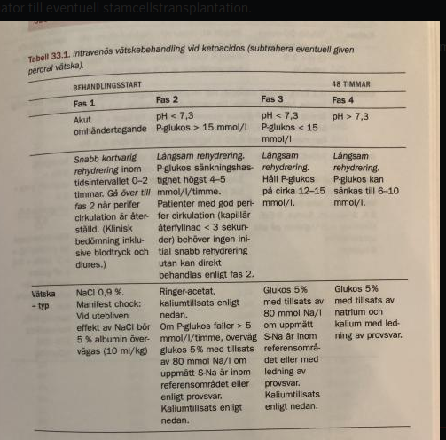

### Fall 19

* Lova 6 veckor
  * Novakommer tillsammans med sin mamma till din BVC-mottagning. Det har inte gått så bra med matningen senaste två veckorna och vikten har stagnerat-till och med gått ned något senaste veckan. Novahar blivit allt tröttare och en viss andfåddhet gör amningen allt svårare. En lätt förkylning har inte gjort situationen lättare.Du finner ett afebrilt barn utan ÖLI-symptomsom verkar lojt och trött. Andningsfrekvens55/min, levern 3-4 cm nedom arcus, känns hård. Novaser annars normal ut. Du har svårt att avgöra om det finns blåsljud. Detta är en beskrivning på klassisk hjärtsvikt

***Tänkbara orsaker till svikt vid 2-3 månaders ålder?***

* Övercirkulation till lungorna pga shuntfel. 
* Öppetstående duktus (PDA), 
* VSD
* Klaffinsuff,
* kardiomyopati,
* Arytmi, 
* Metabol sjd
* [Notera att ASD vanligtvis inte ger symptom i barndomen]

***Cyanos var inte omnämnt i beskrivningen. Är det ett förbiseende,eller?***

* Saturationen är bra, 
* Men det finns inte så mkt blod i systemkretsloppet, 
* Blodet cirkulerar i lungkretsloppet istället. 
* Väldigt uttalad lungstas leder efter tid till cyanos, 
* Men innan dess andningsproblem med takypné + matningssvårigheter.

### Fall 20

* Eddie 1 år
  * Larmet går på akutmottagningen: 1-årig, tidigare frisk pojke, hittad krampande i sängen vid 23-tiden. 
  * Under dagen varitväsentligen som vanligt men känts varm på kvällen.
  * Trolig diagnos enligt ambulanspersonal: feberkramp.

***Vilka krav skall vara uppfyllda för att få ställa diagnosen?***

* **Barn 0,5år - 4år (powerpoint)**
  * Vid feber, över 38,5C 
  * symmetrisk, generell, tonisk, klonisk kramp  
  * Duration mindre än 10 minuter, 
  * de flesta har en duration på en halv till några få minuter  
  * Ofta snabbt pigga efter krampen, 
  * ingen postiktalitet  
  * Skillnad barn feberkramp fr barn epilepsi:  är feberkrampande barnet opåverkade redan efter transport in till sjukhuset pga ingen postiktalitet. 
  * // ingen 
* ***Definition feberkramp (FK): (vårdprogrammet)*** 
  * Anfall hos barn som kommer på vid feber 
  * utan tecken till intrakraniell infektion eller annan specifik orsak till anfallet (ex. hypoglykemi, elektrolytrubbning). 
  * Febern orsakas oftast av virusinfektion men ibland bakteriella inf (ssk otiter, pneumonier).

***Måste du göra LP för att vara säker på att det inte är en bakteriell meningit? Motivera!***

* "The acute management of seizures is described in Chapter 6. Examination should focus on the cause of the fever, which is usually a viral illness, but a bacte- rial infection including meningitis should always be considered. The classical features of meningitis such as neck stiffness and photophobia may not be as apparent in children less than 18 months of age, so an infection screen (including blood cultures, urine culture, and lumbar puncture for cerebrospinal fluid) may be necessary. If the child is unconscious or has cardiovascular instability, lumbar puncture is contrain- dicated and antibiotics should be started immediately. Parents need reassurance and information. Advice sheets are usually given to parents. Antipyretics may be given but have not been shown to prevent febrile seizures. The family should be taught the first aid management of seizures. If there is a history of prolonged seizures (>5 min), rescue therapy with buccal midazolam can be supplied. Oral prophylactic antiepileptic drugs are not used as they do not reduce the recurrence rate of seizures, and have a relatively high risk of adverse effects. An EEG is not indicated as it does not predict seizure recurrence." (s504)
* Slutsats man kan ej utesluta, men klinisk likelihood ration, sannolikhet, är låg för meningit om pat är fullt återställd efter krampen. 

### Fall 21

* William 2år 
  * 2-årige William kommer med ambulans till akuten med sin mamma. Han har haft hög feber, kring 40 grader sedan gårdagen. Verkar ha ont i huvudet, har kräkts vid några tillfällen. Är trött och slö, vill inte äta och dricka. Haft enstaka kräkning, kanske lite lätt hosta och snuva. Tidigare frisk. Påtagligt försämrad sedan morgonen. I status noteras en högfebril, trött och blek pojke, lite marmorerad hud, kap refill 4 sek, HF 180, AF 70, Saturation 91%, inga indragningar. Vissnackstelhet, neurologstatus i övrigt väs ua, men besvärad vid us av pupillreaktion. Inga petekier.

**Beskriv hur du bedömer och stabiliserar enligt A-E**

* ***Airways***: 
  * säkra luftvägarna
* ***Breathing***
  * Syrgas
* ***Cirkulation***
  * Inferter
  * Vätska
    * Ringer-acetat bolus 20ml/kg, 
    * formel = $2\times ålder + 8$ ger 12 kg
    * därför 240mL över 10-20 min, så snabbt som möjligt
  * Odling
  * provtagning
* ***Disability***
  * GCS
  * medvetandegrad
  * neuroundersök pupiller, ljusreaktion, ögonmotorik försöka
  * grovmotorik
  * nackstyvhet
  * ***Glukos***
* ***Exposure***
  * Temperature
  * och hudkostym

***Diagnos måste uteslutas***

* Meningit

***två agens mest sannolika***

* Pneumokock, meningokock

***Vidare handläggning, provtagning***

* ***Insättning steroider***: dexamethasone, dexametason (barn över 3 månader kan man ge dos dexametason)
* ***Insättning antibiotika***: Cefotaxim + ampicillin (täcka listeria), alternativt meronem
* ***Insättning aciclovir bolus***: 10mg/kg x3 i 21 dagar
* ***Lumbar punktion***: poly/mono, laktat, glukos, alb-kvot, odling, PCR, (kristaller), protein
  * ***Bakteriell***: glukos sänkt, protein ökat, laktat ökat, poly ökat, klar eller grumlig
* Prover
  * meningitmisstanke
    * fullständigt blodstatus
    * CRP
    * blododling
    * blodgas
    * glukos
    * elektroluter
    * krea
    * koagstatus
  * urinprov: för UV diagnostik
  * odling NPH för andar locales
  * encefalit misstanke: MR hjärna
* Utifrån agens, skiljer sig behandlingslängden. 
* Vid hypovolemi/chock ska uppvätskas iv
* Inläggning IVA

***Fortsatt behandlingunder första timmen?***

* ***Vätska, chockbehandlingen*** en till bolus vätska om ingen effekt av första
  * om andra inte funka ge albumin 5%
* ***Rehydrering***: Ringer-acetetat (fråga om VES vätskeersättning och skillnad mot ringer), 5% av kroppsvikt över 4 timmar, *om* det föreligger dehydrering av patienten

### Fall 22

* Ida 3v 
  * Fullgången (v 39+2) tidigare frisk flicka som inkommer till barnakuten tidigt på morgonen p g a trötthet och ovilja att amma sedan gårdagskvällen. Ingen feber. Inga luftvägsymptom. Vid statusundersökningen noterar du att flickan är trött och slö. AF 25-30/min. Kap refill 3 sek. Temp 36,2. Saturation 90%. 

***Vad misstänker du att Ida drabbats av***

* Hjärnstamspåverkan, hjärnpåverkan, neuromuskulär påverkan
* Encefalit

***Hur handlägger du Ida under de närmaste timmarna?***

* ABCDE
  * syrgas
* Tox-screening

# ***Referenser***

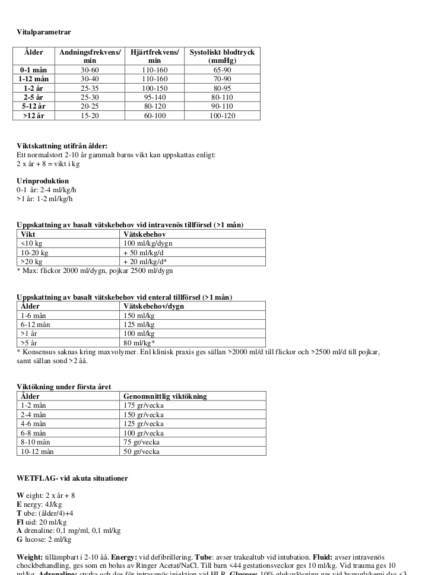