## Titlar

***Presentation***

***Etiologi och patofysiologi***

***Epidemiologi***

***Kliniska kännetecken***

***Utredning och handläggning***

***Behandling***

## Pediatrik

## Allmänt

### Förstorad huvudomfång

Utredning

* Ultraljud: förutsätter att fontanellerna är kvar, man skickar de till ultraljud för utredning. 
  * bakre skallgropsförändringar ser ma nitne med ultraljud, som man ska komma ihåg. 
* letar ökat tryck, tumör
* MR: tveksamheter med ultraljud

### Föda, nutrition och vikt

#### Innehåll
Saker att undvika
* Saltmat ska man inte
* Jordnötter för att det finns saker de kan sätta sig i halsen

Det man bör ge
* i princip alla födoämnen förutom d ovan. 

#### Daglig energibehov

* **1mån 120kcal/kg/d**
* **1år 100kcal/kg/d**
* **3år 85kcal/kg/d**
* **pubertet 65kcal/kg/d**
* **vuxen 30kcal/kg/d**

#### Energiekvivalenter

* 1kcal = 5.18kJ
* 1kJ = 0.24kcal
* 1g fett = 9kcal
* 1g protein = 4kcal
* 1g kolhydrat = 4kcal

#### Viktutveckling

* ***Formeln***
  * 2-7 år: $2\times\text{ålder} + 8$
  * Yngre än 2åå
* **1-3mån = 5kg**
* **1år = 10kg**
* **3år = 15kg**
* **5år = 20kg**
* **7år = 25kg**
* **9år = 30kg**
* **12år = 40kg**
* **14år = 50kg**

#### Bröstmjölk och amning

* Optimal sammansättning
* reducerar infektionsrisk
* förstoppar inte
* mer hygieniskt
* ekonomiskt
* tillgängligt
* anknytning

***Rekommendera: upp t 6mån ålder***

### Hypothyreos

* Kurvan ser enligt kalle okej ut, att det är inte helt manglat kurva, bara en avplaning som man ska beakta.

### Medfödda missbildningar

***Medfödda missbildningar svårupptäckta vid födsel som kan vara plötsligt livshotande***

* **Enl studentsvar tenta**
  * **Gallvägsatresi**, över 4 veckor, konjugerat bili
  * **Vitium organicum cordis, hjärtvitier, ductusberoende** under 3 fel
    * koarktio aortae, coarctio
    * TGA (transposition of the great arteries)
    * pulmonalisatresi
  * **tracheoesofageal fistel** (ofta kopplat t esofagusatresi)
  * **avsaknad thymus**
  * **koanalatresi**
    * membran mellan näsan och luftvägar typ 
    * märks om den är helt sluten bilateral
    * då behöver de andas genom munnen
    * annars om det är bara är en del kan de andas gm näsan lite
  * **duodenalatresi**
  * **gallvägsatresi**
  * **malrotation**
  * **diafragmabåck**: blir värre av ventilering eftersmo lyft också ner i ventrikel o luft i tarmar som är påväg upp i thorax
  * **transposition**
  * **VSD**

* * 

### Undersökning

#### ABCDE

3e månaden

* Värt 

#### Grovmotorik

#### Skallen

#### Gastroenterologi

#### Neurologiskt

* Titta efter tappad leksak: månad
* Fallreflexer åt sidan
* Moro reflexen: cerebral pares om den fortfarande är tydlig efter att tidsfristen är över. 
* tå-reflexen

### Utveckling screening

Man kan screena barnet för flera saker, under dess utvecklingsperiod:

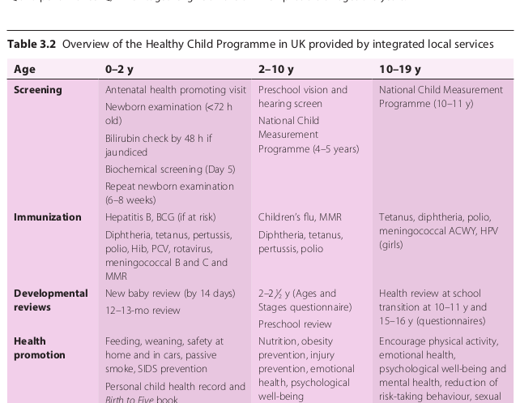

## Allergi

### Allmänt

***Presentation***

* **Olle 7 
  * **månader har en akuttid bokad till dig på barnmottagningen för allergiutredning. I remissen från BVC står följande: ”Gosse med eksem över armar och ben sedan en tid tillbaka. Allergi?” Du suckar ljudlöst över den undermåliga remissen, och väljer att komplettera anamnesen innan du börjar undersöka pojken.** **a) Ange 2 frågor som du önskar svar på och som har relevans för frågeställningen. (1 p)** 
    * Hereditet
    * Födoanamnes; vad har patienten ätit
    * andra tecken e.g. obstruktivitet, infektioner, 
    * epidemiologisk anamnes: var har man varit med barnet, utomlands etc.
    * ammar barnet
    * andra allergiska besvär
  * När du inspekterar hud noterar att olle generellt torr och utbredda eksem över båda armarnas sträcksidor, samt båda låren. De är inte vätskande, och ser inte infekterade ut. har antydda eksem över båda kinderna
    * Hur vill du behandla olles eksem
      * Mjukgörande
      * Steroid kräm behandling
    * 2 metoder för att verifiera eller utesluta allergi hos barn
      * Pricktest
      * IgE-antikroppar
      * Elimination-provokation
    * Vilka 2 vanligaste födoämnen orsakar allergier i dena ålder
      * Mjölkallergi
      * Äggproteinallergi
      * under 1åå är det ofta mjölk, ägg, om utbbredda eksem.
      * över 1åå är det ofta inte födoämnen som orsakar

### Anafylaxi

***Presentation***

* En 7 årig flicka 	
  * söker p g a av en allergisk reaktion efter intag av jordnötter. Hon har urtikaria över större delen av hudkostymen. Vilken kombination av symptom – utöver urikarian - gör att hon inte uppfyller kriterierna för anafylaxi?
    * Detta är EJ anafylaxi: Svullen tunga, en kräkning och klåda i munnen
    * Dessa är anafylaxi: Andningsbesvär med ronki, svullna läppar och konjunktivit med klåda; Upprepade kräkningar, heshet och klåda i halsen; Nysningar, ökande buksmärta och heshet; Hjärtklappning, diarré och sväljningsbesvär
* Lotta 
  * satt på en thairestaurang och åt middag med några kompisar för att fira sin 15-årsdag. Helt plötsligt började det kittla i munnen och kännas tungt att andas. Hon började få panik. Kompisarna blev oroliga och försökte nå mamman utan att lyckas och till slut slängde de sig i en taxi och åkte till akuten. Du möter henne där. Nu är hon även påverkad i sitt medvetande. Kapillär återfyllnad är 2,5 s. Saturation 89%. Hon är tungandad och har distans ronki.
  * a) Vilka åtgärder görs i första hand och i vilken ordning? 2p
    * Ta personen t akutrummet, kontakta narkos då misstänkt hotande luftväg
    * ABCDE
    * Adrenalin: 1mg/mL 0.01mg/kg, intramuskulärt
    * ihalation ventoline + syrgas
    * PVK sättning + vätska
    * betapred + antihistamin
  * vad har hon drabbats av: anafylaktisk reaktion
  * Hur behandlar du Lotta akut: 

***Definition***

* Snabbt insättande svår överkänslighetsreaktion med symptom från flera organsystem som är potentiellt livshotande. Reaktionen kan utlösas av födoämnen, insektsstick, läkemedel samt okända faktorer. 

***Kliniska kännetecken***

* ***Hud***: Urtikaria, quinckeödem, klåda, flush, blekhet.
*  GI: Kräkning, illamående, sväljningssvårigheter, diarré.
*  Luftvägar: Svullnad i övre luftvägar, astma, hosta, heshet, nästäppa, rinnsnuva.
  *  Cirkulation: Kardiovaskulär chock, takykardi, svag puls, blodtrycksfall. 

***Behandling***

* 

### Astma 

***Presentation***

* ***8 månaders flicka*** 
    * Pga feber och andningsbesvär sedan 2 dagar. 
    * Hon är rosslig och hostig, har jobbigt att andas och föräldrarna har noterat att det stundom piper ur luftvägarna när hon andas. 
    * Hennes temp är 39.4. 1.
    * **Diffar**: pneumoni, bronkioloit, krupp, förkylningsastma, infektionsastma
* ***4 år gammal flicka*** 
    * som söker för andra gången med andningsbesvär i samband med en förkylning, i övrigt frisk. 
    * Hon har 37.8 i temp, har indragningar, ökad  andningsfrekvens och en saturation på 95%. 
    * Hon hostar mycket ffa nattetid nu när hon är förkyld och har då svårt att sova. 
    * Vid lungauskultation noteras ronki basalt bilateralt.
    * ***svar: förkylningsastma, rhinovirus, ventoline och syrgas.***
* Mustafa, 18 månader gammal, 
    * inkommer till barnakuten med sin mamma p g a tilltagande andningsbesvär sedan morgonen. Han har varit förkyld utan feber i 2 dagar. Han har enligt modern alltid varit fullständigt frisk. Vid undersökningen noterar du att Mustafa har svårt att andas. Han har en förhöjd andningsfrekvens (AF 65) och han pressar på expiriet. När du auskulterar lungorna hör du ronki över båda lungfälten. Saturationen är 89% på luft
        * ***Mustafa har inte en förkylnignsastma utan detta är en obstruktiv bronkit. Det är väldigt vanligt för barn under 2åå att få infektionsutlösta obstruktiva 	episoder bronkit som efterliknar astma, men detta motiverar ej diagnsen förkylningsastma (aka infektionsutlöst astma)***
        * ***Initial behandling på akuten:*** 
            * syrgas + ventoline (ventoline pga allvarlighetsgraden) med optichamber
            * utefter effekt överväga steroider: betapred eller solu-cortef (solu-cortef om det är en svår obstruktivitet)
            * sedan fortsätta med syrgas + ventoline
            * utebliven förbättring: magnesiumsulfat, överväga tillägg iv teofyllamin
        * ***Efter sex timmars behandling på akuten blir han närmast helt symptomfri. Syresättningen har stigit till 99%. Modern önskar åka hem till övriga familjemedlemmar***
            * **Airomir (saba) + inhalationssteroid**, som kommer att tas i en spacer/mask antagligen...
            * detta ska följa ett förkylningsastma schema som han får fr akuten
            * alltså är detta en episodisk behandlng i anslutning med en till episod obstrktivitet som ungen kan få
            * Notera man behvöer totalt misnt 3 epsidoer för att få diagnosen förkylningsastma. ungen är därför inte där. 
        * Notera i riktlinjen står det att man efter diagnos kommer att behanlda periodiskt i samband med övre luftvägsinfektioner (som jag antar sker **innan** episoderna obstruktivitet)
* 4 år gammal flicka
    *  som söker för andra gången med andningsbesvär i samband med en förkylning, i övrigt frisk. Hon har 37,8 i temp, har indragningar, ökad andningsfrekvens och en saturation på 95%. Hon hostar mycket ffa nattetid nu när hon är förkyld och har då svårt att sova. Vid lungauskultation noteras ronki basalt bilateralt. 2 p
    * Diagnos: förkylningstma, men hon har diagnosen astma per definition, då över 2å + förkyld med obstruktivitet
    * agens: virus, ofta rhinovirus
    * Behandling: ventoline, inhalation, NaCl om slem, syras under 92%.

***Epidemiologi***

* **Ålder**: svårt att diagnosticera yngre än 3år. 
* Hälften av alla barn har pipande andning första 3 åren av sina liv.

***Etiologi patofysiologi***

* ***barn med PBD bronchopulmonell dysplasi,***: att man har fått syragas upp t 36v har högre benägenhet för obstruktivitet och problem med luftvägsinfektioner med obstruktivitet under denna period.
* ***Allergi***, viktig komponent astma
* ***IgE-antikroppar, aeroallergener***: påverkade barn har ofta IgE-antikroppar mot aeoroallergener
* ***Aeroallergener***: house-dust mite, trä, gräs, weed pollens; mögel; animal dander (shedding fr animals) 
* ***Tre olika former av ronki***
  * ***Viral episodisk ronki***: ronki endast som svar till virala infektioner
  * ***“Multiple trigger ronki”:*** som svar på multipla triggers, som är sannolikt att bli astma
* astma

***Genetik,***

***Diagnos***

* ***Astma diagnos 3 punkter***:  
  * ***Efter 3 obstruktiva episoder < 2åå***:
    * så kallas de för astma 
    * annars är de ***akut bronkit***  
  * ***1a obstruktiva episoden och andra tecken på allergi  <2åå (oberoende på ålder hade jag skivit fr seminarium)***: 
    * som eksem eller födoämnesallergi 
    * så säger vi att barnet har astma 
  * ***1a obstruktiva episoden i samband med förkylning > 2 åå (förra riktlinjen är 2 år)*** 
    * så säger vi att barnet har astma !
    * I detta fallet är barnet snart 2åå, varpå han ej får diagnosen av denna
* **barn under 3år har så pass reaktiva luftvägar att de får obstruktiva besvär** 
* **<u>Socialstyrelsen och PM</u>**
  * Enstaka episoder av infektionsutlöst obstruktivitet hos barn under två års ålder är mycket vanligt och definieras som obstruktiv bronkit. 
    * **Under 2år**: för att tillståndet ska definieras som infektionsastma hos barn under 2 år ska de ha haft minst tre återkommande episoder. 
    * **undantag om allergi etc:** Undantag gäller för barn med samtidigt konstaterad IgE-allergi, atopiskt eksem eller astma hos föräldrar/syskon – då definieras det som infektionsastma redan vid deras första obstruktiva attack. 
  * **Över 2 år, 1 episod**: Hos alla barn äldre än två år räcker det med en infektionsutlöst episod för att ställa diagnos infektionsastma.

***Indelning***

* **Moderat akut astma pediatrisk pat**
  * normal mental tillstånd
  * viss accessorisk muskelanvändning, recession
  * takykardi
  * viss påverkan på tal 

***Kliniska kännetecken***

* Symptom värre natten
* symptom med icke-virala triggers
* intervall symptom, symptom mellan akuta exacerbationer
* atopi i familjen eller att barnet har det
* astma terapi, positiv terapt
* ***Atopiska marschen***: atopiskt eksem, komjölksallergi, astma, sedan hösnuva

***Differentialdiagnoser,***

* ***Pneumoni***: samma andningsbesvär som i det första patientfallet, men att det finns en infektionshärd i lungorna.
* ***Bronkiolit***: RS-fall, RS-bronkioliter. Tes sig också sig på detta sättet, låter annorlunda vid auskultation, inte så hög feber, yngre patienter...
* ***Krupp***
* ***Cystisk fibros, bronchiectasi***: finger clubbing, våt hosta, sputum produktion, dålig tillväxt, 

***Naturalförlopp,***

***Utredningsgång***

* ***Polikliniskt***
  * PEF
  * Spirometri
  * ansträngnings-spirometri

* ***Anamnes***
  * tIdigare andningsbesvär, hereditet, atopisk eksem, födoämnesallerig, 
  * ***prematuritet? Neonatalperiod?:*** större benägenhet av denna andningsbesvär vid infektioner med obstuktivitet, med indragningar och pip i bröstet.
  * allmäntillstånd, orkar äta, dricka, kissat
  * hur frekvent
  * vad triggar
  * påverkas sport och generell aktivitet
  * hur svåra är intervall symptomen mellan exacerbationer
  * hur mkt skola har man skippat pga astma. 
* ***Undersökningar***

  * Akut undersökning
  * Andningsfrekvens, bukandning, näsvingspel, 
  * Interkostala indragningar: lågt sittande hinder
  * Jugulära indragningar: högt sittande hinder. 
  * Sibilanta ronki: klassiskt på utandningen
  * Stridor, inspiratoriska eller expiratoriska: andningsljud inandninge, tyder övre luftvägsobtstruktion, konstriktion
  * Titta övre luftvägarna också 
  * Hosta: torr, blöt rossling, skällande
  * Torr hosta: obstruktiva barn har som regel torr hosta.
  * Hosta på nätterna: starkt tecken för obstruktivitet
  * Kroppsållning:, hyperinflaterad
  * Saturation
  * Feber
  * Tecken obstrktivitet: 
  * pipig utandning, 
  * ronki vid auskultation,
  * Trötta patienter
  * Dehydrerade patienter
  * Saturation som sjunker
* ***Radiologi:***     
* ***Röntgen***: föreligger det hyperinflation, fråga efter hyperinflation*
* ***Spirometri***
  * Mild intermittent astma: har över 80% på PEF/FEV1

***Behandling***

* ***Akut skede***
  * **Inhalation beta2-agonister**: Detta för barn ***över 6 månader***, för att dilatera bronkerna. 
    * Ventoline, aka eller salbutamol
    * Ventoline är bronkvidgande och astmamedicine
    * adrenalin är slemhinneavsvällande, och man generellt ska tänka att barn 0-6 månader har framförallt har problem med slemhinnesvullnad.
    * barn över 6 månadero ch garanterat över 1år har den astmatiska komponenten.
  * ***Börja med atrovent***
    * det är ipratropium
    * antikolinergika
  * ***Steroider:*** nästa steg för att jobba mot inflammationen
    * ***kan ta det peroralt, betapred tabletter lösa upp i vatten och mata med en spruta***
  * ***NaCl inhalation***: ofta inhalera koksalt för att lätta upp slemmet
  * ***Uppvätskning***
  * ***Magnesiumsulfat iv (?):*** oftast att detta sker på ivA? 

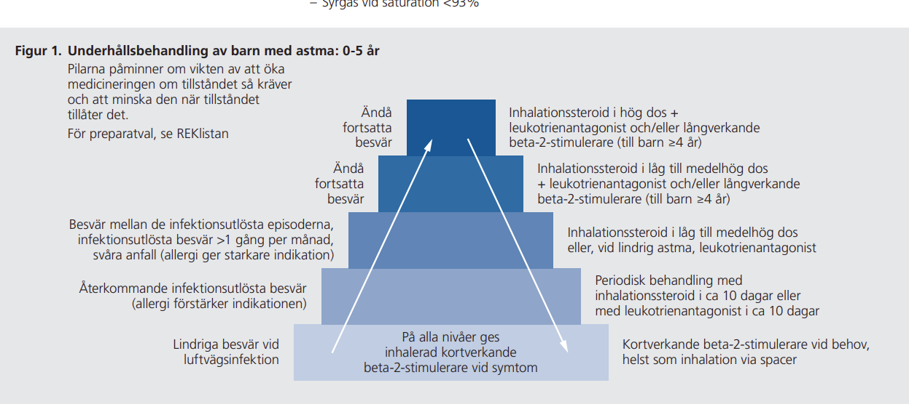

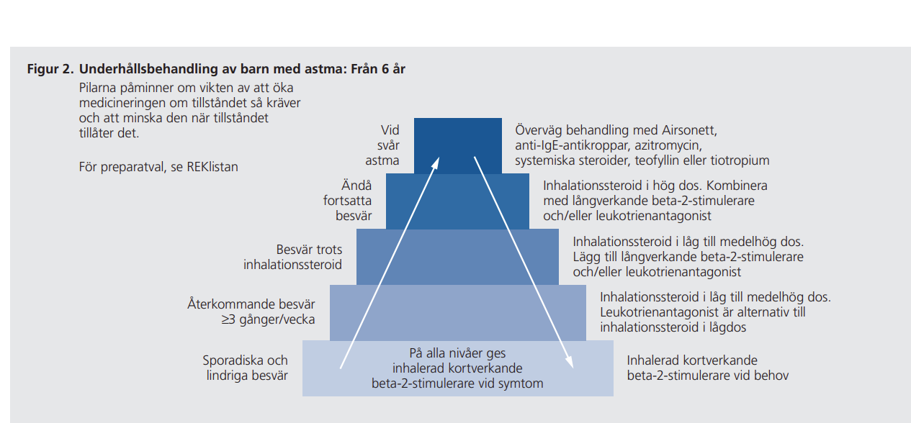

### Atopi

***Presentation***

* !!! ?? Allergiska eller atopiska sjukdomarna i barnaår utgörs grup 4 typiska manifest. ett par debuterar mkt tidigt, en senare och fjärde i skolålder
  * ange de fyra manifesten i den ordning åldersmässigt
    * !! Atopiskt eksem: Debute inder första levnadsået
    * Födoämnesallergi: beroende på allergi (mjölk, ägg första levnadsåret); jordnöt andra nöter, skaldjur ofta senare
    * Astma: 
      * flera obstruktiva episoder under 2åå
      * En obstruktiv episod om över 2åå
    * Hösnuva: ofta senare i åldrana, men kan debutera tidigt

### Komjölksallergi

***Presentation***

* ***Astrid, 11 månader*** 
  * kommer med modern till barnmottagningen på grund av buksmärtor och lösa avföringar. Hon har haft säkert 6-7 luftvägsinfektioner och bedömts obstruktiv men har ej haft några säkra pneumoniermen väl 4 otiter. Hon är gnällig och missnöjd. Hon äter normalkostför åldern.
  * För in följande vikt-och längdvärden i tillväxtkurvan på nästföljande sida:Födelse: 3,5 kg, 51 cm. 1 månad: 4,8 kg, 54 cm. 2 månader: 5,5 kg, 58 cm. 3 månader: 6,2 kg, 62 cm. 5 månader: 7,5 kg, 66 cm.7 månader: 7,7 kg, 70 cm. 9 månader: 7,9 kg, 72 cm. 11 månader: 8,1 kg, 74 cm. I status kan du se att hon är mager.
  * ***Bild nedan***

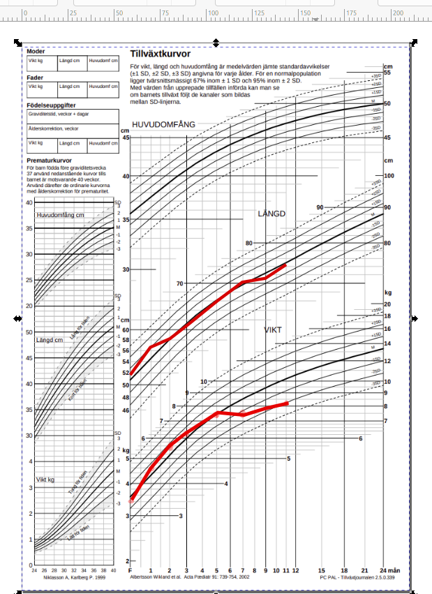

## Akut pediatrik

### Presentation och orsaker till svår sjd hos barn

* **Chocktillstånd, shock**
  * **Hypovolemi**: sepsis, dehydrering (gastroenterit), diabetes ketoacidos, blodförlust (trauma)
  * **Maldistribution av vätska**: sepsis, anafylaxis
  * **kardiogent**: arrytmier, och hjärtsvikt
  * **neurogent**: spinal skada
* **Respiratory distress, andningssvikt**
  * **Övre luftvägs obstruktion:** krupp, epiglottit, kongenitala malformationer, trauma, främmande kropp
  * **Nedre luftvägs disorders:** astma, bronkiolit (bronchiolitis), pneumoni, pneumothorax
* **somnolent (dåsig), medvetslös, krampande barn**
  * **postiktalitet, status epilepticus**:
  * **infektion**: meningit, encefalit
  * **metabol**: diabetes ketoacidos, hypoglykemi, elektrolyt påverkan (kalcium, mangesium, antrium), medfödda metabola syndrom
  * **huvudskada**: trauma, icke-accidental skada
  * **läkemedel, toxisk ingestions**
  * **intrakraniell blödning**
* **Kirurgiska akuta tillstånd**
  * **Akut buk:** appendicit, peritonit
  * **Intestinal obstruktion:** intussuception (invagination), malrotation, tarm-atresi, tarm-stenos

### Resuscitation: HLR o grabbarna

***Presentation***

* Hjärtstopp hos barn väl förberedda och ovanliga, 
  * förhållandet hjärtkompressioner o inblåsningar
    * Initierar med 5 inblåsningar, 
    * sen 15:2
  * Hur ofta kontroll hjärtrytmen
    * 2min
  * Hur långt efter adrenalindos 1 ges dos nr2
    * 4min
  * när vuxma får hjärtstopp är bakomliggande kardiell ischemi vanligt
  * vad är vanligaste orsaken t hjätrstopp
    * hypoxi (e.g. asfyxi)
* !!! **3 månader gammal gosse**
  * inkommer på larm pga apné i hemmet. Han var på barnakuten föregående kväll och man konstaterade då RS-virusinfektion. Han hade i samband med akutbesöket haft bra effekt av inhalationer med Natriumklorid och kunde återgå till hemmet efter några timmar. Du står redo som barnjour och teamledare på akutrummet när ambulansen ankommer. När gossen lyfts över från ambulansbritsen till neobordet noterar du att han är rejält snorig. Andningen är snabb och ytlig, och du ser markerade indragningar. Han är blek och ligger stilla och blundar på britsen. I samband med att han kopplas upp slutar han plötsligt andas och blir livlös. På monitorn konstaterar du en asystoli. Ange 6 akuta åtgärder du omedelbart ombesörjer. (Korta punkter).
  * Larma narkos
  * 5-inblåsningar
  * 15:2
  * PVK
  * adrenalin ASAP
  * analysera rytm

#### Wet Flag

***Läkemedel enl WET-FLAG***

* ***adrenalinet***: notera att doseringen 0.1ml/kg av 0.1mg/ml avser 0.01mg/kg också, vilket är samma dos som avsett.

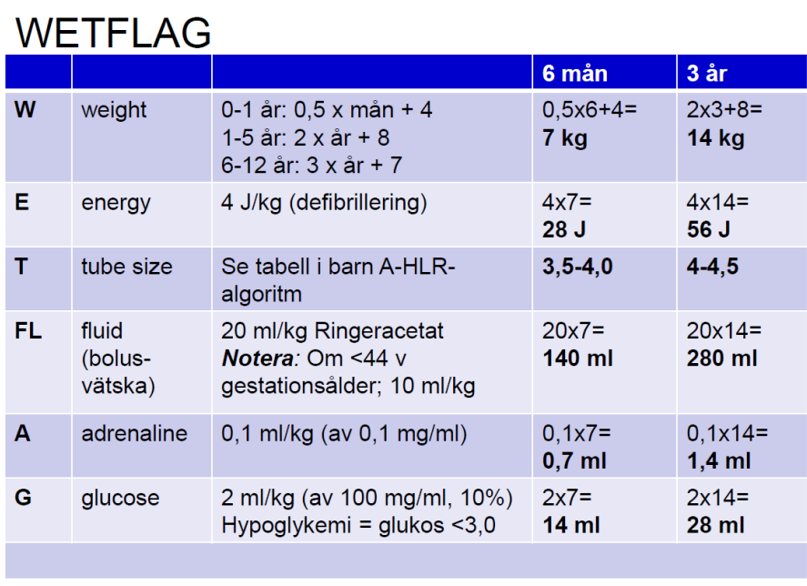

#### A-HLR

***Läkemedel***

* **Adrenalin**: 0.01mg/kg dos. 
  * **OMEDELBART VID ASYSTOLI/PEA/UNDER 60HF**: sedan var 4e minut. 
  * EFter 3e deffen, för VF/VT

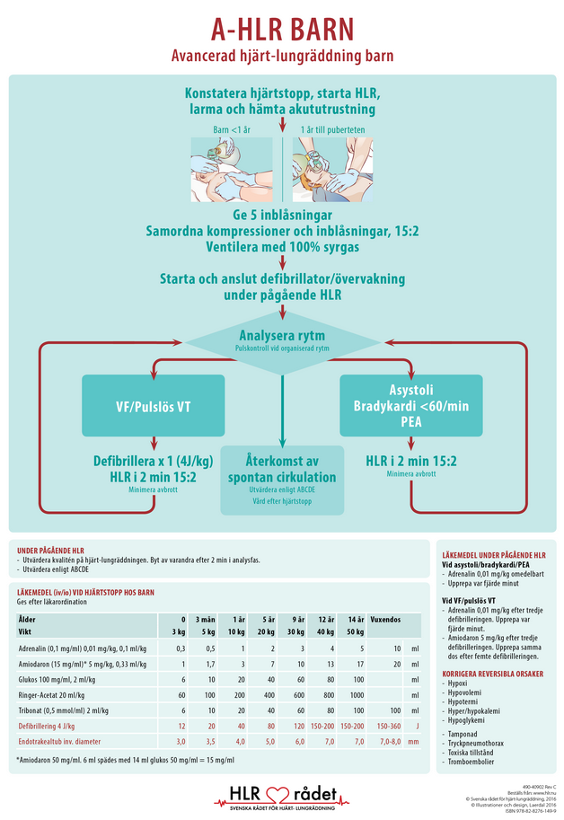

### Sepsis

***Behandling***

* VAsopressor
  * hypovolemi eller hypoxi refraktär efter 3e bolus ringer, ej återställd cirkulation 

## BUP

### Autism

***Kliniska Kännetecken***

***Impaired social interaction***

* does not seek comfort, share pleasure, form close friendships
* prefers own company, no interest or ability in interacting with peers (play or emotions)
* gaze avoidance
* lack of joint attention
* socially and emotionally inappropriate behaviour
* does not appreciate that others have thoughts and feelings
* lack of appreciation of social cues.

***Speech and language disorder***

* delayed development, may be severe
* limited use of gestures and facial expression
* formal pedantic language, monotonous voice
* impaired comprehension with over-literal interpretation of speech
* echoes questions, repeats instructions, refers to self as ‘you’
* can have superficially good expressive speech.

***Imposition of routines with ritualistic and repetitive behaviour:***

* on self and others, with violent temper tantrums if disrupted
* unusual stereotypical movements such as hand flapping and tiptoe gait
* concrete play
* poverty of imagination in play and generalactivities
* peculiar interests and repetitive adherence
* restriction in behaviour repertoire.

## Dermatolog

### Erythema migrans

***Etiologi och patofysiologi***

* ***Borrelia Burgdorferi:*** bakteire, spiroket, sprids fästngar. Fästingar i stor mängd, större delen av Sverige

***Epidemiologi***

* 

***Kliniska kännetecken***

* Erytemet börjar som en homogen ljusröd eller blåröd rodnad i hudens plan 
* 1-4 veckor efter fästingbett. 
* Efter en tid klarnar rodnaden centralt och antar en ringform, som långsamt växer i storlek. Atypiska fall förekommer mer sällan som hudrodnad utan övergång i ringform eller som vätskande hudulceration.
* Vanligtvis förekommer inga lokalsymtom, men några patienter upplever klåda och sensibilitetstörningar över rodnaden.
* Knappt 10 % av patienterna utvecklar multipla erytem. Detta, liksom feber, anses utgöra tecken på disseminerad infektion med ökad risk för spridning till andra organ.
* Bilderna nedan visar hur erytema migrans kan se ut.

***Differentialdiagnoser***

* Bettreaktion (försvinner inom 1 vecka)
* Kontaktallergi
* Svampdermatoser
* Erysipelas

***Behandling***

* ***Singelerytem utan feber (vuxna)***: Fenoximetylpenicillin, Kåvepenin) 1 g x 3 i 10 dagar. 
  * Barn 25 mg/kg x 3. Rodnaden brukar blekna efter 4-5 dagar och därefter successivt försvinna men kan finnas diskret kvar efter behandlingsavslut, vilket inte innebär att infektionen finns kvar. 
* ***Multipla erytem eller feber***  
  * **doxycyklin** 200 mg x 1 i 10 dagar. 
  * **Barn < 8 år amoxicillin** (Amimox) 15 mg/kg x 3 i 14 dagar.
  * **Barn > 8 år doxycyklin** 4 mg/kg x 1 i 14 dagar. 
* ***Pc-allergi*** - doxycyklin 200 mg x 1 i 10 dagar. 
  * **Till barn > 8 år doxycyklin** 4 mg/kg x 1.
* **allergi cefalosporiner**: kan ett sämre alternativ prövas, t e x [azithromycin](https://www.fass.se/LIF/result?userType=0&query=azithromycin) ([Azitromax](https://www.fass.se/LIF/result?userType=0&query=Azitromax)) eller doxycyklin trots ålder < 8 år. 
  * Risk för missfärgning på tänderna av doxycyklin efter kortare kurer till barn har inte påvisats (se ref Todd et al).
* **Amoxicillin** kan vara ett alternativ till barn som inte tål smaken av vanligt PcV. 
* **Gravida dubbel dos Fenoximetylpenicillin** (Kåvepenin) vid hudmanifestationer och intravenöst ceftriaxon) 
  * Rocephalin vid andra manifestationer för att minska risken för infektion av foster.

## Endokrin

### Diabetes

***Etiologi och patofysiologi***

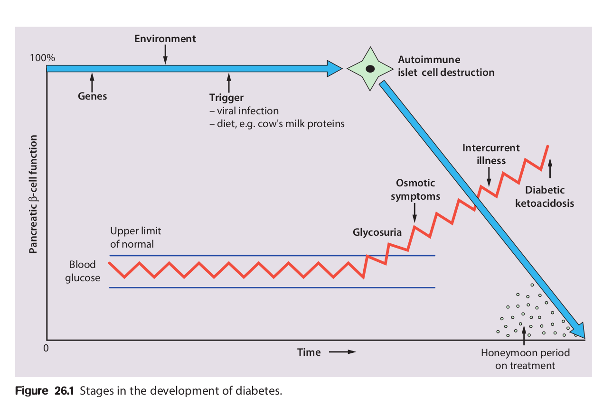

### Diabetes-ketoacidos

***Presentation***

* Diabetes med ketoacidos är ett fruktat och livshotande tillstånd hos både barn och vuxna. Tillståndet kräver skyndsam handläggning.
  * pH 7,28, BE -12, risk för hypokalemi när insulin ges, takypné vanligt
  * Fel alternativ
    * pH 7,04, BE -15, risk för hjärnödem om blodsockret inte sänks nog fort, acetondoft förekommer
    * pH 7,42, BE -14, insulin bör ges parallellt med glukosdropp för att förhindra snabb sänkning av blodsockret, behandling bör initialt ske på IVA: 
      * enl abbe att glukosdropp ges parallelt med insulin stämmer, detta överensstämmer med janusinfo också
    * pH 7,47, BE -15, insulinbehandlingen bör starta omgående, risk för hyponatremi och hjärnödem

### Gynekomasti

***Presentation***

* **15-year-old healthy boy**
  * presents for a routine health maintenance visit. On examination, you note bilateral breast enlargement and sexual maturity rating 3 (Tanner stage) pubertal development. The remainder of the examination is unremarkable. Which of the following is  the most appropriate next step in management?
    * Order no tests and provide reassurance that the condition will resolve spontaneously.

***Etiologi och patofysiologi***

***Epidemiologi***

***Kliniska kännetecken***

***Utredning och handläggning***

* Gynekomast + under pubertet + verkar vara normal utveckling: ingen vidare utredning eller handläggning, utan man exspekterar
  * det är normalt med gynekomasti under puberteten, så det gör inget.
* Persisterande gynekomasti: att det har pågått ett tag etc, förutsatt att barnet inte är överviktig etc, kan man överväga kirurgi för att ta bort vävnaden. 

***Behandling***

## Farmakologi

### Intoxikation

***Epidemiologi***

* 60% av alla intoxer i barn sker under 6 år
* 90% av intoxerna är accidentala; majoriteten hemma när vårdnadshavare är distraherad
* flesta ämnen intas oralt av barnen. men kan inhaleras, spillas på hud eller ögon, eller injiceras intravenöst
* mortalitet är under 1%

***Etiologi och patofysiologi***

* **Vanligaste toxin exponeringen är hushållsprodukter**:
  * flesta exponeringarna: kosmetika, personal care products
  * rengöringsmedel
  * hostmedel eller förkyulningsmedel
  * vitaminer, inklusive järn
  * **analgetika**: paracetamol, NSAID, ASA
  * **växter**: 6-7% av alla oralt intagna intoxer...
  * **alkohol**: etanol,
  * **hydrocarons**: gasoline, paint thinner, furniture polish
  * kolmonoxid
  * förskrivna läkemedel

***Kliniska kännetecken för olika toxiner***

* **Dofter**
  * Bitter mandel: cyanid
  * vitlök: arsenik, organofosfater
  * aceton: salicylater, isopropyl alkogol
  * wintergreen: metyl salicylater
  * moth ball: camphor
* **Hud tecken**
  * Cherry red color, cherry röd: kolmonoxid, cyanid
  * svettig: organofosfater, sympatomimetika (sympathomimetics)
  * torr hud: antikolinergika
  * urtikaria: allergisk reaktino
  * grå cyanos: methemglobinemi
* **ögon**
  * **miosis:** opiater, phencyclidiner, organofosfater, phenothiazines
  * **mydriasis**: amfetaminer, kokain, tricykliska antidepressiva, atropin
  * **nystagmus**: dilantin, phencyclidine
  * **retinala blödningar**: kolmonoxid, metanol
* **allmäntillstånd**
  * **feber**: kokain, TCA, phencyclidine, salicylater, thyroxin, antikolinergika, amfetaminer, teofyllin

***Utredning***

* ***Tänk på intox***: hos patienter som presenterar med **icke-specifia tekcen och symptom**
  * kramper
  * svår kräkning
  * diarre
  * dysrytmi
  * förändrat sinnestillstånd, mental status
  * abnormt beteende
  * chock
  * trauma
  * icke-förklarad metabol acidos
* ***Anamnes***: fr vårdnadshavare typiskt sett identifierar intoxer
  * info om toxinet: bör inkludera namnet, toxin koncentration om känt, och hur pat exponerats
  * potentiell intox-dos räkanas fr **worst-case scenario**
    * toxicitet är vanligtvis på basis av dos per kg kroppsvikt
  * **multipla ämnen eller medel hos ungdomar (adolescents)**
  * **Bakgrundsinfo**: plats där upptäckt patienten, växter, vitaminer, herbs, kemikalier hemma, tid som det skett
  * läkemedel
* ***Status***: bör täcka allt, kan ge tecken på intoxmedel, 
* ***Labb***:
  * **screening**: glukso, u-tox, elektrolyter
  * **blodgas**
  * **anjon-gapet**: [Na - (cl + hco3)]
  * **Akuta intoxprover enligt lokala rutiner** (etanol, metanol, paracetamol, aceton m m)
  * **Biologiska alkoholmarkörer** vid misstanke om alkoholmissbruk (PEth, CDT)
  * **Drogscreening** av narkotika i urinprov (på patienter med KAD)
  * **Riktade toxikologiska prover** (urin, serum, ev hår naglar)
  * **Täta kontroller av elektrolytstatus** (rutinstatus)
  * **Arteriella blodgaser med syra-basstatus** (inklusive laktat, CO-Hb, Met-Hb)
  * **SvO2 och laktat** vid misstanke om **cyanidförgiftning** eller **grav hjärtsvikt**
  * **B-glukos**
  * **Myoglobin i serum (rabdomyolys**)
  * **Hjärtenzymmarkörer** vid **kolmonoxidförgiftning** eller EKG-förändringar eller hjärtischemi plus CO-Hb
  * **Spara och frys ett extrarör med venblod** (serum) från inkomsten för kompletterande diagnostik i oklara eller mycket allvarliga fall

 ***Handläggning***

* ***Allmänna saker att tänka på***
  * **övervaka**: vakenhet, andning
  * **understödja**: andning, cirkulation, vb
  * **behandla**: akut förvirring, motorisk oro på ett lugnt säkert sätt
  * **identifiera tox agens**
  * **aktiv elimination, vid indikation**: ventrikeltömning, medicinskt kol, dialysbehandling. så länge nyttan överväger riskerna
  * **antidotbehandling, vid tydlig indikation**
  * **vårdnivå**: korrket vårdnivå för att korrekt handlägga evt sänkning medvetande etc
  * **uppföljning socialtjänst + psykiatri**
* ***Akut omhändertagande***
  * **ABCDE**: följ denna algoritm och allt vad det leder till, med syrgas, EKG, saturation, etc
  * **infarter:** pvk, gärna två infarter
  * **artärnål, när medvetslös, acidos, cirkpåverkan**
  * **cvk, nämns internetmed**

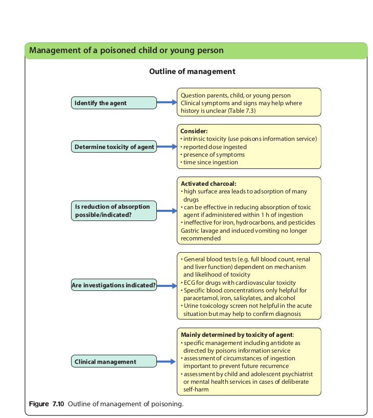

***Anjon-gapet***

* ***ökat anjon-gap***: AMUDPILES mnemonic
  * Alkohol
  * metanol
  * uremi
  * diabetesketoacidos
  * paraldehyd
  * iron
  * isoniazind
  * laktacidos
  * etylene glykol
  * salicylater

***Behandling***

* **Ventrikeltömning**
  * **manuellt**: endast småbarn, initialskedet
  * **ventrikelsköjning, grov sond gm munnen**
* **Aktivt kol**
  * **manuellt eller pipmugg**
  * **deponerat** (instillerat) i magen via ventrikelsond upplöst i vatten

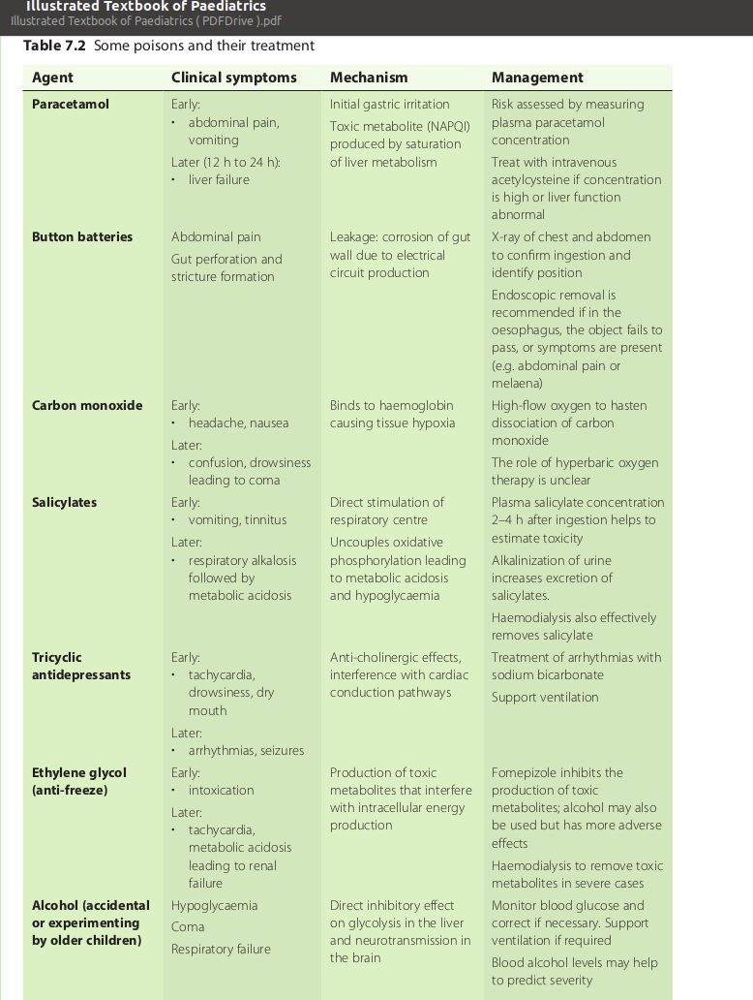

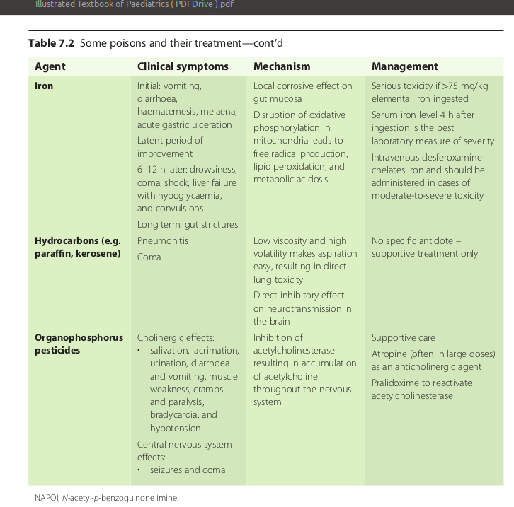

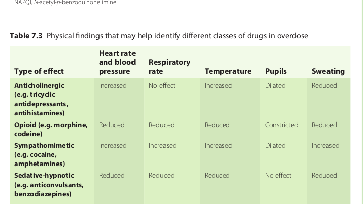

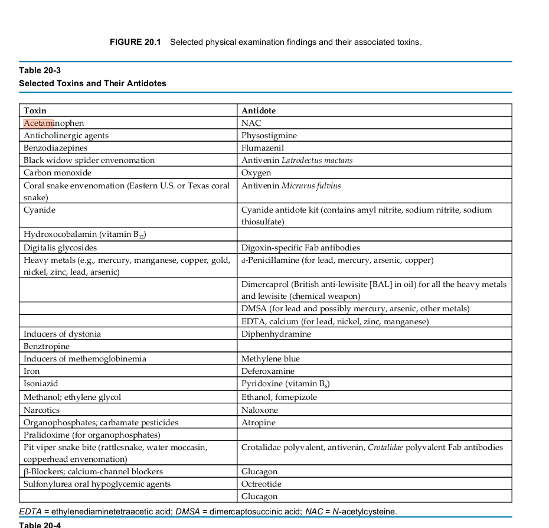

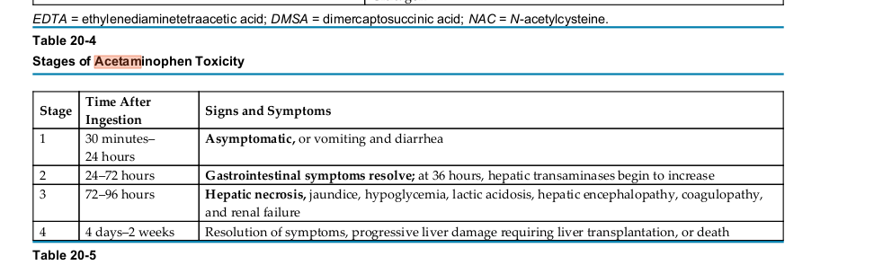

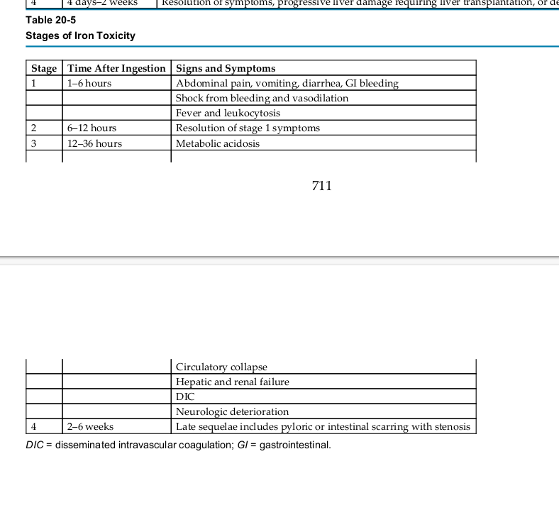

### Intox paracetamol

***Presentation***

* Du är akutjour på barnakuten. Anna, 1,5 år inkommer med sin mormor. Hon har hittat Anna sittandes på golvet i badrummet lekande med en öppnad burk kapslar Panodil (paracetamol 500mg). Du undersöker Anna som är glad och opåverkad. Mormor har ingen aning om hur många tabletter som fanns i burken, och det går inte att utesluta att Anna fått isig tabletter.
  * inläggningsfall, leverprover
  * antidot: acetylcystein för att undvika leversvikt
* Du är akutjour på barnakuten en torsdagkväll. Med ambulans kommer en 16-åriga Frida som är ledsen och luktar sprit. Enligt bästa kompisen som har larmat ambulansen har Frida SMS:at tidigare ikväll att hon inte längre vill leva. Frida, som är vaken och svarar på tilltal, berättar att hon för ungefär fyra timmar sedan tagit en massa värktabletter hon köpt på ICA och sköljt ned det med sprit från en dunk som pappa köpt av en kompis. a) När du har förvissat dig om att ABC är ok ordinerar du intoxikationsprover från infarten som ambulansen satt. 
  * **Vilka substanser är de viktigaste att fråga efter i det här läget (ange 4 st)? (1p)**: paracetamol, etanol, metanol, ASA (enl tentadok)
  * acetylcystein mot värktabletten, motverkar leverskador om ges innan paracetamolet brytits ned...
  * utöver bakjour, andra kontakter: BUP, Socialtjänsten, föräldrar (enl tentadokument)

***Kliniska kännetecken***

* **Tid efter intag**
  * **30min-24h**: asymptomatisk, eller kräkningar och diarre
    * buksmärtor, ibland mer lokaliserat i övre högre kvadranten
    * illamående, kräk, diarre
    * takykardi
    * medvetandepåverkan,
  * **18-25h:** 
    * minskad symptom
    * ASAT och ALAT höjning
    * stegring av PKINR
    * blodlaktatstegring 2-3mM. 
  * **24-72h**: gastrointestinala symptom resolve; vid 36timmar lever transaminaser stiger (ASAT,ALAT)
  * **72-96h**: levernekros, hepatisk nekros, ikterus, hypoglykemi, laktacidos, leverencefalopati, koagulopati, eller njursvikt
  * **4d-2v**: resolution av symptom, progressiv leverskada kräver levertransplantation eller död

***Differentialdiagnoser***

* Gastroenterit
* gastrit
* hepatit
* pankreatit
* svampförgiftning

***Handläggning***

* ***Anamnes***
* **Status**
  * ABCDE
* ***Labb***
  * EKG
  * S-paracetamol
  * Blodstatus (Hb, LPK, TPK)
  * Leverstatus (ASAT, ALAT)
  * Koagulationsstatus (PK-INR, aPTT)
  * Elektrolytstatus
  * P-glukos
  * S-amylas
  * Venös eller arteriell blodgas (blodlaktat kan vara förhöjt vid allvarlig förgiftning)
* **Monitorering**
  * Daglig och v b uppföljning av:
    - Leverstatus (ASAT + ALAT + PK-INR)
    - Elektrolytstatus
    - Syra-bas inklusive blodlaktat (4-5)
    - Koagulationsstatus
    - Vätske- och elektrolytbalans
  * P g a risken för blandintoxikation skall ALLA intoxikationer monitoreras initialt med avseende på vitalparametrarna: 
    - Andning
    - Cirkulation
    - Vakenhet
  * **S-paracetamol mätningar:** Tänk också på att ett normalt eller lätt förhöjt S-paracetamol kan ha varit högt och på väg ner, eller är på väg att stiga.

***Behandling***

* Acetylcystein iv
  * *Acetylcystein behandling vid icke-depotpreparat när s-paracetamol saknas:* Starta behandling, ge först 200 mg/kg kroppsvikt i 500 ml glukos 50 mg/ml eller isoton NaCl under 4 timmar (50 mg/kg/timme) och därefter 6,25 mg/kg/timme under 16 timmar eller längre. Ring GIC om oklarhet, 010 456 67 00.
  * *Acetylcystein vid behandling av icke-depotpreparat ges enligt nedan när svar på s-paracetamol finns:* Acetylcystein insätts om s-paracetamol ligger > 1000 mikromol/l vid 4 timmar, 700 mikromol/l vid 6 timmar, 500 mikromol/l vid 8 timmar och 350 mikromol/l vid 10 timmar efter överdosering. Ring GIC vid oklarhet/osäkerhet, 010 456 67 00.
  * *Acetylcystein vid överdosering av depotpreparat:* Exempelvis Alvedon 665 mg. Ge 200 mg/kg kroppsvikt i 500 ml isoton glukos eller NaCl-lösning under 4 timmar. Därefter underhållsbehandling med acetylcystein 12,5 mg/kg/timme under minst 20 timmar. 150 mg/kg löses i 500 ml under varje 12 timmars period. Innan acetylcysteinbehandlingen avslutas skall s-paracetamol kontrolleras och inte vara påvisbart.
* ***Ventrikeltömning och medicinskt kol***
  * Ventrikeltömning samt medicinskt kol eller enbart medicinskt kol (Kolsuspension 150 mg/ml, 100 ml) kan bli aktuellt. 
    * **Kortare tidsintervall = bättre:** Dessa åtgärder är dock mer effektiva ju kortare tidsintervall det föreligger mellan tablettintag och inkomst till sjukhus.
  * **relativ kontraindikationer:** mot kol är risk för aspiration vid exv kräkning och medvetandepåverkan.
  * Överväg ventrikelsond vb.
  * **acetylcystein ge ej medicinskt kol:** Rekommendationen är dock att antidot alltid bör ges intravenöst.
* Elektrolytkorrektion, korrektio acidos: Korrektion av elektrolytstörningar och eventuell acidos
* Undvik hypoglykemi
* Upprätthåll god diures. Timdiures v b
* Motverka hypotension
* Undvik hypoxi
* Antibiotika vid minsta misstanke om infektion

### Intox petroleumprodukter

***Behandling***

* **Kontraindicerat**
  * ventrikelsköljning/kräkning kontraindik: risk aspiration lungor, kemisk pneumoni
* ***drick grädde istället.***

## Gastroenterologi

***Allmänt***

* Daniel, 15 år, 
  * har sedan några månader varit trött och håglös. Hans skolprestationer har tidigare varit goda men har den senaste tiden varit sämre. Han har inte gått upp i vikt det senaste året och har vuxit 4 cm på längden. Han har haft 3 - 4 lösa avföringar per dag och för detta har man för 2 månader sedan sökt på allmänläkarmottagningen. Man tog avföringsodlingar och TSH. Båda undersökningarna visade ingen patologi. SR 32 mm. I status kan du konfirmera blekhet. I övrigt finner du inget fokalt patologiskt i mun o svalg, hjärta, hud, lungor eller buk. Du vill förstås utreda pojken med bakgrund av hans symtomatologi. Vilka prover anser du vara de viktigaste av nedanstående alternativ för att få klarhet i pojkens sjukdomsbild och kunna gå vidare utredningsmässigt. (2* 
  * Blodstatus, elfores, ANA, immunglobuliner, transglutaminas 
  * Elektrolyter, komplement, urinsticka, transglutaminas 
  * Elektrolyter, F-calprotectin, albumin, transglutaminas 
  * Blodstatus, ANA, kreatinin, proteinfraktioner, transglutaminas 
  * rätt: Blodstatus, F-calprotectin, proteinfraktioner, transglutaminas 

### Biliär atresi, gallvägsatresi

***Behandling***

* Kasais procedure: hepatoportoenterostomi

### Bilirubin

***Fysiologi***

* Peak bilirubin: dag 3

### Choledocal cyst

***Utredning***

* Ultraljudsundersökning

### Diarre 

***Etiologi och patofysiologi***

* Många faktorer kan generera diarre- 
* **Malabsorption**
  * inadekvat absorption nutrienter, karakteriseras av diarre, abdominell distenison, försämrad tillväxt
* ***Virala orsaker***
  * ***Rotavirus***
    * **Epidem**: världen, rotavirus vanlgiaste agens orsaka t gastroenterit. RNA-virus ses i **vintermånader** sprids enkelt **fekal-oralt**. incidens minskat signifikant hos spädbarn pga **vaccination första 6 månaderna**
    * ***Kliniska kännetecken***: inkubation 1-3 dagar. kan vara asymptmatiska, eller kräk, diarre, dehydrering. diarre self-limiting, varar 4-7 dagar. Symptom ÖLI kan förekomma
    * ***Diagnos***: pos ELISA avföring, ingen LPK i avföring
    * ***Handläggning:*** understödjande behandling, specifikt vätska, tidig matning för att undvika gut atrofi (tarm atrofi?), hydrasec kan man ge. vissa barn kan få **transient laktosintolerans**
  * ***Norovirus***
    * ***EPidem***: RNA VIRUS, effektivt spridd fekal-oralt. kontakt med infekterade fomites (any inanimate object som har kontaminerats med infektiös grej)
      * utbrott gastroenterit sker i alla åldersgrupper, speciellt avstängda populationer (dagis, skolor, kryssningsskepp)
    * ***Kliniska kännetecken***: liknar rotavirus. kräkningar är ett prominent symptom. duration är 48-72 timmar, kortare duartion jämfört med andra virala orsaker
    * ***Diagnos***: bekräftas med ELISA avföring
    * ***Handläggning***: understödjande behandling, vätskeintag viktigt, elektrolyter
  * ***Bakteriella orsaker***: se tabellen, men enterotoxigena (ecoli), enteropatogena (epec), shigella sommei, salmonella species, campylobacter
  * ***Parasit orsaker***
* ***Hyperton dehydrering***: initialt förlust hypoton vätska via diarre. sedan extravasal vattenförlust med resutlerande hög natriumkonc i ECV

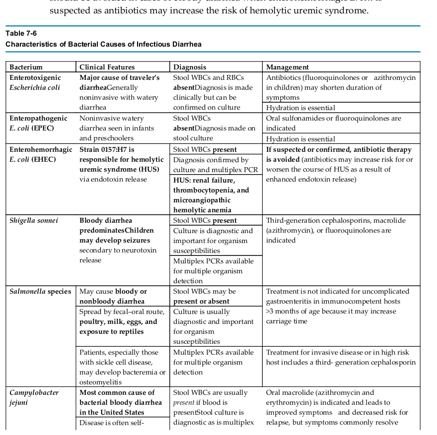

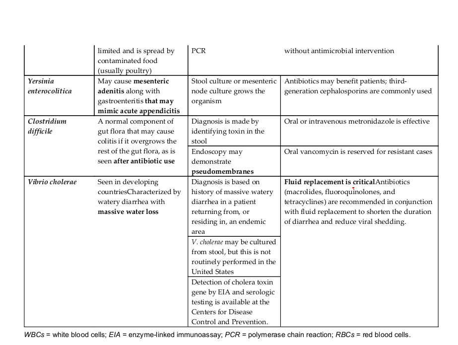

***Utredning och handläggning***

* **Anamnes**
  * epidem
  * symptom: diarrefrekvens, blod, kräk, feber, buksmräöta, vätskeintag, födoitnag, urinmängd
  * andra sjd: nedsatt immunförsvar, diabetes
  * tidg anamens diarre (blodtillblandad) o viktnedgång
  * antibiotika nyligen
  * förekomst feber, utslag, abdominell smärta, kräkningar, blod i avföring, slem i avföring
  * recent antibiotika användning (e.g. kan resultera i C. Difficile infection)
* **Status**
  * vitalparam, AT, hjärta, lungor, buk, inspek hud.
  * **IBD** misstanke: anus åtminstone inspektera
  * ***feber***: undersöka lymfkörtlar, öron, samt mun o svalg MoS
  * ***bukstatus***: ofta normalt vid gastroenterit. ibland ömt utmed kolon, ffa vä sida. 
    * vid peritonit o palpabel resistens bör man överväga invagination, toxisk megakolon, appendicit
* ***Laboratorie***
  * Blodstatus (CBC complete blood count)
  * LPK
  * Ova and parasite evaluation
  * Specifik och snabbtest för ELISA och PCR är användbar vid rotavirus, norovirus, giardia lamblia, cryptosporidium, C difficile infektion. 
  * Bakteriell multiplex PCR test 
  * **Elektrolyter**: klassiskt att icke-anjon gap hyperklorem metabol acisdos, av bikarbonat förlust i avföring
  * Användning med avföringsodling liten om man inte har vita blodkroppar i avföringen

***Behandling***

* **Vätskebehandling**: hörnsten för terapi vad gäller diarresjukdomar...
* ***Antibiotika***: undvik vid blodig diarre, e.g. EHEC, för att **öka risken för HUS**
* ***Vaccination***: infördes sll 2014, nationellt 2019. 

### Ej passera avföring

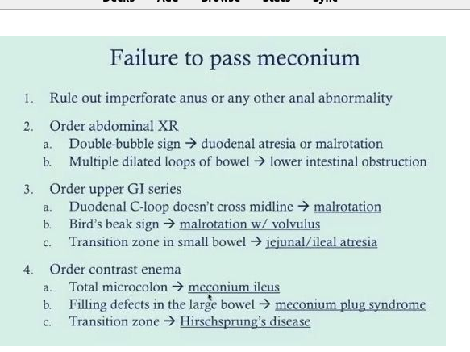

### Funktionell förstoppning

***Diagnos***

* Förstoppning utan känd orsak

### Förstoppning

***Presentation***

* Det sista barnet på dagens BVC-mottagning är snart 5 år gamla Samir. Han är uppsatt på ett extra barnläkarbesök till dig då han enligt medföljande pappa klagat över varierande grad av buksmärtor de senaste veckorna. Hans aptit har varit klen så länge pappan kan minnas. ”Samir käkar bara makaroner med ketchup!” Han bajsar hårda korvar 2-3 gånger per vecka. Vissa dagar är avföringen omväxlande lös och hård. Blod har man aldrig noterat 
  * Sannolika orsaken buksmärtor: förstoppning
  * Behanding på mottagning, respektive hemmet: 
    * klyx mottagningen
    * hemma: äta annat än makaroner, även fast det är svårt.
      * högt fiberinnehåll, intag vatten
      * fysisk aktivitet
      * bulkmedel, movicol: 3-4ggr, period 3-6mån (el tills vidare=)
  * glutenprov ua
  * blodstatus + ferritin: Hb 92, TPK 355, LPK 8, MCV 64, ferritin 4 (10-150)
  * hur tolkar du resultaten?
    * Järnbrist anemi, mikrocytär anemi just av Hb brist pga nedsatt produkton relaterat t bristande järndepåer
  * Vad rekommenderar du för behandling med anledning av analyssvaren
    * Järntillskott. 
    * Försöker äka mängden kost i maten.	

***Röda flaggor***

* Tillväxthämning, faltering growth: Hypothyroidism, celiaki, och andra orsaker

### Gluteinitolerans

***Presentation***

* Samirs kusin är 
  * glutenintolerand, frågar om man kan ta ett glutenprov
  * VIlket prov: transglutaminas antikroppar
  * Gltuenprovet ua. 

### Ikterus hos barn

***Presentation***

* **Du går BB rond och blir informerad om ett barn som är 30 timmar gammalt och har bilirubin 280 (högt) varav konjugerat 20**
  * ABO-immunisering, Rh-immunisering
  * sfärocytos
  * fysiologisk
* **3 dygn gammalt arn, ikteriskt, bilirubin 380, konjugerat 10**
  * Bröstmjölksinducerad: detta bör istället vara amningsikterus
  * fysiologisk
* **6 veckor gammalt barn ikteristk, gulgrön ton som tilltagit senaste tre veckorna. bili 270, konjugerat 90**
  * Gallvägsatresi
  * lever/gallvägssjukdom - hepatit
* **5d gammal nyfödd, neonat**
  * The parents of a 5-day-old term infant notice that he is jaundiced. 
  * Your physical examination is remarkable only for scleral icterus and jaundice. 
  * The infant’s total bilirubin level is 15 mg/dL, with a direct component of 0.4 mg/dL. 
  * Which of the following is the most likely diagnosis? amningsikterus (breastfeeding jaundice) är svaret
    * Breastfeeding jaundice is typically associated with indirect, or unconjugated, hyperbilirubinemia and is caused by suboptimal milk intake during the first
      week of life, which causes weight loss, poor hydration, and decreased stool output. 
    * The treatment of breastfeeding jaundice is hydration, which typically includes increasing the frequency of breastfeeding, along with observation and serial bilirubin assessments. 
    * Breast milk jaundice, which occurs later, after the first week of life, is thought to be associated with high levels of lipase and β-glucuronidase within breast milk. 
    * Choledochal cysts, biliary atresia, and neonatal hepatitis are more typical causes of direct, or conjugated, hyperbilirubinemia.
* **Allmänt om ikterus**
  * Fysiologsk ikterus är vanligt hos nyfödda, varför
    * Omställninge fetalt hemoglobin till adult hemoglobin
    * nedbrytning bildas det bilirubin som konjugeras av levern, innan det kan skickas vidare ut i gallan
    * Stora nedbryuntningen hmelgobin orsakar för stor mängd Hb för levern att process, varpå man får ikterus, 
    * Enl BRS: 
      1. Increased bilirubin load on hepatocytes due to breakdown of red blood cells
      after birth
      2. Delayed activity of the hepatic enzyme glucuronyl transferase
      2. ?? Har detta att göra emd HbF eller att det är en anann mekanism som styr nedbrytningen RBC
* **5v gammal siri. Tiden bokad kontroll ikterus. undersökning pigg, men hy o sklera är tydligt gyla. hon helammas med god aptit.** 
  * Vilken bakomliggande icke-patoglogiskt orsak t gyulhet misstäner du i första hand
    * Bröstmhölksinducerad
* **Vänninnans barn som opats pga svår o ovanlig gulsotssjukdom, vid 3månaders ålder**
  * ange ett tilltånd el diagnos hon sannolikt dyftar p
    * gallvägsatresi, biliär atresi
  * vilka 2 blodanalysr bör man beställa för att initialt utreda detta tillstånd
    * konjugerat bilirubin och totalbilirubin
    * // konjugerat bili över 20% totalbili är patologiskt o kräver vidar utredning
* **Det finns flera olika bakomliggande orsaker till att ett nyfött/några veckor gammalt barn har ikterus. Ange för varje punkt (ålder) två relevanta bakomliggande orsaker till ikterus (3p)** 
  * 30h gammalt barn ikteriskt med bili 280 och konj 20
    * övervikt okonjugerat
    * neonatal ikterus (nedbrytning av hem). RH-immunisering, ABO-immunisering
  * 3d gammalt, ikteriskt, bilirubin 380, konjugerat 10
    * Övervikt okonjugerat

***Etiologi och patofysiologi***

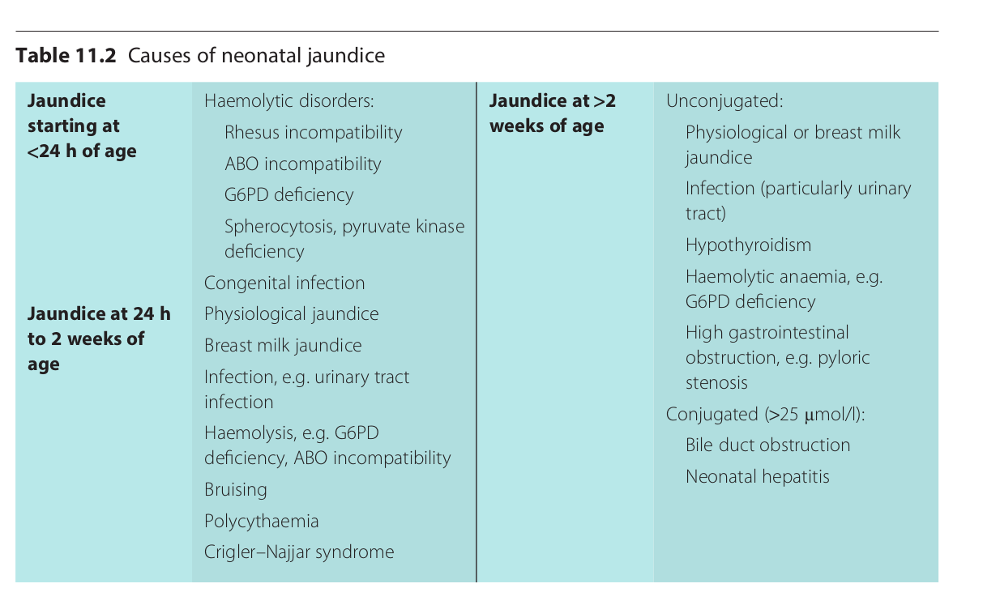

#### Konjugerade orsaker

##### Neonatal hepatit

***Etiologi och patofysiologi***

* **Bilirubin, ökat konjugerat:** Man skulle tro att hepatitetn leder till att kapaciteten för levern att eliminera bilirubin och konjugera bilirubin påverkas. Men det verkar som att den huvudsakliga effekten är att kapabilitten att eliminera konjugerat bilirbuin påverkas
  * BRS: "The symptoms of neonatal hepatitis are similar to [biliary atresia](http://www.hopkinsmedicine.org/healthlibrary/conditions/adult/pediatrics/biliary_atresia_22,BiliaryAtresia/), in which the bile ducts are destroyed for reasons that are not understood. An infant with biliary atresia also has jaundice and an enlarged liver but is growing well and does not have an enlarged spleen. These symptoms, along with a liver biopsy and blood tests, are needed to distinguish biliary atresia from neonatal hepatitis."

#### Okonjugerade orsaker

##### Bröstmjöksinducerad ikterus

***Etiologi och patofysiologi***

* Okonjugerad hyerpbilirubinemi
* neonatal hyperbilirubinemi
* okänt enzym i bröstmjölk: inhiberar konjugering av bilirubin, pga enzymet som finns i bröstmjölken
* 

##### Amningsrelat

***Presentation***

* **5d gammal nyfödd, neonat**
  * The parents of a 5-day-old term infant notice that he is jaundiced. 
  * Your physical examination is remarkable only for scleral icterus and jaundice. 
  * The infant’s total bilirubin level is 15 mg/dL, with a direct component of 0.4 mg/dL. 
  * Which of the following is the most likely diagnosis? amningsikterus (breastfeeding jaundice) är svaret
    * Breastfeeding jaundice is typically associated with indirect, or unconjugated, hyperbilirubinemia and is caused by suboptimal milk intake during the first
      week of life, which causes weight loss, poor hydration, and decreased stool output. 
    * The treatment of breastfeeding jaundice is hydration, which typically includes increasing the frequency of breastfeeding, along with observation and serial bilirubin assessments. 
    * Breast milk jaundice, which occurs later, after the first week of life, is thought to be associated with high levels of lipase and β-glucuronidase within breast milk. 
    * Choledochal cysts, biliary atresia, and neonatal hepatitis are more typical causes of direct, or conjugated, hyperbilirubinemia.

***Kliniska kännetecken***

* Okonjugerad hyperbilirubinemi

#### Tidsmässigt

##### Ikterus inom 24h

* HEMOLYS: vanligtvis orsakat av hemolys
* Rh-immunisering: identifieras oftat antenatalt, monitoreras och behandlas om behvös. 
  * Svårt åpverkad unge föds med hydrops, hepatomegali, splenomegali, snabbt ut vecklande ikterus
  * antikroppar bildas mot Rh-antigen (rehsus), RhD, Rh-kell, Rh-Duffy
  * Finns fler antikroppar som bilads, men sällan att dessa leder t hemolys
* ABO-inkompatibilitet, ABO-immunisering
  * VAnligare
  * !!! IgM-antikroppar: flesta antikroppar är IgM antikroppar SOM EJ PASSERAR PLACENTA
  * IgG-antikroppar: vissa kvinnor kan bilda dessa, som immuniserar mot just A, så anti-A-hemolysiner, eller anti-B-hemolysiner, som kan vara IgG
    * Dessa kan passera placenata. 
  * ikterus: ger ikterus, men mindre allvarlig jfr Rh-immunisering
  * Hb nivån vanligvis normal, eller ltiet reducrat, till skillnad fr Rh-immunisering där den kan vara starkt påverkad
  * Direkt-antikropps tst (Coombs test (BAS=) eller ere DAT), demonstrerar antikroppar på ytan = positiv
  * ikterus peakar 12h-72h

##### Ikterus inom 2d-2v

* Fysiologisk ikterus
* Bröstmjölksinducerad ikterus
* Dehydrering
* Infektion
* Andra orsaker: 
  * vanligtvis att hemolys presenterar inom 1d fr födel, kan ske inom 1v
  * hematom (bruising) och polycytemi exacerberar ikterus
  * Crigler-najjar syndrom: glucuronyl transferas bristande eller frånvarande, kan resultera i hög nivåer okonjugerat bilirubin

### Ljumskbråck

***Presentation***

* **Du vikarierar som distriktsläkare sommaren 2018 i ett samhälle 2 timmar med bil från sjukhuset i Falun. Gustaf, 2 månader har skrikit i omgångar sedan några timmar. Han har kräkts ett par gånger och verkar olycklig. När du undersöker honom har han varit lugn i ca 15 minuter och skriker ej. Han spänner lite generellt i buken när du undersöker den. Du noterar en upphöjd svullnad i höger ljumske ca 3x2 cm som verkar öm. När du trycker på den börjar han skrika igen. Testiklarna förefaller ej svullna eller ömma. Status i övrigt tycks ua förutom puls 160 när han skriker.** 
  * **a) Vad blir din åtgärd? (1p)** 
    * Misstank inklämt ljumskbråck
    * måste försöke reponera bråcket
  * Förbereda farmakologiskt, hur gör du det?
    * Smärtlindra patienten
  * När du väl lyckats med din åtgärd är han lugn och tyst och du funderar på hur du fortsättningsvis ska handlägga detta. Vad gör du härnäst
    * Operation indikerat
    * Inklämp ljumskbråck indicerar operation de närmsta veckorna
    * Remiss lasarett för omhändertagande
    * information föräldrar om besvär återkommer att söka akut, direktnummer kirurgmottaningen

## Infektion och Immunologi

### Allmänt

***Etiologi och patofysiologi***

* **Nyfödd**
  * GBS
  * E coli
  * // Undrar om det förekommer 
* **Barn 1mån-5åå**
  * Virus, ex RSV 
  * pneumokocker
  * hemofilus influenzae
  * klamydia trachomatic [verkar som att detta är inte pneumonae]
* **Barn > 5år**
  * pneumokocker
  * mykoplasma pneumonae
  * klamydia pneumonae (inte trachomatis?)

### Bronchiolitis

***Presentation***

* **3 månader gammal pojke** 
  * som insjuknade för 4 dagar sedan med en förkylning. Ingen feber. 
  * Nu vill han inte amma och han kräks i samband med hosta. 
  * Han har  interkostala indragningar och ökad andningsfrekvens. 
  * Du auskulterar en hel del slembiljud, saturationen är 89%. 
  * Han har en storasyster som är förkyld, föräldrarna friska
  * **svar: bronkiolit bronchiolitis, RSV, koksalt och syrgas**
* **3 månader gammal pojke som insjuknade för 4 dagar sedan med en förkylning. Ingen feber. Nu vill han inte amma och han kräks i samband med hosta. Han har interkostala indragningar och ökad andningsfrekvens. Du auskulterar en hel del slembiljud, saturationen är 89%. Han har en storasyster som är förkyld, föräldrarna friska. 2p**
  * RS bronkiolit, agens RS virus
  * **behandling**: rehydrering, nästoalett, inhalation NaCl, syrgas
    * rehydrering + nästoalett + inhalation NaCl + syrgas + optiflow (håller uppe luftvägarna bättre) -> CPAP
    * Syrgas  ges vid saturation under 90%. Är en lägre gräns vid RS än vanliga 92%: TODO vad gäller syrgasgränsen (noterar att det är acceptabelt ned till 90% i saturation)

***Definition***

* ***Bronchiolitis*** inflammatorisk bronkiolär obstruktion med cellulär debirs och mucus plugg, mest sekundärt t viral nedre luftvägsinfektion

***Epidemiologi***

* ***bronchiolitis är den vanligaste nedre luftvägsinfektionen under första 2 åren av livet och den vanligaste orsaken till sjukhusinlöäggning under första året***
* male to female 2:1
* epidemier occurs fr november t april
* risk av infektion ökar with day care attendance, multipla syskon, exponering till tobakrök, ingen bröstamning
* mer signifikant sjukdom occurs in patient 
  * med kronisk lungsjd, kongenital hjärtsjd, historik av prematuritet,
  * immunbrist, genetisk abnormalitet, satm spädbarn yngre än 3 månader

***Etiologi***

* ***Alltid viral***
* ***RSV*** är den vanligaste orsaken
* ***mindre vanligt***: human metapneumovirus, parainfluenza, adenovirus, rhinovirus, influenza, coronavirus,

***Kliniska kännetecken***

* ***Onset is gradual***: med övre luftvägssymptom, e.g. rhinorrhe, nasal congestion, feber, hosta
* ***Progression***: of respiratory symptom inklusive takypne, fina rassel, ronki, och ökat andningsarbete
* ***hypoxemi*** kan förekomma
* **apne**, kan förekomma hos spädbarn och barn med historika av apne of prematuritet
* **röntgen**: hyperinflation med luftfälla och patchy infiltrat och atelektas
* ***komplikationer***: kan inkluder apne, respiratorisk insuff, respiratorisk failure, och död. Bakteriell superinfektion. 
* ***torr, wheezy hosta***
* ***takypne, takykardi***
* ***subkostal och interkostala recessioner***
* ***hyperinflation of the chest***
* ***fina end-inspiratoriska rassel***
* ***high-pitched wheezes*** - expiratoriska mer än inspiratoriska
* ***Auskultation, mkt slembiljud***
* ***desaturation***

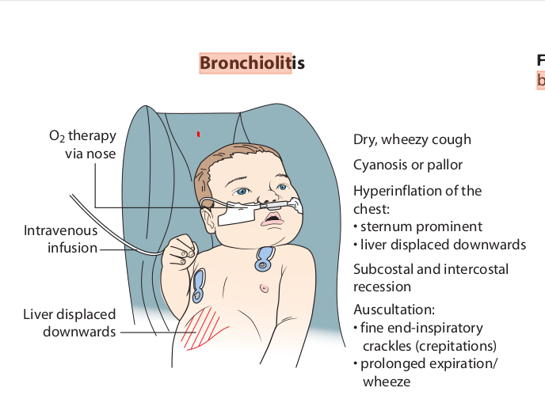

***Diagnos***

* ***kliniska diagnos***
* ***virologisk testning***

***Utredning och handläggning***

* ***Anamnes***
* ***Status***
  * ***saturation: bör tas på alla barn med suspekt bronkiolit.*** 
  * inga andra ujtredningar rekommenderas
  * endast vid suspekt respiratorisk svikt: lungröntgen eller  blodgas.
* ***sjukhusinläggning indicerat om:***
  * apne (observerad eller rapporerad)
  * persisterande syrgassaturation under 90%, när andas vanlig luft
  * inadekvat oral vätskeintag, (50-75% av volym)
  * svår respiratorisk distress: grunting, marked chest recession, andningsfrekvens över 70
* ***På sjukhus***
  * monitoreras för 

***Behandling***

* ***Understödjande primärt***: 
  * **nasal bulb suctioning**, (spädbarn är obligata näsandare, drf viktigt), 
  * **rehydrering**, 
  * **syrgas humidifierad** om saturation under 92%. 
  * **koksalt**
* ***hand dekontamination (desinfektion)***: för att förhindra spridning av smittan
* undvik tobakrök exponering

### Borrelia

***Presentation***

* Fästingburna infektioner hos barn är vanligt under sommar och höstmånaderna i Sverige. Vilket påstående om denna typ av infektioner är mest korrekt?
  * Perifer facialispares är ett vanligt symptom på neuroborrelios hos barn och fyndet bör föranledda lumbalpunktion för att verifiera diagnosen.
  * Fel alternativ inkluderade: 

***Behandling***

* Neuroborrelios
  * Doxycyklin verkar vara det generella behandlingsalterantivet
  * ceftriaxon iv: kan ges till barn smo inte kan ta tabletter. 

### Febrerna TODO

#### Kawasaki

***Presentation***

* 6 månader gammal flicka med feber i två dygn. Enstaka kräkning men ingen diarre. Inga fokala eller respiratoriska symtom. Ganska grinig o gnällig. Ingen epidemiologi för infektionssjukdom i omgivningen. 
  * Status: Febril 39.0. Ingen nackstel. Kapillär återfyllnad normal. Hjärta lungor ua Buk ua.  LgLL ua. Hud: inget utslag. 
  * ab CRP 180 mg/ml, Blodstatus: leukocytos med neutrofiler 13,5x109/l, Urinsticka: Leukocyter 3+, erytrocyter 3+, protein 1+, glukos 0.
  * Diagnos? Vidare provtagning?

***Diagnoskriterierna***

* Obligat: feber över 38.5, över 4d
* Minst 4 av 5 följande 
  * Konjunkivit, bilateralt
  * Förändringar läppar, munhåla: examtem? stora läppar 
  * Förändringar extremiteter: exantem? röda fingertoppar, palmarerythem, etc.
  * utslag, polymorft
  * Exantem läppar och i munhåla: torra läppar, röd tunga
  * Halsadeniter: ofta ensidgit
* Atypisk kawasaki
  * under 4 kriterier, drabbar ofta små barn
  * ökad risk

***Etiologi och patofysiologi***

* **Enl PM**
  * Etiologin är ofullständigt känd
  * talar för genetiska + infektiösa orsaker
  * säsongsvariation
  * fler fall av kawasaki under infektionssäsong [det som att det är under vinter]
* **Vaskulit, kranskärlen**: Vaskulit som drabbar kranskärlen

***Komplikationer***

* Vaskulitsjd som drabbar kranskärlen

***Kliniska kännetecken***

* Det finns ett antal kriterier
* Progerssiv irritabilitet är ett kännetecken

***Behandling***

* **IvIG**: 
  * före dag 10 av febern
  * en dos åp 2g/kg, infusion 8-12h. 
  * forskning visar att 12h är bäst. 
* **ASA**: ges i antitrombotisk dos, 2-5mg/kg/d, i 6-8v
* **Steroider** [INTE förstahandsval, man ska hoppa på IvIG]: har ingen plats i behandlingen
  * inte helt klarlagd funktion
  * ffa hos riskgrupper: Steroider kan användas som tillägg IvIG att minska hjärtkomplikationer,
    * slutsats: att man inte bör ge denna i behandlingsstart, utan använd IvIG

### Henoch-schönlein - IgA-vaskulit

***Presentation***

* ***Sexåriga Charlotta*** 
  * inkommer pga svullnader på fötterna och ont i benen sedan 2-3 dagar.Av och till också ont i magen. Du finner några blåmärken på underbenen, men också flera 1-10mm stora hudblödningar. Ingen lever eller mjältförstoring. Ingen ömhet i buken.Nämn tre viktiga diagnoser som du bör överväga: Henoch schönleins purpura (IgA vaskulit; har palpabel purpura + artralgi/artrit), minimal change nefropati, misshandel; blodmalignitet
* ***Vilken/vilka av symptom och manifestationer kan innebära allvarlig sjukdom hos barnet:*** hematuri, nefrit, nefros, njursvikt
* Stina 5 år 
  * har sedan tre dagar haft utslag på benen som är lokaliserade till baksidan av låren, på skinkorna samt på underbenen. Utslagen är rödblå från mm stora till flera cm stora. De går ej att trycka bort. Hon har dessutom svullnad vid fotleden samt därav hälta. Det senaste dygnet har hon dessutom klagat över bukont. Vilken diagnos ligger närmast till hands? Vilka enkla prover vill du ta och varför? Hur kan man behandla buksmärtorna?

***Etiologi och patofysiologi***

* Typ 3 hypersensitivitet
* småkärls vaskulit (small-vessel vasculitis)
* IgA-vaskulit: IgA immun komplex deposition
* ***Njurpåverkan***: immun-komplexen kan deponeras glomerulärt också, som i sin tur kan driva njursvikt. 

***Diagnos***

* **Palpabel purpura** + minst en av följande
  * **diffus buksmärta**
  * **biopsi med IgA-deposition**
  * **akut artrit eller artralgi**
  * **Njurpåverkan**

***Epidemiologi***

* Vanligaster vaskulitet: hos barn
* incidens: 10-20:100k p år
* högst insjuk vid 4-6åå
* 1.2:1 p:f. Något vanligare hos vita och asian barn. än hos afrikanska

***Kliniska kännetecken***

* symmetrisk artrit i knä och eller fot
* artriten kan komma före purpura med flera veckor
* **gör ordentligt ont**
* **overgående**
* **Hud:** 100% har; purpura; ödem
* **Leder:** upp t 82%; ledsvullnad och ledvärk
* **Mage och tarm**: 50-72%;  buksmärta, gastrointestinal blödning, invagination
* **Njure**: föregår sällan purpura; mikroskopisk hematuri vanligast; makroskopisk hematuri; nefrit; nefros; njursvikt
* **Urinvägar och kön**: upp t 27% av pojkar, inflammation av testikeln svllnad av skorutm
* **CNS**: 2%; huvudvärk, kramper, blödninga, cerebral vaskulit
* **Lungor**: under 1%; interstitiell lunginflammation
* **Buk**: buksmärtor, kräkningar, blöning, perforation, invagination, pankreatit

***Handläggning och utredning***

* ***Primär utredning***
  * ***Blodprover***: blodstatus + diff, kreatinin
  * ***Urinstatus***: urinsticka
  * ***Blodtryck***
  * ***Strep A*** test
* ***Sekundär utredning***
  * ***Njure***
    * U-sediment + U-alb/krea
    * Cystatin-C, albumin, sänka, PK
    * ASO titer
    * IgA, C3, C4
    * ANA, anti-DNA, C-ANCA
  * ***Buk***
    * Ultraljud
    * BÖS
  * ***andra organ***

***Behandling***

* **Streptokocktonsillit**: penicillin behandling
* **ledsmärta, buksmärta**: paracetamol, nsaid
* **Hypertension:** ACEh
* Prednisolon: 1mg/kg; minskar ledsymptom, GI symptom, 
  * minskar inte risken för utveckling av nefrit
* ***Hypertoni***: ACEh, 

***Prognos***

* ***Oftast självbegränsande 1/3 återkommande symptom 4-6mån***
* ***!!! Risk för nedsatt njurfunktion***
  * ingen om normalt urin efter 6 mån
  * 1.5% om isolerad hematuri / proteinuri vid debut
  * 20% om nefrit / nefros vid diagnos

***Komplikationer***

* **IgA Nephropathy:** is a type of glomerulonephritis that can be seen in Henoch-Schonlein Purpura (HSP) both prior to or after onset of the associated rash.
* 

***Uppföljning***

* Föjer U-sticka 6 månader; polikliniskt; kanske 1gg i månaden

***Bilder Henoch, HSP, IgA-vaskulit***

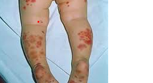

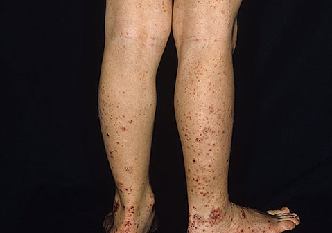

### Immunologiskt

#### Immunbrist

***Presentation***

* En pappa kommer med sin 20 månader gamla flicka Ingrid som har täta recidiverande luftvägsinfektioner. Pappans arbetssituation har blivit ansträngd då arbetsgivaren är oroad av hans täta frånvaro från arbetet, nu sammanlagt nästan 10 veckor det senaste halvåret. Ingrid har fått antibiotika för otit vid ett tillfälle och för pneumoni vid ett tillfälle. I övrigt har hon tillfrisknat spontant i det som du bedömer som täta recidiverande övre luftvägsinfektioner av virustyp. Pappa misstänker att det är något fel på immunsystemet. Du är inte lika övertygad. 
  * Ange 4 anamnestiska uppgifter som kan föranleda utredning för immunbrist hos barn (4p)** 
    * 2 ab krävande pneumonier på året
    * över >=4 ab krävande otiter
    * över >=2 ab krävande sinuiter
    * över >=2 ab krävnde pneumonier
    * Infektioner som inte läker enl förbäntan med adekvat AB
    * återkommande Hudinfek, mjukdelsinfek, roganabscess, icke-infektiös granulom
    * infektioner ovanlig lokalisation, ovanlig agens
    * över >=1invasiv infektion: osteomyelit, meningit, sepsis
    * candidos: uttalad kronisk oral eller kutan candidos
    * Multipla autoimmuna sjukdomar:  eller mkt tidig debut autoimmun sjd, >=3åå
    * omfattande hudförändringar, erytrodermi, eksem som inte svarar på behandling
    * spädbarn som inte växer som förväntat
    * Känd primär immunbrist sjd i familj

#### Immunglobulinnivåerna

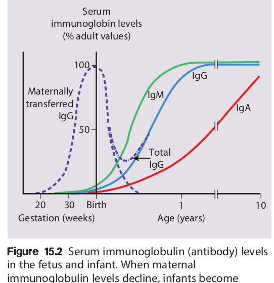

### Pertussis

***Presentation***

* 3mån pojke, prematur 35+1
    * Nicaragua för drygt tre månader sedan 
    * Erhållit 3 månaders vaccinationen för en vecka sedan.
    * Epidemiologi Mor varit förkyld med hosta.
    * pojken varit förkyld i ungefär två veckor med snor och hosta. 
    * Den senaste veckan intensiv hosta och haft jobbigt med andningen. 
    * Idag slutat andas i samband med flera hostattacker. 
    * Förefaller ha varit röd i ansiktet i samband med hostattack men sedan blivit blå om läpparna. 
    * Har sovit dåligt och äter sämre, äter BM-ersättning på flaska men det går väldigt långsamt.
    * Har haft periodvis tempstegring upp till 38,5.
    * Status nästoalett x 2 och natriumkloridinhalation med god effekt. 
    * 5,2 kg, Andningsfrekvens 57 /min. Saturation 97 %, Pulsfrekvens 163 /min, 
    * Kroppstemperatur 37 grader 
    * Hjärta Regelbunden rytm, inga hörbara bi- eller blåsljud. 
    * Lungor Ej påtagligt ökat andningsarbete, inga indragningar. Inga biljud 
    * Buk Normala tarmljud. Palperas mjuk. Har ett litet navelbråck som lätt kan reponeras. Neurologiskt status Fin tonus, normalställd fontanell.
    * Perifer cirkulation Kapillär återfyllnad två sekunder. 
    * CRP < 5. LPK 27,8, Lymfocyter 18,5 (ref 1,5 – 8) Hb 104. Blodgas med pH 7,26, 7,2 i pCO2.

### RSV 

***Behandling***

* 
* ***Profylaktisk behandling***
  * immunsupprimerade eller neuromusk sjd, prematurt födda. 
  * Monoklonala antikroppar, SYNAGIS

### Rubella

***Kliniska kännetecken***

* Blue-berry muffin rash
* Kongenital katarakt: TORCH infektioner som kan ge e toxoplasmos, syfilis, rubella, CMB

### Mässling

***Presentation***

* A 29-year-old Maltese man 
  * without a significant past medical history presented with a 4-day history of intermittent fever associated with chills and rigours, nausea and multiple episodes of vomiting. A generalised maculopapular pruritic rash developed on the second day and he was sent to hospital for further investigation. On general examination the patient was haemodynamically stable with a temperature of 38°C. An exanthematous maculopapular rash was evident over the face, trunk and lower limbs including the soles of the feet ([figure 1](https://casereports.bmj.com/content/13/2/e232408.full#F1)). No Koplik spots were found. On examination there was tenderness in the right upper quadrant of his abdomen
* A 18-year-old British woman, 
  * on holiday in Malta, presented with a 3-day history of a pruritic generalised macular erythematous rash over her trunk ([figure 2](https://casereports.bmj.com/content/13/2/e232408.full#F2)), face and limbs. She also complained of a prominent dry cough with oxygen desaturation of 89% on room air despite a clear chest, myalgias and right iliac fossa tenderness on palpation, exacerbated by movement. Faint Koplik's spots were evident on examination. The patient had never received the MMR vaccine.
  * 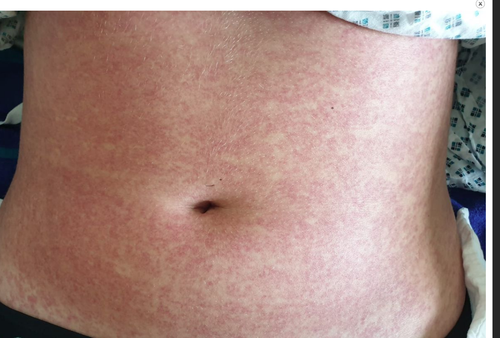
* A 6-year-old boy 
  * from northern Thailand developed rhinorrhea and a mild non-productive cough 8 days before admission to the Chiang Mai University Hospital (CMUH). Six days before admission to CMUH, he developed a tactile fever and was taken to a local clinic. He was prescribed a mucolytic and an antihistamine. Despite this treatment, his cough worsened and his fever persisted. Three days before admission to CMUH, he developed a facial rash, which proceeded to spread to his trunk ([figure 1](https://www.ncbi.nlm.nih.gov/pmc/articles/PMC3369465/figure/bcr.12.2011.5411.f1/)). On the day before admission to CMUH his fever and cough persisted, and he was transferred to CMUH for severe respiratory distress and potential need for mechanical ventilation. He was diagnosed with measles pneumonia. The child had no medical or surgical history. He did not take any medications. His birth history was unremarkable. He had no known drug allergies. His vaccination history included: BCG vaccine; diphtheria, pertussis and tetanus vaccine; oral polio virus vaccine (three doses); and hepatitis B vaccine (three doses).n the patient’s admission to CMUH, he was febrile (39.5°C), tachycardic (110–120 beats/min) and tachypnoeic (40 respirations/min). The child appeared ill and had bilateral conjunctivitis, a normal oral pharynx, decreased breath sounds with fine crepitation throughout, mild subcostal retractions and a generalised erythematous macular-papular rash with confluence on face, trunk and extremities
* 1,5 årig pojke som varit med sin far i flera månader i Afghanistan, faderns ursprungsland. Pojken har haft hög feber upp till 40,5 i 5 dagar och han har ätit och druckit dåligt. Efter 3 - 4 dagars feber fick pojken ett makulopapulöst utslag som började i ansiktet och som nu har spridit sig ner på bålen och armarna och bäcken. Han har nu också en påtaglig konjunktivit. I ansiktet är nu utslaget nästan konfluerande (dvs täcker hela ansikte*. Han har inga förstorade lymfkörtlar, inga utslag på händerna. I munnen har han små vita och röda prickar på insidan av kinden bilateralt. Vilken inkubationstid stämmer bäst med den misstänkta infektionssjukdomen? (2* 

  * 3-4 dagar 
  * 5 -7 dagar 
  * rätt: 9 – 12 dagar 
  * 2 veckor 
  * 3 veckor 

***Etiologi och patofysiologi***

* ***Viruset, paramyxovirus***
* ***Encefalit***: detta är det man är rädd för 
* ***Försvagat immunförsvaret***: slår ut B-minnesceller, och 11-74% av antikroppar
  * ***Alltsp***: slår ut minnes B-celllinjer som byggs upp vid tidigare exponering för patogen
  * ***Förklarar***: tidigare observerad långvarig immun amnesi
  * ***Reducerar antikroppsrepertoiren***: iom minnes B-celler attackeras, får reduceras repertoiren antirkoppar available
  * ***Mässlingvaccin användning***: kopplat t lägre dödlighet i andra sjukdomar, med 30-40% LIC
  * ***Ökad dödlighet andra sjukdomar***: 2-3 år efter infektion
* ***Mässling aka rubeola eller 10-dagars mässling***: (i kontrast till rubella 3-dagars mässling) och orsakas av RNA-virus av paramyxoviridae familj
* ***Neonatal mässling ovanligt av antikroppar***: det verkar som att mödrar har antikroppar mot mässling redan som förs över till barnet 
* ***Vitamin A brist:*** Enl publikationer PMID11869601, är vitamin A briust en riskfaktore för att utveckla mässling. 

***Kliniska kännetecken***

* ***Kopliks fläckar i MoS***: vita fläckar i munnen; små grå papula på erythematös bas. 
  * patognomont till mässlingt
  * förekmmer innan generaliserat exantem
  * transieent
  * frånvarande vid tidpunkt som andra symptom uppkommer. 
* ***Inkubationstid:*** 8-12d inkubationstid varpå symptom. 
* ***klassisk klinisk prodrom***, efterföljt av transient enanthem (utslag på mukösa membran), sedan kännetecknas exantem (utslag på hud)
* ***Tre C's***: ***Cough, Conjunctivitis, and Coryza***, för att komma ihåg klassisk prodrom. 
* ***Andra tidiga symptom***: fotofobi och låggradig feber
* ***Exanthem*** 
  * erythematös maculopapular utslag
  * Descenderar from the huvud området, nedåt nacke område  
  * sprider till trunk and limbs
* ***Temperatur:*** vanligtvis över 38.3 grader, följer onset symptom. 

***Komplikation***

* ***Respiratorisk***
  * **Pneumoni, vanligast**: samt vanligaste orsaken till mortalitet
  * ***Otitis media:*** är också vanligt
  * **Laryngit, laryngotracheobronchitis (krupp, är det riktig krupp)**
* ***Encefalomyelit*** (i.e. inflammaton både hjärnan och ryggmärgan)
* ***SSPE, subakut sklerosarnde panencefalit***, kan komma efter 7 år, väldigt ovanlig, tappar hjärnfunktion sen dör man. 
* Enl illustrated, s 272
  * Diarre,
  * hepatit
  * appendicit
  * korneal ulceration
  * myokardit

***Epidemiologi***

* Rutin mässlingvaccination signifikant sänkt och nästan eliminerat i incidens i USA, över senaste 50 pren.
* innan vaccinationsprogrammet miljoner fall mässling varje år.
* 50-100 fall i USA varje år nu
* ***Infektiös***: mässling är väldigt infektiös

***Utredning och diagnos***

* ***Klinisk diagnos***
* ***IgM- och IgG serologi.***
* (enl BRS: PCR tst urin, hals, nasofarynx, eller )

***Handläggning***

* Behandling för mässling är mestadels symptomatiskt enl Illustrated paediatrics
* 

***Behandling***

* ***Vaccination***: 
  * icke-akut: 18 månader, för att man vill undvika immunbrist, man är säker att vid 18 månader så är barnet immunfriskt, annars skulle visat tecken på immunbrist tills dess.
  * **Akut: inom 72 timmar efter exponering**, ger god skyddseffekt mot kliniskt insjuknande. 
* **Akut, mer än 72 timmar efter exponering**: Gammaglobulin (Beriglbin) 160mg/mL, im. 
  * **nyförlötst spädbarn, immunsuppade** ges 0.5mL/kg, maximalt 15mL 
* **Finns ej specifik behandling**: Vitamin A verkar användas i USA i de akuta fallen. 

### Pneumoni

***Presentation***

* 3 årig pojke 
  * som söker pga trötthet och hög feber sedan 4 dagar. Har nu tilltagande andningsbesvär. Nedsatt aptit. I status finner du en trött och lite blek pojke som har ökad andningsfrekvens. Inga indragningar och antydd rassel vid auskultation. Saturation 91%. Du tar ett CRP som är 110, U-sticka som är blank
  * Pneumoni
  * pneumokocker
  * **Behandling initialt:** 
    * bedömning enl ABCDE. 
    * Inläggning
    * Syrgas
    * Bedöm kaprefill
  * **Antibiotika**: 
    * PcV förstahandsvalaet: peroral behandling (fenoxymetylpenicillin)
    * // Amoxicillin: bättre smak, längre resoprtion, men kan selektera fram resistenta bakterier.
    * Erytromycin: mykoplasma, klamydia, och penicillinallergi
    * när iv antibiotika: 
      * bensylpenicillin iv.
      * eller cefotax

**Utredning och handläggning**

* 

***Behandling***

* ***Antibiotika***
  * PcV förstahandsvalaet: peroral behandling (fenoxymetylpenicillin)
  * // Amoxicillin: bättre smak, längre resoprtion, men kan selektera fram resistenta bakterier.
  * Erytromycin: mykoplasma, klamydia, och penicillinallergi
  * när iv antibiotika: 
    * bensylpenicillin iv.
    * eller cefotax

### Varicella (Vattkoppor)

***Presentation***

***Epidemiologi***

* incidens har sjunkit pga barndomsimmunisering (vaccin?) i många delstater i USA.
* Hos icke-immunicerade kan man få vattkoppor närsom (ungdom som vuxen)

***Kliniska kännetecken***

* **intensiva pruritiska erythematösa makula** utveckals akut efter 7-21 dagars inkubation
  * detta är ej makulopapulöst! notera detta för att makulopapulöst är mer som mässling verkare som. 
* **makula utvecklar centrala vesiklar** inom 1-2 dagar. 
* **klassiska lesionen** beskrivs som "dew frop on a rose petal" eller en vesikel i röd bakgrund
* **"crops of lesions"** utvecklas under 2-5 dagar. Hundratals vesiklar förekomma, som kommer att **skorpa över**
* ***feber vanligt***
* "exanthem that presents with a **papular** rash described as **"dew drops on a rose petal"** that later **evolves to vesicles, pustules and then excoriation**."

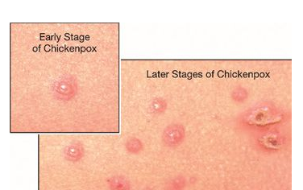

***Komplikationer***

* **sekundär bakteriell infektion**: staffar, GAS, eller andra. kan leda t komplikationer som toxisk chock syndrmo eller nekrotiserande fasciit. 
* ***Encefalit***: kan vara generaliserad. kontrast till encefalit
* Reaktivering senare i livet av latent VZV orsakar **herpes zoster** (se [Varicella-zostervirus](https://www.internetmedicin.se/page.aspx?id=540)). Vid varicella första levnadsåret uppträder herpes zoster (bältros) inte sällan redan under barnaåren. 
* **Sekundära hudinfektioner** med stafylokocker eller streptokocker förekommer speciellt hos små barn. 
* Sällsynta fall av **streptokocksepsis** är den vanligaste orsaken till livshotande komplikation hos immunfriska barn. 
* **Varicellapneumonit** är en allvarlig komplikation som framför allt drabbar vuxna rökare. Uppträder vanligen efter ett par dagars sjukdom. Orsakar svårigheter med syresättningen av blodet och kan ibland kräva intensivvård. 
* **Cerebellit** är den vanligaste centralnervösa (CNS) komplikationen och innebär att barnet drabbas av *ataxi*, *bredspårig gång* och *nystagmus*. Ses med en incidens på ca 1/2000 barn. Benign komplikation som läker inom några veckor. 
* **Encefalit** är ovanligare, men mer allvarligt. 
* Vuxna kan få **arteritförändringar i CNS-kärl** i samband med vattkoppor med stroke som följd. 
* **Perinatal varicella** är allvarlig om modern insjuknar under tiden 5 dagar före till 2 dagar efter förlossning. Om modern insjuknar tidigare u

***Behandling***

* **antipyretika**
* **behandling bakteriell superinfektion**
* **antihitaminer** för klåda
* **monitorera och behandling av komplikationer**
* **varicella pneumoni, encefalit**: intravenös aciklovir
* **högrisk komplikationer:** oral adminstrering aciklovir, topikalt i ögon och för de med oftalmisk involvering

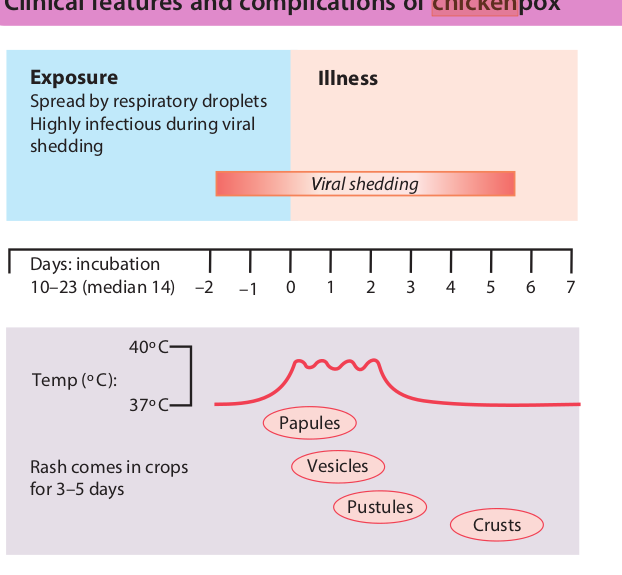

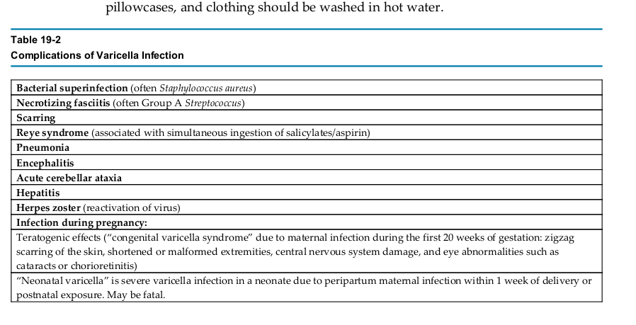

### Vaccinationer

***Presentation***

* I fikarummet kommer en BVC-sköterska in till dig för att be om hjälp. Hon har just blivit utskälld av en arg mamma som inte vill ge sitt 18 månader gamla barn MPR-vaccin. Mamman vill omgående diskutera frågan med en barnmedicinkunnig person. Ange två skäl till varför du rekommenderar mamman att vaccinera sitt barn mot mässling
  * Mässling är en sjd, potentiellt och mest sannolikt livshotande. 
  * Kan ge livshotande komplikationer som encefalit och om överlever är otroligt debiliterande
  * Inget botemedel finns för mässling
  * Otroligt smittsam sjd (är luftburen) och man bör skydda sin omgivning o de som ännu int fått vaccin i smhälelet

***Vaccinationsschemat***

* 3 månader
  * ***TEDAP***
  * 

## Hematologi

### Allmönt

***Presentation***

* !!! Lisa 3 år inkommer till akuten för att hon sedan tre dagar haft små petekier på bålen. Hon har också haft lite lätt feber 38,2 grader utan förkylningssymtom. Ingen blödning från slemhinnor eller tarm. Föräldrarna tycker att hon varit lite tröttare än vanligt och varit gnällig i slutet av dagarna på förskolan sedan cirka 2 veckor. I status kan du notera några få, diskreta petekier på bålen. Hon har fin färg. I buken känner du en resistens till vänster i buken ca 3 cm nedom arcus i mamillarlinjen och du misstänker en mjältförstoring. Hjärta lungor fysikaliskt ua. Du tar ett blodstatus som visar tpk 27 x 109/l, Hb 85 g/l, Lpk 10,8 x 109/l Med bakgrund av symtom, status och lab misstänker du i första hand (2* 
  * leukemi och anstaltar om diff, urat samt benmärgsundersökning 
  * ITP och kollar diff samt antikroppar mot trombocyter 
  * aplastisk anemi och anstaltar om diff 
  * aplastisk anemi och anstaltar om diff och benmärgsundersökning 
  * rätt: leukemi och anstaltar om diff, urat, benmärgsundersökning med kromosomundersökning 
    * Förklaring: diff är standard, urat värderar risk för tumörlyssyndrom, benmärgsundersökning med mikroskopi och kromosomundersökning för att få diagnos. Kromosomundersökningen ger också svar på olika faktorer som kan vara gynnsamma eller ogynnsamma och bestämmer även val av behandling. 

### ALL

***Presentation***

* 4åå flicka
  * Beata grinar och gnäller. Hon är petig i maten och lite blek om nosen. 
  * Helst vill hon sitta i dagisfrökens knä och läsa böcker. 
  * Igår petade hon in en fiamedknuffpjäs i näsan, så det forsade blod. 
  * Trots att det bara är i början på september har Beata redan ätit 2 kurer med Kåvepenin pga ”oklar inf”. Mamma har läst på vårdguiden om coxitis simplex, eftersom Beata klagar på ont i benen. Nu sitter de i ditt väntrum.
  * diffar vid denna punkt? ITP, leukemi, (hemolytisk anemi?)
  * Prover visar: Hb 80, TPK 50, LPK 50, blaster i diff, PKINR 1.3, APTT ua, lätt förhöjt krea, normalt Na, urat förhöjt, normala-lättstegrade transaminaser, CRP 15
  * arbetsdiagnos nu: leukemi kanske ALL specifikt
* Lisa 3 år inkommer till akuten för att hon sedan tre dagar haft små petekier på bålen. Hon har också haft lite lätt feber 38,2 grader utan förkylningssymtom. Ingen blödning från slemhinnor eller tarm. Föräldrarna tycker att hon varit lite tröttare än vanligt och varit gnällig i slutet av dagarna på förskolan sedan cirka 2 veckor. I status kan du notera några få, diskreta petekier på bålen. Hon har fin färg. I buken känner du en resistens till vänster i buken ca 3 cm nedom arcus i mamillarlinjen och du misstänker en mjältförstoring. Hjärta lungor fysikaliskt ua. Du tar ett blodstatus som visar tpk 27 x 10 9 /l, Hb 85 g/l, Lpk 10,8 x 10 9 /l Med bakgrund av symtom, status och lab misstänker du i första hand (2p)
  * Fel alternativ
  * a) leukemi och anstaltar om diff, urat samt benmärgsundersökning
  * b) ITP och kollar diff samt antikroppar mot trombocyter
  * c) aplastisk anemi och anstaltar om diff
  * d) aplastisk anemi och anstaltar om diff och benmärgsundersökning
  * Rätt alternativ: e) leukemi och anstaltar om diff, urat, benmärgsundersökning med kromosomundersökning

***Etiologi och patofysiologi***

* Blodmaligniteter hos barn: B-ALL vanligast, men T-ALL och AML förekommer liksom MDS

### Anemi

***Presentation***

* **9 mån pojke**
  * Ahmed kommer med sin mamma till barnakuten. 
  * Han har blivit väldigt blek och trött de senaste dagarnaenligt mor.
  * Han ammas fullt och äter lite fruktpuréer som mamma själv tillverkat. 
  * Vikt och längdökning normal. 
  * I status finner du en mycket blek och passiv gosse.
  * CRP< 10. 
  * Hb 63g/L

### G6PD brist

***Presentation***

* Chang, 4-årig pojke från Kina. Hade uttalad gulsot redan under andra levnadsdygnet och fick upprepade ljusbehandlingar. Ingen känd immunisering. Därefter väsentligen frisk. Nu akut blekhet och mörk urin. Okänd anledning. Status: blek och ikterisk i hud och sklerae. Ingen mjältförstoring. Hb 66 gli. MCV normalt. ferritin normalt. Bilirubin okonjugerat 123 (mkt högt). Misstänkt diagnos?  Anamnestisk fråga som kan styrka diagnosen
  * G6PD? Hereditet, läkemedel, infektion, fava-bönor, moth-balls, antibiotika

***Etiologi och patofysiologi***

* Glucose-6-phosphate dehydrogenase deficiency; glukos-6-fosfat dehydrogenas brist
* aka G6PD
* **Mutationer:** Många olika mutationer beskrivna
* ***X-kopplad***: innebär att det är flest **män** som drabbas;
  * kvinnor brukar ha hälften normal G6PD aktivitet, därför asymptomatiska
  * **Kvinnor drabbas om**: de är homozygoter eller om sporadiskt har inaktiverat mer av den friska X-kromosomen. 
* **olika kliniska presentationer**: pga den breda variationen typer mutationer
* ***G6PD fysiologiskt:*** 
  * hastighetsbegränsande enzymet i pentos-fosfat pathen (pentose-phosphate); 
  * Hindrar oxidativ skada
* ***Brist på G6PD hos röda blodkroppar***: brist av enzymet hos RBC innebär ökad oxidativ stress
* **Oxidativ-stress inducrad hemolys**: brukar ha orsakats av ***olika läkemedel!*** Alltså states eller exposures som ökar det oxidativa trycket på  RBC som i sin tur leder till att RBC hemolyserar.
* **Hemolysen intravaskulär**: predominant är hemolysen intravaskulär.  

***Läkemedel och kemikalier som kan inducera hemolys hos G6PD***

* ***Antimalaria***
  * **primaquine**
  * quinine
  * klorokin
* **Antibiotika**
  * Sulfonamider: inkluderar co-tromoxazole
  * kinoloner: ciprofloxacin, nalidixic syra
  * nitrofurantoin
* **Analgetika**
  * ASA
* **Kemikalier**
  * Naphthalene (mothballs)
  * Divicine (**Fava-beans** also called broad beans

***Epidemiologi***

* Vanligaste enzymopatien som påverkar 100M individer i världen. 

* hög prevalens 10-20% av individer fr centralafrika, medelhavet, mellanöstern, östasien

  

***Kliniska kännetecken***

* ***Neonatal ikterus***: onset första **3 dagarna**. 
  * internationellt är den vanligste orsaken till svår neonatal ikterus
  * kräver transfusion
* **Akut hemolys**: precipiterad av 
  * **Infektion**: **Vanligaste precipiterande faktorn**
  * **läkemedel o kemikalier: se listan ovan**
  * **fava beans:** broad beans, andra typer av bönor orsakar inte hemolys
  * **naphthalene in mothballs**
* ***Intravaskulära hemolysen***: oftast är det intravaskulär hemolys, som associerat med specifika symptom
  * feber
  * malaise
  * buksmärta
  * mörkt urin
  * hemoglobin sjunker snabbt, kan droppa under 50g/L över 24-48 timmar. 

***Diagnos***

* **MEllan episoder normal blodbild:**, nästan alla patienter har en normal blodbild mellan episoder
  * ingen ikterus eller anemi mellan episoder
* ***Mäta G6PD aktivitet***: för att få diagnos. 
* ***Falsk-negativ under hemolytisk kris***: för att retikulocyter innehåller en högre fraktion G6PD jämfört mogna RBC, så kan man få ett falskt negtivt svar på G6PD brist under en hemolytisk kris. 
  * **Repeat-assay**: att man tar om proovet när den hemolytiska episoden är över

***Utredning och handläggning***

* **Anamnes**:
  * Familjehistorik
  * epidemiologi
  * infektion
  * läkemedel
  * kost
  * neonatal period: var ungen ikterisk etc, för att postnatal ikterus första 3 dagarna kan förekomma hos G6PD.
* **Labbprover**
  * Blodstatus + diff
  * G6PD aktivitet: falsk-förhöjd aktivitet under hemolytisk kris för att  det är så pass många retikulocyter som falskt förhöjer G6PD aktiviteten.

***Behandling***

* **Information:** 
  * Föräldrar informeras om tecken till akut hemolys (ikterus, pallor/blekhet, mörk urin)
  * lista på grejjor som kan inducera hemolysen
* **Transfusioner sällan behövs**: men kan bli aktuella i hemolytiska kriser och svåra situationer. 

### Hb fysiologi barn

***Fysiologi***

* **Hematopoes prenatalt**: processen som underhåller livslång produktion av blodceller. 
  * ***Locale:*** huvudsakliga lokalen är ***levern!***. Postnatalt överförs till benmärgen. 
* ***hematopoetiska celler***: alla stammar fr plurpotenta hematopetiska stamceller, essentiella för blodcellsproduktion. 
  * brist på dessa stamceller leder till benmärgssvikt varpå ej kan tillhanadahålla tillräckliga med blodceller. 
* **Hemoglobin produktion fetalt**
  * **Mönster hemoglobinproduktion**
  * **Hemoglobin proteiner utefter stadie:**
    * **Embryonalt**: Hb Gower 1-2, Hb Portland
    * **Fetalt**: HbF
    * **Adult**: HbA och HbA2
  * **Hemoglobin typer i nyfödd och adult**
    * **nyfödd**: HbF 74%, HbA 25%, HbA2 1%
    * **barn över 1 år och adulta**: HbA 97%, HbA2 2%
* **HbF**: Fetalt hemoglobin har högre affinitet för syrgas, jämfört med HbA. Nyttigt för att väldigt hypoxisk miljö i den fetala cirkulationen. Saturationsnivån är kring 60% i det venösa blodet som kommer tilblaka fr placenta. 
  * saturationen (alltså att man saturerat loci för syrgas i hemoglobin proteinerna) är högre för lägre tryck syrgas i cirkulationen. 
* **Graduell ersättning efter födsel**: HbF ersätts graduellt postnatalt med HbA och HBAw. 
  * **1åå, HbF låg**: vid 1åå är koncentrationen HbF låg hos barnet. 

***Protektivt med HbF***

* **HbF är protektivt vissa anemier**
* **Sickle-cell anemi**: förklarar varför nyfödda är asymptomatiska första året, men att symptom utvecklas efter det. 
* ***Thalassemi och viss typ av benmärgssvikt***: Högre koncentration HbF kan vara indikativt för thalassemi också, 

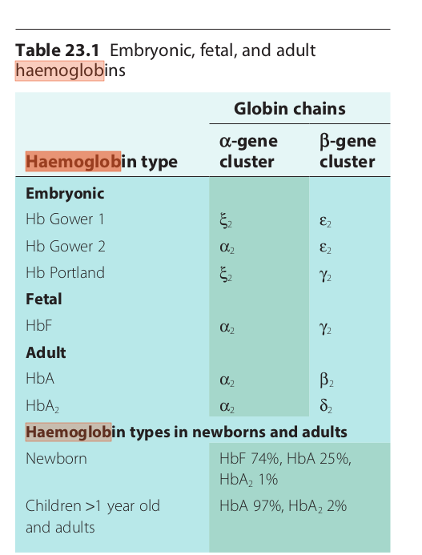

### Hematom

***Presentation***

* **6. En 5 årig flicka inkommer till akuten en söndagskväll kl 21 tillsammans med hennes mor. Föräldrarna som är skilda befinner sig i en vårdnadstvist om flickan. Mamma berättar att flickan har blåmärken på kroppen efter att hon vistats hos sin pappa i helgen. Flickan själv vill inte berätta vad som har hänt. I status kan du se att det finns blåmärken av ganska färsk art på bål och armar men även på underben. Även något blåmärke på kinden. Ange 6 olika åtgärder eller ställningstaganden som är obligatoriska i denna situation (3p)** 
  * Akut remiss fotografi blåmärken
  * Dokumentera dessa nogrant i journal
  * Kontakta senior kollega eller bakjour
  * Ögonbottenspegling
  * Inläggning för vidare utredning
  * Status inkl ortopediskt sådant
  * Konsultera senio kollega gällande helkroppsrtg
  * Undersökning fr topp t tå
  * prover: koagulationsprover, utesluta trombocytopeni, blodstatus. [leverstatus, njurprover]
  * Orosanmälan till socialtjänsten [ingen polisanmälan?]

### Hemolys

***Etiologi och patofysiologi***

* **Autimmun hemolytisk anemi**
* **G6PD**
* **Hereditär sfärocytos relaterad hemoloys**
* **Sickle-cell anemi**

### Immunisering

###  ITP

***Presentation***

* Stefania är 14 år 
  * och en ganska trulig tonåring. Hennes mamma har nu tvingat iväg henne till VC där du vikar före AT. Stefania har fått ”konstiga prickar” på underbenen och magen sen några dagar tillbaka. Hon är annars fullt frisk, förutom en rejäl förkylning för några veckor sedan.
* s421 i Lassauer har ett fall.
  * Sian, aged 5 years, developed bruising and a skin rash over 24 hours. She had had an upper respiratory tract infection the previous week. On examination she appeared well but had a purpuric skin rash with some bruises on the trunk and legs (Fig. 23.17). There were three blood blisters on her tongue and buccal mucosa, but no fundal haemorrhages, lymphadenopathy, or hepatosplenomegaly. Urine was normal on dipsticks testing. A full blood count showed Hb 115 g/L with normal indices, WBC and differential normal, platelet count 17 × 10 9 /L. The platelets on the blood film were large; the film was otherwise normal. A diagnosis of ITP was made and she was discharged home. Her parents were counselled and given emergency contact names and telephone numbers. They were also given litera- ture on the condition and advised that she should avoid contact sports but should continue to attend school. Over the next 2 weeks she continued to develop bruising and purpura but was asymptomatic. By the third week, she had no new bruises, and her platelet count was 25 × 10 9 /L; the blood count and film showed no new abnormalities. The following week, the platelet count was 74 × 10 9 /L and a week later it was 200 × 10 9 /L. She was discharged from follow-up.

***Allmänt***

* aka immunologisk trombocytopeni (tidigare idiopatisk trombocytopeni), aka immunmedierad trombocytopen purpura

***Etiologi och patofysiologi***

* Vanligaste acquired trombocyt abnormaliteten i ungdom
* Etiologiskt: ITP kan vara viral, läkemedelsinducerad, eller idiopatisk
* patofysiologiskt: 
  * ITP följer virala infektion, 
  * tros att virus trigger antikroppar som korsreagerar med trombicyter
  * orsakar destruktion
  * elimination via mjälten
* Blödnignsbenägenhet: detta varierar mkt fr person t person. Det kan finnas patienter med TPK under 5 som man inte behöver oroa sig för alltför mkt för att den kliniskt mår bra. läkare menade att om man har 

***Kliniska kännetecken***

* **viral infek**: 1-4 veckor efter viral infektionqtconsole jupyternotebook
* **börjar abrupt:** 
  * cutaneous blödning (e.g. petekier, blåmärken)
  * mukös membran blödnin (e.g. epistaxis, tandköttsblödning)
  * intern blödning i hjärnan (under 1%), njurar, gastrointestinalt, kan ske men ovanligt
* **TPK under 30**: behover inte ha symptom
* **blödningar**: förekommer hud, minhåla, näsa, allvarlig inre blödning
* **mjältförstoring**?
* **Sammantaget**: normal blodbild förutom lågt PTK, ingen mjältförstoring eller annan bakomliggande sjd

***Diagnos***

* Primär ITP: TPK under $100 \times 10^9/L$, utan känd etiologi
* Sekundär ITP: 20% av fallen, tirgger immuinförsvaret, e.g. SLE, HCV, HIV, vaccinationer, imminbrittillstånd (e.g. variabel immunbrist)

***Differentialdiagnoser***

* CNS-infektioner
* Sepsis
* leukemi
* Henoch-schönleins purpura

***Utredning och handläggning***

* ***blodstatus + diff***
  * Labb visar trombocytopeni
* ***kan blod-smear (blodutstryk):*** visar "large sticky platelets"
* ***IPF:*** immature platelet fraction; kan användas för att diffa huruvida det är ett benmärgsproblem, i.e. nybildningsproblem, eller om det handlar om perifer destruering av trombocyterna. 
* ***blod i citratrör***: 
* ***Status***: blödningssymptom, palpation lever mjälte lymf, infektionstecken, dysmorfa drag (fanconi, TAR), andra symptom (e.g. njurdysfunk, hörselned vid MYH9 relaterade sjd, exem el immunbrist vid WAS)
* "In children with immune thrombocytopenic purpura, in spite of impressive cutaneous manifestations and extremely low platelet count, the outlook is good and most  will remit quickly without any intervention"

***Behandling***

* ***Steroider***: prednisolon (vuxen 1-2mg/kg x 1 peroralt), vid mistanke ITP
* ***inj gammaglobuliner (aka IvIG)***: många b lödningar, använder injektion gammaglobuliner för ***snabb effekt***. 
  * e.g. 1.5åå + näsblödningar + benäget att slå sig = behandling med gammaglobuliner.'
  * e.g. 14åå patient + som inte jätte aktiv = prednisolonkur istället
* // **trombocytkoncentrat**: detta fungerar ej väl för de nya trombocyterna destrueras också ganska snabbt.
* ***Behandlingstrappa:*** Föreläsare nämnde behandlingstrappa som missades?

### Lymfom

***Kliniska kännetecken***

* **vanligaste**: hastigt växande oömma lymfkörtlar
  * ofta halsen
  * kan vara bröstkorg, mage
* **lokalisation relaterat med symptom**
  * **andningsproblem**: lymfom i bröstkorgen
  * **smärta**: lymfom i buk
* **generell påverkan:** trötthet, feber, avmagring, B-symptom generellt. 

***Initial utredning***

* **Labb**: 
  * **Blodstatus + diff:** essentiell del i utredningen
  * **leverstatus + njurstatus:** evaluera status av viktiga organ, då möjligt med härdar i respektive organ eller att njurarna tar skada av tumörsjukdomen. 

### Petekier

***Presentation***

* Pelle 3 år var förkyld för några veckor sedan men har mått bra och gått på dagis sedan dess. Söker nu med sin pappa på barnakuten då han har fått petekier på kroppen, annars mår han bra. I status finner du endast små utslag generellt på kroppen som inte går att trycka bort. Du misstänker ITP (Idiopatisk trombocytopen purpura/Immuntrombocytopeni). Det finns fler tillstånd när barn får petekier.
  * nämn 2 tilltånd utöver ITP som kan ge petekier
    * Sepsis
    * leukemi
    * HSP
    * TTP ?
    * HUS?
    * läkemedelsinducerad reaktion (vilken?)
  * beskriv med 1 ord ellr2 grundläggande orsaken bakom dessa 3 tillstånd
    * Sepsis = kapillärläackate
    * ITP = antikroppar mot trombocyterna
    * leukemi = minskad produktinio
    * HSP = mikroinfarkteR? 

***Etiologi och patofysiologi***

* **Blödning in i dermis**
* Påverkan därför av hemostasen resulterar i att petchier sker med olika kliniska kännetecken
* primära patofysiologin t petekier och purpura
  * trombocytopen
  * trombocyt dysfunktion
  * påverkad koagulation
  * förlust vakulär integritete

***Epidemiologi***

***Kliniska kännetecken***

* Försvinner inte efter tryck

***Utredning och handläggning***

***Behandling***

### Sfärocytos

***Etiologi och patofysiologi***

* 1:5000 födslar in caucasians
* autosomalt dominant
* 25% sporadisk
* mutationer membranproteiner: spectrin, ankyrin, band3
* ***Förlust av membran när passerar gm mjälten***: muterade membranproteinerna leder till att RBC förlorar en del membran när RBC passerar gm mjälten. 
* ***Reducerar yt-volym kvot:*** cellerna blir sfäroidala (spheroidal); blir mindre omformbara (deformable) jfr normala blodceller, leder till destruktion i mikrovaskulaturen i mjälten.

***Kliniska kännetecken***

* Hereditet, familjehistorik
* högst variable kliniska kännetecekn
* **asymptomatiska** 
* **ikterus**: utvecklas vanligtvis utvecklas under barndom, men kan vara intermittent. 
  * **kan hemolytisk ikterus första dagarna i livet**
* **Anemi**: presenterar i barndomen med mild anemi (Hb 90-110g/L), men Hb nivåerna kan sjunka under **infektioner**
* **! Aplastisk kris**: ovanlig, transient (2-4 veckor), orsakas av parvovirus B19 infektion (i.e. erythema infectiosum, femte sjukan)
* **Gallstenar**: pga ökad exkretion bilirubin

***Diagnos***

* **Blodfilm** (blodutstryk?)
* **mer specifika tester**: e.g. dye binding assay eller osmotisk fragilitet
* **although seldom required**
* **autoimmun hemolytisk anemi** är också associerad med sfärocyter, men detta kan exkluderas med direkt antikropps test (DAT?) och frånvaro familjehistorik av hereditär sfärocytos

***Utredning och handläggning***

* enl illustrated paediatrics

  * **flesta barn har mild kronisk hemolytisk anemi;** 
    * **Folsyra**: enda behandling som behövs är oral folsyra  för att de har högre folsyrebehov sekundärt till ökad blodcellsproduktion. 
  * **Splenektomi:** beneficial men indikeras för poor growth eller trobulesom symptom av anemi (e.g. ssvår trötthet, minskad vigör) och vanligtvis deferred tills 7pp, för att riskerna med postsplenektomisk sepsis. 
  * **Vaccinationer**: innan splenektomi considered, ska man vara vaccinerad, HiB, meningit C, och streptococcus pneumoniae,
  * ***Aplastisk kris***: fr parvovirus B19 infektion vanligtvis behöver en eller två **blodtransfusioner** över 3-4v period, när ingen röda blodkropps produceras. 
  * **Gallstenar**: symptomatiska kan föranleda kolecystekomi

  

### Sickle cell sjukdom

***Presentation***

* 9-year-old girl 
  * with known sickle cell anaemia (HbSS), presented with increasing chest pain for 6 hours. She had a nonproductive cough. On examina- tion, she had a fever of 39.7° C. Her breathing was laboured, respiratory rate increased and there was reduced air entry at both bases.
  * Hb 60g/L, LPK 14, TPK 350
  * Chest X-ray (see Fig. 23.11)
  * Oxygen saturation – 89% in air
  * Arterial PO 2 – 9.3 kPa (70 mmHg) breathing face-mask oxygen
  * Blood cultures were taken and viral titres performed A diagnosis of acute sickle chest syndrome was made, a potentially fatal condition. She was given oxygen by continuous positive airways pressure (CPAP). An exchange transfusion was performed. Broad- spectrum antibiotics were commenced. She responded well to treatment.

***Etiologi och patofysiologi***

* **Hemoglobinopati**
* **Autosomalt-recessiv**
* **HbS ärvs ned**: sickle-cell är ett samlingsnamn för disorder där HbS ärvs ned. 
  * **punktmutation**: kodon 6 i $\beta$-globin genen
  * glutamin till valin
* **Tre huvudformer sickle-cell disease**
  * **Sickle-cell anemi HBSS**: patienter är homozygota för HbS, och virtuellt all deras Hb är HbS.
    * har små mängder HbF och ingen HbS, för att sickle-cell mutation i båda $\beta$-globin generna
  * **HbSC sjukdom (HbSC)**: påverkade barn har ärvt HbS fr **en förälder** och HbC fr andra. 
    * **HbC**: resultat av annan punktmutation i $\beta$-globin genen
    * Har ingen HbA för att ingen normal $\beta$-globin gener
  * ***Sickle-cell $\beta$-thalassemi***: HbS fr en päron och Beta-thalassemi fr andra föräldern
    * inga nomrala beta-globin gener, flesta patienter kan inte synta HbA och därför har liknande synmptom t de med sickle cell anemi
* ***Bärare-sickle cell trait***: ärvt HbS fr ett päron och normal Beta-globin fr andra oäron. Patienterna är bärare. approximately 40% av deras hemoglobin är HbS.
  * har ej sickle-cell disease.
  * asymptomatiska
  * kan ge vidare HbS till barn. 
  * **endast identifieras med blodtester**
* **HbS polymeriserar i RBC**: pga mutationen kan HbS polymerisera i RBC formar rigida tubulära spiralkroppar. 
* ***deformerar sickle-shape***: polymeriseringen och spiralkropparna deformerar RBC till sickle-shapes. 
* **reducerad livstid RBC**: pga sicklingen leder till att RBC inte överlever imikrovaskulärt. 
* **mikroocklusioner**: vasoocklusion för att RBC fastnar i kärlen. 
* **Ischemi**: leder till ischemiska pmråden , i organ eller ben. 
  * **exacerebras av**: låg saturation, dehydreirng och kyla
* **svårighetsgrad verierar med HbF**: högre grad HbF leder till att patienten klarar sig bättre. 
  * flesta patienter och normala individer har 1% HbF
  * men vissa mutationer kan öka andelen HbF och därför förbättra symptom. 
  * mkt forskning för att aktivera HbF hos dessa patienter, i.e. genterapier. 
* HbSS är den svåraste foremen
* **Hyposplenism**: detta pga infarkter och kronisk sickling i mjälten, som leder till minskad funktion av organet och residenta immunceller (mainly fagocyterande vita blodkroppar i form av makrofager):
  * kapselbärande mikroorganismer ökar: pneunokocker, haemofilus influenzae
  * 

***Epidemiologi***

* vanligaste inherited disorder i många europeiska länder, inklusive UUK
* afrikansk härlomst vanligast, hittas i mellanöstern och karibbean

***Kliniska kännetcken***

* varierar mellan individer
* svårighet varierar med sickle-cell formen som individen lider av
* **Anemi**: ALLA har moderat anemi, mellan 60-100g/L., med kliniskt detekterabar ikterus fr kronisk hemolys. 
* **Akut anemi**: 
  * **hemolytisk kris**, assoc infektion
  * **aplastisk kris**: parvovirus infektioner B19 (erythema infectiosum)
  * **sekvestreringskris**: akut mjälte eller leverförstoring, buksmärta, cirkulatorisk kollaps, pga **ackummulation sicklade celler i mjälte**
* **infektion**: alla har markerat högre risk för infektion fr **kapselorganismer såsom pneumokocker och haeomfilus**. 
  * ökad incidens **osteomyelit** av salmonella o andra organismer
  * ***Orskat av hyposplensism sekundärt t kronsik sickling och mikroinfarkter i mjälten under spädbarnsperioden***
  * **risk för överväldigande sepsis** är som störst i tidig barndom
* **smärtsamma kriser**: vasoocklusiva kriser, orsakar **smärta** i mpnga organ, varierande frekvens och svårighetsgrad. 
  * **Hand-foot syndrome**: dactylitis med svullnad och smärta i fingrar, och eller fötter pga vasoocklusion
  * **benen i extremiteter vanligaste locales**: 
  * **acute-chest syndrome, aka akut bröstsyndrom**: är den allvarligaste formen av smärtkris. som kan leda t svår hypoxi o behov av mekanisk ventilation + akut transfusion
  * precipiteras av: köld, dehydrering, excessiv ansträngning eller stress, hypoxi, infektion. 
* **priapism**: måste behandlas akut, transfusion, kan leda t fibros i corpus cavrernosus och efterföljande erektil impotens
* **splenomegali**: vanligare yngre barn, mindre frekvent hos äldre barn. 
* **långtidsprobblem**
  * **kortväxthet, kognitiva besvär** 
  * **stroke**: 1:10 barn får stroe av sickle-cell sjd
  * **försenad pubertet**
  * **stroke kognitiva problem**
  * **kardiomegali, hjärtförstoring**
  * **adenotonsillär hypertrofi**: apne, nokturnell hypoxi, kan leda t vasoocklusion kris. och eller stroke. 
  * **hjärtsvikt:** fr okorrigerad anemi
  * **renal dysfunktion**: kan exacerbera enuresis pga inabilitet att koncentrera urin
  * **pgiment gallstenar**
  * **bensår, leg ulcer**
  * **psykosociala problem**: utbildnign, beteende, tid fr skola exaceberar detta
* Avaskulär nekros: caput femoris

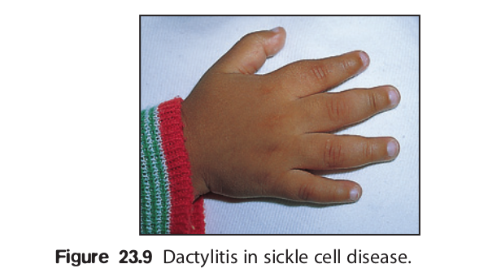

***Utredning och handläggning***

* **Anamnes**
  * Epidemiologi
  * hereditet
  * familjeanamnes
  * konsanguinitet
  * härkomst
  * neonatal period,
  * smärtkriser, anemi, pallor, mörkurin
* **Labbprover**
  * Blodstatus + diff
  * Leverstatus, njurstatus: tillstånd hos dessa organ
  * urinsticka
* **Senare utredningar**
* Remisser? 

***Behandling***

* Profylax: 
  * vaccin, för att immunisera mot kapselbärande organismer
  * värme: hålla ungarna varma under vinter
* **akut kris**
  * **analgetika, hydrering, vila:** smärtkris bör beh med orala eller intravenösa analgetika vb (kan behöva opiater) och god **hydrering** (oralt eller iv vb).	
    * RInger acetat iv vb, elelr sockerlösningar
    * CAVE överhydrering
  * **syrgas om desaturerd**
  * **LMWH lågmolekykärt heparin vid inläggning, övervägas**: avsaknad kontraindikationer, 
  * **infektion antibiotika**
  * **transfusion**: indicerat vid akut bröstsyndrom, stroke eller priapism
    * **Anemikorrektion**: är lägre än 65g/L. eller har fallit över 20g/L fr steady state. 
    * transfusion åp fel indkation ger ökad viskositet och försärmad perfusion. 
  * **minska respiratoriska komplikationer**: PEP-flaska, PEP-ventil, mobilisering, fysioterapi (sjykgymnastik). 
  * **ingen kärlkirurgi eller propplösande behandlign**: ingen plats i kärlocklusiv sjd
* **Kroniska problem**
* **Antibiotika:** vida indikatione infektiösa symptom. kontinyuerlig penicillinprofyu fr 2månade kan övervägas 2 ggr per dag t ca 3åå därefter dubblerad dos t ca 5åå....
* **Ultraljud:** 2-16åå regelbundet hjärnans större kärl (cerebri media, carotis interna); bedöma risk slaganfall (stroke?); flödeshastighet inverst relaterat t kärldiameter; högre hastighet högre risk för "slaganfall" (stroke?)
* **Folsyra**: 1mg&dag liksom **vid andra hemolytiska anemier**; intas regelbundet
* **övriga undersökningar:** UL hjärta, bentäthet, ögonundersökning regelbundet; labbprover avspeglande teckn t andra organskador bör analyseras regelbundet
* **Malariaprofylax**: anlagsbärare o personer med sickle cell kan drabbas av malariainfektion. i sickle cell fallet ofta med dödlig utgång. 
  * då G6PD brist förekommer i samma etniksa population kan test övervägas **innan malariaprofylax** förskrivs, vilket rekommenderas vid resa t endemiska områden
* **Undvika**
  * torka
  * kyla
  * smärta
  * vinddrag
  * miljöer med låg syrehalt i andningsluftne
* **Risk järnöverskott vid upprepade transfusioner**: sekundär **hemokromatos**; S-ferritin är värdefull surrogatmarkör för initialt följa järnnivåerna. över 1000 bör radiologisk utredning med MR för bedöma risk järnrelaterade organskador **innan kelatbehandling inleds**
* **SJukdomsmodifierande behandling**
  * **Tre etablerade behandlingar mot sickle cell**: Hydroxyurea, blodtransfusioner, allogen benmärgstransplantation
  * **Hydroxyurea**: 1a hands val många vuxna pat; sköts hematolog
    * stimmar HbF produktionen
    * halverar smärtsamma epsidoer
    * goda resultat hos barn
    * indikationer. upprepade smärtepisoder, genomgånet acute-chest syndrome eller allvarlig kärlocklusiv episod, symptomatisk anemi
    * kan övervägas spädbarn
    * ej t gravida: risk liten för sekundär malignitet
  * **Transfusioner**
    * aplastisk kris
    * infektioner med aggrevering anemi
    * mjältsekvestrering
    * acute-chest syndrome, akut bröstyndrom
    * inför kirurgi och förlossning
    * **primär strokeprofylax hos bar med hög risk efter transkraniell doppler**
    * tidg stroek
    * hydroxikarbamid
  * **allogen BMT, benmärgstransplantation**
    * enda botande beh
    * svårt välja rätt kandidater. 

### SCID

***Presentation***

* Alfred 6 mån. 
  * Han föddes i fullgången tid med FV 3700g och FL 50cm
  * som du träffar som AT-läkare på VC. Alfred har inte växt så bra enligt BVC-kurvan. Han hostar och flåsar. Dessutom har han alltid varit lös i magen, trots att det provats Sempers Magdroppar. Du tycker Alfred ser sjuk ut, hör takykardi och lätta ronki. I ljumskarna ser du ett ilsket rött utslag. 
  * Proverna visar CRP 11 och LPK 3,0. Hur tolkar du detta?

***Etiologi och patofysiologi***

* ***Brist på***: lymocyter, T, NK, B
* heterogen sjukdomngsgrupp, 15-tal kända fel
* cellernas utv och funktion störd
* eller thymys inte gungerar normalt
* ingen/viss T-lymfocytfunktion med/utan B-lymfocyt och Nk-cellsfunktion
* olika lymfocyter, under $2\times 10^9/L$

***Kliniska kännetecken***

* Debut: första levnadsmånaderna
* ofta vaga symptom initialt
* kronisk hosta, kronisk obstruktivitet, andningsbesvär: p jiroveci och virus
* diarre, malabsorption
* recidiverande kandidainfektioner
* dålig tillväxt
* hudutslag: mammalymfocyter eller omenn syndrom

***Behandling***

* Antimikrobiell behandling
* rekombinant adenosin deaminas
* benmärgstransplantation

### Thalassemia

***Etiologi och patofysiologi***

* **Hemoglobinopati**
* **Reduktion produktion Beta-globin**: Thlassemi föranleder **minskad produktion beta-globin**, vilket innebär att man **ej kan producera HbA**. 
* **Svårighet beror på mängd kvar av HbA och HbF**
* **Former**
  * **!! Beta-thalassemia major**: svåraste formen. **HbA** ***kan inte produceras pga abnormal Beta-globin gen***
  * **Beta-thalassemia intermedia**: denna formen av sjd är mildare med variabel svårighet. Beta-globin mutationenerna tillåter mindre mängd HbA och/eller stor mängd HbF att produceras.

***Kliniska känntecken***

* **Extramedullär hematopoes**: detta förhindras av regelbundna transfusioner. I frånvaro av blodtansfusoner utvecklar man hepatosplenomegali (hepatomegali, splenomegali) och benmärgsexpansion.
  * benmärgsexpansionen leder till klassiska ansikten med maxillär övertillväxt och skull-bossing (ovanligt i UK och I-länder)
* **pallor**
* **Ikterus**
* **Bossing of the skull, maxillär övertillväxt**
* **splenomegali, hepatomegali**
* **behov repeterade transfusioner**

***Utredning och handläggning***

* Prenatal diagnostik: patienter som är ehterzygota för Beta-thalassemi trait, har en 1:4 chans för att få påverkat barn. 
  * DNA-analys korion villi, bör ges
  * genetisk vägledning: för att veta om de bör fortsätta med graviditet eller ej, ska vara ett informerat beslut. 

***Behandling***

* **Beta-thalassemia major**: fatalt om inte transfunderas regelbundet. 
  * **livslång blodtransfusioner, månatligen**
    * målet är att ha Hb över 100g/L. 
    * reducerar risk för growth-failure och bendeformation 
    * Komplikationer: diabaetes, lever cirrhos, kardiomyopati, infertilitet, growth-failure.
  * **järn-kelering:** för att hindra komplikationer fr blodtransfusioner
    * deferasirox,
    * börjar fr 2åå-3åå
  * bra compliance och regelbundna transfusioner, kan pats överleva upp t 40.
  * ***Mortalitet***: järnoverload, om dålig compliance etc. 
  * **Benmärgstransplantation**: är ett alternativ. reserverat vanligtvis för barn med HLA-identiska ssykon, för att 90-95% success då, men 5% mortalitet

* **Minor**: ingen behandling utan symptom
* **Major**: transfusion (oftast), benmärgstransplantation (supposedly inte funkar)

***sopressors indicated in paediatric sepsis resus?***

### Thalassemia minor

***Kliniska kännetecken***

* Heterzygoter är vanligtvis asymptomatiska
* **Hypokromicitet**
* **Mikrocytära RBC**
* **Anemi:** mild eller frånvarande; disproportionell reduktion av MCH och MCV
  * Hb kommer vara sänkt MEN antalet erytrocyter kommer vara ökat!
* HbA2 ökad: detta är den viktigaste diagnostiska aspekten; notera att HbA1 är den vanligaste typen, representerar den största fraktionen. 
  * vanligtvis 5%
* HbF: ökad 1% till 3%
* Kan vara förvirrande: minor kan ge mild järnbrist pga hypokromicitet o mikrocytära celler; men kan diffas mha seruum ferritin som är lågt i järnbrist men ÄR EJ LÅG HOS THALASSEMIA MINOR. 

**Utredning och handläggning**

* För att undvika onödig järnbehandling behöver man utreda järnstatus hos barnet
  * föranleder Ferritin som bör vara normalt

### Transfusioner - blodtransfusioner

***Indikationer***

* Thalassemia
* Sickle-cells sjukdom (SCD): mest under akut anemier, Hb för lågt, etc. 
* Risk för kernikterus - hyperbilirubinemi över en viss nivå
* Immunisering: Rh-immunisering, ABO-immunisering. 

***Komplikationer***

* **Hemokromatos, järninlagring, viktigast**
  * hjärta: kardiomyopati
  * lever: cirrhos
  * pankreas: diabetes
  * hypofys: påverkad tillväxt, sexuell mognad, pubertet...
  * hud: hyperpigmentering
* **Antikroppsformation**: 10% av barn
  * allo-antikroppar till transfuserade RBC, gör det svårt att hitta kompatibelt blod
* **Infektion**: nu ovanligt, under 10% av barnen
  * HAV, HBV, HCV,
  * HIV
  * Malaria
  * prioner: e.g. CJD
* **Venös access**: vanligt problem; för att man transfunderar så pass mkt
  * ofta traumatiskt hos unga barn
  * central ven access device (e.g. portakateter) kan behövas
  * dessa predisponerar för infektion

### Urinvägsinfektion

***Presentation***

* !!! **Du är dagjour på barnakuten och träffar Hamza 9 månader som inkommer till barnakuten med hög feber sedan 2 dagar. Han var på akuten under gårdagen och var då relativt pigg. Han bedömdes ha en viros och skickades hem med uppmaning att återkomma om febern kvarstod. Urinodling skickades då urinstickan visat 1+ vita. Blodprover togs ej. Han är vid dagens besök trött. Han har druckit och kissat sparsamt. Är fortsatt tydligt febril, men saknar liksom igår symptom från luftvägar och magtarmkanal. Inga andra sjuka i familjen. Urinodlingen från gårdagen påvisar riklig växt av E.coli. Han har gått ner i vikt från 8.4 till 8 kg det senaste dygnet. Du misstänker att Hamza har en pyelonefrit.** 
  * **a) Två blodprover är nu av stor vikt att kontrollera då nivåerna på dessa avgör hur den fortsatta utredningen bör göras.** 
    * Kreatinin + CRP
    * CRP över 70 = riskfaktor
    * krea över 30 0-1åå, över 40 1-2pp = riskfaktor -> DMSA inom 1mån
    * Febril recidiv också inom en månad
    * Om defekter -> MUC
    * Patologiskt UL = pyelonefrit. DÅ blir det DMSA Direkt
  * **Det framkommer att den förra urinodlingen togs från ett kastat urinprov utan föregående tvättning. Du bestämmer dig därför för att säkra diagnosen genom att skicka ytterligare en urinodling.** **b) Hur tar du ett urinprov på barn < 1 års ålder för att minimera risken för kontamination?** 
    * Blåspunktion
  * **Urinprovet som togs enligt ditt svar ovan påvisar leukocyturi med 2+ vita och positiv nitrit, och din diagnosmisstanke stärks således ytterligare. Som led i den fortsatta utredningen vill du nu gå vidare med en radiologisk undersökning. Ange…** **c) … vilken undersökning du beställer (1 p)** 
    * Ultraljud
  * En för diagnosen relevant frågeställning undersökningen ger svar på 
    * hydronefros 
  * lade in hnm för rehydrering + antbitiotika i form av ceftibuten

### Varningstecken hos barn

#### Primär immunbrist hos barn

***Stämmer ett eller flera av följande varningstecken*** in och andra vanliga orsaker uteslutits, ***bör utredning avseende primär immunbrist övervägas:***

* **Upprepade antibiotikakrävande** 
  * otiter (≥4/år), 
  * sinuiter (≥2/år) eller 
  * pneumonier (≥2/år)
* **Infektioner som inte läker** på förväntat sätt med adekvat antibiotikabehandling
* **Återkommande** 
  * **hud- och mjukdelsinfektioner,** 
  * **organabscesser eller** 
  * **icke-infektiösa granulom**
* **Infektioner med ovanlig lokalisation** eller orsakade av **ovanliga agens**
* **≥1 invasiv infektion såsom** 
  * osteomyelit, 
  * meningit eller 
  * sepsis
* **Uttalad kronisk oral eller kutan candidos**
* **Multipla autoimmuna sjukdomar** eller **mycket tidig debut av autoimmun sjukdom** (≤3år)
* **Omfattande hudförändringar**, **erytrodermi** eller **eksem** som **inte svarar på behandling**
* **Spädbarn som inte växer som förväntat**
* **Känd primär immunbristsjukdom i familjen**

## Kirurgisk

### Invagination

***Etiologi och patofysiologi***

* Intussuception beskrivar invagination av **proximal** tarm ***in i*** ett distalt segment. 
* ***Vanligast locale:*** ileum och caecum, vid ileocaecal valve
* ***Seriös komplikation***: tension och konstriktion av mesenteriet,
  * resulterar i venös obstruktion
  * orsakar engorgement + blödning fr mukosa 
  * vätskeförlust
  * senare tarmperforation. peritonit, buk nekros. 

***Epidemiologi***

* ***Tarmobstrktion vanligast orsak hos:*** invagination är den cvanligaste orsaken ftill intestinal obstrktion hos spädbarn **efter** neonatal ålder. 
* ***Peak presentation***: 3mån-2år

***Kliniska kännetecken***

* paroxysmal, svår kolisk smärta, med pallor (blekhet)
  * under episoder av smärta blir pat blekt
  * speciellt runt munnen och drar upp benen
  * recovery mellan smärtepisoderna förekommer
* **Kan vägra att äta,** 
* **kan kräkas**: gallkräkning kan förekomma
* **Palpation**: korvformad massa i palperas i buken
* ***avföring***: redcurrant jelly avföring, utgörs av blodstänkt mucus,
  * kan ses efter rektal undersökning
* **abdominell distension + chock**

***Handläggning***

* ***Prompt diagnosis***
* ***Vätskersättning:*** prompt resuscitation med vätska. 
* ***Reduktion av invaginationen***: detta måste ske asap

***Behandling***

* **Reduktion**
  * **Rectal air insufflation**: om inte peritonit förekommer
  * **Kirurgi**: indicierat om air insufflation eller om peritonit

### Kräkningar

***Presentation***

* Kräkningar vanligt symptom hos barn, och en vanlig orsak sökorsak. ange 2 kirrugiska orasaker till kräkingar. i vilke nålder desas är vanlgiast förekommande, samt hyur de kliniskt presnterar utöver kräkningar. hur bekräftar dy diagnos och ehandling
  * Pylorusstenos: upptäcks vanligtvis 2-10v ålder. Projektilkräkningar, barnen äter och har ingen aptit. kan vara dehydrerade. Palperbar oliv i bukstatus, dock ett ovanligt fynd. TODO
  * Invagination: tarmavsnitt matar sig fram i föreliggande tarm. 2mån-3åå. kan förekommai alla åldrar. typiskt att ungen insjuknar hastight + intervallsmätror. fulminant ileus börjar kräkningarna. Emellan smärtorna är barnet okej. man kan få retinal blödning (rödvinsbärsgele). 
    * UL buk diagnosticerar invaginationen
    * BÖS ger svar om det föreligger fri gas och tecken ileus
    * behandling: reponering mha kolonröntgen. lyckas i ca80% av fallen; misslyckas vidare med operatio. 

***Etiologi och patofysiologi***

* Mga olika orsaker till att barn kräks
* Pylorusstenos
* Duodenal atresi
* Hirschprung
* Volvulus
* Invagination
* Nec
* Andra orsaker
  * ICP, hjärntumör

## Kardi och pulm

### Aningngspåverkan

***Presentation***

* **3 årig pojke som söker pga trötthet och hög feber sedan 4 dagar. Har nu tilltagande andningsbesvär. Nedsatt aptit. I status finner du en trött och lite blek pojke som har ökad andningsfrekvens. Inga indragningar och antydd rassel vid auskultation. Saturation 91%. Du tar ett CRP som är 110, U-sticka som är blank. 2p**
  * Lunginflammation
    * pneumokocker
    * behandling initialt: rehydrering (bedöm vätskesattus), odlingar (blododling, sputumodling), inläggning, syrgas
    * antibiotika: 

### Respiratorisk svikt

***Etiologi och patofysiologi***

* Flera orsaker förekommer som skulle ge respiratorisk svikt
* alveolär hypoventilation
* diffusion påverkan
* ***intrapulmonell shunting***: 
* ventilation-perfusion mismatch

### Cystisk fibros

***Presentation***

* !!! 13mån pojke
  * och är inlagd på barnavdelning för en pneumoni diagnosticerad medröntgen. 
  * Petter har tidigare varit inlagd för en pneumoni vid 10 månaders ålder men efter den har han inte blivit riktigt bra i luftvägarna. 
  * Han har blivit ordinerad luftrörsvidgande med misstänkt astma men har ändå inte blivit besvärsfri i luftrören. 
  * Han har fallit i vikt 1,5 SD sedan 8 månaders ålder och han har fallit 1 SD i längd. 
  * Blodstatus visar lätt anemi och lätt stegrade neutrofiler, CRP 130 mg/l. 
  * När du lyssnar på hans lungor är det rikliga biljud från båda sidorna med slembiljud, rhonki och rassel. 
    * Överläkaren frågar dig under ronden vad du misstänker för sjukdom: 
      * cystisk fibros
    * Vilket/vilka prover vill du ta för att styrka din misstanke? 
      * Svettest, 
      * genotypning: CFTR
      * ev F-elastas
    * ytterligare anamnes relevant fråga: hereditet? 
      * !! friska sjuka syskon

***Kliniska kännetecken***

En kort lista över kliniska manifestationer av CF: 

* ***Luftvägar***:
  * Bronchiectasi, bronkit, bronkiolit, pneumoni
  * Atelektas
  * Hemoptys
  * Pneuomothorax
  * Näspolypos
  * Sinusit
  * Reactive airway disease
  * Cor Pulmonale
  * Respiratory failure
  * Mukusplug i bronker
  * Allergisk broncopulmonell aspergillos
* ***Gastrointestinal***:
  * Mekonium ileus/plug
  * Mekonium peritonit
  * Rektal prolaps
  * Volvulus
  * Pankreatit
  * Biliär cirros
  * Steatos, Kolelitias, GERD, Vtaminbrist AKED
  * Malabsorption
* ***Misc***:
  * Infertilitet
  * Försenad pubertet
  * Clubbing
  * DM

***Diagnos***

* ***Svettest*** (Förhöjda klorinvärden i svett = positivt)
* ***Genotypning***
* ***Ev. F-elastas***

***Utredning och anamnes***

* Komplettera anamnes
  * Hereditet, friska/sjuka syskon

### Fostercirkulationenn

***Presentationen***

* Under grav shuntas fostrets blod vi ductus venosus, ductus arteriosus samt via foramen ovale
  * Sant

### Hjärtstopp

***Etiologi och patofysiologi***

* ***HYPOXI:*** vanligaste orsaken bland vuxna är ischemisk hjärtsjukdom, 
  * men hos barn med friska hjärtan är orsaken till hjärtstopp ***sekundärt till hypoxi fr respiratorisk eller neurologisk svikt eller chock***. 
* ***Sekundärt till***
  * Chock
  * Respiratorisk svikt
  * Neurologisk svikt 

***Handläggning***

* Basal livsuppehållande hjälp behövs direkt

### Hjärtdefekter

***Presentation***

* Svara rätt eller fel
  * alla nyfödda kontrolleras femoralis för VSD och eller coarctio aortae
    * FALSKT
    * VSD: kan man inte känna av i femoralispulsarna
  * Systoliskt blåpslljud grad 3 av 6 hos 1åå feber o snuva utan andra symptom hjärtsjd bedöms fysiologiskt o behöver inte följas upp
    * FALSKT (enö sarah)
  * ?? supraventrikulär takykardi är den vanligaste arrytmin hos barn
    * SANT
  * ?? TGA transposition of the great arteries och fallots anomali är exempel på cyanotiska vitier
    * SANT
    * TGA: hö kammar kopplad aorta, vänster med lungkretsloppet. Sker shunt h
    * Fallots: VSD + högerkammare väggförtjocknign + utfldet fr höger kammare t pulmonalis trångt + överridande aorta. 
      * blodet fr höger t cänster kammare, pga höga tryck i hö kammare, trångt pulmonalisklaffen
      * desat blod ut i systemkretsloppet
  * Under gav shuntas fostrets blod via ductus venosus och ductus arteriosus samt via foramen ovale
    * SANT
  * Hjärtsvikt sekundär t VSD brukar i de flesta fall presentera kliniskt under barnets första levnadsvecka
    * FALSKT
* !!! **Hjärtfel hos barn kan ge symtom i form av hjärtsvikt, cyanos och blåsljud. En stor VSD brukar ge symtom och därmed diagnostiseras vid ca 1 – 3 månaders ålder. Förklara mycket kort i telegramform för varje symtom, dvs de tre symtomen, varför det föreligger eller varför det ej föreligger vid den angivna vanliga diagnosåldern. Uppsatser ger avdrag. (3 p)**
  * HJärtsvikt: Vä-hö shunt -> ökad pulmonell kärlresistens -> högre arbetsmotstånd Hö hjärta -> sviktande funktion och hö-svikt
  * Cyanos: VSD acyanotiskt: relateras vä-hö shunt, varpå saturerat blod -> systemkretsloppet trots shunt (till skillnad fr hö-vä shunt: desat blod blandas -> systemkretslopp -> cyanos)
  * !!! Blåsljud: beroende på storlek

#### Ventricular septal defect (VSD)

***Presentation***

* A 1-month-old female infant is seen in your office for a routine health maintenance evaluation. On examination, you hear a grade 4 holosystolic murmur at the left sternal border. Femoral pulses and oxygen saturation in room air are normal. The infant is otherwise well and growing normally. Which of the following statements regarding this patient’s condition is correct?
* You see a 7-week-old male infant with cough and poor feeding. Examination reveals a respiratory rate of 72 breaths/minute and a heart rate of 170 beats/minute. His weight is 7 pounds 6 oz, just 2 oz more than his birth weight. You hear diffuse rales throughout the lung fields and a systolic murmur on auscultation. The liver is 4 cm below the right costal margin. Which of the following conditions is the most likely cause of his signs and symptoms?

***Etiologi och patofysiologi***

* Defect in the septum that divides the right and left ventricles
* Most common congenital heart defect
* Associated with fetal alcohol syndrome
* Results in left-to-right shunt; 
* size of defect determines extent of shunting and age at presentation
* Small defects are often asymptomatic; 
* large defects can lead to Eisenmenger syndrom
* Treatment involves surgical closure; 
* small defects may close spontaneously

***Kliniska kännetecekn***

* This patient’s murmur is consistent with a small ventricular septal defect (VSD). With a small VSD, a patient is likely to remain asymptomatic with normal growth and development. Typically, the smaller the VSD, the louder the murmur. Small muscular or membranous VSDs may close on their own without intervention. Small VSDs do not generally result in congestive heart failure or in Eisenmenger syndrome. A patent ductus arteriosus would more commonly present with a machinery-like continuous murmur at the upper left sternal border. Balloon valvuloplasty is not indicated for a VSD.
* This patient’s signs and symptoms are consistent with congestive heart failure (CHF). Forms of congenital heart disease that increase pulmonary blood flow, obstruct outflow, or overload portions of the heart through valvular regurgitation are among the many causes of CHF. Of the choices listed, only a large ventricular septal defect, which has a large left-to-right shunt with increased pulmonary blood blow, would cause CHF in a child of this age. Atrial septal defects, small patent ductus arteriosus defects, and mild to moderate pulmonary stenosis do not typically cause CHF. Critical or severe aortic stenosis may cause CHF, but this usually occurs within 24 hours of birth.

#### Atrial septal defect (ASD)

* Defect in the septum that divides right and left atria; most common type is ostium
  secundum (90% of cases).
* Ostium primum type is associated with Down syndrom
* Results in left-to-right shunt and split S2 on auscultation (increased blood in right
  heart delays closure of pulmonary valve)
* Paradoxical emboli are an important complicatio

#### Patent ductus arteriosus (PDA)

* Failure of ductus arteriosus to close; associated with congenital rubella
* ***left-to-right shunt***: between the aorta and the pulmonary artery
* During development, the ductus arteriosus normally shunts blood from the
  pulmonary artery to the aorta, bypassing the lung
* Asymptomatic at birth with continuous 'machine-like' murmur; may lead to
  Eisenmenger syndrome, resulting in lower extremitets cyanosis
* ***Behandling:*** indomethacin, which decreases PGE, resulting in PDA closure
* (PGE maintains patency of the ductus arteriosus).

#### Tetralogy of fallot

***Presentation***

* A 20-month-old boy 
  * with tetralogy of Fallot is admitted for evaluation of cyanosis that is increasing in frequency. As you conclude your history and physical examination, you witness an episode of cyanosis when the patient’s brother makes him cry. As the crying increases, the patient becomes more and more cyanotic. On examination, his cardiac murmur is now much softer than before he began crying. What is the next most appropriate step in management?

  * Characterized by pulmonary artery arising from the left ventricle and aorta arising from the right ventricle
  * Associated with maternal diabetes
  * Presents with early cyanosis; pulmonary and systemic circuits do not mi Creation of shunt (allowing blood to mix) after birth is required for surival
  * PGE can be administered to maintain a PDA until definitive surgical repair is performe Results in hypertrophy of the right ventricle and atrophy of the left ventricle

***Behandling***

* ***Knee-chest position***
  * Tetralogy of Fallot (hypercyanotic or “tet”) spells are defined as paroxysmal episodes of hyperpnea, irritability, and prolonged crying that result in increasing cyanosis and decreasing intensity of the heart murmur. This condition is often triggered by crying. Initial management is to increase systemic vascular resistance by placing the patient in a knee-chest position. Other therapeutic modalities include the administration of morphine sulfate, sodium bicarbonate, and intravenous fluids and the use of oxygen. Mechanical ventilation in combination with general anesthesia may be effective but would only be used when other management options fail to reverse the cyanosis. Dopamine and epinephrine are contraindicated because they may worsen the spell. A cardiology consultation may be useful, but the acuity of the patient’s clinical presentation requires immediate intervention

***Etiologi och patofysiologi***

* Characterized by (1) stenosis of the right ventricular outflow tract, (2) right
  ventricular hypertrophy, (3) VSD, and (4) an aorta that overrides the VSD
* Right-to-left shunt leads to early cyanosis; degree of stenosis determines the extent of
  shunting and cyanosi Patients learn to squat in response to a cyanotic spell; increased arterial resistance
  decreases shunting and allows more blood to reach the lung* ~
* 'Boot-shaped' heart on x-ray (Fi* 8.10)

#### Transposition of the great vessels

#### Truncus arteriosus

***Presentation***

* You are called to the newborn nursery to evaluate a 2-hour-old newborn who has suddenly become cyanotic. The oxygen saturation on room air is 69%, and the patient is tachycardic and tachypneic. Oxygen is administered without improvement in the patient’s oxygen saturation. On examination, you hear a loud S 2 and no murmur. A chest radiograph shows increased pulmonary vascular markings, a narrow mediastinum, and a small heart. Which of the following would be the next step in management?

* ***Diffa mot ductus arteriosus***
* Characterized by a single large vessel arising from both ventricles
* Truncus fails to divide
* Presents with early cyanosis; deoxygenated blood from right ventricle mixes with
  oxygenated blood from left ventricle before pulmonary a nd aortic circulations
  separat

***Behandling***

* Akut
  * Infusion prostaglandin E (PGE): 
    * detta för att vid transposition of the great vessels är de stora kärlen pulmonalis och aorta, i parallel och inte i serie, vilket innebär att d et är ductus arteriosus som måste hållas öppet för att shunta blod
    * för att hålla den öppen ger vid dräför prostaglandin E (PGE)

#### Tricuspid atresi

***Presentation***

* You are called to the nursery to evaluate a male newborn with cyanosis. On auscultation, you hear a single S 2 but no murmur. Pulse oximetry shows an oxygen saturation of 72% in room air. An electrocardiogram reveals left axis deviation and left ventricular hypertrophy. What is his likely diagnosis?

* Tricuspid valve orifice fails to develop; right ventricle is hypoplasti* * Often associated with ASD, resulting in a right-to-left shunt; presents with early
  cyanosi

***Etiologi och patofysiologi***

* Pathophysiology. Whether a VSD is also present plays a significant role in determining
  the clinical presentation.
  a. If no VSD is present and the ventricular septum is intact, pulmonary atresia is also
  present. For blood to flow to the lungs in this situation, a PDA must be present. As
  the PDA constricts after birth, visible cyanosis develops.
  b. If a VSD is present, blood flow from the left ventricle through the VSD and into the
  pulmonary artery (left-to-right shunt) may be adequate, facilitating acceptable
  systemic oxygen saturations (Figure 8-8).

#### Coarction of the aorta

***Presentation***

* A 10-year-old girl is seen for a routine health maintenance evaluation. Five years ago, she underwent surgical repair of coarctation of the aorta. On examination, the blood pressure in her right arm is 173/81 mm Hg, and her oxygen saturation is 97% in room air. Auscultation reveals a systolic ejection murmur audible throughout the precordium. The patient is otherwise asymptomatic. Which of the following would be the most appropriate next step in management?

* Narrowing of the aorta; classically divided into infantile and adult forms
* Infantile form is associated with a PDA; 
  * coarctation lies after (distal to) the aortic arch, but before (proximal to) the PD
  * presents as lower extremity cyanosis in infants, often at birth
* Associated with Turner syndrome
* Adult form is not associated with a PDA; coarctation lies after (distal to) the aortic
  arc Presents as hypertension in the upper extremities and hypotension with weak
  pulses in the lower extremities; classically discovered in adulthood
* Collateral circulation develops across the intercostal arteries; engorged arteries
  cause 'notching' of ribs on x-ray (Fi* 8.11 B).
* Associated with bicuspid aortic valve

***Handläggning***

* Auskultation alla extremiteter
  * Restenosis is a known complication from repair of coarctation of the aorta, and these clinical features are consistent with restenosis. Patients with coarctation of the aorta classically present with hypertension in the right arm, and commonly in the left arm, and reduced blood pressures in the lower extremities. Therefore, the most appropriate initial step in this patient would be to obtain blood pressures in all four extremities. Balloon angioplasty with or without endovascular stenting is the treatment of choice for restenosis, rather than surgical repair, after the patient undergoes a complete evaluation. Confirmation of a bicuspid aortic valve is important because it may accompany coarctation in up to half of patients; however, it is not the most appropriate initial step in this patient’s management. The oxygen saturation is normal in room air and therefore does not require reassessment in 100% oxygen. Given the significantly elevated blood pressure, it is not appropriate to wait 6 months for reevaluation.

***Behandling***

* Kirurgiskt: 

### Obstruktiv bronkit

***Presentation***

* Mustafa, 18 månader gammal, inkommer till barnakuten med sin mamma p g a tilltagande andningsbesvär sedan morgonen. Han har varit förkyld utan feber i 2 dagar. Han har enligt modern alltid varit fullständigt frisk. Vid undersökningen noterar du att Mustafa har svårt att andas. Han har en förhöjd andningsfrekvens (AF 65) och han pressar på expiriet. När du auskulterar lungorna hör du ronki över båda lungfälten. Saturationen är 89% på luft
  * ***Mustafa har inte en förkylnignsastma utan detta är en obstruktiv bronkit. Det är väldigt vanligt för barn under 2åå att få infektionsutlösta obstruktiva episoder bronkit som efterliknar astma, men detta motiverar ej diagnsen förkylningsastma (aka infektionsutlöst astma)***
  * ***Initial behandling på akuten:*** 
    * syrgas + ventoline (ventoline pga allvarlighetsgraden) med optichamber
    * utefter effekt överväga steroider: betapred eller solu-cortef (solu-cortef om det är en svår obstruktivitet)
    * sedan fortsätta med syrgas + ventoline
    * utebliven förbättring: magnesiumsulfat, överväga tillägg iv teofyllamin
  * ***Efter sex timmars behandling på akuten blir han närmast helt symptomfri. Syresättningen har stigit till 99%. Modern önskar åka hem till övriga familjemedlemmar***
    * **Airomir (saba) + inhalationssteroid**, som kommer att tas i en spacer/mask antagligen...
    * detta ska följa ett förkylningsastma schema som han får fr akuten
    * alltså är detta en episodisk behandlng i anslutning med en till episod obstrktivitet som ungen kan få
    * Notera man behvöer totalt misnt 3 epsidoer för att få diagnosen förkylningsastma. ungen är därför inte där. 
  * Notera i riktlinjen står det att man efter diagnos kommer att behanlda periodiskt i samband med övre luftvägsinfektioner (som jag antar sker **innan** episoderna obstruktivitet)

### Perikardit

***Presentation***

* A 7-year-old boy presents with a 3-day history of fever (temperature to 39.7°C [103.5°F]), shortness of breath, and weakness. He also complains of chest pain, which is most intense when he lies down and improves when he sits upright. His past medical history is significant for closure of a ventricular septal defect 2 weeks ago. Which of the following findings is consistent with the most likely diagnosis?

***Kliniska kännetecken***

* This patient’s clinical presentation is most consistent with pericarditis. The likely cause of his pericarditis is postpericardiotomy syndrome, given the recent closure of his ventricular septal defect before the onset of his symptoms. Postpericardiotomy syndrome is believed to be an autoimmune response to a concomitant viral infection and is associated with opening of the pericardium during cardiac surgery. Pulsus paradoxus, or a greater-than-10 mm Hg drop in systolic blood pressure on deep inspiration, is found in patients with pericarditis. Splinter hemorrhages are noted in patients with endocarditis, which is also associated with fever. Supraventricular tachycardia, which would present as a rapid heart rate with absent P waves on electrocardiogram, may cause chest pain, but the pain would not change with position and fever would be absent. Prolonged QT syndrome is most often associated with syncope and sudden cardiac arrest. Costochondritis is a common cause of chest pain, but fever is not associated with this diagnosis.

### Misc

***Antibiotikaprofylax förhindra endokardit***

* A 4-year-old boy is in the office for a routine health maintenance evaluation. His examination is normal except for multiple deep dental cavities. You plan on referring him for dental evaluation and possible dental extraction. His mother reminds you that he has a “heart condition.” Which of the following cardiac conditions requires antibiotic prophylaxis against endocarditis?
  * Before any invasive procedures that may result in bacteremia, prophylaxis against bacterial endocarditis is required for any patient who had structural heart disease repaired within the past 6 months. Patients with uncomplicated Kawasaki disease and cardiac dysrhythmias, including Wolff–Parkinson–White syndrome, or with acyanotic structural heart defects, such as patent ductus arteriosus, do not require antibiotic prophylaxi

### PPHN

***Presentation***

* **3dygn neo barn**
  * signifikant respiratorisk distress. Förlöstes med akut kejsarsnitt v42, pga fetal distress. Du noterar att han saturerar 76% på rumsluft men 95% med 100% syrgas.
  * Vad är sant som supporterar vår misstanke om PPHN: Adekvat oxygeneriung är den bästa preventiva medlet och behandlingen
    * One of the most common causes of persistent pulmonary hypertension of the newborn (PPHN) is perinatal asphyxia, resulting in increased
      pulmonary vascular resistance and significant right-to-left shunting through the foramen ovale or the ductus arteriosus. 
    * Oxygen is the most potent vasodilator of pulmonary vessels, and in most cases, increases of both alveolar and arterial partial pressures of O 2 produce a decrease in pulmonary vascular resistance and reversal of low blood flow to the lungs. 
    * By definition, PPHN excludes the presence of congenital heart disease. 
    * If left untreated, the hypoxemia caused by PPHN worsens the increased pulmonary vascular resistance, resulting in many cases in irreversible disease and death. In addition, PPHN occurs most commonly in near-term and full-term infants, as well as in postterm infants.

***Allmänt***

* aka Persisterande pulmonell hypertension

***Etiologi och patofysiologi***

* **Tid barn**: oftast sker i nära fullgångna eller fullgångna spädbarn samt överburna

* **perinatal asfyxi**: resulterar i ökade pulmonar vaskulär resitens och ökad höger-t-vänster shuntning gm foramen ovale och ductus arteriosus

* **Syrgas mest potenta vasodilatorn i lungorna**: kom ihåg med hypoxisk vasokonstrktion, samt det motsatta om man är väl oxygenerad alveolärt. 

* **Ökad syrgas alveolärt sänker pulmonar vaskulär resistens och reverserar lågt blodflöde i lungorna**

  

***Epidemiologi***

***Kliniska kännetecken***

***Utredning och handläggning***

***Behandling***

* **syrgas**: detta verkar vara ett bot för dessa neo barn, iom att det sker en vasodilatation och sänker den pulmonella resistensen, varpå det blir enklare för ungen att cirkulera blod.  

## Klinisk Genetik

### Downs syndrom

***Kliniska kännetecekn***

* Duodenal atresi: associeras med klinisk genetik,

### Oklar könsidentitet

***Presentation***

* Du vikarierar på neonatalavdelning där det just fötts ett barn med avvikande genitalia. man ser att urinröret mynnar på penis undersida mitt på skaftet och du kan inte känna några testiklar. Barnet förefaller lite slött och vill inte äta men har inga andra missbildningar.
  * Vad ska du misstänka? vad gör du?
  * Misstänka oklar könsidentitet. Mår barnet bra i övrigt? A-E.. Akuta prover: glukos, elektrolyter kreatnin. Viktigt hitta tecken till CAH som är misstanken. Hypospadi + retentio testsi remiss till DSD teamet / Kontakt med barnendokrinolog. Utvidga anamnes från föräldrar: Hereditet, andra släktingar med könsmissbildning, läkemedel p-piller under graviditeten, virilisering hos moder?, DSD teamet gör utredning med 17-OH , kortison, testosteron, andostendion, kortisol LH FSH, ultraljudsundersökning av binjurar och genitalia samt kromosombestämmning 

### Pataus syndrom

***Etiologi och patofysiologi***

* Trisomi 13

***Kliniska kännetecken***

* Holoprosencfali

## Metabolism

### Homocysteinuri

***Kliniska kännetecekn***

* Koagulation

## MISC

### Scrotal swelling

***Differentialdiagnoser***

* Flera diffar till skrotal uppsvällning
* ljumskbråck
* henoch-schönleins purpura
* hydrocele
* tumör

## Neurologi

### Ataxia telangectesia

***Etiologi och patofysiologi***

* IgA och IgM brist. 

### Feberkramp

***Presentation***

* En 7 år gammal pojke kommer in till akutrummet på barnakuten pga generaliserade symmetriska kramper. Han har haft 40C feber i ca 3 dagar. Ingen annan är sjuk i familjen. När du träffar honom har han slutat krampa. Han är medvetandepåverkad men väckbar vid smärtstimuli. I status noterar du att han har takypné, takykardi, saturation 91 %, kapilläråterfyllnad 4s och nackstyvhet.'
  * **Initiala handläggning punktform, kronologiskt**
    * **Ringer efter narkos + senio kollega**
    * **Handläggning enl ABCDE**
      * A: stabilisera luftvägarna, kontrollera fri och att pat kan hålla de fria, åtgärda därefter; inspiratoriska eller expiratoriska stridor
      * B: Lyssna lungor, saturation, andningsrörelser, (CRP?); antydningar obstruktivitet, indragningar, asymmetrier
        * Koppla syrgas främst om ingen obstruktivitet föreligger. Föreligger obstruktivitet adminstrering ventoline.
      * C: Capillart refill time, pulsar, EKG, hjärt auskultatuin, blodtryck
        * PVK insättning samband med detta, prover. Blodgas, blodstatus, med diff, kapillärt-CRP
        * PKINR, APT, blododling, KAD sättnnig + U-sticka, NPH
        * Bolus RA 20mL/kg, så fort som ärlet tillåter, utvärdera kaprefil.l. 
        * nackstyvhet + kramp, samt sänkt edvetande koppling antibiotika på meningitmisstanke: Cefotaxim + aciklovir + steroider
      * D: AVPU, postiktal, sker det ng förändring; glukosmätning
      * E: hudkostym: septiska embolier, petekier, blåm,ärken, varm, kall
    * **LP undersökning**
    * **Antibiotika**:
      * barn <3måpn ges ampicillin + cefotaxim
      * barn >3mån ges steroider + cefotaxim
    * Vad måste du utesluta och hur gör du det: meningit + LP
    * Vila två agens är mest sannolika: Pneumokocker + meningokocker

### Kramper

***Presentation***

* **På barnakuten inkommer 6 åriga Annie med hög feber sedan några timmar och en pågående fokal toniskklonisk kramp i vänster arm som enligt medföljande pappa debuterat för 25 minuter sedan. Hon ger ingen kontakt, men är cirkulatoriskt stabil. Ambulanssjukvårdaren har lyckats få in en PVK under transporten.** 
  * vad ordinerar kramplösande: Diazepam (inte midazolam?)
  * Vad i den givna informationen talar emot att flickan har en feberkramp
    * Fokalitet, asymmetriskt samt ej tonisk-klonisk som feberkramper tenderar att vara (är?)
    * Tidsspannet, feberkramper upplöses relativt korta tidsperioder (några minuter)
    * Typisk ålder för feberkramp 6mån-4.5åå

***Etiologi och presentation***

* When is the lifespan risk of seizures highest?
* As a neonate
* mer än 75% are cerebrovascular in origin:
  * hypoxic/ischaemic encephalopathy (60% overall)
  * intracranial haemorrhage (15%)
  * ischaemic stroke
* Infection (12%):

  * bacterial meningitis
  * viral meningoencephalitis
  * TORCH infections
* Metabolic:

  * electrolyte disturbance (hypoglycaemia, hypoCa, hypoMg, hypoNa or hyperNa
  * inborn pyridoxine deficiency
  * congenital amino acid or organic acid disorder
* Other:
  * drug withdrawal
  * cerebral dysgenesis
  * benign familial neonatal seizures

### Tumör

***Presentation***

* ***Sture, 7 år***
  * har sedan två månader börjat bli gnällig och missnöjd. Vid några tillfällen har han vaknat och klagat över huvudvärk. Vid flera tillfällen de senaste veckorna kräkts på morgonen. Han berättar också att han ser dubbelt, och i status misstänker du abduscenspares. Vilken sjukdom misstänker Du i första hand?

### Rolandisk epilepsi

***Presentation***

* Benign barnepilepsi - eller Rolandisk epilepsi - är en vanlig epilepsiform med god prognos. Vilken beskrivning stämmer bäst överens med diagnosen?
  * Drabbar barn från 3-13 års ålder, anfall ofta nattetid, typiska centro temporala spikes och sharp-waves på EEG

### Utebliven neuro progress

***Presentation***

* **Nästa barn du träffar på BVC är en 7.5 månader gammal flicka som heter Alexis. Hon är bokad på ett extrabesök för utvecklingsbedömning. På 6-månaderskontrollen hade hon ett fint nyanserat joller, men hon klarade varken de förväntade fin- eller grovmotoriska färdigheterna.** 
  * **Nämn tre motoriska (fin- och/eller grovmotoriska) färdigheter som kontrolleras vid 6 månaderskontrollen på BVC? (1 p) (2 rätt=0,5 p, 1 rätt=0 p)** 
    * Sitter med stö
    * flytter föremål mellan händerna
    * vänder sig fr mage t rygg
    * skyddsreflexer (Tar emt sig med handen när man försöker tippa dom)
  * samband med dagens besök klarar hon hjälpligt de färdigheter du jsut angett. Du noterar dock att hon har en tydligt nedsatt rörelseförmåga i höger ben
  * ange fyra diagnoser eller orsaker som kan lgigga bakom det avvikande statusfynder
    * CP skada
    * höftluxation
    * misshandel
    * trauma (benbrott tex)
* !!! **En 1 årig flicka kommer till dig på barnläkarmottagningen med pappa. Hon kunde vid 10 månaders ålder resa sig och stå med stöd. Hon hade pincettgrepp och kunde säga enstaka ord såsom mamma o pappa. Nu kan hon inte sitta utan stöd, hon har ej längre ett pincettgrepp och säger inga ord. Hon har den senaste tiden också haft många luftvägsinfektioner varav två av dem krävt antibiotikabehandling.** 
  * a) Ange vad ett barn vid ett års ålder skall kunna grov motoriskt, fin motoriskt samt kognitivt (1 p)** 
    * Grovmotoriskt: 
      * kunna resa sig upp och gå med stöd
      * Vältutvecklade skyddsreflexer
    * Finmotorikt
      * Pincettgrepp
      * Staplar saker på varandra
    * Kognitivt
      * Säger ett ord, förtår innebörd
      * imitera 
      * interagerar med andra utomstående
      * vinkar, leker, tittut, klappar händer osc
  * Vart remiterras barnet
    * barnneurolog
  * Nämn en sjd som kan vara orsaken
    * Rett syndrmo
      * drabbar glifkco
      * början inga symptom
      * vid 6-18mån utv lågnsam o stannar upp
      * huvet växer långsammare än förvänat. 
      * muskelspänningen minskar
      * flickor med Rett får svårt koordinera sina rörelser
      * slutar använda händerp å ett meningsfullt sätt o slutar leka o tala
    * // degen muskelsjd?

### West syndrome

***Presentation***

* **Lisa 3 mån kommer till barnakutmott via remiss från BVC. Fadern har noterat att Lisa sedan någon vecka rycker till flera gånger per dag. Plötsligt stirrar flickan till, rycker till med huvudet och rycker därefter med både armar och ben uppåt. Hon förlorar inte medvetandet i samband med episoderna. Hon kan ännu inte lyfta huvudet bra i bukläge och ger ännu inget riktigt bra svarsleende. I övrigt tycker du att status är normalt. Hon har följt sin vikt och längd kurva på BVC. Då du utför status ser du några liknande episoder som beskrivs ovan.** 
  * Vad rör sig sannolikt om för tillstånd
    * West syndrome
  * Vad bör du göra med flickan
    * ge pyrodoxinhydroklorid på akuten
  * Vilken undersökning akut, och frågeställnnig
    * sömn EEG, frågeställning hypsarrytmi, omgående MR, inled behandling omgående
* Du är BVC-läkare och SSK har bokat in ett extrabesök. Ulla 6 mån som sedan ungefär 10 dagar drar ihop sig i attacker som upprepas flera gånger efter varandra och sedan är det paus ett par timmar. Ulla blir ledsen och gråter. Hon har stannat upp i sin utveckling. 
  * Det såg ut som att barnet fick moro-reflexer men läkar förklara att det är infantila spasmer, där hon blir ledsen efter dem. 
  * Diffar: infantila spasmer + West syndrom (symptomtriad som inkluderar spasmer)
  * Handläggning akut
    * Skicka till akuten? 
    * Ganska omgående EEG, MR och inledning av beh. 
    * Ska göras inom ett par dagar. 
    * ska direkt skickas till akuten, för att man ska utreda det akut. 
    * EEG: akut ska göras, 
    * MR: 2-4 veckor, 1 månad, för att humm vad det beror på
    * neurometabol skreening, genetisk utredning. 
    * EEG ska visa hyxarrytmi: ser ut som kaos och jättehöga amplituder. 200-300mikro Volt, vanligtvis runt 50 mikrovolt. 
    * West syndrom: EEG karak i.e. hyxmönster + avstannad utveckling + infantila spasmer = West syndro

***Diagnos***

* Tre diagnoskriterier
  * Hyxmönster + avstannad utveckling + infantila spasmer

***Etiologi och patofysiologi***

***Epidemiologi***

***Kliniska kännetecken***

***Utredning och handläggning***

***Behandling***

## Neonatologi

### Allmänt

***Presentation***

* medfödda missbildnignar svårupptäckta vid födsel. MEn som är tydligt livshotande. Inga tydliga symptom initialt men som upptäcks säker rutn på BB. Sjukdomar inte upptäcks direkt som kan leda t död hos neo barn
  * Ductusberoende hjärtfel: TGA, coarctio aortae
  * Gallvägsatresi
  * Diafragmabråck
  * Esofagusatresi (tracheoesofageal fistel)

### APGAR

***Presentation***

* Förklara APGAR
  * Till för att bedöma allmänstatus av fostret och vilken handläggning man bör använda, om det exemeplvis är indicerat med att genomföra neo-HLR. med hjälp av APGAR kan man få en snabb beddömning
  * **Appearance**: 2 poäng, vilken färg ungen har vid födsel
  * **Pulse**: 2p = >100s/min, 1p = <100/min, 0p ingen puls
  * **Grimace**: Avvärjer = 2p, grimaserar = 1p
  * **Aktivitet, aka tonus:** normal = 2p, nedsatt = 1p, slapp = 0p
  * **Respiration**: regelbunden = 2p, oregelbudnen =1p, 0 = ingen
* **Du är barnjour på Södertälje sjukhus och sitter i fikarummet på förlossningen i väntan på kvällsrapporten då en barnmorska rusar in och med panik i blicken skriker åt dig att omedelbart komma till akutrummet. Under den korta språngmarschen i korridoren berättar hon att det just fötts ett dåligt barn i v 37+2 på rum 4. Barnet hade navelsträngen virad två varv runt halsen, fostervattnet var mekigt. CTG:t normalt fram till 5 min före partus. På återupplivningsbordet (neobordet) ligger en mycket blek och helt slapp gosse utan egenandning. Du börjar omgående ventilera barnet med neopuffen samtidigt som du konstaterar att monitorn visar en hjärtfrekvens på 85 och att barnet inte reagerar på undersköterskans daskande. Apgarklockan piper för att upplysa om att det gått 1 min sedan födelsen.** 
  * Fyll i APGAR
    * A: 0
    * P: 1
    * G: 0
    * A: 0
    * R: 0
  * **Pojken hämtar sig fort och andas utan andningsstöd efter 15 minuter. Han bedöms dock ha haft en asfyxi och du förbereder transport för neonatalvård på Huddinge sjukhus.** 
    * är barnet prematurt: nej, den är född v37+2

#### CTG - kardiotorakografi

* aka cardiothoracography

### Esofageal atresi

***Presentation***

* **Nyfödd**
  * snart efter födsel presenterar nyfödd med ökade orala sekretioner och mild respiratorisk distress. 
  * **vilken diagnos mest sannolik:** esofageal atresi (av alternativen fanns persisterande pulmonell hypertenisoon, RDS (surfaktant brist), diafragmatisk bråck)
    * RDS kan ske om aspirerar salivet. 
    * trakeo-esofageal fistel kan också aggrevera respiratoriska problem
    * kongenital diafragmatisk bråck presenterar med akut respiratorisk distress snart efter födsel, med scaphoid abdomen; man hör tarmljud på thorax. 

***Etiologi och patofysiologi***

***Epidemiologi***

* 50% med esofageal atresi har andra kongenitala malformationer, såsom kongenital hjärtsjukdom
* 

***Kliniska kännetecken***

* **ökade orala sekretioner, hos nyfödd**: ackummulation saliv i proximala esofageala fickan 
* **Polyhydramnios under graviditet**

***Utredning och handläggning***

***Behandling***

### Resistens

***Presentation***

* **Nyfödd**
  * An abdominal mass is detected on examination of a 2-day-old infant in the newborn nursery. 
  * Which of the following is the most likely cause of this abdominal mass? Hydronefros
  * Renal källa om bukresistens på nyfödd. 
  * Vanligast är hydronefros, with hydronephrosis being the most common cause. 
  * In female infants, an ovarian cyst, which is usually a benign tumor, is not as common as hydronephrosis. 
  * Wilms tumor and multicystic kidneys may present as abdominal masses but are also less common causes. 
  * Hydrometrocolpos, a retention of vaginal secretions, most commonly presents just after birth as a small cyst located between the labia, 
  * although during childhood, it may present as a lower midline abdominal mass.

***Etiologi och patofysiologi***

***Epidemiologi***

***Kliniska kännetecken***

***Utredning och handläggning***

***Behandling***

### Prematura

***Presentation***

* Varför får prematura under 2.5kg vid födsel järnstillskott, och inte fullgångna
  * Järn försv över fr mamman främst i 3e trimester.
  * för tidigt födda barn föds med mindre järnförråd än fullgångnan
  * rekas därför järntillskott hos prematura
  * anses vara neuroprotektuivt (mekanism?)
  * ska ej överdoseras, då det kan vara toxiskt
  * kroppen har inte heller ngt sätt att göra sig av med järn
  * för mkt järn kan påverka tillvät, leda t ökad risk för infektioner, samt skada hjärnan

## Nefrologi och urologi

### Hematuri

***Utredning och handläggning***

* !! **U-sticka pos för ERY vid olika situationer: HEMOGLOBINURI, MYOGLOBINURI**
* Evaluering, enl BRS
  * Detektion hematuri kan vara u-sticka eller MIKROskopiskt (att man använder mikroskop)
  * Falsk-negativa resultat:
    * Vitamin-C ingestion, ascorbic acid
  * MIKROskopisk urinanalys
    * förekomst erytrocyter (sediment?), inkluderar förekomst bakterier etc: 
    * Erytrocyt morfolig
      * glomerulus origin: dysmorfisk, ofta blebs i RBC membrane
      * lower urinary tract: bikonkava RBC
    * RBC casts (sediment?)
      * kristaller: indikativ renal stensjukdom
      * stort antal RBC: akut hemorrhagisk cystit; av bakteriell infektion, viral infektion (adenovirus), kemoaterapi (cyklofosfamid)

| 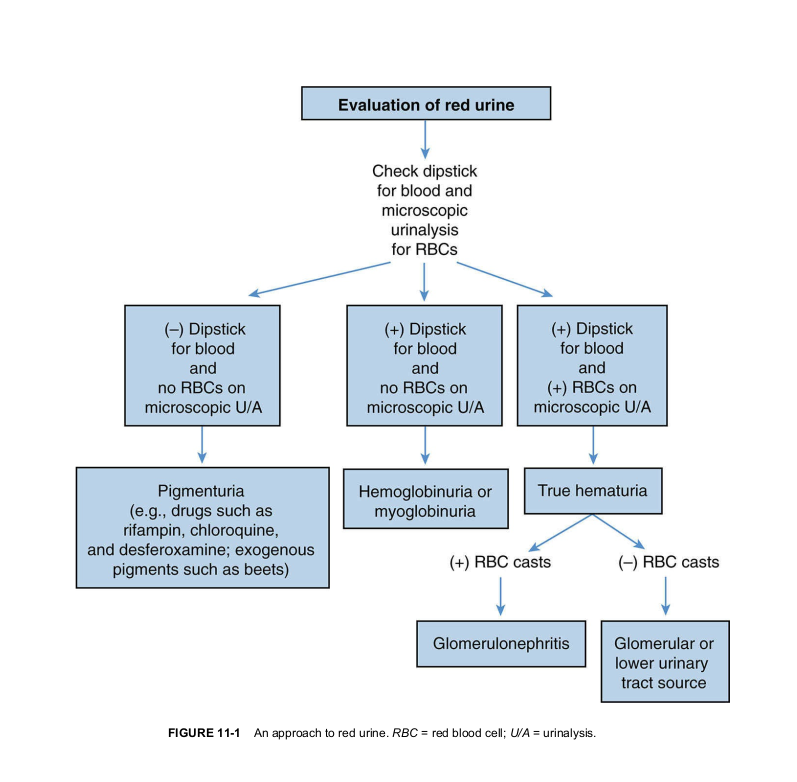 | 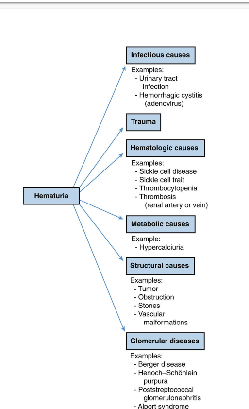 |      |
| ------------------------------------------------------------ | ------------------------------------------------------------ | ---- |
|                                                              |                                                              |      |

### Nefrotiskt syndrom - NS

***Presentation***

* Mustafa 7år, 
  * sedan tidigare astma, inkommer till akuten pga av att han av föräldrarna uppfattas som svullen sedan ett par dagar i ansikte/ögon ochpå fötterna. I status kan du se diskret svullnad bilateralt, symmetriskt enligt ovanmed i övrigt intakt hud.AT gott, afebril. Vitalparametrar ua för åldern. Hjärta: normalfynd, 
  * ***Lungor***: normalfynd, BT 90/60mm Hg(normalvärde). 
  * Du misstänker en specifik sjukdom, den mest troliga,och vill lägga in Mustafaför utredningochta prover för att komma vidare i diagnostiken. 
  * **Prover som man vill ta:**

***Etiologi och patofysiologi***

* Förlust normal charge- and size-selective glomerulär barriär till filtrering av **plasmaproteiner**
* Excessiv urinära proteinförluster, leder till **hypoproteinenmi hos nefrotiskt syndrom**
* ***Hyperkolesterolemi = konsekvens till hypoproteinemi***, kompenserande?
  * reducerad plasma oncotic pressure inducerar förhöjd hepatisk produktuion plasma proteiner inklusive **lipoproteiner**
  * plasma lipid clearande reduceras av reducerad aktivitet av lipoprotein lipas i adipö vävnad. 
* ***Bakomliggande orsaker till nefrotiskt syndrom***
  * ***MCNS***: Minimal change nephrotic syndrome; representerar 80% av barnen 1-12åå
  * Focal Segmental glomerulosclerosis

***Kliniska kännetecken***

* ***kännetecknas*** av svår proteinuri >50mg/kg/24h urin total protein/krea kvot, över 3.5%, hypoalbuminemi, hyperkolesterolomi, ödem
* Flesta barn med ödem, kan variera fr mild periorbital ödem till skrotal, labial ödem, till utbredd ödem
* ***övre luftvägsinfektion, ödemet:*** ödemet efterföljer oftast en övre luftvägs infektion (ÖLI)
* pleurala effusioner eller hypotension kan ske
* **asymptomatiskt:** 
* ***predisponerad trombos***: sekundärt till hyperkoagulabilitet
  * sällan presenterar med stroke eller andra trombotiska händelse
* ***ökad risk för enkapsulerande organism:***
  * **pneumokocker**
  * kan presentera med spontana bakteriella peritoniter, pneumoni eller överväldigande sepsis

***Diagnos***

 * **Massiv proteinuri** (U-alb/U-kreat >400 mg/mmol, U-alb > 50 mg/kg/dygn)
* **Hypoalbuminemi** (s-albumin <25 g/L)
* **Perifera ödem** (och hyperkolesterolemi)

***Handläggning och utredning***

* ***Laboratorieprover***
  * **enl tenta?:** U-Alb/krea, S-alb, S-krea, urinsticka, (U-alb mätning per dygn)
* **enl PM:** TODO (gällande lipider)
  * **Blod**: Hb, evf, LPK, TPK, CRP albumin, kreatinin, cyst C, Na, K, Ca, P C3, C4, ANA Varicella serologi (immunitet?) ev. hepatit B, C serologi, ANCA, antitrombin III, fibrinogen, (kolesterol, triglycerider)
  * **Urin**: urinsticka, u-alb/krea
  * **Övrigt**: ultraljud njurar, urinvägar, ev rtg cor-pulm (övervätskning? infektion?)
  * **Övervakning under vårdtid:** 
    * **vikt vätskebalans:** x2/dygn, bukomfång 1x/dygn
    * **prover:** följ S-alb, Hb, evt, krea, Na, K, CRP, u-alb/krea, urinsticka
    * **vital:** blodtryck, puls, andningsfrekvens x2 - 4/dygn
* ***På avdelning***
  * **Vikt, vätskebalans**: timdiures
  * **BT, puls, AF** (PEWS)
  * **Mäta bukomfång** 1gg om dagen
* ***Njurbiopsi***
  * Indikationer för njurbiopsi

***Behandling***

* ***Steroidbehandling***: prednisolon

### Nefritiskt syndrom (aka glomerulonefrit? )

***Presentation***

* **En 11 år gammal pojke söker dig på vårdcentralen pga allmän sjukdomskänsla sedan ett par veckor. Han är frisk sedan tidigare bortsett från en förkylning som han hade för ca en månad sedan. Han har ingen feber och inga förkylningssymtom i nuläget. Mamman tycker att han ser lite svullen ut kring ögonen bilateralt symmetriskt vilket du också noterar. Du mäter blodtrycket som är något förhöjt för åldern.** 
  * Snabbt prov hjälpa närmae diagnos,, vad förväntas om hypotes  rätt: U-sticka, hematuri
  * Utifrån svar, fortsatt handläggning: om misstänker nefrit, skicka patienten t akuten och sjukhus
  * Två tillstånd tänkbara i detta fall, och hur skilja åt
    * Postinfektiös glomerulonefrit: komplementdeponering efter biopsi, GAS odling, serologi för GAS
    * IgA-nefrit: IgA komplex deponering i biopsi glomeruli 
    * TODO
* !!! En 6 årig flicka kommer till barnakuten pga att hon haft röd-brun urin sedan ett dygn. Hon hade en halsinfektion med hög feber för 2 veckor sedan. Man sökte ej läkare och infektionen gick över spontant efter ca 5 dagar. Det senaste dygnet har flickan kissat ganska lite. Hon klagar över viss huvudvärk. Sjuksköterskan har tagit en urinsticka som visar röda 4+, vita 1+, protein 2+, glukos 0, nitrit 0. I status finner du inget fokalt patologiskt förutom antytt ödem på underbenen men ingen tydlig svullnad över ögonlocken. BT hö arm 140/90 mm Hg. Du bestämmer dig för att lägga in flickan på avdelning för utredning. Vilka undersökningar och eventuell behandling anstaltar du om till avdelningen (2* 
  * U-albumin, S-albumin, kreatinin, urinsediment, blodtryck x 8, daglig vikt 
  * Dagliga U-krea/albuminkvot, kreatinin, daglig vikt, Prednisolon 2 mg/kg/dyg 
  * Daglig vikt, blodtryck x 8, urinmätning, Prednisolon 2 mg/kg/dygn, 
  * rätt: Svalgodling, komplement C3, C4, kreatinin, dagliga U-krea/albuminkvot , urinsediment, blodtryck x 8, Urinmätning 
  * Svalgodling, komplement C3, C4, dagliga kreatinin, Prednisolon 2 mg/kg/dygn 

***Etiologi och patofysiologi***

* Varierad orsak, 
* generellt immunmedierade, glomerulärt
* olika antigen stimmar immunkomplex bildning och deponering inuti glomeruli

***Indelning***

* Primär glomerulonefrit: sjukdomsprocess specifikt t njurarna
* Sekundär glomerulonefrit: nefrit del av en systemsjd e.g. SLE

***Epidemiologi***

* **Poststreptococcal glomerulonefrit (postinfektiös)**
  * VANLIGASTE formen av akut glomerulonefrit
  * skolålder, OVANLIG före 2åå
  * andra mindre vanliga orsaker t postinfek: malaria, HIV, HBV, HCV, kongenital syfilis
  * 

**Kliniska kännetecken**

* **Hematuri**
* **högt BT**
* **sen omkringliggande faktorer:** 
* BRS
  * Akut nefritiskt syndorm: 
    * makro hematuri, 
    * cola-färgat urin, 
    * hypertensino, 
    * vissa ggr tecken vätske overload och 
    * renal insufficiens
  * Glomerulonefrit associerat med nefrotiskt syndorm
    * mkt proteinuri
    * hyperkolesterolomi
    * ödem
  * Vissa patienter kan vara relativt asymptomatiska, där nefriten detekterad som ett bifynd i status av e.g. u-sticka

***Utredning och handläggning***

* Labb
  * Så snabbt som möjligt	
  * Initialt: 
    * urinanalys (sediment, RBC morfologi)
    * Alb/krea kvot, kvantifiera proteinuri
    * blodkemi: elektrolyter, BUN, kreatinin, serum albumin, lever enzym, kolesterol
      * **komplement komponenter**, samt **antikroppstester (ANA, anca, aso, adb**
      * IgA-nivåer
  * Extra evaluering utefter anamenss
    * HIV, HBV, HCV, HBV-serologier, för att evaluera orsaker till postinfektiös glomerulonefrit

#### IgA-nefrit och IgA-nefropati

***Allmänt***

* Aka bergers disease?

***Etiologi och patofysiologi***

* Okänd etiologi
* deponering IgA-immunkomplex i glomeruli

***Epidemiologi***

* Vanligaste kroniska glomerulonefriten worldwide. 
* presenterar andra eller tredje årtionden av livet. 
* prevalent mest i Asien, Australien, Native americans. 

***Kliniska kännetecken***

* **makroskopisk Hematuri** återkommande, efter respiratorisk infektion. 
* transient akut njursvikt kan ske hos vissa patienter
* mikroskopisk hematury presenterar mellan makroskopisk hematuri
* dåliga prognostiska tecken: mkt proteinuri + eleverad serum kreatinin. 
* **Senare i livet, presentation**: att IgA nefropatin och nefriten presenterar senare i förloppet, inte i en patients barndom eller ungdom; 

***Utredning och handläggning***

* Renal biopsi: detta för att kunna sätta diagnos. 
* Blodtryckskontroller: 

***Behandling***

* 

#### Postinfektions-glomerulonefrit

***Etiologi och patofysiologi***

* Komplementrelaterat: deponering av glomeruli deponering av komplement komplex
* etiologiskt
  * poststreptococcalt: detta är det vanligast förekommande
  * andra orsaker: HIV, malariba, HCV, HBV [bör beaktas därför i utredningen av dessa]
* 

***Epidemiologi***

* **Poststreptococcal glomerulonefrit (postinfektiös)**
  * VANLIGASTE formen av akut glomerulonefrit
  * skolålder, OVANLIG före 2åå
  * andra mindre vanliga orsaker t postinfek: malaria, HIV, HBV, HCV, kongenital syfilis

***Kliniska kännetecekn***

* **Ålder**: skolålder enl BRS, ovanligt vöre 2åå
* **8-14d utvecling efter infektion**: hud, pharyinx, nefritogen variant av GAS beta-hemolytiska streptococcer. 
* **21-28d latens efter impetigo**
* **Hematuri, makroskopisk**: 
* **proteinuri**: ovanligt av nefrotisk proportion (alltså att det är långt mkt högre proportioner vid nefros)
* **Låg-serum komplement**: C3, förekommer, men "transient", normaliserar inom 8-12v
* **njursvikt, borta efter 6-8v**: "transient impairment"

***Diagnos***

* 

### Testikel

***Presentation***

* **På barnläkarmottagningen träffar du 8 månader gamla Oskar. Han är remitterad från BVC för kontroll av testiklarna som inte varit på plats i skrotum vid 6 månadskontrollen. Du konstaterar vid dagens besök att höger testikel kan ”mjölkas” ner i skrotum, men att testikeln omedelbart åker tillbaka upp i buken när du släpper den. Vänster testikel kan du inte finna. Vilka två diagnoser misstänker du avseende statusfyndet i testiklarna på respektive sida? (2 p)** 
  * Höger testikel = RETRAKTil testikel
  * Vänster testikel = Retenerad testikel, retentio testis

### Wilms tumör

***Presentation***

***Etiologi och patofysiologi***

* Renal tumör
* 5% av patienterna har bilateral sjukdom
* en av de vanligaste renala tumörerna hos barn

***Kliniska kännetecken***

* Ofta: presenterar med stor abdominell massa
* ofta hittas incidentalt i annars friska barn.

***Utredning och handläggning***

* **Anamnes**
  * svullnad magen
  * sällan symptom men föräldrar noterar knöl eller svullnad på ena sidan av barnets mage
* **Diagnosen ställs med hjälp av ultraljud**. Viktigt att undersöka båda njurarna kan förekomma bilateralt. Kan i vissa fall men sällsynt sprida sig till lever och skelett. 
* **Radiologiskt**: kmr visa intern renal massa distorting the normal structure. 
  * Ultraljud
  * och/eller DT el MR
* **Staging**: assess fjärrmetastaser (lunga vanligtvis); intiial tumör resektabilitet; funktion av kontralateral njure. 

***Behandling***

* I UK enl Illustrated paediatrics
  * receive initiell kemoterapi + delayed nefrektomi
  * tumören stageas efter det histologiskt och sedan bedöms kirurgiska och patologiska fynden

***Prognos***

* Väldigt god, över 80-90% botade

## Ortopedi

### Coxitis simplex

***Presentation***

* **En 5-årig pojke**
  *  kommer in till akuten pga hälta på höger sida. Han klagar inte så mycket men vill inte gå på det högra benet. Han har ingen feber och är tidigare frisk. Du undersöker honom och noterar då skyddsreflexer o smärta vid rotation i höger höft. Övrigt status i leder och rörelseapparaten är utan anmärkning. Blodstatus med diff är normalt, CRP < 5.
  * sannolik diagnos: coxitis simplex
  * bekräfta diagnos: UL-höft kan göras, ej nödvändigt för diagnos enl tentasvar fr student
  * om diagnosmisstanke bekräftas vad visar undersökningen: ledutgjutning åp ultraljud, i.e. ökad vätska i leden.
* **3 år gammal flicka**
  * som du träffar på barnakuten som ej velat gå sedan ett par dagar. Hon var förkyld för ett par veckor sedan. Gott allmäntillstånd. Hon har ingen feber, inga utslag. Hon har en lätt inskränkning vid abduktion i höger höft men i övrigt finner du inget anmärkningsvärt. Ange en sannolik diagnos och vad är ditt nästa steg? 
  * Höftsnuva
* En 3 år gammal flicka som du träffar på barnakuten som ej velat gå sedan ett par dagar. Hon var förkyld för ett par veckor sedan. Gott allmäntillstånd. Hon har ingen feber, inga utslag. Hon har en lätt inskränkning vid abduktion i höger höft men i övrigt finner du inget anmärkningsvärt. Ange en sannolik diagnos och vad är ditt nästa steg? 
  * Coxitis simplex, höftsnuva
  * UL mo oklar diagnos, letar ledutgjutning antydan på inflammation i leden
  * brukar bli bättre inom ngt dygn. 
  * Behandling: vila, alvedon, ipren vb vid smärta.
  * **Övrig info om diagnos**
    * Typisk åldeR: 2-8åå, 
    * haltande ungar
    * ingen feber
    * ingen crp
    * haltar smäörtpåverkad, 
    * men inte sjuka
    * normal rtg, ekofri synoivt på UL
*  **En 5-årig pojke kommer in till akuten pga hälta på höger sida. Han klagar inte så mycket men vill inte gå på det högra benet. Han har ingen feber och är tidigare frisk. Du undersöker honom och noterar då skyddsreflexer o smärta vid rotation i höger höft. Övrigt status i leder och rörelseapparaten är utan anmärkning. Blodstatus med diff är normalt, CRP < 5.** 
  * Diagnos: coxitis simplex, höftsnuva
  * bekäfta diagnos: UL höft men krävs ej för diagnos, kliniskt annars..
  * vad visar undersök: Ekofri synovit (ledutgjutnign=)

***Behandling***

* Höftvila
* smärtlindring vb

### Höftdysplasi

***Kliniska känneteckenVanligaste toxin exponeringen är hushållsprodukter***

* Galeazzis tecken: knäet lägre på pvårkad sida, när höft flekterade och patient supin

## Oftalmologi

### Kongenital katarakt

***Etiologi och patofysiologi***

* Rubella
* toxoplasmos
* syfilis
* CMV

## Preliminär bedömning

### Mall för PBD

***Exempel 1***

* 2.5 åå gammal pojke, tidigare recidiverade otiter och förkylningsastma, som söker för 1a ggs kramp. Har feber sedan 2dygn, idag snabbt stigande t 40.5. Storebror sjuk nyligen med influensasymptom. Fyller kriterier för feberkramp. I status noteras AMO, sannolik orsak t feber. CRP förhöjt. Har även virusbild dock låg misstanke om influensa då AT väs ua. Skickas hem med recept på amimox. informerar föräldrar om försämring eller uteblibven förbättring får de söka vård igen. VIktigt att han dricker ordentligt och kissar. 

### Tentfalll

#### Bronkiolit och ÖLI

7 v gammal flicka på barnakuten Kontaktorsak: Apné i hemmet. Inkommer på larm med ambulans. Socialt: Första gemensamma barnet. Äldre halvsyskon (2,5 år) på förskola. Graviditets- och nyföddhetsförlopp: Okomplicerad graviditet. Akut sectio v 34+4 p g a kraftig vaginal blödning. FV 2,1 kg. Vårdad neo 4 veckor, CPAP första levnadsveckan. Antibiotikabehandlad (Bensyl PC och Biklin) p g a suspekt sepsis, neg blododlingar x 2. Aktuellt: Välmående sedan utskrivning från neo fram till för 2 dagar sedan. Sedan dess tilltagande snuva och andningsbesvär. Andats snabbt och ansträngt enligt föräldrarna. Ammat sämre, ej velat ta bröstet sedan i morse. Möjligen kissat mindre än vanligt. Bajsat normalt under ambulanstransporten. Ej känts varm, tempen ej kontrollerad. Kl 19, i samband med amningsförsök, plötsligt slutat andats. Var slapp i hela kroppen i samband med detta, men ingen säker färgskiftning. Återfick andning och tonus efter några sekunder efter att föräldrarna sugit bort segt slem med hjälp av nässug. Stabil under transporten, erhållit syrgas på mask. Status: AT: Kl 19.45. Något blek och tagen, öppna ögon. AF 70/min. Rejält snorig, diskret hosta. Interkostala indragningar och bukandning. Saturation 97% med 5 L syrgas på öppen mask. Kap refill 2,5 sek. Temp 37,2. Vikt: 2,8 kg MoS: Något torra slemhinnor. Oretat svalg. Hjärta. RR, normofrekvent. Inga blåsljud. Lungor: Rikligt med slembiljud över båda lungfälten. Buk: Mjuk, ingen organförstoring Neurologi: Sidlik tonus i övre och nedre extremiteter. Normala nyföddhetsreflexer. Fontanell ua. Hud: Inspekteras utan anmärkning Lab: Blodgas med pH 7.32, pCO2 9 och BE -6. Glukos 5.4. CRP 7. Skriv din PBD på de anvisade raderna 

***Svar***

7v flicka, prematur 34+4 pga kraftig blödning, FV2.1kg, vårdad 4v, fått CPAP, utv sepsis, beh antibiotika. Sökar pga apneutveckling med rejäl förkylning och snorighet, samt slembiljud. Utskriven neo 2d sedan. Sedan dess tilltagande förkylningsbesvär + andningsbesvär. Sämre amning sedan morgonen. Mindre kiss + normalt bajs under ambulans. Under transport vid amning blev plötsligt slapp + apnoisk, som reverserades efter nässug. Status högt AF 70/min, rejält snor, hosta, interkostala indragningar, bukandning, saturation 97% på 5L syrgas. Torra slemhinnor, oretat svalg. slembiljud båda lunfält. Ingen. Differentialdiagnostiskt pneumoni men osannolikt i nuläget pga tydligt pot RS-virus bronkiolit. Sammantaget misstänkt RS bronkiolit + ÖLI på nyligen utskriven prematurt född 7v flicka. Inlägges för stabilisering, uppvätskning, nutrition. Fortsatt syrgas. NaCl nästoalett för att förbättra andning. V-sond för uppvätskning enl 5% kroppsv över 4h ORS, underhåll 150mL/kg/d bröstmjölk. PEWS 8 första dygn. Återkoppling med flöde och ringer Neo-konsult för vidare handläggning. 

#### Feberkramp

Johan 1,5 år söker på barnakuten Anamnes Kontaktorsak: Misstänkt kramp Socialt 1:a barnet. Bor hos mamma. Träffar pappa emellanåt. Tidigare sjd: Tidigare frisk Aktuellt: Igår så gick Johan på dagis under dagen och var pigg som vanligt. På kvällen kändes han lite varm. Inga ÖLI tecken. Kom över och sov i mammas säng och på natten satte han sig upp och pratade, somnade om. Efter en stund vaknade mamman av att han lät konstigt då han andades, tog upp honom. Han tittade upp med uppspärrade ögon och kändes spänd och hade symmetriska ryckningar. Duration cirka ngn minut. Var lite trött i anslutning till episoden men kunde titta och prata. Överkänslighet: Ingen känd. Status Allmäntillstånd: Rosig om kinderna. I övr god kontakt. Rätt pigg. Kroppstemperatur: 39,7 °C Munhåla och svalg: Rodnat svalg, inga beläggningar. Öron: Trumhinnorna bilateralt ua. Ytliga lymfkörtlar: Små adeniter palpabla på halsen. Hjärta: Normal rytm, inga blåsljud. Perifera pulsar: Femoralispulsar palperas ua bilateralt. Lungor: Normala andningsljud bilat, inga biljud. Buk: Mjuk, oöm. Inga palpabla patologiska resistenser. Hud: Inga utslag Neuro: God kontakt. Symmetriska rörelser och normal tonus. Normal gång. PBD Skriv på nästa sida 

***Svar***

1.5åå pojke, tidigare frisk, söker pga misstänkt feberkramp. Inatt varm och mamma noterat pat fått symmetriska ryckningar, och spändhet, duration på 1minut. Ingen tydliga tecken på postiktalitet då litet trött men kunnat prata och titta efter episod hemma. På akuten 39.7 graders feber, rodnat svalg, adeniter palpabla hals, normala andningsljud, och neurologiskt adekvat symmetrisk i rörelse, pratbar, normal gång. Därför misstänkt feberkramp pga tydligt infektionsfokus, febrilitet, gott neurostatus med avsaknad postiktalitet. osannolikhet epilepsi eller meningit pga central infektiös genes inga tydliga diagnostiska tecken (e.g. postiktalitet, fokalitet). Stämmer av med flöde innan hemskick med antipyretika och uppföljning BVC.

#### Feberkramp 2

Intagningsorsak 2,5 årig pojke med 1:a gångs kramp som inkommer till akuten i ambulans. Ärftlighet: Ingen feberkramp hos föräldrar. Båda föräldrarna har haft upprepade otiter och rör som barn. Socialt: Sammanboende föräldrar. Har en storebror. Går på förskola Tid/nuv.sjukdomar: Under sitt första levnadsår haft fyra otiter. Otit även för tre månader sedan. Förkylningsastma. Epidemiologi: Storebror har precis haft influensasymtom. Aktuellt: Feber sedan två dygn. Varit hostig. Idag på eftermiddagen suttit vid köksbordet och plötsligt blivit stel och glidit ner från stolen men ej slagit i huvudet. Var cyanotisk om läpparna och stirrade uppåt men var ej kontaktbar. Var först stel och fick sedan symmetriska ryckningar och man upplevde att pojken inte andades under denna tid, ungefär 1-2 minuter. Pappa började göra inblåsningar och pojken återfick färgen strax därefter. Då släppte även stelheten. Pojken var därefter trött men steg gradvis i medvetande. Då man smärtstimulerade reagerade han. Ambulans kom några minuter därefter och pojken skrek i samband med stickförsök. I ambulansen 40,5 grader. Status Allmäntillstånd: Sover initialt i mammas knä. Vaknar lätt vid undersökning, pratar och reagerar adekvat. Kapillär återfyllnad <2 sekunder. 38,0 °C efter given Alvedon. Vikt 12 kg Saturation 97 % Munhåla och svalg Stora tonsiller, ej rodnade eller med beläggningar. Öron: Bilateralt röd kärlinjicerad trumhinna, som buktar lätt. Ytliga lymfkörtlar: Palpabla i käkvinkel bilateralt, i övrigt inga i halsregionen. Hjärta: Regelbunden rytm, inga hörbara bi- eller blåsljud. Lungor: Vesikulära andningsljud bilateralt utan rassel eller ronki. Inget ökat andningsarbete. Buk: Normala tarmljud. Palperas mjuk och oöm. Neurologiskt status: Rör sig liksidigt. Pratar adekvat. Provtagning: CRP 37. Glukos 5,7. Bedömning o Åtgärd: - var god skriv på nästa sida! 

***Svar***

2.5åå pojke, söker för 2d feber och tonisk klonisk kramp idag eftermiddag. Ingen känd heredite, föräldrar öronbarn. Epidemiologiskt, storebror haft influensaliknande sjukdom.  Feber sedan 2d, och idag tonisk klonisk kramp 1-2min, ingen postiktalitet enl anamnes. Status, 40.5 feber, 38.0 efter alvedon, god cirkulation. Infektionsfokus öron bilateralt med butkande trumhinnor + käkvinkeladenit. Bra andningsarbete, saturerar väl. Neurologiskt, pratbar och rör sig symmetiskt. I övrigt oanmärkningsvärd status. DIfferentialdiagnostiskt inga större förebehåll meningit (ingen nackstelhet, god neurostatus). Sannolikt feberkramp pga bilateral AMO. Ställningstagande LP efter disk. med Flöde och barnjour. Observation några timmar på akuten, med antipyretika, försök matintag + vätskeintag. Hemgg om gott status, och inga tecken försämrande AT och neurostatus. Feberkramp anses komplicerande för AMO, förskriver kåvepenin 5d. Avrapporterting med flöde gällande ställningstagande.

#### Hjärtsvikt

Emma 5 veckor kommer till barnakuten Anamnes Kontaktorsak: Amningsproblem Socialt 2:a barnet till sammanboende föräldrar. Alla friska. Graviditet och nyföddhetsperiod: Normal graviditet. Partus normalis i vecka 39 + 2. Okomplicerat förlopp. Aktuellt: Emma har varit tröttare den senaste veckan och inte orkat amma som vanligt. BVC sjuksköterskan noterar att hon tappar i vikt sedan ett par veckor. Emellanåt så svettas hon vid amning. Nu är hon trött och mamman är orolig att hon inte får i sig tillräckligt med mat. Emma har inga förkylningssymtom och ingen feber. Överkänslighet: Ingen känd. Status Allmäntillstånd: Trött, ej slö. Feberfri. Blek och hypoton. Kroppstemperatur: 36,7 °C Munhåla och svalg: Inspekteras ua. Öron: Trumhinnorna bilateralt ua. Ytliga lymfkörtlar: Inga palpabla på halsen. Hjärta: Normal rytm, Systoliskt blåsljud längs sternum vänster sida. Lungor: Normala andningsljud bilat, inga biljud. Buk: Mjuk, oöm. Leverkant palperas 2cm nedom arcus. Hud: Blek. Inga utslag Neuro: Fontanell palperas ua. Symmetriska rörelser. Gripreflexer i händer och fötter något svaga. Mororeflex ua. Något hypoton. PBD Skriv på nästa sida 

***Svar***

5v flicka, normal PN 39+4, ingen hereditet, tidigare frisk, söker med misstänkt VSD/hjärtkomplikation + amingsproblematik. Senaste veckorna tröttare + ingen ork för amning + svett vid amning. Har enl BVC sjunkit i vikt senaste veckorna. Enl status inga tecken infektion, förkylning eller ÖLI. Vid hjärtauskultation vänstersidiga blåsljud. Lever palpabel 2cm nedom arcus. Gripreflexer svaga. Övrig spädbarnstatus ej påverkat. Enl anamnes + status misstänkt hjärtsvikt (e.g. signifikant VSD med förhöjd pulmonal resistens och nu högersidig svikt). NG-sond på akuten. Saturation preduktalt, postduktalt.  Läggs in BAVA för rehydrering enl PM (5% kroppsvikt 4h, RA), sondmatning (ersättning 4kg = 600mL 24h), återfödning, PEWS 4. viktkontroller, dygngsdiures. Kontakt barnkardiolog jour + barnneurologjour gällande fortsatt handläggning på avdelning. Avstämning med flöde gällande bedömning. 

#### Hyperglykemi

Intagningsorsak: 12 årig pojke med hyperglukemi Ärftlighet Morfar samt morbror med DM typ 2. Inga kända övriga autoimmuna sjukd i familjen. Socialt: Barn 3/3 till sammanboende föräldrar. Går i 6e klass engelska skolan. Haft lite extra mycket press i skolan. Trivs bra och har mycket kompisar. Gillar på fritiden att åka kickbike samt sysslar med parkour. Tid/nuv.sjukdomar: Väsentligen frisk. Överkänslighet: Kraftig överkänslighet mot pollen. Epidemiologi: 0 Aktuella läkemedel: Läkemedel för astma. Aktuellt: Druckit mycket vätska och kissat ofta de senaste två veckorna, även på nätterna vilket han annars inte gör. Ingen feber eller huvudvärk. Gått ner ett par kilo i vikt. Han har varit tröttare än vanligt och haft lite illamående de senaste dagarna. Status Allmäntillstånd: Hålögd och lite blek men annars vid gott allmäntillstånd. Vikt 38,6 kg Andningsfrekvens: Cirka 18 andetag/min. Saturation 98 % på rumsluft. Pulsfrekvens 90 slag/min Kroppstemperatur 36,9 °C Munhåla och svalg: Inspekteras normalt Ytliga lymfkörtlar: Palperas på sedvanliga stationer ua. Hjärta: Regelbunden rytm utan hörbara bi- eller blåsljud. Lungor: Vesikulära andningsljud bilateralt. Inga rassel, inga ronki. Buk: Palperas generellt mjuk och oöm Perifer cirkulation: Kapillär återfyllnad < 2 sekund er, perifert varm. Hud Huden ua. Provtagning pH 7,33, BE -8, natrium 127, kalium 4,2, b-glukos 38,9. Blodketoner 4,2. Urinsticka +3 ketoner och glukos 3+ Bedömning o Åtgärd – var god skriv på nästa sida! 

***Svar***

12åå pojke, tidg frisk, morbror DM2, söker pga trötthet, ökat vätskeintag, viktnedgång senaste 2v. Status överlag oanmärkningsvärt. Labbmässigt glukosuri, ketonuri, kompenserad metabol acidos, med B-glukos 38.3, blodketoner 4.2. Arbetsidagnos nydebuterad DM1 med svår hyperglykemi, och antydan början på DKA. Akut inläggning, rekommenderar inläggning BIVA för rehydrering och glukos/keton korrektion. Infarter på akuten, rehydrering RA/NaCl minst 1h INNAN insulinbehandling. Kaliumtillägg när kalium <3.5. Monitorering blodgas varje timme initialt. Kontakt barnendokrinolog, BIVA. Snabb avstämning flöde eller barnjour innan. 

#### Kawasaki

2 år gammal pojke på barnakuten Kontaktorsak: Feber. Remiss från Fittja vårdcentral Socialt: Barn 3 av 3 i hel familj. Går i förskola. Tidigare sjukdomar: Förkylningsastma, tar Airomir och Flutide regelbundet via Optichamber under vinterhalvåret Aktuellt: Feber och dålig aptit sedan snart 6 dagar. Varit påtagligt gnällig det senaste dygnet. Ögonen irriterade och röda. Ingen hosta eller andra symptom som föräldrarna känner igen som astma. Remitterad från vårdcentralen p g a oklar feber och högt CRP (110). Endast druckit 1 dl Festis sedan i morse. Ej kissat idag. Normal avföring i går. Status: AT: Kl 20.30. Påtagligt irritabel, svårtröstad. Normalt andningsmönster. Kap refill 2,5 sek. Temp 39,6. Saturation 99% på luft. Vikt: 14,1 kg. Vägde 14,8 kg för en månad sedan. MoS: Tydligt rodnad tunga. Torra slemhinnor, ilsket röda och spruckna läppar. Förstorade tonsiller bilat, rodnade. Inga beläggningar. Lymfkörtlar: Bilateralt förstorade ömmande körtlar i båda käkvinklarna, ca 2 cm. Ögon: Uttalad bilat konjunktivit med ökad kärlinjektion. Hjärta. RR, HF 110-130 ppm. Inga säkra biljud, svårbedömt p g a skrik. Lungor: Sidlika andningsljud. Inga ronki, inga krepitationer. Buk: Svårbedömt då gossen spänner sig. Ingen tydlig ömhet eller organförstoring. Neurologi: Normal sidlik tonus. Ingen nackstelhet. Hud: Makulöst utslag över större delen av bålen. Händer och fingrar inspekteras utan anmärkning. Lab: Måttlig grad av leukocytos, i övrigt normalt blodstatus. CRP 125. Blank urinsticka. Skriv din PBD på de anvisade raderna 

***Svar***

2åå gosse, söker med misstänkt Kawasaki. Förkylningsastma som beh med Airomir + flutide regelbundet under vinter. Nu Feber + dålig aptit senaste 6 dagarna. Högt CRP (110). Viktnedgång senaste dagarna sannolikt pga dehydrering och dålig nutrition, påtagligt  gnällig senaste dygn.  På akuten status uppfyller kriterier för kawasaki (vg se status). Cirkualtoriskt stabil (god CRF), inga tecken chock, meningit. Differentialdiagnostiskt osannolikt mononukleos, läkemedelsreaktion (steven johnson), eller sepsis. Ska efterfråga vaccinationsstatus. Planeras inläggning för rehydrering och nutrition. PVK  för uppvätskning och nutrition mtp MoS status. Ställningstagande inför IvIg efter diskussion med Flöde. PEWS x6. 

## Professionell Utveckling

### Anamnes

***Presentation***

* Du ser i tidboken att du ska träffa Max, 15 år, för första gången. Han har akut intermittent porfyri och denna gång kommer han ensam till mottagningen. Du berättar om den villkorade tystnadsplikten och frågar om det är ok att du ställer några frågor för att lära känna honom, utöver det du läst i journalen. Din tanke är att ta en ungdomsmedicinsk anamnes enligt internationell standard, så du planerar att fråga om:
  * Hem, skola, fritid, droger, sex

***Utredning***

* HEADS: Home, education, activities, drugs, sex

## Reumatologi

### Svullet knä

***Presentation***

* Stina är 6 år och har sedan 1 vecka haft ett svullet höger knä. Hon har ingen feber. Hon harhaft  svårt att gå och haltar. Pappa har psoriasis men Stina har inga hudbesvär. Anger ingensmärta i vila. I status: gott AT, afebril. Hon har svullnad runt patella höger knä, ingen rodnadmen värmeökning jämfört med framsidan av underbenet. Har en extensions och flektionsdefektpå ca 20 grader i hö knä. Status i övrigt är utan anmärkning inkl hud.Vilken diagnos är minst sannolik med ovanstående anamnes och status?
  * **Sannolika diagnoser**
    * **Reaktiv artrit)** 
    * **JIA monoartrit**
    * **Borrelia artrit**
    * **Psoriasis artrit**
  * **Detta är ingen: Septisk artrit**
* **Du tar emot 12 åriga Suri på barnmottagningen för bedömning av ett knä som varit konstant svullet i snart fyra veckor. Hon förnekar bestämt bakomliggande trauma. Knät ömmar vid flexion och är värmeökat. Svullnaden är ff a lokaliserad medialt och lateralt om patella. Hon är opåverkad och afebril, men haltar tydligt. Övriga leder undersöks utan anmärkning.** 
  * Uppfyller hon kriterierna för JIA, motivera kort ditt svar
    * Nej
    * kriterierna för JIA
      * Under 16åå
      * symptom över 6v
      * uteslutit andra diagnoser
* **Du funderar kort på om flickan skulle kunna ha en septisk artrit, men du kommer fram till att den diagnosen är mindre sannolik utifrån anamnes och status.** **b) Förklara med 3 punkter hur du resonerat! (1 p)** 
  * Duration: leden konstant svullen 4 vecokor. Septisk artrit har ett mer akut förlopp
  * Afebrilitet
  * Ej allmänpåverkad
* **c) Ange 4 relevanta blodprover – utöver Hb, LPK och TPK – du vill beställa som led i den fortsatta utredningen av Suris besvär? (2 p)** 
  * SR/CRP
  * ANA
  * Borrelia serologi
  * blodstatus + diff
* **Du får snabbt svar från lab att Siris blodstatus är utan anmärkning. Farmodern är mycket lättad över beskedet, men hon undrar hur ”blodkroppsanalysen” kan se ut om ett barn har blodcancer.** **d) Förklara detta kort för farmodern! (1 p)** 
  * LÅga nivåer blodkroppar, blodplätter och ofta höga nivåer eller låga nivåer vita blodkroppar
* Vilke vanligaste barncancertypen
  * ALL
* Vilket prov tar man för att bekräfta en misstänkt blodcancer
  * Benmärgsprov
* Vilken behandling sätter du in i väntan på återbesäket

Ataxic cerebral palsy is due to [...] damage.

### JIA

***Presentation***

* **Anna 4 år** 
  * kommer till din mottagning. Hon har haft ett svullet höger knä och en svullen vänster fotled i många veckor. Hon är stel på morgonen och det tar ett par timmar innan hon har normal gång. Hon har en mormor som har ledgångsreumatism i övrigt inga reumatiska sjukdomar i närmaste släkten. Anna blev fästingbiten i somras men fick ingen ring runt bettet. I status kan du bekräfta anamnesen. Övrigt ledstatus är utan anmärkning Du misstänker en diagnos och beställer prover. Vilket alternativ stämmer bäst med din bedömning och plan:
  * **Juvenil idiopatisk artrit.** 
  * **Borreliaserologi, Blodstatus, CRP och SR, ANA**

 ***Epidemiologi***

* Vanligaste reumatiska tillståndet hos barn. 

***Diagnos***

* **Definition fr reuma föreläsning**
    * Svullnad av en led
    * ELLER inskränkt rörelseförmåga i en led med smärta eller palpationsömhet, 
    * dvs artrit av minst 6v duration observerat av läk
    * inte primärt orsakad av mekaniska eller andra identifierbara orsaker
* **Kriteriediagnos. 3 kriterier.** 
    * <16 år 
    * Symptom >6 veckor 
    * Andra orsaker uteslutna 

***Kliniska kännetecken***

* **Polyartikulär**: RF-positiv, Rheumapositiva och negativa kommer hos polyartikulära. 
* **Oigoartrit, vanligast**: 
  * 4 och färre leder
  * Den vanligaste formen är oligoartrit formen. 
* **systemisk JIA**: 

***Utrending och handläggning***

* **Officiella utredningsgången**
  * **Blodstatus med diff**, 
  * **CRP,**
  * **SR,** 
  * **ANA**: 30% har det och det är associerad med högre risk för uveit: behöver följas upp av ögonläkare
  * **Borreliaserologi,** 
  * **skelettröntgen.** 
  * **Borreliaserologi** för att utesluta borrelia. 
  * **Blodstatus med diff** för att utesluta leukemi. 
  * **Skelettröntgen**: för uteslutning av malignitet ostemyelit o andra diagnoser.

***Behandling***
* !!! NSAID.
* Om inte fungerar man kan skicka remiss till reumatolog för kortisoninjektion. 

## Pulmonologi

### Allmänt

## Vätskebalans

### Allmänt

***Presentation***

* !! **9mån pojke pat gått ned 8.4kg til 8kg, inlagd AB och har en sond**
  * Väljer lägga in hamza för vätskbeh och nutritionsbeh via sond, samt beh proralt ntibiotika i form av ceftibuten
  * ordinera vätska, volym i mL samt under hur lång tid vätskan ska ges
    * Uppvätskning 
      * 5% kroppsvikt på 4h. ORS (oral rehydration solution, istället för RA) då pat har sond
    * Underhållsbehandling
      * välling 1000mL på 24h
* !!! **En 1 årig**: Notera att man lägger på + FÖRLUSTER
  * flicka kommer till barnakuten för feber, kräkningar och diarre i 1½ dygn. Hon var normalviktig vid födseln och har följt sin vikt och längdkurva på medianen. I status är hon febril 38,5. Hon tycks lätt-medel dehydrerad med torra läppar. Kapillär återfyllnad 2 sek. Väger nu 9,5 kg., kräks ej på akutmottagningen men tar inte emot vätska. Du väljer att lägga in henne. Du väljer sond och skall nu ordinera rehydrering och underhåll. Dina ordinationer blir: (2 * 
  * Rätt: ORS 500 ml på 4 timmar följt av välling underhåll 50 ml per timme + ***förluster med ORS*** 
  * ORS 500 ml på 4 timmar följt av ORS underhåll 50 ml per timme 
  * ORS 500 ml på 2 timmar följt av välling underhåll 50 ml per timme 
  * ORS 500 ml på 4 timmar följt av välling underhåll 100 ml per timme + förluster med ORS 
  * ORS 200 ml på 2 timmar följt av välling underhåll 50 ml per timme 

***Allmänt***

* Nyfödda, under 1 mån:
  * utgörs av 77% vatten. 
  * ECV volymen är större än ICV volymen 
* Över 1.5månader
  * ICV volymen nu större än ECV volymen, som kommer att förbli resten av livet. 

### Vätsketillstånd

#### Chock

***Kliniska kännetecken***

* CRT
* Puls
* färg
* medvetandegrad

***Behandling***

* Ringer-acetat: isoton vätska
  * 20mL/kg, så snabbt det går på droppen och given pvk, vanligtvis 1mL/kg/min, så då tar det 10-20 mins för given PVK
  * 10mL/kg:  prematurfött barn, under 44v gestationsålder...; trauma; hjärtsjd
* upprepas om cirkulationen är ej tillfredställande efter given vätska
* överväg albumin om tredje bolus vätska behövs. 

#### Dehydrering

***Kliniska kännetecken***

* Färg
* Gråter utan tårar
* Slemhinnor
* Urinproduktion

***Behandling***

* ***Uppvätskning, rehydrering, ersätta***: Detta innebär att man ersätter förlorad volym vätska
  * ORS (oral rehydration solution, aka vätske ersättning, aka VES): 
  * 5% av kroppsvikten över 4 timmar. 
  * sedan reevaluering av vätskestatus
* ***Underhållsbehandling***: 
  * ***Peroral form (välling?)***: Då är patienten tillräckligt adekvat för att ta drycken sj, eller att det sker via sond
    * 0-6mån: 150mL/kg/d
    * 6-12mån: 125mL/kg/d
    * \>12mån: 100mL/kg/d
    * Då är det i form av näringsdrycker, välling etc, som barnet kan ta vid given ålder
  * ***Intravenös form***: att pat har en infart som man kan vätska upp med
    * Plasmalyte glukos, 5% glukos, 140mM Na, 20mM Kalium
    * 0-10kg: 100mL/kg/d
    * 10-20kg: 1000mL + 50mL per kg över 10kg
    * \> 20kg: 1000mL + 20mL per kg över 20kg

#### Hyperton dehydrering

***Definition***

* Na ≥ 150 mmol/L. 
* Svår hypernatremi: ≥ 170 mmol/l

***Typfallet uppkommer***

* ej färdigutvecklad  njurfunktion –d v s patienter  <1 år
* långdragen gastroenterit(>3-4 d)
* stor viktnedgång  (>10%) 
* sedan  införande  av rotavirusvaccinet  i det nationella  programmet  2019   har antalet  fall  av hypertondehydreringminskat  påtagligt  i Sverige

***Mekanism***

* innebär förlust kroppsvatten: ***inte primärt elektrolyter***
* ***intialt*** sker extravasal vattenförlust, med resulterande hög natriumkonc i ECV
  * e.g. diarre
* ***sekundärt***: vandrar vatten fr ICV t ECV, med sekundär ICV dehydrering som följd
* ***osmotiska partiklar***: bildas i kroppen, varför vattenflöden mellan ICV o ECV upphör
* ***Resuktat***: förlust kroppsvatten, o ett hyperosmolärt tillstånd både extracellulärt och intracellulärt

### fall - vätskebehov

#### Alex 9kg  

* ***Undet det akuta skedet***: Ringer-Acetat, iv bolus, 180mL (20mL/kg)
* Under de nämaste timmarna: Ringer-acetat iv, 450mL/4h
* Under det kommand dygnet: plasmalyte glukos, iv, 100mL x 9 = 900mL/24h

#### Miriam 5kg

* Undet det akuta skedet: behöver ingen bolus...
* Under de nämaste timmarna: sond ORS, 250mL/4h
* Under det kommand dygnet: sond, bröstmjölk, ersättning: 150mL x 5 = 750mL/24h

#### Spädbarn gosse

Att korrekt kunna bedöma ett sjukt barns grad av dehydrering och eventuella cirkulationssvikt är avgörande för valet av behandling. En tidigare frisk ettårig gosse som väger 10 kg har inkommit till barnakuten där du vikarierar med symptom förenliga med en viral gastroenterit. Han har stora förluster och är hängig. Han har en kapillär återfyllnad på 4 sekunder och läpparna är torra

* Bolus Ringeracetat iv 200 ml följt av Ringeracetat iv 5% av vikten på 4 timmar
  * efter dett ska han ha plasmalyteglukos i underhållsbehandling
  * 1000mL plasmalyte 5% glukos, över 24 timmar, in accord med att det är 100mL/kg mellan 0-10kg

## Utveckling

### Barnets tillväxt

#### Drivfaktorer under tillväxt

* ***Fetalt***: 30% av adult längd
  * **uterin miljö**: är drivande för den längden
* ***Spädbarnsfasen***: 15% av adult längd, representeras under denna fas
  * **Nutrition**
  * **Bra hälsa och glädje**
  * **Thyroidea hormon**
* ***Barndomen***: 40% av den adulta längden
  * **genetik**
  * **bra hälsa och glädje**
  * **tillväxthormon**, Growth Hormone (GH)
  * **Thyroidea hormon**
* ***Pubertet***: 15% av adult längd
  * **testosteron och östrogen**
  * **tillväxthormon**, GH
* ***Könsskillnader***: vuxna män är längre än kvinnor, för att de har en längre barndomsfas + högre peak hastighet tilläxt + tillväxten hävs senare

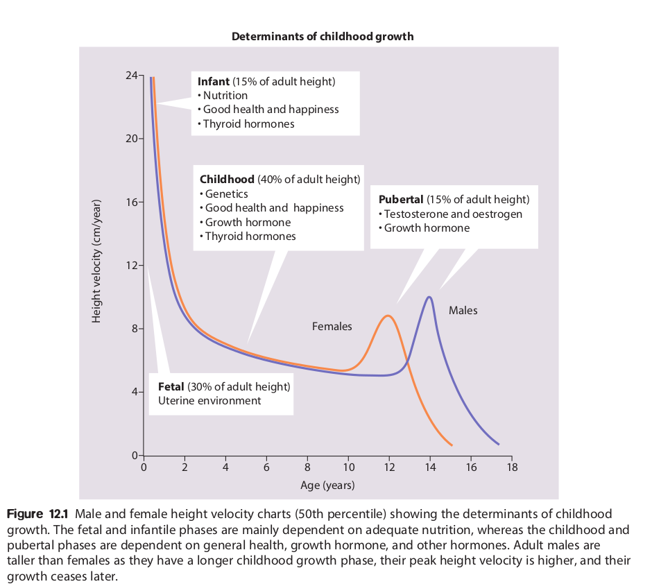

***Fetalt***

* Snabbaste tillväxtperioden. 
* Determinerar 30% av den eventuella slutlängden som vuxne

***Storlek vid födsel***

* **Påverkas av flera faktorer**
* **mammas storlek**
* **placental nutrient supply**: Modulerar fetala tillväxtfaktorer
  * IGF-2
  * Human placental lactogen 
  * insulin
* ***påverkas ej av***: storlek vid födsel är *oberoende* av pappans längd + tillväxthormon (GH)
* ***Långt gående konsekvenser***: låg storlek vid födsel har en högre sannolikhet för barnet att utveckla obesitas senare i livet. 

#### Vikt

* ***Spädbarnsåren***: 150-175g/v
* ***quadrupled weight***: efter 2.5 år...

#### ***!!! Endokrinologiskt***

* **fosterfasen**: Insulin kortison.  
* **spädbarnsfas**: IGF-1, tyrodieahormon, insulin, kortison. 
* **barndomsfas**: tillväxthormon ( from 1,5åå), senare androgener (. From 7åå).  
* **Pubertetsfas**: könshormoner.
* I enlighet med olika åldrar
  * 3 månader, IGF-1, insulin, thyroideahormon, kortisol.  
  * 4 år, Barndomsfasen: Tillväxthormon 
  * 12år, 
Pubertetsfas: könshormone

### Barnets utveckling

***Presentation***

* **ästa barn du träffar på BVC är en 7.5 månader gammal flicka som heter Alexis. Hon är bokad på ett extrabesök för utvecklingsbedömning. På 6-månaderskontrollen hade hon ett fint nyanserat joller, men hon klarade varken de förväntade fin- eller grovmotoriska färdigheterna.** 
  * nämn 3 motorisk el finmotoriska färidhgee som kontrolleras vid 6mån
    * Sitter med stöd
    * Flyttar föremål mellan händer
    * vänder om fr mage t rygg
    * skyddsrefelxeR: tar emot sig med handen om försöker tippa

**Det förekommer fyra fält som man attribuerar till barnutvecklingen:** 

* Motoriskt, 
* syn, finmotoriskt
* hörsel, tal, språk
* Socialt, emotionellt, beteenderelaterat

***Konstant mönster men olika takt***

* ***Konstant mönster***: det är ett ganska så konstant mönster som barn följer när de utvecklas
* ***Sker i olika takt***: men detta kan ske i olika takt. 
* ***Därför, ska man relatera utvecklingen med vad som skett tidigare***: för att bedömma utvecklignen korrekt ska man därför "relate each tage to what has gone before and what lies ahead". 

***Brister i ett område påverkar andra***

* Om ett barn brister inom ett visst område kan detta påverka andra områden i utvecklingen också. 
* ***Äldre, andra funktioner börjar bli relevanta***: att tex social funktion och kapabilitet att fokusera kommer att bidra till vidareutvecklingen. 

#### Milstenar

Det finns ett antal olika milstenar utvecklingsmässigt:

* ***Median åldern***: åldern då hälften av standard populationen av barnen uppnår en nivå. Agerar guide för att veta hur långt ett barn bör ha kommit utvecklingsmässigt.
  * Men berättar inte om barnet är utanför normala vrange
* ***Gränsåldrar, limit ages:*** åldern som utvecklingsrelaterade milstenen bör ha passerats. 
  * Vanligtvis, ***2 SD (standard deviationer)*** från medelvärdet. 
  * Hjälper till att guide action.

#### När man evaluerar utv

Flera faktorer måste beaktas

* Varje skill separat
* sekvens av utvecklingsprogress
* stadiet barnet uppnått för varje skill field
* om progressen är likt för varje skill field
* i slutet: barnets overall utvecklings profil, och hur det relaterar till barnets ålder

#### Motoriskt

**Motorisk utveckling sker som snabbast det första levnadsåret.** 

* ***De första stegen***
  * 25% vid 11 månader
  * 50% vid 12 månader,
  * 75% vid 13 månader
  * 90% vid 15 mpnader
  * 97.5% vid 18 månader
  * ***median***: 12 månader, agerar guide för vanligt mönster att förvänta sig. 
  * ***Gränsåldern***: är 18 månader.
  * ***om ej uppnådd efter detta misstänk:***
    *  cerebral pares (cerebral palsy, CP), 
    *  psykosocialt: understimulering socialt, social deprivation
  * ***Motorisk mönster***: det finns olika sätt att ta sig upp p ben, fr krälgång, crawling, till att man direkt ställer sig upp o går
    * det som determinerar tiden, som mest, är om barnet hasar först, då brukar det ta längre tid. 
* ***Cefalocaudalt mönster, cephalocaudal pattern***
  * motorisk utv sker i cefalocaudal riktning. 
  * relateras med ***mognad av nervsystemet*** + ***myelinering***
  * ***Myelineringen, snabbast 2 första åren***: sker som snabbast två levnadsåret, vilket förklarar den snabba motoriska utvecklingen. 
  * ***Därefter***: sker myelineringen långsammare, ***e.g. frontalloberna**
* ***Prematuritet, korrigering***
  * prematurt barn fött 3 månader tidigt (28 veckors gestation), når ålder 9 månader, ska ligga 6 månader utvecklingsmässigt
  * ***slutar korrigera***: efter 2a levnadsåret, för

***Officiella stegen (median åldrarna)***

* **Nyfödd**: Extremiteter flekterade, symmetrisk pos: Nyfödd
* **Nyfödd**: "marked head lag on pulling up": nyfödd
* **6-8 v (2mån):** Reser huvet ovan 45 grader, i prone position (liggande på mage)
* **6-8 mån:** sitter utan stöd
  * **6 månader:** rund rygg
  * **8 månader:** rak rygg
* **8-9 mån:** crawling, kryper
* **10 mån:** står oberoende (tar hj av möbler), cruises runt möbler
* **12 mån:** går ostadigt, bred gång (gait), händer apart
* **15 mån:** går stadigt

***Gränsåldrarna***

* **Huvudkontroll:** 4 mån
* **Sitter utan stöd**: 9 mån
* **står med stöd**: 12 mån
* **går självständigt**: 18 mån

#### Reflexmässigt

***Primitiva reflexer***

* ***Moro***: plötslig extension huvud ***ORSAKAR*** symmetrisk ***extension sedan flektion (flexion)*** armar 
  * borta vid 4-5mån postnatalt. ofullständig vid v28, 
* ***Gripreflexen***: (handgrip) flexion fingrar, när objekt placeras palmart
  * svag v34, bort 4-5 mån
* ***Tåreflexen:*** tårna flekterar när man trycker palmart, försvinner sist av de primitiva reflexerna
  * svag v34, borta 9-15mån
* ***Asymmetrisk tonisk nack reflex***: (ATNR) liggande supint, spädbarnet får ***utsträckt arm t den sidan huvudet är vänt*** (antar att armen byter sida när barnet vrider huvudet)
  * tydligast vid 2-3 mån ålder, borta 6mån
* ***Sugreflexen***: barnet suger, när får teat i munnen (automatisk födnings aktion)
  * svag v28, borta 4-6mån
* ***Rooting***: huvud vänds mot stimulus, när rör nära munnen
* ***Stepping response***: rör på fötterna (stepping movements) när man håller barnet vertikalt och dorsum av fötterna rör yta

***Posturala reflexer***

* ***Labyrinthine righting:*** huvudet rör sig motsatt riktning som kroppen är vänd
* ***Postural support***: när hålls upprätt, benen tar vikt och barnet pushar ifrån (bounce)
* ***lateral propping***: när barnet sitter, armarna extenderande till sidan barnet faller, som saving mekanism
* ***parachute***: när suspenderas ansikte nedåt, extenderas armar som för att rädda sig sj

#### Syn och finmotoriskt

***Medianåldrarna***

Stadiemässigt flera saker man ser hos barnet. Följande är ***median åldrarna***

* ***6 veckor:*** följer objekt som rör sig eller ansikte, genom att vända på huvudet
* ***4 mån:***  sträcker sig efter leksaker
* ***4-6 mån***: palmart grepp (palmar grasp)
* ***7 mån:*** överför leksak fr en sida till en annan sida
* ***10 mån***: mogen pincett grepp
* ***16-18 mån*** gör markeringar med krita
* ***14mån-4år***: bygga med klossar
  * ***18 mån:*** torn med tre klossar
  * ***2 år:*** torn med sex klossar
  * ***2.5år:*** torn med åtta klossar, eller ett tåg med fyra klossar (tre klossar avlångt, sen sista klossen två vertikalt)
  * ***3år:***  bro enl modell,
  * ***4år:*** trappsteg (steps), efter demonstration
* ***2-5år:***  rita specifika geometriska former
  * **2år** linje
  * **3år** cirkel
  * **3.5år** kors
  * **4år** kvadrat
  * **5år** triangel

***Gränsåldrarna***

* **FIxerar och följer visuellt**: 3 mån
* **sträcker efter objekt**: 36 mån
* **överför saker händerna**: 9 mån
* **pincett-grepp**: 12 mån

#### Hörsel, tal, språk

***medianåldrarna***

Stadiemässigt vad gäller hörsel, tral, språk hos barn, medianåldrarn

* **nyfödd** "startles to loud noises"
* **3-4 mån** vokaliserar ensam eller när man pratar med barnet, coos and laughs
* **7 mån** vänder sig till ljud utanför synfält
* **7-10 mån**: generera ljud
  * **7 mån** skapar ljud indiscriminately
  * **10 mån** skapar ljud discriminately mot mamma och pappa
* **12 mån** 2-3 fler ord än "dada/mama"
* **18 mån** 6-10 ord, visar delar av kroppen ("where is your nose")
* **20-24 mån** förenar 2 el fler ord, för att skapa små fraser ("give me teddy")
* **2.5år-3år** pratar konstant i 3-4 ords meningar

***Gränsåldrarna***

* **Polysyllables babble**: 7 mån
* **konsonant babble**: 10 mån
* **säger 6 ord med mening**: 18 mån
* förenar ord (i mening?): 2 år
* 3-ord meningar: 2.5 år

#### Socialt, emotionellt, beteenderelaterat

***Medianåldrarna***

Stadiemässigt vad gäller socialt, emotionellt, beteenderelaterat hos barn, medianåldrarna

* **6 veckor:** ler responsivt
* **6-8 mån** sätter mat i munnen
* **10-12 mån** vinkar bye-bye, spelar pek-a-bo
* **12 mån** dricker fr glas med två händer
* **18 mån** håller sked, sätter mat säkert till munnen
* **18-24 mån** symboliskt leka (e.g. matar leksaker etc)
* **2 år** kan vara torr (kissar inte) under dagen, drar av några kldäder (inför att kissa potta?)
* **2.5-3år** parallelt leka, interakivt leka evolverar, tar tur

***Gränsåldrarna och sekvens***

* mönster för nedan -> [socialt beteende: gränsåldern]
* Ler: 8v
* Rädsla främlingar: 10 månader
* matar själv, via sked: 18 månader
* symboliskt leka: 2-2.5år
* interaktiv leka: 3-3.5år

#### Sammanfatt

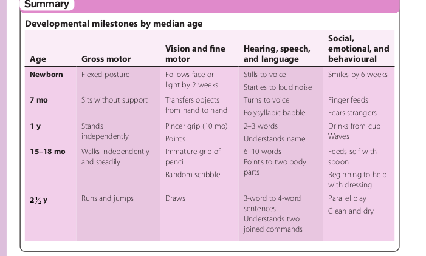

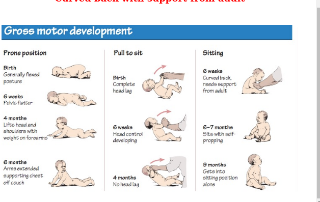

### Puberteten

***Presentation***

* Vilket är första tecknet på normal pubertet hos flickor:
  * Acneförändringar
  * rätt: Begynnande brösttillväxt. (abe)
  * Begynnande menstruationsblödning
  * Begynnande könsbehåring 
  * Humörförändringar 

### Pubertas praecox - För tidig pubertet

* Man gillar det inte
* man ska utreda detta, att man tar hormonprover för att se. 

***Presentation***

* isolerad svettlukt eller behåring... klan vara binjurebarkstumör
  * MEN då ska man inte ha tillväxt eller könskognad, detta sker ej med binjurebarksmognad. 

***Allmänt***

* Notera att adenarche att binjurebarkspubertet kan ske tidigt, och det kan vara okej
  * man gör ej MR hjärna för att man luktar svett
  * utan man ska titta på de andra tecken på pubertet som man ska vara varsam för och uppmärksam. 

***Definition:***

* **Flickor**: Brösttillväxt < 8 åå
* **Pojkar**: Testikelvolym > 4 ml < 9 åå

***Orsak:***

* Hos pojkar ofta patologisk orsak -> utredning obligat
* Hos flickor oftast idiopatiskt
* **Centralt utlöst**: CNS-tumör, idiopatisk
* **Perifert utlöst**: Binjurebarkstumör

***Kliniska kännetecken***

***Handläggning och Utredning***

* Gonadotroppiner, bla LH, FSH, CENTRAL
* könshormoner: östrogen, testosteron, PERIFER
* skelettålder
* MR hjärna
* Gällande om man luktar svett
  * att isolerat lukta svett, sen att det går bort etc, detta är okej
  * notera 

***Behandling***

* GnRH-analoger (block av gonadotropin-utsöndring)

### Pubertas tarda

***Etiologi och patofysiologi***

* Multifaktoriellt, samt många olika orsaker
* Heriditet för sen pubertet: dominerar störst, se till att fråga föräldrarna om de hade för sen pubertet
* ***Anorexia***
* ***Kronisk sjukdom***
* ***Hård träning***: både män och kvinnor. 
* allvarligare diagnoser som ska beaktas
  * ***CNS-tumör*** (ex kraniofaryngiom): detta att man får utreda.
    * hypofystumör
  * ***Turners syndrom***

***Utrednin***

* Gonadotropiner: bla FSH, LH;
  * dessa bör dra iväg först. 
* Könshormoner: östrogen och testosteron
  * har man ett testo som börjar dra iväg ibland, då vet man att pubertet är snart igång

***Handläggning och utredning***

***Behandling***

* testostoron im inj
* östrogen plåster
  * många tjejer som avstår. 

### Tillväxtkurvor

***Presentation***

* **Tillväxtkurvan är ett av barnläkarens viktigaste verktyg. Matcha tillväxtkurvorna (siffran på kurvan skrivs på linjen) med nedanstående tillstånd och motivera kort ditt svar. Ett tillstånd per tillväxtkurva.** **a) Tillväxthormonbrist _________** **b) Turners syndrom _________** **c) Celiaki _________** **d) Sen pubertet _________** **Kurvorna bifogade som bilaga. 4 p** 

***Hormonellt***

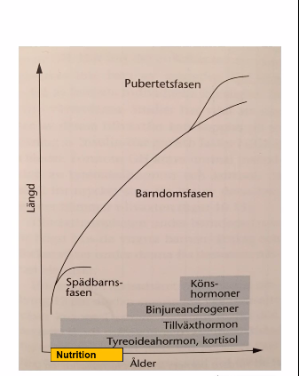

* notera att tillväxthormon menar man IGF1 när man screenar (det medräknar GH och IGF); för att GH varierar så mkt över tid mäter man IGF1 istället. 
* Har man normalt IGF1 har man ingen GH-brist
* GH och IGF1 är sammankopplade ska man notera. man använder inte GH för att prvota. 
* GH är by itself drivande för att generera tillväxten, men finns assistans. 

***Viktmässigt***

* Tredubbling vikt första året. 

***Kurva 0-2åå***

* Fortsättning intrauterin tillväxt

3

***Kurva 2-7åå***

* barnet växer ca 5-6cm/år
* tillväxten ffa beroende på GH: därför faller man ut vad gäller GH brist i denna fast, ibland tidigare
* man pratar om slanka barndomsfasen
* minskad fettmassa, BMI sjunker
* Det är många barn som hoppar över den slanka barndomsfasen tyvärr, dessa ska man identifiera så tidigt man kan.
* // notera ingen överburen korrigerar man

***Speciella kurvor***

* Prematurkurvor: ålderskorrigering upp t 2åå
  * denna korrigerin kommer att mötas efter en liten period
  * kan ske en längd och viktcatchup. 
* Downs syndrom barnen: är kortare
* Turners syndrom: har en Turner kurvva
* skelettdysplasier: man kan kolla på deras sitthöjd, då de har korta ben etc.....

***Tillväxt barn jfr med normalkurvan (SD)***

* Tillväxt barn jfr med SD är när man jämför med normalen
* Notera att normalen baseras på studier fr 70-talets Sverige. Har man ej korrigerat för d då?

***Target height***

* flicka: $\frac{M_{längd} + P_{längd}}{2} - 6.5cm$
* pojke: $\frac{M_{längd} + P_{längd}}{2} + 6.5cm$
* ***98% växer inom $+-1.5SD$ fr TH (target height)***
* Längden anges i SD jrf med normalkurvan och TH. 
* Har man väldigt olika långa i SD föräldrars längder skiljer sig kommer att få barn som varierar mycket i längd-

***Systematisk tolkning tillväxtkurvor***

* Grundförutsättning
  * fullständigt kurva med korrekta mätuppgifter
* ***Tillväxthastighet:*** normal för ålder? kanalföljare
* ***Relation mellan längdo ch vikt*** vad faller först

