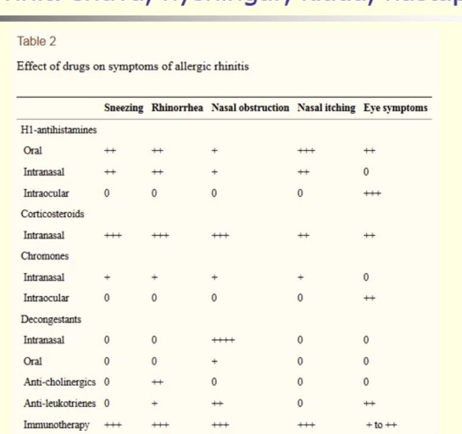
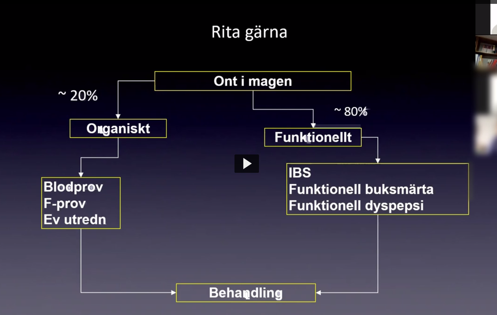
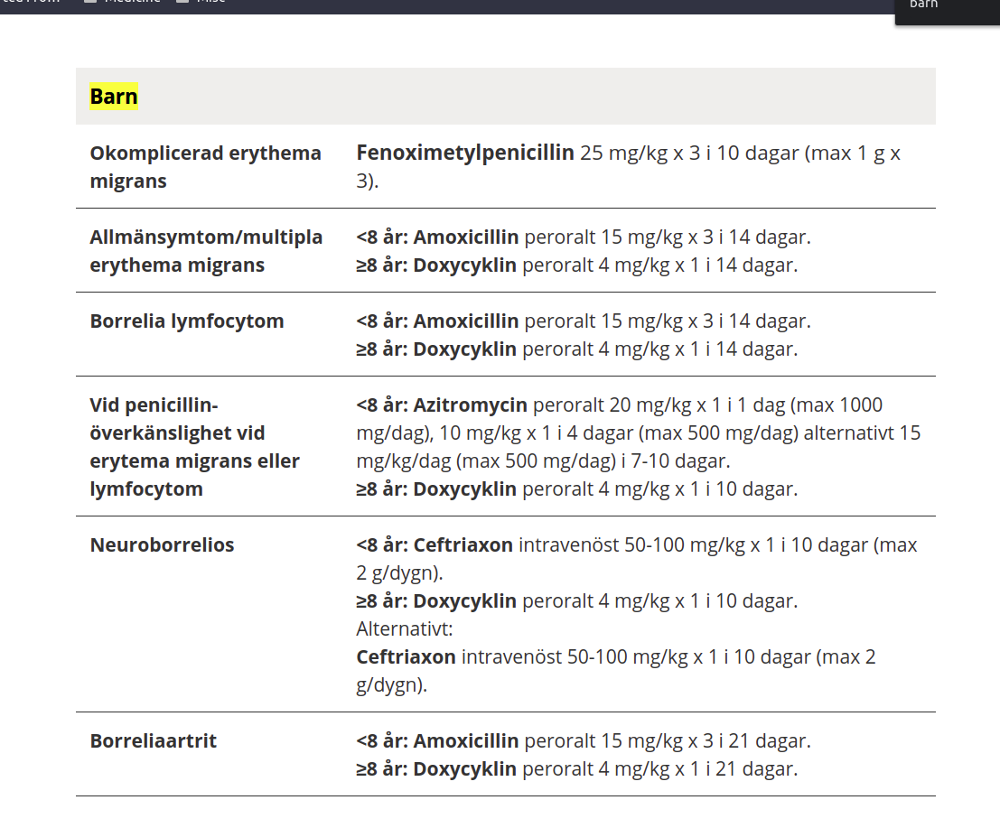
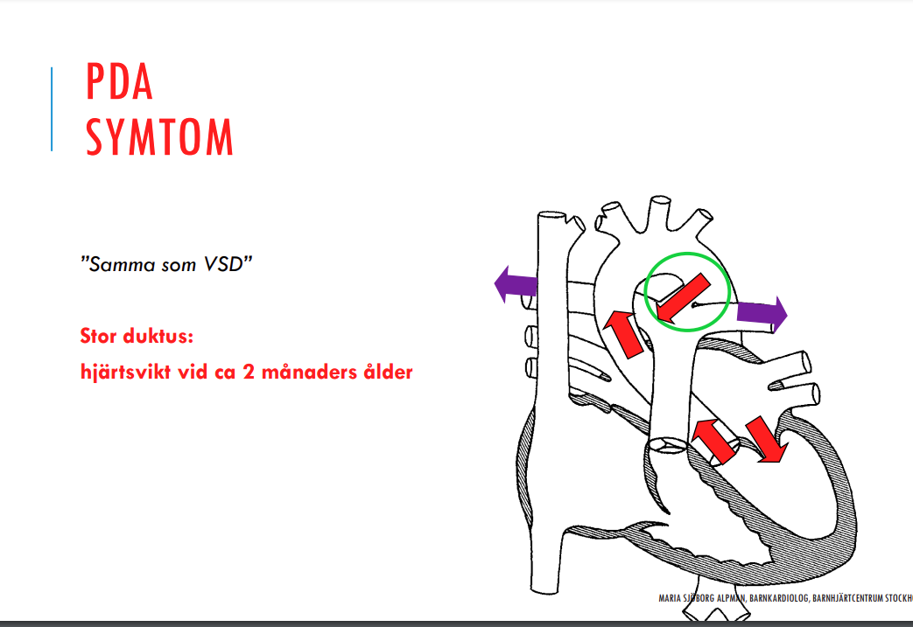
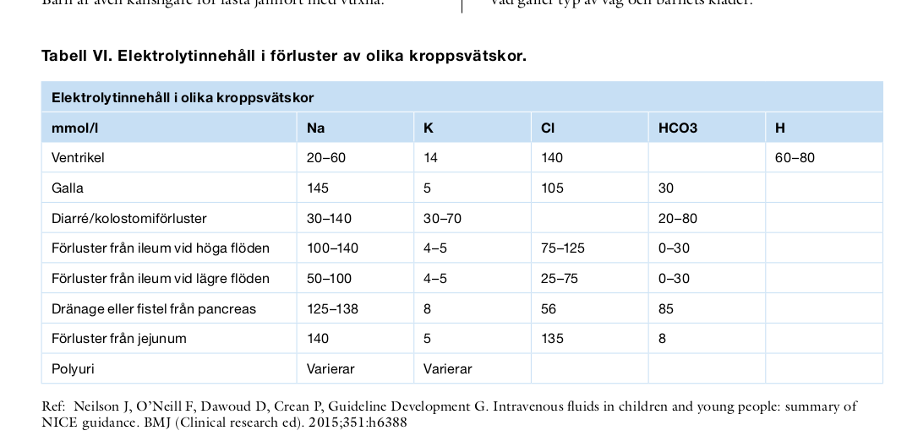

## Titlar

***Presentation***

***Etiologi och patofysiologi***

***Epidemiologi***

***Kliniska kännetecken***

***Utredning och handläggning***

***Behandling***

## Pediatrik

## Allmänt

### Allmänvården

***Presentation***

* !!! Barnavårdscentral (BVC) har en viktig roll för alla barn i Sverige oberoende av socioekonomisk bakgrund. Nämn 3 olika insatser som BVC erbjuder alla familjer. (1,5 p) 
  * Vaccination
  * Föräldragrupper
  * Hälsokontroller av barn

### Brott

***Presentation***

* ***Presentation***

  * **6. En 5 årig flicka inkommer till akuten en söndagskväll kl 21 tillsammans med hennes mor. Föräldrarna som är skilda befinner sig i en vårdnadstvist om flickan. Mamma berättar att flickan har blåmärken på kroppen efter att hon vistats hos sin pappa i helgen. Flickan själv vill inte berätta vad som har hänt. I status kan du se att det finns blåmärken av ganska färsk art på bål och armar men även på underben. Även något blåmärke på kinden. Ange 6 olika åtgärder eller ställningstaganden som är obligatoriska i denna situation (3p)** 
    * Akut remiss fotografi blåmärken
    * Dokumentera dessa nogrant i journal
    * Kontakta senior kollega eller bakjour
    * Ögonbottenspegling
    * Inläggning för vidare utredning
    * Status inkl ortopediskt sådant
    * Konsultera senio kollega gällande helkroppsrtg
    * Undersökning fr topp t tå
    * prover: koagulationsprover, utesluta trombocytopeni, blodstatus. [leverstatus, njurprover]
    * Orosanmälan till socialtjänsten [ingen polisanmälan?]
  *  **Föräldrar som kommer till akutmottagningen med Elsa 8 månader. Föräldrarna förklarar att Elsa har ramlat från skötbordet och har varit slö sedan dess. I status hittar du en slö flicka som gnyr och som har blåmärken på rygg, armar och ben. Hon verkar ha ont när du undersöker höger arm. På frågan om alla blåmärken svarar föräldrarna att hon hade ramlat tidigare i veckan från en soffa och nu skötbordet. Du gör ett noggrant status i vilket du kan notera blåmärken av olika åldrar. Du försöker få ihop statusfynden med anamnesen och känner en oro för omsorgssvikt.** **Hur handlägger du Elsa?** 
    * Nämn 5 åtgärder du behöver göra inom de närmsta timmarna
      * Misstanke grov misshandel av barn: SOL anmälan
      * kontakte med bakjour
      * Akut remiss helkroppsfotografering och dokumentation
      * Helkroppsrtg, ev DT
      * Noggrant beskriva fynden i journal
      * inläggning

### Förstorad huvudomfång

Utredning

* Ultraljud: förutsätter att fontanellerna är kvar, man skickar de till ultraljud för utredning. 
  * bakre skallgropsförändringar ser ma nitne med ultraljud, som man ska komma ihåg. 
* letar ökat tryck, tumör
* MR: tveksamheter med ultraljud

### Hypothyreos

* Kurvan ser enligt kalle okej ut, att det är inte helt manglat kurva, bara en avplaning som man ska beakta.

### Medfödda missbildningar

***Medfödda missbildningar svårupptäckta vid födsel som kan vara plötsligt livshotande***

* **Enl studentsvar tenta**
  * **Gallvägsatresi**, över 4 veckor, konjugerat bili
  * **Vitium organicum cordis, hjärtvitier, ductusberoende** under 3 fel
    * koarktio aortae, coarctio
    * TGA (transposition of the great arteries)
    * pulmonalisatresi
  * **tracheoesofageal fistel** (ofta kopplat t esofagusatresi)
  * **avsaknad thymus**
  * **koanalatresi**
    * membran mellan näsan och luftvägar typ 
    * märks om den är helt sluten bilateral
    * då behöver de andas genom munnen
    * annars om det är bara är en del kan de andas gm näsan lite
  * **duodenalatresi**
  * **gallvägsatresi**
  * **malrotation**
  * **diafragmabåck**: blir värre av ventilering eftersmo lyft också ner i ventrikel o luft i tarmar som är påväg upp i thorax
  * **transposition**
  * **VSD**

### Screening

WIlsons kriterier för screening

* Det sökta tillståndet bör vara ett viktigt hälsoproblem.
* Det bör finnas en accepterad behandling för de som har sjukdomen.
* Anläggningar för diagnos och behandling bör finnas tillgängliga.
* Det bör finnas ett igenkännbart latent eller tidigt symptomatiskt stadium.
* Det bör finnas ett lämpligt test eller undersökning.
* Testet bör vara godtagbart av befolkningen.
* Naturalförloppet för tillståndet inklusive utveckling från latent till påvisad sjukdom bör vara tillräckligt kartlagt.
* Det bör finnas ett överenskommet regelverk för vilka som behandlas som patienter.
* Kostnaden av att söka efter fall (inklusive diagnos och behandling av patienter som diagnostiseras) bör vara ekonomiskt balanserad i förhållande till möjliga utgifter för sjukvård överlag.
* Sökning efter fall bör vara en fortlöpande process och inte ett "en gång för alla"-projekt.
* Screeningprogrammet bör besvara ett känt behov.
* Målsättningen med screening för vara bestämd från början.
* Det bör finnas en bestämd målpopulation.
* Det bör finnas vetenskaplig evidens för att screeningprogrammet är effektivt.
* Programmet bör integrera utbildning, provtagning, kliniska tjänster och programförvaltning.
* Det bör finnas kvalitetssäkring, med mekanismer för att minimera potentiella risker med screening.
* Programmet bör säkerställa informerade val, sekretess och respekt för autonomi.
* Programmet bör främja rättvis fördelning och tillgång till screening för hela målpopulationen.
* Programutvärdering bör planeras från början.
* Fördelarna av screening bör överväga skadan.

### Undersökning

#### ABCDE

3e månaden

* Värt 

#### Grovmotorik

#### Skallen

#### Gastroenterologi

#### Neurologiskt

* Titta efter tappad leksak: månad
* Fallreflexer åt sidan
* Moro reflexen: cerebral pares om den fortfarande är tydlig efter att tidsfristen är över. 
* tå-reflexen

### Utveckling screening

Man kan screena barnet för flera saker, under dess utvecklingsperiod:

### Parametrar

### Provtagning

#### Blodgas

***Hur den tas***

* Umbilikal blodgas
* Kapillärt blodgas
* Venöst blodgas
* Artieriell blodgas

***Umbilikal blodgas***

***Kapillär blodgas***

* Kärlbädden tätare på barn, kapillärt, därför kan man ta detta på barn
* vuxna har en längre mellan kärlen i kapillärbädden, enl PM gävleborg

#### Temperatur

* Örat: 38 >= feber
* Rektalt: 38.5 >= feber

## Allergi

### Allmänt

***Presentation***

* **Olle 7**
  * **månader har en akuttid bokad till dig på barnmottagningen för allergiutredning. I remissen från BVC står följande: ”Gosse med eksem över armar och ben sedan en tid tillbaka. Allergi?” Du suckar ljudlöst över den undermåliga remissen, och väljer att komplettera anamnesen innan du börjar undersöka pojken.** **a) Ange 2 frågor som du önskar svar på och som har relevans för frågeställningen. (1 p)** 
    * Hereditet
    * Födoanamnes; vad har patienten ätit
    * andra tecken e.g. obstruktivitet, infektioner, 
    * epidemiologisk anamnes: var har man varit med barnet, utomlands etc.
    * ammar barnet
    * andra allergiska besvär
  * När du inspekterar hud noterar att olle generellt torr och utbredda eksem över båda armarnas sträcksidor, samt båda låren. De är inte vätskande, och ser inte infekterade ut. har antydda eksem över båda kinderna
    * Hur vill du behandla olles eksem
      * Mjukgörande
      * Steroid kräm behandling
    * 2 metoder för att verifiera eller utesluta allergi hos barn
      * Pricktest
      * IgE-antikroppar
      * Elimination-provokation
    * Vilka 2 vanligaste födoämnen orsakar allergier i dena ålder
      * Mjölkallergi
      * Äggproteinallergi
      * under 1åå är det ofta mjölk, ägg, om utbbredda eksem.
      * över 1åå är det ofta inte födoämnen som orsakar
* **Astrid**
  * **Astrid, 11 månader kommer med modern till barnmottagningen på grund av buksmärtor och lösa avföringar. Hon har haft säkert 6-7 luftvägsinfektioner och bedömts obstruktiv men har ej haft några säkra pneumonier men väl 4 otiter. Hon är gnällig och missnöjd. Hon äter normalkost för åldern. För in följande vikt- och längdvärden i tillväxtkurvan på nästföljande sida: Födelse: 3,5 kg, 51 cm. 1 månad: 4,8 kg, 54 cm. 2 månader: 5,5 kg, 58 cm. 3 månader: 6,2 kg, 62 cm. 5 månader: 7,5 kg, 66 cm. 7 månader: 7,7 kg, 70 cm. 9 månader: 7,9 kg, 72 cm. 11 månader: 8,1 kg, 74 cm. I status kan du se att hon är mager.** 
  * TIllväxtkurvan finns under komjölksallergi
  * Tolka kort tillväxtkurvan
    * Initial kanalföljare, +1SD 2må-3mån
    * Avplanad viktkurva vid 5månaders ålder: i samband antagligen med att man buter föda
  * Ange 2 diagnoser som är de mest sannolika
    * Födoämnesallergi
    * Celiaki
  * Hur bekräftas respektive diagnos
    * Födoämnesallergi: elimination och provokation
    * Celiaki: Transglutaminas ak
  * Beskriv kort behandling för en a v sjukadomarna
    * Celiaki: glutenfri kost
    * Födoämnesallergi: elimination
* **Mustafa, 18 månader gammal, inkommer till barnakuten med sin mamma p g a tilltagande andningsbesvär sedan morgonen. Han har varit förkyld utan feber i 2 dagar. Han har enligt modern alltid varit fullständigt frisk. Vid undersökningen noterar du att Mustafa har svårt att andas. Han har en förhöjd andningsfrekvens (AF 65) och han pressar på expiriet. När du auskulterar lungorna hör du ronki över båda lungfälten. Saturationen är 89% på luft.** 
  * **a) Hur vill du initialt behandla Mustafa på akuten? (2p)**
      * Inhalationer beta 2 tex ventoline. Upprepa flera gånger och sedan kan man testa atrovent och sedan fortsätta med ventoline åter. 
      * Syrgas  
      * Efter sex timmars behandling på akuten blir han närmast helt symptomfri. Syresättningen har stigit till 99%. Modern önskar åka hem till övriga familjemedlemmar. 
  * **b) Vilken behandling förskriver du? (1p)** 
      * beta 2 agonist att ta vid behov när ungen är förkyld. 
  * **c) Hur skall den ges? (1p)** 
      * Via optichamber 
      * Modern konstaterar uppgivet innan hon lämnar akuten: ”Det var ju oturligt att Mustafa skulle få astma när ingen annan i familjen har astma eller allergier!” 
  * **d) Vad säger du till modern? Motivera ditt svar kort! (1p)**
      * Mustafa har inte astma. 
      * För astmadiagnos: 
      * 3 st obstruktiva episoder innan 2 års ålder (tror dock nya definitionen är 3 år). 
      * 1:a obstruktiva episoden och anamnes på hereditet, födämnesallergi, atopiskt eksem.
      * 1:a obstruktiva episoden efter 2 års ålder
      * blfallergilung.se/riktlinjer

***Allmänt***

* Astmatiska besvär
  * Under 3åå: obstrktiv bronktiv; DOCK man kallar det astma om barnet haft besvär 3e ggen eller associerad med allergi
  * Fr 3åå: astma, förkulningsastma, ansträningsastma, allergisk astma

***Indelning***

* **Överkänslighet**
  * Icke IgE-medierad
    * kontaktallergi: 
      * nickel
  * IgE-medierad
    * Icke-atopisk
      * Bi, geting
      * Läkemedel: penicillin, muskelrelaxantia
      * Annat
    * Atopisk
  * Celiaki hamnar ngnstans emellan: 
* **Överkänslighet enl klinmed**
  * **Immunologisk reaktion**
    * igE medierat, e.g. anafylaxi
      * nöter
      * pollenrelaterad oral allergi syndrom, OAS
    * Icke IgE-medierat
      * Celiaki (kanske enzymbrist också av ngt slag)
    * Kontaktallergi
      * Nickel
  * **Icke-immunologiska reaktioner**
    * Enzymatisk
      * laktosintolerans
      * biogena aminer
      * colon irritable
      * IBS

***Etiologi***

* Internationellt att man pratar om "Hypersensitivity" i.e. överkänslighet
* Progressivt högre IgE-koncentration, försvårande symptom: över tid att IgE koncentrationer ökar, detta relateras med progressivt svårare symptom
* Mastcellsaktivering, och degranulering: Astam, snva, urtikaria
* ARVET: den enskilt viktigaste faktorn vad gäller allergi
* Hygienhypotesen
  * Arvet
  * Allergi
  * Miljö

***Epidemiologi***

* 30-40% ngn form av allergi
* Hösnyva: 40% får astma
* Astma: 25% medelsvår, 10% svår
* Eksem: 25% komb med födoämnesallergi
* Födoämnesallergi

***Utredning***

* Pricktest
* Blodtester
  * Immunocap: IgE spec analus
  * Phadiatrop
  * CD-sens
  * ISAC

***Behandling***

* Tabletter
  * Antihistmain: H1
  * Antileukotrien: CysLT1
  * Kortison: predni
* Nässpray
  * Antihistamin
  * Lodual: mastcellsstabilisering
  * Nedokromil
  * Kortison
* Ögoondroppar
  * mastcellsstabiliserande
  * antihistamin

|  |  |  |
| ------------------------------------------------------------ | ------------------------------------------------------------ | ------------------------------------------------------------ |
|  |  |  |

### Akuta allergiska reaktioner

***Etiologi och patofysiologi***

***Kliniska kännetecken***

* Urtikaria
* Klåda
* Konjunktivit
* (rhinit)
* En kräkning? möjligt diffa här med anafylaxi
* ödem ansikte

### Allergenfamiljer

***Björkallergiker***

* Nötter,
* äpplen
* persikor
* aprikos
* körsbär
* mandel
* päron
* morötter
* plommon
* kiwi
* potatis (råskalning)
* selleri

***Gråboallergiker***

* Selleri
* morot
* paprika
* kamomill
* persilja
* anis
* fml

***Baljväxter***

* Soja
* ärtor
* Jordnötter
* bönor
* linser
* lakrits

***Banan***

* Avokado
* nekrarin
* kastanj
* kiwi
* latex

***Skaldjursallergi***

* Kvalster
* kackerlacka
* inskter: att man kan vara allergisk mot detta. 

### Anafylaxi

***Presentation***

* En 7 årig flicka 	
  * söker p g a av en allergisk reaktion efter intag av jordnötter. Hon har urtikaria över större delen av hudkostymen. Vilken kombination av symptom – utöver urikarian - gör att hon inte uppfyller kriterierna för anafylaxi?
    * Detta är EJ anafylaxi: Svullen tunga, en kräkning och klåda i munnen
    * Dessa är anafylaxi: Andningsbesvär med ronki, svullna läppar och konjunktivit med klåda; Upprepade kräkningar, heshet och klåda i halsen; Nysningar, ökande buksmärta och heshet; Hjärtklappning, diarré och sväljningsbesvär
* Lotta 
  * satt på en thairestaurang och åt middag med några kompisar för att fira sin 15-årsdag. Helt plötsligt började det kittla i munnen och kännas tungt att andas. Hon började få panik. Kompisarna blev oroliga och försökte nå mamman utan att lyckas och till slut slängde de sig i en taxi och åkte till akuten. Du möter henne där. Nu är hon även påverkad i sitt medvetande. Kapillär återfyllnad är 2,5 s. Saturation 89%. Hon är tungandad och har distans ronki.
  * a) Vilka åtgärder görs i första hand och i vilken ordning? 2p
    * Ta personen t akutrummet, kontakta narkos då misstänkt hotande luftväg
    * ABCDE
    * Adrenalin: 1mg/mL 0.01mg/kg, intramuskulärt
    * ihalation ventoline + syrgas
    * PVK sättning + vätska
    * betapred + antihistamin
  * vad har hon drabbats av: anafylaktisk reaktion
  * Hur behandlar du Lotta akut: 
* **Karin, 3 år, inkommer till akuten då hon plötsligt i samband med lek hos en kusin blivit orolig, blek samt fått utslag över kroppen. Börjat gråta. Hon har fått väsande andning, vilket hon tidigare ej haft annat än i samband med förkylningar. Hon har den senaste tiden ej haft feber eller varit förkyld. Hon inkommer i ambulans 15 minuter senare. I ambulansen fått inhalation Ventoline. Status: Temp 36,8. Ingen snuva. O2 sat 82%, orolig, blek, väsande andning med press på expiriet. Oregelbundna rodnade utslag med vit upphöjd hud i mitten över bål och armar o lår. Pulm förlängt expirium, expiratoriska rhonki. Kapillär återfyllnad 3-4 s. BT 70/40. Hjärta normal rytm, frekvens 110.** 
  * **Vad blir din diagnos? (1p)** 
    * Anafylaxi
  * ange 4 viktigaste första behandlingarna, typ av lkm, adminstrationssätt
    * Adrenalin im
    * Vätska
    * Ventoline
    * syrgas
    * // betapred, antihistamin därefter
* Patrik är 14 år gammal och nötallergiker. Av misstag har han ätit en chokladbit med nötter i. Han inkommer till akuten och är rejält medtagen; han är slö kräks och är tungandad. Huden är blek och marmorerad. Saturationen 88%. Kapillär återfyllnad 3,5 s. Du tillkallar narkosläkare och förbereder för intravenös infart. 
  * Ange 4 akuta åtgärder du utför. 2p 
  * Adrenalin im. 1mg/ml 0,01 mg/kg så fort som möjligt. 
  * Kopplar inh ventoline + syrgas 
  * Tippa sängen 
  * Vätskebolus 20 ml/kg så fort PVK sitte
* **Lisa, en 8 årig flicka med astma, hösnuva och känd jordnötsallergi inkommer till akuten efter att ha ätit en liten bit choklad på rasten i skolan. Hon får svårt att andas. Skolsköterskan är snabbt på plats och ger Epipen 0,3 mg intramuskulärt. Ambulans tillkallas och hon inkommer till dig på barnakuten. Hon har 89% i O2 saturation och får syrgas i ambulansen. I Status: afebril, ångestfylld men svarar på tilltal med viss latens. Har tungt att andas med press på expiriet, bukandning, indragningar interkostalt och i jugulum. Är blek och kallsvettig. Kapillär återfyllnad 3 – 4 sek.** 
  * Vad misstänker du primärt för diagnosen
    * Anafylaxi
  * Ange i kotfattad puntkform, minst 6 punkter, dina akuta åtvgärder i lämplig ordning
    * Kontakta narkos
    * Handläggning enl ABCDE
    * Upprepa Adrenalindos
    * Inhalationer mot obstruktivitet: Ventoline
    * Syrgas
    * Tippa sängen
    * Om PVK inet finns sätt en så fort som möjligt
    * Bolus RA 20mL/kg, asaå
* En 7 årig flicka söker pga av en allergisk reaktion efter intag av jordnötter. Hon har urtikaria över större delen av hudkostymen. Vilken kombination av symptom – utöver urtikarian - gör att hon inte uppfyller kriterierna för anafylaxi? 
  * Andningsbesvär med ronki, svullna läppar och konjunktivit med klåda 
  * Nysningar, ökande buksmärta och heshet 
  * Upprepade kräkningar, heshet och klåda i halsen 
  * Rätt: Svullen tunga, en kräkning och klåda i munnen 
  * Hjärtklappning, diarré och sväljningsbesvär 
* Wille 2 år inkommer på larm till barnakuten p g a en allergisk reaktion efter intag av en chokladkaka toppad med hasselnötter 30 min tidigare. Han har svårt att andas, han är blek och kallsvettig. Kapillär återfyllnad 2 sekunder. Vid auskultation hör du tydliga ronki. Pulsen är hög. Vilka åtgärder vidtar du första hand iunder den första minuten? (1p)a
  * Ge adrenalin im. Koppla syrgas. Planera i samråd med narkosjour för inläggning på BIVA/IVAb
  * rätt: Ge adrenalin im. Koppla syrgas. Förbered inhalation salbutamol. c
  * Ge adrenalin im. Koppla syrgas. Ge Betapred och antihistamin pod
  * Ge Betapred och antihistamin po. Dra upp adrenalin, men avvakta att ge detta i väntan på effekt av övrig behandlinge
  * Koppla syrgas. Ge antihistamin po. Dra upp adrenalin, men avvakta att ge detta i väntan på effekt av övrig behandling

***Definition***

* Snabbt insättande svår överkänslighetsreaktion med symptom från flera organsystem som är potentiellt livshotande. Reaktionen kan utlösas av födoämnen, insektsstick, läkemedel samt okända faktorer. 

***Kliniska kännetecken***

* ***Hud***: Urtikaria, quinckeödem, klåda, flush, blekhet.
*  **GI**: Kräkning, illamående, sväljningssvårigheter, diarré.
*  **Luftvägar**: Svullnad i övre luftvägar, astma, hosta, heshet, nästäppa, rinnsnuva.
  *  Cirkulation: Kardiovaskulär chock, takykardi, svag puls, blodtrycksfall. 

***Behandling***

* 

|  |  |      |
| ------------------------------------------------------------ | ------------------------------------------------------------ | ---- |
|                                                              | !! Totaldos per kg för båda kmr vara 0.01mg/kg hjärtstopp har 0.1 |      |

### Astma 

#### Presentation

***Presentation***

* ***8 månaders flicka*** 
    * Pga feber och andningsbesvär sedan 2 dagar. 
    * Hon är rosslig och hostig, har jobbigt att andas och föräldrarna har noterat att det stundom piper ur luftvägarna när hon andas. 
    * Hennes temp är 39.4. 1.
    * **Diffar**: pneumoni, bronkioloit, krupp, förkylningsastma, infektionsastma
    
* ***4 år gammal flicka*** 
    * som söker för andra gången med andningsbesvär i samband med en förkylning, i övrigt frisk. 
    * Hon har 37.8 i temp, har indragningar, ökad  andningsfrekvens och en saturation på 95%. 
    * Hon hostar mycket ffa nattetid nu när hon är förkyld och har då svårt att sova. 
    * Vid lungauskultation noteras ronki basalt bilateralt.
    * ***svar: förkylningsastma, rhinovirus, ventoline och syrgas.***
    
* **Mustafa, 18 månader gammal,** 
  
    * **inkommer till barnakuten med sin mamma p g a tilltagande andningsbesvär sedan morgonen. Han har varit förkyld utan feber i 2 dagar. Han har enligt modern alltid varit fullständigt frisk. Vid undersökningen noterar du att Mustafa har svårt att andas. Han har en förhöjd andningsfrekvens (AF 65) och han pressar på expiriet. När du auskulterar lungorna hör du ronki över båda lungfälten. Saturationen är 89% på luft**
        * **Mustafa har inte en förkylnignsastma utan detta är en obstruktiv bronkit. Det är väldigt vanligt för barn under 2åå att få infektionsutlösta obstruktiva 	episoder bronkit som efterliknar astma, men detta motiverar ej diagnsen förkylningsastma (aka infektionsutlöst astma)**
        * **Initial behandling på akuten:** 
            * syrgas + ventoline (ventoline pga allvarlighetsgraden) med optichamber
            * utefter effekt överväga steroider: betapred eller solu-cortef (solu-cortef om det är en svår obstruktivitet)
            * sedan fortsätta med syrgas + ventoline
            * utebliven förbättring: magnesiumsulfat, överväga tillägg iv teofyllamin
        * **Efter sex timmars behandling på akuten blir han närmast helt symptomfri. Syresättningen har stigit till 99%. Modern önskar åka hem till övriga familjemedlemmar**
            * **Airomir (saba) + inhalationssteroid**, som kommer att tas i en spacer/mask antagligen...
            * detta ska följa ett förkylningsastma schema som han får fr akuten
            * alltså är detta en episodisk behandlng i anslutning med en till episod obstrktivitet som ungen kan få
            * Notera man behvöer totalt misnt 3 epsidoer för att få diagnosen förkylningsastma. ungen är därför inte där. 
        * Notera i riktlinjen står det att man efter diagnos kommer att behanlda periodiskt i samband med övre luftvägsinfektioner (som jag antar sker **innan** episoderna obstruktivitet)
    
* **4 år gammal flicka**
    *  som söker för andra gången med andningsbesvär i samband med en förkylning, i övrigt frisk. Hon har 37,8 i temp, har indragningar, ökad andningsfrekvens och en saturation på 95%. Hon hostar mycket ffa nattetid nu när hon är förkyld och har då svårt att sova. Vid lungauskultation noteras ronki basalt bilateralt. 2 p
    * Diagnos: förkylningstma, men hon har diagnosen astma per definition, då över 2å + förkyld med obstruktivitet
    * agens: virus, ofta rhinovirus
    * Behandling: ventoline, inhalation, NaCl om slem, syras under 92%.
    
* **Hur definieras begreppet ¨astma¨ hos ett barn som är < 2år** 
    * Första obstruktiva episoden i samband med förkylning 
    * Första obstruktiva episoden utan förkylning samt att barnet har eksem och/eller astma 
    * Första obstruktiva episoden som utlöses av ett allergen 
    * rätt: ≥3 obstruktiva episoder, eller första obstruktiva episoden om barnet har eksem eller födoämnesallergi 
    * Tredje obstruktiva episoden utan förkylning 
    
* **Gustaf, 8 år, kommer till barnmottagningen på grund av att han inte orkar lika mycket som de jämnåriga klasskamraterna, speciellt i gymnastiken och fotbollen. Han måste stanna och vila när de andra kompisarna bara fortsätter att springa. Han har tidigare varit väsentligen frisk men hade komjölksproteinallergi och eksem som spädbarn. Han växer normalt och har inga skolsvårigheter. I status på mottagningen finner du inget avvikande. Du misstänker en diagnos och vill beställa en undersökning för att säkerställa den.** 
    * Vilken sjukdom
        * Astma
    * Vilken undersökning vill du beställa
        * Spirometri
    * Undersökningen bekräftar din hypotes
    * Hur behandlar du då tillståndet
        * Initialt SABA, kortverkande B2-agonist vid behov
    
* !!! Andningsbesvär med obstruktivitet är en av de vanligaste orsakerna till att barn söker akut vård. Vilket alternativ nedan är mest korrekt gällande definitioner och behandling av astma hos barn?(1p)

    * rätt Barn > 2 års ålder med obstruktiva besvär uppfyller kriterier för astma. Inhalation med salbutamol ges oftast i kombination med inhalationssteroider vid konstaterad astma. 
    * Barn > 2 års ålder med obstruktiva besvär uppfyller kriterier för astma. Behandling med antikolinergika (Atrovent) är kontraindicerat till barn <2 års ålder.
    * Barn > 2 års ålder med obstruktiva besvär uppfyller kriterier för astma –förutsatt att atopisk hereditet finns. Inhalationsbehandling med kortison brukar påverka tillväxten negativt.
    * Barn < 2 års ålder med två episoder av obstruktiva besvär uppfyller kriterier för astma. Montelukast kan ges som tillägg till salbutamol och inhalationssteroider.
    * Barn < 2 års ålder med tre episoder av obstruktiva besvär uppfyller kriterier för astma. Montelukast kan ges intravenöst som tillägg till salbutamol
    * sammanfattning
      * montelukast är leukotrienantagonist, den ges inte iv, den är peroral (montelukast po)

    

#### Allmänt

***Diagnos***

* Baserat på sjukhistoria
  * ***Astma diagnos 3 punkter***:  
    * ***Efter 3 obstruktiva episoder < 2åå***:
      * så kallas de för astma 
      * annars är de ***akut bronkit***  
    * ***1a obstruktiva episoden och andra tecken på allergi  <2åå (oberoende på ålder hade jag skivit fr seminarium)***: 
      * som eksem eller födoämnesallergi 
      * så säger vi att barnet har astma 
    * ***1a obstruktiva episoden i samband med förkylning > 2 åå (förra riktlinjen är 2 år)*** 
      * så säger vi att barnet har astma !
      * I detta fallet är barnet snart 2åå, varpå han ej får diagnosen av denna
* Hos barn äldre 5-6åå, bekräfta diagnos med objektiva fynd
  * **Spirometri**
    * **Reversiblel bronkobstruktion** + ökning FEV1>12% av predicerat värde
    * **Steroidbehandling**: 
      * ökning FEV1 >12%, antingen efter 1-2mån med ICS, 
      * eller 2-3v steroid po, predni; nedtrappas om >2v beh tid
    * **Provokationstest**
      * Oklara fall
      * Bronkiell hyperreaktivitet
      * Ansträngningsprovokation
      * Torrluftsprovokation
      * histamin
      * metakolin
      * mannitol
  * **PEF-variabilitet**: >13% medelvärde, för en vecka av högsta lägta medelvärde per dag
* **<u>Socialstyrelsen och PM</u>**
  * Enstaka episoder av infektionsutlöst obstruktivitet hos barn under två års ålder är mycket vanligt och definieras som obstruktiv bronkit. 
    * **Under 2år**: för att tillståndet ska definieras som infektionsastma hos barn under 2 år ska de ha haft minst tre återkommande episoder. 
    * **undantag om allergi etc:** Undantag gäller för barn med samtidigt konstaterad IgE-allergi, atopiskt eksem eller astma hos föräldrar/syskon – då definieras det som infektionsastma redan vid deras första obstruktiva attack. 
  * **Över 2 år, 1 episod**: Hos alla barn äldre än två år räcker det med en infektionsutlöst episod för att ställa diagnos infektionsastma.

***Etiologi patofysiologi***

* ***Indelning***
  * **Allergisk astma**: positivt pricktest, specifik IgE (RAST); Eosinofiler eller 0-eosinofiler (att det är mer neutrofiler...)
    * Pollen
    * pälsdjur
    * kvalster
    * mögel
  * **icke-allergisk astma**: Neg pricktest, blodprov; NEITROFILER
    * !!! Infektioner: viralt utlösta, förkylningsastma exempelvis (aka viral wheeze eller bronchiolitis)
    * Kall luft
    * ansträngning
    * luftburna partiklar
    * rök, gas, dofter
* **barn med PBD bronchopulmonell dysplasi,**: att man har fått syragas upp t 36v har högre benägenhet för obstruktivitet och problem med luftvägsinfektioner med obstruktivitet under denna period.
* **IgE-antikroppar, aeroallergener**: påverkade barn har ofta IgE-antikroppar mot aeoroallergener
* **Aeroallergener**: house-dust mite, trä, gräs, weed pollens; mögel; animal dander (shedding fr animals) 

***Ronki***

* **Tre olika former av ronki**
  * **Viral episodisk ronki**: ronki endast som svar till virala infektioner
  * **“Multiple trigger ronki”:** som svar på multipla triggers, som är sannolikt att bli astma

***Epidemiologi***

* Transient early Ronki
* Icke-atopiska ronki
* IgE-associerade ronki / astma
* småbarn: 20% väser ngn gg
* över 50% besvärsfria förskoleålder
* 75% besvärsfria skolålder

***Riskfaktorer***

* Nedsatt lungfunktione
  * BPD: bronkopulmonell dysplasi
  * !! Prematuritet
  * Besvärliga NLI som liten: nedre luftvägsinfektioner som liten
  * rökexponering, som liten
  * allergisk sensitisering

***Indelning***

* **Moderat akut astma pediatrisk pat**
  * normal mental tillstånd
  * viss accessorisk muskelanvändning, recession
  * takykardi
  * viss påverkan på tal 

***Kliniska kännetecken***

* Symptom värre natten
* symptom med icke-virala triggers
* intervall symptom, symptom mellan akuta exacerbationer
* atopi i familjen eller att barnet har det
* astma terapi, positiv terapt
* ***Atopiska marschen***: 
  * atopiskt eksem, 
  * komjölksallergi, 
  * astma, 
  * sedan hösnuva

***Differentialdiagnoser,***

* **Pneumoni**: samma andningsbesvär som i det första patientfallet, men att det finns en infektionshärd i lungorna.
* **Bronkiolit**: RS-fall, RS-bronkioliter. Tes sig också sig på detta sättet, låter annorlunda vid auskultation, inte så hög feber, yngre patienter...
* **Krupp**
* !!! **Cystisk fibros, bronchiectasi**: finger clubbing, våt hosta, sputum produktion, dålig tillväxt, 
* **Främmande kropp**
* **Stämbandsdysfunktion**
* **Sensorisk hyperrekativitet**
* **Hjärtfel**
* **Kärlring, andra kärlanomalier**: komprimerar trakea eller bronker
* **Malaci**
* **Stenos**
* **missbildningar** trakea, bronker
* **Kroniska infektioner**: CF, ciliedefekt, immunbrist
* **Postinfektions lungskada**: obliterativ bronkit, fokalt emfysem som resttillstånd
* **BPD**: bronkopulmonell dysplasi

***Utredningsgång***

* **Lyft på tröjan för att titta på andningsmönster**
* ***Polikliniskt***
  * PEF
  * Spirometri
  * ansträngnings-spirometri
* ***Anamnes***
  * tIdigare andningsbesvär, hereditet, atopisk eksem, födoämnesallerig, 
  * ***prematuritet? Neonatalperiod?:*** större benägenhet av denna andningsbesvär vid infektioner med obstuktivitet, med indragningar och pip i bröstet.
  * allmäntillstånd, orkar äta, dricka, kissat
  * hur frekvent
  * vad triggar
  * påverkas sport och generell aktivitet
  * hur svåra är intervall symptomen mellan exacerbationer
  * hur mkt skola har man skippat pga astma. 
  * Hosta på nätterna: starkt tecken för obstruktivitet
* ***Status***
* Andningsfrekvens, bukandning, näsvingspel, 
  * Interkostala indragningar: lågt sittande hinder
  * Jugulära indragningar: högt sittande hinder. 
  * Sibilanta ronki: klassiskt på utandningen
  * Stridor, inspiratoriska eller expiratoriska: andningsljud inandninge, tyder övre luftvägsobtstruktion, konstriktion
  * Titta övre luftvägarna också 
  * Hosta: torr, blöt rossling, skällande
  * Torr hosta: obstruktiva barn har som regel torr hosta.
  * Kroppshållning:, hyperinflaterad
  * Saturation
  * Feber
  * Tecken obstrktivitet: 
  * pipig utandning, 
  * ronki vid auskultation,
  * Trötta patienter
  * Dehydrerade patienter
  * Saturation som sjunker
  * **BImanuell kompression**: att man på de mindre barnen auskulturerar och på utandningen trycker för att få ut mer luft och lyssna.
* ***Radiologi:***     
* ***Röntgen***: föreligger det hyperinflation, fråga efter hyperinflation*
* ***Spirometri***
  * Mild intermittent astma: har över 80% på PEF/FEV1

***Behandling***

* Spacer: måste användas på de mindre barnen, för att man ska kunna andas in korrekt. Detta har aman optichamber smo e vanlig
* ***Akut skede***
  * **Inhalation beta2-agonister**: Detta för barn ***över 6 månader***, för att dilatera bronkerna. 
    * Ventoline, aka eller salbutamol
    * Ventoline är bronkvidgande och astmamedicine
    * adrenalin är slemhinneavsvällande, och man generellt ska tänka att barn 0-6 månader har framförallt har problem med slemhinnesvullnad.
    * barn över 6 månadero ch garanterat över 1år har den astmatiska komponenten.
  * !!! ***Börja med Antikolinergikum***: Detta är en akut behandlign
    * Atrovent
    * det är ipratropium
    * antikolinergika
  * // **Leukotrienantagonister till de yngsta barnen**:
    * på de yngsta är det INTE eosinofil inflammation som dominerar
    * Neutrofil inflammation dominerar hos de yngsta
    * därför hjälper leukotrienantagonister
  * ***Steroider:*** nästa steg för att jobba mot inflammationen
    * ***kan ta det peroralt, betapred tabletter lösa upp i vatten och mata med en spruta***
  * ***NaCl inhalation***: ofta inhalera koksalt för att lätta upp slemmet
  * ***Uppvätskning***
  * ***Magnesiumsulfat iv (?):*** oftast att detta sker på ivA? 
* **Underhållsbehandlingar**
  * Inhalationssteroider / LTA
  * Långverkande beta2 / LTA
  * biologiska lkm: anti-IgE, anti-IL5, anti-IL4/13
* **Periodisk behandling akut**
  * börjar med SBA
* !!! **Om barnet får astma diagnos**: De flesta kommer att gå runt med ICS vid kontaterad diagnos astma, vid periodisk behandling. 
  * SABA tillägg ICS (airomir + flutide?)
* !! Angående steroider: nedreglerar EOSINOFIL INFLAMMATION men kan INTE NEDREGLERA NEOTRIFL + NEITROFILASSOCIERADE CYTOKINER
* 

|  |  |  |
| ------------------------------------------------------------ | ------------------------------------------------------------ | ------------------------------------------------------------ |
|  |  |  |

#### Spirometri

***Metodik***

* Reversibilitetstest
  * Beta2-agonist
  * Steroid
* PEF-variabilitet
* Provokationstest
  * Metakolin
  * Mannitol

***Astmadiagnos***

### Atopi

***Presentation***

* !!! ?? Allergiska eller atopiska sjukdomarna i barnaår utgörs grup 4 typiska manifest. ett par debuterar mkt tidigt, en senare och fjärde i skolålder
  * ange de fyra manifesten i den ordning åldersmässigt
    * !! Atopiskt eksem: Debute inder första levnadsået
    * Födoämnesallergi: beroende på allergi (mjölk, ägg första levnadsåret); jordnöt andra nöter, skaldjur ofta senare
    * Astma: 
      * flera obstruktiva episoder under 2åå
      * En obstruktiv episod om över 2åå
    * Hösnuva: ofta senare i åldrana, men kan debutera tidigt
* 9mån gammal gosse
  * sedan 3-4 veckor utslag kinder o sträcksida av armar o ben
  * sover dåligt, verkar irriterad
  * får vällig o även grönsakspureer
  * modern ekseom som barn
  * Kinderna, hakan, ffa vä uppe pannan: makulöst fjällande utslag
  * armarna: liknande utslag, men lite tunnare utsidan båda armarna
* 11 mån flicka Helammas till 5 mån ålder. Lindrigt atopiskt eksem sedan 2 mån ålder. Behandlad med mjukgörande och kortisonsalva (grupp I/II) lokalt. Inga tillväxtrubbningar.Har haft upprepade (x 5) episoder med urtikaria av oklar genes.  Hon kan äta mjölkprodukter utan besvär, men vägrat pannkaka. Ännu inte fått pröva nötter. 
  * Utredning: pricktest, IGE analys (om komjölkmisstanke hade d vait elimination provokation menar abbe ist för pricktest)

***Diagnos***

* ***Krävs att barnet har en <u>kliande hudsjukdom</u> samt 3 av följande:***
  * Tidig debut <2år 
  * Hereditet för atopi om barnet < 4 år eller samtidig astma/allergisk rinit
  * Tendens till torr hud senaste året 
  * Karakteristisk åldersbetingad morfologi 
    * **mindre barn**: eksem i ansikte, kinder och extensorsidor av extremiteter. 
    * större barn och vuxna: eksem i böjveck och ansikte/nacke

***Kliniska kännetecken***

* **Atopiska marschen**
  * Atopiskt eksem: första levnadsåret
  * födoämnesallergi: efter atopiskt eksem, 2-9mån; när man börjar introducera födor; 
    * samtidigt kan komjölksallergi yttra sig tidigare, för att går gm mammans bröstmjölk
  * astma: allergisk eller icke-allergisk; vissa blir friska, andra fortsatt sjunka (t  vuxen ålder?)
  * hösnuva

### Atopisk dermatit

***Presentation***

* 9mån gammal gosse
  * sedan 3-4 veckor utslag kinder o sträcksida av armar o ben
  * sover dåligt, verkar irriterad
  * får välling o även grönsakspureer
  * modern eksem som barn
  * Kinderna, hakan, ffa vä uppe pannan: **makulöst fjällande utslag**
  * armarna: liknande utslag, men lite tunnare utsidan båda armarna
  * 
* Edvin 1åå
  * alltid haft torr hud. Successiv rodnad, kliande hud ansikte och bål, smo nu vätskar. Inte fått ngn ny sorts mat senaste tiden.
  * Diangos: Atopisk eksem, atopisk dermatit
  * 
  * 

***Allmänt***

* analogt med böjveckseksem
* 

***Kliniska kännetecken***

* Klådbenägen torr hud med eksen, ofta i böjveck
* Torr hud: ökad benägenhet för att utveckla torr hud
* Kliande röda utslag
* Specifika platser
  * Små barn: 
    * kinder, 
    * bålen, 
    * utsida armar, 
    * utsida ben
  * Större barn
    * Böjveckslokalisation
    * vanligt med ansikte, bål och armar
* **Kliar**
* **Stör nattsömnen**: utbrett och besvärligt

***Etiologi***

* Att det är HUDEN som är känslig: den har en inneboende svaghet, så den reagerar, blir torr och känslig
* Kommer att leva med denna huden: lär inte förbättras, utan huden förblir torr...
* **Stark ärftlig komponent**
  * 70% eksem, astma, allergi i familjen
  * 20-70% av eksembarn har IgE
* !!! **Förklara för familjen att eksemet i sig inte är allergiskt**
  * Ej allergi i sig, men förvärras av födoämnesallergi, vatten, kyla, svett, stress, infektioner
  * Att föräldrar kmr o säger att de har plockat bort "d o d o d fr maten men eksemet ger sig inte". 
  * SVARET ÄR: barnet ÄR FÖTT MED DENNA SORTENS HUD
  * dvs barnet har torr + känslig hud som reagerar på olika irritanter
* **ALLTSÅ**: eksemet BEROR INTE på födoämnesallergi, men FÖRVÄRRAS av födoämnesallergi. 
  * ju mer klåda o ju aktivare eksem, desto mer sannolikt att födan är involverat
* **Infekterat?**: möjligt att eksemet kan vara infekterat, då viktigt att ebhandla med antibiotika för att få bort den, inte enbart mjukgörande

***Utredning och handläggning***

* Klinisk diagnos

***Behandling***

* **SMÖRJA, väldigt vikigt med insmörjning, att man ska skapa en barriär för huden**
  * MJugörande
  * kortison I-IV: grupp1 steroider går att använda runt ansiktet utmärkt och runt ögon
  * Kalcineurinhämmare
* **ljusbehandling**
* **Steroid krämer, kortisonkrämer**
  * **Grupp1**: 2ggr/d, 1-3v; därefter 2ggr/v
    * upprepas vid uppblossning
    * sluta rött + sluta klia, tar 1-2v (ibland 3v) med beh.
    * när bra, glesa ut, minska kröm
  * **Grupp2, tom grupp3**: om utbrett eksem, eksem inte svara beh
    * Under kortare period
    * även små barn
    * grupp3: 1ggr/dag
* **Mjukgörande, minskar risk för dermatiten**: minskar sannolikheten för barnet utveckla atopisk dermatit.
  * Det är alltså protektivt att mjukgöra barn som har en atopisk dermattit
* **Infekterat?**: ett ilsket eksem där det är möjligt med att den är infekterad, då RÄCKER EJ med smörjning, utan man måste antibiotika
  * staf
  * strepto
* Eksemskola
* Yrkesrådgivning, så småningom

|  |  |  |
| ------------------------------------------------------------ | ------------------------------------------------------------ | ------------------------------------------------------------ |
|                                                              |                                                              |                                                              |

### Födoämnesallergi

***Presentation***

* !!! **Yasmin är en 1,5 årig flicka som kommer till barnläkarmottagningen. Hon har sedan spädbarnstiden haft ett atopiskt eksem. Yasmin äter en blandad barnkost. Mamman misstänker att vissa födoämnen försämrar hennes eksem men det är svårt att fånga exakt vilka födoämnen det handlar om i anamnesen och hon vill att detta utreds. I status noterar du att huden är generellt torr och det finns eksem på sedvanliga ställen utan att de vätskar. Du skall nu utreda och behandla Yasmins eksem.** 
  * ange 4 för åldern vanliga tänkbara födoämnen som kan försämra hennes eksem
    * MJölkproteinallergi
    * Äggallergi
    * Gluten
    * Soja
  * Med vilka två metoder kan du utreda detta
    * Elimination och provokation
    * Serologi för IgE
  * Hur vill du behandla Yasmins eksem
    * Mjokgörande
    * ? Kortisonsalva (Grupp 1)
* Sebastian 3 år har besvär med eksem och utreds för födelseämnesallergi. Majoriteten av alla akuta allergiska födoämnesreaktioner beror på några få födoämnen. Vilka är de vanligaste födoämnesallergierna för spädbarn respektive förskolebarn? 
  * Spädbarn; mjölk och ägg. Förskolebarn fisk och jordnötter. 
  * rätt: Spädbarn: mjölk och ägg. Förskolebarn: nötter och jordnötter. 
  * Spädbarn: mjölk och fisk. Förskolebarn: ägg och soja. 
  * Spädbarn: soja och fisk. Förskolebarn: soja och nötter. 
  * Spädbarn: jordnötter och fisk. Förskolebarn: nötter och jordnötter. 

***Allergener***

* Patientgrupp
  * Spädbarn (/småbarn enl SÖS FL): 
    * mjölk, 
    * ägg
  * Förskolebarn: 
    * nötter, 
    * jordnötter
  * Tonåringar
    * Nötter
    * Jordnötter
    * Parabjörkallergi OAS (oral allergi syndrom)
  * Vuxna: 
    * jordnötter,
    * trädnötter,
    * fisk,
    * skaldjur,
    * biogena aminer
* Biogena aminer
  * livsmedel
  * lagrade produkter
  * höga bioamin nivåe
    * histamin
    * tyuramint
    * tryptamin
    * Setotonin
    * fenyletylamin
    * inlagd sill, tomater, jorgubbar, skaldjur, västerbottenost, makrill, torkad skinka, salami, tonfisk
* över 90% barn
  * Mjölk, 
  * ägg, 
  * nötter, 
  * jordnötter, 
  * parabjörkallergi
  * (soja, vete; inte dessa enl SÖS FL, men abbe)

***Etiologi***

* Kan förvärra atopisk dermatit (atopiskt eksem?): förutsatt barnet har atopi och den atopiska marschen
* **Immunologisk reaktion**
  * igE medierat, e.g. anafylaxi
    * nöter
    * pollenrelaterad oral allergi syndrom, OAS
  * Icke IgE-medierat
    * Celiaki
* **Icke-immunologiska reaktioner**
  * Enzymatisk
    * laktosintolerans
    * biogena aminer
    * colon irritable
    * IBS
* !! **Korsallergisk reaktion, i.e. OAS**:  att man kliar runt munnen etc, kan besvärligt, men inte farligt
  * Att man exempelvis har ARAH8 som är bjrökallergen men som förekommer i jordnöt. eller vice versa? att man får korsallergiska symptom etc. 
* **Jordnötssensibilisering**
  * Vanlig
  * inte alla har besvär: visar sig att det finns olika allergener i jordnöt, beroende åp vilken allergen och vilken grad man är sensibiliserad får man olika svar av patienten. 
* 

***EPidemiologi***

* Läkt ut äggallergi, mjölkallergi
  * 75% av 3åå har läkt ut
* Äldre barn med nötallergi (trädnötter), jordnötallergi, blir SÄLLAN av med sin allergi

***Utredning och handläggning***

* Komponentdiagnostik: 
  * Identifiera vilket allergen i exempelvis jordnöt man är allergisk mot. araH allergenet, som det finns olika former av. en form finns i björk och förklarar korsallergiska besvär
  * araH-8 som dominerar = inte att man är jordnötsallergisk utan att man är allergisk mot björk som syns i testet, vs en unge som har en massa komponenter den är allergisk mot. Dock att man kan ha små mängder ARAH2 etc, som man kan reagera kraftfullt mot i de små mängderna
  * Finns osså analys för: hasselnöt, soja, latex, mjölk, ägg, bi, geting, mfl

***Behandling***

* **Elimination**: det primära fr kost
* Adrenalin: ska vara närmast till hands om man har ngt man är kraftigt allergisk emot. 
* TIlläggg (verkare som)
  * Antihistaminer
  * luftrörsvidgande
  * kortisontabletter
* SOTI, specific oral tolerance induction, forskas om: att man matar ungen en tesked komjölk varje dag, för att toleransutveckling. så att när den dricker ett glas av sin väns mjölk inte får en anafylaktisk reaktion, utan det blir en mildare reaktion. 

|  |      |      |
| ------------------------------------------------------------ | ---- | ---- |
|                                                              |      |      |

### Komjölksallergi

***Presentation***

* ***Astrid, 11 månader*** 
  * kommer med modern till barnmottagningen på grund av buksmärtor och lösa avföringar. Hon har haft säkert 6-7 luftvägsinfektioner och bedömts obstruktiv men har ej haft några säkra pneumoniermen väl 4 otiter. Hon är gnällig och missnöjd. Hon äter normalkostför åldern.
  * För in följande vikt-och längdvärden i tillväxtkurvan på nästföljande sida:Födelse: 3,5 kg, 51 cm. 1 månad: 4,8 kg, 54 cm. 2 månader: 5,5 kg, 58 cm. 3 månader: 6,2 kg, 62 cm. 5 månader: 7,5 kg, 66 cm.7 månader: 7,7 kg, 70 cm. 9 månader: 7,9 kg, 72 cm. 11 månader: 8,1 kg, 74 cm. I status kan du se att hon är mager.
  * ***Bild nedan***
  * 
  * **Du träffar 4 månader gamla Hussein på BUMM. Han har utbredda torra eksem över kinderna och armarnas sträcksidor samt över låren. Medföljande mamma berättar att gossen på sistone varit mer missnöjd och kräkts oftare. Gossen har sedan en månad tillbaka ersatt amning med Baby Semp 1. Han har fallit av 0,5 SD på viktkurvan sedan föregående mätning för en månad sedan. Läkartiden har bokats efter att en remiss skickats från BVC för en vecka sedan.** 
    * VIken diagnos förklarar Hysseins symptom, utöver eksem bör remittenten har nämnt som mest sannolik diagnos
      * Mjölkproteinsallergi (komjölksallergi?)
    * På vilka 2 sätt kan denna diagnos bekräftas
      * Elimination-provokation
      * antikroppserologi
    * ange 2 typer hudpreparat du ordinerar för att behandla eksemet
      * Mjukgörande
      * Kortisongrupp 1
  * 4mån flicka
    * Gnällig, förkyuld, kliande blaffor på huden o. ammas väsentlgigen helt inte fått ngt nytt. fick ersättnnig för en timme sedan men ina besvär av detta tidigare
    * 
    * Orsak
      * Komjöksallergi: även om tålt det tidigare, tål hon det inte längre, 
      * Histaminfrisättning av okänd orsak: men för llra flesta barn är det okäönt, förklarar att det är virusinfektion
    * Behandling
      * Antihistamin
    * Bär med att urtikaria kommer och går, med att den flammar upp och lugnar ner sig, flammar upp och lugnar ner sig, att föräldrarna int ska vara oroliga för det

***Epidemiologi***

* 2-4% av alla barn

***Kliniska kännetecken***

* Snabballergiska symptom: ofta som spädbarn
  * IgE-medierade
  * snart efter intag
  * rodnad
  * urtikaria
  * kräkning
  * diarre
  * en del får tom astma
* Senallergiska symptom: de barngastro ofta träffar
  * cellmedierad immunitet
  * timmar-dagar efter intag: undantag FPIES (Food-protein induced enteropathy syndrome; ett akut tillstånd)
  * magont,
  * eksem
  * planande viktkurva
  * lös avföring
  * förstoppning
  * kräkningar
* !! GI-symptom är oftast inte IgE-medierade..

***Utredning och handläggning***

* Diagnos ställs genom exklusion: dietistkontakt för att få tips och kunna hålla det strikt
  * jobbigt
  * minst 2-4v strikt exklusion
  * de gastroitnestinala reaktionerna är så pass långsamma att det tar denna tid. 

### Laktosintolerans

***Allmänt***

* är INTE en mjölkallergi
* det är en enzymbrist, att man har minskad förmåga att spjälka laktos
* Det är ETT SYMPTOM ingen diagnos
* äldre barn (dock sällan före puberteten) kan ha förvärvad laktosintolerans
* ger aldrig allvarliga symptom
* Symptom försvinner prompt efter kostförändring. 
* Obs! testa att återinsätta

***Etiologi och patofysiologi***

* Laktas-brist: många i norden kan spjälka laktos, men migration etc att laktasbristen florerar mer
* bakteriefloran: den mumsar i sig laktosen, bryter ned till koldioxid och vatten. Också varierar med symptomen

***Kännetecken***

* ALDRIG allvarliga symptom
  * har man allvarliga symptom ska man framförallt tänka allvarliga saker innan man säger laktosintolerans.

***Utredning***

* Laktasgentester har INGEN plats i vården
* !! tillåt ALDRIG allvarliga symptom klassas som laktosintolerans. Det kan vara sekundär laktosintolerans

***Diffa mot komjölksallergi***

* Tål ditt barn hårdost: 
  * INTE en komjölksallergi: i hårdost mkt lite laktos, varpå om ungen tål detta, innebär att det inte är en komjölksallergi
  * utan det är en laktosintolerans 
* Progressivt minskande halt laktos-socker
  * messmör (mkt laktos) > mjölk > vispgrädde > lågklaktosprod./smör/margarin > hårdost > parmesan (ingen laktos alls): Laktosintolerans
  * Tål barnet inte messmör är det laktosintolerans
  * Tål barnet messmär är det inte laktosintolerans...

### Pollenkalender

***Allergener och perioder***

* AL
* Björk
* Gräs
* Gråbo

|  |      |      |
| ------------------------------------------------------------ | ---- | ---- |
|                                                              |      |      |

### Prevention

***Prevention***

* Rökning
  * Undvik under grav o spädbarnstid
  * förebygger luftrörsobstruktiva besvär
* Amning första månaderna
  * minskar ngt risken för infektioner,
  * därmed infektionsutlöst obstrktiv bronkit
  * // Den verkar inte ha ngn effekt på att minska allergi per se
* Ersättning fri från komjölksprotein: komjölkshydrolyserat
  * Om ungen behöver tillägg ersättning + under 4mån gammal + högriskbarn (två i familjehn har besvärlig allergi)
  * kan minska risken för eksem
* Exponera tidigt i livet för vissa typer födoämnen,  ge smakportioner
  * rek fr BVC
  * bra att låta spädbarn smaka ALL typ av mat under första året
* God ventilation
  * bostad,
  * åtgärda fuktskador, mögelskador
  * minskar risk luftrörsbesvär
* pälsdjur
  * motstridigt om risk eller skydd för allergi astma
  * ej motiverat att göra sig av med ett djur OM EJ BESVÄR

### Snuva

#### Diagnostik

***Utredning och handläggning***

* Sjukhistoria viktigast: Ofta att det inte behövs en utrednign, ofta typisk historia
* Allergitester
  * Pricktest: svar på en kvart, pedagoiskt resonemang
  * Blodprov för IgE antikroppar: mer spec nivå av allergenspec antikroppar, 
    * Nyttigt för Födoämnesallergi
    * Bara allergener mot de man har misstanke mot, annars för många och ingen klinisk relevans
  * Man kan ha allergiantikroppar men har man  ingen besvär DÅ ÄR MAN INTE ALLERGISK mot givet allergen. MÅSTE ha anamnes
    * Kan ta hjölp av komponentdiagnostik för att få reda på om barnet är ÄKTA allergiker, eller om det är en korsallergi med falsk-pos antikroppar
  * Komponentdiagnostik

#### Behandling

***Behandling***

* Nässpray: 
  * kortisonnässpray, kan börja med denna..
    * VIKTIGAST i behandlinegn: den kan ha effekt inte bara rhinit, utan konjunktiviten också
    * börja med denna tidigt innan pollensäsongen börjat, 
    * varje morgon,
    * förebyggande behandling
* Antihistaminer po, vb: när det är extra besvärligt att man tar detta
  * Ger inte trötthet, det är allergin som gör pat trött
  * det var de gamla antihistaminerna som gjorde trött
* Ögondroppar, förebyggande eller vb: om mkt besvär att man tar det profy, annars vb
* optimalt med OLIKA farm substanser
  * tar man antihistamin peroralt, ska man INTE ta antihistamin i droppar, utan ta droppar med natriumkromoglikat
* Allergenimmunterapi: om ovan inte fungerar
  * subkutan, SCIT: sprutar extrakt e.g. björkpollen, för att bygga tolerans över år. den är krävande för pat o familj. regelbundna sprutor 3-4åå,
    * björk, gräs, bi, geting, katt, kvalster
  * Sublingualimmunterapi, SLIT
    * den tabletten varje dag 3års tid för effekt
    * slarvar man blir det bara dyrt

​	

#### Hösnuva

***Kliniska kännetecken***

* Trötthet är den mest dominerande symptomet
* rhinokonjunktivit
* klåda

***Pollenkällor***

* Vår: AL
* Vår: Björk
* Sommar: Gräs, timotej (flesta är timotej)
* Sensommar: Gråbo (inte vanligt)

***Epidemiologi***

* 50% allergiker mot timotej av hösnuva..

#### Persisterande allergisk rhinit

***Etiologi***

* Eosinofil inflammation
* Allergener
  * Kattallergen: flyktigt allergen, att man kan hitta allergen överallt. 
  * Hundar: unik allergensammansättning
  * Kvalster: ska ej finnas i Sthlm, men finns hus felaktigt byggda med för mkt värme o 
  * Häst: inte vanligt, starkt allergen. kan få allergiska o astmatiska besvär av att gå hästhage. 
* Sekundär expandering
* Korsallergi
  * förekommer mellan pälsdjur
  * generellt ju fler allergena komponenter man har antikroppar mot
    * högre risk astma svårare grad
    * korsallergiskt

***Epidemiologi***

* 50% av allergiker är allergiska mot katt

***Behandling***

* Undvika exponering: klasskamrater inte katt knäet innan går t skolan

### Rhinokonjunktivit

***Presentation***

***Kliniska kännetecken***

* Rhinokonjunktivit
  * Nästäppa
  * Konjunktivit
  * stickningar
  * klåda
  * trötthet
  * chimosis: svullnad konjunktiva

***Utredning***

* Mottagning (allergimottagningen?)
  * Pricktest
  * spirometri
  * anamnes

***Behandling***

* Rhinokonjunktivit
  * Allergen sanering om möjligt
  * peroral antihistamin
  * nasalsteroid
  * ögondroppar, kromoner
  * antileukotriener

### Urtikaria

***Presentation***

* 4mån flicka
  * Gnällig, förkyuld, kliande blaffor på huden o. ammas väsentlgigen helt inte fått ngt nytt. fick ersättnnig för en timme sedan men ina besvär av detta tidigare
  * 
  * Orsak
    * Komjöksallergi: även om tålt det tidigare, tål hon det inte längre, ELLER så kan det vara virus
    * Histaminfrisättning av okänd orsak: men för llra flesta barn är det okäönt, förklarar att det är virusinfektion
  * Behandling
    * Antihistamin i några dagar, tills att orsaken i detta fall virusinfektionen lägger sig
  * Bär med att urtikaria kommer och går, med att den flammar upp och lugnar ner sig, flammar upp och lugnar ner sig, att föräldrarna int ska vara oroliga för det

***Etiologi***

* Histmin frisättning
* Bradykinin

***Kliniska kännetecken***

* Urtikaria
  * Kortlivade
  * Begränsad
  * upphöjd svullnad (makulopapulös?)
  * omgiven rodnad: cirkumferent erythem

***Klassifikation***

* Idiopatisk, spontan 50-60%
* Fysikalisk urtikaria, 30-40%:
  * kolinerg utlöst
  * värme utlöt
  * fysisk ansträng, emotionell stress, varmt bad, temperatur
  * fördröjt utlöst (duration ofta i 24h)
  * köld
  * ovanlitg: vibrationer, solljus
* Dermografism
* Allergisk eller icke allergisk

***Utredning***

* Anamnes
* pricktest
* recidivierande svårt angiödem, misstänk: HAE, C1-INH
* Kronisk urtikraria om kvarstår över 6v: utredning enl PM, remiss BUMM

***Behandling***

* Allergensanering
* Undvika utlösande agens
* antihistaminer
* kortison
* adrenalin

|              | Urtikaria                | Angiödem                  |
| ------------ | ------------------------ | ------------------------- |
| TIdsförlopp  | Akut, inom minuter       | Subakut, inom timmar      |
| Symptom      | Klåda, påtagligt erythem | Pirrande, stickande       |
| Duration     | Max 24h                  | 12-72h                    |
| Lokalisation | Dermis                   | Djupt dermis och subkutis |
| Antal        | Multipla, vanligen       | Vanlen en bara            |

|  |  |      |
| ------------------------------------------------------------ | ------------------------------------------------------------ | ---- |
|                                                              |                                                              |      |

## Akut pediatrik

### Allmänt

***Presentation***

* !!! Peter, 7 år, 

  * inkommer med ambulans till akutmottagningen en kväll när du är primärjour. Ambulanspersonalen rapporterar att han är tidigare frisk, men idag klagat över ont i magen, kräkts några gånger och på kvällen plötsligt blivit alltmer trött och slö. De berättar att Peter var allmänpåverkad och hade ansträngd andning när de kom fram, varför han har fått syrgas i ambulansen.

  * Tre möjliga diffar?

    * !!! DKA

  * Peter är blek och trött, men feberfri. Han orkar knappt svara på frågor och protesterar inte vid nålsättning. Undersökning av Peter visar att han har fri luftväg med andningsfrekvens 60/min och saturation 100 %. Den centrala kapillära återfyllnaden är 3 sek. Läppar och munslemhinnor är torra. Pupillreflexerna är normala, buken är mjuk och utan organförstoringar. Det finns inga yttre tecken på trauma. Extremitetsreflexerna är normala.

  * Prover du tar nu?

    * P-glukos, Hb, LPK, TPK, CRP, Na, K, kreatinin, syra/basstatus (kapillärt eller arteriellt), leverstatus, S-osmolalitet, B-ketoner, urinsticka m tox-screening

  * Provsvar

    * Hb 163 g/L Na 130 mmol/L ALAT 0,53 µkat/L
    * LPK 17,7x109/L K 3,3 mmol/L ASAT 0,46 µkat/L
    * TPK 360x109/L kreatinin 63 µmol/L
    * CRP 1 mg/ml
    * p-glukos 32,1 mmol/L Kapillär syra/bas: Urinsticka:
    * S-osmolalitet 326 mosmol/kg pH 6,98 glukos 4+
    * B-ketoner 5,3 mmol/L BE -27,4 mmol/L ketoner 4+
    * HCO3 2 mmol/L erytrocyter 0
    * pCO2 1,3 kPa albumin 1+
    * tox-screening u a

  * Diagnos: DKA

  * Förklara pato svaren, vad är orsaken t avvikelserna

    * Insulinbristen leder till stegringen av p-glukos.
    * Stegrat p-glukos ger glukosuri, osmotisk diures och sekundär dehydrering, vilket förklarar att Hb och krea är stegrat.
    * Insulinbristen leder till energibrist intracellulärt och därför bildas ketoner.
    * Den ohämmade bildningen av ketonkroppar vid insulinbrist är skadlig och ger upphov till den metabola acidosen.
    * Patienten försöker kompensera den metabola acidosen genom ökad respiration, vilket ger sänkt pCO2.
    * LPK och TPK är lätt förhöjda pga stress.
    * Natrium är falskt för lågt, korrigerat natrium behöver beräknas.
    * Kalium är lätt sänkt, men kaliumbristen är större än vad det ser ut som, eftersom kalium lämnat det intracellulära rummet för att kompensera för acidosen.

  * Åtgärd nu, principen handläggningen under första dygnet, fortstat provtagning + behandling

    * Lägg in patienten på IVA (kontakta bakjouren)
    * Bolusdos vätska intravenöst om pre-/chock.
    * Rehydrera 1 timme innan start av insulininfusion.
    * Långsamrehydrering över 2 dygn.
    * Timdiures följs, ev sätts kateter
    * Extra kalium ges direkt och helst separat via sprutpump på IVA
    * Regelbunden bedömning av neurologstatus med beredskap för mannitolinfusion vid tecken på hjärnödem
    * Regelbunden kontroll av p-glukos, s-osmolaritet, elektrolyter och syra/bas.
    * Sträva efter långsam korrektion m h a insulininfusion 0,05-0,1 E/kg/h

    ​	

### Hjärtstopp

***Etiologi och patofysiologi***

* Illustrated Paed
  * Hypoxi
  * ***Hypoglykemi***
  * Hypokalemi/hyperkalemi
  * Hypotermi
  * !!!***Hypovolemi***
  * Tension pneumothorax
  * Toxisk påverkan, terapeutisk påverkan
  * Trombos (koronart, pulmonart)
  * !! Tamponad: kardiellt

***Epidemiologi***

* Hypoxi: Vanligaste orsak 

***Handläggning och behandling***

* Under HLR
  * Ensure high-quality CPR: rate, depth, recoil
  * Plan actions before interrupting CPR
  * Give oxygen
  * Vascular access (intravenous, intrasseous)
  * Give adrenaline (epinephrine) every 3−5 min (10 μg/kg IV or IO,
  * i.e. 0.1 ml/kg of 1 in 10 000 solution), otherwise 100 μg/kg via
  * tracheal tube
  * Consider advanced airway and capnography (end-tidal CO2 monitoring)
  * Continuous chest compressions when advanced airway in place
  * Correct reversible causes
  * Consider amiodarone (5 mg/kg) after 3 and 5 shocks
* Post ROSC
  * ABCDE
  * KOntrollerad oxygenering, ventilation
  * utredningar, labb
  * behandla orsak
  * temperatur kontroll
  * tereapeutisk hypotermi

### Livlöshetsattack

***Presentation***

* !! 10.Klockan 5.30 har du just somnat utmattad under din första natt som barnjour när larmsökaren ljuder. Du springer till akutrummet där 2 månader gamla Mustafa inkommit med ambulans efter en livslöshetsattack i hemmet. 
  * a)Nämn fyratänkbara orsaker till en livlöshetsattack hos ett 2 månader gammalt barn. (2p)
      * ALTE, apne, hypoxi, affektanfall, arrytmier, krampanfall, hjärtstopp, 
  * Det framkommer att Mustafa, som annars är en välmående och frisk fullgången gosse, ammat dåligt under det senaste dygnet. Han har feber på akutrummet och en kapillär refill på 3,5 sekunder. Han är slö och lite hypoton, gnyr vid mobilisering i samband med undersökning. Saturationen mäts till 88%. 
  * Nämn tvåvitalstabiliserande åtgärder/behandlingar du omgående låter vidta? (1 p) 
      * Syrgas
      * vätskebolus
  * Du misstänker att Mustafa har drabbats av en bakteriell infektion. 
  * Vilka odlingar beställer du 
      * Blododling
      * LP
      * urinodling
      * enl grabbarna så svalgodlar vi inte: PCR NPH,
  * Antibakteriell behandling, sätter du in
      * Cefotaxim + aciklovir + ampicillin (Notera man inte ger steroider om under 3månader)

***Etiologi***

* Olika orsaker till livlöshetsattack i hemmet
  * ALTE
  * APne
  * Hypoxi
  * Affektanfall
  * Arrytmier
  * Krampanfall
  * Hjärtstopp...: kanske inte dettta

### Luftvägsstopp

***Presentation***

* Casper 8 månader sitter hemma och äter lunch. Helt plötsligt blir han tyst, röd i ansiktetoch ser panikslagen ut. Mamman misstänker att maten fastnat i luftstrupen. Hur bör hon initialt agera i detta läge med den misstanken?De är ensamma hemma.Ringa in det mestkorrekta svaret.(1p)
  * Dunka 5 gånger mellan barnets skulderblad, knyt ena handen och placera ovan naveln, ta tag i den knutna handen med andra handen och tryck inåt och uppåt 5 ggr, upprepa vid behov
  * Ring 112, Lägg barnet på mage längs armen med huvudet ner, Slå 5 ggr mellan skulderbladen, vänd barnet och tryck 5 ggr på bröstbenets nedre del, titta i mun
  * Lägg barnet på mage längs armen med huvudet ner, Slå 5 ggr mellan skulderbladen, vänd barnet och tryck 5 ggr på bröstbenets nedre del, titta i mun, upprepa om ej hjälpt 
  * 5 inblåsningar, tryck 5 ggr på bröstbenets nedre del,titta i mun, upprepa om ej hjälpt
  * Rätt: Lägg barnet på mage längs armen med huvudet ner, Slå 5 ggr mellan skulderbladen, vänd barnet och tryck 5 ggr på bröstbenets nedre del, titta i mun. Upprepa om luftvägshindret kvarstår
  * Notera: "om luftvägshindret kvarstår", om problemet kvarstår ska man göra inblåsningar...

### Presentation och orsaker till svår sjd hos barn

* **Chocktillstånd, shock**
  * **Hypovolemi**: sepsis, dehydrering (gastroenterit), diabetes ketoacidos, blodförlust (trauma)
  * **Maldistribution av vätska**: sepsis, anafylaxis
  * **kardiogent**: arrytmier, och hjärtsvikt
  * **neurogent**: spinal skada
* **Respiratory distress, andningssvikt**
  * **Övre luftvägs obstruktion:** krupp, epiglottit, kongenitala malformationer, trauma, främmande kropp
  * **Nedre luftvägs disorders:** astma, bronkiolit (bronchiolitis), pneumoni, pneumothorax
* **somnolent (dåsig), medvetslös, krampande barn**
  * **postiktalitet, status epilepticus**:
  * **infektion**: meningit, encefalit
  * **metabol**: diabetes ketoacidos, hypoglykemi, elektrolyt påverkan (kalcium, mangesium, antrium), medfödda metabola syndrom
  * **huvudskada**: trauma, icke-accidental skada
  * **läkemedel, toxisk ingestions**
  * **intrakraniell blödning**
* **Kirurgiska akuta tillstånd**
  * **Akut buk:** appendicit, peritonit
  * **Intestinal obstruktion:** intussuception (invagination), malrotation, tarm-atresi, tarm-stenos

### Resuscitation: HLR

#### Presentation

* **Hjärtstopp hos barn väl förberedda och ovanliga,**
  * förhållandet hjärtkompressioner o inblåsningar
    * Initierar med 5 inblåsningar, 
    * sen 15:2
  * Hur ofta kontroll hjärtrytmen
    * 2min
  * Hur långt efter adrenalindos 1 ges dos nr2
    * 4min
  * när vuxma får hjärtstopp är bakomliggande kardiell ischemi vanligt
  * vad är vanligaste orsaken t hjätrstopp
    * hypoxi (e.g. asfyxi)
* !!! **3 månader gammal gosse**
  * inkommer på larm pga apné i hemmet. Han var på barnakuten föregående kväll och man konstaterade då RS-virusinfektion. Han hade i samband med akutbesöket haft bra effekt av inhalationer med Natriumklorid och kunde återgå till hemmet efter några timmar. Du står redo som barnjour och teamledare på akutrummet när ambulansen ankommer. När gossen lyfts över från ambulansbritsen till neobordet noterar du att han är rejält snorig. Andningen är snabb och ytlig, och du ser markerade indragningar. Han är blek och ligger stilla och blundar på britsen. I samband med att han kopplas upp slutar han plötsligt andas och blir livlös. På monitorn konstaterar du en asystoli. Ange 6 akuta åtgärder du omedelbart ombesörjer. (Korta punkter).
  * Larma narkos
  * 5-inblåsningar
  * 15:2
  * PVK
  * adrenalin ASAP
  * analysera rytm
* !!! **Du tjänstgör som allmänläkare på en BVC-mottagning i stan. Milton 4 år gammal är bokad för kontroll då hans föräldrar tycker att han har svårt att sitta still. De tror att han har ADHD. Pojken faller plötsligt ihop i korridoren när han jagar sin pappa. När du kommer fram till honom är han livlös. Han andas inte och du kan inte palpera någon puls. En sköterska har snabbt hämtat ett kardioskop och en defibrillator på vårdcentralen i samma byggnad. Fadern, som är sjuksköterska, har påbörjat HLR. Följande rytm visas på monitorn. (1 p)** 
  * 
  * Vad gör du i väntan på ambulans
  * Avbryter hjärtkompressioner p g a sinustakykardi på monitorn. Ventilerar 60 inblåsningar/minut. Planerar för ny rytmkontroll om 2 min. Drar upp adrenalin. 
  * Fortsätter HLR 15:2. Avvaktar defibrillering p g a PEA. Ger omgående adrenalin i den infart som sättes. 
  * Fortsätter HLR 15:2. Avvaktar defibrillering och adrenalin i väntan på nästa rytmanalys om 2 minuter. 
  * rätt: Fortsätter HLR 15:2. Defibrillerar 4 J/kg så snart plattorna är på plats och förbereder adrenalin som skall ges efter 3:e defibrilleringen. 
  * Fortsätter HLR 15:2. Defibrillerar 4 J/kg så snart plattorna är på plats och ger omgående adrenalin i den infart som sättes. 
* **Zaid 6 månader inkommer på larm p g a medvetslöshet. Han har haft en svår gastroenterit med frekventa voluminösa diarréer sedan 4 dagar. Han skickades hem från akuten föregående dygn med sedvanliga råd avseende behandling med vätskeersättning i hemmet, vägde då 8 kg. Du anländer som barnjour till akutrummet 3 min efter att ambulansen lämnat över barnet. På barnbordet ser du en blek gosse som inte andas. På monitorn noterar du att hjärtfrekvensen är 55 slag/min. Saturationen går ej att avläsa, sannolikt p g a perifer kyla. Ansvarig sjuksköterska berättar att kap refill är 5 sekunder. Du gör omedelbart följande:** 
  * Ger gossen 5 inblåsningar följt av HLR 15:2. Ber ssk sätta en pvk och ordinerar bolusvätska Ringeracetat 160 ml och Adrenalin 0,1 mg/ml 0,8 ml. Larmar narkosen om insatta åtgärder ej förbättrar patientens mående. 
  * Ber en sköterska larma narkosen. Ger gossen 5 inblåsningar följt av HLR 15:2. Förbereder för intravenös infart och ordinerar bolusvätska Ringeracetat 160 ml och Adrenalin 1 mg/ml 0,8 ml 
  * Ber en sköterska larma narkosen. Ventilerar med neopuffen ca 20-30 inblåsningar per minut. Ber ssk sätta en pvk och ordinerar bolusvätska Ringeracetat 160 ml. Kontrollerar andning, puls och kap.refill omgående efter insatta åtgärder. 
  * rätt: Ber en sköterska larma narkosen. Ger gossen 5 inblåsningar följt av HLR 15:2. Förbereder för intraosseös infart och ordinerar bolusvätska Ringeracetat 160 ml och Adrenalin 0,1 mg/ml 0,8 ml 
  * Ventilerar med neopuffen ca 20-30 inblåsningar per minut. Ber ssk sätta en pvk och ordinerar bolusvätska Ringeracetat 160 ml. Kontrollerar en blodgas. Larmar narkosen om insatta åtgärder ej förbättrar patientens mående. 
* **För att optimera förutsättningarna för att framgångsrikt omhänderta ett barn som får hjärtlungräddning är det viktigt att känna till såväl kompressionsteknik som A-HLR-algoritm. Vilket alternativ är korrekt vid HLR på ett 9 månader gammalt barn med verifierad asystoli?** 
  * rätt: Kompressionsdjup 4 cm. Kompressionstakt 100-120/min. Iv adrenalin så snart infart finns. 
  * Kompressionsdjup 4 cm. Kompressionstakt 90-110/min. Iv adrenalin (dos 1) efter 4:a minuters HLR. 
  * Kompressionsdjup 4 cm. Kompressionstakt 100-120/min. Iv adrenalin efter andra rytmanalysen 
  * Kompressionsdjup 6 cm. Kompressionstakt 90-110/min. Rytmanalys i samband med iv adrenalin varannan minut. 
  * Kompressionsdjup 6 cm. Kompressionstakt 100-120/min. Rytmanalys i samband med iv adrenalin var 4:e minut 
* **Fråga 7 Oscar 4 månader gammal inkommer på larm till barnakuten. Han är blek och trött. Han andas snabbt och ytligt. Då han placeras på barnbordet slutar han plötsligt att andas. Han kopplas omgående upp, på monitorn visas följande rytm med en frekvens på 71 slag/minut.** 
  * 
  * Vad gör du initialt? NOTERA enl HLR algoritmen ska man efter uppkoppling checka pulsen OM det är organiserad rytm 
    * Larmar narkos. Påbörjar omgående HLR med 5 inblåsningar följt av 15 kompressioner. Ger adrenalin intravenöst så snart infart etablerats. 
    * Larmar narkos. Påbörjar HLR med 5 inblåsningar följt av 15 kompressioner. Förbereder för defibrillering. 
    * Rätt: Larmar narkos. Ger 5 långsamma inblåsningar med neopuff (CPAP). Känner efter pulsar. Om ingen palpabel puls påbörjas HLR med inblåsningar och kompressioner enligt algoritm. 
    * Larmar narkos. Kopplar syrgas på mask. Sätter en intraosseös infart för administrering av adrenalin. 
    * Larmar narkos. Defibrillerar omgående 4 J/kg. Ger därefter adrenalin iv så snart infart etablerats. 
* **Under pågående HLR på ett barn bör man som teamledare eftersträva att ”korrigera reversibla orsaker” till hjärtstoppet. Vilken kombination av tillstånd stämmer bäst överens med ”checklistan” man hittar på A-HLR algoritmen?** 
  * rätt: Hypoxi, hyperkalemi, hypotermi, hjärttamponad 
  * Hypervolemi, hypokalemi, hypoglykemi, tryckpneumotorax 
  * Hypoxi, hypoglykemi, hypernatremi, tromboembolism 
  * Hypovolemi, hyperglykemi, hypotoni, hjärttamponad 
  * Hypoxi, hypovolemi, hypertoni, intoxikation 
* !!! **Kl 03.30 väcks du i egenskap av barnjour av larmsignalen på joursökaren. Du rusar till akutrummet dit den tidigare friska 6 veckor gamla flickan Nadine är på väg efter en kort livlöshetsattack i hemmet. Det framkommer att flickan haft rikliga diarréer sedan 2-3 dagar tillbaka, initialt även upprepade kräkningar. Hon var på akuten under gårdagen tillsammans med sina föräldrar, men bedömdes då inte vara i behov av inneliggande vård. Man bokade ett återbesök till dagens datum för klinisk kontroll inklusive viktmätning. Kort efter ankomst till akutrummet blir Nadine ånyo livlös och slutar att andas. Monitorn visar asystoli. Den erfarna barnsjuksköterskan har just fått in en perifer venkateter i höger hand.** 
  * **a) Beskriv i punktform hur du i ett fullt utrustat akutrum utför hjärtlungräddningen på flickan under de första minuterna. (3p)** 
    * Initial Hantering enl ABCDE, där vi på A försöker fastställa om det är luftvägsstopp och ngt man kan åtgärda. 
    * Vid konstaterat andningsstopp entrara A-HLR algoritmen
    * larma narkos
    * ge 5 inblåsningar med (neopuff) + 15:2 kompressioner
    * adernalin så fart som möjligt: infart på plats + monitor visar asystoli = adrenalin 0.01mg/kg 0.1mg/kL iv asap, och var 4e minut därefter
    * Kopplar defibrillator
    * Fortsätter 15:2 i 2 minuter
    * Reanalys. 
    * Försöker under HLR algoritm konstatera orsak till hjärtstopp enl 5H 4T
  * Flickan återfår medvetande o normal rytm, tack vara insatser efter 10min. Hon läggs in på BIVA för fortsatt observation coh vätskebehandling
  * Du känner t flera orsaker t att barn kan drabbas av hjärtstopp. Ange 2 rimliga förklaringar t hjärtstoppet i Nadines fall
    * Hypoxi
    * Hypovolemi
    * Hypokalemi (/hyperkalemi?)
* Vid HLR på spädbarn över 4 veckors ålder bör bl a följande eftersträvas för att optimera förutsättningarna för en lyckad utgång. (1)
  * Huvudet i sniffingposition. 2 inblåsningar följs av 15 kompressioner. Iv adrenalin ges efter 2 minuters HLR. 
  * Huvudet i sniffing position. 2 inblåsningar följt av 15 kompressioner. Iv adrenalin ges så snart iv.infart finns. 
  * Rätt...: Huvudet i neutral position. 2 inblåsning följt av 15 kompressioner. Iv adrenalin ges så snart iv.infart finns. 
  * Huvudet i neutral position. 1 inblåsning följt av 3 kompressioner. Iv adrenalin ges efter två minuters HLR.
  * Huvudet i neutral position. 1 inblåsning följt av 15 kompressioner. Iv adrenalin ges så snart iv.infart finns. 
  * Notera, enl Adam
    * Sniffing efter 1åå, huvud för stort innan dess, så neutral position

#### A-HLR

***Handläggning***

* !!! NOTERA: efter uppkoppling (samt efter att man gett 5 inblåsningar), så ska man analysera rytmen, om det är spontan rytm, ska man checka pulsarna
* ?? Neopuff: Oklart när man slutar med denna

***Läkemedel***

* **Adrenalin**: 0.01mg/kg dos. 
  * **OMEDELBART VID ASYSTOLI/PEA/UNDER 60HF**: sedan var 4e minut. 
  * EFter 3e deffen, för VF/VT

#### Wet Flag

***Läkemedel enl WET-FLAG***

* ***adrenalinet***: notera att doseringen 0.1ml/kg av 0.1mg/ml avser 0.01mg/kg också, vilket är samma dos som avsett.

***Adrenalin***

* HLR: 0.1mg/mL, 0.1mL/kg
* anafylaxi: 1mg/mL, 0.01mL/kg

#### Åtgärder

***Enligt ABCDE***

| Del         | Bedömning                                                    | Åtgärd                                                       | Exempel                                                      |
| ----------- | ------------------------------------------------------------ | ------------------------------------------------------------ | ------------------------------------------------------------ |
| Airways     | Titta, lyssna, känna                                         | haklyft, käklyft, sug, adrenalin im / inhal, NaCl (inhalation), näskantarell, svalgtub, larynxmask, narkos o intubation | Främmande kropp, krupp, slem (CF, RS), intox, medvetslöshet, anafylaxi |
| Breathing   | AF, mönster, arbete, cyanos, saturation, auskulterar         | syrgas, näsgrimma, **oxymask**, inhalationer (adrenalin, ventolin, atrovent), kortison, ventilera (blåsa, neopuff) | Pneumothorax, astma, RS                                      |
| Circulation | Perifer cirk (kap refill), temperatur (varm perifer?), EKG, HF, puls (amplitud), buk, temp, (inte riktigt blodtryck) | PVK, RA 20mL/kg (10mL/kg), provtagning (blodgas, CRB, blododling), ev antibiotika (cefotaxim, ampicillin) | sespsis, dehdyrering,                                        |
| Disability  | Pupiller, GCS, AVPU, glukos, nackstyvhet, tonus, reflexer, fontanell, kramp | midazolam (0.2-0.3mg/kg), glukos (10%, 2mL/kg <3?), antibiotika, giftinfo, LP | Feberkramp, epilepsi, meningit, intox, ICP                   |

Enligt ABCDE

* Airways: 

## BUP

### Autism

***Kliniska Kännetecken***

***Impaired social interaction***

* does not seek comfort, share pleasure, form close friendships
* prefers own company, no interest or ability in interacting with peers (play or emotions)
* gaze avoidance
* lack of joint attention
* socially and emotionally inappropriate behaviour
* does not appreciate that others have thoughts and feelings
* lack of appreciation of social cues.

***Speech and language disorder***

* delayed development, may be severe
* limited use of gestures and facial expression
* formal pedantic language, monotonous voice
* impaired comprehension with over-literal interpretation of speech
* echoes questions, repeats instructions, refers to self as ‘you’
* can have superficially good expressive speech.

***Imposition of routines with ritualistic and repetitive behaviour:***

* on self and others, with violent temper tantrums if disrupted
* unusual stereotypical movements such as hand flapping and tiptoe gait
* concrete play
* poverty of imagination in play and generalactivities
* peculiar interests and repetitive adherence
* restriction in behaviour repertoire.

## Dermatolog

### Blöjdermatit

***Epidemiologi***

* Vanligt

***Kännetecken***

* Rodnade hud
* vätskande hud
* blöjregionen

***Behandling***

* LUFTA
* skyddande salva: inotyol el silion
* om svampmisstanke: cortimykkräm
* Om bakteriell misstanke: heracillin, cefdroxil
  * bakterieodling innan

### Bullös Impetigo

***Presentation***

* 6åå flicka
  * sedan 3d ömmande utslag över höft lår ryygg,i ngen feber
  * inkommer akut
  * sårbildning över höft, började prickar så papler, sedan ytlgia små sår, sedan blivit upprulllad kant

***Etiologi och Patofysiologi***

* **blåsbildande staf infek i huden**
  * För att det är så utligt i epidermis är ***blåstaket*** tunit, består av få cellager och går lätt sönder
  * ***Upprullad kant:*** detta förklaras av att det blåsorna snabbt brister och epidermis rullas upp
  * ***Inte säkert att familjen uppfattata tat det ens varit en blåsa innan det blivit ett sår***
* ***Staphylococcus aureus, staffar***
  * bildar ett ***enterotoxin*** som ger ***subcorneal blåsbildning***

***Behandling***

* **kloxacillin el klindamycin** po: ab som tar staffar
* **viktigt med lokalbehandling samtidigt**: mjukgörande kräm som rensar bort blåsrester, tvättar rent, använder ***separata handdukar i hemmet***: 
* **stanna hemma**: så länge man har sår, inte gå t skolan el förskolan

### Erythema migrans

***Etiologi och patofysiologi***

* ***Borrelia Burgdorferi:*** bakteire, spiroket, sprids fästngar. Fästingar i stor mängd, större delen av Sverige

***Epidemiologi***

* 

***Kliniska kännetecken***

* Erytemet börjar som en homogen ljusröd eller blåröd rodnad i hudens plan 
* 1-4 veckor efter fästingbett. 
* Efter en tid klarnar rodnaden centralt och antar en ringform, som långsamt växer i storlek. Atypiska fall förekommer mer sällan som hudrodnad utan övergång i ringform eller som vätskande hudulceration.
* Vanligtvis förekommer inga lokalsymtom, men några patienter upplever klåda och sensibilitetstörningar över rodnaden.
* Knappt 10 % av patienterna utvecklar multipla erytem. Detta, liksom feber, anses utgöra tecken på disseminerad infektion med ökad risk för spridning till andra organ.
* Bilderna nedan visar hur erytema migrans kan se ut.

***Differentialdiagnoser***

* Bettreaktion (försvinner inom 1 vecka)
* Kontaktallergi
* Svampdermatoser
* Erysipelas

***Behandling***

* ***Singelerytem utan feber (vuxna)***: Fenoximetylpenicillin, Kåvepenin) 1 g x 3 i 10 dagar. 
  * Barn 25 mg/kg x 3. Rodnaden brukar blekna efter 4-5 dagar och därefter successivt försvinna men kan finnas diskret kvar efter behandlingsavslut, vilket inte innebär att infektionen finns kvar. 
* ***Multipla erytem eller feber***  
  * **doxycyklin** 200 mg x 1 i 10 dagar; möjligt att den missfärgar tänder
  * **Barn < 8 år amoxicillin** (Amimox) 15 mg/kg x 3 i 14 dagar.
  * **Barn > 8 år doxycyklin** 4 mg/kg x 1 i 14 dagar. 
* ***Pc-allergi*** - doxycyklin 200 mg x 1 i 10 dagar. 
  * **Till barn > 8 år doxycyklin** 4 mg/kg x 1.
* **allergi cefalosporiner**: kan ett sämre alternativ prövas, t e x [azithromycin](https://www.fass.se/LIF/result?userType=0&query=azithromycin) ([Azitromax](https://www.fass.se/LIF/result?userType=0&query=Azitromax)) eller doxycyklin trots ålder < 8 år. 
  * Risk för missfärgning på tänderna av doxycyklin efter kortare kurer till barn har inte påvisats (se ref Todd et al).
* **Amoxicillin** kan vara ett alternativ till barn som inte tål smaken av vanligt PcV. 
* **Gravida dubbel dos Fenoximetylpenicillin** (Kåvepenin) vid hudmanifestationer och intravenöst ceftriaxon) 
  * Rocephalin vid andra manifestationer för att minska risken för infektion av foster.

### Erythema toxicum

***Etiologi***

* Ofarligt
* Ej infekterde!

***Epidemiologi***

* 50% alla nyfödda

***Kännetecken***

* 2-10mm rodnader
* centralt i en del 1-2mm stora vätskeyllda knottror
* KAn flytta på sig

***Differentialdiagnos***

* Herpesblåsor

### Exantem

***Definition***

* Betyder hudutslag

***Lista sjukdomar som kan ge exantem hos barn***

* Erythema subitum (tredagars feber)
* Erythema infectiosum (femdagars feber)
* Dukes sjukdom

### Infantil hemangiom

***Presentation***

* 5mån gammal flicka
  * vid födsel viss rodnad medialt övanför höger öga,
  * vid 3 veckor begynnande tillväxt o nu ses en 2 cm stor upphöjt blåröd förändring

***Etiologi och Patofysiologi***

* ***Proliferativ Kärltumör***: består av kapillärer, 
* tillväxer o tjockar på sig första levnadsmåpnaderna,
* tillväxer upp t ett år, därefter ***långsam***  tillbakabildning
* 50% regress vid 5åå
* 7-9åå försvunnit alla kärl

***Handläggning***

* ***Kräver behandling om hot mot vitala organ, eller svår smärta eller blödning***
* ***Om står vid vitala organ***, ska man behandla: 
  * e.g. för nära ögat att synfältet täckt, att synkrotex inte utv
  * sitter läppen äta andas
  * inuti luftrör
  * eller många i levern: behöver behandla

**Behandling**

* ***propranolol***: mkt god effekt som denna ger detta. visade sig att den växte tillvaka om när man hade hjärtsjuk spädbarn med detta
  * god barn beh, få risker o biverningar
  * enbart om vitala funktioner påverkade, inte kosmetiskt

***Fall där man gav beh***

* Skymmer synfältet, tumören inne och inbyggt

### Kongenitalt melanocytärt nevus

***Presentation***

* 14åå pojke
  * sedan födsel brun fläck vänster glute som växt med honom
  * söker nu pga oro, modern har nyligen diagnosticerats med hudcancer

***Etiologi***

* Kongenitalt: medfött, melanocytärt involverar melanocyter, nevus att det är en leverfläck

***Kännetecken***

* **mindre 1.5cm**: Inte stor risk för malignitet som man tidigare ansåg, ffa inte små förändringar
* **stora märken större 20cm diamter**: större risk för malignitet
* **risken däremellan är inte fastställd.**
* **över 10cm i diameter, ska man vara mer aktiv för att följa**

***Handläggning***

* Dokumentera i journalen
* ta en bild
* be pat att säga till om han märker ngt avvikande med märket över tid, om den förändras etc.
* Försvinner 4-7åå
* misstolkas som hematom, barnmisshandel

### Mastocytom

***Presentation***

* 2åå flicka
  * frisk inga mediciner
  * sedan 6 månader drygt ett utslag påryggen
  * tidigare ibland blåsbildning, nu ibland klåda o irritation
  * välavgränsat märke
  * fjällningen inte typiskt: fast knöl med lite plack som är lite kullrigt

***Etiologi och Patofysiologi***

* ***Ett kutant infiltrat***: det blir infiltrerat av mastceller som lägger sig kutant. 
  * Inte ett födelsemärke, som inte är ett infiltrat 
  * med infiltrat innebär att det är celler som migrerat till området
* Frisättning av histamin vid skrav ger kvaddelbildning

***Diagnos***

* vanligt hudinfiltrat hos barn: 0.5%	
* ***Dariers tecken:*** skrapa leder till frisättning histamin, o ger kvaddelbildning och diagnosen

***Behandling***

* Spontan regress

### Milier

***Etiologi***

* Tillfälligt stopp talgkörtlar

***Kännetecken***

* Ofarligt
* försvinner inom ngra veckor

***Behandling***

* INTE KLÄMMA

### Psoriasis

***Presentation***

* 7åå flick
  * strep tonsillit sedan en månad, halsont feber
  * pos strep a fr svalg
  * pc-behandlad
  * nu sedan 2 veckor utslag som sprider sig ansikte, armar, händer
  * klåda
  * små plack ordentlig fjällning, armar o ben
  * diagnos **gutat psoriasis**

***Etiologi och Patofysiologi***

* Har man psoriasis i släkten är det sannolikt att barnen har det också,  därför viktigt med diagnostiken. 

***Kliniska kännetecken***

* ***Gutat psoriasis***
  * ofta associerad med strep infektioner
  * inga andra sjukdomar som har en sådan här tudlöig silvriga plack på detta sättet 
  * silvrig fjällning

***Diagnos***

* Ställs på klinisk bedömning hos barnet

***Handläggning***

* Man ska leta efter streptokockerna och se till att de är behandlade
* om ingen streptokock vid besök, ska man odla och leta
  * odla för A,C,G
  * till skillnad fr snabbtest som enbart typ A
  * behandlas med penicillin även om utan besvär

***Behandling***

* Om man är säker med diagnosen, ska man starta behandling
* ***Grupp I kortikosteroider ansikte***
* **Grupp III kortikosteroider kroppen**
* **Ser till att strep infektionen är behandlad:**
* ***Hittar strep***: behandla med penicillin även om inga besvär
* alternativt
  * tacrolimus: protopic t hudveck o ansikte, 
  * tjärpreparat, cacipatriol
* ***Remiss hudläkare***: fastställa diagnosen

|  |  |
| ------------------------------------------------------------ | ------------------------------------------------------------ |
|                                                              |                                                              |

### Skabb

***Presentation***

* 4mån pojke
  * sedan 3-4 veckor ökande utslag som **börjat på buken**, spritt sig över hela kroppen
  * sover dåligt, skriker mkt
  * ingen känd hudsjd i släkten, men modern haft klåda under graviditeten och är helt slut
  * Ser små papulösa utlsag, ibland konfluerar i små plack: det är krustor och lite sår, små papler hela kroppen

***Etiologi och Patofysiologi***

* Inkubationstiden 6-8 veckor: föräldrar bär infestationen och barnet får 4-8 veckor efter förlossningen detta
* sällan att skabbdjuren sitter i ansiktet, utan det är snarare att det är en immunologisk reaktion. 

***Kliniska kännetecken***

* ***Tänk ALLTID skabb:*** vid kliande hudutslag, det ska vara en bra diff vid e..g atopiskt eksem som nu inte svarar på behandling etc. 

***Behandling***

* **Tenutex (disulfram + bensylbenoat)** insörjes på hela kroppen o huvud (nacke o skalp): ej ansikte
* Tvättas av efter 24 timmar
* Slla i familjen behandlas samtidigt
* klåda o utslag avtar inom 3 veckor, ej direkt!
* ***Differentialdiagnos:***  är en viktig diff t atopiskt eksem o andra ***kliande tillstånd***
* ***När man väl behandlat***: att det kan fortfarande vara kliande för att tenutex är lite irriterande

### Termer

* Erytem = rodnad
* Makula = fläck
* Urtika = kvaddel.
* Papel = knottra
* Tumor = knuta
* Bulla = blåsa
* Vesikel = liten blåsa
* Pustel = varblåsa
* Squama = fjäll
* Krusta = sårskorpa
* Exkoriation = rivmärke
* Ulcus = sår
* Fissur/ragad = spricka
* Cicatrix = ärr
* Skleros = konsistensökning av huden som ser spänd och stel ut, känns hård.
* Nodulus = knuta, knöl, vanligen dermalt belägna.
* Erosion = ytlig defekt i epidermis.
* Exantem = utslag (erythematös?)

### Virusexantem

***Presentation***

* 3åå pojke
  * för 3v sedan hosta, snuva o feber
  * nu sedan 1 v, lätt kliande utslag, armar, ben o kinder
  * mår bra,
  * ingen feber
  * blir fler o fler, börjar se dramatiskt ut
  * också en massa papler som kan konfluera, är utspridda över hela kinder, näsa, armar o ben, bålen

***Etiologi och Patofysiologi***

* Ospecifikt hudmönster som uppstår efter virusreaktioner
* reaktionj på infektioner: ofta ÖLI
* ***Efter vaccination***: hepatit B

***Kliniska kännetecken***

* symmetriska
* ser dramatiska ut
* sitter gärna på kinder, sträcksidor
* men barnet mår bra: barn som springer runt i rummet, piggt, 
  * man kan ha is i magen, 
  * säga att det är ett virusexantem 

***Handläggning***

* **har man ett piggt barn, och man litar på sin kliniska blick**: ha is i magen o säg att det är ett virusexantem
  * det är virusutlöst, är inte farligt
  * kan börja se värre ut inom de kommande dagarna
* ***Rädd att det är ngt allvarligt***: ta ett CRP, blodstatus för att bekräfta att barnet mår bra, slå i en bok om d ngt man behöver vara orolig för, 
  * be återkomma om barnet mot förmodan börjar må dåligt på ngt sätt

***Behandling***

* **Ingen behandling för exantemet**, spontan regress, ej smittsamt
* Klåda, grupp2 steroider: grupp II kortisonkräm steroider lokalt om klåda
* kan sitta i upp t 8 veckor
* inget man kan göra som läkare eller i familjen för att få den att läka ut, men man kan behandla klådan vid besvär, den kmr inte ta bort utslaget

|  |  |  |
| ------------------------------------------------------------ | ------------------------------------------------------------ | ------------------------------------------------------------ |
|                                                              |                                                              |                                                              |

## Endokrinologi

### Diabetes

#### Presentation

***Presentation***

* **Du är kvällsjour på barnakuten. Du tar kl. 18.00 emot Jerry, en 9-årig kille med känd insulinpumpbehandlad DM sedan 5 års ålder. Han inkommer med ambulans tillsammans med sin farmor p g a buksmärtor, kräkningar och takypné. Symptomen debuterade vid lunchtid och har successivt förvärrats den senaste timmen. Han har ingen feber. Föräldrarna är bortresta. En rutinerad sjuksköterska tar omgående en kapillär blodgas som visar följande värden: pH 7,28, pCO2 1,8, BE -15, ketoner 3,9 och glukos 32.** 
  * Tolka syrabasrubbning
    * Metabol acidos, sannolikt DKA, otillräcklig respiratorisk kompensation
  * Farmoder undrar om samma situation möjlig med insulinsprutor ist insulinpump. Vad svarar du. Motivraa ditt svar
    * Insulinpump: snabbverkande insulin
    * Insulinsprutor: Långverkande + snabbverkande -> innebär att man tenderar att ha en basal insulinnivå och minskar risken för att ha tidsepisoder med för låga insulinnivåer, därför minskar risken för hyperglykemier + ketonbildning -> ketoacidos
  * Jerry läggs in på IVA för vätske- och insulinbehandling. IVA-jouren, som har begränsad barnvana, undrar hur man beräknar volymen Ringeracetat till en vätskebolus och ett rehydreringsdropp (4 timmar) till Jerry som väger 25 kg.
    * 5% av kroppsvikten över 4h: 25/20 = 12.5/10 = 1.25L
    * Vätskebolus: 20mL/kg  => 25*20mL = 500mL
* **En lördagskväll kommer en 16 årig flicka in till akuten. Hon har sedan tidigare känd diabetes mellitus och tar insulin. Hon visar sig ha diabetisk ketoacidos (DKA). Du vet ju att DKA är en allvarlig komplikation som kan tillstöta vid diabetesdebuten men också senare hos en individ med juvenil diabetes. Vad är vanligaste orsaken till DKA hos en ungdom?** 
  * Alkoholintag 
  * rätt: Insulinbrist 
  * Insulinöverskott 
  * Intag av för lite kolhydrater 
  * Intag av för mkt kolhydrater 
* **Mohammed 12 år har typ 1 diabetes sedan 4 år tillbaka och inkommer till akuten med ambulans. Du finner honom snabbandad, flåsig och röd i ansiktet. Han klagar över illamående och magont. Han är afebril, CRP <10 och han har ingen lokaliserad ömhet i magen vid palpation. Akut blodgas visar följande** **pH 7.16 BE - 13 pCO2 3.3 p02 9.0 Na 130 K 4.3 Glukos 42 mmol/l** 
  * **Definiera och beskriv nedanstående blodgas. 2,5p** 
    * Metabol acidos
    * inadekvat respirtoriskt kompenserad
    * hyperglykemi
    * Sannolikt diabetesketoacidos
  * **Hur kmr sannolikt kaliumvärdet förändras när du påbörjar iv insulinbehandling**
    * Kalium lär sjunka
  * **Vilken allvarlig komplikation och livshotande, måste du ha i bakhuve då du börjar behandla ett barn, med diabetes mellitus och ketoacidos**
    * HJärnöde,
    * Hypokalemi
  * **Ange också två undersökningar du ska följa samt 2 labbprover som är viktiga att följa för att undvika den livshotande kompliaktionen**
    * EKG
    * Neuroundersökning GCS
    * Blodgas 
    * P-glukos: följa hur snabbt denna sjunker
* !!! En 14år gammal pojke med diabetes mellitustyp I sedan ½ år tillbaka söker akut pga kräkningar sedan 8timmar. Han har insulinpump. Han har svårt att behålla mat och dryck och han är väldigt trött.Han har 38,8 Cfeber men ingaandra tecken till infektion. Han har en andningsfrekvens 40.
  * Med bakgrund av det du vet vad misstänker du för tillstånd?(1p): 
    * metabol acidos
  * Vad förväntar du dig för laboratorievärden vid det tillståndet? (2p): 
    * BE under 4, pH sänkt, pco2 sänkt pga resp komp, hypokloremi, hyperkalemisk (abe vill inte skriva kaliu0)
  * Vad är den mest sannolika orsaken till hans tillstånd? (1p)
    * Insulinpump haveri, får inget insulin, hyperglykemi och DKA.
  * Notera: varför får man kräknignar av DKA
* Zara är 7 år och har insulinbehandlad diabetes mellitus sedan 1 år tillbaka. Hennes HbA1c-värden har försämrats något vid de två senaste kontrollerna. Hon har idag ett bokat besök till dig på diabetesmottagningen där du vikarierar. Föräldrarna har några frågor till dig. 
  * !! ”Vad finns det för för-och nackdelar med insulinpump jämfört med subkutana insulininjektioner?” Ange enför-respektive nackdel med vardera administreringssätt. (2 p)
      * Insulinpump: användaroberoende, nackdelar: risk för nedbrytning, infektioner, kollaps, svårt att bada, gå runt med maskienr
      * Sprutor: långtidsinsulin som kan kännas säkare, nackdel: att man behöver hålla koll åp sprutorna, ställa in den. 
  * !! ”Måste man åka in akut om insulinpumpen skulle gå sönder?” köra detta
      * Risk för hyperglykemi eller hypoglykemi beroende på vad för sorts haveri det är,
      * Akut indiktation att söka sjukbård: pumpen har verkningstid på 4-6timmar, så man behöver åka till akuten. 
  * ”Vad är det egentligen för skillnad gällande patogenesen mellan diabetes typ 1 och typ 2”? Kort svar!(1 p) 
      * DM1: antikroppsrelaterat, immunologisk reaktion, insulinbrist
      * DM2: insulinresistens, rel metabola syndromet, betacellspopulation kan också ta skada, men detta i kmbination med resistens och brist bidrar med DM. 

#### Allmänt

***Etiologi och patofysiologi***

***Etiologic och patofysiologi***

* Type 1. Most childhood diabetes
  * Destruction of pancreatic β-cells by an autoimmune process
* Type 2. Insulin resistance followed later by β-cell failure
    * Usually older children, obesity-related, positive family history, not as prone to ketosis, more common in some ethnic groups (e.g. Black and Asian children)
* Other types
    * Maturity onset diabetes of the young
    * various types caused by genetic defects in β-cell function. Strong family history.
    * Drugs, e.g. corticosteroids
    * Pancreatic insufficiency, e.g. cystic fibrosis, iron overload in thalassaemia
    * Endocrine disorders, e.g. Cushing syndrome
    * Genetic/chromosomal syndromes, e.g. Down and Turner
    * Neonatal diabetes: transient and permanent secondary to defective B cell function.
    * Gestational diabete

***Behandling***

* **DM1**
  * Insulinpump
    * Indikation
    * fördelar
    * nackdelar
  * Insulinsprutor
    * indikation
    * fördelar
    * nackdelar

#### DM1

***Klniska kännetecken***

* Early
  * !!! Most common – the ‘classical triad’:
    * excessive drinking (polydipsia)
    * polyuria
    * weight loss
  * Less common:
  * enuresis (secondary)
  * skin sepsis 
  * candida and other infections
* Late – diabetic ketoacidosis
    * Smell of acetone on breath
    * Vomiting
    * Dehydration
    * Abdominal pain
    * Hyperventilation due to acidosis (Kussmaul
    * breathing)
    * Hypovolaemic shock
    * Drowsiness
    * Coma and death

***Differentialdiagnoser***

* Hyperventilering: farligt att missta DKA med detta
  * Pneumoni + appendicit + förstoppning

#### Diabetes-ketoacidos: DKA

***Presentation***

* Diabetes med ketoacidos är ett fruktat och livshotande tillstånd hos både barn och vuxna. Tillståndet kräver skyndsam handläggning.
  * pH 7,28, BE -12, risk för hypokalemi när insulin ges, takypné vanligt
  * Fel alternativ
    * pH 7,04, BE -15, risk för hjärnödem om blodsockret inte sänks nog fort, acetondoft förekommer
    * pH 7,42, BE -14, insulin bör ges parallellt med glukosdropp för att förhindra snabb sänkning av blodsockret, behandling bör initialt ske på IVA: 
      * enl abbe att glukosdropp ges parallelt med insulin stämmer, detta överensstämmer med janusinfo också
    * pH 7,47, BE -15, insulinbehandlingen bör starta omgående, risk för hyponatremi och hjärnödem

### Gynekomasti

***Presentation***

* **15-year-old healthy boy**
  * presents for a routine health maintenance visit. On examination, you note bilateral breast enlargement and sexual maturity rating 3 (Tanner stage) pubertal development. The remainder of the examination is unremarkable. Which of the following is  the most appropriate next step in management?
    * Order no tests and provide reassurance that the condition will resolve spontaneously.
* **En 14–årig pojke kommer till allmänläkarmottagningen på grund av ömhet på höger bröstvårta. Vid undersökning känner Du en liten fast knöl som känns som bröstvävnad strax under areola. Ingen rodnad. Status i övrigt ua.** **Vilken är den mest sannolika orsaken/diagnosen? (1p)** **
  * **Gynekomasti. Kan drabba pojkar i tonåren och brukar gå bort i 20-årsåldern. **
  * Hur bör man handlägga detta? (1p)
  * Avvakta 6 mån. Brukar gå tillbaka av sig självt. Om inte och besvärande kan man planera för ev operation. 

***Etiologi och patofysiologi***

***Epidemiologi***

***Kliniska kännetecken***

***Utredning och handläggning***

* Gynekomast + under pubertet + verkar vara normal utveckling: ingen vidare utredning eller handläggning, utan man exspekterar
  * det är normalt med gynekomasti under puberteten, så det gör inget.
* Persisterande gynekomasti: att det har pågått ett tag etc, förutsatt att barnet inte är överviktig etc, kan man överväga kirurgi för att ta bort vävnaden. 

***Behandling***

### Pubertet

#### Pubertas praecox - För tidig pubertet

* Man gillar det inte
* man ska utreda detta, att man tar hormonprover för att se. 

***Presentation***

* isolerad svettlukt eller behåring... klan vara binjurebarkstumör
  * MEN då ska man inte ha tillväxt eller könskognad, detta sker ej med binjurebarksmognad. 

***Allmänt***

* Notera att adenarche att binjurebarkspubertet kan ske tidigt, och det kan vara okej
  * man gör ej MR hjärna för att man luktar svett
  * utan man ska titta på de andra tecken på pubertet som man ska vara varsam för och uppmärksam. 

***Definition:***

* **Flickor**: Brösttillväxt < 8 åå
* **Pojkar**: Testikelvolym > 4 ml < 9 åå

***Orsak:***

* Hos pojkar ofta patologisk orsak -> utredning obligat
* Hos flickor oftast idiopatiskt
* **Centralt utlöst**: CNS-tumör, idiopatisk
* **Perifert utlöst**: Binjurebarkstumör

***Kliniska kännetecken***

***Handläggning och Utredning***

* Gonadotroppiner, bla LH, FSH, CENTRAL
* könshormoner: östrogen, testosteron, PERIFER
* skelettålder
* MR hjärna
* Gällande om man luktar svett
  * att isolerat lukta svett, sen att det går bort etc, detta är okej
  * notera 

***Behandling***

* GnRH-analoger (block av gonadotropin-utsöndring)

#### Pubertas tarda

***Presentation***

* Sen pubertet är en vanlig orsak till att barn remitteras från skolhälsovården till BUMM för utredning. Vilket av följande alternativ är korrekt?(1p)
  * rätt: Pubertas tarda hos pojkar konstateras då testikelvolymen är <4 ml vid 14 års ålder. Menarche brukar ske ca 2 år efter pubertetsstart. 
  * Pubertas tarda hos pojkar konstateras då testikelvolymen är <4 ml vid 13 års ålder. Menarche brukar ske ca 1 år efter pubertetsstart. 
  * Pubertas tarda hos pojkar konstateras då testikelvolymen är <3 mlvid 14 års ålder. Brösttillväxt enligtTanner defineras som >B1d
  * Pubertas tarda hos pojkar konstateras då testikelvolymen är <4 ml vid 15 års ålder och hos flickor vid avsaknad av brösttillväxt>13 års ålder. 
  * Pubertas tardahos pojkar konstateras då testikelvolymen är <3 ml vid 14 års ålder och hos flickor vid avsaknad av brösttillväxt>13 års ålder. 
  * Resonering
    * Pojkar pubertas tarda efter 14åå
    * flickor pubertas tarda efter 13åå
    * 4mL testikelvolym vid 14åå = tarda
    * Brösttillväxt =B1 Tanner, eller icke-begynnande tillväxt över 13åå = tarda
      * ya3ni man ska ha >B1 för att ha kommit in i puberteten
* Pojke 14år gammal som remitteras från VC till BUMMKontaktorsakSöker pga avvikande tillväxt. Socialt, 9-årig lillebror. Sammanboende föräldrar.Kommermed mor och far. Tid /nuv sjdFrisk Allergi/överkänslighetIngen känd.HereditetFöräldrarna är från Turkiet, ej besläktade. Föräldrarna är normallånga. Fadern hade sen pubertet.AktuelltPojkesom har börjat sjätte klass och som tycker att det är jobbigt att varabland dekortastei klassen. Inga teckentill gastrointestinala symptom, inga infektionstecken.Han ligger på -0,5SD på längdkurvan sedan födseln och nu har hanlångsamt avplanande längd och viktkurvaochutebliven pubertetspurt.StatusAT: Lätt dämpad i övrigt uaMoS: Retningsfritt.Öron: Bilat u a.Hjärta: RR, inga biljud eller blåsljud. Lungor: Auskulteras u a. Buk: Mjuk och oöm.Inga palpabla patologiska resistenser.Pubertet: Utebliven könsbehåring och testikelvolym på strax under 4ml.Preliminär bedömning och åtgärdVar god skriv på nästa sida

***Etiologi och patofysiologi***

* Multifaktoriellt, samt många olika orsaker
* Heriditet för sen pubertet: dominerar störst, se till att fråga föräldrarna om de hade för sen pubertet
* ***Anorexia***
* ***Kronisk sjukdom***
* ***Hård träning***: både män och kvinnor. 
* allvarligare diagnoser som ska beaktas
  * ***CNS-tumör*** (ex kraniofaryngiom): detta att man får utreda.
    * hypofystumör
  * ***Turners syndrom***

***Utrednin***

* Gonadotropiner: bla FSH, LH;
  * dessa bör dra iväg först. 
* Könshormoner: östrogen och testosteron
  * har man ett testo som börjar dra iväg ibland, då vet man att pubertet är snart igång

***Handläggning och utredning***

***Behandling***

* testostoron im inj
* östrogen plåster
  * många tjejer som avstår. 

***Etiologi***

* 

### Thyroidea

***Presentation***

* **Amira är en 12 år gammal tjej med förstorad sköldkörtel som har remitterats till dig på barnmottagningen p g a misstänkt hypothyreos. Remittenten har beställt blodprover, men svaren har ännu inte kommit.** 
  * 4 provre för diagnosen relevanta prover, utgår du fr att remittenten beställt
    * TSH, fT4, TPO, sen T3 enl Sarah
    * // TRAK?
  * Ange två anamnestiska uppgifter du vill ha svar på som stöd för diagnosmisstanken. 
    * Sarah: dålig längdtillväxt, försenad pubertet, lätt viktuppgång
      * Mer ovanliga symptom: trötthet, frysenhet, förstoppning, torr hy

***Fysiologiskt***

#### Hypothyroidism

***Etiologi och patofysiologi***

* **Autimmun-thyroidit**: oftast hos barn att hypothyroidism orsakas av detta. 
* **Tillväxtsvikt**: growth failure, vanligtvis med excess viktuppgång

***Kliniska kännetecken***

* **Kotrvuxenhet**: om man inte har ntoterat hypothyroidismen tidigt. 
* **Catch-up growth när behandlas**: ofta men ofta med sanbb entry in i pubertet, om kan påverka final height. 

## Farmakologi

### Intoxikation

***Epidemiologi***

* 60% av alla intoxer i barn sker under 6 år
* 90% av intoxerna är accidentala; majoriteten hemma när vårdnadshavare är distraherad
* flesta ämnen intas oralt av barnen. men kan inhaleras, spillas på hud eller ögon, eller injiceras intravenöst
* mortalitet är under 1%

***Etiologi och patofysiologi***

* **Vanligaste toxin exponeringen är hushållsprodukter**:
  * flesta exponeringarna: kosmetika, personal care products
  * rengöringsmedel
  * hostmedel eller förkyulningsmedel
  * vitaminer, inklusive järn
  * **analgetika**: paracetamol, NSAID, ASA
  * **växter**: 6-7% av alla oralt intagna intoxer...
  * **alkohol**: etanol,
  * **hydrocarons**: gasoline, paint thinner, furniture polish
  * kolmonoxid
  * förskrivna läkemedel

***Kliniska kännetecken för olika toxiner***

* **Dofter**
  * Bitter mandel: cyanid
  * vitlök: arsenik, organofosfater
  * aceton: salicylater, isopropyl alkogol
  * wintergreen: metyl salicylater
  * moth ball: camphor
* **Hud tecken**
  * Cherry red color, cherry röd: kolmonoxid, cyanid
  * svettig: organofosfater, sympatomimetika (sympathomimetics)
  * torr hud: antikolinergika
  * urtikaria: allergisk reaktino
  * grå cyanos: methemglobinemi
* **ögon**
  * **miosis:** opiater, phencyclidiner, organofosfater, phenothiazines
  * **mydriasis**: amfetaminer, kokain, tricykliska antidepressiva, atropin
  * **nystagmus**: dilantin, phencyclidine
  * **retinala blödningar**: kolmonoxid, metanol
* **allmäntillstånd**
  * **feber**: kokain, TCA, phencyclidine, salicylater, thyroxin, antikolinergika, amfetaminer, teofyllin

***Utredning***

* ***Tänk på intox***: hos patienter som presenterar med **icke-specifia tekcen och symptom**
  * kramper
  * svår kräkning
  * diarre
  * dysrytmi
  * förändrat sinnestillstånd, mental status
  * abnormt beteende
  * chock
  * trauma
  * icke-förklarad metabol acidos
* ***Anamnes***: fr vårdnadshavare typiskt sett identifierar intoxer
  * info om toxinet: bör inkludera namnet, toxin koncentration om känt, och hur pat exponerats
  * potentiell intox-dos räkanas fr **worst-case scenario**
    * toxicitet är vanligtvis på basis av dos per kg kroppsvikt
  * **multipla ämnen eller medel hos ungdomar (adolescents)**
  * **Bakgrundsinfo**: plats där upptäckt patienten, växter, vitaminer, herbs, kemikalier hemma, tid som det skett
  * läkemedel
* ***Status***: bör täcka allt, kan ge tecken på intoxmedel, 
* ***Labb***:
  * **screening**: glukso, u-tox, elektrolyter
  * **blodgas**
  * **anjon-gapet**: [Na - (cl + hco3)]
  * **Akuta intoxprover enligt lokala rutiner** (etanol, metanol, paracetamol, aceton m m)
  * **Biologiska alkoholmarkörer** vid misstanke om alkoholmissbruk (PEth, CDT)
  * **Drogscreening** av narkotika i urinprov (på patienter med KAD)
  * **Riktade toxikologiska prover** (urin, serum, ev hår naglar)
  * **Täta kontroller av elektrolytstatus** (rutinstatus)
  * **Arteriella blodgaser med syra-basstatus** (inklusive laktat, CO-Hb, Met-Hb)
  * **SvO2 och laktat** vid misstanke om **cyanidförgiftning** eller **grav hjärtsvikt**
  * **B-glukos**
  * **Myoglobin i serum (rabdomyolys**)
  * **Hjärtenzymmarkörer** vid **kolmonoxidförgiftning** eller EKG-förändringar eller hjärtischemi plus CO-Hb
  * **Spara och frys ett extrarör med venblod** (serum) från inkomsten för kompletterande diagnostik i oklara eller mycket allvarliga fall

 ***Handläggning***

* ***Allmänna saker att tänka på***
  * **övervaka**: vakenhet, andning
  * **understödja**: andning, cirkulation, vb
  * **behandla**: akut förvirring, motorisk oro på ett lugnt säkert sätt
  * **identifiera tox agens**
  * **aktiv elimination, vid indikation**: ventrikeltömning, medicinskt kol, dialysbehandling. så länge nyttan överväger riskerna
  * **antidotbehandling, vid tydlig indikation**
  * **vårdnivå**: korrket vårdnivå för att korrekt handlägga evt sänkning medvetande etc
  * **uppföljning socialtjänst + psykiatri**
* ***Akut omhändertagande***
  * **ABCDE**: följ denna algoritm och allt vad det leder till, med syrgas, EKG, saturation, etc
  * **infarter:** pvk, gärna två infarter
  * **artärnål, när medvetslös, acidos, cirkpåverkan**
  * **cvk, nämns internetmed**

***Anjon-gapet***

* ***ökat anjon-gap***: AMUDPILES mnemonic
  * Alkohol
  * metanol
  * uremi
  * diabetesketoacidos
  * paraldehyd
  * iron
  * isoniazind
  * laktacidos
  * etylene glykol
  * salicylater

***Behandling***

* **Ventrikeltömning**
  * **manuellt**: endast småbarn, initialskedet
  * **ventrikelsköjning, grov sond gm munnen**
* **Aktivt kol**
  * **manuellt eller pipmugg**
  * **deponerat** (instillerat) i magen via ventrikelsond upplöst i vatten

### Intox paracetamol

***Presentation***

* Du är akutjour på barnakuten. Anna, 1,5 år inkommer med sin mormor. Hon har hittat Anna sittandes på golvet i badrummet lekande med en öppnad burk kapslar Panodil (paracetamol 500mg). Du undersöker Anna som är glad och opåverkad. Mormor har ingen aning om hur många tabletter som fanns i burken, och det går inte att utesluta att Anna fått isig tabletter.
  * inläggningsfall, leverprover
  * antidot: acetylcystein för att undvika leversvikt
* Du är akutjour på barnakuten en torsdagkväll. Med ambulans kommer en 16-åriga Frida som är ledsen och luktar sprit. Enligt bästa kompisen som har larmat ambulansen har Frida SMS:at tidigare ikväll att hon inte längre vill leva. Frida, som är vaken och svarar på tilltal, berättar att hon för ungefär fyra timmar sedan tagit en massa värktabletter hon köpt på ICA och sköljt ned det med sprit från en dunk som pappa köpt av en kompis. a) När du har förvissat dig om att ABC är ok ordinerar du intoxikationsprover från infarten som ambulansen satt. 
  * **Vilka substanser är de viktigaste att fråga efter i det här läget (ange 4 st)? (1p)**: paracetamol, etanol, metanol, ASA (enl tentadok)
  * acetylcystein mot värktabletten, motverkar leverskador om ges innan paracetamolet brytits ned...
  * utöver bakjour, andra kontakter: BUP, Socialtjänsten, föräldrar (enl tentadokument)

***Kliniska kännetecken***

* **Tid efter intag**
  * **30min-24h**: asymptomatisk, eller kräkningar och diarre
    * buksmärtor, ibland mer lokaliserat i övre högre kvadranten
    * illamående, kräk, diarre
    * takykardi
    * medvetandepåverkan,
  * **18-25h:** 
    * minskad symptom
    * ASAT och ALAT höjning
    * stegring av PKINR
    * blodlaktatstegring 2-3mM. 
  * **24-72h**: gastrointestinala symptom resolve; vid 36timmar lever transaminaser stiger (ASAT,ALAT)
  * **72-96h**: levernekros, hepatisk nekros, ikterus, hypoglykemi, laktacidos, leverencefalopati, koagulopati, eller njursvikt
  * **4d-2v**: resolution av symptom, progressiv leverskada kräver levertransplantation eller död

***Differentialdiagnoser***

* Gastroenterit
* gastrit
* hepatit
* pankreatit
* svampförgiftning

***Handläggning***

* ***Anamnes***
* **Status**
  * ABCDE
* ***Labb***
  * EKG
  * S-paracetamol
  * Blodstatus (Hb, LPK, TPK)
  * Leverstatus (ASAT, ALAT)
  * Koagulationsstatus (PK-INR, aPTT)
  * Elektrolytstatus
  * P-glukos
  * S-amylas
  * Venös eller arteriell blodgas (blodlaktat kan vara förhöjt vid allvarlig förgiftning)
* **Monitorering**
  * Daglig och v b uppföljning av:
    - Leverstatus (ASAT + ALAT + PK-INR)
    - Elektrolytstatus
    - Syra-bas inklusive blodlaktat (4-5)
    - Koagulationsstatus
    - Vätske- och elektrolytbalans
  * P g a risken för blandintoxikation skall ALLA intoxikationer monitoreras initialt med avseende på vitalparametrarna: 
    - Andning
    - Cirkulation
    - Vakenhet
  * **S-paracetamol mätningar:** Tänk också på att ett normalt eller lätt förhöjt S-paracetamol kan ha varit högt och på väg ner, eller är på väg att stiga.

***Behandling***

* Acetylcystein iv
  * *Acetylcystein behandling vid icke-depotpreparat när s-paracetamol saknas:* Starta behandling, ge först 200 mg/kg kroppsvikt i 500 ml glukos 50 mg/ml eller isoton NaCl under 4 timmar (50 mg/kg/timme) och därefter 6,25 mg/kg/timme under 16 timmar eller längre. Ring GIC om oklarhet, 010 456 67 00.
  * *Acetylcystein vid behandling av icke-depotpreparat ges enligt nedan när svar på s-paracetamol finns:* Acetylcystein insätts om s-paracetamol ligger > 1000 mikromol/l vid 4 timmar, 700 mikromol/l vid 6 timmar, 500 mikromol/l vid 8 timmar och 350 mikromol/l vid 10 timmar efter överdosering. Ring GIC vid oklarhet/osäkerhet, 010 456 67 00.
  * *Acetylcystein vid överdosering av depotpreparat:* Exempelvis Alvedon 665 mg. Ge 200 mg/kg kroppsvikt i 500 ml isoton glukos eller NaCl-lösning under 4 timmar. Därefter underhållsbehandling med acetylcystein 12,5 mg/kg/timme under minst 20 timmar. 150 mg/kg löses i 500 ml under varje 12 timmars period. Innan acetylcysteinbehandlingen avslutas skall s-paracetamol kontrolleras och inte vara påvisbart.
* ***Ventrikeltömning och medicinskt kol***
  * Ventrikeltömning samt medicinskt kol eller enbart medicinskt kol (Kolsuspension 150 mg/ml, 100 ml) kan bli aktuellt. 
    * **Kortare tidsintervall = bättre:** Dessa åtgärder är dock mer effektiva ju kortare tidsintervall det föreligger mellan tablettintag och inkomst till sjukhus.
  * **relativ kontraindikationer:** mot kol är risk för aspiration vid exv kräkning och medvetandepåverkan.
  * Överväg ventrikelsond vb.
  * **acetylcystein ge ej medicinskt kol:** Rekommendationen är dock att antidot alltid bör ges intravenöst.
* Elektrolytkorrektion, korrektio acidos: Korrektion av elektrolytstörningar och eventuell acidos
* Undvik hypoglykemi
* Upprätthåll god diures. Timdiures v b
* Motverka hypotension
* Undvik hypoxi
* Antibiotika vid minsta misstanke om infektion

### Intox petroleumprodukter

***Behandling***

* **Kontraindicerat**
  * ventrikelsköljning/kräkning kontraindik: risk aspiration lungor, kemisk pneumoni
* ***drick grädde istället.***

## Gastroenterologi

### Allmänt

***Allmänt***

* Daniel, 15 år, 
  * har sedan några månader varit trött och håglös. Hans skolprestationer har tidigare varit goda men har den senaste tiden varit sämre. Han har inte gått upp i vikt det senaste året och har vuxit 4 cm på längden. Han har haft 3 - 4 lösa avföringar per dag och för detta har man för 2 månader sedan sökt på allmänläkarmottagningen. Man tog avföringsodlingar och TSH. Båda undersökningarna visade ingen patologi. SR 32 mm. I status kan du konfirmera blekhet. I övrigt finner du inget fokalt patologiskt i mun o svalg, hjärta, hud, lungor eller buk. Du vill förstås utreda pojken med bakgrund av hans symtomatologi. Vilka prover anser du vara de viktigaste av nedanstående alternativ för att få klarhet i pojkens sjukdomsbild och kunna gå vidare utredningsmässigt. (2* 
  * Blodstatus, elfores, ANA, immunglobuliner, transglutaminas 
  * Elektrolyter, komplement, urinsticka, transglutaminas 
  * Elektrolyter, F-calprotectin, albumin, transglutaminas 
  * Blodstatus, ANA, kreatinin, proteinfraktioner, transglutaminas 
  * rätt: Blodstatus, F-calprotectin, proteinfraktioner, transglutaminas
* !! ?? Vid rutinstatus på akutmottagningen stöter man ibland på oväntade resistenser i buken. Om man oväntat finner en stor hård resistens upptill i vänster bukhalva hos en treåring, vad kan du då misstänka? Nämn 3 tänkbara orsaker. 1,5 p 
  * Splenomegali
  * ?? Förstoppning  
  * Wilms tumör 

***Källor***

* barnlakarforeningen.se: GERD, Helicobacter, IBD, celiaki
* viss.nu: funktionell magtarm smärta, funktioenll förstopp
* internetmedicin.se: invag, akut buk, malroattiion, spädbarnskolik, komjölkproteinallergi, tillväxtavvikelser, utrending
* PM levercentrum KS huddinge: koelstas hos spädbarn över 3v gamla, över 4v prematura

***Var handläggs vad***

* VC, BUMM ,Barnsjukhyus, universitetsklinik
  * rediciv o korniska buksmärtor hos barn, diarre, obstipationm, tillståndens orsaker o beh
  * celiaki
  * komjölkproteinintolerans
  * GER GERD
* Akuten,
  * invagination
  * ileus
  * pylorusstenos
  * blod i avföring
* barnsjukhus, universitetsklinik
  * leversjd hos barn e.g. hepatit, kolestassjukdomar
  * barn o ungdom mde IBD eller pankreassjukdomar
* BVC, BUMM
  * tremånaderskolik

### Biliär atresi, gallvägsatresi

***Behandling***

* Kasais procedure: hepatoportoenterostomi

### Bilirubin

***Fysiologi***

* Peak bilirubin: dag 3

### Blod kräk bajs

***Etiologi***

* Spädbarn, blodig avföring
  * Nedsvalt blod
  * analfissur
  * komjölkproteinallergi
  * invagination
  * meckels divertikel
  * infektion
  * blödningsrubbning
  * IBD
  * NEC

***Utredning och handläggning. enl FL***

* **Tonåring + blod avföring**
  * ffa IBD 
  * möjligen inflammatorisk polyp
  * hemorrojder
  * fissurer
  * mycket osannolikt cancer
* **Spädbarn**
  * sannolikt snabb omsättning bajs, att man får blod strmmor i bajset, inget alarmerande
  * Allergi som ger kolit: inflammatoriska polyper och liknande
  * F-hB + koagrubbning, beroende på bilden går man vidare.

### Celiaki

***Presentation***

* !!! **Matilda 11 år söker skolläkarmottagningen för att hon är trött och inte klarar skolan så bra längre. Hon har tidigare varit bäst i klassen och idrottat mycket. Hon har minskat 2kg i vikt senaste tre månaderna, information om längdutvecklingen är i stort sett oförändrad. Hon känner sig orolig och har svårt att koncentrera sig. Av och till har hon ont i magen. Har lite sämre aptit sista halvåret. Inga kräkningar. Har ibland lösa avföringar. Förnekar utlandsresor senaste året. Nämn två kliniskt mycket relevanta differentialdiagnoser samt för var och en av dessa ett prov eller en undersökning som hjälper dig närmare just den diagnosen. 2p** 
  * Celiaki: transglutaminasantikroppar
  * IBD: F-kalprotek
  * !!! Hyperthyroidism: TSH
* !!! **En 13-årig flicka söker skolläkarmottagningen för att hon är trött och inte klarar skolan så bra längre. Hon har tidigare varit bäst i klassen och idrottat mycket. Hon har minskat tre kilo i vikt sedan hon senast vägde sig för några månader sedan men man kan ej se att hon fallit av på längskurvan. Hon känner sig orolig och har svårt att koncentrera sig. Av och till haft ont i magen. Sämre aptit det senaste halvåret. Förnekar kräkningar. Har ibland lösa avföringar. Nämn tre kliniskt relevanta differentialdiagnoser samt för var och en ett prov eller en undersökning som skulle kunna stöda just den misstanken. (3p)** 
  * IBD: F-kalprotektin
  * Gluteintolerans: transglutaminasantikroppar
  * Hyperthyreos: TSH
* **Fråga 16 Lisa 10 år gammal kommer till barnläkarmottagningen med sina föräldrar då hon klagar över buksmärtor. Smärtan är lokaliserad kring naveln och kommer och går. Hon är tidigare frisk. Ingen feber. Smärtan upprepar sig ett par gånger om dagen men det kan gå dagar emellan och detta har pågått i ca 3-4 månader. Hon har formad avföring varannan dag utan blod och slem. Du finner inget avvikande i status. Blodstatus och infektionsprover är normala, U-sticka är negativ. Aptiten varierar. På viktkurvan har hon fallit av 0,5 SD sedan senaste mätningen. Nämn 3 möjliga differentialdiagnoser baserad på ovanstående anamnes och ge exempel på en analys du saknar. 2,5p** 
  * Celiaki
  * (Födoämnesallergi..)
  * Ångestrelaterat?
* 8mån pojke? (generellt under 2åå)
  * Utspänd buk
  * diarre
  * bristande tillväxt
  * käknignar
* Samirs kusin är 
  * glutenintolerand, frågar om man kan ta ett glutenprov
  * VIlket prov: transglutaminas antikroppar
  * Gltuenprovet ua. 
* Du jobbar som allmänläkare på en vårdcentral i stan. Dagens första patient heter Axel och han är snart 5 år gammal. Han har haft ont i magen de senaste månaderna och haft omväxlande hård och lös avföring sedan dess. Föräldrarna tog för cirka 6 veckor sedanbort all gluten från hans kost och de tycker att Axel mått lite bättre de senaste veckorna. Han bajsar nu mjuk avföring dagligen. Du misstänker celiaki. Föräldrarna vill om möjligt undvika ”tarmundersökning med kamera”. 
  * Hur går du vidare för att komma närmare din diagnosmisstanke? (1 p): 
      * återföra gluten i kosten, tar om provet efter att man återfört gluten i kosten. Kan temporärt ta ett TGA också i nutillfället...
  * Är skopi obligat för att ställa en celiakidiagnos? Motivera kort!(1 p) 
      * över 70 TGA Räcker för diagnos, annars skopi med px för villusatrofi för diagnos
  * Tolka tillväxtkurvan
  * 
  * 

***Allmänt***

* !! Take-home för celiaki enl FL: 
  * det KAN NÄSTAN ALLTID vara celiaki! (men det är oftast inte)
  * Är transglutaminas negativt är det (nästan) aldrig celiaki
  * !! Är transglutaminas positivt ska pat t barngastro och FORTSÄTTA äta gluten tills kommer dit
    * annars kan man inte lita på blodprover eller biopsier om man inte äter gluten

***Etiologi och patofysiologi***

* Gluten bryts ned till gliadin
* Gliadin via transcytos tar sig över enterocyten
* på andra sidan kommer transglutaminas att deminera gliadinet
* Deminerade gliadinet upptas av antigenpresenterande celler som aktiverar lymfocytdriven immunrespons
* Histologisk komplikationer
  * Krypthyperplasi
  * Villus-atrofi
* För att få celiaki krävs
  * rätt HLA (50% av svenskar kan få celiaki)
  * glutenexponering
  * ytterligare riskfaktorer, delvis kända
* Tarmen har en enorm överkapacitet: den yta i tunntarm som vuxen motsvarar en tennisplan. Har man en villusatrofi att den blir en åttondel, en ytminskning. men överkapaciteten betyder att man inte märker så mkt
  * Intaget som spädbarn DOCK är väldigt nära den maximala kapaciteten för tarmen
  * Därför är det essentiellt att man diagnosticerar detta fort
  * samt att symptomen förändras över tid, med att man har mer allvarliga symptom tidigare i livet etc

***Epidemiologi***

* VÄLDIGT vanlig diagnos
* en i varje klass som har celiaki bland barn

***Kliniska kännetecken***

* Spädbarn, yngre barn
  * Malabsorptions-magar: uppsvullna bukar
  * Inget hull
  * tillväxtkurva som visar nedre vikt-SD och längd-SD
* Gastrointestinala symptom (1/3 har dessa symptom, som är viktigt att beakta, då det finns fler symptom man måste ha i åtanke när man tänker på celiaki)
  * Diarre
  * kroniskt svårbehandlad förstoppning
  * buksmärta
  * uppblåst buk
  * illamående
  * kräkningar
* Andra symptom: detta är också lika vanligt som gastrointestinala symptom
  * tillväxtpåverkan
  * !! sen pubertet
  * !! utebliven menstruation
  * bristtillstånd: b12, folsyrra, järn, kalcium, zink
  * emaljdefekter
  * kronisk trötthet, 
  * depression
  * dermatitits herpetiformis
  * avvikande leverprover
  * aftösa sår i munnen
  * neuropati
  * artralgi
* Screening
  * släktingar: stark hereditet
  * DOwn, Turner, WIlliams
  * DM1
  * Autoimmun thyroidea sjd
  * Autoimmun hepatit
  * etc

 

***Differentialdiagnoser***

* Komjölksallergi
* Inflammatorisk tarmsjukdom
* Funktionella magbesvär, tarmbesvär
* Hypothyreos, hyperthyreos
* Cystisk fibros
* Funktionell kortvuxenhet
* Leversjukdom

***Utredning och handläggning***

* **Labb**
  * **Transglutaminasantikroppar, IgA-tTG (tissue transglutaminase)**: detta verkar vara essentiell del av utredningen
    * **Ålder**: verkar inte påverka sensitiviteten? ta reda på detta TODO
    * **Om patologiskt**: remiss till barngastro
  * Inte alla har IgA, utan det förekommer IgG-tTG eller IgG av deaminerat gliadin, ändock är IgA-tTG ett utmärkt prov
  * HLA-DQ-2/8: krävs för att man ens ska kunna få celiaki. Kan inte användas för att diagnosticera celiaki. Men kan användas för att UTESLUTA celiaki
* ***Uppföljning***
  * BUM, 6-12mån efter dx, sedan varje/vartannat år
  * dietistkontakt
  * följa tillväxt
  * tTG tills normalt: sedan vid symptom, pubertet, vuxenöverföring
  * TSH följs på samma sätt

***Behandling***

* Strikt glutenfri: Är man glutenintolerant är målet att man inte ska äta ngt gluten, för att den kan trigga inflammation
  * man tål väldigt lite gluten varje dag
  * 0.4g vetemjöl = 30mg gluten tål man
  * !!! man ska alltså ta bort synliga brödsmulor, på den nivån
  * Studier att ett mariekex i veckan bibehåller inflammationen i tarmen, därför är det viktigt att aim för glutenfrihet
  * // Ingen panik om man missar att äta gluten. Det är regelmässigt en långsam inflammatorisk reaktion
  * 

***Prognos***

* God om man får diagnos i barndomen: att fertiltiet, benskörhet, mortalitet ser bra ut, förutsatt man når det bra.

|  |  |      |
| ------------------------------------------------------------ | ------------------------------------------------------------ | ---- |
|                                                              |                                                              |      |

### Choledocal cyst

***Utredning***

* Ultraljudsundersökning

### Diarré 

***Presentation***

* **Muhammed 3 år söker på grund av frekventa diarréer sedan 3 dagar och har svårt att äta och dricka. Han har 38C feber och är trött, nästan slö. Han är frisk sedan tidigare men nu har han gått ner 2 kg i vikt. Han väger 16kg. Han har knappt kissat senaste dygnet. Du ser en slö pojke med takykardi och en kapilläråterfyllnad på 3,5s. Du bestämmer dig för att ta en blodgas snabbt som visar pH 7,29, BE -12, Na 155, K 3,6, pCO2 4.** **Hur handlägger du detta fall de närmaste timmarna. Skriv i kronologisk ordning och i punktform. (4p)** 
  * Bedömning enl ABCDE
  * B: kopplar syrgas vid  låg saturation, inhalationer om föreligger obstruktivt status...
  * C: kapilläråterfyllnad. Infarter, RA bolus 20mL/kg, så fort som möjligt då förlängd kap refill
    * fråga om vaccinationsstatus
    * Prover: blodgas, CRP, faeces-odling, F-PCR för Rotavirus om vaccinationsstatus dålig.
  * D: Glukos, bedöm neurostatus och AVPU
  * E: Temperaturmättnign och inspektion hudkostym
  * Andra åtgärder och planer
    * **Rehydrering**: 5% RA över 4 timmar. 
    * **Insätting underhållsbehandling glukos**: långsam sänkning av natrum ner t 145, undvika risken för hjärnödem
      * Förväntad vikt 15kg: 1000mL + 50mL * 5 = 1250mL per dag + förluster
    * // inte sänka natrium mer än 0.4mM per timme. 

***Etiologi och patofysiologi***

* Många faktorer kan generera diarre- 
* **Malabsorption**
  * inadekvat absorption nutrienter, karakteriseras av diarre, abdominell distenison, försämrad tillväxt
* **Virala orsaker**
  * **Rotavirus**
    * **Epidem**: världen, rotavirus vanlgiaste agens orsaka t gastroenterit. RNA-virus ses i **vintermånader** sprids enkelt **fekal-oralt**. incidens minskat signifikant hos spädbarn pga **vaccination första 6 månaderna**
    * **Kliniska kännetecken**: inkubation 1-3 dagar. kan vara asymptmatiska, eller kräk, diarre, dehydrering. diarre self-limiting, varar 4-7 dagar. Symptom ÖLI kan förekomma
    * **Diagnos**: pos ELISA avföring, ingen LPK i avföring
    * **Handläggning:** understödjande behandling, specifikt vätska, tidig matning för att undvika gut atrofi (tarm atrofi?), hydrasec kan man ge. vissa barn kan få **transient laktosintolerans**
  * **Norovirus**
    * **EPidem**: RNA VIRUS, effektivt spridd fekal-oralt. kontakt med infekterade fomites (any inanimate object som har kontaminerats med infektiös grej)
      * utbrott gastroenterit sker i alla åldersgrupper, speciellt avstängda populationer (dagis, skolor, kryssningsskepp)
    * **Kliniska kännetecken**: liknar rotavirus. kräkningar är ett prominent symptom. duration är 48-72 timmar, kortare duartion jämfört med andra virala orsaker
    * **Diagnos**: bekräftas med ELISA avföring
    * **Handläggning**: understödjande behandling, vätskeintag viktigt, elektrolyter
  * **Bakteriella orsaker**: se tabellen, men enterotoxigena (ecoli), enteropatogena (epec), shigella sommei, salmonella species, campylobacter
  * **Parasit orsaker**
* **Hyperton dehydrering**: initialt förlust hypoton vätska via diarre. sedan extravasal vattenförlust med resutlerande hög natriumkonc i ECV
* **Enl FL**
  * Spädbarn
    * Födoämnesintag
    * Funktionellt
    * CF
    * Hirschprungssjd
    * Autoimmun enteropati
    * CMV-kolit
    * Schwachmanssyndrom
    * Immundefekter
    * Alfa-beta-lipoproteinemi
    * Lymfangiektasi
  * Lite äldre spädbarn (>1åå?)
    * Funktionellt
    * Toddlers 
    * Kr förstoppning; mycket vanligt
    * Celiaki
    * IBD
    * CD
    * pankreasinsuficiens
    * Kolhudratintolerans
    * POstinfektiös diarre: e.g. influensa sedan diarre flera veckor eller månader
    * sekretorisk tumör
    * infektion
    * lymfangiektasi
  * Ungdomar
    * IBD
    * Lymfocytär kolit, 
    * mikroskopisk kolit: ovanligt med denna
    * Funktionellt
    * IBS
    * Celiaki
    * Laktosintolerans
    * Postinfektiös diarre
    * Primär tarmtumör: väldigt ovanligt
    * addisons
    * HYperthyroidism
    * Infektion
    * Lymfangiektasi

***Indelning diarrer***

* Osmotisk diarre
  * Avföringsvolym: moderately increased
  * Respons till fasta: diarre slutar
  * Avföringsosmolalitet: normal till ökad
  * Jon-gap: >=100mOsm/kg
  * Orsaker
    * Lymfangiektasi
    * gallinsuff
    * pankreasinsuff
    * alfa-beta-lipoproteinemi
    * disackarid-intolerans: primär sekundär
    * celiaki
* Sekretorisk diarre
  * Avföringsvolym: väldigt ökad
  * Respons till fasta: diarre fortsätter
  * Avföringsosmolalitet: normal
  * Jon-gap: <100mOsm/kg

***Utredning och handläggning***

* **Tumregel för utredning enl FL**
  * Under 2v: är det viktiga att förlusterna är mindre än intaget
    * e.g. att man får pelle med diarré 9 dagar. Då kan det frotfarande vara en fråga om en rörig tarm pga en gastroenterit, då är det viktigt att man får in mer än det man får ut. Alla dessa barn ska man väga, så att om de eventuellt kommer tillbaka till akuten har man ett referensvärde.
    * CAVE: kan vara läge att odla dessa barnen. 
      * minsta barnen
      * resor
      * blod och feber
  * över >=2v: UTREDNING
* Enl FL: De riktigt sjuka, utreder man avseende osmotisk eller sekretorisk diarre
  * Man läggs in
  * Stoppa oralt intag i 24h, ge iv underhållsdropp
  * Osmotisk diarre: om diarre upphör
    * Lymfangiektasi: proteinbrist, fetmamalabsorption
    * Fettmalabsorption:
      * Gallinsufficiens eller pankreasinsufficiens
      * Alfa-beta-lipoproteinemi
    * Disackarid-intolerans: olika typer av disackarider, så man testar sig fram
      * Primär
      * Sekundär
  * Sekretorisk diarre: om diarre fortsätter
    * !! Inflammation
    * Motilitetsrubbningar
    * Transport defekt
      * elektrolyttransportdefekt
      * Eterocyt sjukdom
    * !! Immunbrist, infektion, bakterier, parasiter, virus

***Utredning enl BRS***

* **Anamnes**
  * epidem
  * symptom: diarrefrekvens, blod, kräk, feber, buksmräöta, vätskeintag, födoitnag, urinmängd
  * andra sjd: nedsatt immunförsvar, diabetes
  * tidg anamens diarre (blodtillblandad) o viktnedgång
  * antibiotika nyligen
  * förekomst feber, utslag, abdominell smärta, kräkningar, blod i avföring, slem i avföring
  * recent antibiotika användning (e.g. kan resultera i C. Difficile infection)
* **Status**
  * vitalparam, AT, hjärta, lungor, buk, inspek hud.
  * **IBD** misstanke: anus åtminstone inspektera
  * ***feber***: undersöka lymfkörtlar, öron, samt mun o svalg MoS
  * ***bukstatus***: ofta normalt vid gastroenterit. ibland ömt utmed kolon, ffa vä sida. 
    * vid peritonit o palpabel resistens bör man överväga invagination, toxisk megakolon, appendicit
* ***Laboratorie***
  * Blodstatus (CBC complete blood count)
  * LPK
  * Ova and parasite evaluation
  * Specifik och snabbtest för ELISA och PCR är användbar vid rotavirus, norovirus, giardia lamblia, cryptosporidium, C difficile infektion. 
  * Bakteriell multiplex PCR test 
  * **Elektrolyter**: klassiskt att icke-anjon gap hyperklorem metabol acisdos, av bikarbonat förlust i avföring
  * Användning med avföringsodling liten om man inte har vita blodkroppar i avföringen

***Behandling***

* **Vätskebehandling**: hörnsten för terapi vad gäller diarresjukdomar...
* ***Antibiotika***: undvik vid blodig diarre, e.g. EHEC, för att **öka risken för HUS**
* ***Vaccination***: infördes sll 2014, nationellt 2019. 

|  |  |  |
| ------------------------------------------------------------ | ------------------------------------------------------------ | ------------------------------------------------------------ |
|  |                                                              |                                                              |

#### Lymfangiektasi

***Etiologi och patofysiologi***

* Utvidgning lymfsystemet i tarm
* till följd av obstrktion tarmväggen
* medfött eller förvärvat

***Kännetecken***

* Diarre
* hypoproteinemi
* perifera ödem
* buködem
* proteinförlorande tarmsjudkomar

### Ej passera avföring

### Funktionella besvär

#### Allmänt

* Titta på Basutredning subtiteln, den går igm detta. 

#### Basal utredning

***Utredning***

* God utredning
* fullständig anamnes + status
  * kan landa funktionell diagnos eller psykosomatisk diagnos
  * !!! mag-dagbok, minimitid: för att få organisation på symptomen
* Anamnes
  * Alarmsymptom: organiskt, bajsa nätterna, stark hereditet celiaki el IBD i familj, blod slem, gått ned i vikt
  * Smärta, andra symptom:
    * Dominerande symptom? Är det smärta, illamående, prutata, kräkning, uppblåsthet, rädsla bajsa på sig. 
    * Frekvens, intensitet, duration
    * SOCRATES
  * Utlösande lindrande: toalett, måltid, stress
  * toalettrutiner: hur ofta hur ser ut
    * dåliga möjligheter att toalett i skolan, att man inte bajsar i skolan, ett jätteproblem
    * oerhört ont i magen, hade bara ont i magen när hos pojkvän, för att aldrig gick på toan, etc.
    * Rutiner är viktigt
  * Nutrition och tillväxt
    * Äter patienten frukost, lunch, middag, mellanmål, kvällsmål? kan visa sig att göra ont förmiddag men att de inte äter frukost
    * Normala matmängderi förhållande till tillväxt och eventuell träningsnivå?
    * Utesluts födoämnen?
    * Aptit?
    * Ofrivillig eller snabb viktnedgång?
    * Avplanande längd-eller viktkurva för växande barn?
    * Försenad pubertet?
  * Sömn och ork: god ork i skolan, skolfrånvaro, orkar jämnåriga gympan men inte patienten
  * Konsekvenser av smärta och/eller associerade symtom: Skolfrånvaro?
    * Påverkan på skolarbete?
    * Avstår aktiviteter och kompiskontakt?
    * Omfattande undvikanden och säkerhetsbeteenden (att tex inte våga åka kommunalt eller vara med kompisar på grund av rädsla att bajsa på sig eller få ont)?
  * Psykosociala faktorer som kan bidra till symtomen:
    * Stress i form av familjesituation, skolsituation, mobbning, inlärningssvårigheter, aktiviteter på fritiden, droger etc?
    * Psykopatologi som kan bidra till symtomen (ångest, depression, fobi etc)?
* !!! **Basutredning vid RED FLAG-frågor**
  * Fullständigt status + tillväxtkyurva
  * Blodstatus, SR/CRP, u-sticka
  * DE VIKTIGASTE PROVERNA enl studier för att förändra utredningsgången:
    * IgA-transglutaminas (transgluttar): celiaki
    * !! F-kalprotektin: 
      * om långvariga besvär, diarrer, eller andra tecken till IBD
      * protein produceras av neutrofila granulocyter
      * mått på hur mga neutrofiler i tjocktarmen
* !!! **Bra utredning = bra <u>behandling</u> för de flesta**
  * Två besök hos helst samma läkare
  * en månads mellanrum
  * 1: Nogsam anamnes + status: 
    * **förmedla misstanke funktionell genes,**: uteslutit IBD, celiaki, att man kanske misstänker funktionell buksmärta eller IBS
    * ordinera basutredning och evt övriga prover + utredningar om spec klinisk misstanke finns
    * samla utredningen så familj inte får vara med om en lång rad besök, där man inte hittar ngt
    * Rekommendera båda föräldrar komma på återbesök
  * 2: genomgång mag-dagbok, toa-dagbok, utlösande faktorer, labbprover, utredninar
    * om alla prover är UA => avslutas utredningen, att det kan vara FUNKTIONELLT
    * Diagnos sätts + förklaras

|  |  |      |
| ------------------------------------------------------------ | ------------------------------------------------------------ | ---- |
|                                                              |                                                              |      |

#### Funktionell Dyspepsi

***Presentation***

* ***9åå gammal flicka kommer till barnmottagningen med remiss fr allmänläkare***
  * ***besöksorsak***: bybesök, remiss fr VC, frågeställning funktionella buksmärtor
  * ***Socialt***: åtföljs av pappa, familj fr irak, flickan är 2/3 barn i sammanhåööen familj. spelar i ett fotbollslag 2ggr/v
  * ***ärftlighet***: båda föräldrar har ahft magsår påvisat med gastroskopi för flera år sedan. efter beh besvärsfri, inga autoimmuna sjd
  * ***tidigare sjd***: tidig väs fridk
  * ***aktuellt***: 
    * återkommande buksmrätor halvår, Har under den senaste tiden klagat på ont i magen ett par gånger i veckan. Mår vid dessa tillfällen oftast illa och hon har kräktsnågon gång. Upplever att besvären förvärras efter matintag och aptiten är sparsam. 
    * Inga nattliga uppvaknanden pga smärta. Skolfrånvaro p.g.a.buksmärtorna ungefär två dagar per månad. Har under det senaste halvåret haft omväxlande hård och lös avföring(Bristol 2–6), frekvens 0–3gånger/dag.Inget blod i avföringen. Föräldrarna oroar sig för att flickan kan ha magsår
  * ***Status***: 
    * AT: Ledsen, men opåverkat.
    * MoS: u.a.
    * Ytliga lymfkörtlar: Flera mm-stora körtlar i hals-och nackregionen.  
    * Hjärta: u.a.Lungor: u.a.Buk: Normalt utseende. Mjuk och oöm. Ingen uppenbar lever-eller mjältförstoring. Inga resistenser.Längd: 133cmVikt: 26kg
  * Differentialdiagnoser?
    * IBS
    * Funktionell dyspepsi

#### IBS

***Etiologi***

* Tarmen är ömmare än andra individer
* Tarm dysmotilitet
* kramp
* ömtarmade efter måltid
* glest filter
* kan inte göra sig av med gas som bildas
* förstärkta signaler till hjärnan
* kraftigare rörelsemönster i tarm efter måltdi
* känsligare för stress
* Gluten korrelation: finns studier som visar att randomiserade individer som äter gluten får värre symptom jfr glutenfritt, dock att det är nog de komplexa kolhydraterna som följer med när man äter gluten som ger symptomen hos dessa patienter. 

|  |      |      |
| ------------------------------------------------------------ | ---- | ---- |
|                                                              |      |      |

### Förstoppning

#### Allmänt

***Presentation***

* Det sista barnet på dagens BVC-mottagning är snart 5 år gamla Samir. Han är uppsatt på ett extra barnläkarbesök till dig då han enligt medföljande pappa klagat över varierande grad av buksmärtor de senaste veckorna. Hans aptit har varit klen så länge pappan kan minnas. ”Samir käkar bara makaroner med ketchup!” Han bajsar hårda korvar 2-3 gånger per vecka. Vissa dagar är avföringen omväxlande lös och hård. Blod har man aldrig noterat 
  * Sannolika orsaken buksmärtor: förstoppning
  * Behanding på mottagning, respektive hemmet: 
    * klyx mottagningen
    * hemma: äta annat än makaroner, även fast det är svårt.
      * högt fiberinnehåll, intag vatten
      * fysisk aktivitet
      * bulkmedel, movicol: 3-4ggr, period 3-6mån (el tills vidare=)
  * glutenprov ua
  * blodstatus + ferritin: Hb 92, TPK 355, LPK 8, MCV 64, ferritin 4 (10-150)
  * hur tolkar du resultaten?
    * Järnbrist anemi, mikrocytär anemi just av Hb brist pga nedsatt produkton relaterat t bristande järndepåer
  * Vad rekommenderar du för behandling med anledning av analyssvaren
    * Järntillskott. 
    * Försöker äka mängden kost i maten.	

***Röda flaggor***

* Tillväxthämning, faltering growth: Hypothyroidism, celiaki, och andra orsaker

#### Funktionell förstoppning

***Diagnos***

* Förstoppning utan känd orsak
* ***Diagnos***
  * **Diagnoskriterier (enligt de pediatriska Rom III-kriterierna, 2006) i frånvaro av organisk orsak:** 
    * ***< 4 år: 2 eller fler kriterier i en månad*** 
    * ***> 4 år: 2 eller fler kriterier i 2 månader***  
      -  ≤ 2 avföringar per vecka  
      -  Aktivt uppskjutande av tarmtömningen, ”håller tillbaka” 
      -  Avföringsinkontinens en gång/vecka  
      -  Smärta och/eller hård avföring vid tarmtömningen  
      -  Palpabel avföring i ändtarmen  
      -  Voluminösa tarmtömningar (risk för stopp i toaletten)

***Etiologi och patofysiologi***

* Episod med smärtsam defekation pga t.ex 
  * anal fissur eller 
  * streptokock-dermatit: stjärt-fluss,
  * att man blir rädd för att bajsa
* drf Rädsla för smärtor vid defekation
* Barnet håller sig-vägrar bajsa
* **Fekal retention + ökat absorption av vätska i kolon** -> hård avföring
  * Ju längre avföring i rektum, desto mer resorberas vätska och ju torrare blir den
* Dilatation av ampullen
* Förstoppning +  förstoppningsdiarreer
* Förlust av normal sensibilitet
* Inkomplett relaxation av inre sfinktern
* Paradoxal kontraktion av den yttre sfinkte: krampartat stänger

***Kliniska kännetecekn***

* !!! Symptom förstoppning i över 1-2månader; MAN SKA KUNNA DESSA UTANTILL och fråga föräldrarna, för de vet oftast inte
  * Bajsasällan (< 3 ggr/v)
  * Bajsa hårt
  * Bajsa smärtsamt
  * Bajsa påsig (läckage)
  * Inte bajsa fast man är nödig (hålla sig)
  * !!! Bajsa stora lass
  * “Förstoppning vid undersökning av läkare”
* Att man det är avföring i rektum, kommer enbart förbi PRUTTAR och lite vätska:
  * stenhård + pruttar
  * För att så pass mkt avföring i rektum, att sfinktern inte håller tätt, varpå man läcker
  * bajsspår flera ggr i veckorna
  * DETTA MÅSTE MAN FRÅGA OM 
  * "Många barn kan ha bajs i underbyxorna eller bajsspår, hur är det för dig?"

***Epidemiologi***

* Debut funktionell förstoppning
  * Spädbarn: introduktion modermjölksersättning e.g. välling. 
  * 2-3åå: pott-träning
  * 5-7åå: skolstart

***Utredning och handläggning***

* Mag-dagbok med Bristol chart
* Per-rectum: föreläsare menar att det inte finns så stort värde vid utredningen
  * Någon gg under utredningen
  * Man ska vara klar över vad som ska hittas: tonus, fekalom
  * men: "No evidence for diagnosis of constipation"
  * "Om det INTE finns ngt man undrar över, ska man inte peta barnen i rumpan"
* Labbprover
  * tTG: transglutaminas
  * "Riktad misstanke för att ta":
    * TSH
    * Ca: kalciumrubbningar
    * IgE: för olika allergier
  * INGA rutinprover, enl evidens, när det INTE finns alarmsymptom alltså
* BÖS: enl föreläsare kan BARA besvara om FEKALOM JA EL NEJ, annars visar den inget utöver det
  * stark evidens för att BÖS INTE kan användas för att ställa förstoppningsdiagnos

***Behandlingstrappa***

* 1 (lättare förstopp) För lite råd om toalettträning och kostråd
  * "En halvtimme feter måltid kommer gastrokoliska reflexen igång": måste ge tarmen en chans att bajsa ett par gånger om dagen därför, där man sätter sig och kniper.
  * knäna högre än höften, squatting: minskar trycket för olika muskler i rektum
  * Ofta att man har barn som bajsar på sig i rasten med fläckar, men inte har denna rutin
* 2 (medelsvår) Osmotiskt aktivt laxeringsmedel
  * Laktulos
  * IMportal
  * mfl
  * inolaxol
  * kommer inte gå bra säg t föräldrarn om INTE rätt dos, rätt behandlingslängd
  * funkar det inte att få i sig detta äckliga att man ringer för att hitta ngt annat man ger ungen
* 3 (svår) Potent osmotiskt aktivit laxeringsmedel
  * movicol: men att man kan ge detta tidigare i förloppet verkar det som
  * mfl
* 4 (svåra aktua symptom eller fekalom) Starkare behandling akut
  * Högdos movicol mfl
  * rektala lavemang: klyx , kan ge på akuten
  * ev med tarmsond
* Bedöma behandlingseffekt: utefter bristolskalan, att man ökar eller minskar dosen
* Behandlingslängd: att många får behandla länge, beroende åp hur länge man ska 

|  |      |      |
| ------------------------------------------------------------ | ---- | ---- |
|                                                              |      |      |

### GER och GERD

***Definition***

* GER: gastroesofageal reflux
  * passage magsäcksinnehåll upp i matstrupe
  * normalfysiologiskt fenomen
  * oftast inga besvär
  * vissa fall ger: esofagit, lungsjd
* GERD: gastroesofagealreafluxSJUKDOM, disease
  * Föutsätter reflux som ger besvärande symptom 
  * eller påvisbara komplikationer fr esofagus, munhåla, luftvägar

***Etiologi***

* Erosiv esofagit, strktur: långvarig GER GERD, risk utveckla striktur
* GERD, störd LES: vanligaste orsaken till GERD är en störd lower esofageal spincter
* Hiatusbråck, esofagussfintkern permanent el tillfälligt belägen i brösthåla: försämrad backventilfunktion
  * medfödda permanenta
  * med övervikt
  * stiagnede ålder (oftast vuxen ålder)
  * förvärvade glidbåck av förslappade diafragmala ligament
  * sårig esofagit assoc alltid t permanent hiatusbråck
* Spädbarn kräks ofta, dagligen
  * ökad benägenhet GER
  * vätskevolymbelastnnig magtarm utsätts för
  * en del komjölksallergi
  * sällsyunta fall medfödd el förvärvade anatomiska avvikelser
* Skolbarn, ungdomar
  * besävaras inte sällan sura uppstöt, ibland bröstbränna
  * lindra
  * erosiv esofagit: mtkt sällan hos barn + ungdomar, föreligger ofta predisponerande tillstånd som neuro handikapp eller medödda missbildnmingar, av matstrupe

***Utredning och handläggning***

|  |  |  |
| ------------------------------------------------------------ | ------------------------------------------------------------ | ------------------------------------------------------------ |
|                                                              |                                                              |                                                              |

### Hepatit

***Presentation***

* Caroline 16 år har remitterats till din barnmottagning från vårdcentral pga uttalad trötthet och andra diffusa symtom sedan 4 månader. Hon orkar inte gå till skolan, klagar på ospecifika ledbesvär och varierande avföringar. På vårdcentralen har provtagning visat: Hb 122 g/L CRP <5 mg/ml Krea 48 µmol/L LPK 7,2x109/L SR 26 mm ALAT 1,46 µkat/L TPK 548x109/L albumin 40 g/L Carolines pappa är med vid besöket.
  * besök ungdomsmedicinskt perspektiv. hur gör du anamnes och undersökning
    * HEADS
    * Vid status kan be pappa gå ut, för att det är så man gör med barn (som att det är det mest uppenbara). Därefter ställa frågor enl HEADS
  * Pappan är väldigt orolig för Caroline. Han har inte fått svar på de blodprover man tagit och undrar om det finns några avvikelser eller ledtrådar till vad Caroline lider av i dessa. Hur svarar du så att både Caroline och pappan förstår? 
  * Efter undersökningen pratar du med Caroline och pappan. Du sammanfattar anamnesen för att kontrollera att du förstått rätt. Ingen annan i familjen har eller har haft liknande symtom. Caroline har gått ner ca 2-3 kg, hon är fullt puberterad och har regelbundna menstruationer (menarche vid 14 års ålder). Hon har aldrig haft ledbesvär, men upplever viss ledstelhet framför allt på morgonen. Hon är mest besvärad av tröttheten och att hon behöver bajsa så ofta. Hon måste gå på toa upp till 5 gånger per dag och beskriver så täta trängningar på morgonen att hon ibland missar skolbussen. Caroline negerar nattliga toalettbesök, men säger att hon tror att hon vid enstaka tillfällen sett lite blod på pappret. Förutom en generell ömhet i buken fann du inga avvikelser i status, inkl ledstatus, perianal inspektion och rektal palpation. Då tarm- och ledsymtomen är mest framträdande planerar du kontroll av blod- och avföringsprov för att utesluta inflammation i tarmen och reumatiska sjukdomar
  * Du kommer överens om en uppföljande telefonkontakt om två veckor. Vad ger du för allmänna instruktioner till Caroline och hennes pappa i väntan på provsvar? Ska man tänka på något särskilt och hur ska man göra med skolan? (2 p)
    * Skola så lång utsträcknign som möjligt
    * Fortsatt observation av avföringsvanor: dagbok buksmärta, avföringsvanor
    * Information sällan allvarlig sjd, orsaka symptom hon har
    * söka vård akut om feber, blödnign aändtarm, svåra buksmärtor
  * Vid telefonuppföljningen får du veta att man följt dina råd och pratat med Carolines mentor som bl a hjälpt till att förklara för lärarna att Caroline ibland kan komma lite senare till skolan och ordnat så att hon kan använda skolsköterskans toalett som ligger mera avskilt. Det har underlättat för Caroline, men i övrigt mår hon väsentligen oförändrat. Du berättar att värdena försämrats något. Det finns tecken på oklar inflammation i kroppen då SR ökat till 35 mm, albumin sjunkit till 30 g/L samt tecken på fortsatt leverpåverkan med ALAT 1,6 µkat/L och ASAT 1,2 µkat/L. I proteinfraktionen ser man att IgG är 16,6 g/L. Du har dessutom fått svar på att f-calprotectin ligger på 1450 mg/kg. ANA är svagt positiv och avföringsodlingarna är negativa.
  * Vilka 2 diffar mest sannolika, hur säkerställer man de
    * IBD: gastroskopi, koloskopi, med biopsi
    * Autoimmun hepatit, lätt förhöjda levertransaminaser och IgG: autoimmuna antikroppar och leverbiopsi
  * Du informerar om att avföringsprovet tyder på inflammation i tarmen, mest sannolikt IBD, och för fortsatt utredning planeras både gastro- och koloskopi i narkos. De förhöjda levervärdena tillsammans med ett påtagligt förhöjt IgG talar för autoimmun hepatit, vilket bör kartläggas med ytterligare autoimmuna antikroppar (glatt muskel) samt leverbiopsi.
  * **Fick diagnos autoimmun hepatit + ulcerös kolit**

### IBD

***Presentation***

* Caroline 16 år har remitterats till din barnmottagning från vårdcentral pga uttalad trötthet och andra diffusa symtom sedan 4 månader. Hon orkar inte gå till skolan, klagar på ospecifika ledbesvär och varierande avföringar. På vårdcentralen har provtagning visat: Hb 122 g/L CRP <5 mg/ml Krea 48 µmol/L LPK 7,2x109/L SR 26 mm ALAT 1,46 µkat/L TPK 548x109/L albumin 40 g/L Carolines pappa är med vid besöket.
  * besök ungdomsmedicinskt perspektiv. hur gör du anamnes och undersökning
    * HEADS
    * Vid status kan be pappa gå ut, för att det är så man gör med barn (som att det är det mest uppenbara). Därefter ställa frågor enl HEADS
  * Pappan är väldigt orolig för Caroline. Han har inte fått svar på de blodprover man tagit och undrar om det finns några avvikelser eller ledtrådar till vad Caroline lider av i dessa. Hur svarar du så att både Caroline och pappan förstår? 
  * Efter undersökningen pratar du med Caroline och pappan. Du sammanfattar anamnesen för att kontrollera att du förstått rätt. Ingen annan i familjen har eller har haft liknande symtom. Caroline har gått ner ca 2-3 kg, hon är fullt puberterad och har regelbundna menstruationer (menarche vid 14 års ålder). Hon har aldrig haft ledbesvär, men upplever viss ledstelhet framför allt på morgonen. Hon är mest besvärad av tröttheten och att hon behöver bajsa så ofta. Hon måste gå på toa upp till 5 gånger per dag och beskriver så täta trängningar på morgonen att hon ibland missar skolbussen. Caroline negerar nattliga toalettbesök, men säger att hon tror att hon vid enstaka tillfällen sett lite blod på pappret. Förutom en generell ömhet i buken fann du inga avvikelser i status, inkl ledstatus, perianal inspektion och rektal palpation. Då tarm- och ledsymtomen är mest framträdande planerar du kontroll av blod- och avföringsprov för att utesluta inflammation i tarmen och reumatiska sjukdomar
  * Du kommer överens om en uppföljande telefonkontakt om två veckor. Vad ger du för allmänna instruktioner till Caroline och hennes pappa i väntan på provsvar? Ska man tänka på något särskilt och hur ska man göra med skolan? (2 p)
    * Skola så lång utsträcknign som möjligt
    * Fortsatt observation av avföringsvanor: dagbok buksmärta, avföringsvanor
    * Information sällan allvarlig sjd, orsaka symptom hon har
    * söka vård akut om feber, blödnign aändtarm, svåra buksmärtor
  * Vid telefonuppföljningen får du veta att man följt dina råd och pratat med Carolines mentor som bl a hjälpt till att förklara för lärarna att Caroline ibland kan komma lite senare till skolan och ordnat så att hon kan använda skolsköterskans toalett som ligger mera avskilt. Det har underlättat för Caroline, men i övrigt mår hon väsentligen oförändrat. Du berättar att värdena försämrats något. Det finns tecken på oklar inflammation i kroppen då SR ökat till 35 mm, albumin sjunkit till 30 g/L samt tecken på fortsatt leverpåverkan med ALAT 1,6 µkat/L och ASAT 1,2 µkat/L. I proteinfraktionen ser man att IgG är 16,6 g/L. Du har dessutom fått svar på att f-calprotectin ligger på 1450 mg/kg. ANA är svagt positiv och avföringsodlingarna är negativa.
  * Vilka 2 diffar mest sannolika, hur säkerställer man de
    * IBD: gastroskopi, koloskopi, med biopsi
    * Autoimmun hepatit, lätt förhöjda levertransaminaser och IgG: autoimmuna antikroppar och leverbiopsi
  * Du informerar om att avföringsprovet tyder på inflammation i tarmen, mest sannolikt IBD, och för fortsatt utredning planeras både gastro- och koloskopi i narkos. De förhöjda levervärdena tillsammans med ett påtagligt förhöjt IgG talar för autoimmun hepatit, vilket bör kartläggas med ytterligare autoimmuna antikroppar (glatt muskel) samt leverbiopsi.
  * **Fick diagnos autoimmun hepatit + ulcerös kolit**
  * Primära behandlingen måttlig ulcerös kolit
    * 5-asa
  * förklara kronisk sjd kan tänkas påverka hennes liv de närmsta åren
    * leva nästan som vanlig. äta lkm som förebygger skov. regelbundna kontroller med förnyad endoskopi och upprepade leverbiopsier
  * Initialt blir bättre. efter 2 mån skov blodiga diarrer. 
  * Vilket preparat använder du som behandling nu. Ge förslag pp dosering
    * kortison

***Etiologi och patofysiologi***

***Kliniska kännetecken***

***Utredning och handläggning***

* Prover man tar
  * Hormonell status: TSH, T4/T3
  * Leverstatus: ALAT, ASAT, PKINR, albumin, 
  * CRP, Hb, u-sticka
  * blodstatus

***Behandling***

### Ikterus hos barn

#### Allmänt

***Presentation***

* **Du går BB rond och blir informerad om ett barn som är 30 timmar gammalt och har bilirubin 280 (högt) varav konjugerat 20**
  * ABO-immunisering, Rh-immunisering
  * sfärocytos
  * fysiologisk
* **3 dygn gammalt arn, ikteriskt, bilirubin 380, konjugerat 10**
  * Bröstmjölksinducerad: detta bör istället vara amningsikterus
  * fysiologisk
* **6 veckor gammalt barn ikteristk, gulgrön ton som tilltagit senaste tre veckorna. bili 270, konjugerat 90**
  * Gallvägsatresi
  * lever/gallvägssjukdom - hepatit
* **5d gammal nyfödd, neonat**
  * The parents of a 5-day-old term infant notice that he is jaundiced. 
  * Your physical examination is remarkable only for scleral icterus and jaundice. 
  * The infant’s total bilirubin level is 15 mg/dL, with a direct component of 0.4 mg/dL. 
  * Which of the following is the most likely diagnosis? amningsikterus (breastfeeding jaundice) är svaret
    * Breastfeeding jaundice is typically associated with indirect, or unconjugated, hyperbilirubinemia and is caused by suboptimal milk intake during the first
      week of life, which causes weight loss, poor hydration, and decreased stool output. 
    * The treatment of breastfeeding jaundice is hydration, which typically includes increasing the frequency of breastfeeding, along with observation and serial bilirubin assessments. 
    * Breast milk jaundice, which occurs later, after the first week of life, is thought to be associated with high levels of lipase and β-glucuronidase within breast milk. 
    * Choledochal cysts, biliary atresia, and neonatal hepatitis are more typical causes of direct, or conjugated, hyperbilirubinemia.
* **Allmänt om ikterus**
  * Fysiologsk ikterus är vanligt hos nyfödda, varför
    * Omställninge fetalt hemoglobin till adult hemoglobin
    * nedbrytning bildas det bilirubin som konjugeras av levern, innan det kan skickas vidare ut i gallan
    * Stora nedbryuntningen hmelgobin orsakar för stor mängd Hb för levern att process, varpå man får ikterus, 
    * Enl BRS: 
      1. Increased bilirubin load on hepatocytes due to breakdown of red blood cells
      after birth
      2. Delayed activity of the hepatic enzyme glucuronyl transferase
      2. ?? Har detta att göra emd HbF eller att det är en anann mekanism som styr nedbrytningen RBC
* **5v gammal siri. Tiden bokad kontroll ikterus. undersökning pigg, men hy o sklera är tydligt gyla. hon helammas med god aptit.** 
  * Vilken bakomliggande icke-patoglogiskt orsak t gyulhet misstäner du i första hand
    * Bröstmhölksinducerad
* **Vänninnans barn som opats pga svår o ovanlig gulsotssjukdom, vid 3månaders ålder**
  * ange ett tilltånd el diagnos hon sannolikt dyftar p
    * gallvägsatresi, biliär atresi
  * vilka 2 blodanalysr bör man beställa för att initialt utreda detta tillstånd
    * konjugerat bilirubin och totalbilirubin
    * // konjugerat bili över 20% totalbili är patologiskt o kräver vidar utredning
* **Det finns flera olika bakomliggande orsaker till att ett nyfött/några veckor gammalt barn har ikterus. Ange för varje punkt (ålder) två relevanta bakomliggande orsaker till ikterus (3p)** 
  * 30h gammalt barn ikteriskt med bili 280 och konj 20
    * övervikt okonjugerat
    * neonatal ikterus (nedbrytning av hem). RH-immunisering, ABO-immunisering
  * 3d gammalt, ikteriskt, bilirubin 380, konjugerat 10
    * Övervikt okonjugerat
* **På BVC har sjuksköterskan satt upp en 5 veckors flicka på läkarundersökning, eftersom hon är lätt ikterisk fortfarande. Flickans födelsevikt var 3560 g och hon väger nu 3820 g. Hon ammas helt och mor tycker hon verkar äta bra. I status finner du en pigg flicka som är lite gröngul i färgen. Status i övrigt är u.a., förutom att flickan har ett ganska sparsamt hull.** 
  * 2 viktigaste proverna du vill ta
    * Total bilirubin + konjugerat bilirubin
  * nämn 1 sjd som kan ge den här gröngula färgen vid den här åldern
    * Gallvägsatresi?
* **Du går BB-rond och träffar 3 dagar gamla Mimmi född v 38+3 efter en normal graviditet och förlossning. Hon är moderns första barn och amningen har inte riktigt kommit igång. Flickan har gått ner 7% i vikt och är lite trött, men i övrigt förefaller hon må bra. I status noterar du inget avvikande förutom ikterisk hudkostym och sklera. Totalbilirubin 370. Mor har blodgrupp 0+. Barnets blodgrupp har inte kontrollerats. Barnmorskan ger dig följande bilirubinkurva med två markerade bilirubinvärden vid 36 respektive 72 timmars ålder.**
  * 
  * Vilka två orsaker t ikterus bär man i detta fall misstänka i första hand
    * Fysiologisk ikterus
    * ABO-immunisering
  * Hur förklarar du mkt kort mekanismen bakom den vanligaste orsaken t ikterus hos barn i denna ålder
    * Fysiologisk ikterus: ökad nedbrytning röda blodkroppar RBC efter födsel, och lever hinner inte med konjugera och eliminera bilirubinet tillräckligt snabbt, varpå ansamling. 
  * !!! Gallvägsatresi: googlat och fått fram gallvägsatresi. Förklarr att denna diagnos mkt ovanlig, men viktig att upptäcka och behandla i tid
    * Ange ett prov och en anamnestisk uppgift som bör föranleda vidare utrending avseende gallvägsatresi
      * Konjugerat bilirubin
      * Avfärgad avföring
* Tilda en 5 veckors gammal flicka kommer till barnläkarmottagningen på läkarundersökning, eftersom hon fortfarande är ikterisk. Flickans födelsevikt var 3450 g och hon väger nu 3690 g. Hon ammas helt och mor tycker hon verkar äta bra. På BB noterades måttlig ikterus med bilirubin 180, konjugerad 15. Gulsoten kvarstår. I status  finner Du en pigg flicka som är ikterisk i färgen, sclerae också lite gula. Status i övrigt är u.a. Vilka diagnoser bör övervägas och nämn två viktiga prover som bör tas. Du skall motivera varför just dessa prover ordineras. 2p 
  * Gallvägsatresi, bröstmjölksinducerad ikterus. 
  * Total bilirubin + konjugerat bilirubin. Man utreder om det föreligger en ökad konsumtion/nedbrytning tex hemolys eller om det föreligger en stasbild tex gallvägsatresi med ökad konjugerat.   
* **Du får som vikarierande underläkare gå BB rond och ett av barnen du undersöker är ett dygn gammalt och är redan ikteriskt. Det är mammans första barn. Barnet är fullgånget, väger 3300 g och hade Apgarpoäng 9 respektive 10 vid 1 och 5 minuter. Du beställer prover och funderar över vad som kan orsaka tidig ikterus.** **Ange två orsaker till tidig ikterus (2p)** 
  * ABO-immunisering
  * Rh-immunisering
  * !! G6PD
  * !! Sfärocytos
  * !! Pyruvat kinas brist
  * // Sarah nämner fysiologisk ikterus (men väl inte inom ett dygn)

***Etiologi och patofysiologi***

* **Spädbarnsikterus**
  * **I mjälten**: Hb konverteras bilirubin (okonjugerat) transporteas tll levern bundet till albumin
  * i levercellerna konjugeras bilirubiinet 
  * skickas ut i glallan till tarmen
  * Levern har en normatl stor reservkapacitet för konjugering + utsöndring bilirubin
  * **Nyföddhetsperioden**: 
    * extra mkt nedbrytet Hb: det fetala HbF, att det sker en trigger när ungen kommer ut (relaterat till syretrycket enl FL) att det leder till extra mkt nedbrytning av dessa RBC
    * omogen lever + 
    * inte kommit igg med maten: sparsam gallproduktion innan matning kommit igång, att man måste komma igång för att gallan utsöndras och hamnar i avföringen etc, för att driva ut allt detta bilirubinet

#### Konjugerade orsaker

##### BIliär atresi

##### Cystisk fibros

##### Koledukal cysta

##### metabola, medfödd

##### Neonatal hepatit

***Etiologi och patofysiologi***

* **Bilirubin, ökat konjugerat:** Man skulle tro att hepatitetn leder till att kapaciteten för levern att eliminera bilirubin och konjugera bilirubin påverkas. Men det verkar som att den huvudsakliga effekten är att kapabilitten att eliminera konjugerat bilirbuin påverkas
  * BRS: "The symptoms of neonatal hepatitis are similar to [biliary atresia](http://www.hopkinsmedicine.org/healthlibrary/conditions/adult/pediatrics/biliary_atresia_22,BiliaryAtresia/), in which the bile ducts are destroyed for reasons that are not understood. An infant with biliary atresia also has jaundice and an enlarged liver but is growing well and does not have an enlarged spleen. These symptoms, along with a liver biopsy and blood tests, are needed to distinguish biliary atresia from neonatal hepatitis."

#### Okonjugerade orsaker

##### Bröstmjöksinducerad ikterus

***Etiologi och patofysiologi***

* Okonjugerad hyerpbilirubinemi
* neonatal hyperbilirubinemi
* okänt enzym i bröstmjölk: inhiberar konjugering av bilirubin, pga enzymet som finns i bröstmjölken

##### Amningsrelat

***Presentation***

* **5d gammal nyfödd, neonat**
  * The parents of a 5-day-old term infant notice that he is jaundiced. 
  * Your physical examination is remarkable only for scleral icterus and jaundice. 
  * The infant’s total bilirubin level is 15 mg/dL, with a direct component of 0.4 mg/dL. 
  * Which of the following is the most likely diagnosis? amningsikterus (breastfeeding jaundice) är svaret
    * Breastfeeding jaundice is typically associated with indirect, or unconjugated, hyperbilirubinemia and is caused by suboptimal milk intake during the first
      week of life, which causes weight loss, poor hydration, and decreased stool output. 
    * The treatment of breastfeeding jaundice is hydration, which typically includes increasing the frequency of breastfeeding, along with observation and serial bilirubin assessments. 
    * Breast milk jaundice, which occurs later, after the first week of life, is thought to be associated with high levels of lipase and β-glucuronidase within breast milk. 
    * Choledochal cysts, biliary atresia, and neonatal hepatitis are more typical causes of direct, or conjugated, hyperbilirubinemia.

***Kliniska kännetecken***

* Okonjugerad hyperbilirubinemi

#### Fysiologisk ikterus

***Etiologi och patofysiologi***

* Ökad RBC nedbrytning: Increased bilirubin load on hepatocyte due to breakdown RBC after bitrh
* Hepatisk enzym försenade: delayed acitivity of the hepatic enzyme glucuronyl transferase

#### Prolongerad ikterus

***Allmänt***

* Ikterus är vanligt förekommande hos friska nyfödda barn upp till 2 veckors ålder. 
* Kvarvarande ( prolongerad ) ikterus hos barn äldre än 2 veckor skall föranleda prompt utredning för att utesluta **<u>kolestas</u>**. 
* Senast vid 3 veckors ålder är det viktigt att initiera blodprovstagning för bestäming av nivåerna av både totalt och konjugerat bilirubin.

***Definition***

* Kvarstående ikterus >3v, hos <u>friska</u> fullgångna barn
  * \>4v hos prematura barn

***Utredning och handläggning***

* Enl FL
  * BAJSETS FÄRG: detta är det viktigaste att fråga efter
  * kolla själv färgen på bajset
  * Därför att man ABSOLUT INTE får missa en gallvägsatresi (biliär atresi)
  * Vikt, status
  * Biokemi
    * Hb, ASAT, ALAT, GT, bili tot/konj, PKINR
    * utred om 
      * ASAT/ALAT över 2
      * GT över 2.5
      * konj bili >10%
      * PKINR >1.4
      * anemiutredning om Hb <100
  * Ring alltid leverjouren om man misstänker en gallvägsatresi
* Hos ikteriska barn med avfärgad avföring skall gallstas ( kolestas) misstänkas. 
* Därför viktigt att själv inspektera färgen på barnets avföring. 
* Om klinisk misstanke på kolestas bör omgående handläggning ske enl. nedan. 
* OM barnet för övrigt gott AT o normal vikt utveckling räcker kontroll av både totalt och konjugerat bilirubin. 
* Om de visar sig vara gallstas ( kolestas) 
  * Konjugerat >20 % 
  * man skickar till barnakuten för att därifrån ta kontakt emd barnhepatolog. 
  * Vidgade prover med PKINR , ASAT, ALAT, ALP, GT, H , LPK TK: PKINR tas med kapillärör. 

***Behandling***

* BEHANDLING MED P.O konakion ska ges till ALLA med påvisad KOLESTAS, och fortgå så länge kolestasen kvarstår. 
* MINST en dos iv konakion ska snarast ges till alla med samtiidg kolestas och PKINR på 1,5 eller högre. 

En vanlig orsak till prolongerad ikterus är bröstmjölksinducerad ikterus. 
Det man är rädd för är gallvägsatresi. 
Utreds med ultraljud och scintigrafi av gallvägarna? Lite osäker. 
Gallvägsatresi: KASAJ , konstgjord gallgång genom att ta upp tarmen o lyfta den mot ileus. Operationen ska göras före 2 månaders ålder. De klarar sig upp till vuxenålder, regelbundna kontroller, hos en del funkar de inte , man får leversvikt o blir transplanterad. Om man tror att KASAJ operationen så är de ändå alltid bättre att bli transplanterad längre fram
35% blir levertransplanterade.

Differentialdiagnoser för prolongerad ikterus: hypotyreos, metabol sjukdom, hepatit. Dem jag är säker på om de är kolestas bild så kan man lägga som diff: Hepatit och Gallvägsatresi. Om det inte är ngt farligt de frågar om så svarar man bröstmjölksinducerad ikterus!. 

#### Tidsmässigt

##### Ikterus inom 24h

* **HEMOLYS**: vanligtvis orsakat av hemolys
* **Rh-immunisering**: identifieras oftat antenatalt, monitoreras och behandlas om behvös. 
  * Svårt åpverkad unge föds med hydrops, hepatomegali, splenomegali, snabbt ut vecklande ikterus
  * antikroppar bildas mot Rh-antigen (rehsus), RhD, Rh-kell, Rh-Duffy
  * Finns fler antikroppar som bilads, men sällan att dessa leder t hemolys
* **ABO-inkompatibilitet, ABO-immunisering**
  * Vanligare
  * !!! **IgM-antikroppar**: flesta antikroppar är IgM antikroppar SOM EJ PASSERAR PLACENTA
  * **IgG-antikroppar**: vissa kvinnor kan bilda dessa, som immuniserar mot just A, så anti-A-hemolysiner, eller anti-B-hemolysiner, som kan vara IgG
    * Dessa kan passera placenata. 
  * **ikterus**: ger ikterus, men mindre allvarlig jfr Rh-immunisering
  * Hb nivån vanligvis normal, eller ltiet reducrat, till skillnad fr Rh-immunisering där den kan vara starkt påverkad
  * Direkt-antikropps tst (Coombs test (BAS=) eller ere DAT), demonstrerar antikroppar på ytan = positiv
  * ikterus peakar 12h-72h

##### Ikterus inom 2d-2v

* **Fysiologisk ikterus**
* **Bröstmjölksinducerad ikterus**
* **Dehydrering**
* **Infektion**
* **Andra orsaker:** 
  * vanligtvis att hemolys presenterar inom 1d fr födel, kan ske inom 1v
  * hematom (bruising) och polycytemi exacerberar ikterus
  * **Crigler-najjar syndrom**: glucuronyl transferas bristande eller frånvarande, kan resultera i hög nivåer okonjugerat bilirubin

### Kräkningar

***Differentialdiagnoser***

* Överskottskräkningar
* Infektion
* Pylorusstenos
* Ileus
* Leversjd
* Gallvägssjd
* Komjölkproteinallergi
* GER

### Lever

***Take-home***

* patologiska prover: funktiosnprov det viktigaste PKINR
* inte farligt ge Konakion
* vid ikterus: bajsets färg + både konj och okonj bilirubin + PKINR
* släpp inte patologiska leverprover
* leversjuka kan vara allvarligt: ring leverjouren

#### Leverstatus

* Cellsöndefall: ASAT, ALAT, CK
* Syntesförmåga: PKINR, Albumin
* Kolestas: bilirubin (konj, okonj), GT, ALP
* Hypersplenism: TPK, LPK, Hb (att leversjd leder till omfördelning blod till splen mjälten varpå hypersplenism)

#### Utredningsgång

!!! ***ASAT, ALAT förhöjt***

* ASAT och ALAT mindre än <2mikroKat/L, utan symptom
  * skulle ta fullständigt leverstatus Hb, TPK, LPK, GT, bil t/k, CK, INR, alb, 
  * och ev virusserologier
  * följ var 3e månad till normalisering
* Som ovan, med förhöjd ASAST, ALAT, men påverkan längd och eller vikt
  * Bredda med malabsorption utredning
    * Celiaki
    * IBD
* ASAT och ALAT över 5-6, alltså ordentligt högt; sannolik hepatit exempelvis
  * som a + utvidgad virusserologier (EBV, CMV, Herpes)
  * läkemedelsanamnes: läkemedelsinducerad hepatit
  * !! följa PKINR varannan dag
  * överväga radiologi: låg tröskel UL
  * låg tröskel för ringa gastro
* ASAT och ALAT mittemellan
  * kronisk leversjd?
  * Komplett med leverutredning

***Differentialdiagnoser påverkade leverprover hos barn***

* Fetma: asymptomatisk transaminasstegring vid fetma
* Virus: HAV, HBV vanligast, men fler virus finns
* autoimmunt: komplettera med SR, IgG, autoantikroppar
* Celiaki
* IBD
* CF
* Alfa-1-antitrypsinbrist

### Ljumskbråck

***Presentation***

* **Du vikarierar som distriktsläkare sommaren 2018 i ett samhälle 2 timmar med bil från sjukhuset i Falun. Gustaf, 2 månader har skrikit i omgångar sedan några timmar. Han har kräkts ett par gånger och verkar olycklig. När du undersöker honom har han varit lugn i ca 15 minuter och skriker ej. Han spänner lite generellt i buken när du undersöker den. Du noterar en upphöjd svullnad i höger ljumske ca 3x2 cm som verkar öm. När du trycker på den börjar han skrika igen. Testiklarna förefaller ej svullna eller ömma. Status i övrigt tycks ua förutom puls 160 när han skriker.** 
  * **a) Vad blir din åtgärd? (1p)** 
    * Misstank inklämt ljumskbråck
    * måste försöke reponera bråcket
  * Förbereda farmakologiskt, hur gör du det?
    * Smärtlindra patienten
  * När du väl lyckats med din åtgärd är han lugn och tyst och du funderar på hur du fortsättningsvis ska handlägga detta. Vad gör du härnäst
    * Operation indikerat
    * Inklämp ljumskbråck indicerar operation de närmsta veckorna
    * Remiss lasarett för omhändertagande
    * information föräldrar om besvär återkommer att söka akut, direktnummer kirurgmottaningen

### Pankreatit

***Etiologi***

* Autoimmun pankreatit
* Traumatisk pankreatit
* Idiopatisk pankreatit

***Epidemiologi***

* Förekommer hos barn

***KLiniska kännetecken***

* Buksmärt

***Utredning och handläggning***

* Har man ett barn med buksmärta att man kan provta
  * S-Pankreasamylas
  * S-lipas
* UL: kir eller medicinsk pankreatit

### Spädbarnskolik

***Kliniska kännetecken***

* Anfall svårtröstlig skrikande: huvudysmptomet
* Första levnadsveckorna, börjar symptom ökande:
* sen eftermidda utöver kvällen fram t midnatt: uttalade symtpom
* skriker kraftfyllt i perioder
* spänner bukmuskler
* drar yp ben
* oklart om handlar om buksmärta
* andra perioder är det mer missnöjdhet, gnällighet, svårighet ro

***Diagnos***

* \>3h skrikande >3d per evecka
* hos ett i övrigt friskt barn
* praktiken ställs diagnosen när barnet skriker mer än föräldrarna uppfattar som normalt

***Utredning***

* KRoppsundersökning
* viktkurva
* räcker som utredning
* avstå provtagning: ter barnet helt friskt + växer bra, 
* Prognos
  * alternativnamnet är tremånaderskolik
  * speglar att skrikighet avtar efter 1-3 månader
  * dock enstaka barn fortsätter skrikiga även efter 3 månaders ålder

***Behandling***

* GRundlig anamnes + status
* föräldrar känner sig trygga: visa förståelse föräldrars frustration + maktlöshet inte trösta barnet. 
  * förmedla hopp
* sjukdom uteslutits
* föräldrar som inte sovit, att man uppmanar dessa att avlasta vänner familj
* Övergång hypoallergena ersättningar baserade på komjölkshydrosylat: om barnet helt på modermjölksersättning eller delvis
  * upplevs förbättring att man provocerar med att återintroducera
  * dyrt med speciallivsmedel, så efter 1 månad att man provocerar för att säkerställa
* Amning: oklart om moderns diet påverkar. 
  * mängd komjölksprotein övergår bröstmjölk handlar om MIKROGRAM PER LITER
* probiotika, sempers magdroppar.. enl FL...
* GE inte
  * Dimetikon: placeboeffekt
  * Dicylkloverinklorid: möjglen effekt, inget reg lkm, bör undvikas pga allvarliga biverkningar
  * akupunktur
  * kirpraktin
  * vaggning ingen påvisad effekt

## Infektion och Immunologi

### Antibiotika

### Allmänt

***Presentation***

* **Varför drabbar de klassiska ’barnsjukdomarna’, såsom vattkoppor, mässling, påssjuka och röda hund, främst barn (under förutsättning att de inte är vaccinerade)?***
  * **Ange i korthet två orsaker.** 
    * Adaptiva immunssytemet har einte bildat minne mot dessa agens, varpå inte kan mount a defence
    * Allmänt immuniserad befolkning pga tidigare exponering eller vaccination, varpå det isolerats till barn. 
    * Sjukdomar med hög smittsamhet, större andelar av population bör ha drabbats, varpå överlavare immuniserade, varpå nyfödda icke-exponerade tidigt infekterats och insjuknar. 

***Etiologi och patofysiologi***

* ***Neonatal perioden***
  * Den mest högrisk perioden under en ungdom för att få en invasiv infektion
* Infektionerna indelas "Earyl-onset" + "Late-onset"
* ***Early-onset infektioner***
  * **Via fostervätskan**
    * Mindre 48h efter födsel.
    * bakterier steg fr förlossningskanalen
    * invaderar fostervätskan, amniotiska vätskan (korionamnionit?)
    * !! **Foster infekteras sekundärt**: fetala lungor är i direkt kontakt med infekterad amniotisk vätska
      * **Bakteremi, sepsis**
      * **Pneumoni**
  * **Via placentan**
    * Kongenitala viral + Listeria Monocytogenes: kan infektera över placentan. 
    * **Efter maternell infektion**

***Agens***

* **Nyfödd**
  * GBS
  * E coli
  * // Undrar om det förekommer 
  * Enl Illustrated paed
    * andra gramnegativa bacilli
    * pneumokocker
    * HiB
    * Listeria Monocytogenes
* **Barn 1mån-5åå**
  * Virus, ex RSV 
  * pneumokocker
  * hemofilus influenzae
  * klamydia trachomatic [verkar som att detta är inte pneumonae]
* **Barn > 5år**
  * pneumokocker
  * mykoplasma pneumonae
  * klamydia pneumonae (inte trachomatis?)

### Agens: Bakteriell vs Viral

***Allmänt***

* Finns flera infektioner där det skiljer sig vilka agens som täcker vad

### CNS

#### Allmänt

***Presentation***

* **CNS-infektioner hos små spädbarn kan snabbt bli livshotande och är därför mycket viktiga att upptäcka och behandla i tidigt sked**
  * **Ange två symptom som ett barn <6 månader kan uppvisa och som bör föranleda utredning avseende möjlig CNS-infektion. (1 p)** 
    * Kramp
    * slöhet
    * uppfödningsproblem
    * trötthet
    * irritabilitet
    * andningsstörning
    * hypotoni
    * medvetslöshet
  * !! Vilka tre antimikrobiella lkm bör sättas in mot de vanligast + farlgiaste agens på barn under 3mån, då misstänker CNS-infektion, där utifrån likvoranalysen inte säer avgöar viral eller bakteriell
    * Cefotaxim
    * Ampicillin
    * Aciklovir
* **Kontraindikationer för lumbalpunktion hos barn**
  * Cardiorespiratory instability
  * Focal neurological signs
  * Signs of raised intracranial pressure, e.g. coma, high BP, low heart rate or papilloedema
  * Coagulopathy
  * Thrombocytopenia
  * Local infection at the site of LP
  * If it causes undue delay in starting antibiotics
* **Ida 3v** 
  * Fullgången (v 39+2) tidigare frisk flicka som inkommer till barnakuten tidigt på morgonen p g a trötthet och ovilja att amma sedan gårdagskvällen. Ingen feber. Inga luftvägsymptom. Vid statusundersökningen noterar du att flickan är trött och slö. AF 25-30/min. Kap refill 3 sek. Temp 36,2. Saturation 90%. 
  * enl seminarium: handlägga som en sepsis eller meningit
* **William 2år** 
  * 2-årige William kommer med ambulans till akuten med sin mamma. Han har haft hög feber, kring 40 grader sedan gårdagen. Verkar ha ont i huvudet, har kräkts vid några tillfällen. Är trött och slö, vill inte äta och dricka. Haft enstaka kräkning, kanske lite lätt hosta och snuva. Tidigare frisk. Påtagligt försämrad sedan morgonen. I status noteras en högfebril, trött och blek pojke, lite marmorerad hud, kap refill 4 sek, HF 180, AF 70, Saturation 91%, inga indragningar. Vissnackstelhet, neurologstatus i övrigt väs ua, men besvärad vid us av pupillreaktion. Inga petekier.
  * 2 mest sannolika agens
    * pneumokocker
    * meningokocker
* Pelle 2 månader kommer in till akuten då föräldrarna hade svårt att väcka honom för att amma. Han är fullgången och tidigare frisk. Föräldrarna mäter en temperatur på 39,5C. Ambulans tillkallas. När ambulanspersonalen är på plats noteras en gråblek pojkesom andas snabbt.Saturationen är 83%. Nustårdu som jourpå akutrummet med teamet på barnakuten för att ta emot Pelle. Han är gråblek, slapp, takypnoisk, takykardi. Du får ingen kontakt med honom men han reagerar på smärtstimuli. Kapilläråterfyllnad är 4s. Fontanellenpalperas lätt buktande. Ange kronologiskt i punktform dina åtgärderinklusive behandlingde närmaste timmarna. 
  * LARMA NARK
  * ABCDE!!!!
  * Syrgas på mask (10L)
  * Ceftoaxim + ampicillin + aciklovir [INGA STEROIDER till ungar under 3 månader steroider iv]
  * Vätskebolus
  * Iv infarter
  * blododling, elstatus, krea, blodgas, 
  * planera för LP, ska inte fördröja antibiotikabehandlingen
  * läggas in, rehydreras, vitalparameter följa, vitalstatus, antibiotikabehandling fortgår, fortsatt utredning

***Kliniska kännetecken***

* Illustrated paed,
  * meningit / encefalit
    * Brudzinkis tecken: flektion nacken med barnet supint, orsakar flektion knä och höft
    * Kernigs tecken: supint och höft + knä flekterade, det finns ryggsmärta extension av knä
    * Anamnestiskt
      * Feber
      * huvudvärk
      * fotofobi
      * ? letargi
      * matningssvårigheter
      * irritabilitet
      * hypotoni
      * slöhet (drowsiness?)
      * medvetslöshet
      * kramper
    * Status
      * Feber
      * purpuric rash, utslag: meningococcal sjd
      * nackstyvhet: inte alltid förekomst hos spädbarn

#### Encefalit

***Etiologi***

* **Mässlingkomplikation**: fara för liv
* **TBE**
* **enl IM** (tror det är generella orsaker på IM)
  * **HSV1 Herpes simplex, herepsencefalit**: allvarligaste smittämnet (därför man ger aciklovir till dessa patienter på empirisk indikation)
  * **TBE**
  * **influensa A, Influensa B**
  * **enterovirus**
  * **varicella zoster virus, VZV**

***Kännetecken***

* **Beroende pp agnes**
* **VZV, Cerebellit**: ataxi, nystagmis, andra symptom
  * förskolebarn
  * någn/några veckor efter vattkoppor debuterat
  * bredspårig gång,
  * dysartri
  * ataxi
  * god prognos: tillfriskning 2-4v
* **VZV, meningit, meningoencefalit, bulbär engagement, hjärninfarkt, encefalit**: ovanligare, men kan debutera samband vattkoppor barn och vuxna

***Utredning och handläggning***

* **EEG**: detta verkar vara ett alternativ hos dessa
  * **HSV1**: spikes and waves, kan vara ofta att man får detta mönstret
* **MR**

***Behandling***

* antibiotika + aciklovir + betapred

#### Meningit

***Etiologi och patofysiologi***

* **UNDER nyföddhetsperiod**
  * **Moderns genitalflora**
    * GBS
    * Gramnegativa bakterier: E coli, klebsiella
    * listeria
  * **Sedan oftast nosokomial**
    * Staf aureus
    * Staf epidermidis
* **EFTER Nyföddhetsperiod: Luftvägsbakterier**
  * Pneumokocker: Streptococcus pneumonae
  * Meningokocker: neisseria meningitidis
  * Haemofilus influenzae: tidigare vanligast, men har minskat

***Komplikationer***

* Livshotande
  * hjärnödem
  * inklämning
  * DIC
  * cirkulationskollaps
* Vanliga komplikationer
  * Hörselskador
  * kognitiva skador

***Utrending och handläggning***

* **Larma narkos**: evt indik för intubation beroende på patientens andningsstatus
* **ABCDE**: initial handläggning enl ABCDE
* **Provtagning**
  * **Akut**
    * **Blodgas**
    * **Blododling**
    * **fullständigt blodstatus**
    * **CRP**
    * **blododling**
    * **blodgas**
    * **glukos**
    * **elektroluter**
    * **krea**
    * **koagstatus**: stämmer detta akut? kanske om man tar venösa prover..
  * **Lumbalpunktion, LP**
    * **Purulent meningit**
      * Poly: Högt antal poly, ofta >1000
      * Laktat: Högt laktat >3,5 ofta ~10
      * Protein: Högt protein eller albumin > 250 mg/l
      * Glukos: Lågt sp-glukos, låg kvot glukos sp/plasma –< 0,4
      * Gram färgning
      * Stickblödning medför 1 vit /1000 röda
    * **Lumbar punktion**: poly/mono, laktat, glukos, alb-kvot, odling, PCR, (kristaller), protein
      * **Bakteriell**: glukos sänkt, protein ökat, laktat ökat, poly ökat, klar eller grumlig
  * **Encefalitmisstanke**: EEG ngnstans i förloppet
* **Iv-behandling**
  * Beroende på ålder tillägg ampicillin
  * cefotaxim + aciklovir + steroider
  * **Steroider**: 
    * **enl läk betapred för att minska hjärnsvulland**, dexamethasone, dexametason 
    * Barn >3 månader: kan man ge dos dexametason
    * Barn <= 3månader: ger inte steroider
* **Utifrån agens, skiljer sig behandlingslängden.**
* **hypovolemi/chock**: ska uppvätskas iv
* **Inläggning IVA**

***Behandling***

| Ålder                                                        | Läkemedel                                                    | Dosering                                                     |
| ------------------------------------------------------------ | ------------------------------------------------------------ | :----------------------------------------------------------- |
| **Barn > 3 månader**                                         | Cefotaxim 100 mg/mL (Claforan®)                              | 75 mg/kg x 4 alt 100 mg/kg x 3  (max 3g x 4)                 |
| **Barn 1 mån-3 månader**                                     | Cefotaxim 100 mg/mL  (Claforan®)   	 Ampicillin 20 mg/mL (Doktacillin®) | 75 mg/kg x 3-4 alt 100 mg/kg x 3  (max 3g x 4) 50 mg/kg x 4-6, dosen kan ökas till 100mg/kg (max 3g/dos, max 12 g/dygn) |
| **Barn 8 dagar-1 månad**                                     | Cefotaxim 100 mg/mL (Claforan®) Ampicillin 20 mg/mL (Doktacillin®) | 50-75 mg/kg x 3 100 mg/kg x 3-4, beroende på gestationsålder |
| **Prematurer samt barn ≤7 dagar**                            | Cefotaxim 100 mg/mL (Claforan®) Ampicillin 20 mg/mL (Doktacillin®) | 50-75 mg/kg x 2 100 mg/kg x 2-3, beroende på gestationsålder |
| **Immunosupprimerade barn** **0-12 år (vikt <50 kg)**  **12-18 år (vikt >50 kg)** | Meropenem 50 mg/mL (Meronem®)                                | 40 mg/kg x 3 (max 6 g/dygn) 2 g x 3                          |
| **Alla barn (>3 mån) vid misstanke om bakteriell meningit**  | Dexametason 4 mg/mL, eller Betametason 4 mg/mL               | 0,15 mg/kg x 4 (max 10 mg per dos)  0,12 mg/kg x 4 (max 8 mg per dos) Dos 1 i samband med första dosen antibiotika* |

* OM chock: Ska föregå all annan behandling (enl ABCDE)
* DIC / koagulationsåpverkan: misstanke DIC: Färkfrusen AB plasma (10mL/kg)
* Enterokocker, listeria, kombination antibiotika: ampicillin + cefotaxim
* IVA: hjärtaktiva medel, stabilisering andning, DIC.

### Febrerna TODO

#### Allmänt

***Presentation***

* Algot 9 månader
  *  kommer till barnakuten med sina föräldrar på lördagsnatten. Han är tidigare frisk, men har haft hög feber sedan två dagar. Föräldrarna har gett honom mixtur Alvedon enligt rekommendation på flaskan varvid febern gått ned tillfälligt men sedan stigit igen upp mot 40°C. Algot beter sig åldersadekvat och är opåverkad. Han har ätit lite sämre senaste dygnet, men trots att han druckit bra har han kissat lite sparsammare än annars. Ingen annan i omgivningen är sjuk. 
  * Vilken status / parametrar
    * Fr huvud t tå: AT, inspektion, lyssna hjärta, lungor, temp, känna topp t tå, reflexer. MoS. (kolla in i öron)
    * Svar: AT, MoS, öron (titta in verkare som), lymfkörtlar lgll, cor, pulm, buk, hud, skalle, nerv
  * När du undersökt Algot och ska gå ut ur rummet får Algot en generaliserad kramp utan asymmetri. Den är kortvarig och bryts spontant efter mindre än en minut. Algot är snabbt återställd till sitt tidigare relativt goda allmäntillstånd. Föräldrarna är väldigt oroliga och sköterskan likaså – vilka är dina akuta åtgärder? (2 p) 
    * Ny klinisk bedömning inkl neurologstatus (fokalitet?) 
    * Provtagning (P-glukos, CRP, ev neutrofila) 
    * Ger barnet febernedsättande Alvedon 15 mg/kg eller Ipren 7 mg/kg 
    * Observation av barnet på akutmottagning/vårdavdelning
  * Du gör en ny klinisk bedömning inklusive neurologistatus som är helt normalt. Algot får mer febernedsättande. CRP och P-glukos är normala.
  * Vilka diagnoser har du att jobba med och vad talar för eller emot dem
    * viros uns feberkramp: hög feber, typisk feberkramp, CRP negativ; mot spänd fntanell
    * serös meningit: för hög feber, CRP negativ, spänd fontanell; mot ej irritiabel, ej nackstel
    * bakteriell meningit: för spänd fontanell, mot opåverkat barn, ej nackstel, ej CRP negativ . .. , inget avvikande neuro förutom spänd fontanell 
  * Dagen därpå Algot nästan feberfri, men vid ronden noteras finprickigt exantem på bålen. Algot är pigg och status är ua förutom utslaget på bålen och att fontanellen fortfarande är spänd-  den kliniska bilden för dig. 
    * Tredagars feber (exanthema subitum eller roseola infantinum)
  * Vilket agens
    * HHV6: typisk klinisk med hög feber, i 3d, därefter finprickigt exantem. ofta opåverkat barn, men kan spänd toppig främre fontanell. HHV6 neurotropt virus, kan orsaka feberkreamp

#### Höstblåsor, Hand-foot-Mouthdisease

***Presentation***

* Elin 3åå: temp 38.5. Blåsor händer, fötter, i o kring munnen. Vill inte äta, oroliga. 

***Kännetecken***

* Feber
* Blåsor

#### Kawasaki

***Presentation***

* 6 månader gammal flicka med feber i två dygn. Enstaka kräkning men ingen diarre. Inga fokala eller respiratoriska symtom. Ganska grinig o gnällig. Ingen epidemiologi för infektionssjukdom i omgivningen. 
  * Status: Febril 39.0. Ingen nackstel. Kapillär återfyllnad normal. Hjärta lungor ua Buk ua.  LgLL ua. Hud: inget utslag. 
  * ab CRP 180 mg/ml, Blodstatus: leukocytos med neutrofiler 13,5x109/l, Urinsticka: Leukocyter 3+, erytrocyter 3+, protein 1+, glukos 0.
  * Diagnos? Vidare provtagning?
* **12. Kawasaki sjukdom (KS) är en av vaskulitsjukdomarna som ofta drabbar barn under 5 år.** 
  * **a) Vilka är de diagnostiska kriterierna för Kawasaki - förutom feber? (2,5 p)** 
    * Polymorft utslag
    * Feber över 5d
    * Utslag övre extremiteter: Exantem, röda fingertoppar, palmarerythem (ffa palmart)
    * exantem läppar och munhåla: torar läppar, röd tunga
    * halsadeniter: ofta ensidigt
  * Hur behandlas kawasakis sjd
    * IvIG 2g/kg
    * ASA 6-8v
  * Mest fruktade komplikationen av kawasakis och hur bekrätas den
    * Kranskärlspåverkan; läägs tilld aneurysm, dilation
    * EKO
    * EKG
    * (slät?)rtg-hjärta lungor
* This 2-year-old boy developed a high fever of 2 days’ duration. Examination showed a miserable child with mild conjunctivitis, a rash, and cervical lymphadenopa- thy. A viral infection was diagnosed and his mother was reassured. When he presented to hospital 3 days later, he was noted to have cracked red lips (Fig. 15.18a). He was admitted and a full septic screen, including a lumbar puncture, was performed and antibiotics started. The following day, he was still febrile and irritable; his C-reactive protein and erythrocyte sedimentation rate were raised considerably above upper limit of normal. Kawasaki disease was suspected and he was treated with intravenous immunoglobulin and high-dose oral aspirin. His clinical condition improved and he became afebrile the following morning. An echocardiogram at this stage showed no aneurysms of the coronary arteries, which are the most serious complication associated with delayed diagnosis and treatment. On the 15th day of the illness there was peeling of the fingers and toes (Fig. 15.18b).
  * 

***Diagnoskriterierna***

* Obligat: feber över 38.5, över 4d
* Minst 4 av 5 följande 
  * Konjunkivit, bilateralt
  * Förändringar läppar, munhåla: examtem? stora läppar 
  * Förändringar extremiteter: exantem? röda fingertoppar, palmarerythem, etc.
  * utslag, polymorft
  * Exantem läppar och i munhåla: torra läppar, röd tunga
  * Halsadeniter: ofta ensidgit
* Atypisk kawasaki
  * under 4 kriterier, drabbar ofta små barn
  * ökad risk

***Etiologi och patofysiologi***

* **Enl PM**
  * Etiologin är ofullständigt känd
  * talar för genetiska + infektiösa orsaker
  * säsongsvariation
  * fler fall av kawasaki under infektionssäsong [det som att det är under vinter]
* **Vaskulit, kranskärlen**: Vaskulit som drabbar kranskärlen
  * drabbas inom första 6 veckorna. 
  * !! komplikationer: **[kranskärls?]aneurysm som man kan se med EKO**
  * **ärrbildning och stenotisering**: vaskuliten, aneursm leder t att man får stenostisering
  * **Infarkter**: myokardiella infarkter kan man få av detta. 
* **Ålder:** 6månader - 4åå, 
* **Peak** första levnadsåret

***Epidmiologi***

* Mortalitet: 1-2%

***Komplikationer***

* Vaskulitsjd som drabbar kranskärlen

***Kliniska kännetecken***

* Det finns ett antal kriterier
* Progerssiv irritabilitet är ett kännetecken

***Utredning och handläggning***

* Diagnostiskt så är man finns det inget direkt test, det är kliniskt baserat. 
* **Labb**: höga inflammationsprov (CRP, SR, högt LPK). TPK stiger 2a veckan på sjd. 
* **Radiologiskt**:
  * **Ekokardiografi**: för att diffa kranskärlspåverkan; 
* **EKG**: för att diffa kranskärlspåverkan

***Behandling***

* **IvIG**: Snabb insättning leder t att man kan minska risken för att utveckla kranskärlspåverkan, med aneurysmbildningen. 
  * före dag 10 av febern
  * en dos åp 2g/kg, infusion 8-12h. 
  * forskning visar att 12h är bäst. 
* **ASA**: ges i antitrombotisk dos, 2-5mg/kg/d, i 6-8v
  * minska risken för att bilda tromber hos patienten. 
  * Tills febern går över (dock att man ger det i 6-8v tid)
* **Steroider** [INTE förstahandsval, man ska hoppa på IvIG]: har ingen plats i behandlingen
  * inte helt klarlagd funktion
  * ffa hos riskgrupper: Steroider kan användas som tillägg IvIG att minska hjärtkomplikationer,
    * slutsats: att man inte bör ge denna i behandlingsstart, utan använd IvIG
* // Illustrated paed:
  * Giant coronary artery aneurysm: Warfarin behandling för att minska risken + nära uppföljning
  * Persisterande feber + inflammation: steroider, infliximab (monoklonal antikropp, TNF-alfa), eller ciklosporiner 

#### Scarlatina, Scharlakansfeber

***Presentation***

* Kontaktorsak8åriga Benjaminkommer till akutmottagningentillsammans med mammapgafeber och utslag.SocialtBarn 1/1, separerade föräldrar.Tidigare sjukdomarTidigare frisk förutomÖLI.EpidemiologiIngenAktuelltHängig sedan 4 dagar, feber sedan en vecka, har haft upp mot >39 graderde senaste dagarna. Under natten fått utslag över kroppen.Exantemenkliar ej.Har ont i halsen.Vill inteäta och drickerskralt.StatusAllmäntillstånd:Temp 40,1 °C.Trött, men vaken.Medverkarvid undersökningen. Kapillär återfyllnad 2 sekunder. Saturation: 96 %Vikt: 29kgMunhåla och svalg:Rodnade tonsillermedbeläggningarÖron: Inspekterasoretatbil.Ytliga lymfkörtlar:Förstorade och ömma körtlar palperascervikaltbilateralt.Hjärta:RR,takykard125. Svagt systoliskt blåsljud, harmoniskt.Lungor:Normala andningsljud bil, ingaronkieller rassel.Buk:Mjuk och oöm. Inga organförstoringar.Hud:Lätt upphöjdaröda småmillimeter storaexanthemsom började i armhålor och ljumskar och har spridit sig på kroppen. Är blek precis runt munnen. Är borttryckbara.Känns som sandpapper vid palpation.Ögon:Ingen konjunktivit.Lab:CRP 90.
  * Sannolik diagnos: scharlakansfeber
* På vårdcentralen undersöker du Ali 6 år som insjuknade för 2 dagar sedan med feber, 39,5C. Han är trött och tagen, vägrade äta och har knappt druckit något det senaste dygnet. För ett par timmar sedan har det tillkommit ett rött knottrigt utslag i axillerna och ljumskarna som börjar sprida sig. Utslagen är små röda och upphöjda som bleknar vid tryck. Han har lätt förstorade lymfkörtlar på halsen och rodnade tonsiller. Lillebror som är 4 år är med på besöket och pappa berättar att även han har börjat äta sämre och även fått feber under dagen. 
  * Vilken diagnos är mest sannolik och hur bekräftar du den? 1p 
      * Scharlakansfeber. Är egentligen en klinisk diagnos men man kan ta Strep A test. 
  * Med vilket läkemedel behandlar du Ali? 1p 
      * Kåvepenin
  * Hur gör du med brodern? 1p 
      * Behandlar honom också 

***Etiologi och patofysiologi***

* Betahemolyserande streptokocker grupp A. 
* Dropp/kontaktsmitta. 
* 5- 10-åringar. 
* Inkub 2-4d. 

***Kliniska kännetecekn***

* Akut insjuknande med feber, 
* uttalade svalgsmärtor och 
* allmänpåverkan. 
* Buksmärtor, 
* illamående och kräkning. 
* Dag 2 debut av finprickigt papulöst exantem: ”som ett fint sandpapper”, 
  * initialt i axiller och ljumskar. 
  * Sprids snabbt över kroppen. 
* Rosiga kinder och 
* blek runt munnen: cirkumoral blekhet
* Hudrodnad kan konfluera. 
* MoS rejält påverkat; 
  * klarröda slemhinnor, 
  * förstorade, belagda tonsiller, 
  * munvinkelragader, 
  * smultrontunga, 
  * ömmande lgll i käkvinklar. 
* Inom ett par veckor hudfjällning. 

***Utredning och handläggning***

* Klinik. 
* Snabbtest-GAS. 
* Förhöjda inf-parametrar. 
* PCV. 
* Utslagen känns mer än de syns

#### Tredagarsfeber; subitum

***Presentation***

* Algot 9 månader
  *  kommer till barnakuten med sina föräldrar på lördagsnatten. Han är tidigare frisk, men har haft hög feber sedan två dagar. Föräldrarna har gett honom mixtur Alvedon enligt rekommendation på flaskan varvid febern gått ned tillfälligt men sedan stigit igen upp mot 40°C. Algot beter sig åldersadekvat och är opåverkad. Han har ätit lite sämre senaste dygnet, men trots att han druckit bra har han kissat lite sparsammare än annars. Ingen annan i omgivningen är sjuk. 
  * Vilken status / parametrar
    * Fr huvud t tå: AT, inspektion, lyssna hjärta, lungor, temp, känna topp t tå, reflexer. MoS. (kolla in i öron)
    * Svar: AT, MoS, öron (titta in verkare som), lymfkörtlar lgll, cor, pulm, buk, hud, skalle, nerv
  * När du undersökt Algot och ska gå ut ur rummet får Algot en generaliserad kramp utan asymmetri. Den är kortvarig och bryts spontant efter mindre än en minut. Algot är snabbt återställd till sitt tidigare relativt goda allmäntillstånd. Föräldrarna är väldigt oroliga och sköterskan likaså – vilka är dina akuta åtgärder? (2 p) 
    * Ny klinisk bedömning inkl neurologstatus (fokalitet?) 
    * Provtagning (P-glukos, CRP, ev neutrofila) 
    * Ger barnet febernedsättande Alvedon 15 mg/kg eller Ipren 7 mg/kg 
    * Observation av barnet på akutmottagning/vårdavdelning
  * Du gör en ny klinisk bedömning inklusive neurologistatus som är helt normalt. Algot får mer febernedsättande. CRP och P-glukos är normala.
  * Vilka diagnoser har du att jobba med och vad talar för eller emot dem
    * **viros uns feberkramp**: hög feber, typisk feberkramp, CRP negativ; mot spänd fntanell
    * **serös meningit**: för hög feber, CRP negativ, spänd fontanell; mot ej irritiabel, ej nackstel
    * **bakteriell meningit**: för spänd fontanell, mot opåverkat barn, ej nackstel, ej CRP negativ . .. , inget avvikande neuro förutom spänd fontanell 
  * Dagen därpå Algot nästan feberfri, men vid ronden noteras finprickigt exantem på bålen. Algot är pigg och status är ua förutom utslaget på bålen och att fontanellen fortfarande är spänd-  den kliniska bilden för dig. 
    * Tredagars feber (exanthema subitum eller roseola infantinum)
  * Vilket agens
    * HHV6: typisk klinisk med hög feber, i 3d, därefter finprickigt exantem. ofta opåverkat barn, men kan spänd toppig främre fontanell. HHV6 neurotropt virus, kan orsaka feberkreamp

***Allmänt***

* Erythema subitum

***Etiologi***

* HHV6, möjligen HHV7

***Komplikationer***

* Feberkramp: relativt sällsynt
* Bör läggas in sjukhus för observation, enl IM

***Kliniska kännetecken***

* Feber, 3-5d: kring 40grader, under 3-5d
* Allmänt opåverkade: detta är karakteristiskt för dessa patienter
* !! Förvånansvärt PIGGA
* makulopapulöst utslag: skära t rosa, 2-5mm, ungefär på tredje dagen, när feber sjunkit snabbt
* utslag börjar bålen, sprids armar, ben, nacke, ansikte
  * kliar inte
  * inte ömmande
  * kvarstår timmar upp till 2-3d

#### Femdagarsfeber; infectiosum

***Allmänt***

* Erythema infectiosum = femdagarsfeber

***Etiologi***

* **Parvovirus B19, DNA-virus**
* !! **Sickle cell**: aplastisk anemi
* **Droppsmitta**
* !! förökas i ertryopetiska celler i benmärgen
* **Inkubationstid**: 4-14d

***Komplikationer***

* Anemi: hos immunsupprimerade patienter med blodsjukdomar
* Spontanabort om gravid: 5-10% risk hos gravida med symptom
* Hydrops fetalis:, dyndrom med anemi, störd leverfunktion, myokardit, takyukardi, ascites hos foster
  * Många orsaker
  * däribland parvovirus B19
  * risken 1-2%
  * ignen ökad risk fostermissbildningar

***Epidemiologi***

* vuxen ålder 50-80% immuna

***Kännetecken***

* Inga symptom 25-40%, den del
* intialt katarrala symptom
* följs av feber
* sjukdomskänsla
* klåda: ansikte, speciellt under fötterna
* utslag: under 5-7d, ibland av o till under flera veckor
  * intensivt röda på kinder
  * slapped cheek
  * bålen: fläckiga rodnade,c entral avblekning
  * medför gilandformat utseende
* ledvärk: händer, handledeer, knän, fotleder, ofta vuxna, kvarstår några veckro

***Diagnos***

* KLinisk diagnos
* påbvisning B19-IgM indikerar akut eller nyligen infektion. utveclas inom dagar fr första symptom. kvarstr 2-4månader. IgG dagar efter detekterad IgM, kvarstår livet ut.
* PCR-analys serum: av värde hos immunsupprimerad, pga bristande antikroppsfunktion har NEGATIV serologi

***Utredning***

* Immunitet: IgG antikroppar
* screening gravida ej meningsfullt
  * viktigt ställa diagnos vid misstänkt primärinfektion
  * drf föranleda fler UL kontroller
* Hydrops fetalis: aktuellt intrauterin blodtransfusion

***Behandling***

* Specifik behandling finns inte
* gammaglobulinbehandling (IvIg?): prövas hos immunsupprimerade

|  |  |      |
| ------------------------------------------------------------ | ------------------------------------------------------------ | ---- |
|                                                              |                                                              |      |

### Fästingburna sjukdomar

#### Borrelia

***Presentation***

* **Fästingburna infektioner hos barn är vanligt under sommar och höstmånaderna i Sverige. Vilket påstående om denna typ av infektioner är mest korrekt?**
  * Perifer facialispares är ett vanligt symptom på neuroborrelios hos barn och fyndet bör föranledda lumbalpunktion för att verifiera diagnosen.
  * Fel alternativ inkluderade: 
* !! **Du arbetar som jour en septemberkväll och träffar då Erik 9 år, som söker på grund av huvudvärk. Hans mamma berättar att han klagat över huvudvärk i en veckas tid men att han gått i skolan fram till för 2 dagar sedan. Han har haft lite lätt tempstegring kring 38 – 38,5 C. I status noterar du att Erik har lite svårt att stänga vänstra ögat och att vänstra mungipan hänger ned lite då du försöker få honom att skratta. I övrigt inget avvikande i status. Blodprov visar CRP 16, Leukocyter 7,0 x 10 /l (referens 4 - 9 x 10 /l) med normal diff, trombocyter 260 x 10 /l (ref 150 – 400 10 /l), Hb 118 g/l.** 
  * **Vilken diagnos är mest vanlig och sannolik med ovanstående beskrivning och vilken fråga är viktigt för att komplettera anamnesen**
    * Borrelia, fästingbett, erythema migrans
  * **Med vilket specifikt prov ska du säkerställa diagnos**
    * LP
  * **Hur vill du behandla Erik om din misstanke bekräftas med provtagning**
    * Doxycyklin
* Elin 3år gammal söker tillsammans med sin pappa då man på morgonen upptäckte att hennes högra mungipa hängde. Hon har varit lite tröttare senaste veckanoch även klagat på huvudvärk till och från. Du misstänker neuroborrelios. Vilketav nedanstående alternativ stämmerbästgällande val av fortsatt utredning?(1p)a
  * CRP, Borreliaserologib
  * Celler och Borrelia ak i likvor, Borreliaserologic
  * Celler och Borrelia ak i likvor, Blodstatusd
  * Celler och Borrelia ak i likvor,CRPe
  * Celler och Borrelia ak i likvor, TBE-serologi
* Lydia, 5 år gammal, träffar dig på vårdcentralen p g a ett svullet högerknä sedan en vecka tillbaka. Svullnaden har varken ökat eller minskat sedan debuten. Hon har en tydlig hälta, men verkar i övrigt må utmärkt.I status noteras temp 37,2 och ett lätt svullet och antytt värmeökat högerknä -utan rodnad. Hennes medföljande pappa berättar att han läst att man kan drabbas av en ”infektion som sprids från djur till människa och som kan orsaka ledsvullnad.
  * Vilken infektion har fadern rimligen läst om? 
      * Borreliainfektion
  * Vilken analys beställer du för att verifiera denna diagnos
      * Serologi
  * Pappan berättar också att hans mamma har ”något reumatiska sjukdom som orsakar krokiga fingrar” och han undrar om Lydias ledsvullnad kan vara ett första tecken på barnreumatism. 
  * Vad svarar du? Motivera kort ditt svar genom att förklara vilka kriterier som måste vara uppfyllda för en JIA-diagnos. (2 p)
      * UNder 16åå
      * ledsymptom över 6v
      * andra orsaker uteslutna
  * Den engagerade och frågvisa pappan har även googlat kort om septisk artritoch undrar om Lydias ledsvullnad kan vara orsakad av en bakteriell infektion. 
  * Ange två uppgifter som talar emot att flickan drabbats av en septisk artrit. (1 p) 
      * ingen feber
      * opåverkat AT
      * akut insjuk för den

***Etiologi***

* Borrelia burgderfori, spiroket
* antikroppar: 6v för intrathekala antikroppar och serologi att utvecklas
  * frånvaro antikroppar tidigt, utesluter därför inte borrelia

***Kännetecken***

* **Erythema migrans**: kommer efter 1-4v efter bett enl IM; viss säger efte 4d kan den uppkomma
  * 50% av fallen inget känt fästingbett
  * ofta inga lokala symptom
  * ibland klåda + sensibilitetsstörningar över rodnad
  * central uppklarning + cirkumferent rodnad
* **Multipla erythem**: 
  * 10% av fallen
  * tecken **disseminerad** infektion
  * ökad risk för spridning till andra organ
* **Neuroborrelios**
  * 1v-månader med eller utan migrans i anamnes
  * **Rotsymptom**
    * smärtor
    * neuropatier
    * paresr: e.g. facialispares
    * viktnedgång
  * **Meningitsymtomen yttrar sig som**
    * huvudvärk,
    * nackvärk,
    * trötthet,
    * aptitlöshet och ibland kräkningar.
  * **Radikulitsymtomen kan vara både sensoriska och motoriska**
      * Alla nervsegment kan drabbas,
      * men kranialnerverna och speciellt facialisnerven är typisk lokalisation för radikulit. 
  * **Smärtan dominerar bland sensoriska symtom**. Den är neuralgiskt intensiv och svårbehandlad med analgetika.
* **Lymfocytom**: öronsnibben svullen och rodnad; blåröd tumörliknande uppdrivning, ofta öronsnibb eller bröstvårta. 
* **Acrodermatitis atrophicans**
* **Borreliaartrit**: Monoartrit?

***Differentialdiagnos***

* Erythema migrans
  * Bettreaktion
  * kontaktallergi
  * svampdermatoser
  * ersipelas

**Utredning och handläggning**

* **Föreligger erythema migrans**: ingen utredning, direkt behandling
  * antikroppstiter ofta negativ
* **Lymfocytom**: borreliaserologi + biopsi
* **Neuroborrelios**
  * anamnes fästingbett  eller erytem förekommer knappt hälften av fallen
  * Serologi
  * Intrathekala, intratekala antikroppar: att man kan detektera borrelia på detta sättet antignen pågående eller genomgående infektion. 
    * IgM i LP: akut neuroborrelios
* **Vårdnivå**
  * neuroborrelios: kontakta infektionsklinik eller barnklinik eller ungdomsklinik. Ingen utrending i primärvården. 
  * Beroende på infektionstyp, artrit, kardit: reumatolog, kardiolog etc.

***Behandling***

* enl viss.nu
* **Etrythema migrans**
  * Singelerythem: kåvepenin 10d po
* **Multipla erythem  ELLER feber (allmänåpverkan)**
  * barn över 8åå: doxy, 10d
  * barn under 8åå: amoxicillin, amimox 14d
* **Borrelia lymofcytom**
  * under <8åå: amoxicillin 14d
  * över >=8åå: doxy i 14d
* **PC-allergi**
  * doxy 10d
  * barn >8åå: doxy10d
  * allergi cefalosporiner: 
    * under <8åå: azithromycin eller 
    * över >=8åå: doxy 
  * risk missfärning tänder av doxy efter kotrare kurer har inte påvisats
* **Amoxicillin, om barn inte tål smaken**
* **Neuroborrelios**
  * under 8åå: 
    * ceftriaxon iv, 10d
    * gällande **Doxycyklin**: verkar vara som att man kan ge d enl IM, att kort kur liten risk för tänder missfärgning
  * över >=8: doxy 10d
* **borreliaartrit, artrit**
  * under <8åå: amoxicillin 14d
  * över >=8åå: doxy i 14d

***Angående doxycyklinanvädningen***

* I FASS rekommenderas inte att doxycyklin ges till barn yngre än åtta år. Anledningen är att tetracyklin och äldre tetracyklinderivat har rapporterats kunna missfärga tänder permanent hos barn
* Dock  För doxycyklin har tandmissfärgning aldrig dokumenterats vid normal behandlingslängd. Uppföljningsstudier som inkluderat barn som behandlats med doxycyklin från några månaders ålder har inte heller kunnat påvisa kvarstående missfärgning av tänder. Barnläkarföreningen rekommenderar doxycyklin från 5 års ålder vid borreliainfektion. men samtidigt rekare IM att det är 8åå

|  |      |      |
| ------------------------------------------------------------ | ---- | ---- |
|                                                              |      |      |

#### TBE

***Presentation***

* Fästingburna infektioner hos barn är vanligt under sommar och höstmånaderna i Sverige. Vilket påstående om denna typ av infektioner är mest korrekt? 
  * TBE verifieras i rutinfallet med antikroppsbestämning i blod. Vaccin mot TBE ingår sedan 2019 i det allmänna svenska vaccinationsprogrammet 
  * Perifer facialispares är ett vanligt symptom på neuroborrelios hos barn och fyndet bör föranledda lumbalpunktion för att verifiera diagnosen. 
  * TBE förekommer mycket sällan före 15 års ålder. TBE kan ge bestående neurologiska symptom. 
  * För att diagnostisera kutan borrelia tas borreliaserologi. Kutan borrelia behandlas med penicillin 
  * Barn med neuroborrelios behandlas med ceftriaxon alternativt doxycyklin beroende på barnets ålder. På marknaden finns ett vaccin mot borrelia som inte ingår i det allmänna svenska vaccinationsprogrammet 
* en veckas anamnes 
  * feber 
  * huvudvärk 
  * illamående 
  * kräkningar 
  * tilltagande koncentrationssvårigheter 
  * debuterade en vecka efter kom hem från sommarsemester  

***Etiologi***

* **TBE-virus**
  * flaviviridae: sprids mellan fästingar
  * reservoire: gnagare
* **TBE-encefalit**: NEKROTISERANDE inflammationer av hjärnparenkymet
  * att man därför kan förlora en massa funktion efter infektionen
* **Inkubationstiden**: 1-2v
  * mkt kortare före TBE än för borrelia
* **Fästingen hos barn**: fäster öronen eller hårfästet

***Epidemiologi***

* Vanligast 40åå
* förekommer 0-9åå, 10-19åå

***Kännetecken***

* Många får inga symptom alls.
* Allvarlig TBE yttrar si
  * Encefalit
  * hög feber
  * svår huvudvärk
  * förvirring
  * emellanåt kramper
  * förlamningar, pareser
* hos barn: oftast lindrigare sjukdom, men kan få kvarstående besvär
* oklar feber
* Encefalit (meningoencefalit enl Läkartidningen)
* De senaste åren har dock studier rapporterat att även barn insjuknar och kan få bestående handikapp, bl a koncentrationssvårigheter

***Komplikationer av encefaliten***

* Epilepsi
* hemipares
* minnesstörningar
* trötthet

***Utredning***

* Serologiskt: IgM serologi i serum för TBE (för aktuell TBE infektion)
* KAN EJ göra intratekala, intrathekala antikroppar på TBE.
* Radiologiskt: MR? för att påvisa encefalit

***Behandling***

* Symptomatisk behandling: oklart vad som menas med detta exakt. Men understödjande behandling utefter sjukdomsprogressen
* **Borttagande fästingar**: ska ske på korrekt sätt. med pincett. 
  * Kontrollera huden och kläderna regelbundet för att upptäcka och ta bort eventuella fästingar.
  * Då dessa åtgärder inte utesluter att fästingar kommit innanför kläderna rekommenderas att man efter vistelse i fästingområde inspekterar hela sin kropp.
  * **Hos barn**: sätter sig fästingarna ofta på **huvudet, speciellt vid öronen och i hårfästet**.
* Vaccinationerna, profylaktiskt..
  * vistas riskområden: landet, endemiska områden för fästing med TBE, skog och mark. Finland, ffa Åland, Baltikum, Centraleurpa.
  * 

### Immunologiskt

#### Henoch-schönlein - IgA-vaskulit

***Presentation***

* ***Sexåriga Charlotta*** 
  * inkommer pga svullnader på fötterna och ont i benen sedan 2-3 dagar.Av och till också ont i magen. Du finner några blåmärken på underbenen, men också flera 1-10mm stora hudblödningar. Ingen lever eller mjältförstoring. Ingen ömhet i buken.Nämn tre viktiga diagnoser som du bör överväga: 
    * Henoch schönleins purpura (IgA vaskulit; har palpabel purpura + artralgi/artrit), 
    * minimal change nefropati, 
    * misshandel; 
    * blodmalignitet
* ***Vilken/vilka av symptom och manifestationer kan innebära allvarlig sjukdom hos barnet:*** 
  * hematuri, 
  * nefrit, 
  * nefros, 
  * njursvikt
* Stina 5 år 
  * har sedan tre dagar haft utslag på benen som är lokaliserade till baksidan av låren, på skinkorna samt på underbenen. Utslagen är rödblå från mm stora till flera cm stora. De går ej att trycka bort. Hon har dessutom svullnad vid fotleden samt därav hälta. Det senaste dygnet har hon dessutom klagat över bukont. Vilken diagnos ligger närmast till hands? Vilka enkla prover vill du ta och varför? Hur kan man behandla buksmärtorna?
* **Stina, 3 år, kommer till barnläkarmottagningen på grund av att hon har fått utslag och haltar på hö ben. Stina hade lite tempstegring i 3 dagar kring 38,5 för drygt en vecka sedan, men är nu feberfri. Igår noterade mamma utslag på baksidan av låren samt på skinkorna. Idag har hon fått svullnad kring hö fotled. På dagis har det gått halsfluss. Status: Afebril. Gott allmäntillstånd men haltar på hö ben. Röda utslag, upp till ett par cm stora, lokaliserade på skinkor och baksidan av benen ner mot fötterna. Går ej att trycka bort. Svullnad av fotleden och upp mot fotryggen. Övriga leder u.a. Lab: Hb 120 g/l. Trc 189,. Vita 8.6. Diff u.a. CRP 38.** 
  * **Vad misstänker du för diagnos i första hand? (1p)** 
    * HSP, IgA-vaskulit
  * 2 andra organ som kan drabbas vid den här sjukdomen
    * Njurarna
    * gastrointestinalt
    * Hud
    * Leder
  * Nämn ett viktigt prov som du måste komplettera med
    * kreatinin
* **Karin 9 år söker med föräldrarna akut på grund av buksmärtor som hon har haft av och till sedan något dygn. Inga kräkningar eller diarreer. Sedan något dygn utslag. I status: Ganska opåverkad men anger buksmärta vid förfrågan. Afebril. Hud: röda utslag 0,3 – 2 cm i diameter på skinkorna och nedre delen av benen bilateralt. Går inte att trycka bort. Hon är lite öm i fotlederna vid flektion och du finner svullnad kring fotlederna och även på fotryggarna bilateralt. Buk: Ingen defense, generellt lite öm men ingen fokal ömhet. Hjärta lungor fys ua.** 
  * Troligaste diagnos
    * IgA vaskulit
  * Ange en vanlig komplikation som kan bli allvarlig, vilken
    * Njursvikt
  * Vilket enkelt prov följs därför under en längre tid
    * U-sticka
* Oskar 5 år tidigare frisk söker barnakuten pga svullen höger fotled sedan 3 dagar tillbaka. Han har smärta vid belastning. Du noterar ett flertal blåröda icke borttryckbara förändringar över fotryggar och underben. Han är palpationsöm över fotleden med inskränkt flexion och extension. Han har ingen feber. 
  * a. Med ovanstående anamnes och status bör du misstänka en diagnos. Vilken? 1p 
      * HenochSchönlein (IgA vaskulit)
  * b. Du behöver kontrollera 2 prover, motivera kort? 2p 
      * Kreatinin (man kan få njurpåverkan) 
      * U-sticka 
  * c. Proverna bekräftar din primära diagnos misstanke och Oskar gick hem med planerad uppföljning på BUMM. Han söker nu igen 2 dagar senare på barnakuten pga att han har fått tilltagande buksmärtor. Nämn en bilddiagnostisk undersökning – inklusive frågeställning - du beställer och en farmakologisk behandling som bör övervägas. 1,5p 
      * UL - buk   
      * Steroider 
* En 5-årig flicka som heter Sara söker barnakuten för andra gången denna vecka pga hudutslag lokaliserade till benen. Vid föregående besök misstänktes viros. Nu har honsvullnad nedanför malleolerna bilateralt och på fotryggarna. Utslagen på benen har ökat i utbredning och är 1-4 mm stora. De är röda och kan inte tryckas bort. För ca 10 dagar sedanhade hon ont I halsen. 
  * Sannolik diagnos: IgA-vaskulkit HSP
  * HUr handlägger du Sara akut: 
      * bedömning enl ABCDE, genomgående status, akuta prover: 
      * CRP, Krea, u-sticka. 
      * venösa prover: blodtatus + diff, elstatus. Evaluera huruvida inläggningsfall föreligger. 
      * Sedan ska man även ta kreatinin för att se om de förligger njurpåverkan samt u-sticka. U-alb/krea kvot. Diagnosen kan även stärkas med hudbiopsi där man ser IgA komplex, bör göras vid osäkerhet för diagnos.. Tar även ett BT. Svalgodling tas , om positivt ska behandlas
  * Sara får betydande buksmärtor, inga kräkningar,du hittar inget fokus vid bukpalpation utan en diffus ömhet. Vad blir din nästa åtgärd?: 
      * UL-buk invagination frågeställning, 
      * Steroider enl abe

***Etiologi och patofysiologi***

* Typ 3 hypersensitivitet
* **småkärls vaskulit** (small-vessel vasculitis)
* **IgA-vaskulit**: IgA immun komplex deposition
* **Njurpåverkan**: immun-komplexen kan deponeras glomerulärt också, som i sin tur kan driva njursvikt. 
* **Organ som påverkas, TODO**
* ofullständigt känd etiologi
* imunkomplex mediderad
* föregås ofta av ÖLI
  * mykoplasma
  * adenovirus
  * parovirusB19
  * varicella, herpes simplex, HBV, HCV
  * GAS, staffar
* För att producera symptomen: relateras med nekros i små kärl och eventuella blödningar
  * IgA komplex, faller ut i kärlväggar + njurens mesangium
  * En lokal inflammatorisk respons triggas igång med infiltration av neutrofila leukocyter → leukocytoklastisk vaskulit med nekros i små kärl
  * 

***Diagnos***

* !!! **Palpabel purpura (och eller petekier)** + minst en av följande
  * **diffus buksmärta**
  * **biopsi med IgA-deposition**
  * **akut artrit eller artralgi**
  * !!! **Njurpåverkan, hematuri, proteinuri**: förklarar varför man tar U-stickan!!

***Epidemiologi***

* Vanligaster vaskulitet: hos barn
* incidens: 10-20:100k p år
* högst insjuk vid 4-6åå
* 1.2:1 p:f. Något vanligare hos vita och asian barn. än hos afrikanska

***Kliniska kännetecken***

* symmetrisk artrit i knä och eller fot
* artriten kan komma före purpura med flera veckor
* **gör ordentligt ont**
* **overgående**
* **Hud:** 100% har;
  * purpura;
  * ödem
* **Leder:** upp t 82%;
    * ledsvullnad och ledvärk
* !!! **Mage och tarm**:
    * 50-72%;
    *  buksmärta,
    * gastrointestinal blödning,
    * !!! invagination
* **Njure**:
    * föregår sällan purpura;
    * mikroskopisk hematuri vanligast;
    * makroskopisk hematuri;
    * nefrit;
    * nefros;
    * njursvikt
* **Urinvägar och kön**:
    * upp t 27% av pojkar,
    * inflammation av testikeln svllnad av skorutm
* **CNS**:
    * 2%;
    * huvudvärk,
    * kramper,
    * blödninga,
    * cerebral vaskulit
* **Lungor**:
    * under 1%;
    * interstitiell lunginflammation
* **Buk**:
    * buksmärtor,
    * kräkningar,
    * blöning,
    * perforation,
    * invagination,
    * pankreatit

***Handläggning och utredning***

* **Viktigaste proverna**: U-sticka, krea
* **Primär utredning**
  * **Blodprover**: blodstatus (hb, LPK, TPK, ery index), Diff, kreatinin, CRP
  * **Urinstatus**: u-sticka, (u-alb/krea index)
  * **Blodtryck**
  * **Svalgodling**: för att leta streptokoc
  * **Strep A** test
  * (BT också kan göras)
* ***Sekundär utredning***
  * ***Njure***
    * U-sediment + U-alb/krea
    * Cystatin-C, albumin, sänka, PK
    * ASO titer
    * IgA, C3, C4
    * ANA, anti-DNA, C-ANCA
  * ***Buk***
    * Ultraljud
    * BÖS
  * ***andra organ***

***Behandling***

* **Streptokocktonsillit**: penicillin behandling
* **ledsmärta, artrit**: paracetamol, nsaid
  * Ge inte predni för tidigt, då kan maskera evt invagination och liknande bukkomplikationer
* **Hypertension:** ACEh
* **(svår) buksmärta**: prednisolon po peroralt 
* **Prednisolon**: 1mg/kg; 
  * **minskar ledsymptom**, 
  * !! **GI symptom**: Föreligger buksmärta exempelvis
  * **Notera**: 
    * Det finns ingen evidens att steroider förebygger något symtom eller komplikation till IgA-vaskulit
    * minskar inte risken för utveckling av nefrit
    * // 
* **Hypertoni**: ACEh, 

***Prognos***

* **Oftast självbegränsande 1/3 återkommande symptom 4-6mån**
* **!!! Risk för nedsatt njurfunktion**
  * ingen om normalt urin efter 6 mån
  * 1.5% om isolerad hematuri / proteinuri vid debut
  * 20% om nefrit / nefros vid diagnos

***Komplikationer***

* **IgA Nephropathy:** is a type of glomerulonephritis that can be seen in Henoch-Schonlein Purpura (HSP) both prior to or after onset of the associated rash.
* 

***Uppföljning***

* Föjer U-sticka 6 månader; polikliniskt; kanske 1gg i månaden

***Bilder Henoch, HSP, IgA-vaskulit***

|  |  |  |
| ------------------------------------------------------------ | ------------------------------------------------------------ | ------------------------------------------------------------ |
|  |  |                                                              |

#### Immunbrist

***Presentation***

* **En pappa kommer med sin 20 månader gamla flicka Ingrid som har täta recidiverande luftvägsinfektioner. Pappans arbetssituation har blivit ansträngd då arbetsgivaren är oroad av hans täta frånvaro från arbetet, nu sammanlagt nästan 10 veckor det senaste halvåret. Ingrid har fått antibiotika för otit vid ett tillfälle och för pneumoni vid ett tillfälle. I övrigt har hon tillfrisknat spontant i det som du bedömer som täta recidiverande övre luftvägsinfektioner av virustyp. Pappa misstänker att det är något fel på immunsystemet. Du är inte lika övertygad.** 
  * Ange 4 anamnestiska uppgifter som kan föranleda utredning för immunbrist hos barn (4p)** 
    * 2 ab krävande pneumonier på året
    * över >=4 ab krävande otiter
    * över >=2 ab krävande sinuiter
    * över >=2 ab krävnde pneumonier
    * Infektioner som inte läker enl förbäntan med adekvat AB
    * återkommande Hudinfek, mjukdelsinfek, roganabscess, icke-infektiös granulom
    * infektioner ovanlig lokalisation, ovanlig agens
    * över >=1invasiv infektion: osteomyelit, meningit, sepsis
    * candidos: uttalad kronisk oral eller kutan candidos
    * Multipla autoimmuna sjukdomar:  eller mkt tidig debut autoimmun sjd, >=3åå
    * omfattande hudförändringar, erytrodermi, eksem som inte svarar på behandling
    * spädbarn som inte växer som förväntat
    * Känd primär immunbrist sjd i familj
* **Alice 18 månader,** 
  * tidigare frisk, kommer in till barnakuten med sin 6:e förkylning mellan januari och juni. Hon har nästäppa, hosta och ibland lite feber. Hon får i sig hyfsat med mat och dryck. Vikt och längdutveckling normal. Hon behöver ofta vara hemma från förskolan. Föräldrarna är bekymrade över att hon har immunbrist och vill att du utreder henne. Vilket av nedanstående är det mest korrekta svaret att säga till föräldrarna? (1 p) 
  * Det är normalt men för säkerhetskull tar du några prover för att utesluta immunbrist. 
  * rätt: Du ger lugnande besked då det är normalt att ha frekventa förkylningar i denna ålder. 
  * Du tar några prover nu men skickar en remiss till specialist för en uppföljning. 
  * Du är bekymrad och påbörjar en utredning. 
  * Du är orolig och remitterar till specialist. 
  * // man kan ha 12 ÖLI per år som barn. ett varje månad ungefär
* **En vanlig frågeställning hos föräldrar är att det är något fel på deras barns immunförsvar på grund av att barnet har så många infektioner under småbarnsperioden. Vilket av nedanstående alternativ anger tre korrekta varningstecken på immunbrist?** 
  * \> 4 otiter per år, autoimmunitet, allergisk astma
  * Infektioner på ovanliga lokalisationer, IBD, ovanliga smittämnen 
  * Upprepade djupa infektioner tex meningit, ovanliga smittämnen, långvariga övre luftvägssymtom 
  * rätt: Infektioner som inte läker på förväntat sätt under antibiotikabehandling, infektioner på ovanliga lokalisationer, upprepade djupa infektioner tex sepsis 
  * Infektioner som inte läker på förväntat sätt under antibiotikabehandling, >10 luftvägsinfektioner av virustyp per år, svårbehandlade eksem 

#### Immunglobulinnivåerna

#### SLE

***Kännetecken***

* Fjärilsexanthem (70%)
* Raynauds fenomen
* Solkänslighet
* Livedo reticularis
* Alopeci
* Vaskulitsår
* Diskoida utslag
* Leder muskler
  * icke-destruerande Artrit 20-74%
  * Migrerande artralgi
  * Myosit
* Munsår
  * Kolit
  * Hepatit
  * Splenomegali
  * Pankreatit
  * Ascites
* NJurar
  * Nefrit
  * sklero
  * hyperton
* blod
  * hemolytisk anmei,
  * trombocytopeni
  * leukopnem, lymfooepni
  * koag rubb
  * antifosfolipidsynd

***DIagnos***

* 4 av 11 över tid
* SLE-klassifikationskriterier
  * Hud
      * Ansiktserytem
      * Diskoida utslag
      * Solkänslighet
      * Orala/nasala sår
  * Leder
      * Artrit
  * Kardiopulmonellt:
      * Serosit
  * Hematologi
      * Anemi-Cytopeni (se def)
  * Immunologi
      * ANA: 95% SLE pat positiva för, men 15% låg titer i normalpop
      * Specifika auto-ak
  * Njurar
      * Proteinuri
  * CNS
      * Kramper och/eller
  * Psykos

***Differentialdiagnoser***

* Oklar feber
* JIA
* Reumatisk feber
* Glomerulonefrit
* Hemolytisk anemi
* ITP
* Sickle-cell anemi
* Leukemi
* Hodgkins lymfom
* Allergiska utslag
* Läkemedelsreaktion
* Epilepsi
* Psykos
* Infektion: EBV, Parvovirus

***Utredning***

* Prover

  * ANA: 95% pos bland SLE, men 15% i normalpop
  * anti-dsDNA: 70%
  * Blodstatus m Virusserologi? diff, DAT, Retikulocyter
  * SR, CRP, Elfores, Komplement (c3, c4,
  * c1q)
  * ANA
  * SSA/SSB-ak, Sm-ak, anti-dsDNA,
  * ALAT, ASAT, Amylas, LD, CK
  * Anpassning - vid kontroller!!
  * Ferritin, Lipidstatus, Fibrinogen
  * Urinsticka, albumin/krea-kvot,
  * Elstatus inkl Kreatinin
  * Cystatin-C, iohexolclearance
  * APTT
  * APL
  * lupus antikoag

* STATUS

  * AT: trötthet,
    * blekhet,
    * orientering,
    * grundstämning,
    * feber
  * Hud: fjärilsexantem,
      * diskoida utslag,
      * vaskulitsår,
      * alopeci,
      * ödem,
      * petechier,
      * livedo,
      * Raynauds
  * Muskuloskeletalt: led/muskelvärk (migrerande),
      * artriter,
      * muskelsvaghet
  * MoS: enantem i hårda gommen,
      * näsblödningar
  * Yllg: svullna,
      * oömma
  * Thyroidea - svullnad
  * Cor: gnidningsljud,
      * avlägsna toner
  * Blodtryck - hypertoni
  * Pulm: nedsatta andningsljud,
      * gnidningsljud,
      * dyspne
  * Buk: ömhet,
      * peritonit,
      * organomegali
  * Neuro: kranialnervspåverkan,
      * kognitiva rubbningar,
      * chorea,
      * reflexbortfall,
      * perifer svaghet,
      * sensibilitetsbortfall
  * Tillväxt: viktnedgång,
      * pubertetsutveckling
  * Ögon: retinopati,
      * färgseende,
      * synnedsättning,
      * ögonvärk

  

  

  ***Behandling***

  * PREVENTION: solskydd, vaccination, livsstilsråd
  * TEAM: Barnläkare (ofta flera), specialistsjuksköterska, fysioterapeut, arbetsterapeut, sjukhuslärare, kurator/psykolog, dietist, regionklinik, vuxenreumatolog
  * LÄKEMEDEL: tidigt insatt, lagom aggressiv behandling
    * prednisolon: medelsvår, serosit, nefrit, nedtrappning
    * klorokin: hudutslag, solkänsl, synovit, skovförebyggande basalemd
    * azatioprin: underhåll, 
    * MMF: mykofenolatmofetil
    * cikofosfamid
  * Induktion
  * Remission/Underhåll
  * Generella behandlingsrekommendationer är OMÖJLIGT!!

  

#### Vaskuliter

***Etiologi***

* En del olika vaskuliter förekommer
* Stora kärl
  * Takaayashus aerterit
* Medelstora kärl
  * Kawasakis sjd
  * polyarteritis nodosa
  * kutan polyarterit
* Små gärl
  * Granulomatös
    * Wegeners granulomatos
    * churg-strauss syndrom
  * Icke-granulomatös
    * HSP
    * mikroskopisk polyangit
    * isolerad kutan leukocytoklastisk vaskulit
    * Hypokomplementär urtikariell vaskulit
* Andra vaskuliter
  * behcet
  * sekundärt t infektion, malignitet, eller läkemedel
  * vaskulit vid bindvävssjd: SLE
  * primär angit i CNS
  * cogans syndrom
  * oklassificerad vaskulit

### Körtelbuk

***Presentation***

* !!! **Hos barn som söker med buksmärtor och feber skall man alltid utesluta appendicit. En viktig diffentialdiagnos****som går med liknande symptombild och som inte utgår från bukorganen missas ibland. Vilken är denna? Hur****ska den bekräftas?**
  * Körtelbuk
  * Ultraljud

***Kliniska kännetecken***

* Vid olika sjdtillstånd, 
* ffa ÖLI, 
* **ansvällning av lymfkörtlar i mesenteriet**
* **Omöllig skija akut appendicit**: buksmärtor och symtom omöjliga skilja från akut app. 
* **Högre feber initialt + palpabla lymfkörtlar**: Dock uppvisar körtelbuk oftast en initialt högre feber samt palpabla lymfkörtlar på olika stationer. 

### Luftvägar och lungor

#### Allmänt

|                         | Thorax rörelser                                              | Perkussion    | Auskultation                                              |
| ----------------------- | ------------------------------------------------------------ | ------------- | --------------------------------------------------------- |
| Bronchiolit, bronkiolit | Svårt andningsarbete, hyperinflerad thorax, indragningar     | Hyperresonant | Fine crackles in all zones, wheezes may or not be present |
| Pneumoni                | Reducerade rörelser på påverkad sida, snabb andning, ytlig andng | Dull, dov     | Bronkiell andning, crackles,                              |
| Astma                   | Reducerade men hyperinflerad, användning accessoriska muskler, bröstvägs retraktion | Hyperresonant | Wheeze                                                    |
| Krupp                   | Stridor, bröstväggsretraktioner (indragningar?)              | Normal        | Stridor övre luftvägarna                                  |

#### Bronchiolitis

***Presentation***

* **3 månader gammal pojke** 
  * som insjuknade för 4 dagar sedan med en förkylning. Ingen feber. 
  * Nu vill han inte amma och han kräks i samband med hosta. 
  * Han har  interkostala indragningar och ökad andningsfrekvens. 
  * Du auskulterar en hel del slembiljud, saturationen är 89%. 
  * Han har en storasyster som är förkyld, föräldrarna friska
  * **svar: bronkiolit bronchiolitis, RSV, koksalt och syrgas**
* **3 månader gammal pojke som insjuknade för 4 dagar sedan med en förkylning. Ingen feber. Nu vill han inte amma och han kräks i samband med hosta. Han har interkostala indragningar och ökad andningsfrekvens. Du auskulterar en hel del slembiljud, saturationen är 89%. Han har en storasyster som är förkyld, föräldrarna friska. 2p**
  * RS bronkiolit, agens RS virus
  * **behandling**: rehydrering, nästoalett, inhalation NaCl, syrgas
    * rehydrering + nästoalett + inhalation NaCl + syrgas + optiflow (håller uppe luftvägarna bättre) -> CPAP
    * Syrgas  ges vid saturation under 90%. Är en lägre gräns vid RS än vanliga 92%: TODO vad gäller syrgasgränsen (noterar att det är acceptabelt ned till 90% i saturation)
* **RS-virusorsakade bronkioliter hos spädbarn står för en majoritet av alla inläggningar på landets barnkliniker under vinterhalvåret.** 
  * Dagar som regel fr symptomdebut till att mest andningspåverkat barn i RSV-infektion
    * 5 dagar
  * Vilka 2 inhalationslkm används i 1a hand t barn <3måpn med RSV-bronkiolit
    * NaCl inhalationer: slemlösande, gynnsam effekt är dock inte fastställd.
    * Adrenalin
  * Tre indikationer sjukhusvård RSV-bronkiolit
    * Uppfödningssvårigheter
    * Låg saturation
* Edward, aged 6 weeks, is admitted to hospital with dif- ficulty feeding and cough. His symptoms started 3 days ago but he has gradually deteriorated over the last 24 hours and is now struggling to breastfeed. Examina- tion in the children’s emergency department shows that he has a temperature of 38.2°C, a respiratory rate of 40 breaths/minute, moderate chest recession and a typical bronchiolitic cough. On auscultation there are bilateral widespread crepitations and wheezing. Following admission, his oxygen saturation monitor keeps alarming. He has worsening respiratory distress and a respiratory rate of 60 breaths/minute, with occasional apnoea. Blood gas analysis demonstrates an uncompensated respiratory acidosis with a partial pressure of carbon dioxide (pCO 2 ) of 12 kPa. Chest radiography (Fig. 6.8) is consistent with the diagnosis. He is transferred to the high dependency unit and started on CPAP. After 4 hours he is getting more tired. A decision is made to intubate and ventilate him in the operating theatre suite. Following this, he is trans- ferred to the regional PICU by the paediatric regional transport team. He makes a full recovery after 5 days of mechanical ventilation.
* Kalle 2 mån, 
  * söker pga en LI med nästäppa, hosta sedan 4d, han äter dålig, kräks, väldigt trött. Han har en stora syster som går på dagis
  * takypne
  * takykardi
  * indragnigar
  * saturation 92%
  * subfebril
  * normal el lätt förhöjd CRP
  * svårt att amma

***Definition***

* ***Bronchiolitis*** inflammatorisk **bronkiolär obstruktion** med **cellulär debris och mucus plugg**, mest sekundärt t viral nedre luftvägsinfektion

***Etiologi***

* ***Alltid viral***
* ***RSV, 80%*** är den vanligaste orsaken
* **Resterande, 20%**: human metapneumovirus, parainfluenza, adenovirus, rhinovirus, influenza, coronavirus,

***Epidemiologi***

* ***bronchiolitis är den vanligaste nedre luftvägsinfektionen under första 2 åren av livet och den vanligaste orsaken till sjukhusinlöäggning under första året***
* male to female 2:1
* epidemier occurs fr november t april
* risk av infektion ökar with day care attendance, multipla syskon, exponering till tobakrök, ingen bröstamning
* mer signifikant sjukdom occurs in patient 
  * med kronisk lungsjd, kongenital hjärtsjd, historik av prematuritet,
  * immunbrist, genetisk abnormalitet, satm spädbarn yngre än 3 månader
* 90% åldern 1-9månader
* RSV patogen: 80% av fallen
* Resterande patogen

***Riskgrupper***

* Prematura barn
* hjärtsjukdom, lungsjukdom
* Neuromuskulära sjd
* immunsupprimerade
* ebl PM
  * spädbarn 0–2 mån,
  * för tidigt födda barn (under v.35),
  * känd hjärt-lungsjukdom,
  * kroniskt sjuka barn,
  * barn i resurssvaga familjer,
  * barn med sänkt immunförsvar pga ex cancersjukdom eller Downs syndrom,
  * barn som utsätts för tobaksrök.

***Kliniska kännetecken***

* ***Onset is gradual***: med övre luftvägssymptom, e.g. rhinorrhe, nasal congestion, feber, hosta
* ***Progression***: of respiratory symptom inklusive takypne, fina rassel, ronki, och ökat andningsarbete
* ***hypoxemi*** kan förekomma
* **apne**, kan förekomma hos spädbarn och barn med historika av apne of prematuritet
* **röntgen**: <u>***hyperinflation***</u> med luftfälla och patchy infiltrat och atelektas
* ***komplikationer***: kan inkluder apne, respiratorisk insuff, respiratorisk failure, och död. Bakteriell superinfektion. 
* **torr hosta**: wheezy
* **takypne, takykardi***
* **subkostal och interkostala recessioner***
* **hyperinflation of the chest***
* **fina end-inspiratoriska rassel***
* **high-pitched wheezes*** - expiratoriska mer än inspiratoriska
* **auskultation, mkt slembiljud***
* **desaturation***
* Seminarium
  * **Bleka, trötta**
  * **takypne**
  * **indragningar**
  * **näsvingespel**
  * **saturation nedsatt**
  * **takykardi**
  * **subfebril**: inte alltid feber.
  * **lungausk: mkt slembiljud**
  * **orkan inte äta**
  * **dehydrerade**
  * **Apne**: hypoxi och andningssvikt -> apné
* Enl PM
  * Vanligtvis övre luftvägsbesvär dag 1–2.
  * Nedre luftvägssymtom utvecklas dag 2-3, når sin topp dag 3-5, och därefter gradvis förbättras över 2-3 veckor.
  * Svårighetsgrad från lindriga andningsbesvär till sviktande andning med hypoxi.
  * Apnéer.
  * Sekretstagnation.
  * Uttröttade barn.
  * Matningssvårigheter.
  * Dehydrering.
  * Barn 0–6 mån riskerar svårast sjukdom.

***Diagnos***

* ***kliniska diagnos***
* ***virologisk testning***

***Utredning och handläggning***

* ***Anamnes***
* ***Status***
  * !!! **saturation: bör tas på alla barn med suspekt bronkiolit.** 
  * inga andra utredningar rekommenderas
  * endast vid suspekt respiratorisk svikt: lungröntgen eller  blodgas.
* ***sjukhusinläggning indicerat om:***
  * **apne** (observerad eller rapporerad)
  * **persisterande syrgassaturation under 92%**, när andas vanlig luft
  * **inadekvat oral vätskeintag**, (50-75% av volym)
  * **svår respiratorisk distress**: grunting, marked chest recession, andningsfrekvens över 70
* ***På sjukhus***
  * **Följa saturation, vätskebalans, diures**
  * **Väldigt infektiös**: infection control measures, speciellt god handhygien, cohort nursing, gowns and gloves
* Återhämtning
  * 2veckor: flesta spädbarn återhämtar sig inom 2v fr akut infektion. 
  * Dock, över 50%: återkommande episoder hosta, ronki. 
  * adenovirus infektion: kan komplicera med permanent skada luftvägarna, med bronkiolitis obliterans. 
* ENL PM
  * typisk klinisk bild; notera dock
    * tecken ökad andningsarbete
    * takypne
    * indragningar
    * näsvingespel
    * gruntning
    * ev apne
  * saturation, temp
  * NPH-aspirat t viruslab: PCR inmo 2-3h svar
  * blodgas: påverkat barn
  * Överväg bakteriell pålagring: (ffa otit, pneumoni)
    * CRP
    * ev lungrtg (görs i normalfallet INTE vid misstänkt RS)
  * misstanke pertussis: 
    * NPH-sekret: odling + PCR
    * behandling direkt på stark misstanke: 
      * atypiskt långdraget förlopp, 
      * exponering av kikhosta hos späda barn, 
      * då vaccinationsskydd saknas i denna grupp

***Behandling***

* ***Understödjande primärt***: 
  * **nasal bulb suctioning**, (spädbarn är obligata näsandare, drf viktigt), 
  * **rehydrering**, 
  * **syrgas humidifierad** om saturation under 92%. 
  * **koksalt**
* **Enl sem**
  * **Rehydrering**
  * **Nästäppa**: skölj med NaCl
  * **Inhalation**: NaCl
  * **syrgas vb**: sat <90%
  * **optiflow**: högdosflöden bv
  * **cpap vb**
  * **Förebyggande, profylax**: med synagis, monoklonal AB för RSV t riskgrupper under högsäsong
* !! **Enl illustrated paed**: 
  * !! No evidence for reduc-ing severity or illness duration has been shown fromuse of mist, nebulized hypertonic saline, antibiotics, corticosteroids, or nebulized bronchodilators, such as salbutamol or upratropium
  * Fluids may need via NG-sond, or intravenouslt.
  * **Assisted ventilation**: CPAP, or else mechanical ventilation is req ni a small percentage
* !!! **Enl PM**
  * **Näshygien**: rensugning näsa, ev mun o svalg. ISOTON NaCl samt evt Nezeril
    * **VARNING**: Försiktig och upprepad rengöring av näskaviteten rekommenderas, 
    * **Associerate längre vårdtid om**:  djupare sugning av luftvägarna har visats vara associerat med längre vårdtid och därför inte rekommenderas (Rekommendationsgrad B).
    * Hyperton NaCl är har ingen evidens. 
  * **Vätska**: 
    * **rehydrering + näringstillförsel**; 
    * **ofta NG-sond**. 
    * **Vätskelista**, 
    * !!! **vikt dagligen**. 
    * !!! **följa elektlyter**: om iv vätska ges ska elektrolyter följas vid start och dagligen
  * **Inhalationsbehandling**:
    * **NaCl-inhalationer**: var 3e timme. oftast räcker med detta
    * !! ?? **Maxim** på akuten, Ailos på avdelning; att för de under 3-4mån finns ingen effekt med salbutamol + steroider
    * !! **Adrenalin**: ***ev inhalation*** , 1mg/mL, vb, samråd PAL, Detta verkar vara indicerat enl Hildebrand; rek fr LKM verket 2017. Tydlig plats, 
    * **Syrgas**: om saturation under 90%.
      * grimma om behov under 2-3L
      * annars mask
    * **Högflödesgrimma**: 
      * hypoventilation, tecken andninsgsvikt, stigande pco2 (ca 7-8kPa), 
        * trots god omvårdnad (nästoalett, slemsugning, inhalationer)
        * Lågflödesgrimma (2L/min)
      * apneer: en indikation med högflödesgrimma
    * **Antibiotika**:
      * stark misstanke samtidig bakteriell infektion
      * virusutlöst otit: obs 50% av dessa har virusutlöst otit
* ***hand dekontamination (desinfektion)***: för att förhindra spridning av smittan
* undvik tobakrök exponering
* **Profylaxbehandling**
  * immunsupprimerade eller neuromusk sjd, prematurt födda. 
  * Monoklonala antikroppar, SYNAGIS

#### Krupp, pseudokrupp

***Presentation***

* Emma 2 år, tidigare frisk förutom lätt snuva, vaknarhelt plötsligtpå natten med andningssvårigheter. Det låter väsande när hon andas in. Hon har ingen feber och har varit som vanligt under dagen.Hon ser panikslagen ut.Föräldrarnablir rädda och ringer ambulans. De åker in till barnakuten och träffar dig som går jour. Hon andas lugnare, är pratbar och rätt pigg. Du hör lite väsande andningsljudpå inspiriet men inga rhonki eller rassel över lungfälten. Hon hostar av och till på akutrummet. Temp 38,2 C. O2 sat 98%. CRP < 5 mg/l.
  * a) Diagnosmisstanke? Ange så specifikt du kan sjukdomensgenes.(2p)
    * Krupp pseudokrupp
    * Parainfluensavirus
  * !! Nämn två läkemedel som sjukdomen kan behandlas med: 
    * adrenalininhalation, 
    * betapred per os

***Etiologi***

* Luftvägsvirus
  * parainfluensavirus
  * influensea
  * RS-
  * adeno
  * metapneumovirus
* slemhinnesvullnad larynx trakea
* subglottisk förträngning

***Kännetecken***

* !! **6mån-3åå**
* äldre barn kan drabbas
* akut insjuk
* heshet
* inspiratorisk stridor
* skällande hosta
* indragningar
* oftast nattligt uppvak
* ett par timmar efter sänggående
* ibland föregående ÖLI symptom, 
* ibland feber

***Utredning och handläggning***

* Klinisk diagnos
  * ingen utredning
  * Undersökning
    * Vilostridor
    * jugulära indragningar, interkostala indragningar, indragning under arcus, ångest, lufthunger, 
    * saturation
    * sedvanligt status
  * Allmänpåverkan
  * uttalad andningsbesvär, sittande position med framskjuten haka
  * dysfagi
  * dreglin
* Andningspåverkat barn: kontakta narkos + ÖNH jour

***DIfferentialdiagnoser***

* Bakteriell trakeit
* Epiglottit: ovanligt, bör dock beaktas ffa om ej erhållit Hib-vax
* främmande kropp
* retrofaryngeal abscess

***Behandling***

* Undvik stress
* föräldrar ta upp barn, krama, lugna. låt det sitta upprätt i föräldrarnas knä
* syrgas vb
* kontrollera saturation: över 90%
* Kall luft hjälper
* Inhalationsbehandling
  * Adrenalin
  * maxin + NaCl: munstycke
  * Aiolos.: adrenalin..?
  * 

#### Mykoplasma pneumona

***Presentation***

* **Olle 15 år kommer till husläkarmottagningen då han har haft ca 38,5C feber i och torr hosta sedan 8 dagar. Storebror och mamman har varit sjuka under en längre tid med liknande symtom men har blivit bättre nu utan behandling. Efter kontakt med KRY förskrevs Kåvepenin för 3 dagar sedan men Olle har inte förbättrats sedan dess. I status noteras rassel basalt bilateralt, blodstatus och diff ua. CRP 65. Lungrtg visar interstitiella infiltrat ffa basalt bilateralt. Saturation 95%.** 
  * **a. Vilket agens misstänker du i första hand? 1p**
    * **Mycoplasma pneumoniae?**
  * b. Hur bekräftar du diagnosen? 1p** **
    * **NPH -PCR**
  * c. Hur behandlar du Olle? 1p
    * ** Erytromycin/Azitromycin 

#### Pertussis

***Presentation***

* 3mån pojke, prematur 35+1
    * Nicaragua för drygt tre månader sedan 
    * Erhållit 3 månaders vaccinationen för en vecka sedan.
    * Epidemiologi Mor varit förkyld med hosta.
    * pojken varit förkyld i ungefär två veckor med snor och hosta. 
    * Den senaste veckan intensiv hosta och haft jobbigt med andningen. 
    * Idag slutat andas i samband med flera hostattacker. 
    * Förefaller ha varit röd i ansiktet i samband med hostattack men sedan blivit blå om läpparna. 
    * Har sovit dåligt och äter sämre, äter BM-ersättning på flaska men det går väldigt långsamt.
    * Har haft periodvis tempstegring upp till 38,5.
    * Status nästoalett x 2 och natriumkloridinhalation med god effekt. 
    * 5,2 kg, Andningsfrekvens 57 /min. Saturation 97 %, Pulsfrekvens 163 /min, 
    * Kroppstemperatur 37 grader 
    * Hjärta Regelbunden rytm, inga hörbara bi- eller blåsljud. 
    * Lungor Ej påtagligt ökat andningsarbete, inga indragningar. Inga biljud 
    * Buk Normala tarmljud. Palperas mjuk. Har ett litet navelbråck som lätt kan reponeras. Neurologiskt status Fin tonus, normalställd fontanell.
    * Perifer cirkulation Kapillär återfyllnad två sekunder. 
    * CRP < 5. LPK 27,8, Lymfocyter 18,5 (ref 1,5 – 8) Hb 104. Blodgas med pH 7,26, 7,2 i pCO2.
* 1mån, ambulans, föräldrar hittade henne livlös. de lyfte upp henne hon vaknade till o hostade tills hon blev ***blå  ***
    * har det hänt fler tillfällen
    * hur hon mår mellan hostattacker
    * blodstatus, dff
    * saturation 96%
    * CRP<5
* Ella 2 månader observeras inneliggande på avdelning med ännu oklar diagnos för att hon inte orkar amma och hostar emellanåt. Det larmar på rummet då hon har en apné. Hon har ingen feber, inget tydligt slem men är trött, blek och får attacker med hosta. Hennes mamma har haft en långdragen hosta i nu 3 veckor men har ej feber. Du kör A-E på rummet och får igång spontan andning efter ett par minuter. Du har en stark misstanke om vad det kan vara för bakomliggande sjukdom. Vilka prover tar du för att komma närmare diagnosen? 
    * Luftvägsviruspanel PCR. vita blodkroppar inklusive diff 
    * RS-virus snabbtest, blodstatus 
    * Adenovirus PCR, CRP 
    * rätt: Pertussis PCR, vita blodkroppar inklusive diff 
    * RS-virus ELISA, blodstatus 
* Emma,  **2  månader**,  kommer  till  akutmottagningen  med  sina  föräldrar.  Hon  har  varit förkyld och subfebril i **3 dagar**. Det senaste dygnet har hon ätit sämre och börjat hosta alltmer. Föräldrarna beskriver att hon inte riktigt får luft vid hostattackerna och att hon blir blå-röd i ansiktet. Hon kippar även efter andan. Status: Temp 37,7. Saturation 98%. Du noterar en blek och trött flicka. Kapillär återfyllnad < 2 sekunder. Hjärta: RR, inga hörbara blåsljud. Lungor: bronkiella andningsljud. Buk: mjuk och oöm. Lab:CRP <5, Vita 118 med övervikt av lymfocyter.Vad är nästa steg? Ringa in den mest rekommenderade handläggningen.(1p
    * Ta odlingar från blod och urin. Ordinera bensyl-pc. Lägg in flickan för observation. 
    * Ta odlingar från övre luftvägarna och sätt in Kåvepenin. Lägg in flickan för observation.
    * rätt: Ta PCR för pertussis från svalg och ordinera Ery-max (erytromycin) . Lägg in flickan för observation.
    * Ta  viruspanel  från  nasopharynxaspirat.  Familjen  rekommenderas  att  återkomma  vid försämring.e
    * Ta viruspanel från nasopharynxaspirat. Lägg in flickan för observation.7
    * tillägg
        * Provtagning svalg för pertussis finns inte bara NPH...

***Etiologi***

* **Aerob GNB**

* **Bordetella pertussis**

* **fäster luftvägarnas flimmerhår** (kinocilie)

* **bakteriens endotoxin**: denna orsakar symptomen

* **doppsmitta**: hostattacker

* **Väldigt smittsamt**: minskar successivt över 6v efter debut

* **allvarligt för spädbarn**: cerebral hypoxi, vid apne attackerna..

* **långvarig immunitet**: efter genomgågnen infektion

* **Inkubationstid**: 1-2v

  

***Kännetecken***

* Börjar förkylning + hosta
* endat måttling eller INGEN feber
* Hosta TILLTAR: kommer i attacker, blir mer intensiv
* lungor töms luft, när sedan djup indandning hörs klippande kiknande ljud, ger sjd dess namn
* Hosta nattetid, matintag, SPECIFIKT
* hostattacker avslutas med kikning
* barnet blir svullet runt ögon
* blek
* subkonjunktival blödning
* sjukdomen över efter 6-8v, avklingar successivt

***Komplikationer***

* Pneumoni
* otit
* astma förvärras
* farlig sjd spädbarn: risk cerebral hypoxi, encefalopati, dödsfall

***Diagnos***

* KLinisk diagnos, räcker i de fleasta fall: om man vet kikhosta förekommit i omgivningen
* nasofarynxodling på aspirat BÄTTRE än pinne
* !! PCR NPH aspirat
* Lymfocytos, vid leukocytos
* Serologi: vara av värde vid negativ odling eller PCR, men svår tolka

***Utredning***

* Diagnosticeras den i grupp barn: räkna med att felra är smittade
* **Smittspårning**: pertussis ska smittanmälas och spåras enl FHM?

***Behandling***

* **Antibiotika**: erytromycin 7-10d
  * första veckan av symptom: kan förbättra symptomen
  * om kikningarna debuterat: antibiotika är verkningslöst ur behandlings synpunkt
  * smittsamhet minskar efter 2d behandling

#### Pneumoni

***Presentation***

* 3 årig pojke 
  * som söker pga trötthet och hög feber sedan 4 dagar. Har nu tilltagande andningsbesvär. Nedsatt aptit. I status finner du en trött och lite blek pojke som har ökad andningsfrekvens. Inga indragningar och antydd rassel vid auskultation. Saturation 91%. Du tar ett CRP som är 110, U-sticka som är blank
  * Pneumoni
  * pneumokocker
  * **Behandling initialt:** 
    * bedömning enl ABCDE. 
    * Inläggning
    * Syrgas
    * Bedöm kaprefill
  * **Antibiotika**: 
    * PcV förstahandsvalaet: peroral behandling (fenoxymetylpenicillin)
    * // Amoxicillin: bättre smak, längre resoprtion, men kan selektera fram resistenta bakterier.
    * Erytromycin: mykoplasma, klamydia, och penicillinallergi
    * när iv antibiotika: 
      * bensylpenicillin iv.
      * eller cefotax

***Etiologi***

* Mikroorganismer
* icke-infek anledningar: aspiration, hypersens, LKM, strålning
* VIralt
  * virala patogen, vanligaste orsak NLI barn 1mån-5åå
  * yngre än 2åå: RSV, rhinovirs
  * andra virus: influensa, human metapneumovirus, parainfluensa, adeno, entero
* Bakteriellt
  * 3v-4åå: pneumokocker vanligaste agens
  * 5åå o äldre: Mykoplasma pneumonae, klamydia pneumona
  * förekommer: GAS, staffar (komplikation influensavirussjd)
* Säsongsbundet: höst vinter

***Kännetecken***

* Takypne: kan vara det enda tecknet
* Ytlig andning
* Auskultation: dov påverkad sida, bronkiell andning, rassel
* feber
* Andningssvårigheter
* indragningar interkostalt, jugulum, näsvingespel
* svårigheter matningt (orkar ej suga, släpper taget för att andas)
* AF, 
* saturation
* Viral pneumoni
  * börjar ofta ÖLI: nasal congestion, rinorrhe
  * därefter: feber, hosta, dyspne
  * takypen, ronki, rassel, respiratorisk distress
* Bakteriell pneumoni
  * Rapid osnet,
  * svårare severity
  * utan tidigare ÖLI, ofta: feber, hosta, dyspne
  * status: rassel, takypne, dämpad andninsgsljud, egofoni, tecken respiratorisk distress

**Utredning och handläggning**

* 6åå-5åå: st användbara kriteriet för att bedöma pneunmni
* **Anamnes**
* **Status**
  * Titta på buken, bröstkorgen, när den andas
  * **auskulterar sist**: gm tröja om den inte vill ta av sig
  * **Aförhöjd AF**: säkraste tecknet pneumoni små barn. 
  * **Större barn**: svarar ja åp om det är svårt att andas
  * **rassel, dämpning**: 
  * **virus och mykoplasma**: astmapip, ronki, ostktiva ljud, sibilanta ronki, vanliga vid infek med 
  * **Saturation normalt 95%**: är saturationen under 92% ska barnet till sjukhus och behandlas med syrgas på grimma under transporten om möjligt, och på sjukhus
* **Lungröntgen, kom ihåf diagnos klinisk!**: gold standard vid pneumom, dock klinisk diagnos gäller, bra om man är osäker
* **UL-lungor**: upptäcker fler pneumonier än med röntgen

***Behandling***

* **LIndriga pneumonier:** oftast ej AB även om bakteriell. lindrig nnebär sat över 95%, ingen cyanos, ingen andnöd, inga tecken sepsis, eller tecken hjärtkärl lungsjd
* ***Antibiotika***
  * mot förmodat agens
  * empirisk behandling utifrån ålder
  * **PcV förstahandsvalet, kåvepenin**: peroral behandling (fenoxymetylpenicillin)
    * under 5åå: oral lösning 7d
      * alt amoxi: 5d
    * barn över 5åå: tablett pcv 7d
  * // **Amoxicillin**: bättre smak, längre resoprtion, men kan selektera fram resistenta bakterier.
  * **Erytromycin**: mykoplasma, klamydia, och penicillinallergi
  * **när iv antibiotika**: 
    * **barn <3mån**: pneumoni + chock eller dehydrering
      * **måttlig pneumoni**: pcg 7d
      * **allvarlig pneumoni**: pcg + genta 7d
    * **barn >3mån**: pneumoni + chock el dehydrering
      * **måttlig**, lobär infek: som ovan
      * **allvarlig**: cefotax 7d
    * **bensylpenicillin iv.**
    * **eller cefotax**

### Misc infek

#### Tuberkulos

***Presentation***

* Gammalt fall fr klin med
  * Afrikansk man. successivt tilltagande hosta sedan 3v. svettas mkt på natten. Gått ned 4kg i vikt. 
  * Indikatorsjd: HIV

***Etiologi***

* Barn
  * **under 3-4åå**: utvecklar LÄTTARE tuberkulos
  * **allvarligare formera v sjukdomen**: högre sannolikhet att d rababs av den mer allvarligare formen av sjd
  * **outvecklat immunförsvar**
  * !! **Meningit + miliartuberkulos,** lättare hos barn
  * nyligen smittade barn är extra utsatta.
* **Latent tuberkulos**
  * Smittad med tuberkulos
  * men asymptomatisk
  * Kan ej hitta tuberkulos normalt sätt: sputumprov, odling, direktmikroskopi, PCR
* **Spridningsvägar**
  * Lungor: droppsmitta, väldigt smittsamt
  * smittsam 14d efter instatt behandling
  * **nära kontakt**: krävs nära kontakt för att sprida; 
  * **barn kan smittas, men är själva nästan aldrig smittsamma**
* **Resistensformer**
  * **MDR**: multidrugresistens bacteria
  * **XDR**: extensively drug resistens
* **inkubationstid**: 2v-12v
* 

***Kännetecken***

* Allmänt
  * Många organsystem
    * CNS tuberkulos
    * tarm tuberkulos
    * körtel tuberkuos
    * lungor, vanligast: disseminarerad, förstorade hilus röntgen, möjligt körtlar inger misstanke malignitet
    * kotor
  * Hosta, pågått >3v
  * hoster slem, kan blodigt
  * dålig aptit
  * viktnedgång ofrivillig
  * feber
  * svettas nätterna
  * svag o trött
  * ont i bröstkorg
* barn, mer allmänna symptom
  * feber
* äldre barn, skolbarn före tonr
  * mindre besvär än vuxna
  * feber flera veckor
  * trött
  * hängigt
  * rtg-undersök: svullna lymfkörtlar mellan lungorna

***Utredning och handläggning***

* Lungrtg: väldigt viktigt
* SPutumdiagnostik
  * ! Sputumodling: högst sensitivitet
  * Direktmikroskopi: syrefasta stavar
  * evt PCR på sputum
* Ventrikelsköljning
* positivt PPD: 
  * latent TB: över 15mm 
  * vaccinationsindik: mindr än 10mm
* quantiferon, positivt
* DT-thorax: kaviteter
* Smittsamhetskvantifiering: direktmikroskopi

***Behandling***

* 6månaders behandling, fr gammal tenta
* Antibiotika: samma antibiotika för arn som för vuxna, bara justerade doser
  * Rifampicin med 
  * Isoniazid med 
  * Pyrazinamid med 
  * Etambutol 
* Vitamin b6, pyrofosfat också för att man kommer att få problem 
* Kinoloner är inte med i standard behandlingen, men kan ges som tillägg i dem fall där man har resistens, samt superinfektioner, som man då kan drabbas utab 

***Biverkningar***

* Lungfibros
* LEvertoxiska lkm
* Ögonbiverkningar

#### Tularemi

### Nefrologiskt Urologiskt

#### Allmänt

***Utredning***

* Bakteriuri: 
  * CFU: colony forming units
  * Signifikant bakteriuri: över 10E5 CFU/mL
  * moderat: 10E4-10E5 CFU/mL
  * mild tillväxt: under 10E4
* blåspunktion odling: any växt är signifikant, då det reflekterar blåsans innehåll mkt bättre

***Behandling***

* Man ska inte behandla asymptomatisk bakteryr
* ***Symptomatisk urinvägsinfektion***: antibiotika
  * egentligen påbörjar man antibiotika behandling innan odlingssvar föreligger hos barnet
  * men man tar odlig innan man börjar direkt behandla
  * ***Pyelonefrit***: 10 dagars antibiotika behandling
  * ***Cystit***: 5 dagar
  * ***Intravenöst***: kräkande barn, allmänpåverkade, ter sig uroseptiska, septiska inledningsvis
  * ***peroralt***: om barnet inte påtagligt påverkt kan man ge peroralt, väldigt bra

#### !! HUS 

***Presentation***

* 2åå pojke
  * **På akuten träffar du Vadim, en pojke som fyller 2 år i januari och som just kommit hem efter ett besök hos farföräldrarna på landsbygden utanför Minsk i Belarus. Han har haft diarréer sedan 3 dagar tillbaka. Aptiten är mycket dålig och han dricker sparsamt. I morse hade han två blodtillblandade diarréer varför Vadim och hans pappa nu söker akut. Du minns en njursjukdom som drabbar barn och som brukar föregås av blodiga avföringar.** 
  * Vilken
    * HUS
  * Ange 2 relevanta blodnalyser du vill beställa för att få stöd för din diagnosmisstanke
    * Enl genomgg: Hb, krea, TPK
    * Blodstatus, elstatus
* Klint 3 
  * år har remitterats från närakuten p g a misstänkt njursvikt. Enligt remissen har han haft diarréer sedan 5 dagar, idag med tillkomst av blod. Hb88 och TPK45. Elektrolyterna är normala, men kreatininvärdet är kraftigt stegrat, 160. 
  * Vilken diagnos bör i första hand misstänkas? (1 p) 
      * HUS

***Allmänt***

* Hemolytiskt uremiskt syndrom

***Etiologi***

* Vanligaste, klassiska
  * diarreassocierad
  * EHEC: enterohemorrhagisk e coli
* ofullständigt uppvärmda hamburgare, salami, 
* **e coli bakterier**: verotoxin, 
  * **skadar endotel**
  * **mikroangiopati**
  * **trombocytaggregation**
  * **hemolys**
  * **aka TMA (trombotisk mikroangiopati)**
  * inkubationstid: 3-4d
  * organ: tarm, njurar, (andra organ: CNS, sensorium, kramper, stroke)
* Anemi, hemolys associerat
  * tveksamhet: blodutstryk frågeställning fragmenterade erytrocyuter: helmet cells, burr cells, sfärocyter, schistocyter

***Kännetecken***

* alltifrån symptomfritt till livshotande infektion
  * Hemolytisk anemi
  * Trombocytopeni
  * akut njursvikt
  * oliguri-anuri
  * kreatininstegring
  * diarreassocierad
* **Första symptomen efter infektion EHEC**
  * buksmärtor
  * diarrer, kan blodtillblandade
  * feber SÄLLAN
* barnet tillfrisknar ofta
* men 5-10% akut njursvikt + anemi: HUS
* **Huvudsymptom**
  * trötthet
  * blekhet
  * svullnad: associerad vätskeretention pga 
    * oliguri-anuri, eller 
    * hypoalbumin pga tarmförluster

!! ***Diagnosen***

* Förhöjt S-krea (ålderrelaterat)
* Hemolytisk anemi
* trobocytopeni

***Utredning***

* VIktigate prover: Hb, TPK, Krea
* Kompletterande prover
  * LPK / neutrofiler
  * bilirubin, ASAT, ALAT, glukos, albumin
  * Na, K, blodgas
  * haptoglobin, LD, urea, urat
  * tveksamhet: blodutstryk frågeställning fragmenterade erytrocyuter: helmet cells, burr cells, sfärocyter, schistocyter
* Övervakning
  * Blodtryck
  * diures, timdiures KAD
  * vätskeintag,
  * vikt
  * sensorium 
  * tecken anemi

***Behandling***

* **Utkik för**
  * **hyponatremi vanligt**: kramprisk
  * **hypoalbumin, vanligt**: risk ödem
  * **Hb under 65-70:** indik transfusion
  * **trombocyttransfus:** bör undvikas, ökad risk för TMA! och stroke!
  * **Hypertoni vanligt.** uteslut övervätsk. BT sänkande över 95e percentil första hand amlodipin 
  * **vätsketillförsel adekvt vid njurperf**
  * **AV saknar effekt**
* **Dialyusindikationer**: anuri, oliguri, snabbt stigande S-krea, kraftiv övervätsk, symptomgivande hypertoni som inte svarar meds, hyperkalemi, uttalad acidos
  * peritonealdialys

#### UVI

##### Utredning

###### Basutredning

***Anamnes***

* **Feber**
  * över eller under 38.5 (diffa cystit vs pyelonefrit)
  * duration
* **Miktionsanamnes**
  * blöja eller inte blöja
  * krysta när den kissar
  * hur stark stråle
* **Hereditet**
  * UVI
  * njuravvikelser
  * urinvägsavvikelser
  * blåsdysfunktion
* **Dålig stråle**
  * e.g. urtravalvel hos pojkar
  * Spina bifida?
* **Tonåringar**: 
  * Sexualanamnes
  * STD

***Riktat status***

* **Yttre genitala**: Kan visa sig vara en balanit på pojkar exempelvis som gör ont
* **Rygg**: 
  * uteslut avvikelser medellinjen
  * spina bifida, som kan ge blåsdysfunktion, påverkad stråle
* **Bukpalpation**
  * **resistens**: förstorade njurar eventuellt
  * !! **förstoppning**
* **Vikt**, är important
* **BT**
* **längd** önskvärt

***Provtagning***

* **Urinprov för odling**
  * **BLåspunktion**: under 1åå,  eftersträvas
  * **Mittstråleprov**: korrekt provtatgning efter tvätt och torkning
    * 2 urinodlingar fr olika miktioner ger säkrare odling
    * om nitritpos flickor: räcker 1 mittstråleprov odling
  * **kateterprov**: övervägas om urinprov svårt på annat sätt
  * **påsprov, prov fr påse, eller binda: används EJ FÖR ODLING**
* **Urinstatus**
  * **Nitrit**: 
    * **positiv hos flickor = bakteriuri**
    * **falskt pos vid**
      * makroskopisk hematuri 
      * pojkar, förhudsflora
    * neg nitrit 50% barn med bakteriuri
  * **U-LPK**: 
    * positivt: stödjer UVI diagnon
    * kan falskpos
    * negativ: talar emot UVI, MEN utesluter INTE
  * **urinmikroskopi**: inte tradition i Sverige, men alterantiv till u-sticka
* **Blodprov**
  * **CRP**:
    * nivådiagnostik
    * riskbedömning
    * styr vidare utredning
    * **upprepas efter 1d om**: antagligen för att CRP stegring har en försening
      * feberduration mindre 1d och 
      * första prov under 70mg/L
  * **S-krea, +- Cystatin C**: bedömning njurfunktion
    * lågt GFR för ålder
      * under 1åå: över 30mikroM
      * 1-2åå: över 40mikroM
    * Schwartz formel el Cystatin C för skattning njurfunktion
  * **Blododling + P-Na, svårt sjuka barn**

###### Specifik utredning

***Barn under 2åå, <2åå***

* **Riskfaktorer**
  * CRP över 70mg/L
  * ICKE E coli
  * Sänkt njufunktion: 
    * 0-1åå: krea över 30
    * 1-2åå: krea över 40
* **Patologiskt UL**
  * Dilatation, AP över >=7mm
  * Uretärdilatation
  * Kalyxdilatation
  * Uretärocele 
  * eller annan påtaglig anatomisk avvikelse
* **DMSA**: statisk **njurscintigrafi**
  * Indik: 
    * riskfaktorer, ovan
    * febrilt recidiv
  * Funktionsandelar
    * Diskret: >=45%, med fokal defekt
    * Måttlig: 40-44%, med utan fokal defekt
    * Uttalad: <40%
* **MUC**: miktions-uretro-cystografi
  * Dilatation på UL
  * patologiskt DMSA: vissar ärrbildning och nedsatt funktion

!! ***Ultraljud***

* Man gör ultraljud på olika indikationer
* Febrilitet: gör man UL på barn, för att uteslute hydronefros, anatomiska anomalier etc
* barn under 2åå: ska man göra UL också

***Odlingar***

* !!! ALLA barn ska urinodlas med uvi-besvär
  * oavsett pyelonefrit eller cystit

|  |  |
| ------------------------------------------------------------ | ------------------------------------------------------------ |
|                                                              |                                                              |

##### Behandling

Enl PM Urinvägsinfektion Hos barn, reviderat 2018, ALB, sachsska, Eva Broström

***Barn över 2åå, UVI utan misstänkt njurangagemang***

* 5 dagars behandling

**Övriga UVI**

* 10d behandling

**15-18åå**

* kan handläggas på vårdcentral

***Afebril UVI <u>< 2åå</u> + febril UVI (alla åldrar?)***

* **Empirisk behandling (innan odlingssvar alltså?)**: behandling ska påbörjas innan resistensbesked föreligger
  * **Flesta per os, po**
    * **1a hand** **ceftibuten** ELLER **cefixime**
    * 2a hand: **ceftriaxon** (cefalosporin)
  * **Intravenös behandling**
    * allmänpåverkan / sepsis
    * barn ej kan behålla po: kräkningar
    * känd allvarlig urinvägsmissbildning
    * LKM
      * 1a hand Cefotaxim
      * 2a hand Ceftriaxon
      * **Terapisvikt under cefotaxim**: tillägg ampicillin (doktacillin), verksamt mot **enterokocker**
* **Efter Resistensbesked, byta till**
  * **Trimsulfa, e.g. bactrim**: obs 20% E coli är trmsulfa resistenta
  * **Amoxicillin-klavulansyra, amoxiklav**: Spectramox
  * **Ciprofloxacin**: undantagsfall; halvsyntetiskt cefalosporin derivat, för oral adminstrering

***Afebril UVI >2åå***

* **Empirisk behandling (innan resistensbesked alltså)**
  * **Nitrofurantoin**
  * **Cefodraxil**
* **Odlingssvar och resistensen**
  * **Trimetoprim**
  * **Pivmecillinam**: verkar som att man behöver resistenssvar för pivmecillinam

***Profylax***

* barn som inte avskrivs efter första UVI. kan erbjudas profylax tills utredning klar
* Indikation
  * dilatation, patologisk avvikelse UL, väntan vidare utredning
  * recidiverande febrila UVIer
  * dilaterad reflux
  * recidiverande cystiter under pågående blåsträning
* Preparat
  * Nitrofurantoin
  * Trimetroprim

***Blåsdysfunktion***

* Blåsträning kan vara ett alternativ
* Profylax också: under samtidig blåsträning

***DMSA-skada, UVI-associerad***

* Unilatral skada
  * ver 45%: ingen åtgärd
  * under 45%: klinis kontroll 1-2åå intervall, GFR (filtrationsmätning), DMSA vid 16-18åå + GFR
* Bilateral skada
  * GFR över 60: åtlig kontroll, DMSA 16åå-18åå + GFR 
  * GFR unde 60: minst årlig kontroll, DMSA 5åå + 16åå + GFR
* kontroller: längd ,vikt ,BT, u-alb/krea (morgonurin), S-krea / S-cystatinC

##### Cystit

***Presentation***

* 10åå pojke
  * Kommer in med dysuri
  * U-sticka ful, nitrit ej positiv
  * Vad är hans behandlingslängd: 
    * 5d (då ingen njurengagemang)

***Etiologi***

* Kom ihåg att om barnet är under 2åå ska den behandlas och handläggas som en pyelonefrit

***Kännetecken***

* ***Feber***: under 38.5
* ***Ingen, flank smärta***: 
* **med Dysuri**: 
* ***CRP under 20mg/l***
* ***ESR (erythrocyte sedimentation rate)***: under 25
* ***urin osmolalitet, normal***: normal

##### Pyelonefrit

***Presentation***

* **Frans 6 månader gammal söker akut med sin mamma då han fått feber sedan 12 timmar tillbaka. Han har varit lite tröttare under dagen och ammat sämre. Han har inga luftvägssymptom. I status noterar du en pigg gosse utan tecken till varken luftvägs- eller CNS-infektion. Han har en normal kapillär återfyllnad och en puls på 110 slag/min. Du vill utesluta bakomliggande pyelonefrit.** 
  * Vilka 2 analyser som du snabbt får svar på ordinerar du för att få stöd i din diagnosmisstanke
    * U-sticka
    * CRP
  * Analyserna stärker pyelonefritmisstanken
  * Hur vill du behandla Frans i väntan på urinodlingssvaret du får nästa dag
    * Bred antibiotikabehandling;: isocef/ceftibuten
  * om diagnos bekräftas, bör du beställa en UL undersökning njurvägarna med önskemål om tid, de närmsta dagarna
  * ange frågeställning du anger på remissen
    * hydronefros
* Evy är en 14 månader gammal flicka med feber sedan 2 dagar. Inga luftvägssymptom. Urinprov x 2 med 3+ vita, negativ nitrit. Remitterad till barnakuten för fortsatt handläggning. Relativt gott AT på akuten. Temp 38,7. Stabila vitalparametrar. Ingen viktnedgång, äter välling med god aptit. CRP 48. Du misstänker pyelonefrit. Hur handlägger du vidare? Välj ett alternativ: 
  * Hemgång. Avvakta antibiotika i väntan på urinodlingssvar. Remiss för DMSA scintigrafi. Hemgång. Avvakta antibiotika i väntan på urinodlingssvar. Remiss för ultraljud njurvägar. 
  * rätt?: Hemgång. Ceftibuten (en peroral cefalosporin) per oralt. Telefonuppföljning följande dag för att meddela urinodlingssvar och avsluta/fortsätta antibiotikabehandlingen. 
  * Inläggning. Blåspunktion. Cefotaxim intravenöst. 
  * Inläggning. Meronem intravenöst. Remiss för ultraljud njurvägar. 
* 6 månader gammal flicka med feber i två dygn. Enstaka kräkning men ingen diarre. Inga fokala eller respiratoriska symtom. Ganska grinig o gnällig. Ingen epidemiologi för infektionssjukdom i omgivningen. Status: Febril 39.0. Ingen nackstel. Kapillär återfyllnad normal. Hjärta lungor ua. Buk ua.  LgLL ua. Hud: inget utslag. Lab CRP 180 mg/ml, Blodstatus: leukocytos med neutrofiler 13,5x109/l, Urinsticka: Leukocyter 3+, erytrocyter 3+, protein 1+, glukos 0. 
  * Diagnos? Vidare provtagning?
  * Pyelonefrit
* 9 månader. pojke
  * Feber sedan två dagar, inget känt infektionsfokus. u-sticka positiv för LPK, ERY, 
* 15 månader pojke
  * feber sedan 8 timmar, CRP 40, och ful u-sticka
  * vilket prov måste man ta om efter 24h: 
    * CRP
    * för att det är för tidigt med enbart 8h, då CRP potentiellt inte hunnti stiga, samt att CRP är under 70 vilket innebär att vi inte vet mo den stigit beyond den gränsen 

***Definition***

* ***NOTERA***: alla barn under 2 år med tecken på urinvägsinfektion BEHANDLAS SOM PYELONEFRIT
  * alltså behövs inte feber för att man ska ställa diagnosen pyelonefrit
  * vanligtvis feber + urinvägsbesvär = pyelonefrot
  * men för ungar under 2åå räcker ful sticka för att man ska få pyelonefrit

***Etiologi***

* förstoppning
  * Translokation bakterier: Fr tarmslemhinnan till blåsan
* anomaliera bidragande: reflux

***Kännetecken***

* För under 2åå: årimätr kännetecken räcker med ful sticka (även om CRP är normalt, man tar det bara för att om är riskfaktor, om det är DMSA eller inte). 
* **Feber**: brukar vara blad de viktigaste tecknen
* **AT påverkan, kan vara**
* **ingen fokus nämns**: menar att man har tittat fr topp till tå, ganska literally, att man börjar huve, MoS etc. 
* högt CRP..

***Utredning***

* **Anamnes**
  * Förstoppning
  * stråle: är det svag stråle eller ej, behöver barnet krysta, eller kommer som kanon
  * blöja
  * tonåringar: STD
* **Status**
  * Palpabla njurar? förstorade?
  * Ryggmärgsbråck: Inspektera palpera ryggändslutet, möjligt oupptäckt ryggmärgsbråck (spina bifida)
  * TITTA YTTRE genitalia: ung pojke som klagar på kiss kan vara en balanit, då det inte är antibiotika utan sittbad som behövs
* **Provtagning**
  * **Blodprover**: CRP, KREA, 
  * **Urin**: 
  * **blododling**: om AT påverkade barn
  * yngre 3mån: S-Na (man tänker SIAD för at)
* **urinodling**
  * Blåspunktion: under 1åå; all växt vilken som helst mängd är signifikant för detta
* **UVI under 2åå**
  * !! **basutredning**: CRP, krea, u-sticka, urinodling, **<u>ultraljud</u>**
  * **UL**
  * **DMSA**: icke-ecoli, CRP över 70, kreatinin påverkan, ska man göra DMSA tidigt
  * **MUC**: om på UL ser man hydronefros, går man vidare med en MUCG undersökning
    * man fyller blåsan med kontrastmedel,
    * man tar röntgenbilder under detta
    * Refluxbedömning: man kan bedöma graden av reflux hos dessa barn med MUC

***Riskfaktorer för ärrbildning***

* LÅg ålder
* upprepade infektioner
* försenad behandling
* anomalier
  * avflödeshinder, 
  * reflux
* om påverkad krea
* CRP över 70
* om non-E coli

***Behandling***

* Antibiotika
* ***Symptomatisk urinvägsinfektion***: antibiotika
  * egentligen påbörjar man antibiotika behandling innan odlingssvar föreligger hos barnet
  * men man tar odlig innan man börjar direkt behandla
  * ***Pyelonefrit***: 10 dagars antibiotika behandling
  * ***Cystit***: 5 dagar
  * ***Intravenöst***: kräkande barn, allmänpåverkade, ter sig uroseptiska, septiska ineldnignsvis
  * ***peroralt***: om barnet inte påtagligt påverkt kan man ge peroralt, väldigt bra

***Diffa mot cystit, hos ÄLDRE barn***

| Symptom      | Pyelonefrit                                | Cystit             |
| ------------ | ------------------------------------------ | ------------------ |
| feber        | över 38.5                                  | **!!! UNDER** 38.5 |
| Flanksmärta  | +-                                         | -                  |
| Dysuri       | +-                                         | +                  |
| CRP          | över 20mg/L                                | under 20mg/L       |
| ESR          | över 25                                    | under 25           |
| urinosmol    | REDUCERAD  (kan ej koncentrera urin?) | normal             |
| minirin test |                                            | temporärt          |

|  |  |  |
| ------------------------------------------------------------ | ------------------------------------------------------------ | ------------------------------------------------------------ |
|  |                                                              |                                                              |

### Omfalit

***Presentation***

* **En mamma söker dig på barnakuten pga att hennes 10 dagar gammal pojke har en ful navel. Han har kräkts lite sedan igår och har temp 38,8. I status finner du en smetig, illaluktande navel med en rodnad runt på ca 6 cm i diameter.** **
  * Vilken är diagnosen? Hur handlägger du fallet? 3p** 
  * Omfalit
  * Inläggning med odling (blod samt från navel) samt antibiotikabehandling iv. PRovtagning (blodstatus, blodgas). Tvätta rent och fukta naveln med klorhexidin. Vanligaste agens är GBS och stafylokocker. Risk för sepsis. 

***Etiologi och patofysiologi***

* GBS
* Stafylokocker

***Utredning och handläggning***

* Blodstatus + blodgas
* Blododling
* Odling fr naveln

***Behandling***

* Hygien
  * Tvätta rent
  * Rengöra + klorhexidin naveln
* Antibiotika: 

### Sepsis

***Presentation***

* Flicka inlagd ALB Huddinge p g a gulsot och trötthet. Född v 37 utan komplikationer. Amningen har inte riktigt kommit igång, modern har velat avvakta tillmatning. Vägde 3,16 kg vid födelsen. Väger idag 2,75 kg
  * 

***Etiologi och patofysiologi***

* Agens efter nyföddhetsperiod
  * **Pneumokocker**: luftvägsinfektioner, splenektomi
  * **Meningokokcer**
  * **H influenzae** numera ovanligt
  * **staffar**: hudskador e.g brännskador
  * **streptokocker**
  * **tarmbakterier**: urosepsis

***Utredning***

* Quick SOFA: vet ej om d applicerbart hos barn. 
  * AF 22>=min
  * mental påverkan
  * systoliskt BT <=100mmhg
* **Notera**
  * alla spädbarn

***Behandling***

* **Vasopressor**
  * hypovolemi eller hypoxi refraktär efter 3e bolus ringer, ej återställd cirkulation 
* **Antibiotika**
  * 

### Virusinfektioner

#### Herpesinfektion

***Etiologi***

* Mkt hög smittsamhet vid förlossning + primär genital herpesinfektion hos mor
* Hos vuxna: detta är relevatnt mtp mamman och överföring av HSV
  * HSV1: överallt kroppen + genitalt
  * HSV2: huvudsakligen genitalt, generellt=

***SJukdomspanorama***

* Gingivomastit
* Oral herpes
* Paronychier
* Herpeskeratit
* Erythema multiforme
* Facialispares
* Herpesencefalit
* Neonatal herpes

***Kännetecken***

* **Blåsor**
* allmänt spridd infektion insjuknar oftast under de första 7-12 levnadsdagarna,
* med symtom som påverkat allmäntillstånd,
* slöhet,
* andningssvårigheter,
* gulsot,
* feber eller låg kroppstemperatur. Symtomen liknar dem vid sepsis (blodförgiftning).

***Utredning och handläggnign***

* **PCR blåsskrap**
* **Serologi**: HSV1, HSV2 vid påtaglgia besvär (vet ej hur effektivt detta är på barn)
  * NOTERA: möjligt att antikroppar överförts till ungen
* **Neonatal herpesinfektion**: Snabb handläggning
  * Remittera in AKUT: om <3mån + nya blåsor
* **Misstanke herpesencefalit, encefalit**
  * **LP, PCR på vätskan**: påvisa serös bild med genmaterial för herpes, utöver sedvanliga LP proverna
  * **prover fr (PCR?):** blod, näsa, svalg, ögon, eventuella blåsor
  * Blod: kan ha cirkulerande herpes DNA, och partiklar
* **Radiologiskt**
  * MR: sförändringar i hjärnen, 1-2d efter insjuk, ofta asymmetriska och intill tinningloberna.
* **Behandlingseffekt**
  * **upprepa PCR blod**: för att identifiera virus eller ej. 
  * (Virustiter i blod?)

***Behandling***

* Aciklovir, frikostigt
* Föreligger herpesencefalit: aciklovir 3v behandling iv till en början..

***Källa***

* https://www.socialstyrelsen.se/stod-i-arbetet/sallsynta-halsotillstand/neonatal-herpes-simplexencefalit/

##### Neonatal herpesinfektion

***Etiologi***

* Förlossningskanalen
* kommer i kontakt med sekret innehållande viruspartiklar
* Risk högst: när primärinfektion (förstagångsinfektino) hos mamman
  * då är det högt smittdos 
  * dessutom saknas skyddande antikroppar FRÅN MODERN till barnet
* HSV2 den vanligaste orsaken

***EPidemiologi***

* Agens:
  * HSV2, vanligast: den genitala varianten alltså
  * HSV1, förekommer

***Kännetecken***

* andra-tredje levnadsvecaka
* **till en början**: trötthet, irritabilitet, låg eller förhöjd kroppstemp
* **matningssvårigheter**
* **Därefter andra symptom**
  * Epileptiska anfall
  * sänkt medvetandegrad

***Komplikationer***

* Simplexencefalit efter neonatalherpes kan ge mga allvarliga komplikationer
* Spasticitet
* epilepsi
* intellektuell funktionsnedsättning
* språkstörning
* autism
* synnedsättning
* hörselnedsättning

***Handläggning***

* Mycket viktigt med snabb handläggning och utredning

##### Andra orsaker herpes

* **Oral herpes**
  * 1/3 av infekterade återkommer HSV1 mer eller mindre regelbundet i form
  * lokaliserad
  * ensidig blåsbildning
  * oralregionen
  * **prodromalsymptom**: föregås ofta av måttlig skarp brännande smärta samma region
  * **Triggers**
    * UV-bestrålning
    * hormonsväng, som vid menstruation
    * annan infektion e.g. pneumokocker
* **Paronychier**
  * blåsbildning nagelband
  * HSV1, HSV2
* **herpeskeratit**
  * återkommande korneal infektion
  * dendritiska sår
  * remitteras ögonläakare
* **Erythema multiforme**
  * reaktiverade HSV1 lokaliserade
  * sprdda utslag, ibland recidiverande
* **Facialispares**
  * 1:4 av all facialispares av hereps
  * förekommer stora mängder i sensoriskt ganglion (Ganglion stellatum)
  * optimal beh ej fastställd
* **Neonatal herpes**
  * Nyfödda, första levnadsmånaden
  * insjukna svår HSV infektion
  * Blåsor
    * hjässan, pannan
    * hud
    * mun
    * svalg
  * generell sepsisliknande bild eller encefalit
  * kan uppkomma utan aktuell herpesinfektion hos mamman
* **Gingivomastit **(fr IM)
  * barn och ungdomar vanligtvis
  * utbredd inflammation + blåsbildning i munhålan
  * pojkar oftar än flickor
  * intensiva slemhinneförändringar i tex tandköttet
  * feber
  * AT symptom
  * kan behöva läggas in: slemhinnelesioner så pass besvärliga att patienten inte kan äta eller dricka
  * antiviral behandling kan sannolikt förkorta förloppet
* **Herpesencefalit** (fr IM)
  * destruktiv virusöknin i hjärna
  * fokus limbiska system, hippocampus, frotnallob, temporallob, motorcortex
  * feber alltid med neurosymptom
    * afasi (hos ett barn?),
    * medvetandesänkning
    * kramper

#### Rubella

***Presentation***

***Etiologi och patofysiologi***

* **RNA-virus**
* **Toga-virus**
* **anledning vaccin:** SKYDDA OFÖDDA FOSTRET
  * under graviditet om mamma röda hund
  * !! leder t kongenitalt rubella syndrom
  * särskild stor risk första trimestern
  * jfr 5% vaccinerade gravida så ere nere 5% om ändå får röda hund, trots vaccni
* **Gravid, infektion, första trimeser**:  Om en gravid kvinna får sjukdomen under första trimestern kan allvarliga skador uppstå på fostret i form av hjärtfel, allvarliga hörsel-, ögon- och hjärnskador med mera.
* **Erbjud abort om gravid med röda hund**: risk dövhet, blindhet, mikrocefali
* **Risk för**: dövhet, blindhet, mikrocefali, hjärtsjokdomar
* **inkubationstid**: 17-18d (14-21d)

***EPidemiologi***

* I det närmsta försvunnit i Sverige

***Kliniska kännetecken***

* **beskedlig virusinfektion**
* **kan asymptomatisk**: flesta smittas utan symptom överhuvudtaget
  * subklinisk infektion
* **Om symptomatisk**
  * **annars om den är symptomatisk**
  * **lindrig ÖLI**
  * **hudutslag**: börjar ansikte, sen bål och extremiteter
    * småfläcligt
    * rödaktigt
    * ej sammanflytande
  * lymfkörtlar nacke ofta förstorade ömma
  * iblan ledont
* **Kongenitalt** 
  * **kongenitalt rubella syndrom**
  * **katarakt**: TORCH infektioner som kan ge e toxoplasmos, syfilis, rubella, CMB

***Utredning och handläggning***

* Blodprove
  * Serologi mot rubella: rubellavirus antikroppar
* Diagnos på sjd bild är svårt, då olika virusinfektioner kan ge likartade symtpom , 
* Allmänfarlig
* Smittskyddsanmälan till smittskyddsläkaren + FHM

***Behandling***

* **Beskedliga symptom för den vuxne som drabbas verkar det som**
* **profylaktiskt**: vaccinet; till för att skydda de gravida verkar det som också
* **Specifika läkemedel**: finns inte mot rubella

|  |      |
| ------------------------------------------------------------ | ---- |
|                                                              |      |

#### Mässling

##### Presentation

* A 29-year-old Maltese man 
  * without a significant past medical history presented with a 4-day history of intermittent fever associated with chills and rigours, nausea and multiple episodes of vomiting. A generalised maculopapular pruritic rash developed on the second day and he was sent to hospital for further investigation. On general examination the patient was haemodynamically stable with a temperature of 38°C. An exanthematous maculopapular rash was evident over the face, trunk and lower limbs including the soles of the feet ([figure 1](https://casereports.bmj.com/content/13/2/e232408.full#F1)). No Koplik spots were found. On examination there was tenderness in the right upper quadrant of his abdomen
* A 18-year-old British woman, 
  * on holiday in Malta, presented with a 3-day history of a pruritic generalised macular erythematous rash over her trunk ([figure 2](https://casereports.bmj.com/content/13/2/e232408.full#F2)), face and limbs. She also complained of a prominent dry cough with oxygen desaturation of 89% on room air despite a clear chest, myalgias and right iliac fossa tenderness on palpation, exacerbated by movement. Faint Koplik's spots were evident on examination. The patient had never received the MMR vaccine.
  * 
* A 6-year-old boy 
  * from northern Thailand developed rhinorrhea and a mild non-productive cough 8 days before admission to the Chiang Mai University Hospital (CMUH). Six days before admission to CMUH, he developed a tactile fever and was taken to a local clinic. He was prescribed a mucolytic and an antihistamine. Despite this treatment, his cough worsened and his fever persisted. Three days before admission to CMUH, he developed a facial rash, which proceeded to spread to his trunk ([figure 1](https://www.ncbi.nlm.nih.gov/pmc/articles/PMC3369465/figure/bcr.12.2011.5411.f1/)). On the day before admission to CMUH his fever and cough persisted, and he was transferred to CMUH for severe respiratory distress and potential need for mechanical ventilation. He was diagnosed with measles pneumonia. The child had no medical or surgical history. He did not take any medications. His birth history was unremarkable. He had no known drug allergies. His vaccination history included: BCG vaccine; diphtheria, pertussis and tetanus vaccine; oral polio virus vaccine (three doses); and hepatitis B vaccine (three doses).n the patient’s admission to CMUH, he was febrile (39.5°C), tachycardic (110–120 beats/min) and tachypnoeic (40 respirations/min). The child appeared ill and had bilateral conjunctivitis, a normal oral pharynx, decreased breath sounds with fine crepitation throughout, mild subcostal retractions and a generalised erythematous macular-papular rash with confluence on face, trunk and extremities
* 1,5 årig pojke som varit med sin far i flera månader i Afghanistan, faderns ursprungsland. Pojken har haft hög feber upp till 40,5 i 5 dagar och han har ätit och druckit dåligt. Efter 3 - 4 dagars feber fick pojken ett makulopapulöst utslag som började i ansiktet och som nu har spridit sig ner på bålen och armarna och bäcken. Han har nu också en påtaglig konjunktivit. I ansiktet är nu utslaget nästan konfluerande (dvs täcker hela ansikte*. Han har inga förstorade lymfkörtlar, inga utslag på händerna. I munnen har han små vita och röda prickar på insidan av kinden bilateralt. Vilken inkubationstid stämmer bäst med den misstänkta infektionssjukdomen? (2* 

  * 3-4 dagar 
  * 5 -7 dagar 
  * rätt: 9 – 12 dagar 
  * 2 veckor 
  * 3 veckor
* Mässling var en fruktad sjukdom med hög mortalitet innan införandet av allmänna vaccinationsprogram. Idag finns det utbrott av mässling i flera europeiska länder då fler väljer att inte vaccinera sina barn. Vad är den mest fruktade komplikationen av denna sjukdom? (1 p) 
  * Dövhet 
  * rätt: Encefalit 
  * Kramper 
  * Meningit 
  * Utvecklingsstörning
  * // man kan även få dövhet men ej lika fruktat
* **I januari i år gick det ut ett meddelande till Stockholms alla vårdinrättningar för att informera om ett fall av en mycket smittsam barnsjukdom som konstaterats på ett barn som rest med färja från Helsingfors till Stockholm. Barnet hade ett utslag som på bilden nedan - ett storfläckigt rött sammanflytande utslag.**
  * 
  * Vilken klassisk barninfektion handlar det om
    * Mässling
  * Ange 2 symptom / statusfynd, förutom klassiska hudutslaget, som brukar utmärka infektionen
    * Konjunktivit
    * Koplicks fläckar, saltkornsliknande utslag i munslemhinnan
    * Three C's: Cough, Conjunctivitis, coryza (runny nose, inflammation i näsan)
  * Hur behandlas denna infektion
    * symptomatiskt
  * och ange en fruktad komplikation
    * encefalit
* Du träffar Sanam 7 år gammal, nyss hemkommen från Afghanistan, i ett av isoleringsrummen på barnakuten. Hon har feber sedan 5 dygn, hosta och exantem som har spridit sig från ansiktet ut över hela kroppen. Du är orolig att hon har en mycket smittsam barnsjukdom. Föräldrarna är oroliga för biverkningar av vaccinationer så hon har inte följt vaccinationsprogrammet. Vad stämmer bäst gällande din diagnostiska misstanke? 
  * Inkubationstid 14-16 dagar, epidemiologi, klåda, halsont 
  * Lindrig, klåda ibland, inkubationstid 3 veckor, suboccipitala körtlar 
  * Halsont, halsadeniter, tonsillit, smultrontunga 
  * Epidemiologi, konjunktivit, halsadenit, röda händer 
  * rätt: Koplicks fläckar, konjunktivit, epidemiologi, inkubationstid 10-14 dagar 

##### Allmänt

***Etiologi och patofysiologi***

* **Viruset, paramyxovirus**
* **Encefalit**: detta är det man är rädd för 
* **Försvagat immunförsvaret**: slår ut B-minnesceller, och 11-74% av antikroppar
  * **Alltsp**: slår ut minnes B-celllinjer som byggs upp vid tidigare exponering för patogen
  * **Förklarar**: tidigare observerad långvarig immun amnesi
  * **Reducerar antikroppsrepertoiren**: iom minnes B-celler attackeras, får reduceras repertoiren antirkoppar available
  * **Mässlingvaccin användning**: kopplat t lägre dödlighet i andra sjukdomar, med 30-40% LIC
  * **Ökad dödlighet andra sjukdomar**: 2-3 år efter infektion
* **Mässling aka rubeola eller 10-dagars mässling**: (i kontrast till rubella 3-dagars mässling) och orsakas av RNA-virus av paramyxoviridae familj
* **Neonatal mässling ovanligt av antikroppar**: det verkar som att mödrar har antikroppar mot mässling redan som förs över till barnet 
* **Vitamin A brist:** Enl publikationer PMID11869601, är vitamin A briust en riskfaktore för att utveckla mässling. 
* **Inkubationstid**: 8-12d
* 

***Kliniska kännetecken***

* ***Kopliks fläckar i MoS***: vita fläckar i munnen; små grå papula på erythematös bas. 
  * patognomont till mässlingt
  * förekmmer innan generaliserat exantem
  * transieent
  * frånvarande vid tidpunkt som andra symptom uppkommer. 
* ***Inkubationstid:*** 8-12d inkubationstid varpå symptom. 
* ***klassisk klinisk prodrom***, efterföljt av transient enanthem (utslag på mukösa membran), sedan kännetecknas exantem (utslag på hud)
* ***Tre C's***: ***Cough, Conjunctivitis, and Coryza***, för att komma ihåg klassisk prodrom. 
* ***Andra tidiga symptom***: fotofobi och låggradig feber
* ***Exanthem*** 
  * erythematös maculopapular utslag
  * Descenderar from the huvud området, nedåt nacke område  
  * sprider till trunk and limbs
* ***Temperatur:*** vanligtvis över 38.3 grader, följer onset symptom. 

***Komplikation***

* ***Respiratorisk***
  * **Pneumoni, vanligast**: samt vanligaste orsaken till mortalitet
  * ***Otitis media:*** är också vanligt
  * **Laryngit, laryngotracheobronchitis (krupp, är det riktig krupp)**
* ***Encefalomyelit*** (i.e. inflammaton både hjärnan och ryggmärgan)
* ***SSPE, subakut sklerosarnde panencefalit***, kan komma efter 7 år, väldigt ovanlig, tappar hjärnfunktion sen dör man. 
* Enl illustrated, s 272
  * Diarre,
  * hepatit
  * appendicit
  * korneal ulceration
  * myokardit

***Epidemiologi***

* Rutin mässlingvaccination signifikant sänkt och nästan eliminerat i incidens i USA, över senaste 50 pren.
* innan vaccinationsprogrammet miljoner fall mässling varje år.
* 50-100 fall i USA varje år nu
* ***Infektiös***: mässling är väldigt infektiös

***Utredning och diagnos***

* ***Klinisk diagnos***
* ***IgM- och IgG serologi.***
* (enl BRS: PCR tst urin, hals, nasofarynx, eller )

***Handläggning***

* Behandling för mässling är mestadels symptomatiskt enl Illustrated paediatrics
* 

***Behandling***

* ***Vaccination***: 
  * icke-akut: 18 månader, för att man vill undvika immunbrist, man är säker att vid 18 månader så är barnet immunfriskt, annars skulle visat tecken på immunbrist tills dess.
  * **Akut: inom 72 timmar efter exponering**, ger god skyddseffekt mot kliniskt insjuknande. 
* **Akut, mer än 72 timmar efter exponering**: Gammaglobulin (Beriglbin) 160mg/mL, im. 
  * **nyförlötst spädbarn, immunsuppade** ges 0.5mL/kg, maximalt 15mL 
* **Finns ej specifik behandling**: Vitamin A verkar användas i USA i de akuta fallen. 

#### Varicella (Vattkoppor)

***Presentation***

* Vattkoppor är en sjukdom som de allra flesta barn drabbas av i Sverige. Ett påstående om vattkoppor nedan är sant? 
  * Bältros utlöses av exponering för en individ/barn som har vattkoppor 
  * En vanlig komplikation utgörs av ledvärk. 
  * Inkubationstiden är ca 9 - 11 dagar 
  * Utslaget är makulopapulöst 
  * rätt: Utslaget är ffa lokaliserat till hud och slemhinnor 
* **Ali, 3 år söker barnakuten på grund av utslag. Han insjuknade för sex dagar sedan med lätta övre luftvägssymtom och fick dagen därpå små blekröda knottror som började på bålen och i ansiktet som sedan har spridit sig till armar och ben. Pappa tycker att det verkar klia en hel del. Vid undersökning ser du spridda utslag över hela kroppen som omfattar makulae, palpler, vesikler och krustor. I munnen ser du också enstaka blåsor. Ali har varit subfebril i fyra-fem dagar, men mår i övrigt relativt bra.** 
  * Mest trolig diagnos
    * Vattkoppor, varicella zoster
  * Inkubationstid
    * 14-16d
* Oscar, 2åå
  * feber 38.3 sedan 4d. Hudutslag med både små prickar, blåsor och mer intorkade krustor. kliar.

***Epidemiologi***

* incidens har sjunkit pga barndomsimmunisering (vaccin?) i många delstater i USA.
* Hos icke-immunicerade kan man få vattkoppor närsom (ungdom som vuxen)

***Etiologi och patofysiologi***

* Inkbuationstid: 14-16d
* Smittar ca 2-3d, innan blåsor bryter fram t att kopporna torkat
* Luftburen: enl abe

***Kliniska kännetecken***

* **intensiva pruritiska erythematösa makula** utveckals akut efter 7-21 dagars inkubation
  * !!! detta är ej makulopapulöst! notera detta för att makulopapulöst är mer som mässling verkare som. 
* **makula utvecklar centrala vesiklar** inom 1-2 dagar. 
* **klassiska lesionen** beskrivs som "dew frop on a rose petal" eller en vesikel i röd bakgrund
* **"crops of lesions"** utvecklas under 2-5 dagar. Hundratals vesiklar förekomma, som kommer att **skorpa över**
* ***feber vanligt***
* "exanthem that presents with a **papular** rash described as **"dew drops on a rose petal"** that later **evolves to vesicles, pustules and then excoriation**."

***Komplikationer***

* **sekundär bakteriell infektion**: staffar, GAS, eller andra. kan leda t komplikationer som toxisk chock syndrmo eller nekrotiserande fasciit. 
* ***Encefalit***: kan vara generaliserad. kontrast till encefalit
* Reaktivering senare i livet av latent VZV orsakar **herpes zoster** (se [Varicella-zostervirus](https://www.internetmedicin.se/page.aspx?id=540)). Vid varicella första levnadsåret uppträder herpes zoster (bältros) inte sällan redan under barnaåren. 
* **Sekundära hudinfektioner** med stafylokocker eller streptokocker förekommer speciellt hos små barn. 
* Sällsynta fall av **streptokocksepsis** är den vanligaste orsaken till livshotande komplikation hos immunfriska barn. 
* **Varicellapneumonit** är en allvarlig komplikation som framför allt drabbar vuxna rökare. Uppträder vanligen efter ett par dagars sjukdom. Orsakar svårigheter med syresättningen av blodet och kan ibland kräva intensivvård. 
* **Cerebellit** är den vanligaste centralnervösa (CNS) komplikationen och innebär att barnet drabbas av *ataxi*, *bredspårig gång* och *nystagmus*. Ses med en incidens på ca 1/2000 barn. Benign komplikation som läker inom några veckor. 
* **Encefalit** är ovanligare, men mer allvarligt. 
* Vuxna kan få **arteritförändringar i CNS-kärl** i samband med vattkoppor med stroke som följd. 
* **Perinatal varicella** är allvarlig om modern insjuknar under tiden 5 dagar före till 2 dagar efter förlossning. Om modern insjuknar tidigare u
* **Cerebellit**: 1:2k barn; ataxi, bredspårig gång, nystagmus. debut inom ca 2v. läker på 2v.

***Behandling***

* **antipyretika**
* **behandling bakteriell superinfektion**
* **antihitaminer** för klåda
* **monitorera och behandling av komplikationer**
* **varicella pneumoni, encefalit**: intravenös aciklovir
* **högrisk komplikationer:** oral adminstrering aciklovir, topikalt i ögon och för de med oftalmisk involvering

|  |  |  |
| ------------------------------------------------------------ | ------------------------------------------------------------ | ------------------------------------------------------------ |
|  |                                                              |                                                              |

### Vaccinationer

***Presentation***

* I fikarummet kommer en BVC-sköterska in till dig för att be om hjälp. Hon har just blivit utskälld av en arg mamma som inte vill ge sitt 18 månader gamla barn MPR-vaccin. Mamman vill omgående diskutera frågan med en barnmedicinkunnig person. Ange två skäl till varför du rekommenderar mamman att vaccinera sitt barn mot mässling
  * Mässling är en sjd, potentiellt och mest sannolikt livshotande. 
  * Kan ge livshotande komplikationer som encefalit och om överlever är otroligt debiliterande
  * Inget botemedel finns för mässling
  * Otroligt smittsam sjd (är luftburen) och man bör skydda sin omgivning o de som ännu int fått vaccin i smhälelet

***Vaccinationsschemat***

* 3 månader
  * ***TEDAP***

|                                    | **Barnhälsovården** |       |        |        |        |       | **Elevhälsan** |           |             |
| :--------------------------------- | :------------------ | :---- | :----- | :----- | :----- | :---- | :------------- | :-------- | :---------- |
| Vaccin mot                         | 6 veckor            | 3 mån | 5 mån  | 12 mån | 18 mån | 5 år  | Årskurs 1-2    | Årskurs 5 | Årskurs 8-9 |
| Rotavirus                          | Dos 1               | Dos 2 | Dos 3* |        |        |       |                |           |             |
| Difteri                            |                     | Dos 1 | Dos 2  | Dos 3  |        | Dos 4 |                |           | Dos 5       |
| Stelkramp                          |                     | Dos 1 | Dos 2  | Dos 3  |        | Dos 4 |                |           | Dos 5       |
| Kikhosta, pertussis                |                     | Dos 1 | Dos 2  | Dos 3  |        | Dos 4 |                |           | Dos 5       |
| Polio                              |                     | Dos 1 | Dos 2  | Dos 3  |        | Dos 4 |                |           |             |
| Hib (Haemophilus influenzae typ b) |                     | Dos 1 | Dos 2  | Dos 3  |        |       |                |           |             |
| Pneumokocker                       |                     | Dos 1 | Dos 2  | Dos 3  |        |       |                |           |             |
| Mässling, Påssjuka, Röda hund      |                     |       |        |        | Dos 1  |       | Dos 2          |           |             |
| HPV (Humant papillomvirus)         |                     |       |        |        |        |       |                | Dos 1+2   |             |

| riktad vaccin högriskpatienter | TUberkulos BCG | HBV         |
| ------------------------------ | -------------- | ----------- |
| NYfödda                        |                | Högriskbarn |
| 6 månader                      | Högriskbarn    |             |

* HBV vaccin: erbjuda lla barn i Sverige. Nyfödda barn t mödrar med HBV, vaccineras direkt efter födel

### ÖNH

#### AOM

***Presentation***

* pojke 18 månader,  
  * 2 dagars feber 38.5, 
  * lätt snuva sedan 1 vecka i övrigt inget fokus. 
  * vill inte äta som vanligt. 
  * idag 39.5, föräldrarna oroliga, söker akut
  * lätt förhöjd AF
  * Saturation 99%
  * CRP 46
* Barn 18 månader 
  * söker med temp 39 grader, CRP 25 och otitstatus bilateralt. Äter sämre men orkar leka lite grand. Vad gör du?
      * Avvaktar behandling men följer upp per telefon om 2 dagar
      * Avslutar kontakten utan behandling
      * Rätt: Insätter behandling med PcV [även om kåvepenin inte smakar gott...?]
      * Insätter behandling med amoxicillin/klavulansyra

#### Epiglottit

***Presentation***

* 

#### Ethmoidit

***Etiologi***

* sannolikt viral ÖLI varpå bakteriell infektion
* agens
  * pneumokocker
  * HiB
  * moraxella catarhallis

***Kännetecken***

* akut påkommen rodnad + svullnad kring medial ögonvrå
* unilateral i princiip
* ofta samband ÖLI
* varierande grad feber
* behöver ej påtaglig smärta
* allvarliga fall: kraftig rodnad, ödem runt hela orbita, igenmurat öga, kan vara tecken 
  * !! orbitaabscess

***Utredning***

* klinisk diagnos
* CRP över 50 oftast
* slätrtg: tillför inget
* potentiella komplikationer orbitalt
  * DT-orbita
  * kontakt ÖNH-jour
* odlingar: bra odlingar svåra, men odling mellersta näsgång har relativt god spec

***Differentialdiagnoser***

* djurbett
* allergisk reaktion

***Behandling***

* Kraftig periorbital rodnad och svullnad och eller allmänåpverkad hög feber
  * inläggning
  * cefotax iv, bute utefter odlingssvar
  * avsvällande: nezeril,
  * smärtstillande: paracetamol, ibuprofen
  * HÖGLÄGE
* Lätta måttliga symptom, men bakteriell misstanke (vanligt att man söker mkt tidigt i förloppet)
  * Spectramox 20mg/kg/d x3 po, avseende mängd amoxicillin
  * hemgång återbesök påföljande dag
* Tveksam diagnos, opåverkad patient
  * högläge a
  * avsvällande terapi
  * ev ny bedömning efter 1-3d

#### Mononukleos

***Presentation***

* 17-åring man 
  * söker akut på grund av feber och väldigt ont i halsen sedan 4 dagar.  
  * Han får nästan inte i sig något att äta eller dricka.  
  * Det har blivit värre och värre, hans röst har blivit förändrad.  
  * Status: Trött och hängig, grötigt tal. 
  * Mun och svalg: Mycket stora tonsiller med beläggningar, lite såriga. Hals: Stora körtlar i käkvinklarna , på halsen och supraclavikulärt.  
  * Vilken är den mest sannolika diagnosen? 
  * Körtelfeber 
  * Tandorsakad infektion med flegmone i svalget. 
* 17åå man 
    * söker akut på grund av feber och väldigt ont i halsen sedan 4 dagar. Han får nästan inte i sig något att äta eller dricka. Det har blivit värre och värre, hans röst har blivit förändrad.  
    * Status: Trött och hängig, grötigt tal. 
    * Mun och svalg: Mycket stora tonsiller med beläggningar, lite såriga.  
    * Hals: Stora körtlar i käkvinklarna , på halsen och supraclavikulärt.  
    * Sannolik diagnos 
    * körtelfeber 
    * fel alternativ: halsfluss, halsböld 
* 21åå kvinna 
    * väsentligen frisk. Sjuknade för 8 dagar sedan med ont i halsen som sedan stadigt förvärrats. Svårt nutriera sig per os. Strep A test på vårdcentral för 6 dagar sedan negativt. På grund av försämring sedan dess fick hon ändå penicillin V (fenoximetylpenicillin) utskrivet för 4 dagar sedan. Ingen effekt av behandlingen. Nu remitterad vidare till ÖNH-akuten. Föregående natt haft svårt att andas, har behövt sitta upp i sängen. CRP 173 (enhet: mg/L; referensintervall <3), LPK 12 (enhet: 109/L; referensintervall 3,5-8,8). Status AT: trött och matt. MoS: Bilateralt förstorade tonsiller med grågula beläggningar, ingen tydlig peritonsillär buktning. Fiberskopi: Epifarynx gula beläggningar, tungbas och epiglottis samt larynx ua.  
    * Vilket prov/prover är mest ändamålsenliga att göra härnäst? 
    * 2.Mononukleostest  
* 17åå man 
    * söker akut på grund av feber och väldigt ont i halsen sedan 4 dagar. Han får nästan inte i sig något att äta eller dricka. Det har blivit värre och värre, hans röst har blivit förändrad.  
    * Status: Trött och hängig, grötigt tal. 
    * Mun och svalg: Mycket stora tonsiller med beläggningar, lite såriga. Hals: Stora körtlar i käkvinklarna , på halsen och supraclavikulärt.  
    * Vilken är den mest sannolika diagnosen? 
    * Körtelfeber 

***Patofysiologi och etiologi***
* EBV virus 
* **Inkubatiosntid**: 30-50 dagar 
* självbegränsande 
* **duration**: 2-3 veckor plus konvalscensperiod, som varierar 
* komplikationer 
* !! **autoimmun hemolytisk anemi**  
* !! **trombocytiopeni** 
* **mjältruptur**: ovanlig men dramatisk komplikation 
* **neurologiskt**: sällsynt med encefalit eller cerebellit 

***Kliniska kännetecken***
* **Halssmärta**: försvinner långsamt över 10-14 dagar.  
* illamående 
* **obehagskänsla buken**: detta kan förekomma ibland 
* **feber**: 38-40 grader, ihållande, klingar av efter 10-14 dagar 
* **grötigt tal**: svullnad lymfoid svalgring, ger nästäppa och ett karakteristiskt grötigt tala 
* **sväljsvårigheter**: kan bli indikation för sjukhusvård, om dysfagi signifikant 
* **kraftigt svullna tonsiller**: 80% av patienter dominerar med kraftig faryngit och kraftigt svullna tonsiller 
* **gomtaket**: petekier 
* **munslemhinnan**: rodnad 
* **beläggningar**: tonsiller har fastsittande, membranösa, gråvita beläggningar 
* **illaluktande andedräkt**: anaeroba batkterier i mun o svalg bidrar sötaktig odör, illaluktande 
* **lymfkörtelförstoring**: ofta symmetriska på halsen. även occipitalt, submandibulärt kan palperas förstorade körtlar, likson axillärt o inguinalt.  
* **periorbitalt ödem**: uppträder hos en del anses vara karakteristiskt för mononukelos 
* **hepatomegali, förhöjda transaminaser**: hör också till bilden 
* **splenomegali**: minst 50% av fallebn 
* **makulopapulöst exantem**: uppträder, spec om man gett ampicillin el annan antibiotikum 
* **Labbmässigt**: lätt trombocytopeni, lätt neutropeni,  
* **postinfektiös trötthet**: som kan pågå i månader ibland.  

***Handläggning och Utredning***
* ÖNH-status 
* kompletterande undersökningar 
* **Labb**: Hb, CRP, SR, LPK (12-18*10**9), eventuellt blodutstryk, leverfunktionsprover 
  * **karakteristiskt**: med atpyiska lymfocyter (obulerd kärna, vakuoler i cytoplasma, kan ses vid CMV och toxoplasmos) 
* **Monospott**: EBV-test,  
* **eventuellt** strep-A-test 
* **sjukhusfall** 
  * allmäntillstånd nedsatt 
  * svårigheter för vätskeintag och näringstillförsel 
  * kan kräva inläggning 

***Behandling***

* symptomatisk behandling 
* lindra obehag 
* förhindra mjältruptur 
* febersänkande, antipyretika 
* smärtstillande 
* **kraftig svalgsvullnad**: anti-flogistika med diclofenac kan prövas 
* **ingen kurativ behandling**: studier med antiviraler, aciklovir, visar inhibition virusutsöndirng i svalg, men ingen påverkan förloppet.  
* egenbehandling 
* **sporter och aktivitet**: låg aktivitetsnivå, alkohol försiktighet 
* **undvika paracetamol om svår hepatit och leverpåverkan**: ibuprofen istället 
* **smärtstillande**:  
* **ibuprofen, evt paracetamol **: undvika för barn 
* **paracetamol**: om ingen leverpåverkan, muskelsmärtor, feber, sväljsmärtor 
* konkomitant strep infektion 
* ab behandling 
* PCV 
* eller amoxi för morbilli liknande utslag 

***Förlopp***

* Överföring av smitta sker  
* huvudsakligen i form av saliv,  
* i mindre grad i form av droppar eller aerosol vid hosta/nysning. 
* Efter inkubationstiden  
* (5–15 dagar eller längre)  
* får patienten generella prodromalsymtom  
* innan halsbesvären dominerar sjukdomsbilden. 
* Faryngiten  
* är aggressiv i fem till sju dagar,  
* och avtar därefter under de följande sju till tio dagarna. 
* Febern kan vara i  en till två veckor,  
* och patienten har förstorade lymfkörtlar, i regel i mer än tre veckor. 
* Hos de flesta har symtomen gått över efter en månad,  
  * men vissa patienter kan uppleva långvarig trötthetskänsla och koncentrationssvårigheter. 
* De flesta patienter  
  * är friska nog att återgå till skola eller arbete  
  * senast efter tre till fyra veckor,  
  * men det tar ofta upp till två månader innan man känner sig ”frisk”. 

***Uppföljnig***

* passiv exspektans 

## Hematologi

### Allmönt

***Presentation***

* !!! Lisa 3 år inkommer till akuten för att hon sedan tre dagar haft små petekier på bålen. Hon har också haft lite lätt feber 38,2 grader utan förkylningssymtom. Ingen blödning från slemhinnor eller tarm. Föräldrarna tycker att hon varit lite tröttare än vanligt och varit gnällig i slutet av dagarna på förskolan sedan cirka 2 veckor. I status kan du notera några få, diskreta petekier på bålen. Hon har fin färg. I buken känner du en resistens till vänster i buken ca 3 cm nedom arcus i mamillarlinjen och du misstänker en mjältförstoring. Hjärta lungor fysikaliskt ua. Du tar ett blodstatus som visar tpk 27 x 109/l, Hb 85 g/l, Lpk 10,8 x 109/l Med bakgrund av symtom, status och lab misstänker du i första hand (2* 
  * leukemi och anstaltar om diff, urat samt benmärgsundersökning 
  * ITP och kollar diff samt antikroppar mot trombocyter 
  * aplastisk anemi och anstaltar om diff 
  * aplastisk anemi och anstaltar om diff och benmärgsundersökning 
  * rätt: leukemi och anstaltar om diff, urat, benmärgsundersökning med kromosomundersökning 
    * Förklaring: diff är standard, urat värderar risk för tumörlyssyndrom, benmärgsundersökning med mikroskopi och kromosomundersökning för att få diagnos. Kromosomundersökningen ger också svar på olika faktorer som kan vara gynnsamma eller ogynnsamma och bestämmer även val av behandling. 
* **Till akuten kommer Brenda, en 5-årig flicka som kommer från Uganda. Hon söker för smärta i hö ben sedan 1 dygn. Hon har tidigare i Uganda vid två års ålder legat inne för ’osteoartrit’ och fått antibiotika. I status anger Brenda smärta från hö lårben. Status: temp 38,6. Smärtpåverkad. Missnöjd. Du kan ej finna någon artrit i status i någon led. Lab: Hb 82 g/l (100 – 140). Trc 105 x 109 /l (150 – 400). Vita 4.3 x 109 /l (5-15), Neutrofiler 2.2 x 109 /l (1,5 - 8), Lymfocyter 1,8 x 109 /l (1,5 – 8). CRP 65 g/l (< 5).** 
  * Vilka två diagnoser måste du tänka på i första hand?
    * Leukemi
    * Osteomyelit?
* Vanligaste debutsymptom eller statusfynd t akut leukemi, ange 4symptom / statusfynd
  * Feber
  * Skelettsmärta
  * Trötthet
  * petekier
  * // blekhet? 

### Anemi

***Presentation***

* **9 mån pojke**
  * Ahmed kommer med sin mamma till barnakuten. 
  * Han har blivit väldigt blek och trött de senaste dagarnaenligt mor.
  * Han ammas fullt och äter lite fruktpuréer som mamma själv tillverkat. 
  * Vikt och längdökning normal. 
  * I status finner du en mycket blek och passiv gosse.
  * CRP< 10. 
  * Hb 63g/L
* !!! **Lisa 5 år söker akut på Alva barnmottagning för gulhet och blekhet sedan 4 dagar efter en virussjukdom. Ingen känd tidigare anemi. Mamma hade anemi som barn och blev splenektomerad vid 5 års ålder, men hon vet ej diagnosen. Lisas blodprover visar: Hb 87 g/l, Bilirubin okonjugerat 67 (högt), retikulocyter 250 (mkt högt) MCV 83 (normalt). Diagnos?** 
  * Hereditär sfärocyots
* !!! Ahmed 3åå fr syrien. kmr nyligen. har sedn 1åå fått blodtransfusioner pga anemi. senaste transfusion 3 mån sedan. Labb Hb 57g/L, MCV 58, ferritin 1600 (mkt högt), röd blodbild visar hypokromasi, mikrocytos, anisocytos, poikilocytos, samt targetceller. Total-bili 87 (högt)
  * Thalassemia major
* **Chang, 4 årig pojke från Kina. Hade uttalad gulsot redan under andra levnadsdygnet och fick upprepade ljusbehandlingar. Ingen känd immunisering. Därefter väsentligen frisk. Nu akut blekhet och mörk urin. Okänd anledning. Status: blek och ikterisk i hud och sklerae. Ingen mjältförstoring. Hb 66 g/l. MCV normalt, ferritin normalt. Bilirubin okonjugerat 123 (mkt högt). Misstänkt diagnos?** 
  * G6PD brist
* !!! **5 årig flicka med trötthet och feber sedan 1 v utan fokala symtom. Hb 88 g/l, Tpk 66, Lpk 44,7. Diagnos? 1p.** 
  * akut leukemi
* Birger, 3 år gammal, kommer till din allmänläkarmottagning. Han är blek sedan en tid tillbaka. Du tar en kostanamnes och det visar sig att han dricker 1,5 liter mjölk varje dag. Är sällan hungrig på vanlig mat och äter sällan kött då familjen äter mest vegetariskt. Du misstänker järnbristanemi. Vilken blodbild stämmer bäst med din misstanke? 
  * rätt: Hb 88g/l, retikulocyter låga, ferritin lågt, MCV lågt, MCHC lågt 
  * Hb 77 g/l, retikulocyter normala, ferritin högt, MCV lågt, MCHC högt 
  * Hb 85 g/l, retikulocyter låga, ferritin högt, MCV högt, MCHC högt 
  * Hb 85 g/l, retikulocyter höga, ferritin lågt, MCV lågt, MCHC lågt 
  * Hb 105 g/l, retikulocyter låga, ferritin lågt, MCV lågt, MCHC högt 
* **Lisa 10 månader har sedan någon vecka blivit tröttare och inte orkat vara aktiv som vanligt. Hon ammas fortfarande fullt och får ingen annan mat. Mamman pumpar för att pappa ska kunna ge henne bröstmjölk i nappflaska. BVC sköterskan har gett råd till föräldrarna angående Lisas kost. Du träffar en blek och trött flicka utan tecken till infektion. Hon har lätt takykardi 130/min men ingen lever- eller mjältförstoring. Inga blåsljud vid hjärtauskultation. I övrigt inget avvikande i status.**
  * Ange den troligsateo rsaken t flickan blekhet och trötthet
    * Anemi
  * Ange tre labbprover som kan bekräfta din misstanke
    * Hb
    * MCV
    * Ferritin (framför järn)
* Vilka grupper av barn har ökad risk för att utveckla järnbristanemi? Ange de två som är korrekta. 
  * barn med IBD, elitidrottare 
  * veganer, sen pubertet 
  * vegetarianer, Henoch-Schönleins purpura 
  * prematurfödda barn, ITP 
  * Rätt: menstruerande flickor, barn som dricker stora mängder mjölk 
* !!! Nils är född fullgången, okomplicerad förlossning med Apgar 9, 9, 10. Hb vid födseln uppmättes til**l 180g/L. Vid 9 veckors ålder sjönk Hb till 100g/L** och vid 2 års ålder var Hb 135g/L. Han har mått bra hela tiden. 
  * a. Vilken typ av hemoglobin har man vid födelsen och varför? 2p 
      * Fetalt hemoglobin. Fetalt hemoglobin har en högre affinitet för syre. 
  * b. Varför sjunker Hb så dramatiskt under de 2 första levnadsmånaderna? 1p 
      * Byte från fetalt Hb till adult. Nedbrytning. 
  * c. Ange den vanligaste orsaken till anemi efter nyföddhetstiden i Sverige.1p 
      * Brist på intag av vanlig mat då bröstmjölk inte innehåller något järn. Järnbristanemi. 
* På akutmottagningen har Ayanle, 4 år gammal, just inkommit tillsammans med en släkting till familjen som pratar svenska. Ayanleär född i Somalia och kom som flykting till Sverige för 6 månader sedan. Han söker p g a tilltagande trötthet sedan en vecka tillbaka. Oklart om han gått ner i vikt, men hullet är sparsamt.  Du undersöker en tyst och trött kille med något ikteriska sklerae. Vid hjärtauskultation hör du ett mjukt systoliskt blåsljud grad 2. Buken är mjuk och oöm, levern är förstorad. En kapillär blodanalys visar Hb 86. 
  * ange 2 dignoser, som skulle kunna kan förklara ayanles anemi o kliniskt misstänkta gulsot
      * Hemolys, G6PD
      * sfärocytos
      * Sickle-cell anemi, 
  * Blodprover utöver blodstatus, komplettera utredningen bed. Ange 4 relevanta
      * Bilirubin total
      * Bilirubin konjugerat
      * Retikulocyter
      * Blodutstryk        
      * haptoglobin
      * LD
      * ASAT, ALAT
      * PKINR
  * Hur resonerar du kring blåsljudet
      * Fysiologiskt blåsljud förklarat av anemi

***Etiologi***

* **Många orsaker till anemi**
* **Hemolys**
  * G6PD
  * Sfärocytos med infektion
  * autoimmun hemolys
* **Benmärgsvikt**: bör gå med andra bristande blodkroppar

### G6PD brist

***Presentation***

* Chang, 4-årig pojke från Kina. Hade uttalad gulsot redan under andra levnadsdygnet och fick upprepade ljusbehandlingar. Ingen känd immunisering. Därefter väsentligen frisk. Nu akut blekhet och mörk urin. Okänd anledning. Status: blek och ikterisk i hud och sklerae. Ingen mjältförstoring. Hb 66 gli. MCV normalt. ferritin normalt. Bilirubin okonjugerat 123 (mkt högt). Misstänkt diagnos?  Anamnestisk fråga som kan styrka diagnosen
  * G6PD? Hereditet, läkemedel, infektion, fava-bönor, moth-balls, antibiotika

***Etiologi och patofysiologi***

* Glucose-6-phosphate dehydrogenase deficiency; glukos-6-fosfat dehydrogenas brist
* aka G6PD
* **Mutationer:** Många olika mutationer beskrivna
* ***X-kopplad***: innebär att det är flest **män** som drabbas;
  * kvinnor brukar ha hälften normal G6PD aktivitet, därför asymptomatiska
  * **Kvinnor drabbas om**: de är homozygoter eller om sporadiskt har inaktiverat mer av den friska X-kromosomen. 
* **olika kliniska presentationer**: pga den breda variationen typer mutationer
* ***G6PD fysiologiskt:*** 
  * hastighetsbegränsande enzymet i pentos-fosfat pathen (pentose-phosphate); 
  * Hindrar oxidativ skada
* ***Brist på G6PD hos röda blodkroppar***: brist av enzymet hos RBC innebär ökad oxidativ stress
* **Oxidativ-stress inducrad hemolys**: brukar ha orsakats av ***olika läkemedel!*** Alltså states eller exposures som ökar det oxidativa trycket på  RBC som i sin tur leder till att RBC hemolyserar.
* **Hemolysen intravaskulär**: predominant är hemolysen intravaskulär.  

***Läkemedel och kemikalier som kan inducera hemolys hos G6PD***

* ***Antimalaria***
  * **primaquine**
  * quinine
  * klorokin
* **Antibiotika**
  * Sulfonamider: inkluderar co-tromoxazole
  * kinoloner: ciprofloxacin, nalidixic syra
  * nitrofurantoin
* **Analgetika**
  * ASA
* **Kemikalier**
  * Naphthalene (mothballs)
  * Divicine (**Fava-beans** also called broad beans

***Epidemiologi***

* Vanligaste enzymopatien som påverkar 100M individer i världen. 

* hög prevalens 10-20% av individer fr centralafrika, medelhavet, mellanöstern, östasien

  

***Kliniska kännetecken***

* ***Neonatal ikterus***: onset första **3 dagarna**. 
  * internationellt är den vanligste orsaken till svår neonatal ikterus
  * kräver transfusion
* **Akut hemolys**: precipiterad av 
  * **Infektion**: **Vanligaste precipiterande faktorn**
  * **läkemedel o kemikalier: se listan ovan**
  * **fava beans:** broad beans, andra typer av bönor orsakar inte hemolys
  * **naphthalene in mothballs**
* ***Intravaskulära hemolysen***: oftast är det intravaskulär hemolys, som associerat med specifika symptom
  * feber
  * malaise
  * buksmärta
  * mörkt urin
  * hemoglobin sjunker snabbt, kan droppa under 50g/L över 24-48 timmar. 

***Diagnos***

* **MEllan episoder normal blodbild:**, nästan alla patienter har en normal blodbild mellan episoder
  * ingen ikterus eller anemi mellan episoder
* ***Mäta G6PD aktivitet***: för att få diagnos. 
* ***Falsk-negativ under hemolytisk kris***: för att retikulocyter innehåller en högre fraktion G6PD jämfört mogna RBC, så kan man få ett falskt negtivt svar på G6PD brist under en hemolytisk kris. 
  * **Repeat-assay**: att man tar om proovet när den hemolytiska episoden är över

***Utredning och handläggning***

* **Anamnes**:
  * Familjehistorik
  * epidemiologi
  * infektion
  * läkemedel
  * kost
  * neonatal period: var ungen ikterisk etc, för att postnatal ikterus första 3 dagarna kan förekomma hos G6PD.
* **Labbprover**
  * Blodstatus + diff
  * G6PD aktivitet: falsk-förhöjd aktivitet under hemolytisk kris för att  det är så pass många retikulocyter som falskt förhöjer G6PD aktiviteten.

***Behandling***

* **Information:** 
  * Föräldrar informeras om tecken till akut hemolys (ikterus, pallor/blekhet, mörk urin)
  * lista på grejjor som kan inducera hemolysen
* **Transfusioner sällan behövs**: men kan bli aktuella i hemolytiska kriser och svåra situationer. 

### Hb fysiologi barn

***Fysiologi***

* **Hematopoes prenatalt**: processen som underhåller livslång produktion av blodceller. 
  * ***Locale:*** huvudsakliga lokalen är ***levern!***. Postnatalt överförs till benmärgen. 
* ***hematopoetiska celler***: alla stammar fr plurpotenta hematopetiska stamceller, essentiella för blodcellsproduktion. 
  * brist på dessa stamceller leder till benmärgssvikt varpå ej kan tillhanadahålla tillräckliga med blodceller. 
* **Hemoglobin produktion fetalt**
  * **Mönster hemoglobinproduktion**
  * **Hemoglobin proteiner utefter stadie:**
    * **Embryonalt**: Hb Gower 1-2, Hb Portland
    * **Fetalt**: HbF
    * **Adult**: HbA och HbA2
  * **Hemoglobin typer i nyfödd och adult**
    * **nyfödd**: HbF 74%, HbA 25%, HbA2 1%
    * **barn över 1 år och adulta**: HbA 97%, HbA2 2%
* **HbF**: Fetalt hemoglobin har högre affinitet för syrgas, jämfört med HbA. Nyttigt för att väldigt hypoxisk miljö i den fetala cirkulationen. Saturationsnivån är kring 60% i det venösa blodet som kommer tilblaka fr placenta. 
  * saturationen (alltså att man saturerat loci för syrgas i hemoglobin proteinerna) är högre för lägre tryck syrgas i cirkulationen. 
* **Graduell ersättning efter födsel**: HbF ersätts graduellt postnatalt med HbA och HBAw. 
  * **1åå, HbF låg**: vid 1åå är koncentrationen HbF låg hos barnet. 

***Protektivt med HbF***

* **HbF är protektivt vissa anemier**
* **Sickle-cell anemi**: förklarar varför nyfödda är asymptomatiska första året, men att symptom utvecklas efter det. 
* ***Thalassemi och viss typ av benmärgssvikt***: Högre koncentration HbF kan vara indikativt för thalassemi också, 

### Hemolys

***Etiologi och patofysiologi***

* **Autimmun hemolytisk anemi**
* **G6PD**
* **Hereditär sfärocytos relaterad hemoloys**
* **Sickle-cell anemi**

### Immunisering

###  ITP

***Presentation***

* Stefania är 14 år 
  * och en ganska trulig tonåring. Hennes mamma har nu tvingat iväg henne till VC där du vikar före AT. Stefania har fått ”konstiga prickar” på underbenen och magen sen några dagar tillbaka. Hon är annars fullt frisk, förutom en rejäl förkylning för några veckor sedan.
* s421 i Lassauer har ett fall.
  * Sian, aged 5 years, developed bruising and a skin rash over 24 hours. She had had an upper respiratory tract infection the previous week. On examination she appeared well but had a purpuric skin rash with some bruises on the trunk and legs (Fig. 23.17). There were three blood blisters on her tongue and buccal mucosa, but no fundal haemorrhages, lymphadenopathy, or hepatosplenomegaly. Urine was normal on dipsticks testing. A full blood count showed Hb 115 g/L with normal indices, WBC and differential normal, platelet count 17 × 10 9 /L. The platelets on the blood film were large; the film was otherwise normal. A diagnosis of ITP was made and she was discharged home. Her parents were counselled and given emergency contact names and telephone numbers. They were also given litera- ture on the condition and advised that she should avoid contact sports but should continue to attend school. Over the next 2 weeks she continued to develop bruising and purpura but was asymptomatic. By the third week, she had no new bruises, and her platelet count was 25 × 10 9 /L; the blood count and film showed no new abnormalities. The following week, the platelet count was 74 × 10 9 /L and a week later it was 200 × 10 9 /L. She was discharged from follow-up.
* Vilket av nedanstående påståenden om ITP hos barn är sant? 
  * Benmärgsundersökning genomförs rutinmässigt vid ITP för att utesluta leukemi 
  * ITP blödningar hos barn brukar ff a drabba leder och muskler 
  * Kronisk ITP drabbar ff a de barn som har ITP debut < 3 års ålder 
  * Nyupptäckt ITP skall alltid behandlas med intravenöst immunglobulin om trombocyttalet är <30 x 109 /l (ref 150 – 400 x 109 /l) 
  * rätt: Trombocyttransfusion bör undvikas till barn med ITP 
* ITP (immunologisk trombocytopen purpura) och Henoch-Schönlein purpura är två tillstånd som kan orsaka hud-och slemhinneblödningar hos barn, men där patofysiologin, biokemisk bild och kliniken skiljer sig åt.  
  * Ange ettrelevant exempel för respektive diagnos som belyser skillnader mellan de båda tillstånden avseende...
  * Laboratoriemässiga fynd (1 p) 
      * TPK påverkat, ITP
      * krea påverkat, u-sticka påverkat HSP
  * KLiniska fynd inspektion hudkostym 
      * Petekier ITP
      * Palpabel purpura eller petekier HSP   
  * Komplikationer (1 p) 
      * njursvikt
      * BLödningar

***Allmänt***

* aka immunologisk trombocytopeni (tidigare idiopatisk trombocytopeni), aka immunmedierad trombocytopen purpura

***Etiologi och patofysiologi***

* Vanligaste acquired trombocyt abnormaliteten i ungdom
* Etiologiskt: ITP kan vara viral, läkemedelsinducerad, eller idiopatisk
* patofysiologiskt: 
  * ITP följer virala infektion, 
  * tros att virus trigger antikroppar som korsreagerar med trombicyter
  * orsakar destruktion
  * elimination via mjälten
* Blödnignsbenägenhet: detta varierar mkt fr person t person. Det kan finnas patienter med TPK under 5 som man inte behöver oroa sig för alltför mkt för att den kliniskt mår bra. läkare menade att om man har 

***Kliniska kännetecken***

* **viral infek**: 1-4 veckor efter viral infektionqtconsole jupyternotebook
* **börjar abrupt:** 
  * cutaneous blödning (e.g. petekier, blåmärken)
  * mukös membran blödnin (e.g. epistaxis, tandköttsblödning)
  * intern blödning i hjärnan (under 1%), njurar, gastrointestinalt, kan ske men ovanligt
* **TPK under 30**: behover inte ha symptom
* **blödningar**: förekommer hud, minhåla, näsa, allvarlig inre blödning
* **mjältförstoring**?
* **Sammantaget**: normal blodbild förutom lågt PTK, ingen mjältförstoring eller annan bakomliggande sjd

***Diagnos***

* Primär ITP: TPK under $100 \times 10^9/L$, utan känd etiologi
* Sekundär ITP: 20% av fallen, tirgger immuinförsvaret, e.g. SLE, HCV, HIV, vaccinationer, imminbrittillstånd (e.g. variabel immunbrist)

***Differentialdiagnoser***

* CNS-infektioner
* Sepsis
* leukemi
* Henoch-schönleins purpura

***Utredning och handläggning***

* ***blodstatus + diff***
  * Labb visar trombocytopeni
* ***kan blod-smear (blodutstryk):*** visar "large sticky platelets"
* ***IPF:*** immature platelet fraction; kan användas för att diffa huruvida det är ett benmärgsproblem, i.e. nybildningsproblem, eller om det handlar om perifer destruering av trombocyterna. 
* ***blod i citratrör***: 
* ***Status***: blödningssymptom, palpation lever mjälte lymf, infektionstecken, dysmorfa drag (fanconi, TAR), andra symptom (e.g. njurdysfunk, hörselned vid MYH9 relaterade sjd, exem el immunbrist vid WAS)
* "In children with immune thrombocytopenic purpura, in spite of impressive cutaneous manifestations and extremely low platelet count, the outlook is good and most  will remit quickly without any intervention"

***Behandling***

* ***Steroider***: prednisolon (vuxen 1-2mg/kg x 1 peroralt), vid mistanke ITP

* ***inj gammaglobuliner (aka IvIG)***: många b lödningar, använder injektion gammaglobuliner för ***snabb effekt***. 
  * e.g. 1.5åå + näsblödningar + benäget att slå sig = behandling med gammaglobuliner.'
  * e.g. 14åå patient + som inte jätte aktiv = prednisolonkur istället
  
* // **trombocytkoncentrat**: detta fungerar ej väl för de nya trombocyterna destrueras också ganska snabbt.

* !!! ***Behandlingstrappa:*** Föreläsare nämnde behandlingstrappa som missades?

* **Spelenektomi**: 

  * **indikation**: 
    * livshotande intrakraniell blödning
    * ITP medför stor påverkan livskvalite, där remission inte lyckats
  * leder t normalisering trombocyter, 80%
  * **inför splenektomi**: preoperativ blödningsprofylax: ivig, kombination kortikosteroid

* **Allmänna rekmmendationer**

  * 

  

### Leukemi

***Presentation***

* **Leukemi, ange vanliga debytsymptom (ej labbprover)**
  * Feber
  * Petekier
  * Ledsmärta / skelettsmärta
* !!! [viktig patientbild] **3 åriga Vera har remitterats från Närakuten p g a svängande subfebrilitet ca 37,8-38,3 i temp och blekhet sedan 2 veckor tillbaka. Hon har inte haft hög feber. CRP 26. Hon har även varit trött, klagat över smärta i kroppen och fått enstaka centimeterstora blåmärken på armar och ben.** 
  * VIlken diagnos bör primärt uteslutas
    * leukemi
  * VIlka blodprover beställder du akut för att få stöd i din diagnosmisstanke
    * Blodstatus + diff
  * vad visar de i typfallet, förklara kort
    * Trombocytopeni
    * anemi
    * leukocyutos eller leukopeni
    * benmörgshömning med ökad proliferation i en cellinje
  * Hur bekräftas diagnosmisstanken
    * Benmärgsprov
  * Du minns en annan diagnos som förkommer i hennes ålder, som kan ge spridda blåmärken och petekier, över hudkostymen, men där barnen som drabbas brukar ha ett gott allmäntillstånd
  * vilken diagnos
    * ITP
  * Hur ställer diagnos
    * Blodstatus med trombocyter
  * Vilken mekanism bakom sjd bild
    * Antikroppsbildning mot trombocyterna

### Lymfom

***Kliniska kännetecken***

* **vanligaste**: hastigt växande oömma lymfkörtlar
  * ofta halsen
  * kan vara bröstkorg, mage
* **lokalisation relaterat med symptom**
  * **andningsproblem**: lymfom i bröstkorgen
  * **smärta**: lymfom i buk
* **generell påverkan:** trötthet, feber, avmagring, B-symptom generellt. 

***Initial utredning***

* **Labb**: 
  * **Blodstatus + diff:** essentiell del i utredningen
  * **leverstatus + njurstatus:** evaluera status av viktiga organ, då möjligt med härdar i respektive organ eller att njurarna tar skada av tumörsjukdomen. 

#### ALL

***Presentation***

* 4åå flicka
  * Beata grinar och gnäller. Hon är petig i maten och lite blek om nosen. 
  * Helst vill hon sitta i dagisfrökens knä och läsa böcker. 
  * Igår petade hon in en fiamedknuffpjäs i näsan, så det forsade blod. 
  * Trots att det bara är i början på september har Beata redan ätit 2 kurer med Kåvepenin pga ”oklar inf”. Mamma har läst på vårdguiden om coxitis simplex, eftersom Beata klagar på ont i benen. Nu sitter de i ditt väntrum.
  * diffar vid denna punkt? ITP, leukemi, (hemolytisk anemi?)
  * Prover visar: Hb 80, TPK 50, LPK 50, blaster i diff, PKINR 1.3, APTT ua, lätt förhöjt krea, normalt Na, urat förhöjt, normala-lättstegrade transaminaser, CRP 15
  * arbetsdiagnos nu: leukemi kanske ALL specifikt
* Lisa 3 år inkommer till akuten för att hon sedan tre dagar haft små petekier på bålen. Hon har också haft lite lätt feber 38,2 grader utan förkylningssymtom. Ingen blödning från slemhinnor eller tarm. Föräldrarna tycker att hon varit lite tröttare än vanligt och varit gnällig i slutet av dagarna på förskolan sedan cirka 2 veckor. I status kan du notera några få, diskreta petekier på bålen. Hon har fin färg. I buken känner du en resistens till vänster i buken ca 3 cm nedom arcus i mamillarlinjen och du misstänker en mjältförstoring. Hjärta lungor fysikaliskt ua. Du tar ett blodstatus som visar tpk 27 x 10 9 /l, Hb 85 g/l, Lpk 10,8 x 10 9 /l Med bakgrund av symtom, status och lab misstänker du i första hand (2p)
  * Fel alternativ
  * a) leukemi och anstaltar om diff, urat samt benmärgsundersökning
  * b) ITP och kollar diff samt antikroppar mot trombocyter
  * c) aplastisk anemi och anstaltar om diff
  * d) aplastisk anemi och anstaltar om diff och benmärgsundersökning
  * Rätt alternativ: e) leukemi och anstaltar om diff, urat, benmärgsundersökning med kromosomundersökning

***Etiologi och patofysiologi***

* Blodmaligniteter hos barn: B-ALL vanligast, men T-ALL och AML förekommer liksom MDS

### Neutropen feber

### Petekier

***Presentation***

* Pelle 3 år var förkyld för några veckor sedan men har mått bra och gått på dagis sedan dess. Söker nu med sin pappa på barnakuten då han har fått petekier på kroppen, annars mår han bra. I status finner du endast små utslag generellt på kroppen som inte går att trycka bort. Du misstänker ITP (Idiopatisk trombocytopen purpura/Immuntrombocytopeni). Det finns fler tillstånd när barn får petekier.
  * nämn 2 tilltånd utöver ITP som kan ge petekier
    * Sepsis
    * leukemi
    * HSP
    * TTP ?
    * HUS?
    * läkemedelsinducerad reaktion (vilken?)
  * beskriv med 1 ord ellr2 grundläggande orsaken bakom dessa 3 tillstånd
    * Sepsis = kapillärläackate
    * ITP = antikroppar mot trombocyterna
    * leukemi = minskad produktinio
    * HSP = mikroinfarkteR? 

***Etiologi och patofysiologi***

* **Blödning in i dermis**
* Påverkan därför av hemostasen resulterar i att petchier sker med olika kliniska kännetecken
* primära patofysiologin t petekier och purpura
  * trombocytopen
  * trombocyt dysfunktion
  * påverkad koagulation
  * förlust vakulär integritete

***Epidemiologi***

***Kliniska kännetecken***

* Försvinner inte efter tryck

***Utredning och handläggning***

***Behandling***

### Sfärocytos

***Etiologi och patofysiologi***

* 1:5000 födslar in caucasians
* autosomalt dominant
* 25% sporadisk
* mutationer membranproteiner: spectrin, ankyrin, band3
* ***Förlust av membran när passerar gm mjälten***: muterade membranproteinerna leder till att RBC förlorar en del membran när RBC passerar gm mjälten. 
* ***Reducerar yt-volym kvot:*** cellerna blir sfäroidala (spheroidal); blir mindre omformbara (deformable) jfr normala blodceller, leder till destruktion i mikrovaskulaturen i mjälten.

***Kliniska kännetecken***

* Hereditet, familjehistorik
* högst variable kliniska kännetecekn
* **asymptomatiska** 
* **ikterus**: utvecklas vanligtvis utvecklas under barndom, men kan vara intermittent. 
  * **kan hemolytisk ikterus första dagarna i livet**
* **Anemi**: presenterar i barndomen med mild anemi (Hb 90-110g/L), men Hb nivåerna kan sjunka under **infektioner**
* **! Aplastisk kris**: ovanlig, transient (2-4 veckor), orsakas av parvovirus B19 infektion (i.e. erythema infectiosum, femte sjukan)
* **Gallstenar**: pga ökad exkretion bilirubin

***Diagnos***

* **Blodfilm** (blodutstryk?)
* **mer specifika tester**: e.g. dye binding assay eller osmotisk fragilitet
* **although seldom required**
* **autoimmun hemolytisk anemi** är också associerad med sfärocyter, men detta kan exkluderas med direkt antikropps test (DAT?) och frånvaro familjehistorik av hereditär sfärocytos

***Utredning och handläggning***

* enl illustrated paediatrics

  * **flesta barn har mild kronisk hemolytisk anemi;** 
    * **Folsyra**: enda behandling som behövs är oral folsyra  för att de har högre folsyrebehov sekundärt till ökad blodcellsproduktion. 
  * **Splenektomi:** beneficial men indikeras för poor growth eller trobulesom symptom av anemi (e.g. ssvår trötthet, minskad vigör) och vanligtvis deferred tills 7pp, för att riskerna med postsplenektomisk sepsis. 
  * **Vaccinationer**: innan splenektomi considered, ska man vara vaccinerad, HiB, meningit C, och streptococcus pneumoniae,
  * ***Aplastisk kris***: fr parvovirus B19 infektion vanligtvis behöver en eller två **blodtransfusioner** över 3-4v period, när ingen röda blodkropps produceras. 
  * **Gallstenar**: symptomatiska kan föranleda kolecystekomi

  

### Sickle cell sjukdom

***Presentation***

* 9-year-old girl 
  * with known sickle cell anaemia (HbSS), presented with increasing chest pain for 6 hours. She had a nonproductive cough. On examina- tion, she had a fever of 39.7° C. Her breathing was laboured, respiratory rate increased and there was reduced air entry at both bases.
  * Hb 60g/L, LPK 14, TPK 350
  * Chest X-ray (see Fig. 23.11)
  * Oxygen saturation – 89% in air
  * Arterial PO 2 – 9.3 kPa (70 mmHg) breathing face-mask oxygen
  * Blood cultures were taken and viral titres performed A diagnosis of acute sickle chest syndrome was made, a potentially fatal condition. She was given oxygen by continuous positive airways pressure (CPAP). An exchange transfusion was performed. Broad- spectrum antibiotics were commenced. She responded well to treatment.

***Etiologi och patofysiologi***

* **Hemoglobinopati**
* **Autosomalt-recessiv**
* **HbS ärvs ned**: sickle-cell är ett samlingsnamn för disorder där HbS ärvs ned. 
  * **punktmutation**: kodon 6 i $\beta$-globin genen
  * glutamin till valin
* **Tre huvudformer sickle-cell disease**
  * **Sickle-cell anemi HBSS**: patienter är homozygota för HbS, och virtuellt all deras Hb är HbS.
    * har små mängder HbF och ingen HbS, för att sickle-cell mutation i båda $\beta$-globin generna
  * **HbSC sjukdom (HbSC)**: påverkade barn har ärvt HbS fr **en förälder** och HbC fr andra. 
    * **HbC**: resultat av annan punktmutation i $\beta$-globin genen
    * Har ingen HbA för att ingen normal $\beta$-globin gener
  * ***Sickle-cell $\beta$-thalassemi***: HbS fr en päron och Beta-thalassemi fr andra föräldern
    * inga nomrala beta-globin gener, flesta patienter kan inte synta HbA och därför har liknande synmptom t de med sickle cell anemi
* ***Bärare-sickle cell trait***: ärvt HbS fr ett päron och normal Beta-globin fr andra oäron. Patienterna är bärare. approximately 40% av deras hemoglobin är HbS.
  * har ej sickle-cell disease.
  * asymptomatiska
  * kan ge vidare HbS till barn. 
  * **endast identifieras med blodtester**
* **HbS polymeriserar i RBC**: pga mutationen kan HbS polymerisera i RBC formar rigida tubulära spiralkroppar. 
* ***deformerar sickle-shape***: polymeriseringen och spiralkropparna deformerar RBC till sickle-shapes. 
* **reducerad livstid RBC**: pga sicklingen leder till att RBC inte överlever imikrovaskulärt. 
* **mikroocklusioner**: vasoocklusion för att RBC fastnar i kärlen. 
* **Ischemi**: leder till ischemiska pmråden , i organ eller ben. 
  * **exacerebras av**: låg saturation, dehydreirng och kyla
* **svårighetsgrad verierar med HbF**: högre grad HbF leder till att patienten klarar sig bättre. 
  * flesta patienter och normala individer har 1% HbF
  * men vissa mutationer kan öka andelen HbF och därför förbättra symptom. 
  * mkt forskning för att aktivera HbF hos dessa patienter, i.e. genterapier. 
* HbSS är den svåraste foremen
* **Hyposplenism**: detta pga infarkter och kronisk sickling i mjälten, som leder till minskad funktion av organet och residenta immunceller (mainly fagocyterande vita blodkroppar i form av makrofager):
  * kapselbärande mikroorganismer ökar: pneunokocker, haemofilus influenzae
  * 

***Epidemiologi***

* vanligaste inherited disorder i många europeiska länder, inklusive UUK
* afrikansk härlomst vanligast, hittas i mellanöstern och karibbean

***Kliniska kännetcken***

* varierar mellan individer
* svårighet varierar med sickle-cell formen som individen lider av
* **Anemi**: ALLA har moderat anemi, mellan 60-100g/L., med kliniskt detekterabar ikterus fr kronisk hemolys. 
* **Akut anemi**: 
  * **hemolytisk kris**, assoc infektion
  * **aplastisk kris**: parvovirus infektioner B19 (erythema infectiosum)
  * **sekvestreringskris**: akut mjälte eller leverförstoring, buksmärta, cirkulatorisk kollaps, pga **ackummulation sicklade celler i mjälte**
* **infektion**: alla har markerat högre risk för infektion fr **kapselorganismer såsom pneumokocker och haeomfilus**. 
  * ökad incidens **osteomyelit** av salmonella o andra organismer
  * ***Orskat av hyposplensism sekundärt t kronsik sickling och mikroinfarkter i mjälten under spädbarnsperioden***
  * **risk för överväldigande sepsis** är som störst i tidig barndom
* **smärtsamma kriser**: vasoocklusiva kriser, orsakar **smärta** i mpnga organ, varierande frekvens och svårighetsgrad. 
  * **Hand-foot syndrome**: dactylitis med svullnad och smärta i fingrar, och eller fötter pga vasoocklusion
  * **benen i extremiteter vanligaste locales**: 
  * **acute-chest syndrome, aka akut bröstsyndrom**: är den allvarligaste formen av smärtkris. som kan leda t svår hypoxi o behov av mekanisk ventilation + akut transfusion
  * precipiteras av: köld, dehydrering, excessiv ansträngning eller stress, hypoxi, infektion. 
* **priapism**: måste behandlas akut, transfusion, kan leda t fibros i corpus cavrernosus och efterföljande erektil impotens
* **splenomegali**: vanligare yngre barn, mindre frekvent hos äldre barn. 
* **långtidsprobblem**
  * **kortväxthet, kognitiva besvär** 
  * **stroke**: 1:10 barn får stroe av sickle-cell sjd
  * **försenad pubertet**
  * **stroke kognitiva problem**
  * **kardiomegali, hjärtförstoring**
  * **adenotonsillär hypertrofi**: apne, nokturnell hypoxi, kan leda t vasoocklusion kris. och eller stroke. 
  * **hjärtsvikt:** fr okorrigerad anemi
  * **renal dysfunktion**: kan exacerbera enuresis pga inabilitet att koncentrera urin
  * **pgiment gallstenar**
  * **bensår, leg ulcer**
  * **psykosociala problem**: utbildnign, beteende, tid fr skola exaceberar detta
* Avaskulär nekros: caput femoris

***Utredning och handläggning***

* **Anamnes**
  * Epidemiologi
  * hereditet
  * familjeanamnes
  * konsanguinitet
  * härkomst
  * neonatal period,
  * smärtkriser, anemi, pallor, mörkurin
* **Labbprover**
  * Blodstatus + diff
  * Leverstatus, njurstatus: tillstånd hos dessa organ
  * urinsticka
* **Senare utredningar**
* Remisser? 

***Behandling***

* Profylax: 
  * vaccin, för att immunisera mot kapselbärande organismer
  * värme: hålla ungarna varma under vinter
* **akut kris**
  * **analgetika, hydrering, vila:** smärtkris bör beh med orala eller intravenösa analgetika vb (kan behöva opiater) och god **hydrering** (oralt eller iv vb).	
    * RInger acetat iv vb, elelr sockerlösningar
    * CAVE överhydrering
  * **syrgas om desaturerd**
  * **LMWH lågmolekykärt heparin vid inläggning, övervägas**: avsaknad kontraindikationer, 
  * **infektion antibiotika**
  * **transfusion**: indicerat vid akut bröstsyndrom, stroke eller priapism
    * **Anemikorrektion**: är lägre än 65g/L. eller har fallit över 20g/L fr steady state. 
    * transfusion åp fel indkation ger ökad viskositet och försärmad perfusion. 
  * **minska respiratoriska komplikationer**: PEP-flaska, PEP-ventil, mobilisering, fysioterapi (sjykgymnastik). 
  * **ingen kärlkirurgi eller propplösande behandlign**: ingen plats i kärlocklusiv sjd
* **Kroniska problem**
* **Antibiotika:** vida indikatione infektiösa symptom. kontinyuerlig penicillinprofyu fr 2månade kan övervägas 2 ggr per dag t ca 3åå därefter dubblerad dos t ca 5åå....
* **Ultraljud:** 2-16åå regelbundet hjärnans större kärl (cerebri media, carotis interna); bedöma risk slaganfall (stroke?); flödeshastighet inverst relaterat t kärldiameter; högre hastighet högre risk för "slaganfall" (stroke?)
* **Folsyra**: 1mg&dag liksom **vid andra hemolytiska anemier**; intas regelbundet
* **övriga undersökningar:** UL hjärta, bentäthet, ögonundersökning regelbundet; labbprover avspeglande teckn t andra organskador bör analyseras regelbundet
* **Malariaprofylax**: anlagsbärare o personer med sickle cell kan drabbas av malariainfektion. i sickle cell fallet ofta med dödlig utgång. 
  * då G6PD brist förekommer i samma etniksa population kan test övervägas **innan malariaprofylax** förskrivs, vilket rekommenderas vid resa t endemiska områden
* **Undvika**
  * torka
  * kyla
  * smärta
  * vinddrag
  * miljöer med låg syrehalt i andningsluftne
* **Risk järnöverskott vid upprepade transfusioner**: sekundär **hemokromatos**; S-ferritin är värdefull surrogatmarkör för initialt följa järnnivåerna. över 1000 bör radiologisk utredning med MR för bedöma risk järnrelaterade organskador **innan kelatbehandling inleds**
* **SJukdomsmodifierande behandling**
  * **Tre etablerade behandlingar mot sickle cell**: Hydroxyurea, blodtransfusioner, allogen benmärgstransplantation
  * **Hydroxyurea**: 1a hands val många vuxna pat; sköts hematolog
    * stimmar HbF produktionen
    * halverar smärtsamma epsidoer
    * goda resultat hos barn
    * indikationer. upprepade smärtepisoder, genomgånet acute-chest syndrome eller allvarlig kärlocklusiv episod, symptomatisk anemi
    * kan övervägas spädbarn
    * ej t gravida: risk liten för sekundär malignitet
  * **Transfusioner**
    * aplastisk kris
    * infektioner med aggrevering anemi
    * mjältsekvestrering
    * acute-chest syndrome, akut bröstyndrom
    * inför kirurgi och förlossning
    * **primär strokeprofylax hos bar med hög risk efter transkraniell doppler**
    * tidg stroek
    * hydroxikarbamid
  * **allogen BMT, benmärgstransplantation**
    * enda botande beh
    * svårt välja rätt kandidater. 

### SCID

***Presentation***

* Alfred 6 mån. 
  * Han föddes i fullgången tid med FV 3700g och FL 50cm
  * som du träffar som AT-läkare på VC. Alfred har inte växt så bra enligt BVC-kurvan. Han hostar och flåsar. Dessutom har han alltid varit lös i magen, trots att det provats Sempers Magdroppar. Du tycker Alfred ser sjuk ut, hör takykardi och lätta ronki. I ljumskarna ser du ett ilsket rött utslag. 
  * Proverna visar CRP 11 och LPK 3,0. Hur tolkar du detta?

***Etiologi och patofysiologi***

* ***Brist på***: lymocyter, T, NK, B
* heterogen sjukdomngsgrupp, 15-tal kända fel
* cellernas utv och funktion störd
* eller thymys inte gungerar normalt
* ingen/viss T-lymfocytfunktion med/utan B-lymfocyt och Nk-cellsfunktion
* olika lymfocyter, under $2\times 10^9/L$

***Kliniska kännetecken***

* Debut: första levnadsmånaderna
* ofta vaga symptom initialt
* kronisk hosta, kronisk obstruktivitet, andningsbesvär: p jiroveci och virus
* diarre, malabsorption
* recidiverande kandidainfektioner
* dålig tillväxt
* hudutslag: mammalymfocyter eller omenn syndrom

***Behandling***

* Antimikrobiell behandling
* rekombinant adenosin deaminas
* benmärgstransplantation

### Thalassemia

***Presentation***

* !!! Thalassemia major och sicklecellanemi är två av världens vanligaste ärftliga sjukdomar. Nedan anges (först) ett typiskt fynd för obehandlad thalassemi därefter ett typiskt fynd vid sicklecellanemi. 
  * rätt: Extramedullär blodbildning respektive skelettsmärtor 
  * Aplasi av benmärg respektive daktylit (svullnad av ett finger) 
  * Hjärtinsufficiens respektive njurinsufficiens 
  * Polyendokrin sjukdom respektive glomerulonefrit 
  * Neutropeni respektive trombocytopeni 

***Etiologi och patofysiologi***

* **Hemoglobinopati**
* **Reduktion produktion Beta-globin**: Thlassemi föranleder **minskad produktion beta-globin**, vilket innebär att man **ej kan producera HbA**. 
* **Svårighet beror på mängd kvar av HbA och HbF**
* **Former**
  * **!! Beta-thalassemia major**: svåraste formen. **HbA** ***kan inte produceras pga abnormal Beta-globin gen***
  * **Beta-thalassemia intermedia**: denna formen av sjd är mildare med variabel svårighet. Beta-globin mutationenerna tillåter mindre mängd HbA och/eller stor mängd HbF att produceras.

***Kliniska känntecken***

* !!! **Extramedullär hematopoes**: detta förhindras av regelbundna transfusioner. I frånvaro av blodtansfusoner utvecklar man hepatosplenomegali (hepatomegali, splenomegali) och benmärgsexpansion.
  * benmärgsexpansionen leder till klassiska ansikten med maxillär övertillväxt och skull-bossing (ovanligt i UK och I-länder)
* **pallor**
* **Ikterus**
* **Bossing of the skull, maxillär övertillväxt**
* **splenomegali, hepatomegali**
* **behov repeterade transfusioner**

***Utredning och handläggning***

* Prenatal diagnostik: patienter som är ehterzygota för Beta-thalassemi trait, har en 1:4 chans för att få påverkat barn. 
  * DNA-analys korion villi, bör ges
  * genetisk vägledning: för att veta om de bör fortsätta med graviditet eller ej, ska vara ett informerat beslut. 

***Behandling***

* **Beta-thalassemia major**: fatalt om inte transfunderas regelbundet. 
  * **livslång blodtransfusioner, månatligen**
    * målet är att ha Hb över 100g/L. 
    * reducerar risk för growth-failure och bendeformation 
    * Komplikationer: diabaetes, lever cirrhos, kardiomyopati, infertilitet, growth-failure.
  * **järn-kelering:** för att hindra komplikationer fr blodtransfusioner
    * deferasirox,
    * börjar fr 2åå-3åå
  * bra compliance och regelbundna transfusioner, kan pats överleva upp t 40.
  * ***Mortalitet***: järnoverload, om dålig compliance etc. 
  * **Benmärgstransplantation**: är ett alternativ. reserverat vanligtvis för barn med HLA-identiska ssykon, för att 90-95% success då, men 5% mortalitet

* **Minor**: ingen behandling utan symptom
* **Major**: transfusion (oftast), benmärgstransplantation (supposedly inte funkar)

***sopressors indicated in paediatric sepsis resus?***

### Thalassemia minor

***Kliniska kännetecken***

* Heterzygoter är vanligtvis asymptomatiska
* **Hypokromicitet**
* **Mikrocytära RBC**
* **Anemi:** mild eller frånvarande; disproportionell reduktion av MCH och MCV
  * Hb kommer vara sänkt MEN antalet erytrocyter kommer vara ökat!
* HbA2 ökad: detta är den viktigaste diagnostiska aspekten; notera att HbA1 är den vanligaste typen, representerar den största fraktionen. 
  * vanligtvis 5%
* HbF: ökad 1% till 3%
* Kan vara förvirrande: minor kan ge mild järnbrist pga hypokromicitet o mikrocytära celler; men kan diffas mha seruum ferritin som är lågt i järnbrist men ÄR EJ LÅG HOS THALASSEMIA MINOR. 

**Utredning och handläggning**

* För att undvika onödig järnbehandling behöver man utreda järnstatus hos barnet
  * föranleder Ferritin som bör vara normalt

### Transfusioner - blodtransfusioner

***Indikationer***

* Thalassemia
* Sickle-cells sjukdom (SCD): mest under akut anemier, Hb för lågt, etc. 
* Risk för kernikterus - hyperbilirubinemi över en viss nivå
* Immunisering: Rh-immunisering, ABO-immunisering. 

***Komplikationer***

* **Hemokromatos, järninlagring, viktigast**
  * hjärta: kardiomyopati
  * lever: cirrhos
  * pankreas: diabetes
  * hypofys: påverkad tillväxt, sexuell mognad, pubertet...
  * hud: hyperpigmentering
* **Antikroppsformation**: 10% av barn
  * allo-antikroppar till transfuserade RBC, gör det svårt att hitta kompatibelt blod
* **Infektion**: nu ovanligt, under 10% av barnen
  * HAV, HBV, HCV,
  * HIV
  * Malaria
  * prioner: e.g. CJD
* **Venös access**: vanligt problem; för att man transfunderar så pass mkt
  * ofta traumatiskt hos unga barn
  * central ven access device (e.g. portakateter) kan behövas
  * dessa predisponerar för infektion

### Urinvägsinfektion

***Presentation***

* !!! **Du är dagjour på barnakuten och träffar Hamza 9 månader som inkommer till barnakuten med hög feber sedan 2 dagar. Han var på akuten under gårdagen och var då relativt pigg. Han bedömdes ha en viros och skickades hem med uppmaning att återkomma om febern kvarstod. Urinodling skickades då urinstickan visat 1+ vita. Blodprover togs ej. Han är vid dagens besök trött. Han har druckit och kissat sparsamt. Är fortsatt tydligt febril, men saknar liksom igår symptom från luftvägar och magtarmkanal. Inga andra sjuka i familjen. Urinodlingen från gårdagen påvisar riklig växt av E.coli. Han har gått ner i vikt från 8.4 till 8 kg det senaste dygnet. Du misstänker att Hamza har en pyelonefrit.** 
  * **a) Två blodprover är nu av stor vikt att kontrollera då nivåerna på dessa avgör hur den fortsatta utredningen bör göras.** 
    * Kreatinin + CRP
    * CRP över 70 = riskfaktor
    * krea över 30 0-1åå, över 40 1-2pp = riskfaktor -> DMSA inom 1mån
    * Febril recidiv också inom en månad
    * Om defekter -> MUC
    * Patologiskt UL = pyelonefrit. DÅ blir det DMSA Direkt
  * **Det framkommer att den förra urinodlingen togs från ett kastat urinprov utan föregående tvättning. Du bestämmer dig därför för att säkra diagnosen genom att skicka ytterligare en urinodling.** **b) Hur tar du ett urinprov på barn < 1 års ålder för att minimera risken för kontamination?** 
    * Blåspunktion
  * **Urinprovet som togs enligt ditt svar ovan påvisar leukocyturi med 2+ vita och positiv nitrit, och din diagnosmisstanke stärks således ytterligare. Som led i den fortsatta utredningen vill du nu gå vidare med en radiologisk undersökning. Ange…** **c) … vilken undersökning du beställer (1 p)** 
    * Ultraljud
  * En för diagnosen relevant frågeställning undersökningen ger svar på 
    * hydronefros 
  * lade in hnm för rehydrering + antbitiotika i form av ceftibuten

### Varningstecken hos barn

#### Primär immunbrist hos barn

***Stämmer ett eller flera av följande varningstecken*** in och andra vanliga orsaker uteslutits, ***bör utredning avseende primär immunbrist övervägas:***

* **Upprepade antibiotikakrävande** 
  * otiter (≥4/år), 
  * sinuiter (≥2/år) eller 
  * pneumonier (≥2/år)
* **Infektioner som inte läker** på förväntat sätt med adekvat antibiotikabehandling
* **Återkommande** 
  * **hud- och mjukdelsinfektioner,** 
  * **organabscesser eller** 
  * **icke-infektiösa granulom**
* **Infektioner med ovanlig lokalisation** eller orsakade av **ovanliga agens**
* **≥1 invasiv infektion såsom** 
  * osteomyelit, 
  * meningit eller 
  * sepsis
* **Uttalad kronisk oral eller kutan candidos**
* **Multipla autoimmuna sjukdomar** eller **mycket tidig debut av autoimmun sjukdom** (≤3år)
* **Omfattande hudförändringar**, **erytrodermi** eller **eksem** som **inte svarar på behandling**
* **Spädbarn som inte växer som förväntat**
* **Känd primär immunbristsjukdom i familjen**

## Kirurgisk

### Presentation

***Presentation***

* **Ett 2-årig pojke, Yusef, kommer till akuten pga skrikighet i 15 minuter långa episoder sedan 8 timmar tillbaka. Dessemellan är han besvärsfri. Vid 5 dygns ålder blev han opererad för duodenalatresi men är i övrigt frisk. Han har ingen feber eller andra infektionssymtom. Han har kräkts 3 gånger och han har inte haft någon avföring. Du misstänker att pojken har ileus. Du tänker igenom vad orsakerna kan vara.** 
  * !! ?? Ange 3 saker du måste undersöka i status för att försöka få klarhet i orsaken
    * Ljumskarna
    * Bukstatus
    * pung: pungbråck
  * ange 3 orsaker t ileus hos ett barn
    * invagination
    * volvulus
    * inklämt ljumskbråck
  * Finner inget säkert i status som förklarr ileusbilden. Du beställer en radiologisk undersökning för att i 1a hand få klarhet i ileusfrågeställningen. VIlken
    * BÖS
  * Undersökningen bekräftar din misstanke om ileus. Ange 2 fnyd som undersöknigen kan visa
    * Vidgade tarmslyngor
    * Gasvätskenivåer?... Detta kanske bara på DT.
* !! **Kräkningar är ett vanligt tillstånd hos spädbarn. Para ihop tillstånden/sjukdomen med relevant symptom. Flera kan stämma. (5p)** 
  * **Pylorusstenos**: kaskad, metabol alkalos, viktnedgång
  * **Gastroesofagal** reflux sjukdom (GERD): kräkningar (ej kaskad), 
  * **Överskottskräkningar**: Kräkningar, viktuppgång
  * **Gastroenterit**: diarrer, viktnedgång, !!! letargi, kräkningar
  * **Invagination**: skrikighet, blod o slem i avföring, (enl abe inte kräkningar; abe menar viktuppgång)
  * **Para** ihop med:
      * Viktnedgång
      * Viktuppgång
      * Kaskadkräkningar
      * Kräkningar (ej kaskad)
      * Metabol alkalos
      * Diarréer
      * Blod och slem i avföringen
      * Skrikighet
      * Letargi  
* **15månader gamla Alvin inkommer till akuten med sina föräldrar pga blod i gossens avföring och buksmärtor.**
  * Två rimliga kirurgiska differentialdiagnoser
      * Invagination
      * Volvolus
  * Ange ett typiskt anamnestiskt eller kliniskt fynd för differentialdiagnostiskt
      * Intervallsmärta
      * Gallfärgade kräkningar
  * Hur ställs diagnosen för dina differentialdiagnoser
      * UL-buk för invag, BÖS tillägg
      * övre passageröntgen
  * Hur behandlas resp diagnos
      * Kontrast: kolonröntgen mde kontrast via lavemang,. 
      * Volvulus: explorativ laparotomi med detorkvering av tarm, lads procedur. 

### Invagination

***Presentation***

* **Du träffar Albin, 9 månader, som söker med sina föräldrar på barnakuten. Albin har tidigare varit frisk, men har för någon vecka sedan haft en gastroenterit. Familjen söker då Albin blivit sämre senaste dygnet. Han verkar ha ont i magen och har vid flera tillfällen blivit alldeles blek, kräkts och varit otröstlig. Däremellan har han varit ungefär som han brukar.** 
  * Flera orsaker som kan förklara Albins besvär, ange en viktig potentiell farlig orsak som måste utesltuas
    * Invagination (ileus osså)
  * Vilket av de beskrivna symptomen ovan talar primärt för den diagnosen
    * Intervallsmärta: att pat blivit blek + kräkts intermittent + otröstlig, sedan hämtat sig
  * Radiologisk undersökning i första hand för att bekräfta diagnosen
    * UL-buk: diagnosticera invaginationen (enl sarah)
    * BÖS för att diagnosticra fri gas och tecken ileus
  * OM din misstanke bekräftas, vad blir din åtgärd
    * Reponering: Kolonröntgen + kontrast; att man använder trycket inifrån tarm för att reponera invaginationen
    * Stabilisering patienten: vätskemässigt
    * Smärtlindring
    * V-sond
* **Eliza är 4 månader gammal** 
  1. och fick rotavirus-vaccin förra veckan. 
  2. Hon har varit gnällig i en timme. 
  3. Föräldrarna uppfattar det som buksmärta.
  4. Smärtorna kommer i intervaller, däremellan är hon helt stilla. 
  5. Kräkts flera gånger. 
* 3.5 månader gammal pojke 
  * som söker med sina föräldrar pga att han verkar ha ont i magen och är missnöjd. Han är fullgången och frisk sedan tidigare. Han följer vaccinationsprogrammet i Stockholm vilket innebär att han även har vaccinerats mot Rotavirus. Vad är den mest fruktade biverkan av Rotavaccin? 
  * encefalit 
  * feber 
  * gastroenterit 
  * rätt: invagination 
  * meningit 
* Lina, 8 månader gammal, söker barnakuten på kvällen med sin pappa. Han berättar att Lina har sedan morgonen varit skrikig under några minuter och då blivit påverkad och blek. Hon fortsatte med skrikepisoderna under dagen. Emellan dessa skrik episoder är hon i stort sätt som vanligt. Hon har varit lite förkyld, pappan undrar om det kan vara öronen. Hon har ingen feber. Kissar, avföring senast igår kväll. Hon har inte kräkts men verkar må lite illa av och till. Har ätit sämre idag. Nu är hon lugn och medverkar väl vid undersökningen. Du hittar inget anmärkningsvärt i status. 
  * a. Vad är den troligaste orsaken till hennes besvär? 1p 
      * Invagination
  * b. Nämn en lämplig initial undersökning som kan bekräfta diagnosen. 1p 
      * UL buk. 

***Etiologi och patofysiologi***

* **Intussuception**: beskrivar invagination av **proximal** tarm ***in i*** ett distalt segment. 
* **Vanligast locale:** ileum och caecum, vid ileocaecal valve
* **Seriös komplikation**: tension och konstriktion av mesenteriet,
  * resulterar i venös obstruktion
  * orsakar engorgement + blödning fr mukosa 
  * vätskeförlust
  * senare tarmperforation. peritonit, buk nekros. 
* **vad gäller invagination:** i höger fossa kan man känna resistens, tecken ileocaekal stopp. 
  - ileokolisk invagination, att det är ileum som matats in i kolon,
  - varpå man ser denna bild. 
  - invaginationen kan vandra igenom hela kolon. 
  - de flesta invaginationerna är man diagnosticerar med RTG är i högerkolon eller transversum., men kan gå hela vägen
* **Ledande punkt**:
  * Svullna lymfkörtlar (körtelbuk?)
  * Meckels divertikel

***Epidemiologi***

* ***Tarmobstrktion vanligast orsak hos:*** invagination är den cvanligaste orsaken ftill intestinal obstrktion hos spädbarn **efter** neonatal ålder. 
* ***Peak presentation***: 3mån-2år

***Kliniska kännetecken***

* **Intervallsmärta**: Typiskt för diagnosen; paroxysmal, svår kolisk smärta, med pallor (blekhet)
  * under episoder av smärta blir pat blekt
  * speciellt runt munnen och drar upp benen
  * recovery mellan smärtepisoderna förekommer
* **Kan vägra att äta,** 
* **kan kräkas**: gallkräkning kan förekomma
* !!! **Palpation**: korvformad massa i palperas i buken
* **avföring**: redcurrant jelly avföring, utgörs av blodstänkt mucus,
  * kan ses efter rektal undersökning
* **abdominell distension + chock**

***Fr seminarium***

* ***intervallsmärta***: typiskt 
* **åldern**: 3mån-2år
* **rotavirusvaccin**: det är inte många invaginationer som man kan skylla på vacciantion, så det är lite oklart. 
  - det är mga som kmr t akuten med buksmärta + rotavaccin står i liggaren, som man utreder för invagination i så fall
* ***Kräkningar kan förekomma***: osepcifika kräkningar osså (behöver ta lite tid för att barnet får stopp tillräckligt mkt för att man får ileus kräkningarna ya3ni)
* ***Avföringen:*** 
  - Blod eller blodtillblandat slem i avföringen förekommer, men är ofta ett mycket sent tecken - uppkommer när det blivit ischemi. '
  - slemmigt geleaktig avföring: det ska ha hunnit utvecklas en ischemi
  - I detta fallet så pass tidigt förlopp att avföringen är okej på morgonen
  - men 12-14 timmar senare att avföringen: blodig, slemmig
* Det lömska med invagination är att symtombilden kan avvika från denna typiska beskrivning.”). 
* !! Vanligare efter **rotavirusvaccinering** [fr seminariet]
* intervaller blir slöa och tappar i intervaller
* **virusanamnes**: viros som kan ge invagination
* tidig. anamnes vad gäller invagination: invaginiationerna kan recidivera och komma tillbaka. 

***Differentialdiagnoser***

* Appendicit
* Ileus
* Buksmärta: Tonsillit, otit, pneumoni, uvi, HSP (förskolebarn företrädesvis), 
* Spädbarnskolik
* Inklämt ljumskbråck
* Celiaki
* Förstoppning

***Utredning och handläggning***

* **Prompt diagnosis**
* **Radiologiskt**: UL-buk + BÖS. 
* **Utreda ledande punkt**: 
  * **Indikation**:
    * svårt få loss, misslyckad reponering
    * recidiverande
    * atypisk ålder
  * **Laparoskopsikt**: känner igenom hela tarm, hos äldre barn

***Behandling***

* **Vätskersättning:** prompt resuscitation med vätska. 
* **Reduktion av invaginationen**: detta måste ske asap

* **Reduktion**
  * **Rectal air insufflation**: om inte peritonit förekommer
  * **Kirurgi**: indicierat om air insufflation eller om peritonit

### Kräkningar

***Presentation***

* Kräkningar vanligt symptom hos barn, och en vanlig orsak sökorsak. ange 2 kirrugiska orasaker till kräkingar. i vilke nålder desas är vanlgiast förekommande, samt hyur de kliniskt presnterar utöver kräkningar. hur bekräftar dy diagnos och ehandling
  * Pylorusstenos: upptäcks vanligtvis 2-10v ålder. Projektilkräkningar, barnen äter och har ingen aptit. kan vara dehydrerade. Palperbar oliv i bukstatus, dock ett ovanligt fynd. TODO
  * Invagination: tarmavsnitt matar sig fram i föreliggande tarm. 2mån-3åå. kan förekommai alla åldrar. typiskt att ungen insjuknar hastight + intervallsmätror. fulminant ileus börjar kräkningarna. Emellan smärtorna är barnet okej. man kan få retinal blödning (rödvinsbärsgele). 
    * UL buk diagnosticerar invaginationen
    * BÖS ger svar om det föreligger fri gas och tecken ileus
    * behandling: reponering mha kolonröntgen. lyckas i ca80% av fallen; misslyckas vidare med operatio. 

***Etiologi och patofysiologi***

* Mga olika orsaker till att barn kräks
* Pylorusstenos
* Duodenal atresi
* Hirschprung
* Volvulus
* Invagination
* Nec
* Andra orsaker
  * ICP, hjärntumör

### Pylorusstenos

***Presentation***

* **En mamma söker på akuten med sin 6 veckor gamla pojke, som sedan 5-6 dagar kräkts kraftfullt efter så gott som varje måltid. Kräkningarna slår ut som en kvast från munnen. Ätit ganska glupskt. Ej haft diarréer och ej haft feber. Ingen epidemiologi för magsjuka. Gått upp fint i vikt fram till den senaste veckan, men stått stilla i vikt den senaste veckan. Ammas helt. Avföring normal bröstmjölksavföring. Status: Afebril. Trött, lätt dehydrerad med något nedsatt turgor. F ö. status u s. Afebril. Buk: inga specifika fynd. Lab: B-Hb 140 g/L. B-LPK 10.0. S-CRP <9 mg/L. U-ketoner 2, f ö urin u.a. Neonatal screen u.a.** 
  * **Vilken diagnos misstänker du i första hand? (1p)** 
    * Pylorusstenos
  * Om din diagnosmisstanke visar sig vara riktig, vilken rubbning i syra/bas och elektrolyter förväntar du dig? (1p)
    * Hypoklorem, hypokalem metabol alakalos
  * Ange en undersökning som kan säkerställa diagnosen
    * UL buk
* Du träffar en mamma på BVC. Hon är orolig över sin 5 v gamla gosse som hon upplever kräks mer och mer. Han är fullgången och tidigare frisk. Han går inte upp i vikt, han verkar hungrig och vill äta. Kräkningarna kommer snart efter amningen och är vitaktiga i färgen och rätt kraftiga. Inga diarréer och ingen feber. Det finns ingen epidemiologi. 
  * Med ovanstående information, vad blir din nästa undersökning och frågeställning? 
  * Ultraljud buk, invagination 
  * Buköversikt, obstipation 
  * Buköversikt, invagination 
  * Ultraljud buk, pylorusstenos 
  * DT buk, ileus 

***Etiologi och patofysiologi***

***Utrednign och handläggnign***

* UL: förtjockad pylorusmuskel

***Behandling***

## Kardi och pulm

### Andningspåverkan

***Presentation***

* **3 årig pojke som söker pga trötthet och hög feber sedan 4 dagar. Har nu tilltagande andningsbesvär. Nedsatt aptit. I status finner du en trött och lite blek pojke som har ökad andningsfrekvens. Inga indragningar och antydd rassel vid auskultation. Saturation 91%. Du tar ett CRP som är 110, U-sticka som är blank. 2p**
  * Lunginflammation
    * pneumokocker
    * behandling initialt: rehydrering (bedöm vätskesattus), odlingar (blododling, sputumodling), inläggning, syrgas
    * antibiotika: 

### Cyanos

#### Neonatal cyanos

***Etiologi och patofysiologi***

* !!! **Neonatal cyanos**
  * Fostervatten kvar i lungorna, mekonium
  * Foster-shuntar inte stängda ännu
  * Fostercirkulation ofullständigt ersatt där ungen med egen andning syresätter sitt blod
  * cyanosen övergående hos friskt barn, menkvarstående behöver förstås
* **Faktorer, försvårar cyanos upptäckt**
  * **Hb konc**: lägre Hb konc, anemi, kräver extra lågt SaO2 för cyanos
  * **Mörk hudfärg**
  * **OHDC, yttre faktorer, vänsterförskjuter Hbs dissociationskurva** (OHDC; oxygen hemoglobin dissociation curve)
    * **Fetalt Hb, HbF**: vänsterförskjuten dissociatiosnkurva; givet po2 ökar sao2 jfr HbA
    * **Hyperventilation**: respiratorisk alkalos -> fönsterförskjuten OHDC
    * **Kyla**

***Utredning***

* **Klinisk undersökning**: ABCDE i enl med d där fallet

* **POX-mätning**: hö arm + ben

* **blodgas**

* **Hb**

* **EKG**

* **RTG**
  
  * **Kärlvidd**: vida lungkärl ev ödem med shunt-viti; smala lungkärl vid cyanotiska; TAPVD stas lungvenös avflödesproblem
  * **HJärtförstoring**: ebstein, PA, IVS
  * **HJärtform**: fallot har träsko; TGA egg on string, smalt mediastinum
  
* **EKO**

* !! **Hyperoxitest**: gör man med NEOPUFFEN

  

***DIffa hjätra vs lungorna***

|                             | Hjärta         | Luftvägar                 |
| --------------------------- | -------------- | ------------------------- |
| Andningsfrekvens            | Kan vara ökad  | Snabb                     |
| Hjärtfrekvens               | Ökad           | Snabb                     |
| Gruntning                   | INTE           | Finns                     |
| Blåsljud                    | Inte sällan    | Ofta inga, men förekommer |
| svarar syrgas, hyperoxitest | !! Inte mycket | Tydligt svar              |

#### Perifer cyanos

***Etiologi***

* !! **ökat vävnadsupptag syre**: alltså vid perifer cyanos att vävnaden har mer tid att ta upp syre, därför cyanos, till skillnad fr central cyanos där det är halten deoxyHb, som ökar i ARTÄRblod (alltså att den är deoxygenerad redan fr början).
* ökad A-V differens (AV-diff, arterovenös diff): fr 40% t 60%
* !!! **Orsaker ökat syrgasupptag, perifert**
  * **perifer vasokonstriktion**: blodet flyter långsamt gm kapillärbädden, och ökar därför syrgasupptaget
  * **RBC aggregerar, förlångsammar passage drf**: ökar syrgas-extraktion t vävnaden
  * **DÄRFÖR, på venisdan ökar desat-Hb (deoxyHemoglon, deoxyHb)**: som ger cyanos
* **Generellt därför**: hjärtfel INTE trolig orsak perifer vasokonstriktion
  * kyla
  * polycytemi
  * hypovolemi
  * sepsis
  * lågt cardiac output

***Kliniska kännetecken***

* Symptom perifer cyanos
  * Cyanotiska kalla händer + fötter
  * Circumoral cyanos: runt munnen cyanos
  * Periorbital cyanos

#### Central cyanos

***Etiologi***

* **Beroende av det ABSOLUTA VÄRDET deoxygenerat hemoglobin, deoxyHb**
  * Överstiger deoxyHb 30g/L, FÅR MAN CYANOs
* **Vid olika värden Hb, e.g. anemi, polycythemi**:
  * Därför kommer saturationsvärdet för central cyanos att uppkomma förändras, beroende på vilket värde Hb vi har i systemet
  * **Svår anemi**: behöver 65% saturation för central cyanos att uppkomma
  * **Polycythemia**: 87.5% för central cyanos att uppkomma
* **Kardiellt orsakad**
  * **Hjärtförtstoring**: ebstein (EBV?), PA med IVS
* ***Icke-kardiell orsaker, central cyanos***
  * Lungsjukdomar vanligaste orsak central cyanos, under neonatalperiod
  * lungartärblod passerar ***ICKE-VENTILERADE alveoler***: alltså otillräcklig hypoxisk vasokonstriktion, att det finns områden som INTE ventileras alveolärt, och TROTS DET så passerar blod som inte satureras. 
  * uppstår **HÖ-VÄ shunt pulmonellt**: att man shuntar blod snabbt fr högercirkulationen till vänstercirkulationen, utan att man får ngn oxygenering
  * ***Hypoventilation***
    * **Övre medfödda luftvägshinder**: koanalatresi, mikrognati, laryngomalaci, trakeolomalaci
    * **Strukturella lungmissbildningar + diafragmabråck med lunghypoplasi**
    * **Sjukdomar påverkar andningsmuskulaturen**: neurologiskt, muskulärt
  * ***Ventilation-perfusion mismatch***
    * **perfusion av icke-ventilerade alveoler**
    * **sekundär pulmonär hypertension** ingår ofta och bidrar t den centrala cyanosen
      * pneumoni
      * RDS
      * PFC: persisterande fetal circulation
      * Pneumothorax
      * Mekoniumaspiration
  * ***CNS dysfunktion + andningsdepression***
    * Läkemedel
    * post-asfyxi
    * Central apne
  * **Neuromuskulär sjd**
    * Spinal muskel atrofi
    * myastenia gravis
  * **Polycythemi**: uttalad cyanotiska, men NORMAL sao2, för att man räknar med det absoluta värdet desatHb, deoxyHb

***Kliniska kännetecken***

* Cyanos rikligt genomblödda vävnad, ffa
  * munslemhinna
  * Läppar
  * Nagelbäddar
* Händer + fötter blå MEN varma + torra
* **Cyanos UTAN andninsgbesvär**: TGA, DDPC (duct-dependent pulmonary circulation; vilket TGA är)
* **Cyanos MED andninsgbesvär**: TAPVD (total anomalous pulmonary venous obstruction), obstruktivitet
* **Chock, färgskillnad**: DDSC (Ductus dependend System Circulation)

 

#### Hypertoxitest

***Metod***

* **CCHd**: critical congenital heart defect
* **CHD**: critical heart defect
* !! **Inget svar hyperoxitest**= föreligger CCHD; att det är CCHD som leder till att extra oxygenering inte tillför extra saturation till cirkulationen
* **Svar hyperoxitest**: ej CCHD, söka extrakardiell orsaker
* **Någorlunda svar**: CHD med antegrad lungcirkulation; PPHT (pulmonary arterial hypertension)

|  |  |
| ------------------------------------------------------------ | ------------------------------------------------------------ |
|                                                              |                                                              |

### Cystisk fibros

***Presentation***

* !!! 13mån pojke
  * och är inlagd på barnavdelning för en pneumoni diagnosticerad medröntgen. 
  * Petter har tidigare varit inlagd för en pneumoni vid 10 månaders ålder men efter den har han inte blivit riktigt bra i luftvägarna. 
  * Han har blivit ordinerad luftrörsvidgande med misstänkt astma men har ändå inte blivit besvärsfri i luftrören. 
  * Han har fallit i vikt 1,5 SD sedan 8 månaders ålder och han har fallit 1 SD i längd. 
  * Blodstatus visar lätt anemi och lätt stegrade neutrofiler, CRP 130 mg/l. 
  * När du lyssnar på hans lungor är det rikliga biljud från båda sidorna med slembiljud, rhonki och rassel. 
    * Överläkaren frågar dig under ronden vad du misstänker för sjukdom: 
      * cystisk fibros
    * Vilket/vilka prover vill du ta för att styrka din misstanke? 
      * Svettest, 
      * genotypning: CFTR
      * ev F-elastas
    * ytterligare anamnes relevant fråga: hereditet? 
      * !! friska sjuka syskon
* !!! Du träffar Olle 18 månader på BVC som sedan 6 månader har haft slem i avföringen och som av och till har diarré. Han har flackat av något i sin vikt- och längdkurva trots att hans aptit är väsentligen ua. Han har även haft återkommande obstruktiva bronkiter som har komplicerats av långdragna bronkopneumonier. 
  * a. Mot bakgrund av anamnesen vilken allvarlig diagnos bör uteslutas? 1p 
      * Cystisk fibros 
  * b. Du remitterar Olle till barnakuten för att snabbare kunna utreda honom. Vilken undersökning kommer att beställas initialt för att så snabbt som möjligt säkerställa denna diagnos? 1p 
      * Svettest
* Försämrad lungfunktion på grund av kronisk lunginfektion är i slutänden den största dödsorsaken hos patienter med cystisk fibros och därför är antibiotikabehandling en av grundpelarna i modern behandling av cystisk fibros. Vilken bakterie är det särskilt viktigt att ha antibiotikatäckning för när man behandlar patienter med exacerbationer av lunginfektion vid cystisk fibros?
  * rätt: Staffyloccocus Aureus
  * Moraxella Catharalis
  * Pseudomonas aeuriginosa
  * Mykobacterium Abscessus

***Kliniska kännetecken***

En kort lista över kliniska manifestationer av CF: 

* ***Luftvägar***:
  * Bronchiectasi, bronkit, bronkiolit, pneumoni
  * Atelektas
  * Hemoptys
  * Pneuomothorax
  * Näspolypos
  * Sinusit
  * Reactive airway disease
  * Cor Pulmonale
  * Respiratory failure
  * Mukusplug i bronker
  * Allergisk broncopulmonell aspergillos
* ***Gastrointestinal***:
  * Mekonium ileus/plug
  * Mekonium peritonit
  * Rektal prolaps
  * Volvulus
  * Pankreatit
  * Biliär cirros
  * Steatos, Kolelitias, GERD, Vtaminbrist AKED
  * Malabsorption
* ***Misc***:
  * Infertilitet
  * Försenad pubertet
  * Clubbing
  * DM

***Diagnos***

* ***Svettest*** (Förhöjda klorinvärden i svett = positivt)
* ***Genotypning***
* ***Ev. F-elastas***

***Utredning och anamnes***

* Komplettera anamnes
  * Hereditet, friska/sjuka syskon

### Hjärtstopp

***Etiologi och patofysiologi***

* ***HYPOXI:*** vanligaste orsaken bland vuxna är ischemisk hjärtsjukdom, 
  * men hos barn med friska hjärtan är orsaken till hjärtstopp ***sekundärt till hypoxi fr respiratorisk eller neurologisk svikt eller chock***. 
* ***Sekundärt till***
  * Chock
  * Respiratorisk svikt
  * Neurologisk svikt 

***Handläggning***

* Basal livsuppehållande hjälp behövs direkt

### Hjärtfel

#### Presentation

***Presentation***

* **Svara rätt eller fel**
  
  * alla nyfödda kontrolleras femoralis för VSD och eller coarctio aortae
    * FALSKT
    * VSD: kan man inte känna av i femoralispulsarna
  * Systoliskt blåpslljud grad 3 av 6 hos 1åå feber o snuva utan andra symptom hjärtsjd bedöms fysiologiskt o behöver inte följas upp
    * FALSKT (enö sarah)
  * ?? supraventrikulär takykardi är den vanligaste arrytmin hos barn
    * SANT
  * ?? TGA transposition of the great arteries och fallots anomali är exempel på cyanotiska vitier
    * SANT
    * TGA: hö kammar kopplad aorta, vänster med lungkretsloppet. Sker shunt h
    * Fallots: VSD + högerkammare väggförtjocknign + utfldet fr höger kammare t pulmonalis trångt + överridande aorta. 
      * blodet fr höger t cänster kammare, pga höga tryck i hö kammare, trångt pulmonalisklaffen
      * desat blod ut i systemkretsloppet
  * Under gav shuntas fostrets blod via ductus venosus och ductus arteriosus samt via foramen ovale
    * SANT
  * Hjärtsvikt sekundär t VSD brukar i de flesta fall presentera kliniskt under barnets första levnadsvecka
    * FALSKT
  
* !!! **Hjärtfel hos barn kan ge symtom i form av hjärtsvikt, cyanos och blåsljud. En stor VSD brukar ge symtom och därmed diagnostiseras vid ca 1 – 3 månaders ålder. Förklara mycket kort i telegramform för varje symtom, dvs de tre symtomen, varför det föreligger eller varför det ej föreligger vid den angivna vanliga diagnosåldern. Uppsatser ger avdrag. (3 p)**
  * HJärtsvikt: Vä-hö shunt -> ökad pulmonell kärlresistens -> högre arbetsmotstånd Hö hjärta -> sviktande funktion och hö-svikt
  * Cyanos: VSD acyanotiskt: relateras vä-hö shunt, varpå saturerat blod -> systemkretsloppet trots shunt (till skillnad fr hö-vä shunt: desat blod blandas -> systemkretslopp -> cyanos)
  * !!! Blåsljud: beroende på storlek
  
* **En 2 månader gammal fullgången flicka** 
  * söker akut med sina föräldrar för att hon inte orkar amma. Hon har ingen ÖLI eller feber. I status: Afebril. Kapilläråterfyllnad 2 s. Hjärta: frekvens 170, starka toner. Inget fremissement, inget säkert blåsljud. Femoralispulsar palperas. Lungor: inga biljud, takypné, andningsfrekvens 56/min. Övrigt status ua. Buk: Mjuk, oöm. Palperar leverkanten 1 cm nedom arcus. Vilket tillstånd/sjukdom är det mest sannolika? (1 p) 
  * AML (Akut myeloisk leukemi) 
  * ASD (förmaksseptumdefekt) 
  * Coarctatio aortae 
  * Pneumoni 
  * rätt: VSD (Kammarseptumdefekt) 
  * // enl sarah, leukemi går ej med leverförstoring, ASD oftast inga symptom, coarctio för ha påverkade femoralispulsar,
  
* **En mamma kommer till dig som barnläkare på BVC med lille Pelle för 2-månaderskontroll. I status hör du ett tydligt systoliskt, högfrekvent blåsljud över I3 – I4 sin, som man inte noterade på BB.** **Mamma undrar varför man inte hörde detta vid undersökningen efter förlossningen?** **I status eller anamnes talar ingenting för inkompensation.** **Hur förklarar man detta? (1p)**
  * VSD, vä-hö shunt. Blåsljudet högre potentiellt för att den håller på att sluta sig varpå högre frekventa blåsljud
  * **om misstanke bekräftats, varför skulle ett pox prov inte ha bidragit t misstanken**
    * VSD är inte ett ductusberoende hjärtfel, så en pox utesluter inte VSD
  
* **Några minuter senare kommer barnmorskan ut från förlossningsrummet med en nyfödd flicka som glädjande nog börjar skrika så snart hon läggs på neobordet. Du konstaterar bl a att hjärtat har en normal hjärtfrekvens för åldern och du hör inga blåsljud. Femoralispulsarna palperas utan anmärkning. Flickans pappa ansluter kort därefter. Han är mycket orolig för att barnet ska ha ett hjärtfel. Han önskar svar på följande frågor.** 
  * **Hur går POX undersökningen t, o vilken typ av hjätrfel kan man upptäcka**
    * Sätter en POX hö arm och ngn av fotterna
    * upptäcka ductusberoende hjärtfel (coarctio aortae?);
      * Ductus arteriosus sluter ofta spontant under första levnadsdygnet. 
      * om barnläkarundersök kombas med pulsoximetri (POX), dvs saturation i höger hand (preductalt) och en fot (postductalt) kan över 80% av barn med ductusberoende hjärtfel upptäckas före hemgång. 
    * !!! **Utesluter dock inte allvarligt hjärtfel**: SÄRSKILT BARN MED COARCTIO AORTA KAN HA NORMAL POX-screening
  * !! SYmptom tecken hjärtsvikt hos flicka den närmsta tiden. Ange 2
    * Svettning amning
    * går ej upp i vikt
    * takypne
  
* **13. Hjärtvitier i barnaåren kan leda till bl a hjärtsvikt och/eller cyanos.** 
  * **a) Ange minst 4 typiska symtom vid hjärtsvikt hos barn och ange två vitier som kan leda till hjärtsvikt. 3p** 
    * Svettning vid amning
    * ökad AF
    * blekhet
    * uppfödningsproblem
    * Leda t hjärtsvikt: VSD, PDA
  * **Ibland uppstår cyanos plötsligt en stund eller timmar dagar efter partus. Ange 2 vitier som kan osrsaka cyanos, o vilket lkm du behandlar de akut**
    * Ductusberoende hjärtfel: coarctio aortae, pulmonalisatresi, TGA, Fallots
    * Prostaglandin (hålla ductus arteriosus öppet)
  
* Vid en stor ventrikelseptumdefekt (VSD) hörs initialt ofta inget blåsljud, och dessa barn kan därför passera den neonatala kontrollen på BB utan åtgärd. Emellertid utvecklar dessa barn förr eller senare symptom som föräldrarna söker för, t.ex. på akutmottagningen. 
  * ungefär vid vilken ålder brukar symptomen komma? 1p 
      * 2 mån 
  * ange 3 symptom/tecken i status observeras i det typiska fallet? 1p 
      * Svettning vid amning, 
      * uppfödningssvårigheter, 
      * takypné 
  * vilket tillstånd beror symptomen på? (Ange tillståndet med ett ord!) 1p
      * Hjärtsvikt  
  
* **På BB undersöker du ett barn som precis har undersökts i pox-screeningen och befunnits ha ett patologiskt prov. Du kan se att barnet har antydd läppcyanos. Innan du gör ett fullständigt hjärtstatus tänker du igenom vilka vitier som kan uppvisa cyanos i denna ålder.** 
  * Ange 2 sådana vitier
    * Fallots tetrad
    * TGA
  * Nämn en farmakologisk behandling som kan vara aktuell vid cyanos hos ett nyfött barn sekundärt t hjärtvitium
    * prostaglandin
    * För att hålla ductus arteriosus öppet då detta är ductusberoende hjärtfel
  
* **!!! flicka efter vecka 41+2 i en normal förlossning.** 

  * Flickan skrek direkt och verkar vital men hon är fortfarande inte rosig i färgen, 15 minuter efter födelsen. Barnmorskan vill att du kommer och tittar på flickan. Du stegar iväg från den fullsatta akutmottagningen till förlossningen. På vägen funderar du över hur påverkad flickan är och om det var nödvändigt att bli störd… 
  * !!! Vad tittar du i status när du kommer fram
    * ABCDE!
  * Hur vill du förtydliga anamnesen
    * Fråga barnmorska: helt normal förlossning ,CTG-påverkan innan födsel. laktat. syrbas. vikt. modern frisk. medicinering. tecken infek hos moder under grav o förlossning. första barn. tidigare barn friska
  * När du kommer till förlossningen är flickan med sina föräldrar på förlossningsrummet. Hon har fri luftväg och andas med en frekvens av 70 andetag/minut. Andningen i övrigt ser inte ansträngd ut, hon har inga indragningar eller näsvingespel. När du lyssnar på hjärtat hör du ett blåsljud grad 3/6 över hela prekordiet och du kan känna lätt ökade prekordiella pulsationer. Hjärtfrekvensen ligger på 160. Du känner ingen leverförstoring. Flickan har lätt nedsatt tonus, men normala neonatalreflexer. Skallen är något toppig, men främre fontanellen känns normal. 
  * Barnmorskan berättar att modern, en 35-årig omföderska, är frisk förutom att hon tidigare medicinerat med Sertralin p g a depression. Förlossningen har varit normal utan påverkat CTG. Föräldrarna berättar att graviditeten varit normal frånsett en del foglossningsbesvär. Mamman har inte haft några infektionstecken under graviditet eller förlossning. De har en frisk 3-årig pojke hemma. 
  * Du ber barnmorskan kontrollera en saturation som visar sig ligga på 50 %. Syra/basstatus från navelsträngen är normalt.
  * **Flesta kliniker gör POX-screening barn mer än 6h gamla. hur o varför**
    * Man mäter saturation i höger hand och fot. Om POX vid den första mätningen är <90 % bör barnläkare kontaktas för bedömning. Om saturationen i både hand och fot är under 95 % eller om skillnaden mellan hand och fot är ≥4% enheter bör POX kontrolleras om efter någon timme och vid fortsatt avvikelse ska barnläkare kontaktas. Mätningen görs för att upptäcka barn med allvarliga hjärtfel tidigt (inte alltid så lätt att se cyanos på nyfödda) och man mäter i höger hand och fot för att kunna värdera saturation före och efter avgången av ductus arteriosus.
  * **vad lider flickan av**
    * Man mäter saturation i höger hand och fot. Om POX vid den första mätningen är <90 % bör barnläkare kontaktas för bedömning. Om saturationen i både hand och fot är under 95 % eller om skillnaden mellan hand och fot är ≥4% enheter bör POX kontrolleras om efter någon timme och vid fortsatt avvikelse ska barnläkare kontaktas. Mätningen görs för att upptäcka barn med allvarliga hjärtfel tidigt (inte alltid så lätt att se cyanos på nyfödda) och man mäter i höger hand och fot för att kunna värdera saturation före och efter avgången av ductus arteriosus.
  * Du tar flickan omgående till förlossningens akutbord och larmar sjuksköterska från neonatalavdelningen för assistans. Väl där startar du neopuffen och använder den som CPAP. Flickan kopplas upp med kontinuerligt EKG samt saturationsmätning i höger hand och fot. Du ökar syrgasen stegvis upp till 95 % men saturationen visar 50 % oavsett hur mycket syrgas du ger.
    * Hur tänkeru kring diagnosen. Vad är nästa steg i handläggningen o vidare i utredningen
      * !!! cyanotiskt hjärtfel!!
      * bakjour + narkos beojour behöver kontaktas för åtfärder
      * föras t neonatalavdelning för vidare utredning
      * behöver navelven och artärkateter för läkemdel och monitorereas bättre
      * evt intuberas för att få optimal andning som möjligt
      * om möjligt UL hjärta asap
      * rtg pulm bör överväga
  * Du tar in flickan till neonatalavdelningen och kontaktar samtidigt bakjouren. Eftersom vederbörande finns i hemmet kontaktar du också narkosjouren, som kommer och bistår dig i att assistera flickans ventilation. Efter lite resonemang intuberas hon och du sätter navelven- och artärkatetrar för att kunna monitorera flickan bättre och ge henne läkemedel. Hon får också en ventrikelsond. Din bakjour tar kontakt med sin barnkardiologkollega, som kommer in för vidare utredning med ultraljud hjärta.
  * medfödda hjärtfel kan patofysiologiskt delas in i cyanotiska, acyanotiska, obstrktiva. Nämn de 8 vanligaste hjärtfelen + dela in dem
    * Acyanotiska: VSD, ASD, PDA
    * Obstruktiva: pulmonalisstenos, aortasteons
    * Cyanotiska: TGA, Fallots tetrad (inte triad?)
  * UL visar TGA. ingen ASD, eller VSD
  * **Förklara hur flickan trots allt får syresatt blod**
    * !!! **Öppetstående ductus arteriosus**: detta kan väl omöjligen vara den enda förklaringen?
  * **vilken medicin bör sättas in asap. Varför. 2 biverkningar med denna medicin**
    * Prostaglandininfusion: hindra ductus att slutas
    * Vanligaste biverkan: 
      * apne (därför intuberade), 
      * feber, 
      * hypotension, 
      * flush

* 3mån gosse

  * PN, 3.5kg. god tillväxt initialt. men flackande tillväxt senaste månaden. Familj söker akut pga gosse inet velat äta som vanligt senaste veckan. TRöttare, andas snabbt, är nästäppt förkyld. Hela familjen är förkyld. AT: Takypne´, AF 70/min, subcostala indragningar. Sat 93%. Temp 38.3 Blek. Kap refill 2 sek. ✓Cor: RR, HF 170 spm, pansystoliskt BL PM I3 sin grad 3/6. Ökad prekordiell aktivitet ✓Pulm: Slembiljud bilat ✓Buk: Mjuk, ingen säker leverförstoring ✓Pulsar: Ua i a femoralis
  * Blodgas: pH 7,32, pCO2 6,7, BE -4, bikarbonat 21, laktat 2 ❑Hb 105, LPK 7, CRP 35 ❑RS snabbtest neg
    * 

* Några frågor avseende neonatologi

  * Definitionen för ett normalt, ett prematurt och ett extrem prematurt, överburet barn. (2p)
  * Vad ingår när man ger Apgar poäng? Vilka tider görs bedömningarna? (3p)
  * Nämn 4 exempel på statusundersökningar du gör för att finna eventuella kardiella avvikelser hos ett nyfött barn på BB. (2p)
      * Pox-prov
      * Femoralispulsar
      * Auskultation
      * hudkostym, cyanos ya3ni
      * CRT
      * andningsfrekvens (takypnoisk)
      * Puls

* !! En två månader gammal pojke med trisomi 21 är på BVC kontroll där man noterar ett blåsljud på hjärtat. Vilket av nedanstående tillstånd är troligast? (1p)

  * Rätt: Atrioventrikulär septumdefekt (AVSD)
  * Coarctatio
  * Fallots tetrad
  * Fysiologiskt blåsljud
  * Transposition (TGA) 
  * **tillägg**: 43% av alla med AVSD har trisomi 21
      * Frekvens fysiologiska blåsljud

* 

  

#### Allmänt

#### ASD

***Allmänt***

* Atrial septal defect
* Förmaksseptumdefekt

***Etiologi***

* **Pathoma**
  * Defect in the septum that divides right and left atria; most common type is ostium
    secundum (90% of cases).
  * Ostium primum type is associated with Down syndrom
  * Results in left-to-right shunt and split S2 on auscultation (increased blood in right
    heart delays closure of pulmonary valve)
  * Paradoxical emboli are an important complication
* **Anatomiskt**
  * ASD secundum vanligast: över fossa ovalis; ofta fina kanter möjliggör kateterbunden slutning av defekt vid behov
  * ovanligare former behöver slutas kirurgiskt
* **Hemodynamiskt**
  * VÄ-HÖ shunt, DIASTOLE, med LÅG tryckskillnad
  * Lågnsam utveckling volymbelastning av högersidiga hjärtrummen
  * ökat flöde pulmonalisklaffen
  * ökat lungblodflöde

***Kännetecken***

* Ingen turbulens i själva ASD
* med tiden: systoliskt blåsljud PMI2 sin
* med tiden: konstant splittring S2
* SÄLLAN KLINISK SVIKT hos barn
* ofta dikreta symptom, varierande symptomutveckling
* upptäcks accidentellt: blåsljud, stort hjärta rtg, högersidigt skänkelblock EKG (RBBB)
* tydliga symptom ofta i tonår, vuxen ålder:
  * dålig org
  * anstränigningdyspn
  * pneumoni
  * över 30åå risk för pulmonell hypertension + förmaksarrytmier

***Epidemiologi***

* 50% får diagnosen i vuuxen ålder

***Handläggning***

***Behandling***

* Avvakta åtgärd välmående barn till MINST 2månaders ålder
* kan intervention indicerad: OM tydlig volymbelastning höger kammare sekundärt t stor ASD kvarstår, 
* Bot: kirurgisk slutning eller devicebehandling
* prognos god

|  |  |  |
| ------------------------------------------------------------ | ------------------------------------------------------------ | ------------------------------------------------------------ |
|                                                              |                                                              |                                                              |

#### Coarction of the aorta

***Presentation***

* A 10-year-old girl is seen for a routine health maintenance evaluation. Five years ago, she underwent surgical repair of coarctation of the aorta. On examination, the blood pressure in her right arm is 173/81 mm Hg, and her oxygen saturation is 97% in room air. Auscultation reveals a systolic ejection murmur audible throughout the precordium. The patient is otherwise asymptomatic. Which of the following would be the most appropriate next step in management?
* Fem dagar gammal gosse
  * togs till barnakuten med ambulans 20 minuter efter det att han plötsligt insjuknande med snabbandning, irritabilitet och svettningar. Han föddes i fullgången tid vaginalt utan komplikationer. Temperaturen vid ankomst var 37,0°C, pulsen var 200 / min och andningen 50 / min. Vid fysisk undersökning, auskulterades på bröstet ett grad 2/6 systolisk blåsljud som hördes bäst med PM sin 2-5 och strålade till vänster interskapulärt område. Palpation i buken visar förstoring av levern. Femorala pulser är svaga bilateralt – svårt att palpera enligt undersökaren. Inga andra avvikelser noteras.
    * Rätt: Koarktation av aorta
    * Diafragma bråck
    * Grupp B streptokock sepsis
    * Fallots tetrad

***Etiologi och patofysiologi***

* Narrowing of the aorta; classically divided into infantile and adult forms
* Infantile form is associated with a PDA: notera att den därför är ett ductusberoende hjärtfel. Verkar ej vara förenligt med liv?
  * coarctation lies after (distal to) the aortic arch, but before (proximal to) the PD
  * presents as lower extremity cyanosis in infants, often at birth
* Associated with Turner syndrome
* Adult form is not associated with a PDA; coarctation lies after (distal to) the aortic
  arc Presents as hypertension in the upper extremities and hypotension with weak
  pulses in the lower extremities; classically discovered in adulthood
* Collateral circulation develops across the intercostal arteries; engorged arteries
  cause 'notching' of ribs on x-ray (Fi* 8.11 B).
* Associated with bicuspid aortic valve

***Handläggning***

* Auskultation alla extremiteter
  * Restenosis is a known complication from repair of coarctation of the aorta, and these clinical features are consistent with restenosis. Patients with coarctation of the aorta classically present with hypertension in the right arm, and commonly in the left arm, and reduced blood pressures in the lower extremities. Therefore, the most appropriate initial step in this patient would be to obtain blood pressures in all four extremities. Balloon angioplasty with or without endovascular stenting is the treatment of choice for restenosis, rather than surgical repair, after the patient undergoes a complete evaluation. Confirmation of a bicuspid aortic valve is important because it may accompany coarctation in up to half of patients; however, it is not the most appropriate initial step in this patient’s management. The oxygen saturation is normal in room air and therefore does not require reassessment in 100% oxygen. Given the significantly elevated blood pressure, it is not appropriate to wait 6 months for reevaluation.

***Behandling***

* Kirurgiskt: 

#### !!! Ductusberoende hjärtfel

***Indelning***

* **två grupper ductusberoende hjärtfel**
* **DDPC, Ductus Dependent Pulmonary Circulation**: de med för lite cirkulation t lungor
  * **Sjukdomarna**
    * TGA: denna sjd är att man har två parallella kretslopp
    * Fallots tetrad, svåra form
    * Svår Ebsteins anomali
    * Tricuspidalis insuff
    * Tricuspodalisatres
    * Pulmonalisatresi: med utan VSD
    * Pulmonalisstenos
  * Har i princip alltid dålig saturation,
  * Brukar upptäckas alltid på POX-screening. 
  * blodflödet t lungor  är beroende öppetstående ductus
* **DDSC, ductus dependent system circulation**: systemcirkulationen beroende aven öppen ductus
  * **Sjukdomarna**
    * Coarctio aortae
    * Hypoplastisk vänsterkammarsyndrom (HLHS)
    * kritisk aortastenos
    * avbrytande arcus aortae
    * (TGA osså)
  * Dessa fall, HÖ-VÄ shunt VIA DUCTUS är nödvändig. 

**Basal fysiologi**

* Ductus arteriosus kopplar ARTERIA pulmonalis (alltså den fr högerhjärtat) till aorta
* Notera the linking point: att ductus arteriosus kopplas ganska så SENT i arcus aortae
* Preductala avgreningar: a braciocephalica, carotis communis sn, a sublavia sn
  * Alltså är både höger och vänster armen preductala
* 

***Etiologi och patofysiologi***

* **För lite lungcirkulation**: tricuspidalisatresi, pulmonalisatresi, TGA..
  * **POX-screeningen**: habituellt sänkt saturation när man kommer ut 
* **Beroende ductus för systemcirkulationen**
  * **POX-screeningen, kommer ej upptäcka dessa**: Initialt bra Saturation + inga blåsljud + okej femoralispulsar 
  * När ductus stänger sig: då kommer ungen att påvisa allvarliga symptom. 

#### PDA

***Allmänt*** 

* Persisterande ductus arteriosus 

***Etiologi och patofysiologi***

* **Illustrated paed och BRS**
  * **Failure of ductus arteriosus to close;** 
  * associated with **congenital rubella**
  * ***VÄ-HÖ shunt***: between the aorta and the pulmonary artery
  * **Normalt sett, fostercirkulationen**
    * ductus arteriosus normally shunts blood from the pulmonary artery to the aorta, 
    * ***bypassing the lung***
  * Asymptomatic at birth with continuous 'machine-like' murmur; 
  * may lead to Eisenmenger syndrome, resulting in lower extremitets cyanosis
* **Enl FL**
  * flöde styrs storlek förbindelse + förhållande resistens i lung resp systemcirk
  * **Fullgången**: spontanslutning
  * **Prematur**: en annan sak vd gäller slutning!

***Epidemiologi***

* 10% av alla hjärtfel

***Kännetecken***

* Liknar VSD symptomatologiskt
* hjärtsvikt vid ca 2månaders ålder
* livliga pulsar
* status
  * systoliskt (diastoliskt) blåsljud PM I2 sn; 
  * ofta hörbart ryggen

***Handläggning***

* Som VSD

***Behandling***

* ***PGE*** indomethacin, which decreases PGE, resulting in PDA closure
* (PGE maintains patency of the ductus arteriosus).
* Bot vid hjärtsvikt
  * Fullgångna: kateterintervention eller kirurgi
  * Prematurer neonatalt: ibuprofen, kirurgi, kateterintervention
* prognos: god

|  |      |      |
| ------------------------------------------------------------ | ---- | ---- |
|                                                              |      |      |

#### Tetralogy of fallot (Fallots TETRad)

***Presentation***

* A 20-month-old boy 
  * with tetralogy of Fallot is admitted for evaluation of cyanosis that is increasing in frequency. As you conclude your history and physical examination, you witness an episode of cyanosis when the patient’s brother makes him cry. As the crying increases, the patient becomes more and more cyanotic. On examination, his cardiac murmur is now much softer than before he began crying. What is the next most appropriate step in management?

  * Characterized by pulmonary artery arising from the left ventricle and aorta arising from the right ventricle
  * Associated with maternal diabetes
  * Presents with early cyanosis; pulmonary and systemic circuits do not mi Creation of shunt (allowing blood to mix) after birth is required for surival
  * PGE can be administered to maintain a PDA until definitive surgical repair is performe Results in hypertrophy of the right ventricle and atrophy of the left ventricle

***Etiologi och patofysiologi***

* Characterized by 
  * (1) stenosis of the right ventricular outflow tract, 
  * (2) right ventricular hypertrophy, 
  * (3) VSD, and 
  * (4) an aorta that overrides the VSD
* Right-to-left shunt leads to early cyanosis; 
  * degree of stenosis determines the extent of shunting and cyanosi 
  * !!! Patients learn to squat in response to a cyanotic spell; 
    * increased arterial resistance decreases shunting and allows more blood to reach the lung* ~
* 'Boot-shaped' heart on x-ray (Fi* 8.10)

***Kliniska kännetecken***

* Tetralogy of Fallot (hypercyanotic or “tet”) spells are defined as paroxysmal episodes of 
  * hyperpnea, 
  * irritability, and 
  * prolonged crying that 
  * result in increasing cyanosis 
  * and decreasing intensity of the heart murmur. 
* **Gråta**: This condition is often triggered by crying. 

***Behandling***

* ***Knee-chest position***
  * Initial management is to increase systemic vascular resistance by placing the patient in a knee-chest position. 
  * !!! **increased arterial resistance decreases shunting and allows more blood to reach the lung* ~**
* **Other therapeutic modalities include the administration of** 
  * morphine sulfate, 
  * sodium bicarbonate, 
  * Intravenous fluids 
  * the use of oxygen. 
  * Mechanical ventilation in combination with general anesthesia may be effective but would only be used when other management options fail to reverse the cyanosis. 
  * Dopamine and epinephrine are contraindicated because they may worsen the spell. 
* A cardiology consultation may be useful, but the acuity of the patient’s clinical presentation requires immediate intervention

#### TGA

***Presentation***

* **!!! flicka efter vecka 41+2 i en normal förlossning.** 
  * Flickan skrek direkt och verkar vital men hon är fortfarande inte rosig i färgen, 15 minuter efter födelsen. Barnmorskan vill att du kommer och tittar på flickan. Du stegar iväg från den fullsatta akutmottagningen till förlossningen. På vägen funderar du över hur påverkad flickan är och om det var nödvändigt att bli störd… 
  * !!! Vad tittar du i status när du kommer fram
    * ABCDE!
  * Hur vill du förtydliga anamnesen
    * Fråga barnmorska: helt normal förlossning ,CTG-påverkan innan födsel. laktat. syrbas. vikt. modern frisk. medicinering. tecken infek hos moder under grav o förlossning. första barn. tidigare barn friska
  * När du kommer till förlossningen är flickan med sina föräldrar på förlossningsrummet. Hon har fri luftväg och andas med en frekvens av 70 andetag/minut. Andningen i övrigt ser inte ansträngd ut, hon har inga indragningar eller näsvingespel. När du lyssnar på hjärtat hör du ett blåsljud grad 3/6 över hela prekordiet och du kan känna lätt ökade prekordiella pulsationer. Hjärtfrekvensen ligger på 160. Du känner ingen leverförstoring. Flickan har lätt nedsatt tonus, men normala neonatalreflexer. Skallen är något toppig, men främre fontanellen känns normal. 
  * Barnmorskan berättar att modern, en 35-årig omföderska, är frisk förutom att hon tidigare medicinerat med Sertralin p g a depression. Förlossningen har varit normal utan påverkat CTG. Föräldrarna berättar att graviditeten varit normal frånsett en del foglossningsbesvär. Mamman har inte haft några infektionstecken under graviditet eller förlossning. De har en frisk 3-årig pojke hemma. 
  * Du ber barnmorskan kontrollera en saturation som visar sig ligga på 50 %. Syra/basstatus från navelsträngen är normalt.
  * **Flesta kliniker gör POX-screening barn mer än 6h gamla. hur o varför**
    * Man mäter saturation i höger hand och fot. Om POX vid den första mätningen är <90 % bör barnläkare kontaktas för bedömning. Om saturationen i både hand och fot är under 95 % eller om skillnaden mellan hand och fot är ≥4% enheter bör POX kontrolleras om efter någon timme och vid fortsatt avvikelse ska barnläkare kontaktas. Mätningen görs för att upptäcka barn med allvarliga hjärtfel tidigt (inte alltid så lätt att se cyanos på nyfödda) och man mäter i höger hand och fot för att kunna värdera saturation före och efter avgången av ductus arteriosus.
  * **vad lider flickan av**
    * Man mäter saturation i höger hand och fot. Om POX vid den första mätningen är <90 % bör barnläkare kontaktas för bedömning. Om saturationen i både hand och fot är under 95 % eller om skillnaden mellan hand och fot är ≥4% enheter bör POX kontrolleras om efter någon timme och vid fortsatt avvikelse ska barnläkare kontaktas. Mätningen görs för att upptäcka barn med allvarliga hjärtfel tidigt (inte alltid så lätt att se cyanos på nyfödda) och man mäter i höger hand och fot för att kunna värdera saturation före och efter avgången av ductus arteriosus.
  * Du tar flickan omgående till förlossningens akutbord och larmar sjuksköterska från neonatalavdelningen för assistans. Väl där startar du neopuffen och använder den som CPAP. Flickan kopplas upp med kontinuerligt EKG samt saturationsmätning i höger hand och fot. Du ökar syrgasen stegvis upp till 95 % men saturationen visar 50 % oavsett hur mycket syrgas du ger.
    * Hur tänkeru kring diagnosen. Vad är nästa steg i handläggningen o vidare i utredningen
      * !!! cyanotiskt hjärtfel!!
      * bakjour + narkos beojour behöver kontaktas för åtfärder
      * föras t neonatalavdelning för vidare utredning
      * behöver navelven och artärkateter för läkemdel och monitorereas bättre
      * evt intuberas för att få optimal andning som möjligt
      * om möjligt UL hjärta asap
      * rtg pulm bör överväga
  * Du tar in flickan till neonatalavdelningen och kontaktar samtidigt bakjouren. Eftersom vederbörande finns i hemmet kontaktar du också narkosjouren, som kommer och bistår dig i att assistera flickans ventilation. Efter lite resonemang intuberas hon och du sätter navelven- och artärkatetrar för att kunna monitorera flickan bättre och ge henne läkemedel. Hon får också en ventrikelsond. Din bakjour tar kontakt med sin barnkardiologkollega, som kommer in för vidare utredning med ultraljud hjärta.
  * medfödda hjärtfel kan patofysiologiskt delas in i cyanotiska, acyanotiska, obstrktiva. Nämn de 8 vanligaste hjärtfelen + dela in dem
    * Acyanotiska: VSD, ASD, PDA
    * Obstruktiva: pulmonalisstenos, aortasteons
    * Cyanotiska: TGA, Fallots tetrad (inte triad?)
  * UL visar TGA. ingen ASD, eller VSD
  * **Förklara hur flickan trots allt får syresatt blod**
    * !!! **Öppetstående ductus arteriosus**: detta kan väl omöjligen vara den enda förklaringen?
  * **vilken medicin bör sättas in asap. Varför. 2 biverkningar med denna medicin**
    * Prostaglandininfusion: hindra ductus att slutas
    * Vanligaste biverkan: 
      * apne (därför intuberade), 
      * feber, 
      * hypotension, 
      * flush

***Allmänt***

* Transposition of the great vessels

***Etiologi och patofysiologi***

* Parallella blodkretslopp. 
* Systemcirkulationen: Man ser att vena cava och aorta är direkt kopplade med varandra i högerhjärtat
* **Lungcirkulationen, lungkretsloppet**: också isolerade, med att arteria pulmonalis och vena pulmonalis är båda kopplade i vänsterhjärta
* **Ductus arteriosus, shuntar blod**: Det är via  

#### Truncus arteriosus

***Presentation***

* You are called to the newborn nursery to evaluate a 2-hour-old newborn who has suddenly become cyanotic. The oxygen saturation on room air is 69%, and the patient is tachycardic and tachypneic. Oxygen is administered without improvement in the patient’s oxygen saturation. On examination, you hear a loud S 2 and no murmur. A chest radiograph shows increased pulmonary vascular markings, a narrow mediastinum, and a small heart. Which of the following would be the next step in management?

***Kliniska känntecken***

* ***Diffa mot ductus arteriosus***
* Characterized by a single large vessel arising from both ventricles
* Truncus fails to divide
* Presents with early cyanosis; deoxygenated blood from right ventricle mixes with
  oxygenated blood from left ventricle before pulmonary a nd aortic circulations
  separat

***Behandling***

* Akut
  * Infusion prostaglandin E (PGE): 
    * detta för att vid transposition of the great vessels är de stora kärlen pulmonalis och aorta, i parallel och inte i serie, vilket innebär att d et är ductus arteriosus som måste hållas öppet för att shunta blod
    * för att hålla den öppen ger vid dräför prostaglandin E (PGE)

#### Tricuspid atresi

***Presentation***

* You are called to the nursery to evaluate a male newborn with cyanosis. On auscultation, you hear a single S 2 but no murmur. Pulse oximetry shows an oxygen saturation of 72% in room air. An electrocardiogram reveals left axis deviation and left ventricular hypertrophy. What is his likely diagnosis?

* Tricuspid valve orifice fails to develop; right ventricle is hypoplasti* * Often associated with ASD, resulting in a right-to-left shunt; presents with early
  cyanosi

***Etiologi och patofysiologi***

* Pathophysiology. Whether a VSD is also present plays a significant role in determining
  the clinical presentation.
  a. If no VSD is present and the ventricular septum is intact, pulmonary atresia is also
  present. For blood to flow to the lungs in this situation, a PDA must be present. As
  the PDA constricts after birth, visible cyanosis develops.
  b. If a VSD is present, blood flow from the left ventricle through the VSD and into the
  pulmonary artery (left-to-right shunt) may be adequate, facilitating acceptable
  systemic oxygen saturations (Figure 8-8).

#### Ventricular septal defect (VSD)

***Presentation***

* A 1-month-old female infant is seen in your office for a routine health maintenance evaluation. On examination, you hear a grade 4 holosystolic murmur at the left sternal border. Femoral pulses and oxygen saturation in room air are normal. The infant is otherwise well and growing normally. Which of the following statements regarding this patient’s condition is correct?
* You see a 7-week-old male infant with cough and poor feeding. Examination reveals a respiratory rate of 72 breaths/minute and a heart rate of 170 beats/minute. His weight is 7 pounds 6 oz, just 2 oz more than his birth weight. You hear diffuse rales throughout the lung fields and a systolic murmur on auscultation. The liver is 4 cm below the right costal margin. Which of the following conditions is the most likely cause of his signs and symptoms?
* A 5-week-old female infant was referred to hospital because of wheezing, poor feeding and poor weight gain during the previous 2 weeks. Before this she had been well. Her routine neonatal examination had been normal. She was tachypnoeic (50–60 breaths/min) and there was some sternal and intercostal recession. The pulses were normal. There was a thrill, a pansystolic murmur at the lower left sternal edge and a slightly accentuated pulmonary component to the second heart sound. There were scattered wheezes. The liver was enlarged, palpable at two finger breadths below  the costal margin. The ECG was unremarkable. The chest radiograph showed cardiomegaly and increased pulmonary vascular markings. An echocardiogram showed a moderate-sized ventricular septal defect (VSD; Fig. 18.3). Treatment was medical with diuretics and captopril. The VSD closed spontaneously at 18 months. This infant developed heart failure from a moderate VSD presenting at several weeks of age when the pul- monary resistance fell, causing increased left-to-right shunting of blood. The defect closed spontaneously.

***Etiologi och patofysiologi***

* **Öppning hö o vä ventrikel**: defect in the septum that divides the right and left ventricles
* **FAS**: associated with fetal alcohol syndrome
* **Results in left-to-right shunt**; 
* **mängd shunting**: size of defect determines extent of shunting and age at presentation
* **Eisenmenger**: large defects can lead to Eisenmenger syndrom
* **Small**: 
  * mindre än aortavulv diameter perhaps to 3mm
  * small defects may close spontaneously
  * small defects are often asymptomatic; 
* **Storleksordnat**: kliniken karak av storleken på VSD
* **Enl FL**
  * Flöde i systole avgörs av förbindelsens storlek o tryckförhållanden över förbindelsen
  * Stort flöde: 
    * volymbelastning och trycbelastning av lungcirkulationen
    * Förstoring vä förmak och kammare
    * tryckbelastning höger kammare

***Epidemiologi***

* **Vanliga**
* 30%-25% av alla med kongenital hjärtsjukdom
* **Ventrikulära septum**: Varhelst på septum, perimembranöst (brevid tricuspidalis) eller muskulärt (helt omgivet av muskel) kan man få en öppning. 

***Kliniska kännetecken***

* **Enl FL**
  * 2mån: inga till uttalade hjärtsvikt i takt med minskande lungkärlsresistens, dvs vid 2månaders ålder
  * Status, kräver turbulent flöde: systoliskt blåsljud PM I3 sin
    * !! LITEN VSD HÖRS TIDIGT
    * Stor VSD hörs SENARE
  * EKG: normalt till Vänsterkammarförstoring till biventrikulär hypertrofi
  * RTG: hjärtförstoring, ökad lungkärlsvidd
* **Enl Illustrated Paed**
  * **Små VSD**
    * **Asymptomatiskt**
    * **Fysiska tecken**
      * **Loud pansystoliskt blåsljud**: lower left sternal edge 
      * !!! **LOUD MURMUR IMPLIES SMALLER DEFECT**
      * Quitet pulmonary second sound (P2)
  * **Större VSD**
    * These defects are the same sie or bigger than the aortic valve
    * **Symptoms**
      * Heart failure with brathlessness and faltering growth after 1 week old
      * Recurrent chest infection
    * **Fysiska tecken**
      * Takypne, takykardi, och förstorad lever och hjärtsvikt
      * Aktive prekordium
      * Soft pansystolisk blåsljud eller inget blåsljud (implying large defect)
      * Apikal mid-diastoliskt blåsljud (fr ökad flöde över mitralis efter att blodet cirkulerat gm lungorna)
      * Loud pulmonary second sound (P2): fr raised pulmonary artery pressure
  * This patient’s murmur is consistent with a small ventricular septal defect (VSD). With a small VSD, a patient is likely to remain asymptomatic with normal growth and development. Typically, the smaller the VSD, the louder the murmur. Small muscular or membranous VSDs may close on their own without intervention. Small VSDs do not generally result in congestive heart failure or in Eisenmenger syndrome. A patent ductus arteriosus would more commonly present with a machinery-like continuous murmur at the upper left sternal border. Balloon valvuloplasty is not indicated for a VSD
  * This patient’s signs and symptoms are consistent with congestive heart failure (CHF). Forms of congenital heart disease that increase pulmonary blood flow, obstruct outflow, or overload portions of the heart through valvular regurgitation are among the many causes of CHF. Of the choices listed, only a large ventricular septal defect, which has a large left-to-right shunt with increased pulmonary blood blow, would cause CHF in a child of this age. Atrial septal defects, small patent ductus arteriosus defects, and mild to moderate pulmonary stenosis do not typically cause CHF. Critical or severe aortic stenosis may cause CHF, but this usually occurs within 24 hours of birth.

***Utredning och handläggning***

* **Liten VSD**
  * **Lungröntgen**: normal
  * **EKG**: normal
  * **Ekokardiografi**: demonstrerar the precise anatomy of the defect. this is ascertiained by the disapperance of the murmur with a normal ECG on followup by a cardiologist and bya a normal echocardiogram. While the VSD is present, prevention of bacterial endocarditis is by maintaining good dental hygiene
* **Stod VSD**
  * **Lungröntgen**
    * Kardiomegali
    * Enlarged pulmonary arteries
    * Increased pulmonary vascular markings
    * pulmonary oedema
  * **EKG**: biventrikulär hypertrofi vid 2mån ålder
  * **EKO**: Demonstrerar the anatomi of the defekt, hemodynamiskt effekt och pulmonary hypertension (pga högt flöde)
* **Enl FL**
  * invänta lungkärlsresistens sjunker under de första 2månaderna
  * invänta slutningstendens: förbindelsen minskar i storlek över tid! om bukt med hjärtsvikt kan dt löna sig att vänta
  * behandla hjärtsvikten, i väntan på naturlig slutning, kirurg eller interventionisten

***Behandling***

* Indikation intervention
  * Operation under första levnadsmånaderna
    * icke-restriktiv VSD med utan hjärtsvikt
    * Restriktiv VSD med hjärtsvikt
  * Restriktiv VSD utan hjärtsvikt: men volymbelastning av vänstersidiga hjärtrummen (Qp/Qs 1.5) efter va 2åå
  * Bot: kirurgisk slutning, device
    * risk: AV-block <1%
    * prgonos god

|  |  |  |
| ------------------------------------------------------------ | ------------------------------------------------------------ | ------------------------------------------------------------ |
|  |                                                              |                                                              |

### Hjärtaktivitet

#### Supraventrikulär takykardi: SVT

***Presentation***

* **Du vikarierar som underläkare på en barnakut i norra Sverige. Rut 7 månader söker med sin mamma p g a en kort episod av övergående missnöje för en timme sedan. I samband med det noterade modern, då hon la handen över flickans bröstkorg, att hjärtat ”slog otroligt fort”. En ny episod startade strax innan EKG-registreringen nedan gjordes. När du auskulterar hjärtat har du svårt att avgöra frekvensen, EKG-remsan visar 260 slag per minut.** 
  * 
  * Vad har Rut drabbats av 
    * Supraventrikulär takykardi
  * Vilka 2 behandlingsalternativ bör övervägas
    * Farmakologisk: Adenosin (im?)
    * Konservativ: Valsalvamanöver, karotismassage
* Andningskorrelerad sinusarytmi är vanligt hos friska barn, hjärtrytmen accelererar vid inspiration och blir långsammare vid expiration. Något som däremot är både ovanligt och potentiellt farligt är paroxysmal supraventrikulär takykardi (SVT). Vilket alternativ stämmer bäst på småbarn om SVT avseende hjärtfrekvens, initial behandling, vanligaste orsaken och dess klassiska EKG-bild när patienten inte har pågående SVT? 
  * 220-300 slag/min, i.v. adenosin, AV-block, p-vågor utan relation till QRS-komplex 
  * 350-400 slag/min, elkonvertering, okänd genes, lång QTc-tid 
  * 150-200 slag/min, vagal stimulering, WPW-syndrom, Sinusrytm med deltavåg 
  * Rätt..: 220-300 slag/min, vagal stimulering, WPW-syndrom, Sinusrytm med deltavåg 
  * 150-200 slag/min, i.v. adenosin, okänd genes, Sinusrytm med deltavåg 

***Etiologi***

* **Vanligaste formerna**
  * **AVRT**: atrioventrikulär reentry takykardi; accessoriska banan separat fr AV-noden
    * WPW: p
  * **AVNRT**: atrioventrikulär nodal reentry; accessoriska banan finns i AV-noden
  * båda dessa utnyttas accessorisk retledningsbana mellan förmak o kammare. 
* **ofarlig arrytmi oftast**
* **Nyfödda undantag**:  snabbt kan gå i svikt vid höga frekvenser
* **Preexcitationssyndrom**: 
  * förmaksimpuls leds förbi AV-nod
  * syns deltavåg vid sinusrytm
  * pågående takykardi: syns delta inte, eftersom överledning antegrad riktning i normala reledning och retrograd via accessorisk bana
* **PJRT**: permanent junctional reciprocatinc tachycardia
  * mer svårbehandlat
  * viktiga utesluta itredning av DCM
  * botande behandling finns
* **Förmaksfladder**: ovanligt
  * förekommer medfött hjärtfel
  * förmaksfrekvens hög, inte sällan 400/min
  * direkt relation till grad blockering i AV-nod
  * adenosin overksamt
  * elkonvertering akut vid cirkulatorisk påverkan
  * betablock profylkatiskt
* **Takykardi med breddökat QRS**
  * regelbunden rytm + uniform QRS komplex
  * orsakas barnaår oftast olika preexcitationssyndrom
* **WPW**
  * kombination preexcitation under sinus + takyarrytmi. dvs flerta ortodrom taku, antidrom taku, preexciterat FF
  * ortodrom taky: dolt WPW, enbart retrograd överledning, påverkas av adenosin för att den kan chokeas där, ingen deltavåg
  * risk plötslig död

***Epidemiologi***

* vanligaste arrytmiformen hos barn, alltså sinustakykardier..
* Flesta taky hos barn: accessorisk bana
* stigande ålder, ökande förekomst AVNRT

***Differentialdiagnostik***

* Svår

***Kännetecken***

* 220-300/min frekvens

***Utredning och handläggning***

* EKG
* Tillkalla narkosläare, intravenös infart, övervökning
* SVT som fortsätter efter 1åå: högre risk för att vara persisterande...

***Behandling***

* **Profylaktisk behandling**

  * första levnadsår: digoxin eller betablock
  * Därefter: enbart betablock
  * 4-5åå: radiofrekvensablation, som botande

* **Akut behandling**

  * **Vagala manövrer:** 
    * Små barn: ispåse över ansikte 10s
    * större barn: stimulerak räkreflex, valsalva (krystning), dricka isvatten
  * Adenosin 5mg/mL injektion
    * avbrytande paroxysmal SVT, innefattande AV-noden
    * åstadkommande kortvarigt AV-blockad, för diagnostik, påvisande och lokalisering accessorisk retlednignsbana med preexcitation, eller annan icke AV-nodpåverkande takykardi
    * Kontraindikation
      * preesciterat förmaksflimmer
      * antidrom överledning
      * blockering AV-nod, finns risk snabbt överlett förmaksflimmer direkt via accessorisk bana t kamrarna. Vilekt i sin tur kan leda till allvarlig ventrikulär arrytmi
    * adenosin blockerar överledning AV-nod, samt perifer vasodilat. kortvarig effekt. halveringstid 10s
    * Biverkningar: flush, hypotension, bradykardi, huvudvärk, illamående, andnöd, brokospasm
    * Föreberedelser: ska finnas defib tillgängig, på avdelning eller barnakut. iv-infart ska föreligga. kontinuerlig EKG övervak.
  *  Andrahandsmedicinering
    * Opåverkad lindrigt påverkad pat: 
      * över 1åå: betablockad po
      * under 1åå: betblockad eller digox po
      * nytt försök adenosin efter tilläggsmedicinering kan prövas efter 30-60s
    * påverkad patient, tydligt
      * digoxin ladddos
      * betblockad iv
      * adenosin nytt försök
      * overdrive stimulering via esofagus EKG elektrod: bryter AVRT, förmaksfladder, flimmer, EAT. Inte EAT PJRT JET VT sinustaky
    * Cirkulatoriskt påverkad patient
      * !! Elkonvertering: bryter AVRT, förmaksfladder, flimmer, VT, en del EAT. inte autonom EAT, PJRT JET, sinustaky.
      * amiodaron
      * flekainid
  * El-konvertering: detta kan man också använda

  

### Hjärtsvikt

#### Allmänt

***Etiologi***

* Shuntproblem = vanligaste orsaken till hjärtsvikt hos barn
* Hjärtsvikt: oförmåga hjätra upprätthålla cirkulation t kroppens organ UTAN potentiellt farliga kompensationsmekanismer används
* **Shuntrelaterad etiologi**
  * **Restriktiv förbindelse**
    * shuntens storlek, eller förbindelsen mella hö o vä cirkulation, är ringa, alltså så pass liten
    * möjliggör NORMAL TRYCKSKILLNAD 
      * VSD: mellan vänster hö kammare
      * PDA: aorta och lungpulsåder
    * INGEN risk för utveckling av lungkärlsförändrignar (pulmonary vessel changes; pulmonär resistensförändring)
    * även om shunten består
  * **Icke-restriktiv förbindelse**
    * Förbindelsen är så stor
    * Sker TRYCKUTJÄMNING mellan
      * VSD: vänster o höger kammare
      * PDA: aorta och lungpulsåder
    * Denna UTJÄMNING i tryck leder till att 
      * lungkärlsbädd utsätts FÖR SYSTEMTRYCK
      * HÖGT volymflöde till LUNGKÄRLSBÄDD uppstår i takt med att LUNGKÄRLSRESISTENSE minskar (under neonatal perioden)
      * Risk utveckling irreversibla lungkärlsförändringar: Eisenmenger, med STIGANDE lungkärlsresistens,  om shunten består och inte åtgärdas i tid
  * **Truncus arteriosus**: länk mellan aorta och pulmonary artery, att proximalt är aorta och arteria pulmonalis helt förenade, men splitas senare
    * också risk att för mkt blodflöde till lungorna
* För svagt myokardium
  * Kardiomyopati
    * DCM
  * Myokardit
  * Kawasakis
  * 

***Kännetecken***

* Spädbarn
  * Tillväxthämning, dålig tillväxt: signifikant mkt energi används av hjärtat för att jobba
  * Andningssvårigheter: lungödem, varpå bukandning och accessoriska muskler. 
    * Fremissemang
  * Takypne
  * Takykardi
  * Matningssvårigheter: 
  * Svettas vid matning: extra arbete att äta
  * Sover mer, eller har mindre energi: för att hjärtat arbetar så mkt
  * Liten och wasted utseene
  * hepatomegali: leverförstard, pga congestion av högerhjärta
  * puffiness ögoneller fötter när högerhjärtat sviktar
  * Försenad utveckling: vad gäller de olika milstenarna
* Äldre barn
  * Inkapabla till idrott eller aktivitet: andfådda snabbadre, jfr andra barn, behöver vila oftare. 
  * Andfåddhet: gå upp trappor, gå en promenad
  * Svimning under ansträngning
  * dålig aptit
  * viktförlust, kan ej gå upp i vikt
  * vätskeretention och viktuppgång: puffy utseende
  * extra sound när auskulterar: gallop
  * bröstsmärta
  * yrsel
  * synkope
  * palpitationer

***Utredning***

* EKO
* rtg: om hjärta förstorat, eller extra blodflöde lungor
* Ansträngningstest: progress hjärtsvikt
* Hjärtkateterisering
* MR: äldre barn, evaluera funktion

***Behandling***

* Åldersspecifik
* Rytmproblem: farmakologiskt
* VSD: temporärt medikamentellt, för att tillåta hålet att minska i storlek, eller ge barnet tid att växa innan kirurgi
* Kirurgi: hjärttranspalant, 
* VAD: ventricular assist devices
* Läkemedel
  * DIuretika: eliminera vätska; första lkm t spädbarn och barn
  * BT-sänkande: ACEh, betablock (propranolol)
  * Digoxin: för att assistera ventrikulär funktion
* Extra kalorier, så att de stiger i vikt

#### Eisenmengers syndrom

***Etiologi***

* Irreversibel förhöjning lungkärlsresistens
* utvecklas pga lungkärlsförändringar
* om stor shunt förblir obehandlad över tid
* Leder t att shunten successivt vänder fr VÄ-HÖ till HÖ-VÄ
* cyanos som följd

***Kännetecken***

* Cyanos: av omvänd shunt, med HÖ-VÄ shunt
* Sällan före 2åå
* Mb Down 6mån

### Hjärtshuntar

#### Allmänt

***Etiologi***

* Se Hjärtsvikt

#### VÄ-HÖ shuntar

***Etiologi***

* Flöde fr systemcirk till lungcirk
* !!! föruitästtning tuveckling pulmonell övercirkulation är om FÖRBINDELSEN ÄR TILLRÄCKLIGT STOR

#### HÖ-VÄ shuntar

***Etiologi och patofysiologi***

* TGA
* Fallots triad, tetralogy of fallot
* Flöde fr lungcirk till systemcirk.
* förutsättning för utveckling CYANOS om förbindelsen är tillräckligt stor
* !!! kan ses neonatalt INNAN lungkärlsresistensen sjunkit

***Utredning och handläggning***

* POX-screening: bör utfalla positiva på POX-screeningen

### Obstruktiv bronkit

***Presentation***

* Mustafa, 18 månader gammal, inkommer till barnakuten med sin mamma p g a tilltagande andningsbesvär sedan morgonen. Han har varit förkyld utan feber i 2 dagar. Han har enligt modern alltid varit fullständigt frisk. Vid undersökningen noterar du att Mustafa har svårt att andas. Han har en förhöjd andningsfrekvens (AF 65) och han pressar på expiriet. När du auskulterar lungorna hör du ronki över båda lungfälten. Saturationen är 89% på luft
  * ***Mustafa har inte en förkylnignsastma utan detta är en obstruktiv bronkit. Det är väldigt vanligt för barn under 2åå att få infektionsutlösta obstruktiva episoder bronkit som efterliknar astma, men detta motiverar ej diagnsen förkylningsastma (aka infektionsutlöst astma)***
  * ***Initial behandling på akuten:*** 
    * syrgas + ventoline (ventoline pga allvarlighetsgraden) med optichamber
    * utefter effekt överväga steroider: betapred eller solu-cortef (solu-cortef om det är en svår obstruktivitet)
    * sedan fortsätta med syrgas + ventoline
    * utebliven förbättring: magnesiumsulfat, överväga tillägg iv teofyllamin
  * ***Efter sex timmars behandling på akuten blir han närmast helt symptomfri. Syresättningen har stigit till 99%. Modern önskar åka hem till övriga familjemedlemmar***
    * **Airomir (saba) + inhalationssteroid**, som kommer att tas i en spacer/mask antagligen...
    * detta ska följa ett förkylningsastma schema som han får fr akuten
    * alltså är detta en episodisk behandlng i anslutning med en till episod obstrktivitet som ungen kan få
    * Notera man behvöer totalt misnt 3 epsidoer för att få diagnosen förkylningsastma. ungen är därför inte där. 
  * Notera i riktlinjen står det att man efter diagnos kommer att behanlda periodiskt i samband med övre luftvägsinfektioner (som jag antar sker **innan** episoderna obstruktivitet)

### Perimyokardit

***Presentation***

* A 7-year-old boy presents with a 3-day history of fever (temperature to 39.7°C [103.5°F]), shortness of breath, and weakness. He also complains of chest pain, which is most intense when he lies down and improves when he sits upright. His past medical history is significant for closure of a ventricular septal defect 2 weeks ago. Which of the following findings is consistent with the most likely diagnosis?
  * This patient’s clinical presentation is most consistent with pericarditis. The likely cause of his pericarditis is postpericardiotomy syndrome, given the recent closure of his ventricular septal defect before the onset of his symptoms. Postpericardiotomy syndrome is believed to be an autoimmune response to a concomitant viral infection and is associated with opening of the pericardium during cardiac surgery. Pulsus paradoxus, or a greater-than-10 mm Hg drop in systolic blood pressure on deep inspiration, is found in patients with pericarditis. Splinter hemorrhages are noted in patients with endocarditis, which is also associated with fever. Supraventricular tachycardia, which would present as a rapid heart rate with absent P waves on electrocardiogram, may cause chest pain, but the pain would not change with position and fever would be absent. Prolonged QT syndrome is most often associated with syncope and sudden cardiac arrest. Costochondritis is a common cause of chest pain, but fever is not associated with this diagnosis.

***Etiologi***

* Inflamation
  * Infektiös
  * Autoimmun
  * Toxisk
* med utan nedsatt funktion
* Virusorsakad
  * Enterovirus, coxsackieB3: klassisk, hittas mindre i nyare studier
  * Adenovirus: gemensam receptor coxsackie, lindrigare förlopp, minskande frekvens
  * influensa, H1N1
  * herpesvirus: EBV, CMV, HHV6
  * parvovirusB19: vanligare, angriper endotel, ST förändringar, återfinns bopsier
  * HIV
* Bakteriell
  * Chagas sjd: T cruzi, betareceptorantikroppar
  * difteri
  * borrelia
* Autoimmun
  * jättecellsmyokardit: ovanlig hos barn, dålig prognos
  * hypereosinofilt syndrom
  * juvenil kronisk artrit
  * reumatisk feber

***Kännetecken***

* Hjärtsvikt: fulminant möjligt
* Bröstsmärtor
  * EKG: dynamisk ST-höj
  * hjärtenzymer
  * ovanligt
  * god prognos
* Arrytmier
  * AV-block III, nytillkommet
  * VT
* Plötslig död
* Subklinisk

***Utredning***

* Diagnostik
  * ekg
  * biomarkörer:
    * troponin T, troponin I
    * CKMB
    * BNP, NT-proBNP
    * inflammatoriskt: CRP, SR, LPK, ALB
    * Specifika antikroppar: myosin, Beta-receptorer
  * virusdiagnostik: luftvägar, urin, faeces, blod
  * eko
  * MR-hjärta
  * hjärtbiopsi

***Behandling***

* Symptomatiskt: observation, vila, aktivitetsrestriktion, arbetsprov efter 3-6månader
* pacemaker: temporär el permanent
* antiarrytmika
* hjärtsviktsbehandling:  EJ DIGOX
* iva: inotropi, ECMO
* Spec beh: IVIG, antiviral terapi, immunsuppression (jättecellsmyokardit, inflam myokard bestående)

|  |  |      |
| ------------------------------------------------------------ | ------------------------------------------------------------ | ---- |
|                                                              |                                                              |      |

### Pox-screening

***Presentation***

* De flesta kliniker i landet för POX-screening av nyfödda barn som är mer än 6h. Hur går det till och varför gör man det
  * Man mäter saturation i höger hand och fot. 
  * Om POX vid den första mätningen är <90 % bör barnläkare kontaktas för bedömning. 
  * Om saturationen i både hand och fot är under 95 % eller om skillnaden mellan hand och fot är ≥4% enheter bör POX kontrolleras om efter någon timme och 
  * vid fortsatt avvikelse ska barnläkare kontaktas. 
  * Mätningen görs för att upptäcka barn med allvarliga hjärtfel tidigt (inte alltid så lätt att se cyanos på nyfödda) och 
  * man mäter i höger hand och fot för att kunna värdera saturation **före och efter avgången av ductus arteriosus**

***Fysiologi bakom detta***

* Evaluera hjärtfel som visar desaturationer: hö-vä shunt
* 

### Misc

***Antibiotikaprofylax förhindra endokardit***

* A 4-year-old boy is in the office for a routine health maintenance evaluation. His examination is normal except for multiple deep dental cavities. You plan on referring him for dental evaluation and possible dental extraction. His mother reminds you that he has a “heart condition.” Which of the following cardiac conditions requires antibiotic prophylaxis against endocarditis?
  * Before any invasive procedures that may result in bacteremia, prophylaxis against bacterial endocarditis is required for any patient who had structural heart disease repaired within the past 6 months. Patients with uncomplicated Kawasaki disease and cardiac dysrhythmias, including Wolff–Parkinson–White syndrome, or with acyanotic structural heart defects, such as patent ductus arteriosus, do not require antibiotic prophylaxi

### PPHN

***Presentation***

* **3dygn neo barn**
  * signifikant respiratorisk distress. Förlöstes med akut kejsarsnitt v42, pga fetal distress. Du noterar att han saturerar 76% på rumsluft men 95% med 100% syrgas.
  * Vad är sant som supporterar vår misstanke om PPHN: Adekvat oxygeneriung är den bästa preventiva medlet och behandlingen
    * One of the most common causes of persistent pulmonary hypertension of the newborn (PPHN) is perinatal asphyxia, resulting in increased
      pulmonary vascular resistance and significant right-to-left shunting through the foramen ovale or the ductus arteriosus. 
    * Oxygen is the most potent vasodilator of pulmonary vessels, and in most cases, increases of both alveolar and arterial partial pressures of O 2 produce a decrease in pulmonary vascular resistance and reversal of low blood flow to the lungs. 
    * By definition, PPHN excludes the presence of congenital heart disease. 
    * If left untreated, the hypoxemia caused by PPHN worsens the increased pulmonary vascular resistance, resulting in many cases in irreversible disease and death. In addition, PPHN occurs most commonly in near-term and full-term infants, as well as in postterm infants.

***Allmänt***

* aka Persisterande pulmonell hypertension

***Etiologi och patofysiologi***

* **Tid barn**: oftast sker i nära fullgångna eller fullgångna spädbarn samt överburna

* **perinatal asfyxi**: resulterar i ökade pulmonar vaskulär resitens och ökad höger-t-vänster shuntning gm foramen ovale och ductus arteriosus

* **Syrgas mest potenta vasodilatorn i lungorna**: kom ihåg med hypoxisk vasokonstrktion, samt det motsatta om man är väl oxygenerad alveolärt. 

* **Ökad syrgas alveolärt sänker pulmonar vaskulär resistens och reverserar lågt blodflöde i lungorna**

  

***Epidemiologi***

***Kliniska kännetecken***

***Utredning och handläggning***

***Behandling***

* **syrgas**: detta verkar vara ett bot för dessa neo barn, iom att det sker en vasodilatation och sänker den pulmonella resistensen, varpå det blir enklare för ungen att cirkulera blod.  

### Respiratorisk svikt

***Etiologi och patofysiologi***

* Flera orsaker förekommer som skulle ge respiratorisk svikt
* alveolär hypoventilation
* diffusion påverkan
* ***intrapulmonell shunting***: 
* ventilation-perfusion mismatch

### Synkope

***Presentation***

* Evelina 12år gammal
  * har just inkommit till akuten där du tjänstgör som barnjour. Hon har svimmat i skolan för en knapp timme sedan. Vilka frågor rörande svimningen som talar för en kardiell synkope ställer du till flickan och medföljande pappa? 
  * Skedde svimningen i samband med fysisk aktivitet? Finns hereditet för plötslig död? Känsla av oregelbunden rytm före svimningen? 
  * Skedde svimningen i samband med fysisk aktivitet? Koppling till rädsla? (T ex i samband med vaccination i skolan.) Var svimningen brutal? (T ex fall utan att ta emot med händerna) 
  * Skedde svimningen i samband med fysisk aktivitet? Känsla av oregelbunden rytm före? Ätit och druckit sparsamt senaste dygnet? 
  * Skedde svimningen i samband med stor stress? Koppling till rädsla? (T ex i samband med vaccination i skolan.) Finns hereditet för svimning? 
  * Skedde svimningen i samband med stor stress? I samband med uppresning från sittande till stående? Finns hereditet för plötslig död? 
  * Skedde svimningen i samband med stor stress? Hereditet för plötslig död? I samband med uppresning från sittande till stående? 

***Definition***

* PLötsligt + snabbt övergående förlust medvetande + muskeltonus
* duration några sekunder
* orsakas av NEDSATT CEREBRALT BLODFLÖDE
* föranleder: ingen återupplivning + inga organiska skador

***Etiologi***

* **Vanligen benignt**
  * Vasovagal reaktion
  * ortostatism
  * andningsuppehåll
  * men gäller att hitta ökad risk för död
* **Kardiogen**
  * Hjärtsvikt
  * Arrytmirelaterat?
* **Icke-kardiogen**
  * !! ortostatism
  * reflexutlöst
  * andningsuppehåll
  * !! ansträningskorrelerad..
  * Neuropsyk
  * metabol
  * intox
* **Vasovagal reaktion**
  * vanligen försymptom, presynkope: HV, yrsel, synförändrignar, illamående, blekhet
  * ofta föregående händelse: lång stillastående (luciatåg, körsång), smärta, oro, sett blod, het fuktig omgivning, litet utrymme dålig lugt, stress eller tuff lång fysisk aktivitet
  * utlösas av: miktion, hoststöt
* **Ortostatisk hypotension**
  * Normala adrenerga vasokonstrik saknas
  * BT drf går ner + pulshöjning UTEBLIR
  * mäter BT skillnad >20mmHg mellan liggande + stående efter 3min
  * kan orsakas av:
    * blödning
    * dehydrering
    * graviditt
    * lkm
    * infektion
* **Svimning spädbarn: vanligen 3-6mån**
  * aktivitet eller emotion
  * leder t skrik eller andningsupphåll, stelhet, blekhet,
  * varar ngn minut, sedan sömn
  * uteslut: arrytmi, kramp, anemi
* **Ansträngningsutlöst**
  * Tävlingssituationer
  * ungdomen tar ut sig helt: e.g. långdistanslöpning
  * får BT fall: blod ansamlas benen, dehydrering, hypoglykemi
* **Neuropsyk**: ångst, hyperventilation, migrän, stryplek
* **Metabol**: 
  * hypoglykemi, elektrolytstörningar, anorexi, anafylaxi, hypothyreos
  * Intox: droger, minskar 
    * cardiac output: barbiturater, TCA, fenothiazider
    * cerebral påverkan: kokain, alkohol, marijuana, opiater
* !! **Kardiogen svimning**
  * Reducerat cerebralt blodflöde 
  * pga ineffektiv hjärtfunktion
  * **Försämrad vänsterkammarfyllnad**
    * Arrytmi:
      * !! Takykardi: SVT, Fladder, flimmer, VT
      * Bradykardi: AV-block, pacemaker, dysfunktion
    * Pulmonell hypertension
    * mitralisstenos
  * **Nedsatt cardiac output**
    * Aortastenos
    * pulmonell hypertension
    * hypertrof kardiomyopati
  * **Nedsatt hjärtfunktion**
    * Neuromusk sjd
    * DCM
    * myokardit
    * !! Kawasakis sjd
    * Abdnormalt mynnande koronarkärl
  * Arrytmi med bakomliggande elektrofysiologisk störning
    * LQTS
    * kort cQT: cQT-tid under 0.3s
    * WPW
    * ARVD: arrytmogen högerkammare
    * Brugada
    * Katekolaminerg polymorf ventrikeltakykardi

***Epidemiologi***

* 15% barn mellan 8-18åå har svimmat
* svimning står för 3% av akutbesöken

***Kännetecken***

* Ansträngningsutlöst?
* **kardiogen orsak är allvarlig, ska misstänkas när:**
  * Svimning liggande eller ansträngning
  * Samtidig bröstsmärta +- palpitationer
  * !! Handlöst fall UTAN förkänning
  * Medfött hjärtfel
  * Ärftlighet plötslig död före 30åå

***Utredning***

* Anamnes
  * tidpunkt
  * position före svimning: stående, liggande, et
  * aktivitet
  * andar symptom
  * duration
  * utseende efter
  *  tidigare sjd
  * lkm
  * familjehistoria: plötslig död före 30åå, vasovagl svimningi  familjen
  * släkting dött före 30åå: fysisk aktivitet, simnnig, singelolcyka
* Status
  * Auskultation
  * BT, puls liggande och stående efter 3 min: sänkning 20mmHg eller 20slag/min är patologiskt
  * Neurostatus
* EKG
* blodprov: sällan givande, men kan vid nära anslutnngi svimning, B-glul, Hb, elektrolyter, gravtest
* Remiss: misstänkt hjärtsjd, patologiskt EKG, bröstsmärta eller cyanos vid svim, patologisk neurologi, anamnes talande för kramp, ortostatisk hypotension som ej svarar på vätska, förlängd medvetandeförlust, kramp, migrän, förgift

## Klinisk Genetik

### Allmänt

***Presentation***

* På BB undersöker du en nyfödd, fullgången pojke. Barnmorskan har uttryckt Mb Down misstankar kring pojken innan ni går in till honom. När du undersöker pojken finner du bl a nedanstående avvikelser. Vilken av dem ingår inte i de s.k. Hall’s kriterier? 
  * Epikantusveck 
  * rätt: Sen mekoniumavgång 
  * Muskelslapphet 
  * Lågt sittande öron 
  * Överrörliga leder 

### Downs syndrom

***Kliniska kännetecekn***

* Duodenal atresi: associeras med klinisk genetik,
* Halls kriterier:
  * För tidigt född och/eller underviktig
  * Muskelslapphet (hypotoni) (80%)
  * Dåligt utvecklad Mororeflex  (85%)
  * Överrörliga leder (80%)
  * Platt ansikte (90%)
  * Platt bakhuvud
  * Rikligt med nackskinn (80%)
  * Veck i inre ögonvrån (epikantusveck)
  * Snedställda ögonspringor
  * Små, vita prickar på regnbågshinnan (Bruschfields prickar)
  * Lågt sittande ytteröron med få veck
  * Tungan hålls utanför munnen
  * Högt gomtak
  * Snörvlande andning
  * Korta, breda, mjuka händer med korta, överrörliga fingrar
  * Fyrfingerfåran sträcker sig över hela handflatan
  * Kort lillfinger, krökt inåt och med kort mellanben (klinodyktali)
  * Stort avstånd mellan stortån och andra tån (“sandalgap”)
  * Avvikande form på höftleden (ses bara på röntgen)
  * Tandavvikelser (när barnet blir äldre)

### Oklar könsidentitet

***Presentation***

* Du vikarierar på neonatalavdelning där det just fötts ett barn med avvikande genitalia. man ser att urinröret mynnar på penis undersida mitt på skaftet och du kan inte känna några testiklar. Barnet förefaller lite slött och vill inte äta men har inga andra missbildningar.
  * Vad ska du misstänka? vad gör du?
  * Misstänka oklar könsidentitet. Mår barnet bra i övrigt? A-E.. Akuta prover: glukos, elektrolyter kreatnin. Viktigt hitta tecken till CAH som är misstanken. Hypospadi + retentio testsi remiss till DSD teamet / Kontakt med barnendokrinolog. Utvidga anamnes från föräldrar: Hereditet, andra släktingar med könsmissbildning, läkemedel p-piller under graviditeten, virilisering hos moder?, DSD teamet gör utredning med 17-OH , kortison, testosteron, andostendion, kortisol LH FSH, ultraljudsundersökning av binjurar och genitalia samt kromosombestämmning 

### Pataus syndrom

***Etiologi och patofysiologi***

* Trisomi 13

***Kliniska kännetecken***

* Holoprosencfali

### Turner's syndrom

***Presentation***

* Du undersöker en nyfödd flicka på BB och noterar att barnet har kuddiga händer och fötter samt lite bred nacke och brett mellan mamillern* Symtomen vid den diagnos du funderar på kan vara diskreta och därför är det ofta svårt att ställa diagnos tidigt och knappt hälften får diagnosen vid födsel* Du skickar prov för kromosomanalys för att säkerställa din misstank* Vilket av följande alternativ har med störst sannolikhet koppling till den diagnos du misstänke* (1 p) 
  * Är fertila 
  * Låga värden Tillväxthormon 
  * Normal tillväxt 
  * rätt: Utebliven pubertet 
  * Ventrikel septum defekt 
* **Lisa, 8 år, kommer med sina föräldrar till endokrinmottagningen. Skolläkaren har skrivit remiss vid 1:a klass-undersökning, eftersom Amanda är minst i klassen. Hon växer längs –2,5 SD. Mor och far är 170 respektive 185 cm och flickans äldre syster, som är 10 år, är normalstor. Lisa har varit frisk tidigare förutom ett flertal otiter. I status finner du en flicka med lite lågt sittande hårfäste, lite brett nackfäste och lite brett mellan mamillerna.** 
  * Vilken diagnos och hur fastställer
    * Turners
    * Kromosomanalys
  * Vad visar undersökningen
    * asaknad en könsbunden kromosom (X/Y), 
    * varpå X0 uppsättning
  * 2 betydelsefulla konsekvenser på sikt för flickan
    * utebliven pubertet
    * nedsatt fertiltiet

## Metabolism

### Handläggning och utredning

***Allmänt***

* Handläggnign och utredning vid misstänkt metabol sjd

***Kännetecken***

* Utvecklingsförsening
* Retrograd utveckling
* Neruostatus
  * asymmetrier
* Urin luktar konstigt
* AT påverkan
* matningssvårigheter
* muskelsvaghet
* slöhet
* medvetslöshet
* kramper

***Provtagning, akut***

* **Blodprov akut**:
  * Glukos,
  * syra/bas,
  * laktat,
  * elektrolyter,
  * ammoniak,
  * ketoner,
  * ASAT,
  * ALAT,
  * blodstatus.
  * P-aminogram (Metabollaboratorium). Tag undan heparinplasma och frys ned för eventuellt senare analys.
* **Urinprov akut**:
    * ketoner,
    * glukos.
    * Organiska syror,
    * orotsyra. (Metabollaboratorium).
    * Spara urinprov för eventuell senare analys 

***Behandling***

* enl Tema metabola sjukdomar
* Metabol kris, katabolism
* Förhindra katabolism
  * glukos iv, enl underhållsbehandling
  * om svårt iv: glukospolymer peros (amylos?)
* För att aktivera viktiga enzymsystem, ges cofaktorer
* Karnitinbehandling
  * för att binda oönskade metaboliter
  * och frigöra AcetylCoA, för att underlätta cutronsyracykeln
* Högt ammoniak
  * natriumbensoat
  * företrädesvis kontinuerlig infusion
  * Hemodialys övervägas: NH3 överstiger viss nivå
* Kontraindikationer
  * INgen peroral föda, som kan belasa metabolismen
  * led t energibrist och intoxikera patienten, göra den slö etc.
  * protein och fett ska undvikas

### Homocysteinuri

***Kliniska kännetecekn***

* Koagulation

### Neonatal screeningprogram

***Presentation***

* **Du är ny underläkare på en barnklinik och går BB rond. En mamma till ett 1 dygn gammalt fullgånget, hittills friskt barn meddelar att hon ogärna vill ta det s.k. PKU provet. Hon har många funderingar. Hon ställer flera frågor som du skall svara övertygande på för att hon skall ta provet på sitt barn.** **Vad svarar du henne på de två första frågorna?** 
  * **Vad är det för typ av sjukdomar man undersöker? Ange minst 2 grupper**
    * Metabola sjukdomar
    * Endokrina sjukdomar
  * **Varför kan man inte vänta t sjukdomssymptomen dyker upp och diagnosticera och åtgärda dem då**
    * Man vill inte vänta då de kan göra permanenta organskador. Tidig upptäckt ger bättre prognos
  * **Ange dessutom 2 kriterier för att en sjd ska få vara del av screeningprogrammet, förutom svaret i fråga b**
    * Behandlingsbar
    * Testet ska vara sensitivit: ska fånga mmånga, cutoff så man fångar alla, acceptabelt med många falskpositiva
    * Ska finnas behandling
    * Beredskap för uppföljning av prov och omhändertagande
    * Kontinuerlig process. måste se t att inte får för många falskt positiva

***Allmänt***

* PKU provet

***Metod PKU provet***

* Så snart som möjligt inom 
* tid: inom 48h
* blodprov droppas speciellt filterpapper

***Indikation***

* Alla nyfldda, inom 48h
* alla invandrarbarn under 18åå erbjuds
* adoptivbarn, invandrarbarn 0-8åå bör provtas

***Sjukdomarna***

* 25 sjukdomar
* **Endokrina sjukdomar**
  * Kongenitel hypothyreos: medfödd brist, 
  * CAH: kongenital binjurebarkshyperplasi; ärftlig nesättnign bildning kortisol och aldosteron
    * flickor missbildade yttre könsorgan, 
    * pojkar går in i tidig pubertet
    * svåra formen: salfrörlust, akut sjuka, tredje levnadsveckan
    * utan behandling
      * flickor viriliseras: ökad bildning manlig könshormon
      * pojkar, flickor, kortare slutlängd
    * behandlas binjurebarkshormon
* **Metabolismen**
  * Fettsyror, och längd
    * MCAD brist
    * LCHAD
    * VLCAD
  * karnitin: CPT1, CACT, CVPT2, CUD
* **Organiska acid-urier**
  * IVA,
  * proprionsyrauri
  * MMA, metylmalonylsyrauri
  * Glutarsyrauri
  * MAD: multipel acyl-CoA dehydrogenasbrist
  * BKT
* **Urea cykel, fel**
  * CIT, citrullinemi
  * arginiosyccinatylsyra brist
  * arginasbrist
* **andra fel omsättning aminosyro**
  * PKU
  * MSUD: maple syrup uine isease. fel nedbrhytning aminosyror leucin, isoleucin, valin
  * tyrosinemi TYR1
  * Homocysteinuri: fel nedbrytning homocystein, lika mutationer. drabbas linslosning, akut synnedäsättning ena ögat. försenad utveckling, skelettpåverkad, svarar bra med pyrodixin behandling. 
* **andra brister**
  * BIOT
  * Galaktosemi: brist galaktas.. , insjuk när mat med galaktos som bröstmjölk eller ersättning. första symptom inom första 10levnadsdagarna, kräknignar, viktedngång, slöhet, gulsot
  * SCID: ansamlingsnamn grupp ärftlgia sjd. saknar viss antikroppar, T-cekker. kan stamcellstranslanteras tidigt

### PKU

#### ***Presentation***

* We report a 19-year-old man with mild form of phenylketonuria. The diagnosis was first made when he was examined for the tremor at 19 years of age. He had not received the Guthrie's screening test for phenylketonuria in infancy. His development of speech and walking was almost normal. Action and positional tremor developed at two years of age, and psychomotor deterioration at five years. His intelligence was of borderline, and he entered the special class for the mentally retarded at elementary school and junior high school. His skin and iris were less pigmented than those of Japanese young adults, and his hair was rather reddish. He had mild action tremor. He showed mild mental retardation, and the WAIS was 46 in PIQ, 70 in VIQ and 53 in total IQ. T2-weighted MRI of the brain showed high signal of the deep white matter around the posterior conus of the lateral ventricles. EEG showed paroxysmal abnormalities. Serum aminogram disclosed a marked elevation of phenylalanine. Analyses of pteridine in the serum and urine disclosed a low ratio of neopterine/biopterine. An assay of the dehydropteridine reductase in erythrocytes was normal. These laboratory data indicated that his condition was caused by a deficiency of phenylalanine hydroxylase deficiency.
* 6åå pojke
  * Malay boy was referred to Hospital Universiti Sains Malaysia (HUSM) in January 1988 with the problem of aggressive behaviour and developmental delay. He was born in Mecca, Saudi Arabia after an uneventful pregnancy. 
  * His mother noticed at the age of three months that her child was rather quiet and could not hold his head up. He rolled over at eight months, sat without support at twenty months, walked at two years and talked with meaning at three years of age. 
  * At about one year old the mother noticed that his normal black hair gradually changed to light brown. There was no history of light hair on both parental sides. The child also had no history of fits or skin rashes. The parents were first cousins and one of the maternal grandfathers was mentally retarded. All their relatives were ethnic Malays

#### ***Allmänt***

* Fenyl-keton-uri

***Etiologi***

* Kan inte omsätta fenylalanin (aminosyra)
* **PAH, genen, fenylalaninhydroxylas**: kromosm 12, mall för fenyl-alanin-hydroxylas
* **äter stora proteiner, fenylalanain**, bryts ned t aminosyror som fenylalanin
* **fenylalanin, tyrosin**: 
  * bryts normalt t tyrosin 
  * av fenylalanin hydroxalas, 
  * o viktigt för katekolaminer o melanin
* **Fenylketoner**: 
  * när kan ej bryta ned fenylalanin
  * om man inte kan bryta ned den -> fenylketoner, varpå man får fenylketonuri

***Kännetecken***

* **Svårighetsgrad**: beroende på mutationer av PAH genen
  * en del har en kvarvarande förmåga att metabolisera fenylalanin
* **efter 6mån-1åå**: kan symptomen börja visa sig
* **urin, luktar konstigt**: fenylketonuri, att fenyl-ketoner finns i urinen ändrar doften
* **Utvecklingsförsening och störning**
  * beteendeavvikelser
  * psykiska symptom
  * svår intellektuell funktionsnedättning
* **svårbehandlad epilepsi**: i det lågnga taget, om obehandlad
* **Diagnos hos äldre**,
  * symptomen varierar mkt, fr lindrig t svår
* **nedsatt kognitiv förmåga**: abstrakt teoretiskt tänkande, påverkar hur de lär sig, planerar utför uppgifter
* **kommunikationssvårigheter**
* **motorik också**

***Behandling***

* Inte belasta med fenylalanin: proteinfattig kost samt 

* tillräckligt av andra aminosyror utan fenylalanin

* vitamin o mineralier

* BH4

* behandlingskontroller: 
* fenylalanin 150-350 mikroM
*  p-aminosyror: man följer aminosyrorna hos patienten. 
*  livslång beh
* ormal utv vid bra beh

|  |      |      |
| ------------------------------------------------------------ | ---- | ---- |
|                                                              |      |      |

## MISC

### ALTE

***Allmänt***

* Apparent life threatening event

***Etiologi***

* TIdigare kallat aborted crib death eller near-miss SIDS
* relationen med SIDS har inte klarlagts
* barn ALTE ökad risk SIDS: dock etiologisk relation verkar ej finnas...
* störningar kontrollmekanism andning cirkulation

***Epidemiologi***

* 9.4:1k

***DEfinition***

* Plötslig oväntad episod
* ngn kmbination
  * apne: central eller obstruktiv
  * färgförändring: vanligtvis cyanotisk, blek
  * markant flrändring muskeltonus
  * kvävning
  * ulkande
  * där barnet tillbaka t lviv efter kraftig omruskning eller konstgjord andning

***Kännetecken***

* Oftat under sömn
* kan vaket tillstånd: amning, intag föda
* ALTE vanligen första levnadsår
* blekhet
* cyanos
* apne
* hypotoni
* hypotermi: vissa fall
* majoirtet återställda, ter sig som vanligt ankomst sjukhus

***Diagnos***

* Uteslutningsdiagnos

***Differentialdiagnoser***

* GI-reflux
* kramp
* NLI: nedreluftvägsinfektion, pneumoni
* hjärtrytmrub
* Sepsis-meningit
* Hypoglykemi
* Lipidoxidationsdefekt
* Elektrolytrubbningar
* Neurologiska sjukdomar
* Respiratoriska sjukdomar (andra än nedre luftvägsinfektion)

***Utredning och handlägg***

* differentialdiagnostiska överväganden som måste beaktas
* Anamnes
* Status: puls, hjärtfel auskultation, hudinspek, resporation, buk, 
* **Inläggning**: bör läggas in enl IM, för utredning, för att hitta diffar
* **Alte utredning**: övervakning under ngt dygn, ffa under sömn, hitta avvikande mönster
  * **andning**: andningsuppehåll
  * **Puls**: pulsfall
  * **Saturation**: perioder sänkt syresättning
  * **Blodgas**
* Om inget patologiskt framkommer, är ytterlgiare utredning inte indicerat
* Kriterier monitorering i hemmet
  * tidigare livlöshetsattack
  * barn födelsevikt under 1000g, med tidigare andningsproblematik
  * syskon med SIDS
* Undervisning HLR
* Information om tillståndet

***Behandlign***

* !! **apnemonitor**
* central apne + bradykardi: koffeincitrat, stimmar andningen och höjer pulsen, minskar risk bradykardi. 
  * utvärdering efter en vecka, justeras vid behov

### Apne

***Riskfaktorer***

* Spädbrn
  * opioider: transplacentär transport; mamma under förlossning exempelvis
  * 

### Scrotal swelling

***Differentialdiagnoser***

* Flera diffar till skrotal uppsvällning
* ljumskbråck
* henoch-schönleins purpura
* hydrocele
* tumör

### Skrikighet

***Differentialdiagnoser***

* infektion
  * otit
  * UVI
  * meningit
* Kirurgiskt
  * Invagination
  * malrotation
  * testistorsion
  * inklämt bråck
* Vanligt + ofarligt
  * kolik
  * förstoppning
  * hungrig, mätt

## Neurologi

### Ataxia telangectesia

***Etiologi och patofysiologi***

* IgA och IgM brist. 

### Cerebral pares

***Presentation***

* **2 år gammal pojke**

  * I remissen står det bla:
  * PN v 40, grav ua, ammat helt, ger god kontakt, men avvikande motorik

  * I status noteras att han griper föremål helst med hö hand. Kan gripa med vä, men flyttar direkt över till hö 
  * Står gärna direkt på tå på väsida, men kan komma ner på hela foten
  * Tonus något högre och livligare reflexer på väsida jmf hö
  * Du beställer en MR-hjärna
  * MR-hjärna vid 2 åå: 
    * Höger sidoventrikel är lätt förstorad 
    * och i anslutning till periventrikulärasubstansen ett litet område avvikande signal tydande på lättare PVL (periventrikulärleukomalaci)
* **Kristina 6 mån** 

  * Kommer för uppföljning efter neovård. Kristina är född v34, han hade en lättare asfyxi, hade en misstänkt men aldrig odlingsverifierad sepsis. Du finner en flicka som kan lyfta huvudet kort i bukläge. Hon kan inte vända runt. I axillarhäng spänner benen och korsar nästan.
  * Vilka milstolpar ska en 6 månaders baby uppnått?
    * vända runt, dra upp mot sittande, sitta med stöd, flytta föremål mellan händerna, titta efter tappad leksak, nyanserat joller
  * Hur ser det ut för Kristina: ligger efter i utvecklingen, 
  * Vad gör du nu: barnneurolog direkt, fysioterapeut bedömning.
    * ligg lågt utredning, för att hon är prematur.
    * gölj upp om 2-3mån
    * MR vid 2åå.
    * vid CP-skador: undersök alltid syn + hörsel
  * Åb vid 3åå. Kristina går nu på tå, korsar benen, har svårt att stå på hälarna. Dålig viktuppgång. Har svårt svälja annat än blandad mat. 
  * Diagnos?
    * Bilateral spastisk cerebral pares. BUlbära symptom. Hjärnstam. CN
  * Etiologi
    * pematuritet med ev sepsis; asfyxi; hypoxi; inf; blödning; bilat CP
  * Uppföljning
    * habilitering inkopplas. uppföljning 1gg p år. spasticitetsreducerande medicin.
* I Sverige får cirka 2 barn per 1000 levande födda diagnosen cerebral pares (CP) Orsakerna till CP är många. Vilken av nedanstående orsaker är fel? (1p)
  * Asfyxi i samband med förlossning
  * Cerebral cirkulationsstörning under graviditet 
  * Rätt: Graviditetsdiabetes
  * Maternell infektion under graviditet
  * !! **Missbildningssyndrom**

***Etiologi och patofysiologi***

* **Prenatala orsaker**: oftast är det orsakat prenatalt. antar att det har att göra med asfyxi
* **Asfyxi**
* **Perinatal infektion**
* **Missbildningar**
* **Urogenital infektion, hos mamma**: 
* **Infektion**
* **Sepsis**
* **Kernicterus**: Dyskinetisk CP

***Epidemigologi***

* Spastisk: 80% av all CP
  * kallas idag unialateral, bilateral, tetraplegisk
  * tetr

***Kliniska kännetecken***

* Spasticitet
* Bulbära symptom
* Tetraplegisk: 
  * 100% ngn form intellektuell funktionsnedsättning
  * svaga i muskulaturen i båen
  * framåtlutade, 
  * kan inte hålla huvudet uppe
  * behöver strap huvudet för att hålla huvudet uppe
* "right hemiplegia cerebral palsy" film, youtube.
* Gross motor classification system

***Indelningar***

* **Spastisk**: drabbat motorkortex
  * **Unilateral spastisk pares**: en drabbad sida
  * **Bilateral spastisk pares**
  * tetraplegi
  * paraplegi
  * hemiplegi
* **Dyskinetisk**: drabbar basala ganglierna; hela kroppen involveras
  * Athetoid
  * Dytonisk
* **Ataxi**: drannat cerebellärt, bakre skallgrop; hela kroppen involveras
  * Ataktisk:

***Differentialdiagnoser***

* Stroke: neonatalt drabbas. speciellt prematura. komplicerad eförlossningar. vaskulär malformation
* Neurometabol sjd: progredierande funktionsnedsättning

***Diagnos***

* Klinisk diagnos: cerebral pares, CP, 
* inte radiologisk diagnos: möjligt att man inte har radiologiska förändringar som förklarar syndromet 

***Handläggning och utredning***

* **Uppföljning**: barnneurolog för att sätta diagnosen, 
* **CPUP**: CP-uppföljningsprogram. 
* **Habilitering**: hjälpmedel. många olika professioner samlade.
* **Hörselutredning**: föreligger CP-skada är att man ska utreda hörselskadan
* **Synutredning**: föreligger CP-skada är att man också ska utreda synutredning

***Behandling***

* Spasmicitetsreduktion
  * Baklofen: spasmolytikum, spinal angreppspunkt, kemisk analog, hämmande neurotransmittorn GABA. 

### Degenerativa sjukdomar

#### Allmänt

#### Krabbes

***Etiologi och patofysiologi***

* hjärnsjukdom, progredierande, degenerativ
* globoidcellsleukodystrofi (GLD)
* lysosomal sjukdm: lysosomer hittas inte i RBC
* mutation GAL: lysosomal enzym galaktocerebrosidas
  * producerar myelin (oligodendrocyter)
* Enzymbrist, galaktosylceramid bryts ej ned: ansamlas i stora klotformade (globoida) celler.
  * GÅr att se med mikroskop
* myelinförändringarna
  * bansystem
  * inre delar storhjärna
  * runt perifera nerver
* oligodendrocyter bryts ned
* schwannska celler påverkas också
* autosomalt recessiv: dubbel uppsättning ger sjukdomen

***Former***

* Fyra former
* spädbarnsformen, klassisk infantil: vanligaste, 85% 
* småbarnsformen, seninfnatil
* barnform- o ungdomsform, juvenil
* vuxenform, adult

***Kliniska kännetecken***

* Infantil form
  * 3-6mån
  * fortskridande
  * flest fall döden före 2åå
  * ökande irritabilitet + skrikighet: första symptom
  * rycker till, vid plötsligt ljus o ljud, börjar skrika
  * perioder oförklarig feber, utan tecken infek
  * utvecklings stannar av
  * sällsynta fall: ökad muskelslapphet hypotonus fr början
  * inom månader tillkommer ryckningar kroppen, armarna, benen (myklonus)
  * förlorar allt fler motoriska psykiska funktioner
  * sista sjukdomstid: inga viljemässigaa rörelser
  * tidigare ökad stelhet övergår mjukhet
  * hjärnfunktioner försvinner successivt
  * inte kontakt barnen: kan ej se, höra, tala, tugga, svälja,
  * Dödsorsak: oftast infektion
* Seninfantil form
  * 6mån-3åå
  * irritabilitet, 
  * förlusit motoriska, kognitiva funktioner
  * stelhet
  * ataxi (koordinationsstörningar)
  * tilltagande synnedsätting
  * kan leva flera år, varierande förlopp
* Juvenil form
  * 3åå-8ååå
  * synförlust en del
  * tilltagande motorisk försämring
  * ökad spasticitet
  * ataxi, ihållane dystoni. 

***Handläggning och utredning***

* Blodprov
  * brist GALC-enzym
* RAdiologiskt
  * DT, MR,: tidigt ger normal resultat, men senare se cerebral atrofi, bvåde grå o vit substans.

***Behandling***

* God omvårdnad
* tidiga habiliteringsinsatser
* socialt stöd, psykologiskt stöd

### Hjärntumör

***Presentation***

* ***Sture, 7 år***
  * har sedan två månader börjat bli gnällig och missnöjd. Vid några tillfällen har han vaknat och klagat över huvudvärk. Vid flera tillfällen de senaste veckorna kräkts på morgonen. Han berättar också att han ser dubbelt, och i status misstänker du abduscenspares. Vilken sjukdom misstänker Du i första hand?
* **7-årig pojke, Ahmed,**
  * **som kommer för att han sedan 3 veckor haft huvudvärk, särskilt på morgonen. Modern tycker att det blivit värre och värre. Två gånger senaste veckan har han också kräkts på morgonen. I status noterar du att hö öga inte följer med ut till hö när du kollar hans ögonmotorik. Han har också svårt att utföra finger – näs test.** 
  * **Vilken förklaring till symtomen bör du i första hand misstänka? (1p)** 
  * Hjärntumör
  * vad kallas ögonmuskelparesen pojken har;:
    * Abducenspares
  * Vilken åtgärd vidtar du på akuetn
    * Skicka t akuten omgående,.
* ange 4 symptom / statusfynd hjärntumör bakre skallgrop
  * Ögonsumptom
  * Huvudvärk
  * kräkkningar
  * ataxi
  * (trötthet?)
* **En pappa söker på akuten med sin 3½ år gamle son Emil på grund av kräkningar. Pappan berättar att Emil sedan några veckor av och till kräkts plötsligt vid morgonmålet men mår bra på dagen. Emil har varit gnälligare och besvärligare än vanligt och att han snubblar mycket. I status finner Du inget anmärkningsvärt, men Emil är svårundersökt eftersom han är rädd. Vad bör uteslutas och hur utreds pojken? 2p** 
  * Hjärntumlr
  * kontakt barnneurolog + radiologisk undersökning (MR hjärtna)
  * fullständigt kliniskt status
* Gustav 14 år kommer till dig pga huvudvärk som kommer nästan dagligen de senaste 2 månaderna. Du är orolig för att missa hjärntumör. Nämn 2 anamnestiska uppgifter och 2 statusfynd du behöver som stöd för din diagnosmisstanke. 2p 
  * Morgonhuvudvärk? Kräkningar?
  * Abducenspares, ataxi

### Huvudvärk

#### Migrän

***Presentation***

* **Emma 7 år är remitterad till dig på BUMM pga episoder med huvudvärk. Du har misstanke om att Emma lider av migrän. Barn kan ha migrän både med eller utan aura som dock är ovanligt hos barn. Durationen är oftast kortare hos barn än hos vuxna men ett anfall kan vara mellan 1-72 timmar. Vilket av följande påståenden om migrän hos barn stämmer bäst? Välj ett alternativ:** 
  * paracetamol + NSAID: förstahands anfallskuperande behandling

***Epidemiologi***

* Ettårsprevalens: 2-13%
* barn tonåringar, minst 1gg p vecka 5%

***Kliniska kännetecken***

* **kan debutera tidigt barnaåren**: 20% före 10åå
* **första levnadsåren**
  * **korta anfall**
    * skrik
    * blekhet
    * kräkningar 
    * (HV framkommer av naturlika skäl INTE anamnestiskt förrän 4åå)
* **Anfallsduration**
  * 2-8h: vanligast
  * 12h: obehandlat, kan uppgå hit
* **Smärta**: SVÅR, jfr med spänningsHV som är lindrig-måttlig
* **Locale**: bifrontal, bitemporal
* **Utöver huvudet**: smärtor mage, buksmärtor, kräkningar
* **Migrän utan aura**
  * utlösande faktorer som exponering för TV- eller datormonitorer, sömnbrist, och emotionella reaktioner.
* **Bukmigrän**: förekommer osså, före vanlig migrän; återkommande buksärtor, önska ligga mörkt tyst nrum, runt navel, diffus, vasomotoriskt symptom ansiktsrodnad följt blekhet, matleda, kräkningar 50%, känslighet ljus ljud, yrsel,
* **Sammanfattning**
  * kortare anfallsduration jfr vuxna
  * yngre rapporterar sällan aura
  * ofta bilateral HV
  * svårt beskriva dunkande pulserande smärta
  * större påverkan magtarmkanalen: buksmärta, kräkningar
  * ökad känslighet ljus och ljud: information fr föräldrarna

***Migrän med aura***

* Aura före HV fasen
* aura 10-30min, sällan 60mmin
* försvinner ofta innan HV
* formen aura: 
  * flimmerksotom, i.e. synpåverkan. 
    * upplevs båda ögon, samma synfältshalva. 
    * pat kan ej se normalt
  * Känselrubbningar
    * endast ena kroppshalva
    * känslestörningar som domningar, krypningar, stickningar i ena handen (tumgrepp), mun, tunga samma sida (kiro-orala parestesi)
    * börjar fingrar, sprider underarm, loppet minuter, därefter ansikte
  * talrubbningar: mindre vanligt
  * förvrängd kroppsuppfattning: kroppsform ändras

***Differentialdiagnoser***

* **Tandställning, bettställning, gnisslar tänder**: smärtor tuggmuskulatur
* **Utesluta orsaker återkommande HV**: intrakraniell tryckstekgring pga blödning el tumör
* **Hjärntumör**: HV värre morgonen, förvärras vid hosta, böjer sig, kryster
* **Spänningshuvudvärk**
* **Synstörning**: myopi eller striabism
* **CNS infektion, inflammation**: e.g. neuroborrelios, TBE, meningit
* **CNS tryck**: stroke (blödning), tumör,
* **TMD**: temporomandibulär dysfunktion

***Utredning och handläggning***

* Remiss akutmottagningen
  * allmänpåverkan
  * ayrasymptom >1h
  * migränanfall >72h trots behandling: status migränosus
  * neuro fokalitet
* Elektiv handläggning
  * optiker
  * tandläkare: bettdysfunktion
  * fysioterapi: muskelspänningar

***Behandling***

* **Kontraindikationer**: ALDRIG kombinerade p-piller till dessa patienter
* **Konservativt:**
  * god effekt bra sömnvanor
  * oregelbunden matvanor, sömnvanor?
  * krav fr skola o föräldrar höga
  * mobbning, insufficient socialt familjeliv, incest
  * Kan skicka pp KBT...
* **Farmakologiskt**: föra dagbok om symptom följa effekt
  * **anfallskupering / anfallsbehandling**
    * ASA, paracetamol, eller NSAID.
    * ASA ej vid samtidig feber och infektion
    * **triptaner, nästa steg, från 12åå**: sumatriptan
  * **förebyggande, profylax**
    * När frekvens påtaglig
    * **Propranolol po**: kontraindik för låg puls; ej prestationsbarn för konditionsnedsättande: dag eftermiddag för undvika mardrömmar
    * **kalciumblock, flunarizin**
    * **amitriptylin**
    * **antiepileptika**: valproat, topiramat
  * **tillägg antiemetika**
    * metoklopramid: utlösa extrapuramidal sidoeffekt som akut dystoni, akatisi. vanligaste biverkan trötthet

#### Spänningshuvudvärk

***Allmänt***

* HST: spänningshuvudvärk

***Epidemiologi***

* Prevalens: mellan 12-72%
* vanligast förekmmande hvudvärk hos barn + tonåringar + vuxna
* 1% daglig kronisk spänningshuvudvärk, barn + tonåringar

***Kliniska kännetecken***

* Börjar tryck ovanpå skallen
* eller band runt huvud
* därefter går över i lätt värk
* senare skede öka intensitet
* kan störa skolarbete

***Diagnos***

* För spänningshuvudvärk
* när uteslutit migrän eller annan bakomliggande orsak (central genes?)

***Behandling***

* besvärande HST
  * ibuprofen
  * eller paracetamol
* 

### Hydrocefalus

***Presentation***

***Etiologi och patofysiologi***

* SUTUTRER: kan ta upp t 2år för att fusera

* CSF relaterat

  * påverkad CSF flöde
  * ökad produktion
  * flödeshinder
  * minskad absorption

* Indelningsmässigt

  * Kommunicerande hydrocefalus
    * ökad produktion
    * minskad abdorption
    * alla problem början eller slutet av pathway. Allt däremellan funkar föra tt icke-obstruktiv
  * Icke-kommunicerande hydrocefalus
    * obstrkton
    * buildup CSF proximalt
    * etiologiskt: blödningar, ..

* Kongenitala orsaker

* Acquired orsaker: 

  * intraventrikulär blödning: VANLIGAST PREMATURA
  * bakteriell meningit
  * CSF-producerande hjärntumörer

* Andra orsaker.. (mer makrocefali relaterat?)

  * Hjärnblödning
  * Missbildning
  * Intrauterin infektion
  * Tumörer
  * Trauma

  

***Indelningar***

* Kommunicerande, icke-obstrktiv, 
* Icke-kommunicerande, obstruktiv
* Hydrocefalus ex vacuo

***Kliniska kännetecken***

* ökande huvudomfång
* Öppna suturer föreligger
  * stora anterior och posterior fontaller
  * split suturer
  * setting-sun eues: toniskt att ögon tittar nedåt. tredje ventrikeln förstorad tryckr på hjärnstammen
* Äldre barn
  * Huvudvärk
  * kräkningar
  * illamående
  * papillödem
  * brisk tendon reflux, DTR: downward plantar respose

***Utredning och handläggning***

* Akut Ultraljud: Ökande huvudomfång, och spädbarn
* DT-skalle: äldre ungar, akut

***Behandling***

* Shuntbehandling
  * Ventrikuloperitoneal shunt: komplikationer infektion och shunt obstruktion
* äldre barn
  * acetazolamid: minskar ICP

|  |  |  |
| ------------------------------------------------------------ | ------------------------------------------------------------ | ------------------------------------------------------------ |
|                                                              |                                                              |                                                              |

### Kramper

#### Allmänt

***Presentation***

* **På barnakuten inkommer 6 åriga Annie med hög feber sedan några timmar och en pågående fokal toniskklonisk kramp i vänster arm som enligt medföljande pappa debuterat för 25 minuter sedan. Hon ger ingen kontakt, men är cirkulatoriskt stabil. Ambulanssjukvårdaren har lyckats få in en PVK under transporten.** 
  * vad ordinerar kramplösande: Diazepam (inte midazolam?)
  * Vad i den givna informationen talar emot att flickan har en feberkramp
    * Fokalitet, asymmetriskt samt ej tonisk-klonisk som feberkramper tenderar att vara (är?)
    * Tidsspannet, feberkramper upplöses relativt korta tidsperioder (några minuter)
    * Typisk ålder för feberkramp 6mån-4.5åå
* **Kalle, 8 år** 
  * som kommer med mamma. Han var på morgonen svårväckt i 10 minuter före frukosten och kissade i sängen vilket han annars inte brukar göra. Några minuter innan mamma skulle väcka honom hörde hon märkliga ljud inifrån Kalles rum. Mamma känner inte igen något av hans nämnda beteende sedan tidigare. Han har lite förkylning sedan ett par dagar och när mamman kollade tempen har han 38 grader. Han är en i övrigt frisk kille som är duktig på fotboll. Kalles status är genomgående helt normalt. Med bakgrund av anamnes och status, vad blir ditt viktigaste steg i utredningen för att eventuellt bekräfta diagnosen? (1 p) 
  * DT skalle 
  * EKG 
  * Njurfunktionsprover 
  * rätt: Sömn EEG 
  * Urinprov och odling 
* ?? !! **Till akuten inkommer en 9 årig flicka som på morgonen varit svårväckt varför man kommer in med egen bil. På morgonen hörde mamman konstiga ljud från flickan i hennes (dvs flickans) sovrum. Hon har kissat på sig men är annars torr om nätterna, sedan många år tillbaka. Hon är i övrigt frisk. I status på akuten 25 minuter senare är hon fortfarande lite trött. Ingen feber ingen nackstyvhet. I neurologstatus eller övrigt status finner du inget specifikt. I herediteten framkommer att pappan hade någon form av epilepsi som barn men den gick över. Du misstänker en specifik sjukdom.** 
  * Bening barnepilepsi
  * Hur ställs diagnosen
    * Sömn EEG
  * Vad visar undersökningen? Specificera så gott du kan
    * Sidoskiftande
    * spike and sharpwaves med hög amplitud
    * normal bakgrundsaktivitet
    * central o mitt-temporalt samtidigt
* Benign barnepilepsi - eller Rolandisk epilepsi - är en vanlig epilepsiform med god prognos. Vilken beskrivning stämmer bäst överens med diagnosen? 
  * rätt: Drabbar barn från 3-13 års ålder, anfall ofta nattetid, typiska centrotemporala spikes och sharp-waves på EEG 
  * Drabbar barn från 5-10 år ålder, anfall ofta dagtid, höga spikes på EEG 
  * Drabbar barn från 6 månader till 5 års ålder, tonisk-kloniska anfall ofta med blickdeviation, EEG som regel utan avvikelser 
  * Drabbar barn från 1-3 års ålder, anfall ofta dagtid, absensanfall dominerar, fokala avvikelser på EEG 
  * Drabbar barn från 8-15 års ålder, ofta symmetriska tonisk-kloniska anfall, sharp-waves på EEG 

***Etiologi och presentation***

* When is the lifespan risk of seizures highest?
* As a neonate
* mer än 75% are cerebrovascular in origin:
  * hypoxic/ischaemic encephalopathy (60% overall)
  * intracranial haemorrhage (15%)
  * ischaemic stroke
* Infection (12%):

  * bacterial meningitis
  * viral meningoencephalitis
  * TORCH infections
* Metabolic:

  * electrolyte disturbance (hypoglycaemia, hypoCa, hypoMg, hypoNa or hyperNa
  * inborn pyridoxine deficiency
  * congenital amino acid or organic acid disorder
* Other:
  * drug withdrawal
  * cerebral dysgenesis
  * benign familial neonatal seizures

#### Absensepilepsi

***Presentation***

***Allmänt***

* SKILJ med juvenil absensepilepsi

***Etiologi***

* Framprovokation
  * hyperventilation 2-3min

***Kliniska kännetecken***

* 4-12åå
* multipla korta anfall (under 30s)
* med utan ansiktsautomatismer
* multipla absenser -> koncentrationsproblem, beteendeproblem

***Utredning***

* EEG
  * generaliserad
  * synkron 3hz spike wive
  * bakgrunsaktivitet normal

***Behandling***

* Etosuximid

#### Juvenil absensepilepsi

***Kliniska kännetecken***

* Ålder 5-20åå
* korta absenser (under 30s)
* med utan 
  * ansiktsautoamtism
  * generalserade tonisk-kloniska anfall,
  * myoklona anfall
  * absensstatus
* barnets utv normal

***Utredning och handläggning***

* EEG
  * episoder generaliserad 
  * 3-4hz
  * poly-spike-wave aktivitet
  * bakgrundsaktivitet nromal

***Behandling***

* Förstahandsval valproat: teratogen, ges ej t flickor kvinnor efter pubertet. 
  * hormonella bieffekter prepubertalt
* Lamotrigin: flickor prepubertalt, kvinnor fertil ålder (postpubertalt)

#### Benign barnepilepsi: Rolandisk

***Presentation***

* Benign barnepilepsi - eller Rolandisk epilepsi - 
  * är en vanlig epilepsiform med god prognos. Vilken beskrivning stämmer bäst överens med diagnosen?
    * Drabbar barn från 3-13 års ålder, 
    * anfall ofta nattetid, 
    * typiska centro temporala spikes och 
    * sharp-waves på EEG

***Etiologi***

***Kliniska kännetecken***

* 3-13åå
* nattligt
* fokala anfall
* ökad: salivering, gurglande ljud, 
* parestesier
* kloniska rykningar: munnen, ena ansiktshalvan
* medvetande bevarat
* generalisering, ovanligt

***Utredning och handläggning***

* EEG (sömnEEG)
  * Sidoskiftande spikes and sharp-waves
  * hög amplitud
  * centralt, midtemporalt, samtidigt
  * ffa under sömn
  * bakgrundaktivitet normal

***Behandling***

* Lättbehandlad
* Profylaktisk medicin;: 
  * oxkarbezepin

***Prognos***

* God prognos: både med och utan profylaktisk medicin

#### Feberkramp

***Presentation***

* En 7 år gammal pojke kommer in till akutrummet på barnakuten pga generaliserade symmetriska kramper. Han har haft 40C feber i ca 3 dagar. Ingen annan är sjuk i familjen. När du träffar honom har han slutat krampa. Han är medvetandepåverkad men väckbar vid smärtstimuli. I status noterar du att han har takypné, takykardi, saturation 91 %, kapilläråterfyllnad 4s och nackstyvhet.'
  * **Initiala handläggning punktform, kronologiskt**
    * **Ringer efter narkos + senio kollega**
    * **Handläggning enl ABCDE**
      * A: stabilisera luftvägarna, kontrollera fri och att pat kan hålla de fria, åtgärda därefter; inspiratoriska eller expiratoriska stridor
      * B: Lyssna lungor, saturation, andningsrörelser, (CRP?); antydningar obstruktivitet, indragningar, asymmetrier
        * Koppla syrgas främst om ingen obstruktivitet föreligger. Föreligger obstruktivitet adminstrering ventoline.
      * C: Capillart refill time, pulsar, EKG, hjärt auskultatuin, blodtryck
        * PVK insättning samband med detta, prover. Blodgas, blodstatus, med diff, kapillärt-CRP
        * PKINR, APT, blododling, KAD sättnnig + U-sticka, NPH
        * Bolus RA 20mL/kg, så fort som ärlet tillåter, utvärdera kaprefil.l. 
        * nackstyvhet + kramp, samt sänkt edvetande koppling antibiotika på meningitmisstanke: Cefotaxim + aciklovir + steroider
      * D: AVPU, postiktal, sker det ng förändring; glukosmätning
      * E: hudkostym: septiska embolier, petekier, blåm,ärken, varm, kall
    * **LP undersökning**
    * **Antibiotika**:
      * barn <3måpn ges ampicillin + cefotaxim
      * barn >3mån ges steroider + cefotaxim
    * Vad måste du utesluta och hur gör du det: meningit + LP
    * Vila två agens är mest sannolika: Pneumokocker + meningokocker
* **Du är vikarierande underläkare på en barnakutmottagning. Ett 8 månaders barn inkommer till akuten då barnet har 39 graders feber och har haft en kramp. Hur var det nu med feberkramp tänker du innan du träffar barnet? Ange 4 kriterier för att en kramp skall kallas feberkramp. (2p, ½ p för varje rätt svar)** 

  * Symmetrisk, generell, tonisk klonisk kramp 
  * Tid: inte mer än 10 min. 
  * 0,5 till 4 års ålder 
  * feber >38,5
  * Ingen postiktalitet 
* Algot 9 månader kommer till barnakuten med sina föräldrar på lördagsnatten. Han är tidigare frisk, men har haft hög feber sedan två dagar. Föräldrarna har gett honom mixtur Alvedon enligt rekommendation på flaskan varvid febern gått ned tillfälligt men sedan stigit igen upp mot 40°C. Algot beter sig åldersadekvat och är opåverkad. Han har ätit lite sämre senaste dygnet, men trots att han druckit bra har han kissat lite sparsammare än annars. Ingen annan i omgivningen är sjuk.  När du undersökt Algot och ska gå ut ur rummet får Algot en generaliserad kramp utan asymmetri. Den är kortvarig och bryts spontant efter mindre än en minut. Algot är snabbt återställd till sitt tidigare relativt goda allmäntillstånd.
  * akuta åtgärdeR?
    * Ny klinisk bedömning: neurostatus (fokalitet?)
    * Provtagning: P-glukos, CRP, ev neutrofila
    * Febernedsättande: alvedeon eller ipren
    * Fortsatt observation akutmottagningen, vårdavdelningen,
  * Du gör en ny klinisk bedömning inklusive neurologistatus som är helt normalt. Algot får mer febernedsättande. CRP och P-glukos är normala. 
  * Vilka diagnoser har du att jobba med, vad atalar för eller emot
    * virus uns med feberkramp: för hög feber, typisk feberkrmap, CRP negativ, talare emot spänd fontanell
    * serös meningit: för hög feber, CRP negativ, spänd fontanell, emot: ej irritabel, ej nackstel
    * bakteriell meningit: spänd fontanell, mot: opåverkat barn, ej nackstel, ej CRP neg, ignet avvikande neurostatsu, förutom spänd fontanell
  * Under längre tid har man diskuterat effekten av febernedsättande behandling i samband med feberkramp hos barn. Baserat på ovanstående abstract och din kliniska erfarenhet – vad talar för respektive emot att behandla Algot med febernedsättande läkemedel vid nästa feberepisod? (2 p) Det saknas vetenskapliga belägg för nyttan av febernedsättande behandling vid efterkommande feberepisoder ur avseende att minska risken för ny feberkramp. Däremot kan nyttan i andra avseenden vara god; förbättrat allmäntillstånd, ökat vätskeintag, bättre sömn och kanske även lugnare föräldrar.
    * allts ingen evidens för att antipyretika har en effekt på att sänka propenistet för att få en feberkramp
  * Det finns ingen hereditet för krampsjukdom och Algot har inte heller haft någon krampliknande episod tidigare i livet. Du misstänker att Algot har en viros med feberkramp och bestämmer dig för att lägga in Algot för observation under natten med hänsyn till föräldrarnas oro och den sena timmen.

***Diagnos***

* Feber över 38.5
* Ingen postiktalitet
* 0.5-4åå 
* Tid: inte mer än 10min
* Symmetrisk, generell, tonisk klonisk klonisk kramp

***Etiologi och patofysiologi***

***Epidemiologi***

* Inte vanligast i spädbarnsåldern

***Kliniska kännetecken***

* Symmetrisk, tonisk klonisk kramp
* Patient med hög feber
* ingen postiktalitet

***Utredning och handläggning***

* Prover: Hb, CRP, p-glukos, evt neutrofila
* status: fullständigt status
  * spänd fontanell, nackstelhet, allmänpåverkan etc.
* Förstagångskramp, inläggning: inläggning enl IM för observation, men inte abbe
* Gällande inläggning: att man kan stilla föräldrarnas oro. Man kan eventuellt observera ett antal timmar innan man skickar hem

***Behandling***

* Akut anfallskupering: 
  * midazolam iv: finns infart, ge midazolam
  * diazepam rektalt: Ingen infart ger midazolam rektalt
* Däremot kan nyttan i andra avseenden vara god; förbättrat allmäntillstånd, ökat vätskeintag, bättre sömn och kanske även lugnare föräldrar.

#### West syndrome TODO

***Presentation***

* **Lisa 3 mån kommer till barnakutmott via remiss från BVC. Fadern har noterat att Lisa sedan någon vecka rycker till flera gånger per dag. Plötsligt stirrar flickan till, rycker till med huvudet och rycker därefter med både armar och ben uppåt. Hon förlorar inte medvetandet i samband med episoderna. Hon kan ännu inte lyfta huvudet bra i bukläge och ger ännu inget riktigt bra svarsleende. I övrigt tycker du att status är normalt. Hon har följt sin vikt och längd kurva på BVC. Då du utför status ser du några liknande episoder som beskrivs ovan.** 
  * Vad rör sig sannolikt om för tillstånd
    * West syndrome
  * Vad bör du göra med flickan
    * ge pyrodoxinhydroklorid på akuten
  * Vilken undersökning akut, och frågeställnnig
    * sömn EEG, frågeställning hypsarrytmi, omgående MR, inled behandling omgående
* Du är BVC-läkare och SSK har bokat in ett extrabesök. Ulla 6 mån som sedan ungefär 10 dagar drar ihop sig i attacker som upprepas flera gånger efter varandra och sedan är det paus ett par timmar. Ulla blir ledsen och gråter. Hon har stannat upp i sin utveckling. 
  * Det såg ut som att barnet fick moro-reflexer men läkar förklara att det är infantila spasmer, där hon blir ledsen efter dem. 
  * Diffar: infantila spasmer + West syndrom (symptomtriad som inkluderar spasmer)
  * Handläggning akut
    * Skicka till akuten? 
    * Ganska omgående EEG, MR och inledning av beh. 
    * Ska göras inom ett par dagar. 
    * ska direkt skickas till akuten, för att man ska utreda det akut. 
    * EEG: akut ska göras, 
    * MR: 2-4 veckor, 1 månad, för att humm vad det beror på
    * neurometabol skreening, genetisk utredning. 
    * EEG ska visa hyxarrytmi: ser ut som kaos och jättehöga amplituder. 200-300mikro Volt, vanligtvis runt 50 mikrovolt. 
    * West syndrom: EEG karak i.e. hyxmönster + avstannad utveckling + infantila spasmer = West syndro
* **Sara 3 månader gammal söker akut med sina föräldrar pga gnällighet och ryckningar. Ryckningarna utgörs av först en nickning i huvudet följt av en flektionsrörelse i armar och ben utan medvetandeförlust. Du noterar att Sara har avstannat i utvecklingen. Du behöver skicka en akut remiss för EEG för att få rätt diagnos.** 
  * **Vad förväntar du att få för svar från EEG undersökningen? Det är en mycket karaktäristisk bild vid detta tillstånd. (1 p)** 
  * Wetst syndrome
  * EEG visar Hypsarrytmi, tecken till infantila spasmer. 
* **EEG-registreringen nedan visar sk hypsarytmi. Hypsarytmi är vanligt förekommande vid en svår typ av epilepsi som kan drabba barn.** **a) Vilken? (0,5 p)** 
  * Vilken: West syndrom eller infatila spasmer
  * i vilken ålder brukar denna epilepsi debutera
    * 2-23månader, typiskt första levanadsåret (4-7mån)
  * Beskriv typiskt anfall kan se ut shos barn med denna epilepsiform
    * kort tonisk framåtböjning i nacke, midja, extremiteter
    * slår ihop armarna, liknande mororreflex
    * börjar ofta gråta efteråt
  * 
* Alice 5 månader är på extra inbokad besök på BVC pga att föräldrarna har noterat att hon vid flera tillfällen under senaste tiden har nickat till med huvudet under matning och att det har upprepats flera gånger i följd. Vid några tillfällen har hon även slagit uppåt med armar och ben i samband med nickning. Vilken är den mest sannolika diagnosen, vilken undersökning bör göras och vad visar den? 
  * Trauma, CT-hjärna, blödning 
  * Benign barnepilepsi, EEG, hypsarytmi 
  * Encefalit, LP, höga mono 
  * Epilepsi, EEG, EP-aktivitet 
  * rätt: Infantil spasm, EEG, hypsarytmi 

***Diagnos***

* Tre diagnoskriterier
  * Hyxmönster + 
  * !!! avstannad utveckling + 
  * infantila spasmer

***Etiologi och patofysiologi***

* Pyridoxin, b6, brist
* TUberös skleros: vissa har detta
  * genetisk sjd
  * tumörliknande förändringar hjärnan
  * kan ge upphov West syndrom

***Epidemiologi***

***Kliniska kännetecken***

* 2-24månader
* böjspasmer
  * sekundlånga
  * toniska
  * midja, nacke, extremiteter
* kommer kluster om 10-30
* flera ggr per dygn
* gråter efter
* utveckling avstannar plötsligt: mental utv, social interaktionsförmåga
  * avst

***Differentaldiagnoser***

* Tuberös skleros

***Utredning och handläggning***

* AKUTEN direkt
* omgående EEG, MR, inledning behandling
* EEG: endast stöd i diagnos, annars kliniskt..
  * kaotisk bild
  * multifokal ögvolt spikes och slwo waves
  * abnormt långsam bakgrundsaktivitet
  * hypsarrytmi
* MR: inte rutin vid åldersberoende genetisk epilepsi. rek framför DT. 
  * oftast indicerat barn under 2åå
  * enl seminarium
    * 2-4v
    * diffa tuberös skleros exmepelvis
* Labb
  * blodstatus
  * urinstatus
  * likvoranalys...
  * utred B6 (pyridoxin) brist
* Status
  * Hudstatus: tuberös skleros, som går med West
    * woods ljus, 
    * ash-leaves med depigmentering
    * makulöst inget upphöjt
    * hudplansnivå
  * remiss till hud för att titta pp huden och diffa tuberös skleros
* Neurometabol screening
* genetisk utredning

***Behandling***

* Pyridoxinhydroklorid iv, under EEG övervak helst
  * upprepas 1gg om utebliven effekt
  * om EEG normalisering + anfallsfriht: fortsatt pyridoxinhydroklorid po 3dos.
* överväg pyridoxal-5-fosfat
* Föreligger tuberös skleros: 
  * vigabatrin sabrilex po
  * vid effekt o EEG, rek 6månader beh tid, lägsta effektiva dos.
  * synacthen dpeot: om utebliben effekt
* Okänd orsak:
  * synacthen deptot im, varannan dag, 2v
  * därefter uttrappning 2-4v
  * otillräcklig effekt: vigabatrin
  * alternativ synacthen är prednisolon. 
  * 

### Stroke

***Etiologi och patofysiologi***

* Prenatala orsaker
* Vaskulär malformation
* Prematur börd
* Komplicerade förlossningar

***Kliniska kännetecken***

* Akuta sequele: detta diffas mot cerebral pares där det är mer progressiva besvär som patienten kan drabbas av. 
* Neonata strokes, noteras senare

***Differentialdiagnoser***

* Cerebral pares
* Neurometabola sjukdomar

### Utebliven neuro progress

***Presentation***

* **Nästa barn du träffar på BVC är en 7.5 månader gammal flicka som heter Alexis. Hon är bokad på ett extrabesök för utvecklingsbedömning. På 6-månaderskontrollen hade hon ett fint nyanserat joller, men hon klarade varken de förväntade fin- eller grovmotoriska färdigheterna.** 
  * **Nämn tre motoriska (fin- och/eller grovmotoriska) färdigheter som kontrolleras vid 6 månaderskontrollen på BVC? (1 p) (2 rätt=0,5 p, 1 rätt=0 p)** 
    * Sitter med stö
    * flytter föremål mellan händerna
    * vänder sig fr mage t rygg
    * skyddsreflexer (Tar emt sig med handen när man försöker tippa dom)
  * samband med dagens besök klarar hon hjälpligt de färdigheter du jsut angett. Du noterar dock att hon har en tydligt nedsatt rörelseförmåga i höger ben
  * ange fyra diagnoser eller orsaker som kan lgigga bakom det avvikande statusfynder
    * CP skada
    * höftluxation
    * misshandel
    * trauma (benbrott tex)
* !!! **En 1 årig flicka kommer till dig på barnläkarmottagningen med pappa. Hon kunde vid 10 månaders ålder resa sig och stå med stöd. Hon hade pincettgrepp och kunde säga enstaka ord såsom mamma o pappa. Nu kan hon inte sitta utan stöd, hon har ej längre ett pincettgrepp och säger inga ord. Hon har den senaste tiden också haft många luftvägsinfektioner varav två av dem krävt antibiotikabehandling.** 
  * a) Ange vad ett barn vid ett års ålder skall kunna grov motoriskt, fin motoriskt samt kognitivt (1 p)** 
    * Grovmotoriskt: 
      * kunna resa sig upp och gå med stöd
      * Vältutvecklade skyddsreflexer
    * Finmotorikt
      * Pincettgrepp
      * Staplar saker på varandra
    * Kognitivt
      * Säger ett ord, förtår innebörd
      * imitera 
      * interagerar med andra utomstående
      * vinkar, leker, tittut, klappar händer osc
  * Vart remiterras barnet
    * barnneurolog
  * Nämn en sjd som kan vara orsaken
    * Rett syndrmo
      * drabbar glifkco
      * början inga symptom
      * vid 6-18mån utv lågnsam o stannar upp
      * huvet växer långsammare än förvänat. 
      * muskelspänningen minskar
      * flickor med Rett får svårt koordinera sina rörelser
      * slutar använda händerp å ett meningsfullt sätt o slutar leka o tala
    * // degen muskelsjd?

## Neonatologi

### Allmänt

***Presentation***

* medfödda missbildnignar svårupptäckta vid födsel. MEn som är tydligt livshotande. Inga tydliga symptom initialt men som upptäcks säker rutn på BB. Sjukdomar inte upptäcks direkt som kan leda t död hos neo barn
  * Ductusberoende hjärtfel: TGA, coarctio aortae
  * Gallvägsatresi
  * Diafragmabråck
  * Esofagusatresi (tracheoesofageal fistel)
* Vilket av följande fynd är normalt hos ett friskt, fullgånget barn som är tre dagar gammalt? 

  * Andningsfrekvens 80/min 
  * Hb 110 g/l 
  * rätt: Hjärtfrekvens 120/min 
  * Leverkanten palpabel 5 cm nedom arcus 
  * pH i artärblod 7,17 
  * // kommentarer
    * 2 tvärfingrar är okej för leverkant. 
    * AF 0-1 mån 30-60, 1-12 mån 30-40 
    * Hb ska vara högre hos de här små. 
    * pH ska ej vara sådär surt. 
* Gustav, 2 dagar gammal, och hans föräldrar väntar på första läkarundersökningen. Han är första barnet och föräldrarna är oroliga. De har många frågor när du som BB läkare kommer. Vilka allvarliga tillstånd syftar BBundersökningen bland annat till att utesluta 
  * Retinoblastom, immunbrist, gomspalt 
  * Kefalhematom, kongenital katarakt, hypothyreos 
  * rätt: Coarctatio aorta, höftledsluxation, retinoblastom 
  * Ryggmärgsbråck, ikterus, metabola sjukdomar 
  * Kongenital katarakt, ÖLI, ryggmärgsbråck 
* Spädbarnsstatus på BB undersöker ögonen hos barnet med oftalmoskop. ange 2 sjd som ska uteslutas gm denna undersökning
  * Kongenital katarakt
  * Retinoblastom

### Andningsstörning

***Presentation***

* Du är förlossningsjour och tar på akutrummet emot en flicka som just förlösts med sugklocka efter upprepade dragningsförsök. Barnet är vid första Apgar-kontroll livlöst och helt slappt. Hon har ingen egenandning och är påtagligt blek. Hon kopplas snabbt upp och monitorn visar en pulsfrekvens på 80 slag per minut. Hon reagerar inte vid kutan stimulering. 
  * Vad får hon för APGAR-poäng motiver kort
    * 1p
  * Asfyxi kriterierna
    * minst 1 av följande 4 kriterier
      * A. Minst ett av följande fyra kriterier är uppfyllt:
      * Apgar vid 10 minuter mindre än eller lika med 5
      * Pågående hjärt-lung-räddning (inkl. maskventilation) vid 10 minuters ålder.
      * pH < 7,0 under de första 60 minuterna (arteriellt eller kapillärt blod).
      * Base excess mindre än eller lika med minus 16 under de första 60 minuterna
  * När flickan är 6 h gammal är hon snabbandad (AF 80) och har näsvingespel. Hon gruntar. Saturationen är 93%. Temp 37,1. 
  * Nämn 2 sannolika diagnoser som kan förklara andningsstörningen
    * PAS
    * !! Pneumoni: man ska misstänka detta,
    * annat: MAS, Hjärtsvikt? [check this out ples]
* Första barnet till en frisk kvinna. 
  * snabb vaginal förlossning i v 38+2 FV 3800 g, FL 51 cm, HO 30 cm. 
  * Apgar 9-10-10. 
  * Vid 1,5 timmars ålder ringer barnmorskan dig som är neonataljour och berättar att barnet andas ansträngt. 
  * Han vill inte amma och är blek i hudkostymen. 

#### Allmänt

***Etiologi och patofysiologi***

* Andningsstöring är en av de vanligate orsakerna till att ett nyfött barn behöver vårda på NEO
* **Fördröjd resorption av lungvätska**: leder till NAS och PAS..

#### Asfyxi

***Presentation***

* **Frisk 35-årig kvinna, v41+6, induktion**
  * Försämrat CTG med sena deccelerationer
  * Laktat 8. 
  * VE 
  * Vid födelsen är barnet slappt, blått och saknar egenandning
  * Vad gör du?
    * Neo-HLR
  * Blodgas i navelartären: pH 6.96, pCO2 11.4 kPa, BE-17
  * Vad innebär blodgasen
    * Uppfyller A-kriteriet för asfyxi: ph under 7, BE under -16
  * Vårdnivå
    * Neo-IVA med CPAP (neo-puff)
  * Vilken diagnos misstänks: asfyxi
  * Vid 4 timmars ålder ses liksidiga ryckningar i armar och ben. Barnet blir samtidigt cyanotiskt
  * Vad har hänt
    * HIE: hypxoxisk ischemisk encefalopati
      * kramperna ett tecken till måttligt-svår HIE
      * Förändrad vakenhetsgrad, för'ändrad tonus, påverkade reflexer
  * Vad är nästa steg
    * B kriterier
      * Kramper 
      * Tecken till måttlig-svår HIE (hypoxisk ischemisk encefalopati): vad innebär detta
      * Förändrad vakenhetsgrad, förändrad tonus och påverkade reflexer
    * A och B-kriterier behövs för kylbehandling indikation
      * Enbart a-krtiereir räcker ej för att köra kylbehandling
      * A + B för kylbehandling
    * Vad är kylbehabdling
      * Både A och B kriterier är indikation på kylbehandling 
      * för att förhindra långvarig skada hos barnet. 
      * Ska påbörjas efter 60 min, före 6 timmar. 
      * Ska inte påbörjas innan uppfylla B-kriterier. 
      * Kyldräkt, med monitorering av temperatur ca 33-34 grader. 
      * Kyler i 72 timmar med EEG övervak. 
        * För att se kramper 
        * och man kan också lite prognostiskt använda det om barnet har lite hjärnaktivitet. 
      * Kan vara skäl för att avsluta IVA vård. 
* PAS patient
  * PAS: 
    * 1% av alla nyfödda drabbas av ngn form av adaptationsstörning, 
    * en andningsstörning som beror på att barnen antingen inte klarar omställningen från intrauterin miljö till att själva börja andas luft alt att omställningen tar längre tid än normalt. 
    * PAS är lindrig och ger oftast inga men. 
    * Vanligen snabbt övergående <1-3d.
  * Inf: 
    * Måste beh. God prognos. 
    * Precis som alla andra inf är det viktigt med tidig beh. 
* Läkarundersökning på BB
  * hjärtfel, katarrakt, hitta saker som är väldigt avvikande. 
  * Inspektera. Hur andas dom? Hur ser de ut? nöjda/missnöjda? Hur är färgen?
  * Gå vidare med det som kräver ett lugnt barn (lyssna på hjärta, känna på pulsar, lyssna lungorna)
  * Från topp till tå → fontaneller nyckelben, skelettet, benen fötterna. och sedan vända på barnet. 
  * DEt som gör barnet arg till sist. 
  * Höfterna, kolla i munnen gör barnet argt. Ögonlampan redo. Barnet på mage → öppnar ögat somär uppåt. Lyfta upp barnet på axeln, släcka lampan i rummet. 

***Diagnos***

* **A-kriterium för asfyxi**
  * **APGAR**: <= 5 vid 10 min
  * **pågående HLR o maskventilation**: vid 10 min ålder
  * **pH <7**: första 60min, (arteriellt eller kapillärt blod).
  * **BE <= -16**: första 60min
* **B-kriterium för asfyxi**
  * **Kramper**
  * ?? **Tecken till måttlig-svår HIE**: (hypoxisk ischemisk encefalopati): vad innebär detta
  * **Förändrad** 
    * vakenhetsgrad, 
    * tonus och 
    * påverkade reflexer

***Utredning och handläggning***

* UL-hjärnan: utesluta hjärnblödning, missbildningar
* **A-EEG, bedside**: amplitudkopplad EEG
  * följer kramper
  * hur hjärnan är påverkad av asfyxin
  * kan fatta beslut om avslutande av behandling och iva vård
* **MR, efter nedkylning**

***Behandling***

* **Innan kylbehandling**: morfin + midazolam; nedkylning är ett enormt stresspåslag
  * andningen blir svårare av kylbehandlingen
* **Kylbehandling**: NNT7 (numbers needed t treat). 
  * **Tidsintervall för start av beh**: fr förlossning [60min, 6h]
  * **Total tid:** kylning 72h
  * **B-kriteriuet:** påbörjas ej före B-kriteriet
  * **Kyldräkt**
  * **Monitorering **
    * **Temperatur:** 33-34 grader
    * **EEG-aktivitet**: följa kramper, samt prognostik hur barnet mår, kan skäl för att avsluta iva-vård
  * **Ökning temp**: 0.5grader per timme
  * **MR d5-10**

#### MAS

***Mekonium aspirations syndrom***

***Kännetecken***

* Andningsproblem
* Andningsstörning
* över 34 gestationsveckor

#### NAS

***Kännetecken***

* Transient takypne of the newborn, TTN
* Snabbt övergående / mild PAS

***Handläggning***

* Exspektans..

#### PAS

***Kännetecken***

* Gruntning
* indragnignar
* vätska
* lätt prematura till fullgångna barn
* Effektiv sectio riskfaktor

***Riskfaktor***

* Prematuritet
* Kejsarsnitt (ffa elektiva),
* !! snabb förlossning, 
* flerbörd, 
* manligt kön, 
* låg gestationsålder, 
* !! tillväxthämning, 
* asfyxi, 
* hypotermi, 
* maternell astma, 
* antidepressiva lm hos mamma. 
* maternell diabetes: ökar risken

***Handläggning och utredning***

* **CPAP**: jobbigt andas, hjälper barnet att hålla lungorna öppna, samt trycka undan vätska
  * **Notera med PAS**: barnen förbättras snabbt
  * **Utebliven snabb förbättring**: ska man misstänka infektion och andra orsaker, neonatal pneumoni exempelvis
* **Blodgas**
* **Radiologiskt**:
  * Lungrtg: uteslute pneumoni och pneumothorax, diafragmabråck
* **överväg infektion**: kan inte uteslutas. 
  * blodgas, blododl, CRP, LPK, lungrtg
  * AB direkt!
  * // **Neonatal pneumoni:** Får i princip aldrig uteslutas ur differentialdiagnostiken.
  * **- GBS** är vanligaste agens.
  * **- Utredning:** Odling (blod), CRP, LPK, Rtg pulm, SB
  * **- Behandling:** Bencyl-pc + aminoglykosid initialt. Ev gammaglobulin (bäst visad effekt vid GBS-infektioner)

***Behandling***

* CPAP: neo-puff

#### RDS

### Amning

### APGAR

***Presentation***

* Förklara APGAR
  * Till för att bedöma allmänstatus av fostret och vilken handläggning man bör använda, om det exemeplvis är indicerat med att genomföra neo-HLR. med hjälp av APGAR kan man få en snabb beddömning
  * **Appearance**: 2 poäng, vilken färg ungen har vid födsel
  * **Pulse**: 2p = >100s/min, 1p = <100/min, 0p ingen puls
  * **Grimace**: Avvärjer = 2p, grimaserar = 1p
  * **Aktivitet, aka tonus:** normal = 2p, nedsatt = 1p, slapp = 0p
  * **Respiration**: regelbunden = 2p, oregelbudnen =1p, 0 = ingen
* **Du är barnjour på Södertälje sjukhus och sitter i fikarummet på förlossningen i väntan på kvällsrapporten då en barnmorska rusar in och med panik i blicken skriker åt dig att omedelbart komma till akutrummet. Under den korta språngmarschen i korridoren berättar hon att det just fötts ett dåligt barn i v 37+2 på rum 4. Barnet hade navelsträngen virad två varv runt halsen, fostervattnet var mekigt. CTG:t normalt fram till 5 min före partus. På återupplivningsbordet (neobordet) ligger en mycket blek och helt slapp gosse utan egenandning. Du börjar omgående ventilera barnet med neopuffen samtidigt som du konstaterar att monitorn visar en hjärtfrekvens på 85 och att barnet inte reagerar på undersköterskans daskande. Apgarklockan piper för att upplysa om att det gått 1 min sedan födelsen.** 
  * Fyll i APGAR
    * A: 0
    * P: 1
    * G: 0
    * A: 0
    * R: 0
  * **Pojken hämtar sig fort och andas utan andningsstöd efter 15 minuter. Han bedöms dock ha haft en asfyxi och du förbereder transport för neonatalvård på Huddinge sjukhus.** 
    * är barnet prematurt: nej, den är född v37+2
* **En liten gosse föddes i v 27+5 med akut snitt. Det var en traumatisk förlossning för föräldrarna och barnet. APGAR-poängen var 3-5-7. Gossen lades in på neonatologiavdelningen med CPAP på grund av andningsstörning. Det visar sig att mamman hade feber och fick antibiotika efter att gossen föddes.** 
  * Vilken tid, ålder, samt vilka parametrar bedömer man i APGAR i bedömningen
    * 1min, 5min, 10min
    * Appearance, Pulse, Grimace, Activity, Respiration
  * Hur definieras prematuritet, denna föddes v28+1
    * före v37+0
    * Extrem prematuritet för denna unge
  * Gossen blir slö o grå i färgen d3. misstänker infektino, vilken vanligaste agens i den här åldern
    * GBS,
    * E coli
    * S aurues [enl Sarah; skulle pers lägga Listeria enl Illustrated]
* Virginia Apgar var en amerikansk narkosläkare som på 50-talet introducerade den sk Apgarpoängen. Poängsystemet används för att bedöma nyfödda barns initiala mående. Vid vilka tidpunkter görs kontrollerna? Och vad kontrolleras? 
  * Vid 1, 3 och 5 minuter. Andning, hjärtfrekvens, färg, retbarhet och tonus 
  * rätt: Vid 1, 5 och 10 minuter. Andning, hjärtfrekvens, färg, retbarhet och tonus 
  * Vid 1, 5, 10 och 15 minuter. Andning, hjärtfrekvens, saturation, retbarhet och reflexer 
  * Vid 1, 5, 7 och 10 minuter. Andning, hjärtfrekvens, saturation, retbarhet och reflexer 
  * Vid 1, 5 och 10 minuter. Andning, hjärtfrekvens, saturation, retbarhet och reflexer 
* Du är på förlossningen och kallas till en pojke som just fötts i vecka 38+2 efter en timme med patologiskt CTG. Han var blek och cyanotisk, helt slapp och andades inte spontant vid 1 minuts ålder. Hans puls var 70 och han visar ingen reaktion vid kraftig kutan stimulering. Han hämtar sig efter 7-8 minuters ventilation och vid 10 minuters ålder är han perifert cyanotisk, har förbättrad tonus men är fortfarande lite slapp och reagerar starkt vid stimuli. Han andas normalt och pulsen är 136. Vad har han för Apgar poäng vid 1 respektive 10 minuter? 
  * rätt: 1 respektive 8 
  * 2 respektive 8 
  * 4 respektive 7 
  * 0 respektive 9 
  * 3 respektive 8 

#### CTG - kardiotorakografi

* aka cardiothoracography

### Early onset infection

***Etiologi och patofysiologi*** (Ill paed, s187)

* **Ökad risk för early onset infection**
  * Prolongerad ruptur amnion
  * PROM (prematur ruptur av membranen)
  * pågående korionamnionit: e.g. kännetecknas av att mammab är febril  UNDER förlossning
* Agens
  * GBS: uppåtstigande infektion via förlossningskanal, in i fostervätska, lunga på fostret och ungen
  * Gramnegativa bakterier: uppåtstigande infektion via förlossningskanal, in i fostervätska, lunga på fostret och ungen
  * Listeria Monocytogenes: Över placenta
  * Virala agens förekommer?: tenderar över placenta?

***Kliniska kännetecken***

* Neonatal sepsis
  * **Respiratorisk distress**: 
  * Temperatur instabilitet
  * Hypothermi
  * Apne
  * bradykardi
  * Abdominell distension
  * ikterus
  * neutropeni
  * hypoglykemi
  * hyperglukemi
  * chock
  * irritabilitet
  * kramper
  * letargi, stuporös. ..
* Meningit
  * Utbuktande fontaneller, eller spänd fontaneller
  * Head retraction: Opisthotonos
* !!! **Omfalit**

***Utredning och handläggning***

* Labb
  * CRP: tar 12-24h för att stiga, kommer att akut inte påvisa ngt

### Esofageal atresi

***Presentation***

* **Nyfödd**
  * snart efter födsel presenterar nyfödd med ökade orala sekretioner och mild respiratorisk distress. 
  * **vilken diagnos mest sannolik:** esofageal atresi (av alternativen fanns persisterande pulmonell hypertenisoon, RDS (surfaktant brist), diafragmatisk bråck)
    * RDS kan ske om aspirerar salivet. 
    * trakeo-esofageal fistel kan också aggrevera respiratoriska problem
    * kongenital diafragmatisk bråck presenterar med akut respiratorisk distress snart efter födsel, med scaphoid abdomen; man hör tarmljud på thorax. 

***Etiologi och patofysiologi***

***Epidemiologi***

* 50% med esofageal atresi har andra kongenitala malformationer, såsom kongenital hjärtsjukdom
* 

***Kliniska kännetecken***

* **ökade orala sekretioner, hos nyfödd**: ackummulation saliv i proximala esofageala fickan 
* **Polyhydramnios under graviditet**

***Utredning och handläggning***

***Behandling***

### Fostercirkulationen

***Presentationen***

* Under grav shuntas fostrets blod vi ductus venosus, ductus arteriosus samt via foramen ovale
  * Sant
* **Du står på förlossningen i egenskap av barnjour och väntar på att ta emot ett barn med hotande fosterasfyxi. Du funderar över de fetala shuntarna som fortfarande bör vara öppna hos det aktuella barnet.** 
  * Vad heter de tre shuntarna, syftet med dem
    * Ductus arteriosus: shuntar blod fr a pulmonalis t aort
    * Foramen ovale: shuntar blod fr hö förmak t vä förmak
    * Ductus venosus: shuntar syrerikt fr v cava inferior och bypassar levern

***Fysiologiska omställnnigen fr foster t nyfödd***

### Förlossningstrauma: TODO

#### Kefalhematom

***Etiologi***

* Self-limiting
* UNDER PERIOSTIET på skallbenet: detta föranleder respekten för Suturgränserna

***Kännetecken***

* Respekterar suturgränserna: 

|  |  |      |
| ------------------------------------------------------------ | ------------------------------------------------------------ | ---- |
|                                                              |                                                              |      |

#### Subgalealt hematom

***Kännetecken***

* Ingen respekt suturgränser
* kan ge ANEMI + CHOCK!! 

#### Klavikelfraktur

***Etiologi***

* 

***Kännetecken***

* Ganska vanligt
* Ofta ganska opåverkade
* skriker barnet: bra att veta om det föreligger en fraktur
* bildas en callus: bra för förläldrarna att veta detta

#### Plexusskador

***Kännetecken***

* Stökigt under förlossningen
* Upptäcks: samband mororeflex, att den är asymmetrisk
* Läker i flesta fall

***Handläggning***

* Utebliven läkning fysioterapeut sjukgymnast. 

### Genitalia

#### Allmänt

#### Hydrocele

hydrocele (svullen pung oftast vätska och inte ett bråck). Ibland svårt att känna skillnad på bråck och vätska. Om osäker så UL.  

#### Testistorsion

* testistorsion (ofta intrauterin och då är det för sent eller att det skett i samband med förlossning ellerprecis efter)  

#### Retentio testis

* retentio testis (vanligt). Om ensidigt så noterar man det bara och så får de följa upp.  Om det är en bilateral retentio så måste man börjar fundera.  Är det verkligen en pojke kan man fundera kring. Då kan man behöva ta mer prover om man  inte hittar någon testikel. 

#### Flytningar

* vaginala flytningar och blödningar: vanligt hos flickor. Övergående hormonell påverkan av slemhinnan. 

### HIE: hypoxisk ischemisk encef

***Allmänt***

* Hypoxisk ischemisk encefalopati

***Etiologi och patofysiologi***

### Mekonium

***Etiologi***

* Innehåller gallfärgämnen,
* därav färgen
* sterilt

***Kännetecken***

* Första avföringen (Beck)
* ska ske inom 24-48h
* normal senapsgul avförings efter 2-4d

### Neo-HLR

***Presentation***

* **Ett nyfött barn har vid 1 minuts ålder följande fynd: Puls 80/min; slapp, blek och cyanotisk. Grimaserar men skriker inte när du suger i svalget. Oregelbunden ytlig andning ca 20/min.** 
  * **a. Vilken Apgar har barnet vid 1 min ålder? 1p***
    * *3 p**b. 
  * Vad är din omedelbara åtgärd? 1p
    * Ventilera på mask (neopuff). 

### Resistens

***Presentation***

* **Nyfödd**
  * An abdominal mass is detected on examination of a 2-day-old infant in the newborn nursery. 
  * Which of the following is the most likely cause of this abdominal mass? Hydronefros
  * Renal källa om bukresistens på nyfödd. 
  * Vanligast är hydronefros, with hydronephrosis being the most common cause. 
  * In female infants, an ovarian cyst, which is usually a benign tumor, is not as common as hydronephrosis. 
  * Wilms tumor and multicystic kidneys may present as abdominal masses but are also less common causes. 
  * Hydrometrocolpos, a retention of vaginal secretions, most commonly presents just after birth as a small cyst located between the labia, 
  * although during childhood, it may present as a lower midline abdominal mass.

***Etiologi och patofysiologi***

***Epidemiologi***

***Kliniska kännetecken***

***Utredning och handläggning***

***Behandling***

### Respiration TODO

***Presentation***

* Vad står och vad är PAS och RDS
  * PAS: Pulmonary adaptation syndrom; fostervatten kvar i lungorna, "wet lungs"
  * RDS: respiratory distress syndrome; surfaktant brist, lungomognad

#### RDS

### Tid intrauterint

#### Prematura

***Presentation***

* Varför får prematura under 2.5kg vid födsel järnstillskott, och inte fullgångna
  * Järn försv över fr mamman främst i 3e trimester.
  * för tidigt födda barn föds med mindre järnförråd än fullgångnan
  * rekas därför järntillskott hos prematura
  * anses vara neuroprotektuivt (mekanism?)
  * ska ej överdoseras, då det kan vara toxiskt
  * kroppen har inte heller ngt sätt att göra sig av med järn
  * för mkt järn kan påverka tillvät, leda t ökad risk för infektioner, samt skada hjärnan

***Risker med att vara prematur***

* Prematura: 

  * BPD: bronkopulmonell dysplasi
  * RDS, 
  * PAS, 
  * försenad språk och motorisk utveckling. 
  * Intelektuell funktionsnedsättning. 
  * Neuropsykiatriska diagnoser, 
  * Järnbrist. 
  * nedkylning, 
  * hypoglykemi, 
  * andningsstörning, 
  * ikterus, 
  * ankytningsproblem,
  * matningssvårigheter 

#### Överburenhet

***Risker med överburenhet***

* Intrauterin fosterdöd, 
* metabola syndrom, 
* andningsstörning, 
* hypoglykemi, 
* matningssvårgheter

### Plötslig spädbarnsdöd: SIDS

***Presentation***

* **Plötslig spädbarnsdöd (SIDS) drabbar sedan 90-talet allt färre barn, de senaste åren ca 20-30 fall årligen i Sverige. Den minskade incidensen bedöms bero ändrade råd som ges på BB och BVC. Vilka är de aktuella råden?** 

  * Magläge då barnet sover. Undvika rökexponering. Undvika hög temperatur i sovrummet. b) Magläge då barnet sover. Ammande mödrar bör undvika snus. Avstå matning 1 h före sömn. 
  * rätt: Ryggläge då barnet sover. Undvika rökning i hemmet. Barnet bör sova i egen säng. 
  * Ryggläge då barnet sover. Apnélarm om barnet är fött före v 34. Avstå matning 1 h före sömn. 
  * Ryggläge då barnet sover, magläge då barnet är vaket. Ammande mödrar bör undvika snus. 

* !! **Det finns många riskfaktorer som ökar risken för ett spädbarn att dö i plötslig spädbarnsdöd.** 

  * Vilken av dessa kända riskfaktorer anses vara den allvarligaste, dvs den som orsakar flest dödsfall? 
    * Att barnet sover i samma säng som föräldrarna 
    * För mycket kläder på ett barn 
    * Låg socioekonomisk standard 
    * rätt: Magläge 
    * Rökning hos modern 

* **Du har BVC mottagning. En mamma till ett barn som kommer till dig på ett första besök berättar att en av hennes grannar förlorade ett barn för två år sedan i plötslig spädbarnsdöd. Hon undrar vad hon kan göra för att minimera riskerna att hennes barn skall drabbas. Ange 4 faktorer som gör att risken minskar. Du skall också ange den största riskfaktorn först för att få full poäng (2 p)** 

***Riskfaktorer***

* Socioekonomi

* Veckodag: veckoslut

* TId dag: sömn, natten, 

* Fysiskt lgöe: magläge

* Moderns ålder: låg ålder är riskfaktor

* moderns rökning

* paritet: hög paritet är en riskfaktor

* prematuritet, låg födelsevikt

* kön: övervikt pojkar

* ålder: 

  * mycket sällsynt första levnadsmånaden
  * därefter öakr vanligheten
  * vanligast 2-3mån, sen avtr
  * 80% 6månaders ålder

  

***Skyddande faktorer***

* Amning: skydd
* Napp: skyddande effekt, särskilt när sova
* Sova föräld

***Handläggning***

* Poliskontakt: kommer att förekomma
  * polismyndigheten underrättas
* 

***Behandling***

* Undvik
  * magläge
  * rökexponering
  * soci
* Åtgärder
  * Efter fallande riskökning:
  * Låt spädbarnet sova på rygg
  * Avstå från nikotin
  * Se till att barnets ansikte är fritt, att barnet är lagom varmt och kan röra sig
  * Spädbarn under tre månader sover säkrast i egen säng
  * Amma om det är möjligt
  * Napp kan användas när spädbarnet ska sova

### Storlek neobarn

***Presentation***

* MAmma med diabetes föder inte sälln stora barn (LGA) upp måt 4.5-5kg
  * drbbas oftast av enkomplikation nyföddhetsperioden  med kliniska symptom. VIlken störning och hur fastställs med enkelt prov
    * hypoglykemi
    * Glukos

### Urat i blöja

***Kännetecken***

* ser rött ut i blöjan
* Det är URAT KRISTALLER
* Tegelröd utfällning
* ses vid några miktionstillfällen i samband med diuresen kmr igg, 
* samt vid vätskebrist

***Utredning***

* U-sticka: erytrocyter är negativa

## Nefrologi och urologi

### Allmänt

***Presentation***

* Ett organsystem kan påverkas mkt allvarligt av Ibuprofen intox vid dehydrering. Med bakgrund av det, vilket prov vill du ta för att undersöka eventuell biverkan? 
  * Na 
  * Troponin 
  * rätt; Kreatinin 
  * ALAT 
  * S - Ibuprofen 
* DU rondar barnkirurgisk klinik, ansvar 3 barn, ska skrivas hem efter urologiska ingrepp. Bilderna visar diagnoser före operation
  * 
    * Sannolik diagnos: uretravalvel
    * fruktad komplikation uppstå utan kirurgisk intervention: njursvikt (hydronefrosrelaterat?)
  * 
    * Sannolik diagnos om testiklar placrrades som de översta 2 på bilden
      * Retentio testis
    * fruktad komplikation utan kirurgisk intervention
      * Malignitet: ökar risken för testikelcancer. om tidig behandling minskar risken avsevärt
  * 
    * Sannolik diagnos
      * testistorsion
    * Typisk symptom för diagnosen föranleder vårdkontakt
      * plötslig svår testissmärta
* !!! **På barnavdelningen där du vikarierar har det just lagts in en 4 månader gammal kille som heter Frans. Enligt rapporten från kollegan på akuten misstänks** **a)…... Urinstickan visade 3+ leukocyter. CRP 74. Kreatininvärdet är normalt. Urin- och blododlingar är skickade. Den intravenösa antibiotika kollegan har valt att behandla med är b)….. Ett akut ultraljud njurvägar är beställt med frågeställning:** **c)………? När svaret kommer bekräftas misstanken med samma typ av avvikelse på båda njurarna. Du misstänker att gossen har en** **d)….. och kontaktar tjänstgörande barnurolog för hjälp med fortsatt handläggning. Följande dag har Frans fått en avlastande suprapubisk kateter. Urinodlingssvaret visar** **e)…. vilket är den vanligaste urinvägspatogenen. Du bestämmer dig för att kartlägga eventuell parenkymskada på njurarna och beställer därför en** **f)………** 
  * a. Pyelonefrit (0,5 p) 
  * b. Cefotaxim (0,5 p) 
  * c. Hydronefros/anatomiska avvikelser (0,5 p) 
  * d. Uretra valvel (0,5 p) 
  * e. e-coli (0,5 p) 
  * f. DMSA (0,5 p) 

***Utredning***

* **Blåspunktion**: 
  * !! goldstandard alla barn UNDER 1åå
  * bladdrar barnet, att man tar UL-blåsa
  * vätska upp barnet
  * vänta 20-30min
  * sannolikt då urin i blåsan
  * Ingen bedövning: tunn nål som man punkterar med 
* Påsprov: GÖR INTE, risk föroreringar huden
* Clean catch, strålprov: större men även små barn (vi gjorde d på en 7v som vi inte lyckades punktera ), tvättat ordentligt, sen fågnar kiss i mugg, då de ska vara vakna i underlivet tills innan man fångar.

### Enures

***Presentation***

* Sandra är snart 5 år gammal. Hon är remitterad till BUMM p g a primär enures. 
  * Primär och skeundär enures, vad är skillnaden
      * Primärt enures att man haft en våt period åp 6månader, förutsatt det varit en torr period innan enuresen
      * Om barnet varit torrt nattetid under mer än 6 månader och därefter börjat sängväta igen, talar man om sekundär enures
  * Behandlingsvarianter
      * Larmbehandling
      * Desmopressin: ADH, minskar nattlig diures. 

***Etiologi***

* Sängvätning, att man kissar på sig s
* 5åå eller äldre
* Blåsan blir full eller kontraheras nder sömn, UTAN att väcka arnet
* **Orsaker enures**
  * **Sömnen**
    * enures patienter är generellt svårare att väcka
    * normala fall är kraftig VÄCKNINGSSTIMULUS: full + kontraherande blåsa
    * men enures patienetr vaknar inte av detta
    * sover sjupt med dålig
    * !! har andningssvårigheter nattetid: sömnapneer, el kraftig snarkning (kom ihåg relation med ÖNH knursen och barnapne)
    * !! Nokturi är vanligt och ska inte behandlas: att barnet vaknar på natten av en full blåsa och går och kissar
  * **Förstoppning**: Notera att kombinationen störd blåsfunktion och förstoppning är mycket vanlig. Mekanismen är sannolikt att vid förstoppning lagras avföring i rektum (som normalt ska vara en "signalplats" - inte en "lagerplats"), som ju är belägen alldeles bakom urinblåsan. Det är därför viktigt att fråga efter symtom på förstoppning (hård avföring, glesa tarmtömningar, avföringsinkontinens) hos barn med enures eller inkontinens dagtid.
  * **SIADH**: 

***Diagnos***

* Primär enures: 
  * Inte haft period torra nätter över 6månader
  * Inattvätning 6månader, förutsatt att det varit en torr period innan enuresen
* Sekundär enures
  * torrtid mer än 6månader DÄREFTER sängväta igen, talar man om sekundär enures

***DIfferentialdiagnoser***

* Nokturi
* DIabetes?
* polyuri, diabetes insipidus, 
* polyurisk njursvikt
* neurogen blåsrubbning: 
  * spina bifida occulta: brukar vara nonmonosymptomatiska, att de har svag stråle, måste trycka föra tt kissa
* oupptäckt uretravalvel

***Epidemiologi***

* lika hög förekomst som astma hos skolbarn
* vanlgiaste kroniska hälsoproblemen i den ålden
* 5-10% kissar i sängen
* 0.5% finns kvar till vuxen ålder

***Kännetecken***

* VAKNAR INTE av vätningen
* **Monosymptomatisk enures**: att d bara enuresen verkare som
* **Nonmonosymptomatisk enures**: nattvätnng, med blåsdysfunktin dagtid, att det finns fler symptom än bara enuresen (sängvätningen)
  * Täta miktioner: över 7p dag
  * Glesa miktioner: under 4 p dag
  * Häftiga trängningar t miktion: urgency, trängninga
  * urinläckage dagtid
  * blåstömningssvårigheter, krystkiss, dålig stråle
* **Varningssignaler**: gör att man bör bredda utredningen
  * AT trötthet, illamående, viktnedgång
  * överdriven törst, behov dricka natten: titta omedelbart glukos i urinen
  * blåstömnignssvårhigheter
  * krystkissning
  * uttalad snarkningsproblematik, 
  * apne nattetid

***Handläggning och utredning***

* Anamnes
  * Efterfråga förstoppning alltid åp dessa barn

***Behandling***

* obehandlad enures förvinner spontant 15% patienter per år
* När behandla: när barnet börjar tycka att det är ett problem, oftast mellan 6-7åå
  * oftast itne aktuellt behandla innan 6åå
* **Stegivs**
  * **Första steget**
    * Anamnestiska samtalet: "kommer ta tid, tålamod"
    * uttalad vätskerestriktion eftermiddag kvällstid INTE effektivt, rekommenderas inte
    * barnet bestämmer om blöja eller lakansskydd: flesta barn vill slippa blöja
    * förstoppning ska behandlas INNAN kissproblem
    * om kissar på sig dagitd, behandla först: första hand blåsträning
  * **Andra steget**
    * **larmbehandling** (att man larmar när barnet nattväter, kissar på sig) respektive **antidiuretisk hormon (desmopressin)**
    * oklart vilken först, barnets preferenser bestämmer
    * **ADH, desmopressin**: BARA polyuri nattlig, att det är orsaken till nattväta, 
        * begränsa vätska en timme innan medicin
        * tom 8h efter medicinering, att man inte ska dricka vatten
        * för att undvika enda risken med desmopressin: vätskeretention, hyponatremi, varpå kramper medvetandepåverkan
        * 2% magbesvär, försvinner efter att man sätter ut medicinen
        * !! Minirin: starta provförpackning, om ingen effekt efter en vecka ingen poäng
    * **enureslarmet, larmbehandlingen**: både nattlig polyuri och detrusoröveraktivitet
        * fuktsensor i byxorna, kalsonger etc.
        * tesatar minst 6 veckor
        * antalet våta nätter minskat, fortsätter behandlingen
        * avslutas 14torra nätter i rad
        * återfall 30% fallen
        * om inte hjälper, byte till desmopressin
  * **Funkar inte enureslarm eller desmopressin**
      * Antikolinergika: tolteridin (detrusitol)
      * Risker
          * Urinvägsinfektion, cystit: för att man retenerar en del vätska
          * Förstoppningsutveckling: ska leta efter detrusoröveraktivitet

* 

### Hematuri

***Etiologi***

* Cystit: 20% har makrohematuri, behöver ej utredas med UL enl VRegion
* **Akut nefritiskt syndrom**:
  * APSGN = streptokock glomerulonefrit
  * IgA-nefrit
* **Truma**
* **Konkrement**
* **Obstruktiv missbildning**
  * meatusstenos, 
  * uretravalvel, 
  * pelvouretral stenos
* **Blödningssjukdom**
* **HUS**
* **Tumör**
    * Wilm,
    * rhabdosarkom i blåsan)
* **Urinvägsnära inflammation**
* **Iatrogena**
    * blåspunktion,
    * njurbiopsi,
    * kateter,
    * strålning,
    * cytostatika)

***Utredning och handläggning***

* !! **U-sticka pos för ERY vid olika situationer: HEMOGLOBINURI, MYOGLOBINURI**
* **Evaluering, enl BRS**
  * **Detektion hematuri kan vara u-sticka eller MIKROskopiskt** (att man använder mikroskop)
  * **Falsk-negativa resultat**:
    * Vitamin-C ingestion, ascorbic acid
  * **MIKROskopisk urinanalys**
    * förekomst erytrocyter (sediment?), inkluderar förekomst bakterier etc: 
    * **Erytrocyt morfologi**
      * glomerulus origin: dysmorfisk, ofta blebs i RBC membrane
      * lower urinary tract: bikonkava RBC
    * **RBC casts (sediment?)**
      * kristaller: indikativ renal stensjukdom
      * stort antal RBC: akut hemorrhagisk cystit; av bakteriell infektion, viral infektion (adenovirus), kemoaterapi (cyklofosfamid)

|  |  |      |
| ------------------------------------------------------------ | ------------------------------------------------------------ | ---- |
|                                                              |                                                              |      |

### Hypertoni

***Etiologi***

***Definitioner***
* **Normalt BT**: under 90e percentil för längd, kän, ålder, sys o diast
* **Prehypertoni**: över 90e percentil men under 95e percentil
* **Hypertoni**: över 95e percentilen
    * **Stadium1**: BT övr 95percent, men under 5mmHg över 99e
    * **Stadium2**: BT över 5mmHg över 99e percentil
    * **Primär, essentiell hypertoni**: korrelerad t hereditet för hypertoni o CVD samt för övervikt
* !!! **Sekundär hypetoni**: VANLIGASTE FORMEN, hos barn o ungdomar
    * Oftats renal, spec små barn
    * LKM
    * kardiell
    * smärta
    * (sömnapne?)
    * nefrit
    * hyperaldosteronism
    * feokromocytom
    * obesitas
    * IgA nefrit
* Sekundär organpåverkan: 
    * vänsterkammarförstoring
    * retinopati
    * njurpåverkan
    * 

***Riskfaktorer***

* !! Övervikt: vanligt med hypertoni bland små barn med obesitas. ofta tillstödter CVD och metabola riskfaktorer successivt. 
  * bör behandlas med antihypertensiva + livsstillsinterventioner, ifall livstil inte reducerat hypertoni 6mån fr dianos
* kronisk njursjukdom CKD
* Sömnstörningar
* sömnapne
* prematuritet
* låg födelsevikt
* hyperlipidemi
* DM
* patologisk glukoskurva
* organtransplanterade

***Utredning***

* BT mätning
    * sittande barn
    * liggande spädbarn
    * höger arm
    * medelvärde tre mätningar
    * använd rätt manschettstorlek
* Utredning hypertonin
    * Bekräfta diagnosen: 
        * tre sep tillfällen
        * !! ambulatorisk 24h mätning, om möjligt, för att bekräfta diagnosen
* Anamnes
    * Hereditet
    * RIskfaktorer
        * livsstil
    * Perinatalt förlopp
    * TIdg aktuella sjd: njursjukdomar, hjätra, endokrina
    * medicineering
    * sömnapne
    * mediciner, dropger
* **Basalprover**
    * Blod: Na, K, kreatinin, cystatin C, triglycerinder, kolesterol, fp-glukos
    * urinprover: u-sticka, u-alb/krea
    * UL: njurar, urinvägar
* **Bedömning sekundär organpåverkan**
    * Kardiell: EKO
    * Renal: U-sticka, U-sediment, U-alb/krea, kreatinin, cystatin C
    * ögon: öveväg ögonbottenundersökning

!!! ***När misstänka renovaskulär hypertoni***

* \>=2 antihypertensiva lkm får inte bukt hypertoni
* symptomgivande hypertoni
* cerebrala symptom
* hjärtsvikt
* facialispares
* neurofibromatosis
* Williams
* andra syndrom
* Misstänkt vaskulit: särskilt takayasus syndrom
* Perinatala komplikationer och ex navelartärkateteriserin
* blåsljud över njurartär
* Höga P-renin eller 
* hypokalemi
* transpalanterad njure

***Komplikationer***

* Ökad heart ventricular mass index,
* ökad risk njursvikt; proteinuri
* Kärl: carotid intima thickness
* Dessa förbättras om man behandlar

***Behandling***

* **Högt NORMALT tryck**

  * värdera vikt
  * ge råd diet
  * fysisk aktivitet, motion
  * utvärdera efter 6 mån
  * misstänkt sekundär hypertoni, UTRED
  * kost: dietist, 

* **Stadium1 (149-159/90-99)**

  * essentiell hypertoni (ya3ni bara hypertoni): icke-farm initialt, utvärdera efter 3-4månader
  * **farmakologiskt + rådgivning**
    * Symptomatisk hypertoni
    * sekundär hypertoni; inkl njurssjd
    * Sekundär organpåvrkan
    * Diabetes mellitus
    * essentiell hypetoni: kvarstående BT stgring trots icke farm behandling 3-4månader
  * **Farmakologiskt**
    * **esentiell hypertoni**: ACEh, kalciumantag, ANG2antag, ev betareceptorblock, tiaziddiurttika
    * **Renal hypertoni, sekundär**: 
      * **känd njurskada, bibehålle njurfunk**: ACEh, alt ang2antag, tillägg kalciumantag ev diuretika
      * **kronisk njurinsuff**: försiktig dos ACEh (s-rkera, s-kalium fölk), diuretika vid övervätsk, tillägg kalciumantag, ev betablock
      * **njurartästenos, misstänkt, verifierad**: kalciumantag ev betarec block, 

* **Stadium2 (169-179/100-109)**

  * Symptom, mkt höga tryck: AKUT konsult barnnefrolog, eller annan barnläkare med kompetens hypertoni
  * **Starta farmakologisk behandling**
    * iv beh barn över 1åå: iva, långsam BT sänkning, 
      * labetalol (trandate; alfa-, beta-receptorblock)
      * furosemid
      * andrahand: nitroprussid, nitro, alternativt klonidin (alfastimulerare)

  

|  |      |      |
| ------------------------------------------------------------ | ---- | ---- |
|                                                              |      |      |
|                                                              |      |      |
|                                                              |      |      |

### Nefrotiskt syndrom

***Presentation***

* Mustafa 7år, 
  * sedan tidigare astma, inkommer till akuten pga av att han av föräldrarna uppfattas som svullen sedan ett par dagar i ansikte/ögon ochpå fötterna. I status kan du se diskret svullnad bilateralt, symmetriskt enligt ovanmed i övrigt intakt hud.AT gott, afebril. Vitalparametrar ua för åldern. Hjärta: normalfynd, 
  * ***Lungor***: normalfynd, BT 90/60mm Hg(normalvärde). 
  * Du misstänker en specifik sjukdom, den mest troliga,och vill lägga in Mustafaför utredningochta prover för att komma vidare i diagnostiken. 
  * **Prover som man vill ta:**
* Nefros är en av de vanligaste njursjukdomar efter UVI hos barn. Nedan följer flera symtom och/eller associerade fynd. Ringa in det som är felaktigt. (1 p) 
  * rätt: Högt Kreatinin  [att det inte finns högt krea vid nefros]
  * Massiv ödem 
  * Proteinuri 
  * Risk för trombos 
  * Förhöjda blodfetter 
  * // Förklaring, förlorar koagulationsfaktorer och andra proteiner som leder t att levern börjar öka sin produktion då ökar äöven prod vlodfetter. När man förlorar protein å drar det sig med vatten ut -> ödem och proteinuri
* **En fyraårig flicka Cecilia kommer till akutmottagningen för att hon svullnat om fotlederna. Hon sökte två dagar tidigare den 2 maj för att hon var lite svullen kring ögonen och fick då ett antihistamin på misstanke om allergi, eftersom både hennes storasyster och mor har hösnuva. I status finner du en opåverkad flicka som har symmetriska ödem på fötter och underben och är svullen kring båda ögonen. Hon har en lindrig atopisk dermatit, men i övrigt är status u.a., ingen konjunktivit eller rhinit.** 
  * Vilken diagnos
    * Nefrotiskt syndrom
  * 2 enkla prov för att bekräfta din diagnos
    * u-sticka + S-alb?
  * Om hypotes stämmer, hur behandlar primärt
    * Steroidbehandling (prednisolon?)
* **Mustafa 7 år, sedan tidigare astma, inkommer till akuten pga av att han av föräldrarna uppfattas som svullen sedan ett par dagar i ansikte/ögon och på fötterna. I status kan du se diskret svullnad bilateralt, symmetriskt enligt ovan med i övrigt intakt hud. AT gott, afebril. Vitalparametrar ua för åldern. Hjärta: normalfynd, Lungor: normalfynd, BT 90/60mm Hg (normalvärde). Du misstänker en specifik sjukdom, den mest troliga, och vill lägga in Mustafa för utredning och ta prover för att komma vidare i diagnostiken.** 
  * Angre tre viktiga prover du beställer för att säkra diagnosen
    * U-sticka
    * kreatinin
    * alb/krea-kbot
    * // man kan ta S-alb
  * I ordinationen t avdelningen beställer du också minst 3 dagliga kontroller (dvs ej laboratorieprover)
    * Vätskemätning, urinmätning
    * blodtryck
    * vikt
    * (bukomfång, puls, AF)
  * Provsvaren bekräftar din diagnosmisstanke, och du ska nu ordinera medicin. Vad ordinerar du för typ av medicin
    * Steroider: prednisolon
* **Barn med nefrotiskt syndrom har en massiv förlust av protein via urinen p g a dysfunktion av podocyterna i njurarnas glomeruli. Som en konsekvens av proteinläckaget söker dessa barn ofta vård med anledning av ödem. För att verifiera diagnosen - samt utesluta andra orsaker till proteinläckage - ingår som rutin kontroll av bla:** 
  * Urinsticka, s-kreatinin, s-albumin, njurbiopsi 
  * Urinsticka, albumin/kreatininkvot i urin, s-kreatinin, njurbiopsi 
  * rätt: Urinsticka, albumin/kreatininkvot i urin, s-kreatinin, s-albumin 
  * Urinsticka, s-kreatinin, s-triglycerider, CT urinvägar 
  * Urinsticka, albumin/kreatininkvot i blod, s-kreatinin, ultraljud urinvägar 
* Idiopatiskt nefrotiskt syndrom hos barn drabbar 2 - 3 barn per 100 000 och år. Vid detta tillstånd har barnet stora proteinförluster i urinen och till följd av detta hypoalbuminemi. Kliniskt presenterar det sig genom att barnet får perifera ödem, ofta runt ögonen, fötterna och hos pojkar i pungen. De kan också beskriva att det skummar i toaletten då de kissar. Pga hypoalbuminemi kan akuta komplikationer så som tex hypovolemi, hypervolemi med lungödem samt tromboser uppstå. Detta tillstånd behandlads initialt med kortison i höga doser.
  * Ibland kan man även gå vidare med en njurbiopsi. När är detta indicerat?
      * Om U-alb/krea på > 1000 vid debut
      * Om trombosprofylax måste sättas in
      * Om hypertoni vid debut
      * Om hypovolemi vid debut

***Etiologi och patofysiologi***

* **palsmaprotein**: Förlust normal charge- and size-selective glomerulär barriär till filtrering av **plasmaproteiner**
* **Proteinförluster**: Excessiv urinära proteinförluster, leder till **hypoproteinenmi hos nefrotiskt syndrom**
* **Hyperkolesterolemi = konsekvens till hypoproteinemi**, kompenserande?
  * reducerad plasma oncotic pressure inducerar förhöjd hepatisk produktion plasma proteiner inklusive **lipoproteiner**
  * plasma lipid clearande reduceras av reducerad aktivitet av lipoprotein lipas i adipö vävnad. 
* **Bakomliggande orsaker till nefrotiskt syndrom**
  * **Kongenital, infantil**: första levnadsåret börjar, nefrinmutationsrelaterat
  * **Idiopatiskt nefrotiskt syndrom**: största orsaken, vet ej exakt orsaken
  * !! **MCNS**: Minimal change nephrotic syndrome; **representerar 80% av barnen 1-12åå** (en del av de idiopatiska formerna?)
    * Podocytrelaterat
  * **FSGS**: Focal Segmental glomerulosclerosis
    * Fokal segmentell glomeruloskleros
    * Normal vävnad ersätts med fibroblaster, varpå ärrbildning och skleros leder till att delar av glomeruli blir dysfunktionella
* **Sekundära orsaker**
  * SLE
  * systemisk vaskulit
  * maligntet
  * !! infektion: HBV, HIV
  * Metabol sjd
  * !! Intoxikation

***Kliniska kännetecken***

* ***kännetecknas*** av svår proteinuri >50mg/kg/24h urin total protein/krea kvot, över 3.5%, hypoalbuminemi, hyperkolesterolomi, ödem
* Flesta barn med ödem, kan variera fr mild periorbital ödem till skrotal, labial ödem, till utbredd ödem
* ***övre luftvägsinfektion, ödemet:*** ödemet efterföljer oftast en övre luftvägs infektion (ÖLI)
* pleurala effusioner eller hypotension kan ske
* **asymptomatiskt:** 
* ***predisponerad trombos***: sekundärt till hyperkoagulabilitet
  * sällan presenterar med stroke eller andra trombotiska händelse
* ***ökad risk för enkapsulerande organism:***
  * **pneumokocker**
  * kan presentera med spontana bakteriella peritoniter, pneumoni eller överväldigande sepsis

***Diagnos***

 * **Massiv proteinuri** (U-alb/U-kreat >400 mg/mmol, U-alb > 50 mg/kg/dygn)
* **Hypoalbuminemi** (s-albumin <25 g/L)
* **Perifera ödem** (och hyperkolesterolemi)

***Handläggning och utredning***

* ***Laboratorieprover***
  * **enl tenta?:** U-Alb/krea (morgonurin?), S-alb, S-krea, urinsticka, (U-alb mätning per dygn)
* **enl PM:** TODO (gällande lipider)
  * **Blod**: Hb, evf, LPK, TPK, CRP albumin, kreatinin, cyst C, Na, K, Ca, P C3, C4, ANA Varicella serologi (immunitet?) ev. hepatit B, C serologi, ANCA, antitrombin III, fibrinogen, (kolesterol, triglycerider)
  * **Urin**: urinsticka, u-alb/krea
  * **Övrigt**: ultraljud njurar, urinvägar, ev rtg cor-pulm (övervätskning? infektion?)
  * **Övervakning under vårdtid:** 
    * **vikt vätskebalans:** x2/dygn, bukomfång 1x/dygn
    * **prover:** följ S-alb, Hb, evt, krea, Na, K, CRP, u-alb/krea, urinsticka
    * **vital:** blodtryck, puls, andningsfrekvens x2 - 4/dygn
* ***På avdelning***
  * **Vikt, vätskebalans**: timdiures
  * **BT, puls, AF** (PEWS)
  * **Mäta bukomfång** 1gg om dagen
* ***Njurbiopsi***
  * Indikationer för njurbiopsi

***Behandling***

* **Njurtransplantation**
  * Kongenital infantil nefrotiskt syndrom: strukturellt fel i njure som ej går åtgärda
* **Idiopatiska former nefros**
  * **Immunsuppression**
    * **steroider**
    * Kalcineurin hämmare
    * MMF
    * plasmaferes (plasma byte): för att faktorer i plasma är oxiska
    * rituximab: minska antikroppsproduktion med rituximab som är antikroppar mot B-celler
  * **Podocyt produktion**
    * ACEi och ARB: minskar trycket i glomerulus och skyddar därför glomerulus

|  |      |      |
| ------------------------------------------------------------ | ---- | ---- |
|                                                              |      |      |

### Nefritiskt syndrom: Glomerulonefrit

#### Presentation

***Presentation***

* **En 11 år gammal pojke söker dig på vårdcentralen pga allmän sjukdomskänsla sedan ett par veckor. Han är frisk sedan tidigare bortsett från en förkylning som han hade för ca en månad sedan. Han har ingen feber och inga förkylningssymtom i nuläget. Mamman tycker att han ser lite svullen ut kring ögonen bilateralt symmetriskt vilket du också noterar. Du mäter blodtrycket som är något förhöjt för åldern.** 
  * Snabbt prov hjälpa närmae diagnos,, vad förväntas om hypotes  rätt: U-sticka, hematuri
  * Utifrån svar, fortsatt handläggning: om misstänker nefrit, skicka patienten t akuten och sjukhus
  * Två tillstånd tänkbara i detta fall, och hur skilja åt
    * Postinfektiös glomerulonefrit: komplementdeponering efter biopsi, GAS odling, serologi för GAS
    * IgA-nefrit: IgA komplex deponering i biopsi glomeruli 
    * TODO
* !!! En 6 årig flicka kommer till barnakuten pga att hon haft röd-brun urin sedan ett dygn. Hon hade en halsinfektion med hög feber för 2 veckor sedan. Man sökte ej läkare och infektionen gick över spontant efter ca 5 dagar. Det senaste dygnet har flickan kissat ganska lite. Hon klagar över viss huvudvärk. Sjuksköterskan har tagit en urinsticka som visar röda 4+, vita 1+, protein 2+, glukos 0, nitrit 0. I status finner du inget fokalt patologiskt förutom antytt ödem på underbenen men ingen tydlig svullnad över ögonlocken. BT hö arm 140/90 mm Hg. Du bestämmer dig för att lägga in flickan på avdelning för utredning. Vilka undersökningar och eventuell behandling anstaltar du om till avdelningen (2* 
  * U-albumin, S-albumin, kreatinin, urinsediment, blodtryck x 8, daglig vikt 
  * Dagliga U-krea/albuminkvot, kreatinin, daglig vikt, Prednisolon 2 mg/kg/dyg 
  * Daglig vikt, blodtryck x 8, urinmätning, Prednisolon 2 mg/kg/dygn, 
  * !!! rätt: Svalgodling, komplement C3, C4, kreatinin, dagliga U-krea/albuminkvot , urinsediment, blodtryck x 8, Urinmätning 
  * Svalgodling, komplement C3, C4, dagliga kreatinin, Prednisolon 2 mg/kg/dygn 
* !!! **Pelle 6 år har fått tid på en barnläkarmottagning pga trötthet, mörk urin och huvudvärk. Han hade en halsinfektion med feber i 6 dagar för drygt 2 veckor sedan, men man sökte aldrig läkare och han fick således ingen behandling. Han har haft mörk urin i två dagar. I status noterar du en något trött pojke som är lite blek och lätt svullnad över ögonen. Han har nu ingen feber, inga utslag och är ej andningspåverkad.** 
  * Troligaste diagnosen mha anamnes och status
    * Nefritiskt syndrom [postinfektiös glomerulonefrit]
  * Vilket prob behöver du ordinera akut för att stärka din misstanke. Obs ett prov där du får svar inom några minuter. vad förväntar du dig för resultat
    * U-sticka: proteinuri, hemturi
  * Du får det svaret du förväntade dig och nu vill du ytterligar 3 specifika prover för att bekräfta diagnosen. Vilka prover beställer d u
    * C3 komplement
    * Krea
    * svalgodling
  * mot bakgrund pojkens huvudvärk, får du inte glömma en mycket vikti undersökning, vilken
    * Blodtryck
* **Vadim läggs in på vårdavdelning för vidare utredning samt vätske- och nutritionsbehandling. En vetgirig undersköterska som läser termin 3 på läkarprogrammet frågar dig hur man skiljer ett barn med nefrotiskt syndrom från ett barn med nefrit. Du väljer att förklara genom att:** 
  * Ange 2 labbfynd + 1 statusfynd som i typfallet skiljer tillstånden åt
    * Nefrit hypertoni, nefros  generella ödem (pitting?)
    * S-albumin påverkat vid nefros
    * U-sticka hematuri nefrit
* 6åå pojke
  * ngra veckor sedan tonsillit, feber, beh antibiotika, återsätlld
  * efter en vecka: lite svullen, HV, trött, cola färgad urin kissade mindre än vanligt
  * ! ***BT 140/90,***  VIKTIGT ATT MAN TAR BLODTRYCKET
  * urinsticka: protein ++, ery ++,. nit neg
  * blod: krea 120mikroM, P-alb 30g/L, lågt C3 (det är ett komplement)
* Filip 6år söker på BUMM pgatrötthet. Han har ingen feber, förkylning eller tecken till andningsbesvär. För ca 2-3 veckor sedanhade han halsont och feber men träffade aldrig läkare. Nu är han frisk från det. Pappa är med på besöket och är orolig för att hanär mer trött än vanligt. I status ser duatt han ärsymmetriskt och generelltnågotsvullen och du noterar att han har ett för åldern högt blodtryck, 130/90 mm Hg. Dumisstänker en specifik diagnos ochfunderar på vilka prover du skallta. 
  * Vilket enkelt prov skulle du ta i första hand för att få ett svarinom några minuterom du är på rätt spår och vad skulle det då visa? (2p) 
    * U-sticka hematuri, protein+
  * Provet visar vad du misstänker. Du kan därefter bekräftadiagnosen med ytterligare 2blodprover.Vilkaär det och hur skulle deutfalla? (2p) 
    * komplement (c3c4), strepserologi

#### Allmänt

##### ***Etiologi och patofysiologi***

* Varierad orsak, 
* generellt immunmedierade, glomerulärt
* olika antigen stimmar immunkomplex bildning och deponering inuti glomeruli

***Indelning***

* **Primär glomerulonefrit**: 
  * sjukdomsprocess specifikt t njurarna
  * idiopatisk: ingen bra facit varför barnet drabbets;
  * DMP, MPGN
* !! **Sekundär glomerulonefrit**: 
  * Postinfektiös glomerulonefrit: den som vi bäst känner igen
  * nefrit del av en systemsjd e.g. SLE
  * !! IgA nefrit, 
  * HSN: HEnoch schönlein nefrit
  * SLE
  * komplement DYSFUNKtion
  * systemisk vaskulit
  * malignitet: M Hodgkins
* **Crescent nefrit**
  * Celler bildar halvmåneform
  * Celler som destrueras och ersätts
  * fibroblaster och matrix bildas
  * Dålig progos, då kraftig inflamamtion
  * fara svår skleros
* **Segmentell skleros**
  * svår skilja crescenterna

***Ny indelning***

* Komplementmedierade: detta är vi vana vid, mtp postinfektiös glomerulonefrit
* Immunkomplexmedierade

***Epidemiologi***

* **Poststreptococcal glomerulonefrit (postinfektiös)**
  * VANLIGASTE formen av akut glomerulonefrit
  * skolålder, OVANLIG före 2åå
  * andra mindre vanliga orsaker t postinfek: malaria, HIV, HBV, HCV, kongenital syfilis
* Tillhör de vanlgiaste syndromen bland barn tillsammans med nefros

##### **Kliniska kännetecken**

* **Hematuri**
* **högt BT, hypertoni**
* **Minskad GFR**
* **ödem**: ingen parad manifestation i glomerulonefriterna
* **sen omkringliggande faktorer:** 
* BRS
  * Akut nefritiskt syndorm: 
    * makro hematuri, 
    * cola-färgat urin, 
    * hypertension, 
    * vissa ggr tecken vätske overload och 
    * renal insufficiens
  * !!! **Glomerulonefrit associerat med nefrotiskt syndorm**
    * mkt proteinuri
    * hyperkolesterolomi
    * ödem: kan förekomma, inte lika kraftigt som nefros?
  * Vissa patienter kan vara relativt asymptomatiska, där nefriten detekterad som ett bifynd i status av e.g. u-sticka

##### ***Utredning och handläggning***

Status:
* !!! Blodtryck, BT: detta är ESSENTIELLT ATT VI MÄTER
* Hudstatus

Labb enl konsensus..:

* U-sticka, krea, C3/C4, seorlogi (för antikroppar mot strep/staf)

Labb

* Så snabbt som möjligt	
* Initialt: 
  * urinanalys (sediment, RBC morfologi)
  * Alb/krea kvot, kvantifiera proteinuri
  * blodkemi: elektrolyter, BUN, kreatinin, serum albumin, lever enzym, kolesterol
    * **komplement komponenter**, samt **antikroppstester (ANA, anca, aso, adb**
    * IgA-nivåer
* Extra evaluering utefter anamenss
  * HIV, HBV, HCV, HBV-serologier, för att evaluera orsaker till postinfektiös glomerulonefrit

##### ***Behandling***

* **Vätskebalans**	
  * Diuretika
* **Immunsuppression**
  * Steroider
  * Kalcineurin inhibitorer
  * MMF
  * plasmaferes
  * rituximab
* **Podocyt protektivt**
  * ACEh, 
  * ARB

#### Komplikationer

**Flera viktiga komplikationer att beakta vid nefritiskt syndrom**

* ARF: Acute renal failure, akut njursvikt
* ATN: akut tubulär nekros

***Etiologi***

* Förutsätter kanske IgA-komplex etc...

#### IgA-nefrit

***Allmänt***

* Aka bergers disease?
* Samma som IgA-nefropati?
* kräver LIVSLPNG UPPFÖLJNING: för att fåtal år permanent remission

***Etiologi och patofysiologi***

* Okänd etiologi
* deponering IgA-immunkomplex i glomeruli
* **Transplanterade patienter, risk recidiv**: risk för recidiv i transplantet, iom att man inte löst det immunologiska problemt

***Riskfaktorer kronisk njursvikt, av IgA-nefrit***

* **Grad proteinuri vid debut**
* **hypertoni vid debut, samt under uppföljning**
* **nedsatt GFR**
* **avancerade biopsifynd:** 
  * glomeruloskleros
  * interstitiell fibros
  * tubulär atrofi

***Komplikationer***

* ARF: akut njursvikt
* ATN: akut tubulär nekros
* RPGN: rapidly progressing glomerulonephritis

***Epidemiologi***

* Vanligaste kroniska glomerulonefriten worldwide. 
* presenterar andra eller tredje årtionden av livet. 
* prevalent mest i Asien, Australien, Native americans. 

***Kliniska kännetecken***

* **makroskopisk Hematuri** återkommande, efter respiratorisk infektion. 
* transient akut njursvikt kan ske hos vissa patienter
* mikroskopisk hematury presenterar mellan makroskopisk hematuri
* dåliga prognostiska tecken: mkt proteinuri + eleverad serum kreatinin. 
* **Senare i livet, presentation**: att IgA nefropatin och nefriten presenterar senare i förloppet, inte i en patients barndom eller ungdom; 
* **barnläkarföreningen**
  * mikroskopisk hematuri, persisterande, asymptomatisk: 62%
  * makroskopisk hematuri, episodvis +- proteinuri, samband infektion: 26%
  * akut insjuk med nefritiskt ELLER nefrotiskt syndrom: 12%
  * Hematuri före proteinuri debut

***Diagnos***

* För att ställa diagnos: njurbiopsi, deposition IgA-komplex

***Utredning och handläggning***

* Renal biopsi: detta för att kunna sätta diagnos. 
* Blodtryckskontroller: 

***Behandling***

* Låg risk: isolerad mikroskopisk hematiru + intermitt makroskopisk hematuri +- mikroalbuminuri, i regress
  * ingen behandling
  * kontroller: 1-2/år, BT, krea, u-status, u-alb/krea
* Måttlig risk: låggradig persisterande proteinuri +- mikroskopisk hematuri
  * RAAS-blockad: ACEh (hämmare), ARB
    * reducera proteinuri
    * minska risken GLOMERULOSKLEROS
* Hög risk: påverkad u-alb/krea trots BT-beh, sänkt GFR, nefrotiskts syndrom, RPGN (rapidly progressive glomerulonephritis)
  * Steroider: prednisolon peroralt
  * ciklofosfamid: konsensus bfinns ej
* Övrig behandling, moderat och högriskfall
  * tonsillektomi: IgAN omdiskuterat, ävervägas profylaktiskt åtgärd, för att säte till infektino
  * MMF: myofenoat-mofetil, funkar vuxna, pågående RCT i USA
  * kombination: prednisolon, azatioprim, antikoagulans prövats
* 

#### PSGN

***Allmänt***

* **Postinfektiös-glomerulonefrit**

***Etiologi och patofysiologi***

* Komplementrelaterat: deponering av glomeruli deponering av komplement komplex
* etiologiskt
  * poststreptococcalt: detta är det vanligast förekommande
  * andra orsaker: HIV, malaria, HCV, HBV [bör beaktas därför i utredningen av dessa]

***Epidemiologi***

* **Poststreptococcal glomerulonefrit (postinfektiös)**
  * VANLIGASTE formen av akut glomerulonefrit
  * skolålder, OVANLIG före 2åå
  * andra mindre vanliga orsaker t postinfek: malaria, HIV, HBV, HCV, kongenital syfilis

***Kliniska kännetecekn***

* **Ålder**: skolålder enl BRS, ovanligt vöre 2åå
* **8-14d utvecling efter infektion**: hud, pharyinx, nefritogen variant av GAS beta-hemolytiska streptococcer. 
* **21-28d latens efter impetigo**
* **Hematuri, makroskopisk**: 
* **proteinuri**: ovanligt av nefrotisk proportion (alltså att det är långt mkt högre proportioner vid nefros)
* **Låg-serum komplement**: C3, förekommer, men "transient", normaliserar inom 8-12v
* **njursvikt, borta efter 6-8v**: "transient impairment"

***Diagnos***

* 

***Behandling***

### Testikel

***Presentation***

* **På barnläkarmottagningen träffar du 8 månader gamla Oskar. Han är remitterad från BVC för kontroll av testiklarna som inte varit på plats i skrotum vid 6 månadskontrollen. Du konstaterar vid dagens besök att höger testikel kan ”mjölkas” ner i skrotum, men att testikeln omedelbart åker tillbaka upp i buken när du släpper den. Vänster testikel kan du inte finna. Vilka två diagnoser misstänker du avseende statusfyndet i testiklarna på respektive sida? (2 p)** 
  * Höger testikel = RETRAKTil testikel
  * Vänster testikel = Retenerad testikel, retentio testis

### Uretravalvel

***Etiologi***

* endast pojkar
* Defekt i urinvägarna?
* medfödd slemhinnedefekt i urinröret
* hiindrar urin helt eller delvis komma ut, när pojke kissar

***Kliniska kännetecken***

* Dålig stråle
* krystar när den kissar
* ibland inkontinens första symptom
* ibland urinvägsinfektion uvi första symptom

***Utredning***

* UL-graviditete: uttalad uretravalvel upptäcker man tidigt på ultraljudet under graviditet
* anamnes
  * krysta när kiss
  * svag stråle eller som kanon
* Basutredning
  * Upptäcks hydronefros på UL-njure, ska man utesluta reflux urin, och uretravalvel
  * UL
  * MUC: miktions-uretro-cystografi
  * MAG:3, efter 1månaders ålder

### Vesikouretral reflux

***Etiologi***

* **Vid blåstömning, reflux**: återflöde urin t urinledare eller njurbäcken
* **beror försämrad ventilmekanism övergång ureter och blåsa**: vid ostiet

### Wilms tumör

***Presentation***

* Ange 1 symptom / statusfynd Wilms tumör
  * Förstorad buk

***Etiologi och patofysiologi***

* Malign renal tumör
* 5% av patienterna har bilateral sjukdom
* en av de vanligaste renala tumörerna hos barn

***Kliniska kännetecken***

* Ofta: presenterar med stor abdominell massa
* ofta hittas incidentalt i annars friska barn.
* ålder: 2-4åå, medel 3.5åå

***Utredning och handläggning***

* **Anamnes**
  * svullnad magen
  * sällan symptom men föräldrar noterar knöl eller svullnad på ena sidan av barnets mage
* **Diagnosen ställs med hjälp av ultraljud**. Viktigt att undersöka båda njurarna kan förekomma bilateralt. Kan i vissa fall men sällsynt sprida sig till lever och skelett. 
* **Radiologiskt**: kmr visa intern renal massa distorting the normal structure. 
  * Ultraljud
  * och/eller DT el MR
* **Staging**: assess fjärrmetastaser (lunga vanligtvis); intiial tumör resektabilitet; funktion av kontralateral njure. 

***Behandling***

* I UK enl Illustrated paediatrics
  * receive initiell kemoterapi + delayed nefrektomi
  * tumören stageas efter det histologiskt och sedan bedöms kirurgiska och patologiska fynden

***Prognos***

* Väldigt god, över 80-90% botade

## Ortopedi

### Coxitis simplex

***Presentation***

* **En 5-årig pojke**
  *  kommer in till akuten pga hälta på höger sida. Han klagar inte så mycket men vill inte gå på det högra benet. Han har ingen feber och är tidigare frisk. Du undersöker honom och noterar då skyddsreflexer o smärta vid rotation i höger höft. Övrigt status i leder och rörelseapparaten är utan anmärkning. Blodstatus med diff är normalt, CRP < 5.
  * sannolik diagnos: coxitis simplex
  * bekräfta diagnos: UL-höft kan göras, ej nödvändigt för diagnos enl tentasvar fr student
  * om diagnosmisstanke bekräftas vad visar undersökningen: ledutgjutning åp ultraljud, i.e. ökad vätska i leden.
* **3 år gammal flicka**
  * som du träffar på barnakuten som ej velat gå sedan ett par dagar. Hon var förkyld för ett par veckor sedan. Gott allmäntillstånd. Hon har ingen feber, inga utslag. Hon har en lätt inskränkning vid abduktion i höger höft men i övrigt finner du inget anmärkningsvärt. Ange en sannolik diagnos och vad är ditt nästa steg? 
  * Höftsnuva
* En 3 år gammal flicka som du träffar på barnakuten som ej velat gå sedan ett par dagar. Hon var förkyld för ett par veckor sedan. Gott allmäntillstånd. Hon har ingen feber, inga utslag. Hon har en lätt inskränkning vid abduktion i höger höft men i övrigt finner du inget anmärkningsvärt. Ange en sannolik diagnos och vad är ditt nästa steg? 
  * Coxitis simplex, höftsnuva
  * UL mo oklar diagnos, letar ledutgjutning antydan på inflammation i leden
  * brukar bli bättre inom ngt dygn. 
  * Behandling: vila, alvedon, ipren vb vid smärta.
  * **Övrig info om diagnos**
    * Typisk åldeR: 2-8åå, 
    * haltande ungar
    * ingen feber
    * ingen crp
    * haltar smäörtpåverkad, 
    * men inte sjuka
    * normal rtg, ekofri synoivt på UL
*  **En 5-årig pojke kommer in till akuten pga hälta på höger sida. Han klagar inte så mycket men vill inte gå på det högra benet. Han har ingen feber och är tidigare frisk. Du undersöker honom och noterar då skyddsreflexer o smärta vid rotation i höger höft. Övrigt status i leder och rörelseapparaten är utan anmärkning. Blodstatus med diff är normalt, CRP < 5.** 
  * Diagnos: coxitis simplex, höftsnuva
  * bekäfta diagnos: UL höft men krävs ej för diagnos, kliniskt annars..
  * vad visar undersök: Ekofri synovit (ledutgjutnign=)

***Behandling***

* Höftvila
* smärtlindring vb

### Höftdysplasi

***Kliniska känneteckenVanligaste toxin exponeringen är hushållsprodukter***

* Galeazzis tecken: knäet lägre på pvårkad sida, när höft flekterade och patient supin

### Osteomyelit

***Presentation***

* **Nästa patient du träffar på akuten heter Jorge. Han är en snart 4 år gammal tidigare frisk kille. Han söker också, liksom Vanessa, p g a smärta från höger ben - ff a över underbenet. Smärtorna debuterade för 4 dagar sedan. Då pojken fick tillkomst av feber i morse blev familjen via Vårdguiden rekommenderade att uppsöka barnakuten för en bedömning. Vid undersökningen är pojken ff a öm över nedre delen av höger tibia. Du ser varken svullnad eller rodnad. Huden är inte värmeökad över högerbenet. Fotleden på samma sida undersöker du utan anmärkning. Denna gång misstänker du primärt osteomyelit.** 
  * Vilka 2 lämplia radiologiska metoder för att försöka verifiera diagnosen
    * Scint: hög sens, spec
    * MR
  * ?? !! Ett vanligt agens vid osteomyelit hos barn
    * S aureus
  * Antibiotikum som i 1a hand bör sättas in mot osteomyelit hos barn
    * Cefotaxim
  * !! Skulle kunna vara uttryck för 2 maligna sjukdomar
    * Leukemi
    * Sarkom

## Oftalmologi

### Kongenital katarakt

***Etiologi och patofysiologi***

* Rubella
* toxoplasmos
* syfilis
* CMV

## Preliminär bedömning

### Mall för PBD

#### Pointers

* Kort sammanfattning och bedömning av rel statusfynd
* Diagnostiska överväganden
* Vårdplanering

#### Otit

* 2.5 åå gammal pojke, tidigare recidiverade otiter och förkylningsastma, som söker för 1a ggs kramp. Har feber sedan 2dygn, idag snabbt stigande t 40.5. Storebror sjuk nyligen med influensasymptom. Fyller kriterier för feberkramp. I status noteras AMO, sannolik orsak t feber. CRP förhöjt. Har även virusbild dock låg misstanke om influensa då AT väs ua. Skickas hem med recept på amimox. informerar föräldrar om försämring eller uteblibven förbättring får de söka vård igen. VIktigt att han dricker ordentligt och kissar. 

***Pointers***

Ett PBD, eller ¨bedömning åtgärd¨ skall innehålla:
Mycket kort sammanfattning av patienten, bland annat kön och ålder, orsak till besöket, eventuella tidigare sjukdomar av betydelse för den aktuella konsultationen. Därefter diagnostiska överväganden inklusive de betydelsefulla fynd samt undersökningar och lab som konsultationen medför. Därefter åtgärder

#### Svält bröst ÖLI

Fall 1: 5 dagar gammal flickaKontaktorsak: Slöhet och färgskiftning. Inkommer med ambulansGraviditetsperiod: Norm grav och PN v 39+2. FV 3,4 kg. Utskriven från BB vid 2 d ålder. Remitterad till barnkardiolog för kontroll av ett systoliskt blåsljud, grad 1-2Aktuellt:Helammats sedan hemkomst fr BB. Lite nästäppt de senaste två dagarna, ammat sämre. Tröttare det senaste dygnet, fått väckas till amning. Har känts lite kall vid två tillfällen. Hade tidigt i morse en färgskiftning då han blev grå under ca 20 sek. Oklart om han andades. Hämtade sig efter stimulering. Trött, men respiratoriskt och cirkulatorisktstabil under transporten.

Status(kl9.45)AT: Sover initialt, relativt pigg då han vaknar. Lite snorig, i övrnormalt andningsmönster. AF 55. Saturation 98%. Kap refill 2 sekMoS: Ngt torra slemhinnorHjärta: RR, HF 140/min. Inga blåsljudLungor: Rena andningsljud bilateraltBuk: Mjuk, normalkonfigurerad. Ingen organförstoringNeurologi: Sidliktonus. Fontanell uaHud: Inspekteras uaVikt: 3,1 kg (FV 3,4 kg)Kemlab: Blodstatus ink diffua. CRP 4. Blank u-sticka

kalles svar

Fall 1: 5 dagar gammal flicka

1. Kort sammanfattning inkluderande bedömning av kända fakta runtpatienten 1p
   1. 5 dagar gammal fullgången gosse med käntkardielltblåsljud som inkommer pg a slöhet och övergående färgskiftning i hemmet. Ammat sämre de senaste 2dagarna, viktnedgång ca 10%. Nästäppa. Väs gott AT, normalainfektionsprover.
2. *Diagnostiska övervägande* 1.5p
   1. Ter sig primärt som viral ÖLI med sekundär svält vid bröstet. Uppseglande sepsis alt kardiellgenes kan dock ej uteslutas.
3. Vårdplanering 1.5p
   1. Inlägges BAVA för fortsatt observation. Följer CRP, närmast om 6 h. Avvaktar iv ab. Nutrition med via NG-sond, räknas på 100 ml/kg/dygn. Får amma fritt. Kontrollsaturation, AF och temp x 8. Daglig vikt. Planerat hjärteko kl 14 efter diskussion med hjärtkonsult Ergander. Ny bedömning av internjour vid ev försämring/stigande CRP under em/kväll.
4. gillar de ditt svar 1p

#### Nydebut diabets

4.5åå pojke

Kontaktorsak: Högt blodsocker. Remitterad från Huddinge VC. Tidigare sjukdomar:Frisk Aktuellt:Ökad törst och ökade urinmängder sedan 1 v tillbaka. Kissat på sig natten till idag. Varit trött på förskolan. Ingen feber. Har evgått ner i vikt, men barnet har inte vägts det senaste halvåretKontroll blodsocker på VC med glukos 18,5

Status(kl11.30)AT: Relativt gott, men ser lite trött ut. Flämtande andning, AF 50. Saturation 99%. Kap refill 1 sek. Ingen feberMoS: Torra slemhinnorHjärta: RR, HF 110/min. Inga blåsljudLungor: Rena andningsljud bilateraltBuk: Mjuk, oömKemlab: Blodstatus ua. CRP 4Blodgasmed pH 7.27, pCO2 3.34, BE -12, glukos 23.1. Natrium 136, Kalium 4.8.Klorider 105U-sticka med 3+ glukos och 2+ketoner

ali

4.5åå pojke, tidg frisk, inremitterad akut pga högt blodsocker. Sedan 1v, ökad törst + ökad urinmängd, evt viktnedgång. På akuten torra slemhinnor, blodgas metabol acidos + inkomplett resp kompensation. Glukos 23.1.  U-sticka 3+ glukos, 2+ ketoner. Infektionsparameterar ua. Ter sig som primärt insjuknande i DM1 med uppseglande ketoacidos. Inlägges IVA för acidoskorrigering + insulinbehandling. Får infarter. Vätskebehandling, provtagning, och kontroller enl DM ketoacidos PM. Kontakt DM-konsult. 

kalle

1. Kort sammanfattning inkluderande bedömning av kända fakta runt patienten 
   1. 4½ år gammal tidigare frisk pojke som remitterats till barnakuten p g a hyperglykemi och symptom förenliga med DM. Bortsett från takypné, relativt gott AT på akuten
2. Diagnostiska övervägande
   1. Provtagning bekräftar diabetes med ketoacidos. 
3. Vårdplanering
   1. Inlägges IVA för acidoskorrigeringoch initiering av insulinbehandling samt iv vätsketerapi och provtagning samt kontroller enligt DM ketoacidosPM. DM-konsult kommer till IVA under em.Kan sannolikt överflyttas till barnavdelning för fortsatt insulinbehandling under morgondagen

####  !!! Virusutlöst obstruktivitet

1.5åå flicka

Kontaktorsak: AndningsbesvärTidigare sjukdomar:Förkylningsastma och äggallergiAktuella mediciner:Airomiroch Flutidevia OptichamberenlinhalationsschemaAktuellt:Förkyld sedan 2-3 dagar. Tilltagande andningsbesvär under natten. Har inhalerat enlordination utan nämnvärd effekt. Feber under morgonen. Ätit och druckit mkt sparsamt, ej kissat sedan igår kväll

Status (kl12.15) AT: Trött. Snabbandad, AF 60-70. Inter-och subkostalaindragningar. Bukandning. Saturation 91%. Kap refill 1,5 sek. Temp 38,7.MoS: Torra slemhinnorHjärta: RR, HF 110/min. Inga blåsljudLungor: Expiratoriska ronki över båda lungfälten. Inga kreptiationer Buk: Mjuk, oömKemlab: Blodstatus ua. CRP 17 Blodgasmed pH 7.36, pCO2 4,2, BE -5, glukos 5,8. Natrium 139, Kalium 4.1

ali:

1.5åå flicka, tidg förkylningsastma beh med airomir + flutide, söker med andningsbesvär, feber och obstruktivitet. Förkyld sedan 2-3d. Utebliven effekt av Inhalationer. Trött. Status obstruktiv bild. Sat 91%. CRP 17. Blodgas ingen alkalos/acidos, normalt kalium. mat + dryck sparsamt, Ingen miktion sedan igår kväll.  

BIld förenlig med akut episod förkylningsastma. Diff bronkiolit med obstruktivitet, osannolik då inga slembiljud vid auskultation, och tidigare liknande episoder. Behandlas på akuten enl astma PM, initialt airomir optichamber repetera var 20minut efter auskultation och bedömning progress. Betapred vid utebliven effekt. ipratropium därefter.  INLÄGGNING BAVA. syrgas på mask för sat >92%. NG-sond för rehydrering och underhåll. Initialt 5% kroppsvikt OSRS över 4h. Avstämning med internjour.  

!!! Kalle

1. Kort sammanfattning inkluderande bedömning av kända fakta runt patienten 
   1. 1½ år gammal flicka med förkylningsastma och äggallergi som inkommer med uttalad obstruktivitetoch desaturation (91%) samt feber
2. Diagnostiska övervägande
   1. Ter sig primärt som virusutlöst obstruktivitet. Inga hållpunkter för bakteriell genes
3. Vårdplanering
   1. Planeras för inläggning BAVA efter initial inhalationsbehandling på akuten. 
   2. Ordinerar inhalation salbutamol x 8 och antikolinergika x4
   3. Får även en stötdos Betapred. 
   4. Syrgas på grimma för saturation>92% 
   5. Uppvätskning och nutrition via sond, initialt ORS 5% av vikten på 4 h
   6. Ny bedömning av internjour om 4 h, tidigare vid evförsämring. 
   7. Följer CRP, avvaktar antibiotika
   8. PEWS initialt x 12

#### !! HSP

* Mkt kort sammanfattning inkluderande bedömning av kända fakta runt patienten.
    * Exempel: 5 år gammal pojke med tidigare astma söker akut för utslag, buksmärta samt svullna fotleder. Onödiga upprepningar medför avdrag. 1 poäng om korrekt
* Diagnostiska överväganden. Här skall preliminär och eventuella diffdiagnoser framgå. Det kan framgå och motiveras hur sannolik/a den preliminära diagnosen respektive diffdiagnoser bedöms vara. 
    * Exempel: Sannolikt Henoch Schönleins purpura med bakgrund av vaskulitutslag, buksmärta samt artrit. JIA mindre sannolikt. Avsaknad av feber borde utesluta meningokocksepsis. 1,5 poäng om korrekt
* Vårdplanering: Denna skall vara på rätt detaljnivå och innehålla föreslagen behandling med motivering, kontroller, vårdnivå etc. 
    * Exempel: Inlägges för observation på vårdavd. Blodstatus, CRP samt urinsticka. Halsodling. Om tilltagande buksmärta får kortikosteroider övervägas. 1.5 poäng om korrekt
* Hålla sig inom given ram med rimlig omfattning, korrekt organisation samt att ingående delar är välavvägda. 1 poäng om korrekt

### Tentfalll

#### Anafylaxi

Kontaktorsak: 4-år gammal flicka kommer till akutmottagningen pga utslag och nu tilltagande andningsbesvär. Socialt: Barn 1/1, sammanboende föräldrar. Kommer med mamma. Tidigare o nuvarande sjukdomar: Tidigare frisk. Hereditet: Ingen känd Aktuellt: Maja lekte tillsammans med en kompis hemma helt plötsligt klagade på klåda. Mamman noterade utslag på kroppen och att Maja kliade. Hon tyckte det kändes konstigt i munnen men i övrigt var relativt opåverkad. Mamman slängde sig i bilen med Maja och åkte till barnakuten. De bodde nära sjukhuset så de var inne på 10 minuter. Maja nämnde att hon fick smaka en chokladbit av kompisen, det visar sig att chokladbiten innehöll nötter. Maja började bli gnällig och blev mer andningspåverkan. Nu var de på akuten och fick snabb hjälp. Status Allmäntillstånd: Temp 37,5 C. Ledsen o missnöjd. Protesterar vid undersökningen. Kapillär återfyllnad 3 sekunder. Saturation: 89%. Subkostala indragningar. AF 40. Vikt: 18 kg Munhåla och svalg: Retningsfritt förutom lätt rodnad tunga. Öron: Trumhinnan inspekteras utan anmärkning bil. Ytliga lymfkörtlar: Inga tydliga lymfkörtlar cervikalt. Hjärta: RR, takykardi 160. Lungor: Ronki bilateralt basalt. Buk: Mjuk och oöm. Inga organförstoringar. Hud: Lätt upphöjda rodnade makulopapler generellt på kroppen. Rodnad i ansiktet med lätt svullnad runt ögonen Neuro: Symmetriska rörelser. Normal tonus.

***Svar***

4åå flicka, tidg frisk, ingen känd hereditet, söker med anafylaxi, svårigheter andnign efter intag jordnötter. Precis innan akut inkomst intagit jordnötter på lekplats, varpå kliande utslag och andningssvårigheter. Statusmässigt enl ABCDE, verkar hålla fri luftväg men potentiellt hotande, saturer 89%, subkostala indragningar, AF 40, ronki basalt bilateralt, takykardi 160, kap refill 3 sek, AVPU adekvat, makulopapler generellt på kropp, rodnad ansikte, lätt svullnad runt ögon. Bedömer som akut anafylaxi, trigger jordnötter. Diff astma, mindre sannolikt mtp förlopp. Rek adrenalin 1mg/mL 0.01mL/kg im. Infarter. betapred po och desloratadin po. Ventoline inhalationer. Syrgas. Inläggnign för observation. PEWS varje timme första timmarna. Ställningstagande adrenalin penna, CAVE efter stabilisering. Kontakt barnallergelog jour. Avstämning med flöde.

#### Bronkiolit och ÖLI

7 v gammal flicka på barnakuten Kontaktorsak: Apné i hemmet. Inkommer på larm med ambulans. Socialt: Första gemensamma barnet. Äldre halvsyskon (2,5 år) på förskola. Graviditets- och nyföddhetsförlopp: Okomplicerad graviditet. Akut sectio v 34+4 p g a kraftig vaginal blödning. FV 2,1 kg. Vårdad neo 4 veckor, CPAP första levnadsveckan. Antibiotikabehandlad (Bensyl PC och Biklin) p g a suspekt sepsis, neg blododlingar x 2. Aktuellt: Välmående sedan utskrivning från neo fram till för 2 dagar sedan. Sedan dess tilltagande snuva och andningsbesvär. Andats snabbt och ansträngt enligt föräldrarna. Ammat sämre, ej velat ta bröstet sedan i morse. Möjligen kissat mindre än vanligt. Bajsat normalt under ambulanstransporten. Ej känts varm, tempen ej kontrollerad. Kl 19, i samband med amningsförsök, plötsligt slutat andats. Var slapp i hela kroppen i samband med detta, men ingen säker färgskiftning. Återfick andning och tonus efter några sekunder efter att föräldrarna sugit bort segt slem med hjälp av nässug. Stabil under transporten, erhållit syrgas på mask. Status: AT: Kl 19.45. Något blek och tagen, öppna ögon. AF 70/min. Rejält snorig, diskret hosta. Interkostala indragningar och bukandning. Saturation 97% med 5 L syrgas på öppen mask. Kap refill 2,5 sek. Temp 37,2. Vikt: 2,8 kg MoS: Något torra slemhinnor. Oretat svalg. Hjärta. RR, normofrekvent. Inga blåsljud. Lungor: Rikligt med slembiljud över båda lungfälten. Buk: Mjuk, ingen organförstoring Neurologi: Sidlik tonus i övre och nedre extremiteter. Normala nyföddhetsreflexer. Fontanell ua. Hud: Inspekteras utan anmärkning Lab: Blodgas med pH 7.32, pCO2 9 och BE -6. Glukos 5.4. CRP 7. Skriv din PBD på de anvisade raderna 

***Svar***

7v flicka, prematur 34+4 pga kraftig blödning, FV2.1kg, vårdad 4v, fått CPAP, utv sepsis, beh antibiotika. Sökar pga apneutveckling med rejäl förkylning och snorighet, samt slembiljud. Utskriven neo 2d sedan. Sedan dess tilltagande förkylningsbesvär + andningsbesvär. Sämre amning sedan morgonen. Mindre kiss + normalt bajs under ambulans. Under transport vid amning blev plötsligt slapp + apnoisk, som reverserades efter nässug. Status högt AF 70/min, rejält snor, hosta, interkostala indragningar, bukandning, saturation 97% på 5L syrgas. Torra slemhinnor, oretat svalg. slembiljud båda lunfält. Ingen. Differentialdiagnostiskt pneumoni men osannolikt i nuläget pga tydligt pot RS-virus bronkiolit. Sammantaget misstänkt RS bronkiolit + ÖLI på nyligen utskriven prematurt född 7v flicka. Inlägges för stabilisering, uppvätskning, nutrition. Fortsatt syrgas. NaCl nästoalett för att förbättra andning. V-sond för uppvätskning enl 5% kroppsv över 4h ORS, underhåll 150mL/kg/d bröstmjölk. PEWS 8 första dygn. Återkoppling med flöde och ringer Neo-konsult för vidare handläggning. 

#### Bronkiolit 2

Kontaktorsak: 4 månader gammal flicka inkommer med båda föräldrarna till akuten på grund av andningsbesvär. Soc: Fullständig familj. 2/2 barn fullständig familj. Storebror 4 år gammal går på förskola. Akt grav: Född fullgången FV 3330 g. FL 50 cm. Fulla apgarpoäng. Gått upp fint i vikt o längd. Tid sjkd: Maginfluensa för en månad sedan. Inlagd med peroral rehydrering pga viktnedgång ca 5%. Epidemiologi: Storebror varit förkyld i 4 dagar och varit hemma från förskola. Han har ingen feber. Aktuellt: Insjuknade med lätt snuva i förrgår kväll. Haft lätt tempstegring 38,3. Tilltagande snörvlig. Har jobbigt med andningen. En hel del slem från mun o näsa. Slemmig hosta. Tröttare än vanligt, ammar mkt korta perioder och verkar tagen. Blöjorna inte så tunga som vanligt. Har haft ett kortare andningsuppehåll kanske 10 sekunder, men hämtade sig snabbt. Status: AT: Temp 38,2. Andningsfrekvens 58. Indragningar interkostalt och näsvingespel. Bukandning. O2 saturation 87%. Bubbligt sekret från näsa o mun. Distansrhonki. Mos: Lite torra läppar. Bubbligt sekret, annars oretat. Ytl Lgll: ua på rutinstationer Hud: ua Öron: retningsfria. Pulm: Rikligt slembiljud bilat: hårda krepiterande biljud. Buk: mjuk ua. Neuro: Normal motorik och reflexer för åldern

#### Feberkramp

Johan 1,5 år söker på barnakuten Anamnes Kontaktorsak: Misstänkt kramp Socialt 1:a barnet. Bor hos mamma. Träffar pappa emellanåt. Tidigare sjd: Tidigare frisk Aktuellt: Igår så gick Johan på dagis under dagen och var pigg som vanligt. På kvällen kändes han lite varm. Inga ÖLI tecken. Kom över och sov i mammas säng och på natten satte han sig upp och pratade, somnade om. Efter en stund vaknade mamman av att han lät konstigt då han andades, tog upp honom. Han tittade upp med uppspärrade ögon och kändes spänd och hade symmetriska ryckningar. Duration cirka ngn minut. Var lite trött i anslutning till episoden men kunde titta och prata. Överkänslighet: Ingen känd. Status Allmäntillstånd: Rosig om kinderna. I övr god kontakt. Rätt pigg. Kroppstemperatur: 39,7 °C Munhåla och svalg: Rodnat svalg, inga beläggningar. Öron: Trumhinnorna bilateralt ua. Ytliga lymfkörtlar: Små adeniter palpabla på halsen. Hjärta: Normal rytm, inga blåsljud. Perifera pulsar: Femoralispulsar palperas ua bilateralt. Lungor: Normala andningsljud bilat, inga biljud. Buk: Mjuk, oöm. Inga palpabla patologiska resistenser. Hud: Inga utslag Neuro: God kontakt. Symmetriska rörelser och normal tonus. Normal gång. PBD Skriv på nästa sida 

***Svar***

1.5åå pojke, tidigare frisk, söker pga misstänkt feberkramp. Inatt varm och mamma noterat pat fått symmetriska ryckningar, och spändhet, duration på 1minut. Ingen tydliga tecken på postiktalitet då litet trött men kunnat prata och titta efter episod hemma. På akuten 39.7 graders feber, rodnat svalg, adeniter palpabla hals, normala andningsljud, och neurologiskt adekvat symmetrisk i rörelse, pratbar, normal gång. Därför misstänkt feberkramp pga tydligt infektionsfokus, febrilitet, gott neurostatus med avsaknad postiktalitet. osannolikhet epilepsi eller meningit pga central infektiös genes inga tydliga diagnostiska tecken (e.g. postiktalitet, fokalitet). Stämmer av med flöde innan hemskick med antipyretika och uppföljning BVC.

#### Feberkramp 2

Intagningsorsak 2,5 årig pojke med 1:a gångs kramp som inkommer till akuten i ambulans. Ärftlighet: Ingen feberkramp hos föräldrar. Båda föräldrarna har haft upprepade otiter och rör som barn. Socialt: Sammanboende föräldrar. Har en storebror. Går på förskola Tid/nuv.sjukdomar: Under sitt första levnadsår haft fyra otiter. Otit även för tre månader sedan. Förkylningsastma. Epidemiologi: Storebror har precis haft influensasymtom. Aktuellt: Feber sedan två dygn. Varit hostig. Idag på eftermiddagen suttit vid köksbordet och plötsligt blivit stel och glidit ner från stolen men ej slagit i huvudet. Var cyanotisk om läpparna och stirrade uppåt men var ej kontaktbar. Var först stel och fick sedan symmetriska ryckningar och man upplevde att pojken inte andades under denna tid, ungefär 1-2 minuter. Pappa började göra inblåsningar och pojken återfick färgen strax därefter. Då släppte även stelheten. Pojken var därefter trött men steg gradvis i medvetande. Då man smärtstimulerade reagerade han. Ambulans kom några minuter därefter och pojken skrek i samband med stickförsök. I ambulansen 40,5 grader. Status Allmäntillstånd: Sover initialt i mammas knä. Vaknar lätt vid undersökning, pratar och reagerar adekvat. Kapillär återfyllnad <2 sekunder. 38,0 °C efter given Alvedon. Vikt 12 kg Saturation 97 % Munhåla och svalg Stora tonsiller, ej rodnade eller med beläggningar. Öron: Bilateralt röd kärlinjicerad trumhinna, som buktar lätt. Ytliga lymfkörtlar: Palpabla i käkvinkel bilateralt, i övrigt inga i halsregionen. Hjärta: Regelbunden rytm, inga hörbara bi- eller blåsljud. Lungor: Vesikulära andningsljud bilateralt utan rassel eller ronki. Inget ökat andningsarbete. Buk: Normala tarmljud. Palperas mjuk och oöm. Neurologiskt status: Rör sig liksidigt. Pratar adekvat. Provtagning: CRP 37. Glukos 5,7. Bedömning o Åtgärd: - var god skriv på nästa sida! 

***Svar***

2.5åå pojke, söker för 2d feber och tonisk klonisk kramp idag eftermiddag. Ingen känd heredite, föräldrar öronbarn. Epidemiologiskt, storebror haft influensaliknande sjukdom.  Feber sedan 2d, och idag tonisk klonisk kramp 1-2min, ingen postiktalitet enl anamnes. Status, 40.5 feber, 38.0 efter alvedon, god cirkulation. Infektionsfokus öron bilateralt med butkande trumhinnor + käkvinkeladenit. Bra andningsarbete, saturerar väl. Neurologiskt, pratbar och rör sig symmetiskt. I övrigt oanmärkningsvärd status. DIfferentialdiagnostiskt inga större förebehåll meningit (ingen nackstelhet, god neurostatus). Sannolikt feberkramp pga bilateral AMO. Ställningstagande LP efter disk. med Flöde och barnjour. Observation några timmar på akuten, med antipyretika, försök matintag + vätskeintag. Hemgg om gott status, och inga tecken försämrande AT och neurostatus. Feberkramp anses komplicerande för AMO, förskriver kåvepenin 5d. Avrapporterting med flöde gällande ställningstagande.

#### Frånvaroattack

Kontaktorsak: 6 årig flicka som inkommer akut efter frånvaroattack Ärftlighet: Ingen ärftlighet för epilepsi eller krampsjukdom. Socialt: Sammanboende föräldrar och första barnet. Tid/nuv.sjukdomar: Tidigare frisk. Aktuellt: Idag vid 21.30-tiden plötsligt börjat göra konstiga ljud ifrån sig strax efter insomnande. Modern sprang in till flickan som då satt rakt upp i sängen, stirrade rakt framför sig, gick inte att få kontakt med. Flickan, andades lite konstigt. Var lite blek men inte blå i ansiktet. Moder uppskattar att det varade i cirka 2-3 minuter, därefter gick det att få lite kontakt med henne men hon var väldigt slö och loj. Reagerade inte som vanligt, svår att få kontakt med, svarade inte som hon brukar på frågor. Ambulans tillkallades, reagerade ej vid blodprovstagningen för glukos. Har piggat på sig på akutmottagningen. Varit lite förkyld de senaste dagarna. Välmående under dagen. Magsjuk och förkyld innan jul. Inga tidigare episoder som liknar denna. Ingen säker hereditet för krampsjukdom. StatusAllmäntillstånd: Trött men ger motstånd vid undersökning i samband med att flickan väcks. Snuvig. Andningsfrekvens 25 andetag/min. Saturation 100 % Pulsfrekvens 120 slag/min. Kroppstemperatur 38,1 °C, Perifer cirkulation: Kapillär återfyllnad under 2,5 sekund. Munhåla och svalg: Inspekteras lätt rodnad över gombågarna. Öron: Inspekteras bilateralt, höger sida blek trumhinna, vänster sida lätt rodnad trumhinna men ej buktande. Ytliga lymfkörtlar: Palperas cervikalt och inguinalt utan anmärkning. Hjärta: Auskulteras med regelbunden rytm. Inga bi- eller blåsljud. Lungor: Vesikulära andningsljud bilateralt. Inga rassel eller ronki. Buk: Palperas mjuk och oöm. Neurologiskt status: Isokora pupiller, normal reaktion på direkt och indirekt ljus. Rör sig sidlikt. Ingen nackstyvhet. Hud: Inspekteras utan utslag, petekier eller erytem. Provtagning: Blodgas utan anmärkning. CRP under 5. Glukos 5,3. 

***Svar***

6åå flicka, ingen känd heredite, tidg frisk, söker för akut frånvaroattack. Litet förkyld senaste dagarna. Inatt 21:00 akut frånvaroattack, 2-3min, andades oregelbundet, därefter postiktal, "slö och loj" enl mamma, reagerade ej som vanligt, svår att få kontakt med.  Piggare på akutmottagningen. Status AT trött, motstånd vid undersökning samband med att hon väcks, snuvig, MoS lätt rodnad över gombågar, temp 38.1. Neurologiskt adekvat, symmetriska rörelser, isokora pupiller, ingen nackstyvhet. Arbetsdiagnos epileptiskt anfall, mtp tydlig frånvaroattack med potentiell postiktalitet. Differentialdiagnostiskt central infektion såsom meningit, men mindre sannolikt då AT inte tillräckligt dåligt, temperatur enbart 38.1. Inlägges för EEG utredning. Kan inte utesluta central patogenes t frånvaroattacken, därför DT-hjärna. Ingen LP i nuläget då frånvaroattack potentiellt fokalt utlöst. Rådfrågar flöde och senior kollega innan vidare handläggning. Planerad inläggning för vidare utredning.     

#### Hjärtsvikt

Emma 5 veckor kommer till barnakuten Anamnes Kontaktorsak: Amningsproblem Socialt 2:a barnet till sammanboende föräldrar. Alla friska. Graviditet och nyföddhetsperiod: Normal graviditet. Partus normalis i vecka 39 + 2. Okomplicerat förlopp. Aktuellt: Emma har varit tröttare den senaste veckan och inte orkat amma som vanligt. BVC sjuksköterskan noterar att hon tappar i vikt sedan ett par veckor. Emellanåt så svettas hon vid amning. Nu är hon trött och mamman är orolig att hon inte får i sig tillräckligt med mat. Emma har inga förkylningssymtom och ingen feber. Överkänslighet: Ingen känd. Status Allmäntillstånd: Trött, ej slö. Feberfri. Blek och hypoton. Kroppstemperatur: 36,7 °C Munhåla och svalg: Inspekteras ua. Öron: Trumhinnorna bilateralt ua. Ytliga lymfkörtlar: Inga palpabla på halsen. Hjärta: Normal rytm, Systoliskt blåsljud längs sternum vänster sida. Lungor: Normala andningsljud bilat, inga biljud. Buk: Mjuk, oöm. Leverkant palperas 2cm nedom arcus. Hud: Blek. Inga utslag Neuro: Fontanell palperas ua. Symmetriska rörelser. Gripreflexer i händer och fötter något svaga. Mororeflex ua. Något hypoton. PBD Skriv på nästa sida 

***Svar***

5v flicka, normal PN 39+4, ingen hereditet, tidigare frisk, söker med misstänkt VSD/hjärtkomplikation + amingsproblematik. Senaste veckorna tröttare + ingen ork för amning + svett vid amning. Har enl BVC sjunkit i vikt senaste veckorna. Enl status inga tecken infektion, förkylning eller ÖLI. Vid hjärtauskultation vänstersidiga blåsljud. Lever palpabel 2cm nedom arcus. Gripreflexer svaga. Övrig spädbarnstatus ej påverkat. Enl anamnes + status misstänkt hjärtsvikt (e.g. signifikant VSD med förhöjd pulmonal resistens och nu högersidig svikt). NG-sond på akuten. Saturation preduktalt, postduktalt.  Läggs in BAVA för rehydrering enl PM (5% kroppsvikt 4h, RA), sondmatning (ersättning 4kg = 600mL 24h), återfödning, PEWS 4. viktkontroller, dygngsdiures. Kontakt barnkardiolog jour + barnneurologjour gällande fortsatt handläggning på avdelning. Avstämning med flöde gällande bedömning. 

#### Hyperglykemi

Intagningsorsak: 12 årig pojke med hyperglukemi Ärftlighet Morfar samt morbror med DM typ 2. Inga kända övriga autoimmuna sjukd i familjen. Socialt: Barn 3/3 till sammanboende föräldrar. Går i 6e klass engelska skolan. Haft lite extra mycket press i skolan. Trivs bra och har mycket kompisar. Gillar på fritiden att åka kickbike samt sysslar med parkour. Tid/nuv.sjukdomar: Väsentligen frisk. Överkänslighet: Kraftig överkänslighet mot pollen. Epidemiologi: 0 Aktuella läkemedel: Läkemedel för astma. Aktuellt: Druckit mycket vätska och kissat ofta de senaste två veckorna, även på nätterna vilket han annars inte gör. Ingen feber eller huvudvärk. Gått ner ett par kilo i vikt. Han har varit tröttare än vanligt och haft lite illamående de senaste dagarna. Status Allmäntillstånd: Hålögd och lite blek men annars vid gott allmäntillstånd. Vikt 38,6 kg Andningsfrekvens: Cirka 18 andetag/min. Saturation 98 % på rumsluft. Pulsfrekvens 90 slag/min Kroppstemperatur 36,9 °C Munhåla och svalg: Inspekteras normalt Ytliga lymfkörtlar: Palperas på sedvanliga stationer ua. Hjärta: Regelbunden rytm utan hörbara bi- eller blåsljud. Lungor: Vesikulära andningsljud bilateralt. Inga rassel, inga ronki. Buk: Palperas generellt mjuk och oöm Perifer cirkulation: Kapillär återfyllnad < 2 sekund er, perifert varm. Hud Huden ua. Provtagning pH 7,33, BE -8, natrium 127, kalium 4,2, b-glukos 38,9. Blodketoner 4,2. Urinsticka +3 ketoner och glukos 3+ Bedömning o Åtgärd – var god skriv på nästa sida! 

***Svar***

12åå pojke, tidg frisk, morbror DM2, söker pga trötthet, ökat vätskeintag, viktnedgång senaste 2v. Status överlag oanmärkningsvärt. Labbmässigt glukosuri, ketonuri, kompenserad metabol acidos, med B-glukos 38.3, blodketoner 4.2. Arbetsidagnos nydebuterad DM1 med svår hyperglykemi, och antydan början på DKA. Akut inläggning, rekommenderar inläggning BIVA för rehydrering och glukos/keton korrektion. Infarter på akuten, rehydrering RA/NaCl minst 1h INNAN insulinbehandling. Kaliumtillägg när kalium <3.5. Monitorering blodgas varje timme initialt. Kontakt barnendokrinolog, BIVA. Snabb avstämning flöde eller barnjour innan. 

#### Hyperglykemi 2

Intagningsorsak 10 årig flicka med Hyperglukemi Ärftlighet: Farmor med tyreoideasjukdom. Ingen känd hereditet för Diabetes Mellitus eller celiaki vad föräldrarna vet. Mor adopterad. Socialt: Bor varannan vecka hos mamma och pappa. Har en lillasyster och en storebror. Tid/nuv.sjukdomar: Tidigare frisk.Överkänslighet: Ingen känd överkänslighet Epidemiologi: Ont i halsen och lite hängig för cirka fem veckor sedan. Aktuellt: Sedan 5 dagar tillbaka har det varit en påtaglig viktnedgång och flickan varit slöare och mer orkeslös under helgen. Sökte därför vårdcentral idag och blev inremitterad vidare till akutmottagningen. Hon har druckit mer vätska senaste 3-4 veckorna och även kissat mycket mer. Besvärats av magsmärta senaste veckorna. Eventuellt en diskret huvudvärk under helgen. Negerar huvudvärk idag. Inga kräkningar. Status Allmäntillstånd: Gott. Något trött. Fin perifer cirkulation. Inga hudturgor. Vikt: 33,9 kg Längd: 151 cm Saturation: 97 % Pulsfrekvens: 110 slag/min Kroppstemperatur: 37,6 °C Munhåla och svalg: utan anmärkning Hjärta: Auskulteras med normal andningskorrelerad rytm. Inga hörbara bi- eller blåsljud. Lungor: Normala andningsljud. Inga hörbara rassel eller ronki. Buk: Mjuk och oöm. Ingen palperbar organomegali. Neurologiskt status: Pupiller reagerar på direkt och indirekt ljus. Grovkraft och sensorik i extremiteter u.a. Provtagning: Blodgas visar pH 7,39, base excess -4 och HCO3 21. Natrium 135 och kalium 4,5. Glukos 29,0 mmol/L. 

***Svar***

10åå flicka, tidg frisk, ingen känd hereditet DM, moder adopterad, söker pga suspekt debut DM1 sedan 5d.  Epidemiologiskt ont i halsen + hängig 5v sedan. Aktuellt druckit mer vätska senaste 3-4v, kissat mer, sedan 5d påtaglig viktnedgång. Statusmässig  AT något trött, i övrigt anmärkningslöst. Provtagning visar kraftig hyperglykemi. Misstänker nydebuterad DM1, oklar provokation. Differentialdiagnostiskt andra endokrina orsaker e.g. cushing, vaspopressin brist etc osannolika mtp typisk anamnes och status. Inläggning. tillägg U-sticka. Infarter på akuten. rehydrering RA/NaCl minst 1h INNAN insulinbehandling. Kaliumtillägg när kalium <3.5. Monitorering blodgas varje timme initialt. Kontakt barnendokrinolog, BIVA. Snabb avstämning flöde eller barnjour innan. 

#### Kawasaki

2 år gammal pojke på barnakuten Kontaktorsak: Feber. Remiss från Fittja vårdcentral Socialt: Barn 3 av 3 i hel familj. Går i förskola. Tidigare sjukdomar: Förkylningsastma, tar Airomir och Flutide regelbundet via Optichamber under vinterhalvåret Aktuellt: Feber och dålig aptit sedan snart 6 dagar. Varit påtagligt gnällig det senaste dygnet. Ögonen irriterade och röda. Ingen hosta eller andra symptom som föräldrarna känner igen som astma. Remitterad från vårdcentralen p g a oklar feber och högt CRP (110). Endast druckit 1 dl Festis sedan i morse. Ej kissat idag. Normal avföring i går. Status: AT: Kl 20.30. Påtagligt irritabel, svårtröstad. Normalt andningsmönster. Kap refill 2,5 sek. Temp 39,6. Saturation 99% på luft. Vikt: 14,1 kg. Vägde 14,8 kg för en månad sedan. MoS: Tydligt rodnad tunga. Torra slemhinnor, ilsket röda och spruckna läppar. Förstorade tonsiller bilat, rodnade. Inga beläggningar. Lymfkörtlar: Bilateralt förstorade ömmande körtlar i båda käkvinklarna, ca 2 cm. Ögon: Uttalad bilat konjunktivit med ökad kärlinjektion. Hjärta. RR, HF 110-130 ppm. Inga säkra biljud, svårbedömt p g a skrik. Lungor: Sidlika andningsljud. Inga ronki, inga krepitationer. Buk: Svårbedömt då gossen spänner sig. Ingen tydlig ömhet eller organförstoring. Neurologi: Normal sidlik tonus. Ingen nackstelhet. Hud: Makulöst utslag över större delen av bålen. Händer och fingrar inspekteras utan anmärkning. Lab: Måttlig grad av leukocytos, i övrigt normalt blodstatus. CRP 125. Blank urinsticka. Skriv din PBD på de anvisade raderna 

***Svar***

2åå gosse, söker med misstänkt Kawasaki. Förkylningsastma som beh med Airomir + flutide regelbundet under vinter. Nu Feber + dålig aptit senaste 6 dagarna. Högt CRP (110). Viktnedgång senaste dagarna sannolikt pga dehydrering och dålig nutrition, påtagligt  gnällig senaste dygn.  På akuten status uppfyller kriterier för kawasaki (vg se status). Cirkualtoriskt stabil (god CRF), inga tecken chock, meningit. Differentialdiagnostiskt osannolikt mononukleos, läkemedelsreaktion (steven johnson), eller sepsis. Ska efterfråga vaccinationsstatus. Planeras inläggning för rehydrering och nutrition. PVK  för uppvätskning och nutrition mtp MoS status. Ställningstagande inför IvIg efter diskussion med Flöde. PEWS x6. 

#### IBD

15 år gammal tjej på barnakuten Kontaktorsak: Buksmärtor och viktnedgång. Remiss från VC för utredning. Hereditet: Mamma med Levaxinbehandlad hypothyreos Epidemiologi: Ingen utlandsresa. Ingen sjuk i omgivningen. Tidigare sjukdomar: Sökt vård p g a buksmärtor på vårdcentralen för 6 mån sedan. Ingen utredning gjord. I övrigt frisk. Aktuellt: Varierande grad av buksmärtor den senaste månaden. Frekventa mjuka och lösa avföringar, motsvarande Bristol 4-5. Vid något tillfälle noterat blodstrimmor i avföringen. Inga kräkningar. Ingen feber. Ätit sämre, har gått ner 4 kg i vikt sedan debut. Orkar inte gå i skolan. Är rädd för att behöva tömma tarmen på skoltoaletten. Status: AT: Påtagligt trött, lite blek. Respiratoriskt och cirkulatoriskt stabil. Ingen feber. Cor: Ua. Inga biljud. Normofrekvent. Lungor: Ua Buk: Något uppblåst, ömmar lätt i samtliga kvadranter. Tarmljud ua. Lab: Blodstatus med Hb 90, MCV och ferritin lågt. Leverstatus med lätt stegrade transaminaser. Albumin något sänkt. SR 35. CRP 27. 

diff: kan ej utesltua celiaki, gastroenterit, 

#### Ikterus

2 veckor gammal gosse på barnakuten Kontaktorsak: Ikterus och viktnedgång. Remitterad från BVC. Graviditet och nyföddhetsperiod: Normal graviditet och okomplicerad partus v 37+2. Moderns första barn. Tidigare sjukdomar: Frisk Aktuellt: Ammat allt sämre de senaste dagarna. Verkat lite trött. Modern osäker på hur mycket mjölk hon har i brösten. Vill inte tillmata för att riskera att amningen inte ska fungera på sikt. Ingen feber eller andra tecken till infektion. Inga kräkningar. Normal gulfärgad avföring. BVC-sköterskan noterat att gossen är gul i ögonvitorna. Status: AT: Initialt lite trött, men relativt pigg då han vaknar till i samband med undersökningen. Ikterisk hud. Normalt andningsmönster. Kap refill 2,5 sek. Temp 37,1. Saturation 99%. Cor: Normala hjärtoner. HF 130/min. Lungor: Rena andningsljud bilat Buk: Mjuk. Ingen organförstoring Neurologi: Normal fontanelltension. Tonus väsentligen ua. Vikt: 4,0 kg. Födelsevikt: 4,5 kg. Lab: Normalt blodstatus. CRP 5. Total bilirubin stegrat, 362. Övre acceptabel gräns: 350. Konjugerat bilirubin utan anmärkning. 

***Svar***

Notera att övre normala gräns är precis nära vårt värde här. Är möjligt tt bilirubin värdet inte är alltför högt att misstänka kernikterus. 

#### ITP

Kontaktorsak: 19 månaders pojke som kommer tillsammans med föräldrar till barnakuten pga blåmärken Hereditet: Friska föräldrar utan blodsjukdomar eller blödningssjukdomar Socialt: 2a barnet, samboende föräldrar. Har börjat på förskola för två månader sedan. 

Tidigare sjukdomar: Lätt obstruktivitet i samband med förkylningar, bedömt som astma 

Aktuellt: För två dygn sedan noterade förskolepersonalen att pojken hade mycket blåmärken på ben, bål samt armar. Föräldrarna har noterat detta och dessutom därefter noterat små punktformiga röda utslag på bålen och även i ansiktet. Blödde imorse lite från mun och även näsa. Inget blod i avföringen igår. Fick MPR vaccin för tre veckor sedan och hade lätt tempstegring 38 grader i 2 dygn några dagar efter vaccinet. I övrigt välmående utan feber, smärtor eller GI symtom. 

Status: Allmäntillstånd: Alert, opåverkad, Kapillär återfyllnad 2 sek 

Mun och svalg: Ett 5 x 5 mm hematom på insidan av vä kind. I övrigt ua Ytl lymfkörtlar: ua på rutinstationer 

Öron: normalfynd, inget blod bakom trumhinnan 

Hjärta: Normal rytm, inga hörbara blåsljud. Frekvens 120/min Lungor: Vesikulärt andningsljud, inga biljud, saturation: 100%, 30 andetag/min 

Buk: Palp mjuk, oöm, inga patologiska resistenser. Ingen mjältförstoring 

Neuro: normala reflexer och normal motorik för åldern 

Hud: på bålen små punktformiga blödningar millimeterstora petechier, flera blå märken max 4x4 cm eller echymoser lokaliserade på ben bilateralt, bål och armar. Även i ansiktet diskreta petechier samt ett blåmärke i pannan Lab: U-sticka leuk 0, röda 2+, ketoner 0, glukos 0. CRP <1. Hb 109 g/l (ref 100 – 150 g/l), Lpk 8,3 x 109 /l (ref 6,0 – 16 x 109 /l) , B-celler (diff) normal fördelning. Tpk 7 x 109 /l (ref 150 - 400 x 109 /l) 

***Svar***

19mån pojke, tidigare bedömts ha förkylningsastma, ingen hereditet blödnignssjukdomar, söker med suspekt ITP. Sedan 2d mkt blåmärken ben, bål, samt armar, därefter små punktformiga röda utslag bålen, ansikte.  Blödde imorse fr mun + näsa. Inget blod i avföring. Status hematom insida vä kind, petekier och echymoser. Provmässigt TPK 7x10^9. Misstanke ITP. Diff psudotrombocytopeni + HSP, men osannolik pga tydlig anamnes + status. Inläggningsfall. Insättning IvIG + steroider + trombocyttransfusion mtp pågående blödnignar i munhåla och näsa. Konsult barnhematolog och rapportering till flöde om handläggning.

 

#### Leukemi

PBD 1 (5p)5årig flickasom söker till barnakutenKontakt orsakInkommer till akuten med mor o far pga feber och trötthetÄrftlighetModern är glutenintolerant.SocialtFullständig familj. En storasyster 11 år och en storebror 9 år. Friska syskon. Tid sjukdomar RS som spädbarnAktuelltTidigare frisk flickasom sedan 2 veckor som har sökt vårdpga trötthet, av och till subfebril. Man har ej funnit något fokus. Nu 40C feber och orkar inte leka och har nedsatt aptit.Föräldrarna som är oroliga har noterat nytillkomna blåmärken på armarna.StatusAllmäntillstånd:Tröttoch lite blek, svarar adekvat på frågor. Feber 40C. Kapillär återfyllnad ca 2 sekunder. Munhåla och svalg:Retningsfritt.Öron:Bilateralt u a.Hjärta:frekvens 110.Inga biljud.Lungor:Andningsfrekvens 30, normala andningsljud, inga rassel eller rhonki.Buk:Mjuk och oöm, mjälten palperasförstorad.Hud:Någrafärskablåmärken på armarnaoch bålen.Neuro:Ingen nackstelhet. Symmetriska rörelser. Normal gång. Pupiller reagerar ua för ljus.Preliminär bedömning och åtgärdVar god skriv på näs

5åå flicka, tidg frisk, inkommer med varierande feber sedan flera veckor, trötthet och nytillkomna blåmärken på armarna. På AKM, AT trött + blek, 40graders feber, färska nytillkomna blåmärken armar + bål. FÖ invändningsfritt status. Således kan ej utesluta blodmalignitet. Neutropeni? Differentialdiagnostiskt, infektion UNS med sänkt Tromb, e.g. HSP, men är ej förenlig gott med bilden. Inlägges BAVA akut. Provtar blodstatus + diff, blododling, urinodling, u-sticka, CRP, krea. Infarter med prepp inför cefotaxim + flagyl för bred täckning. Hematologjour, infektionsjour och internjour för vidare handläggning. 

#### Meningit

Kontaktorsak 7 månader gammal pojke kommer till akutmottagningen pga feber och slöhet. Socialt: Barn 3/3, sammanboende föräldrar. Kommer med båda föräldrarna. Graviditet och nyföddhetsperiod: Normal graviditet. PN. Född i v 38+5. FV 3450g. Komplikationsfritt neonatalt. Tidigare o nuvarande sjukdomar: Tidigare frisk. Hereditet: Pappan pollenallergi. Aktuellt: Har mått bra tills igår när han började äta sämre. Har ingen förkylning. Febern runt 39-40C. Syskonen förkylda med feber. Blöjan var inte lika tung som vanligt på morgonen. Är inte lika aktiv med rörelser och jollrande. Trött, sover mest. Status Allmäntillstånd: Temp 40,2 C. Slö. Kapillär återfyllnad 3,5 sekunder. Saturation: 91%. Inga indragningar. Gråblek. Vikt: 7,5 kg Munhåla och svalg: Retningsfritt. Öron: Inspekteras rodnade men ej buktande bilateralt. Ytliga lymfkörtlar: Inga lymfkörtlar cervikalt. Hjärta: RR, takykard 170. Lungor: Normala andningsljud, möjligtvis lite svaga då han inte orkar ta ordentliga andetag. Buk: Mjuk och oöm. Inga organförstoringar. Hud: Inga exantem. Neuro: Försiktiga symmetriska rörelser. Slapp. Ger ingen kontakt. Fontanell lätt spänd. Ej nackstyv. 

7mån pojke, tidg frisk, PN v38+5, FV 3450kg. Epidemiologiskt syskon med feber. Igår fick pat  feber 39-40grader, ätit sämre, vägt mindre, mindre tung blöja på morgonen, mindre rörelser och jollrande, mer trött än vanligt, och sover mest. På akuten 40.2grader, slö, kap ref 3.5s, saturation 91%, inga indragningar, blek, 7.5kg, Takykardi 170. Öron rodnade ej buktande. Något svaga andningsljud, orkar ej. neuro symmetrisk, försiktiga rörelser, slapp, ingen kontakt, fontanell lätt spänd, ingen nackstyvhet. Bedömer att central infektiös genes ej kan uteslutas, däribland meningit. Differentialdiagnostisk genes fr öron, e.g. AOM, men sammantaget fortfarande riskpatient. Mindre sannolikt RS-virus. Inläggningsfall. Infart på akuten, V-sond. infarter cefotaxim + aciclovir. LP-provtagning. kap-Hb, kap-CRP, u-sticka. Urinodlar, blodlar. RA bolus 20mL/kg iv. ORS 5% kroppsvikt 4h po. Underhållsbehandling  välling 125mL/kg/d.

#### Misshandel

Pojke 3år Kontaktorsak: Kommer in med ambulans pga huvudtrauma. Båda föräldrarna är med på besöket. Socialt: Enda barnet till sammanboende föräldrar. Går inte på förskola. Tidigare/nuvarande sjukdomar: Har sökt 2 gånger tidigare det senaste 6 månaderna för fallskador men har kunnat skickas hem utan vidare åtgärd. Anamnes: Mamman berättar att hon bar ner pojken för trapporna, tappade balansen och han föll ur hennes grepp. Han slog sig i huvudet, var kortvarigt avsvimmad. Han har ätit och druckit ua. Enligt uppgift var han välmående innan falltraumat. Han fördes till barnakuten i ambulans, stabila vitalparametrar under transporten. Status: AT: Vaken, orolig. GCS 15. Temp 37,2. Ingen ansträngd andning. M o S: Retningsfritt. Ytliga lymfkörtlar: Inga palpabla på halsen. Hjärta: RR. Inga hörbara blåsljud. Lungor: Normala andn ljud. Inga biljud. Buk: Mjuk, oöm. Inga palp pat res. Neuro: Pupiller reagerar ua för ljus. Normal tonus. Symmetriska rörelser i armar och ben. Hud: Bula och sår ca 3cm i diameter över tinningen där han slog sig idag, ömmar vid palp. På överarmar och lår bilateralt noteras några hematom, några blåa och några gulaktiga. Föräldrarna kommenterar att han har lätt att få blåmärken. Lab: CRP <5; Blodstatus och diff ua. 

#### Pertussis TODO

Kontaktorsak: 3 månaders pojke som kommer till akuten pga andningsbesvär och hosta Socialt: Första barnet till sammanboende föräldrar. Föräldrarna kommit till Sverige ifrån Nicaragua för drygt tre månader sedan, talar endast spanska. Samtal via tolk. Tid/nuv.sjukdomar: Prematurfödd v 35+1. Neoperiod ua och efter utskrivning från neonatalen i december mått fint. Erhållit 3 månaders vaccinationen för en vecka sedan. Epidemiologi: Mor varit förkyld med hosta. Aktuellt: Samtal förs med tolk. Berättar att pojken varit förkyld i ungefär två veckor med snor och hosta. Den senaste veckan intensiv hosta och haft jobbigt med andningen. Idag slutat andas i samband med flera hostattacker. Förefaller ha varit röd i ansiktet i samband med hostattack men sedan blivit blå om läpparna. Har sovit dåligt och äter sämre, äter BM-ersättning på flaska men det går väldigt långsamt. Urin o avföring normalt. Har haft periodvis tempstegring upp till 38,5. Status Allmäntillstånd: Enligt sköterska andningspåverkad vid temp- och vikttagning, nästoalett x 2 och natriumkloridinhalation med god effekt. När jag träffar gossen är han vital, lite gnällig men kommer till ro med napp. Har en hostepisod då han hostar så han tappar andan och får en ca 25 sekunders apne och blir blek och lätt blå om läpparna, men hämtar sig sedan snabbt. Vikt 5,2 kg Andningsfrekvens 57 /min. Saturation 97 %, Pulsfrekvens 163 /min, Kroppstemperatur 37 °C Munhåla och svalg: Fuktade slemhinnor. Inspekteras utan anmärkning. Öron: Trånga förhållanden, kan ej bedömas. Ytliga lymfkörtlar: Inga palpabla i huvud/halsområdet eller i ljumskar. Hjärta: Regelbunden rytm, inga hörbara bi- eller blåsljud. Lungor: Ej påtagligt ökat andningsarbete, inga indragningar. Inga biljud Buk: Normala tarmljud. Palperas mjuk. Har ett litet navelbråck som lätt kan reponeras. Neurologiskt status: Fin tonus, normalställd fontanell. Reflexer utan anmärkning. Perifer cirkulation Kapillär återfyllnad två sekunder. Femoralispuls palperas utan anmärkning. Hud: Inga utslag eller petekier. Provtagning: CRP < 5. LPK 27,8, Lymfocyter 18,5 (ref 1,5 – 8) Hb 104. Blodgas med pH 7,26, 7,2 i pCO2. Elektrolyter och glukos normalvärden. 

***Svar***

3mån pojke, prematur v35+1, föräldrar Nicaragua, kommit t Sverige 3 månader sedan, söker för apne + hostattacker. Neoperiod ua. Fått 3 månaders vaccination 1v sedan. Epidemiologiskt, mamma förkyld med hosta. Samtal med tolk. Pat förkyld senaste 2 veckor med snor + hosta. Senaste veckan mer intensiv hosta + jobbigt andningsarbete. Idag apne samband hosta, förefallit röd sedan blå om läpparna. Ätit sämre oklart hur länge. Urin + avföring normalt. Temp periodvis stegrat t 38.5. Statusmässigt andningspvåvekad, nästoalett med NaCl god effekt; vital vid undersöning, hostepisod och 25s apne, men hämtar sig. vikt 5.2kg, AF 57, sat 97%, MoS fuktade + ua, lungor inga indragningar, inga biljud. CRT 2s. provtagning CRP <5 + LPK 27.8, lymf 18, HB 104. Blodgas acidotisk, med pco2 7.2. Sammantaget arbetsdiagnos pertussis, mtp apneattacker med hosta + höga lymfocyter + lungor ua + epidem anamnes. Diff RS-virus bronkiolit eller kikhosta, men passar ej status eller anamnes. Inlägges för rehydrering och nutrition, antibiotika erytromycin för att reducera smittsamhet, smittskyddsåtgärder med separation. Konsult flöde + barninfektion innan fortsatt handläggning. 

// Barn som är yngre än sex månader har inte fullt skydd av vaccinet. För dem kan kikhostan bli allvarlig och ibland livshotande. Extra utsatta är barn yngre än tre månader som ännu inte har fått sin första dos vaccin.

#### Pertussis

Intagningsorsak 2 månaders pojke som inkommer med hosta Socialt: Sammanhållen familj. Syskon 5 och 7 år gamla. Grav./nyföddhetsperiod: Normal förlossning vecka 39+6. Inga komplikationer under graviditet, förlossning eller efterförlopp. Överkänslighet: Ingen känd Epidemiologi: Modern som har astma har haft snuva och hostat intensivt under 3-4 veckors tid, både dag och natt, men har ej haft feber. Äldre systrar och far båda friska. Aktuellt: Debut av förkylningssymtom med hosta för en dryg vecka sedan. Sökt på vårdcentralen initialt där bedömningen var övre luftvägssymtom. Har gradvis försämrats. Alltmer kraftfulla hostattacker där pojken tappar andan och närmast blir blå i ansiktet under några sekunder. Särskilt besvärligt nattetid. Har då haft svårt att få i sig bröstmjölk men har kunnat ammas ok dagtid. Har kissat och bajsat utan problem. Status Allmäntillstånd: afebril, fin mellan hostattackerna. Hostar till kraftigt i samband med att undertecknad kommer in i rummet, har dessförinnan haft en ordentlig hostattack då han blivit blå ånyo, enligt moder och mormor som befinner sig i rummet. Efter hostattacken fin hudfärg och alert i kontakten. Vikt: 4,95 kg, AF: 46 andetag/min, Sat: 94 % O2 på luft, Puls: 139 slag/min Ytliga lymfkörtlar: Inga uppenbart förstorade i hals-/nackregion, supra- eller infraklavikulärt. Hjärta: Normal rytm. Inga biljud kan auskulteras. Lungor: Väsentligen normala andningsljud bilateralt. Inga biljud. Buk: Viss ökad bukandning noteras men inga indragningar subkostalt. Mjuk och oöm vid palpation. Neurologiskt status: Likstora pupiller. Symmetriskt rörelsemönster. Gripreflexer och Moro ua. Perifer cirkulation: Normal kapillär återfyllnad. Yttre genitalia: Testiklar palperas nedvandrade i skrotum. Inspektion utan anmärkning. Hud: Hudkostymen inspekteras i stort utan anmärkning. 

2mån pojke, PN v39+6, tidg frisk, söker pga hostattacker + apne tills blå sedan 1 vecka. Epidemiologist mamma med snuva + infen feber + intensiv hosta sedan 3-4v, dag o natt. Aktuellt pojke gradvis insjuknat fr ÖLI symptom t att nu ha intensiva hostattacker med apne o pat blir blå i några sekunder, särskilt nattetid. Spontan återhämtning efter hostattackerna. Status 46 AF, sat 94%, lungor ua, viss bukandning, inga indragningar. Misstänker pertussisinfektion med typiska anamnes. Differentialdiagnostiskt virusorsak t hostattacker e.g. adenovirus, men kan ej utesluta pertussis som bör behandlas. Vidtar hygienåtgärder, med separat rum och kohort besök. Sätter in erytromycin för att minska smittsamhet och potentiellt vidare förlopp. Syrgas på grimma. Bedöma kapref. Försök ORS po + amning. 

#### Pubertas tarda

PBD 2(5p)Pojke 14år gammal som remitteras från VC till BUMMKontaktorsakSöker pga avvikande tillväxt. Socialt, 9-årig lillebror. Sammanboende föräldrar.Kommermed mor och far. Tid /nuv sjdFrisk Allergi/överkänslighetIngen känd.HereditetFöräldrarna är från Turkiet, ej besläktade. Föräldrarna är normallånga. Fadern hade sen pubertet.AktuelltPojkesom har börjat sjätte klass och som tycker att det är jobbigt att varabland dekortastei klassen. Inga teckentill gastrointestinala symptom, inga infektionstecken.Han ligger på -0,5SD på längdkurvan sedan födseln och nu har hanlångsamt avplanande längd och viktkurvaochutebliven pubertetspurt.StatusAT: Lätt dämpad i övrigt uaMoS: Retningsfritt.Öron: Bilat u a.Hjärta: RR, inga biljud eller blåsljud. Lungor: Auskulteras u a. Buk: Mjuk och oöm.Inga palpabla patologiska resistenser.Pubertet: Utebliven könsbehåring och testikelvolym på strax under 4ml.Preliminär bedömning och åtgärdVar god skriv på nästa sida

14åå, tidigare frisk, söker med utebliven pubertetspurt. Status utebliven könsbehåring + testikelvolym strax under 4mL. Legat -0.5SD längd sedan födsel, nu långsamt avplanad längdkurva + viktkurva + utebliven pubertetsspurt. Således arbetsdiagnos pubertas tarda mtp tydlig utebliven pubertetspurt, genital status och ålder.  Diff, mindre troligt hypofysiär tumör, som ej kan uteslutas. Fullständigt status, med vikt + längd. Penetrerar anamnes enl HEADS och ang. näringsintag. Provtar TSH, T4, T3, testosteron, FSH, LH, östrogen, IGF1, glukos, TGA. Planerad uppföljning nästa vecka för provsvar. Kontakt endokrinjour på' HS för vidare diskussion och utredningsgång, vad gällande exempelvis neuroradiologi. Ingen behandling aktuell i nuläget innan provsvar.

#### Pyelonefrit

Ali 4 månader Kontaktorsak: Feber Grav/nyföddhetsperiod: Född i v 39 + 4, normal förlossning och okomplicerat förlopp. Socialt: 4/4 barn. Sammanboende förälder. Ursprungligen från Syrien. Svensktalande. Tidigare och nuvarande sjukdomar: Frisk Anamnes: Feber sedan drygt ett dygn, idag 39,5C. Inga ÖLI symtom. Har kräkts vid ett tillfälle under morgonen. Har inte orkat amma lika bra men kissar hyfsat. Lite tröttare, sover mer men när vaken ger kontakt och försiktig svarsleende. Avföring ua. Inga utslag. Vägde 4750g förra veckan. Status: AT: Lite slö. Ger god kontakt. Andningsfrekvens 44 per minut, inga indragningar. Temp 39,7C. Vikt: 4800g M o S : Oretad Lymfkörtlar: Inga palpabla cervikalt Hjärta: RR, inga hörbara blåsljud. Femoralis pulsar: Palp ua. Lungor: Normala andn ljud. Buk: Mjuk, oöm. Inga palpabla pat res. Hud: Inga utslag eller petekier. Neuro: Fontanell palp normal. Normala gripreflexer. Lite slappare tonus. Lab: CRP 160. U-sticka Röda 0, vita +++, protein 1+, glukos 0, ketoner ++ 

#### Scarlatina, scharlakansfeber

Kontaktorsak: 8 åriga Benjamin kommer till akutmottagningen tillsammans med mamma pga feber och utslag. Socialt: Barn 1/1, separerade föräldrar. Tidigare sjukdomar: Tidigare frisk förutom ÖLI. Epidemiologi: Ingen Aktuellt: Hängig sedan 4 dagar, feber sedan en vecka, har haft upp mot >39 grader de senaste dagarna. Under natten fått utslag över kroppen. Exantemen kliar ej. Har ont i halsen. Vill inte äta och dricker skralt. Status Allmäntillstånd:Temp 40,1 °C. Trött, men vaken. Medverkar vid undersökningen. Kapillär återfyllnad 2 sekunder. Saturation: 96 % Vikt: 29 kg Munhåla och svalg: Rodnade tonsiller med beläggningar Öron: Inspekteras oretat bil. Ytliga lymfkörtlar: Förstorade och ömma körtlar palperas cervikalt bilateralt. Hjärta: RR, takykard 125. Svagt systoliskt blåsljud, harmoniskt. Lungor: Normala andningsljud bil, inga ronki eller rassel. Buk: Mjuk och oöm. Inga organförstoringar. Hud: Lätt upphöjda röda små millimeter stora exanthem som började i armhålor och ljumskar och har spridit sig på kroppen. Är blek precis runt munnen. Är borttryckbara. Känns som sandpapper vid palpation. Ögon: Ingen konjunktivit. Lab: CRP 90. 

***Svar***

8åå pojke, tidg. frisk utöver ÖLI, söker med feber sedan 1 vecka. Ingen epidemiologi eller känd hereditet. Aktuellt, haft över 39 grader senaste dagar. ont hals. Inatt ej klianede exantem över kropp. Status på akuten rodnade tonsiller med belägg + ömma cervikala körtlar bilat + svagt systoliskt blåsljud + millimeter stora exanthem, började armhålor/ljumskar, sedan spridit sig + blek runt mun + sandpapper textur vid palp. CRP 90. Arbetsdiagnos scharlakansfeber med typsik anamnes och status. Diff rubella, morbilli, mononukleos, men dessa lägre sannolikhet. GAS-snabbtest. Antipyretika NSAID + paracet. Kåvepenin po 10d. Åter söka utebliven förbättring, eller försämring. 

#### Trauma

2 månader gammal pojke på barnakuten Kontaktorsak: Livlöshetsattack i hemmet. Inkommer till akuten på larm med ambulans tillsammans med modern. Socialt: Första gemensamma barnet. Äldre halvsyskon 7,5 år Graviditets- och nyföddhetsförlopp: Okomplicerad graviditet. Akut sectio v 38 p g a utebliven variabilitet på CTG. Välmående postnatalt Tidigare sjukdomar: Upprepade besök på barnakuten på grund av skrikighet. Konstaterad kolik. I samband med senaste besöket för 4 dagar sedan betedde sig fadern hotfullt mot en undersköterska. Orosanmälan skickad. Aktuellt: Fortsatt svåra koliksmärtor sedan föregående besök. Enligt modern ätit bra, flaskmatas. Normal avföring. Under kvällen och natten varit mkt missnöjd, ”omöjlig att trösta”. Modern uppger att gossen fallit från skötbordet i samband med blöjbyte vid 5-tiden. Slutade därefter plötsligt andas och var helt livlös. Hämtade sig spontant efter 2-3 minuter (enligt uppgift fr modern). HLR ej utfört. Fadern larmade ambulans som kom till bostaden efter ca 10 minuter. Då ambulansen kom till platsen andades pojken normalt, men var medvetandesänkt och lite blek. Stabil under transporten, erhållit syrgas på mask. Status: AT: Kl 5.40. Något blek, reagerar med gråt på smärtstimuli. Normalt andningsmönster. Ingen feber. Kap refill 1 s. Saturation 100% på luft. Öron: Ua, inget blod i hörselgången Hjärta. RR, normofrekvent. Inga blåsljud. Lungor: Rena andningsljud Buk: Mjuk, ingen organförstoring Neurologi: Trött. Generellt nedsatt tonus i armar och ben. Fontanell ua. Pupillreaktion normal bilat. Hud: Hematom vänster thorax/nedom vä arcus (7x8 cm) och över vänster lår (4x4 cm). Påtagligt smärtpåverkad över hematom på låret. Bula 2x2 cm hö sida panna. Övrig hudkostym ua. 

***Svar***

* 2mån pojke, akut sectio v38 pga utebliven variabilitet CTG, välmående postnat, söker för livlöshetsattack i hemmet. tidigare upprepade besök pga konstaeterad kolik, senast 4d sedan, pappa hotfull vid det besöket. Orosanmälan. Under kvällen tröstlös, och enl moder fallit fr skötbord 5-tiden, varpå slutat andas + livlös 2-3min. Spontan återhämtning. HLR ej utförd. Status på akuten ngt blek, gråt på smärtstimuli, och noteras ha nedsatt tonus armar + ben. Hematom vä thorax, över vä lår, bula hö panna. Påtagligt smärtpåverkad. Kan ej utesluta skador pga våld. Potentiellt hjätstopp med nuläget oklar genes. Inläggning för vidare utredning av skadorna och hjärtstopp. Helkroppsrtg. Dokumentation skadorna, akut remiss fotodokumentation. prover koagstatus.  DIrekt kontakt bakjour för vidare handläggning ang trauma + slapphet + . Orosanmälan. 

#### Turners

13 år gammal flicka på barnläkarmottagning Kontaktorsak: Dålig tillväxt. Remiss från Alby vårdcentral Socialt: Barn 3 av 3 i hel familj. Går i 7:e klass. Flyttat från Malmö till Stockholm i höstas. Tidigare sjukdomar: Utretts på barnmottagning i Malmö vid tre tillfällen p g a dålig tillväxt sedan 6 åå. Enligt modern inga avvikande laboratoriefynd. Oklart vad som kontrollerats. Tillväxt: Enligt tillväxtkurvor från BVC och skolan har hon fallit av långsamt på längdkurvan från -1 till -2 SD från 2 års ålder till idag. Vikten har följt -1,5 SD de senaste åren. Target height +1 SD. Aktuellt: Välmående, men ledsen över att hon inte längre platsar i fotbollslaget pga att hon enligt tränaren är för liten. Har alltid haft lite svårt i skolan, har extraresurs två gånger i veckan. Inga buksmärtor, god aptit. Inga tecken till infektion. Modern menarche vid 13 åå. Status: AT: Välmående, pigg och glad Lymfkörtlar: Ua på sedvanliga stationer Hjärta. RR, normofrekvent. Lungor: Sidlika andningsljud. Inga biljud. Buk: Mjuk och oöm. Ingen organförstoring. Pubertet: Ingen brösttillväxt eller andra tecken till begynnande pubertet. Övrigt: Bred nacke. Ökat avstånd mellan mamillerna. Lab: Enligt remissen: Blodstatus inklusive diff och ferritin ua. Thyroideaprover ua. (Prover tagna 3 dagar före aktuellt besök.) 

***Svar***

13åå flicka, utredd 3 tillfällen dålig tillväxt sedan 6åå, söker pga dålig tillväxt. Target Height +1SD, enl kurvor fallit av längdkurva -1SD t -2SD fr 2åå t idag; vikt följt -1.5SD seanste åren. Aktuellt välmående, ledsen för att inte platsar i fotbollslag pga för liten, alltid haft svårt i skolan, har extraresurs. Modern menarche 13åå. Ännu ingen menarche. Status inga tecken begynnande pubertet, bred nacke, ökat avstånd mellan mamiller, blodstatus + diff + ferritin ua + thyroideaprover ua. Misstänker genetiskt syndrom, ffa kromsom X0 (Turners). DIff hyperprolaktinemi och hypofysiär insufficiens, men Thyroidea status ua och typisk anamnes. Skickar prov för kromosomanalys, FSH, LH, prolaktin TSH, fT4. 

#### Vätskeproblem

Elsa 13 månader inkommer till barnakuten pga kräkningar och diarré. Ärftlighet: Ingen känd Socialt: 4-årig storebror. Kommer med mor och far. Tidigare/Nuvarande sjukdomar: Frisk Aktuellt: Flicka som började kräkas för 4 dagar sedan, kräkts 4 ggr men har sedan dess inte kräkts. Därefter tillkomst av diarréer, ungefär 6-8 ggr/dag. Rätt stora och vattentunna. Trött och hängig. Inte velat äta, framför allt inte velat dricka någonting. Idag endast fått i sig 2 dl. Oklart om hon har kissat idag. I vanliga fall är hon en pigg och glad flicka. Senaste kända vikten var 10500 g och dagens vikt är 9400 g. Mamman har fått i henne lite vätskeersättning på akuten. Status Allmäntillstånd: Slö, orkar inte titta upp. Irritabel. Ingen feber. Kapilläråterfyllnad 3,5 s. Munhåla och svalg: Oretat. Lätt torra slemhinnor. Öron: Inspekteras utan anmärkning bilateralt. Ytliga lymfkörtlar: Inga förstorade på rutinstationer Hjärta: Regelbunden rytm, tachykardi, inga hörbara bi- eller blåsljud. Lungor: Lugn andning, rena andningsljud bilateralt. Buk: Generellt öm. Inga palpabla patologiska resistenser. Lab CRP 20, syra-bas pH 7,31, BE -14, natrium 147, kalium 3.9, glukos 4,7. 

***Svar***

13mån flicka, tidg frisk, söker pga kräkningar + diarrer sedan 4d. Epidemiologiskt har en 4åå storebror. Kräktes 4d sedan 4ggr, sedan inget. Därefter tillkomst stora vattentunna diarrer, 6-8/d. Senast kända vikt 10.5kg , på akuten 9.4kg. Otillräckligt vätskeintag idag + ingen miktion. Status slö, orkar ej titta upp, kap ref 3.5s, torra slemihinnor, takykard, rena andningsljud. CRP 20, kompenserad metabol acidos. Suspekt gatroenterit, med signifikant vätskeförlust, sannolik deficit 10%. Diff rotavirus infek, ell bakteriell genes (shigella, salmonella?). Inlägges för nutrition och rehydrering. Infart på akuten mtp kräkningar. 20mL/kg RA bolus. Rehydrering 5% kroppsvikt RA över 4h. Underhåll plasmalyte 1000mL 24h + resterande 5% vätskedeficit. PCR viruspanel, F-odling, S-osmol, p-krea. Inläggning BAVA. PEWS x8. Följa blodgas för vätskebalans. 

## Professionell Utveckling

### Anamnes

***Presentation***

* Du ser i tidboken att du ska träffa Max, 15 år, för första gången. Han har akut intermittent porfyri och denna gång kommer han ensam till mottagningen. Du berättar om den villkorade tystnadsplikten och frågar om det är ok att du ställer några frågor för att lära känna honom, utöver det du läst i journalen. Din tanke är att ta en ungdomsmedicinsk anamnes enligt internationell standard, så du planerar att fråga om:
  * Hem, skola, fritid, droger, sex
* Gustav är 15 år och kommer till akutmottagningen med båda föräldrarna samma kväll som han gått hem från skolan pga bröstsmärtor. Gustav är lugn men sammanbiten när du träffar honom. Han har inga kända sjukdomar eller utvecklingsavvikelser. AT är opåverkat, inga luftvägssymtom eller feber. Blodtryck och EKG är ua. Föräldrarna är mycket oroliga med tanke på det aktuella fallet av plötslig hjärtdöd som rapporterats i media. Laboratorieprover, anamnes samt EKG ger inget stöd för hjärtsjukdom. Du lugnar föräldrarna med att det inte verkar vara något akut problem med hjärtat, men det känns som att du skulle behöva prata med Gustav, som knappt sagt något sedan han kom in. Hur gör du? 
  * Informerar om tystnadsplikten och ber föräldrarna lämna rummet 
  * Frågar föräldrarna om det kan gå bra att prata med Gustav i enrum 
  * Tar anamnes enligt HEADS för att få en psykosocial bakgrund 
  * rätt: Informerar om tystnadsplikten och frågar Gustav om du och han kan prata i enrum 
  * Informerar om hur viktigt det är att Gustav berättar allt som kan vara väsentligt för att förstå hans besvär. 
* Du ser i tidboken att du ska träffa Max, 15 år, för första gången. Han har akut intermittent porfyri och denna gång kommer han ensam till mottagningen. Du berättar om den villkorade tystnadsplikten och frågar om det är ok att du ställer några frågor för att lära känna honom, utöver det du läst i journalen. Din tanke är att ta en ungdomsmedicinsk anamnes enligt internationell standard, så du planerar att fråga om: Välj ett alternativ: 
  * Skola, arbete, koncentrationsförmåga, suicidtankar, sex 
  * Hem, skola, pubertet, suicidtankar, tidigare sjukdom 
  * Hem, sömn, ärftlighet, droger, sex 
  * Hem, skola, fritid, droger, sex 
  * Hem, sömn, pubertet, sex, fritid 
  * // HEADS. Home, education, activity, drugs, sex
* Minderåriga har rätt till information och delaktighet i vård och beslut. Vilket juridiskt stöd har du för att erbjuda ungdomar enskilt samtal samt sekretess gentemot vårdnadshavaren? 
  * Offentlighets-och sekretesslagen, Socialtjänstlagen och Journallagen 
  * Föräldrar kan enligt prejudicerande fall avsäga sig rätten till information 
  * rätt: Hälso-och sjukvårdslagen, Offentlighets-och sekretesslagen, Föräldrabalken, Patientsäkerhetslagen 
  * Indirekt lagstöd genom att journal på nätet bara kan läsas av vårdnadshavare fram till 13-årsdagen
  * Det saknas juridiskt stöd, det finns endast rådgivande riktlinjer 
* Caroline 16 år har remitterats till din barnmottagning från vårdcentral pga uttalad trötthet och andra diffusa symtom sedan 4 månader. Hon orkar inte gå till skolan, klagar på ospecifika ledbesvär och varierande avföringar. På vårdcentralen har provtagning visat:
  * berätta hur du gör för att besök bäst ur "ungdomsmedicinskt perspektiv". Hur göra gällande anamnes o undersökning
    * HEADSS
  * Du tar in Caroline och hennes pappa, men riktar dina frågor till Caroline. Hon redogör tydligt för sina besvär. Du förstår att hon är en stressad och ambitiös gymnasietjej. Hon bor med sina föräldrar och en äldre bror. När hon berättar att hon är för trött för att komma upp på morgonen samt hennes oro för de många toabesöken i skolan kommer tårarna. När du ska undersöka Caroline ber du pappan att gå ut. Du informerar henne om tystnadsplikten och frågar om hemförhållanden, skola, fritid, intag av droger och sexuellt umgänge. Du frågar om hon har några ytterligare frågor som hon önskar ta upp när pappan inte är med på rummet.

***Utredning***

* HEADS: Home, education, activities, drugs, sex

### Misshandel

***Presentation***

* **6. En 5 årig flicka inkommer till akuten en söndagskväll kl 21 tillsammans med hennes mor. Föräldrarna som är skilda befinner sig i en vårdnadstvist om flickan. Mamma berättar att flickan har blåmärken på kroppen efter att hon vistats hos sin pappa i helgen. Flickan själv vill inte berätta vad som har hänt. I status kan du se att det finns blåmärken av ganska färsk art på bål och armar men även på underben. Även något blåmärke på kinden. Ange 6 olika åtgärder eller ställningstaganden som är obligatoriska i denna situation (3p)** 
  * Akut remiss fotografi blåmärken
  * Dokumentera dessa nogrant i journal
  * Kontakta senior kollega eller bakjour
  * Ögonbottenspegling
  * Inläggning för vidare utredning
  * Status inkl ortopediskt sådant
  * Konsultera senio kollega gällande helkroppsrtg
  * Undersökning fr topp t tå
  * prover: koagulationsprover, utesluta trombocytopeni, blodstatus. [leverstatus, njurprover]
  * Orosanmälan till socialtjänsten [ingen polisanmälan?]
* **Föräldrar som kommer till akutmottagningen med Elsa 8 månader. Föräldrarna förklarar att Elsa har ramlat från skötbordet och har varit slö sedan dess. I status hittar du en slö flicka som gnyr och som har blåmärken på rygg, armar och ben. Hon verkar ha ont när du undersöker höger arm. På frågan om alla blåmärken svarar föräldrarna att hon hade ramlat tidigare i veckan från en soffa och nu skötbordet. Du gör ett noggrant status i vilket du kan notera blåmärken av olika åldrar. Du försöker få ihop statusfynden med anamnesen och känner en oro för omsorgssvikt.** **Hur handlägger du Elsa?** 
  * Nämn 5 åtgärder du behöver göra inom de närmsta timmarna
    * Misstanke grov misshandel av barn: SOL anmälan
    * kontakte med bakjour
    * Akut remiss helkroppsfotografering och dokumentation
    * Helkroppsrtg, ev DT
    * Noggrant beskriva fynden i journal
    * inläggning'
* **Barn som i samband med statusundersökning – oavsett orsak till läkarbesöket - uppvisar flertal blåmärken, eller enstaka blåmärken på avvikande lokalisationer (se röda markeringar på bilderna nedan), bör göra att läkare överväger barnmisshandel som möjlig orsak – i synnerhet om blod- och koagulationsstatus är utan anmärkning. Ange i punktform (4 st) hur du – i samråd med din bakjour – handlägger ett fall där du misstänker att ett barn kan ha blivit utsatt för fysisk misshandel.** 
  * Inläggning
  * Helkroppsrtg
  * Fotografering, dokumentration av skador på kroppen
  * Ögonbottenspegling (oftalmoskop)
  * Övriga punkter: Koagulationsprover, orosanmälan
* * misshandel: På barnakuten träffar du Oskar 4 år. Han har tillsammans med sin mamma sökt p g a feber och öronvärk. Du konstaterar en högersidig mediaotit och väljer att avstå antibiotika enligt gällande rutiner. Du noterar att pojken har blåmärken över båda öronen och vid inspektion av hela hudkostymen ser du även två större blåmärken över bröstryggen samt ett som täcker en stor del av det högra lårets baksida. Gossen rör sig med antydd hälta. När du frågor om hur blåmärkena uppstått börjar modern gråta. Du misstänker att pojken kan ha blivit misshandlad. Hur handlägger du fallet vidare? Svara i punktform (2 p)

***Handläggning***

* Fotodokumentation
* Kontakt internjour
* skriva misstänkt misshandel på ALLA REMISSER
* !! Helkroppsrtg (ffa rörbensskador) + DT-SKALLE (hjärnblödning)
* Koagprover
* ?? blodprover: .. Hb.. TPK..
* Utförlig dokumentation om skador
* blockera i TC så att förövare inte kan läsa
* Ögonbottenspegling
* kontakt socialtjänst (orosanmälan) + polis (kontakt med polis ang skydd av syskon eller andra som kan far illa)

## Reumatologi

### Svullet knä

***Presentation***

* Stina är 6 år och har sedan 1 vecka haft ett svullet höger knä. Hon har ingen feber. Hon harhaft  svårt att gå och haltar. Pappa har psoriasis men Stina har inga hudbesvär. Anger ingensmärta i vila. I status: gott AT, afebril. Hon har svullnad runt patella höger knä, ingen rodnadmen värmeökning jämfört med framsidan av underbenet. Har en extensions och flektionsdefektpå ca 20 grader i hö knä. Status i övrigt är utan anmärkning inkl hud.Vilken diagnos är minst sannolik med ovanstående anamnes och status?
  * **Sannolika diagnoser**
    * **Reaktiv artrit)** 
    * **JIA monoartrit**
    * **Borrelia artrit**
    * **Psoriasis artrit**
  * **Detta är ingen: Septisk artrit**
* **Du tar emot 12 åriga Suri på barnmottagningen för bedömning av ett knä som varit konstant svullet i snart fyra veckor. Hon förnekar bestämt bakomliggande trauma. Knät ömmar vid flexion och är värmeökat. Svullnaden är ff a lokaliserad medialt och lateralt om patella. Hon är opåverkad och afebril, men haltar tydligt. Övriga leder undersöks utan anmärkning.** 
  * Uppfyller hon kriterierna för JIA, motivera kort ditt svar
    * Nej
    * kriterierna för JIA
      * Under 16åå
      * symptom över 6v
      * uteslutit andra diagnoser
  * **Du funderar kort på om flickan skulle kunna ha en septisk artrit, men du kommer fram till att den diagnosen är mindre sannolik utifrån anamnes och status.** **b) Förklara med 3 punkter hur du resonerat! (1 p)** 
    * Duration: leden konstant svullen 4 vecokor. Septisk artrit har ett mer akut förlopp
    * Afebrilitet
    * Ej allmänpåverkad
  * **c) Ange 4 relevanta blodprover – utöver Hb, LPK och TPK – du vill beställa som led i den fortsatta utredningen av Suris besvär? (2 p)** 
    * SR/CRP
    * ANA
    * Borrelia serologi
    * blodstatus + diff
  * **Du får snabbt svar från lab att Siris blodstatus är utan anmärkning. Farmodern är mycket lättad över beskedet, men hon undrar hur ”blodkroppsanalysen” kan se ut om ett barn har blodcancer.** **d) Förklara detta kort för farmodern! (1 p)** 
    * LÅga nivåer blodkroppar, blodplätter och ofta höga nivåer eller låga nivåer vita blodkroppar
  * **Vilke vanligaste barncancertypen**
    * ALL
  * **Vilket prov tar man för att bekräfta en misstänkt blodcancer**
    * Benmärgsprov
  * **Vilken behandling sätter du in i väntan på återbesäket**
* Lydia, 5 år gammal, träffar dig på vårdcentralen p g a ett svullet högerknä sedan en vecka tillbaka. Svullnaden har varken ökat eller minskat sedan debuten. Hon har en tydlig hälta, men verkar i övrigt må utmärkt.I status noteras temp 37,2 och ett lätt svullet och antytt värmeökat högerknä -utan rodnad. Hennes medföljande pappa berättar att han läst att man kan drabbas av en ”infektion som sprids från djur till människa och som kan orsaka ledsvullnad.
  * Sannolik diagnos: borreliaartrit

Ataxic cerebral palsy is due to [...] damage.

### JIA

***Presentation***

* **Anna 4 år** 
  * kommer till din mottagning. Hon har haft ett svullet höger knä och en svullen vänster fotled i många veckor. Hon är stel på morgonen och det tar ett par timmar innan hon har normal gång. Hon har en mormor som har ledgångsreumatism i övrigt inga reumatiska sjukdomar i närmaste släkten. Anna blev fästingbiten i somras men fick ingen ring runt bettet. I status kan du bekräfta anamnesen. Övrigt ledstatus är utan anmärkning Du misstänker en diagnos och beställer prover. Vilket alternativ stämmer bäst med din bedömning och plan:
  * **Juvenil idiopatisk artrit.** 
  * **Borreliaserologi, Blodstatus, CRP och SR, ANA**
* Karin 4 år
  * och tidigare väs frisk, har haltat lätt sedan 7 veckor tillbaka men hon har inte klagat över smärta. I status noteras att hon har gott allmäntillstånd, haltar och är afebril. I ledstatus kan du notera en svullnad och värmeökning i hö knä och hö fotled. Viss inskränkning av flektion och extension av båda lederna. Övrigt somatiskt status inkl hud är utan anmärkning. Du vill nu utreda flickan. Vilka prover vill du ta? 
  * Blodstatus, B-celler, CRP, SR, Reumafaktor, CCP-antikroppar 
  * Blodstatus, B-celler, PK-INR, ApT-tid, ANA, CRP 
  * Blodstatus, B-celler, CRP, Punktion av leden med cellräkning, protein, bakterieodling av ledvätska, Borrelia antikroppar i ledvätska 
  * Blodstatus, B-celler, ANA, ANCA, CRP 
  * rätt: Blodstatus, B-celler, ANA, Borrelia serologi, CRP, SR 
* !!! **På barnakuten tar du emot Vanessa 6 år. Hon söker med sin mamma p g a smärta från höger fotled och höger knä. Smärtan har kommit och gått sedan snart 7 veckor tillbaka. När hon vaknade i morse var det värre än tidigare. Hon hade svårt att stödja på högerbenet. Knät och fotleden är lite svullna och värmeökade. Du misstänker i första hand JIA.** 
  * Vilka tre kriterier måste vara uppfyllda för denna diagnos
    * Symptom över 6v
    * Ålder under 16åå
    * Andra orsaker t svullnad uteslutas: e.g. trauma
  * Du vill utreda vidare på  akuten
  * vilka 4 prov för JIA relevanta
    * SR/CRP
    * ANA
    * blodstatus + diff
    * borrelia serologi
  * Du remitterar t reuma spec. Trots insatt NSAID kvarstår svullnaderna vid besöket hos eruma 2v senare
  * vilken behandling bör hon erbjudas
    * kortisoninjektion
    * om polyartrit -> po
* Du vikarierar som underläkare på en BUMM då en 4 årig tid frisk flicka kommer till din mottagning med diskret hälta vä sida sedan några veckor. Hon har inte haft någon feber. I status noterar du ett antytt svullet knä som är lätt värmeökat på vä sida. Du noterar också att höger talokruralled (fotled) också är antytt svullen. I båda lederna noterar du också skyddsreflexer när du flekterar och extenderar dem. Du misstänker en specifik sjukdom och önskar därmed ta prover för att komma diagnosen lite närmare. Vilka prover beställer du? 
  * Ange det svar som stämmer bäst. 
  * Blodstatus med B-celler, S-Borrelia ak, rheumafaktor 
  * Blodstatus med B-celler, SR, CRP, Anti-CCP ak 
  * Rätt: Blodstatus med B-celler, SR, CRP, S-Borrelia-ak, ANA 
  * SR, CRP, S-Borrelia-ak, ANA 
  * SR, CRP, Reuma-faktor, Anti-CCP ak, ANA 
* Till din mottagning kommer en 4 årig flicka med svullna och smärtpåverkade leder. Hon har haft ont i flera veckor nu och haltat och du misstänker JIA, juvenil idiopatisk artrit. 
  * Vilken kombination av symtom/statusfynd och lab är mest sannolik/vanligast hos denna flicka? 
  * Svullna mcp (metacarpopfalangeal) och pip (proximala interfalangeal) leder symmetriskt, ANA positiv 
  * Utgjutning hö höft på ultraljud, svullen fotled hö, ANA negativ 
  * Utgjutning hö höft på ultraljud, svullen fotled vä, ANA positiv 
  * rätt: Svullet vä knä och svullen hö handled, ANA positiv 
  * Svullna mcp (metacarpopfalangeal) och pip (proximala interfalangeal) leder symmetriskt, svullet knä vänster, ANA negativ 
* Det finns flera saker som karaktäriserar den typiska barnreumatiska sjukdomen, och som skiljer den från vuxenreumatisk sjukdom. Vilka symptom och lab är typiska för den vanligaste formen av barnreumatisk sjukdom? 
  * Oligoatrit, anti-CCP ak, uveit 
  * rätt: Oligoartrit, ANA pos, uveit 
  * Polyartrit, rheumafaktor pos, små leder 
  * Polyartrit, ANA pos, stora leder 
  * Polyartrit, psoriasis, anti-CCP ak 
* Du sitter på en barnläkarmottagning och Anna 4 år kommer till din mottagning. Hon har haft ett svullet höger knä och en svullen vänster fotled i många veckor. Hon är stel på morgonen och det tar ett par timmar innan hon har normal gång. Hon har en mormor som har ledgångsreumatism i övrigt inga reumatiska sjukdomar i närmaste släkten. Anna blev fästingbiten i somras men fick ingen ring runt bettet. I status kan du konfirmera anamnesen. Övrigt ledstatus är utan anmärkning Du misstänker en diagnos och beställer prover. Vilket alternativ stämmer bäst med din bedömning och plan: 
  * Psoriasisartrit. Blodstatus, CRP och SR, Borreliaserologi 
  * Rät: Juvenil idiopatisk artrit. Borreliaserologi, Blodstatus, CRP och SR, ANA 
  * Reumatoid artrit. Blodstatus, CRP och SR, Borreliaserologi, Reumafaktor och anti-CCP Juvenil idiopatisk artrit. Borreliaserologi, blodstatus, CRP och SR, Reumafaktor och anti-CCP 
  * Borreliaartrit. Blodstatus, CRP och SR, Borreliaserologi, ANA, Reumafaktor och anti-CCP 
* Lydia, 5 år gammal, träffar dig på vårdcentralen p g a ett svullet högerknä sedan en vecka tillbaka. Svullnaden har varken ökat eller minskat sedan debuten. Hon har en tydlig hälta, men verkar i övrigt må utmärkt.I status noteras temp 37,2 och ett lätt svullet och antytt värmeökat högerknä -utan rodnad. Hennes medföljande pappa berättar att han läst att man kan drabbas av en ”infektion som sprids från djur till människa och som kan orsaka ledsvullnad.
  * Pappan berättar också att hans mamma har ”något reumatiska sjukdom som orsakar krokiga fingrar” och han undrar om Lydias ledsvullnad kan vara ett första tecken på barnreumatism. 
  * Vad svarar du? Motivera kort ditt svar genom att förklara vilka kriterier som måste vara uppfyllda för en JIA-diagnos. (2 p)
      * UNder 16åå
      * ledsymptom över 6v
      * andra orsaker uteslutna

 ***Epidemiologi***

* Vanligaste reumatiska tillståndet hos barn. 

***Diagnos***

* **Definition fr reuma föreläsning**
    * Svullnad av en led
    * ELLER inskränkt rörelseförmåga i en led med smärta eller palpationsömhet, 
    * dvs artrit av minst 6v duration observerat av läk
    * inte primärt orsakad av mekaniska eller andra identifierbara orsaker
* **Kriteriediagnos. 3 kriterier.** 
    * <16 år 
    * Symptom >6 veckor 
    * Andra orsaker uteslutna 

***Kliniska kännetecken***

* **Polyartikulär**: RF-positiv, Rheumapositiva och negativa kommer hos polyartikulära. 
* **Oigoartrit, vanligast**: 
  * 4 och färre leder
  * Den vanligaste formen är oligoartrit formen. 
* **systemisk JIA**: 

***Utrending och handläggning***

* **Officiella utredningsgången**
  * **Blodstatus med diff**, 
  * **CRP,**
  * **SR,** 
  * !! **ANA**: 30% har det och det är associerad med högre risk för uveit: behöver följas upp av ögonläkare
  * **Borreliaserologi,** 
  * **skelettröntgen.** 
  * **Borreliaserologi** för att utesluta borrelia. 
  * **Blodstatus med diff** för att utesluta leukemi. 
  * **Skelettröntgen**: för uteslutning av malignitet ostemyelit o andra diagnoser.

***Behandling***
* !!! NSAID.
* Om inte fungerar man kan skicka remiss till reumatolog för kortisoninjektion. 

### Psoriasisartrit

### Reaktiv artrit

### Septisk artrit

***Presentation***

* Lydia, 5 år gammal, träffar dig på vårdcentralen p g a ett svullet högerknä sedan en vecka tillbaka. Svullnaden har varken ökat eller minskat sedan debuten. Hon har en tydlig hälta, men verkar i övrigt må utmärkt.I status noteras temp 37,2 och ett lätt svullet och antytt värmeökat högerknä -utan rodnad. Hennes medföljande pappa berättar att han läst att man kan drabbas av en ”infektion som sprids från djur till människa och som kan orsaka ledsvullnad.
  * Den engagerade och frågvisa pappan har även googlat kort om septisk artritoch undrar om Lydias ledsvullnad kan vara orsakad av en bakteriell infektion. 
  * Ange två uppgifter som talar emot att flickan drabbats av en septisk artrit. (1 p) 
      * ingen feber
      * opåverkat AT
      * akut insjuk för den

***Kännetecken***

* Feber
* AT pvåerkan, allmänpåverkan
* svullet knä

***Behandling***

## Toxikologi och MM

### Allmänt

***Etiologi***

* Vanligaste toxin exponeringen är hushållsprodukter:
    * flesta exponeringarna: kosmetika, personal care products
    * rengöringsmedel
    * hostmedel eller förkyulningsmedel
    * vitaminer, inklusive järn
    * analgetika: paracetamol, NSAID, ASA
    * växter: 6-7% av alla oralt intagna intoxer...
    * alkohol: etanol,
    * hydrocarbons: gasoline, paint thinner, furniture polish
    * kolmonoxid
    * förskrivna läkemedel
    

***Epidemiologi***

* 60% av alla intoxer i barn sker under 6 år
* 90% av intoxerna är accidentala; majoriteten hemma när vårdnadshavare är distraherad
* flesta ämnen intas oralt av barnen. men kan inhaleras, spillas på hud eller ögon, eller injiceras intravenöst
* mortalitet är under 1%

#### ***Kännetecken***

* **Dofter**
  * **Bitter mandel**: cyanid
  * **vitlök**: arsenik, organofosfater
  * **aceton**: salicylater, isopropyl alkogol
  * **wintergreen**: metyl salicylater
  * **moth ball**: camphor
* **Hud tecken**
  * **Cherry red color, cherry röd**: kolmonoxid, cyanid
  * **svettig**: organofosfater, sympatomimetika (sympathomimetics)
  * **torr hud**: antikolinergika
  * **urtikaria**: allergisk reaktino
  * **grå cyanos**: methemglobinemi
* **ögon**
  * **miosis**: opiater, phencyclidiner, organofosfater, phenothiazines
  * **mydriasis**: amfetaminer, kokain, tricykliska antidepressiva, atropin
  * **nystagmus**: dilantin, phencyclidine
  * **retinala blödningar**: kolmonoxid, metanol
* **allmäntillstånd**
  * **feber**: kokain, TCA, phencyclidine, salicylater, thyroxin, antikolinergika, amfetaminer, teofyllin

#### ***Utredning och handläggning***

!! **Tänk på intox**: hos patienter som presenterar med icke-specifia tekcen och symptom
* kramper
* svår kräkning
* diarre
* dysrytmi
* förändrat sinnestillstånd, mental status
* abnormt beteende
* chock
* trauma
* icke-förklarad metabol acidos

**Anamnes**: fr vårdnadshavare typiskt sett identifierar intoxer

* **info om toxinet**: bör inkludera namnet, toxin koncentration om känt, och hur pat exponerats
* potentiell intox-dos räkanas ***fr worst-case scenario***
* toxicitet är vanligtvis på basis av dos per kg kroppsvikt
* multipla ämnen eller medel hos ungdomar (adolescents)
* **Bakgrundsinfo**: plats där upptäckt patienten, växter, vitaminer, herbs, kemikalier hemma, tid som det skett
* läkemedel

**Status**: bör täcka allt, kan ge tecken på intoxmedel,

**Labb**:

* **screening**: 
  * glukos, 
  * u-tox,
  * elektrolyter
  * blodgas
  * anjon-gapet: [Na - (cl + hco3)]
* **Akuta intoxprover enligt lokala rutiner** 
  * etanol, 
  * metanol, 
  * paracetamol, 
  * aceton 
  * mm
* **Biologiska alkoholmarkörer vid misstanke om alkoholmissbruk** (PEth, CDT)
* **Drogscreening av narkotika i urinprov** (på patienter med KAD)
* **Riktade toxikologiska prover** (urin, serum, ev hår naglar)
* **Täta kontroller av elektrolytstatus** (rutinstatus)
* **Arteriella blodgaser med syra-basstatus** (inklusive laktat, CO-Hb, Met-Hb)
* **SvO2 och laktat** vid misstanke om 
  * cyanidförgiftning eller 
  * grav hjärtsvikt
* **B-glukos**
* **Myoglobin i serum** 
  * (rabdomyolys)
* **Hjärtenzymmarkörer** vid 
  * kolmonoxidförgiftning eller 
  * EKG-förändringar eller 
  * hjärtischemi 
  * plus CO-Hb
* **Spara och frys ett extrarör med venblod** (serum) från inkomsten för kompletterande diagnostik i oklara eller mycket allvarliga fall

#### ***Handläggning***

***Allmänna saker att tänka på***

* **övervaka**: vakenhet, andning
* **understödja**: andning, cirkulation, vb
* **behandla**: akut förvirring, motorisk oro på ett lugnt säkert sätt
* identifiera tox agens
* **aktiv elimination, vid indikation**: 
  * ventrikeltömning, 
  * medicinskt kol, 
  * dialysbehandling. 
  * så länge nyttan överväger riskerna
* **antidotbehandling, vid tydlig indikation**
* **vårdnivå**: korrket vårdnivå för att korrekt handlägga evt sänkning medvetande etc

* **uppföljning socialtjänst + psykiatri**

***Akut omhändertagande***

* **Anamnes**
  * anledning intox
  * burkar, tablettrester
  * flaskor
  * suicidavsikt
  * fråga ambulanspersonal, föräldrar, andra
* **ABCDE**: följ denna algoritm och allt vad det leder till, med syrgas, EKG, saturation, etc
  * andning
  * saturation, pox
  * AF
  * etc
  * lukta på patienten
* Skador
  * Compartmentsyndrom
  * tryckskador
  * urinrtention
  * blåsdistenison
* **infarter**: pvk, gärna två infarter
* **artärnål**: när 
  * medvetslös, acidos, 
  * cirkpåverkan
* **cvk**, nämns internetmed..
* **Prover**
  * Blodgas
  * Toxprover: enl ruitin, inkluderar 
    * blod: paracetamol, etanol,  aceton, etylenglykol, (metanol?)
    * urin via KAD? antar om patienten är medvetslös
* 

***Behandling***

* **Aktivt kol, medicinsikt kol**
  * **Tidsintervall**: inom 2h fr intag, 4h om tabletter
  * kontraindikation
    * intag frätande ämnen
    * rena petroleumprodukter
    * då ÖKAD KRÄKRISK
    * inte heller, då binder dåligt: Litium, järn
  * manuellt eller pipmugg
  * deponerat (instillerat) i magen via ventrikelsond upplöst i vatten
* **Kräksirap**
    * undantgsvis
    * barn efter stor mängd järnduretter
    * kontrindikation
        * frätande syra
        * alkali
        * petroleumprodutker
        * medvetandesänkning
        * kramprisk finns
* **Ventrikeltömning**
    * **Tidsintervall**: 1h fr intag flutande preparat, 2h intag tabletter
    * **manuellt**: endast småbarn, initialskedet
    * **ventrikelsköjning**, grov sond gm munnen
    * **Kontraindikation**: som vid kräksirap
    * kontakta narkosen
* **Antidoter**
    * paracetamol = Acetylcystein
    * metanol = glukosetanol
    * järn = disferal
    * opiater = narcanti
    * benzo = flumazenil
    * Etanol
* **Påskynda elimination av intaget preparat**
    * **Ökad diures**
    * **Dialys**
    * **Ökad tarmpassage**
        * järn: primperan, laxabon

### Alkoholintox

***Handläggning***

* Verkar inte finnas en direkt handläggning för detta
* direkt understödjande behandling, symptomatiskt: e.g. på vitalindikation

### Elolycka

***Etiologi***

* Skada beroende på vilken el

***Komplikationer, effekter***

* **Sena effekter**: (veckor till månader):
  * **Cirkulationspåverkan**: (Raynauds fenomen, trombos i perifera/centrala blodkärl)
  * **Nervskada**: (mono/polyneuropati, balansproblem, karpaltunnelsyndrom, motorneuronsjukdom, fintrådsneuropati)
  * **Smärttillstånd**
  * **Påverkan på autonoma nervsystemet**: (urinblåsa, temp/blodtrycksreglering, impotens)
  * **Kognitiva problem**: (uppmärksamhet, närminne, koncentration, visuospatial och sensorisk-motorisk förmåga)
  * **Postttraumatiskt stressyndrom**: (PTSD), depression, ångest
  * **Muskel- och/eller senskada**: (muskelatrofi)
  * **Hörselskador, tinnitus**
  * **Katarakt**

***Utredning***

* EKG
* Prover
  * Hjärtenzymer: troponiner, kan ta 1h innan denna förhöjs!
  * CKMB
  * myohlobin
  * kreatinin
  * kalium
  * urinprov: hematuri, myoglobinuri
* Vid uppföljning, undersökning
  * **Aktuella symtom**
  * **Nerver/muskler**: 
      * atrofi,
      * sensibilitet,
      * balanssinne,
      * mät arm- och benomfång på samma punkter som i akutskedet)
  * **Hjärt/lungstatus**: 
      * diafragmapares)
  * **Neurologiskt/psykiskt status**: 
      * kognitiva problem,
      * tecken på PTSD,
      * depression,
      * ångest,
      * sömn)
  * **Audiogram**
  * **Nervledningshastighet**: 
      * OBS! temperatur/vibrationströsklar kan vara patologiska trots normal neurografi talande för fintrådsneuropati)

***Handläggning***

* Vårdnivå
  * Sjukhus omedelbart
    * högspänning: över 1000V
    * Blixnedslag
    * lågspänning, med ström gm bålen
    * medvetslös eller omtöcknad efter olycka
    * brännskador
    * tecken på nervskador
* EKG påverkan: kardiologjour kontakt direkt
* Påverkade myoglobiner: Nefrologjour kontakt direkt

***Behandling***

* Utifrpn skadebilden
* Normalt EKG, normalt TRoponni (tar 1h för trop att höjas): nytt EKG ej nödvändigt
* pato EKG, norm trop: nytt EKG 24h
* ökat trop: nytt EKG efter 24h, överväg telemetri
* Följ myoglobinhalt och njurfunktion: med 
  * ställningstagande till forcerad diures/dialys 
  * för att undvika njurskador
* Följ CK 
  * vid klinisk misstanke om muskelnekros/kompartmentsyndrom 
  * (OBS! det kan ta 4-6 timmar innan CK är förhöjt)
* Hjärnvila 1-2 dygn 
  * med successiv återgång i arbete inom en vecka i okomplicerade fall

### Huggormsbett

***Etiologi***

* Hemolys
* DIC
* ökat PKINR

***Kännetecken***

* Kraftig reaktion
* svåra AT symptom
* ubtredda hemorrhagiska ödem
* barn riskgrupp: giftmängd t kroppsstorlek
* allvarliga reaktioner, påminner om anafylaxi

***Handläggning***

* Övervak på sjukhus
* Bör ligga ned och vila
* biten krppsdel stilla, högläge
* bettställe lämnas ifred
* peroralt intag UNDVIKs första timmar

***Behandling***

* Om behandling
  * adrenalin
  * betapred
  * tavegyl
  * inotropa lm vid otillräcklig effekt

### Paracetamolintoxikation

***Presentation***

* **Malin, 18 månader inkommer med sin mormor till barnakuten där du är jour. Mormor hittade Malin för ca en halvtimme sedan sittandes på golvet i badrummet lekande med en öppnad burk tabletter paracetamol. Du undersöker Malin som är glad och opåverkad. Mormor har ingen aning om hur många tabletter som fanns i burken, och det går inte att utesluta att Malin fått i sig tabletter.** 
  * Vilka blir dina ordinationer gällande provtagning
    * Blodgas
    * Blodstatus
    * kreatinin
    * leverprover
    * p-paracetamol
  * Vilken behandling görs akut
    * Aktivt kol
  * Vilken antidot kan komma att bli aktuell, o varför viktigt att påbörja i tid
    * Acetylcystein
    * Skydda levern
  * När du tittar i jopurnal ser att hon var inne med vätskande brännskada armen, efter att hon fått te över sig då ingen vakade över henne
  * vilken ytterligare åtgärd behöver du nu vidta
    * Orosanmälan
* Du är akutjour på barnakuten. Anna, 1,5 år inkommer med sin mormor. Hon har hittat Anna sittandes på golvet i badrummet lekande med en öppnad burk kapslar Panodil (paracetamol 500mg). Du undersöker Anna som är glad och opåverkad. Mormor har ingen aning om hur många tabletter som fanns i burken, och det går inte att utesluta att Anna fått isig tabletter.
  * inläggningsfall, leverprover
  * antidot: acetylcystein för att undvika leversvikt
* Du är akutjour på barnakuten en torsdagkväll. Med ambulans kommer en 16-åriga Frida som är ledsen och luktar sprit. Enligt bästa kompisen som har larmat ambulansen har Frida SMS:at tidigare ikväll att hon inte längre vill leva. Frida, som är vaken och svarar på tilltal, berättar att hon för ungefär fyra timmar sedan tagit en massa värktabletter hon köpt på ICA och sköljt ned det med sprit från en dunk som pappa köpt av en kompis. a) När du har förvissat dig om att ABC är ok ordinerar du intoxikationsprover från infarten som ambulansen satt.
    * Vilka substanser är de viktigaste att fråga efter i det här läget (ange 4 st)? (1p): paracetamol, etanol, metanol, ASA (enl tentadok)
    * acetylcystein mot värktabletten, motverkar leverskador om ges innan paracetamolet brytits ned...
    * utöver bakjour, andra kontakter: BUP, Socialtjänsten, föräldrar (enl tentadokument)

***Kännetecken***

* Tid efter intag
  * 30min-24h: asymptomatisk, eller kräkningar och diarre
      * buksmärtor, ibland mer lokaliserat i övre högre kvadranten
      * illamående, kräk, diarre
      * takykardi
      * medvetandepåverkan,
  * 18-25h:
      * minskad symptom
      * ASAT och ALAT höjning
      * stegring av PKINR
      * blodlaktatstegring 2-3mM.
  * 24-72h: gastrointestinala symptom resolve; vid 36timmar lever transaminaser stiger (ASAT,ALAT)
  * 72-96h: levernekros, hepatisk nekros, ikterus, hypoglykemi, laktacidos, leverencefalopati, koagulopati, eller njursvikt
  * 4d-2v: resolution av symptom, progressiv leverskada kräver levertransplantation eller död

***Differentialdiagnoser***

* Gastroenterit
* gastrit
* hepatit
* pankreatit
* svampförgiftning

***Handläggning***

* **Anamnes**
* **Status**
* **ABCDE**
* **Labb**
    * EKG
    * S-paracetamol
    * Blodstatus (Hb, LPK, TPK)
    * !! **Leverstatus (ASAT, ALAT)**
    * Koagulationsstatus (PK-INR, aPTT)
    * Elektrolytstatus
    * P-glukos
    * S-amylas
    * Venös eller arteriell blodgas (blodlaktat kan vara förhöjt vid allvarlig förgiftning)
* **Monitorering**
    * **Daglig och vb uppföljning av:**
        * Leverstatus (ASAT + ALAT + PK-INR)
        * Elektrolytstatus
        * Syra-bas inklusive blodlaktat (4-5)
        * Koagulationsstatus
        * Vätske- och elektrolytbalans
    * **P g a risken för blandintoxikation skall ALLA intoxikationer monitoreras initialt med avseende på vitalparametrarna**:
        * Andning
        * Cirkulation
        * Vakenhet
    * **S-paracetamol mätningar**: Tänk också på att ett normalt eller lätt förhöjt S-paracetamol kan ha varit högt och på väg ner, eller är på väg att stiga.

***Behandling***

* Acetylcystein iv
  * Acetylcystein behandling vid icke-depotpreparat när s-paracetamol saknas: Starta behandling, ge först 200 mg/kg kroppsvikt i 500 ml glukos 50 mg/ml eller isoton NaCl under 4 timmar (50 mg/kg/timme) och därefter 6,25 mg/kg/timme under 16 timmar eller längre. Ring GIC om oklarhet, 010 456 67 00.
  * Acetylcystein vid behandling av icke-depotpreparat ges enligt nedan när svar på s-paracetamol finns: Acetylcystein insätts om s-paracetamol ligger > 1000 mikromol/l vid 4 timmar, 700 mikromol/l vid 6 timmar, 500 mikromol/l vid 8 timmar och 350 mikromol/l vid 10 timmar efter överdosering. Ring GIC vid oklarhet/osäkerhet, 010 456 67 00.
  * Acetylcystein vid överdosering av depotpreparat: Exempelvis Alvedon 665 mg. Ge 200 mg/kg kroppsvikt i 500 ml isoton glukos eller NaCl-lösning under 4 timmar. Därefter underhållsbehandling med acetylcystein 12,5 mg/kg/timme under minst 20 timmar. 150 mg/kg löses i 500 ml under varje 12 timmars period. Innan acetylcysteinbehandlingen avslutas skall s-paracetamol kontrolleras och inte vara påvisbart.
* Ventrikeltömning och medicinskt kol
    * Ventrikeltömning samt medicinskt kol eller enbart medicinskt kol (Kolsuspension 150 mg/ml, 100 ml) kan bli aktuellt.
    * Kortare tidsintervall = bättre: Dessa åtgärder är dock mer effektiva ju kortare tidsintervall det föreligger mellan tablettintag och inkomst till sjukhus.
    * relativ kontraindikationer: mot kol är risk för aspiration vid exv kräkning och medvetandepåverkan.
    * Överväg ventrikelsond vb.
    * acetylcystein ge ej medicinskt kol: Rekommendationen är dock att antidot alltid bör ges intravenöst.
* Elektrolytkorrektion, korrektio acidos: Korrektion av elektrolytstörningar och eventuell acidos
* Undvik hypoglykemi
* Upprätthåll god diures. Timdiures v b
* Motverka hypotension
* Undvik hypoxi
* Antibiotika vid minsta misstanke om infektion

## Vätska och nutrition

### Presentation

***Presentation***

* !! **9mån pojke pat gått ned 8.4kg til 8kg, inlagd AB och har en sond**
  * Väljer lägga in hamza för vätskbeh och nutritionsbeh via sond, samt beh proralt ntibiotika i form av ceftibuten
  * ordinera vätska, volym i mL samt under hur lång tid vätskan ska ges
    * Uppvätskning 
      * 5% kroppsvikt på 4h. ORS (oral rehydration solution, istället för RA) då pat har sond
    * Underhållsbehandling
      * välling 1000mL på 24h
* !!! **En 1 årig**: Notera att man lägger på + FÖRLUSTER
  * flicka kommer till barnakuten för feber, kräkningar och diarre i 1½ dygn. Hon var normalviktig vid födseln och har följt sin vikt och längdkurva på medianen. I status är hon febril 38,5. Hon tycks lätt-medel dehydrerad med torra läppar. Kapillär återfyllnad 2 sek. Väger nu 9,5 kg., kräks ej på akutmottagningen men tar inte emot vätska. Du väljer att lägga in henne. Du väljer sond och skall nu ordinera rehydrering och underhåll. Dina ordinationer blir: (2 * 
  * Rätt: ORS 500 ml på 4 timmar följt av välling underhåll 50 ml per timme + ***förluster med ORS*** 
  * ORS 500 ml på 4 timmar följt av ORS underhåll 50 ml per timme 
  * ORS 500 ml på 2 timmar följt av välling underhåll 50 ml per timme 
  * ORS 500 ml på 4 timmar följt av välling underhåll 100 ml per timme + förluster med ORS 
  * ORS 200 ml på 2 timmar följt av välling underhåll 50 ml per timme 
* **Elsa 1 år,** 
  * tidigare frisk, har haft frekventa diarréer i 3 dagar nu. Hon kräktes de första två dagarna men ej idag. Hon har ett äldre syskon hemma med maginfluensa. Hon kommer till dig på barnakuten tillsammans med sina föräldrar pga trötthet och ovilja att dricka. Hennes blöjor är lättare än vanligt. Du vill rehydrera enteralt i första hand och ber en sjuksköterska sätta en nasogastrisk sond. Du har tagit en blodgas som visar normala elektrolyter. Hon är normalstor för åldern. (1 p) 
  * Vad, hur mycket och hur länge ger du? 
  * Ringer Acetat, 1000 ml på 24 timmar 
  * Ringer Acetat, 500 ml på 4 timmar 
  * Sondmat, 600 ml på 4 timmar 
  * Vätskeersättning, 1000L på 24 timmar 
  * rätt: Vätskeersättning 500 ml på 4 timmar [ORS via sond alltså]
  * // De frågar om rehydrering vilket innebär RA/ORS. Rehydrering innebär också en tid på 4 timmar. 5% av flickans kroppsvikt. Man kan tänka sig att hon väger kanske ca 10 kg. 
* **Noel, 11 månader,** 
  * kommer med sin far till akuten pga gastroenterit sedan 2 dagar. Han behåller inget, kräks och har vattniga diarréer. Det är svårt att få i honom vätska. Han är slö och har torra slemhinnor, tachykard och har gått ner ca 1 kg i vikt. Han väger nu 10 kg. Blodgasen visar S-Na 156 mmol/l. Du ger en uppvätskning och därefter underhållsbehandling. Vilket av nedanstående stämmer som underhållsbehandling under 36 timmar? 
  * 5% glukos, Na 80-120, K 20, 2800ml + förluster 
  * rätt: 5% glukos, Na 40, K 20, 1500ml + förluster  // detta kan vi ifrågasätta för att det är Na40, för hyperton dehydrering ska man ge Na 120mM..
  * 10% glukos, Na 80-120, K 40, 1500ml + förluster 
  * 10% glukos, Na 80-120, K 20, 2800ml + förluster 
  * Ringeracetat, 2800ml + förluster 
* **Klara 1 år tidigare frisk har haft kraftiga kräkningar de 3 senaste dagarna, ca 3-4 per dag, och ca 10 stora diarréer dagligen. Hon vägde 11,9 kg innan hon blev sjuk och väger nu vid akutbesöket 10,6kg. Hon är trött och irritabel. Kapilläråterfyllnad är 3,5s. Femoralis pulsar är svåra att känna. Blodgasen visar pH 7,31, BE -11, Na 160 mmol/L, K 4 mmol/L. Med denna sjukdomsbild – hur vill du vätskebehandla patienten?** 
  * Bolus, uppvätskning 5% av kroppsvikten , basalbehovet under 36 timmar 
  * Bolus, uppvätskning 5% av kroppsvikten, basalbehovet under 36 timmar + 10% av kroppsvikten + ersättning av förluster 
  * Uppvätskning 5% av kroppsvikten , basalbehovet under 24 timmar+ ersättning av förluster Bolus, uppvätskning 5% av kroppsvikten , basalbehovet under 24 timmar 
  * Uppvätskning 5% av kroppsvikten , basalbehovet under 36 timmar + ersättning av förluster 
* **Samira är 7 månader gammal. Hon är sedan gårdagen inlagd p g a gastroenterit. Hon har både en nasogastrisk sond och en perifer venkateter. Hon har efter initial 5% uppvätskning erhållit underhållsvätska via sonden. De senaste timmarna har hon haft ett flertal voluminösa vattentunna diarréer men inga kräkningar det senaste dygnet. När du undersöker flickan ser du att hennes läppar är lite torra, men i övrigt är hon relativt pigg. Hon har just kissat en mindre volym mörkgul urin i samband med blöjbyte. Kapillär återfyllnad är 2 sekunder. Pulsen är normal för åldern. Hon har gått ner ytterligare sedan vikten igår efter uppvätskningen och väger nu 8,0 kg. Aktuell blodgas visar korrigerad metabol acidos och normala elektrolyter. Du vill nu ordinera vätska.** 
  * Intravenös Ringeracetat 800 ml på 4 timmar följt av underhållsbehandling med välling via sonden. 
  * Underhållsdropp med Plasmalyte Glukos eller isoton 5% glukos med elektrolyter, 800 ml på 24 h. 
  * Intravenös bolusvätska med Ringeracetat 160 ml följt av rehydrering med Ringeracetat 400 ml på 4 timmar. 
  * Avvaktar rehydrering då flickan just kissat. 
  * Ordinerar underhållsdropp med glukoslösning intravenöst. 
  * Rehydrering via sond med ORS/vätskeersättning 400 ml på 4 timmar följt av underhållsbehandling med välling måltidsvis via sonden alternativt via nappflaska. 
* **Små barn är känsligare för dehydrering jämfört med vuxna för att de har en ökad vattenmängd, högre vattenomsättning och omogna njurar. Ali 1 år är tidigare frisk, kommer in till akuten med sin pappa för att han är trött och har diarréer. Han vägde för en vecka sedan på BVC 10,0 kg. Idag väger han 9,5 kg. Föräldrarna har försökt med vätskeersättning hemma utan bra resultat. I status: afebril, lite hängig, men ej slö, Vill ej dricka från flaska. Kapillär återfyllnad 2 sekunder. Hur vill du rehydrera Ali?** 
  * Uppvätskning med Ringeracetat 500 ml, underhållsbeh med glukos 10% + elektrolyter 
  * Uppvätskning med Ringeracetat 250 ml, underhållsbeh med glukos 10% iv med elektrolyter Bolus Ringeracetat, Uppvätskning med vätskeersättning i sond, fortsatt underhåll i sond tills han orkar äta själv 
  * Bolus Ringeracetat, uppvätskning med Ringeracetat, underhållsbeh med glukos 5% iv med elektrolyter 
  * Rätt: Uppvätskning 500 ml vätskeersättning i sond, fortsatt underhåll i sond tills han orkar äta själv 
* Alex 8mån, 9kg  
  * tidg frisk. Magsjuk hemmet. INkommer akuten med ambulans pga uttalad slöhet på morgonen. insjuknat med feber o kräkningar sedan 2d, senaste dygnet voluminösa diarrrer. Påtagligt tagen vid ankomst. Vägde 9kg på BVC förra veckan, på akuten idag 8.5kg. Takykard. CRT 4sek
  * **Undet det akuta skedet**: Ringer-Acetat, iv bolus, 180mL (20mL/kg)
  * **Under de nämaste timmarna**: Ringer-acetat iv, 450mL/4h
  * **Under det kommand dygnet**: Plasmalyte glukos, iv, 100mL x 9 = 900mL/24h
* Miriam 7v, RS-virus bronkiolit 5kg
  * PN, fullgången. förkyld snuva sedan 3d. tilltagande andningsbesvär o tröttehet. helamma, men sämre aptit sedan gårdagen. Relativt pigg vid ankomst, men rejält slemmig och snabbandad. vägde 5kg på bvc förra veckan. På akuten 4.8kg. normal HF. CRT 1.5s. Kissat sparsamt. 
  * **Undet det akuta skedet**: behöver ingen bolus...
  * **Under de nämaste timmarna**: sond ORS, 250mL/4h
  * **Under det kommand dygnet**: sond, bröstmjölk, ersättning: 150mL x 5 = 750mL/24h
* Spädbarn gosse
  * Att korrekt kunna bedöma ett sjukt barns grad av dehydrering och eventuella cirkulationssvikt är avgörande för valet av behandling. En tidigare frisk ettårig gosse som väger 10 kg har inkommit till barnakuten där du vikarierar med symptom förenliga med en viral gastroenterit. Han har stora förluster och är hängig. Han har en kapillär återfyllnad på 4 sekunder och läpparna är torra
  * Bolus Ringeracetat iv 200 ml följt av Ringeracetat iv 5% av vikten på 4 timmar
    * efter dett ska han ha plasmalyteglukos i underhållsbehandling
    * 1000mL plasmalyte 5% glukos, över 24 timmar, in accord med att det är 100mL/kg mellan 0-10kg
* **Olle 9 månaderkommer akut en sen eftermiddagför kräkningar sedan 3dygnoch har det senaste dygnet haft mångadiarréer. Detta är en typisk bild för gastroenterit,sannolikt  virusorsakad. Han sitter i pappas knä och är trött men vaken.Han har ingen feber. Han är cirkulatoriskt stabil. Han har gått ner från 10,5 till 9,5 kg i vikt.**
  * **Nämn 4 olika fynd du kan tänkas finnai status som skulle tala för en dehydrering hos detta barn. (2p)**
      * viktnedgång, MoS torr, CRT påverkad, insjukna ögon, gråta utan tårar, hudturgor, oliguri, takykardi, 
  * Under tiden på akuten blir han mer slövarför du tar en blodgas som visar bild somvid en hypertondehydrering. Vad är kriteriet för en hypertondehydrering? (1p)
      * över 150mM Na 
  * Förklara i principiella termerhur ett barn med hyperton dehydrering skall rehydreras de närmaste två dygnen. (2p)
      * 0.4mM Na/h fram till under 145mM Na
      * 5% 120mM Na, 20K glukos infusion
      * Långsam rehydrering
      * Vätskedeficit ska korrigeras på 48h
      * Föreligger cirkulatorisk påverkan, som antytt av kap ref kan man rehydrera med 20mL/kg, 
  * Vilken fruktad komplikation kan uppkomma vid rehydrering av ett barn med hyperton dehydrering och förklara uppkomstmekanismen. (2p)
      * Hjärnödem
      * celler osmolära

***Fall läkemedelsverket LMV***

* ***Barn 2 år vikt 14 kg gastroenterit***
  * Senaste 2 dygnen 3-4 kräkningar och under dagen 10 voluminösa diarréer.
    * Bedöms som 10 % dehydrerad 
    * utifrån uppmätt viktnedgång, torra blöjor under dagen och kliniska tecken som torra slemhinnor, långsam
  * **kapillär återfyllnad och takykardi. Rycker ut sond**.
  * P-Na 137 mmol/l
  * **Beräknat behov av basal underhållsvätska**: 100 × 10 + 4 × 50 = 1 200 ml/dygn
  * **Beräknat deficit**: 0,1 × 14 = 1 400 ml
  * **Planerad vätska att ge**:  1 200 + 1 400 = 2 600 ml
  * **Snabb rehydrering**:  5 % av kroppsvikt 14 kg på 4h = 700 ml på 4 h
    * **Val av vätska**: Infusionsvätska utan glukos med natrium 130–154 mmol/l exempelvis Ringeracetat.
  * Efter den snabba rehydreringen på 4 timmar. P-Na 139 mmol/l.
  * **Pågående förluster (kräkning och diarré) under dessa 4 timmar** = 200 ml.
  * **Fortsatt behandling**; underhåll + deficit + ersättning förluster:
    * **Underhåll**: 1 200 ml/dygn = 50 ml/timme
    * **Deficit**: 1 400 – 700 = 700 att ges på 20 timmar = 35 ml/timme
  * **Pågående förluster**: kräkningar + diarré = 200 ml/4 timmar ersätts nästa 4 timmar = 50 ml/timme
    * **Val av vätska**:
      * **Underhåll**: 50 ml/timme ~10 % glukos med Na 130–154 mmol/l.
      * **Deficit + pågående förluster**: 35 + 50 ml/timme ersätts med balanserad vätska utan glukos med natrium 130–154 mmol/l.
  * !!! **Kontroll förluster, vätskebalans och P-elektrolyter efter 4 timmar om kräkning/diarré fortsätter.**

***Allmänt***

* Nyfödda, under 1 mån:
  * utgörs av 77% vatten. 
  * ECV volymen är större än ICV volymen 
* Över 1.5månader
  * ICV volymen nu större än ECV volymen, som kommer att förbli resten av livet. 

### Behov

|  |  |      |
| ------------------------------------------------------------ | ------------------------------------------------------------ | ---- |
|                                                              |                                                              |      |

***Plasmalute glukos 5%***

* Na 140mM
* K 5mM -> K 20mM efter tillsats kalium
* Cl 98mM
* glukos 55g/L -> 5.5%
* Habituellt innehåller för lite Kalium: Na 140mM, K 5mM (så måste tillföra extra för att komma upp 15mM)
* TIllsats kalium för att komma upp totalt 15mM kalium

***Ringeracetat***

* Na 130mM
* K 4mM: bara så lite
* Cl 110mM

***Natriumklorid NaCl***

* Na 154mM
* K 0mM
* Cl 0mM

***ORS: vätskeersättning, peroralt***

* Na 75mM: lågt natrum innehåll som är bra att känna till
* K 20mM
* Glukos 15g/L

### Behandling

|               | Peroral, enteral (sond, gastrostomi)                         | Intravenös, intraosseös                                      |
| ------------- | ------------------------------------------------------------ | ------------------------------------------------------------ |
| **Fördelar**  | Energität vätska mat kan ges vid underhållsbeh Ofta enklare adminstrering Sond el gastrostomi kan användas i hemmet | Snabb adminstrering av volym Cirkulatoriskt instabil el svårt sjuk patient Tarmvila |
| **Nackdelar** | Bolusvätska kan ej ges RIsk för aspiration: om son ändrar position | Adminstrering av kärlaccess svårt ibland o smärtsamt Risk lokal infektion, blodsmitta RIsk för elektrolytrubbning |

***Adminstreringsform***

* Sond: nasogastrisk sond; undviks 
  * undviks till barn >2åå
  * undviks t frekventa kräknignar

***Bolusbehandling***

* **Indikation**: vid cirkulatoriskt påverkad patient
* **Äldre än 44v gestationsålder**: 20mL/kg RA iv
* !! **för yngre än 44v gestationsålder, trauma, eller hjärtsjukdom**: 10mL/kg RA iv 
* **Så snabbt barnet tål**: 10-15min
* **upprepas andra dos om första ej tillfredställande**
* **Albumin 5% eller färskfrusen plasma**: övervägs om tredje bolusdos behövs

***Vätskedeficit***

* Klinisk bedömning
* Baserat på vikt
* Basert på antalet diarrer / kräkningar
* För att estimera hur mkt man förlorat, varpå är i behov av att återställa

***Rehdyrering***

* ***Uppvätskning, rehydrering, ersätta***: Detta innebär att man ersätter förlorad volym vätska
  * **Adminstrationsform**: ofta peroralt man menar
  * **Peroralt**: ORS (oral rehydration solution, aka vätske ersättning, aka VES), eller 
  * **IV**: RA
  * 5% av kroppsvikten över 4 timmar. 
  * **sedan reevaluering av vätskestatus**
  * Finns vätskedeficint KVAR: kan man rehydrera IGEN efter 4h, olart exakt vad Kalle menade att man kan ge halva volmen på 2h...
    * Detta kanske hänvisar då till "resterande vätskedeficit + förluster" att man ger den i form av RA.

***Underhållsbehandling***: 

* **Enl LMV**
  * Målet med behandlingen: "Täcker normal perspiratio och diures"
  * Alltså, är underhållsbehandlingen till för att ungen står kvar på +-0
* !!! **<u>NOTERA</u>**: att efter uppvätskningen ska resterande vätska vara välling/glukoslösning/nutritiondryck för att TÄCKA underhåll + resterande vätskedeficint + pågående förluster
* **Peroral form (välling?)**: Då är patienten tillräckligt adekvat för att ta drycken sj, eller att det sker via sond
  * 0-6mån: 150mL/kg/d
  * 6-12mån: 125mL/kg/d
  * \>12mån: 100mL/kg/d
  * \>5åå: 80mL/kg/d; konsensus saknas kring maxvolymer. klinisk praxis ges sällan >2000mL/d t flickor 2500mL/d pojkar
  * Då är det i form av näringsdrycker, välling etc, som barnet kan ta vid given ålder
  * Sällan sond >2åå
* **Intravenös form**: att pat har en infart som man kan vätska upp med
  * **Barn över 1v ålder**: Plasmalyte glukos, 5% glukos, 140mM Na, 20mM Kalium
  * **Barn under 1v ålder**: 10% glukos
    * dag 0-3 UTAN Na-tillsats, 
    * därefter försiktig upptrappning av Na-tillsats
  * **0-10kg**: 100mL/kg/d
  * **10-20kg**: 1000mL + 50mL per kg över 10kg
  * !!! **\>20kg**: 1<u>500</u>mL  + 20mL per kg över 20kg; NOTERA att det är 1500 man börjar med inte 1000
  * NOTERA: 
    * flickor unga kvinnaor sällan >2000mL/d
    * pojkar unga män sällan >2500mL/d
    * Barn fr 0d-4d: ökande volym fr 50mL/kg/d till 100mL/kg/d

!!! ***Förluster och resterande vätskedeficit***

* !!! **Ska ersättas!** 
  * !!! isoton vätska, Na 130-154mM, glukosfritt
  * !!! 1 diarre = 1% av kroppsvolymen
  * Kräkningar

|  |      |      |
| ------------------------------------------------------------ | ---- | ---- |
|                                                              |      |      |

### Handläggning

***Utredning***

* **Vid underhållsbehandling (och uppvätskning):**

  * prov elektrolyter (+ mindre barn glukos): efter 4h, därefter var 6e timme + vb 
  * VIkt varje dygn, misnt 1gg
  * Stora förluster små barn: viktkontroll minst 2gg/d
  * Pågående förluster beräknas: minst 2-3gg/d. tätare vid större förluster
    * SKA ERSÄTTAS I 1a hand med ISOTON <u>glukosFRIA</u> lsöningar Na 130-154mM. 
    * !! Alltså förlusterna + resterande vätskedeficit ska ersättas med RA liknande, utan glukos 

* **Vätskebalansräkning**

  * väga blödjor

* **Provtagning**

  * P-Na, P-Ka: 
    * start underhåll
    * efter 4-8h start underhåll
  * därefter kontroll 1gg/d: P-Na, P-Ka, p-Cl
  * P-glukos: mäts behandlingsstart + vid behov

* **Hypernatremi, hyponatremi**: mer frekventa kotntroller.

  * risk hyponatremi stört första timmarna av behandling, men kvarstår under hela behandlingen

    

### Tillstånd

#### Chock

***Etiologi***

* chock 
* cirkultionssvikt kan föreligga

***Kliniska kännetecken***

* CRT
* Puls
* färg
* medvetandegrad

***Behandling***

* Chock med hotande cirkulationssvikt: behandlas direkt med vätsekbolus. 
* Ringer-acetat: ***isoton vätska*** är behandlingen togo (dock ej vid kräkningar.. då obalanserad vätska)
  * 20mL/kg, så snabbt det går på droppen och given pvk, vanligtvis 1mL/kg/min, så då tar det **10-20 mins för given PVK**
  * 10mL/kg:  prematurfött barn, under 44v gestationsålder...; trauma; hjärtsjd
* upprepas om cirkulationen är ej tillfredställande efter given vätska
* !!! **Albumin 5%**: överväg albumin om tredje bolus vätska behövs. 

#### Dehydrering

***Etiologi***

* underskott vatten: uttorkning, dehydrering, förluster större än intag
* barn större risk dehydreras jfr vuxna, samt hypovolemi: ju mindre barn desto högre risk
  * större relativt vätskebehov
  * ju yngre barn desto mindre utvceklade hormonella reglersystemen och njurfunktionen
* svårare kommunicera vätskebehov
* större procentuell andel kroppsvätska 70-80% första levnadsmånader: jfr ca 60% senare i livet. 
* Barn känsligare fsta jfr vuxna

***Kliniska kännetecken***

* Färg
* Gråter utan tårar
* Slemhinnor
* Urinproduktion
* Blodgas: acidos med LÅGT BE, kan tecken svårare dehydrering, MEN behöver inte vara det. 
  * !!! Diarre, förlust bikarbonat: acidos pga förluster bikarbonat i avöring

***Utredning***

* Tecken dehydrering
  * Insjunken fontanell
  * sänkt medvtande
  * torra slemhinnor
  * nsjunkna ögon
  * inga tårar
  * takypne
  * förländ kaprefill
  * takykardi 
  * hypotension
  * perifer vasokonstriktion
  * plötslig viktförlust
  * !! oliguri
  * nedsatt hudturgor: på sternum
* Lågt BE (basexcess): ketoner, laktat kontrolleras för att bättre bedöma orsak
* Förhöjda etoner utan diabetes: vanligen tecken svält 
* !!! förhöjt laktat: tyda hypovolem chock

***Behandling***

* första hand: Enteral vätskebehandling 
  * barnet kan fysiologiskt själv justera upptaget vätska på ett adekvat vis
* Beakta
  * Vätskedeficit: tidigare uppkomna förluster
  * Underhållsbehandling: täcker normal perspiratio och diures
  * Pågående förluster: e.g. diarrer, kräkninga
* !! **Volym/timme motsvarar**: den volym som planeras för att ersätta **deficit + pågående förluster**

|  |  |      |
| ------------------------------------------------------------ | ------------------------------------------------------------ | ---- |
|                                                              |                                                              |      |

#### Isoton dehydrering

***Behandling***

* **<u>Initial rehydrering</u>**: Beroende av deficit och chocksymtom.
  * **Vid prechock/chock dvs. dehydreringsgrad > 10 %** (se Tabell VII) ge vätskebolus (behandling vid chock före- gående avsnitt)
  * **Måttlig-svår dehydrering**: 
    * Ersätt 5 % av kroppsvikten på 4 timmar = 12,5 ml/kg/tim i form av glukos 0–1 % med 
    * natriuminnehåll 130–154 mmol/l, 
    * i första hand balanserade lösningar. 
    * Kan behöva upprepas. 
    * Elektrolyter kontrolleras och elektrolytinnehåll korrigeras vid behov.
  * !!! **Vid behov av glukostillförsel ()**: verkar som att LMV vill att man ska uppvätska med glukoslösning om pat under denna 4h period behöver nutrition, men konsensus sen innan är att man ska uppvätska med RA sen gå över till glukoslösning 5%
    * första hand glukoslösning med natriuminnehåll 130–154 mmol/l. 
    * Färdigberedda lösningar är att föredra om möjligt. Ba- lanserad lösning med glukos 1 %, natrium 140 mmol/l, och kalium 4 mmol/l finns kommersiellt tillgänglig. Om större mängd glukos behövs kan lösning med glukos 2,5 % användas (till exempel buffrad glukos då med extra tillsats av natrium 60–70 mmol/l till totalt 130–140 mmol/l).
* !!! **<u>Fortsatt långsam rehydrering</u>**
  * underhållsvätska + kvarvarande deficit + fortsatta förluster ges under 24h
    * 1a hand glukoslösning med isotol kristalloid vätska Na 130-154mM. 
    * Kaliumtillsats görs med 20-40mM EFTER att diures igång
    * !!! ALLTSÅ: när vi har vätskat upp 5% då ska ALLT resten ges i form av glukoslösning över 24h!!
      * 

#### Hyperton dehydrering

***Definition***

* !! Hypernatremi Na ≥ 150 mmol/L. 
* !! Svår hypernatremi: ≥ 170 mmol/l

***Etiologi***

* Sekundära orsaker
  * Diarre: förlust kroppsvatten med inte så mkt elektrolyter. 

***Typfallet uppkommer***

* ej färdigutvecklad  njurfunktion –d v s patienter  <1 år
* långdragen gastroenterit (>3-4 d)
* stor viktnedgång  (>10%) 
* sedan  införande  av rotavirusvaccinet  i det nationella  programmet  2019   har antalet  fall  av hypertondehydreringminskat  påtagligt  i Sverige
  * calicionfetion med kräkningar: att barnet inte hinner utveckla hyperton dehydrering innan det har vänt sig 

***Mekanism***

* innebär förlust kroppsvatten: ***inte primärt elektrolyter***
* ***intialt*** sker extravasal vattenförlust, med resulterande hög natriumkonc i ECV
  * e.g. diarre
* ***sekundärt***: vandrar vatten fr ICV t ECV, med sekundär ICV dehydrering som följd, blir intorkat intracellulärt
* ***osmotiska partiklar***: bildas i kroppen, varför vattenflöden mellan ICV o ECV upphör
* ***Resuktat***: förlust kroppsvatten, o ett 
  * hyperosmolärt tillstånd ***både*** ECV och ICV: 
  * så både celler och cirkulationen är hyperosmolära, de är koncentrerade

***Behandling***

* Det man ska veta med hyperton dehydrering: sänka p-Na inte alltför snabbt
  * P-Na inte sänka mer än 0.4mM/h fram till <=145mM
  * förhindra uppkomst hjärnödem

#### Hypoton dehydrering

***Definition***

* Hyponatremi: \<135mM

***Gradering***

* Mild: P-Na 130–135 mmol/l
* Måttlig: P-Na 125–129 mmol/l
* Svår: P-Na <125 mmol/l

***Etiologi***

* Om hyponatremin inte identifieras och korrigeras i tid, kan den leda till allvarliga eller till och med livshotande tillstånd.
  * Natrium inte fritt passerar in i cellerna 
  * Sänkt natriumkoncentration i det extracellulära rummet (ECV) att vatten går in i cellerna och ger cellulärt ödem.
  * Sker generellt, 
  * men pga begränsade intrakraniellt utrymme ger hjärnödem tidigare och allvarligare symtom än ödem i andra delar av kroppen.
* **Pontin myelinolys**
  * Hyponatremi med symtom på encefalopati måste därför behandlas akut. 
  * Samtidigt kan en för snabb korrigering av kronisk hyponatremi (som varat > 24–48 timmar) leda till pontin myelinolys
* **Hypoton dehydrering sekundärt till**
  * Diarrer
  * kräkningar
  * SIAD
  * iv vätsketerapi med hypotona vätskor
  * njurinsufficiens
  * diurtikabehandling
* **Akut hyponatremi**
  * barn med akut sjukdom
  * ökad risk STÖRD HORMONBALANS med SIAD: inadekvat insöndring ADH vasopressin
  * med ökad vätskeretention och hyponatremi som konsekvens. 
* **Orsaker SIAD**
  * Bronkiolit
  * Pneumoni
  * CNS-infektioner
  * trauma
* **Risker för följande förlopp**
  * Snabbt inflöde vatten fr ECV t ICV
  * cellsvullnad
  * hjärnödem
  * hyponatremisk encefalopati: ofta först vid Na <125mM
  * inklämning och död

***Kännetecken***

* Hyponatremisk encefalopati
  * förvirring
  * illamående
  * kräkning
  * kramper
  * sänkt medvetande
  * slutligen koma
  * inklämning
  * död
  * om inte tillstånd häcs
* Symptom först vid Na<125mM. 
* Om natrium sänks snabbt kan symptomen uppkomma högre natrumvärden. 

***Handläggning***

* Viktigt med dessa patienter är att ha koll på natriumvärdet
* har man en infektion
  * !! att följa natriumvärdet PGA risken för att man får SIAD och hyponatremi med dessa konsekvenser

***Behanding***

* Symptomgivande hyponatremi
  * **hyperton NaCl lösning**: beredning 3% NaCl; notera att vi tillför natrium till ECV, detta ntrium kommer att stanna här såvida inte diuresen och elimiationen är väldigt snabb. Detta leder till att vi ökar osmolalitetn i plasma, varpå vi drar in vätska fr ICV till ECV!
  * Efter symptom bättre encefalopati, att man långsamt fortsatt korrigerar för att undvika osmolär demyelinisering
  * Åtgärder vid symptomgivande hyponatremi
    * säkra fri luftväg + andning
    * Behandla kramper med antiepileptika
    * 2mL/kg max 100mL, 3% NaCl under 10-20min
    * Kontroll P-na medan ny infusion påbörjas
    * 2mL/kg korrigerar p-na ca 1.5-2mM. 
    * höjning 4-6mM räcker normalt för att förbättra symptom.
    * Avbryt infusion när symptom bättre ELLER när p-na ökat med högst 8mM. 
    * vid upphävt akut tillstånd övergång långsam fas höjning p-na 8-12mM/d under noggrann monitor
  * Föranleder intensivvård: dock beh inleds innan detta
* ***Enl Kalle***
  * Lätt till måttlig hyponatremi (Na 125-135mM)
    * Reducering underhållsvätska, plasmalyte glukos: till 50-80% av normalt intravenöst vätskebehov
    * kontroll Na efter 4h: fisk förvärrad hyponatremi
  * Svår hyponatremi, symptomgivande hyponatremi (ofta Na <125mM)
    * IVA-vård
    * Hyperton NaCl (3%) 2mL/kg under 10-20min; upprepas vb

#### SIAD

***Etiologi***

* Syndrome of inappropriate AntiDiuresis
* inadekvat sekretion ADH: antidiuretiskt hormon
* Leder till att för hög diures.

***Tillstånd risk SIAD neonat***

* POstoperativt
  * respiratorbehandling
  * smärta oro
* CNS påverkan
  * meningit encefalit
  * strke
  * hydrocefalus
  * kramper och antiepileptika
* Lungsjukdom
  * respiratorbehandling
  * pneumothorax, hydrothorax
  * pneumoni och bronkiolit

***Tillstånd med risk för SIAD efter neonat***

* Smärta, illamående
* postoperativt
* CNS sjd
  * meningit
  * encefalit
  * hjärntumör
  * trauma mot huvudet
* Lungsjd
  * astma
  * bronkiolit
  * pneumoni
* Lkm
  * desmopressin
  * SSRI-prep
  * oxacarbamazepin
  * cytostatika: vincristin, cisplatin, vinblastin
  * opiater

## Utveckling

### Barnets tillväxt

#### Drivfaktorer

* ***Fetalt***: 30% av adult längd
  * **uterin miljö**: är drivande för den längden
* ***Spädbarnsfasen***: 15% av adult längd, representeras under denna fas
  * **Nutrition**
  * **Bra hälsa och glädje**
  * **Thyroidea hormon**
* ***Barndomen***: 40% av den adulta längden
  * **genetik**
  * **bra hälsa och glädje**
  * **tillväxthormon**, Growth Hormone (GH)
  * **Thyroidea hormon**
* ***Pubertet***: 15% av adult längd
  * **testosteron och östrogen**
  * **tillväxthormon**, GH
* ***Könsskillnader***: vuxna män är längre än kvinnor, för att de har en längre barndomsfas + högre peak hastighet tilläxt + tillväxten hävs senare

***Fetalt***

* Snabbaste tillväxtperioden. 
* Determinerar 30% av den eventuella slutlängden som vuxne

***Storlek vid födsel***

* **Påverkas av flera faktorer**
* **mammas storlek**
* **placental nutrient supply**: Modulerar fetala tillväxtfaktorer
  * IGF-2
  * Human placental lactogen 
  * insulin
* ***påverkas ej av***: storlek vid födsel är *oberoende* av pappans längd + tillväxthormon (GH)
* ***Långt gående konsekvenser***: låg storlek vid födsel har en högre sannolikhet för barnet att utveckla obesitas senare i livet. 

#### Vikt

* ***Spädbarnsåren***: 150-175g/v
* ***quadrupled weight***: efter 2.5 år...
* **Viktformler**
  * 0-1år: 0.5*mån +4
  * 2-5åå: 2*år + 8
  * över 5: 3 * år + 7

#### !!! Endokrinologiskt

* **fosterfasen**: Insulin kortison.  
* **spädbarnsfas**: IGF-1, thyroideahormon, insulin, kortison. 
* **barndomsfas**: tillväxthormon ( from 1,5åå), senare androgener (. From 7åå).  
* **Pubertetsfas**: könshormoner.
* I enlighet med olika åldrar
  * 3 månader, IGF-1, insulin, thyroideahormon, kortisol.  
  * 4 år, Barndomsfasen: Tillväxthormon 
  * 12år, 
Pubertetsfas: könshormone

### Barnets utveckling

#### Allmänt

***Presentation***

* **ästa barn du träffar på BVC är en 7.5 månader gammal flicka som heter Alexis. Hon är bokad på ett extrabesök för utvecklingsbedömning. På 6-månaderskontrollen hade hon ett fint nyanserat joller, men hon klarade varken de förväntade fin- eller grovmotoriska färdigheterna.** 
  * nämn 3 motorisk el finmotoriska färidhgee som kontrolleras vid 6mån
    * Sitter med stöd
    * Flyttar föremål mellan händer
    * vänder om fr mage t rygg
    * skyddsrefelxeR: tar emot sig med handen om försöker tippa
* **Kasper är 9 månader gammal.** 
  * Han har just börjat krypa, men har ännu inte börjat resa sig upp mot möbler. De senaste veckorna blir han ledsen när han träffar främlingar och han vill bara vara med sina föräldrar. Är det något i anamnesen du blir bekymrad över? (1 p) 
  * Ja, Kasper borde ha börjat resa sig mot möbler vid denna ålder 
  * Rätt: Nej, Kasper har en helt normal utveckling 
  * Ja, Kasper har både en sen motorisk utveckling och verkar ha en tillbakagång i sin utveckling när han nu blivit rädd för främlingar 
  * Ja, det är onormalt att Kasper inte börjat krypa förrän vid 9 månaders ålder 
  * Nej dock borde Kasper känna mer trygghet och kunna träffa främlingar utan att bli ledsen 
* **Ismael sitter i sin mammas knä när han undersöks på BVC. Han sitter fint med stöd, men kan inte sitta utan stöd. Han håller en skramla i handen med grabbgrepp och flyttar den från hand till hand. På undersökningsbordet rullar han lätt över från mage till ryggläge.** 
  * Sannolik ålder barnet = 6mån
  * Vad bör barnet kunna språkmässigt = joller, enstavigt joller
* !!! Barnets tillväxt påverkas av flertal faktorer inklusive nivåer av olika hormoner. Under det första sex månaderna är det ff a ett av följande alternativ som är mest betydelsefullt för optimal tillväxt. Vilket? 
  * GH, thyroideahormoner, LH och FSH 
  * GH, thyroideahormoner, insulin och nutrition 
  * Thyroideahormoner, LH, FSH och nutrition 
  * rätt: Thyroideahormoner, insulin, kortisol och nutrition 
  * Östradiol, testosteron, GH och kortisol 
  * // GH-hormon relevant efter 8mån ålder
* Ange den mest kvalificerade utveckling ett barn skall ha uppnått vid en 10 månaders kontroll på BVC avseende grovmotorik, finmotorik och social förmåga (mao, det vi kollar på en BVC undersökning) 
  * rätt: Står med stöd, pincettgrepp, leker tittut och vinkar adjö 
  * Vänder runt, tvärhandsgrepp, säger dada, baba 
  * Går utan stöd, pincettgrepp, tittar efter tappad leksak 
  * Reser sig mot stol eller soffa, staplar 2 -3 klossar, säger 8 – 10 enkla ord 
  * Går med stöd, petar näsan, sjunger nationalsången 
* Nutrition är en avgörande faktor för ett barns tillväxt. Vilket alternativ stämmer bäst överens med vilka hormoner som driver tillväxten vid 4 mån ålder? 
  * Tillväxthormoner och kortisol 
  * rätt: Thyroideahormoner och kortisol 
  * Thyroideahormoner och androgener 
  * Thyroideahormoner och tillväxthormon 
  * Tillväxthormoner och LH/FSH 

**Det förekommer fyra fält som man attribuerar till barnutvecklingen:** 

* Motoriskt, 
* syn, finmotoriskt
* hörsel, tal, språk
* Socialt, emotionellt, beteenderelaterat

***Konstant mönster men olika takt***

* ***Konstant mönster***: det är ett ganska så konstant mönster som barn följer när de utvecklas
* ***Sker i olika takt***: men detta kan ske i olika takt. 
* ***Därför, ska man relatera utvecklingen med vad som skett tidigare***: för att bedömma utvecklignen korrekt ska man därför "relate each tage to what has gone before and what lies ahead". 

***Brister i ett område påverkar andra***

* Om ett barn brister inom ett visst område kan detta påverka andra områden i utvecklingen också. 
* ***Äldre, andra funktioner börjar bli relevanta***: att tex social funktion och kapabilitet att fokusera kommer att bidra till vidareutvecklingen. 

|  |  |      |
| ------------------------------------------------------------ | ------------------------------------------------------------ | ---- |
|                                                              |                                                              |      |

#### Milstenar

Det finns ett antal olika milstenar utvecklingsmässigt:

* ***Median åldern***: åldern då hälften av standard populationen av barnen uppnår en nivå. Agerar guide för att veta hur långt ett barn bör ha kommit utvecklingsmässigt.
  * Men berättar inte om barnet är utanför normala vrange
* ***Gränsåldrar, limit ages:*** åldern som utvecklingsrelaterade milstenen bör ha passerats. 
  * Vanligtvis, ***2 SD (standard deviationer)*** från medelvärdet. 
  * Hjälper till att guide action.

#### När man evaluerar utv

Flera faktorer måste beaktas

* Varje skill separat
* sekvens av utvecklingsprogress
* stadiet barnet uppnått för varje skill field
* om progressen är likt för varje skill field
* i slutet: barnets overall utvecklings profil, och hur det relaterar till barnets ålder

#### Motoriskt

**Motorisk utveckling sker som snabbast det första levnadsåret.** 

* ***De första stegen***
  * 25% vid 11 månader
  * 50% vid 12 månader,
  * 75% vid 13 månader
  * 90% vid 15 mpnader
  * 97.5% vid 18 månader
  * ***median***: 12 månader, agerar guide för vanligt mönster att förvänta sig. 
  * ***Gränsåldern***: är 18 månader.
  * ***om ej uppnådd efter detta misstänk:***
    *  cerebral pares (cerebral palsy, CP), 
    *  psykosocialt: understimulering socialt, social deprivation
  * ***Motorisk mönster***: det finns olika sätt att ta sig upp p ben, fr krälgång, crawling, till att man direkt ställer sig upp o går
    * det som determinerar tiden, som mest, är om barnet hasar först, då brukar det ta längre tid. 
* ***Cefalocaudalt mönster, cephalocaudal pattern***
  * motorisk utv sker i cefalocaudal riktning. 
  * relateras med ***mognad av nervsystemet*** + ***myelinering***
  * ***Myelineringen, snabbast 2 första åren***: sker som snabbast två levnadsåret, vilket förklarar den snabba motoriska utvecklingen. 
  * ***Därefter***: sker myelineringen långsammare, ***e.g. frontalloberna**
* ***Prematuritet, korrigering***
  * prematurt barn fött 3 månader tidigt (28 veckors gestation), når ålder 9 månader, ska ligga 6 månader utvecklingsmässigt
  * ***slutar korrigera***: efter 2a levnadsåret, för

***Officiella stegen (median åldrarna)***

* **Nyfödd**: Extremiteter flekterade, symmetrisk pos: Nyfödd
* **Nyfödd**: "marked head lag on pulling up": nyfödd
* **6-8 v (2mån):** Reser huvet ovan 45 grader, i prone position (liggande på mage)
* **6-8 mån:** sitter utan stöd
  * **6 månader:** rund rygg
  * **8 månader:** rak rygg
* **8-9 mån:** crawling, kryper
* **10 mån:** står oberoende (tar hj av möbler), cruises runt möbler
* **12 mån:** går ostadigt, bred gång (gait), händer apart
* **15 mån:** går stadigt

***Gränsåldrarna***

* **Huvudkontroll:** 4 mån
* **Sitter utan stöd**: 9 mån
* **står med stöd**: 12 mån
* **går självständigt**: 18 mån

#### Reflexmässigt

***Primitiva reflexer***

* ***Moro***: plötslig extension huvud ***ORSAKAR*** symmetrisk ***extension sedan flektion (flexion)*** armar 
  * borta vid 4-5mån postnatalt. ofullständig vid v28, 
* ***Gripreflexen***: (handgrip) flexion fingrar, när objekt placeras palmart
  * svag v34, bort 4-5 mån
* ***Tåreflexen:*** tårna flekterar när man trycker palmart, försvinner sist av de primitiva reflexerna
  * svag v34, borta 9-15mån
* ***Asymmetrisk tonisk nack reflex***: (ATNR) liggande supint, spädbarnet får ***utsträckt arm t den sidan huvudet är vänt*** (antar att armen byter sida när barnet vrider huvudet)
  * tydligast vid 2-3 mån ålder, borta 6mån
* ***Sugreflexen***: barnet suger, när får teat i munnen (automatisk födnings aktion)
  * svag v28, borta 4-6mån
* ***Rooting***: huvud vänds mot stimulus, när rör nära munnen
* ***Stepping response***: rör på fötterna (stepping movements) när man håller barnet vertikalt och dorsum av fötterna rör yta

***Posturala reflexer***

* ***Labyrinthine righting:*** huvudet rör sig motsatt riktning som kroppen är vänd
* ***Postural support***: när hålls upprätt, benen tar vikt och barnet pushar ifrån (bounce)
* ***lateral propping***: när barnet sitter, armarna extenderande till sidan barnet faller, som saving mekanism
* ***parachute***: när suspenderas ansikte nedåt, extenderas armar som för att rädda sig sj

#### Syn och finmotoriskt

***Medianåldrarna***

Stadiemässigt flera saker man ser hos barnet. Följande är ***median åldrarna***

* ***6 veckor:*** följer objekt som rör sig eller ansikte, genom att vända på huvudet
* ***4 mån:***  sträcker sig efter leksaker
* ***4-6 mån***: palmart grepp (palmar grasp)
* ***7 mån:*** överför leksak fr en sida till en annan sida
* ***10 mån***: mogen pincett grepp
* ***16-18 mån*** gör markeringar med krita
* ***14mån-4år***: bygga med klossar
  * ***18 mån:*** torn med tre klossar
  * ***2 år:*** torn med sex klossar
  * ***2.5år:*** torn med åtta klossar, eller ett tåg med fyra klossar (tre klossar avlångt, sen sista klossen två vertikalt)
  * ***3år:***  bro enl modell,
  * ***4år:*** trappsteg (steps), efter demonstration
* ***2-5år:***  rita specifika geometriska former
  * **2år** linje
  * **3år** cirkel
  * **3.5år** kors
  * **4år** kvadrat
  * **5år** triangel

***Gränsåldrarna***

* **FIxerar och följer visuellt**: 3 mån
* **sträcker efter objekt**: 36 mån
* **överför saker händerna**: 9 mån
* **pincett-grepp**: 12 mån

#### Hörsel, tal, språk

***medianåldrarna***

Stadiemässigt vad gäller hörsel, tral, språk hos barn, medianåldrarn

* **nyfödd** "startles to loud noises"
* **3-4 mån** vokaliserar ensam eller när man pratar med barnet, coos and laughs
* **7 mån** vänder sig till ljud utanför synfält
* **7-10 mån**: generera ljud
  * **7 mån** skapar ljud indiscriminately
  * **10 mån** skapar ljud discriminately mot mamma och pappa
* **12 mån** 2-3 fler ord än "dada/mama"
* **18 mån** 6-10 ord, visar delar av kroppen ("where is your nose")
* **20-24 mån** förenar 2 el fler ord, för att skapa små fraser ("give me teddy")
* **2.5år-3år** pratar konstant i 3-4 ords meningar

***Gränsåldrarna***

* **Polysyllables babble**: 7 mån
* **konsonant babble**: 10 mån
* **säger 6 ord med mening**: 18 mån
* förenar ord (i mening?): 2 år
* 3-ord meningar: 2.5 år

#### Socialt, emotionellt, beteenderelaterat

***Medianåldrarna***

Stadiemässigt vad gäller socialt, emotionellt, beteenderelaterat hos barn, medianåldrarna

* **6 veckor:** ler responsivt
* **6-8 mån** sätter mat i munnen
* **10-12 mån** vinkar bye-bye, spelar pek-a-bo
* **12 mån** dricker fr glas med två händer
* **18 mån** håller sked, sätter mat säkert till munnen
* **18-24 mån** symboliskt leka (e.g. matar leksaker etc)
* **2 år** kan vara torr (kissar inte) under dagen, drar av några kldäder (inför att kissa potta?)
* **2.5-3år** parallelt leka, interakivt leka evolverar, tar tur

***Gränsåldrarna och sekvens***

* mönster för nedan -> [socialt beteende: gränsåldern]
* Ler: 8v
* Rädsla främlingar: 10 månader
* matar själv, via sked: 18 månader
* symboliskt leka: 2-2.5år
* interaktiv leka: 3-3.5år

#### Sammanfatt

### Föda, nutrition och vikt

#### Presentation

*  **Modersmjölksersättningar produceras för att likna bröstmjölken så mycket som möjligt. Föräldrarna vill veta vad skillnaden är mellan modersmjölkersättning och komjölk? Vilket av följande påståenden om modersmjölksersättning stämmer inte? (1 p)** 
  * De är komjölksbaserade 
  * Kolhydraten är laktos 
  * rätt: Proteinnivån är densamma som i komjölk [i.e. att det är ersättning har olika proteinnivåer jfr bröstmjölk]
  * De är järnberikade 
  * Har tillsats av mineraler och vitaminer 
  * // komjölk har mer salt och protein, som inte njure vs tarm klarar av när man är bebisi Ersättning har man reducerad saltnivå och reducerad proteinnivå. Tillsatt jarn
* **Veronika, 3 veckor gammal, blir inlagd på barnavdelningen som ’vårdbarn’, då hennes mamma vårdas på psykavdelning för en psykos. Pappan kan inte närvara. Du skall nu ordinera mat åt barnet. Barnet väger ca 4 kg. Ange typ av mat (Fråga A o B):** 
  * Om barnet inte har en komjölksallergi
    * Bröstmjölksersättning = Baby semp
  * Om barnet har en komjölksallergi
    * Nutramigen: hydrolyseade bröstmjölksersättningar där mjölkproteiner har sönderdelats
  * ungefärliga mL per d, hur mga mål per d
    * Ska äta var 4e timme-3e timme
    * 150mL/kg/d => 600mL/d
*  **Elsa 8 månader är med sin mamma på BVC för viktkontroll. Hon följer sin viktkurva och även utvecklingen. Mamman undrar lite om vad Elsa kan äta och om det finns något som hon måste undvika i Elsas kost.** 
   * Vilket påstående stämmer bäst med de svenska näringsrekommendationerna för barn < 1 år? Barn yngre än 1 år skall inte äta: 
   * Grönsaker, jordnötssmör, ägg, fisk. 
   * Grönsaker, sirap, jordnötssmör, glutenfritt. 
   * Socker, jordnötssmör, peppar, kött 
   * Rätt: Hela nötter, honung, opastöriserad mjölk, extra salt. 
   * Saft, sirap, fisk, ägg 
*  !!! **Sune, 6 veckor** 
   * kommer till BVC. Barnet kräks fler gånger per dag, vanligast efter måltider och har några lösa avföringar. Mamman har inte sett något blod i vare sig kräkningar eller avföring. Gossen föddes fullgången, födelsevikt 3,2 kg (-1 SD). Det var svårt för mamman att amma varför barnet fått bröstmjölksersättning sedan 5 veckor tillbaka. Mamman ger 175-200 ml var 3:e timme, ca 8 mål per dygn. Ibland har han svårt att ta hela matmängden. Sover bra men mor väcker barnet för att äta på natten. Status: Gott allmäntillstånd, pigg och ger fin kontakt. Ingen feber. Vikt 5,65 kg (+1,8 SD). Cor: RR, 125/min, 0 biljud. Pulm: Normala andningsljud bilat. Buk: Litet utputande. Aktiva tarmljud. Bajsar vid palpation. Ingen ömhet. Yttre genitalia: Descenderade testes bilat. Inga bråck. Inga eksem.
   * Vilken är den troligaste förklaringen och bästa åtgärden för Sunes besvär?
   * Misstänkt komjölksallergi, byt till komjölksfri ersättning (så kallat hydrolysat)
   * Misstänkt pylorusstenos, remittera barnet för passageröntgen
   * Misstänkt gastroenterit, ta prov för bakterier och virus från avföring och kräkningar
   * rätt: Misstänkt övermatning, ge råd om matmängder och matningsfrekvens
*  !!! Felix 7 månader har börjat äta måltider enligt rekommendationer från BVC. Föräldrarna frågar om de kan ge vanlig mjölk som måltidsdryck. De får som svar att man inte rekommenderar komjölk till barn under ett år.Vilketalternativav nedanstående är anledningen till rekommendationen att man skall undvika komjölk till barn < 1 år?(1p)
   * Rätt: För hög koncentration av protein och salt
   * För hög koncentration av protein och för lågt av salt
   * För låg koncentration av fett och protein
   * För lite kalorier
   * För låg koncentration av protein och för hög av fett
* 

#### Introduktion födoämnen

* Honung: efter 1åå

#### Bröstmjölk och amning

* Optimal sammansättning
* reducerar infektionsrisk
* förstoppar inte
* mer hygieniskt
* ekonomiskt
* tillgängligt
* anknytning

***Rekommendera: upp t 6mån ålder***

#### Daglig energibehov

* **1mån 120kcal/kg/d**
* **1år 100kcal/kg/d**
* **3år 85kcal/kg/d**
* **pubertet 65kcal/kg/d**
* **vuxen 30kcal/kg/d**

#### Energiekvivalenter

* 1kcal = 5.18kJ
* 1kJ = 0.24kcal
* 1g fett = 9kcal
* 1g protein = 4kcal
* 1g kolhydrat = 4kcal

#### Innehåll

Saker att undvika

* Saltmat ska man inte
* Jordnötter för att det finns saker de kan sätta sig i halsen

Det man bör ge

* i princip alla födoämnen förutom d ovan. 

#### Viktutveckling

* ***Formeln***
  * 2-7 år: $2\times\text{ålder} + 8$
  * Yngre än 2åå
* **1-3mån = 5kg**
* **1år = 10kg**
* **3år = 15kg**
* **5år = 20kg**
* **7år = 25kg**
* **9år = 30kg**
* **12år = 40kg**
* **14år = 50kg**

### Puberteten

***Presentation***

* Vilket är första tecknet på normal pubertet hos flickor:
  * Acneförändringar
  * rätt: Begynnande brösttillväxt. (abe)
  * Begynnande menstruationsblödning
  * Begynnande könsbehåring 
  * Humörförändringar 

### Tillväxtkurvor

***Presentation***

* Tillväxtkurvan är ett av barnläkarens viktigaste verktyg. Matcha tillväxtkurvorna (siffran på kurvan skrivs på linn) med nedanstående tillstånd och motivera kort ditt svar. Ett tillstånd per tillväxtkurva.
  * Tillväxthormonbrist _________
  * Turners syndrom _________
  * Celiaki _________
  * Sen pubertet _________

***Systematisk tolkning tillväxtkurvor***

* **Grundförutsättning**: fullständigt kurva med korrekta mätuppgifter
* **Tillväxthastighet:** normal för ålder? kanalföljare
* **Relation mellan längd och vikt**: vad faller först?
* **Tillväxt jmf med SD**: Hur växer barnet jfr med normalkurvan, dvs andra barn i samma ålder
* **Tillväxt jmf med target height**: Hur växer barnet utifrån de genetiska förutsättningarna? stor eller liten diskrepans mellan föräldralängderna

***Hormonellt***

* notera att tillväxthormon menar man IGF1 när man screenar (det medräknar GH och IGF); för att GH varierar så mkt över tid mäter man IGF1 istället. 
* Har man normalt IGF1 har man ingen GH-brist
* GH och IGF1 är sammankopplade ska man notera. man använder inte GH för att prvota. 
* GH är by itself drivande för att generera tillväxten, men finns assistans. 

***Viktmässigt***

* Tredubbling vikt första året. 

***Kurva 0-2åå***

* Fortsättning intrauterin tillväxt

***Kurva 2-7åå***

* barnet växer ca 5-6cm/år
* tillväxten ffa beroende på GH: därför faller man ut vad gäller GH brist i denna fast, ibland tidigare
* man pratar om slanka barndomsfasen
* minskad fettmassa, BMI sjunker
* Det är många barn som hoppar över den slanka barndomsfasen tyvärr, dessa ska man identifiera så tidigt man kan.
* // notera ingen överburen korrigerar man

***Speciella kurvor***

* **Prematurkurvor**: ålderskorrigering upp t 2åå
  * denna korrigerin kommer att mötas efter en liten period
  * kan ske en längd och viktcatchup
* **Downs syndrom barnen**: är kortare
* **Turners syndrom**: har en Turner kurvva
* **skelettdysplasier**: man kan kolla på deras sitthöjd, då de har korta ben etc.....

***Tillväxt barn jfr med normalkurvan (SD)***

* Tillväxt barn jfr med SD är när man jämför med normalen
* Notera att normalen baseras på studier fr 70-talets Sverige. Har man ej korrigerat för d då?

***Target height***

* flicka: $\frac{M_{längd} + P_{längd}}{2} - 6.5cm$
* pojke: $\frac{M_{längd} + P_{längd}}{2} + 6.5cm$
* ***98% växer inom $+-1.5SD$ fr TH (target height)***
* Längden anges i SD jrf med normalkurvan och TH. 
* Har man väldigt olika långa i SD föräldrars längder skiljer sig kommer att få barn som varierar mycket i längd-

