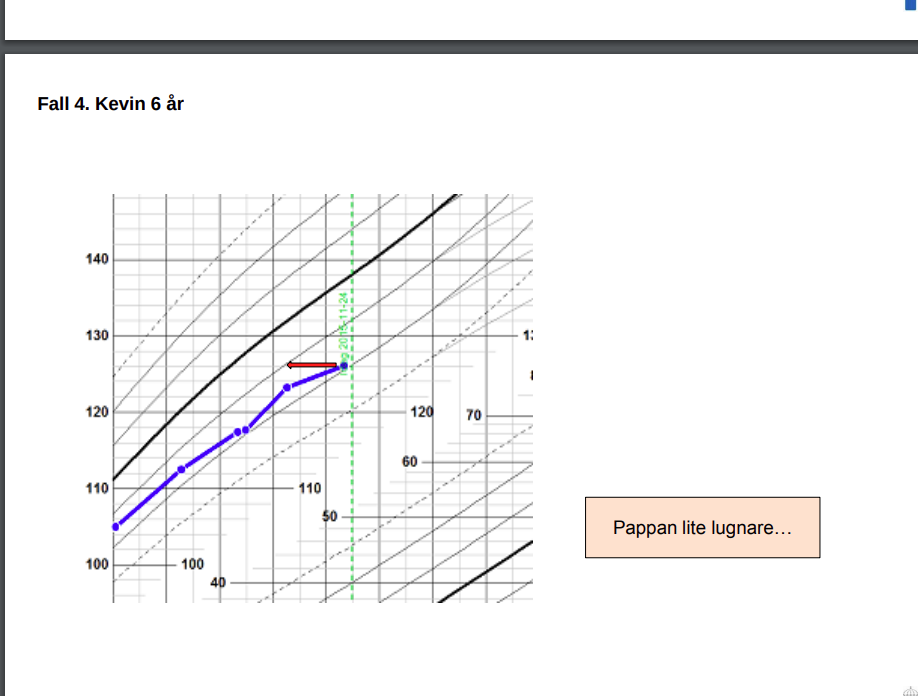
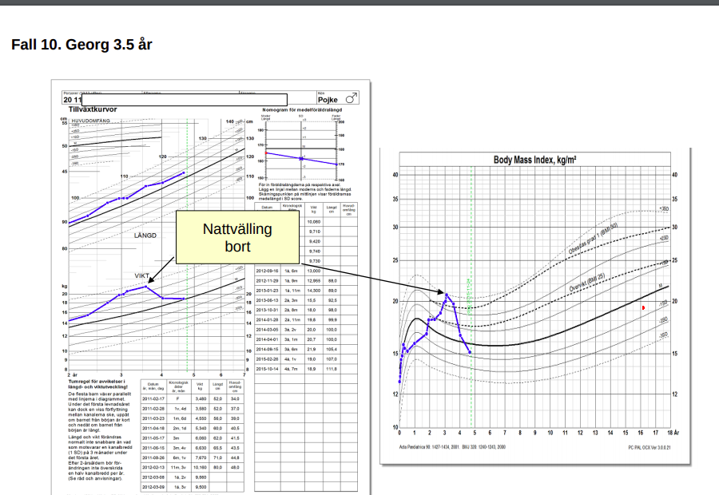

* Wihelm. 2mån, bajsar mkt gul grynigt, har avplanad viktkurva, sen följer längden
    * Man ska diffa matproblem, svält vid bröstet; infektion; hjärta
    * Mkt viktigt att tänka på hjärtsvikt ochj infektion
    * Utredning: genomgående matanamnes, hur mkt äter han, hur många blöjor, hereditet för detta, hur många para, vad har man introducerat i kosten
    * !! Prover BLODGAS, CRP BLODSTAUS
    * POX-test, pre och postductal
    * Dehydreringsbedömnign
    * Om fortsatt misstanek hjärtsvikt ska man kontakta barnkardiolog
        * Puls, AF, CRT
        * Dehydreringsbedömnign
        * Central och perifer cyanos
        * aUskultatuon
    * Efterfråga symptom talande för hjätrsivkt. 
    * Detta är ett uppföljnignsproblem
    * INLÄGGNINGSFALL: man ska göra uppfödning på inläggningen, vätskning. 
    * AMNINGS-VIKT på mottagningen, på BUM för att se hur mkt han får i sig.
    * När längden följer vikt sådär, att längden frotfarande är okej, den är inte altför avvikande att man kan avvakta litet. 
    * VI SKICKAR IN HONOM. detta är för mkt att droppa
    * Det är ingen amningspuckel. 

// nutrition välling fram till 2år
// barn som inte går upp i vikt ska matas var 3e timme ist för var 4e- vi har ett fall wilhelm ska matas var 3e timme.. 

WIlhelm var failure t thrive

* Fallande längdtillväxt under de första levnadsåren är oftast
    * sekundär till undernäring 
    * och psykosociala faktorer
    * Bakomliggande medicinsk orsak till kortvuxenhet ses 
        * hos 20 % av barn med längd < -2 SD och 
        * hos 50 % vid längd < -3 SD

Vad bör ingå i en tillväxtutredning?
    * Basutredning, notera att man tar IGF1 pp basutredning:
        * Blod-, njur- & leverstatus
        * Thyroideastatus (TSH, fritt T4)
        * !! IGF-1: notera att den inkluderar basutredning; att man ska ta denna. 2-7åå är detta relevant enl Sarah, GH brister bör man få under denna period. Efter detta är det PUBERTETSHORMONER
        * TGA (gluten-ak)
    * Överväg – beroende på barnets ålder & symptom:
        * Pubertetshormoner (LH, FSH, östrogen & testosteron): pubertas tard, och precocc
        * Kromosomodling (kromosomanalys). Turner?
        * F-calprotektin. IBD?
        * Skelettröntgen. Skelettålder?
        * MR hjärna. Hypofystumör?

Kevin 6åå Fall 4. Kevin, 6 år Kille med autismspektrumstörning, somatisk frisk.  Inga mediciner. Enligt bokningen har fadern kontaktat BUMM med  önskemål om ”omgående utredning avseende grav kortvuxenhet”. Storebrodern var 10 cm längre i samma ålder.
    * kanalföljare
        * Fullt välmående gosse. Status ua
        * !!! Växer på -1.8 SD. TH +0,2 SD; så han växer -2SD fr TH
        * Far 189 cm (+1,3 SD) och mor 162 cm (-1 SD)
        * 
        * !!! enl FL Utredning: Blod-, lever- och njurstatus ua; IGF-1 ua, liksom TGA och TSH/T4
        * Återbesök
            * Upprepad biokemisk kontroll vid 9 års ålder ua
        * 
        * 
        * Om man inte får napp på någon av dessa i basutredningen kan man ligga lite lågt. 
        * Låg tröskel på basprover. 
        * Om någon växer snabbt? → pubertetshormoner, har det kommit igång?
        * Korta flickor → Turner. 
        * F-calprotektin. IBD. Endokrinologerna brukar vilja veta. De tar det utan stark misstanke IBD. 
        * 2 årig inte vanligt. 12 åring mer vanligt. 
        * !!! ang GH och IGF1: 
            * Har man ingen GH brist om normalt IGF-1 så är det som att fylla på ett fullt glas med vatten. 
            * Så man behandlar IGF1 brist, efter utredning GH dugn
            * Om normalt IGF1 då behandlar man inte; som att fylla ett fullt glas. 
            * föreligger GH-brist: behandlar med GH hormon

Fall 5. Leif 4 år Gosse som gått på flera tillväxtkontroller på BVC. Bedömts ha haft en amningspuckel under spädbarnsåret. Fysiskt mycket aktiv. Klen aptit, kostråd via dietist har inte gjort någon skillnad. Pappan berättar att han själv var liten som barn och att han kom in i puberteten sent. Du undersöker Leif noga. Han har generellt något klen muskulatur, men ter sig i övrigt fullt frisk. Inga mediciner. Remitterad till BUMM för tillväxtutredning
    * 
    * 
    * Blod-, lever- och njurstatus ua
    * TGA och TSH/T4
    * IGF-1 lågt: iom att man har en tidig. 
    * • Oftast en relativ GH-brist. Total GH-brist ovanligt!
    * • Typfallet: Normal längd och vikt vid födelsen. Långsamt planande längd från 8 mån ålder, vikten ofta normal. Mekanism?
    * • Avviker (ofta) >2 SD från target height
    * • Normalt IGF-1 utesluter GH-brist
    * • Verifierad GH-brist: Killar > flickor. Varför?
    * Om verifierad brist kan GH-behandling med dagliga subcutana injektioner bli aktuellt - men allt färre barn erbjuds numera behandling
    * Kostnad?
    * 100-150 000/år
    
    * Observandum när längden går neråt innan vikten. Något endokrint? GH brist? Man ska direkt tänka  GH brist på denna då han faller ut efter 6 mån. Sedan faller han ut och sedan har han lite GH kvar som gör att han växer lite. 
    * Man gör en GH kurva. Man lägger in barnet med en PVK och så tar man GH varje halvtimme. 
    * sc GH injektioner

* Man ställer in sig på sin kurva inom 2åå, så då kan man variera med kanalernaa

* Fall 6. Dakshak 18 mån Pojke med föräldrar från Bangladesh. Remitterad till BUMM för tillväxtutredning. Föräldrarna anser, liksom du efter undersökning, att barnet förefaller vara fullt friskt. Noggrann anamnes ger heller inga hållpunkter för sjukdom. Pappan är 170,6 cm lång och modern 152,4 cm
    * 
    * 
    * Utrednings Prov inkl IGF-1! Dietistkontakt (om prover utfaller normala). Återbesök 6mån senare. 

* Fall 7. Fatima 10 år Flicka med allergisk astma sedan förskoleåldern. Daglig inhalationsbehandling med Flutide. Varit i kontakt med skolsköterskan p g a trötthet och koncentrationssvårigheter sedan några månader. Remitterad till BUMM p g a avplanad längdtillväxt. ”GHbrist?”
    * Provtagning: Basutredning som inkluderar lever, njur, blodsttus, TSH, T4/T3,
        * TPO är ej basutredning
    * 
    * Provsvar
        * • Blod-, lever- och njurstatus ua.
        * TSH 147
        * Fritt T4 0,02
        * Anti TPO 78
    * Om Hypthyreios
        * Förvärvad hypotyreos. Oftast autoimmun thyreoidit (Hashimoto)
        * Förekommer i alla åldrar, men ovanligt före skolåldern!
        * Tonårsflickor dominerar
        * Klen längdtillväxt, ibland enda symptomet. 
            * Även förstoppning, 
            * trötthet, 
            * viktuppgång, 
            * heshet
        * Högt TSH och lågt T4. Frikostig kontroll!
        * Levaxin -> Längd catch-up – men inte alltid fullständig
        * Andra autoimmuna sjukdomar?

* Man slutar ta IGF1 på basutredningen vid 7åå

* Fall 8. Sophie 6 år Välmående medicinfri flicka som enligt föräldrarna ”alltid varit liten”. Remitterad från skolsköterskan till BUMM för bedömning. Vid granskning av tidigare journaler ser du att en kollega träffat flickan då hon var drygt 3 år. I bedömningen står det: ”Liten tjej som bedöms vara somatiskt frisk. Tillväxtutredning ua. Modern också liten. Remiss till dietist, i övrigt exspektans. Brevsvar”
    * 
    * Turners syndrom
        * Endast flickor
        * Längd ofta 2 SD under TH
        * Något korta och lätta vid födelsen
        * Sen pubertet (utebliven puberte?)
        * Sterilitet
        * Stigmata förekommer; bred nacke, lågt hårfäste i nacken, ökat mamillavstånd, mm 
        * Kromosomanalys visar total eller partiell avsaknad av
        * ena X kromosomen,
        * alltså 45X istället för 46XX -> atrofi av ovarier
        * Utredning: 
            * Pubertetshormoner: FSH, LH, Östrogen, Testosteron
        * Behandling:
        * För att driva längden: Östrogen (pubertetsinduktion) och tillväxthormon
            * Finns ingen bot för Turner
            * MAn ger GH trots att ingen brist. 
        * 

* BMI grejer
* Definitioner
    * Övervikt: iso-BMI >25
    * Fetma, obesitas: iso-BMI >30
    * 
    * ISO-BMI: en korrigerad BMI för barn utifrån ålder och vikt, 

* Fall 9. Chantal 13 år Flicka med ADHD och känd övervikt sedan 8 års ålder. Mycket bestämd, hett temperament. Matglad. Enligt modern ”blir hon aldrig mätt”. Ogillar fysisk aktivitet. Just påbörjat behandling med Concerta. Remitterad till BUMM för utredning och behandling av övervikten. 
    * Skrivs in i barnmottagningens obesitasprogram
    * Föräldra- och patientutbildning
    * Årliga läkarkontroller ink provtagning (bl a blodfetter, insulin,glukos) och regelbunden kontakt med ssk (1-4 ggr/år)
    * Motiverande samtal
    * Dietist
    * Sjukgymnastik/träning
    * 
    * 
    * **Generellt**
        * Bakomliggande sjukdom ovanligt, ex Prader-Willi
        * Hereditet 40-70%
        * Överrepresentation av överviktiga & obesa barn i socialt utsatta områden
        * Övervikt och fetma
        * Markant viktökning vid 2-4 års ålder ger ofta kvarstående fetma i vuxenålder
        * Övervikt -> ökad längdtillväxt, dock ej längre slutlängd
        * Behandlingsprogram via BVC
        * !!! Obesa barn (iso-BMI >30) remitteras till BUMM från 4 års ålder 

* Fall 10. Georg 3.5 år Matglad pojke som sökt akut mitt i natten p g a stridor och skällande hosta. God effekt av inhalationsbehandling. Du ska skicka hem barnet, men kastar – som alltid - först ett öga på tillväxtkurvan och noterar att han ökat kraftigt i vikt det senaste året. 
    * 
    * Nattvälling, övermatas

Pubertetsutveckling
    * 
    * 
    * 

Pubertas tarda
    * Pubertas tarda
    * Definition:
    * Flickor: Ingen brösttillväxt > 13 åå
    * Pojkar: Testikelvolym < 4 ml > 14 åå
    * ORsak
        * Heriditet för sen pubertet – dominerar stort
        * Anorexia
        * Kronisk sjukdom
        * Hård träning
        * CNS-tumör (ex kraniofaryngiom)
        * Turners syndrom
    * Utredning
        * Gonadotropiner (bl a LH, FSH)
        * Könshormoner (östrogen, testosteron)
    * Behandling
        * Behandling:
        * Testosteron (im inj)
        * Östrogen (plåster)
    * Notera
        * !!! Flickor bröstknopp → utveckling → mens efter ca 2 år efter bröstknopp. 
        * Pojkar testikel → penis → målbrott → skäggväxt 
    * Gällande adenarche: Vanligt att barn söker för svettlukt i ung ålder och om det inte finns tecken till annat så kan man ge lugnande besked; 

* Fall 11. Mark 14½ år Kille 
    * från Kina, flyttat till Sverige med sin familj vid 3 års ålder. Barn 2 av 3. Lillebrodern (snart 13 år) har just växt om Mark. I skolläkarens långa remiss till BUMM står det bl a att Mark inte uppvisar några pubertetstecken och att han blir mobbad av klasskamraterna för att han är så liten. Han vägrar duscha efter skolgympan. Han har slutat med handboll för några månader sedan. Han vägrar initialt låta dig undersöka yttre genitalia, men efter muta från medföljande fadern konstaterar du: 
    * !! Testiklar 3 ml bilat. Genitalutveckling och pubesbehåring stadium 1 (enligt Tanner)
    * Utredning:
        * Testosteron 6
        * LH och FSH lågt
    * Behandling
        * Erbjuds testosteronbehandling med im inj
        * Testoviron 1gång/månad i 6 månader
    * Effekt
        * !! Testosteron 27. LH och FSH stiger tydligt vid
        * kontroll efter 6 månader
        * Tillväxten tar fart
    * 

* Pubertas precox, praecos
    * Definition
        * Flickor: Brösttillväxt < 8 åå
        * Pojkar: Testikelvolym > 4 ml < 9 åå
    * Orsaker
        * Hos pojkar ofta patologisk orsak -> utredning obligat
        * Hos flickor oftast idiopatiskt
        * Centralt utlöst: CNS-tumör, idiopatisk
        * Perifert utlöst: Binjurebarkstumör
    * Utredning
        * Central: Gonadotropiner (bl a LH, FSH) central
        * Perifer: Könshormoner (östrogen, testosteron) perifer
        * Skelettålder
        * MR hjärna

* Fall 12. Tanja 18 mån Remiss från BVC till BUMM. ”Patologisk tillväxt?” Flicka med intermittent stark svettlukt sedan någon månad tillbaka. Föräldrarna tog kontakt med BVC under förra veckan då man upptäckt könshår på genitalia. Man tycker även att brösten börjat tillväxa. 
    * Utredning
        *  LH och FSH stegrat
        * Stegrat känsligt östradiol
        * MRT hjärna ua
    * 
    * Tolkat som idiopatisk central pubertas praecox
    * Behandling: Tillväxten avplande efter behandling med GnRH-analoger

* CAH: Kongenital binjurebarkshyperplasi
    * Autosomalt recessivt ärftlig enzymdefekt i binjurebarkens syntes av kortisol och aldosteron. -> Kortisol- och aldosteronbrist samt en sekundärt ökad produktion av androgent verksamma steroider som resulterar i utveckling av manliga könskarakteristika hos flickor 
    * CAH ingår PKU-screeningen
    * 
    * Pojke eller flicka, gissa aldrig! 

* Fall 13. 1 h gammal flicka Den erfarne barnmorskan Siv kontaktar dig för bedömning av avvikande yttre genitalia på ett nyfött barn. Barnet född v 38+4 efter en normal graviditet. Okomplicerat PN, Apgar 8-9-10. FV 3,25 kg. I status noterar du att klitoris är tydligt förstorad, i övrigt inga avvikelser. '
    * Genetisk diagnostik ink könskromosomer
    * Na, kortisol, 17-OH progesteron, testosteron,östrogen, glukos, gonadotropiner (FSH, LH)
    * U-ljud äggstockar, ovarier
    * Samtliga analyser ink u-ljud ua
        * Opererad med vulvaplastik
    * !! DSD-teamet: Planerad uppföljning via DSD-teamet
    * 

### Allergi

om komjölk: elim.provok samt IgE-sero
övrig födoämnesallergi: IgE och prick