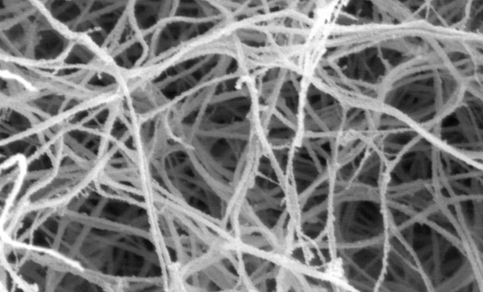

# Biokemi

## Vitaminer
### B12 – Kobalamin

#### Biokemisk användning
* Vattenlöslig. 
* Methionine synthesis: kofaktor methionine synthase (transfers methyl groups, as methylcovalamin), 
* methylmalonyl-CoA mutase

###### Används inom

* DNA syntes
* Fosfatidylkolin syntes, fosfolipid syntesen, viktig för myelin syntesen. 

###### Reserve pool

Stored in the liver. Several years of pool in the liver. 

#### Kobalaminbrist
Förekommer ett antal aspekter som man kan beakta:

##### Benmärgsrelaterat
* Makrocytiskt
* Megaloblastisk anemi
* Hypersegmenterade PMNs (polymorfonukleära celler); detta är ett av de mest sensitiva sätt att identifiera brist på B12.
* Parestesi

##### Myelinrelaterat
1. Kobalamin brist $\rarr$ S-adenosyl methionin brist $\rarr$ Metyl malonat brist

1. SAM brist resutlerar abnormalt metylerade fosfolipider (e.g. fosfatidyl kolin) 

2. Alternativt att B12 involverat i mitokondriell kofator som konverterar L-metyl malonyl till succinyl COA. 

3. 1. B12 brist  $\rarr$ ökad L-metyl malonyl COA $\rarr$ D-metyl malonyl COA $\rarr$      hydrolyseras t MMA -> defekt fosfoipider

4. Leder t **Centrala myelin defekter**

5. 1. myelin konstitueras av en massa fosfolipider, varpå B12 bristen slår hårt mot      CNS. 

* Subakut kombinerad degeneration
* Dorsal column
* Lateral corticospinal tracts (Pyramidbanorna?)
* Cerebellar tracts

## Koagulation

### Allmänt

***Aktivering av fibrinolyssystemet***

* Lokal aktivering
  * hemangiom
  * hematuri
* Generell
  * Kirurgi
  * obstetriska komplikationer

***Fysiologiskt***

|  |  |  |
| ------------------------------------------------------------ | ------------------------------------------------------------ | ------------------------------------------------------------ |
|  |                                                              |                                                              |

#### Fibrinolytiska systemet

***Enzym som deltar i fibrinolysen***

* **Plasmin**: 
  * bryter ned korslänkat fibrinogen till fibrinnedbrytningsprodukter
* **Nedbrytningsprodukter**
  * **D-dimer**: produkt efter plasmin effekt. 

|  |      |      |
| ------------------------------------------------------------ | ---- | ---- |
|                                                              |      |      |

***Sekundär hemostas involverar*** 

* konvertering av fibrinogen till fibrin.
* trombin (faktor 2)  konverterar fibrinogen till fibrin
* 

* Fibrinnätverket bidrar till att man bygger en koagelplugg
* Fibrin bryts ned av plasmin
  * Inaktivt plasminogen konverteras till plasmin av trombin

***Alla celler har enzymer som aktiverar koag-system eller fibrinolyssystem***

* Celler som skadas kan släppa ut enzym som stimmar koag-system eller fibrinolys
  * Koag-system aktivering: trombinbildning (faktor 2a). 

***Patologiska processer***

* ***Ökad fibrinolysaktivtet***
  * En obalans, där det sker mer fibrinolys än vad homeostasen tillåter
  * Orsakas av flertalet faktorer
    * Trauma
    * Operation
    * grundsjukdomar

#### Trombin aka faktor-II

***Funktion***

* central roll i koagulationskaskadne
* Protrombin (inaktivt faktor-II): produceras i levern
* Faktor X, (10), konverar protrombin till trombin
* ***Serinproteas***: 
  * lösligt fibrinogen -> firillärt fibrin
  * alltså får man en precipitationsreaktion, med att fibrinogen -> fibrin som skapar en mesh struktur

#### Antitrombin + heparin

* Antitrombin binder till trombin och hindrar dess funktion
* Alltså hindrar konvertering av fibrinogen till fibrin

***Klinisk betydelse***

* Ger heparin under lungemboli
* detta leder till att man ökar antitrombin aktiviteten
* minskad trombin aktivitet

### Analys

#### PK-INR

* Protrombin-komplex international normalized ratio

***Mekanism***

* renat humant TF (tissue factor)
* adderas till trombocyt-fatting plasma
* !! mäter tiden tills att man får ett koagel

|  |      |      |
| ------------------------------------------------------------ | ---- | ---- |
|                                                              |      |      |

#### APTT

* Activated partial thromboplastin time
* Renat plasma (platelet-poor plasma)
* adderar surface activators
  * Fosfolipider
  * kalcium

|  |      |      |
| ------------------------------------------------------------ | ---- | ---- |
|                                                              |      |      |

* * *

  

### Tromboser

***Allmänt***

* Tromber är alltid patologiska

***Patofys***

* Patologisk proppbildning
* Centrala komponenter i trombos
  * Endotel
  * trombocyter
  * koagulationskaskaden
  * fibrinolys

#### Arteriellt vs venöst

***Strukturella skillnader***

* **Arteriella koagel:**
  * sker på aterosklerotiska plack
  * med aktiv inflammation
  * rika i 
    * trombocyter
* **Venösa koagel** (tromber)? 

***Artärtromber***

* Associerat med endotelcellsskada eller aktivering
* Åderförkalkningsplaque
* inflammation
* arterit
* klaffsjukdom
* endkardit
* aneurysm
* hjärtarrytmier
* förmaksflimmer
* hypertoni
* ***Patofysiologiska skillnader***
  * Primär hemostas mer involverat i arteriella tromber vs ventromber
  * ! Noterar att heparin, som ökar antitrombin aktivitet, som i sin tur minskar fibrinogen konvertering, är mindre effektfull jfrt med ventromber.
  * Dock att man kan ge trombolytika i form av plasmin aktivtatorer, (actilyse), om tiden tillåter vid ischemisk stroke. Alltså går man på sekundär hemostas. 

***Ventromber***

* VTE (venös-trombembolism)
* ***Djupa vener i benet***
  * oftast associerat med DVT, (deep-vein thrombosis) i benen
  * associeras med 
    * immobilisering (turbulens, förlångsammat flöde enl virchows)

!! "Because the relative proportion of cells and fibrin depends on hemodynamic factors, the proportions differ in arterial and venous thrombi.[1](https://www.ahajournals.org/doi/full/10.1161/hq0701.093520#R1)[2](https://www.ahajournals.org/doi/full/10.1161/hq0701.093520#R2) Arterial thrombi form under conditions of high flow and are composed mainly of platelet aggregates bound together by thin fibrin strands.[3](https://www.ahajournals.org/doi/full/10.1161/hq0701.093520#R3)[4](https://www.ahajournals.org/doi/full/10.1161/hq0701.093520#R4)[5](https://www.ahajournals.org/doi/full/10.1161/hq0701.093520#R5)"

https://www.ahajournals.org/doi/full/10.1161/hq0701.093520

### Emboliseringar

***Arteriell embolisering***

* 80-90% uppkommer i hjärtats kammare o förmak
  * hjärtinfarkt 
  * carotisstenoser: oklar evidensgrad här 
  * 75% till nedre extremiteter
  * 10% CNS
  * tarmar, njurar mjälte

***Andra typer av embolier***

* Atheromatlös emboli
  * små trombi fr ulcererande plque
  * TIA: transitorsik ischemiska attack
* Fettembolism fr benmärg
  * omfattande frakturer
  * tex multitrauma vid bilolyckor
* Luftembolism
  * 100mL ger symptom
  * 300mL kan vara fatalt
  * dykarsjuka
