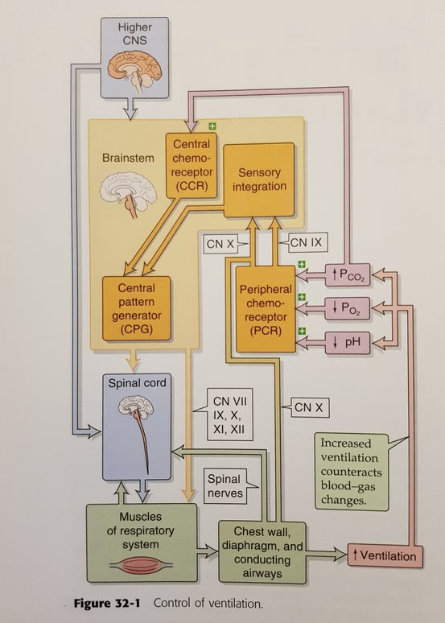

## Ventilation

### Reglering

### Dyspne

***Definitionsmässigt kännetecken mässigt***

* DYSPNEA is a sensation, a symptom, a complaint on the part of the patient of not being able to breathe enough or having to breathe too much, or, simply, an abnormal, uncomfortable feeling during breathing
  * doi:10.1001/jama.1982.03330160083033

***Fysiologiskt***

* **Drivet av mismatch PO2, PCO2 och pH**
* **Under arbete** 
  * ökad syrgas konsumtion. Syrgasbehov kan öka 10-faldigt (one order of magnitude)
  * måste komma ngnstans ifrån, varpå det är blodet. 
  * leder till att 

***Patofysiologi***

* Vid kroniskt förhöjd pCO2-nivå har olika kompensationsmekanismer trätt i kraft: pH normaliseras, och det finns ingen upplevelse av andnöd. Detta sker tex vid kroniskt obstruktiv lungsjukdom (KOL) eller neuromuskulära sjukdomar (myasthenia gravis). 
* **låga po2 nivåer driver andning istället**: Hos patienter med dessa sjukdomar regleras andningen i stället av låga pO2-nivåer. 
* !! **Kolsyrenarkos**: Hypoxi stimulerar andningen, och akut tillförsel av syrgas kan därför minska andningsdriven och ge kolsyrenarkos
  * exogen tillförsel syrgas
  * maskerar hypoxi
  * leder till att andningsdrive försvinner
  * Därför essentiellt med NIV. 

## Aktivitet

### Fysiologisk respons till aktivitet

doi:10.1001/jama.1982.03330160083033

#### Upon aktivitet

* **direkt ökat syrgasbehov**, för att upprätthålla syrgas beroende oxidativ respiration. 
* **Blodflöde ökar:** måste därför direkt **öka**, för att tillhandahålla detta syre
* **Öka ventilation**: Tillsammans med ökad ventilation: utan ventilation, men ökad CO2, så kommer man inte få det efterfrågade syrgaset i utbyte. 
  * Ventilation increases in proportion to the increased pulmonary blood flow immediately at the start of exer¬ cise. This allows gas exchange be¬ tween the pulmonary capillaries and the alveoli to increase appropriately to reoxygenate the blood and to elimi¬ nate the excess C02.
* **Rekrytera mer lunga**: In response to the increase in right ventricular output, the pulmonary circulation dilates primarily by recruiting unperfused or underperfused lung units.
  * Relatively weak muscled right ventricle could not readily pump the increased venous return through the lungs to the left atrium to effect an increased left ventricular output, without the recruitment and availability of more lung tissue and vasculature. 

* Stroke volume increases to its maximum as soon as exercise begins, while further in¬ creases in cardiac output occur by increasing heart rate as the 02 requirement is increased

#### Ökade syrgasbehovet

* Since 25% of the 02 is ordinarily removed from the arterial blood by the muscle to support resting muscle metabo¬ lism, 
  * it is clear that the increased 02 requirement of exercise could be met only if blood flow to the active mus¬ cles was increased

#### Anaerobic threshold

* When the oxygen requirement to the exercising muscle cannot be totally supported by oxygen delivery, the aerobic oxidative mecha¬ nism must be supplemented by anaer¬ obic mechanisms to the extent to which this is possible. 
* This is accom¬ plished by the conversion of pyruvate to lactate in the cells (Fig 4). 
* The increase in lactic acid is immediately buffered in the cell by bicarbonate ion (HCO,) with the release of C02 (Fig 4). 
* The work level at which anaerobic oxidation becomes evident is usually distinct and at a consistent Vo2 for a given work task. 
* Therefore, this work-rate threshold, above which the anaerobic mechanisms supplement the aerobic, 
  * !! has been termed the **"anaerobic threshold."**
* **thresh o fit subject:** The fit subject does not increase his blood lactate level until his working oxygen consumption is quite high (>10 times resting Vo2). 
* **thresh o hjärtsvikt**: 
  * In contrast, sedentary persons start to increase their lactate at work rates that gener¬ ally just exceed the Vo2 required for ordinary walking (approximately 4 times rest). 
  * On the other hand, patients with New York Heart Asso¬ ciation class II to III heart disease increase their lactate levels with minimal activity (Vo2 <2 times resting)

#### Ökade ventilatioriska drive

* While the production of lactate benefits the patient by allowing him to walk limited distances at work levels above which the cardiovascular system is capable of supplying the entire oxygen need, it has disturbing effects on breathing in two ways: (1) the added amount of C02 produced from the buffering of lactic acid by bicarbonate adds an additional C02 load to the respiratory system that must be eliminated to prevent arteri¬ al Pco2 from rising, and (2) the increased hydrogen ion concentration caused by the reduction of blood bicarbonate stimulates the respirato¬ ry control mechanism (carotid bodies) to cause a further ventilatory in¬ crease, thereby lowering arterial Pco2 and providing respiratory compensa¬ tion for the metabolic acidosis.

### Syrgaskonsumtion

**Allmänt**

* **Benämning, VO2:** the oxygen con¬ sumption (Vo2)
* **Enhet**: $liter/min$

